# Створення чат-асистента з AI

Пам'ятаєте, як у "Зоряному шляху" команда корабля невимушено спілкувалася з комп'ютером, задаючи складні питання і отримуючи вдумливі відповіді? Те, що здавалося чистою науковою фантастикою у 1960-х, тепер можна створити за допомогою веб-технологій, які ви вже знаєте.

У цьому уроці ми створимо чат-асистента з AI, використовуючи HTML, CSS, JavaScript і трохи інтеграції з бекендом. Ви дізнаєтеся, як ті ж навички, які ви вже освоїли, можуть бути використані для підключення до потужних AI-сервісів, здатних розуміти контекст і генерувати змістовні відповіді.

Думайте про AI як про доступ до величезної бібліотеки, яка не тільки знаходить інформацію, але й синтезує її у зрозумілі відповіді, адаптовані до ваших конкретних питань. Замість того, щоб шукати серед тисяч сторінок, ви отримуєте прямі, контекстуальні відповіді.

Інтеграція відбувається через знайомі веб-технології, які працюють разом. HTML створює інтерфейс чату, CSS відповідає за візуальний дизайн, JavaScript керує взаємодією з користувачем, а бекенд API з'єднує все це з AI-сервісами. Це схоже на те, як різні секції оркестру працюють разом, щоб створити симфонію.

Ми фактично будуємо міст між природним людським спілкуванням і машинною обробкою. Ви навчитеся як технічній реалізації інтеграції AI-сервісів, так і шаблонам дизайну, які роблять взаємодію інтуїтивною.

До кінця цього уроку інтеграція AI буде здаватися менш загадковим процесом і більше схожою на ще один API, з яким ви можете працювати. Ви зрозумієте основні шаблони, які живлять такі додатки, як ChatGPT і Claude, використовуючи ті ж принципи веб-розробки, які ви вже освоїли.

## ⚡ Що можна зробити за наступні 5 хвилин

**Швидкий старт для зайнятих розробників**

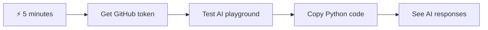

- **1 хвилина**: Відвідайте [GitHub Models Playground](https://github.com/marketplace/models/azure-openai/gpt-4o-mini/playground) і створіть персональний токен доступу
- **2 хвилина**: Тестуйте взаємодію з AI прямо в інтерфейсі Playground
- **3 хвилина**: Натисніть вкладку "Code" і скопіюйте фрагмент коду на Python
- **4 хвилина**: Запустіть код локально з вашим токеном: `GITHUB_TOKEN=your_token python test.py`
- **5 хвилина**: Спостерігайте, як ваш перший AI-відповідь генерується з вашого власного коду

**Швидкий тестовий код**:
```python
import os
from openai import OpenAI

client = OpenAI(
    base_url="https://models.github.ai/inference",
    api_key="your_token_here"
)

response = client.chat.completions.create(
    messages=[{"role": "user", "content": "Hello AI!"}],
    model="openai/gpt-4o-mini"
)

print(response.choices[0].message.content)
```

**Чому це важливо**: За 5 хвилин ви відчуєте магію програмної взаємодії з AI. Це фундаментальний будівельний блок, який живить кожен AI-додаток, яким ви користуєтеся.

Ось як виглядатиме ваш готовий проєкт:

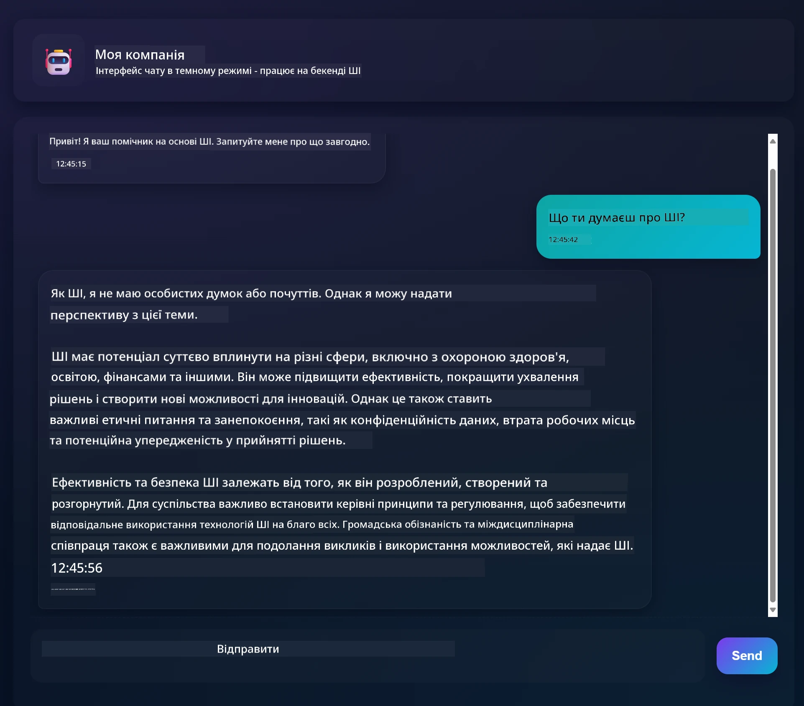

## 🗺️ Ваш навчальний шлях через розробку AI-додатків

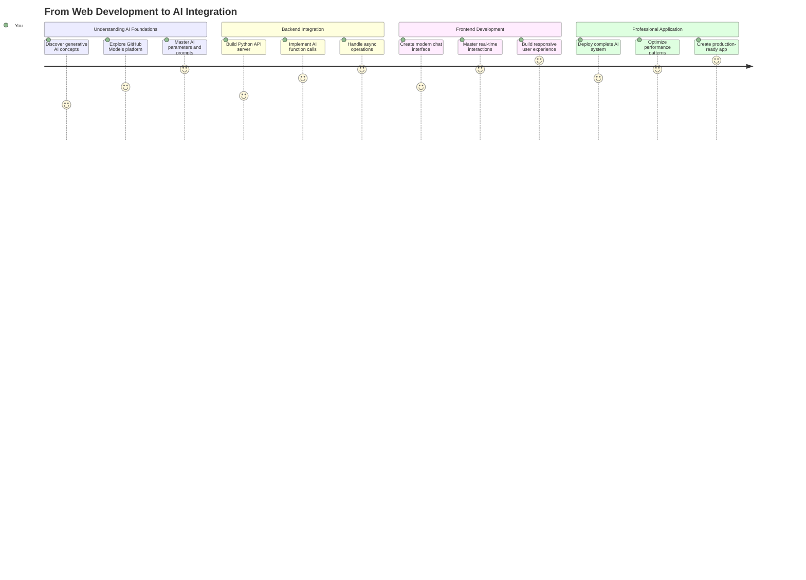

**Мета вашого навчального шляху**: До кінця цього уроку ви створите повноцінний додаток з підтримкою AI, використовуючи ті ж технології та шаблони, які живлять сучасних AI-асистентів, таких як ChatGPT, Claude і Google Bard.

## Розуміння AI: від загадки до майстерності

Перш ніж зануритися в код, давайте зрозуміємо, з чим ми працюємо. Якщо ви вже використовували API, то знаєте основний принцип: відправити запит, отримати відповідь.

API AI працюють за схожою структурою, але замість отримання заздалегідь збережених даних з бази даних вони генерують нові відповіді на основі шаблонів, вивчених з величезних обсягів тексту. Думайте про це як про різницю між каталогом бібліотеки і знаючим бібліотекарем, який може синтезувати інформацію з кількох джерел.

### Що таке "Генеративний AI" насправді?

Згадайте, як Розетський камінь дозволив ученим зрозуміти єгипетські ієрогліфи, знаходячи шаблони між відомими і невідомими мовами. AI-моделі працюють схожим чином – вони знаходять шаблони у величезних обсягах тексту, щоб зрозуміти, як працює мова, а потім використовують ці шаблони для генерації відповідних відповідей на нові питання.

**Дозвольте пояснити це простим порівнянням:**
- **Традиційна база даних**: Як запит на свідоцтво про народження – ви отримуєте той самий документ кожного разу
- **Пошукова система**: Як запит до бібліотекаря знайти книги про котів – вони показують вам, що доступно
- **Генеративний AI**: Як запит до знаючого друга про котів – вони розповідають вам цікаві речі своїми словами, адаптовані до того, що ви хочете знати

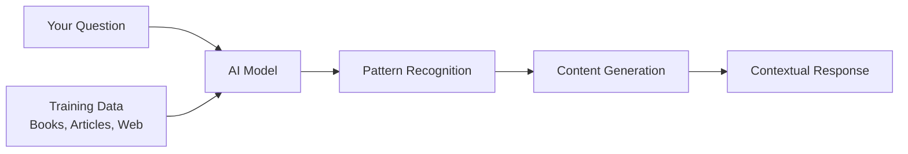

### Як AI-моделі навчаються (спрощена версія)

AI-моделі навчаються через ознайомлення з величезними наборами даних, що містять текст з книг, статей і розмов. У процесі вони визначають шаблони в:
- Як думки структуровані у письмовій комунікації
- Які слова зазвичай з'являються разом
- Як зазвичай протікають розмови
- Контекстуальні відмінності між формальною і неформальною комунікацією

**Це схоже на те, як археологи розшифровують стародавні мови**: вони аналізують тисячі прикладів, щоб зрозуміти граматику, словниковий запас і культурний контекст, зрештою стаючи здатними інтерпретувати нові тексти, використовуючи ці вивчені шаблони.

### Чому GitHub Models?

Ми використовуємо GitHub Models з досить практичної причини – це дає нам доступ до AI корпоративного рівня без необхідності налаштовувати власну AI-інфраструктуру (що, повірте, ви зараз не захочете робити!). Думайте про це як про використання API погоди замість спроби передбачити погоду самостійно, встановлюючи метеостанції всюди.

Це, по суті, "AI як послуга", і найкраща частина? Це безкоштовно для початку, тому ви можете експериментувати, не турбуючись про величезні рахунки.

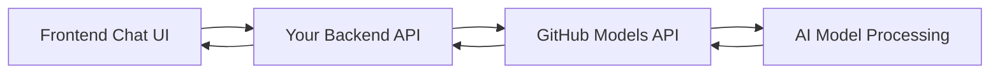

Ми будемо використовувати GitHub Models для нашої бекенд-інтеграції, яка надає доступ до професійних AI-можливостей через зручний для розробників інтерфейс. [GitHub Models Playground](https://github.com/marketplace/models/azure-openai/gpt-4o-mini/playground) слугує тестовим середовищем, де ви можете експериментувати з різними AI-моделями і зрозуміти їх можливості перед тим, як реалізовувати їх у коді.

## 🧠 Екосистема розробки AI-додатків

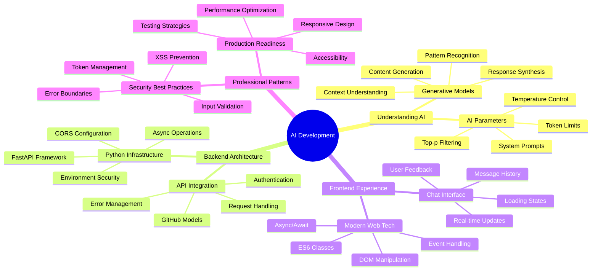

**Основний принцип**: Розробка AI-додатків поєднує традиційні навички веб-розробки з інтеграцією AI-сервісів, створюючи інтелектуальні додатки, які здаються природними і чуйними для користувачів.

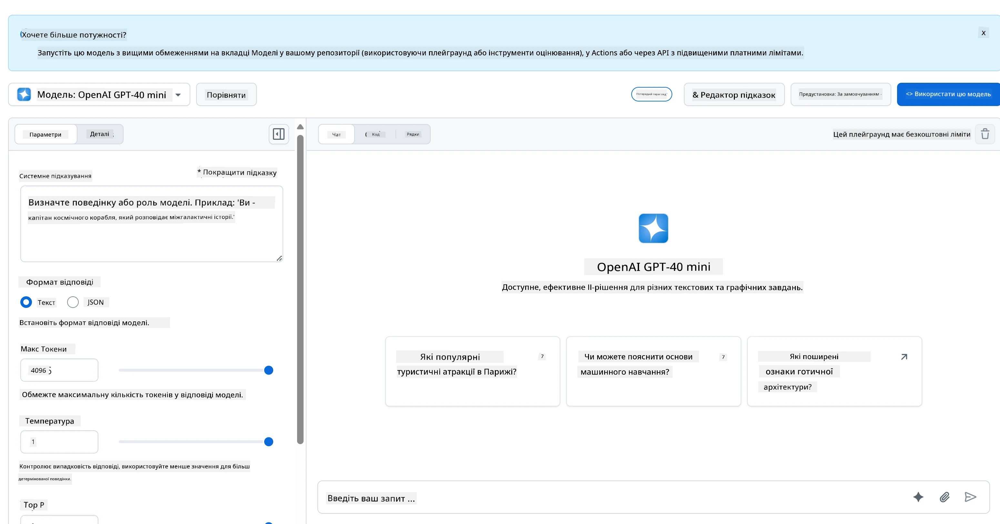

**Ось що робить Playground таким корисним:**
- **Спробуйте** різні AI-моделі, такі як GPT-4o-mini, Claude та інші (усі безкоштовні!)
- **Тестуйте** свої ідеї і запити перед написанням будь-якого коду
- **Отримайте** готові фрагменти коду у вашій улюбленій мові програмування
- **Налаштуйте** параметри, такі як рівень творчості і довжина відповіді, щоб побачити, як вони впливають на результат

Після того, як ви трохи пограєте, просто натисніть вкладку "Code" і виберіть вашу мову програмування, щоб отримати код для реалізації.

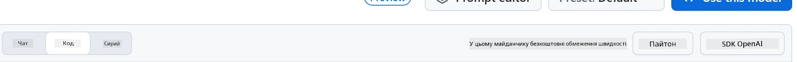

## Налаштування бекенд-інтеграції на Python

Тепер давайте реалізуємо інтеграцію AI за допомогою Python. Python чудово підходить для AI-додатків завдяки простому синтаксису і потужним бібліотекам. Ми почнемо з коду з Playground GitHub Models, а потім переробимо його у багаторазову функцію, готову до використання у виробництві.

### Розуміння базової реалізації

Коли ви отримуєте код на Python з Playground, він виглядає приблизно так. Не хвилюйтеся, якщо спочатку це здається складним – давайте розберемо його по частинах:

```python
"""Run this model in Python

> pip install openai
"""
import os
from openai import OpenAI

# To authenticate with the model you will need to generate a personal access token (PAT) in your GitHub settings. 
# Create your PAT token by following instructions here: https://docs.github.com/en/authentication/keeping-your-account-and-data-secure/managing-your-personal-access-tokens
client = OpenAI(
    base_url="https://models.github.ai/inference",
    api_key=os.environ["GITHUB_TOKEN"],
)

response = client.chat.completions.create(
    messages=[
        {
            "role": "system",
            "content": "",
        },
        {
            "role": "user",
            "content": "What is the capital of France?",
        }
    ],
    model="openai/gpt-4o-mini",
    temperature=1,
    max_tokens=4096,
    top_p=1
)

print(response.choices[0].message.content)
```

**Ось що відбувається у цьому коді:**
- **Ми імпортуємо** необхідні інструменти: `os` для читання змінних середовища і `OpenAI` для взаємодії з AI
- **Ми налаштовуємо** клієнт OpenAI, щоб він вказував на сервери AI GitHub, а не безпосередньо на OpenAI
- **Ми аутентифікуємося** за допомогою спеціального токена GitHub (про це трохи пізніше!)
- **Ми структуруємо** нашу розмову з різними "ролями" – це як встановлення сцени для вистави
- **Ми відправляємо** наш запит до AI з деякими параметрами налаштування
- **Ми витягуємо** фактичний текст відповіді з усіх даних, які повертаються

### Розуміння ролей повідомлень: структура AI-розмови

AI-розмови використовують специфічну структуру з різними "ролями", які виконують окремі функції:

```python
messages=[
    {
        "role": "system",
        "content": "You are a helpful assistant who explains things simply."
    },
    {
        "role": "user", 
        "content": "What is machine learning?"
    }
]
```

**Думайте про це як про режисуру вистави:**
- **Роль системи**: Як сценічні вказівки для актора – це говорить AI, як поводитися, яку особистість мати і як відповідати
- **Роль користувача**: Фактичне питання або повідомлення від людини, яка використовує ваш додаток
- **Роль асистента**: Відповідь AI (ви не відправляєте це, але воно з'являється в історії розмови)

**Аналогія з реальним світом**: Уявіть, що ви представляєте друга комусь на вечірці:
- **Повідомлення системи**: "Це моя подруга Сара, вона лікар, яка чудово пояснює медичні концепції простими словами"
- **Повідомлення користувача**: "Чи можете ви пояснити, як працюють вакцини?"
- **Відповідь асистента**: Сара відповідає як дружній лікар, а не як юрист чи шеф-кухар

### Розуміння параметрів AI: налаштування поведінки відповіді

Числові параметри у викликах API AI контролюють, як модель генерує відповіді. Ці налаштування дозволяють вам налаштувати поведінку AI для різних випадків використання:

#### Temperature (0.0 до 2.0): Діал творчості

**Що він робить**: Контролює, наскільки творчими або передбачуваними будуть відповіді AI.

**Думайте про це як про рівень імпровізації джазового музиканта:**
- **Temperature = 0.1**: Грає ту саму мелодію кожного разу (дуже передбачувано)
- **Temperature = 0.7**: Додає деякі стильні варіації, залишаючись впізнаваним (збалансована творчість)
- **Temperature = 1.5**: Повна експериментальна імпровізація з несподіваними поворотами (дуже непередбачувано)

```python
# Very predictable responses (good for factual questions)
response = client.chat.completions.create(
    messages=[{"role": "user", "content": "What is 2+2?"}],
    temperature=0.1  # Will almost always say "4"
)

# Creative responses (good for brainstorming)
response = client.chat.completions.create(
    messages=[{"role": "user", "content": "Write a creative story opening"}],
    temperature=1.2  # Will generate unique, unexpected stories
)
```

#### Max Tokens (1 до 4096+): Контролер довжини відповіді

**Що він робить**: Встановлює обмеження на те, наскільки довгою може бути відповідь AI.

**Думайте про токени як приблизно еквівалентні словам** (приблизно 1 токен = 0.75 слова англійською):
- **max_tokens=50**: Коротко і ясно (як текстове повідомлення)
- **max_tokens=500**: Гарний абзац або два
- **max_tokens=2000**: Детальне пояснення з прикладами

```python
# Short, concise answers
response = client.chat.completions.create(
    messages=[{"role": "user", "content": "Explain JavaScript"}],
    max_tokens=100  # Forces a brief explanation
)

# Detailed, comprehensive answers  
response = client.chat.completions.create(
    messages=[{"role": "user", "content": "Explain JavaScript"}],
    max_tokens=1500  # Allows for detailed explanations with examples
)
```

#### Top_p (0.0 до 1.0): Параметр фокусування

**Що він робить**: Контролює, наскільки AI зосереджується на найбільш ймовірних відповідях.

**Уявіть, що AI має величезний словниковий запас, ранжований за ймовірністю кожного слова:**
- **top_p=0.1**: Розглядає лише топ-10% найбільш ймовірних слів (дуже зосереджено)
- **top_p=0.9**: Розглядає 90% можливих слів (більш творчо)
- **top_p=1.0**: Розглядає все (максимальна різноманітність)

**Наприклад**: Якщо ви запитаєте "Небо зазвичай..."
- **Низький top_p**: Майже напевно скаже "синє"
- **Високий top_p**: Може сказати "синє", "хмарне", "широке", "змінне", "красиве" тощо

### Об'єднання всього: комбінації параметрів для різних випадків використання

```python
# For factual, consistent answers (like a documentation bot)
factual_params = {
    "temperature": 0.2,
    "max_tokens": 300,
    "top_p": 0.3
}

# For creative writing assistance
creative_params = {
    "temperature": 1.1,
    "max_tokens": 1000,
    "top_p": 0.9
}

# For conversational, helpful responses (balanced)
conversational_params = {
    "temperature": 0.7,
    "max_tokens": 500,
    "top_p": 0.8
}
```

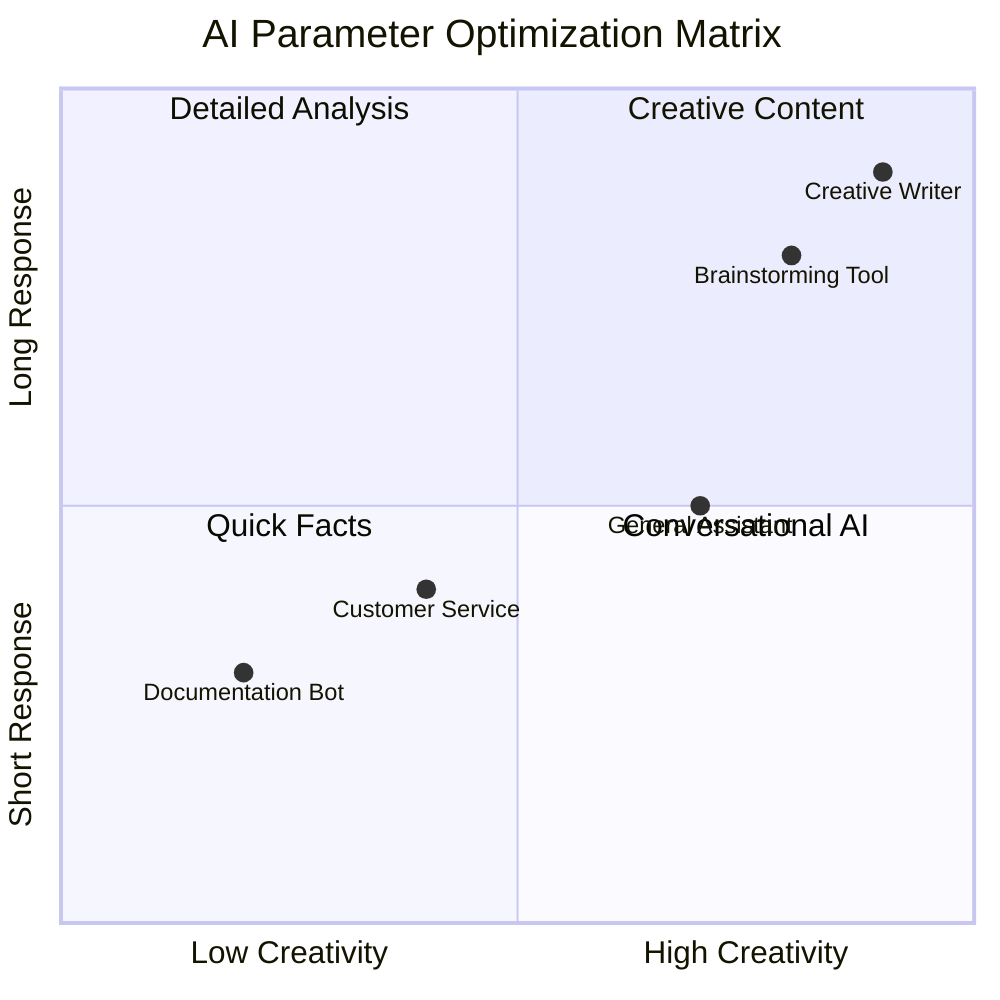

**Розуміння, чому ці параметри важливі**: Різні додатки потребують різних типів відповідей. Бот служби підтримки клієнтів має бути послідовним і фактичним (низька температура), тоді як асистент для творчого письма має бути уявним і різноманітним (висока температура). Розуміння цих параметрів дає вам контроль над особистістю і стилем відповіді AI.
```

**Here's what's happening in this code:**
- **We import** the tools we need: `os` for reading environment variables and `OpenAI` for talking to the AI
- **We set up** the OpenAI client to point to GitHub's AI servers instead of OpenAI directly
- **We authenticate** using a special GitHub token (more on that in a minute!)
- **We structure** our conversation with different "roles" – think of it like setting the scene for a play
- **We send** our request to the AI with some fine-tuning parameters
- **We extract** the actual response text from all the data that comes back

> 🔐 **Security Note**: Never hardcode API keys in your source code! Always use environment variables to store sensitive credentials like your `GITHUB_TOKEN`.

### Creating a Reusable AI Function

Let's refactor this code into a clean, reusable function that we can easily integrate into our web application:

```python
import asyncio
from openai import AsyncOpenAI

# Use AsyncOpenAI for better performance
client = AsyncOpenAI(
    base_url="https://models.github.ai/inference",
    api_key=os.environ["GITHUB_TOKEN"],
)

async def call_llm_async(prompt: str, system_message: str = "You are a helpful assistant."):
    """
    Sends a prompt to the AI model asynchronously and returns the response.
    
    Args:
        prompt: The user's question or message
        system_message: Instructions that define the AI's behavior and personality
    
    Returns:
        str: The AI's response to the prompt
    """
    try:
        response = await client.chat.completions.create(
            messages=[
                {
                    "role": "system",
                    "content": system_message,
                },
                {
                    "role": "user",
                    "content": prompt,
                }
            ],
            model="openai/gpt-4o-mini",
            temperature=1,
            max_tokens=4096,
            top_p=1
        )
        return response.choices[0].message.content
    except Exception as e:
        logger.error(f"AI API error: {str(e)}")
        return "I'm sorry, I'm having trouble processing your request right now."

# Backward compatibility function for synchronous calls
def call_llm(prompt: str, system_message: str = "You are a helpful assistant."):
    """Synchronous wrapper for async AI calls."""
    return asyncio.run(call_llm_async(prompt, system_message))
```

**Розуміння цієї покращеної функції:**
- **Приймає** два параметри: запит користувача і необов'язкове системне повідомлення
- **Надає** стандартне системне повідомлення для загальної поведінки асистента
- **Використовує** правильні підказки типів Python для кращої документації коду
- **Включає** детальний docstring, що пояснює мету і параметри функції
- **Повертає** лише зміст відповіді, що робить її легкою для використання у нашому веб-API
- **Підтримує** ті ж параметри моделі для послідовної поведінки AI

### Магія системних підказок: програмування особистості AI

Якщо параметри контролюють, як AI думає, то системні підказки контролюють, ким AI себе вважає. Це, чесно кажучи, одна з найцікавіших частин роботи з AI – ви фактично надаєте AI повну особистість, рівень експертизи і стиль комунікації.

**Думайте про системні підказки як про кастинг різних акторів для різних ролей**: Замість того, щоб мати одного загального асистента, ви можете створити спеціалізованих експертів для різних ситуацій. Потрібен терплячий вчитель? Творчий партнер для мозкового штурму? Діловий радник без
**2. Форматування Виводу**: Вкажіть AI, як структурувати відповіді  
```python
system_prompt = """
You are a technical mentor. Always structure your responses as:
1. Quick Answer (1-2 sentences)
2. Detailed Explanation 
3. Code Example
4. Common Pitfalls to Avoid
5. Next Steps for Learning
"""
```
  
**3. Налаштування Обмежень**: Визначте, чого AI НЕ має робити  
```python
system_prompt = """
You are a coding tutor focused on teaching best practices. Never write complete 
solutions for the user - instead, guide them with hints and questions so they 
learn by doing. Always explain the 'why' behind coding decisions.
"""
```
  

#### Чому це важливо для вашого чат-асистента  

Розуміння системних підказок дає вам неймовірну можливість створювати спеціалізованих AI-асистентів:  
- **Бот для обслуговування клієнтів**: корисний, терплячий, обізнаний у політиках  
- **Навчальний репетитор**: заохочує, пояснює крок за кроком, перевіряє розуміння  
- **Творчий партнер**: уявний, розвиває ідеї, запитує "а що, якщо?"  
- **Технічний експерт**: точний, детальний, обережний щодо безпеки  

**Головна ідея**: Ви не просто викликаєте API AI – ви створюєте персоналізовану AI-особистість, яка відповідає вашим конкретним потребам. Це те, що робить сучасні AI-додатки індивідуальними та корисними, а не загальними.  

### 🎯 Педагогічна перевірка: Програмування AI-особистостей  

**Зупиніться і подумайте**: Ви щойно дізналися, як програмувати AI-особистості через системні підказки. Це фундаментальна навичка у сучасній розробці AI-додатків.  

**Швидка самооцінка**:  
- Чи можете ви пояснити, чим системні підказки відрізняються від звичайних повідомлень користувача?  
- У чому різниця між параметрами temperature і top_p?  
- Як би ви створили системну підказку для конкретного випадку використання (наприклад, репетитор з програмування)?  

**Зв'язок із реальним світом**: Техніки системних підказок, які ви вивчили, використовуються у кожному великому AI-додатку – від допомоги у програмуванні GitHub Copilot до інтерфейсу ChatGPT. Ви опановуєте ті ж самі шаблони, які використовують команди продуктів AI у великих технологічних компаніях.  

**Питання для виклику**: Як би ви створили різні AI-особистості для різних типів користувачів (початківців проти експертів)? Подумайте, як одна і та ж модель AI може обслуговувати різні аудиторії через інженерію підказок.  

## Створення веб-API за допомогою FastAPI: ваш високопродуктивний AI-комунікаційний хаб  

Тепер давайте створимо бекенд, який з'єднує ваш фронтенд із AI-сервісами. Ми використаємо FastAPI – сучасний Python-фреймворк, який чудово підходить для створення API для AI-додатків.  

FastAPI пропонує кілька переваг для такого типу проекту: вбудована підтримка async для обробки одночасних запитів, автоматична генерація документації API та чудова продуктивність. Ваш сервер FastAPI виступає посередником, який отримує запити від фронтенду, спілкується з AI-сервісами та повертає відформатовані відповіді.  

### Чому FastAPI для AI-додатків?  

Можливо, ви запитаєте: "Чи не можу я просто викликати AI безпосередньо з JavaScript фронтенду?" або "Чому FastAPI, а не Flask чи Django?" Чудові запитання!  

**Ось чому FastAPI ідеально підходить для того, що ми будуємо:**  
- **Async за замовчуванням**: Може обробляти кілька AI-запитів одночасно без затримок  
- **Автоматична документація**: Перейдіть на `/docs` і отримайте красиву, інтерактивну сторінку документації API безкоштовно  
- **Вбудована валідація**: Виявляє помилки до того, як вони спричинять проблеми  
- **Надзвичайно швидкий**: Один із найшвидших Python-фреймворків  
- **Сучасний Python**: Використовує всі найновіші функції Python  

**І ось чому нам потрібен бекенд взагалі:**  

**Безпека**: Ваш API-ключ AI – це як пароль – якщо ви розмістите його у JavaScript фронтенду, будь-хто, хто перегляне вихідний код вашого сайту, зможе його вкрасти та використовувати ваші AI-кредити. Бекенд зберігає конфіденційні дані у безпеці.  

**Обмеження частоти запитів та контроль**: Бекенд дозволяє контролювати, як часто користувачі можуть робити запити, впроваджувати автентифікацію користувачів та додавати логування для відстеження використання.  

**Обробка даних**: Можливо, ви захочете зберігати розмови, фільтрувати недоречний контент або комбінувати кілька AI-сервісів. Логіка цього живе у бекенді.  

**Архітектура нагадує модель клієнт-сервер:**  
- **Фронтенд**: Шар інтерфейсу користувача для взаємодії  
- **Бекенд API**: Шар обробки запитів та маршрутизації  
- **AI-сервіс**: Зовнішнє обчислення та генерація відповідей  
- **Змінні середовища**: Безпечне налаштування та зберігання конфіденційних даних  

### Розуміння потоку запитів-відповідей  

Давайте простежимо, що відбувається, коли користувач надсилає повідомлення:  

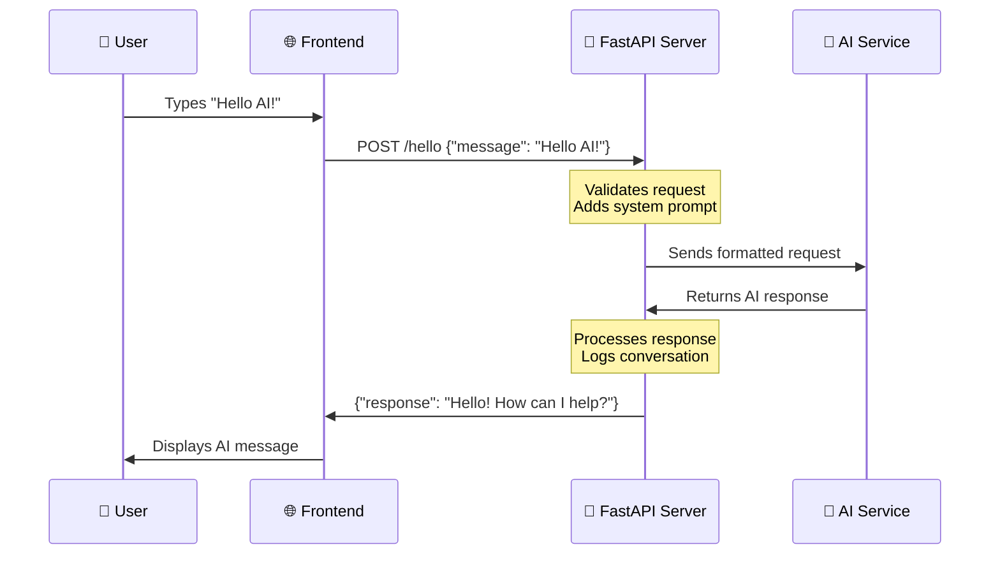
  
**Розуміння кожного кроку:**  
1. **Взаємодія користувача**: Людина вводить текст у чат-інтерфейсі  
2. **Обробка фронтенду**: JavaScript захоплює введення та форматує його як JSON  
3. **Валідація API**: FastAPI автоматично перевіряє запит за допомогою моделей Pydantic  
4. **Інтеграція AI**: Бекенд додає контекст (системну підказку) та викликає AI-сервіс  
5. **Обробка відповіді**: API отримує відповідь AI і може її змінити, якщо потрібно  
6. **Відображення на фронтенді**: JavaScript показує відповідь у чат-інтерфейсі  

### Розуміння архітектури API  

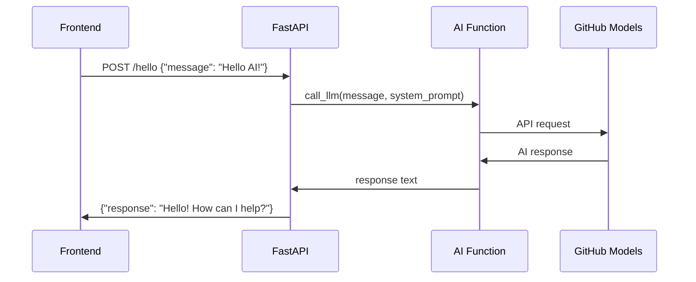
  
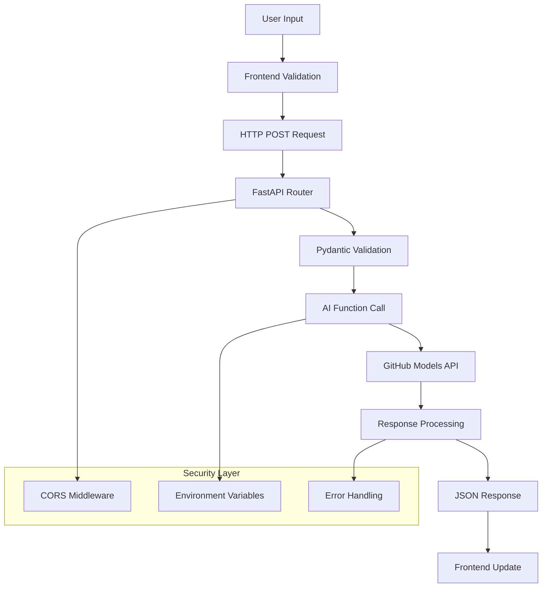
  

### Створення додатку FastAPI  

Давайте створимо наш API крок за кроком. Створіть файл `api.py` із наступним кодом FastAPI:  

```python
# api.py
from fastapi import FastAPI, HTTPException
from fastapi.middleware.cors import CORSMiddleware
from pydantic import BaseModel
from llm import call_llm
import logging

# Configure logging
logging.basicConfig(level=logging.INFO)
logger = logging.getLogger(__name__)

# Create FastAPI application
app = FastAPI(
    title="AI Chat API",
    description="A high-performance API for AI-powered chat applications",
    version="1.0.0"
)

# Configure CORS
app.add_middleware(
    CORSMiddleware,
    allow_origins=["*"],  # Configure appropriately for production
    allow_credentials=True,
    allow_methods=["*"],
    allow_headers=["*"],
)

# Pydantic models for request/response validation
class ChatMessage(BaseModel):
    message: str

class ChatResponse(BaseModel):
    response: str

@app.get("/")
async def root():
    """Root endpoint providing API information."""
    return {
        "message": "Welcome to the AI Chat API",
        "docs": "/docs",
        "health": "/health"
    }

@app.get("/health")
async def health_check():
    """Health check endpoint."""
    return {"status": "healthy", "service": "ai-chat-api"}

@app.post("/hello", response_model=ChatResponse)
async def chat_endpoint(chat_message: ChatMessage):
    """Main chat endpoint that processes messages and returns AI responses."""
    try:
        # Extract and validate message
        message = chat_message.message.strip()
        if not message:
            raise HTTPException(status_code=400, detail="Message cannot be empty")
        
        logger.info(f"Processing message: {message[:50]}...")
        
        # Call AI service (note: call_llm should be made async for better performance)
        ai_response = await call_llm_async(message, "You are a helpful and friendly assistant.")
        
        logger.info("AI response generated successfully")
        return ChatResponse(response=ai_response)
        
    except HTTPException:
        raise
    except Exception as e:
        logger.error(f"Error processing chat message: {str(e)}")
        raise HTTPException(status_code=500, detail="Internal server error")

if __name__ == "__main__":
    import uvicorn
    uvicorn.run(app, host="0.0.0.0", port=5000, reload=True)
```
  
**Розуміння реалізації FastAPI:**  
- **Імпортує** FastAPI для функціональності сучасного веб-фреймворку та Pydantic для валідації даних  
- **Створює** автоматичну документацію API (доступну на `/docs`, коли сервер запущений)  
- **Вмикає** CORS middleware для дозволу запитів фронтенду з різних джерел  
- **Визначає** моделі Pydantic для автоматичної валідації запитів/відповідей та документації  
- **Використовує** асинхронні кінцеві точки для кращої продуктивності з одночасними запитами  
- **Реалізує** правильні HTTP-коди статусу та обробку помилок за допомогою HTTPException  
- **Включає** структуроване логування для моніторингу та налагодження  
- **Надає** кінцеву точку перевірки стану для моніторингу статусу сервісу  

**Основні переваги FastAPI над традиційними фреймворками:**  
- **Автоматична валідація**: Моделі Pydantic забезпечують цілісність даних до обробки  
- **Інтерактивна документація**: Перейдіть на `/docs` для автоматично створеної, тестованої документації API  
- **Безпека типів**: Підказки типів Python запобігають помилкам під час виконання та покращують якість коду  
- **Підтримка async**: Обробляйте кілька AI-запитів одночасно без блокування  
- **Продуктивність**: Значно швидша обробка запитів для додатків у реальному часі  

### Розуміння CORS: Охоронець безпеки вебу  

CORS (Cross-Origin Resource Sharing) – це як охоронець у будівлі, який перевіряє, чи дозволено відвідувачам заходити. Давайте зрозуміємо, чому це важливо і як це впливає на ваш додаток.  

#### Що таке CORS і чому він існує?  

**Проблема**: Уявіть, що будь-який вебсайт міг би робити запити до сайту вашого банку від вашого імені без вашого дозволу. Це був би кошмар безпеки! Браузери запобігають цьому за замовчуванням через "Політику одного джерела".  

**Політика одного джерела**: Браузери дозволяють веб-сторінкам робити запити лише до того ж домену, порту та протоколу, з якого вони були завантажені.  

**Аналогія з реального світу**: Це як охорона житлового будинку – тільки мешканці (одне джерело) можуть отримати доступ до будівлі за замовчуванням. Якщо ви хочете, щоб друг (інше джерело) зайшов, вам потрібно явно сказати охороні, що це дозволено.  

#### CORS у вашому середовищі розробки  

Під час розробки ваш фронтенд і бекенд працюють на різних портах:  
- Фронтенд: `http://localhost:3000` (або file://, якщо відкриваєте HTML напряму)  
- Бекенд: `http://localhost:5000`  

Це вважається "різними джерелами", навіть якщо вони на одному комп'ютері!  

```python
from fastapi.middleware.cors import CORSMiddleware

app = FastAPI(__name__)
CORS(app)   # This tells browsers: "It's okay for other origins to make requests to this API"
```
  
**Що робить конфігурація CORS на практиці:**  
- **Додає** спеціальні HTTP-заголовки до відповідей API, які повідомляють браузерам "цей запит з іншого джерела дозволений"  
- **Обробляє** "попередні" запити (браузери іноді перевіряють дозволи перед надсиланням фактичного запиту)  
- **Запобігає** страшній помилці "заблоковано політикою CORS" у консолі вашого браузера  

#### Безпека CORS: Розробка проти продакшну  

```python
# 🚨 Development: Allows ALL origins (convenient but insecure)
CORS(app)

# ✅ Production: Only allow your specific frontend domain
CORS(app, origins=["https://yourdomain.com", "https://www.yourdomain.com"])

# 🔒 Advanced: Different origins for different environments
if app.debug:  # Development mode
    CORS(app, origins=["http://localhost:3000", "http://127.0.0.1:3000"])
else:  # Production mode
    CORS(app, origins=["https://yourdomain.com"])
```
  
**Чому це важливо**: У розробці `CORS(app)` – це як залишити двері відчиненими – зручно, але небезпечно. У продакшні ви хочете точно вказати, які вебсайти можуть спілкуватися з вашим API.  

#### Загальні сценарії CORS та рішення  

| Сценарій | Проблема | Рішення |  
|----------|---------|----------|  
| **Локальна розробка** | Фронтенд не може дістатися до бекенду | Додайте CORSMiddleware до FastAPI |  
| **GitHub Pages + Heroku** | Розгорнутий фронтенд не може дістатися до API | Додайте URL вашої сторінки GitHub до джерел CORS |  
| **Користувацький домен** | Помилки CORS у продакшні | Оновіть джерела CORS, щоб відповідати вашому домену |  
| **Мобільний додаток** | Додаток не може дістатися до веб-API | Додайте домен вашого додатку або обережно використовуйте `*` |  

**Порада**: Ви можете перевірити заголовки CORS у інструментах розробника вашого браузера на вкладці "Мережа". Шукайте заголовки, як-от `Access-Control-Allow-Origin` у відповіді.  

### Обробка помилок та валідація  

Зверніть увагу, як наш API включає належну обробку помилок:  

```python
# Validate that we received a message
if not message:
    return jsonify({"error": "Message field is required"}), 400
```
  
**Основні принципи валідації:**  
- **Перевіряє** обов'язкові поля перед обробкою запитів  
- **Повертає** змістовні повідомлення про помилки у форматі JSON  
- **Використовує** відповідні HTTP-коди статусу (400 для неправильних запитів)  
- **Надає** чіткий зворотний зв'язок, щоб допомогти розробникам фронтенду налагоджувати проблеми  

## Налаштування та запуск вашого бекенду  

Тепер, коли ми маємо інтеграцію AI та сервер FastAPI, давайте запустимо все. Процес налаштування включає встановлення залежностей Python, конфігурацію змінних середовища та запуск вашого сервера розробки.  

### Налаштування середовища Python  

Давайте налаштуємо ваше середовище розробки Python. Віртуальні середовища схожі на підхід Манхеттенського проекту – кожен проект отримує свій власний ізольований простір із конкретними інструментами та залежностями, запобігаючи конфліктам між різними проектами.  

```bash
# Navigate to your backend directory
cd backend

# Create a virtual environment (like creating a clean room for your project)
python -m venv venv

# Activate it (Linux/Mac)
source ./venv/bin/activate

# On Windows, use:
# venv\Scripts\activate

# Install the good stuff
pip install openai fastapi uvicorn python-dotenv
```
  
**Що ми щойно зробили:**  
- **Створили** власну маленьку Python-бульбашку, де ми можемо встановлювати пакети, не впливаючи на інші проекти  
- **Активували** її, щоб наш термінал знав, що використовувати саме це середовище  
- **Встановили** необхідне: OpenAI для AI-магії, FastAPI для нашого веб-API, Uvicorn для його запуску та python-dotenv для безпечного управління секретами  

**Основні залежності пояснені:**  
- **FastAPI**: Сучасний, швидкий веб-фреймворк з автоматичною документацією API  
- **Uvicorn**: Надзвичайно швидкий сервер ASGI, який запускає додатки FastAPI  
- **OpenAI**: Офіційна бібліотека для інтеграції моделей GitHub та OpenAI API  
- **python-dotenv**: Безпечне завантаження змінних середовища з файлів .env  

### Конфігурація середовища: збереження секретів у безпеці  

Перш ніж ми запустимо наш API, нам потрібно поговорити про один із найважливіших уроків у веб-розробці: як зберігати ваші секрети дійсно секретними. Змінні середовища – це як сейф, до якого має доступ лише ваш додаток.  

#### Що таке змінні середовища?  

**Думайте про змінні середовища як про сейф для цінностей** – ви кладете туди свої цінні речі, і тільки ви (та ваш додаток) маєте ключ, щоб їх дістати. Замість того, щоб писати конфіденційну інформацію прямо у коді (де її може побачити буквально кожен), ви зберігаєте її безпечно у середовищі.  

**Ось різниця:**  
- **Неправильний спосіб**: Написати свій пароль на стікері та приклеїти його до монітора  
- **Правильний спосіб**: Зберігати свій пароль у безпечному менеджері паролів, до якого маєте доступ лише ви  

#### Чому змінні середовища важливі  

```python
# 🚨 NEVER DO THIS - API key visible to everyone
client = OpenAI(
    api_key="ghp_1234567890abcdef...",  # Anyone can steal this!
    base_url="https://models.github.ai/inference"
)

# ✅ DO THIS - API key stored securely
client = OpenAI(
    api_key=os.environ["GITHUB_TOKEN"],  # Only your app can access this
    base_url="https://models.github.ai/inference"
)
```
  
**Що відбувається, коли ви жорстко кодуєте секрети:**  
1. **Експозиція у системі контролю версій**: Кожен, хто має доступ до вашого Git-репозиторію, бачить ваш API-ключ  
2. **Публічні репозиторії**: Якщо ви завантажуєте на GitHub, ваш ключ видно всьому інтернету  
3. **Спільне використання команди**: Інші розробники, які працюють над вашим проектом, отримують доступ до вашого особистого API-ключа  
4. **Порушення безпеки**: Якщо хтось краде ваш API-ключ, він може використовувати ваші AI-кредити  

#### Налаштування вашого файлу середовища  

Створіть файл `.env` у каталозі вашого бекенду. Цей файл збер
Тепер настав захоплюючий момент – запуск сервера розробки FastAPI і спостереження за тим, як ваша інтеграція AI оживає! FastAPI використовує Uvicorn, надшвидкий сервер ASGI, спеціально розроблений для асинхронних Python-додатків.

#### Розуміння процесу запуску сервера FastAPI

```bash
# Method 1: Direct Python execution (includes auto-reload)
python api.py

# Method 2: Using Uvicorn directly (more control)
uvicorn api:app --host 0.0.0.0 --port 5000 --reload
```

Коли ви запускаєте цю команду, ось що відбувається за лаштунками:

**1. Python завантажує ваш додаток FastAPI**:
- Імпортує всі необхідні бібліотеки (FastAPI, Pydantic, OpenAI тощо)
- Завантажує змінні середовища з вашого файлу `.env`
- Створює екземпляр додатка FastAPI з автоматичною документацією

**2. Uvicorn налаштовує сервер ASGI**:
- Прив'язується до порту 5000 з можливостями асинхронної обробки запитів
- Налаштовує маршрутизацію запитів з автоматичною валідацією
- Вмикає гаряче перезавантаження для розробки (перезапуск при зміні файлів)
- Генерує інтерактивну документацію API

**3. Сервер починає слухати**:
- У вашому терміналі з'являється: `INFO: Uvicorn running on http://0.0.0.0:5000`
- Сервер може обробляти кілька одночасних AI-запитів
- Ваш API готовий з автоматичною документацією за адресою `http://localhost:5000/docs`

#### Що ви повинні побачити, коли все працює

```bash
$ python api.py
INFO:     Will watch for changes in these directories: ['/your/project/path']
INFO:     Uvicorn running on http://0.0.0.0:5000 (Press CTRL+C to quit)
INFO:     Started reloader process [12345] using WatchFiles
INFO:     Started server process [12346]
INFO:     Waiting for application startup.
INFO:     Application startup complete.
```

**Розуміння виводу FastAPI:**
- **Слідкуватиме за змінами**: Увімкнено автоматичне перезавантаження для розробки
- **Uvicorn працює**: Активний високопродуктивний сервер ASGI
- **Запущено процес перезавантаження**: Слідкування за файлами для автоматичних перезапусків
- **Запуск додатка завершено**: Додаток FastAPI успішно ініціалізовано
- **Доступна інтерактивна документація**: Перейдіть на `/docs` для автоматичної документації API

#### Тестування вашого FastAPI: кілька потужних підходів

FastAPI пропонує кілька зручних способів тестування вашого API, включаючи автоматичну інтерактивну документацію:

**Метод 1: Інтерактивна документація API (рекомендовано)**
1. Відкрийте браузер і перейдіть на `http://localhost:5000/docs`
2. Ви побачите Swagger UI з усіма вашими кінцевими точками
3. Натисніть на `/hello` → "Try it out" → Введіть тестове повідомлення → "Execute"
4. Перегляньте відповідь прямо в браузері з правильним форматуванням

**Метод 2: Основний тест у браузері**
1. Перейдіть на `http://localhost:5000` для кореневої кінцевої точки
2. Перейдіть на `http://localhost:5000/health`, щоб перевірити стан сервера
3. Це підтверджує, що ваш сервер FastAPI працює належним чином

**Метод 2: Тест командного рядка (просунутий)**
```bash
# Test with curl (if available)
curl -X POST http://localhost:5000/hello \
  -H "Content-Type: application/json" \
  -d '{"message": "Hello AI!"}'

# Expected response:
# {"response": "Hello! I'm your AI assistant. How can I help you today?"}
```

**Метод 3: Тестовий скрипт Python**
```python
# test_api.py - Create this file to test your API
import requests
import json

# Test the API endpoint
url = "http://localhost:5000/hello"
data = {"message": "Tell me a joke about programming"}

response = requests.post(url, json=data)
if response.status_code == 200:
    result = response.json()
    print("AI Response:", result['response'])
else:
    print("Error:", response.status_code, response.text)
```

#### Вирішення поширених проблем запуску

| Повідомлення про помилку | Що це означає | Як виправити |
|--------------------------|---------------|-------------|
| `ModuleNotFoundError: No module named 'fastapi'` | FastAPI не встановлено | Запустіть `pip install fastapi uvicorn` у вашому віртуальному середовищі |
| `ModuleNotFoundError: No module named 'uvicorn'` | Сервер ASGI не встановлено | Запустіть `pip install uvicorn` у вашому віртуальному середовищі |
| `KeyError: 'GITHUB_TOKEN'` | Змінна середовища не знайдена | Перевірте ваш файл `.env` і виклик `load_dotenv()` |
| `Address already in use` | Порт 5000 зайнятий | Завершіть інші процеси, що використовують порт 5000, або змініть порт |
| `ValidationError` | Дані запиту не відповідають моделі Pydantic | Перевірте, чи формат вашого запиту відповідає очікуваній схемі |
| `HTTPException 422` | Непридатна сутність | Валідація запиту не вдалася, перевірте `/docs` для правильного формату |
| `OpenAI API error` | Помилка автентифікації AI-сервісу | Перевірте, чи ваш GitHub-токен правильний і має відповідні дозволи |

#### Найкращі практики розробки

**Гаряче перезавантаження**: FastAPI з Uvicorn забезпечує автоматичне перезавантаження при збереженні змін у ваших Python-файлах. Це означає, що ви можете змінювати код і тестувати його негайно без ручного перезапуску.

```python
# Enable hot reloading explicitly
if __name__ == "__main__":
    app.run(host="0.0.0.0", port=5000, debug=True)  # debug=True enables hot reload
```

**Логування для розробки**: Додайте логування, щоб зрозуміти, що відбувається:

```python
import logging

# Set up logging
logging.basicConfig(level=logging.INFO)
logger = logging.getLogger(__name__)

@app.route("/hello", methods=["POST"])
def hello():
    data = request.get_json()
    message = data.get("message", "")
    
    logger.info(f"Received message: {message}")
    
    if not message:
        logger.warning("Empty message received")
        return jsonify({"error": "Message field is required"}), 400
    
    try:
        response = call_llm(message, "You are a helpful and friendly assistant.")
        logger.info(f"AI response generated successfully")
        return jsonify({"response": response})
    except Exception as e:
        logger.error(f"AI API error: {str(e)}")
        return jsonify({"error": "AI service temporarily unavailable"}), 500
```

**Чому логування допомагає**: Під час розробки ви можете бачити, які запити надходять, як AI відповідає і де виникають помилки. Це значно прискорює процес налагодження.

### Налаштування для GitHub Codespaces: Легка розробка в хмарі

GitHub Codespaces – це як потужний комп'ютер для розробки в хмарі, до якого ви можете отримати доступ з будь-якого браузера. Якщо ви працюєте в Codespaces, є кілька додаткових кроків, щоб зробити ваш бекенд доступним для фронтенду.

#### Розуміння мережі Codespaces

У локальному середовищі розробки все працює на одному комп'ютері:
- Бекенд: `http://localhost:5000`
- Фронтенд: `http://localhost:3000` (або file://)

У Codespaces ваше середовище розробки працює на серверах GitHub, тому "localhost" має інше значення. GitHub автоматично створює публічні URL-адреси для ваших сервісів, але їх потрібно правильно налаштувати.

#### Покрокова конфігурація Codespaces

**1. Запустіть сервер бекенду**:
```bash
cd backend
python api.py
```

Ви побачите знайоме повідомлення про запуск FastAPI/Uvicorn, але зверніть увагу, що воно працює всередині середовища Codespace.

**2. Налаштуйте видимість порту**:
- Знайдіть вкладку "Ports" у нижній панелі VS Code
- Знайдіть порт 5000 у списку
- Клацніть правою кнопкою миші на порт 5000
- Виберіть "Port Visibility" → "Public"

**Чому зробити його публічним?** За замовчуванням порти Codespace є приватними (доступні лише вам). Зробивши порт публічним, ви дозволяєте вашому фронтенду (який працює в браузері) спілкуватися з вашим бекендом.

**3. Отримайте вашу публічну URL-адресу**:
Після того, як порт стане публічним, ви побачите URL-адресу, наприклад:
```
https://your-codespace-name-5000.app.github.dev
```

**4. Оновіть конфігурацію фронтенду**:
```javascript
// In your frontend app.js, update the BASE_URL:
this.BASE_URL = "https://your-codespace-name-5000.app.github.dev";
```

#### Розуміння URL-адрес Codespace

URL-адреси Codespace мають передбачуваний шаблон:
```
https://[codespace-name]-[port].app.github.dev
```

**Розбиваємо це на частини:**
- `codespace-name`: Унікальний ідентифікатор вашого Codespace (зазвичай включає ваше ім'я користувача)
- `port`: Номер порту, на якому працює ваш сервіс (5000 для нашого додатка FastAPI)
- `app.github.dev`: Домен GitHub для додатків Codespace

#### Тестування налаштування Codespace

**1. Тестуйте бекенд безпосередньо**:
Відкрийте вашу публічну URL-адресу в новій вкладці браузера. Ви повинні побачити:
```
Welcome to the AI Chat API. Send POST requests to /hello with JSON payload containing 'message' field.
```

**2. Тестуйте за допомогою інструментів розробника браузера**:
```javascript
// Open browser console and test your API
fetch('https://your-codespace-name-5000.app.github.dev/hello', {
  method: 'POST',
  headers: {'Content-Type': 'application/json'},
  body: JSON.stringify({message: 'Hello from Codespaces!'})
})
.then(response => response.json())
.then(data => console.log(data));
```

#### Codespaces vs Локальна розробка

| Аспект | Локальна розробка | GitHub Codespaces |
|--------|-------------------|-------------------|
| **Час налаштування** | Довший (встановлення Python, залежностей) | Миттєвий (попередньо налаштоване середовище) |
| **Доступ до URL** | `http://localhost:5000` | `https://xyz-5000.app.github.dev` |
| **Конфігурація порту** | Автоматична | Ручна (зробити порти публічними) |
| **Збереження файлів** | Локальний комп'ютер | Репозиторій GitHub |
| **Співпраця** | Складно поділитися середовищем | Легко поділитися посиланням на Codespace |
| **Залежність від Інтернету** | Тільки для викликів AI API | Потрібен для всього |

#### Поради для розробки в Codespaces

**Змінні середовища в Codespaces**:
Ваш файл `.env` працює так само в Codespaces, але ви також можете встановлювати змінні середовища безпосередньо в Codespace:

```bash
# Set environment variable for the current session
export GITHUB_TOKEN="your_token_here"

# Or add to your .bashrc for persistence
echo 'export GITHUB_TOKEN="your_token_here"' >> ~/.bashrc
```

**Управління портами**:
- Codespaces автоматично визначає, коли ваш додаток починає слухати на порту
- Ви можете одночасно перенаправляти кілька портів (корисно, якщо ви додаєте базу даних пізніше)
- Порти залишаються доступними, поки ваш Codespace працює

**Робочий процес розробки**:
1. Внесіть зміни в код у VS Code
2. FastAPI автоматично перезавантажується (завдяки режиму перезавантаження Uvicorn)
3. Тестуйте зміни негайно через публічну URL-адресу
4. Зробіть коміт і пуш, коли будете готові

> 💡 **Порада**: Додайте в закладки URL-адресу вашого бекенду Codespace під час розробки. Оскільки імена Codespace стабільні, URL-адреса не зміниться, поки ви використовуєте той самий Codespace.

## Створення інтерфейсу чату на фронтенді: де люди зустрічаються з AI

Тепер ми створимо користувацький інтерфейс – частину, яка визначає, як люди взаємодіють з вашим AI-помічником. Як дизайн інтерфейсу оригінального iPhone, ми зосереджуємося на тому, щоб зробити складну технологію інтуїтивно зрозумілою і легкою у використанні.

### Розуміння сучасної архітектури фронтенду

Наш інтерфейс чату буде тим, що ми називаємо "Односторінковим додатком" або SPA. Замість старомодного підходу, коли кожен клік завантажує нову сторінку, наш додаток оновлюється плавно і миттєво:

**Старі вебсайти**: Як читання фізичної книги – ви перегортаєте абсолютно нові сторінки
**Наш додаток чату**: Як використання вашого телефону – все плавно оновлюється і працює безперервно

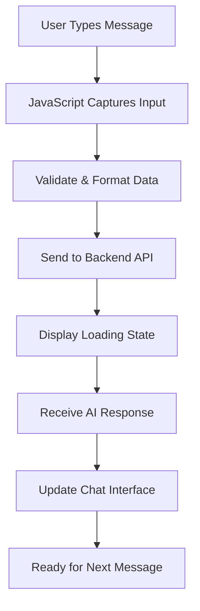

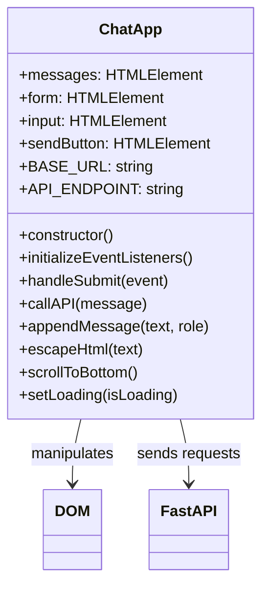

### Три основи фронтенд-розробки

Кожен фронтенд-додаток – від простих вебсайтів до складних додатків, таких як Discord або Slack – будується на трьох основних технологіях. Вони є основою всього, що ви бачите і з чим взаємодієте в Інтернеті:

**HTML (Структура)**: Це ваш фундамент
- Визначає, які елементи існують (кнопки, текстові поля, контейнери)
- Надає зміст контенту (це заголовок, це форма тощо)
- Створює базову структуру, на якій все будується

**CSS (Презентація)**: Це ваш дизайнер інтер'єру
- Робить все красивим (кольори, шрифти, макети)
- Обробляє різні розміри екранів (телефон, ноутбук, планшет)
- Створює плавні анімації та візуальний зворотний зв'язок

**JavaScript (Поведінка)**: Це ваш мозок
- Реагує на дії користувачів (кліки, введення тексту, прокрутка)
- Спілкується з вашим бекендом і оновлює сторінку
- Робить все інтерактивним і динамічним

**Думайте про це як про архітектурний дизайн:**
- **HTML**: Структурний план (визначення простору і взаємозв'язків)
- **CSS**: Естетичний і екологічний дизайн (візуальний стиль і досвід користувача)
- **JavaScript**: Механічні системи (функціональність і інтерактивність)

### Чому важлива сучасна архітектура JavaScript

Наш додаток чату буде використовувати сучасні шаблони JavaScript, які ви побачите в професійних додатках. Розуміння цих концепцій допоможе вам рости як розробнику:

**Архітектура на основі класів**: Ми організуємо наш код у класи, що схоже на створення креслень для об'єктів
**Async/Await**: Сучасний спосіб обробки операцій, які займають час (наприклад, виклики API)
**Програмування, орієнтоване на події**: Наш додаток реагує на дії користувачів (кліки, натискання клавіш), а не працює в циклі
**Маніпуляція DOM**: Динамічне оновлення контенту вебсторінки на основі взаємодій користувачів і відповідей API

### Налаштування структури проекту

Створіть каталог фронтенду з такою організованою структурою:

```text
frontend/
├── index.html      # Main HTML structure
├── app.js          # JavaScript functionality
└── styles.css      # Visual styling
```

**Розуміння архітектури:**
- **Розділяє** завдання між структурою (HTML), поведінкою (JavaScript) і презентацією (CSS)
- **Підтримує** просту структуру файлів, яку легко навігувати і змінювати
- **Дотримується** найкращих практик веброзробки для організації і підтримки

### Створення HTML-фундації: семантична структура для доступності

Почнемо зі структури HTML. Сучасна веброзробка наголошує на "семантичному HTML" – використанні HTML-елементів, які чітко описують їхнє призначення, а не лише їхній вигляд. Це робить ваш додаток доступним для читачів екрану, пошукових систем та інших інструментів.

**Чому семантичний HTML важливий**: Уявіть, що ви описуєте ваш додаток чату комусь по телефону. Ви б сказали: "є заголовок з назвою, основна область, де з'являються розмови, і форма внизу для введення повідомлень". Семантичний HTML використовує елементи, які відповідають цьому природному опису.

Створіть `index.html` з цією продумано структурованою розміткою:

```html
<!DOCTYPE html>
<html lang="en">
<head>
    <meta charset="UTF-8">
    <meta name="viewport" content="width=device-width, initial-scale=1.0">
    <title>AI Chat Assistant</title>
    <link rel="stylesheet" href="styles.css">
</head>
<body>
    <div class="chat-container">
        <header class="chat-header">
            <h1>AI Chat Assistant</h1>
            <p>Ask me anything!</p>
        </header>
        
        <main class="chat-messages" id="messages" role="log" aria-live="polite">
            <!-- Messages will be dynamically added here -->
        </main>
        
        <form class="chat-form" id="chatForm">
            <div class="input-group">
                <input 
                    type="text" 
                    id="messageInput" 
                    placeholder="Type your message here..." 
                    required
                    aria-label="Chat message input"
                >
                <button type="submit" id="sendBtn" aria-label="Send message">
                    Send
                </button>
            </div>
        </form>
    </div>
    <script src="app.js"></script>
</body>
</html>
```

**Розуміння кожного HTML-елемента і його призначення:**

#### Структура документа
- **`<!DOCTYPE html>`**: Повідомляє браузеру, що це сучасний HTML5
- **`<html lang="en">`**: Вказує мову сторінки для читачів екрану і інструментів перекладу
- **`<meta charset="UTF-8">`**: Забезпечує правильне кодування символів для міжнародного тексту
- **`<meta name="viewport"...>`**: Робить сторінку адаптивною для мобільних пристроїв, контролюючи масштабування і масштаб

#### Семантичні елементи
- **`<header>`**: Чітко визначає верхню секцію з назвою і описом
- **`<main>`**: Позначає основну область контенту (де відбуваються розмови)
- **`<form>`**: Семантично правильний для введення користувачем, забезпечує правильну нав
Тепер давайте створимо JavaScript, який оживить наш інтерфейс чату. Ми використаємо сучасні шаблони JavaScript, які зустрічаються в професійній веб-розробці, включаючи класи ES6, async/await і програмування, орієнтоване на події.

#### Розуміння сучасної архітектури JavaScript

Замість написання процедурного коду (серії функцій, які виконуються по черзі), ми створимо **архітектуру на основі класів**. Уявіть клас як креслення для створення об'єктів – як креслення архітектора може бути використане для будівництва кількох будинків.

**Чому використовувати класи для веб-додатків?**
- **Організація**: Уся пов'язана функціональність згрупована разом
- **Повторне використання**: Ви можете створити кілька екземплярів чату на одній сторінці
- **Зручність підтримки**: Легше налагоджувати та змінювати конкретні функції
- **Професійний стандарт**: Цей шаблон використовується у фреймворках, таких як React, Vue та Angular

Створіть `app.js` із цим сучасним, добре структурованим JavaScript:

```javascript
// app.js - Modern chat application logic

class ChatApp {
    constructor() {
        // Get references to DOM elements we'll need to manipulate
        this.messages = document.getElementById("messages");
        this.form = document.getElementById("chatForm");
        this.input = document.getElementById("messageInput");
        this.sendButton = document.getElementById("sendBtn");
        
        // Configure your backend URL here
        this.BASE_URL = "http://localhost:5000"; // Update this for your environment
        this.API_ENDPOINT = `${this.BASE_URL}/hello`;
        
        // Set up event listeners when the chat app is created
        this.initializeEventListeners();
    }
    
    initializeEventListeners() {
        // Listen for form submission (when user clicks Send or presses Enter)
        this.form.addEventListener("submit", (e) => this.handleSubmit(e));
        
        // Also listen for Enter key in the input field (better UX)
        this.input.addEventListener("keypress", (e) => {
            if (e.key === "Enter" && !e.shiftKey) {
                e.preventDefault();
                this.handleSubmit(e);
            }
        });
    }
    
    async handleSubmit(event) {
        event.preventDefault(); // Prevent form from refreshing the page
        
        const messageText = this.input.value.trim();
        if (!messageText) return; // Don't send empty messages
        
        // Provide user feedback that something is happening
        this.setLoading(true);
        
        // Add user message to chat immediately (optimistic UI)
        this.appendMessage(messageText, "user");
        
        // Clear input field so user can type next message
        this.input.value = '';
        
        try {
            // Call the AI API and wait for response
            const reply = await this.callAPI(messageText);
            
            // Add AI response to chat
            this.appendMessage(reply, "assistant");
        } catch (error) {
            console.error('API Error:', error);
            this.appendMessage("Sorry, I'm having trouble connecting right now. Please try again.", "error");
        } finally {
            // Re-enable the interface regardless of success or failure
            this.setLoading(false);
        }
    }
    
    async callAPI(message) {
        const response = await fetch(this.API_ENDPOINT, {
            method: "POST",
            headers: { 
                "Content-Type": "application/json" 
            },
            body: JSON.stringify({ message })
        });
        
        if (!response.ok) {
            throw new Error(`HTTP error! status: ${response.status}`);
        }
        
        const data = await response.json();
        return data.response;
    }
    
    appendMessage(text, role) {
        const messageElement = document.createElement("div");
        messageElement.className = `message ${role}`;
        messageElement.innerHTML = `
            <div class="message-content">
                <span class="message-text">${this.escapeHtml(text)}</span>
                <span class="message-time">${new Date().toLocaleTimeString()}</span>
            </div>
        `;
        
        this.messages.appendChild(messageElement);
        this.scrollToBottom();
    }
    
    escapeHtml(text) {
        const div = document.createElement('div');
        div.textContent = text;
        return div.innerHTML;
    }
    
    scrollToBottom() {
        this.messages.scrollTop = this.messages.scrollHeight;
    }
    
    setLoading(isLoading) {
        this.sendButton.disabled = isLoading;
        this.input.disabled = isLoading;
        this.sendButton.textContent = isLoading ? "Sending..." : "Send";
    }
}

// Initialize the chat application when the page loads
document.addEventListener("DOMContentLoaded", () => {
    new ChatApp();
});
```

#### Розуміння кожної концепції JavaScript

**Структура класу ES6**:
```javascript
class ChatApp {
    constructor() {
        // This runs when you create a new ChatApp instance
        // It's like the "setup" function for your chat
    }
    
    methodName() {
        // Methods are functions that belong to the class
        // They can access class properties using "this"
    }
}
```

**Шаблон async/await**:
```javascript
// Old way (callback hell):
fetch(url)
  .then(response => response.json())
  .then(data => console.log(data))
  .catch(error => console.error(error));

// Modern way (async/await):
try {
    const response = await fetch(url);
    const data = await response.json();
    console.log(data);
} catch (error) {
    console.error(error);
}
```

**Програмування, орієнтоване на події**:
Замість постійного перевіряння, чи щось сталося, ми "слухаємо" події:
```javascript
// When form is submitted, run handleSubmit
this.form.addEventListener("submit", (e) => this.handleSubmit(e));

// When Enter key is pressed, also run handleSubmit
this.input.addEventListener("keypress", (e) => { /* ... */ });
```

**Маніпуляція DOM**:
```javascript
// Create new elements
const messageElement = document.createElement("div");

// Modify their properties
messageElement.className = "message user";
messageElement.innerHTML = "Hello world!";

// Add to the page
this.messages.appendChild(messageElement);
```

#### Безпека та найкращі практики

**Запобігання XSS**:
```javascript
escapeHtml(text) {
    const div = document.createElement('div');
    div.textContent = text;  // This automatically escapes HTML
    return div.innerHTML;
}
```

**Чому це важливо**: Якщо користувач введе `<script>alert('hack')</script>`, ця функція забезпечить відображення як тексту, а не виконання як коду.

**Обробка помилок**:
```javascript
try {
    const reply = await this.callAPI(messageText);
    this.appendMessage(reply, "assistant");
} catch (error) {
    // Show user-friendly error instead of breaking the app
    this.appendMessage("Sorry, I'm having trouble...", "error");
}
```

**Міркування щодо зручності користувача**:
- **Оптимістичний інтерфейс**: Додайте повідомлення користувача негайно, не чекаючи відповіді сервера
- **Стан завантаження**: Вимкніть кнопки та покажіть "Відправляється..." під час очікування
- **Автопрокрутка**: Залишайте найновіші повідомлення видимими
- **Перевірка введення**: Не надсилайте порожні повідомлення
- **Гарячі клавіші**: Клавіша Enter надсилає повідомлення (як у реальних чатах)

#### Розуміння потоку додатка

1. **Сторінка завантажується** → Відбувається подія `DOMContentLoaded` → створюється `new ChatApp()`
2. **Конструктор запускається** → Отримує посилання на елементи DOM → Налаштовує слухачі подій
3. **Користувач вводить повідомлення** → Натискає Enter або кнопку Надіслати → запускається `handleSubmit`
4. **handleSubmit** → Перевіряє введення → Показує стан завантаження → Викликає API
5. **API відповідає** → Додає повідомлення AI до чату → Знову активує інтерфейс
6. **Готово до наступного повідомлення** → Користувач може продовжувати спілкування

Ця архітектура масштабована – ви легко можете додати функції, такі як редагування повідомлень, завантаження файлів або кілька потоків розмов без переписування основної структури.

### 🎯 Педагогічна перевірка: Сучасна архітектура фронтенду

**Розуміння архітектури**: Ви реалізували повноцінний односторінковий додаток, використовуючи сучасні шаблони JavaScript. Це представляє професійний рівень розробки фронтенду.

**Основні концепції, які ви освоїли**:
- **Архітектура класів ES6**: Організована, зручна для підтримки структура коду
- **Шаблони async/await**: Сучасне асинхронне програмування
- **Програмування, орієнтоване на події**: Дизайн чутливого інтерфейсу користувача
- **Найкращі практики безпеки**: Запобігання XSS та перевірка введення

**Зв'язок з індустрією**: Шаблони, які ви вивчили (архітектура на основі класів, асинхронні операції, маніпуляція DOM), є основою сучасних фреймворків, таких як React, Vue та Angular. Ви будуєте з тією ж архітектурною думкою, яка використовується у виробничих додатках.

**Питання для роздумів**: Як би ви розширили цей чат-додаток для обробки кількох розмов або аутентифікації користувачів? Розгляньте необхідні зміни в архітектурі та як би еволюціонувала структура класу.

### Стилізація вашого інтерфейсу чату

Тепер давайте створимо сучасний, візуально привабливий інтерфейс чату за допомогою CSS. Хороший стиль робить ваш додаток професійним і покращує загальний досвід користувача. Ми використаємо сучасні функції CSS, такі як Flexbox, CSS Grid і користувацькі властивості для адаптивного, доступного дизайну.

Створіть `styles.css` із цими комплексними стилями:

```css
/* styles.css - Modern chat interface styling */

:root {
    --primary-color: #2563eb;
    --secondary-color: #f1f5f9;
    --user-color: #3b82f6;
    --assistant-color: #6b7280;
    --error-color: #ef4444;
    --text-primary: #1e293b;
    --text-secondary: #64748b;
    --border-radius: 12px;
    --shadow: 0 4px 6px -1px rgba(0, 0, 0, 0.1);
}

* {
    margin: 0;
    padding: 0;
    box-sizing: border-box;
}

body {
    font-family: -apple-system, BlinkMacSystemFont, 'Segoe UI', Roboto, sans-serif;
    background: linear-gradient(135deg, #667eea 0%, #764ba2 100%);
    min-height: 100vh;
    display: flex;
    align-items: center;
    justify-content: center;
    padding: 20px;
}

.chat-container {
    width: 100%;
    max-width: 800px;
    height: 600px;
    background: white;
    border-radius: var(--border-radius);
    box-shadow: var(--shadow);
    display: flex;
    flex-direction: column;
    overflow: hidden;
}

.chat-header {
    background: var(--primary-color);
    color: white;
    padding: 20px;
    text-align: center;
}

.chat-header h1 {
    font-size: 1.5rem;
    margin-bottom: 5px;
}

.chat-header p {
    opacity: 0.9;
    font-size: 0.9rem;
}

.chat-messages {
    flex: 1;
    padding: 20px;
    overflow-y: auto;
    display: flex;
    flex-direction: column;
    gap: 15px;
    background: var(--secondary-color);
}

.message {
    display: flex;
    max-width: 80%;
    animation: slideIn 0.3s ease-out;
}

.message.user {
    align-self: flex-end;
}

.message.user .message-content {
    background: var(--user-color);
    color: white;
    border-radius: var(--border-radius) var(--border-radius) 4px var(--border-radius);
}

.message.assistant {
    align-self: flex-start;
}

.message.assistant .message-content {
    background: white;
    color: var(--text-primary);
    border-radius: var(--border-radius) var(--border-radius) var(--border-radius) 4px;
    border: 1px solid #e2e8f0;
}

.message.error .message-content {
    background: var(--error-color);
    color: white;
    border-radius: var(--border-radius);
}

.message-content {
    padding: 12px 16px;
    box-shadow: var(--shadow);
    position: relative;
}

.message-text {
    display: block;
    line-height: 1.5;
    word-wrap: break-word;
}

.message-time {
    display: block;
    font-size: 0.75rem;
    opacity: 0.7;
    margin-top: 5px;
}

.chat-form {
    padding: 20px;
    border-top: 1px solid #e2e8f0;
    background: white;
}

.input-group {
    display: flex;
    gap: 10px;
    align-items: center;
}

#messageInput {
    flex: 1;
    padding: 12px 16px;
    border: 2px solid #e2e8f0;
    border-radius: var(--border-radius);
    font-size: 1rem;
    outline: none;
    transition: border-color 0.2s ease;
}

#messageInput:focus {
    border-color: var(--primary-color);
}

#messageInput:disabled {
    background: #f8fafc;
    opacity: 0.6;
    cursor: not-allowed;
}

#sendBtn {
    padding: 12px 24px;
    background: var(--primary-color);
    color: white;
    border: none;
    border-radius: var(--border-radius);
    font-size: 1rem;
    font-weight: 600;
    cursor: pointer;
    transition: background-color 0.2s ease;
    min-width: 80px;
}

#sendBtn:hover:not(:disabled) {
    background: #1d4ed8;
}

#sendBtn:disabled {
    background: #94a3b8;
    cursor: not-allowed;
}

@keyframes slideIn {
    from {
        opacity: 0;
        transform: translateY(10px);
    }
    to {
        opacity: 1;
        transform: translateY(0);
    }
}

/* Responsive design for mobile devices */
@media (max-width: 768px) {
    body {
        padding: 10px;
    }
    
    .chat-container {
        height: calc(100vh - 20px);
        border-radius: 8px;
    }
    
    .message {
        max-width: 90%;
    }
    
    .input-group {
        flex-direction: column;
        gap: 10px;
    }
    
    #messageInput {
        width: 100%;
    }
    
    #sendBtn {
        width: 100%;
    }
}

/* Accessibility improvements */
@media (prefers-reduced-motion: reduce) {
    .message {
        animation: none;
    }
    
    * {
        transition: none !important;
    }
}

/* Dark mode support */
@media (prefers-color-scheme: dark) {
    .chat-container {
        background: #1e293b;
        color: #f1f5f9;
    }
    
    .chat-messages {
        background: #0f172a;
    }
    
    .message.assistant .message-content {
        background: #334155;
        color: #f1f5f9;
        border-color: #475569;
    }
    
    .chat-form {
        background: #1e293b;
        border-color: #475569;
    }
    
    #messageInput {
        background: #334155;
        color: #f1f5f9;
        border-color: #475569;
    }
}
```

**Розуміння архітектури CSS:**
- **Використовує** користувацькі властивості CSS (змінні) для узгодженого оформлення та легкого обслуговування
- **Реалізує** макет Flexbox для адаптивного дизайну та правильного вирівнювання
- **Включає** плавні анімації для появи повідомлень без відволікання
- **Забезпечує** візуальне розрізнення між повідомленнями користувача, відповідями AI та станами помилок
- **Підтримує** адаптивний дизайн, який працює як на настільних комп'ютерах, так і на мобільних пристроях
- **Враховує** доступність із зменшеними уподобаннями руху та правильними коефіцієнтами контрастності
- **Пропонує** підтримку темного режиму на основі уподобань системи користувача

### Налаштування URL вашого бекенду

Останній крок – оновлення `BASE_URL` у вашому JavaScript, щоб він відповідав вашому серверу бекенду:

```javascript
// For local development
this.BASE_URL = "http://localhost:5000";

// For GitHub Codespaces (replace with your actual URL)
this.BASE_URL = "https://your-codespace-name-5000.app.github.dev";
```

**Визначення URL вашого бекенду:**
- **Локальна розробка**: Використовуйте `http://localhost:5000`, якщо фронтенд і бекенд працюють локально
- **Codespaces**: Знайдіть URL вашого бекенду на вкладці Ports після того, як зробите порт 5000 загальнодоступним
- **Продакшн**: Замініть на ваш фактичний домен під час розгортання на хостинговій платформі

> 💡 **Порада для тестування**: Ви можете протестувати ваш бекенд безпосередньо, відвідавши кореневий URL у вашому браузері. Ви повинні побачити вітальне повідомлення від вашого сервера FastAPI.


## Тестування та розгортання

Тепер, коли ви створили компоненти фронтенду та бекенду, давайте перевіримо, чи все працює разом, і розглянемо варіанти розгортання для спільного використання вашого чат-асистента з іншими.

### Робочий процес локального тестування

Виконайте ці кроки, щоб протестувати ваш повний додаток:

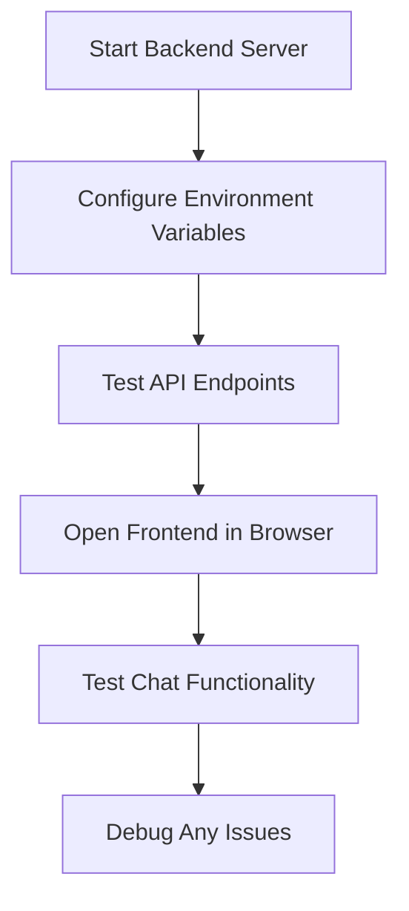

**Покроковий процес тестування:**

1. **Запустіть сервер бекенду**:
   ```bash
   cd backend
   source venv/bin/activate  # or venv\Scripts\activate on Windows
   python api.py
   ```

2. **Перевірте, чи працює API**:
   - Відкрийте `http://localhost:5000` у вашому браузері
   - Ви повинні побачити вітальне повідомлення від вашого сервера FastAPI

3. **Відкрийте ваш фронтенд**:
   - Перейдіть до каталогу вашого фронтенду
   - Відкрийте `index.html` у вашому веб-браузері
   - Або використовуйте розширення Live Server у VS Code для кращого досвіду розробки

4. **Протестуйте функціональність чату**:
   - Введіть повідомлення у поле введення
   - Натисніть "Надіслати" або Enter
   - Переконайтеся, що AI відповідає належним чином
   - Перевірте консоль браузера на наявність помилок JavaScript

### Усунення поширених проблем

| Проблема | Симптоми | Рішення |
|---------|----------|----------|
| **Помилка CORS** | Фронтенд не може досягти бекенду | Переконайтеся, що FastAPI CORSMiddleware налаштований правильно |
| **Помилка ключа API** | Відповіді 401 Unauthorized | Перевірте змінну середовища `GITHUB_TOKEN` |
| **Відмова в підключенні** | Помилки мережі у фронтенді | Перевірте URL бекенду та чи працює сервер Flask |
| **Відсутність відповіді AI** | Порожні або помилкові відповіді | Перевірте журнали бекенду на наявність проблем із квотою API або аутентифікацією |

**Загальні кроки налагодження**:
- **Перевіряйте** консоль інструментів розробника браузера на помилки JavaScript
- **Переконайтеся**, що вкладка Network показує успішні запити та відповіді API
- **Переглядайте** вихідні дані терміналу бекенду на наявність помилок Python або проблем із API
- **Переконайтеся**, що змінні середовища правильно завантажені та доступні

## 📈 Хронологія освоєння розробки AI-додатків

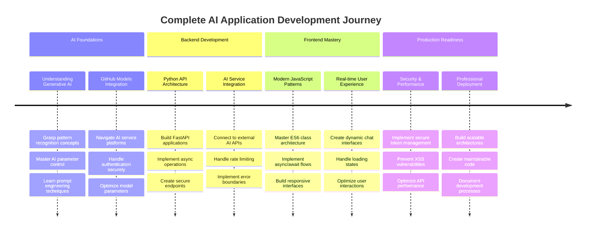

**🎓 Етап випуску**: Ви успішно створили повний додаток на основі AI, використовуючи ті ж технології та архітектурні шаблони, які живлять сучасних AI-асистентів. Ці навички представляють перетин традиційної веб-розробки та передової інтеграції AI.

**🔄 Наступний рівень можливостей**:
- Готовність до вивчення розширених AI-фреймворків (LangChain, LangGraph)
- Підготовка до створення мультимодальних AI-додатків (текст, зображення, голос)
- Оснащеність для впровадження векторних баз даних і систем пошуку
- Закладена основа для машинного навчання та тонкої настройки моделей AI

## Виклик агента GitHub Copilot 🚀

Використовуйте режим Agent, щоб виконати наступний виклик:

**Опис:** Покращіть чат-асистента, додавши історію розмов і збереження повідомлень. Цей виклик допоможе вам зрозуміти, як управляти станом у чат-додатках і впроваджувати збереження даних для покращення досвіду користувача.

**Підказка:** Модифікуйте чат-додаток, щоб включити історію розмов, яка зберігається між сеансами. Додайте функціонал для збереження повідомлень чату в локальному сховищі, відображення історії розмов при завантаженні сторінки та включіть кнопку "Очистити історію". Також реалізуйте індикатори набору тексту та часові мітки повідомлень, щоб зробити досвід чату більш реалістичним.

Дізнайтеся більше про [режим агента](https://code.visualstudio.com/blogs/2025/02/24/introducing-copilot-agent-mode) тут.

## Завдання: Створіть свого персонального AI-асистента

Тепер ви створите власну реалізацію AI-асистента. Замість простого копіювання коду з підручника, це можливість застосувати концепції, створюючи щось, що відображає ваші власні інтереси та випадки використання.

### Вимоги до проекту

Давайте налаштуємо ваш проект із чистою, організованою структурою:

```text
my-ai-assistant/
├── backend/
│   ├── api.py          # Your FastAPI server
│   ├── llm.py          # AI integration functions
│   ├── .env            # Your secrets (keep this safe!)
│   └── requirements.txt # Python dependencies
├── frontend/
│   ├── index.html      # Your chat interface
│   ├── app.js          # The JavaScript magic
│   └── styles.css      # Make it look amazing
└── README.md           # Tell the world about your creation
```

### Основні завдання реалізації

**Розробка бекенду:**
- **Візьміть** наш код FastAPI і адаптуйте його під себе
- **Створіть** унікальну особистість AI – можливо, корисного кулінарного асистента, творчого партнера для написання текстів або навчального помічника?
- **Додайте** надійну обробку помилок, щоб ваш додаток не ламався, коли щось йде не так
- **Напишіть** чітку документацію для тих, хто хоче зрозуміти, як працює ваш API

**Розробка фронтенду:**
- **Створіть** інтерфейс чату, який здається інтуїтивно зрозумілим і привітним
- **Напишіть** чистий, сучасний JavaScript, яким ви будете пишатися перед іншими розробниками
- **Розробіть** власний стиль, який відображає особистість вашого AI – веселий і яскравий? Чистий і мінімалістичний? Це повністю залежить від вас!
- **Переконайтеся**, що він чудово працює як на телефонах, так і на комп'ютерах

**Вимоги до персоналізації:**
- **Виберіть** унікальне ім'я та особистість для вашого AI-асистента – можливо, щось, що відображає ваші інтереси або проблеми, які ви хочете вирішити
- **Налаштуйте** візуальний дизайн, щоб відповідати стилю вашого асистента
- **Напишіть** переконливе вітальне повідомлення, яке змусить людей захотіти почати спілкування
- **Протестуйте** вашого асистента з різними типами запитань, щоб побачити, як він відповідає

### Ідеї для покращення (опціонально)

Хочете вивести свій проект на новий рівень? Ось кілька цікавих ідей для дослідження:

| Функція | Опис | Навички, які ви практикуєте |
|---------|-------------|------------------------|
| **Історія повідомлень** | Запам'ятовувати розмови навіть після оновлення сторінки | Робота з localStorage, обробка JSON |
| **Індикатори набору тексту** | Показувати "AI набирає текст..." під час очікування відповідей | Анімації CSS, асинхронне програмування |
| **Часові мітки повідомлень** | Показувати, коли було надіслано кожне повідомлення | Форматування дати/часу, дизайн UX |
| **Експорт чату** | Дозволити користувачам завантажувати свою розмову | Обробка файлів, експорт даних |
| **Перемикання теми** | Перемикання між світлим/темним режимом | Змінні CSS, уподобання користувача |
| **Голосове введення** | Додати функціонал перетворення голосу в текст | Веб-API, доступність |

### Тестування та документація

**Забезпечення якості**:
- **Тестуйте** ваш додаток із різними типами введення та крайніми випадками
- **Переконайтеся**, що адаптивний дизайн працює на різних розмірах екрана
- **Перевірте** доступність за допомогою навігації клавіатурою та екранних читачів
- **Перевірте** HTML і CSS на відповідність стандартам

**Вимоги до документації**:
- **Напишіть** README.md, що пояснює ваш проект і як його запустити
- **Включіть** скріншоти вашого інтерфейсу чату в дії
- **Документуйте** будь-які унікальні функції або налаштування, які ви додали
- **Надайте** чіткі інструкції з налаштування для інших розробників

### Керівництво щодо подання

**Результати проекту**:
1. Повна папка проекту з ус
- **Реалізуйте** розумні пропозиції на основі теми розмови  
- **Створіть** кнопки швидких відповідей для поширених запитань  

> 🎯 **Ціль навчання**: Ці додаткові завдання допоможуть вам зрозуміти передові шаблони веб-розробки та техніки інтеграції AI, які використовуються у реальних додатках.

## Підсумок і наступні кроки  

Вітаємо! Ви успішно створили повноцінного чат-асистента на основі AI з нуля. Цей проєкт дав вам практичний досвід роботи з сучасними технологіями веб-розробки та інтеграції AI – навички, які стають все більш цінними в сучасному технологічному середовищі.

### Що ви досягли  

Протягом цього уроку ви опанували кілька ключових технологій і концепцій:

**Розробка бекенду:**  
- **Інтеграція** з GitHub Models API для функціональності AI  
- **Створення** RESTful API за допомогою Flask із належною обробкою помилок  
- **Реалізація** безпечної аутентифікації за допомогою змін середовища  
- **Налаштування** CORS для запитів між фронтендом і бекендом  

**Розробка фронтенду:**  
- **Створення** адаптивного інтерфейсу чату за допомогою семантичного HTML  
- **Реалізація** сучасного JavaScript із async/await та архітектурою на основі класів  
- **Дизайн** привабливого інтерфейсу користувача за допомогою CSS Grid, Flexbox та анімацій  
- **Додавання** функцій доступності та принципів адаптивного дизайну  

**Інтеграція фронтенду та бекенду:**  
- **З'єднання** фронтенду та бекенду через HTTP API запити  
- **Обробка** взаємодії користувача в реальному часі та асинхронного потоку даних  
- **Реалізація** обробки помилок та зворотного зв'язку для користувача в додатку  
- **Тестування** повного робочого процесу додатка від введення користувача до відповіді AI  

### Основні результати навчання  

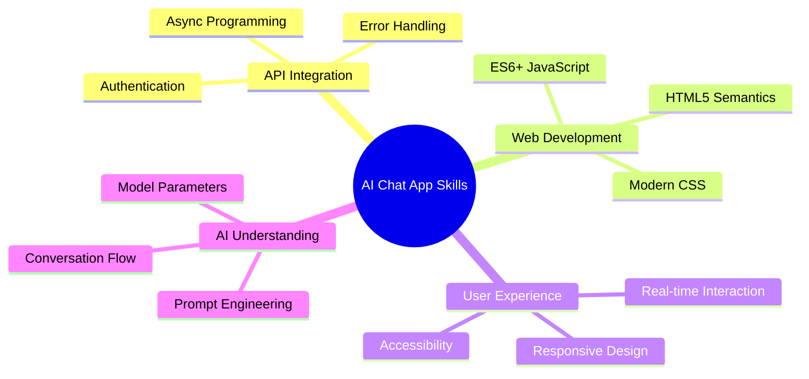
  
Цей проєкт познайомив вас з основами створення додатків на основі AI, що є майбутнім веб-розробки. Тепер ви розумієте, як інтегрувати можливості AI у традиційні веб-додатки, створюючи захоплюючий досвід для користувачів, який здається розумним і чуйним.

### Професійне застосування  

Навички, які ви розвинули в цьому уроці, безпосередньо застосовуються в сучасних кар'єрах у сфері розробки програмного забезпечення:

- **Розробка веб-додатків** з використанням сучасних фреймворків та API  
- **Інтеграція AI** у веб-додатки та мобільні додатки  
- **Проєктування та розробка API** для архітектури мікросервісів  
- **Розробка інтерфейсу користувача** з акцентом на доступність та адаптивний дизайн  
- **Практики DevOps**, включаючи налаштування середовища та розгортання  

### Продовження вашого шляху в розробці AI  

**Наступні кроки навчання:**  
- **Досліджуйте** більш просунуті моделі AI та API (GPT-4, Claude, Gemini)  
- **Вивчайте** техніки створення запитів для покращення відповідей AI  
- **Ознайомтеся** з дизайном розмов та принципами користувацького досвіду чат-ботів  
- **Досліджуйте** безпеку AI, етику та відповідальну розробку AI  
- **Створюйте** більш складні додатки з пам'яттю розмов та усвідомленням контексту  

**Ідеї для просунутих проєктів:**  
- Чат-кімнати для кількох користувачів з модерацією AI  
- Чат-боти для обслуговування клієнтів на основі AI  
- Освітні асистенти для навчання з персоналізованим підходом  
- Співавтори для творчого письма з різними особистостями AI  
- Асистенти з технічної документації для розробників  

## Початок роботи з GitHub Codespaces  

Хочете спробувати цей проєкт у хмарному середовищі розробки? GitHub Codespaces надає повне середовище розробки у вашому браузері, ідеальне для експериментів із додатками на основі AI без необхідності локального налаштування.

### Налаштування середовища розробки  

**Крок 1: Створення з шаблону**  
- **Перейдіть** до [репозиторію Web Dev For Beginners](https://github.com/microsoft/Web-Dev-For-Beginners)  
- **Натисніть** "Use this template" у верхньому правому куті (переконайтеся, що ви увійшли до GitHub)  

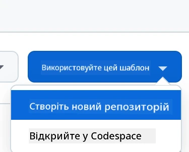  

**Крок 2: Запуск Codespaces**  
- **Відкрийте** щойно створений репозиторій  
- **Натисніть** зелену кнопку "Code" і виберіть "Codespaces"  
- **Виберіть** "Create codespace on main", щоб запустити середовище розробки  

  

**Крок 3: Налаштування середовища**  
Після завантаження Codespace ви отримаєте доступ до:  
- **Попередньо встановлених** Python, Node.js та всіх необхідних інструментів розробки  
- **Інтерфейсу VS Code** з розширеннями для веб-розробки  
- **Доступу до терміналу** для запуску серверів бекенду та фронтенду  
- **Переадресації портів** для тестування ваших додатків  

**Що надає Codespaces:**  
- **Усуває** проблеми налаштування локального середовища  
- **Забезпечує** стабільне середовище розробки на різних пристроях  
- **Включає** попередньо налаштовані інструменти та розширення для веб-розробки  
- **Пропонує** безшовну інтеграцію з GitHub для контролю версій та співпраці  

> 🚀 **Порада**: Codespaces ідеально підходить для навчання та створення прототипів додатків на основі AI, оскільки автоматично вирішує всі складнощі налаштування середовища, дозволяючи вам зосередитися на створенні та навчанні, а не на усуненні проблем конфігурації.

---

**Відмова від відповідальності**:  
Цей документ був перекладений за допомогою сервісу автоматичного перекладу [Co-op Translator](https://github.com/Azure/co-op-translator). Хоча ми прагнемо до точності, будь ласка, майте на увазі, що автоматичні переклади можуть містити помилки або неточності. Оригінальний документ на його рідній мові слід вважати авторитетним джерелом. Для критичної інформації рекомендується професійний людський переклад. Ми не несемо відповідальності за будь-які непорозуміння або неправильні тлумачення, що виникають внаслідок використання цього перекладу.