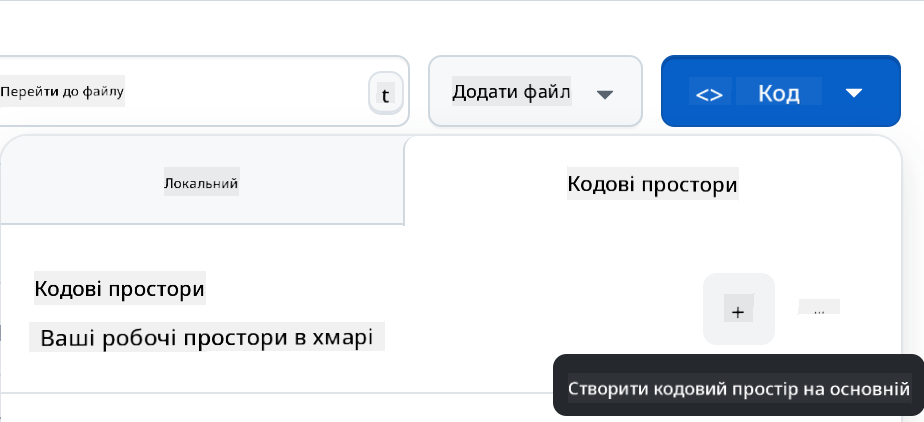

<!--
CO_OP_TRANSLATOR_METADATA:
{
  "original_hash": "cf15ff7770c5a484349383bb27d1131f",
  "translation_date": "2025-08-28T18:54:59+00:00",
  "source_file": "9-chat-project/README.md",
  "language_code": "uk"
}
-->
# Проєкт чату

Цей проєкт чату демонструє, як створити Чат-асистента за допомогою GitHub Models.

Ось як виглядає готовий проєкт:

<div>
  
</div>

Трохи контексту: створення чат-асистентів за допомогою генеративного ШІ — це чудовий спосіб почати вивчати штучний інтелект. У цьому уроці ви навчитеся інтегрувати генеративний ШІ у веб-додаток. Почнемо.

## Підключення до генеративного ШІ

Для бекенду ми використовуємо GitHub Models. Це чудовий сервіс, який дозволяє безкоштовно використовувати ШІ. Перейдіть до його "пісочниці" (playground) і скопіюйте код, що відповідає вашій обраній мові програмування для бекенду. Ось як це виглядає: [GitHub Models Playground](https://github.com/marketplace/models/azure-openai/gpt-4o-mini/playground)

<div>
  
</div>

Як ми вже зазначали, оберіть вкладку "Code" і ваш обраний runtime.

<div>
  
</div>

У цьому випадку ми обираємо Python, що означає, що ми використовуємо цей код:

```python
"""Run this model in Python

> pip install openai
"""
import os
from openai import OpenAI

# To authenticate with the model you will need to generate a personal access token (PAT) in your GitHub settings. 
# Create your PAT token by following instructions here: https://docs.github.com/en/authentication/keeping-your-account-and-data-secure/managing-your-personal-access-tokens
client = OpenAI(
    base_url="https://models.github.ai/inference",
    api_key=os.environ["GITHUB_TOKEN"],
)

response = client.chat.completions.create(
    messages=[
        {
            "role": "system",
            "content": "",
        },
        {
            "role": "user",
            "content": "What is the capital of France?",
        }
    ],
    model="openai/gpt-4o-mini",
    temperature=1,
    max_tokens=4096,
    top_p=1
)

print(response.choices[0].message.content)
```

Давайте трохи очистимо цей код, щоб зробити його більш зручним для повторного використання:

```python
def call_llm(prompt: str, system_message: str):
    response = client.chat.completions.create(
        messages=[
            {
                "role": "system",
                "content": system_message,
            },
            {
                "role": "user",
                "content": prompt,
            }
        ],
        model="openai/gpt-4o-mini",
        temperature=1,
        max_tokens=4096,
        top_p=1
    )

    return response.choices[0].message.content
```

З цією функцією `call_llm` ми тепер можемо передати підказку (prompt) і системну підказку, а функція поверне результат.

### Налаштування ШІ-асистента

Якщо ви хочете налаштувати ШІ-асистента, ви можете вказати, як саме він має поводитися, заповнивши системну підказку ось так:

```python
call_llm("Tell me about you", "You're Albert Einstein, you only know of things in the time you were alive")
```

## Відкриття через Web API

Чудово, ми завершили частину з ШІ, тепер подивимося, як інтегрувати це у Web API. Для Web API ми обираємо Flask, але підійде будь-який веб-фреймворк. Ось код:

```python
# api.py
from flask import Flask, request, jsonify
from llm import call_llm
from flask_cors import CORS

app = Flask(__name__)
CORS(app)   # *   example.com

@app.route("/", methods=["GET"])
def index():
    return "Welcome to this API. Call POST /hello with 'message': 'my message' as JSON payload"


@app.route("/hello", methods=["POST"])
def hello():
    # get message from request body  { "message": "do this taks for me" }
    data = request.get_json()
    message = data.get("message", "")

    response = call_llm(message, "You are a helpful assistant.")
    return jsonify({
        "response": response
    })

if __name__ == "__main__":
    app.run(host="0.0.0.0", port=5000)
```

Тут ми створюємо API на Flask і визначаємо маршрути "/" та "/chat". Останній призначений для використання нашим фронтендом для передачі запитань.

Щоб інтегрувати *llm.py*, ось що потрібно зробити:

- Імпортувати функцію `call_llm`:

   ```python
   from llm import call_llm
   from flask import Flask, request
   ```

- Викликати її з маршруту "/chat":

   ```python
   @app.route("/hello", methods=["POST"])
   def hello():
      # get message from request body  { "message": "do this taks for me" }
      data = request.get_json()
      message = data.get("message", "")

      response = call_llm(message, "You are a helpful assistant.")
      return jsonify({
         "response": response
      })
   ```

   Тут ми розбираємо вхідний запит, щоб отримати властивість `message` з JSON-тіла. Після цього ми викликаємо LLM за допомогою цього виклику:

   ```python
   response = call_llm(message, "You are a helpful assistant")

   # return the response as JSON
   return jsonify({
      "response": response 
   })
   ```

Чудово, тепер ми зробили все необхідне.

### Налаштування Cors

Варто зазначити, що ми налаштували щось на кшталт CORS (Cross-Origin Resource Sharing). Це означає, що оскільки наш бекенд і фронтенд працюватимуть на різних портах, нам потрібно дозволити фронтенду звертатися до бекенду. У файлі *api.py* є код, який це налаштовує:

```python
from flask_cors import CORS

app = Flask(__name__)
CORS(app)   # *   example.com
```

Зараз це налаштовано для дозволу "*" (усіх джерел), що є трохи небезпечним. Ми повинні обмежити це, коли перейдемо до продакшну.

## Запуск проєкту

Отже, у нас є *llm.py* і *api.py*. Як це запустити з бекендом? Є два кроки:

- Встановити залежності:

   ```sh
   cd backend
   python -m venv venv
   source ./venv/bin/activate

   pip install openai flask flask-cors openai
   ```

- Запустити API:

   ```sh
   python api.py
   ```

   Якщо ви працюєте в Codespaces, потрібно перейти до Ports у нижній частині редактора, клацнути правою кнопкою миші та вибрати "Port Visibility", а потім "Public".

### Робота над фронтендом

Тепер, коли наш API працює, створимо фронтенд. Мінімальний фронтенд, який ми будемо покращувати поступово. У папці *frontend* створіть наступне:

```text
backend/
frontend/
index.html
app.js
styles.css
```

Почнемо з **index.html**:

```html
<html>
    <head>
        <link rel="stylesheet" href="styles.css">
    </head>
    <body>
      <form>
        <textarea id="messages"></textarea>
        <input id="input" type="text" />
        <button type="submit" id="sendBtn">Send</button>  
      </form>  
      <script src="app.js" />
    </body>
</html>    
```

Це мінімум, необхідний для підтримки вікна чату. Він складається з текстової області, де відображатимуться повідомлення, поля вводу для введення повідомлення та кнопки для надсилання вашого повідомлення на бекенд. Тепер подивимося на JavaScript у файлі *app.js*.

**app.js**

```js
// app.js

(function(){
  // 1. set up elements  
  const messages = document.getElementById("messages");
  const form = document.getElementById("form");
  const input = document.getElementById("input");

  const BASE_URL = "change this";
  const API_ENDPOINT = `${BASE_URL}/hello`;

  // 2. create a function that talks to our backend
  async function callApi(text) {
    const response = await fetch(API_ENDPOINT, {
      method: "POST",
      headers: { "Content-Type": "application/json" },
      body: JSON.stringify({ message: text })
    });
    let json = await response.json();
    return json.response;
  }

  // 3. add response to our textarea
  function appendMessage(text, role) {
    const el = document.createElement("div");
    el.className = `message ${role}`;
    el.innerHTML = text;
    messages.appendChild(el);
  }

  // 4. listen to submit events
  form.addEventListener("submit", async(e) => {
    e.preventDefault();
   // someone clicked the button in the form
   
   // get input
   const text = input.value.trim();

   appendMessage(text, "user")

   // reset it
   input.value = '';

   const reply = await callApi(text);

   // add to messages
   appendMessage(reply, "assistant");

  })
})();
```

Розглянемо код по секціях:

- 1) Тут ми отримуємо посилання на всі елементи, до яких будемо звертатися пізніше в коді.
- 2) У цій секції ми створюємо функцію, яка використовує вбудований метод `fetch` для виклику нашого бекенду.
- 3) `appendMessage` допомагає додавати відповіді, а також те, що ви вводите як користувач.
- 4) Тут ми слухаємо подію submit, читаємо поле вводу, розміщуємо повідомлення користувача в текстовій області, викликаємо API і відображаємо відповідь у текстовій області.

Тепер подивимося на стилізацію. Тут ви можете проявити креативність і зробити все, як вам подобається, але ось кілька пропозицій:

**styles.css**

```
.message {
    background: #222;
    box-shadow: 0 0 0 10px orange;
    padding: 10px:
    margin: 5px;
}

.message.user {
    background: blue;
}

.message.assistant {
    background: grey;
} 
```

З цими трьома класами ви зможете стилізувати повідомлення залежно від того, звідки вони надходять — від асистента чи від вас як користувача. Якщо вам потрібне натхнення, перегляньте папку `solution/frontend/styles.css`.

### Зміна базової URL-адреси

Є одна річ, яку ми ще не налаштували, — це `BASE_URL`. Вона стане відомою лише після запуску вашого бекенду. Щоб налаштувати її:

- Якщо ви запускаєте API локально, вона має виглядати приблизно так: `http://localhost:5000`.
- Якщо ви запускаєте в Codespaces, вона має виглядати приблизно так: "[name]app.github.dev".

## Завдання

Створіть власну папку *project* з таким вмістом:

```text
project/
  frontend/
    index.html
    app.js
    styles.css
  backend/
    api.py
    llm.py
```

Скопіюйте вміст із вказівок вище, але не соромтеся налаштовувати його на свій смак.

## Рішення

[Рішення](./solution/README.md)

## Бонус

Спробуйте змінити особистість ШІ-асистента. Коли ви викликаєте `call_llm` у файлі *api.py*, ви можете змінити другий аргумент на те, що вам потрібно, наприклад:

```python
call_llm(message, "You are Captain Picard")
```

Також змініть CSS і текст на свій смак, тобто внесіть зміни у *index.html* і *styles.css*.

## Підсумок

Чудово, ви навчилися з нуля створювати персонального асистента за допомогою ШІ. Ми зробили це, використовуючи GitHub Models, бекенд на Python і фронтенд на HTML, CSS і JavaScript.

## Налаштування в Codespaces

- Перейдіть до: [Web Dev For Beginners repo](https://github.com/microsoft/Web-Dev-For-Beginners)
- Створіть із шаблону (переконайтеся, що ви увійшли в GitHub) у верхньому правому куті:

    

- Як тільки ви опинитеся у своєму репозиторії, створіть Codespace:

    

    Це має запустити середовище, з яким ви тепер можете працювати.

---

**Відмова від відповідальності**:  
Цей документ був перекладений за допомогою сервісу автоматичного перекладу [Co-op Translator](https://github.com/Azure/co-op-translator). Хоча ми прагнемо до точності, будь ласка, майте на увазі, що автоматичні переклади можуть містити помилки або неточності. Оригінальний документ на його рідній мові слід вважати авторитетним джерелом. Для критичної інформації рекомендується професійний людський переклад. Ми не несемо відповідальності за будь-які непорозуміння або неправильні тлумачення, що виникають внаслідок використання цього перекладу.