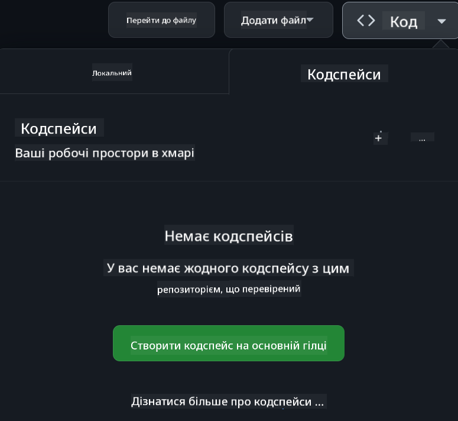

<!--
CO_OP_TRANSLATOR_METADATA:
{
  "original_hash": "8b9d0562ea649b6012d1a67acc630681",
  "translation_date": "2025-10-24T15:20:27+00:00",
  "source_file": "README.md",
  "language_code": "uk"
}
-->
[](https://github.com/microsoft/Web-Dev-For-Beginners/blob/master/LICENSE)
[](https://GitHub.com/microsoft/Web-Dev-For-Beginners/graphs/contributors/)
[](https://GitHub.com/microsoft/Web-Dev-For-Beginners/issues/)
[](https://GitHub.com/microsoft/Web-Dev-For-Beginners/pulls/)
[](http://makeapullrequest.com)

[](https://GitHub.com/microsoft/Web-Dev-For-Beginners/watchers/)
[](https://GitHub.com/microsoft/Web-Dev-For-Beginners/network/)
[](https://GitHub.com/microsoft/Web-Dev-For-Beginners/stargazers/)

[](https://discord.gg/zxKYvhSnVp?WT.mc_id=academic-000002-leestott)

# Веб-розробка для початківців - навчальна програма

Вивчайте основи веб-розробки за допомогою нашого 12-тижневого курсу від Microsoft Cloud Advocates. Кожен із 24 уроків охоплює JavaScript, CSS і HTML через практичні проєкти, такі як тераріуми, розширення для браузера та космічні ігри. Залучайтеся до вікторин, обговорень і практичних завдань. Покращуйте свої навички та оптимізуйте засвоєння знань завдяки нашій ефективній проєктно-орієнтованій методиці. Почніть свою подорож у програмуванні вже сьогодні!

Приєднуйтесь до спільноти Azure AI Foundry у Discord

[](https://discord.com/invite/ByRwuEEgH4)

Виконайте наступні кроки, щоб почати використовувати ці ресурси:
1. **Форкніть репозиторій**: Натисніть [](https://GitHub.com/microsoft/Web-Dev-For-Beginners/fork)
2. **Клонуйте репозиторій**:   `git clone https://github.com/microsoft/Web-Dev-For-Beginners.git`
3. [**Приєднуйтесь до Azure AI Foundry Discord та спілкуйтесь з експертами та іншими розробниками**](https://discord.com/invite/ByRwuEEgH4)

### 🌐 Підтримка багатомовності

#### Підтримується через GitHub Action (автоматично та завжди актуально)

<!-- CO-OP TRANSLATOR LANGUAGES TABLE START -->
[Арабська](../ar/README.md) | [Бенгальська](../bn/README.md) | [Болгарська](../bg/README.md) | [Бірманська (М'янма)](../my/README.md) | [Китайська (спрощена)](../zh/README.md) | [Китайська (традиційна, Гонконг)](../hk/README.md) | [Китайська (традиційна, Макао)](../mo/README.md) | [Китайська (традиційна, Тайвань)](../tw/README.md) | [Хорватська](../hr/README.md) | [Чеська](../cs/README.md) | [Данська](../da/README.md) | [Нідерландська](../nl/README.md) | [Естонська](../et/README.md) | [Фінська](../fi/README.md) | [Французька](../fr/README.md) | [Німецька](../de/README.md) | [Грецька](../el/README.md) | [Іврит](../he/README.md) | [Гінді](../hi/README.md) | [Угорська](../hu/README.md) | [Індонезійська](../id/README.md) | [Італійська](../it/README.md) | [Японська](../ja/README.md) | [Корейська](../ko/README.md) | [Литовська](../lt/README.md) | [Малайська](../ms/README.md) | [Маратхі](../mr/README.md) | [Непальська](../ne/README.md) | [Норвезька](../no/README.md) | [Перська (фарсі)](../fa/README.md) | [Польська](../pl/README.md) | [Португальська (Бразилія)](../br/README.md) | [Португальська (Португалія)](../pt/README.md) | [Панджабі (Гурмухі)](../pa/README.md) | [Румунська](../ro/README.md) | [Російська](../ru/README.md) | [Сербська (кирилиця)](../sr/README.md) | [Словацька](../sk/README.md) | [Словенська](../sl/README.md) | [Іспанська](../es/README.md) | [Суахілі](../sw/README.md) | [Шведська](../sv/README.md) | [Тагальська (Філіппіни)](../tl/README.md) | [Тамільська](../ta/README.md) | [Тайська](../th/README.md) | [Турецька](../tr/README.md) | [Українська](./README.md) | [Урду](../ur/README.md) | [В'єтнамська](../vi/README.md)
<!-- CO-OP TRANSLATOR LANGUAGES TABLE END -->

**Якщо ви хочете додати додаткові переклади, список підтримуваних мов знаходиться [тут](https://github.com/Azure/co-op-translator/blob/main/getting_started/supported-languages.md)**

[](https://open.vscode.dev/microsoft/Web-Dev-For-Beginners)

#### 🧑‍🎓 _Ви студент?_

Відвідайте [**Сторінку для студентів**](https://docs.microsoft.com/learn/student-hub/?WT.mc_id=academic-77807-sagibbon), де ви знайдете ресурси для початківців, студентські пакети та навіть способи отримати безкоштовний сертифікат. Це сторінка, яку варто додати в закладки та перевіряти час від часу, оскільки ми щомісяця змінюємо контент.

### 📣 Оголошення - Нові завдання з режимом GitHub Copilot Agent!

Додано нове завдання, шукайте "GitHub Copilot Agent Challenge 🚀" у більшості розділів. Це нове завдання для вас, яке можна виконати за допомогою GitHub Copilot та режиму Agent. Якщо ви ще не використовували режим Agent, він здатний не лише генерувати текст, але й створювати та редагувати файли, виконувати команди тощо.

### 📣 Оголошення - _Новий проєкт для створення за допомогою генеративного AI_

Додано новий проєкт AI Assistant, ознайомтеся з ним [проєкт](./09-chat-project/README.md)

### 📣 Оголошення - _Нова навчальна програма_ з генеративного AI для JavaScript

Не пропустіть нашу нову навчальну програму з генеративного AI!

Відвідайте [https://aka.ms/genai-js-course](https://aka.ms/genai-js-course), щоб розпочати!


- Уроки, що охоплюють все від основ до RAG.
- Взаємодія з історичними персонажами за допомогою GenAI та нашого додатку-компаньйона.
- Весела та захоплююча розповідь, ви будете подорожувати у часі!


Кожен урок включає завдання для виконання, перевірку знань та виклик, щоб допомогти вам освоїти такі теми, як:
- Створення запитів та інженерія запитів
- Генерація тексту та зображень
- Додатки для пошуку

Відвідайте [https://aka.ms/genai-js-course](../../[https:/aka.ms/genai-js-course), щоб розпочати!


## 🌱 Початок роботи

> **Вчителі**, ми [додали кілька пропозицій](for-teachers.md) щодо використання цієї навчальної програми. Ми будемо раді вашим відгукам [у нашому форумі обговорень](https://github.com/microsoft/Web-Dev-For-Beginners/discussions/categories/teacher-corner)!

**[Учні](https://aka.ms/student-page/?WT.mc_id=academic-77807-sagibbon)**, для кожного уроку починайте з вікторини перед лекцією, читайте матеріал лекції, виконуйте різні завдання та перевіряйте свої знання за допомогою вікторини після лекції.

Щоб покращити ваш навчальний досвід, спілкуйтеся з однолітками, щоб працювати над проєктами разом! Обговорення заохочуються у нашому [форумі обговорень](https://github.com/microsoft/Web-Dev-For-Beginners/discussions), де наша команда модераторів буде доступна для відповіді на ваші запитання.

Для подальшого навчання ми настійно рекомендуємо ознайомитися з [Microsoft Learn](https://learn.microsoft.com/users/wirelesslife/collections/p1ddcy5jwy0jkm?WT.mc_id=academic-77807-sagibbon) для додаткових навчальних матеріалів.

### 📋 Налаштування вашого середовища

Ця навчальна програма має готове до використання середовище розробки! На початку ви можете вибрати запуск навчальної програми у [Codespace](https://github.com/features/codespaces/) (_середовище на основі браузера, без необхідності встановлення_), або локально на вашому комп'ютері за допомогою текстового редактора, такого як [Visual Studio Code](https://code.visualstudio.com/?WT.mc_id=academic-77807-sagibbon).

#### Створіть свій репозиторій
Щоб легко зберігати вашу роботу, рекомендується створити власну копію цього репозиторію. Ви можете зробити це, натиснувши кнопку **Use this template** у верхній частині сторінки. Це створить новий репозиторій у вашому обліковому записі GitHub з копією навчальної програми.

Виконайте наступні кроки:
1. **Форкніть репозиторій**: Натисніть кнопку "Fork" у верхньому правому куті цієї сторінки.
2. **Клонуйте репозиторій**:   `git clone https://github.com/microsoft/Web-Dev-For-Beginners.git`

#### Запуск навчальної програми у Codespace

У вашій копії цього репозиторію, яку ви створили, натисніть кнопку **Code** та виберіть **Open with Codespaces**. Це створить новий Codespace для роботи.



#### Запуск навчальної програми локально на вашому комп'ютері

Щоб запустити цю навчальну програму локально на вашому комп'ютері, вам знадобиться текстовий редактор, браузер та інструмент командного рядка. Наш перший урок, [Вступ до мов програмування та інструментів](../../1-getting-started-lessons/1-intro-to-programming-languages), проведе вас через різні варіанти кожного з цих інструментів, щоб ви могли вибрати те, що найкраще підходить для вас.

Ми рекомендуємо використовувати [Visual Studio Code](https://code.visualstudio.com/?WT.mc_id=academic-77807-sagibbon) як ваш редактор, який також має вбудований [Термінал](https://code.visualstudio.com/docs/terminal/basics/?WT.mc_id=academic-77807-sagibbon). Ви можете завантажити Visual Studio Code [тут](https://code.visualstudio.com/?WT.mc_id=academic-77807-sagibbon).

1. Клонуйте ваш репозиторій на комп'ютер. Ви можете зробити це, натиснувши кнопку **Code** та скопіювавши URL:

    [CodeSpace](./images/createcodespace.png)

    Потім відкрийте [Термінал](https://code.visualstudio.com/docs/terminal/basics/?WT.mc_id=academic-77807-sagibbon) у [Visual Studio Code](https://code.visualstudio.com/?WT.mc_id=academic-77807-sagibbon) та виконайте наступну команду, замінивши `<your-repository-url>` на URL, який ви щойно скопіювали:

    ```bash 
    git clone <your-repository-url>
    ```

2. Відкрийте папку у Visual Studio Code. Ви можете зробити це, натиснувши **File** > **Open Folder** та вибравши папку, яку ви щойно клонували.


> Рекомендовані розширення для Visual Studio Code:
>
> * [Live Server](https://marketplace.visualstudio.com/items?itemName=ritwickdey.LiveServer&WT.mc_id=academic-77807-sagibbon) - для перегляду HTML-сторінок у Visual Studio Code
> * [Copilot](https://marketplace.visualstudio.com/items?itemName=GitHub.copilot&WT.mc_id=academic-77807-sagibbon) - для швидшого написання коду

## 📂 Кожен урок включає:

- необов'язкову скетчноту
- необов'язкове додаткове відео
- розігрівочний тест перед уроком
- письмовий матеріал уроку
- для уроків, заснованих на проєктах, покрокові інструкції щодо створення проєкту
- перевірку знань
- завдання
- додаткові матеріали для читання
- домашнє завдання
- [тест після уроку](https://ff-quizzes.netlify.app/web/)

> **Примітка щодо тестів**: Усі тести знаходяться в папці Quiz-app, всього 48 тестів по три питання кожен. Вони доступні [тут](https://ff-quizzes.netlify.app/web/), додаток для тестів можна запустити локально або розгорнути на Azure; дотримуйтесь інструкцій у папці `quiz-app`.

## 🗃️ Уроки

|     |                       Назва проєкту                       |                            Вивчені концепти                             | Навчальні цілі                                                                                                                 |                                                         Посилання на урок                                                          |         Автор          |
| :-: | :------------------------------------------------------: | :--------------------------------------------------------------------: | ----------------------------------------------------------------------------------------------------------------------------------- | :----------------------------------------------------------------------------------------------------------------------------: | :---------------------: |
| 01  |                     Початок роботи                      |           Вступ до програмування та інструментів розробника           | Дізнайтеся основи більшості мов програмування та про програмне забезпечення, яке допомагає професійним розробникам виконувати їхню роботу | [Вступ до мов програмування та інструментів розробника](./1-getting-started-lessons/1-intro-to-programming-languages/README.md) |         Jasmine         |
| 02  |                     Початок роботи                      |             Основи GitHub, включаючи роботу в команді             | Як використовувати GitHub у вашому проєкті, як співпрацювати з іншими над кодовою базою                                                    |                            [Вступ до GitHub](./1-getting-started-lessons/2-github-basics/README.md)                             |          Floor          |
| 03  |                     Початок роботи                      |                             Доступність                              | Дізнайтеся основи веб-доступності                                                                                               |                       [Основи доступності](./1-getting-started-lessons/3-accessibility/README.md)                       |       Christopher       |
| 04  |                        Основи JS                         |                         Типи даних у JavaScript                          | Основи типів даних у JavaScript                                                                                                 |                                       [Типи даних](./2-js-basics/1-data-types/README.md)                                        |         Jasmine         |
| 05  |                        Основи JS                         |                         Функції та методи                          | Дізнайтеся про функції та методи для управління логікою додатка                                                             |                              [Функції та методи](./2-js-basics/2-functions-methods/README.md)                               | Jasmine і Christopher |
| 06  |                        Основи JS                         |                        Прийняття рішень у JS                        | Дізнайтеся, як створювати умови у вашому коді за допомогою методів прийняття рішень                                                           |                                 [Прийняття рішень](./2-js-basics/3-making-decisions/README.md)                                  |         Jasmine         |
| 07  |                        Основи JS                         |                            Масиви та цикли                            | Робота з даними за допомогою масивів та циклів у JavaScript                                                                                 |                                   [Масиви та цикли](./2-js-basics/4-arrays-loops/README.md)                                    |         Jasmine         |
| 08  |       [Тераріум](./3-terrarium/solution/README.md)       |                            HTML на практиці                            | Створіть HTML для онлайн-тераріуму, зосереджуючись на створенні макета                                                         |                                 [Вступ до HTML](./3-terrarium/1-intro-to-html/README.md)                                 |           Jen           |
| 09  |       [Тераріум](./3-terrarium/solution/README.md)       |                            CSS на практиці                             | Створіть CSS для стилізації онлайн-тераріуму, зосереджуючись на основах CSS, включаючи адаптивність сторінки                     |                                  [Вступ до CSS](./3-terrarium/2-intro-to-css/README.md)                                  |           Jen           |
| 10  |            [Тераріум](./3-terrarium/solution/README.md)            |                 Замикання JavaScript, маніпуляція DOM                  | Створіть JavaScript для функціонування тераріуму як інтерфейсу перетягування, зосереджуючись на замиканнях та маніпуляції DOM             |                  [Замикання JavaScript, маніпуляція DOM](./3-terrarium/3-intro-to-DOM-and-closures/README.md)                   |           Jen           |
| 11  |          [Гра на друкування](./4-typing-game/solution/README.md)          |                          Створення гри на друкування                           | Дізнайтеся, як використовувати події клавіатури для управління логікою вашого JavaScript-додатка                                                          |                                [Програмування, кероване подіями](./4-typing-game/typing-game/README.md)                                |       Christopher       |
| 12  | [Зелений розширення для браузера](./5-browser-extension/solution/README.md) |                         Робота з браузерами                          | Дізнайтеся, як працюють браузери, їхню історію та як створити перші елементи розширення для браузера                               |                               [Про браузери](./5-browser-extension/1-about-browsers/README.md)                                |           Jen           |
| 13  | [Зелений розширення для браузера](./5-browser-extension/solution/README.md) | Створення форми, виклик API та збереження змінних у локальному сховищі | Створіть елементи JavaScript вашого розширення для браузера, щоб викликати API, використовуючи змінні, збережені в локальному сховищі                      |                [API, форми та локальне сховище](./5-browser-extension/2-forms-browsers-local-storage/README.md)                 |           Jen           |
| 14  | [Зелений розширення для браузера](./5-browser-extension/solution/README.md) |          Фонові процеси в браузері, продуктивність вебу          | Використовуйте фонові процеси браузера для управління іконкою розширення; дізнайтеся про продуктивність вебу та деякі оптимізації   |             [Фонові завдання та продуктивність](./5-browser-extension/3-background-tasks-and-performance/README.md)              |           Jen           |
| 15  |           [Космічна гра](./6-space-game/solution/README.md)           |             Більш просунута розробка ігор з JavaScript             | Дізнайтеся про наслідування, використовуючи як класи, так і композицію, а також про шаблон Pub/Sub, готуючись до створення гри              |                      [Вступ до просунутої розробки ігор](./6-space-game/1-introduction/README.md)                       |          Chris          |
| 16  |           [Космічна гра](./6-space-game/solution/README.md)           |                           Малювання на canvas                            | Дізнайтеся про API Canvas, який використовується для малювання елементів на екрані                                                                       |                                [Малювання на canvas](./6-space-game/2-drawing-to-canvas/README.md)                                |          Chris          |
| 17  |           [Космічна гра](./6-space-game/solution/README.md)           |                   Переміщення елементів по екрану                    | Дізнайтеся, як елементи можуть набувати руху, використовуючи декартові координати та API Canvas                                            |                           [Переміщення елементів](./6-space-game/3-moving-elements-around/README.md)                           |          Chris          |
| 18  |           [Космічна гра](./6-space-game/solution/README.md)           |                          Виявлення зіткнень                           | Зробіть так, щоб елементи зіткнулися та реагували один на одного за допомогою натискань клавіш, забезпечте функцію охолодження для продуктивності гри    |                              [Виявлення зіткнень](./6-space-game/4-collision-detection/README.md)                              |          Chris          |
| 19  |           [Космічна гра](./6-space-game/solution/README.md)           |                             Підрахунок очок                              | Виконуйте математичні обчислення на основі статусу гри та продуктивності                                                                |                                    [Підрахунок очок](./6-space-game/5-keeping-score/README.md)                                    |          Chris          |
| 20  |           [Космічна гра](./6-space-game/solution/README.md)           |                     Завершення та перезапуск гри                     | Дізнайтеся про завершення та перезапуск гри, включаючи очищення ресурсів та скидання значень змінних                              |                                [Умови завершення](./6-space-game/6-end-condition/README.md)                                 |          Chris          |
| 21  |         [Банківський додаток](./7-bank-project/solution/README.md)          |                 HTML-шаблони та маршрути у веб-додатку                 | Дізнайтеся, як створити структуру архітектури багатосторінкового веб-сайту, використовуючи маршрути та HTML-шаблони                             |                            [HTML-шаблони та маршрути](./7-bank-project/1-template-route/README.md)                             |          Yohan          |
| 22  |         [Банківський додаток](./7-bank-project/solution/README.md)          |                  Створення форми входу та реєстрації                   | Дізнайтеся про створення форм та обробку процедур перевірки                                                                          |                                           [Форми](./7-bank-project/2-forms/README.md)                                           |          Yohan          |
| 23  |         [Банківський додаток](./7-bank-project/solution/README.md)          |                   Методи отримання та використання даних                   | Як дані надходять у ваш додаток, як їх отримувати, зберігати та видаляти                                                 |                                            [Дані](./7-bank-project/3-data/README.md)                                            |          Yohan          |
| 24  |         [Банківський додаток](./7-bank-project/solution/README.md)          |                      Концепти управління станом                      | Дізнайтеся, як ваш додаток зберігає стан і як ним управляти програмно                                                              |                                [Управління станом](./7-bank-project/4-state-management/README.md)                                |          Yohan          |
| 25 | [Браузер/Редактор коду VScode](../../8-code-editor) | Робота з VScode | Дізнайтеся, як використовувати редактор коду | [Використання редактора коду VScode](./8-code-editor/1-using-a-code-editor/README.md) | Chris |
| 26 | [AI Асистенти](./9-chat-project/README.md) | Робота з AI | Дізнайтеся, як створити власного AI асистента | [Проєкт AI Асистент](./9-chat-project/README.md) | Chris |

## 🏫 Педагогіка

Наша навчальна програма розроблена з урахуванням двох ключових педагогічних принципів:
* навчання на основі проєктів
* часті тести

Програма навчає основам JavaScript, HTML і CSS, а також найновішим інструментам і технікам, які використовують сучасні веб-розробники. Студенти матимуть можливість отримати практичний досвід, створюючи гру на друкування, віртуальний тераріум, екологічне розширення для браузера, гру в стилі космічних загарбників і банківський додаток для бізнесу. До кінця серії студенти отримають міцне розуміння веб-розробки.

> 🎓 Ви можете пройти перші кілька уроків цієї програми як [Шлях навчання](https://docs.microsoft.com/learn/paths/web-development-101/?WT.mc_id=academic-77807-sagibbon) на Microsoft Learn!

Забезпечуючи відповідність контенту проєктам, процес стає більш захоплюючим для студентів, а засвоєння концептів буде покращено. Ми також написали кілька вступних уроків з основ JavaScript для введення концептів, у парі з відео з колекції "[Серія для початківців: JavaScript](https://channel9.msdn.com/Series/Beginners-Series-to-JavaScript/?WT.mc_id=academic-77807-sagibbon)", деякі з авторів якої внесли свій вклад у цю навчальну програму.

Крім того, тест з низькими ставками перед заняттям налаштовує студента на вивчення теми, а другий тест після заняття забезпечує подальше засвоєння. Ця навчальна програма була розроблена, щоб бути гнучкою та цікавою, її можна пройти повністю або частково. Проєкти починаються з малого і стають дедалі складнішими до кінця 12-тижневого циклу.

Хоча ми навмисно уникали введення фреймворків JavaScript, щоб зосередитися на базових навичках, необхідних веб-розробнику перед освоєнням фреймворка, хорошим наступним кроком після завершення цієї програми буде вивчення Node.js через іншу колекцію відео: "[Серія для початківців: Node.js](https://channel9.msdn.com/Series/Beginners-Series-to-Nodejs/?WT.mc_id=academic-77807-sagibbon)".

> Відвідайте наші [Правила поведінки](CODE_OF_CONDUCT.md) та [Рекомендації щодо внесення змін](CONTRIBUTING.md). Ми вітаємо ваші конструктивні відгуки!


## 🧭 Офлайн-доступ

Ви можете запустити цю документацію офлайн, використовуючи [Docsify](https://docsify.js.org/#/). Форкніть цей репозиторій, [встановіть Docsify](https://docsify.js.org/#/quickstart) на ваш локальний комп'ютер, а потім у кореневій папці цього репозиторію введіть `docsify serve`. Веб-сайт буде запущений на порту 3000 на вашому localhost: `localhost:3000`.

## 📘 PDF

PDF усіх уроків можна знайти [тут](https://microsoft.github.io/Web-Dev-For-Beginners/pdf/readme.pdf).


## 🎒 Інші курси

Наша команда створює інші курси! Ознайомтеся:

### Azure / Edge / MCP / Agents
[](https://github.com/microsoft/AZD-for-beginners?WT.mc_id=academic-105485-koreyst)
[](https://github.com/microsoft/edgeai-for-beginners?WT.mc_id=academic-105485-koreyst)  
[](https://github.com/microsoft/mcp-for-beginners?WT.mc_id=academic-105485-koreyst)  
[](https://github.com/microsoft/ai-agents-for-beginners?WT.mc_id=academic-105485-koreyst)  

---

### Серія про генеративний AI  
[](https://github.com/microsoft/generative-ai-for-beginners?WT.mc_id=academic-105485-koreyst)  
[-9333EA?style=for-the-badge&labelColor=E5E7EB&color=9333EA)](https://github.com/microsoft/Generative-AI-for-beginners-dotnet?WT.mc_id=academic-105485-koreyst)  
[-C084FC?style=for-the-badge&labelColor=E5E7EB&color=C084FC)](https://github.com/microsoft/generative-ai-for-beginners-java?WT.mc_id=academic-105485-koreyst)  
[-E879F9?style=for-the-badge&labelColor=E5E7EB&color=E879F9)](https://github.com/microsoft/generative-ai-with-javascript?WT.mc_id=academic-105485-koreyst)  

---

### Основне навчання  
[](https://aka.ms/ml-beginners?WT.mc_id=academic-105485-koreyst)  
[](https://aka.ms/datascience-beginners?WT.mc_id=academic-105485-koreyst)  
[](https://aka.ms/ai-beginners?WT.mc_id=academic-105485-koreyst)  
[](https://github.com/microsoft/Security-101?WT.mc_id=academic-96948-sayoung)  
[](https://aka.ms/webdev-beginners?WT.mc_id=academic-105485-koreyst)  
[](https://aka.ms/iot-beginners?WT.mc_id=academic-105485-koreyst)  
[](https://github.com/microsoft/xr-development-for-beginners?WT.mc_id=academic-105485-koreyst)  

---

### Серія Copilot  
[](https://aka.ms/GitHubCopilotAI?WT.mc_id=academic-105485-koreyst)  
[](https://github.com/microsoft/mastering-github-copilot-for-dotnet-csharp-developers?WT.mc_id=academic-105485-koreyst)  
[](https://github.com/microsoft/CopilotAdventures?WT.mc_id=academic-105485-koreyst)  

## Отримання допомоги  

Якщо ви застрягли або маєте питання щодо створення AI-додатків, приєднуйтесь:  

[](https://aka.ms/foundry/discord)  

Якщо у вас є відгуки про продукт або виникають помилки під час створення, відвідайте:  

[](https://aka.ms/foundry/forum)  

## Ліцензія  

Цей репозиторій ліцензований за ліцензією MIT. Дивіться файл [LICENSE](../../LICENSE) для отримання додаткової інформації.  

---

**Відмова від відповідальності**:  
Цей документ був перекладений за допомогою сервісу автоматичного перекладу [Co-op Translator](https://github.com/Azure/co-op-translator). Хоча ми прагнемо до точності, будь ласка, майте на увазі, що автоматичні переклади можуть містити помилки або неточності. Оригінальний документ на його рідній мові слід вважати авторитетним джерелом. Для критичної інформації рекомендується професійний людський переклад. Ми не несемо відповідальності за будь-які непорозуміння або неправильні тлумачення, що виникають внаслідок використання цього перекладу.