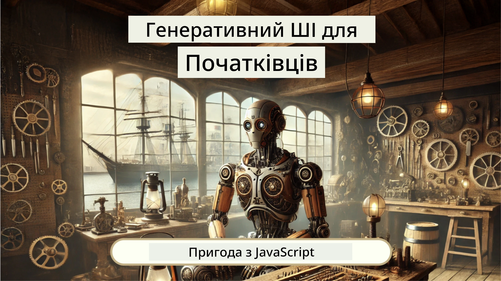
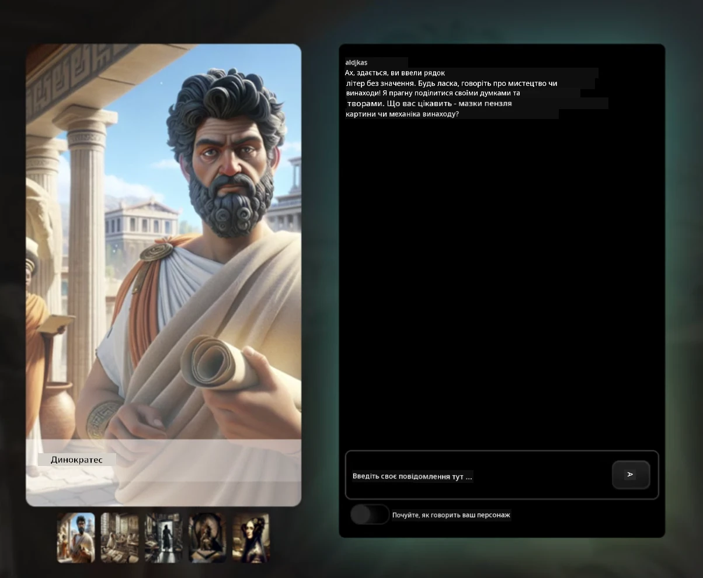

[](https://github.com/microsoft/Web-Dev-For-Beginners/blob/master/LICENSE)
[](https://GitHub.com/microsoft/Web-Dev-For-Beginners/graphs/contributors/)
[](https://GitHub.com/microsoft/Web-Dev-For-Beginners/issues/)
[](https://GitHub.com/microsoft/Web-Dev-For-Beginners/pulls/)
[](http://makeapullrequest.com)

[](https://GitHub.com/microsoft/Web-Dev-For-Beginners/watchers/)
[](https://GitHub.com/microsoft/Web-Dev-For-Beginners/network/)
[](https://GitHub.com/microsoft/Web-Dev-For-Beginners/stargazers/)

[](https://discord.gg/nTYy5BXMWG)

# Веб-розробка для початківців - Навчальний курс

Вивчайте основи веб-розробки з нашим 12-тижневим комплексним курсом від Microsoft Cloud Advocates. Кожен з 24 уроків поглиблено розглядає JavaScript, CSS і HTML через практичні проекти, такі як тераріуми, розширення браузера та космічні ігри. Беріть участь у вікторинах, обговореннях та практичних завданнях. Покращуйте свої навички та оптимізуйте засвоєння знань за допомогою нашої ефективної методики на основі проектів. Почніть своє програмування вже сьогодні!

Приєднайтеся до спільноти Azure AI Foundry в Discord

[](https://discord.gg/nTYy5BXMWG)

Дотримуйтесь цих кроків, щоб почати використовувати ці ресурси:
1. **Форкніть репозиторій**: Натисніть [](https://GitHub.com/microsoft/Web-Dev-For-Beginners/fork)
2. **Клонуйте репозиторій**:   `git clone https://github.com/microsoft/Web-Dev-For-Beginners.git`
3. [**Приєднайтесь до Azure AI Foundry Discord та зустрічайте експертів і колег-розробників**](https://discord.com/invite/ByRwuEEgH4)

### 🌐 Підтримка кількох мов

#### Підтримка через GitHub Action (Автоматично і завжди актуально)

<!-- CO-OP TRANSLATOR LANGUAGES TABLE START -->
[Арабська](../ar/README.md) | [Бенгальська](../bn/README.md) | [Болгарська](../bg/README.md) | [Бирманська (М’янма)](../my/README.md) | [Китайська (спрощена)](../zh-CN/README.md) | [Китайська (традиційна, Гонконг)](../zh-HK/README.md) | [Китайська (традиційна, Макао)](../zh-MO/README.md) | [Китайська (традиційна, Тайвань)](../zh-TW/README.md) | [Хорватська](../hr/README.md) | [Чеська](../cs/README.md) | [Данська](../da/README.md) | [Голландська](../nl/README.md) | [Естонська](../et/README.md) | [Фінська](../fi/README.md) | [Французька](../fr/README.md) | [Німецька](../de/README.md) | [Грецька](../el/README.md) | [Іврит](../he/README.md) | [Хінді](../hi/README.md) | [Угорська](../hu/README.md) | [Індонезійська](../id/README.md) | [Італійська](../it/README.md) | [Японська](../ja/README.md) | [Каннада](../kn/README.md) | [Корейська](../ko/README.md) | [Литовська](../lt/README.md) | [Малайська](../ms/README.md) | [Малаялам](../ml/README.md) | [Маратхі](../mr/README.md) | [Непальська](../ne/README.md) | [Нігерійська підіжин](../pcm/README.md) | [Норвезька](../no/README.md) | [Перська (фарсі)](../fa/README.md) | [Польська](../pl/README.md) | [Португальська (Бразилія)](../pt-BR/README.md) | [Португальська (Португалія)](../pt-PT/README.md) | [Пенджабі (Гурмукхі)](../pa/README.md) | [Румунська](../ro/README.md) | [Російська](../ru/README.md) | [Сербська (кирилиця)](../sr/README.md) | [Словацька](../sk/README.md) | [Словенська](../sl/README.md) | [Іспанська](../es/README.md) | [Свахілі](../sw/README.md) | [Шведська](../sv/README.md) | [Тагальська (філіппінська)](../tl/README.md) | [Тамільська](../ta/README.md) | [Телугу](../te/README.md) | [Тайська](../th/README.md) | [Турецька](../tr/README.md) | [Українська](./README.md) | [Урду](../ur/README.md) | [В’єтнамська](../vi/README.md)

> **Віддаєте перевагу клонуванню локально?**

> У цьому репозиторії є понад 50 мовних перекладів, що значно збільшує розмір завантаження. Щоб клонувати без перекладів, використовуйте sparse checkout:
> ```bash
> git clone --filter=blob:none --sparse https://github.com/microsoft/Web-Dev-For-Beginners.git
> cd Web-Dev-For-Beginners
> git sparse-checkout set --no-cone '/*' '!translations' '!translated_images'
> ```
> Це дасть вам усе необхідне для проходження курсу з набагато швидшим завантаженням.
<!-- CO-OP TRANSLATOR LANGUAGES TABLE END -->

**Якщо ви хочете, щоб підтримка додаткових мов перекладу була додана, вони перераховані [тут](https://github.com/Azure/co-op-translator/blob/main/getting_started/supported-languages.md)**

[](https://open.vscode.dev/microsoft/Web-Dev-For-Beginners)

#### 🧑‍🎓 _Ви студент?_

Відвідайте [**сторінку Student Hub**](https://docs.microsoft.com/learn/student-hub/?WT.mc_id=academic-77807-sagibbon), де знайдете ресурси для початківців, студентські пакети та навіть способи отримати безкоштовний ваучер на сертифікат. Цю сторінку варто додати в закладки і час від часу перевіряти, адже ми щомісяця оновлюємо контент.

### 📣 Оголошення - Нові виклики в режимі агента GitHub Copilot!

Додано новий виклик, шукайте "GitHub Copilot Agent Challenge 🚀" у більшості розділів. Це нове завдання для вас, яке потрібно виконати за допомогою GitHub Copilot і режиму агента. Якщо ви раніше не використовували режим агента, він не лише генерує текст, а й може створювати та редагувати файли, запускати команди та багато іншого.

### 📣 Оголошення - _Новий проект на базі Генеративного ШІ_

Щойно додано новий проект AI Assistant, ознайомтеся [проектом](./9-chat-project/README.md)

### 📣 Оголошення - _Нещодавно випущено новий навчальний курс_ з Генеративного ШІ для JavaScript

Не пропустіть наш новий курс з Генеративного ШІ!

Відвідайте [https://aka.ms/genai-js-course](https://aka.ms/genai-js-course), щоб почати!



- Уроки охоплюють все від основ до RAG.
- Спілкуйтесь з історичними персонажами за допомогою GenAI і нашого компаньйона-додатку.
- Цікаве і захоплююче оповідання, ви будете подорожувати в часі!




Кожен урок включає завдання для виконання, перевірку знань і виклик, щоб допомогти вам опанувати такі теми, як:
- Формування запитів та інженерія запитів (prompt engineering)
- Генерація текстових і зображальних додатків
- Пошукові додатки

Відвідайте [https://aka.ms/genai-js-course](../../[https:/aka.ms/genai-js-course), щоб почати!


## 🌱 Початок роботи

> **Вчителі**, ми додали [деякі пропозиції](for-teachers.md) щодо використання цього курсу. Будемо раді вашим відгукам [у нашому форумі обговорень](https://github.com/microsoft/Web-Dev-For-Beginners/discussions/categories/teacher-corner)!

**[Учні](https://aka.ms/student-page/?WT.mc_id=academic-77807-sagibbon)**, для кожного уроку починайте з передлекційної вікторини, потім читайте матеріал лекції, виконуйте різні активності та перевіряйте розуміння за допомогою постлекційної вікторини.

Для покращення навчального досвіду спілкуйтеся з однокурсниками й працюйте над проектами разом! Обговорення заохочуються у нашому [форумі обговорень](https://github.com/microsoft/Web-Dev-For-Beginners/discussions), де наша команда модераторів відповість на ваші питання.

Для подальшого навчання рекомендуємо дослідити [Microsoft Learn](https://learn.microsoft.com/users/wirelesslife/collections/p1ddcy5jwy0jkm?WT.mc_id=academic-77807-sagibbon) на предмет додаткових навчальних матеріалів.

### 📋 Налаштування вашого середовища

Цей курс має готове середовище розробки! На початку ви можете виконувати курс у [Codespace](https://github.com/features/codespaces/) (_середовище на базі браузера, без необхідності встановлення_), або локально на вашому комп’ютері за допомогою текстового редактора, такого як [Visual Studio Code](https://code.visualstudio.com/?WT.mc_id=academic-77807-sagibbon).

#### Створіть свій репозиторій
Щоб вам було зручно зберігати вашу роботу, рекомендується створити власну копію цього репозиторію. Це можна зробити, натиснувши кнопку **Use this template** вгорі сторінки. Це створить новий репозиторій у вашому акаунті GitHub з копією курсу.

Виконайте ці кроки:
1. **Форкніть репозиторій**: Натисніть кнопку "Fork" у правому верхньому кутку цієї сторінки.
2. **Клонуйте репозиторій**:   `git clone https://github.com/microsoft/Web-Dev-For-Beginners.git`

#### Запуск курсу в Codespace

У вашій копії цього репозиторію, яку ви створили, натисніть кнопку **Code** та оберіть **Open with Codespaces**. Це створить для вас новий Codespace для роботи.


#### Запуск курсу локально на вашому комп’ютері

Щоб запускати цей курс локально на вашому комп’ютері, вам потрібен текстовий редактор, браузер і консольний інструмент. Наш перший урок, [Вступ до мов програмування та інструментів](../../1-getting-started-lessons/1-intro-to-programming-languages), допоможе вам обрати найкращі варіанти кожного з цих інструментів.

Ми рекомендуємо використовувати в якості редактора [Visual Studio Code](https://code.visualstudio.com/?WT.mc_id=academic-77807-sagibbon), який також має вбудований [Термінал](https://code.visualstudio.com/docs/terminal/basics/?WT.mc_id=academic-77807-sagibbon). Ви можете завантажити Visual Studio Code [тут](https://code.visualstudio.com/?WT.mc_id=academic-77807-sagibbon).


1. Клонуйте свій репозиторій на комп’ютер. Для цього натисніть кнопку **Code** і скопіюйте URL:

    [CodeSpace](./images/createcodespace.png)
Тоді відкрийте [Термінал](https://code.visualstudio.com/docs/terminal/basics/?WT.mc_id=academic-77807-sagibbon) всередині [Visual Studio Code](https://code.visualstudio.com/?WT.mc_id=academic-77807-sagibbon) і виконайте наступну команду, замінивши `<your-repository-url>` на URL, який ви щойно скопіювали:

    ```bash 
    git clone <your-repository-url>
    ```

2. Відкрийте папку у Visual Studio Code. Ви можете зробити це, натиснувши **File** > **Open Folder** і вибравши папку, яку щойно клонували.


>  Рекомендовані розширення Visual Studio Code:
>
> * [Live Server](https://marketplace.visualstudio.com/items?itemName=ritwickdey.LiveServer&WT.mc_id=academic-77807-sagibbon) - щоб переглядати сторінки HTML у Visual Studio Code
> * [Copilot](https://marketplace.visualstudio.com/items?itemName=GitHub.copilot&WT.mc_id=academic-77807-sagibbon) - щоб допомагати швидше писати код

## 📂 Кожен урок включає:

- необов’язкову схематичну замітку
- необов’язкове додаткове відео
- розігрівальний тест перед уроком
- письмовий урок
- для уроків із проєктами — покрокові інструкції зі створення проєкту
- перевірки знань
- виклик
- додаткове читання
- завдання
- [тест після уроку](https://ff-quizzes.netlify.app/web/)

> **Примітка про тести**: Всі тести знаходяться в папці Quiz-app, всього 48 тестів по три питання кожен. Вони доступні [тут](https://ff-quizzes.netlify.app/web/), додаток для тестів можна запускати локально або розгортати в Azure; дотримуйтесь інструкцій у папці `quiz-app`.

## 🗃️ Уроки

|     |                       Назва проєкту                        |                            Вивчені концепції                             | Навчальні цілі                                                                                                                    |                                                         Зв’язаний урок                                                          |         Автор          |
| :-: | :--------------------------------------------------------: | :---------------------------------------------------------------------: | -------------------------------------------------------------------------------------------------------------------------------- | :----------------------------------------------------------------------------------------------------------------------------: | :---------------------: |
| 01  |                     Початок роботи                         |           Вступ до програмування та інструментів галузі                | Вивчити базові основи більшості мов програмування та програмне забезпечення, яке допомагає професійним розробникам               | [Вступ до мов програмування та інструментів галузі](./1-getting-started-lessons/1-intro-to-programming-languages/README.md)    |         Jasmine         |
| 02  |                     Початок роботи                         |             Основи GitHub, включно з роботою в команді                  | Як використовувати GitHub у проєкті, як співпрацювати з іншими над кодовою базою                                                |                            [Вступ до GitHub](./1-getting-started-lessons/2-github-basics/README.md)                            |          Floor          |
| 03  |                     Початок роботи                         |                             Доступність                                 | Вивчити основи веб-доступності                                                                                                  |                       [Основи доступності](./1-getting-started-lessons/3-accessibility/README.md)                       |       Christopher       |
| 04  |                        Основи JS                           |                         Типи даних JavaScript                          | Основи типів даних у JavaScript                                                                                                  |                                       [Типи даних](./2-js-basics/1-data-types/README.md)                                        |         Jasmine         |
| 05  |                        Основи JS                           |                       Функції та методи                               | Вивчити функції та методи для керування логікою застосунку                                                                      |                              [Функції та методи](./2-js-basics/2-functions-methods/README.md)                               | Jasmine та Christopher  |
| 06  |                        Основи JS                           |                         Прийняття рішень з JS                         | Навчитися створювати умови в коді за допомогою методів прийняття рішень                                                         |                                 [Прийняття рішень](./2-js-basics/3-making-decisions/README.md)                                  |         Jasmine         |
| 07  |                        Основи JS                           |                           Масиви та цикли                             | Працювати з даними за допомогою масивів та циклів у JavaScript                                                                  |                                   [Масиви та цикли](./2-js-basics/4-arrays-loops/README.md)                                    |         Jasmine         |
| 08  |       [Тераріум](./3-terrarium/solution/README.md)         |                         HTML на практиці                             | Створити HTML для онлайн-тераріума, зосереджуючись на побудові макета                                                           |                                 [Вступ до HTML](./3-terrarium/1-intro-to-html/README.md)                                 |           Jen           |
| 09  |       [Тераріум](./3-terrarium/solution/README.md)         |                         CSS на практиці                              | Створити CSS для стилізації онлайн-тераріума, зосереджуючись на основах CSS і адаптивності сторінки                              |                                  [Вступ до CSS](./3-terrarium/2-intro-to-css/README.md)                                  |           Jen           |
| 10  |            [Тераріум](./3-terrarium/solution/README.md)         |                 Замикання JavaScript, маніпуляції DOM                 | Створити JavaScript, щоб тераріум працював як інтерфейс перетягування, зосереджуючись на замиканнях і маніпуляціях DOM          |                  [Замикання JavaScript, маніпуляції DOM](./3-terrarium/3-intro-to-DOM-and-closures/README.md)                   |           Jen           |
| 11  |          [Гра-надрукування](./4-typing-game/solution/README.md)          |                          Створення гри-надрукування                    | Вивчити, як використовувати події клавіатури для керування логікою вашого JS-застосунку                                         |                                [Програмування на основі подій](./4-typing-game/typing-game/README.md)                                |       Christopher       |
| 12  | [Екологічне розширення браузера](./5-browser-extension/solution/README.md) |                         Робота з браузерами                          | Навчитися, як працюють браузери, їх історія та як створити перші елементи розширення для браузера                                |                               [Про браузери](./5-browser-extension/1-about-browsers/README.md)                                |           Jen           |
| 13  | [Екологічне розширення браузера](./5-browser-extension/solution/README.md) | Створення форми, виклики API та зберігання змінних у локальне сховище | Створити JavaScript-елементи для розширення браузера, викликати API з використанням змінних, збережених у локальному сховищі     |                [API, форми та локальне сховище](./5-browser-extension/2-forms-browsers-local-storage/README.md)                 |           Jen           |
| 14  | [Екологічне розширення браузера](./5-browser-extension/solution/README.md) |                   Фонові процеси в браузері, продуктивність вебу     | Використовувати фонові процеси браузера для керування іконкою розширення; дізнатися про веб-продуктивність і оптимізації          |             [Фонові завдання та продуктивність](./5-browser-extension/3-background-tasks-and-performance/README.md)              |           Jen           |
| 15  |           [Гра в космосі](./6-space-game/solution/README.md)           |             Більш складна розробка ігор на JavaScript                 | Вивчити наслідування за допомогою класів і композиції та патерн Pub/Sub у підготовці до розробки гри                            |                      [Вступ до розширеної розробки ігор](./6-space-game/1-introduction/README.md)                       |          Chris          |
| 16  |           [Гра в космосі](./6-space-game/solution/README.md)           |                           Малювання на канвасі                         | Вивчити Canvas API, що використовується для малювання елементів на екрані                                                       |                                [Малювання на канвасі](./6-space-game/2-drawing-to-canvas/README.md)                                |          Chris          |
| 17  |           [Гра в космосі](./6-space-game/solution/README.md)           |                   Рух елементів по екрану                             | Дізнатися, як елементи можуть рухатися, використовуючи декартові координати та Canvas API                                        |                           [Рух елементів](./6-space-game/3-moving-elements-around/README.md)                           |          Chris          |
| 18  |           [Гра в космосі](./6-space-game/solution/README.md)           |                          Виявлення зіткнень                          | Зробити, щоб елементи стикалися і реагували одне на одного за допомогою натискань клавіш і забезпечити функцію охолодження для ефективності гри |                              [Виявлення зіткнень](./6-space-game/4-collision-detection/README.md)                              |          Chris          |
| 19  |           [Гра в космосі](./6-space-game/solution/README.md)           |                             Підрахунок балів                          | Виконувати обчислення на основі статусу гри і її результативності                                                               |                                    [Підрахунок балів](./6-space-game/5-keeping-score/README.md)                                    |          Chris          |
| 20  |           [Гра в космосі](./6-space-game/solution/README.md)           |                     Завершення та перезапуск гри                      | Вивчити, як завершити та перезапустити гру, включно з очищенням ресурсів та скиданням значень змінних                           |                                [Умови завершення](./6-space-game/6-end-condition/README.md)                                 |          Chris          |
| 21  |         [Банківський додаток](./7-bank-project/solution/README.md)         |                 HTML-шаблони та маршрути в веб-додатку                 | Навчитися створювати каркас архітектури багатосторінкового сайту за допомогою маршрутизації та HTML-шаблонів                    |                            [HTML-шаблони та маршрути](./7-bank-project/1-template-route/README.md)                             |          Yohan          |
| 22  |         [Банківський додаток](./7-bank-project/solution/README.md)         |                  Створення форм входу та реєстрації                   | Вивчити створення форм і механізми валідації                                                                                     |                                           [Форми](./7-bank-project/2-forms/README.md)                                           |          Yohan          |
| 23  |         [Банківський додаток](./7-bank-project/solution/README.md)         |                   Методи отримання та використання даних              | Як дані надходять у ваш додаток і виходять із нього, як їх отримувати, зберігати та видаляти                                       |                                            [Дані](./7-bank-project/3-data/README.md)                                            |          Yohan          |
| 24  |         [Банківський додаток](./7-bank-project/solution/README.md)         |                      Концепції управління станом                      | Вивчити, як ваш додаток зберігає стан і як ним управляти програмно                                                              |                                [Управління станом](./7-bank-project/4-state-management/README.md)                                |          Yohan          |
| 25 | [Код браузера/VScode](../../8-code-editor) | Робота з VScode | Навчитися користуватися текстовим редактором коду | [Використання редактора коду VScode](./8-code-editor/1-using-a-code-editor/README.md) | Chris |
| 26 | [AI Асистенти](./9-chat-project/README.md) | Робота з AI | Навчитися створювати власного AI асистента | [Проєкт AI Асистент](./9-chat-project/README.md) | Chris |

## 🏫 Педагогіка

Наша навчальна програма розроблена з урахуванням двох ключових педагогічних принципів:
* навчання через проєкти
* часті тести

Програма викладає основи JavaScript, HTML і CSS, а також найновіші інструменти й методи, які використовують сучасні веб-розробники. Студенти матимуть можливість набути практичного досвіду, створюючи гру для надрукування, віртуальний тераріум, екологічне розширення браузера, гру в стилі space invaders і банківський додаток для бізнесу. Наприкінці курсу студенти матимуть міцні знання з веб-розробки.

> 🎓 Ви можете пройти перші кілька уроків із цієї навчальної програми як [Навчальний шлях](https://docs.microsoft.com/learn/paths/web-development-101/?WT.mc_id=academic-77807-sagibbon) на Microsoft Learn!

Забезпечуючи відповідність контенту проєктам, процес стає цікавішим для студентів, і запам’ятовування концепцій поліпшується. Ми також написали кілька вступних уроків з основ JavaScript, які знайомлять із концепціями, у парі з відео з серії "[Початківці в JavaScript](https://channel9.msdn.com/Series/Beginners-Series-to-JavaScript/?WT.mc_id=academic-77807-sagibbon)" — збірки відеоуроків, де деякі автори долучилися до цієї навчальної програми.

Також низькопороговий тест перед уроком встановлює намір студента вивчати тему, а другий тест після заняття забезпечує подальше закріплення знань. Ця навчальна програма була розроблена, щоб бути гнучкою та цікавою і може бути вивчена повністю або частково. Проєкти починаються з простого і стають усе більш складними до кінця 12-тижневого циклу.

Хоч ми й навмисно уникаємо введення JavaScript-фреймворків, щоб зосередитись на базових навичках, необхідних веб-розробнику, перш ніж переходити до фреймворку, гарним наступним кроком після цієї програми було б вивчення Node.js за допомогою іншої серії відео: "[Початківці з Node.js](https://channel9.msdn.com/Series/Beginners-Series-to-Nodejs/?WT.mc_id=academic-77807-sagibbon)".

> Відвідайте наші [Кодекс поведінки](CODE_OF_CONDUCT.md) та [Правила внеску](CONTRIBUTING.md). Ми вітаємо ваші конструктивні відгуки!


## 🧭 Офлайн-доступ

Ви можете переглядати цю документацію офлайн за допомогою [Docsify](https://docsify.js.org/#/). Форкніть цей репозиторій, [встановіть Docsify](https://docsify.js.org/#/quickstart) на своєму локальному комп'ютері, а потім у кореневій папці цього репозиторію введіть `docsify serve`. Вебсайт буде доступний на порту 3000 на вашому localhost: `localhost:3000`.

## 📘 PDF

PDF з усіма уроками можна знайти [тут](https://microsoft.github.io/Web-Dev-For-Beginners/pdf/readme.pdf).


## 🎒 Інші курси
Наша команда створює інші курси! Перегляньте:

<!-- CO-OP TRANSLATOR OTHER COURSES START -->
### LangChain
[](https://aka.ms/langchain4j-for-beginners)
[](https://aka.ms/langchainjs-for-beginners?WT.mc_id=m365-94501-dwahlin)
[](https://github.com/microsoft/langchain-for-beginners?WT.mc_id=m365-94501-dwahlin)
---

### Azure / Edge / MCP / Agents
[](https://github.com/microsoft/AZD-for-beginners?WT.mc_id=academic-105485-koreyst)
[](https://github.com/microsoft/edgeai-for-beginners?WT.mc_id=academic-105485-koreyst)
[](https://github.com/microsoft/mcp-for-beginners?WT.mc_id=academic-105485-koreyst)
[](https://github.com/microsoft/ai-agents-for-beginners?WT.mc_id=academic-105485-koreyst)

---

### Серія про генеративний ШІ
[](https://github.com/microsoft/generative-ai-for-beginners?WT.mc_id=academic-105485-koreyst)
[-9333EA?style=for-the-badge&labelColor=E5E7EB&color=9333EA)](https://github.com/microsoft/Generative-AI-for-beginners-dotnet?WT.mc_id=academic-105485-koreyst)
[-C084FC?style=for-the-badge&labelColor=E5E7EB&color=C084FC)](https://github.com/microsoft/generative-ai-for-beginners-java?WT.mc_id=academic-105485-koreyst)
[-E879F9?style=for-the-badge&labelColor=E5E7EB&color=E879F9)](https://github.com/microsoft/generative-ai-with-javascript?WT.mc_id=academic-105485-koreyst)

---

### Основні курси
[](https://aka.ms/ml-beginners?WT.mc_id=academic-105485-koreyst)
[](https://aka.ms/datascience-beginners?WT.mc_id=academic-105485-koreyst)
[](https://aka.ms/ai-beginners?WT.mc_id=academic-105485-koreyst)
[](https://github.com/microsoft/Security-101?WT.mc_id=academic-96948-sayoung)
[](https://aka.ms/webdev-beginners?WT.mc_id=academic-105485-koreyst)
[](https://aka.ms/iot-beginners?WT.mc_id=academic-105485-koreyst)
[](https://github.com/microsoft/xr-development-for-beginners?WT.mc_id=academic-105485-koreyst)

---

### Серія Copilot
[](https://aka.ms/GitHubCopilotAI?WT.mc_id=academic-105485-koreyst)
[](https://github.com/microsoft/mastering-github-copilot-for-dotnet-csharp-developers?WT.mc_id=academic-105485-koreyst)
[](https://github.com/microsoft/CopilotAdventures?WT.mc_id=academic-105485-koreyst)
<!-- CO-OP TRANSLATOR OTHER COURSES END -->

## Отримання допомоги

Якщо ви застрягли або маєте питання щодо створення AI-додатків, приєднуйтеся до спільноти учнів і досвідчених розробників для обговорень MCP. Це підтримуюча спільнота, де вітаються питання і вільно діляться знаннями.

[](https://discord.gg/nTYy5BXMWG)

Якщо у вас є відгуки про продукт або помилки під час розробки, відвідайте:

[](https://aka.ms/foundry/forum)

## Ліцензія

Цей репозиторій ліцензовано за ліцензією MIT. Докладніше дивіться у файлі [LICENSE](../../LICENSE).

---

<!-- CO-OP TRANSLATOR DISCLAIMER START -->
**Відмова від відповідальності**:  
Цей документ було перекладено за допомогою сервісу автоматичного перекладу [Co-op Translator](https://github.com/Azure/co-op-translator). Хоча ми прагнемо до точності, просимо враховувати, що автоматизовані переклади можуть містити помилки або неточності. Оригінальний документ рідною мовою слід вважати авторитетним джерелом інформації. Для критично важливої інформації рекомендується звертатися до професійного людського перекладу. Ми не несемо відповідальності за будь-які непорозуміння чи неправильні тлумачення, що виникли внаслідок використання цього перекладу.
<!-- CO-OP TRANSLATOR DISCLAIMER END -->