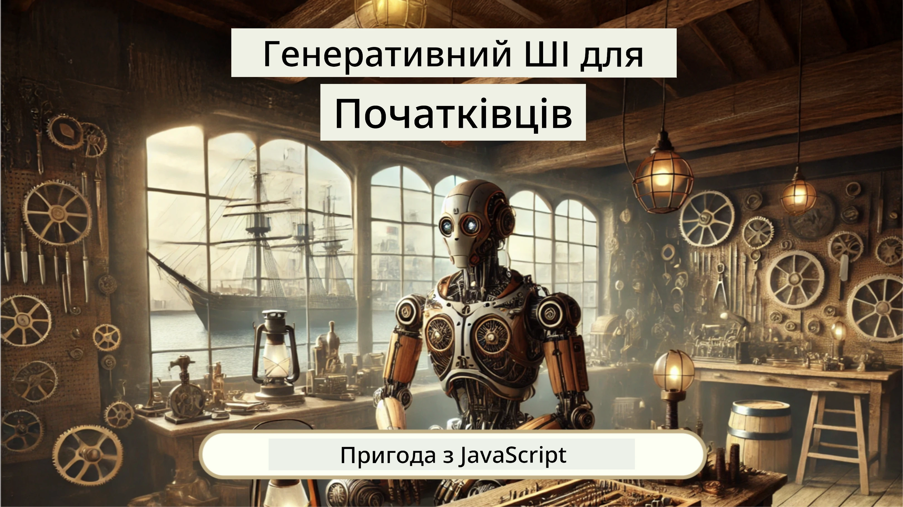
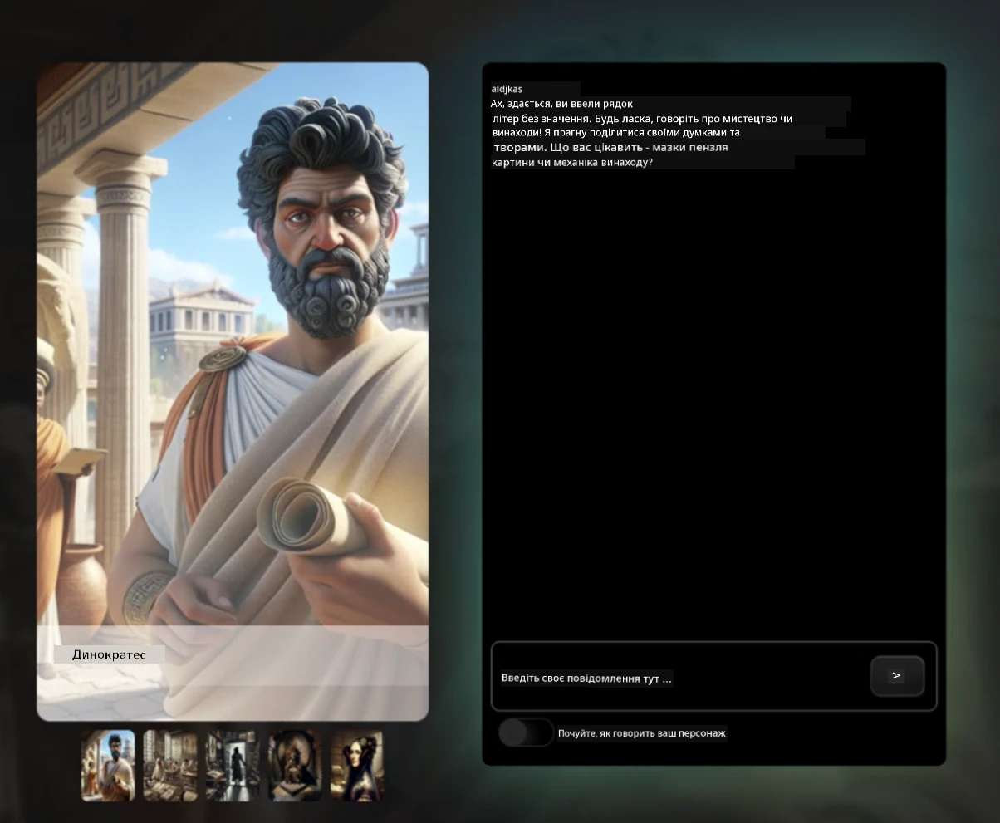
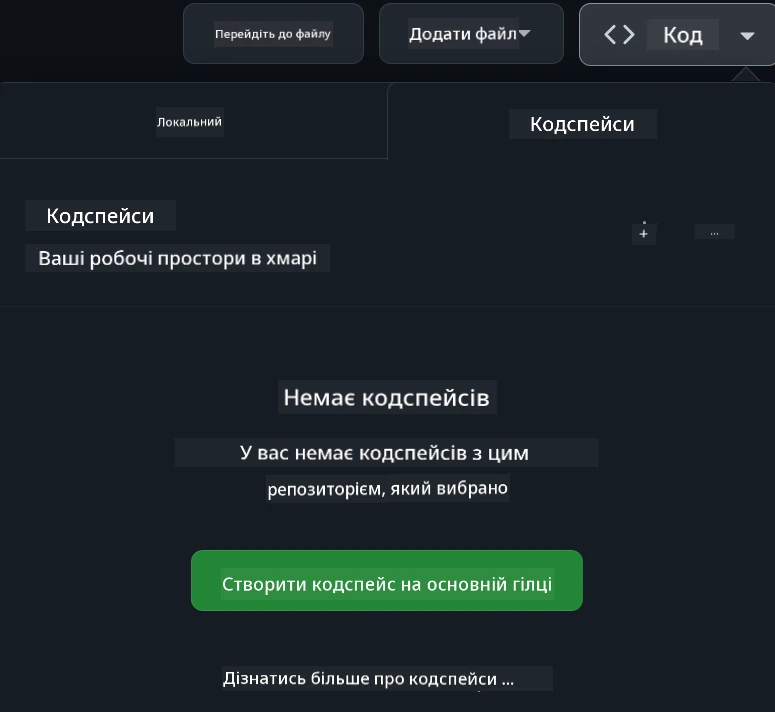

[](https://github.com/microsoft/Web-Dev-For-Beginners/blob/master/LICENSE)
[](https://GitHub.com/microsoft/Web-Dev-For-Beginners/graphs/contributors/)
[](https://GitHub.com/microsoft/Web-Dev-For-Beginners/issues/)
[](https://GitHub.com/microsoft/Web-Dev-For-Beginners/pulls/)
[](http://makeapullrequest.com) 

[](https://GitHub.com/microsoft/Web-Dev-For-Beginners/watchers/)
[](https://GitHub.com/microsoft/Web-Dev-For-Beginners/network/)
[](https://GitHub.com/microsoft/Web-Dev-For-Beginners/stargazers/)

[](https://discord.gg/nTYy5BXMWG)

# Веб-розробка для початківців - навчальна програма

Вивчайте основи веб-розробки за нашим 12-тижневим комплексним курсом від Microsoft Cloud Advocates. Кожен із 24 уроків глибоко занурюється у JavaScript, CSS та HTML через практичні проєкти, такі як тераріуми, розширення браузера та космічні ігри. Беріть участь у вікторинах, обговореннях і практичних завданнях. Покращуйте свої навички та оптимізуйте засвоєння знань за допомогою нашої ефективної педагогіки на основі проєктів. Розпочніть свою програмістську подорож сьогодні!

Приєднуйтесь до спільноти Azure AI Foundry у Discord

[](https://discord.gg/nTYy5BXMWG)

Виконайте ці кроки, щоб почати використовувати ці ресурси:
1. **Створіть форк репозиторію**: Натисніть [](https://GitHub.com/microsoft/Web-Dev-For-Beginners/fork)
2. **Клонуйте репозиторій**:   `git clone https://github.com/microsoft/Web-Dev-For-Beginners.git`
3. [**Приєднуйтесь до Azure AI Foundry Discord та зустрічайтеся з експертами і іншими розробниками**](https://discord.com/invite/ByRwuEEgH4)

### 🌐 Підтримка багатьох мов

#### Підтримується через GitHub Action (автоматично та завжди актуально)

<!-- CO-OP TRANSLATOR LANGUAGES TABLE START -->
[Арабська](../ar/README.md) | [Бенгальська](../bn/README.md) | [Болгарська](../bg/README.md) | [Бірманська (М’янма)](../my/README.md) | [Китайська (спрощена)](../zh-CN/README.md) | [Китайська (традиційна, Гонконг)](../zh-HK/README.md) | [Китайська (традиційна, Макао)](../zh-MO/README.md) | [Китайська (традиційна, Тайвань)](../zh-TW/README.md) | [Хорватська](../hr/README.md) | [Чеська](../cs/README.md) | [Данська](../da/README.md) | [Голландська](../nl/README.md) | [Естонська](../et/README.md) | [Фінська](../fi/README.md) | [Французька](../fr/README.md) | [Німецька](../de/README.md) | [Грецька](../el/README.md) | [Іврит](../he/README.md) | [Гінді](../hi/README.md) | [Угорська](../hu/README.md) | [Індонезійська](../id/README.md) | [Італійська](../it/README.md) | [Японська](../ja/README.md) | [Каннада](../kn/README.md) | [Корейська](../ko/README.md) | [Литовська](../lt/README.md) | [Малайська](../ms/README.md) | [Малаялам](../ml/README.md) | [Маратхі](../mr/README.md) | [Непальська](../ne/README.md) | [Нігерійський піжин](../pcm/README.md) | [Норвезька](../no/README.md) | [Перська (фарсі)](../fa/README.md) | [Польська](../pl/README.md) | [Португальська (Бразилія)](../pt-BR/README.md) | [Португальська (Португалія)](../pt-PT/README.md) | [Панджабі (гурмухі)](../pa/README.md) | [Румунська](../ro/README.md) | [Російська](../ru/README.md) | [Сербська (кирилиця)](../sr/README.md) | [Словацька](../sk/README.md) | [Словенська](../sl/README.md) | [Іспанська](../es/README.md) | [Свахілі](../sw/README.md) | [Шведська](../sv/README.md) | [Тагальська (філіппінська)](../tl/README.md) | [Тамільська](../ta/README.md) | [Телугу](../te/README.md) | [Тайська](../th/README.md) | [Турецька](../tr/README.md) | [Українська](./README.md) | [Урду](../ur/README.md) | [В’єтнамська](../vi/README.md)

> **Віддаєте перевагу локальному клонуванню?**
>
> Цей репозиторій включає понад 50 мовних перекладів, що значно збільшує розмір завантаження. Щоб клонувати без перекладів, використайте sparse checkout:
>
> **Bash / macOS / Linux:**
> ```bash
> git clone --filter=blob:none --sparse https://github.com/microsoft/Web-Dev-For-Beginners.git
> cd Web-Dev-For-Beginners
> git sparse-checkout set --no-cone '/*' '!translations' '!translated_images'
> ```
>
> **CMD (Windows):**
> ```cmd
> git clone --filter=blob:none --sparse https://github.com/microsoft/Web-Dev-For-Beginners.git
> cd Web-Dev-For-Beginners
> git sparse-checkout set --no-cone "/*" "!translations" "!translated_images"
> ```
>
> Це дасть вам все необхідне для проходження курсу з набагато швидшим завантаженням.
<!-- CO-OP TRANSLATOR LANGUAGES TABLE END -->

**Якщо ви хочете підтримки додаткових мов перекладу, вони перелічені [тут](https://github.com/Azure/co-op-translator/blob/main/getting_started/supported-languages.md)**

[](https://open.vscode.dev/microsoft/Web-Dev-For-Beginners)

#### 🧑‍🎓 _Ви студент?_

Відвідайте [**сторінку студентського хабу**](https://docs.microsoft.com/learn/student-hub/?WT.mc_id=academic-77807-sagibbon), де ви знайдете ресурси для початківців, студентські пакети та навіть способи отримати безкоштовний сертифікат. Це сторінка, яку варто додати до закладок і періодично перевіряти, оскільки контент оновлюється щомісяця.

### 📣 Оголошення - Нові виклики режиму GitHub Copilot Agent для виконання!

Додано новий виклик, шукайте "GitHub Copilot Agent Challenge 🚀" в більшості розділів. Це новий виклик, який вам потрібно виконати, використовуючи GitHub Copilot та режим Agent. Якщо ви раніше не використовували режим Agent, він може не лише генерувати текст, а й створювати та редагувати файли, запускати команди і більше.

### 📣 Оголошення - _Новий проєкт для створення з використанням генеративного ШІ_ 

Щойно додано новий проєкт AI Assistant, ознайомтеся з ним [проект](./9-chat-project/README.md)

### 📣 Оголошення - _Нова навчальна програма_ з генеративного ШІ для JavaScript щойно випущена

Не пропустіть нашу нову навчальну програму з генеративного ШІ!

Відвідайте [https://aka.ms/genai-js-course](https://aka.ms/genai-js-course), щоб почати!



- Уроки, що охоплюють усе від основ до RAG.
- Взаємодійте з історичними персонажами за допомогою GenAI і нашого компаньйон-додатку.
- Цікаве і захоплююче оповідання, ви будете подорожувати у часі!




Кожен урок включає завдання, перевірку знань і виклик, щоб допомогти вам освоїти теми такі як:
- Формулювання запитів і інженерія запитів
- Генерація текстових та іміжевих додатків
- Пошукові додатки

Відвідайте [https://aka.ms/genai-js-course](https://aka.ms/genai-js-course), щоб почати!


## 🌱 Початок роботи

> **Вчителі**, ми включили [деякі пропозиції](for-teachers.md) про те, як використовувати цю навчальну програму. Нам буде цікаво почути ваш відгук [у нашому форумі обговорень](https://github.com/microsoft/Web-Dev-For-Beginners/discussions/categories/teacher-corner)!

**[Учні](https://aka.ms/student-page/?WT.mc_id=academic-77807-sagibbon)**, для кожного уроку починайте з попередньої вікторини, далі читайте навчальний матеріал, виконуйте різні завдання та перевіряйте свої знання за допомогою підсумкової вікторини.

Щоб покращити свій навчальний досвід, спілкуйтеся з однокурсниками для спільного виконання проєктів! Заохочуються обговорення на нашому [форумі](https://github.com/microsoft/Web-Dev-For-Beginners/discussions), де команда модераторів завжди готова відповісти на ваші запитання.

Для подальшого навчання ми настійно рекомендуємо переглянути [Microsoft Learn](https://learn.microsoft.com/users/wirelesslife/collections/p1ddcy5jwy0jkm?WT.mc_id=academic-77807-sagibbon) для додаткових навчальних матеріалів.

### 📋 Налаштування вашого середовища

Ця навчальна програма має готове до роботи середовище розробки! Під час початку ви можете запускати курс у [Codespace](https://github.com/features/codespaces/) (_середовище у браузері, без необхідності встановлювати щось локально_), або локально на вашому комп’ютері за допомогою текстового редактора, наприклад [Visual Studio Code](https://code.visualstudio.com/?WT.mc_id=academic-77807-sagibbon).

#### Створіть ваш репозиторій
Щоб вам було зручно зберігати вашу роботу, рекомендується створити власну копію цього репозиторію. Для цього натисніть кнопку **Use this template** вгорі сторінки. Це створить новий репозиторій у вашому акаунті GitHub з копією навчальної програми.

Слідуйте цим крокам:
1. **Зробіть форк репозиторію**: Натисніть кнопку "Fork" у верхньому правому куті цієї сторінки.
2. **Клонуйте репозиторій**:   `git clone https://github.com/microsoft/Web-Dev-For-Beginners.git`

#### Запуск курсу у Codespace

У вашій копії створеного репозиторію натисніть кнопку **Code** та виберіть **Open with Codespaces**. Це створить для вас новий Codespace для роботи.



#### Запуск курсу локально на вашому комп’ютері

Щоб запустити цей курс локально на вашому комп’ютері, вам потрібен текстовий редактор, браузер та засіб командного рядка. Наш перший урок, [Вступ до мов програмування та інструментів](../../1-getting-started-lessons/1-intro-to-programming-languages), допоможе вам вибрати найзручніші для вас інструменти.

Ми рекомендуємо використовувати [Visual Studio Code](https://code.visualstudio.com/?WT.mc_id=academic-77807-sagibbon) як редактор, який також має вбудований [термінал](https://code.visualstudio.com/docs/terminal/basics/?WT.mc_id=academic-77807-sagibbon). Ви можете завантажити Visual Studio Code [тут](https://code.visualstudio.com/?WT.mc_id=academic-77807-sagibbon).
1. Клонуйте свій репозиторій на свій комп’ютер. Ви можете зробити це, натиснувши кнопку **Code** і скопіювавши URL:

    [CodeSpace](./images/createcodespace.png)

    Потім відкрийте [Термінал](https://code.visualstudio.com/docs/terminal/basics/?WT.mc_id=academic-77807-sagibbon) у [Visual Studio Code](https://code.visualstudio.com/?WT.mc_id=academic-77807-sagibbon) і виконайте наступну команду, замінивши `<your-repository-url>` на URL, який ви щойно скопіювали:

    ```bash 
    git clone <your-repository-url>
    ```

2. Відкрийте папку у Visual Studio Code. Ви можете зробити це, натиснувши **File** > **Open Folder** і вибравши папку, яку щойно клонували.


>  Рекомендовані розширення Visual Studio Code:
>
> * [Live Server](https://marketplace.visualstudio.com/items?itemName=ritwickdey.LiveServer&WT.mc_id=academic-77807-sagibbon) - для попереднього перегляду HTML-сторінок у Visual Studio Code
> * [Copilot](https://marketplace.visualstudio.com/items?itemName=GitHub.copilot&WT.mc_id=academic-77807-sagibbon) - щоб допомогти вам швидше писати код

## 📂 Кожен урок містить:

- необов’язкову скетчноут
- необов’язкове додаткове відео
- розминковий тест перед уроком
- письмовий урок
- для уроків із проектами покрокові інструкції зі створення проекту
- перевірки знань
- виклик
- додаткове читання
- завдання
- [тест після уроку](https://ff-quizzes.netlify.app/web/)

> **Примітка про тести**: Усі тести знаходяться у папці Quiz-app, всього 48 тестів по три питання кожен. Вони доступні [тут](https://ff-quizzes.netlify.app/web/). Додаток для тестів можна запустити локально або розгорнути в Azure; дотримуйтесь інструкцій у папці `quiz-app`.

## 🗃️ Уроки

|     |                       Назва проекту                       |                            Вивчені концепції                             | Навчальні цілі                                                                                                                 |                                                         Пов’язаний урок                                                          |         Автор          |
| :-: | :------------------------------------------------------: | :--------------------------------------------------------------------: | ----------------------------------------------------------------------------------------------------------------------------------- | :----------------------------------------------------------------------------------------------------------------------------: | :---------------------: |
| 01  |                     Початок роботи                      |           Вступ до програмування та інструменти професії           | Ознайомитися з основами більшості мов програмування та програмним забезпеченням, яке допомагає професійним розробникам           | [Вступ до мов програмування та інструментів професії](./1-getting-started-lessons/1-intro-to-programming-languages/README.md) |         Jasmine         |
| 02  |                     Початок роботи                      |             Основи GitHub, включаючи роботу в команді             | Як використовувати GitHub у вашому проекті, як співпрацювати з іншими над кодом                                                   |                            [Вступ до GitHub](./1-getting-started-lessons/2-github-basics/README.md)                             |          Floor          |
| 03  |                     Початок роботи                      |                             Доступність                              | Вивчити основи веб-доступності                                                                                                   |                       [Основи доступності](./1-getting-started-lessons/3-accessibility/README.md)                                |       Christopher       |
| 04  |                        Основи JS                         |                         Типи даних JavaScript                        | Основи типів даних у JavaScript                                                                                                  |                                       [Типи даних](./2-js-basics/1-data-types/README.md)                                        |         Jasmine         |
| 05  |                        Основи JS                         |                         Функції та методи                          | Дізнатися про функції та методи для керування логікою додатка                                                                    |                              [Функції та методи](./2-js-basics/2-functions-methods/README.md)                               | Jasmine and Christopher |
| 06  |                        Основи JS                         |                        Прийняття рішень з JS                        | Вивчити, як створювати умови у вашому коді, використовуючи методи прийняття рішень                                                |                                 [Прийняття рішень](./2-js-basics/3-making-decisions/README.md)                                  |         Jasmine         |
| 07  |                        Основи JS                         |                            Масиви та цикли                          | Робота з даними за допомогою масивів і циклів у JavaScript                                                                       |                                   [Масиви та цикли](./2-js-basics/4-arrays-loops/README.md)                                    |         Jasmine         |
| 08  |       [Тераріум](./3-terrarium/solution/README.md)       |                            Практика HTML                            | Створити HTML для онлайн-тераріуму, зосередившись на створенні макета                                                            |                                 [Вступ до HTML](./3-terrarium/1-intro-to-html/README.md)                                 |           Jen           |
| 09  |       [Тераріум](./3-terrarium/solution/README.md)       |                            Практика CSS                             | Створити CSS для стилізації онлайн-тераріуму, зосередившись на основах CSS, зокрема - адаптивність сторінки                      |                                  [Вступ до CSS](./3-terrarium/2-intro-to-css/README.md)                                  |           Jen           |
| 10  |            [Тераріум](./3-terrarium/solution/README.md)            |                 Замикання JavaScript, маніпуляції з DOM                 | Написати JavaScript, щоб створити функціонал тераріуму як drag/drop інтерфейсу, зосередившись на замиканнях та маніпуляціях DOM  |                  [Замикання JavaScript, маніпуляції з DOM](./3-terrarium/3-intro-to-DOM-and-closures/README.md)                   |           Jen           |
| 11  |          [Гра на друкування](./4-typing-game/solution/README.md)          |                          Створення гри на друкування                           | Вивчити, як використовувати події клавіатури для керування логікою JavaScript-застосунку                                         |                                [Програмування на подіях](./4-typing-game/typing-game/README.md)                                |       Christopher       |
| 12  | [Розширення браузера Green](./5-browser-extension/solution/README.md) |                         Робота з браузерами                          | Дізнатися, як працюють браузери, їх історію та як створити перші елементи розширення браузера                                     |                               [Про браузери](./5-browser-extension/1-about-browsers/README.md)                                |           Jen           |
| 13  | [Розширення браузера Green](./5-browser-extension/solution/README.md) | Створення форми, виклик API та збереження змінних у локальному сховищі | Створити JavaScript-елементи розширення браузера для виклику API, використовуючи змінні, збережені в локальному сховищі          |                [API, форми та локальне сховище](./5-browser-extension/2-forms-browsers-local-storage/README.md)                 |           Jen           |
| 14  | [Розширення браузера Green](./5-browser-extension/solution/README.md) |          Фонові процеси в браузері, продуктивність веба          | Використовувати фонові процеси браузера для керування іконкою розширення; дізнатися про продуктивність веба та оптимізації       |             [Фонові задачі та продуктивність](./5-browser-extension/3-background-tasks-and-performance/README.md)              |           Jen           |
| 15  |           [Гра у космосі](./6-space-game/solution/README.md)           |             Розвиток складніших ігор з JavaScript             | Вивчити спадкування за допомогою класів і композиції та шаблон Pub/Sub для створення гри                                         |                      [Вступ до складної розробки ігор](./6-space-game/1-introduction/README.md)                       |          Chris          |
| 16  |           [Гра у космосі](./6-space-game/solution/README.md)           |                           Малювання на холсті                            | Вивчити Canvas API для малювання елементів на екрані                                                                           |                                [Малювання на холсті](./6-space-game/2-drawing-to-canvas/README.md)                                |          Chris          |
| 17  |           [Гра у космосі](./6-space-game/solution/README.md)           |                   Переміщення елементів на екрані                    | Дослідити, як елементи можуть рухатися, використовуючи декартові координати та Canvas API                                        |                           [Переміщення елементів](./6-space-game/3-moving-elements-around/README.md)                           |          Chris          |
| 18  |           [Гра у космосі](./6-space-game/solution/README.md)           |                          Виявлення зіткнень                           | Зробити так, щоб елементи стикалися та реагували один на одного за допомогою натискань клавіш і функції охолодження для продуктивності |                              [Виявлення зіткнень](./6-space-game/4-collision-detection/README.md)                              |          Chris          |
| 19  |           [Гра у космосі](./6-space-game/solution/README.md)           |                             Ведення рахунку                              | Виконувати розрахунки на основі стану та продуктивності гри                                                                       |                                    [Ведення рахунку](./6-space-game/5-keeping-score/README.md)                                    |          Chris          |
| 20  |           [Гра у космосі](./6-space-game/solution/README.md)           |                     Завершення та перезапуск гри                     | Дізнатися про завершення та перезапуск гри, очищення ресурсів і скидання змінних                                                |                                [Умови завершення](./6-space-game/6-end-condition/README.md)                                 |          Chris          |
| 21  |         [Банківський додаток](./7-bank-project/solution/README.md)          |                 HTML-шаблони та маршрути у веб-додатку                 | Навчитися створювати каркас мультисторінкового вебсайту за допомогою маршрутизації та HTML-шаблонів                            |                            [HTML-шаблони і маршрути](./7-bank-project/1-template-route/README.md)                             |          Yohan          |
| 22  |         [Банківський додаток](./7-bank-project/solution/README.md)          |                  Створення форми входу та реєстрації                   | Дізнатися про створення форм та обробку валідації                                                                             |                                           [Форми](./7-bank-project/2-forms/README.md)                                           |          Yohan          |
| 23  |         [Банківський додаток](./7-bank-project/solution/README.md)          |                   Методи отримання та використання даних                   | Як дані потрапляють у додаток, як їх отримувати, зберігати та звільняти                                                        |                                            [Дані](./7-bank-project/3-data/README.md)                                            |          Yohan          |
| 24  |         [Банківський додаток](./7-bank-project/solution/README.md)          |                      Концепції управління станом                      | Навчитися зберігати стан додатку та керувати ним програмно                                                                      |                                [Управління станом](./7-bank-project/4-state-management/README.md)                                |          Yohan          |
| 25 | [Код браузера/VScode](../../8-code-editor) | Робота з VScode | Навчитися користуватись редактором коду | [Використання редактора коду VScode](./8-code-editor/1-using-a-code-editor/README.md) | Chris |
| 26 | [AI Асистенти](./9-chat-project/README.md) | Робота з AI | Навчитися створювати власного AI асистента | [Проєкт AI Асистента](./9-chat-project/README.md) | Chris |

## 🏫 Педагогіка

Наша навчальна програма розроблена на основі двох ключових педагогічних принципів:
* навчання на основі проєктів
* часті тести

Програма викладає основи JavaScript, HTML та CSS, а також найновіші інструменти та методики, які використовують сучасні веб-розробники. Студенти матимуть можливість отримати практичний досвід, створюючи гру на друкування, віртуальний тераріум, екологічно чисте розширення браузера, гру на зразок Space Invaders і банківський додаток для бізнесу. Наприкінці серії студенти здобудуть міцне розуміння веб-розробки.

> 🎓 Ви можете пройти перші кілька уроків цієї навчальної програми як [Навчальний шлях](https://docs.microsoft.com/learn/paths/web-development-101/?WT.mc_id=academic-77807-sagibbon) на Microsoft Learn!

Забезпечуючи, щоб контент узгоджувався з проєктами, ми робимо процес більш захоплюючим для студентів та покращуємо засвоєння концепцій. Ми також підготували кілька вступних уроків основ JavaScript із відео з колекції "[Beginners Series to: JavaScript](https://channel9.msdn.com/Series/Beginners-Series-to-JavaScript/?WT.mc_id=academic-77807-sagibbon)", автори якої деякі брали участь у створенні цієї навчальної програми.

Крім того, низькопоріг тест перед заняттям задає студенту намір вивчення теми, а другий тест після заняття гарантує подальше закріплення знань. Ця навчальна програма розроблена бути гнучкою і цікавою, її можна проходити повністю або частково. Проєкти починаються із простих і стають все складнішими до кінця 12-тижневого циклу.

Хоч ми і цілеспрямовано уникали використання JavaScript-фреймворків, щоб сконцентруватися на базових навичках веб-розробника перед використанням фреймворку, наступним кроком після завершення цієї програми може бути вивчення Node.js через іншу колекцію відео: "[Beginner Series to: Node.js](https://channel9.msdn.com/Series/Beginners-Series-to-Nodejs/?WT.mc_id=academic-77807-sagibbon)".

> Відвідайте наші рекомендації [Кодекс поведінки](CODE_OF_CONDUCT.md) та [Участь](CONTRIBUTING.md). Ми вітаємо ваші конструктивні відгуки!


## 🧭 Офлайн-доступ

Ви можете користуватися цією документацією офлайн, використовуючи [Docsify](https://docsify.js.org/#/). Форкніть цей репозиторій, [встановіть Docsify](https://docsify.js.org/#/quickstart) на свій локальний комп’ютер, а потім у кореневій папці цього репозиторію введіть `docsify serve`. Вебсайт буде доступний на порту 3000 вашого локального хоста: `localhost:3000`.

## 📘 PDF
PDF-файл з усіма уроками можна знайти [тут](https://microsoft.github.io/Web-Dev-For-Beginners/pdf/readme.pdf).

## 🎒 Інші курси

Наша команда створює інші курси! Перегляньте:

<!-- CO-OP TRANSLATOR OTHER COURSES START -->
### LangChain
[](https://aka.ms/langchain4j-for-beginners)
[](https://aka.ms/langchainjs-for-beginners?WT.mc_id=m365-94501-dwahlin)
[](https://github.com/microsoft/langchain-for-beginners?WT.mc_id=m365-94501-dwahlin)
---

### Azure / Edge / MCP / Агенти
[](https://github.com/microsoft/AZD-for-beginners?WT.mc_id=academic-105485-koreyst)
[](https://github.com/microsoft/edgeai-for-beginners?WT.mc_id=academic-105485-koreyst)
[](https://github.com/microsoft/mcp-for-beginners?WT.mc_id=academic-105485-koreyst)
[](https://github.com/microsoft/ai-agents-for-beginners?WT.mc_id=academic-105485-koreyst)

---
 
### Серія Generative AI
[](https://github.com/microsoft/generative-ai-for-beginners?WT.mc_id=academic-105485-koreyst)
[-9333EA?style=for-the-badge&labelColor=E5E7EB&color=9333EA)](https://github.com/microsoft/Generative-AI-for-beginners-dotnet?WT.mc_id=academic-105485-koreyst)
[-C084FC?style=for-the-badge&labelColor=E5E7EB&color=C084FC)](https://github.com/microsoft/generative-ai-for-beginners-java?WT.mc_id=academic-105485-koreyst)
[-E879F9?style=for-the-badge&labelColor=E5E7EB&color=E879F9)](https://github.com/microsoft/generative-ai-with-javascript?WT.mc_id=academic-105485-koreyst)

---
 
### Основні курси
[](https://aka.ms/ml-beginners?WT.mc_id=academic-105485-koreyst)
[](https://aka.ms/datascience-beginners?WT.mc_id=academic-105485-koreyst)
[](https://aka.ms/ai-beginners?WT.mc_id=academic-105485-koreyst)
[](https://github.com/microsoft/Security-101?WT.mc_id=academic-96948-sayoung)
[](https://aka.ms/webdev-beginners?WT.mc_id=academic-105485-koreyst)
[](https://aka.ms/iot-beginners?WT.mc_id=academic-105485-koreyst)
[](https://github.com/microsoft/xr-development-for-beginners?WT.mc_id=academic-105485-koreyst)

---
 
### Серія Copilot
[](https://aka.ms/GitHubCopilotAI?WT.mc_id=academic-105485-koreyst)
[](https://github.com/microsoft/mastering-github-copilot-for-dotnet-csharp-developers?WT.mc_id=academic-105485-koreyst)
[](https://github.com/microsoft/CopilotAdventures?WT.mc_id=academic-105485-koreyst)
<!-- CO-OP TRANSLATOR OTHER COURSES END -->

## Отримання допомоги

Якщо ви застрягли або маєте запитання щодо створення AI-додатків, приєднуйтесь до інших учнів та досвідчених розробників у обговореннях про MCP. Це підтримуюча спільнота, де питання вітаються, а знання вільно діляться.

[](https://discord.gg/nTYy5BXMWG)

Якщо у вас є відгуки про продукт або помилки під час розробки, відвідайте:

[](https://aka.ms/foundry/forum)

## Ліцензія

Цей репозиторій ліцензовано за ліцензією MIT. Для детальнішої інформації дивіться файл [LICENSE](../../LICENSE).

---

<!-- CO-OP TRANSLATOR DISCLAIMER START -->
**Відмова від відповідальності**:
Цей документ було перекладено за допомогою сервісу автоматичного перекладу [Co-op Translator](https://github.com/Azure/co-op-translator). Хоча ми прагнемо до точності, зверніть увагу, що автоматичні переклади можуть містити помилки або неточності. Оригінальний документ рідною мовою слід вважати авторитетним джерелом. Для критично важливої інформації рекомендується професійний переклад людиною. Ми не несемо відповідальності за будь-які непорозуміння або неправильні тлумачення, що виникли внаслідок використання цього перекладу.
<!-- CO-OP TRANSLATOR DISCLAIMER END -->