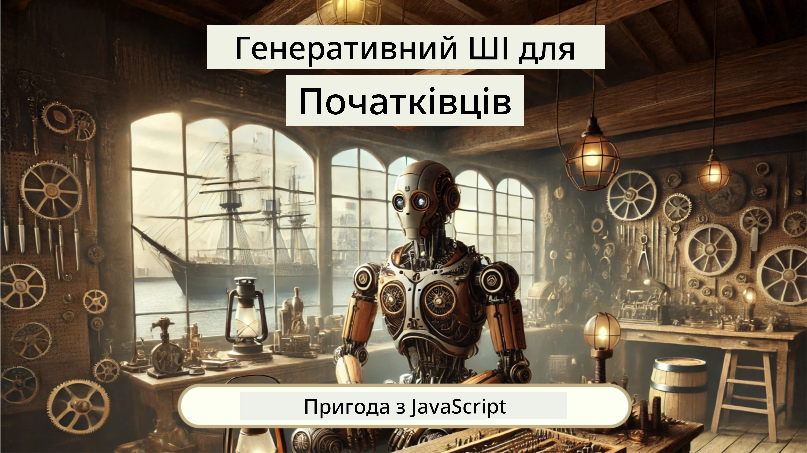
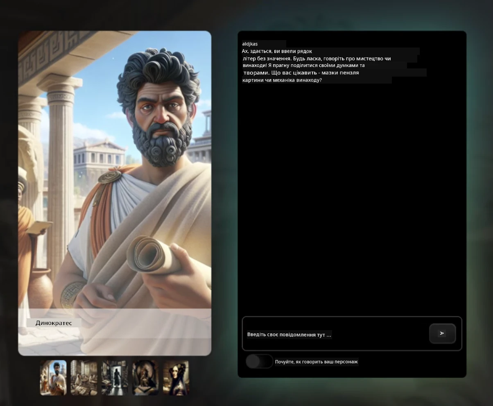
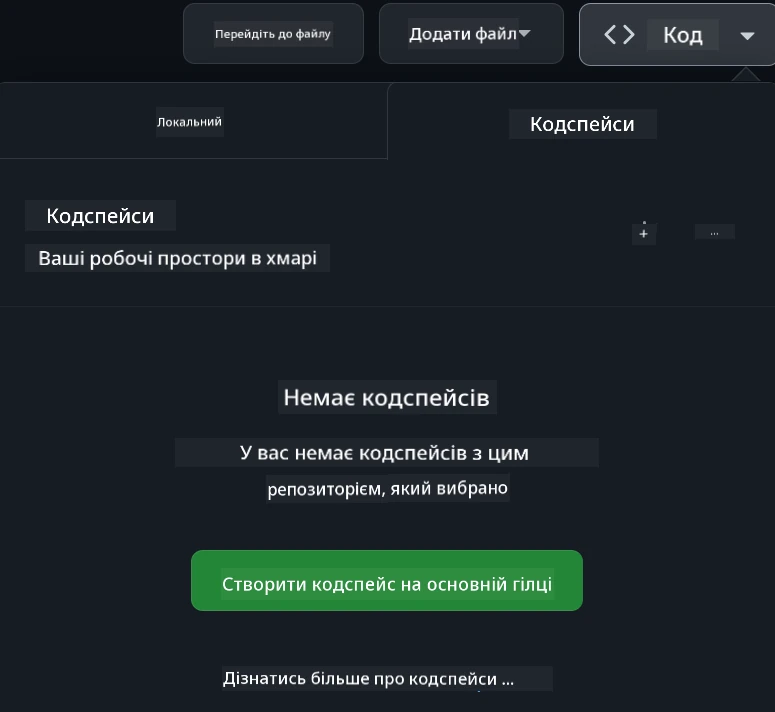

[](https://github.com/microsoft/Web-Dev-For-Beginners/blob/master/LICENSE)
[](https://GitHub.com/microsoft/Web-Dev-For-Beginners/graphs/contributors/)
[](https://GitHub.com/microsoft/Web-Dev-For-Beginners/issues/)
[](https://GitHub.com/microsoft/Web-Dev-For-Beginners/pulls/)
[](http://makeapullrequest.com) 

[](https://GitHub.com/microsoft/Web-Dev-For-Beginners/watchers/)
[](https://GitHub.com/microsoft/Web-Dev-For-Beginners/network/)
[](https://GitHub.com/microsoft/Web-Dev-For-Beginners/stargazers/)

[](https://discord.gg/nTYy5BXMWG)

# Веб-розробка для початківців - навчальна програма

Вивчайте основи веб-розробки за допомогою нашого комплексного курсу тривалістю 12 тижнів від Microsoft Cloud Advocates. Кожен з 24 уроків занурюється у JavaScript, CSS та HTML через практичні проєкти, такі як тераріуми, розширення для браузера та космічні ігри. Залучайтесь до вікторин, обговорень і практичних завдань. Покращуйте свої навички та оптимізуйте засвоєння знань за допомогою нашої ефективної проектно-орієнтованої педагогіки. Розпочніть свою програмістську подорож сьогодні!

Приєднуйтесь до Azure AI Foundry Discord і зустрічайте експертів та інших розробників.

[](https://discord.gg/nTYy5BXMWG)

Виконайте ці кроки, щоб почати використовувати ці ресурси:
1. **Зробіть форк репозиторію**: Клікніть [](https://GitHub.com/microsoft/Web-Dev-For-Beginners/fork)
2. **Клонуйте репозиторій**:   `git clone https://github.com/microsoft/Web-Dev-For-Beginners.git`
3. [**Приєднуйтесь до Azure AI Foundry Discord і зустрічайте експертів та інших розробників**](https://discord.com/invite/ByRwuEEgH4)

### 🌐 Підтримка декількох мов

#### Підтримується через GitHub Action (автоматично та завжди актуально)

<!-- CO-OP TRANSLATOR LANGUAGES TABLE START -->
[Arabic](../ar/README.md) | [Bengali](../bn/README.md) | [Bulgarian](../bg/README.md) | [Burmese (Myanmar)](../my/README.md) | [Chinese (Simplified)](../zh-CN/README.md) | [Chinese (Traditional, Hong Kong)](../zh-HK/README.md) | [Chinese (Traditional, Macau)](../zh-MO/README.md) | [Chinese (Traditional, Taiwan)](../zh-TW/README.md) | [Croatian](../hr/README.md) | [Czech](../cs/README.md) | [Danish](../da/README.md) | [Dutch](../nl/README.md) | [Estonian](../et/README.md) | [Finnish](../fi/README.md) | [French](../fr/README.md) | [German](../de/README.md) | [Greek](../el/README.md) | [Hebrew](../he/README.md) | [Hindi](../hi/README.md) | [Hungarian](../hu/README.md) | [Indonesian](../id/README.md) | [Italian](../it/README.md) | [Japanese](../ja/README.md) | [Kannada](../kn/README.md) | [Khmer](../km/README.md) | [Korean](../ko/README.md) | [Lithuanian](../lt/README.md) | [Malay](../ms/README.md) | [Malayalam](../ml/README.md) | [Marathi](../mr/README.md) | [Nepali](../ne/README.md) | [Nigerian Pidgin](../pcm/README.md) | [Norwegian](../no/README.md) | [Persian (Farsi)](../fa/README.md) | [Polish](../pl/README.md) | [Portuguese (Brazil)](../pt-BR/README.md) | [Portuguese (Portugal)](../pt-PT/README.md) | [Punjabi (Gurmukhi)](../pa/README.md) | [Romanian](../ro/README.md) | [Russian](../ru/README.md) | [Serbian (Cyrillic)](../sr/README.md) | [Slovak](../sk/README.md) | [Slovenian](../sl/README.md) | [Spanish](../es/README.md) | [Swahili](../sw/README.md) | [Swedish](../sv/README.md) | [Tagalog (Filipino)](../tl/README.md) | [Tamil](../ta/README.md) | [Telugu](../te/README.md) | [Thai](../th/README.md) | [Turkish](../tr/README.md) | [Ukrainian](./README.md) | [Urdu](../ur/README.md) | [Vietnamese](../vi/README.md)

> **Віддаєте перевагу клонуванню локально?**
>
> Цей репозиторій містить понад 50 мовних перекладів, що значно збільшує розмір завантаження. Щоб клонувати без перекладів, використовуйте sparse checkout:
>
> **Bash / macOS / Linux:**
> ```bash
> git clone --filter=blob:none --sparse https://github.com/microsoft/Web-Dev-For-Beginners.git
> cd Web-Dev-For-Beginners
> git sparse-checkout set --no-cone '/*' '!translations' '!translated_images'
> ```
>
> **CMD (Windows):**
> ```cmd
> git clone --filter=blob:none --sparse https://github.com/microsoft/Web-Dev-For-Beginners.git
> cd Web-Dev-For-Beginners
> git sparse-checkout set --no-cone "/*" "!translations" "!translated_images"
> ```
>
> Це дасть вам все необхідне для проходження курсу з значно швидшим завантаженням.
<!-- CO-OP TRANSLATOR LANGUAGES TABLE END -->

**Якщо ви хочете мати додаткові переклади, підтримувані мови наведені [тут](https://github.com/Azure/co-op-translator/blob/main/getting_started/supported-languages.md)**

[](https://open.vscode.dev/microsoft/Web-Dev-For-Beginners)

#### 🧑‍🎓 _Ви студент?_

Відвідайте [**сторінку Student Hub**](https://docs.microsoft.com/learn/student-hub/?WT.mc_id=academic-77807-sagibbon), де ви знайдете ресурси для початківців, студентські комплекти та навіть способи отримати безкоштовний сертифікат. Цю сторінку варто додати в закладки та перевіряти час від часу, оскільки щомісяця оновлюється контент.

### 📣 Оголошення - Нові завдання в режимі GitHub Copilot Agent для виконання!

Додано нове завдання, шукайте "GitHub Copilot Agent Challenge 🚀" у більшості розділів. Це нове завдання, яке вам потрібно виконати за допомогою GitHub Copilot і режиму Agent. Якщо ви ще не використовували режим Agent, він здатний не лише генерувати текст, а й створювати та редагувати файли, запускати команди та інше.

### 📣 Оголошення - _Новий проєкт на основі Генеративного ШІ_ 

Додав новий проєкт AI Assistant, перевірте його [тут](./9-chat-project/README.md)

### 📣 Оголошення - _Нова навчальна програма_ з генеративного ШІ для JavaScript тільки що випущена

Не пропустіть нашу нову навчальну програму з генеративного ШІ!

Відвідайте [https://aka.ms/genai-js-course](https://aka.ms/genai-js-course), щоб почати!



- Уроки, що охоплюють усе від основ до RAG.
- Взаємодійте з історичними персонажами за допомогою GenAI та нашого супутнього додатка.
- Весела та захоплива історія, ви будете подорожувати у часі!




Кожен урок містить завдання для виконання, перевірку знань та виклик, який допоможе вам освоїти теми, такі як:
- Формулювання запитів та інженерія запитів
- Генерація текстових та графічних додатків
- Пошукові додатки

Відвідайте [https://aka.ms/genai-js-course](https://aka.ms/genai-js-course), щоб почати!


## 🌱 Початок роботи

> **Викладачі**, ми включили [деякі пропозиції](for-teachers.md) щодо того, як використовувати цю навчальну програму. Ми будемо раді вашим відгукам [у нашому форумі обговорень](https://github.com/microsoft/Web-Dev-For-Beginners/discussions/categories/teacher-corner)!

**[Учні](https://aka.ms/student-page/?WT.mc_id=academic-77807-sagibbon)**, для кожного уроку починайте з вікторини перед лекцією та продовжуйте читати матеріал лекції, виконувати різні активності та перевіряти свої знання за допомогою вікторини після лекції.

Щоб покращити ваш досвід навчання, спілкуйтеся з однокласниками, щоб працювати над проєктами разом! Заохочуємо обговорення у нашому [форумі обговорень](https://github.com/microsoft/Web-Dev-For-Beginners/discussions), де наша команда модераторів буде готова відповідати на ваші питання.

Для подальшої освіти ми настійно рекомендуємо досліджувати [Microsoft Learn](https://learn.microsoft.com/users/wirelesslife/collections/p1ddcy5jwy0jkm?WT.mc_id=academic-77807-sagibbon) для додаткових навчальних матеріалів.

### 📋 Налаштування середовища

Ця навчальна програма має готове до роботи середовище розробки! Починаючи, ви можете обрати запуск програми в [Codespace](https://github.com/features/codespaces/) (_браузерне середовище без необхідності інсталяції_), або локально на вашому комп'ютері за допомогою текстового редактора, такого як [Visual Studio Code](https://code.visualstudio.com/?WT.mc_id=academic-77807-sagibbon).

#### Створіть свій репозиторій
Щоб вам було легко зберігати свою роботу, радимо створити власну копію цього репозиторію. Це можна зробити, натиснувши кнопку **Use this template** у верхній частині сторінки. Це створить новий репозиторій у вашому акаунті GitHub із копією навчальної програми.

Виконайте ці кроки:
1. **Зробіть форк репозиторію**: Натисніть кнопку "Fork" у верхньому правому куті цієї сторінки.
2. **Клонуйте репозиторій**:   `git clone https://github.com/microsoft/Web-Dev-For-Beginners.git`

#### Запуск програми в Codespace

У вашій копії репозиторію, яку ви створили, натисніть кнопку **Code** та оберіть **Open with Codespaces**. Це створить новий Codespace для вашої роботи.



#### Запуск програми локально на вашому комп’ютері

Щоб запускати цю навчальну програму локально на вашому комп’ютері, вам потрібен текстовий редактор, браузер і інструмент командного рядка. Наш перший урок, [Вступ до мов програмування та інструментів](../../1-getting-started-lessons/1-intro-to-programming-languages), познайомить вас з різними варіантами для кожного з цих інструментів, щоб ви могли обрати найзручніший для себе.

Ми рекомендуємо використовувати [Visual Studio Code](https://code.visualstudio.com/?WT.mc_id=academic-77807-sagibbon) як текстовий редактор, який також має вбудований [Термінал](https://code.visualstudio.com/docs/terminal/basics/?WT.mc_id=academic-77807-sagibbon). Завантажити Visual Studio Code можна [тут](https://code.visualstudio.com/?WT.mc_id=academic-77807-sagibbon).
1. Клонувати ваше сховище на комп’ютер. Це можна зробити, клацнувши кнопку **Code** і скопіювавши URL:

    [CodeSpace](./images/createcodespace.png)

    Потім відкрийте [Термінал](https://code.visualstudio.com/docs/terminal/basics/?WT.mc_id=academic-77807-sagibbon) у [Visual Studio Code](https://code.visualstudio.com/?WT.mc_id=academic-77807-sagibbon) і виконайте наступну команду, замінивши `<your-repository-url>` на URL, який ви щойно скопіювали:

    ```bash 
    git clone <your-repository-url>
    ```

2. Відкрийте папку у Visual Studio Code. Це можна зробити, клацнувши **File** > **Open Folder** і вибравши папку, яку ви щойно клонували.


>  Рекомендовані розширення Visual Studio Code:
>
> * [Live Server](https://marketplace.visualstudio.com/items?itemName=ritwickdey.LiveServer&WT.mc_id=academic-77807-sagibbon) - для попереднього перегляду HTML-сторінок всередині Visual Studio Code
> * [Copilot](https://marketplace.visualstudio.com/items?itemName=GitHub.copilot&WT.mc_id=academic-77807-sagibbon) - щоб допомогти вам швидше писати код

## 📂 Кожен урок містить:

- додаткову замальовку (sketchnote) за бажанням
- додаткове відео за бажанням
- розігрівальний вікторину перед уроком
- письмовий урок
- для проектно-орієнтованих уроків — покрокові керівництва зі створення проєкту
- перевірки знань
- виклик (challenge)
- додаткове читання
- завдання
- [вікторину після уроку](https://ff-quizzes.netlify.app/web/)

> **Примітка щодо вікторин**: Усі вікторини знаходяться в папці Quiz-app, всього 48 вікторин по три запитання кожна. Вони доступні [тут](https://ff-quizzes.netlify.app/web/). Квіз-додаток можна запускати локально або розгортати в Azure; дотримуйтесь інструкцій у папці `quiz-app`.

## 🗃️ Уроки

|     |                       Назва проєкту                       |                            Навчені поняття                             | Навчальні цілі                                                                                                                    |                                                         Пов’язаний урок                                                          |         Автор          |
| :-: | :-------------------------------------------------------: | :--------------------------------------------------------------------: | -------------------------------------------------------------------------------------------------------------------------------- | :----------------------------------------------------------------------------------------------------------------------------: | :---------------------: |
| 01  |                     Початок роботи                       |           Вступ до програмування та інструменти професії              | Вивчити базові основи більшості мов програмування і програмне забезпечення, яке допомагає професійним розробникам                | [Вступ до мов програмування та інструментів](./1-getting-started-lessons/1-intro-to-programming-languages/README.md)            |         Jasmine         |
| 02  |                     Початок роботи                       |             Основи GitHub, включаючи командну роботу                   | Як використовувати GitHub у вашому проєкті, як співпрацювати з іншими над базою коду                                             |                            [Вступ до GitHub](./1-getting-started-lessons/2-github-basics/README.md)                              |          Floor          |
| 03  |                     Початок роботи                       |                             Доступність                               | Вивчити основи веб-доступності                                                                                                   |                       [Основи доступності](./1-getting-started-lessons/3-accessibility/README.md)                                |       Christopher       |
| 04  |                        Основи JS                         |                         Типи даних в JavaScript                       | Основи типів даних у JavaScript                                                                                                  |                                       [Типи даних](./2-js-basics/1-data-types/README.md)                                         |         Jasmine         |
| 05  |                        Основи JS                         |                        Функції та методи                             | Вивчити функції та методи для управління логікою застосування                                                                   |                              [Функції та методи](./2-js-basics/2-functions-methods/README.md)                                     | Jasmine and Christopher |
| 06  |                        Основи JS                         |                        Прийняття рішень з JS                         | Навчитися створювати умови у вашому коді за допомогою способів прийняття рішень                                                  |                                 [Прийняття рішень](./2-js-basics/3-making-decisions/README.md)                                 |         Jasmine         |
| 07  |                        Основи JS                         |                          Масиви та цикли                             | Працювати з даними, використовуючи масиви та цикли в JavaScript                                                                 |                                   [Масиви та цикли](./2-js-basics/4-arrays-loops/README.md)                                    |         Jasmine         |
| 08  |       [Тераріум](./3-terrarium/solution/README.md)        |                            HTML на практиці                           | Створити HTML для онлайн-тераріуму, зосереджуючись на побудові макету                                                           |                                 [Вступ до HTML](./3-terrarium/1-intro-to-html/README.md)                                      |           Jen           |
| 09  |       [Тераріум](./3-terrarium/solution/README.md)        |                            CSS на практиці                            | Створити CSS для стилізації онлайн-тераріуму, зосереджуючись на основах CSS, включаючи створення адаптивної сторінки            |                                  [Вступ до CSS](./3-terrarium/2-intro-to-css/README.md)                                       |           Jen           |
| 10  |            [Тераріум](./3-terrarium/solution/README.md)           |                  Замикання JavaScript, маніпулювання DOM              | Написати JavaScript для функціонування тераріуму як інтерфейсу перетягування, зосереджуючись на замиканнях і маніпулюванні DOM  |                  [Замикання JS, маніпулювання DOM](./3-terrarium/3-intro-to-DOM-and-closures/README.md)                       |           Jen           |
| 11  |           [Гра на друкування](./4-typing-game/solution/README.md)            |                     Створення гри на друкування                       | Вивчити, як використовувати події клавіатури для керування логікою вашого JS-додатка                                           |                                [Подійне програмування](./4-typing-game/typing-game/README.md)                                  |       Christopher       |
| 12  | [Зелене розширення для браузера](./5-browser-extension/solution/README.md) |                         Робота з браузерами                          | Дізнатися, як працюють браузери, їх історію і як створити перші елементи розширення для браузера                                 |                               [Про браузери](./5-browser-extension/1-about-browsers/README.md)                                 |           Jen           |
| 13  | [Зелене розширення для браузера](./5-browser-extension/solution/README.md) | Створення форм, виклик API та збереження змінних у локальному сховищі | Створити JS-елементи розширення браузера для виклику API, використовуючи змінні у локальному сховищі                             |                 [API, форми та локальне сховище](./5-browser-extension/2-forms-browsers-local-storage/README.md)               |           Jen           |
| 14  | [Зелене розширення для браузера](./5-browser-extension/solution/README.md) |        Фонові процеси у браузері, веб-продуктивність                 | Користуватись фоновими процесами браузера для керування іконкою розширення; вивчити веб-продуктивність і оптимізації            |                  [Фонові завдання та продуктивність](./5-browser-extension/3-background-tasks-and-performance/README.md)       |           Jen           |
| 15  |           [Космічна гра](./6-space-game/solution/README.md)           |            Більш просунута розробка ігор на JavaScript               | Вивчити наслідування за допомогою класів і композиції та патерн Pub/Sub перед створенням гри                                     |                      [Вступ до просунутої розробки ігор](./6-space-game/1-introduction/README.md)                              |          Chris          |
| 16  |           [Космічна гра](./6-space-game/solution/README.md)           |                        Малювання на канвасі                          | Вивчити Canvas API, який використовується для малювання елементів на екрані                                                    |                                [Малювання на канвасі](./6-space-game/2-drawing-to-canvas/README.md)                           |          Chris          |
| 17  |           [Космічна гра](./6-space-game/solution/README.md)           |                  Переміщення елементів по екрану                     | Дізнатися, як елементи можуть набувати рух за допомогою картезіанських координат і Canvas API                                    |                            [Переміщення елементів](./6-space-game/3-moving-elements-around/README.md)                         |          Chris          |
| 18  |           [Космічна гра](./6-space-game/solution/README.md)           |                        Виявлення зіткнень                           | Зробити зіткнення елементів і реакцію один на одного з використанням натискань клавіш, а також реалізувати функцію охолодження  |                              [Виявлення зіткнень](./6-space-game/4-collision-detection/README.md)                              |          Chris          |
| 19  |           [Космічна гра](./6-space-game/solution/README.md)           |                            Підрахунок очок                           | Виконувати математичні обчислення на основі статусу та продуктивності гри                                                      |                                    [Підрахунок очок](./6-space-game/5-keeping-score/README.md)                               |          Chris          |
| 20  |           [Космічна гра](./6-space-game/solution/README.md)           |                      Завершення та перезапуск гри                    | Вивчити завершення та перезапуск гри, включно з очищенням ресурсів та скиданням змінних                                         |                                [Умова завершення](./6-space-game/6-end-condition/README.md)                                  |          Chris          |
| 21  |         [Банківський додаток](./7-bank-project/solution/README.md)          |                 HTML-шаблони та маршрути у веб-додатку                 | Вивчити, як створювати каркас мультисторінкового сайту, використовуючи маршрутизацію та HTML-шаблони                           |                            [HTML-шаблони та маршрути](./7-bank-project/1-template-route/README.md)                            |          Yohan          |
| 22  |         [Банківський додаток](./7-bank-project/solution/README.md)          |                  Створення форми входу та реєстрації                 | Вивчити створення форм і перевірку даних                                                                                            |                                           [Форми](./7-bank-project/2-forms/README.md)                                        |          Yohan          |
| 23  |         [Банківський додаток](./7-bank-project/solution/README.md)          |                   Методи отримання та використання даних             | Як дані надходять і виходять з вашого додатку, як їх отримувати, зберігати і видаляти                                             |                                            [Дані](./7-bank-project/3-data/README.md)                                         |          Yohan          |
| 24  |         [Банківський додаток](./7-bank-project/solution/README.md)          |                      Поняття управління станом                       | Вивчити, як ваш додаток зберігає стан і як програмно ним управляти                                                               |                                [Управління станом](./7-bank-project/4-state-management/README.md)                              |          Yohan          |
| 25 | [Код браузера/VScode](../../8-code-editor) | Робота з VScode | Вивчити використання редактора коду | [Використання редактора коду VScode](./8-code-editor/1-using-a-code-editor/README.md) | Chris |
| 26 | [AI Асистенти](./9-chat-project/README.md) | Робота з AI | Вивчити створення власного AI асистента | [Проєкт AI асистента](./9-chat-project/README.md) | Chris |

## 🏫 Педагогіка

Наша навчальна програма розроблена з урахуванням двох ключових педагогічних принципів:
* навчання на основі проектів
* часті вікторини

Програма викладає основи JavaScript, HTML та CSS, а також сучасні інструменти і техніки, які використовують сьогоднішні веб-розробники. Студенти матимуть можливість отримати практичний досвід, створюючи гру на друку, віртуальний тераріум, екологічно дружнє розширення для браузера, гру в стилі космічних загарбників і банківський додаток для бізнесу. Наприкінці курсу студенти здобудуть міцне розуміння веб-розробки.

> 🎓 Ви можете пройти перші уроки цієї навчальної програми як [шлях навчання](https://docs.microsoft.com/learn/paths/web-development-101/?WT.mc_id=academic-77807-sagibbon) на Microsoft Learn!

Забезпечення відповідності контенту проєктам робить процес більш захопливим для студентів і підвищує засвоєння понять. Ми також написали кілька вступних уроків з основ JavaScript у поєднанні з відео з колекції "[Серія для початківців з JavaScript](https://channel9.msdn.com/Series/Beginners-Series-to-JavaScript/?WT.mc_id=academic-77807-sagibbon)", де деякі автори брали участь у створенні цієї навчальної програми.

Крім того, низькопорогова вікторина перед заняттям встановлює намір студента вивчити тему, а друга вікторина після уроку забезпечує кращу засвоюваність. Ця програма розроблена так, щоб бути гнучкою і цікавою, і її можна пройти повністю або частково. Проєкти починаються з невеликих і стають дедалі складнішими до кінця 12-тижневого циклу.

Ми навмисно утримувалися від впровадження JavaScript-фреймворків, щоб зосередитися на базових навичках, необхідних веб-розробнику, перш ніж починати роботу з фреймворком, однак наступним кроком після проходження цієї програми варто вивчити Node.js за допомогою іншої колекції відео: "[Серія для початківців з Node.js](https://channel9.msdn.com/Series/Beginners-Series-to-Nodejs/?WT.mc_id=academic-77807-sagibbon)".

> Відвідайте наші настанови [Кодекс поведінки](CODE_OF_CONDUCT.md) та [Участь](CONTRIBUTING.md). Ми вітаємо ваші конструктивні зауваження!


## 🧭 Доступ офлайн

Ви можете працювати з цією документацією офлайн, використовуючи [Docsify](https://docsify.js.org/#/). Форкніть це репозиторій, [встановіть Docsify](https://docsify.js.org/#/quickstart) на свій локальний комп’ютер, а потім у кореневій папці репозиторію введіть команду `docsify serve`. Вебсайт буде доступний на порту 3000 на вашому локальному хості: `localhost:3000`.

## 📘 PDF
PDF-файл усіх уроків можна знайти [тут](https://microsoft.github.io/Web-Dev-For-Beginners/pdf/readme.pdf).


## 🎒 Інші Курси

Наша команда створює інші курси! Ознайомтесь:

<!-- CO-OP TRANSLATOR OTHER COURSES START -->
### LangChain
[](https://aka.ms/langchain4j-for-beginners)
[](https://aka.ms/langchainjs-for-beginners?WT.mc_id=m365-94501-dwahlin)
[](https://github.com/microsoft/langchain-for-beginners?WT.mc_id=m365-94501-dwahlin)
---

### Azure / Edge / MCP / Agents
[](https://github.com/microsoft/AZD-for-beginners?WT.mc_id=academic-105485-koreyst)
[](https://github.com/microsoft/edgeai-for-beginners?WT.mc_id=academic-105485-koreyst)
[](https://github.com/microsoft/mcp-for-beginners?WT.mc_id=academic-105485-koreyst)
[](https://github.com/microsoft/ai-agents-for-beginners?WT.mc_id=academic-105485-koreyst)

---
 
### Серія Generative AI
[](https://github.com/microsoft/generative-ai-for-beginners?WT.mc_id=academic-105485-koreyst)
[-9333EA?style=for-the-badge&labelColor=E5E7EB&color=9333EA)](https://github.com/microsoft/Generative-AI-for-beginners-dotnet?WT.mc_id=academic-105485-koreyst)
[-C084FC?style=for-the-badge&labelColor=E5E7EB&color=C084FC)](https://github.com/microsoft/generative-ai-for-beginners-java?WT.mc_id=academic-105485-koreyst)
[-E879F9?style=for-the-badge&labelColor=E5E7EB&color=E879F9)](https://github.com/microsoft/generative-ai-with-javascript?WT.mc_id=academic-105485-koreyst)

---
 
### Основне навчання
[](https://aka.ms/ml-beginners?WT.mc_id=academic-105485-koreyst)
[](https://aka.ms/datascience-beginners?WT.mc_id=academic-105485-koreyst)
[](https://aka.ms/ai-beginners?WT.mc_id=academic-105485-koreyst)
[](https://github.com/microsoft/Security-101?WT.mc_id=academic-96948-sayoung)
[](https://aka.ms/webdev-beginners?WT.mc_id=academic-105485-koreyst)
[](https://aka.ms/iot-beginners?WT.mc_id=academic-105485-koreyst)
[](https://github.com/microsoft/xr-development-for-beginners?WT.mc_id=academic-105485-koreyst)

---
 
### Серія Copilot
[](https://aka.ms/GitHubCopilotAI?WT.mc_id=academic-105485-koreyst)
[](https://github.com/microsoft/mastering-github-copilot-for-dotnet-csharp-developers?WT.mc_id=academic-105485-koreyst)
[](https://github.com/microsoft/CopilotAdventures?WT.mc_id=academic-105485-koreyst)
<!-- CO-OP TRANSLATOR OTHER COURSES END -->

## Отримання допомоги

Якщо ви застрягли або маєте питання щодо створення AI-додатків, приєднуйтесь до інших учнів і досвідчених розробників у обговореннях MCP. Це підтримуюча спільнота, де питання вітаються, а знання вільно поширюються.

[](https://discord.gg/nTYy5BXMWG)

Якщо у вас є відгуки про продукт або помилки під час розробки, відвідайте:

[](https://aka.ms/foundry/forum)

## Ліцензія

Цей репозиторій ліцензовано за ліцензією MIT. Детальніше див. у файлі [LICENSE](../../LICENSE).

---

<!-- CO-OP TRANSLATOR DISCLAIMER START -->
**Відмова від відповідальності**:
Цей документ було перекладено за допомогою сервісу автоматичного перекладу [Co-op Translator](https://github.com/Azure/co-op-translator). Хоча ми прагнемо до точності, будь ласка, врахуйте, що автоматичні переклади можуть містити помилки або неточності. Оригінальний документ рідною мовою слід вважати авторитетним джерелом. Для критично важливої інформації рекомендується професійний людський переклад. Ми не несемо відповідальності за будь-які непорозуміння або неправильні тлумачення, що виникли внаслідок використання цього перекладу.
<!-- CO-OP TRANSLATOR DISCLAIMER END -->