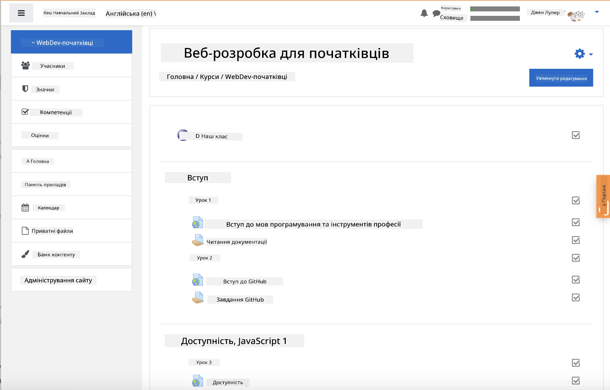
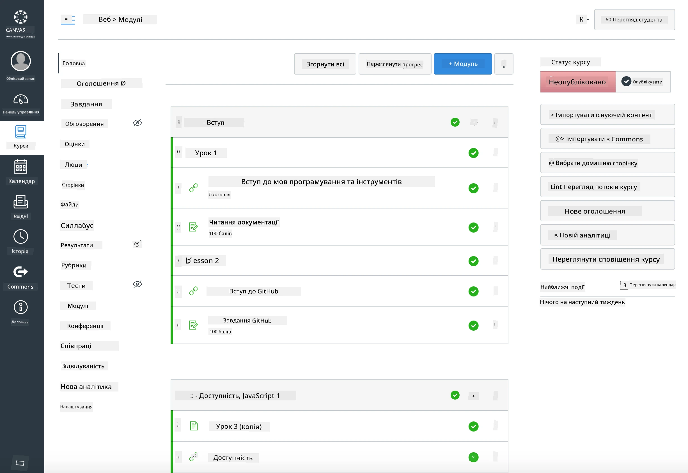

<!--
CO_OP_TRANSLATOR_METADATA:
{
  "original_hash": "71009af209f81cc01a1f2d324200375f",
  "translation_date": "2025-10-03T11:04:47+00:00",
  "source_file": "for-teachers.md",
  "language_code": "uk"
}
-->
### Для викладачів

Ви можете використовувати цю навчальну програму у своїй аудиторії. Вона бездоганно працює з GitHub Classroom і провідними платформами LMS, а також може використовуватися як окремий репозиторій зі студентами.

### Використання з GitHub Classroom

Щоб керувати уроками та завданнями для кожної групи, створіть окремий репозиторій для кожного уроку, щоб GitHub Classroom міг прикріплювати кожне завдання незалежно.

- Форкніть цей репозиторій у свою організацію.
- Створіть окремий репозиторій для кожного уроку, витягнувши папку уроку в окремий репозиторій.
  - Варіант A: Створіть порожні репозиторії (по одному на урок) і скопіюйте вміст папки уроку в кожен.
  - Варіант B: Використовуйте підхід зі збереженням історії Git (наприклад, розділіть папку на новий репозиторій), якщо вам потрібна історія змін.
- У GitHub Classroom створіть завдання для кожного уроку та вкажіть відповідний репозиторій уроку.
- Рекомендовані налаштування:
  - Видимість репозиторію: приватна для студентських робіт.
  - Використовуйте стартовий код із гілки за замовчуванням репозиторію уроку.
  - Додайте шаблони для Issues і Pull Requests для вікторин і завдань.
  - За бажанням налаштуйте автоперевірку та тести, якщо ваші уроки їх включають.
- Корисні конвенції:
  - Імена репозиторіїв, наприклад, lesson-01-intro, lesson-02-html тощо.
  - Мітки: quiz, assignment, needs-review, late, resubmission.
  - Теги/релізи для кожної групи (наприклад, v2025-term1).

Порада: Уникайте зберігання репозиторіїв у синхронізованих папках (наприклад, OneDrive/Google Drive), щоб уникнути конфліктів Git у Windows.

### Використання з Moodle, Canvas або Blackboard

Ця навчальна програма включає імпортовані пакети для поширених робочих процесів LMS.

- Moodle: Використовуйте файл завантаження Moodle [Moodle upload file](../../../../../../../teaching-files/webdev-moodle.mbz), щоб завантажити весь курс.
- Common Cartridge: Використовуйте файл Common Cartridge [Common Cartridge file](../../../../../../../teaching-files/webdev-common-cartridge.imscc) для ширшої сумісності з LMS.
- Примітки:
  - Moodle Cloud має обмежену підтримку Common Cartridge. Віддавайте перевагу файлу Moodle вище, який також можна завантажити в Canvas.
  - Після імпорту перегляньте модулі, дати здачі та налаштування вікторин, щоб вони відповідали вашому розкладу.

> Навчальна програма в Moodle

> Навчальна програма в Canvas

### Використання репозиторію напряму (без Classroom)

Якщо ви не хочете використовувати GitHub Classroom, ви можете проводити курс безпосередньо з цього репозиторію.

- Синхронні/онлайн формати (Zoom/Teams):
  - Проводьте короткі вступні заняття під керівництвом наставника; використовуйте кімнати для групових вікторин.
  - Оголошуйте часовий проміжок для вікторин; студенти здають відповіді через GitHub Issues.
  - Для спільних завдань студенти працюють у публічних репозиторіях уроків і відкривають Pull Requests.
- Приватні/асинхронні формати:
  - Студенти форкають кожен урок у свої **приватні** репозиторії та додають вас як співробітника.
  - Вони здають завдання через Issues (вікторини) і Pull Requests (завдання) у вашому репозиторії або у своїх приватних форках.

### Найкращі практики

- Проведіть ознайомчий урок із основ Git/GitHub, Issues і PRs.
- Використовуйте контрольні списки в Issues для багатокрокових вікторин/завдань.
- Додайте CONTRIBUTING.md і CODE_OF_CONDUCT.md, щоб встановити норми для аудиторії.
- Додайте примітки щодо доступності (альтернативний текст, субтитри) і запропонуйте друковані PDF.
- Версіонуйте ваш контент для кожного семестру та заморожуйте репозиторії уроків після публікації.

### Зворотний зв'язок і підтримка

Ми хочемо, щоб ця навчальна програма була корисною для вас і ваших студентів. Будь ласка, відкрийте новий Issue у цьому репозиторії для повідомлень про помилки, запитів або покращень, або почніть обговорення в Teacher Corner.

---

**Відмова від відповідальності**:  
Цей документ був перекладений за допомогою сервісу автоматичного перекладу [Co-op Translator](https://github.com/Azure/co-op-translator). Хоча ми прагнемо до точності, звертаємо вашу увагу, що автоматичні переклади можуть містити помилки або неточності. Оригінальний документ на його рідній мові слід вважати авторитетним джерелом. Для критично важливої інформації рекомендується професійний людський переклад. Ми не несемо відповідальності за будь-які непорозуміння або неправильні тлумачення, що виникли внаслідок використання цього перекладу.