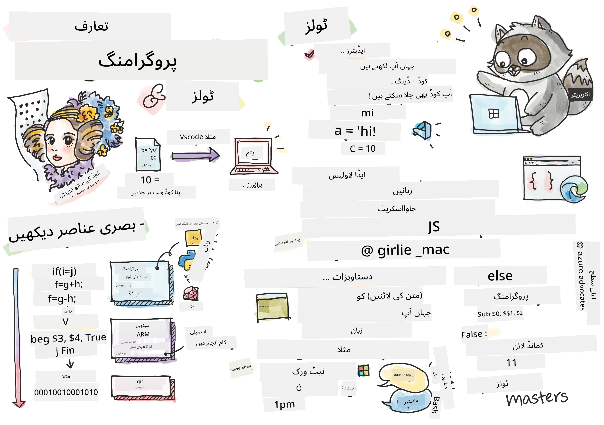
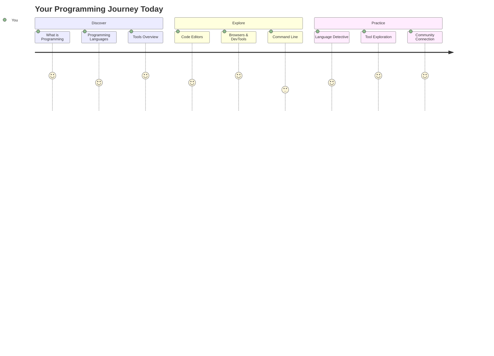
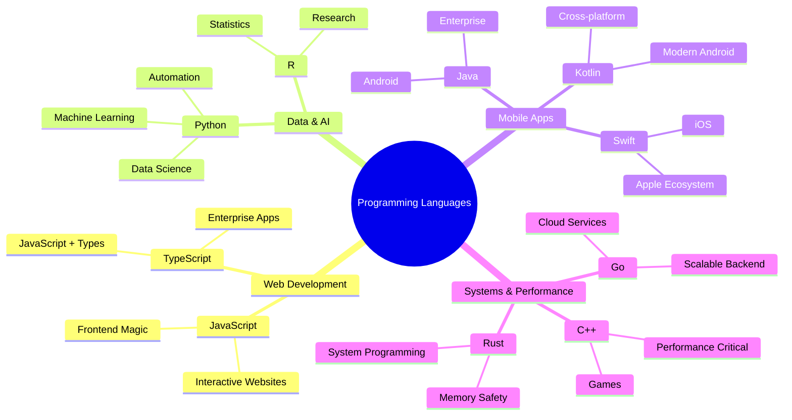
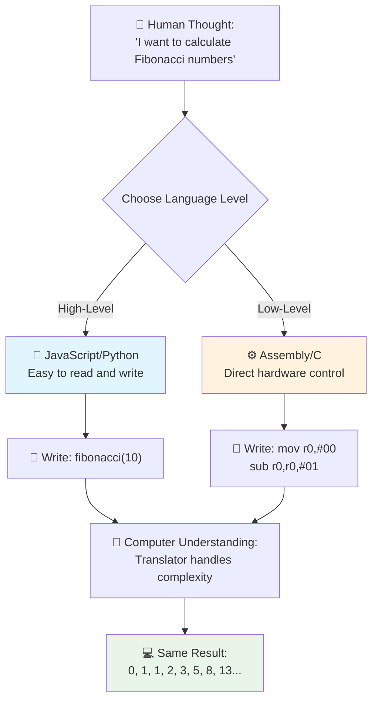
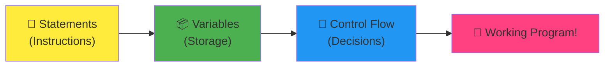
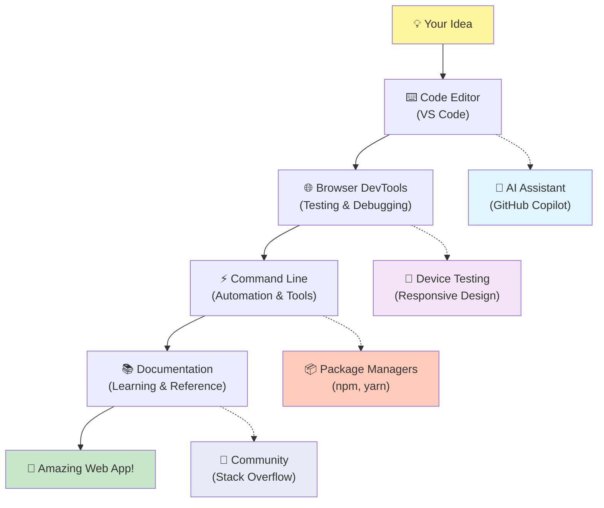
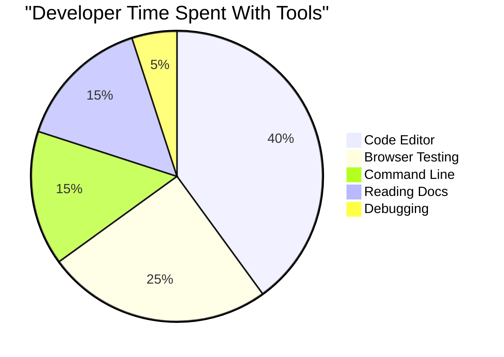
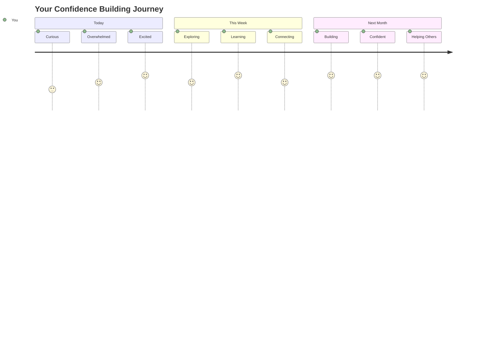

<!--
CO_OP_TRANSLATOR_METADATA:
{
  "original_hash": "d45ddcc54eb9232a76d08328b09d792e",
  "translation_date": "2025-11-03T12:59:41+00:00",
  "source_file": "1-getting-started-lessons/1-intro-to-programming-languages/README.md",
  "language_code": "ur"
}
-->
# پروگرامنگ زبانوں اور جدید ڈیولپر ٹولز کا تعارف

ہیلو، مستقبل کے ڈیولپر! 👋 کیا میں آپ کو کچھ بتا سکتا ہوں جو مجھے ہر دن حیران کر دیتا ہے؟ آپ یہ دریافت کرنے والے ہیں کہ پروگرامنگ صرف کمپیوٹرز کے بارے میں نہیں ہے – یہ آپ کے سب سے منفرد خیالات کو حقیقت میں بدلنے کی طاقت ہے!

آپ جانتے ہیں وہ لمحہ جب آپ اپنی پسندیدہ ایپ استعمال کر رہے ہوتے ہیں اور سب کچھ بالکل ٹھیک کام کرتا ہے؟ جب آپ ایک بٹن پر کلک کرتے ہیں اور کچھ جادوئی ہوتا ہے جو آپ کو "واہ، انہوں نے یہ کیسے کیا؟" کہنے پر مجبور کر دیتا ہے؟ تو، کوئی آپ جیسا – شاید رات کے 2 بجے اپنی پسندیدہ کافی شاپ میں بیٹھا ہوا، تیسرا ایسپریسو پیتے ہوئے – نے وہ کوڈ لکھا تھا جس نے وہ جادو تخلیق کیا۔ اور یہاں وہ بات ہے جو آپ کو حیران کر دے گی: اس سبق کے اختتام تک، آپ نہ صرف یہ سمجھیں گے کہ انہوں نے یہ کیسے کیا، بلکہ آپ خود اسے آزمانے کے لیے بے چین ہوں گے!

دیکھیں، اگر آپ کو ابھی پروگرامنگ مشکل لگ رہی ہے تو میں بالکل سمجھ سکتا ہوں۔ جب میں نے پہلی بار شروع کیا، تو مجھے واقعی لگا کہ آپ کو کوئی ریاضی کا ماہر ہونا چاہیے یا پانچ سال کی عمر سے کوڈنگ کرنی چاہیے۔ لیکن یہاں وہ بات ہے جس نے میری سوچ کو مکمل طور پر بدل دیا: پروگرامنگ بالکل ایک نئی زبان میں گفتگو کرنا سیکھنے جیسا ہے۔ آپ "ہیلو" اور "شکریہ" سے شروع کرتے ہیں، پھر کافی آرڈر کرنے تک پہنچتے ہیں، اور اس سے پہلے کہ آپ کو پتہ چلے، آپ گہرے فلسفیانہ مباحثے کر رہے ہوتے ہیں! لیکن اس معاملے میں، آپ کمپیوٹرز کے ساتھ گفتگو کر رہے ہیں، اور ایمانداری سے؟ وہ سب سے زیادہ صبر کرنے والے گفتگو کے ساتھی ہیں – وہ کبھی آپ کی غلطیوں پر فیصلہ نہیں کرتے اور ہمیشہ دوبارہ کوشش کرنے کے لیے تیار رہتے ہیں!

آج، ہم ان حیرت انگیز ٹولز کو دریافت کرنے جا رہے ہیں جو جدید ویب ڈیولپمنٹ کو نہ صرف ممکن بناتے ہیں بلکہ واقعی دلچسپ بناتے ہیں۔ میں ان ایڈیٹرز، براؤزرز، اور ورک فلو کے بارے میں بات کر رہا ہوں جو نیٹ فلکس، اسپاٹیفائی، اور آپ کے پسندیدہ انڈی ایپ اسٹوڈیو کے ڈیولپرز ہر روز استعمال کرتے ہیں۔ اور یہاں وہ حصہ ہے جو آپ کو خوشی سے جھومنے پر مجبور کر دے گا: ان میں سے زیادہ تر پروفیشنل گریڈ، انڈسٹری اسٹینڈرڈ ٹولز مکمل طور پر مفت ہیں!


> اسکیچ نوٹ [Tomomi Imura](https://twitter.com/girlie_mac) کی طرف سے



## دیکھتے ہیں کہ آپ پہلے سے کیا جانتے ہیں!

تفریحی چیزوں میں کودنے سے پہلے، مجھے تجسس ہے – آپ اس پروگرامنگ دنیا کے بارے میں پہلے سے کیا جانتے ہیں؟ اور سنیں، اگر آپ ان سوالات کو دیکھ رہے ہیں اور سوچ رہے ہیں "مجھے ان میں سے کسی کے بارے میں بالکل کوئی اندازہ نہیں ہے"، تو یہ نہ صرف ٹھیک ہے بلکہ بہترین ہے! اس کا مطلب ہے کہ آپ بالکل صحیح جگہ پر ہیں۔ اس کوئز کو ورزش سے پہلے کھینچنے جیسا سمجھیں – ہم صرف ان دماغی عضلات کو گرم کر رہے ہیں!

[پری سبق کوئز لیں](https://forms.office.com/r/dru4TE0U9n?origin=lprLink)

## وہ مہم جو ہم مل کر شروع کرنے والے ہیں

ٹھیک ہے، میں واقعی اس بارے میں پرجوش ہوں کہ ہم آج کیا دریافت کرنے والے ہیں! سنجیدگی سے، میں آپ کا چہرہ دیکھنا چاہتا ہوں جب ان میں سے کچھ تصورات واضح ہوں۔ یہ ہے وہ ناقابل یقین سفر جو ہم مل کر کر رہے ہیں:

- **پروگرامنگ اصل میں کیا ہے (اور یہ سب سے زبردست چیز کیوں ہے!)** – ہم یہ دریافت کریں گے کہ کوڈ واقعی وہ پوشیدہ جادو ہے جو آپ کے ارد گرد ہر چیز کو طاقت دیتا ہے، اس الارم سے جو کسی طرح جانتا ہے کہ پیر کی صبح ہے، اس الگورتھم تک جو آپ کے نیٹ فلکس کی سفارشات کو بالکل ترتیب دیتا ہے۔
- **پروگرامنگ زبانیں اور ان کی حیرت انگیز شخصیات** – تصور کریں کہ آپ ایک پارٹی میں داخل ہو رہے ہیں جہاں ہر شخص کے پاس مسائل کو حل کرنے کے مکمل طور پر مختلف سپر پاورز ہیں۔ پروگرامنگ زبانوں کی دنیا ایسی ہی ہے، اور آپ انہیں ملنے سے محبت کریں گے!
- **وہ بنیادی تعمیراتی بلاکس جو ڈیجیٹل جادو کو ممکن بناتے ہیں** – انہیں حتمی تخلیقی LEGO سیٹ سمجھیں۔ ایک بار جب آپ سمجھ جائیں کہ یہ ٹکڑے کیسے ایک دوسرے کے ساتھ جڑتے ہیں، تو آپ کو احساس ہوگا کہ آپ لفظی طور پر وہ سب کچھ بنا سکتے ہیں جو آپ کا تخیل خواب دیکھتا ہے۔
- **پروفیشنل ٹولز جو آپ کو ایسا محسوس کرائیں گے جیسے آپ کو جادوگر کی چھڑی دی گئی ہو** – میں یہاں ڈرامائی نہیں ہو رہا – یہ ٹولز واقعی آپ کو ایسا محسوس کرائیں گے جیسے آپ کے پاس سپر پاورز ہیں، اور سب سے اچھی بات؟ یہ وہی ہیں جو پروفیشنل استعمال کرتے ہیں!

> 💡 **یہاں بات یہ ہے**: آج سب کچھ یاد رکھنے کی کوشش بھی نہ کریں! ابھی، میں صرف چاہتا ہوں کہ آپ اس بات کے بارے میں جوش محسوس کریں کہ کیا ممکن ہے۔ تفصیلات قدرتی طور پر چپک جائیں گی جب ہم مل کر مشق کریں گے – یہی حقیقی سیکھنے کا طریقہ ہے!

> آپ یہ سبق [Microsoft Learn](https://docs.microsoft.com/learn/modules/web-development-101/introduction-programming/?WT.mc_id=academic-77807-sagibbon) پر لے سکتے ہیں!

## تو پروگرامنگ اصل میں *کیا* ہے؟

ٹھیک ہے، آئیے اس ملین ڈالر کے سوال کو حل کرتے ہیں: پروگرامنگ واقعی کیا ہے؟

میں آپ کو ایک کہانی سناؤں گا جس نے میرے سوچنے کے انداز کو مکمل طور پر بدل دیا۔ پچھلے ہفتے، میں اپنی ماں کو ہمارے نئے اسمارٹ ٹی وی ریموٹ استعمال کرنے کا طریقہ سمجھانے کی کوشش کر رہا تھا۔ میں نے خود کو یہ کہتے ہوئے پایا "لال بٹن دبائیں، لیکن بڑا لال بٹن نہیں، چھوٹا لال بٹن بائیں طرف... نہیں، آپ کا دوسرا بایاں... ٹھیک ہے، اب اسے دو سیکنڈ کے لیے دبائیں، ایک نہیں، تین نہیں..." کیا یہ جانا پہچانا لگتا ہے؟ 😅

یہی پروگرامنگ ہے! یہ طاقتور چیز کو انتہائی تفصیلی، قدم بہ قدم ہدایات دینے کا فن ہے لیکن اسے ہر چیز بالکل واضح طور پر بتانے کی ضرورت ہوتی ہے۔ لیکن ماں کو سمجھانے کے بجائے (جو پوچھ سکتی ہے "کون سا لال بٹن؟!"), آپ کمپیوٹر کو سمجھا رہے ہیں (جو بالکل وہی کرتا ہے جو آپ کہتے ہیں، چاہے آپ نے جو کہا وہ وہ نہ ہو جو آپ کا مطلب تھا)۔

یہاں وہ بات ہے جس نے مجھے حیران کر دیا جب میں نے پہلی بار یہ سیکھا: کمپیوٹرز بنیادی طور پر کافی سادہ ہیں۔ وہ لفظی طور پر صرف دو چیزیں سمجھتے ہیں – 1 اور 0، جو بنیادی طور پر صرف "ہاں" اور "نہیں" یا "آن" اور "آف" ہے۔ بس اتنا ہی! لیکن یہاں وہ جادو ہے – ہمیں 1s اور 0s میں بات کرنے کی ضرورت نہیں ہے جیسے ہم دی میٹرکس میں ہیں۔ یہی وہ جگہ ہے جہاں **پروگرامنگ زبانیں** مدد کے لیے آتی ہیں۔ وہ دنیا کے بہترین مترجم کی طرح ہیں جو آپ کے بالکل عام انسانی خیالات کو کمپیوٹر زبان میں تبدیل کرتے ہیں۔

اور یہاں وہ بات ہے جو مجھے ہر صبح جب میں جاگتا ہوں تو واقعی حیران کر دیتی ہے: آپ کی زندگی میں ہر ڈیجیٹل چیز کسی ایسے شخص کے ساتھ شروع ہوئی جو آپ جیسا تھا، شاید اپنے پاجامے میں کافی کا کپ لے کر بیٹھا ہوا، اپنے لیپ ٹاپ پر کوڈ ٹائپ کر رہا تھا۔ وہ انسٹاگرام فلٹر جو آپ کو بے عیب دکھاتا ہے؟ کسی نے اسے کوڈ کیا۔ وہ سفارش جس نے آپ کو آپ کے نئے پسندیدہ گانے تک پہنچایا؟ ایک ڈیولپر نے وہ الگورتھم بنایا۔ وہ ایپ جو آپ کو دوستوں کے ساتھ ڈنر بل تقسیم کرنے میں مدد دیتی ہے؟ ہاں، کسی نے سوچا "یہ پریشان کن ہے، مجھے لگتا ہے کہ میں اسے ٹھیک کر سکتا ہوں" اور پھر... انہوں نے کر دیا!

جب آپ پروگرامنگ سیکھتے ہیں، تو آپ صرف ایک نئی مہارت حاصل نہیں کر رہے ہوتے – آپ اس ناقابل یقین مسئلہ حل کرنے والوں کی کمیونٹی کا حصہ بن رہے ہیں جو اپنے دن یہ سوچتے ہوئے گزارتے ہیں، "کیا ہوگا اگر میں کچھ ایسا بنا سکوں جو کسی کا دن تھوڑا سا بہتر بنا دے؟" ایمانداری سے، کیا اس سے زیادہ زبردست کوئی چیز ہے؟

✅ **تفریحی حقیقت کی تلاش**: جب آپ کے پاس فارغ وقت ہو تو کچھ بہت دلچسپ تلاش کریں – آپ کے خیال میں دنیا کا پہلا کمپیوٹر پروگرامر کون تھا؟ میں آپ کو ایک اشارہ دوں گا: یہ وہ نہیں ہو سکتا جس کی آپ توقع کر رہے ہیں! اس شخص کے پیچھے کہانی بالکل دلچسپ ہے اور یہ ظاہر کرتی ہے کہ پروگرامنگ ہمیشہ تخلیقی مسئلہ حل کرنے اور باکس سے باہر سوچنے کے بارے میں رہی ہے۔

### 🧠 **چیک ان وقت: آپ کیسا محسوس کر رہے ہیں؟**

**ایک لمحہ لیں اور غور کریں:**
- کیا "کمپیوٹرز کو ہدایات دینے" کا تصور اب آپ کو سمجھ آتا ہے؟
- کیا آپ کسی روزمرہ کے کام کے بارے میں سوچ سکتے ہیں جسے آپ پروگرامنگ کے ذریعے خودکار بنانا چاہیں گے؟
- اس پورے پروگرامنگ کے بارے میں آپ کے ذہن میں کون سے سوالات اٹھ رہے ہیں؟

> **یاد رکھیں**: اگر کچھ تصورات ابھی دھندلے محسوس ہو رہے ہیں تو یہ بالکل معمول کی بات ہے۔ پروگرامنگ سیکھنا ایک نئی زبان سیکھنے جیسا ہے – آپ کے دماغ کو ان نیورل راستوں کو بنانے میں وقت لگتا ہے۔ آپ بہت اچھا کر رہے ہیں!

## پروگرامنگ زبانیں جادو کے مختلف ذائقوں کی طرح ہیں

ٹھیک ہے، یہ عجیب لگے گا، لیکن میرے ساتھ رہیں – پروگرامنگ زبانیں مختلف قسم کے موسیقی کی طرح ہیں۔ اس کے بارے میں سوچیں: آپ کے پاس جاز ہے، جو ہموار اور تخلیقی ہے، راک جو طاقتور اور سیدھا ہے، کلاسیکل جو خوبصورت اور منظم ہے، اور ہپ ہاپ جو تخلیقی اور اظہار خیال ہے۔ ہر انداز کا اپنا مزاج، اپنے شائقین کا گروپ، اور ہر ایک مختلف مواقع کے لیے بہترین ہے۔

پروگرامنگ زبانیں بالکل اسی طرح کام کرتی ہیں! آپ وہی زبان استعمال نہیں کریں گے جو ایک تفریحی موبائل گیم بنانے کے لیے استعمال کی جاتی ہے جو آپ بڑے پیمانے پر موسمیاتی ڈیٹا کو پروسیس کرنے کے لیے استعمال کریں گے، جیسے آپ یوگا کلاس میں ڈیتھ میٹل نہیں بجائیں گے (اچھا، زیادہ تر یوگا کلاسز میں! 😄)۔

لیکن یہاں وہ بات ہے جو مجھے ہر بار حیران کر دیتی ہے جب میں اس کے بارے میں سوچتا ہوں: یہ زبانیں ایسی ہیں جیسے آپ کے ساتھ دنیا کا سب سے صبر کرنے والا، شاندار مترجم بیٹھا ہوا ہو۔ آپ اپنے خیالات کو اس طرح بیان کر سکتے ہیں جو آپ کے انسانی دماغ کے لیے قدرتی محسوس ہوتا ہے، اور وہ اس تمام پیچیدہ کام کو سنبھالتے ہیں جو اسے 1s اور 0s میں تبدیل کرنے کے لیے ضروری ہے جو کمپیوٹرز اصل میں بولتے ہیں۔ یہ ایسا ہے جیسے آپ کے پاس ایک دوست ہو جو "انسانی تخلیقی صلاحیت" اور "کمپیوٹر منطق" دونوں میں مکمل طور پر ماہر ہو – اور وہ کبھی تھکتے نہیں، کبھی کافی بریک کی ضرورت نہیں ہوتی، اور کبھی آپ سے ایک ہی سوال دوبارہ پوچھنے پر فیصلہ نہیں کرتے!

### مشہور پروگرامنگ زبانیں اور ان کے استعمال



| زبان | بہترین استعمال | یہ کیوں مقبول ہے |
|------|----------------|------------------|
| **JavaScript** | ویب ڈیولپمنٹ، یوزر انٹرفیس | براؤزرز میں چلتی ہے اور انٹرایکٹو ویب سائٹس کو طاقت دیتی ہے |
| **Python** | ڈیٹا سائنس، آٹومیشن، AI | پڑھنے اور سیکھنے میں آسان، طاقتور لائبریریاں |
| **Java** | انٹرپرائز ایپلیکیشنز، اینڈرائیڈ ایپس | پلیٹ فارم سے آزاد، بڑے سسٹمز کے لیے مضبوط |
| **C#** | ونڈوز ایپلیکیشنز، گیم ڈیولپمنٹ | مضبوط مائیکروسافٹ ایکو سسٹم سپورٹ |
| **Go** | کلاؤڈ سروسز، بیک اینڈ سسٹمز | تیز، سادہ، جدید کمپیوٹنگ کے لیے ڈیزائن کیا گیا |

### ہائی لیول بمقابلہ لو لیول زبانیں

ٹھیک ہے، یہ وہ تصور تھا جس نے مجھے پہلی بار سیکھتے وقت واقعی الجھن میں ڈال دیا، لہذا میں وہ مثال شیئر کرنے جا رہا ہوں جس نے آخر کار مجھے سمجھایا – اور مجھے واقعی امید ہے کہ یہ آپ کی بھی مدد کرے گی!

تصور کریں کہ آپ ایک ایسے ملک میں جا رہے ہیں جہاں آپ زبان نہیں بولتے، اور آپ کو فوری طور پر قریب ترین باتھ روم تلاش کرنے کی ضرورت ہے (ہم سب وہاں رہے ہیں، ٹھیک ہے؟ 😅):

- **لو لیول پروگرامنگ** مقامی بولی کو اتنا اچھی طرح سیکھنے جیسا ہے کہ آپ کونے پر پھل بیچنے والی دادی کے ساتھ ثقافتی حوالوں، مقامی زبان، اور اندرونی لطیفوں کے ساتھ بات چیت کر سکتے ہیں جو صرف وہی سمجھ سکتا ہے جو وہاں پلا بڑھا ہو۔ بہت متاثر کن اور انتہائی مؤثر... اگر آپ روانی رکھتے ہیں! لیکن جب آپ صرف باتھ روم تلاش کرنے کی کوشش کر رہے ہیں تو کافی پریشان کن۔

- **ہائی لیول پروگرامنگ** اس حیرت انگیز مقامی دوست کی طرح ہے جو آپ کو سمجھتا ہے۔ آپ سادہ انگریزی میں کہہ سکتے ہیں "مجھے واقعی باتھ روم تلاش کرنے کی ضرورت ہے"، اور وہ تمام ثقافتی ترجمہ سنبھالتے ہیں اور آپ کو ایسے انداز میں ہدایات دیتے ہیں جو آپ کے غیر مقامی دماغ کے لیے بالکل معنی رکھتا ہے۔

پروگرامنگ کی اصطلاحات میں:
- **لو لیول زبانیں** (جیسے Assembly یا C) آپ کو کمپیوٹر کے اصل ہارڈویئر کے ساتھ انتہائی تفصیلی بات چیت کرنے دیتی ہیں، لیکن آپ کو مشین کی طرح سوچنا پڑتا ہے، جو... ٹھیک ہے، آئیے صرف یہ کہیں کہ یہ ایک بہت بڑی ذہنی تبدیلی ہے!
- **ہائی لیول زبانیں** (جیسے JavaScript, Python, یا C#) آپ کو انسان کی طرح سوچنے دیتی ہیں جبکہ وہ تمام مشین کی زبان کو پس پردہ سنبھالتی ہیں۔ اس کے علاوہ، ان کے پاس انتہائی خوش آمدید کہنے والی کمیونٹیز ہیں جو ان لوگوں سے بھری ہوئی ہیں جو یاد رکھتے ہیں کہ نیا ہونا کیسا محسوس ہوتا ہے اور واقعی آپ کی مدد کرنا چاہتے ہیں!

آپ اندازہ لگا سکتے ہیں کہ میں آپ کو کس سے شروع کرنے کا مشورہ دوں گا؟ 😉 ہائی لیول زبانیں تربیتی پہیوں کی طرح ہیں جنہیں آپ کبھی بھی ہٹانا نہیں چاہیں گے کیونکہ وہ پورے تجربے کو بہت زیادہ خوشگوار بناتی ہیں!



### میں آپ کو دکھاتا ہوں کہ ہائی لیول زبانیں کیوں زیادہ دوستانہ ہیں

ٹھیک ہے، میں آپ کو کچھ دکھانے والا ہوں جو بالکل ظاہر کرتا ہے کہ میں ہائی لیول زبانوں سے کیوں محبت کرتا ہوں، لیکن پہلے – مجھے آپ سے کچھ وعدہ کرنے کی ضرورت ہے۔ جب آپ وہ پہلا کوڈ مثال دیکھیں، تو گھبرائیں نہیں! یہ خوفناک لگنا چاہیے۔ یہی وہ نکتہ ہے جو میں بنا رہا ہوں!

ہم بالکل ایک ہی کام کو دو مکمل طور پر مختلف انداز میں لکھا ہوا دیکھنے جا رہے ہیں۔ دونوں وہ چیز تخلیق کرتے ہیں جسے فبوناکی سیکوئنس کہا جاتا ہے – یہ ایک خوبصورت ریاضیاتی نمونہ ہے جہاں ہر نمبر اس سے پہلے کے دو نمبروں کا مجموعہ ہوتا ہے: 0, 1, 1, 2, 3, 5, 8, 13... (تفریحی حقیقت: آپ یہ نمونہ لفظی طور پر قدرت میں ہر جگہ پائیں گے – سورج مکھی کے بیجوں کے گھومنے، پائن کون کے نمونوں، یہاں تک کہ کہکشاؤں کے بننے کے طریقے میں!)

تیار ہیں فرق دیکھنے کے لیے؟ چلیں!

**ہائی لیول زبان (JavaScript) – انسان دوست:**

```javascript
// Step 1: Basic Fibonacci setup
const fibonacciCount = 10;
let current = 0;
let next = 1;

console.log('Fibonacci sequence:');
```

**یہ کوڈ کیا کرتا ہے:**
- **ایک مستقل اعلان کریں** تاکہ یہ بتا سکیں کہ ہم کتنے فبوناکی نمبر بنانا چاہتے ہیں
- **دو متغیرات کو شروع کریں** تاکہ سیکوئنس میں موجودہ اور اگلے نمبروں کو ٹریک کریں
- **آغاز کریں** ابتدائی اقدار (0 اور 1) جو فبوناکی نمونہ کی وضاحت کرتی ہیں
- **ایک ہیڈر پیغام دکھائیں** تاکہ ہماری آؤٹ پٹ کی شناخت ہو

```javascript
// Step 2: Generate the sequence with a loop
for (let i = 0; i < fibonacciCount; i++) {
  console.log(`Position ${i + 1}: ${current}`);
  
  // Calculate next number in sequence
  const sum = current + next;
  current = next;
  next = sum;
}
```

**یہاں کیا ہوتا ہے:**
- **ہر پوزیشن کے ذریعے لوپ کریں** ہمارے سیکوئنس میں `for` لوپ کا استعمال کرتے ہوئے
- **ہر نمبر کو اس کی پوزیشن کے ساتھ دکھائیں** ٹیمپلیٹ لیٹرل فارمیٹنگ کا استعمال کرتے ہوئے
- **اگلا فبوناکی نمبر حساب کریں** موجودہ اور اگلی اقدار کو شامل کرکے
- **ہمارے ٹریکنگ متغیرات کو اپ ڈیٹ کریں** اگلی تکرار پر
- **تبصرے**: اعلیٰ سطح کی زبانیں وضاحتی تبصرے لکھنے کی حوصلہ افزائی کرتی ہیں جو کوڈ کو خود وضاحتی بناتی ہیں  
- **ساخت**: جاوا اسکرپٹ کی منطقی ترتیب مسائل کو قدم بہ قدم سمجھنے کے انسانی طریقے سے میل کھاتی ہے  
- **نگہداشت**: مختلف ضروریات کے لیے جاوا اسکرپٹ ورژن کو اپ ڈیٹ کرنا آسان اور واضح ہے  

✅ **فبوناکی تسلسل کے بارے میں**: یہ حیرت انگیز نمبر کا نمونہ (جہاں ہر نمبر پچھلے دو نمبروں کے مجموعے کے برابر ہوتا ہے: 0، 1، 1، 2، 3، 5، 8...) قدرت میں ہر جگہ نظر آتا ہے! آپ اسے سورج مکھی کے گھومنے والے نمونوں، پائن کون کے ڈیزائن، ناٹلس شیلز کے خم، اور یہاں تک کہ درختوں کی شاخوں کے بڑھنے کے طریقے میں بھی دیکھیں گے۔ یہ واقعی حیرت انگیز ہے کہ ریاضی اور کوڈ ہمیں قدرت کے حسن پیدا کرنے کے نمونوں کو سمجھنے اور دوبارہ تخلیق کرنے میں کیسے مدد دیتے ہیں!  

## وہ بنیادی اجزاء جو جادو کو ممکن بناتے ہیں  

ٹھیک ہے، اب جب کہ آپ نے دیکھا کہ پروگرامنگ زبانیں عملی طور پر کیسی نظر آتی ہیں، آئیے ان بنیادی حصوں کو توڑتے ہیں جو ہر پروگرام کو تشکیل دیتے ہیں جو کبھی لکھا گیا ہے۔ ان کو اپنے پسندیدہ نسخے کے ضروری اجزاء کے طور پر سوچیں – ایک بار جب آپ سمجھ جائیں کہ ہر ایک کیا کرتا ہے، آپ تقریباً کسی بھی زبان میں کوڈ پڑھنے اور لکھنے کے قابل ہو جائیں گے!  

یہ پروگرامنگ کے گرامر کو سیکھنے جیسا ہے۔ یاد ہے اسکول میں جب آپ نے اسم، فعل، اور جملے بنانے کے طریقے کے بارے میں سیکھا تھا؟ پروگرامنگ کا اپنا گرامر ہے، اور ایمانداری سے، یہ انگریزی گرامر سے کہیں زیادہ منطقی اور معاف کرنے والا ہے! 😄  

### بیانات: قدم بہ قدم ہدایات  

آئیے **بیانات** سے شروع کرتے ہیں – یہ آپ کے کمپیوٹر کے ساتھ گفتگو میں انفرادی جملوں کی طرح ہیں۔ ہر بیان کمپیوٹر کو ایک مخصوص کام کرنے کے لیے کہتا ہے، جیسے ہدایات دینا: "یہاں بائیں مڑیں،" "سرخ روشنی پر رکیں،" "اس جگہ پر پارک کریں۔"  

مجھے بیانات کے بارے میں جو چیز پسند ہے وہ یہ ہے کہ وہ عام طور پر کتنے قابل مطالعہ ہوتے ہیں۔ یہ دیکھیں:  

```javascript
// Basic statements that perform single actions
const userName = "Alex";                    
console.log("Hello, world!");              
const sum = 5 + 3;                         
```
  
**یہ کوڈ کیا کرتا ہے:**  
- **ایک مستقل متغیر کا اعلان کریں** تاکہ صارف کے نام کو ذخیرہ کیا جا سکے  
- **ایک مبارکبادی پیغام کو کنسول آؤٹ پٹ پر دکھائیں**  
- **ریاضی کے عمل کا نتیجہ حساب کریں اور ذخیرہ کریں**  

```javascript
// Statements that interact with web pages
document.title = "My Awesome Website";      
document.body.style.backgroundColor = "lightblue";
```
  
**قدم بہ قدم، یہاں کیا ہو رہا ہے:**  
- **ویب پیج کے عنوان کو تبدیل کریں** جو براؤزر ٹیب میں ظاہر ہوتا ہے  
- **پورے صفحے کے جسم کا پس منظر کا رنگ تبدیل کریں**  

### متغیرات: آپ کے پروگرام کا میموری سسٹم  

ٹھیک ہے، **متغیرات** ایمانداری سے میرے پسندیدہ تصورات میں سے ایک ہیں کیونکہ وہ ان چیزوں کی طرح ہیں جنہیں آپ ہر روز استعمال کرتے ہیں!  

اپنے فون کی رابطہ فہرست کے بارے میں ایک لمحے کے لیے سوچیں۔ آپ سب کے فون نمبر یاد نہیں رکھتے – اس کے بجائے، آپ "ماں"، "بہترین دوست"، یا "پیزا پلیس جو رات 2 بجے تک ڈیلیور کرتی ہے" محفوظ کرتے ہیں اور اپنے فون کو اصل نمبر یاد رکھنے دیتے ہیں۔ متغیرات بالکل اسی طرح کام کرتے ہیں! وہ لیبل والے کنٹینرز کی طرح ہیں جہاں آپ کا پروگرام معلومات ذخیرہ کر سکتا ہے اور بعد میں ایک نام کا استعمال کرتے ہوئے اسے بازیافت کر سکتا ہے جو واقعی معنی رکھتا ہے۔  

یہاں جو چیز واقعی ٹھنڈی ہے: جیسے جیسے آپ کا پروگرام چلتا ہے، متغیرات تبدیل ہو سکتے ہیں (اسی لیے نام "متغیر" ہے – دیکھیں انہوں نے کیا کیا؟)۔ بالکل اسی طرح جیسے آپ اس پیزا پلیس رابطے کو اپ ڈیٹ کر سکتے ہیں جب آپ کو کہیں اور بہتر جگہ مل جائے، متغیرات کو اپ ڈیٹ کیا جا سکتا ہے کیونکہ آپ کا پروگرام نئی معلومات سیکھتا ہے یا حالات بدلتے ہیں!  

مجھے آپ کو دکھانے دیں کہ یہ کتنا خوبصورت اور آسان ہو سکتا ہے:  

```javascript
// Step 1: Creating basic variables
const siteName = "Weather Dashboard";        
let currentWeather = "sunny";               
let temperature = 75;                       
let isRaining = false;                      
```
  
**ان تصورات کو سمجھنا:**  
- **غیر تبدیل ہونے والی اقدار کو `const` متغیرات میں ذخیرہ کریں** (جیسے سائٹ کا نام)  
- **اپنے پروگرام کے دوران تبدیل ہونے والی اقدار کے لیے `let` استعمال کریں**  
- **مختلف ڈیٹا کی اقسام تفویض کریں**: سٹرنگز (متن)، نمبر، اور بوولینز (سچ/جھوٹ)  
- **وضاحتی نام منتخب کریں** جو بتاتے ہیں کہ ہر متغیر میں کیا ہے  

```javascript
// Step 2: Working with objects to group related data
const weatherData = {                       
  location: "San Francisco",
  humidity: 65,
  windSpeed: 12
};
```
  
**اوپر، ہم نے:**  
- **ایک آبجیکٹ بنایا** تاکہ متعلقہ موسمی معلومات کو ایک ساتھ گروپ کیا جا سکے  
- **متعدد ڈیٹا کے ٹکڑوں کو ایک متغیر نام کے تحت منظم کیا**  
- **ہر معلومات کے ٹکڑے کو واضح طور پر لیبل کرنے کے لیے کلیدی قدر کے جوڑے استعمال کیے**  

```javascript
// Step 3: Using and updating variables
console.log(`${siteName}: Today is ${currentWeather} and ${temperature}°F`);
console.log(`Wind speed: ${weatherData.windSpeed} mph`);

// Updating changeable variables
currentWeather = "cloudy";                  
temperature = 68;                          
```
  
**آئیے ہر حصے کو سمجھیں:**  
- **معلومات کو ٹیمپلیٹ لیٹرلز کا استعمال کرتے ہوئے دکھائیں** `${}` نحو کے ساتھ  
- **ڈاٹ نوٹیشن کا استعمال کرتے ہوئے آبجیکٹ پراپرٹیز تک رسائی حاصل کریں** (`weatherData.windSpeed`)  
- **حالات کو تبدیل کرنے کی عکاسی کرنے کے لیے `let` کے ساتھ اعلان کردہ متغیرات کو اپ ڈیٹ کریں**  
- **بامعنی پیغامات بنانے کے لیے متعدد متغیرات کو یکجا کریں**  

```javascript
// Step 4: Modern destructuring for cleaner code
const { location, humidity } = weatherData; 
console.log(`${location} humidity: ${humidity}%`);
```
  
**آپ کو کیا جاننے کی ضرورت ہے:**  
- **آبجیکٹس سے مخصوص پراپرٹیز نکالیں** ڈیسٹرکچرنگ اسائنمنٹ کا استعمال کرتے ہوئے  
- **آبجیکٹ کیز کے جیسے ناموں کے ساتھ خود بخود نئے متغیرات بنائیں**  
- **بار بار ڈاٹ نوٹیشن سے بچ کر کوڈ کو آسان بنائیں**  

### کنٹرول فلو: اپنے پروگرام کو سوچنا سکھائیں  

ٹھیک ہے، یہ وہ جگہ ہے جہاں پروگرامنگ بالکل حیرت انگیز ہو جاتی ہے! **کنٹرول فلو** بنیادی طور پر آپ کے پروگرام کو ہوشیار فیصلے کرنے کا طریقہ سکھا رہا ہے، بالکل اسی طرح جیسے آپ ہر روز بغیر سوچے سمجھے کرتے ہیں۔  

تصور کریں: آج صبح آپ نے شاید کچھ ایسا کیا ہوگا "اگر بارش ہو رہی ہے، تو میں چھتری لے جاؤں گا۔ اگر سردی ہے، تو میں جیکٹ پہنوں گا۔ اگر دیر ہو رہی ہے، تو میں ناشتہ چھوڑ دوں گا اور راستے میں کافی لے لوں گا۔" آپ کا دماغ قدرتی طور پر اس اگر-تو منطق کی روزانہ درجنوں بار پیروی کرتا ہے!  

یہی وہ چیز ہے جو پروگراموں کو ذہین اور زندہ محسوس کرتی ہے بجائے اس کے کہ وہ صرف کسی بورنگ، پیش گوئی کے اسکرپٹ کی پیروی کریں۔ وہ واقعی کسی صورتحال کو دیکھ سکتے ہیں، جو ہو رہا ہے اس کا اندازہ لگا سکتے ہیں، اور مناسب جواب دے سکتے ہیں۔ یہ آپ کے پروگرام کو ایک دماغ دینے جیسا ہے جو ڈھال سکتا ہے اور انتخاب کر سکتا ہے!  

یہ کیسے کام کرتا ہے، یہ دیکھنا چاہتے ہیں؟ مجھے آپ کو دکھانے دیں:  

```javascript
// Step 1: Basic conditional logic
const userAge = 17;

if (userAge >= 18) {
  console.log("You can vote!");
} else {
  const yearsToWait = 18 - userAge;
  console.log(`You'll be able to vote in ${yearsToWait} year(s).`);
}
```
  
**یہ کوڈ کیا کرتا ہے:**  
- **چیک کریں** کہ آیا صارف کی عمر ووٹنگ کی ضرورت کو پورا کرتی ہے  
- **شرط کے نتیجے کی بنیاد پر مختلف کوڈ بلاکس پر عمل کریں**  
- **ووٹنگ کی اہلیت تک کتنا وقت باقی ہے حساب کریں اور دکھائیں اگر عمر 18 سے کم ہو**  
- **ہر منظر نامے کے لیے مخصوص، مددگار تاثرات فراہم کریں**  

```javascript
// Step 2: Multiple conditions with logical operators
const userAge = 17;
const hasPermission = true;

if (userAge >= 18 && hasPermission) {
  console.log("Access granted: You can enter the venue.");
} else if (userAge >= 16) {
  console.log("You need parent permission to enter.");
} else {
  console.log("Sorry, you must be at least 16 years old.");
}
```
  
**یہاں کیا ہوتا ہے اس کو توڑنا:**  
- **متعدد شرائط کو `&&` (اور) آپریٹر کا استعمال کرتے ہوئے یکجا کریں**  
- **متعدد منظرناموں کے لیے `else if` کا استعمال کرتے ہوئے شرائط کی درجہ بندی بنائیں**  
- **تمام ممکنہ کیسز کو ایک آخری `else` بیان کے ساتھ ہینڈل کریں**  
- **ہر مختلف صورتحال کے لیے واضح، قابل عمل تاثرات فراہم کریں**  

```javascript
// Step 3: Concise conditional with ternary operator
const votingStatus = userAge >= 18 ? "Can vote" : "Cannot vote yet";
console.log(`Status: ${votingStatus}`);
```
  
**آپ کو یاد رکھنے کی ضرورت ہے:**  
- **سادہ دو آپشن شرائط کے لیے ٹرنری آپریٹر (`? :`) استعمال کریں**  
- **پہلے شرط لکھیں، اس کے بعد `?`، پھر سچ نتیجہ، پھر `:`، پھر جھوٹ نتیجہ**  
- **جب آپ کو شرائط کی بنیاد پر اقدار تفویض کرنے کی ضرورت ہو تو اس پیٹرن کو لاگو کریں**  

```javascript
// Step 4: Handling multiple specific cases
const dayOfWeek = "Tuesday";

switch (dayOfWeek) {
  case "Monday":
  case "Tuesday":
  case "Wednesday":
  case "Thursday":
  case "Friday":
    console.log("It's a weekday - time to work!");
    break;
  case "Saturday":
  case "Sunday":
    console.log("It's the weekend - time to relax!");
    break;
  default:
    console.log("Invalid day of the week");
}
```
  
**یہ کوڈ درج ذیل کو پورا کرتا ہے:**  
- **متغیر کی قدر کو متعدد مخصوص کیسز کے خلاف ملائیں**  
- **مشابہت والے کیسز کو ایک ساتھ گروپ کریں** (ہفتے کے دن بمقابلہ ہفتے کے آخر)  
- **جب کوئی میچ مل جائے تو مناسب کوڈ بلاک پر عمل کریں**  
- **غیر متوقع اقدار کو ہینڈل کرنے کے لیے `default` کیس شامل کریں**  
- **اگلے کیس پر کوڈ کے جاری رہنے سے روکنے کے لیے `break` بیانات استعمال کریں**  

> 💡 **حقیقی دنیا کی مثال**: کنٹرول فلو کو دنیا کے سب سے زیادہ صبر کرنے والے GPS کی طرح سمجھیں جو آپ کو ہدایات دے رہا ہے۔ یہ کہہ سکتا ہے "اگر مین اسٹریٹ پر ٹریفک ہے، تو ہائی وے لیں۔ اگر ہائی وے پر تعمیراتی کام ہو رہا ہے، تو خوبصورت راستہ آزمائیں۔" پروگرام بالکل اسی قسم کی مشروط منطق کا استعمال کرتے ہیں تاکہ مختلف حالات کا ذہانت سے جواب دیں اور ہمیشہ صارفین کو بہترین ممکنہ تجربہ فراہم کریں۔  

### 🎯 **تصور کی جانچ: بنیادی اجزاء کی مہارت**  

**آئیے دیکھتے ہیں کہ آپ بنیادی باتوں کے ساتھ کیسے کر رہے ہیں:**  
- کیا آپ اپنے الفاظ میں متغیر اور بیان کے درمیان فرق کی وضاحت کر سکتے ہیں؟  
- ایک حقیقی دنیا کا منظر نامہ سوچیں جہاں آپ اگر-تو فیصلہ استعمال کریں گے (جیسے ہمارا ووٹنگ کی مثال)  
- پروگرامنگ منطق کے بارے میں ایک چیز کیا ہے جس نے آپ کو حیران کیا؟  

**فوری اعتماد بڑھانے والا:**  

  
✅ **آگے کیا آنے والا ہے**: ہم ان تصورات میں مزید گہرائی میں جانے کے لیے ایک زبردست وقت گزارنے والے ہیں جب ہم اس ناقابل یقین سفر کو ایک ساتھ جاری رکھیں گے! ابھی، بس ان تمام حیرت انگیز امکانات کے بارے میں جوش محسوس کرنے پر توجہ مرکوز کریں۔ مخصوص مہارتیں اور تکنیکیں قدرتی طور پر چپک جائیں گی جب ہم ایک ساتھ مشق کریں گے – میں وعدہ کرتا ہوں کہ یہ آپ کی توقع سے کہیں زیادہ مزہ آنے والا ہے!  

## تجارت کے اوزار  

ٹھیک ہے، یہ ایمانداری سے وہ جگہ ہے جہاں میں اتنا پرجوش ہو جاتا ہوں کہ میں خود کو بمشکل قابو میں رکھ سکتا ہوں! 🚀 ہم ان ناقابل یقین ٹولز کے بارے میں بات کرنے والے ہیں جو آپ کو ایسا محسوس کریں گے جیسے آپ کو ڈیجیٹل خلائی جہاز کی چابیاں دی گئی ہیں۔  

آپ جانتے ہیں کہ ایک شیف کے پاس وہ بالکل متوازن چاقو ہوتے ہیں جو ان کے ہاتھوں کے توسیع کی طرح محسوس ہوتے ہیں؟ یا ایک موسیقار کے پاس وہ ایک گٹار ہوتا ہے جو ان کے چھونے کے لمحے گاتا ہوا لگتا ہے؟ ٹھیک ہے، ڈویلپرز کے پاس ہمارے اپنے ورژن ہیں ان جادوئی ٹولز کے، اور یہاں وہ چیز ہے جو آپ کے دماغ کو بالکل اڑا دے گی – ان میں سے زیادہ تر مکمل طور پر مفت ہیں!  

میں آپ کے ساتھ ان کا اشتراک کرنے کے بارے میں سوچتے ہوئے اپنی کرسی پر اچھل رہا ہوں کیونکہ انہوں نے مکمل طور پر انقلاب برپا کر دیا ہے کہ ہم سافٹ ویئر کیسے بناتے ہیں۔ ہم AI سے چلنے والے کوڈنگ اسسٹنٹس کے بارے میں بات کر رہے ہیں جو آپ کے کوڈ کو لکھنے میں مدد کر سکتے ہیں (میں مذاق بھی نہیں کر رہا ہوں!)، کلاؤڈ ماحول جہاں آپ کہیں بھی Wi-Fi کے ساتھ پورے ایپلیکیشنز بنا سکتے ہیں، اور ڈیبگنگ ٹولز جو اتنے نفیس ہیں کہ وہ آپ کے پروگراموں کے لیے ایکس رے وژن رکھنے جیسے ہیں۔  

اور یہاں وہ حصہ ہے جو مجھے اب بھی جھنجھوڑ دیتا ہے: یہ "ابتدائی ٹولز" نہیں ہیں جنہیں آپ بڑھا دیں گے۔ یہ وہی پیشہ ورانہ گریڈ کے ٹولز ہیں جو گوگل، نیٹ فلکس، اور وہ انڈی ایپ اسٹوڈیو جسے آپ پسند کرتے ہیں، اس وقت استعمال کر رہے ہیں۔ آپ انہیں استعمال کرتے ہوئے ایک پرو کی طرح محسوس کریں گے!  


  
### کوڈ ایڈیٹرز اور IDEs: آپ کے نئے ڈیجیٹل بہترین دوست  

آئیے کوڈ ایڈیٹرز کے بارے میں بات کرتے ہیں – یہ سنجیدگی سے آپ کے نئے پسندیدہ جگہیں بننے والے ہیں! انہیں اپنے ذاتی کوڈنگ سینکچرری کے طور پر سوچیں جہاں آپ اپنا زیادہ تر وقت اپنے ڈیجیٹل تخلیقات کو تیار کرنے اور کامل بنانے میں گزاریں گے۔  

لیکن یہاں جدید ایڈیٹرز کے بارے میں جو چیز بالکل جادوئی ہے وہ یہ ہے: وہ صرف فینسی ٹیکسٹ ایڈیٹرز نہیں ہیں۔ وہ آپ کے ساتھ 24/7 بیٹھے سب سے زیادہ شاندار، معاون کوڈنگ مینٹور رکھنے جیسے ہیں۔ وہ آپ کی ٹائپوز کو پکڑتے ہیں اس سے پہلے کہ آپ انہیں محسوس کریں، ایسی بہتری تجویز کرتے ہیں جو آپ کو ایک جینئس کی طرح دکھاتی ہیں، آپ کو سمجھنے میں مدد کرتے ہیں کہ کوڈ کا ہر ٹکڑا کیا کرتا ہے، اور ان میں سے کچھ تو یہ بھی پیش کرتے ہیں کہ آپ کیا ٹائپ کرنے والے ہیں اور آپ کے خیالات کو ختم کرنے کی پیشکش کرتے ہیں!  

مجھے یاد ہے جب میں نے پہلی بار آٹو کمپلیشن دریافت کیا – مجھے لفظی طور پر ایسا لگا جیسے میں مستقبل میں رہ رہا ہوں۔ آپ کچھ ٹائپ کرنا شروع کرتے ہیں، اور آپ کا ایڈیٹر کہتا ہے، "ارے، کیا آپ اس فنکشن کے بارے میں سوچ رہے تھے جو بالکل وہی کرتا ہے جو آپ کو ضرورت ہے؟" یہ ایک دماغ پڑھنے والے کوڈنگ ساتھی رکھنے جیسا ہے!  

**یہ ایڈیٹرز کو اتنا ناقابل یقین کیا بناتا ہے؟**  

جدید کوڈ ایڈیٹرز پیداواری صلاحیت کو بڑھانے کے لیے متاثر کن خصوصیات کی ایک صف پیش کرتے ہیں:  

| خصوصیت | یہ کیا کرتی ہے | یہ کیوں مدد کرتی ہے |  
|---------|--------------|--------------|  
| **سینٹیکس ہائی لائٹنگ** | آپ کے کوڈ کے مختلف حصوں کو رنگ دیتی ہے | کوڈ کو پڑھنے اور غلطیوں کو دیکھنے میں آسان بناتی ہے |  
| **آٹو کمپلیشن** | آپ کے ٹائپ کرنے کے ساتھ کوڈ تجویز کرتی ہے | کوڈنگ کو تیز کرتی ہے اور ٹائپوز کو کم کرتی ہے |  
| **ڈیبگنگ ٹولز** | آپ کو غلطیاں تلاش کرنے اور ٹھیک کرنے میں مدد کرتی ہیں | خرابیوں کا سراغ لگانے کے وقت کو بچاتی ہیں |  
| **ایکسٹینشنز** | خصوصی خصوصیات شامل کرتی ہیں | کسی بھی ٹیکنالوجی کے لیے اپنے ایڈیٹر کو حسب ضرورت بنائیں |  
| **AI اسسٹنٹس** | کوڈ اور وضاحتیں تجویز کرتی ہیں | سیکھنے اور پیداواری صلاحیت کو تیز کرتی ہیں |  

> 🎥 **ویڈیو وسائل**: کیا آپ ان ٹولز کو ایکشن میں دیکھنا چاہتے ہیں؟ اس [تجارت کے اوزار ویڈیو](https://youtube.com/watch?v=69WJeXGBdxg) کو ایک جامع جائزہ کے لیے دیکھیں۔  

#### ویب ڈویلپمنٹ کے لیے تجویز کردہ ایڈیٹرز  

**[ویژول اسٹوڈیو کوڈ](https://code.visualstudio.com/?WT.mc_id=academic-77807-sagibbon)** (مفت)  
- ویب ڈویلپرز میں سب سے زیادہ مقبول  
- بہترین ایکسٹینشن ایکو سسٹم  
- بلٹ ان ٹرمینل اور گٹ انٹیگریشن  
- **ضروری ایکسٹینشنز**:  
  - [GitHub Copilot](https://marketplace.visualstudio.com/items?itemName=GitHub.copilot) - AI سے چلنے والی کوڈ تجاویز  
  - [Live Share](https://marketplace.visualstudio.com/items?itemName=MS-vsliveshare.vsliveshare) - حقیقی وقت تعاون  
  - [Prettier](https://marketplace.visualstudio.com/items?itemName=esbenp.prettier-vscode) - خودکار کوڈ فارمیٹنگ  
  - [Code Spell Checker](https://marketplace.visualstudio.com/items?itemName=streetsidesoftware.code-spell-checker) - آپ کے کوڈ میں ٹائپوز کو پکڑیں  

**[JetBrains WebStorm](https://www.jetbrains.com/webstorm/)** (ادا شدہ، طلباء کے لیے مفت)  
- اعلی درجے کے ڈیبگنگ اور ٹیسٹنگ ٹولز  
- ذہین کوڈ کمپلیشن  
- بلٹ ان ورژن کنٹرول  

**کلاؤڈ
جب پہلی بار کسی نے مجھے براؤزر ڈیولپر ٹولز دکھائے، تو میں نے تقریباً تین گھنٹے صرف کلک کرتے ہوئے گزارے اور بار بار کہا، "رکو، یہ بھی کر سکتا ہے؟!" آپ واقعی کسی بھی ویب سائٹ کو حقیقی وقت میں ایڈٹ کر سکتے ہیں، دیکھ سکتے ہیں کہ سب کچھ کتنی تیزی سے لوڈ ہوتا ہے، مختلف ڈیوائسز پر اپنی سائٹ کی شکل کو ٹیسٹ کر سکتے ہیں، اور جاوا اسکرپٹ کو ایک ماہر کی طرح ڈیبگ کر سکتے ہیں۔ یہ بالکل حیرت انگیز ہے!

**یہی وجہ ہے کہ براؤزرز آپ کا خفیہ ہتھیار ہیں:**

جب آپ کوئی ویب سائٹ یا ویب ایپلیکیشن بناتے ہیں، تو آپ کو دیکھنا ہوتا ہے کہ یہ حقیقی دنیا میں کیسی نظر آتی ہے اور کیسے کام کرتی ہے۔ براؤزرز نہ صرف آپ کا کام دکھاتے ہیں بلکہ کارکردگی، رسائی، اور ممکنہ مسائل کے بارے میں تفصیلی فیڈبیک بھی فراہم کرتے ہیں۔

#### براؤزر ڈیولپر ٹولز (DevTools)

جدید براؤزرز میں جامع ڈیولپمنٹ سوئٹس شامل ہیں:

| ٹول کی قسم | یہ کیا کرتا ہے | استعمال کی مثال |
|------------|----------------|------------------|
| **ایلیمنٹ انسپیکٹر** | HTML/CSS کو حقیقی وقت میں دیکھیں اور ایڈٹ کریں | اسٹائلنگ کو ایڈجسٹ کریں اور فوری نتائج دیکھیں |
| **کنسول** | ایرر میسجز دیکھیں اور جاوا اسکرپٹ ٹیسٹ کریں | مسائل کو ڈیبگ کریں اور کوڈ کے ساتھ تجربہ کریں |
| **نیٹ ورک مانیٹر** | وسائل کے لوڈ ہونے کا ٹریک کریں | کارکردگی اور لوڈنگ وقت کو بہتر بنائیں |
| **ایکسس ایبلٹی چیکر** | انکلوسیو ڈیزائن کے لیے ٹیسٹ کریں | یقینی بنائیں کہ آپ کی سائٹ تمام صارفین کے لیے کام کرتی ہے |
| **ڈیوائس سیمولیٹر** | مختلف اسکرین سائزز پر پیش نظارہ کریں | بغیر متعدد ڈیوائسز کے ریسپانسیو ڈیزائن ٹیسٹ کریں |

#### ڈیولپمنٹ کے لیے تجویز کردہ براؤزرز

- **[کروم](https://developers.google.com/web/tools/chrome-devtools/)** - انڈسٹری اسٹینڈرڈ DevTools کے ساتھ وسیع دستاویزات
- **[فائر فاکس](https://developer.mozilla.org/docs/Tools)** - بہترین CSS گرڈ اور ایکسس ایبلٹی ٹولز
- **[ایج](https://docs.microsoft.com/microsoft-edge/devtools-guide-chromium/?WT.mc_id=academic-77807-sagibbon)** - کرومیئم پر مبنی، مائیکروسافٹ کے ڈیولپر وسائل کے ساتھ

> ⚠️ **اہم ٹیسٹنگ ٹپ**: ہمیشہ اپنی ویب سائٹس کو متعدد براؤزرز میں ٹیسٹ کریں! جو کروم میں بالکل کام کرتا ہے وہ سفاری یا فائر فاکس میں مختلف نظر آ سکتا ہے۔ پروفیشنل ڈیولپرز تمام بڑے براؤزرز میں ٹیسٹ کرتے ہیں تاکہ صارفین کے تجربات کو مستقل رکھا جا سکے۔

### کمانڈ لائن ٹولز: ڈیولپر سپر پاورز کا گیٹ وے

چلیں، یہاں کمانڈ لائن کے بارے میں ایک بالکل ایماندار لمحہ رکھتے ہیں، کیونکہ میں چاہتا ہوں کہ آپ یہ کسی ایسے شخص سے سنیں جو واقعی سمجھتا ہے۔ جب میں نے پہلی بار اسے دیکھا – بس یہ خوفناک سیاہ اسکرین جس پر ٹیکسٹ چمک رہا تھا – تو میں نے لفظی طور پر سوچا، "نہیں، بالکل نہیں! یہ 1980 کی دہائی کی ہیکر فلم جیسا لگتا ہے، اور میں یقینی طور پر اس کے لیے کافی ذہین نہیں ہوں!" 😅

لیکن یہ وہ بات ہے جو میں چاہتا ہوں کہ کسی نے مجھے اس وقت بتائی ہوتی، اور جو میں آپ کو ابھی بتا رہا ہوں: کمانڈ لائن خوفناک نہیں ہے – یہ دراصل آپ کے کمپیوٹر کے ساتھ براہ راست بات چیت کرنے جیسا ہے۔ اسے اس طرح سوچیں جیسے کھانے کا آرڈر دینا کسی فینسی ایپ کے ذریعے جس میں تصاویر اور مینو ہوں (جو اچھا اور آسان ہے) بمقابلہ اپنے پسندیدہ مقامی ریستوران میں جانا جہاں شیف بالکل جانتا ہے کہ آپ کیا پسند کرتے ہیں اور صرف آپ کے کہنے پر "کچھ حیرت انگیز" بنا سکتا ہے۔

کمانڈ لائن وہ جگہ ہے جہاں ڈیولپرز جادوگر محسوس کرتے ہیں۔ آپ کچھ جادوئی الفاظ (ٹھیک ہے، وہ صرف کمانڈز ہیں، لیکن وہ جادوئی محسوس ہوتے ہیں!) ٹائپ کرتے ہیں، انٹر دبائیں، اور بوم – آپ نے پورے پروجیکٹ کے ڈھانچے بنائے، دنیا بھر سے طاقتور ٹولز انسٹال کیے، یا اپنی ایپ کو انٹرنیٹ پر لاکھوں لوگوں کے لیے ڈپلائے کیا۔ ایک بار جب آپ اس طاقت کا پہلا ذائقہ حاصل کرتے ہیں، تو یہ واقعی کافی نشہ آور ہوتا ہے!

**کیوں کمانڈ لائن آپ کا پسندیدہ ٹول بن جائے گا:**

گرافیکل انٹرفیس بہت سے کاموں کے لیے بہترین ہیں، لیکن کمانڈ لائن آٹومیشن، درستگی، اور رفتار میں مہارت رکھتی ہے۔ بہت سے ڈیولپمنٹ ٹولز بنیادی طور پر کمانڈ لائن انٹرفیس کے ذریعے کام کرتے ہیں، اور انہیں مؤثر طریقے سے استعمال کرنا سیکھنا آپ کی پیداواریت کو ڈرامائی طور پر بہتر بنا سکتا ہے۔

```bash
# Step 1: Create and navigate to project directory
mkdir my-awesome-website
cd my-awesome-website
```

**یہ کوڈ کیا کرتا ہے:**
- **ایک نیا ڈائریکٹری بنائیں** جس کا نام "my-awesome-website" ہو آپ کے پروجیکٹ کے لیے
- **نئے بنائے گئے ڈائریکٹری میں جائیں** تاکہ کام شروع کریں

```bash
# Step 2: Initialize project with package.json
npm init -y

# Install modern development tools
npm install --save-dev vite prettier eslint
npm install --save-dev @eslint/js
```

**مرحلہ وار، یہاں کیا ہو رہا ہے:**
- **ایک نیا Node.js پروجیکٹ شروع کریں** ڈیفالٹ سیٹنگز کے ساتھ `npm init -y` استعمال کرتے ہوئے
- **Vite انسٹال کریں** ایک جدید بلڈ ٹول کے طور پر تیز ڈیولپمنٹ اور پروڈکشن بلڈز کے لیے
- **Prettier شامل کریں** خودکار کوڈ فارمیٹنگ کے لیے اور ESLint کوڈ کوالٹی چیکس کے لیے
- **`--save-dev` فلیگ استعمال کریں** تاکہ انہیں صرف ڈیولپمنٹ کے لیے ڈیپینڈنسیز کے طور پر نشان زد کریں

```bash
# Step 3: Create project structure and files
mkdir src assets
echo '<!DOCTYPE html><html><head><title>My Site</title></head><body><h1>Hello World</h1></body></html>' > index.html

# Start development server
npx vite
```

**اوپر، ہم نے:**
- **اپنے پروجیکٹ کو منظم کیا** سورس کوڈ اور اثاثوں کے لیے الگ فولڈرز بنا کر
- **ایک بنیادی HTML فائل بنائی** مناسب دستاویز کے ڈھانچے کے ساتھ
- **Vite ڈیولپمنٹ سرور شروع کیا** لائیو ری لوڈنگ اور ہاٹ ماڈیول ریپلیسمنٹ کے لیے

#### ویب ڈیولپمنٹ کے لیے ضروری کمانڈ لائن ٹولز

| ٹول | مقصد | کیوں آپ کو اس کی ضرورت ہے |
|-----|-------|---------------------------|
| **[Git](https://git-scm.com/)** | ورژن کنٹرول | تبدیلیوں کو ٹریک کریں، دوسروں کے ساتھ تعاون کریں، اپنا کام بیک اپ کریں |
| **[Node.js & npm](https://nodejs.org/)** | جاوا اسکرپٹ رن ٹائم اور پیکیج مینجمنٹ | براؤزرز کے باہر جاوا اسکرپٹ چلائیں، جدید ڈیولپمنٹ ٹولز انسٹال کریں |
| **[Vite](https://vitejs.dev/)** | بلڈ ٹول اور ڈیولپمنٹ سرور | تیز رفتار ڈیولپمنٹ ہاٹ ماڈیول ریپلیسمنٹ کے ساتھ |
| **[ESLint](https://eslint.org/)** | کوڈ کوالٹی | جاوا اسکرپٹ میں مسائل کو خود بخود تلاش کریں اور ٹھیک کریں |
| **[Prettier](https://prettier.io/)** | کوڈ فارمیٹنگ | اپنے کوڈ کو مستقل طور پر فارمیٹڈ اور پڑھنے کے قابل رکھیں |

#### پلیٹ فارم کے لحاظ سے اختیارات

**ونڈوز:**
- **[Windows Terminal](https://docs.microsoft.com/windows/terminal/?WT.mc_id=academic-77807-sagibbon)** - جدید، فیچر سے بھرپور ٹرمینل
- **[PowerShell](https://docs.microsoft.com/powershell/?WT.mc_id=academic-77807-sagibbon)** 💻 - طاقتور اسکرپٹنگ ماحول
- **[Command Prompt](https://docs.microsoft.com/windows-server/administration/windows-commands/?WT.mc_id=academic-77807-sagibbon)** 💻 - روایتی ونڈوز کمانڈ لائن

**macOS:**
- **[Terminal](https://support.apple.com/guide/terminal/)** 💻 - بلٹ ان ٹرمینل ایپلیکیشن
- **[iTerm2](https://iterm2.com/)** - جدید خصوصیات کے ساتھ بہتر ٹرمینل

**لینکس:**
- **[Bash](https://www.gnu.org/software/bash/)** 💻 - معیاری لینکس شیل
- **[KDE Konsole](https://docs.kde.org/trunk5/en/konsole/konsole/index.html)** - جدید ٹرمینل ایمولیٹر

> 💻 = آپریٹنگ سسٹم پر پہلے سے انسٹال شدہ

> 🎯 **سیکھنے کا راستہ**: بنیادی کمانڈز جیسے `cd` (ڈائریکٹری تبدیل کریں)، `ls` یا `dir` (فائلز کی فہرست)، اور `mkdir` (فولڈر بنائیں) سے شروع کریں۔ جدید ورک فلو کمانڈز جیسے `npm install`, `git status`, اور `code .` (موجودہ ڈائریکٹری کو VS Code میں کھولیں) کے ساتھ مشق کریں۔ جیسے جیسے آپ زیادہ آرام دہ ہوں گے، آپ خود بخود مزید جدید کمانڈز اور آٹومیشن تکنیک سیکھیں گے۔

### دستاویزات: آپ کا ہمیشہ دستیاب سیکھنے کا رہنما

چلیں، میں آپ کے ساتھ ایک چھوٹا سا راز شیئر کرتا ہوں جو آپ کو ایک ابتدائی ہونے کے بارے میں بہت بہتر محسوس کرے گا: یہاں تک کہ سب سے زیادہ تجربہ کار ڈیولپرز اپنا بہت سا وقت دستاویزات پڑھنے میں گزارتے ہیں۔ اور یہ اس لیے نہیں کہ وہ نہیں جانتے کہ وہ کیا کر رہے ہیں – یہ دراصل دانشمندی کی علامت ہے!

دستاویزات کو ایسے سمجھیں جیسے آپ کے پاس دنیا کے سب سے زیادہ صبر کرنے والے، علم رکھنے والے اساتذہ ہوں جو 24/7 دستیاب ہوں۔ رات 2 بجے کسی مسئلے پر پھنس گئے؟ دستاویزات وہاں ہیں ایک گرم ورچوئل گلے کے ساتھ اور بالکل وہ جواب جو آپ کو چاہیے۔ کسی زبردست نئے فیچر کے بارے میں جاننا چاہتے ہیں جس کے بارے میں سب بات کر رہے ہیں؟ دستاویزات آپ کے ساتھ ہیں مرحلہ وار مثالوں کے ساتھ۔ یہ سمجھنے کی کوشش کر رہے ہیں کہ کچھ کام کیسے اور کیوں ہوتا ہے؟ آپ نے صحیح اندازہ لگایا – دستاویزات آپ کو اس طرح سے سمجھانے کے لیے تیار ہیں کہ آخر کار آپ کو سمجھ آ جائے!

یہاں ایک چیز ہے جس نے میری سوچ کو مکمل طور پر بدل دیا: ویب ڈیولپمنٹ کی دنیا ناقابل یقین حد تک تیزی سے حرکت کرتی ہے، اور کوئی بھی (میرا مطلب بالکل کوئی بھی نہیں!) سب کچھ یاد نہیں رکھتا۔ میں نے 15+ سال کے تجربے والے سینئر ڈیولپرز کو بنیادی سینٹیکس دیکھتے ہوئے دیکھا ہے، اور آپ جانتے ہیں کیا؟ یہ شرمندگی کی بات نہیں ہے – یہ ہوشیاری ہے! یہ کامل یادداشت رکھنے کے بارے میں نہیں ہے؛ یہ قابل اعتماد جوابات کو جلدی سے تلاش کرنے اور انہیں لاگو کرنے کے بارے میں ہے۔

**یہاں اصل جادو ہوتا ہے:**

پروفیشنل ڈیولپرز اپنا ایک بڑا حصہ دستاویزات پڑھنے میں گزارتے ہیں – نہ کہ اس لیے کہ وہ نہیں جانتے کہ وہ کیا کر رہے ہیں، بلکہ اس لیے کہ ویب ڈیولپمنٹ کا منظر نامہ اتنی تیزی سے ترقی کرتا ہے کہ موجودہ رہنے کے لیے مسلسل سیکھنا ضروری ہے۔ بہترین دستاویزات آپ کو یہ سمجھنے میں مدد دیتی ہیں کہ کچھ *کیسے* استعمال کرنا ہے، بلکہ *کیوں* اور *کب* استعمال کرنا ہے۔

#### ضروری دستاویزاتی وسائل

**[Mozilla Developer Network (MDN)](https://developer.mozilla.org/docs/Web)**
- ویب ٹیکنالوجی دستاویزات کے لیے گولڈ اسٹینڈرڈ
- HTML، CSS، اور جاوا اسکرپٹ کے لیے جامع گائیڈز
- براؤزر مطابقت کی معلومات شامل ہیں
- عملی مثالیں اور انٹرایکٹو ڈیموز پیش کرتا ہے

**[Web.dev](https://web.dev)** (گوگل کی طرف سے)
- جدید ویب ڈیولپمنٹ کے بہترین طریقے
- کارکردگی کی اصلاح کے گائیڈز
- ایکسس ایبلٹی اور انکلوسیو ڈیزائن کے اصول
- حقیقی دنیا کے پروجیکٹس سے کیس اسٹڈیز

**[Microsoft Developer Documentation](https://docs.microsoft.com/microsoft-edge/#microsoft-edge-for-developers)**
- ایج براؤزر ڈیولپمنٹ وسائل
- پروگریسو ویب ایپ گائیڈز
- کراس پلیٹ فارم ڈیولپمنٹ بصیرت

**[Frontend Masters Learning Paths](https://frontendmasters.com/learn/)**
- ساختی سیکھنے کے نصاب
- انڈسٹری ماہرین کے ویڈیو کورسز
- ہینڈز آن کوڈنگ مشقیں

> 📚 **مطالعہ کی حکمت عملی**: دستاویزات کو یاد کرنے کی کوشش نہ کریں – بلکہ، اسے مؤثر طریقے سے نیویگیٹ کرنے کا طریقہ سیکھیں۔ اکثر استعمال ہونے والے حوالہ جات کو بک مارک کریں اور مخصوص معلومات کو جلدی سے تلاش کرنے کے لیے سرچ فنکشنز کا استعمال کریں۔

### 🔧 **ٹول ماسٹری چیک: آپ کو کیا زیادہ دلچسپ لگتا ہے؟**

**ایک لمحہ نکالیں اور غور کریں:**
- کون سا ٹول آپ سب سے پہلے آزمانے کے لیے سب سے زیادہ پرجوش ہیں؟ (کوئی غلط جواب نہیں ہے!)
- کیا کمانڈ لائن اب بھی خوفناک لگتی ہے، یا آپ اس کے بارے میں متجسس ہیں؟
- کیا آپ تصور کر سکتے ہیں کہ براؤزر DevTools کا استعمال کرتے ہوئے اپنی پسندیدہ ویب سائٹس کے پردے کے پیچھے جھانکیں؟



> **دلچسپ بصیرت**: زیادہ تر ڈیولپرز اپنا تقریباً 40% وقت اپنے کوڈ ایڈیٹر میں گزارتے ہیں، لیکن نوٹ کریں کہ کتنا وقت ٹیسٹنگ، سیکھنے، اور مسئلے کو حل کرنے میں جاتا ہے۔ پروگرامنگ صرف کوڈ لکھنے کے بارے میں نہیں ہے – یہ تجربات تخلیق کرنے کے بارے میں ہے!

✅ **غور کرنے کے لیے خوراک**: یہاں ایک دلچسپ بات ہے – آپ کے خیال میں ویب سائٹس بنانے کے ٹولز (ڈیولپمنٹ) ویب سائٹس کے ڈیزائن کے ٹولز (ڈیزائن) سے کیسے مختلف ہو سکتے ہیں؟ یہ بالکل ایسے ہے جیسے ایک معمار جو ایک خوبصورت گھر ڈیزائن کرتا ہے اور وہ ٹھیکیدار جو اسے حقیقت میں بناتا ہے۔ دونوں اہم ہیں، لیکن انہیں مختلف ٹول باکسز کی ضرورت ہوتی ہے! اس قسم کی سوچ واقعی آپ کو یہ بڑی تصویر دیکھنے میں مدد دے گی کہ ویب سائٹس کیسے زندہ ہوتی ہیں۔

## GitHub Copilot Agent Challenge 🚀

Agent موڈ کا استعمال کرتے ہوئے درج ذیل چیلنج مکمل کریں:

**تفصیل:** ایک جدید کوڈ ایڈیٹر یا IDE کی خصوصیات کو دریافت کریں اور دکھائیں کہ یہ آپ کے ورک فلو کو بطور ویب ڈیولپر کیسے بہتر بنا سکتا ہے۔

**پرومپٹ:** ایک کوڈ ایڈیٹر یا IDE منتخب کریں (جیسے Visual Studio Code، WebStorm، یا کلاؤڈ بیسڈ IDE)۔ تین خصوصیات یا ایکسٹینشنز کی فہرست بنائیں جو آپ کو کوڈ لکھنے، ڈیبگ کرنے، یا مؤثر طریقے سے برقرار رکھنے میں مدد دیتی ہیں۔ ہر ایک کے لیے، وضاحت کریں کہ یہ آپ کے ورک فلو کو کیسے فائدہ پہنچاتی ہے۔

---

## 🚀 چیلنج

**ٹھیک ہے، جاسوس، کیا آپ اپنے پہلے کیس کے لیے تیار ہیں؟**

اب جب کہ آپ کے پاس یہ زبردست بنیاد ہے، میرے پاس ایک مہم جوئی ہے جو آپ کو دکھائے گی کہ پروگرامنگ کی دنیا کتنی متنوع اور دلچسپ ہے۔ اور سنیں – یہ ابھی کوڈ لکھنے کے بارے میں نہیں ہے، لہذا اس میں کوئی دباؤ نہیں! اپنے آپ کو ایک پروگرامنگ زبان کے جاسوس کے طور پر سوچیں جو اپنے پہلے دلچسپ کیس پر ہے!

**آپ کا مشن، اگر آپ اسے قبول کرنے کا انتخاب کرتے ہیں:**
1. **ایک زبان کا ایکسپلورر بنیں**: تین پروگرامنگ زبانیں منتخب کریں جو مکمل طور پر مختلف دنیاؤں سے ہوں – شاید ایک جو ویب سائٹس بناتی ہے، ایک جو موبائل ایپس بناتی ہے، اور ایک جو سائنسدانوں کے لیے ڈیٹا کو کرنچ کرتی ہے۔ ہر زبان میں ایک ہی سادہ کام کی مثالیں تلاش کریں۔ میں وعدہ کرتا ہوں کہ آپ حیران ہوں گے کہ وہ بالکل مختلف نظر آ سکتی ہیں جبکہ بالکل ایک ہی کام کر رہی ہیں!

2. **ان کی اصل کہانیاں دریافت کریں**: ہر زبان کو خاص کیا بناتا ہے؟ یہاں ایک زبردست حقیقت ہے – ہر ایک پروگرامنگ زبان اس لیے بنائی گئی کیونکہ کسی نے سوچا، "آپ جانتے ہیں کیا؟ اس مخصوص مسئلے کو حل کرنے کا ایک بہتر طریقہ ہونا چاہیے۔" کیا آپ یہ معلوم کر سکتے ہیں کہ وہ مسائل کیا تھے؟ ان میں سے کچھ کہانیاں واقعی دلچسپ ہیں!

3. **کمیونٹیز سے ملیں**: دیکھیں کہ ہر زبان کی کمیونٹی کتنی خوش آمدید اور پرجوش ہے۔ کچھ کے پاس لاکھوں ڈیولپرز ہیں جو علم کا اشتراک کرتے ہیں اور ایک دوسرے کی مدد کرتے ہیں
## جائزہ اور خود مطالعہ

**آرام سے وقت لیں اور اس سے لطف اندوز ہوں!**

آپ نے آج بہت کچھ سیکھا ہے، اور یہ قابل فخر بات ہے! اب دلچسپ حصہ آتا ہے – ان موضوعات کو دریافت کرنا جنہوں نے آپ کی دلچسپی کو جنم دیا۔ یاد رکھیں، یہ ہوم ورک نہیں ہے – یہ ایک مہم جوئی ہے!

**ان چیزوں میں گہرائی سے جائیں جو آپ کو دلچسپ لگتی ہیں:**

**پروگرامنگ زبانوں کے ساتھ عملی تجربہ حاصل کریں:**
- ان 2-3 زبانوں کی آفیشل ویب سائٹس پر جائیں جنہوں نے آپ کی توجہ حاصل کی۔ ہر زبان کی اپنی شخصیت اور کہانی ہوتی ہے!
- کچھ آن لائن کوڈنگ پلیٹ فارمز جیسے [CodePen](https://codepen.io/)، [JSFiddle](https://jsfiddle.net/)، یا [Replit](https://replit.com/) آزمائیں۔ تجربہ کرنے سے نہ گھبرائیں – آپ کچھ خراب نہیں کر سکتے!
- اپنی پسندیدہ زبان کے آغاز کے بارے میں پڑھیں۔ واقعی، ان میں سے کچھ کہانیاں دلچسپ ہیں اور آپ کو سمجھنے میں مدد دیں گی کہ زبانیں اس طرح کیوں کام کرتی ہیں۔

**اپنے نئے ٹولز کے ساتھ آرام دہ ہوں:**
- اگر آپ نے ابھی تک Visual Studio Code ڈاؤنلوڈ نہیں کیا ہے تو اسے ڈاؤنلوڈ کریں – یہ مفت ہے اور آپ کو یہ پسند آئے گا!
- Extensions مارکیٹ پلیس کو چند منٹ کے لیے براؤز کریں۔ یہ آپ کے کوڈ ایڈیٹر کے لیے ایپ اسٹور کی طرح ہے!
- اپنے براؤزر کے Developer Tools کو کھولیں اور بس کلک کریں۔ سب کچھ سمجھنے کی فکر نہ کریں – بس وہاں موجود چیزوں سے واقفیت حاصل کریں۔

**کمیونٹی میں شامل ہوں:**
- کچھ ڈویلپر کمیونٹیز کو [Dev.to](https://dev.to/)، [Stack Overflow](https://stackoverflow.com/)، یا [GitHub](https://github.com/) پر فالو کریں۔ پروگرامنگ کمیونٹی نئے آنے والوں کے لیے انتہائی خوش آمدید ہے!
- یوٹیوب پر کچھ ابتدائی دوستانہ کوڈنگ ویڈیوز دیکھیں۔ وہاں بہت سارے زبردست تخلیق کار ہیں جو یاد رکھتے ہیں کہ شروع میں کیسا محسوس ہوتا ہے۔
- مقامی ملاقاتوں یا آن لائن کمیونٹیز میں شامل ہونے پر غور کریں۔ یقین کریں، ڈویلپرز نئے آنے والوں کی مدد کرنا پسند کرتے ہیں!

> 🎯 **سنیں، یہ بات یاد رکھیں**: آپ سے یہ توقع نہیں کی جا رہی کہ آپ راتوں رات کوڈنگ کے ماہر بن جائیں! ابھی، آپ صرف اس حیرت انگیز نئی دنیا کو جاننے کی کوشش کر رہے ہیں جس کا آپ حصہ بننے والے ہیں۔ اپنا وقت لیں، سفر کا لطف اٹھائیں، اور یاد رکھیں – ہر وہ ڈویلپر جس کی آپ تعریف کرتے ہیں، کبھی وہیں بیٹھا تھا جہاں آپ ابھی ہیں، پرجوش اور شاید تھوڑا سا پریشان۔ یہ بالکل معمولی بات ہے، اور اس کا مطلب ہے کہ آپ صحیح کر رہے ہیں۔

## اسائنمنٹ

[ڈاکس پڑھنا](assignment.md)

> 💡 **آپ کے اسائنمنٹ کے لیے ایک چھوٹا سا اشارہ**: میں واقعی چاہوں گا کہ آپ کچھ ایسے ٹولز کو دریافت کریں جن پر ہم نے ابھی تک بات نہیں کی ہے! ان ایڈیٹرز، براؤزرز، اور کمانڈ لائن ٹولز کو چھوڑ دیں جن پر ہم پہلے ہی بات کر چکے ہیں – وہاں ایک حیرت انگیز دنیا ہے جو آپ کے دریافت کرنے کے لیے تیار ہے۔ ایسے ٹولز تلاش کریں جو فعال طور پر برقرار رکھے جا رہے ہوں اور جن کی کمیونٹیز متحرک اور مددگار ہوں (یہ عام طور پر بہترین ٹیوٹوریلز اور سب سے زیادہ معاون لوگ رکھتے ہیں جب آپ کو کسی مشکل میں مدد کی ضرورت ہو)۔

---

## 🚀 آپ کا پروگرامنگ سفر کا ٹائم لائن

### ⚡ **اگلے 5 منٹ میں آپ کیا کر سکتے ہیں**
- [ ] 2-3 پروگرامنگ زبانوں کی ویب سائٹس کو بک مارک کریں جو آپ کی توجہ حاصل کر چکی ہیں
- [ ] Visual Studio Code ڈاؤنلوڈ کریں اگر آپ نے ابھی تک نہیں کیا ہے
- [ ] اپنے براؤزر کے DevTools (F12) کو کھولیں اور کسی بھی ویب سائٹ پر کلک کریں
- [ ] ایک پروگرامنگ کمیونٹی میں شامل ہوں (Dev.to، Reddit r/webdev، یا Stack Overflow)

### ⏰ **اس گھنٹے میں آپ کیا حاصل کر سکتے ہیں**
- [ ] سبق کے بعد کا کوئز مکمل کریں اور اپنے جوابات پر غور کریں
- [ ] VS Code کو GitHub Copilot ایکسٹینشن کے ساتھ سیٹ اپ کریں
- [ ] 2 مختلف پروگرامنگ زبانوں میں آن لائن "Hello World" مثال آزمائیں
- [ ] یوٹیوب پر "Day in the Life of a Developer" ویڈیو دیکھیں
- [ ] اپنی پروگرامنگ زبان کی جاسوسی کا کام شروع کریں (چیلنج سے)

### 📅 **آپ کی ہفتہ بھر کی مہم جوئی**
- [ ] اسائنمنٹ مکمل کریں اور 3 نئے ڈیولپمنٹ ٹولز کو دریافت کریں
- [ ] سوشل میڈیا پر 5 ڈویلپرز یا پروگرامنگ اکاؤنٹس کو فالو کریں
- [ ] CodePen یا Replit میں کچھ چھوٹا بنانے کی کوشش کریں (یہاں تک کہ "Hello, [آپ کا نام]!")
- [ ] کسی ڈویلپر کے بلاگ پوسٹ کو پڑھیں جو کسی کے کوڈنگ سفر کے بارے میں ہو
- [ ] ورچوئل ملاقات میں شامل ہوں یا پروگرامنگ ٹاک دیکھیں
- [ ] اپنی منتخب کردہ زبان کو آن لائن ٹیوٹوریلز کے ساتھ سیکھنا شروع کریں

### 🗓️ **آپ کی مہینے بھر کی تبدیلی**
- [ ] اپنا پہلا چھوٹا پروجیکٹ بنائیں (یہاں تک کہ ایک سادہ ویب صفحہ بھی شمار ہوتا ہے!)
- [ ] کسی اوپن سورس پروجیکٹ میں تعاون کریں (دستاویزات کی اصلاحات سے شروع کریں)
- [ ] کسی ایسے شخص کی رہنمائی کریں جو ابھی اپنا پروگرامنگ سفر شروع کر رہا ہو
- [ ] اپنا ڈویلپر پورٹ فولیو ویب سائٹ بنائیں
- [ ] مقامی ڈویلپر کمیونٹیز یا اسٹڈی گروپس سے جڑیں
- [ ] اپنی اگلی سیکھنے کی منزل کی منصوبہ بندی شروع کریں

### 🎯 **آخری عکاسی چیک ان**

**آگے بڑھنے سے پہلے، ایک لمحہ لیں اور جشن منائیں:**
- پروگرامنگ کے بارے میں آج آپ کو سب سے زیادہ کیا چیز دلچسپ لگی؟
- کون سا ٹول یا تصور آپ سب سے پہلے دریافت کرنا چاہتے ہیں؟
- پروگرامنگ سفر شروع کرنے کے بارے میں آپ کیسا محسوس کرتے ہیں؟
- ابھی آپ کسی ڈویلپر سے کون سا سوال پوچھنا چاہیں گے؟



> 🌟 **یاد رکھیں**: ہر ماہر کبھی ایک مبتدی تھا۔ ہر سینئر ڈویلپر نے کبھی بالکل وہی محسوس کیا تھا جو آپ ابھی محسوس کر رہے ہیں – پرجوش، شاید تھوڑا سا پریشان، اور یقینی طور پر یہ جاننے کے لیے متجسس کہ کیا ممکن ہے۔ آپ حیرت انگیز کمپنی میں ہیں، اور یہ سفر ناقابل یقین ہونے والا ہے۔ پروگرامنگ کی شاندار دنیا میں خوش آمدید! 🎉

---

**ڈسکلیمر**:  
یہ دستاویز AI ترجمہ سروس [Co-op Translator](https://github.com/Azure/co-op-translator) کا استعمال کرتے ہوئے ترجمہ کی گئی ہے۔ ہم درستگی کے لیے کوشش کرتے ہیں، لیکن براہ کرم آگاہ رہیں کہ خودکار ترجمے میں غلطیاں یا غیر درستیاں ہو سکتی ہیں۔ اصل دستاویز کو اس کی اصل زبان میں مستند ذریعہ سمجھا جانا چاہیے۔ اہم معلومات کے لیے، پیشہ ور انسانی ترجمہ کی سفارش کی جاتی ہے۔ ہم اس ترجمے کے استعمال سے پیدا ہونے والی کسی بھی غلط فہمی یا غلط تشریح کے ذمہ دار نہیں ہیں۔