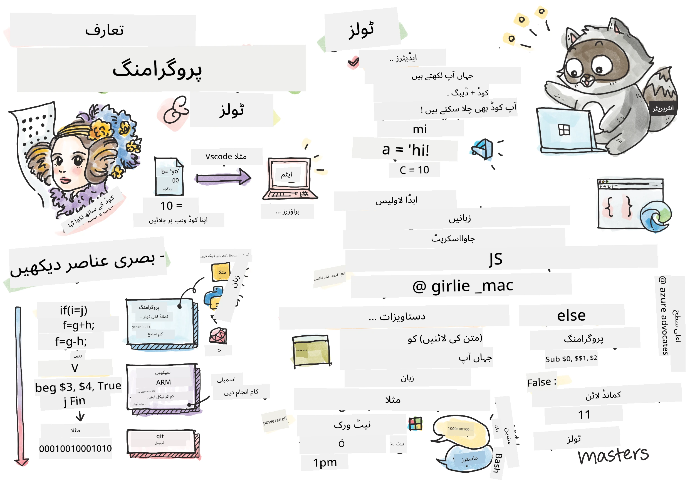
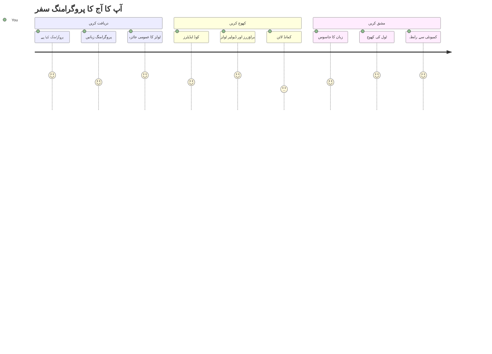
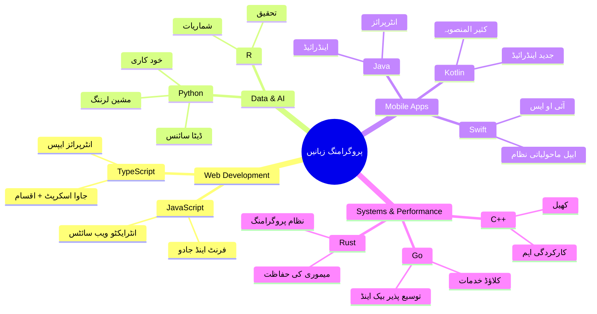
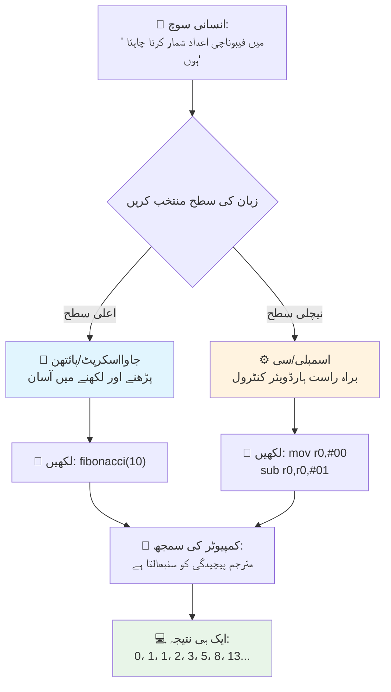
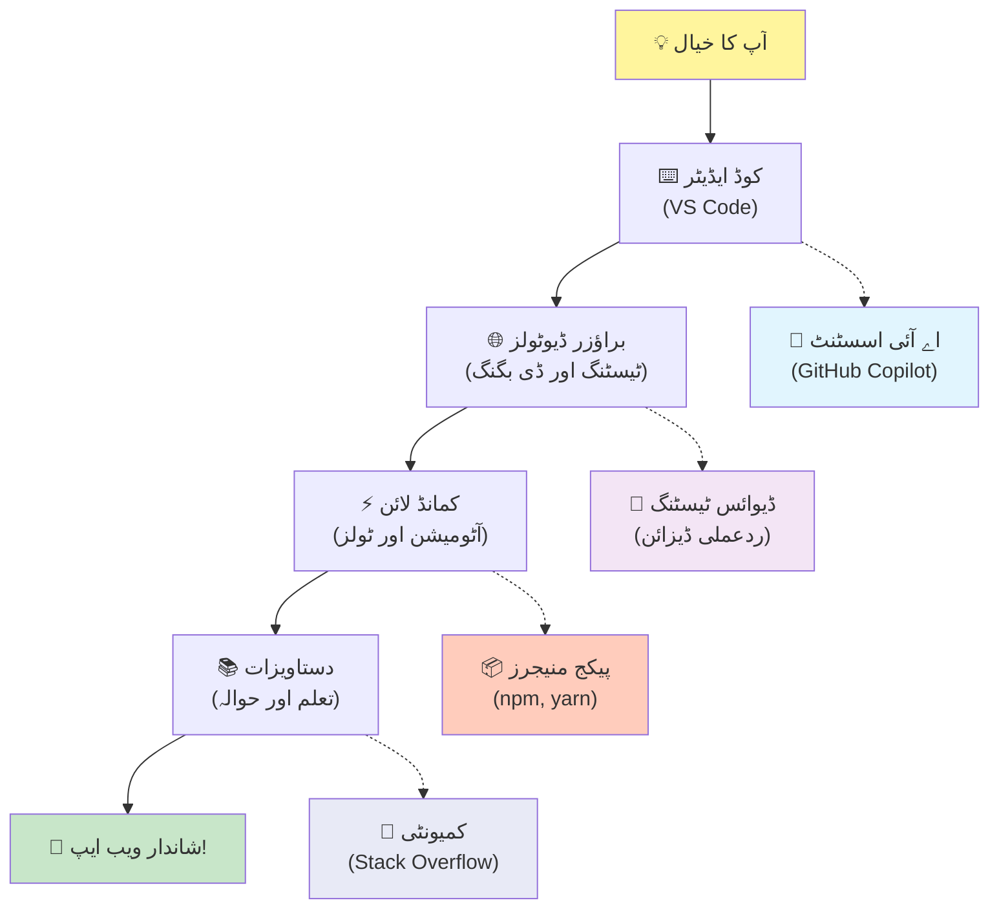
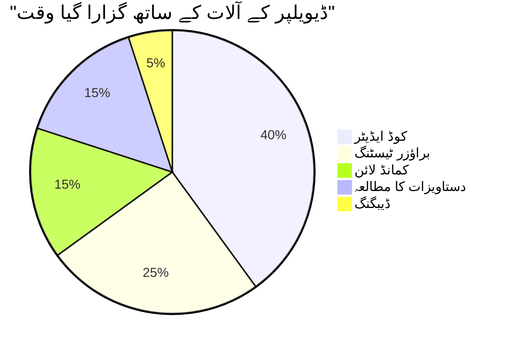
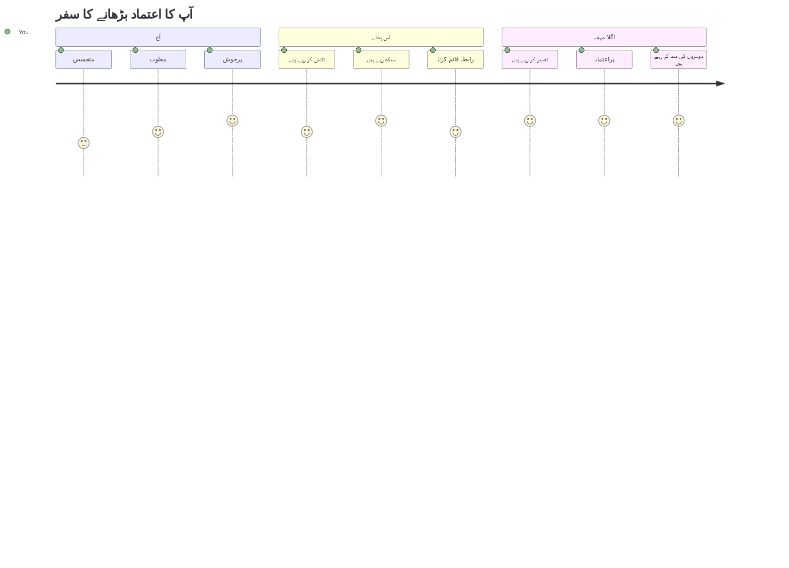

# پروگرامنگ زبانوں اور جدید ڈویلپر ٹولز کا تعارف

ہیلو، آئندہ کے ڈویلپر! 👋 کیا میں آپ کو کچھ بتا سکتا ہوں جو ہر دن مجھے سن سن کر دلچسپ کر دیتا ہے؟ آپ یہ جاننے والے ہیں کہ پروگرامنگ صرف کمپیوٹرز کے بارے میں نہیں ہے – یہ آپ کے جانوروں کی طرح خیالات کو حقیقت میں لانے کے لیے حقیقی سپر پاورز حاصل کرنے کے بارے میں ہے!

آپ جانتے ہیں وہ لمحہ جب آپ اپنے پسندیدہ ایپ کا استعمال کر رہے ہوتے ہیں اور ہر چیز بلکل صحیح طریقے سے جمی ہوتی ہے؟ جب آپ کسی بٹن کو ٹیپ کرتے ہیں اور کچھ جادوی طور پر ہوتا ہے جو آپ کو کہنے دیتا ہے "واہ، انہوں نے یہ کیسے کیا؟" تو ایسے ہی کسی نے – شاید اپنی پسندیدہ کافی شاپ میں رات 2 بجے اپنی تیسری ایسپریسو کے ساتھ بیٹھا ہوا – وہ کوڈ لکھا جو اس جادو کو تخلیق کیا۔ اور یہ بات آپ کو حیران کر دے گی: اس لیکچر کے آخر تک، آپ نہ صرف سمجھ جائیں گے کہ انہوں نے یہ کیسے کیا، بلکہ آپ خود بھی اسے کرنے کے لیے بےتاب ہوں گے!

دیکھیں، میں بالکل سمجھتا ہوں اگر پروگرامنگ ابھی آپ کو خوفزدہ لگتی ہے۔ جب میں نے شروع کیا تھا تو میں نے حقیقتاً یہ سوچا کہ آپ کو کوئی ریاضی کا جینئس ہونا چاہیے یا آپ کو پانچ سال کی عمر سے کوڈنگ کرنی چاہیے۔ لیکن یہ کیا ہے جو میرے نظریے کو مکمل بدل دیا: پروگرامنگ بالکل ویسے ہی ہے جیسے نئی زبان میں بات چیت کرنا سیکھنا۔ آپ "ہیلو" اور "شکریہ" سے شروع کرتے ہیں، پھر کافی کا آرڈر دیتے ہیں، اور پھر اچانک آپ گہری فلسفیانہ گفتگو کرتے ہیں! فرق صرف یہ ہے کہ آپ کمپیوٹرز کے ساتھ بات چیت کر رہے ہوتے ہیں، اور سچ کہوں؟ وہ سب سے زیادہ صبر کرنے والے بات چیت کرنے والے پارٹنر ہیں جو آپ کبھی بھی دیکھیں گے – وہ آپ کی غلطیوں کا کبھی فیصلہ نہیں کرتے اور ہمیشہ دوبارہ کوشش کرنے کے لیے پرجوش رہتے ہیں!

آج، ہم ان زبردست ٹولز کو دریافت کریں گے جو جدید ویب ڈویلپمنٹ کو ممکن ہی نہیں بلکہ واقعی نشہ آور بناتے ہیں۔ میں بات کر رہا ہوں بالکل وہی ایڈیٹرز، براؤزرز، اور ورک فلو کے بارے میں جو نیٹ فلکس، اسپاٹائفائی، اور آپ کے پسندیدہ انڈی ایپ اسٹوڈیو کے ڈویلپر روزانہ استعمال کرتے ہیں۔ اور یہاں وہ حصہ ہے جو آپ کو خوشی میں جھومنے پر مجبور کر دے گا: ان میں سے زیادہ تر پروفیشنل معیار کے، صنعت کے اسٹینڈرڈ ٹولز مکمل طور پر مفت ہیں!


> اسکیچ نوٹ از [ٹومومی امورا](https://twitter.com/girlie_mac)


```mermaid
journey
    title آپ کا آج کا پروگرامنگ سفر
    section دریافت کریں
      پروگرامنگ کیا ہے: 5: You
      پروگرامنگ زبانیں: 4: You
      ٹولز کا عمومی جائزہ: 5: You
    section کھوج کریں
      کوڈ ایڈیٹرز: 4: You
      براؤزرز اور ڈیولپر ٹولز: 5: You
      کمانڈ لائن: 3: You
    section مشق کریں
      زبان کا جاسوس: 4: You
      ٹول کی کھوج: 5: You
      کمیونٹی سے رابطہ: 5: You
```
## آئیں دیکھیں آپ پہلے سے کیا جانتے ہیں!

مذاق شروع کرنے سے پہلے، مجھے یہ جاننے کی تجسس ہے – آپ پہلے سے اس پروگرامنگ کی دنیا کے بارے میں کیا جانتے ہیں؟ اور سنیں، اگر آپ ان سوالات کو دیکھ کر سوچ رہے ہیں "مجھے ان میں سے کچھ بھی بالکل معلوم نہیں"، تو یہ نہ صرف ٹھیک ہے، بلکہ بہترین ہے! اس کا مطلب ہے کہ آپ بالکل صحیح جگہ پر ہیں۔ اس کو کسی ورزش سے پہلے کشش کی طرح سمجھیں – ہم بس اپنے دماغی عضلات کو گرم کر رہے ہیں!

[سبق سے پہلے کا کوئز لیں](https://ff-quizzes.netlify.app/web/)


## وہ مہم جس پر ہم ساتھ روانہ ہو رہے ہیں

ٹھیک ہے، میں واقعی اس بارے میں بہت خوش ہوں جو ہم آج دریافت کرنے جا رہے ہیں! سنجیدگی سے، کاش میں آپ کا چہرہ دیکھ سکتا جب کچھ تصورات آپ کو اچانک سمجھ آتے ہیں۔ یہاں وہ شاندار سفر ہے جو ہم ساتھ کر رہے ہیں:

- **پروگرامنگ درحقیقت کیا ہے (اور یہ سب سے زبردست چیز کیوں ہے!)** – ہم یہ جانیں گے کہ کوڈ بالکل وہ پوشیدہ جادو ہے جو آپ کے آس پاس ہر چیز کو چلاتا ہے، اس الارم سے جو کسی طرح جانتا ہے کہ آج پیر ہے، اس الگوردمی تک جو آپ کی نیٹ فلکس کی سفارشات کو بلکل درست کرتا ہے۔
- **پروگرامنگ زبانیں اور ان کی حیرت انگیز شخصیات** – تصور کریں کہ آپ ایک پارٹی میں جا رہے ہیں جہاں ہر شخص کے پاس مکمل طور پر مختلف سپر پاورز اور مسائل حل کرنے کے طریقے ہیں۔ یہی پروگرامنگ زبانوں کی دنیا ہے، اور آپ کو انہیں مل کر بہت مزہ آئے گا!
- **وہ بنیادی بلاکس جو ڈیجیٹل جادو کو ممکن بناتے ہیں** – ان کو انتہائی تخلیقی LEGO سیٹ سمجھیں۔ جب آپ سمجھ جائیں گے یہ ٹکڑے کس طرح جڑتے ہیں، تو آپ ایسا کچھ بھی بنا سکیں گے جو آپ کی تخیل دیکھتی ہے۔
- **پروفیشنل ٹولز جو آپ کو بالکل محسوس کرائیں گے کہ آپ کو جادوگر کی چھڑی مل گئی ہے** – میں ڈرامائی نہیں ہوں – یہ ٹولز واقعی آپ کو سپر پاورز کا احساس دلائیں گے، اور بہترین بات؟ یہ وہی ٹولز ہیں جو ماہر استعمال کرتے ہیں!

> 💡 **یہ بات یاد رکھیں**: آج سب کچھ یاد کرنے کی کوشش نہ کریں! ابھی، میں چاہتا ہوں کہ آپ ممکنات کے بارے میں جوش کا احساس کریں۔ تفصیلات قدرتی طور پر یاد رہیں گی جب ہم مل کر مشق کریں گے – یہی حقیقی سیکھنے کا طریقہ ہے!

> آپ یہ سبق [Microsoft Learn](https://learn.microsoft.com/en-us/learn/modules/web-development-101/introduction-programming/?WT.mc_id=academic-77807-sagibbon) پر بھی لے سکتے ہیں!

## تو پروگرامنگ کیا *ہے*؟

چلیں، سب سے بڑا سوال حل کریں: پروگرامنگ کیا ہے؟

میں آپ کو ایک کہانی دیتا ہوں جس نے میرے سوچنے کے انداز کو مکمل بدل دیا۔ پچھلے ہفتے، میں اپنی ماں کو ہمارا نیا اسمارٹ ٹی وی ریموٹ استعمال کرنا سکھانے کی کوشش کر رہا تھا۔ میں نے خود کو کہتے سنا "سرخ بٹن دبائیں، لیکن وہ بڑا سرخ نہیں، بایاں طرف چھوٹا سرخ بٹن... نہیں، آپ کا دوسرا بایاں... ٹھیک ہے، اب اسے دو سیکنڈ کے لیے تھامیں، ایک نہیں، تین نہیں..." کیا یہ آپ کو معلوم لگتا ہے؟ 😅

یہی پروگرامنگ ہے! یہ جادو ہے جس میں آپ کسی بہت طاقتور چیز کو انتہائی تفصیلی، قدم بہ قدم ہدایات دیتے ہیں جو کہ بالکل واضح ہوں۔ فرق صرف یہ ہے کہ آپ اپنی ماں کو نہیں سمجھا رہے (جو پوچھ سکتی ہے "کون سا سرخ بٹن؟!"), آپ کمپیوٹر کو سمجھا رہے ہیں (جو بالکل ویسا ہی کرتا ہے جیسا آپ کہتے ہیں، چاہے آپ نے جو کہا وہ بالکل آپ کا مطلب نہ ہو)۔

یہ بات جب میں نے پہلی بار سیکھی تو مجھے حیران کر گئی: کمپیوٹرز دراصل بنیادی طور پر بہت سادہ ہوتے ہیں۔ وہ صرف دو چیزیں سمجھتے ہیں – 1 اور 0، جو اصل میں "ہاں" اور "نہیں" یا "آن" اور "آف" ہوتے ہیں۔ صرف اتنا! لیکن یہیں جادو شروع ہوتا ہے – ہمیں 1 اور 0 میں بولنا نہیں پڑتا جیسا ہم دیے تمغے میں ہوتے ہیں۔ یہاں **پروگرامنگ زبانیں** مدد کرتی ہیں۔ وہ ایسی ہیں جیسے دنیا کے بہترین مترجم جو آپ کے بالکل عام انسانی خیالات کو کمپیوٹر زبان میں تبدیل کر دیتے ہیں۔

اور یہ بات جو ہر صبح مجھے واقعی حیران کن لگتی ہے: آپ کی زندگی کی ہر ڈیجیٹل چیز کی شروعات کسی ایسے شخص نے کی، شاید پاجامے میں بیٹھا اور کافی پی رہا ہو اور کوڈ ٹائپ کر رہا ہو۔ وہ انسٹاگرام فلٹر جو آپ کو بے عیب بناتا ہے؟ کسی نے وہ کوڈ کیا۔ جو سفارش آپ کو آپ کے نئے پسندیدہ گانے تک لے گئی؟ کسی ڈویلپر نے وہ الگوردم بنایا۔ وہ ایپ جو آپ کو دوستوں کے ساتھ کھانے کا بل تقسیم کرنے میں مدد دیتی ہے؟ ہاں، کسی نے سوچا "یہ کتنا پریشان کن ہے، میں اسے ٹھیک کر سکتا ہوں" اور پھر… کیا کیا!

جب آپ پروگرامنگ سیکھتے ہیں، تو آپ صرف نئی مہارت حاصل نہیں کر رہے – آپ اس زبردست کمیونٹی کا حصہ بن رہے ہیں جو حل تلاش کرنے والوں کی ہے جو دن رات سوچتے ہیں، "کیا ہوتا اگر میں ایسی چیز بنا سکتا جو کسی کا دن تھوڑا بہتر بنا دے؟" سچ پوچھیں تو، اس سے زبردست کیا ہو سکتا ہے؟

✅ **دلچسپ حقائق کی تلاش**: جب آپ کے پاس وقت ہو تو یہ دلچسپ بات دیکھیں – آپ کے خیال میں دنیا کا پہلا کمپیوٹر پروگرامر کون تھا؟ میں آپ کو اشارہ دیتا ہوں: شاید وہ وہ نہیں جس کی آپ توقع کر رہے ہوں! اس شخص کی کہانی بالکل دلچسپ ہے اور دکھاتی ہے کہ پروگرامنگ ہمیشہ تخلیقی مسائل کے حل اور دیے گئے دائرے سے باہر سوچنے کے بارے میں تھی۔

### 🧠 **چیک ان کا وقت: آپ کیسا محسوس کر رہے ہیں؟**

**ذرا غور کریں:**
- کیا "کمپیوٹرز کو ہدایات دینا" اب آپ کے لیے سمجھ میں آتا ہے؟
- کیا آپ روزمرہ کا کوئی کام سوچ سکتے ہیں جسے آپ پروگرامنگ سے خودکار کرنا چاہیں گے؟
- اس پورے پروگرامنگ کے بارے میں آپ کے ذہن میں کیا سوالات اٹھ رہے ہیں؟

> **یاد رکھیں**: اگر کچھ تصورات اب مشکل لگ رہے ہیں تو بالکل نارمل ہے۔ پروگرامنگ سیکھنا ایک نئی زبان سیکھنے کی طرح ہے – آپ کے دماغ کو نیورل پاتھ بنانے کے لیے وقت لگتا ہے۔ آپ بہترین کر رہے ہیں!

## پروگرامنگ زبانیں جادو کی مختلف ذائقوں کی طرح ہیں

ٹھیک ہے، یہ سننے میں عجیب لگ سکتا ہے، لیکن میرے ساتھ رہیں – پروگرامنگ زبانیں موسیقی کی مختلف اقسام کی بہت طرح کی ہوتی ہیں۔ سوچیں: آپ کے پاس جاز ہے جو ہموار اور فوری ہے، راک جو طاقتور اور سیدھا ہے، کلاسیکل جو نفیس اور منظم ہے، اور ہپ ہاپ جو تخلیقی اور جذباتی ہے۔ ہر انداز کا اپنا ماحول ہوتا ہے، اپنے پرجوش مداحوں کی جماعت ہوتی ہے، اور ہر ایک مختلف مزاجوں اور مواقع کے لیے بالکل مناسب ہوتا ہے۔

پروگرامنگ زبانیں بھی بالکل ویسے ہی کام کرتی ہیں! آپ وہی زبان استعمال نہیں کریں گے جو موبائل گیم بنانے کے لیے استعمال کریں وہی زبان موسمیاتی ڈیٹا کے بہت بڑے ذخیرے کے لیے بھی ہو، بالکل ویسے جیسے آپ یوگا کلاس میں ڈیتھ میٹل نہیں بجائیں گے (خیر، زیادہ تر یوگا کلاسوں میں نہیں! 😄)۔

لیکن ہر بار جب میں اس کے بارے میں سوچتا ہوں تو مجھے حیرت ہوتی ہے: یہ زبانیں دنیا کے سب سے صبر کرنے والے، شاندار مترجم کی طرح ہیں جو آپ کے ساتھ بیٹھی ہوتی ہیں۔ آپ اپنے خیالات اس طرح ظاہر کر سکتے ہیں جو آپ کے انسانی دماغ کے لیے نیچرل ہو، اور وہ سب پیچیدہ کام کرتے ہیں کہ اسے 1 اور 0 میں تبدیل کر دیں جو کمپیوٹر سمجھتے ہیں۔ یہ ایسا ہے جیسے آپ کے پاس ایک ایسا دوست ہو جو انسانی تخلیقیت اور کمپیوٹر منطق دونوں پر عبور رکھتا ہو – اور وہ کبھی تھکتا نہیں، کبھی کافی کے بریک نہیں لیتا، اور کبھی آپ کو ایک ہی سوال دو بار پوچھنے پر نہیں طعنہ دیتا!

### مشہور پروگرامنگ زبانیں اور ان کے استعمال


```mermaid
mindmap
  root((پروگرامنگ زبانیں))
    Web Development
      JavaScript
        فرنٹ اینڈ جادو
        انٹرایکٹو ویب سائٹس
      TypeScript
        جاوا اسکرپٹ + اقسام
        انٹرپرائز ایپس
    Data & AI
      Python
        ڈیٹا سائنس
        مشین لرننگ
        خود کاری
      R
        شماریات
        تحقیق
    Mobile Apps
      Java
        اینڈرائیڈ
        انٹرپرائز
      Swift
        آئی او ایس
        ایپل ماحولیاتی نظام
      Kotlin
        جدید اینڈرائیڈ
        کثیر المنصوبہ
    Systems & Performance
      C++
        کھیل
        کارکردگی اہم
      Rust
        میموری کی حفاظت
        نظام پروگرامنگ
      Go
        کلاؤڈ خدمات
        توسیع پذیر بیک اینڈ
```
| زبان  | بہترین استعمال کے لیے | کیوں مشہور ہے |
|----------|-------------|------------------|
| **JavaScript** | ویب ڈویلپمنٹ، صارف انٹرفیس | براؤزرز میں چلتی ہے اور تعاملی ویب سائٹس کو طاقت دیتی ہے |
| **Python** | ڈیٹا سائنس، خودکاری، AI | آسانی سے پڑھنے اور سیکھنے والی، طاقتور لائبریریز |
| **Java** | انٹرپرائز ایپلیکیشنز، اینڈرائیڈ ایپس | پلیٹ فارم آزاد، بڑے نظاموں کے لیے مضبوط |
| **C#** | ونڈوز ایپلیکیشنز، گیم ڈویلپمنٹ | مائیکروسافٹ کے ذریعہ مضبوط سپورٹ |
| **Go** | کلاؤڈ سروسز، بیک اینڈ سسٹمز | تیز، سادہ، جدید کمپیوٹنگ کے لیے بنایا گیا |

### ہائی لیول بمقابلہ لو لیول زبانیں

ٹھیک ہے، یہ وہ تصور تھا جس نے پہلی بار جب میں نے سیکھنا شروع کیا تو میرا دماغ گڑبڑ کر دیا، تو میں آپ سے وہ مثال شیئر کرنے جا رہا ہوں جس نے آخرکار مجھے سمجھایا – اور مجھے امید ہے یہ آپ کی بھی مدد کرے گا!

تصور کریں کہ آپ ایسی جگہ جا رہے ہیں جہاں زبان نہیں آتی اور آپ کو شدید ضرورت ہے قریب ترین غسل خانے کو تلاش کرنے کی (ہم سب یہ حالات دیکھ چکے ہیں، ہے نا؟ 😅):

- **لو لیول پروگرامنگ** ایسے ہے جیسے آپ نے مقامی بولی اتنی اچھی سیکھ لی ہے کہ آپ اس پھل بیچنے والی دادی کے ساتھ چٹکلے، ثقافتی حوالے، اور مقامی زبان میں بات کر سکتے ہیں جو صرف وہ لوگ سمجھتے ہیں جو وہاں شوروم میں بڑے ہوئے ہوں۔ یہ بہت متاثر کن اور انتہائی مؤثر ہے... اگر آپ واقعی ماہر ہوں! لیکن جب آپ صرف غسل خانہ تلاش کر رہے ہوں تو بہت مشکل۔
- **ہائی لیول پروگرامنگ** ایسے ہے جیسے آپ کا وہ زبردست مقامی دوست جو آپ کو بالکل سمجھتا ہے۔ آپ انگریزی میں کہہ سکتے ہیں "مجھے واقعی باتھ روم ملنا ہے"، اور وہ ساری ثقافتی ترجمہ کر کے آپ کو ایسی ہدایات دیتا ہے جو آپ کے غیر مقامی دماغ کے لئے بلکل آسان ہوں۔

پروگرامنگ کی زبانوں میں:
- **لو لیول زبانیں** (جیسے اسمبلی یا C) آپ کو کمپیوٹر کے ہارڈویئر سے انتہائی تفصیلی بات چیت کرنے دیتی ہیں، لیکن آپ کو مشین کی طرح سوچنا پڑتا ہے، جو... چلیے کہہ لیتے ہیں یہ دماغ کے لیے بڑا چیلنج ہے!
- **ہائی لیول زبانیں** (جیسے JavaScript, Python, یا C#) آپ کو انسان کی طرح سوچنے دیتی ہیں جب کہ وہ پس منظر میں مشین کی زبان کو سنبھالتی ہیں۔ علاوہ ازیں، ان کے پاس خوش آمدید کہنی والی کمیونٹیز ہوتی ہیں جو آپ کے لیے مدد کرنے کے لیے ہمیشہ موجود ہوتی ہیں کیونکہ وہ جانتی ہیں کہ نئی ہونے کا کیا مطلب ہے!

تو میں آپ کو کس سے شروع کرنے کی تجویز دوں گا؟ 😉 ہائی لیول زبانیں ایسی ہیں جیسے آپ کے پاس تربیتی پہیے ہوں جو آپ کبھی نہیں اتارنا چاہیں گے کیونکہ وہ پورے تجربے کو بہت زیادہ خوشگوار بناتے ہیں!


```mermaid
flowchart TB
    A["👤 انسانی سوچ:<br/>'میں فیبوناچی اعداد شمار کرنا چاہتا ہوں'"] --> B{زبان کی سطح منتخب کریں}
    
    B -->|اعلی سطح| C["🌟 جاوااسکرپٹ/پائتھن<br/>پڑھنے اور لکھنے میں آسان"]
    B -->|نیچلی سطح| D["⚙️ اسمبلی/سی<br/>براہ راست ہارڈویئر کنٹرول"]
    
    C --> E["📝 لکھیں: fibonacci(10)"]
    D --> F["📝 لکھیں: mov r0,#00<br/>sub r0,r0,#01"]
    
    E --> G["🤖 کمپیوٹر کی سمجھ:<br/>مترجم پیچیدگی کو سنبھالتا ہے"]
    F --> G
    
    G --> H["💻 ایک ہی نتیجہ:<br/>0، 1، 1، 2، 3، 5، 8، 13..."]
    
    style C fill:#e1f5fe
    style D fill:#fff3e0
    style H fill:#e8f5e8
```
### میں آپ کو دکھاتا ہوں کیوں ہائی لیول زبانیں زیادہ خوشگوار ہوتی ہیں

ٹھیک ہے، میں آپ کو کچھ دکھانے والا ہوں جو بالکل وضاحت کرتا ہے کہ میں ہائی لیول زبانوں سے کیوں محبت کرتا ہوں، لیکن پہلے – مجھے آپ سے وعدہ چاہیے۔ جب آپ پہلا کوڈ مثال دیکھیں، گھبرائیں نہیں! یہ دباؤ ڈالنے والا لگنا چاہیے۔ یہی وہ بات ہے جو میں بتانا چاہتا ہوں!

ہم ایک ہی کام دو بالکل مختلف انداز میں لکھے ہوئے دیکھنے جا رہے ہیں۔ دونوں وہ فبوناکی تسلسل بناتے ہیں – یہ ایک خوبصورت ریاضیاتی پیٹرن ہے جہاں ہر نمبر اس سے پہلے کے دو نمبروں کا مجموعہ ہوتا ہے: 0, 1, 1, 2, 3, 5, 8, 13... (دلچسپ بات: آپ کو یہ پیٹرن ہر جگہ ملے گا – سورج مکھی کے بیجوں کے سرپل، پنجہ دار درختوں کے نمونے، حتیٰ کہ کہکشاؤں کے بننے کے انداز میں!)

فرق دیکھنے کے لیے تیار؟ چلیے چلتے ہیں!

**ہائی لیول زبان (JavaScript) – انسان دوست:**

```javascript
// مرحلہ 1: بنیادی فبونیکی ترتیب
const fibonacciCount = 10;
let current = 0;
let next = 1;

console.log('Fibonacci sequence:');
```

**یہ کوڈ کیا کرتا ہے:**
- **ایک مستقل متغیر اعلان کریں** کہ ہم کتنے Fibonacci نمبر بنانا چاہتے ہیں
- **دو متغیرات کو شروع کریں** جو موجودہ اور اگلے نمبروں کو ٹریک کریں
- **آغاز کی قیمتیں سیٹ کریں** (0 اور 1) جو Fibonacci کے پیٹرن کو وضع کرتے ہیں
- **ایک ہیڈر پیغام دکھائیں** جو ہماری آؤٹ پٹ کی نشاندہی کرتا ہے

```javascript
// مرحلہ 2: لوپ کے ساتھ تسلسل پیدا کریں
for (let i = 0; i < fibonacciCount; i++) {
  console.log(`Position ${i + 1}: ${current}`);
  
  // سلسلے میں اگلا نمبر حساب کریں
  const sum = current + next;
  current = next;
  next = sum;
}
```

**یہاں کیا ہوتا ہے اس کی وضاحت:**
- **ایک `for` لوپ کے ذریعے** ہماری فہرست کے ہر مقام پر چلیں
- **ہر نمبر کو اس کے مقام کے ساتھ دکھائیں** ٹیمپلیٹ لٹریل فارمیٹنگ کے ذریعے
- **اگلا Fibonacci نمبر نکالیں** موجودہ اور اگلی قیمتوں کو جمع کر کے
- **ہماری ٹریکنگ ویریبلز کو اپ ڈیٹ کریں** تاکہ اگلی تکرار پر جا سکیں

```javascript
// مرحلہ 3: جدید فنکشنل نقطہ نظر
const generateFibonacci = (count) => {
  const sequence = [0, 1];
  
  for (let i = 2; i < count; i++) {
    sequence[i] = sequence[i - 1] + sequence[i - 2];
  }
  
  return sequence;
};

// استعمال کی مثال
const fibSequence = generateFibonacci(10);
console.log(fibSequence);
```

**مندرجہ بالا میں، ہم نے:**
- **جدید ایرو فنکشن نحو استعمال کرتے ہوئے** ایک دوبارہ استعمال کے قابل فنکشن بنایا
- **ایک صف (array) بنائی** تاکہ مکمل تسلسل کو ذخیرہ کیا جا سکے بنسبت ایک ایک نمبر ظاہر کرنے کے
- **پچھلے نمبروں سے ہر نئے نمبر کے حساب کے لیے** صف کی انڈیکسنگ استعمال کی
- **مکمل تسلسل واپس کیا** تاکہ پروگرام کے دوسرے حصوں میں لچکدار استعمال ہو سکے

**لو لیول زبان (ARM اسمبلی) – کمپیوٹر دوست:**

```assembly
 area ascen,code,readonly
 entry
 code32
 adr r0,thumb+1
 bx r0
 code16
thumb
 mov r0,#00
 sub r0,r0,#01
 mov r1,#01
 mov r4,#10
 ldr r2,=0x40000000
back add r0,r1
 str r0,[r2]
 add r2,#04
 mov r3,r0
 mov r0,r1
 mov r1,r3
 sub r4,#01
 cmp r4,#00
 bne back
 end
```

نوٹ کریں کہ JavaScript ورژن تقریباً انگریزی ہدایات کی طرح پڑھتا ہے، جبکہ اسمبلی ورژن خفیہ کمانڈز استعمال کرتا ہے جو کمپیوٹر کے پروسیسر کو براہ راست کنٹرول کرتے ہیں۔ دونوں بالکل ایک ہی کام انجام دیتے ہیں، لیکن ہائی لیول زبان انسانوں کے لیے سمجھنا، لکھنا اور برقرار رکھنا بہت آسان ہے۔

**اہم فرق جو آپ نوٹس کریں گے:**
- **قابل مطالعہ**: جاوا اسکرپٹ وضاحتی نام جیسے `fibonacciCount` استعمال کرتا ہے جب کہ اسمبلی میں مخفف لیبل جیسے `r0`, `r1` استعمال ہوتے ہیں  
- **تفسیرات**: ہائی لیول زبانیں وضاحتی کمنٹس کی حوصلہ افزائی کرتی ہیں جو کوڈ کو خود دستاویزی بناتی ہیں  
- **ساخت**: جاوا اسکرپٹ کی منطقی روانی اس طریقے سے مماثل ہے جس طرح انسان مسائل کو قدم بہ قدم سوچتے ہیں  
- **بحالی**: مختلف ضروریات کے لئے جاوا اسکرپٹ ورژن کو اپ ڈیٹ کرنا سیدھا اور واضح ہے  

✅ **فائبوناچی تسلسل کے بارے میں**: یہ بالکل حیرت انگیز نمبر کا پیٹرن (جہاں ہر نمبر اس سے پہلے دو نمبروں کے مجموعے کے برابر ہوتا ہے: 0، 1، 1، 2، 3، 5، 8...) قدرت میں بالکل *ہر جگہ* ظاہر ہوتا ہے! آپ اسے سورج مکھی کے پیچ، پائن کون کے نمونوں میں، ناٹیلس کے خول کے خم میں، اور یہاں تک کہ درختوں کی شاخوں کے بڑھنے کے انداز میں بھی دیکھیں گے۔ یہ واقعی ذہن کو حیران کرنے والا ہے کہ ریاضی اور کوڈ ہمیں قدرت کے ذریعے خوبصورتی پیدا کرنے والے نمونوں کو سمجھنے اور دوبارہ بنانے میں کس طرح مدد دیتے ہیں!  


## وہ بنیادی اجزاء جو جادو کو ممکن بناتے ہیں

چلیں، اب جب آپ نے دیکھا کہ پروگرامنگ زبانیں ایکشن میں کیسی دکھتی ہیں، تو آئیے ان بنیادی حصوں کو سمجھتے ہیں جو اصل میں ہر لکھے ہوئے پروگرام کی تشکیل کرتے ہیں۔ انہیں اپنے پسندیدہ نسخے کے اہم اجزاء سمجھیں – جب آپ کو یہ معلوم ہو جائے کہ ہر ایک کیا کرتا ہے، تو آپ تقریباً کسی بھی زبان میں کوڈ پڑھ اور لکھ سکیں گے!  

یہ پروگرامنگ کے گرامر سیکھنے جیسا ہے۔ یاد ہے جب آپ اسکول میں اسم، فعل اور جملے بنانے کا طریقہ سیکھتے تھے؟ پروگرامنگ کی اپنی گرامر ہوتی ہے، اور ایمانداری سے، یہ انگریزی گرامر سے کہیں زیادہ منطقی اور معاف کرنے والی ہے! 😄


### اسٹیٹمنٹس: قدم بہ قدم ہدایات

آئیے **اسٹیٹمنٹس** سے شروع کرتے ہیں – یہ آپ کے کمپیوٹر کے ساتھ بات چیت میں ہر ایک جملے کی مانند ہوتے ہیں۔ ہر اسٹیٹمنٹ کمپیوٹر کو ایک خاص کام کرنے کا کہتا ہے، جیسے ہدایات دینا: "یہاں بائیں مڑو"، "سرخ بتی پر رک جاؤ"، "اس جگہ گاڑی پارک کرو"۔  

جو بات مجھے اسٹیٹمنٹس میں پسند ہے وہ ان کی عمومیت اور قابل فہم ہونا ہے۔ یہ دیکھیں:  

```javascript
// بنیادی بیانات جو ایک واحد عمل انجام دیتے ہیں
const userName = "Alex";                    
console.log("Hello, world!");              
const sum = 5 + 3;                         
```
  
**یہ کوڈ کیا کرتا ہے:**  
- صارف کے نام کو ذخیرہ کرنے کے لیے ایک مستقل ویری ایبل کا اعلان کرنا  
- کنسول آؤٹ پٹ میں ایک خیرمقدمی پیغام دکھانا  
- ایک ریاضیاتی عمل کا نتیجہ حساب اور ذخیرہ کرنا  

```javascript
// بیانات جو ویب صفحہ جات کے ساتھ تعامل کرتے ہیں
document.title = "My Awesome Website";      
document.body.style.backgroundColor = "lightblue";
```
  
**قدم بہ قدم، یہ ہو رہا ہے:**  
- ویب پیج کے ٹائٹل کو تبدیل کرنا جو براؤزر کے ٹیب میں ظاہر ہوتا ہے  
- پورے صفحے کے پس منظر کا رنگ بدلنا  


### ویری ایبلز: آپ کے پروگرام کا میموری سسٹم

ٹھیک ہے، **ویری ایبلز** درحقیقت میرے سب سے پسندیدہ تصورات میں سے ہیں کیونکہ یہ آپ کی روزمرہ کی چیزوں سے بہت مشابہ ہوتے ہیں!  

اپنے فون کی کانٹیکٹ لسٹ کے بارے میں سوچیں۔ آپ ہر کسی کا نمبر یاد نہیں رکھتے – بلکہ آپ "ماں"، "سب سے اچھے دوست"، یا "پیزا کی دکان جو رات 2 بجے تک ڈلیور کرتی ہے" محفوظ کرتے ہیں اور فون نمبر کو یاد رکھتا ہے۔ ویری ایبلز بھی ویسے ہی کام کرتے ہیں! یہ لیبل لگائے ہوئے کنٹینرز کی طرح ہیں جہاں آپ کا پروگرام معلومات ذخیرہ کر سکتا ہے اور بعد میں سمجھ آنے والے نام کے ذریعے اسے حاصل کر سکتا ہے۔  

یہ واقعی زبردست ہے: ویری ایبلز پروگرام کے چلنے کے دوران بدل سکتے ہیں (اسی لیے انہیں "ویری ایبل" کہتے ہیں – آپ نے دیکھا؟)۔ جیسے آپ پیزا کی دکان کو اپ ڈیٹ کر سکتے ہیں جب آپ کہیں بہتر تلاش کر لیتے ہیں، ویری ایبلز بھی نئی معلومات سیکھنے یا حالات کی تبدیلی پر اپ ڈیٹ ہو سکتے ہیں!  

آئیے دیکھتے ہیں کہ یہ کتنے خوبصورتی سے آسان ہے:  

```javascript
// مرحلہ 1: بنیادی متغیرات بنانا
const siteName = "Weather Dashboard";        
let currentWeather = "sunny";               
let temperature = 75;                       
let isRaining = false;                      
```
  
**ان تصورات کو سمجھنا:**  
- `const` ویری ایبلز میں غیر تبدیل ہونے والی قیمتیں ذخیرہ کرنا (جیسے سائٹ کا نام)  
- ان قیمتوں کے لیے `let` کا استعمال کرنا جو پروگرام میں بدل سکتی ہیں  
- مختلف ڈیٹا ٹائپس تفویض کرنا: سٹرنگز (متن)، نمبر، اور بولینز (true/false)  
- وضاحتی نام منتخب کرنا جو ہر ویری ایبل کے مواد کی وضاحت کریں  

```javascript
// مرحلہ 2: متعلقہ ڈیٹا کو گروپ کرنے کے لیے اشیاء کے ساتھ کام کرنا
const weatherData = {                       
  location: "San Francisco",
  humidity: 65,
  windSpeed: 12
};
```
  
**اوپر، ہم نے کیا کیا:**  
- متعلقہ موسمی معلومات کو ایک جگہ جمع کرنے کے لیے ایک آبجیکٹ بنایا  
- ایک ہی ویری ایبل کے تحت متعدد ڈیٹا کو منظم کیا  
- ہر معلومات کے ٹکڑے کو واضح لیبل دینے کے لیے کلید-قدر جوڑی استعمال کی  

```javascript
// مرحلہ ۳: متغیرات کا استعمال اور تازہ کاری
console.log(`${siteName}: Today is ${currentWeather} and ${temperature}°F`);
console.log(`Wind speed: ${weatherData.windSpeed} mph`);

// قابل تبدیلی متغیرات کی تازہ کاری
currentWeather = "cloudy";                  
temperature = 68;                          
```
  
**چلو ہر حصہ کو سمجھتے ہیں:**  
- ٹیمپلیٹ لٹریلز کے ذریعے `${}` سنٹیکس کے ساتھ معلومات دکھانا  
- ڈاٹ نوٹیشن (`weatherData.windSpeed`) کے ذریعے آبجیکٹ کی خصوصیات تک رسائی  
- `let` سے اعلان کیے گئے ویری ایبلز کو بدلتے حالات کی عکاسی کے لیے اپ ڈیٹ کرنا  
- بامعنی پیغامات بنانے کے لیے کئی ویری ایبلز کو ملانا  

```javascript
// مرحلہ 4: صاف ستھرا کوڈ کے لیے جدید تقسیم کاری
const { location, humidity } = weatherData; 
console.log(`${location} humidity: ${humidity}%`);
```
  
**جو آپ کو جاننا چاہیے:**  
- ڈیسٹرکچرنگ اسائنمنٹ کے ذریعے آبجیکٹس سے مخصوص خصوصیات نکالنا  
- آبجیکٹ کی چابیوں کے ایک جیسے ناموں کے ساتھ خودکار طور پر نئے ویری ایبلز بنانا  
- بار بار ڈاٹ نوٹیشن استعمال کرنے سے بچ کر کوڈ سادہ بنانا  


### کنٹرول فلو: اپنے پروگرام کو سوچنا سکھانا

اب یہ حصہ واقعی دماغ ہلا دینے والا ہے! **کنٹرول فلو** بنیادی طور پر اپنے پروگرام کو ہوشیار فیصلے کرنا سکھانے کے برابر ہے، بالکل ویسے ہی جیسے آپ روزانہ بغیر سوچے سمجھے کرتے ہیں۔  

تصور کریں: آج صبح آپ نے شاید یہ سوچا ہوگا "اگر بارش ہو رہی ہے تو میں چھتری لے جاؤں گا۔ اگر سردی ہے تو جیکٹ پہنوں گا۔ اگر دیر ہو رہی ہے تو ناشتہ چھوڑ کر راستے میں کافی لے لوں گا۔" آپ کا دماغ یہ if-then منطق روزانہ درجنوں بار فطری طور پر استعمال کرتا ہے!  

یہی چیز پروگرامز کو ذہین اور زندہ محسوس کراتی ہے، نہ کہ محض ایک بورنگ، قابل پیش گوئی اسکرپٹ کی پیروی کرنے والا۔ وہ حقیقت میں ایک صورتحال کو دیکھ سکتے ہیں، اس کا جائزہ لے سکتے ہیں، اور مناسب ردعمل دے سکتے ہیں۔ یہ آپ کے پروگرام کو ایک ایسا دماغ دینے کے مترادف ہے جو حالات کے مطابق ڈھلتا اور فیصلے کرتا ہے!  

دیکھنا چاہتے ہیں یہ کمال کیسے کام کرتا ہے؟ میں آپ کو دکھاتا ہوں:  

```javascript
// مرحلہ 1: بنیادی مشروط منطق
const userAge = 17;

if (userAge >= 18) {
  console.log("You can vote!");
} else {
  const yearsToWait = 18 - userAge;
  console.log(`You'll be able to vote in ${yearsToWait} year(s).`);
}
```
  
**یہ کوڈ کیا کرتا ہے:**  
- چیک کرتا ہے کہ صارف کی عمر ووٹنگ کے معیار پر پوری اترتی ہے یا نہیں  
- حالت کے نتیجے کی بنیاد پر مختلف کوڈ بلاکس چلاتا ہے  
- اگر عمر 18 سے کم ہے تو ووٹنگ کی اہلیت تک کتنا وقت ہے حساب اور دکھاتا ہے  
- ہر منظرنامے کے لیے مخصوص، مددگار رائے فراہم کرتا ہے  

```javascript
// مرحلہ 2: منطقی آپریٹروں کے ساتھ متعدد شرائط
const userAge = 17;
const hasPermission = true;

if (userAge >= 18 && hasPermission) {
  console.log("Access granted: You can enter the venue.");
} else if (userAge >= 16) {
  console.log("You need parent permission to enter.");
} else {
  console.log("Sorry, you must be at least 16 years old.");
}
```
  
**یہاں کیا ہو رہا ہے اس کی وضاحت:**  
- متعدد شرائط کو `&&` (اور) آپریٹر کے ساتھ جوڑنا  
- کئی منظرناموں کے لیے `else if` کے ذریعے ہیرارکی بنانا  
- آخری `else` سٹیٹمنٹ کے ذریعے تمام ممکنہ کیسز کا ہینڈل کرنا  
- ہر مختلف حالت کے لیے واضح اور قابل عمل فیڈبیک دینا  

```javascript
// قدم 3: مختصر مشروط آپریٹر کے ساتھ ٹرنری
const votingStatus = userAge >= 18 ? "Can vote" : "Cannot vote yet";
console.log(`Status: ${votingStatus}`);
```
  
**جو آپ کو یاد رکھنا ہے:**  
- سادہ دو انتخابی شرائط کے لیے ٹرنیری آپریٹر (`? :`) کا استعمال  
- پہلے شرط لکھیں، پھر `?`، پھر سچ کا نتیجہ، پھر `:`، اور پھر جھوٹ کا نتیجہ  
- جب آپ کو شرائط کی بنیاد پر قیمتیں تفویض کرنی ہوں تو یہ پیٹرن اپلائی کریں  

```javascript
// مرحلہ 4: متعدد مخصوص معاملات کو سنبھالنا
const dayOfWeek = "Tuesday";

switch (dayOfWeek) {
  case "Monday":
  case "Tuesday":
  case "Wednesday":
  case "Thursday":
  case "Friday":
    console.log("It's a weekday - time to work!");
    break;
  case "Saturday":
  case "Sunday":
    console.log("It's the weekend - time to relax!");
    break;
  default:
    console.log("Invalid day of the week");
}
```
  
**یہ کوڈ درج ذیل کام انجام دیتا ہے:**  
- ویری ایبل کی قیمت کو متعدد مخصوص کیسز کے خلاف ملانا  
- ایک جیسے کیسز کو گروپ کرنا (کام کے دن بمقابلہ ویک اینڈ)  
- جب میچ ملے تو مناسب کوڈ بلاک چلانا  
- غیر متوقع قیمتوں سے نمٹنے کے لیے `default` کیس شامل کرنا  
- `break` اسٹیٹمنٹس استعمال کرنا تاکہ کوڈ اگلے کیس تک نہ پہنچے  

> 💡 **حقیقی دنیا کی مثال**: کنٹرول فلو کو اس طرح سوچیں جیسے دنیا کا سب سے صبر والا GPS آپ کو راستے بتا رہا ہو۔ وہ کہہ سکتا ہے "اگر مین اسٹریٹ پر ٹریفک ہے تو ہائی وے لو۔ اگر ہائی وے تعمیراتی کام کی وجہ سے بلاک ہے تو خوبصورت راستہ آزما۔" پروگرام بھی بالکل اسی قسم کی شرطی منطق استعمال کرتے ہیں تاکہ مختلف حالات پر ہوشیاری سے رد عمل دیں اور صارفین کو بہترین ممکنہ تجربہ فراہم کریں۔


### 🎯 **تصور کا جائزہ: بنیادی اجزاء کی مہارت**

**آئیے دیکھیں آپ بنیادی باتوں میں کیسے ہیں:**  
- کیا آپ وضاحت کر سکتے ہیں کہ ویری ایبل اور اسٹیٹمنٹ میں کیا فرق ہے؟  
- کوئی حقیقی دنیا کی مثال سوچیں جہاں آپ if-then فیصلہ استعمال کریں (جیسا کہ ہمارا ووٹنگ مثال)  
- پروگرامنگ لاجک میں آپ کو کون سی چیز سب سے زیادہ حیران کن لگی؟  

**اعتماد بڑھانے کے لیے جلدی سے:**  

```mermaid
flowchart LR
    A["📝 بیانات<br/>(ہدایات)"] --> B["📦 متغیرات<br/>(ذخیرہ)"] --> C["🔀 کنٹرول بہاؤ<br/>(فیصلے)"] --> D["🎉 کام کرنے والا پروگرام!"]
    
    style A fill:#ffeb3b
    style B fill:#4caf50
    style C fill:#2196f3
    style D fill:#ff4081
```  
✅ **اگلا کیا ہے:** ہم ان تصورات کو مزید گہرائی میں جا کر دریافت کرنے کے لیے بے حد پرجوش ہیں! ابھی کے لیے صرف یہ جذبہ محسوس کریں کہ آپ کے سامنے کتنے حیرت انگیز امکانات ہیں۔ مخصوص مہارتیں اور تکنیکیں قدرتی طور پر ہمارے ساتھ مشق کرتے ہوئے آپ میں جم جائیں گی – میں وعدہ کرتا ہوں یہ بہت زیادہ مزہ دار ہوگا جیسا کہ آپ شاید سوچ رہے ہوں!  


## اوزارِ تجارت

ٹھیک ہے، یہ وہ جگہ ہے جہاں میں واقعی اتنا پرجوش ہوتا ہوں کہ خود کو روک نہیں پاتا! 🚀 ہم ان شاندار آلات کے بارے میں بات کرنے والے ہیں جو آپ کو ایسا محسوس کرائیں گے جیسے آپ کو ابھی ابھی ڈیجیٹل اسپیس شپ کی چابیاں دے دی گئی ہوں۔  

کیا آپ نے کبھی غور کیا ہے کہ شیف کے پاس عین مطابق تیز دھار چھریاں ہوتی ہیں جو ان کے ہاتھوں کا توسیع محسوس ہوتی ہیں؟ یا موسیقار کے پاس وہ گٹار ہوتا ہے جو جیسے ہی اسے چھوتے ہیں گانے لگتا ہے؟ اچھا، ڈیولپرز کے پاس بھی ان جادوئی آلات کا اپنا ورژن ہے، اور آپ کا دماغ ہکا بکا رہ جائے گا کہ ان میں سے زیادہ تر بالکل مفت ہیں!  

میں اپنی کرسی پر چھلانگیں لگا رہا ہوں ان کے بارے میں آپ سے شیئر کرنے کے خیال سے کیونکہ انہوں نے ہمارے سافٹ ویئر بنانے کے طریقہ کو مکمل طور پر بدل کر رکھ دیا ہے۔ ہم بات کر رہے ہیں AI سے چلنے والے کوڈنگ اسسٹنٹس کی جو آپ کے کوڈ کو لکھنے میں مدد دیتے ہیں (میں مذاق نہیں کر رہا!), کلاؤڈ ماحول جہاں آپ کہیں سے بھی وائی فائی کے ذریعے پورے ایپس بنا سکتے ہیں، اور ڈیبگنگ ٹولز جو اتنے ماہر ہیں جیسے آپ کے پروگرامز کے لیے ایکس رے وژن ہو۔  

اور یہ وہ حصہ ہے جو ابھی بھی مجھے سردیوں میں کپکپاہٹ دیتا ہے: یہ "نئے سیکھنے والوں کے ٹولز" نہیں ہیں جنہیں آپ بعد میں چھوڑ دیں گے۔ یہ وہی پروفیشنل درجے کے ٹولز ہیں جنہیں گوگل، نیٹ فلکس، اور آپ کے پسندیدہ انڈی ایپ اسٹوڈیو کے ڈیولپرز ابھی اسی لمحے استعمال کر رہے ہیں۔ آپ انہیں استعمال کرتے ہوئے خود کو واقعی ماہر محسوس کریں گے!  


```mermaid
graph TD
    A["💡 آپ کا خیال"] --> B["⌨️ کوڈ ایڈیٹر<br/>(VS Code)"] 
    B --> C["🌐 براؤزر ڈیوٹولز<br/>(ٹیسٹنگ اور ڈی بگنگ)"]
    C --> D["⚡ کمانڈ لائن<br/>(آٹومیشن اور ٹولز)"]
    D --> E["📚 دستاویزات<br/>(تعلم اور حوالہ)"]
    E --> F["🚀 شاندار ویب ایپ!"]
    
    B -.-> G["🤖 اے آئی اسسٹنٹ<br/>(GitHub Copilot)"]
    C -.-> H["📱 ڈیوائس ٹیسٹنگ<br/>(ردعملی ڈیزائن)"]
    D -.-> I["📦 پیکج منیجرز<br/>(npm, yarn)"]
    E -.-> J["👥 کمیونٹی<br/>(Stack Overflow)"]
    
    style A fill:#fff59d
    style F fill:#c8e6c9
    style G fill:#e1f5fe
    style H fill:#f3e5f5
    style I fill:#ffccbc
    style J fill:#e8eaf6
```  
### کوڈ ایڈیٹرز اور IDEs: آپ کے نئے ڈیجیٹل بہترین دوست

آئیے کوڈ ایڈیٹرز کے بارے میں بات کرتے ہیں – یہ واقعی آپ کے نئے پسندیدہ جگہیں بننے والے ہیں جہاں آپ اپنے ڈیجیٹل تخلیقات بنانے اور بہتر کرنے میں زیادہ تر وقت گزاریں گے۔  

مگر جدید ایڈیٹرز کی خاص بات یہ ہے: یہ صرف فینسی ٹیکسٹ ایڈیٹر نہیں ہیں۔ یہ ایسے ہیں جیسے سب سے ذہین، مددگار کوڈنگ رہنما آپ کے ساتھ 24/7 بیٹھا ہو۔ یہ آپ کی ٹائپنگ کی غلطیاں آپ کو دکھائی دینے سے پہلے پکڑ لیتے ہیں، آپ کو بہتری کے ایسے مشورے دیتے ہیں جو آپ کو نابغہ ظاہر کرتے ہیں، ہر کوڈ کے ٹکڑے کو سمجھنے میں مدد کرتے ہیں، اور بعض ایڈیٹرز تو اس بات کا اندازہ بھی لگا لیتے ہیں کہ آپ کیا لکھنے والے ہیں اور آپ کے خیالات مکمل کرنے کی پیشکش کرتے ہیں!  

مجھے یاد ہے جب میں نے پہلی بار آٹو کمپلیشن دریافت کی تھی – میں واقعی محسوس کر رہا تھا جیسے مستقبل میں ہوں۔ آپ کچھ ٹائپ کرنا شروع کرتے ہیں، اور آپ کا ایڈیٹر کہتا ہے، "ارے، کیا آپ اس فنکشن کے بارے میں سوچ رہے تھے جو آپ کو بالکل چاہیے؟" یہ ایسا ہے جیسے آپ کا کوڈنگ دوست ایک ذہن پڑھنے والا ہو!  

**یہ ایڈیٹرز اتنے شاندار کیوں ہیں؟**  

جدید کوڈ ایڈیٹرز ایک متاثر کن فیچر سیٹ پیش کرتے ہیں جو آپ کی پیداواری صلاحیت کو بڑھانے کے لیے ڈیزائن کیا گیا ہے:  

| خصوصیت | یہ کیا کرتی ہے | کیوں مددگار ہے |  
|---------|----------------|---------------|  
| **سِنٹیکس ہائلائٹنگ** | کوڈ کے مختلف حصوں کو رنگین کرتی ہے | کوڈ پڑھنا اور غلطیاں تلاش کرنا آسان بناتی ہے |  
| **آٹو کمپلیشن** | جیسے جیسے آپ لکھتے ہیں کوڈ کی تجویز دیتی ہے | کوڈنگ کی رفتار بڑھاتی ہے اور ٹائپنگ کی غلطیاں کم کرتی ہے |  
| **ڈیبگنگ کے ٹولز** | غلطیاں تلاش اور درست کرنے میں مدد دیتی ہے | مسئلے حل کرنے میں گھنٹوں کی بچت کرتی ہے |  
| **ایکسٹینشنز** | مخصوص فیچرز شامل کرتی ہیں | آپ کے ایڈیٹر کو کسی بھی ٹیکنالوجی کے لیے حسبِ ضرورت بناتی ہیں |  
| **AI اسسٹنٹس** | کوڈ اور وضاحتیں تجویز کرتی ہیں | سیکھنے اور پیداواری صلاحیت کو تیز کرتی ہیں |  

> 🎥 **ویڈیو وسائل**: کیا آپ یہ ٹولز ایکشن میں دیکھنا چاہتے ہیں؟ اس [Tools of the Trade ویڈیو](https://youtube.com/watch?v=69WJeXGBdxg) کو دیکھیں جو ایک جامع جائزہ فراہم کرتا ہے۔  

#### ویب ڈویلپمنٹ کے لیے تجویز کردہ ایڈیٹرز  

**[Visual Studio Code](https://code.visualstudio.com/?WT.mc_id=academic-77807-sagibbon)** (مفت)  
- ویب ڈیولپرز میں سب سے زیادہ مقبول  
- بہترین ایکسٹینشن ایکوسسٹم  
- بلٹ ان ٹرمینل اور Git انٹیگریشن  
- **ضروری ایکسٹینشنز**:  
  - [GitHub Copilot](https://marketplace.visualstudio.com/items?itemName=GitHub.copilot) - AI پر مبنی کوڈ تجاویز  
  - [Live Share](https://marketplace.visualstudio.com/items?itemName=MS-vsliveshare.vsliveshare) - حقیقی وقت کا تعاون  
  - [Prettier](https://marketplace.visualstudio.com/items?itemName=esbenp.prettier-vscode) - خودکار کوڈ فارمیٹنگ  
  - [Code Spell Checker](https://marketplace.visualstudio.com/items?itemName=streetsidesoftware.code-spell-checker) - کوڈ میں ٹائپنگ کی غلطیاں پکڑنا  

**[JetBrains WebStorm](https://www.jetbrains.com/webstorm/)** (ادا شدہ، طلباء کے لیے مفت)  
- اعلی درجے کے ڈیبگنگ اور ٹیسٹنگ کے ٹولز  
- ذہین کوڈ کمپلیشن  
- بلٹ ان ورژن کنٹرول  

**کلاؤڈ بیسڈ IDEs** (مختلف قیمتیں)  
- [GitHub Codespaces](https://github.com/features/codespaces) - آپ کے براؤزر میں مکمل VS Code  
- [Replit](https://replit.com/) - سیکھنے اور کوڈ شئیر کرنے کے لیے بہترین  
- [StackBlitz](https://stackblitz.com/) - فوری، مکمل ویب ڈویلپمنٹ  

> 💡 **شروع کرنے کا مشورہ**: Visual Studio Code سے شروع کریں – یہ مفت ہے، صنعت میں وسیع پیمانے پر استعمال ہوتا ہے، اور اس کی ایک بڑی کمیونٹی ہے جو مددگار ٹیوٹوریلز اور ایکسٹینشنز بناتی ہے۔  


### ویب براؤزرز: آپ کی خفیہ ترقیاتی لیب

ٹھیک ہے، اپنے ذہن کو مکمل طور پر حیران ہونے کے لیے تیار ہو جائیں! آپ جانتے ہیں کہ آپ براؤزرز کو سوشل میڈیا اسکрол کرنے اور ویڈیوز دیکھنے کے لیے استعمال کرتے ہیں؟ حقیقت یہ ہے کہ یہ پورا وقت آپ سے چھپایا ہوا ایک شاندار خفیہ ڈیولپر لیب تھا، جو آپ کے دریافت کرنے کا منتظر تھا!  

ہر بار جب آپ کسی ویب پیج پر رائٹ کلک کرتے ہیں اور "Inspect Element" کا انتخاب کرتے ہیں، آپ ایک پوشیدہ دنیا کے ڈیولپر ٹولز کھول رہے ہوتے ہیں جو سچ میں کچھ مہنگے سافٹ ویئر سے زیادہ طاقتور ہیں جن کے لیے میں نے سینکڑوں ڈالر ادا کیے ہیں۔ یہ ایسے ہے جیسے آپ کے عام باورچی خانے میں ایک خفیہ پینل کے پیچھے ایک پیشہ ور شیف کی لیبارٹری چھپی ہوئی ہو!
جب کسی نے مجھے پہلی بار براؤزر کے DevTools دکھائے، میں تین گھنٹے صرف کلک کرتے ہوئے اس پر غور کرتا رہا اور کہتا رہا "رکو، یہ بھی کر سکتا ہے؟!" آپ واقعی کسی بھی ویب سائٹ کو حقیقی وقت میں ایڈٹ کر سکتے ہیں، بالکل دیکھ سکتے ہیں کہ سب کچھ کتنی تیزی سے لوڈ ہو رہا ہے، اپنے سائٹ کو مختلف ڈیوائسز پر کیسا لگتا ہے جانچ سکتے ہیں، اور یہاں تک کہ جاوا اسکرپٹ کو ایک ماہر کی طرح ڈی بگ بھی کر سکتے ہیں۔ یہ واقعی دماغ ہلا دینے والا ہے!

**براؤزر آپ کا پوشیدہ ہتھیار کیوں ہیں:**

جب آپ کوئی ویب سائٹ یا ویب ایپلیکیشن بناتے ہیں، تو آپ کو یہ دیکھنا ہوتا ہے کہ یہ حقیقی دنیا میں کیسا دکھتا ہے اور کیسے چلتا ہے۔ براؤزر صرف آپ کا کام دکھاتے ہی نہیں بلکہ کارکردگی، رسائی، اور ممکنہ مسائل کے بارے میں تفصیلی فیڈبیک بھی فراہم کرتے ہیں۔

#### براؤزر ڈیولپر ٹولز (DevTools)

جدید براؤزرز میں جامع ترقیاتی سوئٹس شامل ہیں:

| ٹول کیٹیگری | یہ کیا کرتا ہے | استعمال کی مثال |
|--------------|---------------|----------------|
| **المنٹ انسپکٹر** | حقیقی وقت میں HTML/CSS دیکھیں اور ایڈٹ کریں | سٹائلنگ میں تبدیلی کر کے فوری نتائج دیکھیں |
| **کنسول** | ایرر پیغامات دیکھیں اور جاوا اسکرپٹ ٹیسٹ کریں | مسائل کی ڈی بگنگ کریں اور کوڈ کے ساتھ تجربہ کریں |
| **نیٹ ورک مانیٹر** | وسائل کے لوڈ ہونے کا ریکارڈ رکھیں | کارکردگی اور لوڈنگ وقت کو بہتر بنائیں |
| **ایکسسیسبلٹی چیکر** | جامع ڈیزائن کے لیے ٹیسٹ کریں | یقینی بنائیں کہ آپ کی سائٹ تمام صارفین کے لیے کام کرتی ہے |
| **ڈیوائس سمیولیٹر** | مختلف سکرین سائزز پر پریویو کریں | متعدد ڈیوائسز کے بغیر ریسپانسیو ڈیزائن کو ٹیسٹ کریں |

#### ترقی کے لئے تجویز کردہ براؤزر

- **[کروم](https://developers.google.com/web/tools/chrome-devtools/)** - صنعت کا معیار DevTools کے ساتھ وسیع دستاویزات
- **[فائر فاکس](https://developer.mozilla.org/docs/Tools)** - بہترین CSS Grid اور ایکسیسبلٹی ٹولز
- **[ایج](https://docs.microsoft.com/microsoft-edge/devtools-guide-chromium/?WT.mc_id=academic-77807-sagibbon)** - کرومیم پر مبنی، مائیکروسافٹ کے ڈیولپر وسائل کے ساتھ

> ⚠️ **اہم ٹیسٹنگ ٹپ**: اپنی ویب سائٹس کو ہمیشہ مختلف براؤزرز میں ٹیسٹ کریں! جو کچھ کروم میں بالکل کام کرتا ہے، وہ سفاری یا فائر فاکس میں مختلف لگ سکتا ہے۔ ماہر ڈیولپرز تمام اہم براؤزرز میں تجربہ کرتے ہیں تاکہ مستقل صارف تجربات کو یقینی بنایا جا سکے۔

### کمانڈ لائن ٹولز: آپ کی ڈیولپر سپرپاورز کا دروازہ

چلیے، کمانڈ لائن کے بارے میں ایک بالکل ایماندار لمحہ لیتے ہیں، کیونکہ میں چاہتا ہوں کہ آپ یہ کہیں کسی ایسے شخص سے سنیں جو واقعی اسے سمجھتا ہے۔ جب میں نے پہلی بار اسے دیکھا – صرف یہ خوفناک سیاہ سکرین جس پر متن ٹمٹما رہا تھا – میں نے واقعی سوچا، "نہیں، بالکل نہیں! یہ کچھ 1980 کی دہائی کی ہیکر فلم جیسا لگتا ہے، اور میں یقینی طور پر اس کے لیے کافی سمجھدار نہیں!" 😅

لیکن وہ بات جو میں چاہتا تھا کہ کسی نے مجھے اس وقت بتائی ہوتی، اور جو میں آپ کو ابھی بتا رہا ہوں یہ ہے: کمانڈ لائن خوفناک نہیں ہے – یہ درحقیقت آپ کے کمپیوٹر کے ساتھ براہ راست بات چیت کرنے جیسا ہے۔ اسے ایسے سمجھیں جیسے کھانے کا آرڈر دینا ایک خوبصورت ایپ کے ذریعے، جس میں تصاویر اور مینیو ہوں (جو آسان اور خوشگوار ہے)، کے بجائے آپ اپنے پسندیدہ مقامی ریسٹورنٹ میں جا رہے ہوں جہاں شیف جانتا ہے کہ آپ کو کیا پسند ہے اور صرف "چمکتا دمکتا کوئی سپرائز بنا دیں" کہنے پر کچھ بہترین بنا دیتا ہے۔

کمانڈ لائن وہ جگہ ہے جہاں ڈیولپرز خود کو جادوگر محسوس کرتے ہیں۔ آپ کچھ دکھاوے والے الفاظ (ٹھیک ہے، وہ صرف کمانڈز ہیں، لیکن جادوئی لگتے ہیں!) ٹائپ کرتے ہیں، انٹر دباتے ہیں، اور بوم! آپ نے پورے پروجیکٹ کے ڈھانچے بنا لیے، دنیا بھر سے طاقتور ٹولز انسٹال کیے، یا اپنی ایپ کو انٹرنیٹ پر لاکھوں لوگوں کے لیے تعینات کر دیا۔ جب آپ پہلی بار اس طاقت کا ذائقہ چکھ لیتے ہیں تو یہ واقعی عادت بن جاتی ہے!

**کمانڈ لائن آپ کا پسندیدہ ٹول کیوں بنے گا:**

جبکہ گرافیکل انٹرفیس بہت سے کاموں کے لیے بہترین ہیں، کمانڈ لائن خودکار کاری، درستگی، اور رفتار میں نمایاں ہے۔ بہت سے ترقیاتی ٹولز بنیادی طور پر کمانڈ لائن انٹرفیسز کے ذریعے کام کرتے ہیں، اور ان کو مؤثر طریقے سے سیکھنا آپ کی پیداواری صلاحیت کو نمایاں طور پر بڑھا سکتا ہے۔

```bash
# مرحلہ 1: پروجیکٹ کی ڈائریکٹری بنائیں اور اس میں جائیں
mkdir my-awesome-website
cd my-awesome-website
```

**یہ کوڈ کیا کرتا ہے:**
- **ایک نیا ڈائریکٹری بنائیں جس کا نام "my-awesome-website" ہو آپ کے پروجیکٹ کے لیے**
- **نئے بنائے گئے ڈائریکٹری میں جائیں اور کام شروع کریں**

```bash
# مرحلہ 2: پراجیکٹ کو package.json کے ساتھ شروع کریں
npm init -y

# جدید ترقیاتی ٹولز انسٹال کریں
npm install --save-dev vite prettier eslint
npm install --save-dev @eslint/js
```

**قدم بہ قدم، یہ ہو رہا ہے:**
- **نئے Node.js پروجیکٹ کو ڈیفالٹ سیٹنگز کے ساتھ `npm init -y` چلائیں**
- **Vite کو تیز ترقی اور پروڈکشن بیلڈ کے لیے جدید بلڈ ٹول کے طور پر انسٹال کریں**
- **Prettier کو خودکار کوڈ فارمیٹنگ کے لیے اور ESLint کو کوڈ کوالٹی چیکس کے لیے شامل کریں**
- **`--save-dev` فلیگ استعمال کریں تاکہ یہ صرف ترقیاتی انحصار کے طور پر نشان زد ہوں**

```bash
# مرحلہ 3: پروجیکٹ کا ڈھانچہ اور فائلیں بنائیں
mkdir src assets
echo '<!DOCTYPE html><html><head><title>My Site</title></head><body><h1>Hello World</h1></body></html>' > index.html

# ترقیاتی سرور شروع کریں
npx vite
```

**اوپر، ہم نے:**
- **اپنے پروجیکٹ کو منظم کیا، سورس کوڈ اور اثاثوں کے لیے الگ فولڈر بنائے**
- **مناسب دستاویز ڈھانچے کے ساتھ ایک بنیادی HTML فائل تیار کی**
- **Vite ڈیولپمنٹ سرور شروع کیا تاکہ لائیو ری لوڈنگ اور ہاٹ ماڈیول رپلیسمنٹ ہو سکے**

#### ویب ڈویلپمنٹ کے لیے ضروری کمانڈ لائن ٹولز

| ٹول | مقصد | آپ کو کیوں چاہیے |
|------|---------|-----------------|
| **[Git](https://git-scm.com/)** | ورژن کنٹرول | تبدیلیوں کو ٹریک کریں، دوسروں کے ساتھ کام کریں، اپنے کام کا بیک اپ لیں |
| **[Node.js & npm](https://nodejs.org/)** | جاوا اسکرپٹ رن ٹائم اور پیکج مینجمنٹ | براؤزر کے باہر جاوا اسکرپٹ چلائیں، جدید ترقیاتی ٹولز انسٹال کریں |
| **[Vite](https://vitejs.dev/)** | بلڈ ٹول اور ڈیولپمنٹ سرور | تیز ترین ترقیاتی ماحول کے ساتھ ہاٹ ماڈیول رپلیسمنٹ |
| **[ESLint](https://eslint.org/)** | کوڈ کوالٹی | آپ کے جاوا اسکرپٹ میں مسائل خودکار طریقے سے ڈھونڈیں اور ٹھیک کریں |
| **[Prettier](https://prettier.io/)** | کوڈ فارمیٹنگ | اپنا کوڈ مستقل اور قابل پڑھائی رکھیں |

#### پلیٹ فارم مخصوص اختیارات

**Windows:**
- **[Windows Terminal](https://docs.microsoft.com/windows/terminal/?WT.mc_id=academic-77807-sagibbon)** - جدید اور فیچر سے بھرپور ٹرمینل
- **[PowerShell](https://docs.microsoft.com/powershell/?WT.mc_id=academic-77807-sagibbon)** 💻 - طاقتور اسکرپٹنگ ماحول
- **[Command Prompt](https://docs.microsoft.com/windows-server/administration/windows-commands/?WT.mc_id=academic-77807-sagibbon)** 💻 - روایتی ونڈوز کمانڈ لائن

**macOS:**
- **[Terminal](https://support.apple.com/guide/terminal/)** 💻 - بلٹ ان ٹرمینل ایپلیکیشن
- **[iTerm2](https://iterm2.com/)** - جدید خصوصیات کے ساتھ ترقی یافتہ ٹرمینل

**Linux:**
- **[Bash](https://www.gnu.org/software/bash/)** 💻 - معیاری لینکس شیل
- **[KDE Konsole](https://docs.kde.org/trunk5/en/konsole/konsole/index.html)** - جدید ٹرمینل ایمولیٹر

> 💻 = آپریٹنگ سسٹم میں پہلے سے انسٹال ہوتا ہے

> 🎯 **سیکھنے کا راستہ**: بنیادی کمانڈز جیسے `cd` (ڈائریکٹری تبدیل کریں)، `ls` یا `dir` (فائلز کی فہرست)، اور `mkdir` (فولڈر بنائیں) سے شروع کریں۔ `npm install`, `git status`, اور `code .` (موجودہ ڈائریکٹری VS Code میں کھولیں) جیسے جدید ورک فلو کمانڈز کی مشق کریں۔ جیسے جیسے آپ کو آرام دہ محسوس ہوتا ہے، آپ خود بخود مزید جدید کمانڈز اور خودکار طریقے سیکھ لیں گے۔

### ڈاکیومنٹیشن: آپ کا ہمہ وقت دستیاب لرننگ مینٹر

چلیے، ایک چھوٹا راز شیئر کرتا ہوں جو آپ کو بطور مبتدی بہت بہتر محسوس کرائے گا: یہاں تک کہ سب سے تجربہ کار ڈیولپرز بھی اپنی بہت ساری وقت ڈاکیومنٹیشن پڑھنے میں گزارتے ہیں۔ اور یہ اس لیے نہیں کہ انہیں پتہ نہیں ہے کہ وہ کیا کر رہے ہیں – بلکہ یہ حکمت کی نشانی ہے!

ڈاکیومنٹیشن کو ایسے سمجھیں جیسے دنیا کے سب سے صبر والے، علم والے استاد جو چوبیس گھنٹے آپ کے لیے دستیاب ہوں۔ کوئی مسئلہ آدھی رات کو؟ ڈاکیومنٹیشن ایک گرم ورچوئل گلے کے ساتھ آپ کے سوال کا بالکل درست جواب لاتی ہے۔ کوئی نیا فیچر سیکھنا ہے جس کی ہر کوئی بات کر رہا ہو؟ ڈاکیومنٹیشن آپ کی مدد میں موجود ہے قدم بہ قدم مثالوں کے ساتھ۔ کوئی چیز کیوں کام کرتی ہے اس کی سمجھنا چاہتے ہیں؟ جی ہاں – ڈاکیومنٹیشن آپ کو ایک ایسے انداز میں سمجھاتی ہے جو آخر کار بات سمجھ میں آ جائے!

یہ بات جو میری نظر بدلی: ویب ڈویلپمنٹ کی دنیا بہت تیز بڑھتی ہے، اور کوئی بھی (بلکل کوئی نہیں) سب کچھ یاد نہیں رکھتا۔ میں نے سینئر ڈیولپرز کو 15+ سال کے تجربے کے ساتھ بنیادی سنٹیکس دیکھتے دیکھا ہے، اور جانتے ہیں کیا؟ یہ شرمندہ کرنے والی بات نہیں ہے – یہ ہوشیاری ہے! بات یادداشت کی نہیں، بلکہ اس بات کی ہے کہ آپ کو قابل اعتماد جوابات کہاں تلاش کرنے ہیں اور انہیں کیسے استعمال کرنا ہے۔

**یہاں اصل جادو ہو رہا ہے:**

پیشہ ور ڈیولپرز اپنی بہت ساری وقت ڈاکیومنٹیشن پڑھنے میں گزارتے ہیں – اس لیے نہیں کہ وہ نہیں جانتے کہ کیا کرنا ہے، بلکہ چونکہ ویب ڈویلپمنٹ کا میدان تیزی سے بدل رہا ہے، تازہ دم رہنے کے لیے مسلسل سیکھنے کی ضرورت ہوتی ہے۔ زبردست ڈاکیومنٹیشن نہ صرف یہ سمجھاتی ہے کہ *کسی چیز کو کیسے استعمال کریں* بلکہ *کیوں* اور *کب* اسے استعمال کرنا چاہیے۔

#### ضروری ڈاکیومنٹیشن وسائل

**[Mozilla Developer Network (MDN)](https://developer.mozilla.org/docs/Web)**
- ویب ٹیکنالوجی ڈاکیومنٹیشن کا سونا
- HTML، CSS، اور جاوا اسکرپٹ کے لیے جامع رہنما
- براؤزر کی مطابقت کی معلومات شامل
- عملی مثالیں اور انٹرایکٹو ڈیمو شامل

**[Web.dev](https://web.dev)** (گوگل کی جانب سے)
- جدید ویب ڈویلپمنٹ کی بہترین مشقیں
- کارکردگی کو بہتر بنانے کے گائیڈز
- رسائی اور جامع ڈیزائن کے اصول
- حقیقی دنیا کے منصوبوں کے کیس اسٹڈیز

**[Microsoft Developer Documentation](https://docs.microsoft.com/microsoft-edge/#microsoft-edge-for-developers)**
- ایج براؤزر کی ترقیاتی وسائل
- پروگریسیو ویب ایپ گائیڈز
- کراس-پلیٹ فارم ترقیاتی بصیرت

**[Frontend Masters Learning Paths](https://frontendmasters.com/learn/)**
- منظم تعلیمی نصاب
- صنعت کے ماہرین کے ویڈیو کورسز
- عملی کوڈنگ مشقیں

> 📚 **مطالعہ کی حکمت عملی**: ڈاکیومنٹیشن کو یاد کرنے کی کوشش نہ کریں – بلکہ اسے مؤثر طریقے سے نیویگیٹ کرنا سیکھیں۔ بار بار استعمال ہونے والے حوالے بک مارک کریں اور مخصوص معلومات جلد حاصل کرنے کے لیے سرچ فنکشنز کی مشق کریں۔

### 🔧 **ٹول ماسٹری چیک: آپ سے کیا مطابقت رکھتا ہے؟**

**ایک لمحہ لیں اور غور کریں:**
- سب سے پہلے کون سا ٹول آزمانے کے لیے سب سے زیادہ پرجوش ہیں؟ (اس کا کوئی غلط جواب نہیں!)
- کیا کمانڈ لائن اب بھی خوفناک لگتی ہے یا آپ کو اس کے بارے میں تجسس ہے؟
- کیا آپ تصور کر سکتے ہیں کہ براؤزر DevTools کے ذریعے اپنی پسندیدہ ویب سائٹس کے پردے کے پیچھے جھانکیں؟


```mermaid
pie title "ڈیویلپر کے آلات کے ساتھ گزارا گیا وقت"
    "کوڈ ایڈیٹر" : 40
    "براؤزر ٹیسٹنگ" : 25
    "کمانڈ لائن" : 15
    "دستاویزات کا مطالعہ" : 15
    "ڈیبگنگ" : 5
```
> **دلچسپ بات**: زیادہ تر ڈیولپرز اپنے کوڈ ایڈیٹر میں تقریباً 40% وقت گزارتے ہیں، لیکن دیکھیں کہ ٹیسٹنگ، سیکھنے، اور مسئلے حل کرنے میں کتنا وقت لگتا ہے۔ پروگرامنگ صرف کوڈ لکھنے کے بارے میں نہیں – یہ تجربات تخلیق کرنے کے بارے میں ہے!

✅ **غور و فکر کے لیے**: یہ سوچیں – ویب سائٹس بنانے (ترقی) کے ٹولز اور ان کے دکھاوے کے انداز (ڈیزائن) کے لیے ٹولز میں کیا فرق ہو سکتا ہے؟ یہ ایسے ہے جیسے ایک معمار جو خوبصورت گھر ڈیزائن کرتا ہے اور ایک ٹھیکیدار جو اسے حقیقت میں بناتا ہے۔ دونوں اہم ہیں، مگر ان کے ٹول باکس مختلف ہوتے ہیں! یہ سوچ آپ کو یہ سمجھنے میں بہت مدد دے گی کہ ویب سائٹس کیسے زندگی پاتی ہیں۔

## GitHub Copilot Agent چیلنج 🚀

ایجنٹ موڈ استعمال کریں اور درج ذیل چیلنج مکمل کریں:

**تفصیل:** جدید کوڈ ایڈیٹر یا IDE کی خصوصیات دریافت کریں اور دکھائیں کہ یہ آپ کے ویب ڈیولپر ورک فلو کو کیسے بہتر بنا سکتا ہے۔

**پرومپٹ:** کوئی کوڈ ایڈیٹر یا IDE منتخب کریں (جیسے Visual Studio Code, WebStorm، یا کلاؤڈ بیسڈ IDE)۔ تین خصوصیات یا توسیعات کی فہرست بنائیں جو آپ کو کوڈ لکھنے، ڈی بگ کرنے، یا کوڈ کی دیکھ بھال میں مدد دیتی ہیں۔ ہر ایک کے لیے اپنے ورک فلو پر اس کے فائدے کی مختصر وضاحت کریں۔

---

## 🚀 چیلنج

**ٹھیک ہے، جاسوس، کیا آپ اپنے پہلے کیس کے لیے تیار ہیں؟**

اب جب کہ آپ نے یہ زبردست بنیاد حاصل کر لی ہے، میرے پاس ایک مہم ہے جو آپ کو دکھائے گی کہ پروگرامنگ کی دنیا کتنی حیرت انگیز اور مختلف ہو سکتی ہے۔ اور سنیں – ابھی یہ کوڈ لکھنے کا مرحلہ نہیں ہے، لہٰذا دباؤ نہ لیں! خود کو ایک پروگرامنگ زبانوں کے جاسوس کے طور پر سوچیں جو اپنے پہلے دلچسپ کیس پر ہے!

**آپ کا مشن، اگر آپ قبول کریں:**
1. **زبانوں کے کھوجی بنیں**: تین پروگرامنگ زبانوں کو منتخب کریں جو بالکل مختلف ہیں – شاید ایک ویب سائٹس بناتی ہے، ایک موبائل ایپس تیار کرتی ہے، اور ایک سائنس دانوں کے لیے ڈیٹا پروسیسنگ کرتی ہے۔ ہر زبان میں ایک ہی آسان کام کی مثالیں تلاش کریں۔ میں وعدہ کرتا ہوں کہ آپ حیران رہ جائیں گے کہ یہ مختلف زبانیں ایک ہی کام کتنی مختلف نظر آ کر کر سکتی ہیں!

2. **ان کی اصل کہانیاں دریافت کریں**: ہر زبان کیا خاص بناتی ہے؟ ایک دلچسپ حقیقت یہ ہے کہ ہر پروگرامنگ زبان اسی لیے بنی ہے کیونکہ کسی نے سوچا، "یہ مسئلہ حل کرنے کا ایک بہتر طریقہ ہونا چاہیے۔" کیا آپ ان مسائل کو سمجھ سکتے ہیں؟ ان میں سے کچھ کہانیاں واقعی دلچسپ ہیں!

3. **کمیونٹیز سے ملیں**: دیکھیں کہ ہر زبان کی کمیونٹی کتنی خوش آمدید کہتی ہے اور جذباتی ہے۔ کچھ کمیونٹیز میں لاکھوں ڈیولپرز ہوتے ہیں جو علم شیئر کرتے ہیں اور ایک دوسرے کی مدد کرتے ہیں، جبکہ کچھ چھوٹی مگر انتہائی مضبوط اور مددگار ہوتی ہیں۔ آپ مختلف شخصیتوں کو دیکھ کر لطف اندوز ہوں گے جو ان کمیونٹیز میں ہوتی ہیں!

4. **اپنی جبلت پر عمل کریں**: کون سی زبان آپ کو ابھی سب سے زیادہ قابل رسائی لگتی ہے؟ "پرفیکٹ" انتخاب کرنے کی فکر نہ کریں – بس اپنی حس پر یقین کریں! واقعی یہاں کوئی غلط جواب نہیں، اور آپ ہمیشہ بعد میں دوسری زبانیں بھی دریافت کر سکتے ہیں۔

**اضافی جاسوسی کام**: دیکھیں کہ آپ کو معلوم ہو سکے کہ کون سی بڑی ویب سائٹس یا ایپس ہر زبان کے ساتھ بنی ہیں۔ میں ضمانت دیتا ہوں کہ آپ حیران رہ جائیں گے کہ Instagram, Netflix، یا وہ موبائل گیم جو آپ بند نہیں کر سکتے، ان کے پیچھے کون سی زبان ہے!

> 💡 **یاد رکھیں**: آپ آج ان زبانوں میں ماہر بننے نہیں جا رہے۔ آپ صرف اس علاقے کو جان رہے ہیں تاکہ فیصلہ کر سکیں کہ کہاں قیام کریں۔ وقت لیں، مزہ کریں، اور اپنی تجسس کو رہنمائی دیں!

## آئیں منائیں آپ کی دریافت!

واہ، آپ نے آج بہت زبردست معلومات سیکھیں ہیں! میں واقعی پرجوش ہوں کہ دیکھوں کہ اس شاندار سفر کا کتنا حصہ آپ کے ساتھ رہ گیا ہے۔ اور یاد رکھیں – یہ کوئی امتحان نہیں ہے جس میں سب کچھ بالکل درست ہونا ضروری ہو۔ یہ صرف اس حیرت انگیز دنیا کے بارے میں آپ کی سیکھ کا جشن ہے جس میں آپ داخل ہونے والے ہیں!

[سبق کے بعد کا کوئز دیں](https://ff-quizzes.netlify.app/web/)

## جائزہ اور خود مطالعہ

**اپنا وقت لیں اور اس کا لطف اٹھائیں!**
آپ نے آج بہت کچھ سیکھا ہے، اور یہ واقعی قابل فخر بات ہے! اب آتا ہے دلچسپ حصہ – ان موضوعات کی کھوج کرنا جو آپ کی تجسس کو بھڑکاتے ہیں۔ یاد رکھیں، یہ ہوم ورک نہیں ہے – یہ ایک مہم جوئی ہے!

**اس بات میں مزید گہرائی سے غوطہ لگائیں جو آپ کو پرجوش کرتا ہے:**

**پروگرامنگ زبانوں کے ساتھ عملی کام کریں:**
- 2-3 زبانوں کی سرکاری ویب سائٹس دیکھیں جنہوں نے آپ کی توجہ حاصل کی ہو۔ ہر ایک کی اپنی شخصیت اور کہانی ہوتی ہے!
- کچھ آن لائن کوڈنگ پلیگراؤنڈز آزما کر دیکھیں جیسے [CodePen](https://codepen.io/)، [JSFiddle](https://jsfiddle.net/)، یا [Replit](https://replit.com/). تجربہ کرنے سے نہ گھبرائیں – آپ کچھ بھی خراب نہیں کر سکتے!
- اپنے پسندیدہ زبان کی پیدائش کے بارے میں پڑھیں۔ واقعی، ان اصل کہانیوں میں دلچسپ حقائق ہوتے ہیں اور یہ آپ کو سمجھنے میں مدد دیں گے کہ زبانیں اس طرح سے کام کیوں کرتی ہیں۔

**اپنے نئے آلات کے ساتھ آرام دہ ہو جائیں:**
- اگر آپ نے ابھی تک Visual Studio Code ڈاؤن لوڈ نہیں کیا تو اسے ابھی ڈاؤن لوڈ کریں – یہ مفت ہے اور آپ کو بہت پسند آئے گا!
- ایک چند منٹ خرچ کر کے ایکسٹینشنز مارکیٹ پلیس کو براؤز کریں۔ یہ آپ کے کوڈ ایڈیٹر کے لیے ایک ایپ اسٹور کی مانند ہے!
- اپنے براؤزر کے ڈویلپر ٹولز کھولیں اور بس مختلف جگہوں پر کلک کریں۔ ہر چیز کو سمجھنے کی فکر نہ کریں – صرف آشنائی حاصل کریں۔

**کمیونٹی میں شامل ہوں:**
- کچھ ڈویلپر کمیونٹیز کو [Dev.to](https://dev.to/), [Stack Overflow](https://stackoverflow.com/), یا [GitHub](https://github.com/) پر فالو کریں۔ پروگرامنگ کمیونٹی نئے آنے والوں کے لیے بے حد خوش آمدید کہنے والی ہے!
- یوٹیوب پر کچھ ابتدائی سطح کے کوڈنگ ویڈیوز دیکھیں۔ بہت سے شاندار تخلیق کار ہیں جو یاد رکھتے ہیں کہ شروع کرنا کیسا ہوتا ہے۔
- مقامی ملاقاتوں یا آن لائن کمیونٹیز میں شامل ہونے پر غور کریں۔ یقین کریں، ڈویلپر نئے آنے والوں کی مدد کرنا پسند کرتے ہیں!

> 🎯 **سنیں، یہ بات یاد رکھیں:** آپ سے توقع نہیں کی جاتی کہ آپ ایک رات میں کوڈنگ کے جادوگر بن جائیں! ابھی، آپ بس اس حیرت انگیز نئی دنیا کو جان رہے ہیں جس کا حصہ بننے والے ہیں۔ اپنا وقت لیں، اس سفر کا لطف اٹھائیں، اور یاد رکھیں – ہر وہ ڈویلپر جس کی آپ تعریف کرتے ہیں کبھی آپ کی جگہ پر بیٹھا تھا، پرجوش اور شاید تھوڑا مغلوب محسوس کر رہا تھا۔ یہ بالکل معمول کی بات ہے، اور اس کا مطلب ہے کہ آپ صحیح راستے پر ہیں!

## اسائنمنٹ

[Reading the Docs](assignment.md)

> 💡 **آپ کے اسائنمنٹ کے لیے تھوڑی رہنمائی:** میں واقعی چاہوں گا کہ آپ کچھ ایسے آلات دریافت کریں جو ہم نے ابھی تک کور نہیں کیے! ان ایڈیٹرز، براؤزرز، اور کمانڈ لائن ٹولز کو چھوڑ دیں جن پر ہم بات کر چکے ہیں – وہاں ایک پوری حیرت انگیز دنیا ہے شاندار ڈویلپمنٹ ٹولز کی جو دریافت ہونے کا انتظار کر رہی ہے۔ ایسے ٹولز تلاش کریں جو باقاعدگی سے اپڈیٹ ہوتے ہوں اور جن کی زبردست، مددگار کمیونٹیز ہوں (ایسے ٹولز کے بہترین ٹیوٹوریلز اور سب سے زیادہ معاون لوگ ہوتے ہیں جب آپ کہیں پھنس جائیں اور دوستوں کی مدد چاہتے ہوں)۔

---

## 🚀 آپ کے پروگرامنگ کے سفر کا ٹائم لائن

### ⚡ **اگلے 5 منٹ میں آپ کیا کر سکتے ہیں**
- [ ] 2-3 پروگرامنگ زبانوں کی ویب سائٹس کو نشان زد کریں جو آپ کی توجہ حاصل کریں
- [ ] اگر آپ نے ابھی تک Visual Studio Code نہیں ڈاؤن لوڈ کیا تو اسے ڈاؤن لوڈ کریں
- [ ] اپنے براؤزر کے ڈویلپر ٹولز (F12) کھولیں اور کسی بھی ویب سائٹ پر کلک کریں
- [ ] ایک پروگرامنگ کمیونٹی میں شامل ہوں (Dev.to, Reddit r/webdev, یا Stack Overflow)

### ⏰ **اس گھنٹے میں آپ کیا حاصل کر سکتے ہیں**
- [ ] سبق کے بعد کا کوئز مکمل کریں اور اپنے جوابات پر غور کریں
- [ ] VS Code میں GitHub Copilot ایکسٹینشن سیٹ اپ کریں
- [ ] دو مختلف پروگرامنگ زبانوں میں آن لائن "Hello World" کی مثال آزما کر دیکھیں
- [ ] یوٹیوب پر "Day in the Life of a Developer" ویڈیو دیکھیں
- [ ] پروگرامنگ زبان کی تفتیش کا کام شروع کریں (چیلنج سے)

### 📅 **آپ کا ہفتہ لمبا ایڈونچر**
- [ ] اسائنمنٹ مکمل کریں اور 3 نئے ڈیولپمنٹ ٹولز دریافت کریں
- [ ] سوشل میڈیا پر 5 ڈویلپرز یا پروگرامنگ اکاؤنٹس کو فالو کریں
- [ ] CodePen یا Replit میں کچھ چھوٹا سا چیز بنانے کی کوشش کریں (یہاں تک کہ "Hello, [آپ کا نام]!" بھی!)
- [ ] کسی ڈویلپر کے کوڈنگ کے سفر کے بارے میں ایک بلاگ پوسٹ پڑھیں
- [ ] ایک ورچوئل میٹ اپ میں شامل ہوں یا کوئی پروگرامنگ ٹاک دیکھیں
- [ ] اپنے منتخب کردہ زبان کو آن لائن ٹیوٹوریلز سے سیکھنا شروع کریں

### 🗓️ **آپ کا مہینہ لمبا تبدیلی کا دور**
- [ ] اپنا پہلا چھوٹا پروجیکٹ بنائیں (یہاں تک کہ ایک سادہ ویب پیج بھی شمار ہوتا ہے!)
- [ ] کسی اوپن سورس پروجیکٹ میں تعاون کریں (دستاویزات کی مرمت سے شروع کریں)
- [ ] کسی نئے آنے والے کو مینٹر کریں جو اپنی پروگرامنگ کا سفر شروع کر رہا ہو
- [ ] اپنا ڈویلپر پورٹ فولیو ویب سائٹ بنائیں
- [ ] مقامی ڈویلپر کمیونٹیز یا اسٹڈی گروپس سے رابطہ کریں
- [ ] اگلے سیکھنے کے سنگ میل کی منصوبہ بندی شروع کریں

### 🎯 **آخری جائزہ چیک ان**

**آگے بڑھنے سے پہلے، ایک لمحہ نکال کر جشن منائیں:**
- پروگرامنگ کے بارے میں آج آپ کو کیا چیز سب سے زیادہ پرجوش کر گئی؟
- کون سا ٹول یا تصور آپ پہلے دریافت کرنا چاہیں گے؟
- اس پروگرامنگ سفر کو شروع کرنے کے بارے میں آپ کیسا محسوس کر رہے ہیں؟
- آپ فی الحال ڈویلپر سے کون سا سوال پوچھنا چاہیں گے؟


```mermaid
journey
    title آپ کا اعتماد بڑھانے کا سفر
    section آج
      متجسس: 3: You
      مغلوب: 4: You
      پرجوش: 5: You
    section اس ہفتے
      تلاش کر رہے ہیں: 4: You
      سیکھ رہے ہیں: 5: You
      رابطہ قائم کرنا: 4: You
    section اگلا مہینہ
      تعمیر کر رہے ہیں: 5: You
      پراعتماد: 5: You
      دوسروں کی مدد کر رہے ہیں: 5: You
```
> 🌟 **یاد رکھیں:** ہر ماہر کبھی نیا سیکھنے والا تھا۔ ہر سینئر ڈویلپر نے بھی بالکل ویسا ہی محسوس کیا ہے جیسا آپ اب محسوس کر رہے ہیں – پرجوش، شاید تھوڑا سا مغلوب، اور حقیقتاً یہ جاننے کے لیے بے چین کہ کیا ممکن ہے۔ آپ شاندار ساتھیوں کے درمیان ہیں، اور یہ سفر ناقابل یقین ہوگا۔ پروگرامنگ کی شاندار دنیا میں خوش آمدید! 🎉

---

<!-- CO-OP TRANSLATOR DISCLAIMER START -->
**اخطار**:  
یہ دستاویز AI ترجمہ سروس [Co-op Translator](https://github.com/Azure/co-op-translator) کے ذریعے ترجمہ کی گئی ہے۔ جبکہ ہم درستگی کے لیے کوشاں ہیں، براہ کرم اس بات سے آگاہ رہیں کہ خودکار تراجم میں غلطیاں یا عدم درستیاں ہو سکتی ہیں۔ اصل دستاویز کو اس کی مادری زبان میں معتبر ماخذ سمجھا جانا چاہیے۔ اہم معلومات کے لیے پیشہ ور انسانی ترجمہ کی سفارش کی جاتی ہے۔ اس ترجمے کے استعمال سے ہونے والی کسی بھی غلط فہمی یا غلط تشریح کے لیے ہم ذمہ دار نہیں ہیں۔
<!-- CO-OP TRANSLATOR DISCLAIMER END -->