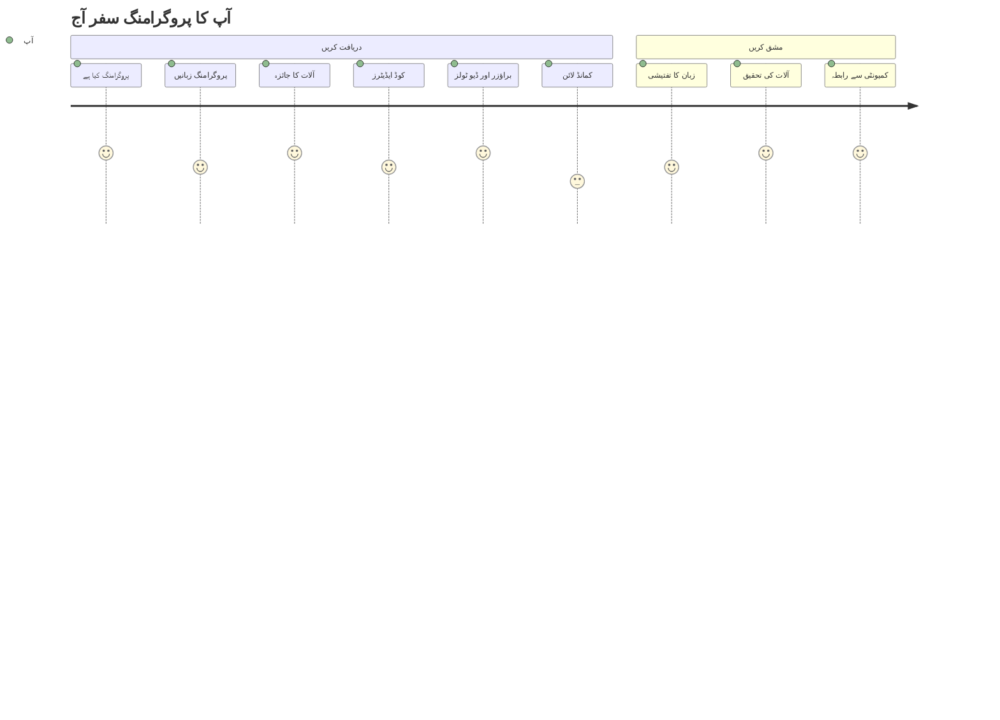
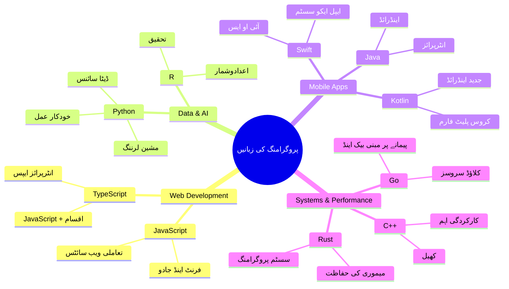
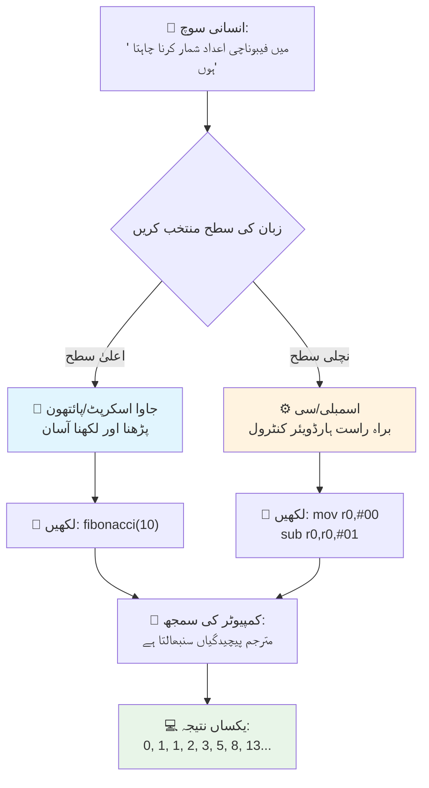
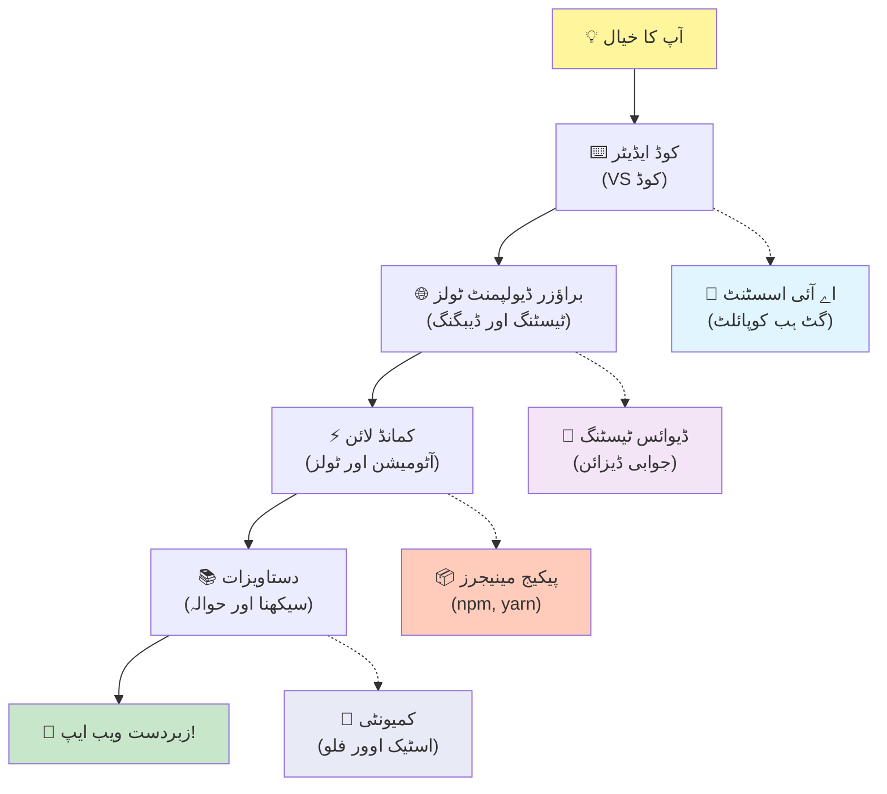
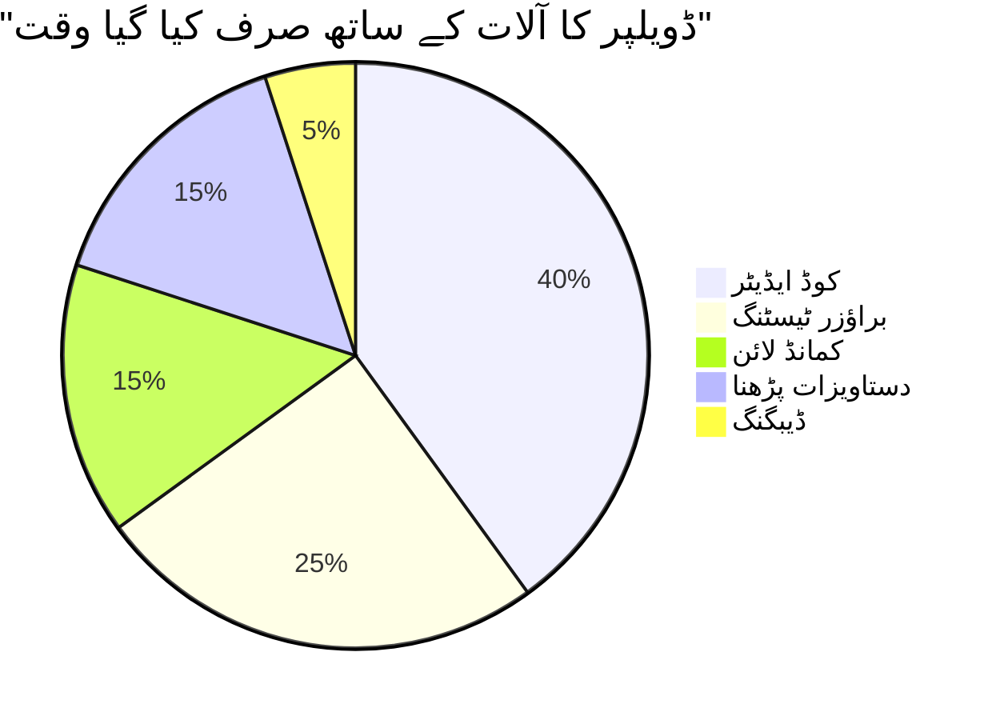
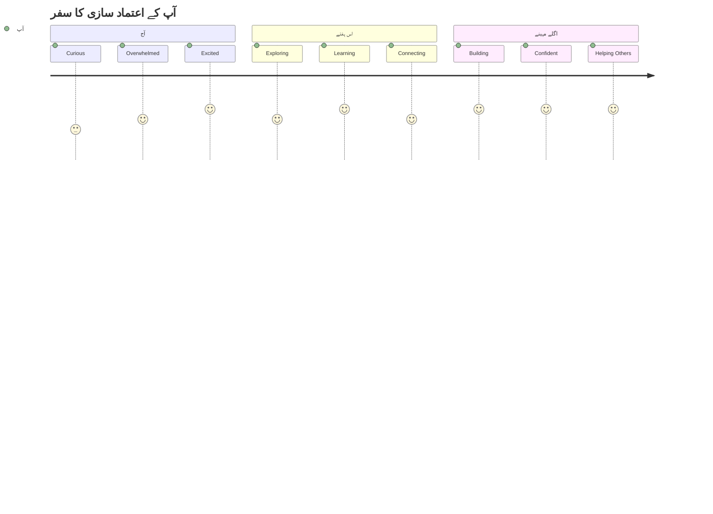

# پروگرامنگ زبانوں اور جدید ڈویلپر ٹولز کا تعارف

ہیلو، مستقبل کے ڈویلپر! 👋 کیا میں آپ کو کچھ بتا سکتا ہوں جو مجھے ہر روز لرزا دیتا ہے؟ آپ اب دریافت کرنے والے ہیں کہ پروگرامنگ صرف کمپیوٹروں کے بارے میں نہیں ہے – بلکہ یہ اصل سپر پاورز کے بارے میں ہے جو آپ کے سب سے دیوانہ خیالات کو حقیقت میں تبدیل کرتی ہے!

آپ کو وہ لمحہ یاد ہے جب آپ اپنی پسندیدہ ایپ استعمال کر رہے ہوتے ہیں اور سب کچھ بالکل ٹھیک جٍڑ جاتا ہے؟ جب آپ کسی بٹن پر ٹیپ کرتے ہیں اور کچھ جادوئی ہوتا ہے جسے دیکھ کر آپ کہتے ہیں "واہ، انہوں نے یہ کیسے کیا؟" تو وہی جادوئی کوڈ کوئی آپ جیسے ہی شخص نے لکھا ہوتا ہے – شاید رات کے 2 بجے اپنی پسندیدہ کافی شاپ میں تیسری ایسپریسو کے ساتھ بیٹھا ہو۔ اور یہ بات آپ کا دماغ ہلا دے گی: اس سبق کے آخر تک، آپ نہ صرف سمجھ جائیں گے کہ انہوں نے یہ کیسے کیا، بلکہ آپ خود بھی اسے آزمانے کے لیے بےتاب ہوں گے!

دیکھیں، مجھے پوری طرح سمجھ آتی ہے اگر پروگرامنگ ابھی آپ کو مشکل لگ رہی ہو۔ جب میں نے شروع کیا تھا تو مجھے لگتا تھا کہ آپ کو کوئی ریاضی کا نابغہ ہونا چاہیے یا پانچ سال کی عمر سے کوڈنگ کرنی چاہیے۔ لیکن یہ بات جس نے میری سوچ بدل دی: پروگرامنگ بالکل نئی زبان میں بات چیت سیکھنے جیسی ہے۔ آپ "ہیلو" اور "شکریہ" سے شروع کرتے ہیں، پھر کافی کا آرڈر دینا سیکھتے ہیں، اور پھر آپ گہرے فلسفیانہ مباحثے کر رہے ہوتے ہیں! فرق صرف یہ ہے کہ آپ کمپیوٹروں سے بات کر رہے ہیں، اور سچ پوچھیں تو یہ سب سے صبر والے بات چیت کرنے والے ہیں – وہ کبھی آپ کی غلطیوں پر فیصلے نہیں کرتے اور ہمیشہ دوبارہ کوشش کرنے کے لیے تیار رہتے ہیں!

آج، ہم ان شاندار ٹولز کو دریافت کریں گے جو جدید ویب ڈیولپمنٹ کو ممکن بناتے ہیں اور بالکل نشہ جیسا کر دیتے ہیں۔ میں بالکل انہی ایڈیٹرز، براؤزرز، اور ورک فلو کے بارے میں بات کر رہا ہوں جو نیٹ فلکس، اسپاٹیفائی، اور آپ کے پسندیدہ انڈی ایپ اسٹوڈیو کے ڈویلپر استعمال کرتے ہیں۔ اور یہ حصہ آپ کو خوش کر دے گا: زیادہ تر یہ پروفیشنل، صنعت کی معیاری ٹولز مکمل طور پر مفت ہیں!


> سکیچ نوٹ از [Tomomi Imura](https://twitter.com/girlie_mac)


```mermaid
journey
    title آپ کا پروگرامنگ سفر آج
    section دریافت کریں
      پروگرامنگ کیا ہے: 5: آپ
      پروگرامنگ زبانیں: 4: آپ
      آلات کا جائزہ: 5: آپ
    section دریافت کریں
      کوڈ ایڈیٹرز: 4: آپ
      براؤزر اور ڈیو ٹولز: 5: آپ
      کمانڈ لائن: 3: آپ
    section مشق کریں
      زبان کا تفتیشی: 4: آپ
      آلات کی تحقیق: 5: آپ
      کمیونٹی سے رابطہ: 5: آپ
```
## دیکھتے ہیں آپ کیا جانتے ہیں!

مزے کی باتوں میں جانے سے پہلے، مجھے جاننا ہے – آپ پروگرامنگ کی دنیا کے بارے میں پہلے ہی کیا جانتے ہیں؟ اور سنیں، اگر آپ ان سوالات کو دیکھ کر سوچ رہے ہیں "مجھے اس میں سے بالکل کچھ معلوم نہیں"، تو یہ نہ صرف ٹھیک ہے بلکہ بہترین ہے! اس کا مطلب ہے کہ آپ بالکل صحیح جگہ پر ہیں۔ اس کوئز کو ورزش سے پہلے کی اسٹریچنگ سمجھیں – ہم صرف اپنے دماغی پٹھوں کو گرم کر رہے ہیں!

[سبق سے پہلے کا کوئز لیں](https://ff-quizzes.netlify.app/web/)


## وہ سفر جس پر ہم ساتھ جا رہے ہیں

اچھا، میں واقعی آج جو کچھ ہم دریافت کرنے والے ہیں اس کے بارے میں بہت پرجوش ہوں! سچ میں، کاش میں آپ کا چہرہ دیکھ سکتا جب کچھ خیالات آپ کے لیے کلک کریں گے۔ یہاں ہمارا شاندار سفر ہے:

- **پروگرامنگ اصل میں کیا ہے (اور یہ سب سے زبردست چیز کیوں ہے!)** – ہم دریافت کریں گے کہ کوڈ کیسے ہر چیز کے پیچھے پوشیدہ جادو ہے، اس الارم سے جو پیر کی صبح کا پتہ لگا لیتا ہے، اس الگورتھم تک جو آپ کی نیٹ فلکس کی سفارشات کو بالکل ترتیب دیتا ہے۔
- **پروگرامنگ زبانیں اور ان کی حیرت انگیز خصوصیات** – تصور کریں کہ آپ ایک پارٹی میں جا رہے ہیں جہاں ہر شخص کے پاس بالکل مختلف سپر پاورز اور مسئلے حل کرنے کے طریقے ہیں۔ پروگرامنگ زبانوں کی دنیا ویسی ہی ہے، اور آپ ان سے مل کر خوش ہوں گے!
- **وہ بنیادی بلاکس جو ڈیجیٹل جادو کو ممکن بناتے ہیں** – انہیں حتمی تخلیقی LEGO سیٹ سمجھیں۔ جب آپ سمجھ لیں گے کہ یہ ٹکڑے کیسے ایک ساتھ آتے ہیں، تو آپ حقیقت میں کچھ بھی اپنا تصور بنا سکتے ہیں۔
- **پروفیشنل ٹولز جو آپ کو ایسا محسوس کرائیں گے جیسے آپ کو جادوگر کا عصا دیا گیا ہو** – میں ڈرامائی نہیں ہوں – یہ ٹولز واقعتاً آپ کو سپر پاورز کا احساس دیں گے، اور سب سے اچھی بات؟ یہ وہی ٹولز ہیں جو پروفیشنلز استعمال کرتے ہیں!

> 💡 **بات یہ ہے**: آج سب کچھ حفظ کرنے کی کوشش مت کریں! ابھی، بس میں چاہتا ہوں کہ آپ کو ممکنہ چیزوں کے بارے میں جوش محسوس ہو۔ تفصیلات خود بخود یاد رہیں گی جب ہم مشق کریں گے – یہی اصل سیکھنے کا طریقہ ہے!

> آپ یہ سبق [Microsoft Learn](https://learn.microsoft.com/en-us/learn/modules/web-development-101/introduction-programming/?WT.mc_id=academic-77807-sagibbon) پر بھی لے سکتے ہیں!

## تو آخر پروگرامنگ *کیا* ہے؟

اچھا، اب اس لاکھوں ڈالر کے سوال کا جواب دیتے ہیں: پروگرامنگ اصل میں کیا ہے؟

میں آپ کو ایک کہانی سناتا ہوں جس نے میری سوچ کو مکمل طور پر بدل دیا۔ پچھلے ہفتے، میں اپنی ماں کو نیا سمارٹ ٹی وی ریموٹ استعمال کرنا سکھانے کی کوشش کر رہا تھا۔ میں نے خود کو کہتے سنا، "سرخ بٹن دبائیں، مگر بڑا سرخ نہیں، بائیں طرف والا چھوٹا سرخ... نہیں، آپ کا دوسرا بایاں... ٹھیک ہے، اب اسے دو سیکنڈ تک دبائے رکھیں، ایک نہیں، تین نہیں..." کیا یہ آپ کو معلوم ہے؟ 😅

یہی پروگرامنگ ہے! یہ ایک طاقتور چیز کو انتہائی تفصیلی، قدم بہ قدم ہدایات دینے کا فن ہے، جس میں ہر چیز کو بالکل واضح لکھنا ضروری ہوتا ہے۔ فرق یہ ہے کہ آپ اپنی ماں کو نہیں سمجھا رہے (جو پوچھ سکتی ہیں "کون سا سرخ بٹن؟!"), بلکہ آپ ایک کمپیوٹر کو سمجھا رہے ہیں (جو بالکل ویسا ہی کرے گا جیسا آپ نے کہا، چاہے آپ کا مطلب بالکل وہی نہ ہو)۔

جب میں نے یہ سمجھا تو میری سوچ بدل گئی: کمپیوٹر درحقیقت بہت آسان ہیں۔ وہ صرف دو چیزیں سمجھتے ہیں – 1 اور 0، جو بنیادی طور پر "ہاں" اور "نہیں" یا "آن" اور "آف" ہیں۔ بس! لیکن جادو تب شروع ہوتا ہے جب ہمیں 1 اور 0 میں بات کرنے کی ضرورت نہیں ہوتی۔ یہاں **پروگرامنگ زبانیں** مدد کے لیے آتی ہیں۔ وہ بہترین مترجم کی طرح ہیں جو آپ کے عام انسانوں والے خیالات کو کمپیوٹر کی زبان میں بدل دیتی ہیں۔

اور یہ روزانہ میری روح کو جھنجھوڑ دیتا ہے: آپ کی زندگی کی ہر ڈیجیٹل چیز کسی ایسے شخص نے شروع کی جو آپ کی طرح ہو گا، شاید پیجاما پہنے ہوئے، کافی کے کپ کے ساتھ، اپنے لیپ ٹاپ پر کوڈ لکھ رہا ہو۔ وہ انسٹاگرام فلٹر جو آپ کو بے عیب دکھاتا ہے؟ کسی نے وہ کوڈ کیا۔ وہ سفارش جو آپ کو آپ کا نیا پسندیدہ گانا دکھاتی ہے؟ ایک ڈویلپر نے وہ الگورتھم بنایا۔ وہ ایپ جو آپ کو دوستوں کے ساتھ کھانے کے بل تقسیم کرنے میں مدد دیتی ہے؟ ہاں، کسی نے سوچا "یہ تو بہت تکلیف دہ ہے، میں اسے درست کر سکتا ہوں" اور پھر... کیا بھی!

جب آپ پروگرامنگ سیکھتے ہیں، تو آپ صرف نیا ہنر نہیں سیکھ رہے – بلکہ آپ اس حیرت انگیز کمیونٹی کا حصہ بن رہے ہیں جو مسائل کا حل نکالتی ہے اور دن بھر سوچتی رہتی ہے، "کیا میں کچھ ایسا بنا سکتا ہوں جو کسی کی زندگی تھوڑا بہتر بنا دے؟" واقعی، اس سے بہترین کیا ہو سکتا ہے؟

✅ **مزے دار حقیقت کی تلاش**: جب آپ کے پاس وقت ہو تو یہ انتہائی دلچسپ معلوم کریں – آپ کے خیال میں دنیا کا پہلا کمپیوٹر پروگرامر کون تھا؟ میں ہیٖنٹ دیتا ہوں: شاید وہ وہ نہیں جس کی آپ توقع کر رہے ہوں! اس شخص کی کہانی انتہائی دلچسپ ہے اور یہ ظاہر کرتی ہے کہ پروگرامنگ ہمیشہ تخلیقی مسئلہ حل کرنے اور باکس کے باہر سوچنے کے بارے میں رہی ہے۔

### 🧠 **چیک ان کا وقت: آپ کیسا محسوس کر رہے ہیں؟**

**ذرا غور کریں:**
- کیا "کمپیوٹروں کو ہدایات دینا" کا تصور آپ کو اب سمجھ آتا ہے؟
- کیا آپ ایسی روزمرہ کی کوئی چیز سوچ سکتے ہیں جسے آپ پروگرامنگ کی مدد سے خودکار بنانا چاہیں؟
- اس پروگرامنگ چیز کے بارے میں آپ کے ذہن میں کون سے سوالات اٹھ رہے ہیں؟

> **یاد رکھیں**: اگر کچھ خیالات ابھی تھوڑے غیر واضح لگیں تو یہ بالکل نارمل ہے۔ پروگرامنگ سیکھنا ایک نئی زبان سیکھنے جیسا ہے – دماغ کے نیورل راستے بنانے میں وقت لگتا ہے۔ آپ شاندار کر رہے ہیں!

## پروگرامنگ زبانیں جادو کے مختلف ذائقوں کی طرح ہیں

اچھا، یہ تھوڑا عجیب لگ سکتا ہے، لیکن میرے ساتھ رہیں – پروگرامنگ زبانیں موسیقی کی مختلف اقسام جیسی ہیں۔ سوچیں: آپ کے پاس جاز ہے، جو نرم اور فوری ہوتا ہے، راک ہے، جو طاقتور اور سیدھا سادا ہے، کلاسیکل ہے، جو خوبصورت اور منظم ہے، اور ہپ ہاپ ہے، جو تخلیقی اور اظہار خیال ہے۔ ہر انداز کی اپنی فضا، اپنے پرجوش مداح ہیں، اور ہر ایک مختلف موڈز اور مواقع کے لیے بہترین ہے۔

پروگرامنگ زبانیں بھی بالکل ایسا ہی کام کرتی ہیں! آپ ایک ہی زبان میں تفریحی موبائل گیم نہیں بنائیں گے جس زبان کو آپ بڑے پیمانے پر ماحولیاتی ڈیٹا کے لیے استعمال کریں گے، جیسے آپ یوگا کلاس میں ڈیٹھ میٹل نہیں سنائیں گے (کم از کم زیادہ تر یوگا کلاسوں میں نہیں! 😄)۔

لیکن جو چیز مجھے ہر بار حیران کر دیتی ہے وہ یہ ہے: یہ زبانیں دنیا کے سب سے صبر والے، ذہین مترجم کی طرح ہوتی ہیں جو آپ کے بالکل قریب بیٹھا ہے۔ آپ اپنے خیالات اسے اپنے انسانی دماغ کے مطابق بیان کرتے ہیں، اور وہ سب پیچیدہ کام کرکے اسے 1 اور 0 میں بدل دیتے ہیں جو کمپیوٹر بولتے ہیں۔ یہ ایسا ہے جیسے آپ کے پاس ایک ایسا دوست ہو جو "انسانی تخلیق" اور "کمپیوٹر منطق" دونوں میں مکمل ماہر ہو – اور وہ کبھی تھکتا نہیں، کبھی کافی بریک نہیں لیتا، اور کبھی آپ سے ایک ہی سوال دوبارہ پوچھنے پر فیصلہ نہیں کرتا!

### مقبول پروگرامنگ زبانیں اور ان کے استعمالات


```mermaid
mindmap
  root((پروگرامنگ کی زبانیں))
    Web Development
      JavaScript
        فرنٹ اینڈ جادو
        تعاملی ویب سائٹس
      TypeScript
        JavaScript + اقسام
        انٹرپرائز ایپس
    Data & AI
      Python
        ڈیٹا سائنس
        مشین لرننگ
        خودکار عمل
      R
        اعدادوشمار
        تحقیق
    Mobile Apps
      Java
        اینڈرائڈ
        انٹرپرائز
      Swift
        آئی او ایس
        ایپل ایکو سسٹم
      Kotlin
        جدید اینڈرائڈ
        کروس پلیٹ فارم
    Systems & Performance
      C++
        کھیل
        کارکردگی اہم
      Rust
        میموری کی حفاظت
        سسٹم پروگرامنگ
      Go
        کلاؤڈ سروسز
        پیمانے پر مبنی بیک اینڈ
```
| زبان | بہترین استعمال | کیوں مشہور ہے |
|----------|----------|------------------|
| **JavaScript** | ویب ڈویلپمنٹ، یوزر انٹرفیس | براؤزرز میں چلتی ہے اور انٹرایکٹو ویب سائٹس کو طاقت دیتی ہے |
| **Python** | ڈیٹا سائنس، آٹومیشن، AI | پڑھنے اور سیکھنے میں آسان، طاقتور لائبریریز |
| **Java** | انٹرپرائز ایپلیکیشنز، اینڈرائیڈ ایپس | پلیٹ فارم سے آزاد، بڑے سسٹمز کے لیے مضبوط |
| **C#** | ونڈوز ایپلیکیشنز، گیم ڈیولپمنٹ | مائیکروسافٹ کے مضبوط نظام کی حمایت |
| **Go** | کلاؤڈ سروسز، بیک اینڈ سسٹمز | تیز، سادہ، جدید کمپیوٹنگ کے لیے ڈیزائن کیا گیا |

### ہائی-لیول بمقابلہ لو-لیول زبانیں

اچھا، یہ وہ تصور تھا جس نے پہلے مجھے مکمل طور پر کنفیوژ کر دیا تھا جب میں نے سیکھنا شروع کیا تھا، اس لیے میں وہ مثال شیئر کرتا ہوں جس نے آخر کار مجھے سمجھایا – اور مجھے امید ہے یہ آپ کو بھی مدد دے گا!

تصور کریں کہ آپ ایسے ملک میں ہیں جہاں آپ زبان نہیں بولتے، اور آپ کو بہت ضرورت ہے کہ قریب ترین باتھ روم کہاں ہے (ہم سب وہ مقام پر پہنچے ہیں، ہے نا؟ 😅):

- **لو-لیول پروگرامنگ** ایسی ہے جیسے آپ وہاں کی مقامی زبان اتنی اچھی بولتے ہوں کہ آپ پھل بیچنے والی دادی سے ثقافتی حوالے، مقامی محاورے، اور اندرونی مذاق کے ساتھ بات کر سکیں جو صرف وہی سمجھے جو وہاں بڑے ہوئے ہوں۔ یہ بہت متاثر کن اور انتہائی موثر ہے... اگر آپ فلوئنٹ ہوں! لیکن جب آپ صرف باتھ روم تلاش کر رہے ہوں تو یہ کافی پیچیدہ ہے۔

- **ہائی-لیول پروگرامنگ** ایسی ہے جیسے آپ کا ایک شاندار مقامی دوست ہو جو آپ کی بات فوراً سمجھ لے۔ آپ آسان انگریزی میں کہہ سکتے ہیں "مجھے باتھ روم جلدی چاہیے" اور وہ تمام ثقافتی ترجمہ سنبھال کر آپ کو ایسے راستے بتائے جو آپ کے غیر مقامی دماغ کو بالکل سمجھ آئیں۔

پروگرامنگ کی اصطلاحات میں:
- **لو-لیول زبانیں** (جیسے اسمبلی یا C) آپ کو کمپیوٹر کے اصل ہارڈویئر سے انتہائی تفصیلی بات چیت کرنے دیتی ہیں، لیکن آپ کو مشین کی طرح سوچنا پڑتا ہے، جو... اچھا، بہت بڑا دماغی تبدیلی ہے!
- **ہائی-لیول زبانیں** (جیسے جاوا اسکرپٹ، پائتھن، یا C#) آپ کو انسان کی طرح سوچنے دیتی ہیں جبکہ وہ پس پردہ تمام مشین کی زبان سنبھالتی ہیں۔ اس کے علاوہ، ان کی شاندار کمیونٹیز ہوتی ہیں جو یاد رکھتی ہیں کہ نئی زبان سیکھنے والا کیسا ہوتا ہے اور واقعی مدد کرنا چاہتی ہیں!

آپ سمجھیں کون سی زبانوں سے شروع کرنے کا مشورہ دوں گا؟ 😉 ہائی-لیول زبانیں ایسی تربیتی پہیے کی طرح ہیں جنہیں آپ کبھی اتارنا نہیں چاہیں گے کیونکہ وہ پورے تجربے کو بہت خوشگوار بنا دیتی ہیں!


```mermaid
flowchart TB
    A["👤 انسانی سوچ:<br/>'میں فیبوناچی اعداد شمار کرنا چاہتا ہوں'"] --> B{زبان کی سطح منتخب کریں}
    
    B -->|اعلیٰ سطح| C["🌟 جاوا اسکرپٹ/پائتھون<br/>پڑھنا اور لکھنا آسان"]
    B -->|نچلی سطح| D["⚙️ اسمبلی/سی<br/>براہ راست ہارڈویئر کنٹرول"]
    
    C --> E["📝 لکھیں: fibonacci(10)"]
    D --> F["📝 لکھیں: mov r0,#00<br/>sub r0,r0,#01"]
    
    E --> G["🤖 کمپیوٹر کی سمجھ:<br/>مترجم پیچیدگیاں سنبھالتا ہے"]
    F --> G
    
    G --> H["💻 یکساں نتیجہ:<br/>0, 1, 1, 2, 3, 5, 8, 13..."]
    
    style C fill:#e1f5fe
    style D fill:#fff3e0
    style H fill:#e8f5e8
```
### میں آپ کو دکھاتا ہوں کہ ہائی-لیول زبانیں اتنی زیادہ دوستانہ کیوں ہیں

اچھا، میں آپ کو کچھ دکھانے والا ہوں جو بالکل ظاہر کرتا ہے کہ میں ہائی-لیول زبانوں سے کیوں محبت کرتا ہوں، لیکن پہلے – مجھے آپ سے ایک وعدہ چاہیے۔ جب آپ وہ پہلا کوڈ دیکھیں تو گھبرائیں نہیں! وہ خوفناک لگنا چاہیے۔ یہی میرا مقصد ہے!

ہم وہی کام دو بالکل مختلف انداز میں لکھے ہوئے دیکھیں گے۔ دونوں Fibonacci sequence بناتے ہیں – یہ ایک خوبصورت ریاضیاتی ترتیب ہے جہاں ہر نمبر پچھلے دو نمبرز کا مجموعہ ہوتا ہے: 0، 1، 1، 2، 3، 5، 8، 13... (مزے کی بات: یہ ترتیب قدرت میں ہر جگہ پائی جاتی ہے – سورج مکھی کے بیج کا سرپل، پائن کون پیٹرن، حتیٰ کہ کہکشاؤں کے بننے کا طریقہ!)

فرق دیکھنے کے لیے تیار؟ چلیں!

**ہائی-لیول زبان (جاوا اسکرپٹ) – انسان کے لیے آسان:**

```javascript
// مرحلہ 1: بنیادی فبوناکی سیٹ اپ
const fibonacciCount = 10;
let current = 0;
let next = 1;

console.log('Fibonacci sequence:');
```

**یہ کوڈ کیا کرتا ہے:**
- **ایک کانسٹنٹ** اعلان کرتا ہے جس سے ہم یہ بتاتے ہیں کہ ہمیں کتنے Fibonacci نمبرز بنانے ہیں
- **دو ویریبلز** شروع کرتا ہے جو اس وقت اور اگلے نمبر کو ٹریک کرتے ہیں
- **شروع کے ویلیوز** (0 اور 1) سیٹ کرتا ہے جو Fibonacci پیٹرن کو ڈیفائن کرتے ہیں
- **ہمارے آؤٹ پٹ کی شناخت کے لیے** ایک ہیڈر پیغام دکھاتا ہے

```javascript
// قدم 2: لوپ کے ساتھ سلسلہ پیدا کریں
for (let i = 0; i < fibonacciCount; i++) {
  console.log(`Position ${i + 1}: ${current}`);
  
  // سلسلے میں اگلا نمبر معلوم کریں
  const sum = current + next;
  current = next;
  next = sum;
}
```

**یہاں کیا ہو رہا ہے تفصیل سے:**
- **ہر پوزیشن پر لوپ** چلتا ہے `for` لوپ کے ذریعے
- **ہر نمبر اور اس کی پوزیشن دکھائی جاتی ہے** تمپلیٹ لٹریل فارمیٹنگ کے ساتھ
- **اگلا Fibonacci نمبر حساب کیا جاتا ہے** موجودہ اور اگلے نمبروں کو جمع کر کے
- **ھن ویریبلز کو اپ ڈیٹ کیا جاتا ہے** تاکہ اگلے چکر کے لیے تیاری ہو جائے

```javascript
// مرحلہ 3: جدید فنکشنل طریقہ
const generateFibonacci = (count) => {
  const sequence = [0, 1];
  
  for (let i = 2; i < count; i++) {
    sequence[i] = sequence[i - 1] + sequence[i - 2];
  }
  
  return sequence;
};

// استعمال کی مثال
const fibSequence = generateFibonacci(10);
console.log(fibSequence);
```

**مندرجہ بالا میں ہم نے:**
- **جدید arrow function syntax سے** ایک ری یوز ایبل فنکشن بنایا ہے
- **ایک ایرے بنایا** جو پورا سیکوئنس ایک ساتھ اسٹور کرتا ہے بجائے ایک ایک کر کے دکھانے کے
- **اررے انڈیکسنگ کا استعمال کیا** ہر نئے نمبر کو پچھلے ویلیوز سے کیلکولیٹ کرنے کے لیے
- **پورا سیکوئنس ریٹرن کیا** تاکہ اسے پروگرام کے دوسرے حصوں میں فلیکسبلی استعمال کیا جا سکے

**لو-لیول زبان (ARM اسمبلی) – کمپیوٹر کے لیے آسان:**

```assembly
 area ascen,code,readonly
 entry
 code32
 adr r0,thumb+1
 bx r0
 code16
thumb
 mov r0,#00
 sub r0,r0,#01
 mov r1,#01
 mov r4,#10
 ldr r2,=0x40000000
back add r0,r1
 str r0,[r2]
 add r2,#04
 mov r3,r0
 mov r0,r1
 mov r1,r3
 sub r4,#01
 cmp r4,#00
 bne back
 end
```

نوٹ کریں کہ جاوا اسکرپٹ ورژن انگریزی ہدایات کی طرح پڑھتا ہے، جب کہ اسمبلی ورژن خفیہ کمانڈز استعمال کرتا ہے جو براہ راست کمپیوٹر کے پروسیسر کو کنٹرول کرتے ہیں۔ دونوں بالکل ایک جیسا کام کرتے ہیں، لیکن ہائی-لیول زبان انسانوں کے لیے زیادہ سمجھنے، لکھنے، اور برقرار رکھنے میں آسان ہے۔

**اہم فرق جو آپ نوٹ کریں گے:**
- **قابل خواندگی**: جاوااسکرپٹ وضاحتی نام استعمال کرتا ہے جیسے `fibonacciCount` جبکہ اسمبلی پیچیدہ لیبلز استعمال کرتا ہے جیسے `r0`, `r1`
- **تبصرے**: اعلیٰ سطحی زبانیں وضاحتی تبصرے کی ترغیب دیتی ہیں جو کوڈ کو خود دستاویزی بناتی ہیں
- **ساخت**: جاوااسکرپٹ کا منطقی بہاؤ وہی ہے جس طرح انسان مرحلہ وار مسائل کو سوچتے ہیں
- **بحالی**: مختلف ضروریات کے لیے جاوااسکرپٹ ورژن کو اپ ڈیٹ کرنا آسان اور واضح ہوتا ہے

✅ **فبونیکی سیریز کے بارے میں**: یہ انتہائی خوبصورت عددی ترتیب (جہاں ہر عدد اس کے دو پچھلے عدد کا مجموعہ ہوتا ہے: 0، 1، 1، 2، 3، 5، 8...) فطرت میں واقعی *ہر جگہ* پائی جاتی ہے! آپ اسے سورج مکھی کے گھومتے دھاگوں میں، پائن کون کے نمونوں میں، ناٹیلَس شیلز کے خم میں، اور یہاں تک کہ درخت کی شاخوں کے بڑھنے کے طریقے میں بھی دیکھیں گے۔ یہ واقعی حیرت انگیز ہے کہ ریاضی اور کوڈ ہماری مدد کرتے ہیں ان خوبصورت پیٹرنز کو سمجھنے اور دوبارہ بنانے میں جو فطرت استعمال کرتی ہے!


## وہ بنیادی اجزاء جو جادو کو ممکن بناتے ہیں

اب جب آپ نے دیکھا کہ پروگرامنگ زبانیں عملی طور پر کیسی دکھتی ہیں، آئیے ان بنیادی حصوں کا جائزہ لیں جو دراصل ہر لکھے گئے پروگرام کا حصہ ہوتے ہیں۔ انہیں اپنے پسندیدہ نسخے کے اہم اجزاء سمجھیں – جب آپ ان کی فعالیت سمجھ لیں گے، تو آپ تقریباً کسی بھی زبان میں کوڈ پڑھنے اور لکھنے کے قابل ہو جائیں گے!

یہ پروگرامنگ کی گرامر سیکھنے جیسا ہے۔ یاد ہے اسکول میں جب آپ نے اسماء، افعال، اور جملے بنانے کا طریقہ سیکھا تھا؟ پروگرامنگ کی اپنی گرامر ہوتی ہے، اور سچ کہیں تو یہ انگریزی گرامر سے کہیں زیادہ منطقی اور معاف کرنے والی ہے! 😄

### اظہاریے: مرحلہ وار ہدایات

آئیے شروع کرتے ہیں **اظہاریے** سے – یہ آپ کے کمپیوٹر کے ساتھ بات چیت میں انفرادی جملوں کی طرح ہیں۔ ہر اظہاریہ کمپیوٹر کو ایک خاص کام کرنے کا حکم دیتا ہے، بالکل جیسے ہدایات دینا: "یہاں بائیں مڑو"، "سرخ بتی پر رکو"، "اس جگہ گاڑی پارک کرو"۔

مجھے اظہاریوں کی جو بات سب سے زیادہ پسند ہے وہ ان کی پڑھنے میں آسانی ہے۔ یہ دیکھیں:

```javascript
// بنیادی بیانات جو واحد کارروائیاں انجام دیتے ہیں
const userName = "Alex";                    
console.log("Hello, world!");              
const sum = 5 + 3;                         
```

**یہ کوڈ یہ کرتا ہے:**
- صارف کے نام کو محفوظ کرنے کے لیے ایک مستقل متغیر کا اعلان کرنا
- کنسول آؤٹ پٹ پر ایک خوش آمدید پیغام دکھانا
- ایک ریاضیاتی آپریشن کا نتیجہ حساب کر کے محفوظ کرنا

```javascript
// بیٹیاں جو ویب صفحات کے ساتھ بات چیت کرتی ہیں
document.title = "My Awesome Website";      
document.body.style.backgroundColor = "lightblue";
```

**مرحلہ وار، یہ ہو رہا ہے:**
- براؤزر ٹیب میں ظاہر ہونے والے صفحہ کے عنوان میں ترمیم کرنا
- پورے صفحہ کے پس منظر کا رنگ بدلنا

### متغیرات: آپ کے پروگرام کا میموری سسٹم

ٹھیک ہے، **متغیرات** میرے پڑھانے کے پسندیدہ خیالات میں سے ایک ہیں کیونکہ یہ بلکل روزمرہ کی چیزوں کی طرح ہیں جو آپ ہر دن استعمال کرتے ہیں!

اپنے فون کے رابطہ فہرست کے بارے میں سوچیں۔ آپ سب کے نمبر یاد نہیں رکھتے – بلکہ "ماں"، "بہترین دوست"، یا "پیزا کی جگہ جو رات 2 بجے تک پہنچاتی ہے" محفوظ کرتے ہیں اور فون کو اصل نمبر یاد رکھنے دیتے ہیں۔ متغیرات بھی بالکل اسی طرح کام کرتے ہیں! یہ پروگرام کے لیے لیبل والے کنٹینرز کی طرح ہوتے ہیں جہاں معلومات محفوظ کی جاتی ہیں اور بعد میں اس نام سے بازیافت کی جاتی ہے جو حقیقت میں معنی رکھتا ہے۔

واہ کیا بات ہے: متغیرات چلاتے وقت بدل بھی سکتے ہیں (اسی لیے انہیں "متغیر" کہا جاتا ہے – سمجھ گئے؟)۔ جیسے آپ کسی بہتر پیزا کی جگہ کا نمبر دریافت کر کے رابطہ اپ ڈیٹ کرتے ہیں، ویسے ہی جب پروگرام نئی معلومات سیکھتا ہے یا حالات بدلتے ہیں تو متغیرات کو اپ ڈیٹ کیا جا سکتا ہے!

دیکھیں یہ کتنا خوبصورت آسان ہے:

```javascript
// مرحلہ 1: بنیادی متغیرات بنانا
const siteName = "Weather Dashboard";        
let currentWeather = "sunny";               
let temperature = 75;                       
let isRaining = false;                      
```

**ان تصورات کو سمجھیں:**
- `const` متغیرات میں غیر قابل تبدیلی قدریں محفوظ کریں (جیسے سائٹ کا نام)
- ایسے قدروں کے لیے `let` استعمال کریں جو پروگرام کے دوران بدل سکتے ہیں
- مختلف ڈیٹا کی اقسام تفویض کریں: سٹرنگز (متن)، نمبر، اور بولینز (true/false)
- وضاحتی نام منتخب کریں جو بتاتے ہیں کہ ہر متغیر میں کیا ہے

```javascript
// مرحلہ 2: متعلقہ ڈیٹا کو گروپ کرنے کے لیے اشیاء کے ساتھ کام کرنا
const weatherData = {                       
  location: "San Francisco",
  humidity: 65,
  windSpeed: 12
};
```

**اوپر کے کوڈ میں ہم نے:**
- متعلقہ موسمی معلومات کو ایک ساتھ گروپ کرنے کے لیے ایک چیز تخلیق کی
- ایک متغیر نام کے تحت متعدد ڈیٹا پیس کو منظم کیا
- ہر معلوماتی جز کو واضح طور پر لیبل کرنے کے لیے کی-ویلیو جوڑے استعمال کیے

```javascript
// قدم 3: متغیرات کا استعمال اور تازہ کاری
console.log(`${siteName}: Today is ${currentWeather} and ${temperature}°F`);
console.log(`Wind speed: ${weatherData.windSpeed} mph`);

// قابل تبدیلی متغیرات کو اپ ڈیٹ کرنا
currentWeather = "cloudy";                  
temperature = 68;                          
```

**ہر حصے کو سمجھیں:**
- ٹیمپلیٹ لٹریلز کے ذریعے معلومات دکھائیں جن میں `${}` سنٹیکس استعمال ہوتا ہے
- ڈاٹ نوٹیشن (`weatherData.windSpeed`) کے ذریعے آبجیکٹ کی خصوصیات تک رسائی حاصل کریں
- `let` سے تعریف شدہ متغیرات کو بدلتے حالات کے مطابق اپ ڈیٹ کریں
- متعدد متغیرات کو جوڑ کر معنی خیز پیغامات تخلیق کریں

```javascript
// مرحلہ 4: صاف کوڈ کے لیے جدید ڈسٹرکچرنگ
const { location, humidity } = weatherData; 
console.log(`${location} humidity: ${humidity}%`);
```

**آپ کو جاننا ضروری ہے:**
- مخصوص خصوصیات کو آبجیکٹ سے نکالنے کے لیے ڈسٹرکچرنگ اسائنمنٹ استعمال کریں
- آبجیکٹ کی چابیاں کے ناموں کے ساتھ خودکار طور پر نئے متغیرات بنائیں
- کوڈ کو آسان بنائیں تاکہ بار بار ڈاٹ نوٹیشن استعمال نہ کرنا پڑے

### کنٹرول فلو: آپ کے پروگرام کو سوچنا سکھانا

ٹھیک ہے، یہاں پروگرامنگ بالکل دماغ ہلا دینے والی ہو جاتی ہے! **کنٹرول فلو** بنیادی طور پر آپ کے پروگرام کو سمجھدار فیصلے لینے کی تربیت ہے، بالکل ویسے جیسے آپ ہر روز بغیر سوچے ہی کرتے ہیں۔

تصور کریں: آج صبح آپ نے شاید یہ سوچا "اگر بارش ہو رہی ہے، تو چھتری لوں گا۔ اگر سردی ہے تو جیکٹ پہنوں گا۔ اگر دیر ہو رہی ہے تو ناشتہ چھوڑ کر راستے میں کافی لے لوں گا۔" آپ کا دماغ قدرتی طور پر اس if-then منطق کو دن میں کئی بار فالو کرتا ہے!

یہ وہ چیز ہے جو پروگرامز کو ذہین اور زندہ محسوس کراتی ہے، نہ کہ محض بور اور پیش گوئی شدہ اسکرپٹ کی طرح۔ یہ واقعی صورتحال کا جائزہ لیتے ہیں، جو ہورہا ہے اسے پرکھتے ہیں، اور مناسب جواب دیتے ہیں۔ یہ آپ کے پروگرام کو ایسا دماغ دیتی ہے جو حالات کے مطابق ڈھل سکتا ہے اور فیصلے کر سکتا ہے!

دیکھنا چاہتے ہیں یہ کتنا خوبصورتی سے کام کرتا ہے؟ میں آپ کو دکھاتا ہوں:

```javascript
// مرحلہ 1: بنیادی مشروط منطق
const userAge = 17;

if (userAge >= 18) {
  console.log("You can vote!");
} else {
  const yearsToWait = 18 - userAge;
  console.log(`You'll be able to vote in ${yearsToWait} year(s).`);
}
```

**یہ کوڈ کیا کرتا ہے:**
- چیک کرے کہ صارف کی عمر ووٹنگ کی شرط پوری کرتی ہے یا نہیں
- شرط کے نتیجے کے مطابق مختلف کوڈ بلاکس چلائیں
- اگر عمر 18 سے کم ہو تو ووٹنگ کے اہل ہونے تک باقی وقت کا حساب لگائیں اور دکھائیں
- ہر صورتحال کے لیے مخصوص، مفید فیڈبیک فراہم کریں

```javascript
// مرحلہ 2: منطقی آپریٹرز کے ساتھ متعدد شرائط
const userAge = 17;
const hasPermission = true;

if (userAge >= 18 && hasPermission) {
  console.log("Access granted: You can enter the venue.");
} else if (userAge >= 16) {
  console.log("You need parent permission to enter.");
} else {
  console.log("Sorry, you must be at least 16 years old.");
}
```

**یہاں کیا ہوتا ہے:**
- کسی سے زیادہ شرائط کو `&&` (اور) آپریٹر سے جوڑیں
- متعدد حالات کے لیے `else if` کے ذریعہ ہئیرارکی بنائیں
- ایک آخری `else` اسٹیٹمنٹ کے ساتھ تمام ممکنہ کیسز کو ہینڈل کریں
- ہر مختلف حالت کے لیے واضح اور عملی فیڈبیک دیں

```javascript
// مرحلہ 3: مختصر شرطی تیسری آپریٹر کے ساتھ
const votingStatus = userAge >= 18 ? "Can vote" : "Cannot vote yet";
console.log(`Status: ${votingStatus}`);
```

**آپ کو یاد رکھنے کی ضرورت ہے:**
- سادہ دو آپشن والی شرائط کے لیے ternary آپریٹر (`? :`) کا استعمال کریں
- پہلے شرط لکھیں، پھر `?`، پھر صحیح نتیجہ، پھر `:`، پھر غلط نتیجہ لکھیں
- جب حالات کی بنیاد پر قدریں تفویض کرنا ہو تو اس پیٹرن کو اپنائیں

```javascript
// مرحلہ 4: متعدد مخصوص کیسوں کو سنبھالنا
const dayOfWeek = "Tuesday";

switch (dayOfWeek) {
  case "Monday":
  case "Tuesday":
  case "Wednesday":
  case "Thursday":
  case "Friday":
    console.log("It's a weekday - time to work!");
    break;
  case "Saturday":
  case "Sunday":
    console.log("It's the weekend - time to relax!");
    break;
  default:
    console.log("Invalid day of the week");
}
```

**یہ کوڈ مندرجہ ذیل کام انجام دیتا ہے:**
- متغیر کی قدر کو متعدد مخصوص کیسز کے ساتھ موازنہ کرے
- ملتے جلتے کیسز کو گروپ کرے (ہفتہ کے دن بمقابلہ ہفتے کے آخر کے دن)
- میچ ہونے پر مناسب کوڈ بلاک چلائے
- غیر متوقع قدروں کے لیے `default` کیس شامل کرے
- کوڈ کو اگلے کیس تک جانے سے روکنے کے لیے `break` اسٹیٹمنٹس استعمال کرے

> 💡 **حقیقی دنیا کی مثال**: کنٹرول فلو کو سمجھیں جیسے دنیا کا سب سے صابر GPS جو آپ کو ہدایات دے رہا ہو۔ یہ کہہ سکتا ہے "اگر مینسٹریٹ پر ٹریفک ہے تو ہائی وے لو۔ اگر ہائی وے بند ہے تو خوبصورت راستہ آزمائیں۔" پروگرام اسی طرح کی شرطیہ منطق استعمال کرتے ہیں تاکہ مختلف حالات میں سمجھداری سے جواب دے سکیں اور صارفین کو بہترین تجربہ فراہم کریں۔

### 🎯 **تصور کی جانچ: بنیادی اجزاء کی مہارت**

**آئیے دیکھتے ہیں آپ بنیادیات میں کہاں کھڑے ہیں:**
- آپ اپنے الفاظ میں متغیر اور اظہاریہ کے فرق کی وضاحت کر سکتے ہیں؟
- ایک حقیقی دنیا کی مثال سوچیں جہاں آپ if-then فیصلہ استعمال کریں (جیسا کہ ہمارا ووٹنگ کا مثال)
- پروگرامنگ منطق کے بارے میں آپ کو کیا چیز سب سے زیادہ حیران کن لگی؟

**اعتماد بڑھانے کا چھوٹا سا ٹوٹکا:**

```mermaid
flowchart LR
    A["📝 بیانات<br/>(ہدایات)"] --> B["📦 متغیرات<br/>(ذخیرہ)"] --> C["🔀 کنٹرول فلو<br/>(فیصلے)"] --> D["🎉 کام کرنے والا پروگرام!"]
    
    style A fill:#ffeb3b
    style B fill:#4caf50
    style C fill:#2196f3
    style D fill:#ff4081
```
✅ **آگے کیا آنے والا ہے**: ہم اس ناقابل یقین سفر کے دوران ان تصورات میں مزید گہرائی سے جائیں گے! ابھی صرف ان تمام شاندار امکانات کے بارے میں جوش محسوس کریں جو آپ کے سامنے ہیں۔ مخصوص مہارتیں اور تکنیکیں ایسی قدرتی طور پر جڑ جائیں گی جب ہم مل کر مشق کریں گے – میں وعدہ کرتا ہوں یہ آپ کی توقعات سے کہیں زیادہ مزے دار ہوگا!

## پیشہ ورانہ آلات

ٹھیک ہے، سچ کہوں تو یہاں میرا جوش حد سے زیادہ بڑھ جاتا ہے کہ میں خود کو روک نہیں پاتا! 🚀 ہم بات کرنے والے ہیں ان زبردست آلات کے بارے میں جن کے استعمال سے آپ کو محسوس ہوگا کہ جیسے آپ کو ایک ڈیجیٹل خلائی جہاز کی چابیاں تھما دی گئی ہیں۔

آپ جانتے ہیں کہ ایک شیف کے پاس وہ بہترین توازن والے چھریاں ہوتی ہیں جو اس کے ہاتھوں کی توسیع لگتی ہیں؟ یا ایک موسیقار کا وہ ایک گیٹار جو جیسے ہی وہ چھیڑتا ہے گانا گانے لگتا ہے؟ ٹھیک اسی طرح، ڈویلپرز کے پاس بھی ایسے جادوی آلات ہوتے ہیں، اور میں آپ کو حیرت میں ڈال دوں کہ ان میں سے اکثر بالکل مفت ہیں!

میں اپنی کرسی پر اچھلتا ہوں یہ سوچ کر کہ آپ سے یہ شیئر کر رہا ہوں کیونکہ انہوں نے سافٹ ویئر بنانے کے طریقے کو مکمل طور پر بدل کر رکھ دیا ہے۔ ہم بات کر رہے ہیں AI سے چلنے والے کوڈنگ اسسٹنٹس کی جو آپ کا کوڈ لکھنے میں مدد کرتے ہیں (میں مذاق نہیں کر رہا!), کلاؤڈ ماحول جہاں آپ وائی فائی سے کہیں بھی مکمل ایپلی کیشنز بنا سکتے ہیں، اور ڈی بگنگ کے آلات جو اتنے عمدہ ہیں کہ ایسے لگتا ہے جیسے آپ کے پروگرامز کے لیے ایکس رے وژن ہو۔

اور یہ وہ حصہ ہے جو مجھے ابھی بھی تھرتھراہٹ دیتا ہے: یہ "نئے سیکھنے والوں کے آلات" نہیں جو آپ جلد ہی چھوڑ دیں گے۔ یہ وہی پیشہ ورانہ معیار کے آلات ہیں جو گوگل، نیٹ فلکس، اور وہ انڈی ایپ اسٹوڈیو جو آپ پسند کرتے ہیں، اس وقت بالکل استعمال کر رہے ہیں۔ آپ انہیں استعمال کر کے خود کو ایک ماہر محسوس کریں گے!


```mermaid
graph TD
    A["💡 آپ کا خیال"] --> B["⌨️ کوڈ ایڈیٹر<br/>(VS کوڈ)"] 
    B --> C["🌐 براؤزر ڈیولپمنٹ ٹولز<br/>(ٹیسٹنگ اور ڈیبگنگ)"]
    C --> D["⚡ کمانڈ لائن<br/>(آٹومیشن اور ٹولز)"]
    D --> E["📚 دستاویزات<br/>(سیکھنا اور حوالہ)"]
    E --> F["🚀 زبردست ویب ایپ!"]
    
    B -.-> G["🤖 اے آئی اسسٹنٹ<br/>(گٹ ہب کوپائلٹ)"]
    C -.-> H["📱 ڈیوائس ٹیسٹنگ<br/>(جوابی ڈیزائن)"]
    D -.-> I["📦 پیکیج مینیجرز<br/>(npm, yarn)"]
    E -.-> J["👥 کمیونٹی<br/>(اسٹیک اوور فلو)"]
    
    style A fill:#fff59d
    style F fill:#c8e6c9
    style G fill:#e1f5fe
    style H fill:#f3e5f5
    style I fill:#ffccbc
    style J fill:#e8eaf6
```
### کوڈ ایڈیٹرز اور IDEs: آپ کے نئے ڈیجیٹل بہترین دوست

آئیں بات کرتے ہیں کوڈ ایڈیٹرز کی – یہ واقعی آپ کی نئی پسندیدہ جگہیں بننے جا رہی ہیں جہاں آپ زیادہ تر وقت اپنے ڈیجیٹل تخلیقات کو تیار اور بہتر کرنے میں گزاریں گے۔

لیکن جدید ایڈیٹرز کی خاص بات یہ ہے کہ یہ صرف عام ٹیکسٹ ایڈیٹر نہیں ہیں۔ یہ ایسے ہیں جیسے آپ کے ساتھ ہمارے سب سے ذہین، مددگار کوڈنگ مینٹر 24/7 بیٹھا ہو۔ یہ آپ کی ٹائپنگ کی غلطیوں کو آپ سے پہلے پکڑ لیتے ہیں، بہتری کے مشورے دیتے ہیں جو آپ کو ایک جینیئس بناتے ہیں، ہر کوڈ کے حصے کو سمجھنے میں آپ کی مدد کرتے ہیں، اور کچھ آپ کے لکھنے سے پہلے ہی اندازہ لگا لیتے ہیں کہ آپ کیا لکھنے والے ہیں اور آپ کے خیالات مکمل کرنے کی پیشکش کرتے ہیں!

مجھے یاد ہے جب میں نے پہلی بار آٹو-کمپلیشن دریافت کی تھی – میں واقعی محسوس کر رہا تھا کہ میں مستقبل میں جی رہا ہوں۔ آپ لکھنا شروع کرتے ہیں، اور آپ کا ایڈیٹر کہتا ہے، "ارے، کیا آپ اس فنکشن کے بارے میں سوچ رہے تھے جو بالکل آپ کی ضرورت کو پورا کرتا ہے؟" یہ ایسا ہے جیسے ایک ذہن پڑھنے والا آپ کا کوڈنگ دوست ہو!

**کیا چیزیں ان ایڈیٹرز کو ناقابل یقین بناتی ہیں؟**

جدید کوڈ ایڈیٹرز آپ کی پیداواریت بڑھانے کے لیے درج ذیل خصوصیات رکھتے ہیں:

| خصوصیت | کیا کرتا ہے | کیوں مددگار ہے |
|---------|--------------|--------------|
| **سِنٹیکس ہائی لائٹنگ** | آپ کے کوڈ کے مختلف حصوں کو رنگین کرتا ہے | کوڈ کو پڑھنا آسان اور غلطیاں دیکھنا آسان بناتا ہے |
| **آٹو کمپلیشن** | ٹائپ کرتے وقت کوڈ کی تجاویز دیتا ہے | کوڈنگ کو تیز اور ٹائپوں کی غلطی کم کرتا ہے |
| **ڈی بگنگ ٹولز** | آپ کو غلطیوں کو تلاش کرنے اور درست کرنے میں مدد دیتا ہے | مسئلے حل کرنے کے گھنٹوں بچاتا ہے |
| **ایکسٹینشنز** | خصوصیات شامل کریں | اپنے ایڈیٹر کو کسی بھی ٹیکنالوجی کے لیے حسب ضرورت بنائیں |
| **AI اسسٹنٹس** | کوڈ اور وضاحتیں تجویز کرتے ہیں | سیکھنے اور پیداواریت کو تیز کرتے ہیں |

> 🎥 **ویڈیو ذریعہ**: ان آلات کو عملی طور پر دیکھنا چاہتے ہیں؟ یہ [Tools of the Trade ویڈیو](https://youtube.com/watch?v=69WJeXGBdxg) دیکھیں، جامع جائزے کے لیے۔

#### ویب ڈویلپمنٹ کے لیے سفارش کردہ ایڈیٹرز

**[Visual Studio Code](https://code.visualstudio.com/?WT.mc_id=academic-77807-sagibbon)** (مفت)
- ویب ڈویلپرز میں سب سے زیادہ مقبول
- بہترین ایکسٹینشن ایکو سسٹم
- بلٹ ان ٹرمینل اور Git انٹیگریشن
- **ضروری ایکسٹینشنز**:
  - [GitHub Copilot](https://marketplace.visualstudio.com/items?itemName=GitHub.copilot) - AI سے چلنے والی کوڈ تجاویز
  - [Live Share](https://marketplace.visualstudio.com/items?itemName=MS-vsliveshare.vsliveshare) - حقیقی وقت میں تعاون
  - [Prettier](https://marketplace.visualstudio.com/items?itemName=esbenp.prettier-vscode) - خودکار کوڈ فارمیٹنگ
  - [Code Spell Checker](https://marketplace.visualstudio.com/items?itemName=streetsidesoftware.code-spell-checker) - کوڈ میں ٹائپوز پکڑنے والا

**[JetBrains WebStorm](https://www.jetbrains.com/webstorm/)** (ادا شدہ، طلباء کے لیے مفت)
- جدید ڈی بگنگ اور ٹیسٹنگ ٹولز
- ذہین کوڈ مکمل کرنا
- بلٹ ان ورژن کنٹرول

**کلاؤڈ بیسڈ IDEs** (مختلف قیمتیں)
- [GitHub Codespaces](https://github.com/features/codespaces) - آپ کے براؤزر میں مکمل VS Code
- [Replit](https://replit.com/) - سیکھنے اور کوڈ شئیر کرنے کے لیے بہترین
- [StackBlitz](https://stackblitz.com/) - فوری، مکمل اسٹیک ویب ڈویلپمنٹ

> 💡 **شروع کرنے کا مشورہ**: Visual Studio Code سے شروع کریں – یہ مفت ہے، صنعت میں وسیع پیمانے پر استعمال ہوتا ہے، اور اس کی ایک بہت بڑی کمیونٹی ہے جو مددگار ٹیوٹوریلز اور ایکسٹینشنز تیار کرتی ہے۔


### ویب براؤزرز: آپ کی خفیہ ترقیاتی لیبارٹری

ٹھیک ہے، تیاری کریں کہ آپ کا ذہن مکمل طور پر پریشان ہو جائے! آپ جانتے ہیں کہ آپ براؤزرز کو سوشل میڈیا پر سکرول کرنے اور ویڈیوز دیکھنے کے لیے استعمال کرتے ہیں؟ تو یہ بات سامنے آئی ہے کہ پورے وقت یہ ایک شاندار خفیہ ڈویلپرز کی لیبارٹری چھپائے ہوئے تھے، بس آپ کے دریافت کرنے کے انتظار میں!

جب بھی آپ کسی ویب صفحے پر رائٹ کلک کر کے "Inspect Element" منتخب کرتے ہیں، آپ ایک خفیہ ڈویلپر ٹولز کی دنیا کھول رہے ہوتے ہیں جو اتنے طاقتور ہیں کہ میں نے پہلے چند سو ڈالر کی مہنگی سافٹ ویئر کے لیے ادا کیے ہیں۔ یہ ایسا ہے جیسے آپ کا عام باورچی خانہ ایک خفیہ پینل کے پیچھے ایک پروفیشنل شیف کی لیبارٹری چھپا رہا ہو!
جب کسی نے پہلی بار مجھے براؤزر کے ڈویلپر ٹولز دکھائے، تو میں تقریباً تین گھنٹے بس کلک کرتا رہا اور کہہ رہا تھا "رکو، یہ بھی کر سکتا ہے؟!" آپ حقیقت میں کسی بھی ویب سائٹ کو حقیقی وقت میں ایڈٹ کر سکتے ہیں، دیکھ سکتے ہیں کہ سب کچھ کتنی تیزی سے لوڈ ہوتا ہے، اپنی سائٹ کو مختلف ڈیوائسز پر کیسے نظر آتا ہے جانچ سکتے ہیں، اور یہاں تک کہ جاوا اسکرپٹ کو پروفیشنل انداز میں ڈیبگ بھی کر سکتے ہیں۔ یہ واقعی دماغ ہلا دینے والا ہے!

**براؤزر آپ کا رازدار ہتھیار کیوں ہیں:**

جب آپ کوئی ویب سائٹ یا ویب ایپلیکیشن بناتے ہیں، تو آپ کو یہ دیکھنے کی ضرورت ہوتی ہے کہ یہ حقیقی دنیا میں کیسا لگتا ہے اور کیسے برتاؤ کرتا ہے۔ براؤزر نہ صرف آپ کا کام دکھاتے ہیں بلکہ کارکردگی، رسائی، اور ممکنہ مسائل کے بارے میں تفصیلی معلومات بھی فراہم کرتے ہیں۔

#### براؤزر ڈویلپر ٹولز (DevTools)

جدید براؤزر جامع ترقیاتی سوئٹس فراہم کرتے ہیں:

| ٹول کیٹیگری | یہ کیا کرتا ہے | استعمال کی مثال |
|---------------|--------------|------------------|
| **Element Inspector** | حقیقی وقت میں HTML/CSS دیکھیں اور ایڈٹ کریں | فوری نتائج دیکھنے کے لیے اسٹائلنگ کو ایڈجسٹ کریں |
| **Console** | ایرر میسجز دیکھیں اور جاوا اسکرپٹ کو ٹیسٹ کریں | مسائل کو ڈیبگ کریں اور کوڈ کے ساتھ تجربہ کریں |
| **Network Monitor** | وسائل کے لوڈ ہونے کا سراغ لگائیں | کارکردگی اور لوڈنگ اوقات کو بہتر بنائیں |
| **Accessibility Checker** | جامع ڈیزائن کے لیے ٹیسٹ کریں | یقینی بنائیں کہ آپ کی سائٹ تمام صارفین کے لیے کام کرتی ہے |
| **Device Simulator** | مختلف اسکرین سائز پر پریویو کریں | متعدد ڈیوائسز کے بغیر ریسپانسو ڈیزائن ٹیسٹ کریں |

#### ترقی کے لیے تجویز کردہ براؤزرز

- **[Chrome](https://developers.google.com/web/tools/chrome-devtools/)** - صنعت کے معیاری DevTools کے ساتھ مکمل دستاویزات
- **[Firefox](https://developer.mozilla.org/docs/Tools)** - بہترین CSS Grid اور رسائی کے آلات
- **[Edge](https://docs.microsoft.com/microsoft-edge/devtools-guide-chromium/?WT.mc_id=academic-77807-sagibbon)** - کرومیئم پر مبنی مائیکروسافٹ کے ڈویلپر وسائل کے ساتھ

> ⚠️ **اہم ٹیسٹنگ ٹپ**: اپنی ویب سائٹس کو ہمیشہ متعدد براؤزرز میں ٹیسٹ کریں! جو چیز Chrome میں بہترین کام کرتی ہے، وہ Safari یا Firefox میں مختلف نظر آ سکتی ہے۔ پیشہ ور ڈویلپرز تمام بڑے براؤزرز میں ٹیسٹ کرتے ہیں تاکہ صارفین کو یکساں تجربہ ملے۔

### کمانڈ لائن ٹولز: آپ کے ڈویلپر سپر پاورز کا دروازہ

چلو، یہاں کمانڈ لائن کے بارے میں کھری بات کرتے ہیں، کیونکہ میں چاہتا ہوں کہ آپ یہ کسی ایسے شخص سے سنیں جو واقعی اسے سمجھتا ہے۔ جب میں نے پہلی بار اسے دیکھا — بس یہ خوفناک سیاہ سکرین جس پر متن ٹمٹما رہا تھا — میں نے واقعی سوچا، "نہیں، بالکل نہیں! یہ کسی 1980 کی دہائی کی ہیکر فلم کا منظر لگتا ہے، اور میں یقینی طور پر اس کے لیے کافی ذہین نہیں ہوں!" 😅

لیکن یہ وہ بات ہے جو کاش کسی نے مجھے تب بتائی ہوتی، اور جو میں ابھی آپ کو بتا رہا ہوں: کمانڈ لائن خوفناک نہیں – یہ اصل میں آپ کے کمپیوٹر کے ساتھ براہ راست بات چیت کرنے جیسی ہے۔ اسے اس فرق کی طرح سمجھیں جو آپ کو فوڈ آرڈر کرنے میں ایک خوبصورت ایپ کے ذریعے پکچرز اور مینو کے ساتھ ہوتا ہے (جو آسان ہے) بمقابلہ آپ کے پسندیدہ مقامی ریسٹورنٹ میں جانا جہاں شیف بالکل جانتا ہے کہ آپ کو کیا پسند ہے اور آپ کے بس "کچھ حیرت انگیز میرے لیے بنا دو" کہنے پر وہ بہترین تیار کر دیتا ہے۔

کمانڈ لائن وہ جگہ ہے جہاں ڈویلپرز خود کو جادوگر محسوس کرتے ہیں۔ آپ چند جادوئی الفاظ (ٹھیک ہے، یہ صرف کمانڈز ہیں، لیکن جادوئی محسوس ہوتے ہیں!) ٹائپ کرتے ہیں، انٹر دباتے ہیں، اور جھٹ پٹ – آپ پورا پراجیکٹ ڈھانچہ بنا چکے ہوتے ہیں، دنیا بھر سے طاقتور ٹول انسٹال کر چکے ہوتے ہیں، یا اپنی ایپ کو انٹرنیٹ پر لاکھوں لوگوں کے سامنے تعینات کر چکے ہوتے ہیں۔ جب آپ پہلی بار اس طاقت کا ذائقہ چکھ لیتے ہیں، تو یہ واقعی بہت عادت بخش ہو جاتا ہے!

**کمانڈ لائن آپ کا پسندیدہ ٹول کیوں بنے گا:**

جبکہ گرافیکل انٹرفیس بہت سے کاموں کے لیے بہترین ہیں، کمانڈ لائن خود کاری، درستگی، اور رفتار میں مہارت رکھتا ہے۔ بہت سے ترقیاتی ٹولز بنیادی طور پر کمانڈ لائن انٹرفیس کے ذریعے کام کرتے ہیں، اور ان کا مؤثر استعمال سیکھنا آپ کی پیداواریت کو نمایاں طور پر بہتر بنا سکتا ہے۔

```bash
# مرحلہ 1: پروجیکٹ ڈائرکٹری بنائیں اور اس میں جائیں
mkdir my-awesome-website
cd my-awesome-website
```
  
**یہ کوڈ کیا کرتا ہے:**  
- **ایک نئی ڈائریکٹری بنائیں** جس کا نام "my-awesome-website" ہو آپ کے پراجیکٹ کے لیے  
- **نئی بنائی گئی ڈائریکٹری میں جائیں** تاکہ کام شروع کیا جا سکے  

```bash
# مرحلہ 2: پروگرام کو package.json کے ساتھ شروع کریں
npm init -y

# جدید ترقیاتی آلات انسٹال کریں
npm install --save-dev vite prettier eslint
npm install --save-dev @eslint/js
```
  
**قدم بہ قدم، یہاں کیا ہو رہا ہے:**  
- `npm init -y` کے ذریعے ڈیفالٹ سیٹنگز کے ساتھ نیا Node.js پراجیکٹ شروع کریں  
- تیز رفتار ترقی اور پروڈکشن بلڈ کے لیے Vite انسٹال کریں  
- خودکار کوڈ فارمیٹنگ کے لیے Prettier اور کوڈ کوالٹی چیکس کے لیے ESLint شامل کریں  
- ان کو صرف ترقیاتی انحصار کے طور پر نشان زد کرنے کے لیے `--save-dev` فلیگ استعمال کریں  

```bash
# مرحلہ ۳: پراجیکٹ کا ڈھانچہ اور فائلیں بنائیں
mkdir src assets
echo '<!DOCTYPE html><html><head><title>My Site</title></head><body><h1>Hello World</h1></body></html>' > index.html

# ترقیاتی سرور شروع کریں
npx vite
```
  
**اوپر ہم نے:**  
- سورس کوڈ اور اثاثوں کے لیے الگ فولڈرز بنا کر اپنا پراجیکٹ منظم کیا  
- صحیح دستاویزاتی ساخت کے ساتھ ایک بنیادی HTML فائل تیار کی  
- لائیو ری لوڈنگ اور ہاٹ ماڈیول ریپلیسمنٹ کے لیے Vite ڈویلپمنٹ سرور شروع کیا  

#### ویب ڈیولپمنٹ کے لیے ضروری کمانڈ لائن ٹولز

| ٹول | مقصد | آپ کو کیوں چاہیے |
|------|---------|-----------------|
| **[Git](https://git-scm.com/)** | ورژن کنٹرول | تبدیلیوں کا سراغ لگائیں، دوسروں کے ساتھ تعاون کریں، کام کا بیک اپ بنائیں |
| **[Node.js & npm](https://nodejs.org/)** | جاوا اسکرپٹ رن ٹائم اور پیکج منیجمنٹ | براؤزر کے باہر جاوا اسکرپٹ چلائیں، جدید ترقیاتی ٹولز انسٹال کریں |
| **[Vite](https://vitejs.dev/)** | بلڈ ٹول اور ڈیولپمنٹ سرور | زبردست تیز رفتار ترقی ہاٹ ماڈیول ریپلیسمنٹ کے ساتھ |
| **[ESLint](https://eslint.org/)** | کوڈ کوالٹی | آپ کی جاوا اسکرپٹ میں مسائل خودکار طریقے سے تلاش کرے اور درست کرے |
| **[Prettier](https://prettier.io/)** | کوڈ فارمیٹنگ | آپ کے کوڈ کو مستقل مزاجی سے فارمیٹ اور پڑھنے کے قابل رکھے |

#### مخصوص پلیٹ فارم کے اختیارات

**Windows:**  
- **[Windows Terminal](https://docs.microsoft.com/windows/terminal/?WT.mc_id=academic-77807-sagibbon)** - جدید، خصوصیات سے بھرپور ٹرمینل  
- **[PowerShell](https://docs.microsoft.com/powershell/?WT.mc_id=academic-77807-sagibbon)** 💻 - طاقتور اسکرپٹنگ ماحول  
- **[Command Prompt](https://learn.microsoft.com/windows-server/administration/windows-commands/windows-commands)** 💻 - روایتی Windows کمانڈ لائن  

**macOS:**  
- **[Terminal](https://support.apple.com/guide/terminal/)** 💻 - بلٹ ان ٹرمینل ایپلیکیشن  
- **[iTerm2](https://iterm2.com/)** - جدید خصوصیات کے ساتھ بہتر ٹرمینل  

**Linux:**  
- **[Bash](https://www.gnu.org/software/bash/)** 💻 - معیاری لینکس شیل  
- **[KDE Konsole](https://docs.kde.org/trunk5/en/konsole/konsole/index.html)** - جدید ٹرمینل ایمولیٹر  

> 💻 = آپریٹنگ سسٹم پر پہلے سے انسٹال ہوتا ہے  

> 🎯 **سیکھنے کا راستہ**: بنیادی کمانڈز جیسے `cd` (ڈائریکٹری تبدیل کریں)، `ls` یا `dir` (فائلیں فہرست کریں)، اور `mkdir` (فولڈر بنائیں) سے شروع کریں۔ جدید ورک فلو کمانڈز جیسے `npm install`, `git status`, اور `code .` (موجودہ ڈائریکٹری VS Code میں کھولیں) کی مشق کریں۔ جیسے جیسے آپ آرام دہ ہوتے جائیں گے، آپ خود بخود مزید پیچیدہ کمانڈز اور خود کاری کی تکنیکیں سیکھیں گے۔

### دستاویزات: آپ کا ہمیشہ دستیاب تعلیم دینے والا رہنما

اچھا، میں ایک چھپا ہوا راز بتاتا ہوں جو آپ کو بطور مبتدی بہت بہتر محسوس کروائے گا: سب سے تجربہ کار ڈویلپرز بھی اپنی زیادہ تر وقت دستاویزات پڑھنے میں گزارتے ہیں۔ اور یہ اس لیے نہیں کہ وہ نہیں جانتے کہ کیا کر رہے ہیں – بلکہ یہ عقل کی علامت ہے!

دستاویزات کو اس دنیا کے سب سے صابر، علم والے استاد سمجھیں جو چوبیس گھنٹے دستیاب ہیں۔ رات کے دو بجے مسئلہ میں پھنس گئے؟ دستاویزات وہاں ہوتی ہے ایک گرم ورچوئل ہگ کے ساتھ اور بالکل وہ جواب جو آپ کو چاہیے۔ کوئی نیا دلچسپ فیچر سیکھنا چاہتے ہیں جس کے بارے میں سب بات کر رہے ہیں؟ دستاویزات آپ کا ساتھ دیتی ہے مرحلہ وار مثالوں کے ساتھ۔ سمجھنا چاہتے ہیں کہ کوئی چیز کیوں اس طرح کام کرتی ہے؟ آپ نے صحیح سوچا – دستاویزات اسے ایسی وضاحت کے ساتھ پیش کرتی ہے کہ آخر کار سمجھ آ جائے!

یہ چیز جو میرا نظریہ مکمل طور پر بدل گئی: ویب ڈیولپمنٹ کی دنیا بہت تیزی سے تبدیل ہوتی ہے، اور کوئی بھی (بلکل کوئی بھی نہیں!) سب کچھ یاد نہیں رکھتا۔ میں نے 15+ سال کے تجربے والے سینئر ڈویلپرز کو بنیادی نحو تلاش کرتے دیکھا ہے، اور جانتے ہیں؟ یہ شرمندگی کی بات نہیں – یہ ہوشیاری ہے! بات کامل یادداشت رکھنے کی نہیں، بلکہ تیزی سے قابل اعتماد جواب تلاش کرنے اور انہیں سمجھ کر استعمال کرنے کی ہے۔

**یہیں اصل جادو ہوتا ہے:**

پیشہ ور ڈویلپرز اپنی زیادہ تر وقت دستاویزات پڑھنے میں گزارتے ہیں – اس لیے نہیں کہ وہ نہیں جانتے کہ کر کیا رہے ہیں، بلکہ کیونکہ ویب ڈیولپمنٹ ایسا میدان ہے جو بہت تیزی سے بدلتا رہتا ہے، اس لیے جدید رہنے کے لیے مسلسل سیکھنا ضروری ہے۔ عمدہ دستاویزات آپ کو صرف یہ نہیں سکھاتی کہ کچھ کیسے استعمال کریں، بلکہ یہ بھی کہ کیوں اور کب اسے استعمال کرنا چاہیے۔

#### ضروری دستاویزی وسائل

**[Mozilla Developer Network (MDN)](https://developer.mozilla.org/docs/Web)**  
- ویب ٹیکنالوجی کی دستاویزات کا سونے کا معیار  
- HTML، CSS، اور جاوا اسکرپٹ کے مکمل رہنما  
- براؤزر مطابقت کی معلومات شامل  
- عملی مثالیں اور انٹرایکٹو ڈیموز  

**[Web.dev](https://web.dev)** (گوگل کی جانب سے)  
- جدید ویب ڈیولپمنٹ کی بہترین مشقیں  
- کارکردگی بہتر بنانے کے گائیڈز  
- رسائی اور جامع ڈیزائن اصول  
- حقیقی دنیا کے منصوبوں کے کیس اسٹڈیز  

**[Microsoft Developer Documentation](https://docs.microsoft.com/microsoft-edge/#microsoft-edge-for-developers)**  
- ایج براؤزر کی ترقی کے وسائل  
- پروگریسو ویب ایپ گائیڈز  
- کراس پلیٹ فارم ترقی کے بصیرت  

**[Frontend Masters Learning Paths](https://frontendmasters.com/learn/)**  
- منظم تعلیمی نصاب  
- صنعت کے ماہرین کے ویڈیو کورسز  
- عملی کوڈنگ مشقیں  

> 📚 **مطالعہ کی حکمت عملی**: دستاویزات کو یاد کرنے کی کوشش نہ کریں – اس کے بجائے اسے مؤثر طریقے سے نیویگیٹ کرنا سیکھیں۔ اکثر استعمال ہونے والے حوالہ جات کو بک مارک کریں اور مخصوص معلومات تیزی سے تلاش کرنے کے لیے سرچ فیچرز کی مشق کریں۔

### 🔧 **ٹول ماسٹری چیک: آپ کے لیے کیا جَذب ہوتا ہے؟**

**ذرا سوچیں:**  
- سب سے پہلے کون سا ٹول آزمانے کے لیے سب سے زیادہ پرجوش ہیں؟ (کوئی غلط جواب نہیں!)  
- کیا کمانڈ لائن اب بھی خوفناک محسوس ہوتی ہے، یا آپ اسے جاننے کے لیے متجسس ہیں؟  
- کیا آپ اپنے پسندیدہ ویب سائٹس کے پیچھے جھانکنے کے لیے براؤزر DevTools کا استعمال کرنے کا تصور کر سکتے ہیں؟


```mermaid
pie title "ڈویلپر کا آلات کے ساتھ صرف کیا گیا وقت"
    "کوڈ ایڈیٹر" : 40
    "براؤزر ٹیسٹنگ" : 25
    "کمانڈ لائن" : 15
    "دستاویزات پڑھنا" : 15
    "ڈیبگنگ" : 5
```  
> **دلچسپ بات**: زیادہ تر ڈویلپرز اپنا تقریباً 40% وقت کوڈ ایڈیٹر میں گزارتے ہیں، لیکن دیکھیں کہ ٹیسٹنگ، سیکھنے، اور مسئلے حل کرنے میں کتنا وقت لگتا ہے۔ پروگرامنگ صرف کوڈ لکھنا نہیں – بلکہ تجربات تخلیق کرنا ہے!  

✅ **غور کرنے کی بات**: یہ سوچیں — ویب سائٹ بنانے (ڈیولپمنٹ) کے لیے ٹولز اور ان کی ڈیزائننگ (ڈیزائن) کے لیے ٹولز کیسے مختلف ہو سکتے ہیں؟ یہ اس فرق کی طرح ہے جیسے ایک معمار خوبصورت گھر ڈیزائن کرتا ہے اور ٹھیکیدار اسے حقیقت میں بناتا ہے۔ دونوں اہم ہیں، لیکن ان کے لیے مختلف ٹول باکسز کی ضرورت ہوتی ہے! یہ سوچ آپ کو ویب سائٹس کے اصل وجود کو سمجھنے میں مدد دے گی۔

## GitHub Copilot Agent چیلنج 🚀

ایجنٹ موڈ کا استعمال کرتے ہوئے مندرجہ ذیل چیلنج مکمل کریں:

**تفصیل:** جدید کوڈ ایڈیٹر یا IDE کی خصوصیات کا مطالعہ کریں اور دکھائیں کہ یہ آپ کے ورک فلو کو بطور ویب ڈویلپر کیسے بہتر بنا سکتا ہے۔

**پرومپٹ:** کوئی کوڈ ایڈیٹر یا IDE منتخب کریں (جیسے Visual Studio Code, WebStorm، یا کلاؤڈ بیسڈ IDE)۔ تین خصوصیات یا ایکسٹینشنز کی فہرست بنائیں جو آپ کو کوڈ لکھنے، ڈیبگ کرنے، یا اس کی دیکھ بھال کرنے میں مدد دیتی ہیں۔ ہر ایک کے بارے میں مختصر وضاحت دیں کہ یہ آپ کے ورک فلو کو کیسے فائدہ دیتی ہے۔

---

## 🚀 چیلنج

**چلو، ڈیٹیکٹو، آپ کا پہلا کیس تیار ہے؟**

اب چونکہ آپ کے پاس یہ زبردست بنیاد ہے، میرے پاس آپ کے لیے ایک ایڈونچر ہے جو آپ کو دکھائے گا کہ پروگرامنگ کی دنیا کتنی مختلف اور دلچسپ ہے۔ اور سنیں – ابھی کوڈ لکھنے کا عمل شروع نہیں ہے، تو کوئی دباؤ نہیں! اپنے آپ کو پروگرامنگ زبان کا ایک انسپکٹر سمجھیں جو اپنے پہلے پرجوش کیس پر ہے!

**آپ کا مشن، اگر آپ قبول کریں:**  
1. **زبانوں کے ماہر بنیں:** بالکل مختلف دنیاوں سے تین پروگرامنگ زبانیں منتخب کریں — شاید ایک ویب سائٹ بناتی ہو، ایک موبائل ایپس بناتی ہو، اور ایک سائنسدانوں کے لیے ڈیٹا پراسیس کرتی ہو۔ ہر زبان میں ایک ہی سادہ کام کی مثالیں تلاش کریں۔ میں وعدہ کرتا ہوں کہ آپ حیران رہ جائیں گے کہ یہ سب ایک ہی کام کیسے بہت مختلف نظر آ سکتے ہیں!  
2. **ان کی ابتداء کی کہانیاں جانیں:** ہر زبان کو خاص کیا بناتا ہے؟ یہ ایک زبردست حقیقت ہے — ہر پروگرامنگ زبان اس لیے بنائی گئی ہے کیونکہ کسی نے سوچا، "مجھے لگتا ہے کہ اس مخصوص مسئلے کا بہتر حل ہونا چاہیے۔" کیا آپ ان مسائل کو سمجھ سکتے ہیں؟ کچھ کہانیاں واقعی دلچسپ ہوتی ہیں!  
3. **کمیونٹی سے ملو:** چیک کریں کہ ہر زبان کی کمیونٹی کتنی خوش آمدید کہتی ہے اور پرجوش ہے۔ کچھ لاکھوں ڈویلپرز پر مشتمل ہیں جو معلومات شیئر کرتے اور ایک دوسرے کی مدد کرتے ہیں، جبکہ دوسرے چھوٹے مگر بے حد قریبی اور معاون ہوتے ہیں۔ آپ کو ان مختلف شخصیات کو دیکھ کر لطف آئے گا!  
4. **اپنے احساس پر عمل کریں:** کون سی زبان آپ کو ابھی سب سے زیادہ قابلِ رسائی لگتی ہے؟ "کامل" انتخاب کے بارے میں فکر نہ کریں – بس اپنے جذبے کو سنیں! حقیقت میں یہاں کوئی غلط جواب نہیں، اور آپ بعد میں دوسرے بھی دریافت کر سکتے ہیں۔  

**بونس ڈیٹیکٹو ورک:** دیکھیں کہ آپ کون سی بڑی ویب سائٹس یا ایپس ہر زبان سے بنی ہوئی دریافت کر سکتے ہیں۔ میں شرط لگاتا ہوں کہ آپ حیران رہ جائیں گے کہ انسٹاگرام، نیٹ فلکس، یا وہ موبائل گیم جو آپ بند نہیں کر پاتے انہیں کون سی زبانیں چلاتی ہیں!

> 💡 **یاد رکھیں:** آج آپ کا مقصد کسی زبان میں ماہر بننا نہیں بلکہ علاقے کو جاننا ہے تاکہ آپ فیصلہ کر سکیں کہ کہاں اپنی دکان لگانی ہے۔ اپنا وقت لیں، مزہ کریں، اور اپنی تجسس کو رہنمائی کرنے دیں!

## آپ نے جو سیکھا اسے منائیں!

واہ، آپ نے آج بہت ہی زبردست معلومات حاصل کی ہے! میں واقعی پرجوش ہوں کہ یہ حیرت انگیز سفر آپ کے ساتھ کتنا مضبوط پکڑا ہے۔ اور یاد رکھیں – یہ کوئی امتحان نہیں جہاں آپ کو ہر چیز بالکل درست کرنی ہو۔ یہ اس دلچسپ دنیا کے بارے میں آپ کی سیکھنے کی جشن ہے جس میں آپ غوطہ لگانے والے ہیں!

[سبق کے بعد کا کوئز لیں](https://ff-quizzes.netlify.app/web/)

## جائزہ اور خود مطالعہ

**آرام سے وقت نکالیں اور اس کے ساتھ مزہ کریں!**
آپ نے آج بہت کچھ سیکھا ہے، اور یہ فخر کی بات ہے! اب مزے کی بات آتی ہے – ان موضوعات کو دریافت کرنا جنہوں نے آپ کی دلچسپی جگائی۔ یاد رکھیں، یہ ہوم ورک نہیں ہے – یہ ایک مہم ہے!

**اپنے جذبے کو گہرائی سے سمجھیں:**

**پروگرامنگ زبانوں کے ساتھ عملی تعلق قائم کریں:**
- 2-3 ایسی زبانوں کی آفیشل ویب سائٹس دیکھیں جنہوں نے آپ کی توجہ حاصل کی ہو۔ ہر ایک زبان کی اپنی شخصیت اور کہانی ہوتی ہے!
- کچھ آن لائن کوڈنگ پلیگراؤنڈز استعمال کریں جیسے [CodePen](https://codepen.io/)، [JSFiddle](https://jsfiddle.net/)، یا [Replit](https://replit.com/). تجربہ کرنے سے گھبرائیں مت – آپ کچھ بھی خراب نہیں کر سکتے!
- پڑھیں کہ آپ کی پسندیدہ زبان کیسے وجود میں آئی۔ صدقے جاؤں، کچھ داستانیں بہت دلچسپ ہوتی ہیں اور ان سے آپ کو سمجھ میں آئے گا کہ زبانیں اس طرح کیوں کام کرتی ہیں۔

**اپنے نئے اوزاروں سے مانوس ہوں:**
- اگر آپ نے ابھی تک Visual Studio Code ڈاؤن لوڈ نہیں کیا تو کر لیں – یہ مفت ہے اور آپ کو بہت پسند آئے گا!
- کچھ منٹ ایکسٹینشنز مارکیٹ پلیس میں گزاریں۔ یہ آپ کے کوڈ ایڈیٹر کے لیے ایک ایپ اسٹور کی طرح ہے!
- اپنے براؤزر کے ڈیولپر ٹولز کھولیں اور وہاں کلک کریں۔ سب کچھ سمجھنے کی فکر نہ کریں – بس وہاں موجود چیزوں سے واقف ہوں۔

**کمیونٹی میں شامل ہوں:**
- کچھ ڈیولپر کمیونٹیز کو فالو کریں جیسے [Dev.to](https://dev.to/)، [Stack Overflow](https://stackoverflow.com/)، یا [GitHub](https://github.com/). پروگرامنگ کمیونٹی نئے آنے والوں کا بے حد استقبال کرتی ہے!
- یوٹیوب پر کچھ ابتدا پسند کوڈنگ ویڈیوز دیکھیں۔ بہت سے شاندار تخلیق کار موجود ہیں جو یاد رکھتے ہیں کہ شروع کرنا کیسا ہوتا ہے۔
- مقامی ملاقاتوں یا آن لائن کمیونٹیز میں شامل ہونے پر غور کریں۔ یقین کریں، ڈیولپرز نئے آنے والوں کی مدد کرنا پسند کرتے ہیں!

> 🎯 **سنو، یہ بات یاد رکھنا:** آپ سے توقع نہیں کی جا رہی کہ آپ راتوں رات کوڈنگ میں ماہر بن جائیں! آپ ابھی اس شاندار نئی دنیا سے واقف ہو رہے ہیں جس کا آپ حصہ بننے جا رہے ہیں۔ اپنا وقت لیں، اس سفر کا لطف اٹھائیں، اور یاد رکھیں – ہر ایک پروگرامر جس کی آپ تعریف کرتے ہیں، کبھی آپ کی جگہ پر بیٹھا تھا، پُرجوش اور شاید تھوڑا سا گھبرایا ہوا۔ یہ بالکل فطری ہے اور اس کا مطلب ہے کہ آپ صحیح راستے پر ہیں۔


## اسائنمنٹ

[Reading the Docs](assignment.md)

> 💡 **آپ کے اسائنمنٹ کے لیے ایک چھوٹا اشارہ:** میں واقعی چاہوں گا کہ آپ کچھ ایسے اوزار دریافت کریں جن کا ہم نے ابھی تک ذکر نہیں کیا! ان ایڈیٹرز، براؤزرز، اور کمانڈ لائن ٹولز کو چھوڑ دیں جن پر ہم پہلے بات کر چکے ہیں – وہاں ایک شاندار ترقیاتی اوزاروں کی پوری دنیا ہے جو دریافت ہونے کی منتظر ہے۔ ایسے اوزار تلاش کریں جو فعال طور پر برقرار رکھے جاتے ہوں اور ان کی کمیونٹیز متحرک اور مددگار ہوں (یہ عام طور پر بہترین ٹیوٹوریلز اور سب سے مددگار لوگ رکھتے ہیں جب آپ کبھی پھنس جائیں اور مدد کی ضرورت ہو)۔

---

## 🚀 آپ کے پروگرامنگ سفر کا ٹائم لائن

### ⚡ **اگلے 5 منٹ میں آپ کیا کر سکتے ہیں**
- [ ] 2-3 پروگرامنگ زبانوں کی ویب سائٹس کو بُک مارک کریں جنہوں نے آپ کی توجہ حاصل کی
- [ ] اگر آپ نے ابھی تک نہیں کیا تو Visual Studio Code ڈاؤن لوڈ کریں
- [ ] اپنے براؤزر کے DevTools (F12) کھولیں اور کسی بھی ویب سائٹ پر کلک کر کے چیک کریں
- [ ] ایک پروگرامنگ کمیونٹی میں شامل ہوں (Dev.to، Reddit r/webdev، یا Stack Overflow)

### ⏰ **اس گھنٹے میں آپ کیا کر سکتے ہیں**
- [ ] پوسٹ-سبق کوئز مکمل کریں اور اپنے جوابات پر غور کریں
- [ ] VS Code میں GitHub Copilot ایکسٹینشن سیٹ اپ کریں
- [ ] 2 مختلف پروگرامنگ زبانوں میں آن لائن "Hello World" مثال آزمانا
- [ ] یوٹیوب پر "ایک ڈیولپر کی زندگی کا دن" کا ویڈیو دیکھیں
- [ ] اپنی پروگرامنگ زبان کی تحقیقات شروع کریں (چیلنج سے)

### 📅 **آپ کے ہفتے بھر کے مہم**
- [ ] اسائنمنٹ مکمل کریں اور 3 نئے ترقیاتی اوزار دریافت کریں
- [ ] سوشل میڈیا پر 5 ڈیولپرز یا پروگرامنگ اکاؤنٹس فالو کریں
- [ ] CodePen یا Replit میں کچھ چھوٹا سا بنانے کی کوشش کریں (یہاں تک کہ صرف "ہیلو، [آپ کا نام]!" بھی ٹھیک ہے!)
- [ ] کسی ڈیولپر کے بلاگ میں ان کے کوڈنگ سفر کے بارے میں ایک پوسٹ پڑھیں
- [ ] ورچوئل میٹ اپ میں شامل ہوں یا کوئی پروگرامنگ کا ٹاک دیکھیں
- [ ] اپنی منتخب کردہ زبان آن لائن ٹیوٹوریلز کے ذریعے سیکھنا شروع کریں

### 🗓️ **آپ کا مہینے بھر کا ٹرانسفارمیشن**
- [ ] اپنا پہلا چھوٹا سا پروجیکٹ بنائیں (ایک سادہ ویب پیج بھی شمار ہوگا!)
- [ ] اوپن سورس پروجیکٹ میں حصہ ڈالیں (دستاویزات کی اصلاحات سے شروع کریں)
- [ ] کسی نئے پروگرامر کو رہنمائی کریں جو ابھی اپنا پروگرامنگ سفر شروع کر رہا ہو
- [ ] اپنا ڈیولپر پورٹ فولیو ویب سائٹ بنائیں
- [ ] مقامی ڈیولپر کمیونٹیز یا اسٹڈی گروپس سے رابطہ کریں
- [ ] اپنی اگلی سیکھنے کی منزل کا منصوبہ بنانا شروع کریں

### 🎯 **آخری عکاسی اور چیک ان**

**آگے بڑھنے سے پہلے، جشن منائیں:**
- پروگرامنگ کے بارے میں آج آپ کو کون سی بات سب سے زیادہ پرجوش کر گئی؟
- کون سا ٹول یا تصور آپ سب سے پہلے دریافت کرنا چاہتے ہیں؟
- آپ اس پروگرامنگ سفر کا آغاز کرنے کے بارے میں کیسا محسوس کر رہے ہیں؟
- آپ ابھی کسی ڈیولپر سے کون سا سوال پوچھنا چاہتے ہیں؟


```mermaid
journey
    title آپ کے اعتماد سازی کا سفر
    section آج
      Curious: 3: آپ
      Overwhelmed: 4: آپ
      Excited: 5: آپ
    section اس ہفتے
      Exploring: 4: آپ
      Learning: 5: آپ
      Connecting: 4: آپ
    section اگلے مہینے
      Building: 5: آپ
      Confident: 5: آپ
      Helping Others: 5: آپ
```
> 🌟 **یاد رکھیں:** ہر ماہر کبھی مبتدی ہوتا ہے۔ ہر سینئر ڈیولپر کبھی آپ کی طرح محسوس کرتا تھا – پُرجوش، شاید تھوڑا گھبرایا ہوا، اور یقیناً یہ جاننے کے لیے متجسس کہ ممکن کیا ہے۔ آپ بہترین کمپنی میں ہیں، اور یہ سفر ناقابل یقین ہوگا۔ پروگرامنگ کی شاندار دنیا میں خوش آمدید! 🎉

---

<!-- CO-OP TRANSLATOR DISCLAIMER START -->
**اعلانِ دستبرد**:  
یہ دستاویز AI ترجمہ خدمات [Co-op Translator](https://github.com/Azure/co-op-translator) کے ذریعہ ترجمہ کی گئی ہے۔ اگرچہ ہم درستگی کے لیے کوشاں ہیں، براہ کرم نوٹ کریں کہ خودکار ترجمے میں غلطیاں یا نقصانات ہو سکتے ہیں۔ اصل دستاویز اپنی مادری زبان میں معتبر ماخذ مانی جانی چاہیے۔ اہم معلومات کے لیے پیشہ ور انسانی ترجمہ تجویز کیا جاتا ہے۔ ہم اس ترجمے کے استعمال سے پیدا ہونے والی کسی بھی غلط فہمی یا غلط تشریح کے لیے ذمہ دار نہیں ہیں۔
<!-- CO-OP TRANSLATOR DISCLAIMER END -->