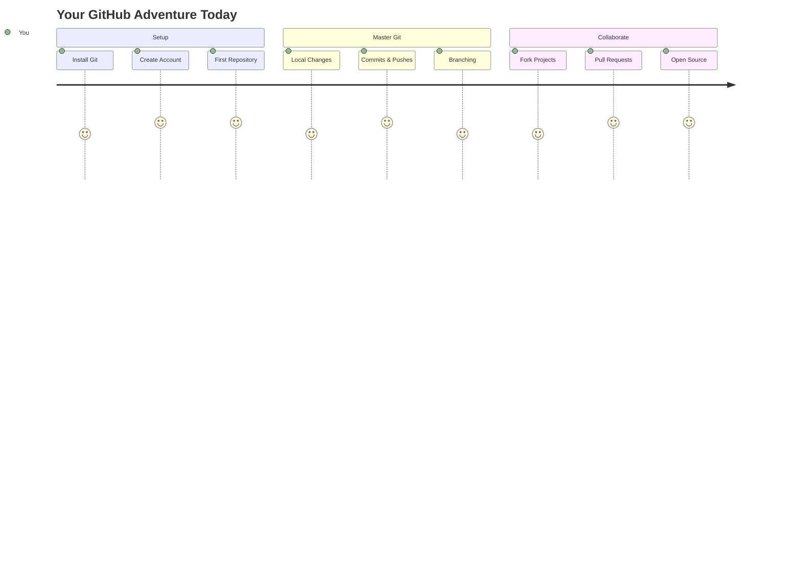
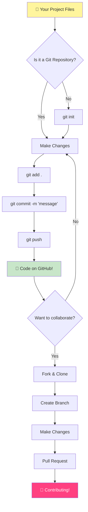
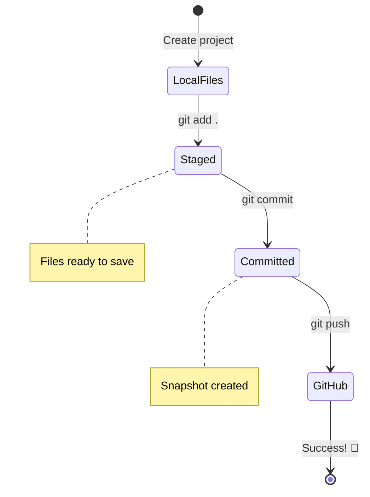
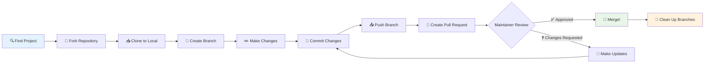
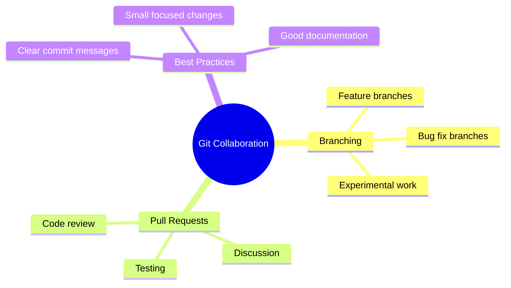
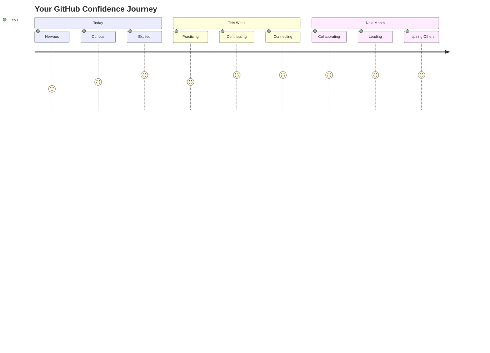

<!--
CO_OP_TRANSLATOR_METADATA:
{
  "original_hash": "0fe3ff66299b447f1c8cb34dcbf0c5ef",
  "translation_date": "2025-11-03T13:04:55+00:00",
  "source_file": "1-getting-started-lessons/2-github-basics/README.md",
  "language_code": "ur"
}
-->
# GitHub کا تعارف

ہیلو، مستقبل کے ڈویلپر! 👋 کیا آپ دنیا بھر کے لاکھوں کوڈرز کے ساتھ شامل ہونے کے لیے تیار ہیں؟ میں واقعی پرجوش ہوں کہ آپ کو GitHub سے متعارف کراؤں – اسے پروگرامرز کے لیے سوشل میڈیا پلیٹ فارم سمجھیں، لیکن یہاں لنچ کی تصاویر شیئر کرنے کے بجائے، ہم کوڈ شیئر کرتے ہیں اور حیرت انگیز چیزیں مل کر بناتے ہیں!

یہ بات واقعی حیران کن ہے: آپ کے فون پر موجود ہر ایپ، ہر ویب سائٹ جسے آپ وزٹ کرتے ہیں، اور زیادہ تر ٹولز جنہیں آپ استعمال کرنا سیکھیں گے، وہ ڈویلپرز کی ٹیموں نے GitHub جیسے پلیٹ فارمز پر تعاون کرتے ہوئے بنائے ہیں۔ وہ میوزک ایپ جسے آپ پسند کرتے ہیں؟ کوئی آپ جیسا شخص اس میں حصہ ڈال چکا ہے۔ وہ گیم جسے آپ چھوڑ نہیں سکتے؟ ہاں، شاید GitHub کے تعاون سے بنایا گیا۔ اور اب آپ اس حیرت انگیز کمیونٹی کا حصہ بننا سیکھنے والے ہیں!

مجھے معلوم ہے کہ شروع میں یہ سب کچھ بہت زیادہ لگ سکتا ہے – مجھے یاد ہے کہ میں نے اپنی پہلی GitHub پیج کو دیکھتے ہوئے سوچا تھا "یہ سب کچھ کیا مطلب رکھتا ہے؟" لیکن بات یہ ہے: ہر ایک ڈویلپر بالکل وہیں سے شروع کرتا ہے جہاں آپ ابھی ہیں۔ اس سبق کے اختتام تک، آپ کے پاس اپنا ذاتی GitHub ریپوزیٹری ہوگا (اسے کلاؤڈ میں آپ کے ذاتی پروجیکٹ شوکیس کے طور پر سمجھیں)، اور آپ جان جائیں گے کہ اپنا کام کیسے محفوظ کریں، دوسروں کے ساتھ کیسے شیئر کریں، اور ان پروجیکٹس میں کیسے حصہ ڈالیں جنہیں لاکھوں لوگ استعمال کرتے ہیں۔

ہم یہ سفر ایک ساتھ کریں گے، ایک قدم بہ قدم۔ کوئی جلد بازی نہیں، کوئی دباؤ نہیں – بس آپ، میں، اور کچھ واقعی زبردست ٹولز جو آپ کے نئے بہترین دوست بننے والے ہیں!


> اسکیچ نوٹ [Tomomi Imura](https://twitter.com/girlie_mac) کی طرف سے



## پری لیکچر کوئز
[پری لیکچر کوئز](https://ff-quizzes.netlify.app)

## تعارف

اس سے پہلے کہ ہم واقعی دلچسپ چیزوں میں غوطہ لگائیں، آئیے آپ کے کمپیوٹر کو کچھ GitHub جادو کے لیے تیار کریں! اسے ایک شاہکار بنانے سے پہلے اپنے آرٹ سپلائیز کو منظم کرنے جیسا سمجھیں – صحیح ٹولز تیار ہونے سے سب کچھ زیادہ آسان اور بہت زیادہ مزے دار ہو جاتا ہے۔

میں آپ کو ہر سیٹ اپ مرحلے سے ذاتی طور پر گزاروں گا، اور میں وعدہ کرتا ہوں کہ یہ اتنا خوفناک نہیں ہے جتنا کہ یہ پہلی نظر میں لگ سکتا ہے۔ اگر کچھ فوری طور پر سمجھ میں نہ آئے، تو یہ بالکل معمول کی بات ہے! مجھے یاد ہے کہ میں نے اپنا پہلا ڈیولپمنٹ ماحول سیٹ کرتے ہوئے محسوس کیا تھا کہ جیسے میں قدیم ہائروگلیفس پڑھنے کی کوشش کر رہا ہوں۔ ہر ایک ڈویلپر بالکل وہیں رہا ہے جہاں آپ ابھی ہیں، یہ سوچتے ہوئے کہ آیا وہ صحیح کر رہے ہیں۔ اسپوئلر الرٹ: اگر آپ یہاں سیکھ رہے ہیں، تو آپ پہلے ہی صحیح کر رہے ہیں! 🌟

اس سبق میں، ہم کور کریں گے:

- آپ کے مشین پر کیے گئے کام کو ٹریک کرنا
- دوسروں کے ساتھ پروجیکٹس پر کام کرنا
- اوپن سورس سافٹ ویئر میں حصہ ڈالنا

### ضروریات

آئیے آپ کے کمپیوٹر کو کچھ GitHub جادو کے لیے تیار کریں! فکر نہ کریں – یہ سیٹ اپ آپ کو صرف ایک بار کرنا ہوگا، اور پھر آپ اپنی پوری کوڈنگ سفر کے لیے تیار ہوں گے۔

ٹھیک ہے، آئیے بنیاد سے شروع کریں! سب سے پہلے، ہمیں یہ چیک کرنا ہوگا کہ آیا Git پہلے سے ہی آپ کے کمپیوٹر پر موجود ہے۔ Git بنیادی طور پر ایک سپر اسمارٹ اسسٹنٹ کی طرح ہے جو آپ کے کوڈ میں کی گئی ہر تبدیلی کو یاد رکھتا ہے – ہر دو سیکنڈ میں Ctrl+S کو فرینٹکلی دبانے سے کہیں بہتر (ہم سب وہاں رہے ہیں!)۔

آئیے دیکھتے ہیں کہ آیا Git پہلے سے انسٹال ہے، اس جادوئی کمانڈ کو اپنے ٹرمینل میں ٹائپ کریں:
`git --version`

اگر Git ابھی تک موجود نہیں ہے، تو کوئی مسئلہ نہیں! بس [Git ڈاؤنلوڈ کریں](https://git-scm.com/downloads) پر جائیں اور اسے حاصل کریں۔ ایک بار جب آپ نے اسے انسٹال کر لیا، ہمیں Git کو آپ سے صحیح طریقے سے متعارف کرانا ہوگا:

> 💡 **پہلی بار سیٹ اپ**: یہ کمانڈز Git کو بتاتے ہیں کہ آپ کون ہیں۔ یہ معلومات آپ کے ہر کمیٹ کے ساتھ منسلک ہوگی، لہذا ایک نام اور ای میل منتخب کریں جسے آپ عوامی طور پر شیئر کرنے میں آرام دہ ہوں۔

```bash
git config --global user.name "your-name"
git config --global user.email "your-email"
```

یہ چیک کرنے کے لیے کہ آیا Git پہلے سے کنفیگرڈ ہے، آپ ٹائپ کر سکتے ہیں:
```bash
git config --list
```

آپ کو ایک GitHub اکاؤنٹ، ایک کوڈ ایڈیٹر (جیسے Visual Studio Code)، اور اپنا ٹرمینل (یا: کمانڈ پرامپٹ) کھولنے کی ضرورت ہوگی۔

[github.com](https://github.com/) پر جائیں اور اگر آپ نے پہلے سے اکاؤنٹ نہیں بنایا ہے تو ایک اکاؤنٹ بنائیں، یا لاگ ان کریں اور اپنی پروفائل مکمل کریں۔

💡 **جدید مشورہ**: [SSH keys](https://docs.github.com/en/authentication/connecting-to-github-with-ssh) سیٹ اپ کرنے یا [GitHub CLI](https://cli.github.com/) استعمال کرنے پر غور کریں تاکہ پاس ورڈز کے بغیر آسان تصدیق ہو سکے۔

✅ GitHub دنیا میں واحد کوڈ ریپوزیٹری نہیں ہے؛ دیگر بھی ہیں، لیکن GitHub سب سے زیادہ مشہور ہے۔

### تیاری

آپ کو اپنے لوکل مشین (لیپ ٹاپ یا پی سی) پر کوڈ پروجیکٹ کے ساتھ ایک فولڈر اور GitHub پر ایک پبلک ریپوزیٹری کی ضرورت ہوگی، جو دوسروں کے پروجیکٹس میں حصہ ڈالنے کے لیے ایک مثال کے طور پر کام کرے گا۔

### اپنے کوڈ کو محفوظ رکھنا

آئیے سیکیورٹی کے بارے میں ایک لمحے کے لیے بات کرتے ہیں – لیکن فکر نہ کریں، ہم آپ کو خوفزدہ کرنے والے چیزوں سے مغلوب نہیں کریں گے! ان سیکیورٹی طریقوں کو اپنی گاڑی یا اپنے گھر کو لاک کرنے جیسا سمجھیں۔ یہ آسان عادات ہیں جو فطری بن جاتی ہیں اور آپ کے محنت کو محفوظ رکھتی ہیں۔

ہم آپ کو شروع سے ہی GitHub کے ساتھ کام کرنے کے جدید، محفوظ طریقے دکھائیں گے۔ اس طرح، آپ اچھے عادات پیدا کریں گے جو آپ کے کوڈنگ کیریئر کے دوران آپ کے لیے فائدہ مند ہوں گے۔

GitHub کے ساتھ کام کرتے وقت، سیکیورٹی کے بہترین طریقوں پر عمل کرنا ضروری ہے:

| سیکیورٹی ایریا | بہترین طریقہ | اس کی اہمیت |
|---------------|---------------|----------------|
| **تصدیق** | SSH keys یا Personal Access Tokens استعمال کریں | پاس ورڈز کم محفوظ ہیں اور ختم کیے جا رہے ہیں |
| **ٹو فیکٹر تصدیق** | اپنے GitHub اکاؤنٹ پر 2FA فعال کریں | اکاؤنٹ کی حفاظت کی اضافی تہہ شامل کرتا ہے |
| **ریپوزیٹری سیکیورٹی** | حساس معلومات کبھی بھی کمیٹ نہ کریں | API keys اور پاس ورڈز کو کبھی بھی پبلک ریپوز میں نہیں ہونا چاہیے |
| **ڈیپینڈنسی مینجمنٹ** | Dependabot کو اپڈیٹس کے لیے فعال کریں | آپ کے ڈیپینڈنسیز کو محفوظ اور اپ ٹو ڈیٹ رکھتا ہے |

> ⚠️ **اہم سیکیورٹی یاد دہانی**: API keys، پاس ورڈز، یا دیگر حساس معلومات کو کسی بھی ریپوزیٹری میں کبھی بھی کمیٹ نہ کریں۔ حساس ڈیٹا کی حفاظت کے لیے environment variables اور `.gitignore` فائلز استعمال کریں۔

**جدید تصدیق سیٹ اپ:**

```bash
# Generate SSH key (modern ed25519 algorithm)
ssh-keygen -t ed25519 -C "your_email@example.com"

# Set up Git to use SSH
git remote set-url origin git@github.com:username/repository.git
```

> 💡 **پرو مشورہ**: SSH keys پاس ورڈز کو بار بار داخل کرنے کی ضرورت کو ختم کرتے ہیں اور روایتی تصدیق کے طریقوں سے زیادہ محفوظ ہیں۔

---

## اپنے کوڈ کو پروفیشنل انداز میں منظم کرنا

ٹھیک ہے، یہ وہ جگہ ہے جہاں چیزیں واقعی دلچسپ ہو جاتی ہیں! 🎉 ہم یہ سیکھنے والے ہیں کہ اپنے کوڈ کو پروفیشنلز کی طرح کیسے ٹریک اور منظم کریں، اور ایمانداری سے، یہ میری پسندیدہ چیزوں میں سے ایک ہے کیونکہ یہ واقعی ایک گیم چینجر ہے۔

تصور کریں: آپ ایک حیرت انگیز کہانی لکھ رہے ہیں، اور آپ ہر ڈرافٹ، ہر شاندار ایڈیٹ، اور ہر "انتظار کریں، یہ تو زبردست ہے!" لمحے کو ٹریک کرنا چاہتے ہیں۔ یہی کام Git آپ کے کوڈ کے لیے کرتا ہے! یہ ایسا ہے جیسے آپ کے پاس سب سے حیرت انگیز وقت سفر کرنے والی نوٹ بک ہو جو سب کچھ یاد رکھتی ہے – ہر کی اسٹروک، ہر تبدیلی، ہر "اوہ، یہ سب کچھ خراب ہو گیا" لمحہ جسے آپ فوری طور پر واپس لے سکتے ہیں۔

میں ایمانداری سے کہوں تو – شروع میں یہ سب کچھ بہت زیادہ لگ سکتا ہے۔ جب میں نے شروع کیا، تو میں نے سوچا "میں اپنی فائلز کو نارمل طریقے سے کیوں محفوظ نہیں کر سکتا؟" لیکن مجھ پر بھروسہ کریں: ایک بار جب Git آپ کے لیے کلک کرے گا (اور یہ کرے گا!)، تو آپ کے پاس وہ لمحہ ہوگا جب آپ سوچیں گے "میں نے بغیر اس کے کبھی کوڈنگ کیسے کی؟" یہ ایسا ہے جیسے آپ نے اڑنا دریافت کیا ہو جب آپ اپنی پوری زندگی پیدل چل رہے تھے!

فرض کریں کہ آپ کے پاس لوکل طور پر ایک فولڈر ہے جس میں کچھ کوڈ پروجیکٹ ہے اور آپ git – ورژن کنٹرول سسٹم – کا استعمال کرتے ہوئے اپنی پیش رفت کو ٹریک کرنا چاہتے ہیں۔ کچھ لوگ git استعمال کرنے کو اپنے مستقبل کے خود کے لیے محبت کا خط لکھنے کے مترادف قرار دیتے ہیں۔ اپنے کمیٹ میسیجز کو دنوں، ہفتوں یا مہینوں بعد پڑھتے ہوئے آپ کو یاد آئے گا کہ آپ نے کوئی فیصلہ کیوں کیا، یا کسی تبدیلی کو "رول بیک" کریں گے – یعنی، جب آپ اچھے "کمیٹ میسیجز" لکھتے ہیں۔



### کام: اپنی پہلی ریپوزیٹری بنائیں!

> 🎯 **آپ کا مشن (اور میں آپ کے لیے بہت پرجوش ہوں!)**: ہم آپ کے ساتھ مل کر آپ کی پہلی GitHub ریپوزیٹری بنائیں گے! جب ہم یہاں ختم کریں گے، تو آپ کے پاس انٹرنیٹ کا اپنا چھوٹا سا گوشہ ہوگا جہاں آپ کا کوڈ موجود ہوگا، اور آپ نے اپنا پہلا "کمیٹ" کیا ہوگا (یہ ڈویلپر زبان میں اپنے کام کو واقعی ہوشیار طریقے سے محفوظ کرنے کے لیے کہا جاتا ہے)۔
>
> یہ واقعی ایک خاص لمحہ ہے – آپ عالمی ڈویلپرز کی کمیونٹی میں باضابطہ طور پر شامل ہونے والے ہیں! مجھے اب بھی یاد ہے کہ اپنی پہلی ریپو بنانے کا جوش اور یہ سوچنا "واہ، میں واقعی یہ کر رہا ہوں!"

آئیے اس مہم جوئی کو ایک ساتھ، قدم بہ قدم چلتے ہیں۔ ہر حصے کے ساتھ اپنا وقت لیں – جلدی کرنے کا کوئی انعام نہیں ہے، اور میں وعدہ کرتا ہوں کہ ہر ایک قدم سمجھ میں آئے گا۔ یاد رکھیں، ہر کوڈنگ سپر اسٹار جس کی آپ تعریف کرتے ہیں، ایک بار بالکل وہیں بیٹھا تھا جہاں آپ ہیں، اپنی پہلی ریپوزیٹری بنانے کے لیے تیار۔ یہ کتنا زبردست ہے؟

> ویڈیو دیکھیں
> 
> [](https://www.youtube.com/watch?v=9R31OUPpxU4)

**آئیے یہ ایک ساتھ کریں:**

1. **GitHub پر اپنی ریپوزیٹری بنائیں**۔ GitHub.com پر جائیں اور وہ روشن سبز **نیا** بٹن (یا اوپر دائیں کونے میں **+** نشان) تلاش کریں۔ اس پر کلک کریں اور **نئی ریپوزیٹری** منتخب کریں۔

   یہاں کیا کرنا ہے:
   1. اپنی ریپوزیٹری کو ایک نام دیں – اسے اپنے لیے معنی خیز بنائیں!
   1. اگر آپ چاہیں تو ایک وضاحت شامل کریں (یہ دوسروں کو بتانے میں مدد کرتا ہے کہ آپ کا پروجیکٹ کس بارے میں ہے)
   1. فیصلہ کریں کہ آپ اسے عوامی (سب کے لیے قابل دید) یا نجی (صرف آپ کے لیے) بنانا چاہتے ہیں
   1. میں تجویز کرتا ہوں کہ README فائل شامل کرنے کے لیے باکس کو چیک کریں – یہ آپ کے پروجیکٹ کا فرنٹ پیج جیسا ہے
   1. **ریپوزیٹری بنائیں** پر کلک کریں اور جشن منائیں – آپ نے اپنی پہلی ریپو بنائی! 🎉

2. **اپنے پروجیکٹ فولڈر پر جائیں**۔ اب آئیے اپنا ٹرمینل کھولیں (فکر نہ کریں، یہ اتنا خوفناک نہیں ہے جتنا کہ یہ لگتا ہے!)۔ ہمیں اپنے کمپیوٹر کو بتانا ہوگا کہ ہمارے پروجیکٹ فائلز کہاں ہیں۔ یہ کمانڈ ٹائپ کریں:

   ```bash
   cd [name of your folder]
   ```

   **ہم یہاں کیا کر رہے ہیں:**
   - ہم بنیادی طور پر کہہ رہے ہیں "ہی کمپیوٹر، مجھے میرے پروجیکٹ فولڈر پر لے چلو"
   - یہ آپ کے ڈیسک ٹاپ پر ایک مخصوص فولڈر کھولنے جیسا ہے، لیکن ہم یہ ٹیکسٹ کمانڈز کے ساتھ کر رہے ہیں
   - `[آپ کے فولڈر کا نام]` کو اپنے پروجیکٹ فولڈر کے اصل نام سے تبدیل کریں

3. **اپنے فولڈر کو Git ریپوزیٹری میں تبدیل کریں**۔ یہ وہ جگہ ہے جہاں جادو ہوتا ہے! ٹائپ کریں:

   ```bash
   git init
   ```

   **یہاں کیا ہوا (واقعی زبردست چیزیں!):**
   - Git نے آپ کے پروجیکٹ میں ایک چھپا ہوا `.git` فولڈر بنایا – آپ اسے نہیں دیکھیں گے، لیکن یہ وہاں ہے!
   - آپ کا عام فولڈر اب ایک "ریپوزیٹری" ہے جو آپ کی کی گئی ہر تبدیلی کو ٹریک کر سکتا ہے
   - اسے ایسا سمجھیں جیسے آپ کے فولڈر کو سب کچھ یاد رکھنے کی سپر پاورز دینا

4. **چیک کریں کہ کیا ہو رہا ہے**۔ آئیے دیکھتے ہیں کہ Git آپ کے پروجیکٹ کے بارے میں ابھی کیا سوچتا ہے:

   ```bash
   git status
   ```

   **سمجھنا کہ Git آپ کو کیا بتا رہا ہے:**
   
   آپ کو کچھ ایسا نظر آ سکتا ہے:

   ```output
   Changes not staged for commit:
   (use "git add <file>..." to update what will be committed)
   (use "git restore <file>..." to discard changes in working directory)

        modified:   file.txt
        modified:   file2.txt
   ```

   **پریشان نہ ہوں! اس کا مطلب یہ ہے:**
   - **سرخ** میں فائلز وہ ہیں جن میں تبدیلیاں ہیں لیکن وہ ابھی محفوظ کرنے کے لیے تیار نہیں ہیں
   - **سبز** میں فائلز (جب آپ انہیں دیکھیں گے) محفوظ کرنے کے لیے تیار ہیں
   - Git آپ کی مدد کر رہا ہے، بالکل بتا کر کہ آپ اگلے کیا کر سکتے ہیں

   > 💡 **پرو مشورہ**: `git status` کمانڈ آپ کا بہترین دوست ہے! جب بھی آپ الجھن میں ہوں کہ کیا ہو رہا ہے، اسے استعمال کریں۔ یہ ایسا ہے جیسے Git سے پوچھنا "ہی، ابھی کیا صورتحال ہے؟"

5. **اپنی فائلز کو محفوظ کرنے کے لیے تیار کریں** (اسے "اسٹیجنگ" کہا جاتا ہے):

   ```bash
   git add .
   ```

   **ہم نے ابھی کیا کیا:**
   - ہم نے Git کو بتایا "ہی، میں اپنی تمام فائلز کو اگلے محفوظ کرنے میں شامل کرنا چاہتا ہوں"
   - `.` ایسا ہے جیسے کہہ رہے ہوں "اس فولڈر میں سب کچھ"
   - اب آپ کی فائلز "اسٹیجڈ" ہیں اور اگلے مرحلے کے لیے تیار ہیں

   **زیادہ منتخب ہونا چاہتے ہیں؟** آپ صرف مخصوص فائلز شامل کر سکتے ہیں:

   ```bash
   git add [file or folder name]
   ```

   **آپ ایسا کیوں کرنا چاہیں گے؟**
   - کبھی کبھی آپ متعلقہ تبدیلیوں کو ایک ساتھ محفوظ کرنا چاہتے ہیں
   - یہ آپ کے کام کو منطقی حصوں میں منظم کرنے میں مدد کرتا ہے
   - یہ سمجھنا آسان بناتا ہے کہ کیا بدلا اور کب

   **اپنا ارادہ بدل لیا؟** کوئی مسئلہ نہیں! آپ فائلز کو اسٹیج سے باہر نکال سکتے ہیں:

   ```bash
   # Unstage everything
   git reset
   
   # Unstage just one file
   git reset [file name]
   ```

   فکر نہ کریں – یہ آپ کے کام کو حذف نہیں کرتا، یہ صرف فائلز کو "محفوظ کرنے کے لیے تیار" ڈھیر سے نکالتا ہے۔

6. **اپنے کام کو مستقل طور پر محفوظ کریں** (اپنا پہلا کمیٹ بنانا!):

   ```bash
   git commit -m "first commit"
   ```

   **🎉 مبارک ہو! آپ نے اپنا پہلا کمیٹ بنایا!**
   
   **یہاں کیا ہوا:**
   - Git نے اس لمحے پر آپ کی تمام اسٹیجڈ فائلز کا "اسنیپ شاٹ" لیا
   - آپ کا کمیٹ میسیج "پہلا کمیٹ" بتاتا ہے کہ یہ محفوظ کرنے کا پوائنٹ کس بارے میں ہے
   - Git نے اس اسنیپ شاٹ کو ایک منفرد ID دیا تاکہ آپ اسے ہمیشہ بعد میں تلاش کر سکیں
   - آپ نے باضابطہ طور پر اپنے پروجیکٹ کی تاریخ کو ٹریک کرنا شروع کر دیا ہے!

   > 💡 **مستقبل کے کمیٹ میسیجز**: اپنے اگلے کمیٹس کے لیے، زیادہ وضاحت کریں! "اپ ڈیٹڈ اسٹف" کے بجائے، "ہوم پیج پر کانٹیکٹ فارم شامل کریں" یا "نیویگیشن مینو بگ کو ٹھیک کریں" آزمائیں۔ آپ کا مستقبل کا خود آپ کا
**ہم نے ابھی کیا کیا:**
- ہم نے آپ کے مقامی پروجیکٹ اور آپ کے GitHub ریپوزٹری کے درمیان ایک کنکشن بنایا۔
- "Origin" آپ کے GitHub ریپوزٹری کا ایک عرفی نام ہے – یہ بالکل ایسے ہے جیسے آپ اپنے فون میں کسی کا کانٹیکٹ ایڈ کریں۔
- اب آپ کا مقامی Git جانتا ہے کہ آپ کا کوڈ کہاں بھیجنا ہے جب آپ اسے شیئر کرنے کے لیے تیار ہوں۔

💡 **آسان طریقہ**: اگر آپ کے پاس GitHub CLI انسٹال ہے، تو آپ یہ ایک کمانڈ میں کر سکتے ہیں:
   ```bash
   gh repo create my-repo --public --push --source=.
   ```

8. **اپنا کوڈ GitHub پر بھیجیں** (یہ بڑا لمحہ ہے!):

   ```bash
   git push -u origin main
   ```

**🚀 یہ وہی ہے! آپ اپنا کوڈ GitHub پر اپلوڈ کر رہے ہیں!**

**کیا ہو رہا ہے:**
- آپ کے commits آپ کے کمپیوٹر سے GitHub کی طرف جا رہے ہیں۔
- `-u` فلیگ ایک مستقل کنکشن سیٹ کرتا ہے تاکہ آئندہ کے pushes آسان ہوں۔
- "main" آپ کی پرائمری برانچ کا نام ہے (جیسے مرکزی فولڈر)۔
- اس کے بعد، آپ صرف `git push` لکھ سکتے ہیں آئندہ اپلوڈز کے لیے!

💡 **ایک چھوٹا نوٹ**: اگر آپ کی برانچ کا نام کچھ اور ہے (جیسے "master")، تو وہ نام استعمال کریں۔ آپ `git branch --show-current` کے ذریعے چیک کر سکتے ہیں۔

9. **آپ کا نیا روزمرہ کوڈنگ کا معمول** (یہ وہ جگہ ہے جہاں یہ عادت بن جاتی ہے!):

اب سے، جب بھی آپ اپنے پروجیکٹ میں تبدیلیاں کریں گے، آپ کے پاس یہ آسان تین قدمی عمل ہوگا:

   ```bash
   git add .
   git commit -m "describe what you changed"
   git push
   ```

**یہ آپ کی کوڈنگ کی دھڑکن بن جاتی ہے:**
- اپنے کوڈ میں کچھ زبردست تبدیلیاں کریں ✨
- انہیں `git add` کے ساتھ اسٹیج کریں ("ارے Git، ان تبدیلیوں پر توجہ دو!")
- انہیں `git commit` اور ایک وضاحتی پیغام کے ساتھ محفوظ کریں (مستقبل کا آپ آپ کا شکر گزار ہوگا!)
- انہیں دنیا کے ساتھ شیئر کریں `git push` کے ذریعے 🚀
- دہرائیں اور جاری رکھیں – واقعی، یہ سانس لینے جتنا قدرتی بن جاتا ہے!

مجھے یہ ورک فلو پسند ہے کیونکہ یہ ویڈیو گیم میں متعدد سیو پوائنٹس رکھنے جیسا ہے۔ کوئی تبدیلی کی جو آپ کو پسند آئی؟ Commit کریں! کچھ خطرناک آزمانا چاہتے ہیں؟ کوئی مسئلہ نہیں – اگر چیزیں خراب ہو جائیں تو آپ ہمیشہ اپنے آخری commit پر واپس جا سکتے ہیں!

> 💡 **ٹپ**: آپ ایک `.gitignore` فائل اپنانا بھی چاہیں گے تاکہ وہ فائلز جو آپ ٹریک نہیں کرنا چاہتے GitHub پر ظاہر نہ ہوں – جیسے وہ نوٹس فائل جو آپ اسی فولڈر میں رکھتے ہیں لیکن اس کا عوامی ریپوزٹری میں کوئی کام نہیں۔ آپ `.gitignore` فائلز کے ٹیمپلیٹس [.gitignore templates](https://github.com/github/gitignore) پر یا [gitignore.io](https://www.toptal.com/developers/gitignore) کے ذریعے بنا سکتے ہیں۔

### 🧠 **پہلا ریپوزٹری چیک ان: کیسا لگا؟**

**ایک لمحہ نکالیں اور جشن منائیں:**
- آپ کا کوڈ پہلی بار GitHub پر دیکھ کر کیسا لگا؟
- کون سا قدم سب سے زیادہ الجھا ہوا لگا، اور کون سا حیرت انگیز طور پر آسان لگا؟
- کیا آپ اپنے الفاظ میں `git add`, `git commit`, اور `git push` کے فرق کی وضاحت کر سکتے ہیں؟



> **یاد رکھیں**: یہاں تک کہ تجربہ کار ڈویلپرز بھی کبھی کبھار صحیح کمانڈز بھول جاتے ہیں۔ اس ورک فلو کو عادت بنانے میں وقت لگتا ہے – آپ بہت اچھا کر رہے ہیں!

#### جدید Git ورک فلو

ان جدید طریقوں کو اپنانے پر غور کریں:

- **Conventional Commits**: ایک معیاری commit میسج فارمیٹ استعمال کریں جیسے `feat:`, `fix:`, `docs:` وغیرہ۔ مزید جانیں [conventionalcommits.org](https://www.conventionalcommits.org/) پر۔
- **Atomic commits**: ہر commit کو ایک منطقی تبدیلی کی نمائندگی کرنے دیں۔
- **Frequent commits**: بڑے، کم وقفے والے commits کے بجائے اکثر اور وضاحتی پیغامات کے ساتھ commit کریں۔

#### Commit میسجز

ایک بہترین Git commit سبجیکٹ لائن درج ذیل جملے کو مکمل کرتی ہے:
اگر لاگو کیا گیا، تو یہ commit <آپ کی سبجیکٹ لائن یہاں> کرے گا۔

سبجیکٹ کے لیے imperative، present tense استعمال کریں: "change" نہ کہ "changed" یا "changes"۔ 
جیسے کہ سبجیکٹ میں، باڈی (اختیاری) میں بھی imperative، present tense استعمال کریں۔ باڈی میں تبدیلی کی وجہ شامل کریں اور اسے پچھلے رویے کے ساتھ موازنہ کریں۔ آپ `کیوں` کی وضاحت کر رہے ہیں، `کیسے` کی نہیں۔

✅ چند منٹ نکال کر GitHub پر گھومیں۔ کیا آپ کو کوئی واقعی زبردست commit میسج ملتا ہے؟ کیا آپ کو کوئی بہت ہی مختصر میسج ملتا ہے؟ آپ کے خیال میں commit میسج میں کون سی معلومات سب سے زیادہ اہم اور مفید ہیں؟

## دوسروں کے ساتھ کام کرنا (مزے کا حصہ!)

اپنی ٹوپی تھام لیں کیونکہ یہ وہ جگہ ہے جہاں GitHub بالکل جادوئی بن جاتا ہے! 🪄 آپ نے اپنے کوڈ کو منظم کرنے میں مہارت حاصل کر لی ہے، لیکن اب ہم میرے بالکل پسندیدہ حصے میں جا رہے ہیں – دنیا بھر کے حیرت انگیز لوگوں کے ساتھ تعاون کرنا۔

یہ تصور کریں: آپ کل صبح اٹھتے ہیں اور دیکھتے ہیں کہ ٹوکیو میں کسی نے آپ کے کوڈ کو بہتر بنایا ہے جب آپ سو رہے تھے۔ پھر برلن میں کسی نے ایک بگ ٹھیک کیا جس پر آپ پھنسے ہوئے تھے۔ دوپہر تک، ساؤ پالو میں ایک ڈویلپر نے ایک ایسا فیچر شامل کیا جس کے بارے میں آپ نے کبھی سوچا بھی نہیں تھا۔ یہ سائنس فکشن نہیں ہے – یہ صرف GitHub کی دنیا میں ایک عام دن ہے!

جو چیز مجھے واقعی پرجوش کرتی ہے وہ یہ ہے کہ آپ جو تعاون کی مہارتیں سیکھنے والے ہیں؟ یہ وہی ورک فلو ہیں جو گوگل، مائیکروسافٹ، اور آپ کے پسندیدہ اسٹارٹ اپس کی ٹیمیں ہر روز استعمال کرتی ہیں۔ آپ صرف ایک زبردست ٹول نہیں سیکھ رہے – آپ وہ خفیہ زبان سیکھ رہے ہیں جو پورے سافٹ ویئر کی دنیا کو ایک ساتھ کام کرنے کے قابل بناتی ہے۔

سچ میں، جب آپ کو کوئی آپ کی پہلی pull request merge کرتا ہے تو آپ کو جو جوش محسوس ہوتا ہے، آپ سمجھ جائیں گے کہ ڈویلپرز اوپن سورس کے بارے میں اتنے پرجوش کیوں ہوتے ہیں۔ یہ دنیا کے سب سے بڑے، سب سے تخلیقی ٹیم پروجیکٹ کا حصہ بننے جیسا ہے!

> ویڈیو دیکھیں
>
> [](https://www.youtube.com/watch?v=bFCM-PC3cu8)

GitHub پر چیزیں ڈالنے کی بنیادی وجہ یہ تھی کہ دوسرے ڈویلپرز کے ساتھ تعاون ممکن ہو۔



اپنے ریپوزٹری میں، `Insights > Community` پر جائیں تاکہ دیکھ سکیں کہ آپ کا پروجیکٹ تجویز کردہ کمیونٹی معیارات کے ساتھ کیسے موازنہ کرتا ہے۔

اپنے ریپوزٹری کو پیشہ ورانہ اور خوش آمدید کہنے والا بنانا چاہتے ہیں؟ اپنے ریپوزٹری پر جائیں اور `Insights > Community` پر کلک کریں۔ یہ زبردست فیچر آپ کو دکھاتا ہے کہ آپ کا پروجیکٹ GitHub کمیونٹی کے "اچھے ریپوزٹری کے طریقوں" کے ساتھ کیسے موازنہ کرتا ہے۔

> 🎯 **اپنے پروجیکٹ کو چمکائیں**: ایک اچھی طرح سے منظم ریپوزٹری جس میں اچھی دستاویزات ہوں، ایک صاف، خوش آمدید کہنے والے اسٹور فرنٹ کی طرح ہے۔ یہ لوگوں کو بتاتا ہے کہ آپ اپنے کام کی پرواہ کرتے ہیں اور دوسروں کو تعاون کرنے کی ترغیب دیتا ہے!

**ایک زبردست ریپوزٹری کو کیا چیز بناتی ہے:**

| کیا شامل کریں | کیوں یہ اہم ہے | آپ کے لیے کیا کرتا ہے |
|-------------|-------------------|---------------------|
| **تفصیل** | پہلا تاثر اہم ہے! | لوگ فوراً جان لیتے ہیں کہ آپ کا پروجیکٹ کیا کرتا ہے |
| **README** | آپ کے پروجیکٹ کا فرنٹ پیج | نئے وزیٹرز کے لیے ایک دوستانہ گائیڈ کی طرح |
| **Contributing Guidelines** | دکھاتا ہے کہ آپ مدد کا خیر مقدم کرتے ہیں | لوگ جانتے ہیں کہ وہ آپ کی کیسے مدد کر سکتے ہیں |
| **Code of Conduct** | ایک دوستانہ جگہ بناتا ہے | ہر کوئی شرکت کے لیے خوش آمدید محسوس کرتا ہے |
| **License** | قانونی وضاحت | دوسرے جانتے ہیں کہ وہ آپ کے کوڈ کو کیسے استعمال کر سکتے ہیں |
| **Security Policy** | دکھاتا ہے کہ آپ ذمہ دار ہیں | پیشہ ورانہ طریقوں کا مظاہرہ کرتا ہے |

> 💡 **پرو ٹپ**: GitHub ان تمام فائلز کے لیے ٹیمپلیٹس فراہم کرتا ہے۔ ایک نیا ریپوزٹری بناتے وقت، ان فائلز کو خودکار طور پر بنانے کے لیے چیک باکسز کو منتخب کریں۔

**جدید GitHub فیچرز کو دریافت کریں:**

🤖 **آٹومیشن اور CI/CD:**
- **GitHub Actions** خودکار ٹیسٹنگ اور ڈپلائمنٹ کے لیے
- **Dependabot** خودکار dependency اپڈیٹس کے لیے

💬 **کمیونٹی اور پروجیکٹ مینجمنٹ:**
- **GitHub Discussions** کمیونٹی گفتگو کے لیے جو issues سے آگے ہو
- **GitHub Projects** kanban-style پروجیکٹ مینجمنٹ کے لیے
- **Branch protection rules** کوڈ کے معیار کے معیارات کو نافذ کرنے کے لیے

یہ تمام وسائل نئے ٹیم ممبرز کو آن بورڈ کرنے میں مدد دیں گے۔ اور یہ وہی چیزیں ہیں جنہیں نئے کنٹریبیوٹرز آپ کے کوڈ کو دیکھنے سے پہلے دیکھتے ہیں تاکہ یہ معلوم ہو سکے کہ آیا آپ کا پروجیکٹ ان کے وقت کے قابل ہے۔

✅ README فائلز، حالانکہ انہیں تیار کرنے میں وقت لگتا ہے، اکثر مصروف مینٹینرز نظر انداز کر دیتے ہیں۔ کیا آپ کسی خاص طور پر وضاحتی مثال تلاش کر سکتے ہیں؟ نوٹ: کچھ [اوزار جو اچھی README بنانے میں مدد کرتے ہیں](https://www.makeareadme.com/) آپ آزما سکتے ہیں۔

### کام: کچھ کوڈ merge کریں

Contributing docs لوگوں کو پروجیکٹ میں تعاون کرنے میں مدد دیتے ہیں۔ یہ وضاحت کرتا ہے کہ آپ کس قسم کے تعاون کی تلاش میں ہیں اور عمل کیسے کام کرتا ہے۔ کنٹریبیوٹرز کو آپ کے GitHub ریپوزٹری میں تعاون کرنے کے قابل ہونے کے لیے کئی مراحل سے گزرنا ہوگا:

1. **آپ کے ریپوزٹری کو فورک کرنا**۔ آپ شاید چاہیں گے کہ لوگ آپ کے پروجیکٹ کو _fork_ کریں۔ فورک کرنے کا مطلب ہے کہ آپ کے ریپوزٹری کی ایک نقل ان کے GitHub پروفائل پر بنائی جائے۔
1. **کلون کریں**۔ اس کے بعد وہ پروجیکٹ کو اپنی مقامی مشین پر کلون کریں گے۔
1. **ایک برانچ بنائیں**۔ آپ چاہیں گے کہ وہ اپنے کام کے لیے ایک _برانچ_ بنائیں۔
1. **اپنی تبدیلی کو ایک علاقے پر مرکوز کریں**۔ کنٹریبیوٹرز سے کہیں کہ وہ اپنی شراکت کو ایک وقت میں ایک چیز پر مرکوز کریں – اس طرح ان کے کام کو _merge_ کرنے کے امکانات زیادہ ہیں۔ تصور کریں کہ وہ ایک بگ ٹھیک کرتے ہیں، ایک نیا فیچر شامل کرتے ہیں، اور کئی ٹیسٹس اپڈیٹ کرتے ہیں – کیا ہوگا اگر آپ 3 میں سے 2 یا 1 میں سے 1 تبدیلی کو لاگو کرنا چاہتے ہیں یا کر سکتے ہیں؟

✅ ایک ایسی صورتحال کا تصور کریں جہاں برانچز خاص طور پر اچھا کوڈ لکھنے اور بھیجنے کے لیے اہم ہوں۔ آپ کون سے استعمال کے کیسز کے بارے میں سوچ سکتے ہیں؟

> نوٹ کریں، وہ تبدیلی بنیں جو آپ دنیا میں دیکھنا چاہتے ہیں، اور اپنے کام کے لیے برانچز بنائیں۔ آپ جو بھی commits کریں گے وہ اس برانچ پر ہوں گے جس پر آپ اس وقت "چیک آؤٹ" ہیں۔ `git status` استعمال کریں یہ دیکھنے کے لیے کہ وہ کون سی برانچ ہے۔

آئیے ایک کنٹریبیوٹر ورک فلو سے گزرتے ہیں۔ فرض کریں کہ کنٹریبیوٹر نے پہلے ہی ریپوزٹری کو _fork_ اور _clone_ کر لیا ہے تاکہ ان کے پاس ایک Git ریپوزٹری ہو جس پر وہ اپنی مقامی مشین پر کام کر سکیں:

1. **ایک برانچ بنائیں**۔ کمانڈ `git branch` کا استعمال کریں ایک برانچ بنانے کے لیے جو ان تبدیلیوں پر مشتمل ہوگی جو وہ تعاون کے لیے دینا چاہتے ہیں:

   ```bash
   git branch [branch-name]
   ```

   > 💡 **جدید طریقہ**: آپ ایک کمانڈ میں نئی برانچ بنا سکتے ہیں اور اس پر سوئچ کر سکتے ہیں:
   ```bash
   git switch -c [branch-name]
   ```

1. **کام کرنے والی برانچ پر سوئچ کریں**۔ مخصوص برانچ پر سوئچ کریں اور `git switch` کے ساتھ ورکنگ ڈائریکٹری کو اپڈیٹ کریں:

   ```bash
   git switch [branch-name]
   ```

   > 💡 **جدید نوٹ**: `git switch` برانچز تبدیل کرنے کے لیے `git checkout` کا جدید متبادل ہے۔ یہ زیادہ واضح اور ابتدائیوں کے لیے محفوظ ہے۔

1. **کام کریں**۔ اس مقام پر آپ اپنی تبدیلیاں شامل کرنا چاہتے ہیں۔ یہ نہ بھولیں کہ Git کو اس کے بارے میں بتائیں درج ذیل کمانڈز کے ساتھ:

   ```bash
   git add .
   git commit -m "my changes"
   ```

   > ⚠️ **Commit میسج کا معیار**: یقینی بنائیں کہ آپ اپنے commit کو ایک اچھا نام دیں، اپنے لیے اور اس ریپوزٹری کے مینٹینر کے لیے جس پر آپ مدد کر رہے ہیں۔ خاص طور پر بتائیں کہ آپ نے کیا تبدیل کیا!

1. **اپنے کام کو `main` برانچ کے ساتھ ملائیں**۔ کسی وقت آپ کام مکمل کر لیتے ہیں اور آپ اپنے کام کو `main` برانچ کے ساتھ ملانا چاہتے ہیں۔ اس دوران `main` برانچ میں تبدیلی ہو سکتی ہے، اس لیے پہلے اسے درج ذیل کمانڈز کے ساتھ تازہ ترین کریں:

   ```bash
   git switch main
   git pull
   ```

   اس مقام پر آپ یہ یقینی بنانا چاہتے ہیں کہ کوئی بھی _conflicts_، ایسی صورتحال جہاں Git آسانی سے _combine_ نہیں کر سکتا، آپ کی ورکنگ برانچ میں ہو۔ اس لیے درج ذیل کمانڈز چلائیں:

   ```bash
   git switch [branch_name]
   git merge main
   ```

   `git merge main` کمانڈ `main` سے تمام تبدیلیاں آپ کی برانچ میں لے آئے گی۔ امید ہے کہ آپ بس جاری رکھ سکتے ہیں۔ اگر نہیں، تو VS Code آپ کو بتائے گا کہ Git کہاں _confused_ ہے اور آپ متاثرہ فائلز کو تبدیل کر کے بتا سکتے ہیں کہ کون سا مواد زیادہ درست ہے۔

   💡 **جدید متبادل**: ایک صاف ستھری ہسٹری کے لیے `git rebase` استعمال کرنے پر غور کریں:
   ```bash
   git rebase main
   ```
   یہ آپ کے commits کو تازہ ترین main برانچ کے اوپر دوبارہ چلاتا ہے، ایک لکیری ہسٹری بناتا ہے۔

1. **اپنا کام GitHub پر بھیجیں**۔ اپنا کام GitHub پر بھیجنے کا مطلب دو چیزیں ہیں۔ اپنی برانچ کو اپنی فورکڈ ریپوزٹری پر بھیجنا اور پھر ایک PR، Pull Request کھولنا۔

   ```bash
   git push --set-upstream origin [branch-name]
   ```

   اوپر دی گئی کمانڈ آپ کی فورکڈ ریپوزٹری پر برانچ بناتی ہے۔

### 🤝 **تعاون کی مہارتوں کی جانچ: کیا آپ دوسروں کے ساتھ کام کرنے کے لیے تیار ہیں؟**

**آئیے دیکھتے ہیں کہ آپ تعاون کے بارے میں کیسا محسوس کر رہے ہیں:**
- کیا آپ کو فورکنگ اور pull requests کا تصور اب سمجھ آتا ہے؟
- برانچز کے ساتھ کام کرنے کے بارے میں آپ کس چیز پر مزید مشق کرنا چاہتے ہیں؟
- آپ کسی اور کے پروجیکٹ میں تعاون کرنے کے بارے میں کتنا آرام دہ محسوس کرتے ہیں؟



> **اعتماد بڑھانے والا**: ہر وہ ڈویلپر جس کی آپ تعریف کرتے ہیں، کبھی نہ کبھی اپنی پہلی pull request کے بارے میں نروس تھا۔ GitHub کمیونٹی نئے آنے والوں کو انتہائی خوش آمدید کہتی ہے!

1. **ایک PR کھولیں**۔ اگلا، آپ ایک PR کھولنا چاہتے ہیں۔ آپ یہ GitHub پر فورکڈ ریپوزٹری پر جا کر کرتے ہیں۔ آپ کو GitHub پر ایک اشارہ نظر آئے گا جہاں وہ پوچھے گا کہ کیا آپ ایک نیا PR بنانا چاہتے ہیں، آپ اس پر کلک کریں گے اور آپ کو ایک انٹرفیس پر لے جایا جائے گا جہاں آپ commit میسج کا عنوان تبدیل کر سکتے ہیں، اسے ایک زیادہ موزوں وضاحت دے سکتے ہیں۔ اب جس ریپوزٹری کے مینٹینر کو آپ نے فورک کیا ہے وہ اس PR کو دیکھے گا اور _انگلیاں کراس کریں_ وہ اس PR کو سراہیں گے اور _merge_ کریں گے۔ آپ اب ایک کنٹریبیوٹر ہیں، واہ :)

   💡 **جدید ٹپ**: آپ GitHub CLI کا استعمال کرتے ہوئے بھی PRs بنا سکتے ہیں:
   ```bash
   gh pr create --title "Your PR title" --body "Description of changes"
   ```

   🔧 **PRs کے لیے بہترین طریقے**:
   - متعلقہ issues کو "Fixes #123" جیسے کلیدی الفاظ کے ساتھ لنک کریں۔
   - UI تبدیلیوں کے لیے اسکرین شا
1. **صفائی کریں**۔ یہ ایک اچھی عادت سمجھی جاتی ہے کہ جب آپ کامیابی سے ایک PR کو مرج کر لیں تو اس کے بعد صفائی کریں۔ آپ کو اپنی لوکل برانچ اور وہ برانچ جو آپ نے GitHub پر پش کی تھی، دونوں کو صاف کرنا ہوگا۔ پہلے اسے لوکل طور پر ڈیلیٹ کریں، اس کمانڈ کے ذریعے:

   ```bash
   git branch -d [branch-name]
   ```
  
پھر GitHub پر جائیں اور فورک کیے گئے ریپو کی ریموٹ برانچ کو بھی ہٹا دیں جسے آپ نے ابھی پش کیا تھا۔

`Pull request` ایک عجیب سا لفظ لگتا ہے کیونکہ حقیقت میں آپ اپنی تبدیلیاں پروجیکٹ میں پش کرنا چاہتے ہیں۔ لیکن مینٹینر (پروجیکٹ کے مالک) یا کور ٹیم کو آپ کی تبدیلیوں پر غور کرنا ہوتا ہے اس سے پہلے کہ وہ پروجیکٹ کی "مین" برانچ کے ساتھ مرج کریں، اس لیے آپ حقیقت میں مینٹینر سے تبدیلی کی منظوری کی درخواست کر رہے ہوتے ہیں۔

ایک pull request وہ جگہ ہے جہاں آپ برانچ میں کی گئی تبدیلیوں کا موازنہ اور بحث کر سکتے ہیں، ریویوز، کمنٹس، انٹیگریٹڈ ٹیسٹس، اور مزید کے ساتھ۔ ایک اچھا pull request تقریباً انہی اصولوں پر عمل کرتا ہے جو ایک commit میسج کے لیے ہوتے ہیں۔ آپ کسی مسئلے کے ٹریکر میں ایک مسئلے کا حوالہ دے سکتے ہیں، مثلاً جب آپ کا کام کسی مسئلے کو حل کرتا ہے۔ یہ `#` کے ساتھ اور آپ کے مسئلے کے نمبر کے ساتھ کیا جاتا ہے۔ مثال کے طور پر `#97`۔

🤞امید ہے کہ تمام چیکس پاس ہو جائیں اور پروجیکٹ کے مالک آپ کی تبدیلیوں کو پروجیکٹ میں مرج کر دیں🤞

اپنی موجودہ لوکل ورکنگ برانچ کو GitHub پر موجود متعلقہ ریموٹ برانچ سے تمام نئے commits کے ساتھ اپڈیٹ کریں:

`git pull`

## اوپن سورس میں تعاون (آپ کا موقع کچھ خاص کرنے کا!)

کیا آپ کچھ ایسا کرنے کے لیے تیار ہیں جو آپ کے دماغ کو حیران کر دے؟ 🤯 آئیے بات کرتے ہیں اوپن سورس پروجیکٹس میں تعاون کے بارے میں – اور میں یہ آپ کے ساتھ شیئر کرنے کے بارے میں سوچ کر ہی پرجوش ہو رہا ہوں!

یہ آپ کا موقع ہے کہ آپ کسی واقعی غیر معمولی چیز کا حصہ بنیں۔ تصور کریں کہ ان ٹولز کو بہتر بنائیں جو لاکھوں ڈویلپرز روزانہ استعمال کرتے ہیں، یا کسی ایسی ایپ میں بگ کو ٹھیک کریں جو آپ کے دوست پسند کرتے ہیں۔ یہ صرف ایک خواب نہیں – یہی اوپن سورس تعاون کا مطلب ہے!

یہی وہ چیز ہے جو مجھے ہر بار جوش دلاتی ہے: ہر وہ ٹول جس کے ساتھ آپ سیکھ رہے ہیں – آپ کا کوڈ ایڈیٹر، وہ فریم ورک جنہیں ہم دریافت کریں گے، یہاں تک کہ وہ براؤزر جس میں آپ یہ پڑھ رہے ہیں – کسی نے اپنی پہلی شراکت کے ساتھ شروع کیا تھا۔ وہ شاندار ڈویلپر جس نے آپ کا پسندیدہ VS Code ایکسٹینشن بنایا؟ وہ بھی کبھی ایک مبتدی تھے جو "create pull request" پر کانپتے ہاتھوں کے ساتھ کلک کر رہے تھے، بالکل ویسے جیسے آپ کرنے والے ہیں۔

اور سب سے خوبصورت بات یہ ہے: اوپن سورس کمیونٹی انٹرنیٹ کا سب سے بڑا گروپ ہگ کی طرح ہے۔ زیادہ تر پروجیکٹس نئے آنے والوں کی تلاش میں ہوتے ہیں اور ان کے لیے "good first issue" کے ٹیگ والے مسائل ہوتے ہیں! مینٹینرز واقعی پرجوش ہوتے ہیں جب وہ نئے تعاون کرنے والوں کو دیکھتے ہیں کیونکہ وہ اپنے پہلے قدموں کو یاد کرتے ہیں۔

```mermaid
flowchart TD
    A[🔍 Explore GitHub] --> B[🏷️ Find "good first issue"]
    B --> C[📖 Read Contributing Guidelines]
    C --> D[🍴 Fork Repository]
    D --> E[💻 Set Up Local Environment]
    E --> F[🌿 Create Feature Branch]
    F --> G[✨ Make Your Contribution]
    G --> H[🧪 Test Your Changes]
    H --> I[📝 Write Clear Commit]
    I --> J[📤 Push & Create PR]
    J --> K[💬 Engage with Feedback]
    K --> L[🎉 Merged! You're a Contributor!]
    L --> M[🌟 Find Next Issue]
    
    style A fill:#e1f5fe
    style L fill:#c8e6c9
    style M fill:#fff59d
```
  
آپ یہاں صرف کوڈنگ نہیں سیکھ رہے – آپ ایک عالمی خاندان میں شامل ہونے کی تیاری کر رہے ہیں جو ہر روز یہ سوچتا ہے "ہم ڈیجیٹل دنیا کو تھوڑا بہتر کیسے بنا سکتے ہیں؟" کلب میں خوش آمدید! 🌟

پہلے، آئیے GitHub پر ایک ریپوزٹری (یا **ریپو**) تلاش کریں جو آپ کے لیے دلچسپ ہو اور جس میں آپ کوئی تبدیلی شامل کرنا چاہتے ہوں۔ آپ اس کے مواد کو اپنی مشین پر کاپی کرنا چاہیں گے۔

✅ 'beginner-friendly' ریپوزٹریز تلاش کرنے کا ایک اچھا طریقہ یہ ہے کہ [tag 'good-first-issue' کے ذریعے تلاش کریں](https://github.blog/2020-01-22-browse-good-first-issues-to-start-contributing-to-open-source/)۔


کوڈ کاپی کرنے کے کئی طریقے ہیں۔ ایک طریقہ یہ ہے کہ ریپوزٹری کے مواد کو "کلون" کریں، HTTPS، SSH، یا GitHub CLI (کمانڈ لائن انٹرفیس) کا استعمال کرتے ہوئے۔

اپنا ٹرمینل کھولیں اور ریپوزٹری کو اس طرح کلون کریں:
```bash
# Using HTTPS
git clone https://github.com/ProjectURL

# Using SSH (requires SSH key setup)
git clone git@github.com:username/repository.git

# Using GitHub CLI
gh repo clone username/repository
```
  
پروجیکٹ پر کام کرنے کے لیے، صحیح فولڈر میں جائیں:
`cd ProjectURL`

آپ پورے پروجیکٹ کو اس طرح بھی کھول سکتے ہیں:
- **[GitHub Codespaces](https://github.com/features/codespaces)** - GitHub کا کلاؤڈ ڈیولپمنٹ ماحول، براؤزر میں VS Code کے ساتھ
- **[GitHub Desktop](https://desktop.github.com/)** - Git آپریشنز کے لیے GUI ایپلیکیشن  
- **[GitHub.dev](https://github.dev)** - کسی بھی GitHub ریپو پر `.` کی کلید دبائیں تاکہ براؤزر میں VS Code کھل جائے
- **VS Code** GitHub Pull Requests ایکسٹینشن کے ساتھ

آخر میں، آپ کوڈ کو زپ فولڈر میں ڈاؤن لوڈ بھی کر سکتے ہیں۔

### GitHub کے بارے میں کچھ مزید دلچسپ باتیں

آپ GitHub پر کسی بھی پبلک ریپوزٹری کو اسٹار، واچ، اور/یا "فورک" کر سکتے ہیں۔ آپ اپنی اسٹار کردہ ریپوزٹریز کو اوپر دائیں ڈراپ ڈاؤن مینو میں دیکھ سکتے ہیں۔ یہ بک مارکنگ کی طرح ہے، لیکن کوڈ کے لیے۔

پروجیکٹس کے پاس ایک مسئلہ ٹریکر ہوتا ہے، زیادہ تر GitHub پر "Issues" ٹیب میں جب تک کہ دوسری صورت میں اشارہ نہ کیا جائے، جہاں لوگ پروجیکٹ سے متعلق مسائل پر بات کرتے ہیں۔ اور Pull Requests ٹیب وہ جگہ ہے جہاں لوگ جاری تبدیلیوں پر بات کرتے ہیں اور ان کا جائزہ لیتے ہیں۔

پروجیکٹس میں فورمز، میلنگ لسٹس، یا چیٹ چینلز جیسے Slack، Discord یا IRC میں بھی گفتگو ہو سکتی ہے۔

🔧 **جدید GitHub خصوصیات**:
- **GitHub Discussions** - کمیونٹی گفتگو کے لیے بلٹ ان فورم
- **GitHub Sponsors** - مینٹینرز کو مالی طور پر سپورٹ کریں  
- **Security tab** - کمزوریوں کی رپورٹس اور سیکیورٹی ایڈوائزریز
- **Actions tab** - خودکار ورک فلو اور CI/CD پائپ لائنز دیکھیں
- **Insights tab** - تعاون کرنے والوں، کمیٹس، اور پروجیکٹ کی صحت کے بارے میں تجزیات
- **Projects tab** - GitHub کے بلٹ ان پروجیکٹ مینجمنٹ ٹولز

✅ اپنے نئے GitHub ریپو کے ارد گرد دیکھیں اور کچھ چیزیں آزمائیں، جیسے سیٹنگز میں ترمیم کرنا، اپنے ریپو میں معلومات شامل کرنا، ایک پروجیکٹ بنانا (جیسے Kanban بورڈ)، اور آٹومیشن کے لیے GitHub Actions سیٹ اپ کرنا۔ آپ بہت کچھ کر سکتے ہیں!

---

## 🚀 چیلنج

ٹھیک ہے، اب وقت آ گیا ہے کہ آپ اپنی نئی چمکتی ہوئی GitHub سپر پاورز کو آزمائیں! 🚀 یہاں ایک چیلنج ہے جو سب کچھ انتہائی اطمینان بخش طریقے سے واضح کر دے گا:

ایک دوست (یا وہ فیملی ممبر جو ہمیشہ پوچھتا ہے کہ آپ "کمپیوٹر چیزوں" کے ساتھ کیا کر رہے ہیں) کو پکڑیں اور ایک مشترکہ کوڈنگ ایڈونچر پر نکلیں! یہی وہ جگہ ہے جہاں حقیقی جادو ہوتا ہے – ایک پروجیکٹ بنائیں، انہیں فورک کرنے دیں، کچھ برانچز بنائیں، اور پروفیشنل کی طرح تبدیلیاں مرج کریں۔

میں جھوٹ نہیں بولوں گا – آپ شاید کسی وقت ہنسیں گے (خاص طور پر جب آپ دونوں ایک ہی لائن کو تبدیل کرنے کی کوشش کریں گے)، شاید الجھن میں سر کھجائیں، لیکن آپ کو وہ حیرت انگیز "آہا!" لمحات ضرور ملیں گے جو تمام سیکھنے کو قابل قدر بناتے ہیں۔ اس کے علاوہ، کسی اور کے ساتھ پہلی کامیاب مرج کا اشتراک کرنے میں کچھ خاص بات ہے – یہ اس بات کا ایک چھوٹا سا جشن ہے کہ آپ کتنی دور آ چکے ہیں!

ابھی تک کوئی کوڈنگ ساتھی نہیں ہے؟ کوئی مسئلہ نہیں! GitHub کمیونٹی ناقابل یقین حد تک خوش آمدید کہنے والے لوگوں سے بھری ہوئی ہے جو یاد کرتے ہیں کہ نیا ہونا کیسا محسوس ہوتا ہے۔ "good first issue" لیبل والے ریپوزٹریز تلاش کریں – وہ بنیادی طور پر کہہ رہے ہیں "ارے مبتدیوں، ہمارے ساتھ سیکھیں!" یہ کتنا زبردست ہے؟

## پوسٹ لیکچر کوئز
[پوسٹ لیکچر کوئز](https://ff-quizzes.netlify.app/web/en/)

## جائزہ اور مزید سیکھنا

واہ! 🎉 دیکھیں آپ – آپ نے ابھی GitHub کی بنیادی باتوں کو ایک مکمل چیمپئن کی طرح فتح کر لیا ہے! اگر آپ کا دماغ ابھی تھوڑا بھرا ہوا محسوس ہو رہا ہے، تو یہ بالکل معمول کی بات ہے اور ایمانداری سے ایک اچھا اشارہ ہے۔ آپ نے ابھی وہ ٹولز سیکھے ہیں جنہیں سمجھنے میں مجھے شروع میں ہفتے لگے۔

Git اور GitHub ناقابل یقین حد تک طاقتور ہیں (جیسے، واقعی طاقتور)، اور ہر وہ ڈویلپر جسے میں جانتا ہوں – بشمول وہ جو اب جادوگر لگتے ہیں – کو اس سب کو سمجھنے سے پہلے مشق اور تھوڑی سی جدوجہد کرنی پڑی۔ اس سبق کو مکمل کرنے کا مطلب ہے کہ آپ پہلے ہی ان سب سے اہم ٹولز میں مہارت حاصل کرنے کے راستے پر ہیں جو ایک ڈویلپر کے ٹول کٹ میں ہوتے ہیں۔

یہاں کچھ شاندار وسائل ہیں جو آپ کو مشق کرنے اور مزید شاندار بننے میں مدد کریں گے:

- [اوپن سورس سافٹ ویئر میں تعاون کرنے کی گائیڈ](https://opensource.guide/how-to-contribute/#how-to-submit-a-contribution) – فرق پیدا کرنے کا آپ کا روڈ میپ
- [Git چیٹ شیٹ](https://training.github.com/downloads/github-git-cheat-sheet/) – فوری حوالہ کے لیے یہ اپنے پاس رکھیں!

اور یاد رکھیں: مشق ترقی لاتی ہے، کامل نہیں! جتنا زیادہ آپ Git اور GitHub کا استعمال کریں گے، یہ اتنا ہی قدرتی ہو جائے گا۔ GitHub نے کچھ حیرت انگیز انٹرایکٹو کورسز بنائے ہیں جو آپ کو محفوظ ماحول میں مشق کرنے دیتے ہیں:

- [GitHub کا تعارف](https://github.com/skills/introduction-to-github)
- [مارک ڈاؤن کا استعمال کرتے ہوئے بات چیت کریں](https://github.com/skills/communicate-using-markdown)  
- [GitHub پیجز](https://github.com/skills/github-pages)
- [مرج تنازعات کا انتظام](https://github.com/skills/resolve-merge-conflicts)

**ایڈونچر کے لیے تیار؟ ان جدید ٹولز کو دیکھیں:**
- [GitHub CLI دستاویزات](https://cli.github.com/manual/) – جب آپ کمانڈ لائن جادوگر کی طرح محسوس کرنا چاہتے ہیں
- [GitHub Codespaces دستاویزات](https://docs.github.com/en/codespaces) – کلاؤڈ میں کوڈ کریں!
- [GitHub Actions دستاویزات](https://docs.github.com/en/actions) – سب کچھ خودکار بنائیں
- [Git بہترین طریقے](https://www.atlassian.com/git/tutorials/comparing-workflows) – اپنے ورک فلو گیم کو بہتر بنائیں 

## GitHub Copilot ایجنٹ چیلنج 🚀

ایجنٹ موڈ کا استعمال کرتے ہوئے درج ذیل چیلنج مکمل کریں:

**تفصیل:** ایک مشترکہ ویب ڈیولپمنٹ پروجیکٹ بنائیں جو مکمل GitHub ورک فلو کو ظاہر کرے جو آپ نے اس سبق میں سیکھا ہے۔ یہ چیلنج آپ کو ریپوزٹری تخلیق، تعاون کی خصوصیات، اور حقیقی دنیا کے منظرنامے میں جدید Git ورک فلو کی مشق کرنے میں مدد کرے گا۔

**پرومپٹ:** ایک نیا پبلک GitHub ریپوزٹری بنائیں جو ایک سادہ "ویب ڈیولپمنٹ ریسورسز" پروجیکٹ کے لیے ہو۔ ریپوزٹری میں ایک اچھی طرح سے منظم README.md فائل شامل ہونی چاہیے جس میں مفید ویب ڈیولپمنٹ ٹولز اور وسائل کی فہرست ہو، جو زمرہ جات (HTML, CSS, JavaScript, وغیرہ) کے مطابق ترتیب دی گئی ہو۔ ریپوزٹری کو مناسب کمیونٹی معیارات کے ساتھ سیٹ کریں جن میں لائسنس، تعاون کے رہنما اصول، اور ضابطہ اخلاق شامل ہوں۔ کم از کم دو فیچر برانچز بنائیں: ایک CSS وسائل شامل کرنے کے لیے اور دوسری JavaScript وسائل کے لیے۔ ہر برانچ میں وضاحتی commit میسجز کے ساتھ commits کریں، پھر تبدیلیوں کو main میں مرج کرنے کے لیے pull requests بنائیں۔ GitHub کی خصوصیات جیسے Issues، Discussions کو فعال کریں اور خودکار چیکس کے لیے ایک بنیادی GitHub Actions ورک فلو سیٹ کریں۔

## اسائنمنٹ 

آپ کا مشن، اگر آپ اسے قبول کرنے کا انتخاب کرتے ہیں: GitHub Skills پر [Introduction to GitHub](https://github.com/skills/introduction-to-github) کورس مکمل کریں۔ یہ انٹرایکٹو کورس آپ کو ہر وہ چیز مشق کرنے دے گا جو آپ نے ایک محفوظ، گائیڈڈ ماحول میں سیکھی ہے۔ اس کے علاوہ، آپ کو ختم کرنے پر ایک زبردست بیج ملے گا! 🏅

**مزید چیلنجز کے لیے تیار ہیں؟**
- اپنے GitHub اکاؤنٹ کے لیے SSH تصدیق سیٹ کریں (پاس ورڈ کی ضرورت نہیں!)
- اپنی روزمرہ کی Git آپریشنز کے لیے GitHub CLI کا استعمال کرنے کی کوشش کریں
- ایک ریپوزٹری بنائیں جس میں GitHub Actions ورک فلو ہو
- GitHub Codespaces کو دریافت کریں اور اس ریپوزٹری کو کلاؤڈ بیسڈ ایڈیٹر میں کھولیں

---

## 🚀 آپ کی GitHub مہارت کا ٹائم لائن

### ⚡ **اگلے 5 منٹ میں آپ کیا کر سکتے ہیں**
- [ ] اس ریپوزٹری اور 3 دیگر پروجیکٹس کو اسٹار کریں جو آپ کو دلچسپ لگیں
- [ ] اپنے GitHub اکاؤنٹ پر دو فیکٹر تصدیق سیٹ کریں
- [ ] اپنے پہلے ریپوزٹری کے لیے ایک سادہ README بنائیں
- [ ] 5 ڈویلپرز کو فالو کریں جن کا کام آپ کو متاثر کرتا ہے

### 🎯 **اس گھنٹے میں آپ کیا حاصل کر سکتے ہیں**
- [ ] پوسٹ لیکچر کوئز مکمل کریں اور اپنے GitHub سفر پر غور کریں
- [ ] GitHub تصدیق کے لیے SSH کیز سیٹ کریں
- [ ] ایک بہترین commit میسج کے ساتھ اپنی پہلی معنی خیز commit بنائیں
- [ ] GitHub کے "Explore" ٹیب کو دریافت کریں تاکہ ٹرینڈنگ پروجیکٹس کو دریافت کریں
- [ ] ایک ریپوزٹری کو فورک کرنے اور ایک چھوٹی سی تبدیلی کرنے کی مشق کریں

### 📅 **آپ کی ہفتہ بھر کی GitHub مہم جوئی**
- [ ] GitHub Skills کورسز مکمل کریں (Introduction to GitHub, Markdown)
- [ ] کسی اوپن سورس پروجیکٹ میں اپنی پہلی pull request کریں
- [ ] اپنے کام کو دکھانے کے لیے ایک GitHub Pages سائٹ سیٹ کریں
- [ ] ان پروجیکٹس پر GitHub Discussions میں شامل ہوں جن میں آپ دلچسپی رکھتے ہیں
- [ ] ایک ریپوزٹری بنائیں جس میں مناسب کمیونٹی معیارات ہوں (README, License, وغیرہ)
- [ ] کلاؤڈ بیسڈ ڈیولپمنٹ کے لیے GitHub Codespaces آزمائیں

### 🌟 **آپ کی ماہ بھر کی تبدیلی**
- [ ] 3 مختلف اوپن سورس پروجیکٹس میں تعاون کریں
- [ ] کسی نئے GitHub صارف کو رہنمائی فراہم کریں (آگے بڑھائیں!)
- [ ] GitHub Actions کے ساتھ خودکار ورک فلو سیٹ کریں
- [ ] اپنے GitHub تعاون کو ظاہر کرنے کے لیے ایک پورٹ فولیو بنائیں
- [ ] Hacktoberfest یا اسی طرح کے کمیونٹی ایونٹس میں حصہ لیں
- [ ] اپنے پروجیکٹ کے مینٹینر بنیں جس میں دوسرے تعاون کریں

### 🎓 **حتمی GitHub مہارت چیک ان**

**یہ جشن منائیں کہ آپ کتنی دور آ چکے ہیں:**
- GitHub استعمال کرنے کے بارے میں آپ کی پسندیدہ چیز کیا ہے؟
- کون سی تعاون کی خصوصیت آپ کو سب سے زیادہ پرجوش کرتی ہے؟
- اوپن سورس میں تعاون کرنے کے بارے میں آپ کتنا پراعتماد محسوس کرتے ہیں؟
- آپ کس پہلے پروجیکٹ میں تعاون کرنا چاہتے ہیں؟


  
> 🌍 **عالمی ڈویلپر کمیونٹی میں خوش آمدید!** اب آپ کے پاس وہ ٹولز ہیں جن کے ذریعے آپ دنیا بھر کے لاکھوں ڈویلپرز کے ساتھ تعاون کر سکتے ہیں۔ آپ کی پہلی شراکت شاید چھوٹی لگے، لیکن یاد رکھیں - ہر بڑا اوپن سورس پروجیکٹ کسی کے پہلے commit سے شروع ہوا تھا۔ سوال یہ نہیں ہے کہ آپ اثر ڈالیں گے یا نہیں، بلکہ یہ ہے کہ آپ کے منفرد نقطہ نظر سے کون سا حیرت انگیز پروجیکٹ سب سے پہلے فائدہ اٹھائے گا! 🚀

یاد رکھیں: ہر ماہر کبھی مبتدی تھا۔ آپ یہ کر سکتے ہیں! 💪

---

**اعلانِ لاتعلقی**:  
یہ دستاویز AI ترجمہ سروس [Co-op Translator](https://github.com/Azure/co-op-translator) کا استعمال کرتے ہوئے ترجمہ کی گئی ہے۔ ہم درستگی کی بھرپور کوشش کرتے ہیں، لیکن براہ کرم آگاہ رہیں کہ خودکار ترجمے میں غلطیاں یا عدم درستگی ہو سکتی ہے۔ اصل دستاویز کو اس کی اصل زبان میں مستند ذریعہ سمجھا جانا چاہیے۔ اہم معلومات کے لیے، پیشہ ور انسانی ترجمہ کی سفارش کی جاتی ہے۔ اس ترجمے کے استعمال سے پیدا ہونے والی کسی بھی غلط فہمی یا غلط تشریح کے لیے ہم ذمہ دار نہیں ہیں۔