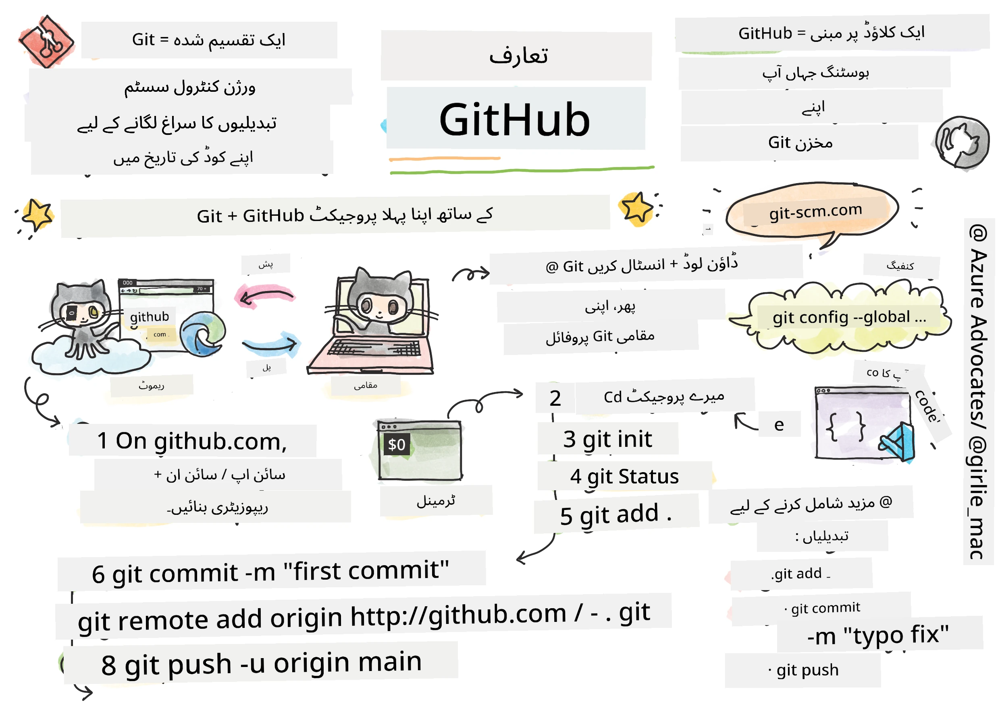
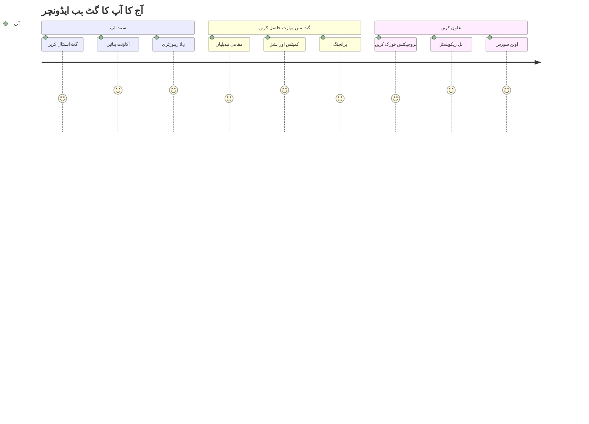
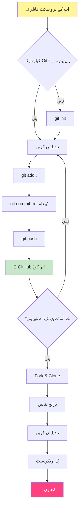
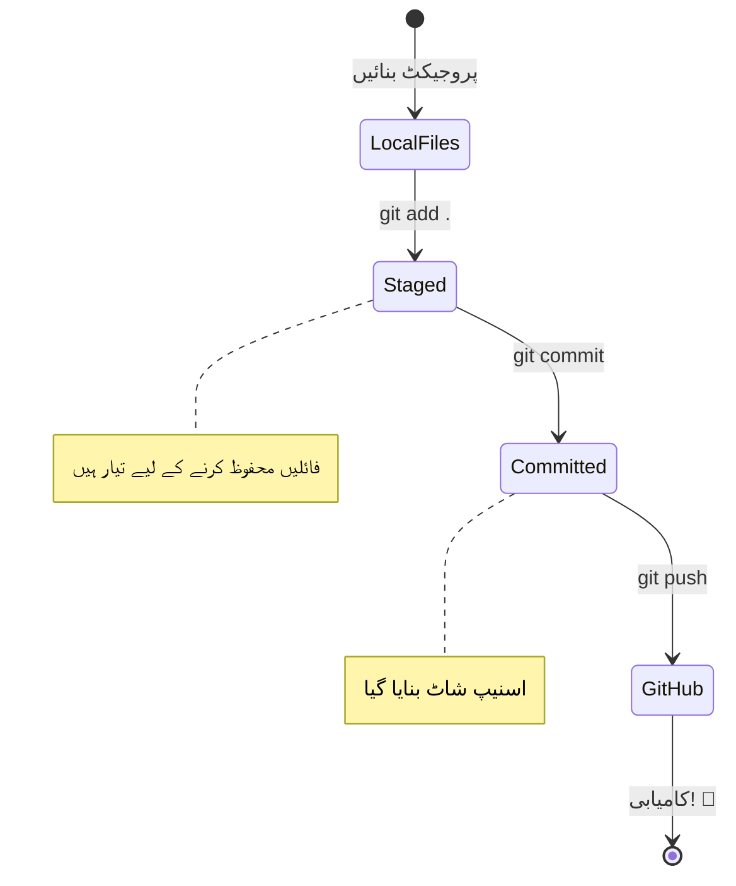
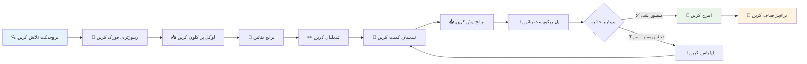
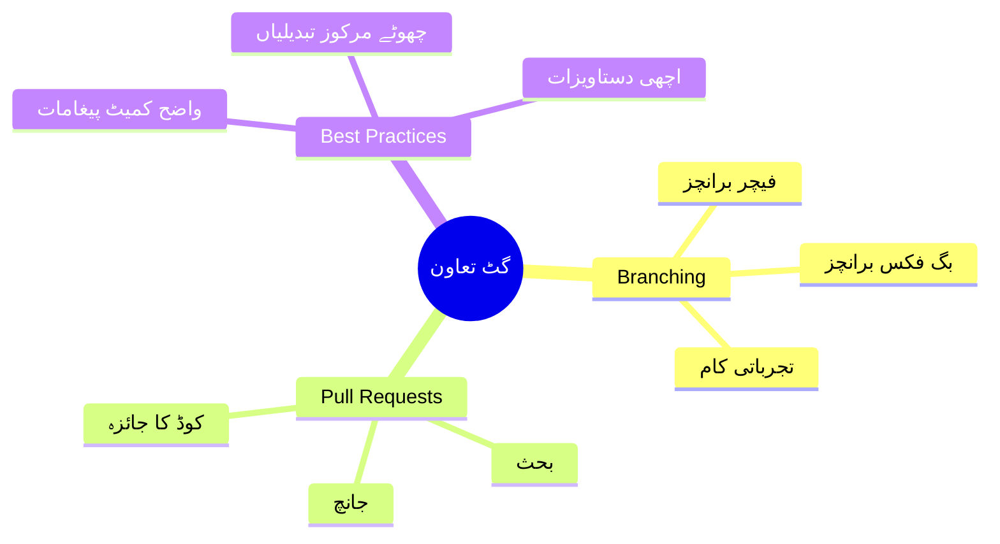
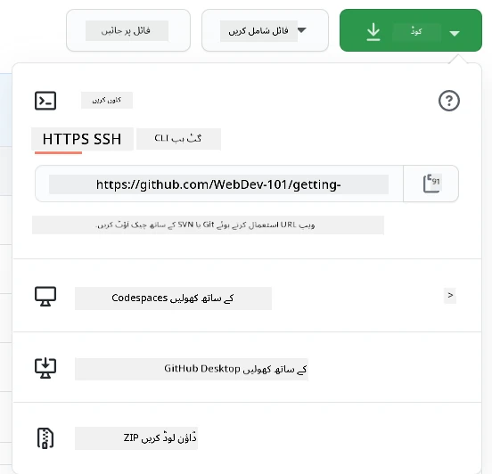
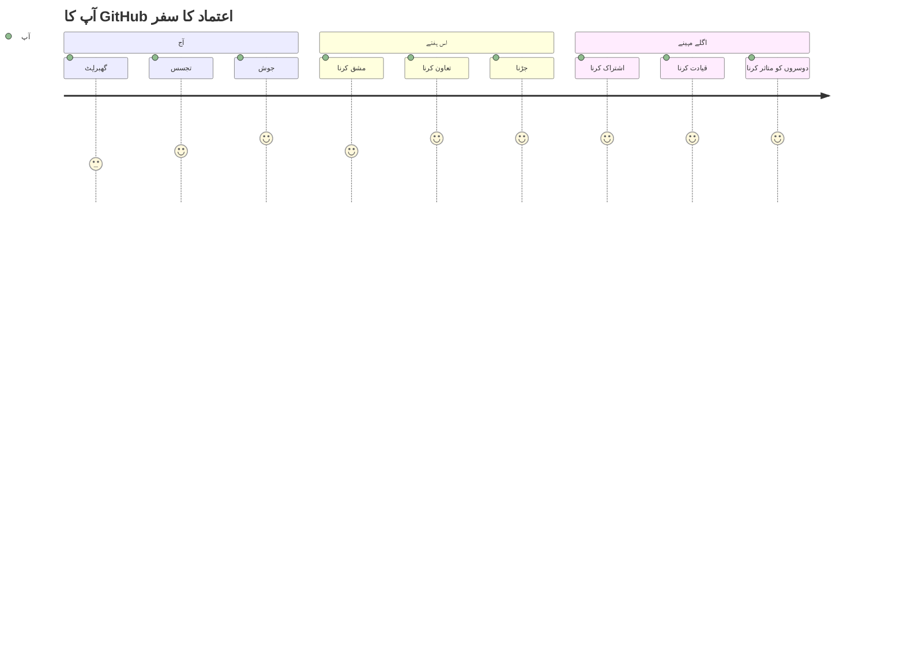

# GitHub کا تعارف

ہیلو، مستقبل کے ڈویلپر! 👋 کیا آپ دنیا بھر کے لاکھوں کوڈرز کے ساتھ شامل ہونے کے لیے تیار ہیں؟ میں واقعی پرجوش ہوں کہ آپ کو GitHub سے متعارف کراؤں – اسے پروگرامرز کے لیے سوشل میڈیا پلیٹ فارم سمجھیں، لیکن یہاں لنچ کی تصاویر شیئر کرنے کے بجائے، ہم کوڈ شیئر کرتے ہیں اور مل کر حیرت انگیز چیزیں بناتے ہیں!

یہ بات مجھے ہمیشہ حیران کر دیتی ہے: آپ کے فون پر موجود ہر ایپ، ہر ویب سائٹ جسے آپ وزٹ کرتے ہیں، اور زیادہ تر ٹولز جنہیں آپ استعمال کرنا سیکھیں گے، وہ ڈویلپرز کی ٹیموں نے GitHub جیسے پلیٹ فارمز پر تعاون کرتے ہوئے بنائے ہیں۔ وہ میوزک ایپ جسے آپ پسند کرتے ہیں؟ کوئی آپ جیسا شخص اس میں شامل تھا۔ وہ گیم جسے آپ چھوڑ نہیں سکتے؟ جی ہاں، شاید GitHub کے تعاون سے بنایا گیا۔ اور اب آپ اس حیرت انگیز کمیونٹی کا حصہ بننا سیکھنے والے ہیں!

مجھے معلوم ہے کہ شروع میں یہ سب کچھ بہت زیادہ لگ سکتا ہے – مجھے یاد ہے کہ میں نے اپنی پہلی GitHub پیج کو دیکھتے ہوئے سوچا تھا "یہ سب کچھ آخر کیا مطلب رکھتا ہے؟" لیکن بات یہ ہے: ہر ایک ڈویلپر نے بالکل وہیں سے شروعات کی جہاں آپ ابھی ہیں۔ اس سبق کے اختتام تک، آپ کے پاس اپنا ذاتی GitHub ریپوزیٹری ہوگا (اسے کلاؤڈ میں آپ کے ذاتی پروجیکٹ شوکیس کے طور پر سمجھیں)، اور آپ کو یہ معلوم ہوگا کہ اپنا کام کیسے محفوظ کریں، دوسروں کے ساتھ شیئر کریں، اور یہاں تک کہ ان پروجیکٹس میں تعاون کریں جنہیں لاکھوں لوگ استعمال کرتے ہیں۔

ہم یہ سفر ایک ساتھ کریں گے، ایک قدم بہ ایک قدم۔ کوئی جلدی نہیں، کوئی دباؤ نہیں – بس آپ، میں، اور کچھ واقعی زبردست ٹولز جو آپ کے نئے بہترین دوست بننے والے ہیں!


> اسکیچ نوٹ از [Tomomi Imura](https://twitter.com/girlie_mac)


## لیکچر سے پہلے کا کوئز
[لیکچر سے پہلے کا کوئز](https://ff-quizzes.netlify.app)

## تعارف

اس سے پہلے کہ ہم واقعی دلچسپ چیزوں میں غوطہ لگائیں، آئیے آپ کے کمپیوٹر کو کچھ GitHub جادو کے لیے تیار کریں! اسے ایک شاہکار تخلیق کرنے سے پہلے اپنے آرٹ سپلائیز کو منظم کرنے جیسا سمجھیں – صحیح ٹولز تیار ہونے سے سب کچھ زیادہ ہموار اور بہت زیادہ مزے دار ہو جاتا ہے۔

میں آپ کو ہر سیٹ اپ مرحلے سے ذاتی طور پر گزاروں گا، اور میں وعدہ کرتا ہوں کہ یہ اتنا خوفناک نہیں جتنا یہ پہلی نظر میں لگ سکتا ہے۔ اگر کچھ فوراً سمجھ میں نہ آئے، تو یہ بالکل نارمل ہے! مجھے یاد ہے کہ میں نے اپنا پہلا ڈویلپمنٹ ماحول سیٹ کرتے وقت ایسا محسوس کیا جیسے میں قدیم ہائروگلیفکس پڑھنے کی کوشش کر رہا ہوں۔ ہر ایک ڈویلپر بالکل وہیں رہا ہے جہاں آپ ابھی ہیں، یہ سوچتے ہوئے کہ کیا وہ صحیح کر رہے ہیں۔ اسپوئلر الرٹ: اگر آپ یہاں سیکھ رہے ہیں، تو آپ پہلے ہی صحیح کر رہے ہیں! 🌟

اس سبق میں، ہم کور کریں گے:

- آپ کے کمپیوٹر پر آپ کے کام کو ٹریک کرنا
- دوسروں کے ساتھ پروجیکٹس پر کام کرنا
- اوپن سورس سافٹ ویئر میں تعاون کیسے کریں

### ضروریات

آئیے آپ کے کمپیوٹر کو کچھ GitHub جادو کے لیے تیار کریں! پریشان نہ ہوں – یہ سیٹ اپ آپ کو صرف ایک بار کرنا ہوگا، اور پھر آپ اپنی پوری کوڈنگ کے سفر کے لیے تیار ہوں گے۔

ٹھیک ہے، آئیے بنیاد سے شروع کریں! سب سے پہلے، ہمیں یہ چیک کرنے کی ضرورت ہے کہ آیا Git پہلے سے ہی آپ کے کمپیوٹر پر موجود ہے۔ Git بنیادی طور پر ایک سپر اسمارٹ اسسٹنٹ کی طرح ہے جو آپ کے کوڈ میں کی گئی ہر تبدیلی کو یاد رکھتا ہے – ہر دو سیکنڈ میں Ctrl+S کو گھبراہٹ میں دبانے سے کہیں بہتر (ہم سب وہاں رہے ہیں!)۔

آئیے دیکھتے ہیں کہ آیا Git پہلے سے انسٹال ہے، اس جادوئی کمانڈ کو اپنے ٹرمینل میں ٹائپ کریں:
`git --version`

اگر Git ابھی تک موجود نہیں ہے، تو کوئی مسئلہ نہیں! بس [Git ڈاؤن لوڈ کریں](https://git-scm.com/downloads) اور اسے حاصل کریں۔ ایک بار جب آپ نے اسے انسٹال کر لیا، تو ہمیں Git کا آپ سے صحیح تعارف کروانا ہوگا:

> 💡 **پہلی بار سیٹ اپ**: یہ کمانڈز Git کو بتاتے ہیں کہ آپ کون ہیں۔ یہ معلومات ہر کمیٹ کے ساتھ منسلک ہوگی جو آپ بناتے ہیں، لہذا ایک ایسا نام اور ای میل منتخب کریں جسے آپ عوامی طور پر شیئر کرنے میں آرام دہ ہوں۔

```bash
git config --global user.name "your-name"
git config --global user.email "your-email"
```

یہ چیک کرنے کے لیے کہ آیا Git پہلے سے کنفیگرڈ ہے، آپ ٹائپ کر سکتے ہیں:
```bash
git config --list
```

آپ کو ایک GitHub اکاؤنٹ، ایک کوڈ ایڈیٹر (جیسے Visual Studio Code)، اور اپنا ٹرمینل (یا: کمانڈ پرامپٹ) کھولنے کی ضرورت ہوگی۔

[github.com](https://github.com/) پر جائیں اور اگر آپ کے پاس پہلے سے اکاؤنٹ نہیں ہے تو ایک اکاؤنٹ بنائیں، یا لاگ ان کریں اور اپنی پروفائل مکمل کریں۔

💡 **جدید ٹپ**: پاس ورڈز کے بغیر آسان تصدیق کے لیے [SSH کیز](https://docs.github.com/en/authentication/connecting-to-github-with-ssh) یا [GitHub CLI](https://cli.github.com/) سیٹ اپ کرنے پر غور کریں۔

✅ GitHub دنیا میں واحد کوڈ ریپوزیٹری نہیں ہے؛ اور بھی ہیں، لیکن GitHub سب سے زیادہ مشہور ہے۔

### تیاری

آپ کو اپنے مقامی کمپیوٹر (لیپ ٹاپ یا پی سی) پر کوڈ پروجیکٹ کے ساتھ ایک فولڈر اور GitHub پر ایک عوامی ریپوزیٹری کی ضرورت ہوگی، جو دوسروں کے پروجیکٹس میں تعاون کرنے کی مثال کے طور پر کام کرے گا۔

### اپنے کوڈ کو محفوظ رکھنا

آئیے ایک لمحے کے لیے سیکیورٹی کے بارے میں بات کرتے ہیں – لیکن پریشان نہ ہوں، ہم آپ کو خوفزدہ کرنے والی چیزوں سے مغلوب نہیں کریں گے! ان سیکیورٹی طریقوں کو اپنی کار یا اپنے گھر کو لاک کرنے جیسا سمجھیں۔ یہ سادہ عادات ہیں جو فطری بن جاتی ہیں اور آپ کے محنت سے کیے گئے کام کو محفوظ رکھتی ہیں۔

ہم آپ کو شروع سے ہی GitHub کے ساتھ کام کرنے کے جدید، محفوظ طریقے دکھائیں گے۔ اس طرح، آپ اچھی عادات پیدا کریں گے جو آپ کے کوڈنگ کیریئر کے دوران آپ کے لیے فائدہ مند ہوں گی۔

GitHub کے ساتھ کام کرتے وقت، سیکیورٹی کے بہترین طریقوں پر عمل کرنا ضروری ہے:

| سیکیورٹی کا شعبہ | بہترین طریقہ | اس کی اہمیت کیوں ہے |
|------------------|--------------|-----------------------|
| **تصدیق** | SSH کیز یا پرسنل ایکسیس ٹوکنز استعمال کریں | پاس ورڈز کم محفوظ ہیں اور انہیں ختم کیا جا رہا ہے |
| **ٹو فیکٹر تصدیق** | اپنے GitHub اکاؤنٹ پر 2FA فعال کریں | اکاؤنٹ کی حفاظت کی ایک اضافی تہہ شامل کرتا ہے |
| **ریپوزیٹری سیکیورٹی** | حساس معلومات کبھی بھی کمیٹ نہ کریں | API کیز اور پاس ورڈز کبھی بھی عوامی ریپوز میں نہیں ہونے چاہئیں |
| **ڈیپینڈنسی مینجمنٹ** | اپ ڈیٹس کے لیے Dependabot کو فعال کریں | آپ کی ڈیپینڈنسیز کو محفوظ اور اپ ٹو ڈیٹ رکھتا ہے |

> ⚠️ **اہم سیکیورٹی یاد دہانی**: API کیز، پاس ورڈز، یا دیگر حساس معلومات کو کسی بھی ریپوزیٹری میں کبھی بھی کمیٹ نہ کریں۔ حساس ڈیٹا کی حفاظت کے لیے ماحولیات کے متغیرات اور `.gitignore` فائلوں کا استعمال کریں۔

**جدید تصدیق سیٹ اپ:**

```bash
# جدید ed25519 الگورتھم کے ساتھ SSH کلید بنائیں
ssh-keygen -t ed25519 -C "your_email@example.com"

# SSH استعمال کرنے کے لیے Git ترتیب دیں
git remote set-url origin git@github.com:username/repository.git
```

> 💡 **پرو ٹپ**: SSH کیز بار بار پاس ورڈز داخل کرنے کی ضرورت کو ختم کر دیتی ہیں اور روایتی تصدیق کے طریقوں سے زیادہ محفوظ ہیں۔

---

## اپنے کوڈ کو پروفیشنل انداز میں منظم کریں

ٹھیک ہے، یہ وہ جگہ ہے جہاں چیزیں واقعی دلچسپ ہو جاتی ہیں! 🎉 ہم یہ سیکھنے والے ہیں کہ اپنے کوڈ کو پروفیشنلز کی طرح کیسے ٹریک اور منظم کریں، اور ایمانداری سے، یہ میری پسندیدہ چیزوں میں سے ایک ہے جسے سکھانا مجھے بہت پسند ہے کیونکہ یہ ایک گیم چینجر ہے۔

تصور کریں: آپ ایک حیرت انگیز کہانی لکھ رہے ہیں، اور آپ ہر ڈرافٹ، ہر شاندار ترمیم، اور ہر "انتظار کریں، یہ تو زبردست ہے!" لمحے کو ٹریک کرنا چاہتے ہیں۔ یہی کام Git آپ کے کوڈ کے لیے کرتا ہے! یہ ایسا ہے جیسے آپ کے پاس سب کچھ یاد رکھنے والی سب سے ناقابل یقین وقت کی سفر کرنے والی نوٹ بک ہو – ہر کی اسٹروک، ہر تبدیلی، ہر "اوہ، یہ سب کچھ خراب ہو گیا" لمحہ جسے آپ فوراً واپس لے سکتے ہیں۔

میں ایماندار ہوں – شروع میں یہ سب کچھ زبردست لگ سکتا ہے۔ جب میں نے شروعات کی، تو میں نے سوچا "میں اپنی فائلز کو نارمل طریقے سے کیوں محفوظ نہیں کر سکتا؟" لیکن مجھ پر بھروسہ کریں: ایک بار جب آپ کو Git سمجھ میں آ جائے (اور یہ آئے گا!)، تو آپ کے پاس وہ لمحہ ہوگا جب آپ سوچیں گے "میں نے اس کے بغیر کبھی کوڈ کیسے کیا؟" یہ ایسا ہے جیسے آپ کو پتہ چلے کہ آپ اڑ سکتے ہیں جب آپ اپنی پوری زندگی پیدل چل رہے تھے!

فرض کریں کہ آپ کے پاس مقامی طور پر ایک فولڈر ہے جس میں کچھ کوڈ پروجیکٹ ہے اور آپ اپنے پیش رفت کو ٹریک کرنا چاہتے ہیں – ورژن کنٹرول سسٹم Git کا استعمال کرتے ہوئے۔ کچھ لوگ Git کا استعمال کرنے کو اپنے مستقبل کے خود کے لیے محبت نامہ لکھنے سے تشبیہ دیتے ہیں۔ جب آپ اپنے کمیٹ میسجز کو دنوں، ہفتوں یا مہینوں بعد پڑھیں گے، تو آپ کو یاد آئے گا کہ آپ نے کوئی فیصلہ کیوں کیا، یا کسی تبدیلی کو "واپس" کر سکتے ہیں – یعنی، جب آپ اچھے "کمیٹ میسجز" لکھتے ہیں۔


### کام: اپنی پہلی ریپوزیٹری بنائیں!

> 🎯 **آپ کا مشن (اور میں آپ کے لیے بہت پرجوش ہوں!)**: ہم آپ کی پہلی GitHub ریپوزیٹری کو ایک ساتھ بنائیں گے! جب تک ہم یہاں ختم کریں گے، آپ کے پاس انٹرنیٹ پر آپ کا اپنا چھوٹا سا گوشہ ہوگا جہاں آپ کا کوڈ موجود ہوگا، اور آپ نے اپنی پہلی "کمیٹ" کی ہوگی (یہ ڈویلپرز کی زبان میں اپنے کام کو ایک بہت ہی سمارٹ طریقے سے محفوظ کرنے کے لیے کہا جاتا ہے)۔
>
> یہ واقعی ایک خاص لمحہ ہے – آپ عالمی ڈویلپرز کی کمیونٹی میں باضابطہ طور پر شامل ہونے والے ہیں! مجھے اب بھی یاد ہے کہ اپنی پہلی ریپوزیٹری بناتے وقت جوش محسوس ہوا اور سوچا "واہ، میں واقعی یہ کر رہا ہوں!"

آئیے اس مہم جوئی کو ایک ساتھ، قدم بہ قدم طے کریں۔ ہر حصے کے ساتھ اپنا وقت لیں – جلدی کرنے کا کوئی انعام نہیں ہے، اور میں وعدہ کرتا ہوں کہ ہر ایک قدم سمجھ میں آئے گا۔ یاد رکھیں، ہر وہ کوڈنگ سپر اسٹار جس کی آپ تعریف کرتے ہیں، وہ کبھی بالکل وہیں بیٹھا تھا جہاں آپ ہیں، اپنی پہلی ریپوزیٹری بنانے کے لیے تیار۔ یہ کتنا زبردست ہے؟

> ویڈیو دیکھیں
> 
> [](https://www.youtube.com/watch?v=9R31OUPpxU4)

**آئیے یہ ایک ساتھ کریں:**

1. **GitHub پر اپنی ریپوزیٹری بنائیں**۔ GitHub.com پر جائیں اور وہ روشن سبز **New** بٹن (یا اوپر دائیں کونے میں **+** نشان) تلاش کریں۔ اس پر کلک کریں اور **New repository** منتخب کریں۔

   یہاں کیا کرنا ہے:
   1. اپنی ریپوزیٹری کو ایک نام دیں – اسے اپنے لیے بامعنی بنائیں!
   1. اگر آپ چاہیں تو ایک وضاحت شامل کریں (یہ دوسروں کو سمجھنے میں مدد دیتی ہے کہ آپ کا پروجیکٹ کیا ہے)
   1. فیصلہ کریں کہ آپ اسے عوامی (ہر کوئی اسے دیکھ سکتا ہے) یا نجی (صرف آپ کے لیے) بنانا چاہتے ہیں
   1. میں تجویز کرتا ہوں کہ README فائل شامل کرنے کے لیے باکس کو چیک کریں – یہ آپ کے پروجیکٹ کا فرنٹ پیج جیسا ہے
   1. **Create repository** پر کلک کریں اور جشن منائیں – آپ نے اپنی پہلی ریپوزیٹری بنا لی! 🎉

2. **اپنے پروجیکٹ فولڈر پر جائیں**۔ اب آئیے اپنا ٹرمینل کھولیں (پریشان نہ ہوں، یہ اتنا خوفناک نہیں جتنا یہ لگتا ہے!)۔ ہمیں اپنے کمپیوٹر کو یہ بتانے کی ضرورت ہے کہ آپ کے پروجیکٹ فائلز کہاں ہیں۔ یہ کمانڈ ٹائپ کریں:

   ```bash
   cd [name of your folder]
   ```

   **ہم یہاں کیا کر رہے ہیں:**
   - ہم بنیادی طور پر کہہ رہے ہیں "ارے کمپیوٹر، مجھے میرے پروجیکٹ فولڈر پر لے چلو"
   - یہ آپ کے ڈیسک ٹاپ پر ایک مخصوص فولڈر کھولنے جیسا ہے، لیکن ہم یہ ٹیکسٹ کمانڈز کے ساتھ کر رہے ہیں
   - `[name of your folder]` کو اپنے پروجیکٹ فولڈر کے اصل نام سے تبدیل کریں

3. **اپنے فولڈر کو ایک Git ریپوزیٹری میں تبدیل کریں**۔ یہ وہ جگہ ہے جہاں جادو ہوتا ہے! ٹائپ کریں:

   ```bash
   git init
   ```

   **یہاں کیا ہوا (واقعی زبردست چیز!):**
   - Git نے آپ کے پروجیکٹ میں ایک چھپا ہوا `.git` فولڈر بنایا – آپ اسے نہیں دیکھیں گے، لیکن یہ وہاں ہے!
   - آپ کا عام فولڈر اب ایک "ریپوزیٹری" ہے جو آپ کی کی گئی ہر تبدیلی کو ٹریک کر سکتا ہے
   - اسے ایسا سمجھیں جیسے آپ کے فولڈر کو سب کچھ یاد رکھنے کی سپر پاورز مل گئی ہوں

4. **چیک کریں کہ کیا ہو رہا ہے**۔ آئیے دیکھتے ہیں کہ Git اس وقت آپ کے پروجیکٹ کے بارے میں کیا سوچتا ہے:

   ```bash
   git status
   ```

   **Git آپ کو کیا بتا رہا ہے اسے سمجھنا:**
   
   آپ کو کچھ ایسا نظر آ سکتا ہے:

   ```output
   Changes not staged for commit:
   (use "git add <file>..." to update what will be committed)
   (use "git restore <file>..." to discard changes in working directory)

        modified:   file.txt
        modified:   file2.txt
   ```

   **پریشان نہ ہوں! اس کا مطلب یہ ہے:**
   - **سرخ** میں فائلز وہ فائلز ہیں جن میں تبدیلیاں ہیں لیکن وہ ابھی محفوظ کرنے کے لیے تیار نہیں ہیں
   - **سبز** میں فائلز (جب آپ انہیں دیکھیں گے) محفوظ کرنے کے لیے تیار ہیں
   - Git آپ کی مدد کر رہا ہے یہ بتا کر کہ آپ اگلے کیا کر سکتے ہیں

   > 💡 **پرو ٹپ**: `git status` کمانڈ آپ کا بہترین دوست ہے! جب بھی آپ الجھن میں ہوں کہ کیا ہو رہا ہے، اسے استعمال کریں۔ یہ ایسا ہے جیسے Git سے پوچھیں "ارے، ابھی کیا صورتحال ہے؟"

5. **اپنی فائلز کو محفوظ کرنے کے لیے تیار کریں** (اسے "اسٹیجنگ" کہا جاتا ہے):

   ```bash
   git add .
   ```

   **ہم نے ابھی کیا کیا:**
   - ہم نے Git کو بتایا "ارے، میں اپنی تمام فائلز کو اگلی محفوظ میں شامل کرنا چاہتا ہوں"
   - `.` ایسا ہے جیسے کہہ رہے ہوں "اس فولڈر میں سب کچھ"
   - اب آپ کی فائلز "اسٹیجڈ" ہیں اور اگلے مرحلے کے لیے تیار ہیں

   **زیادہ منتخب ہونا چاہتے ہیں؟** آپ صرف مخصوص فائلز شامل کر سکتے ہیں:

   ```bash
   git add [file or folder name]
   ```

   **آپ ایسا کیوں کرنا چاہیں گے؟**
   - کبھی کبھی آپ متعلقہ تبدیلیوں کو ایک ساتھ محفوظ کرنا چاہتے ہیں
   - یہ آپ کے کام کو منطقی حصوں میں منظم کرنے میں مدد دیتا ہے
   - یہ سمجھنا آسان بناتا ہے کہ کیا بدلا اور کب

   **اپنا ارادہ بدل لیا؟** کوئی مسئلہ نہیں! آپ فائلز کو اس طرح ان اسٹیج کر سکتے ہیں:

   ```bash
   # سب کچھ ان سٹیج کریں
   git reset
   
   # صرف ایک فائل ان سٹیج کریں
   git reset [file name]
   ```

   پریشان نہ ہوں – یہ آپ کے کام کو حذف نہیں کرتا، یہ صرف فائلز کو "محفوظ کرنے کے لیے تیار" ڈھیر سے نکال دیتا ہے۔

6. **اپنا کام مستقل طور پر محفوظ کریں** (اپنی پہلی کمیٹ بنانا!):

   ```bash
   git commit -m "first commit"
   ```

   **🎉 مبارک ہو! آپ نے اپنی پہلی کمیٹ بنا لی!**
   
   **یہاں کیا ہوا:**
   - Git نے اس عین لمحے میں آپ کی تمام اسٹیجڈ فائلز کا "اسنیپ شاٹ" لیا
   - آپ کا کمیٹ میسج "پہلی کمیٹ" اس محفوظ پوائنٹ کے بارے میں وضاحت کرتا ہے
   - Git نے اس اسنیپ شاٹ کو ایک منفرد ID دی تاکہ آپ اسے ہمیشہ بعد میں تلاش کر سکیں
   - آپ نے باضابطہ طور پر اپنے پروجیکٹ کی تاریخ کو ٹریک کرنا شروع کر دیا ہے!

   > 💡 **مستقبل کے کمیٹ میسجز**: اپنی اگلی کمیٹس کے لیے، زیادہ وضاحتی بنیں! "اپ ڈیٹڈ
- ہم نے آپ کے مقامی پروجیکٹ اور آپ کے GitHub ریپوزیٹری کے درمیان ایک کنکشن بنایا ہے۔
- "Origin" آپ کے GitHub ریپوزیٹری کا صرف ایک عرفی نام ہے – یہ بالکل ایسے ہے جیسے آپ اپنے فون میں کسی کانٹیکٹ کو شامل کرتے ہیں۔
- اب آپ کا مقامی Git جانتا ہے کہ آپ کا کوڈ کہاں بھیجنا ہے جب آپ اسے شیئر کرنے کے لیے تیار ہوں۔

💡 **آسان طریقہ**: اگر آپ نے GitHub CLI انسٹال کیا ہوا ہے، تو آپ یہ ایک کمانڈ میں کر سکتے ہیں:
   ```bash
   gh repo create my-repo --public --push --source=.
   ```

8. **اپنا کوڈ GitHub پر بھیجیں** (یہ بڑا لمحہ ہے!):

   ```bash
   git push -u origin main
   ```

**🚀 یہ وہ لمحہ ہے! آپ اپنا کوڈ GitHub پر اپلوڈ کر رہے ہیں!**

**کیا ہو رہا ہے:**
- آپ کے کمیٹس آپ کے کمپیوٹر سے GitHub تک جا رہے ہیں۔
- `-u` فلیگ ایک مستقل کنکشن قائم کرتا ہے تاکہ آئندہ کے پشز آسان ہوں۔
- "main" آپ کی پرائمری برانچ کا نام ہے (جیسے مین فولڈر)۔
- اس کے بعد، آپ آئندہ اپلوڈز کے لیے صرف `git push` ٹائپ کر سکتے ہیں!

💡 **جلدی نوٹ**: اگر آپ کی برانچ کا نام کچھ اور ہے (جیسے "master")، تو وہ نام استعمال کریں۔ آپ `git branch --show-current` کے ذریعے چیک کر سکتے ہیں۔

9. **آپ کا نیا روزمرہ کوڈنگ کا معمول** (یہ وہ جگہ ہے جہاں یہ عادت بن جاتی ہے!):

اب سے، جب بھی آپ اپنے پروجیکٹ میں تبدیلیاں کریں گے، آپ کے پاس یہ آسان تین قدمی عمل ہوگا:

   ```bash
   git add .
   git commit -m "describe what you changed"
   git push
   ```

**یہ آپ کی کوڈنگ کی دھڑکن بن جاتی ہے:**
- اپنے کوڈ میں کچھ زبردست تبدیلیاں کریں ✨
- انہیں `git add` کے ساتھ اسٹیج کریں ("Hey Git, ان تبدیلیوں پر توجہ دیں!")
- انہیں `git commit` اور ایک وضاحتی پیغام کے ساتھ محفوظ کریں (مستقبل کا آپ آپ کا شکریہ ادا کرے گا!)
- دنیا کے ساتھ انہیں `git push` کے ذریعے شیئر کریں 🚀
- بار بار کریں – واقعی، یہ سانس لینے جتنا قدرتی بن جاتا ہے!

مجھے یہ ورک فلو پسند ہے کیونکہ یہ ویڈیو گیم میں متعدد سیو پوائنٹس رکھنے جیسا ہے۔ کوئی تبدیلی کی جو آپ کو پسند آئی؟ کمیٹ کریں! کچھ خطرناک آزمانا چاہتے ہیں؟ کوئی مسئلہ نہیں – اگر چیزیں خراب ہو جائیں تو آپ ہمیشہ اپنے آخری کمیٹ پر واپس جا سکتے ہیں!

> 💡 **ٹپ**: آپ `.gitignore` فائل اپنانا بھی چاہیں گے تاکہ وہ فائلیں جو آپ ٹریک نہیں کرنا چاہتے GitHub پر ظاہر نہ ہوں - جیسے وہ نوٹس فائل جو آپ اسی فولڈر میں محفوظ کرتے ہیں لیکن عوامی ریپوزیٹری میں اس کا کوئی مقام نہیں۔ آپ `.gitignore` فائلز کے ٹیمپلیٹس [.gitignore templates](https://github.com/github/gitignore) پر یا [gitignore.io](https://www.toptal.com/developers/gitignore) کے ذریعے بنا سکتے ہیں۔

### 🧠 **پہلا ریپوزیٹری چیک ان: کیسا لگا؟**

**ایک لمحہ لیں اور جشن منائیں:**
- آپ کا کوڈ پہلی بار GitHub پر دیکھ کر کیسا لگا؟
- کون سا قدم سب سے زیادہ الجھا ہوا لگا، اور کون سا حیرت انگیز طور پر آسان لگا؟
- کیا آپ اپنے الفاظ میں `git add`, `git commit`, اور `git push` کے فرق کو بیان کر سکتے ہیں؟


> **یاد رکھیں**: تجربہ کار ڈویلپرز بھی کبھی کبھار صحیح کمانڈز بھول جاتے ہیں۔ اس ورک فلو کو مسل میموری بننے میں وقت لگتا ہے - آپ بہت اچھا کر رہے ہیں!

#### جدید Git ورک فلو

ان جدید طریقوں کو اپنانے پر غور کریں:

- **Conventional Commits**: ایک معیاری کمیٹ میسج فارمیٹ استعمال کریں جیسے `feat:`, `fix:`, `docs:` وغیرہ۔ مزید جانیں [conventionalcommits.org](https://www.conventionalcommits.org/) پر۔
- **Atomic commits**: ہر کمیٹ کو ایک منطقی تبدیلی کی نمائندگی کریں۔
- **Frequent commits**: بڑے، کم بار کمیٹس کے بجائے اکثر کمیٹ کریں اور وضاحتی پیغامات کے ساتھ۔

#### کمیٹ میسجز

ایک زبردست Git کمیٹ سبجیکٹ لائن درج ذیل جملے کو مکمل کرتی ہے:
اگر لاگو کیا گیا، تو یہ کمیٹ <آپ کی سبجیکٹ لائن یہاں> کرے گا۔

سبجیکٹ کے لیے imperative, present tense استعمال کریں: "change" نہ کہ "changed" یا "changes"۔
جیسے سبجیکٹ میں، باڈی (اختیاری) میں بھی imperative, present tense استعمال کریں۔ باڈی میں تبدیلی کی وجہ شامل کریں اور اسے پچھلے رویے کے ساتھ موازنہ کریں۔ آپ `کیوں` کی وضاحت کر رہے ہیں، `کیسے` نہیں۔

✅ چند منٹ لیں اور GitHub پر گھومیں۔ کیا آپ کوئی واقعی زبردست کمیٹ میسج تلاش کر سکتے ہیں؟ کیا آپ کوئی واقعی مختصر میسج تلاش کر سکتے ہیں؟ آپ کے خیال میں کمیٹ میسج میں کون سی معلومات سب سے زیادہ اہم اور مفید ہیں؟

## دوسروں کے ساتھ کام کرنا (مزا آ گیا!)

اپنی ٹوپی پکڑیں کیونکہ یہ وہ جگہ ہے جہاں GitHub بالکل جادوئی ہو جاتا ہے! 🪄 آپ نے اپنے کوڈ کو منظم کرنے میں مہارت حاصل کر لی ہے، لیکن اب ہم میری بالکل پسندیدہ چیز میں غوطہ لگا رہے ہیں – دنیا بھر کے حیرت انگیز لوگوں کے ساتھ تعاون کرنا۔

یہ تصور کریں: آپ کل صبح اٹھتے ہیں اور دیکھتے ہیں کہ ٹوکیو میں کسی نے آپ کے کوڈ کو بہتر بنایا ہے جب آپ سو رہے تھے۔ پھر برلن میں کسی نے ایک بگ ٹھیک کیا جس پر آپ پھنسے ہوئے تھے۔ دوپہر تک، ساؤ پالو میں ایک ڈویلپر نے ایک فیچر شامل کیا جس کے بارے میں آپ نے کبھی سوچا بھی نہیں تھا۔ یہ سائنس فکشن نہیں ہے – یہ صرف GitHub کائنات میں ایک عام دن ہے!

جو چیز مجھے واقعی پرجوش کرتی ہے وہ یہ ہے کہ آپ جو تعاون کی مہارتیں سیکھنے والے ہیں؟ یہ وہی ورک فلو ہیں جو گوگل، مائیکروسافٹ، اور آپ کے پسندیدہ اسٹارٹ اپس کی ٹیمیں ہر روز استعمال کرتی ہیں۔ آپ صرف ایک زبردست ٹول نہیں سیکھ رہے – آپ وہ خفیہ زبان سیکھ رہے ہیں جو پورے سافٹ ویئر کی دنیا کو ایک ساتھ کام کرنے پر مجبور کرتی ہے۔

سچ میں، جب آپ کسی کے پہلے پل ریکویسٹ کو مرج کرنے کا جوش محسوس کریں گے، تو آپ سمجھ جائیں گے کہ ڈویلپرز اوپن سورس کے بارے میں اتنے پرجوش کیوں ہوتے ہیں۔ یہ دنیا کے سب سے بڑے، سب سے تخلیقی ٹیم پروجیکٹ کا حصہ بننے جیسا ہے!

> ویڈیو دیکھیں
>
> [](https://www.youtube.com/watch?v=bFCM-PC3cu8)

چیزوں کو GitHub پر رکھنے کی بنیادی وجہ یہ تھی کہ دوسرے ڈویلپرز کے ساتھ تعاون ممکن ہو۔


اپنے ریپوزیٹری میں، `Insights > Community` پر جائیں تاکہ دیکھ سکیں کہ آپ کا پروجیکٹ تجویز کردہ کمیونٹی معیارات کے ساتھ کیسے موازنہ کرتا ہے۔

اپنے ریپوزیٹری کو پیشہ ورانہ اور خوش آمدید بنانے کے لیے؟ اپنے ریپوزیٹری پر جائیں اور `Insights > Community` پر کلک کریں۔ یہ زبردست فیچر آپ کو دکھاتا ہے کہ آپ کا پروجیکٹ GitHub کمیونٹی کے "اچھے ریپوزیٹری کے طریقوں" کے ساتھ کیسے موازنہ کرتا ہے۔

> 🎯 **اپنے پروجیکٹ کو چمکائیں**: ایک اچھی طرح سے منظم ریپوزیٹری جس میں اچھی دستاویزات ہوں، ایک صاف، خوش آمدید دینے والے اسٹور فرنٹ کی طرح ہے۔ یہ لوگوں کو بتاتا ہے کہ آپ اپنے کام کی پرواہ کرتے ہیں اور دوسروں کو تعاون کرنے کی ترغیب دیتا ہے!

**یہاں وہ چیزیں ہیں جو ایک ریپوزیٹری کو زبردست بناتی ہیں:**

| کیا شامل کریں | کیوں یہ اہم ہے | آپ کے لیے کیا کرتا ہے |
|-------------|-------------------|---------------------|
| **تفصیل** | پہلا تاثر اہم ہے! | لوگ فوراً جانتے ہیں کہ آپ کا پروجیکٹ کیا کرتا ہے |
| **README** | آپ کے پروجیکٹ کا فرنٹ پیج | نئے وزیٹرز کے لیے ایک دوستانہ گائیڈ کی طرح |
| **Contributing Guidelines** | دکھاتا ہے کہ آپ مدد کا خیر مقدم کرتے ہیں | لوگ جانتے ہیں کہ وہ آپ کی کیسے مدد کر سکتے ہیں |
| **Code of Conduct** | ایک دوستانہ جگہ بناتا ہے | ہر کوئی حصہ لینے کے لیے خوش آمدید محسوس کرتا ہے |
| **License** | قانونی وضاحت | دوسرے جانتے ہیں کہ وہ آپ کے کوڈ کو کیسے استعمال کر سکتے ہیں |
| **Security Policy** | دکھاتا ہے کہ آپ ذمہ دار ہیں | پیشہ ورانہ طریقوں کا مظاہرہ کرتا ہے |

> 💡 **پرو ٹپ**: GitHub ان تمام فائلوں کے لیے ٹیمپلیٹس فراہم کرتا ہے۔ جب آپ ایک نیا ریپوزیٹری بناتے ہیں، تو ان فائلوں کو خودکار طور پر جنریٹ کرنے کے لیے چیک باکسز کو چیک کریں۔

**جدید GitHub فیچرز کو دریافت کریں:**

🤖 **آٹومیشن اور CI/CD:**
- **GitHub Actions** خودکار ٹیسٹنگ اور ڈیپلائمنٹ کے لیے
- **Dependabot** خودکار ڈیپینڈنسی اپڈیٹس کے لیے

💬 **کمیونٹی اور پروجیکٹ مینجمنٹ:**
- **GitHub Discussions** کمیونٹی گفتگو کے لیے جو ایشوز سے آگے ہو
- **GitHub Projects** کانبان اسٹائل پروجیکٹ مینجمنٹ کے لیے
- **برانچ پروٹیکشن رولز** کوڈ کوالٹی اسٹینڈرڈز نافذ کرنے کے لیے

یہ تمام وسائل نئے ٹیم ممبرز کو آن بورڈنگ میں فائدہ پہنچائیں گے۔ اور یہ وہ چیزیں ہیں جنہیں نئے کنٹریبیوٹرز عام طور پر آپ کے کوڈ کو دیکھنے سے پہلے دیکھتے ہیں، یہ جاننے کے لیے کہ آیا آپ کا پروجیکٹ ان کے وقت کے لیے صحیح جگہ ہے۔

✅ README فائلز، حالانکہ انہیں تیار کرنے میں وقت لگتا ہے، اکثر مصروف مینٹینرز کے ذریعے نظر انداز کی جاتی ہیں۔ کیا آپ کسی خاص طور پر وضاحتی مثال تلاش کر سکتے ہیں؟ نوٹ کریں: کچھ [اچھے README بنانے کے لیے ٹولز](https://www.makeareadme.com/) ہیں جنہیں آپ آزمانا پسند کر سکتے ہیں۔

### کام: کچھ کوڈ مرج کریں

Contributing docs لوگوں کو پروجیکٹ میں تعاون کرنے میں مدد دیتے ہیں۔ یہ وضاحت کرتا ہے کہ آپ کس قسم کے تعاون کی تلاش کر رہے ہیں اور عمل کیسے کام کرتا ہے۔ کنٹریبیوٹرز کو آپ کے GitHub ریپوزیٹری میں تعاون کرنے کے قابل ہونے کے لیے ایک سلسلہ وار مراحل سے گزرنا ہوگا:

1. **آپ کے ریپوزیٹری کو فورک کرنا** آپ شاید چاہیں گے کہ لوگ آپ کے پروجیکٹ کو _فورک_ کریں۔ فورک کرنے کا مطلب ہے کہ آپ کے ریپوزیٹری کی ایک نقل ان کے GitHub پروفائل پر بنانا۔
1. **کلون**۔ وہاں سے وہ پروجیکٹ کو اپنی مقامی مشین پر کلون کریں گے۔
1. **برانچ بنائیں**۔ آپ چاہیں گے کہ وہ اپنے کام کے لیے ایک _برانچ_ بنائیں۔
1. **اپنی تبدیلی کو ایک علاقے پر مرکوز کریں**۔ کنٹریبیوٹرز سے کہیں کہ وہ ایک وقت میں ایک چیز پر اپنی تبدیلیوں کو مرکوز کریں - اس طرح ان کے کام کو _مرج_ کرنے کے امکانات زیادہ ہیں۔ تصور کریں کہ انہوں نے ایک بگ ٹھیک کیا، ایک نیا فیچر شامل کیا، اور کئی ٹیسٹس کو اپڈیٹ کیا - کیا ہوگا اگر آپ 3 میں سے 2 یا 1 تبدیلیوں کو نافذ کرنا چاہتے ہیں یا کر سکتے ہیں؟

✅ ایک ایسی صورتحال کا تصور کریں جہاں برانچز اچھا کوڈ لکھنے اور شپ کرنے کے لیے خاص طور پر اہم ہوں۔ آپ کون سے استعمال کے کیسز سوچ سکتے ہیں؟

> نوٹ کریں، وہ تبدیلی بنیں جو آپ دنیا میں دیکھنا چاہتے ہیں، اور اپنے کام کے لیے برانچز بنائیں۔ کوئی بھی کمیٹس جو آپ کریں گے وہ اس برانچ پر کیے جائیں گے جس پر آپ فی الحال "چیک آؤٹ" ہیں۔ `git status` استعمال کریں یہ دیکھنے کے لیے کہ وہ کون سی برانچ ہے۔

آئیے ایک کنٹریبیوٹر ورک فلو سے گزرتے ہیں۔ فرض کریں کہ کنٹریبیوٹر نے پہلے ہی ریپوزیٹری کو _فورک_ اور _کلون_ کیا ہے تاکہ ان کے پاس کام کرنے کے لیے ایک Git ریپوزیٹری ہو، ان کی مقامی مشین پر:

1. **برانچ بنائیں**۔ کمانڈ `git branch` استعمال کریں تاکہ ایک برانچ بنائی جا سکے جو وہ تبدیلیاں رکھے گی جو وہ تعاون کرنے کا ارادہ رکھتے ہیں:

   ```bash
   git branch [branch-name]
   ```

   > 💡 **جدید طریقہ**: آپ ایک کمانڈ میں نئی برانچ بنا سکتے ہیں اور اس پر سوئچ کر سکتے ہیں:
   ```bash
   git switch -c [branch-name]
   ```

1. **کام کرنے والی برانچ پر سوئچ کریں**۔ مخصوص برانچ پر سوئچ کریں اور `git switch` کے ساتھ ورکنگ ڈائریکٹری کو اپڈیٹ کریں:

   ```bash
   git switch [branch-name]
   ```

   > 💡 **جدید نوٹ**: `git switch` برانچز کو تبدیل کرنے کے لیے `git checkout` کا جدید متبادل ہے۔ یہ واضح اور ابتدائیوں کے لیے محفوظ ہے۔

1. **کام کریں**۔ اس مرحلے پر آپ اپنی تبدیلیاں شامل کرنا چاہتے ہیں۔ Git کو اس کے بارے میں بتانا نہ بھولیں درج ذیل کمانڈز کے ساتھ:

   ```bash
   git add .
   git commit -m "my changes"
   ```

   > ⚠️ **کمیٹ میسج کا معیار**: یقینی بنائیں کہ آپ اپنے کمیٹ کو اچھا نام دیں، اپنے لیے اور اس ریپوزیٹری کے مینٹینر کے لیے جس پر آپ مدد کر رہے ہیں۔ جو آپ نے تبدیل کیا ہے اس کے بارے میں مخصوص رہیں!

1. **اپنے کام کو `main` برانچ کے ساتھ ملائیں**۔ کسی وقت آپ کام مکمل کر لیتے ہیں اور آپ اپنے کام کو `main` برانچ کے ساتھ ملانا چاہتے ہیں۔ `main` برانچ اس دوران تبدیل ہو سکتی ہے لہذا یقینی بنائیں کہ آپ پہلے اسے درج ذیل کمانڈز کے ساتھ تازہ ترین کریں:

   ```bash
   git switch main
   git pull
   ```

   اس مرحلے پر آپ یہ یقینی بنانا چاہتے ہیں کہ کوئی _conflicts_، ایسی صورتحال جہاں Git آسانی سے _combine_ نہیں کر سکتا، آپ کی ورکنگ برانچ میں ہوتی ہیں۔ لہذا درج ذیل کمانڈز چلائیں:

   ```bash
   git switch [branch_name]
   git merge main
   ```

   `git merge main` کمانڈ `main` سے تمام تبدیلیاں آپ کی برانچ میں لے آئے گا۔ امید ہے کہ آپ بس جاری رکھ سکتے ہیں۔ اگر نہیں، تو VS Code آپ کو بتائے گا کہ Git کہاں _confused_ ہے اور آپ صرف متاثرہ فائلز کو تبدیل کریں گے تاکہ یہ بتا سکیں کہ کون سا مواد سب سے زیادہ درست ہے۔

   💡 **جدید متبادل**: ایک صاف ہسٹری کے لیے `git rebase` استعمال کرنے پر غور کریں:
   ```bash
   git rebase main
   ```
   یہ آپ کے کمیٹس کو تازہ ترین `main` برانچ کے اوپر دوبارہ چلاتا ہے، ایک لکیری ہسٹری بناتا ہے۔

1. **اپنا کام GitHub پر بھیجیں**۔ اپنا کام GitHub پر بھیجنے کا مطلب دو چیزیں ہیں۔ اپنی برانچ کو اپنے ریپوزیٹری پر پش کریں اور پھر ایک PR، Pull Request کھولیں۔

   ```bash
   git push --set-upstream origin [branch-name]
   ```

   اوپر کی کمانڈ آپ کے فورکڈ ریپوزیٹری پر برانچ بناتی ہے۔

### 🤝 **تعاون کی مہارت چیک: دوسروں کے ساتھ کام کرنے کے لیے تیار؟**

**آئیے دیکھتے ہیں کہ آپ تعاون کے بارے میں کیسا محسوس کر رہے ہیں:**
- کیا فورکنگ اور پل ریکویسٹ کا تصور اب آپ کے لیے واضح ہے؟
- برانچز کے ساتھ کام کرنے کے بارے میں آپ کس چیز پر مزید مشق کرنا چاہتے ہیں؟
- آپ کسی اور کے پروجیکٹ میں تعاون کرنے کے بارے میں کتنا آرام دہ محسوس کرتے ہیں؟


> **اعتماد بڑھانے والا**: ہر وہ ڈویلپر جس کی آپ تعریف کرتے ہیں، کبھی اپنے پہلے پل ریکویسٹ کے بارے میں نروس تھا۔ GitHub کمیونٹی نئے آنے والوں کے لیے انتہائی خوش آمدید ہے!

1. **ایک PR کھولیں**۔ اگلے مرحلے میں آپ ایک PR کھولنا چاہتے ہیں۔ آپ یہ GitHub پر فورکڈ ریپوزیٹری پر جا کر کرتے ہیں۔ آپ کو GitHub پر ایک اشارہ نظر آئے گا جہاں یہ پوچھتا ہے کہ آیا آپ ایک نیا PR بنانا چاہتے ہیں، آپ اس پر کلک کرتے ہیں اور آپ کو ایک انٹرفیس پر لے جایا جاتا ہے جہاں آپ کمیٹ میسج کا عنوان تبدیل کر سکتے ہیں، اسے ایک زیادہ موزوں وضاحت دے سکتے ہیں۔ اب وہ ریپوزیٹری کا مینٹینر جسے آپ نے فورک کیا تھا یہ PR دیکھے گا اور _فنگرز کراسڈ_ وہ آپ کے PR کو سراہیں گے اور _مرج_ کریں گے۔ آپ اب ایک کنٹریبیوٹر ہیں، واہ :)

   💡 **جدید ٹپ**: آپ GitHub CLI استعمال کرتے ہوئے بھی PR بنا سکتے ہیں:
@@
1. **صفائی کریں**۔ یہ ایک اچھی عادت سمجھی جاتی ہے کہ آپ کامیابی سے PR کو مرج کرنے کے بعد صفائی کریں۔ آپ کو اپنی لوکل برانچ اور وہ برانچ جسے آپ نے GitHub پر پش کیا ہے، دونوں کو صاف کرنا ہوگا۔ پہلے اسے لوکل طور پر حذف کریں، اس کمانڈ کے ذریعے:

   ```bash
   git branch -d [branch-name]
   ```

   اس کے بعد GitHub پر فورک کیے گئے ریپو کے صفحے پر جائیں اور وہ ریموٹ برانچ حذف کریں جسے آپ نے ابھی پش کیا تھا۔

`Pull request` ایک عجیب سا لفظ لگتا ہے کیونکہ حقیقت میں آپ اپنی تبدیلیاں پروجیکٹ میں پش کرنا چاہتے ہیں۔ لیکن مینٹینر (پروجیکٹ کے مالک) یا کور ٹیم کو آپ کی تبدیلیوں پر غور کرنا ہوتا ہے اس سے پہلے کہ وہ پروجیکٹ کی "مین" برانچ کے ساتھ مرج کریں، تو آپ حقیقت میں مینٹینر سے تبدیلی کی منظوری کی درخواست کر رہے ہیں۔

ایک pull request وہ جگہ ہے جہاں آپ برانچ پر کی گئی تبدیلیوں کا موازنہ اور بحث کر سکتے ہیں، ریویوز، کمنٹس، انٹیگریٹڈ ٹیسٹس، اور مزید۔ ایک اچھا pull request تقریباً وہی اصول اپناتا ہے جو ایک commit میسج کے لیے ہوتے ہیں۔ آپ مسئلے کے ٹریکر میں کسی مسئلے کا حوالہ دے سکتے ہیں، جب آپ کا کام مثلاً کسی مسئلے کو حل کرتا ہے۔ یہ `#` کے ساتھ اور آپ کے مسئلے کے نمبر کے ذریعے کیا جاتا ہے۔ مثال کے طور پر `#97`۔

🤞امید ہے کہ تمام چیکس پاس ہوں اور پروجیکٹ کے مالک آپ کی تبدیلیوں کو پروجیکٹ میں مرج کریں🤞

اپنی موجودہ لوکل ورکنگ برانچ کو GitHub پر متعلقہ ریموٹ برانچ سے تمام نئے commits کے ساتھ اپڈیٹ کریں:

`git pull`

## اوپن سورس میں تعاون (آپ کا موقع اثر ڈالنے کا!)

کیا آپ کچھ ایسا کرنے کے لیے تیار ہیں جو آپ کے دماغ کو حیران کر دے گا؟ 🤯 آئیے اوپن سورس پروجیکٹس میں تعاون کے بارے میں بات کرتے ہیں – اور میں یہ آپ کے ساتھ شیئر کرنے کے بارے میں سوچ کر ہی پرجوش ہو رہا ہوں!

یہ آپ کا موقع ہے کہ کچھ واقعی غیر معمولی کا حصہ بنیں۔ تصور کریں کہ ان ٹولز کو بہتر بنانا جنہیں لاکھوں ڈیولپرز روزانہ استعمال کرتے ہیں، یا کسی ایپ میں بگ کو ٹھیک کرنا جسے آپ کے دوست پسند کرتے ہیں۔ یہ صرف ایک خواب نہیں ہے – یہی اوپن سورس تعاون کا مطلب ہے!

یہی وہ چیز ہے جو مجھے ہر بار سوچنے پر جوش دلاتی ہے: ہر وہ ٹول جس کے ساتھ آپ سیکھ رہے ہیں – آپ کا کوڈ ایڈیٹر، وہ فریم ورک جنہیں ہم دریافت کریں گے، یہاں تک کہ وہ براؤزر جس میں آپ یہ پڑھ رہے ہیں – کسی نے اپنی پہلی شراکت کے ساتھ شروع کیا تھا، بالکل آپ کی طرح۔

اور سب سے خوبصورت حصہ یہ ہے: اوپن سورس کمیونٹی انٹرنیٹ کا سب سے بڑا گروپ ہگ کی طرح ہے۔ زیادہ تر پروجیکٹس نئے آنے والوں کی تلاش میں ہوتے ہیں اور "good first issue" کے ٹیگ کے ساتھ مسائل رکھتے ہیں خاص طور پر آپ جیسے لوگوں کے لیے! مینٹینرز واقعی نئے تعاون کرنے والوں کو دیکھ کر خوش ہوتے ہیں کیونکہ وہ اپنے پہلے قدموں کو یاد کرتے ہیں۔

```mermaid
flowchart TD
    A[🔍 گٹ ہب کو دریافت کریں] --> B[🏷️ "گڈ فرسٹ ایشو" تلاش کریں]
    B --> C[📖 تعاون کے رہنما اصول پڑھیں]
    C --> D[🍴 ریپوزٹری کو فورک کریں]
    D --> E[💻 مقامی ماحول ترتیب دیں]
    E --> F[🌿 فیچر برانچ بنائیں]
    F --> G[✨ اپنا تعاون کریں]
    G --> H[🧪 اپنی تبدیلیوں کا ٹیسٹ کریں]
    H --> I[📝 واضح کمیٹ لکھیں]
    I --> J[📤 پش کریں اور پی آر بنائیں]
    J --> K[💬 فیڈبیک کے ساتھ مشغول ہوں]
    K --> L[🎉 مرج ہو گیا! آپ ایک کنٹریبیوٹر ہیں!]
    L --> M[🌟 اگلا ایشو تلاش کریں]
    
    style A fill:#e1f5fe
    style L fill:#c8e6c9
    style M fill:#fff59d
```
آپ یہاں صرف کوڈ سیکھنے نہیں کر رہے – آپ ایک عالمی خاندان میں شامل ہونے کی تیاری کر رہے ہیں جو ہر روز یہ سوچتا ہے "ہم ڈیجیٹل دنیا کو تھوڑا بہتر کیسے بنا سکتے ہیں؟" کلب میں خوش آمدید! 🌟

پہلے، آئیے GitHub پر ایک ریپوزٹری (یا **ریپو**) تلاش کریں جو آپ کے لیے دلچسپ ہو اور جس میں آپ تبدیلی کا تعاون کرنا چاہتے ہوں۔ آپ اس کے مواد کو اپنی مشین پر کاپی کرنا چاہیں گے۔

✅ 'beginner-friendly' ریپوزٹریز تلاش کرنے کا ایک اچھا طریقہ [tag 'good-first-issue' کے ذریعے تلاش کرنا](https://github.blog/2020-01-22-browse-good-first-issues-to-start-contributing-to-open-source/) ہے۔



کوڈ کو کاپی کرنے کے کئی طریقے ہیں۔ ایک طریقہ یہ ہے کہ ریپوزٹری کے مواد کو "کلون" کریں، HTTPS، SSH، یا GitHub CLI (کمانڈ لائن انٹرفیس) کا استعمال کرتے ہوئے۔

اپنا ٹرمینل کھولیں اور ریپوزٹری کو اس طرح کلون کریں:
```bash
# HTTPS استعمال کرنا
git clone https://github.com/ProjectURL

# SSH استعمال کرنا (SSH کلید کی ترتیب کی ضرورت ہے)
git clone git@github.com:username/repository.git

# GitHub CLI استعمال کرنا
gh repo clone username/repository
```

پروجیکٹ پر کام کرنے کے لیے، صحیح فولڈر پر جائیں:
`cd ProjectURL`

آپ پورے پروجیکٹ کو اس طرح بھی کھول سکتے ہیں:
- **[GitHub Codespaces](https://github.com/features/codespaces)** - GitHub کا کلاؤڈ ڈیولپمنٹ ماحول، براؤزر میں VS Code کے ساتھ
- **[GitHub Desktop](https://desktop.github.com/)** - Git آپریشنز کے لیے GUI ایپلیکیشن  
- **[GitHub.dev](https://github.dev)** - کسی بھی GitHub ریپو پر `.` کی کلید دبائیں تاکہ براؤزر میں VS Code کھل جائے
- **VS Code** GitHub Pull Requests ایکسٹینشن کے ساتھ

آخر میں، آپ کوڈ کو زپ فولڈر میں ڈاؤنلوڈ بھی کر سکتے ہیں۔

### GitHub کے بارے میں کچھ مزید دلچسپ باتیں

آپ GitHub پر کسی بھی پبلک ریپوزٹری کو اسٹار، واچ اور/یا "فورک" کر سکتے ہیں۔ آپ اپنے اسٹار کردہ ریپوزٹریز کو اوپر دائیں ڈراپ ڈاؤن مینو میں تلاش کر سکتے ہیں۔ یہ بک مارکنگ کی طرح ہے، لیکن کوڈ کے لیے۔

پروجیکٹس کے پاس ایک مسئلہ ٹریکر ہوتا ہے، زیادہ تر GitHub پر "Issues" ٹیب میں جب تک کہ دوسری جگہ نہ بتایا جائے، جہاں لوگ پروجیکٹ سے متعلق مسائل پر بات کرتے ہیں۔ اور Pull Requests ٹیب وہ جگہ ہے جہاں لوگ جاری تبدیلیوں پر بات کرتے ہیں اور ریویو کرتے ہیں۔

پروجیکٹس کے پاس فورمز، میلنگ لسٹس، یا چیٹ چینلز جیسے Slack، Discord یا IRC میں بھی گفتگو ہو سکتی ہے۔

🔧 **جدید GitHub خصوصیات**:
- **GitHub Discussions** - کمیونٹی گفتگو کے لیے بلٹ ان فورم
- **GitHub Sponsors** - مینٹینرز کو مالی طور پر سپورٹ کریں  
- **Security tab** - کمزوریوں کی رپورٹیں اور سیکیورٹی ایڈوائزریز
- **Actions tab** - خودکار ورک فلو اور CI/CD پائپ لائنز دیکھیں
- **Insights tab** - تعاون کرنے والوں، commits، اور پروجیکٹ کی صحت کے بارے میں تجزیات
- **Projects tab** - GitHub کے بلٹ ان پروجیکٹ مینجمنٹ ٹولز

✅ اپنے نئے GitHub ریپو کے ارد گرد دیکھیں اور کچھ چیزیں آزمائیں، جیسے سیٹنگز میں ترمیم کرنا، اپنے ریپو میں معلومات شامل کرنا، ایک پروجیکٹ بنانا (جیسے Kanban بورڈ)، اور GitHub Actions کو آٹومیشن کے لیے سیٹ اپ کرنا۔ آپ بہت کچھ کر سکتے ہیں!

---

## 🚀 چیلنج 

ٹھیک ہے، اب وقت ہے کہ آپ اپنی نئی GitHub صلاحیتوں کو آزمائیں! 🚀 یہاں ایک چیلنج ہے جو سب کچھ انتہائی تسلی بخش طریقے سے واضح کر دے گا:

ایک دوست (یا وہ فیملی ممبر جو ہمیشہ پوچھتا ہے کہ آپ "کمپیوٹر چیزوں" کے ساتھ کیا کر رہے ہیں) کو پکڑیں اور ایک مشترکہ کوڈنگ ایڈونچر پر نکلیں! یہی وہ جگہ ہے جہاں حقیقی جادو ہوتا ہے – ایک پروجیکٹ بنائیں، انہیں فورک کرنے دیں، کچھ برانچز بنائیں، اور تبدیلیوں کو مرج کریں جیسے کہ آپ پروفیشنل بن رہے ہیں۔

میں جھوٹ نہیں بولوں گا – آپ شاید کسی وقت ہنسیں گے (خاص طور پر جب آپ دونوں ایک ہی لائن کو تبدیل کرنے کی کوشش کریں گے)، شاید الجھن میں سر کھجائیں گے، لیکن آپ کو وہ حیرت انگیز "آہا!" لمحات ضرور ملیں گے جو تمام سیکھنے کو قابل بناتے ہیں۔ اس کے علاوہ، کسی اور کے ساتھ پہلی کامیاب مرج کو شیئر کرنے میں کچھ خاص بات ہوتی ہے – یہ اس بات کا چھوٹا سا جشن ہے کہ آپ کتنی دور آ چکے ہیں!

ابھی تک کوئی کوڈنگ ساتھی نہیں ہے؟ کوئی مسئلہ نہیں! GitHub کمیونٹی انتہائی خوش آمدید کہنے والے لوگوں سے بھری ہوئی ہے جو یاد کرتے ہیں کہ نیا ہونا کیسا محسوس ہوتا ہے۔ "good first issue" لیبل والے ریپوزٹریز تلاش کریں – وہ بنیادی طور پر کہہ رہے ہیں "ارے نئے آنے والوں، ہمارے ساتھ سیکھیں!" یہ کتنا زبردست ہے؟

## پوسٹ لیکچر کوئز
[پوسٹ لیکچر کوئز](https://ff-quizzes.netlify.app/web/en/)

## جائزہ اور سیکھتے رہیں

واہ! 🎉 دیکھیں آپ – آپ نے ابھی GitHub کی بنیادی باتوں کو ایک مکمل چیمپئن کی طرح فتح کر لیا ہے! اگر آپ کا دماغ ابھی تھوڑا بھرا ہوا محسوس کر رہا ہے، تو یہ بالکل معمول کی بات ہے اور ایمانداری سے ایک اچھا نشان ہے۔ آپ نے ابھی وہ ٹولز سیکھے ہیں جنہیں میں نے شروع میں آرام دہ محسوس کرنے میں ہفتے لگائے تھے۔

Git اور GitHub ناقابل یقین حد تک طاقتور ہیں (جیسے، واقعی طاقتور)، اور ہر ڈیولپر جسے میں جانتا ہوں – بشمول وہ جو اب جادوگر لگتے ہیں – کو اس سب پر قابو پانے سے پہلے مشق اور تھوڑا سا ٹھوکر کھانی پڑی۔ اس سبق کو مکمل کرنے کا مطلب ہے کہ آپ پہلے ہی ڈیولپر کے ٹول کٹ کے سب سے اہم ٹولز میں مہارت حاصل کرنے کی راہ پر ہیں۔

یہاں کچھ بالکل شاندار وسائل ہیں جو آپ کو مشق کرنے اور مزید شاندار بننے میں مدد کریں گے:

- [اوپن سورس سافٹ ویئر میں تعاون کرنے کی گائیڈ](https://opensource.guide/how-to-contribute/#how-to-submit-a-contribution) – فرق ڈالنے کے لیے آپ کا روڈ میپ
- [Git cheatsheet](https://training.github.com/downloads/github-git-cheat-sheet/) – فوری حوالہ کے لیے اسے ہاتھ میں رکھیں!

اور یاد رکھیں: مشق ترقی لاتی ہے، کمال نہیں! جتنا زیادہ آپ Git اور GitHub استعمال کریں گے، اتنا ہی قدرتی محسوس ہوگا۔ GitHub نے کچھ حیرت انگیز انٹرایکٹو کورسز بنائے ہیں جو آپ کو محفوظ ماحول میں مشق کرنے دیتے ہیں:

- [GitHub کا تعارف](https://github.com/skills/introduction-to-github)
- [Markdown کا استعمال کرتے ہوئے بات چیت کریں](https://github.com/skills/communicate-using-markdown)  
- [GitHub Pages](https://github.com/skills/github-pages)
- [مرج تنازعات کا انتظام](https://github.com/skills/resolve-merge-conflicts)

**ایڈونچر کے لیے تیار محسوس کر رہے ہیں؟ ان جدید ٹولز کو دیکھیں:**
- [GitHub CLI دستاویزات](https://cli.github.com/manual/) – جب آپ کمانڈ لائن جادوگر کی طرح محسوس کرنا چاہتے ہیں
- [GitHub Codespaces دستاویزات](https://docs.github.com/en/codespaces) – کلاؤڈ میں کوڈ کریں!
- [GitHub Actions دستاویزات](https://docs.github.com/en/actions) – سب کچھ خودکار بنائیں
- [Git بہترین طریقے](https://www.atlassian.com/git/tutorials/comparing-workflows) – اپنے ورک فلو گیم کو بہتر بنائیں 

## GitHub Copilot ایجنٹ چیلنج 🚀

ایجنٹ موڈ کا استعمال کرتے ہوئے درج ذیل چیلنج مکمل کریں:

**تفصیل:** ایک مشترکہ ویب ڈیولپمنٹ پروجیکٹ بنائیں جو مکمل GitHub ورک فلو کو ظاہر کرے جو آپ نے اس سبق میں سیکھا ہے۔ یہ چیلنج آپ کو ریپوزٹری تخلیق، تعاون کی خصوصیات، اور جدید Git ورک فلو کو حقیقی دنیا کے منظر نامے میں مشق کرنے میں مدد دے گا۔

**پرومپٹ:** ایک نیا پبلک GitHub ریپوزٹری بنائیں ایک سادہ "ویب ڈیولپمنٹ ریسورسز" پروجیکٹ کے لیے۔ ریپوزٹری میں ایک اچھی طرح سے ساختہ README.md فائل شامل ہونی چاہیے جو مفید ویب ڈیولپمنٹ ٹولز اور ریسورسز کو کیٹیگریز (HTML, CSS, JavaScript وغیرہ) کے ذریعے منظم کرے۔ ریپوزٹری کو مناسب کمیونٹی اسٹینڈرڈز کے ساتھ سیٹ اپ کریں بشمول لائسنس، تعاون کے رہنما اصول، اور کوڈ آف کنڈکٹ۔ کم از کم دو فیچر برانچز بنائیں: ایک CSS ریسورسز شامل کرنے کے لیے اور دوسری JavaScript ریسورسز کے لیے۔ ہر برانچ میں وضاحتی commit میسجز کے ساتھ commits کریں، پھر تبدیلیوں کو واپس مین میں مرج کرنے کے لیے pull requests بنائیں۔ GitHub کی خصوصیات جیسے Issues، Discussions کو فعال کریں اور خودکار چیکس کے لیے ایک بنیادی GitHub Actions ورک فلو سیٹ اپ کریں۔

## اسائنمنٹ 

آپ کا مشن، اگر آپ اسے قبول کرنے کا انتخاب کرتے ہیں: GitHub Skills پر [GitHub کا تعارف](https://github.com/skills/introduction-to-github) کورس مکمل کریں۔ یہ انٹرایکٹو کورس آپ کو محفوظ، گائیڈڈ ماحول میں سب کچھ مشق کرنے دے گا جو آپ نے سیکھا ہے۔ اس کے علاوہ، جب آپ ختم کریں گے تو آپ کو ایک زبردست بیج ملے گا! 🏅

**مزید چیلنجز کے لیے تیار محسوس کر رہے ہیں؟**
- اپنے GitHub اکاؤنٹ کے لیے SSH تصدیق سیٹ اپ کریں (پاس ورڈز کا کوئی جھنجھٹ نہیں!)
- اپنے روزمرہ کے Git آپریشنز کے لیے GitHub CLI استعمال کرنے کی کوشش کریں
- ایک ریپوزٹری بنائیں جس میں GitHub Actions ورک فلو ہو
- GitHub Codespaces کو دریافت کریں اس ریپوزٹری کو کلاؤڈ بیسڈ ایڈیٹر میں کھول کر

---

## 🚀 آپ کی GitHub مہارت کا ٹائم لائن

### ⚡ **آپ اگلے 5 منٹ میں کیا کر سکتے ہیں**
- [ ] اس ریپوزٹری اور 3 دیگر پروجیکٹس کو اسٹار کریں جو آپ کو دلچسپ لگتے ہیں
- [ ] اپنے GitHub اکاؤنٹ پر دو فیکٹر تصدیق سیٹ اپ کریں
- [ ] اپنے پہلے ریپوزٹری کے لیے ایک سادہ README بنائیں
- [ ] 5 ڈیولپرز کو فالو کریں جن کا کام آپ کو متاثر کرتا ہے

### 🎯 **آپ اس گھنٹے میں کیا حاصل کر سکتے ہیں**
- [ ] پوسٹ لیکچر کوئز مکمل کریں اور اپنے GitHub سفر پر غور کریں
- [ ] GitHub تصدیق کے لیے SSH کیز سیٹ اپ کریں
- [ ] ایک زبردست commit میسج کے ساتھ اپنا پہلا معنی خیز commit بنائیں
- [ ] GitHub کے "Explore" ٹیب کو دریافت کریں تاکہ ٹرینڈنگ پروجیکٹس کو تلاش کریں
- [ ] ایک ریپوزٹری کو فورک کریں اور ایک چھوٹی تبدیلی کریں

### 📅 **آپ کی ہفتہ بھر کی GitHub مہم**
- [ ] GitHub Skills کورسز مکمل کریں (GitHub کا تعارف، Markdown)
- [ ] کسی اوپن سورس پروجیکٹ میں اپنا پہلا pull request بنائیں
- [ ] اپنے کام کو دکھانے کے لیے ایک GitHub Pages سائٹ سیٹ اپ کریں
- [ ] ان پروجیکٹس پر GitHub Discussions میں شامل ہوں جن میں آپ دلچسپی رکھتے ہیں
- [ ] ایک ریپوزٹری بنائیں جس میں مناسب کمیونٹی اسٹینڈرڈز ہوں (README، لائسنس وغیرہ)
- [ ] کلاؤڈ بیسڈ ڈیولپمنٹ کے لیے GitHub Codespaces آزمائیں

### 🌟 **آپ کی مہینے بھر کی تبدیلی**
- [ ] 3 مختلف اوپن سورس پروجیکٹس میں تعاون کریں
- [ ] کسی نئے GitHub صارف کو رہنمائی دیں (آگے بڑھائیں!)
- [ ] GitHub Actions کے ساتھ خودکار ورک فلو سیٹ اپ کریں
- [ ] اپنے GitHub تعاون کو دکھانے کے لیے ایک پورٹ فولیو بنائیں
- [ ] Hacktoberfest یا اسی طرح کے کمیونٹی ایونٹس میں حصہ لیں
- [ ] اپنے پروجیکٹ کے مینٹینر بنیں جس میں دوسرے تعاون کرتے ہیں

### 🎓 **GitHub مہارت کا آخری جائزہ**

**جشن منائیں کہ آپ کتنی دور آ چکے ہیں:**
- GitHub استعمال کرنے کے بارے میں آپ کی پسندیدہ چیز کیا ہے؟
- کون سی تعاون کی خصوصیت آپ کو سب سے زیادہ متاثر کرتی ہے؟
- اوپن سورس میں تعاون کرنے کے بارے میں آپ کتنے پراعتماد محسوس کرتے ہیں؟
- پہلا پروجیکٹ کون سا ہے جس میں آپ تعاون کرنا چاہتے ہیں؟


> 🌍 **عالمی ڈیولپر کمیونٹی میں خوش آمدید!** اب آپ کے پاس وہ ٹولز ہیں جن کے ذریعے آپ دنیا بھر کے لاکھوں ڈیولپرز کے ساتھ تعاون کر سکتے ہیں۔ آپ کی پہلی شراکت چھوٹی لگ سکتی ہے، لیکن یاد رکھیں - ہر بڑا اوپن سورس پروجیکٹ کسی کے پہلے commit سے شروع ہوا تھا۔ سوال یہ نہیں ہے کہ آپ اثر ڈالیں گے یا نہیں، بلکہ یہ ہے کہ کون سا حیرت انگیز پروجیکٹ آپ کے منفرد نقطہ نظر سے سب سے پہلے فائدہ اٹھائے گا! 🚀

یاد رکھیں: ہر ماہر کبھی نیا تھا۔ آپ یہ کر سکتے ہیں! 💪

---

<!-- CO-OP TRANSLATOR DISCLAIMER START -->
**اعلانِ لاتعلقی**:  
یہ دستاویز AI ترجمہ سروس [Co-op Translator](https://github.com/Azure/co-op-translator) کا استعمال کرتے ہوئے ترجمہ کی گئی ہے۔ ہم درستگی کی بھرپور کوشش کرتے ہیں، لیکن براہ کرم آگاہ رہیں کہ خودکار ترجمے میں غلطیاں یا غیر درستیاں ہو سکتی ہیں۔ اصل دستاویز کو اس کی اصل زبان میں مستند ذریعہ سمجھا جانا چاہیے۔ اہم معلومات کے لیے، پیشہ ور انسانی ترجمہ کی سفارش کی جاتی ہے۔ اس ترجمے کے استعمال سے پیدا ہونے والی کسی بھی غلط فہمی یا غلط تشریح کے لیے ہم ذمہ دار نہیں ہیں۔
<!-- CO-OP TRANSLATOR DISCLAIMER END -->