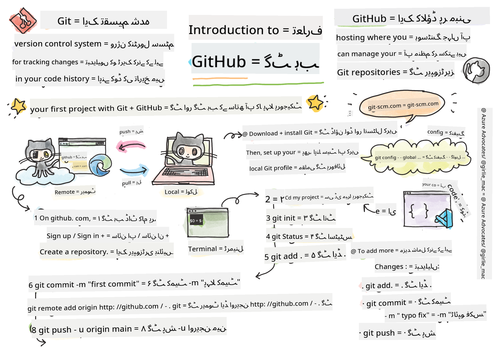
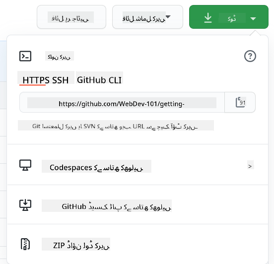

<!--
CO_OP_TRANSLATOR_METADATA:
{
  "original_hash": "acad15f3164cd6348e065ff38619aae9",
  "translation_date": "2025-10-22T14:43:38+00:00",
  "source_file": "1-getting-started-lessons/2-github-basics/README.md",
  "language_code": "ur"
}
-->
# GitHub کا تعارف

ہیلو، مستقبل کے ڈویلپر! 👋 کیا آپ دنیا بھر کے لاکھوں کوڈرز کے ساتھ شامل ہونے کے لیے تیار ہیں؟ میں واقعی پرجوش ہوں کہ آپ کو GitHub سے متعارف کراؤں – اسے پروگرامرز کے لیے سوشل میڈیا پلیٹ فارم سمجھیں، لیکن یہاں لنچ کی تصاویر شیئر کرنے کے بجائے، ہم کوڈ شیئر کرتے ہیں اور مل کر حیرت انگیز چیزیں بناتے ہیں!

یہ بات واقعی حیران کن ہے: آپ کے فون پر موجود ہر ایپ، ہر ویب سائٹ جسے آپ وزٹ کرتے ہیں، اور زیادہ تر ٹولز جنہیں آپ استعمال کرنا سیکھیں گے، وہ ڈویلپرز کی ٹیموں نے GitHub جیسے پلیٹ فارمز پر تعاون کرتے ہوئے بنائے ہیں۔ وہ میوزک ایپ جسے آپ پسند کرتے ہیں؟ کوئی آپ جیسا شخص اس میں حصہ ڈال چکا ہے۔ وہ گیم جسے آپ چھوڑ نہیں سکتے؟ ہاں، شاید GitHub کے تعاون سے بنایا گیا۔ اور اب آپ اس حیرت انگیز کمیونٹی کا حصہ بننا سیکھنے والے ہیں!

مجھے معلوم ہے کہ شروع میں یہ سب کچھ بہت زیادہ محسوس ہو سکتا ہے – مجھے یاد ہے کہ جب میں نے پہلی بار GitHub کا صفحہ دیکھا تو سوچا "یہ سب کیا مطلب ہے؟" لیکن بات یہ ہے: ہر ایک ڈویلپر بالکل وہیں سے شروع کرتا ہے جہاں آپ ابھی ہیں۔ اس سبق کے اختتام تک، آپ کے پاس اپنا ذاتی GitHub ریپوزیٹری ہوگا (اسے کلاؤڈ میں آپ کے ذاتی پروجیکٹ شوکیس کے طور پر سمجھیں)، اور آپ جان جائیں گے کہ اپنا کام کیسے محفوظ کریں، دوسروں کے ساتھ کیسے شیئر کریں، اور ان پروجیکٹس میں کیسے حصہ ڈالیں جنہیں لاکھوں لوگ استعمال کرتے ہیں۔

ہم یہ سفر ایک ساتھ کریں گے، ایک قدم بہ ایک قدم۔ کوئی جلدی نہیں، کوئی دباؤ نہیں – بس آپ، میں، اور کچھ واقعی زبردست ٹولز جو آپ کے نئے بہترین دوست بننے والے ہیں!


> اسکیچ نوٹ [Tomomi Imura](https://twitter.com/girlie_mac) کی طرف سے

## پری لیکچر کوئز
[پری لیکچر کوئز](https://ff-quizzes.netlify.app)

## تعارف

اس سے پہلے کہ ہم واقعی دلچسپ چیزوں میں غوطہ لگائیں، آئیے آپ کے کمپیوٹر کو کچھ GitHub جادو کے لیے تیار کریں! اسے ایک شاہکار تخلیق کرنے سے پہلے اپنے آرٹ سپلائیز کو منظم کرنے جیسا سمجھیں – صحیح ٹولز تیار ہونے سے سب کچھ زیادہ آسان اور زیادہ مزے دار ہو جاتا ہے۔

میں آپ کو ہر سیٹ اپ مرحلے سے ذاتی طور پر گزاروں گا، اور میں وعدہ کرتا ہوں کہ یہ اتنا خوفناک نہیں جتنا پہلی نظر میں لگتا ہے۔ اگر کچھ فوری طور پر سمجھ میں نہ آئے، تو یہ بالکل معمول کی بات ہے! مجھے یاد ہے کہ جب میں نے اپنا پہلا ڈیولپمنٹ ماحول سیٹ اپ کیا تو ایسا محسوس ہوا جیسے میں قدیم ہائروگلیفس پڑھنے کی کوشش کر رہا ہوں۔ ہر ایک ڈویلپر بالکل وہیں رہا ہے جہاں آپ ابھی ہیں، یہ سوچتے ہوئے کہ آیا وہ صحیح کر رہے ہیں۔ اسپوئلر الرٹ: اگر آپ یہاں سیکھ رہے ہیں، تو آپ پہلے ہی صحیح کر رہے ہیں! 🌟

اس سبق میں، ہم کور کریں گے:

- آپ کے کمپیوٹر پر کیے گئے کام کو ٹریک کرنا
- دوسروں کے ساتھ پروجیکٹس پر کام کرنا
- اوپن سورس سافٹ ویئر میں حصہ ڈالنا

### ضروریات

آئیے آپ کے کمپیوٹر کو کچھ GitHub جادو کے لیے تیار کریں! پریشان نہ ہوں – یہ سیٹ اپ آپ کو صرف ایک بار کرنا ہوگا، اور پھر آپ اپنی پوری کوڈنگ سفر کے لیے تیار ہوں گے۔

ٹھیک ہے، آئیے بنیاد سے شروع کریں! سب سے پہلے، ہمیں یہ چیک کرنا ہوگا کہ آیا Git پہلے سے ہی آپ کے کمپیوٹر پر موجود ہے۔ Git بنیادی طور پر ایک سپر اسمارٹ اسسٹنٹ کی طرح ہے جو آپ کے کوڈ میں کی گئی ہر تبدیلی کو یاد رکھتا ہے – ہر دو سیکنڈ میں Ctrl+S کو فرینٹکلی دبانے سے کہیں بہتر (ہم سب وہاں رہے ہیں!)۔

آئیے دیکھتے ہیں کہ آیا Git پہلے سے انسٹال ہے، اس جادوئی کمانڈ کو اپنے ٹرمینل میں ٹائپ کریں:
`git --version`

اگر Git ابھی تک موجود نہیں ہے، تو کوئی مسئلہ نہیں! بس [Git ڈاؤنلوڈ کریں](https://git-scm.com/downloads) اور اسے حاصل کریں۔ ایک بار جب آپ نے اسے انسٹال کر لیا، تو ہمیں Git کو آپ سے صحیح طریقے سے متعارف کرانا ہوگا:

> 💡 **پہلی بار سیٹ اپ**: یہ کمانڈز Git کو بتاتے ہیں کہ آپ کون ہیں۔ یہ معلومات آپ کے ہر کمیٹ کے ساتھ منسلک ہوگی، لہذا ایک نام اور ای میل منتخب کریں جسے آپ عوامی طور پر شیئر کرنے میں آرام دہ ہوں۔

```bash
git config --global user.name "your-name"
git config --global user.email "your-email"
```

یہ چیک کرنے کے لیے کہ آیا Git پہلے سے کنفیگرڈ ہے، آپ ٹائپ کر سکتے ہیں:
```bash
git config --list
```

آپ کو ایک GitHub اکاؤنٹ، ایک کوڈ ایڈیٹر (جیسے Visual Studio Code)، اور اپنا ٹرمینل (یا: کمانڈ پرامپٹ) کھولنے کی ضرورت ہوگی۔

[github.com](https://github.com/) پر جائیں اور اگر آپ نے پہلے سے اکاؤنٹ نہیں بنایا ہے تو ایک اکاؤنٹ بنائیں، یا لاگ ان کریں اور اپنی پروفائل مکمل کریں۔

💡 **جدید مشورہ**: [SSH keys](https://docs.github.com/en/authentication/connecting-to-github-with-ssh) سیٹ اپ کرنے یا [GitHub CLI](https://cli.github.com/) استعمال کرنے پر غور کریں تاکہ پاس ورڈز کے بغیر آسان تصدیق ہو سکے۔

✅ GitHub دنیا میں واحد کوڈ ریپوزیٹری نہیں ہے؛ دیگر بھی ہیں، لیکن GitHub سب سے زیادہ مشہور ہے۔

### تیاری

آپ کو اپنے لوکل مشین (لیپ ٹاپ یا پی سی) پر کوڈ پروجیکٹ کے ساتھ ایک فولڈر اور GitHub پر ایک پبلک ریپوزیٹری کی ضرورت ہوگی، جو دوسروں کے پروجیکٹس میں حصہ ڈالنے کی مثال کے طور پر کام کرے گا۔

### اپنے کوڈ کو محفوظ رکھنا

آئیے ایک لمحے کے لیے سیکیورٹی کے بارے میں بات کرتے ہیں – لیکن پریشان نہ ہوں، ہم آپ کو خوفزدہ کرنے والے مواد سے مغلوب نہیں کریں گے! ان سیکیورٹی طریقوں کو اپنی گاڑی یا گھر کو لاک کرنے جیسا سمجھیں۔ یہ آسان عادات ہیں جو فطری بن جاتی ہیں اور آپ کے محنتی کام کو محفوظ رکھتی ہیں۔

ہم آپ کو شروع سے ہی GitHub کے ساتھ کام کرنے کے جدید، محفوظ طریقے دکھائیں گے۔ اس طرح، آپ اچھے عادات پیدا کریں گے جو آپ کی کوڈنگ کیریئر کے دوران آپ کے لیے فائدہ مند ہوں گے۔

GitHub کے ساتھ کام کرتے وقت، سیکیورٹی کے بہترین طریقوں پر عمل کرنا ضروری ہے:

| سیکیورٹی ایریا | بہترین طریقہ | اس کی اہمیت |
|---------------|---------------|----------------|
| **تصدیق** | SSH keys یا Personal Access Tokens استعمال کریں | پاس ورڈز کم محفوظ ہیں اور ختم کیے جا رہے ہیں |
| **ٹو فیکٹر تصدیق** | اپنے GitHub اکاؤنٹ پر 2FA فعال کریں | اکاؤنٹ کی حفاظت کی اضافی تہہ شامل کرتا ہے |
| **ریپوزیٹری سیکیورٹی** | حساس معلومات کبھی بھی کمیٹ نہ کریں | API keys اور پاس ورڈز کبھی بھی پبلک ریپوز میں نہیں ہونے چاہئیں |
| **ڈیپینڈنسی مینجمنٹ** | Dependabot کو اپڈیٹس کے لیے فعال کریں | آپ کی ڈیپینڈنسیز کو محفوظ اور اپ ٹو ڈیٹ رکھتا ہے |

> ⚠️ **اہم سیکیورٹی یاد دہانی**: API keys، پاس ورڈز، یا دیگر حساس معلومات کو کسی بھی ریپوزیٹری میں کبھی بھی کمیٹ نہ کریں۔ حساس ڈیٹا کی حفاظت کے لیے environment variables اور `.gitignore` فائلز استعمال کریں۔

**جدید تصدیق سیٹ اپ:**

```bash
# Generate SSH key (modern ed25519 algorithm)
ssh-keygen -t ed25519 -C "your_email@example.com"

# Set up Git to use SSH
git remote set-url origin git@github.com:username/repository.git
```

> 💡 **پرو ٹپ**: SSH keys بار بار پاس ورڈز داخل کرنے کی ضرورت کو ختم کر دیتے ہیں اور روایتی تصدیق کے طریقوں سے زیادہ محفوظ ہیں۔

---

## اپنے کوڈ کو پروفیشنل انداز میں منظم کرنا

ٹھیک ہے، یہ وہ جگہ ہے جہاں چیزیں واقعی دلچسپ ہو جاتی ہیں! 🎉 ہم یہ سیکھنے والے ہیں کہ اپنے کوڈ کو پروفیشنلز کی طرح کیسے ٹریک اور منظم کریں، اور ایمانداری سے، یہ میری پسندیدہ چیزوں میں سے ایک ہے کیونکہ یہ واقعی گیم چینجر ہے۔

تصور کریں: آپ ایک حیرت انگیز کہانی لکھ رہے ہیں، اور آپ ہر ڈرافٹ، ہر شاندار ایڈیٹ، اور ہر "انتظار کریں، یہ تو زبردست ہے!" لمحے کو ٹریک کرنا چاہتے ہیں۔ یہی کام Git آپ کے کوڈ کے لیے کرتا ہے! یہ ایسا ہے جیسے آپ کے پاس سب سے ناقابل یقین وقت سفر کرنے والی نوٹ بک ہو جو سب کچھ یاد رکھتی ہے – ہر کی اسٹروک، ہر تبدیلی، ہر "اوہ، یہ سب کچھ خراب ہو گیا" لمحہ جسے آپ فوری طور پر واپس لے سکتے ہیں۔

میں ایمانداری سے کہوں تو – شروع میں یہ سب کچھ بہت زیادہ محسوس ہو سکتا ہے۔ جب میں نے شروع کیا، تو میں نے سوچا "میں اپنی فائلز کو نارمل طریقے سے کیوں محفوظ نہیں کر سکتا؟" لیکن مجھ پر بھروسہ کریں: ایک بار جب Git آپ کے لیے کلک کرے گا (اور یہ کرے گا!)، آپ کے پاس وہ لمحہ ہوگا جب آپ سوچیں گے "میں نے کبھی اس کے بغیر کوڈنگ کیسے کی؟" یہ ایسا ہے جیسے آپ نے دریافت کیا کہ آپ اڑ سکتے ہیں جب آپ اپنی پوری زندگی پیدل چل رہے تھے!

فرض کریں کہ آپ کے پاس لوکل فولڈر میں کچھ کوڈ پروجیکٹ ہے اور آپ اپنے پروگریس کو ٹریک کرنا چاہتے ہیں – ورژن کنٹرول سسٹم Git کا استعمال کرتے ہوئے۔ کچھ لوگ Git کا استعمال اپنے مستقبل کے خود کے لیے محبت کا خط لکھنے کے مترادف سمجھتے ہیں۔ اپنے کمیٹ میسیجز کو دنوں، ہفتوں، یا مہینوں بعد پڑھتے ہوئے آپ کو یاد آئے گا کہ آپ نے کوئی فیصلہ کیوں کیا، یا کسی تبدیلی کو "رول بیک" کریں گے – یعنی، جب آپ اچھے "کمیٹ میسیجز" لکھتے ہیں۔

### کام: اپنی پہلی ریپوزیٹری بنائیں!

> 🎯 **آپ کا مشن (اور میں آپ کے لیے بہت پرجوش ہوں!)**: ہم آپ کے ساتھ مل کر آپ کی پہلی GitHub ریپوزیٹری بنائیں گے! جب ہم یہاں ختم کریں گے، تو آپ کے پاس انٹرنیٹ پر اپنا چھوٹا سا گوشہ ہوگا جہاں آپ کا کوڈ موجود ہوگا، اور آپ نے اپنا پہلا "کمیٹ" کیا ہوگا (یہ ڈویلپر زبان میں اپنے کام کو واقعی ہوشیار طریقے سے محفوظ کرنے کے لیے کہا جاتا ہے)۔
>
> یہ واقعی ایک خاص لمحہ ہے – آپ عالمی ڈویلپرز کی کمیونٹی میں باضابطہ طور پر شامل ہونے والے ہیں! مجھے اب بھی یاد ہے کہ اپنی پہلی ریپوزیٹری بنانے کا جوش اور یہ سوچنا "واہ، میں واقعی یہ کر رہا ہوں!"

آئیے اس مہم جوئی کو ایک ساتھ، قدم بہ قدم، طے کریں۔ ہر حصے کے ساتھ اپنا وقت لیں – جلدی کرنے کا کوئی انعام نہیں ہے، اور میں وعدہ کرتا ہوں کہ ہر ایک قدم سمجھ میں آئے گا۔ یاد رکھیں، ہر وہ کوڈنگ سپر اسٹار جس کی آپ تعریف کرتے ہیں، کبھی وہیں بیٹھا تھا جہاں آپ ابھی ہیں، اپنی پہلی ریپوزیٹری بنانے والا۔ یہ کتنا زبردست ہے؟

> ویڈیو دیکھیں
> 
> [](https://www.youtube.com/watch?v=9R31OUPpxU4)

**آئیے یہ ایک ساتھ کریں:**

1. **GitHub پر اپنی ریپوزیٹری بنائیں**۔ GitHub.com پر جائیں اور وہ روشن سبز **نیا** بٹن (یا اوپر دائیں کونے میں **+** نشان) تلاش کریں۔ اس پر کلک کریں اور **نئی ریپوزیٹری** منتخب کریں۔

   یہاں کیا کرنا ہے:
   1. اپنی ریپوزیٹری کو ایک نام دیں – اسے اپنے لیے معنی خیز بنائیں!
   1. اگر آپ چاہیں تو ایک وضاحت شامل کریں (یہ دوسروں کو بتانے میں مدد کرتا ہے کہ آپ کا پروجیکٹ کیا ہے)
   1. فیصلہ کریں کہ آپ اسے پبلک (ہر کوئی اسے دیکھ سکتا ہے) یا پرائیویٹ (صرف آپ کے لیے) بنانا چاہتے ہیں
   1. میں تجویز کرتا ہوں کہ README فائل شامل کرنے کے باکس کو چیک کریں – یہ آپ کے پروجیکٹ کا فرنٹ پیج جیسا ہے
   1. **ریپوزیٹری بنائیں** پر کلک کریں اور جشن منائیں – آپ نے اپنی پہلی ریپوزیٹری بنائی! 🎉

2. **اپنے پروجیکٹ فولڈر پر جائیں**۔ اب آئیے اپنا ٹرمینل کھولیں (پریشان نہ ہوں، یہ اتنا خوفناک نہیں جتنا لگتا ہے!)۔ ہمیں اپنے کمپیوٹر کو بتانا ہوگا کہ ہمارے پروجیکٹ فائلز کہاں ہیں۔ یہ کمانڈ ٹائپ کریں:

   ```bash
   cd [name of your folder]
   ```

   **یہاں ہم کیا کر رہے ہیں:**
   - ہم بنیادی طور پر کہہ رہے ہیں "ہی کمپیوٹر، مجھے میرے پروجیکٹ فولڈر پر لے چلو"
   - یہ آپ کے ڈیسک ٹاپ پر ایک مخصوص فولڈر کھولنے جیسا ہے، لیکن ہم یہ ٹیکسٹ کمانڈز کے ساتھ کر رہے ہیں
   - `[آپ کے فولڈر کا نام]` کو اپنے پروجیکٹ فولڈر کے اصل نام سے تبدیل کریں

3. **اپنے فولڈر کو Git ریپوزیٹری میں تبدیل کریں**۔ یہ وہ جگہ ہے جہاں جادو ہوتا ہے! ٹائپ کریں:

   ```bash
   git init
   ```

   **یہاں کیا ہوا (واقعی زبردست چیزیں!):**
   - Git نے آپ کے پروجیکٹ میں ایک چھپا ہوا `.git` فولڈر بنایا – آپ اسے نہیں دیکھیں گے، لیکن یہ وہاں موجود ہے!
   - آپ کا عام فولڈر اب ایک "ریپوزیٹری" ہے جو آپ کی کی گئی ہر تبدیلی کو ٹریک کر سکتا ہے
   - اسے ایسا سمجھیں جیسے آپ کے فولڈر کو سب کچھ یاد رکھنے کی سپر پاورز دی گئی ہوں

4. **چیک کریں کہ کیا ہو رہا ہے**۔ آئیے دیکھتے ہیں کہ Git اس وقت آپ کے پروجیکٹ کے بارے میں کیا سوچتا ہے:

   ```bash
   git status
   ```

   **سمجھیں کہ Git آپ کو کیا بتا رہا ہے:**
   
   آپ کو کچھ ایسا نظر آ سکتا ہے:

   ```output
   Changes not staged for commit:
   (use "git add <file>..." to update what will be committed)
   (use "git restore <file>..." to discard changes in working directory)

        modified:   file.txt
        modified:   file2.txt
   ```

   **پریشان نہ ہوں! اس کا مطلب یہ ہے:**
   - **سرخ** میں فائلز وہ ہیں جن میں تبدیلیاں ہیں لیکن وہ ابھی محفوظ کرنے کے لیے تیار نہیں ہیں
   - **سبز** میں فائلز (جب آپ انہیں دیکھیں گے) محفوظ کرنے کے لیے تیار ہیں
   - Git آپ کی مدد کر رہا ہے، بالکل بتا کر کہ آپ اگلے کیا کر سکتے ہیں

   > 💡 **پرو ٹپ**: `git status` کمانڈ آپ کا بہترین دوست ہے! جب بھی آپ الجھن میں ہوں کہ کیا ہو رہا ہے، اسے استعمال کریں۔ یہ ایسا ہے جیسے Git سے پوچھنا "ہی، ابھی کیا صورتحال ہے؟"

5. **اپنی فائلز کو محفوظ کرنے کے لیے تیار کریں** (اسے "اسٹیجنگ" کہا جاتا ہے):

   ```bash
   git add .
   ```

   **ہم نے ابھی کیا کیا:**
   - ہم نے Git کو بتایا "ہی، میں اپنی تمام فائلز کو اگلے محفوظ کرنے میں شامل کرنا چاہتا ہوں"
   - `.` ایسا ہے جیسے کہہ رہے ہوں "اس فولڈر میں سب کچھ"
   - اب آپ کی فائلز "اسٹیجڈ" ہیں اور اگلے مرحلے کے لیے تیار ہیں

   **زیادہ منتخب ہونا چاہتے ہیں؟** آپ صرف مخصوص فائلز شامل کر سکتے ہیں:

   ```bash
   git add [file or folder name]
   ```

   **آپ ایسا کیوں کرنا چاہیں گے؟**
   - کبھی کبھی آپ متعلقہ تبدیلیوں کو ایک ساتھ محفوظ کرنا چاہتے ہیں
   - یہ آپ کے کام کو منطقی حصوں میں منظم کرنے میں مدد کرتا ہے
   - یہ سمجھنا آسان بناتا ہے کہ کیا بدلا اور کب

   **اپنا ارادہ بدل لیا؟** کوئی مسئلہ نہیں! آپ فائلز کو اسٹیج سے باہر نکال سکتے ہیں:

   ```bash
   # Unstage everything
   git reset
   
   # Unstage just one file
   git reset [file name]
   ```

   پریشان نہ ہوں – یہ آپ کے کام کو حذف نہیں کرتا، یہ صرف فائلز کو "محفوظ کرنے کے لیے تیار" کے ڈھیر سے نکالتا ہے۔

6. **اپنا کام مستقل طور پر محفوظ کریں** (اپنا پہلا کمیٹ بنانا!):

   ```bash
   git commit -m "first commit"
   ```

   **🎉 مبارک ہو! آپ نے اپنا پہلا کمیٹ بنایا!**
   
   **یہاں کیا ہوا:**
   - Git نے آپ کی تمام اسٹیجڈ فائلز کا اس خاص لمحے پر "اسنیپ شاٹ" لیا
   - آپ کا کمیٹ میسیج "پہلا کمیٹ" بتاتا ہے کہ یہ محفوظ کرنے کا پوائنٹ کس بارے میں ہے
   - Git نے اس اسنیپ شاٹ کو ایک منفرد ID دی تاکہ آپ اسے ہمیشہ بعد میں تلاش کر سکیں
   - آپ نے باضابطہ طور پر اپنے پروجیکٹ کی تاریخ کو ٹریک کرنا شروع کر دیا ہے!

   > 💡 **مستقبل کے کمیٹ میسیجز**: اپنے اگلے کمیٹس کے لیے، زیادہ وضاحت کریں! "اپ ڈیٹڈ اسٹف" کے بجائے، "ہوم پیج پر کانٹیکٹ فارم شامل کریں" یا "نیویگیشن مینو بگ کو ٹھیک کریں" آزمائیں۔ آپ کا مستقبل کا خود آپ کا شکر گزار ہوگا!

7. **اپنے لوکل پرو
   - ہم نے آپ کے مقامی پروجیکٹ اور آپ کے GitHub ریپوزیٹری کے درمیان ایک کنکشن بنایا ہے۔
   - "Origin" آپ کے GitHub ریپوزیٹری کا صرف ایک عرفی نام ہے – یہ بالکل ایسے ہے جیسے آپ اپنے فون میں کسی کانٹیکٹ کو شامل کرتے ہیں۔
   - اب آپ کا مقامی Git جانتا ہے کہ آپ کا کوڈ کہاں بھیجنا ہے جب آپ اسے شیئر کرنے کے لیے تیار ہوں۔

   💡 **آسان طریقہ**: اگر آپ نے GitHub CLI انسٹال کیا ہوا ہے، تو آپ یہ ایک کمانڈ میں کر سکتے ہیں:
   ```bash
   gh repo create my-repo --public --push --source=.
   ```

8. **اپنا کوڈ GitHub پر بھیجیں** (یہ بڑا لمحہ ہے!):

   ```bash
   git push -u origin main
   ```

   **🚀 یہ وہ لمحہ ہے! آپ اپنا کوڈ GitHub پر اپلوڈ کر رہے ہیں!**
   
   **کیا ہو رہا ہے:**
   - آپ کے commits آپ کے کمپیوٹر سے GitHub تک جا رہے ہیں۔
   - `-u` فلیگ ایک مستقل کنکشن قائم کرتا ہے تاکہ آئندہ کے اپلوڈز آسان ہوں۔
   - "main" آپ کی بنیادی برانچ کا نام ہے (جیسے مرکزی فولڈر)۔
   - اس کے بعد، آپ آئندہ اپلوڈز کے لیے صرف `git push` ٹائپ کر سکتے ہیں!

   💡 **جلدی نوٹ**: اگر آپ کی برانچ کا نام کچھ اور ہے (جیسے "master")، تو وہ نام استعمال کریں۔ آپ `git branch --show-current` کے ذریعے چیک کر سکتے ہیں۔

9. **آپ کا نیا روزمرہ کوڈنگ کا معمول** (یہ وہ جگہ ہے جہاں یہ عادت بن جاتی ہے!):

   اب سے، جب بھی آپ اپنے پروجیکٹ میں تبدیلیاں کریں گے، آپ کے پاس یہ آسان تین قدمی عمل ہوگا:

   ```bash
   git add .
   git commit -m "describe what you changed"
   git push
   ```

   **یہ آپ کی کوڈنگ کی دھڑکن بن جاتی ہے:**
   - اپنے کوڈ میں کچھ زبردست تبدیلیاں کریں ✨
   - انہیں `git add` کے ساتھ اسٹیج کریں ("Hey Git, ان تبدیلیوں پر توجہ دیں!")
   - انہیں `git commit` اور ایک وضاحتی پیغام کے ساتھ محفوظ کریں (مستقبل کا آپ آپ کا شکریہ ادا کرے گا!)
   - انہیں دنیا کے ساتھ شیئر کریں `git push` کے ذریعے 🚀
   - بار بار کریں – واقعی، یہ سانس لینے کی طرح قدرتی بن جاتا ہے!

   مجھے یہ ورک فلو پسند ہے کیونکہ یہ ویڈیو گیم میں متعدد سیو پوائنٹس رکھنے جیسا ہے۔ کوئی تبدیلی کی جو آپ کو پسند آئی؟ Commit کریں! کچھ خطرناک آزمانا چاہتے ہیں؟ کوئی مسئلہ نہیں – اگر چیزیں خراب ہو جائیں تو آپ ہمیشہ اپنے آخری commit پر واپس جا سکتے ہیں!

   > 💡 **ٹپ**: آپ `.gitignore` فائل اپنانا بھی چاہ سکتے ہیں تاکہ وہ فائلیں جو آپ ٹریک نہیں کرنا چاہتے GitHub پر ظاہر نہ ہوں - جیسے وہ نوٹس فائل جو آپ اسی فولڈر میں محفوظ کرتے ہیں لیکن عوامی ریپوزیٹری میں اس کی کوئی جگہ نہیں۔ آپ `.gitignore` فائلز کے ٹیمپلیٹس [.gitignore templates](https://github.com/github/gitignore) پر یا [gitignore.io](https://www.toptal.com/developers/gitignore) کے ذریعے بنا سکتے ہیں۔

#### جدید Git ورک فلو

ان جدید طریقوں کو اپنانے پر غور کریں:

- **Conventional Commits**: ایک معیاری commit پیغام فارمیٹ استعمال کریں جیسے `feat:`, `fix:`, `docs:` وغیرہ۔ مزید جانیں [conventionalcommits.org](https://www.conventionalcommits.org/) پر۔
- **Atomic commits**: ہر commit کو ایک منطقی تبدیلی کی نمائندگی کریں۔
- **Frequent commits**: بڑے، کم وقفے والے commits کے بجائے اکثر اور وضاحتی پیغامات کے ساتھ commit کریں۔

#### Commit پیغامات

ایک بہترین Git commit سبجیکٹ لائن درج ذیل جملے کو مکمل کرتی ہے:
اگر لاگو کیا گیا، تو یہ commit <آپ کی سبجیکٹ لائن یہاں>

سبجیکٹ کے لیے imperative، present tense استعمال کریں: "change" نہ کہ "changed" یا "changes"۔
جیسے سبجیکٹ میں، باڈی (اختیاری) میں بھی imperative، present tense استعمال کریں۔ باڈی میں تبدیلی کی وجہ شامل کریں اور اسے پچھلے رویے کے ساتھ موازنہ کریں۔ آپ `کیوں` کی وضاحت کر رہے ہیں، نہ کہ `کیسے`۔

✅ GitHub پر کچھ وقت گزاریں۔ کیا آپ واقعی ایک بہترین commit پیغام تلاش کر سکتے ہیں؟ کیا آپ ایک بہت ہی مختصر پیغام تلاش کر سکتے ہیں؟ آپ کے خیال میں commit پیغام میں کون سی معلومات سب سے زیادہ اہم اور مفید ہیں؟

## دوسروں کے ساتھ کام کرنا (مزا دار حصہ!)

اپنی ٹوپی تھام لیں کیونکہ یہ وہ جگہ ہے جہاں GitHub بالکل جادوئی ہو جاتا ہے! 🪄 آپ نے اپنے کوڈ کو منظم کرنے میں مہارت حاصل کر لی ہے، لیکن اب ہم میرے بالکل پسندیدہ حصے میں جا رہے ہیں – دنیا بھر کے حیرت انگیز لوگوں کے ساتھ تعاون کرنا۔

یہ تصور کریں: آپ کل صبح اٹھتے ہیں اور دیکھتے ہیں کہ ٹوکیو میں کسی نے آپ کے کوڈ کو بہتر بنایا ہے جب آپ سو رہے تھے۔ پھر برلن میں کسی نے ایک بگ ٹھیک کیا جس پر آپ پھنسے ہوئے تھے۔ دوپہر تک، ساؤ پالو میں ایک ڈویلپر نے ایک فیچر شامل کیا جس کے بارے میں آپ نے کبھی سوچا بھی نہیں تھا۔ یہ سائنس فکشن نہیں ہے – یہ صرف GitHub کائنات میں ایک عام دن ہے!

جو چیز مجھے واقعی پرجوش کرتی ہے وہ یہ ہے کہ آپ جو تعاون کی مہارتیں سیکھنے والے ہیں؟ یہ وہی ورک فلو ہیں جو گوگل، مائیکروسافٹ، اور آپ کے پسندیدہ اسٹارٹ اپس کی ٹیمیں ہر روز استعمال کرتی ہیں۔ آپ صرف ایک زبردست ٹول نہیں سیکھ رہے – آپ وہ خفیہ زبان سیکھ رہے ہیں جو پوری سافٹ ویئر دنیا کو ایک ساتھ کام کرنے کے قابل بناتی ہے۔

سچ میں، جب آپ کسی کے پہلے pull request کو merge کرنے کا جوش محسوس کرتے ہیں، تو آپ سمجھ جائیں گے کہ ڈویلپرز اوپن سورس کے بارے میں اتنے پرجوش کیوں ہوتے ہیں۔ یہ دنیا کے سب سے بڑے، سب سے تخلیقی ٹیم پروجیکٹ کا حصہ بننے جیسا ہے!

> ویڈیو دیکھیں
>
> [](https://www.youtube.com/watch?v=bFCM-PC3cu8)

GitHub پر چیزیں ڈالنے کی بنیادی وجہ دوسرے ڈویلپرز کے ساتھ تعاون ممکن بنانا تھا۔

اپنے ریپوزیٹری میں، `Insights > Community` پر جائیں تاکہ دیکھ سکیں کہ آپ کا پروجیکٹ تجویز کردہ کمیونٹی معیارات کے ساتھ کیسے موازنہ کرتا ہے۔

اپنے ریپوزیٹری کو پیشہ ورانہ اور خوش آمدید بنانے کے لیے؟ اپنے ریپوزیٹری پر جائیں اور `Insights > Community` پر کلک کریں۔ یہ زبردست فیچر آپ کو دکھاتا ہے کہ آپ کا پروجیکٹ GitHub کمیونٹی کے "اچھے ریپوزیٹری طریقوں" کے ساتھ کیسے موازنہ کرتا ہے۔

> 🎯 **اپنے پروجیکٹ کو چمکائیں**: ایک اچھی طرح سے منظم ریپوزیٹری جس میں اچھی دستاویزات ہوں، ایک صاف، خوش آمدید دینے والے اسٹور فرنٹ کی طرح ہے۔ یہ لوگوں کو بتاتا ہے کہ آپ اپنے کام کی پرواہ کرتے ہیں اور دوسروں کو تعاون کرنے کی ترغیب دیتا ہے!

**ایک ریپوزیٹری کو زبردست بنانے کے لیے:**

| کیا شامل کریں | کیوں یہ اہم ہے | آپ کے لیے کیا کرتا ہے |
|-------------|-------------------|---------------------|
| **تفصیل** | پہلا تاثر اہم ہے! | لوگ فوراً جانتے ہیں کہ آپ کا پروجیکٹ کیا کرتا ہے |
| **README** | آپ کے پروجیکٹ کا فرنٹ پیج | نئے وزیٹرز کے لیے ایک دوستانہ گائیڈ کی طرح |
| **Contributing Guidelines** | دکھاتا ہے کہ آپ مدد کا خیر مقدم کرتے ہیں | لوگ جانتے ہیں کہ وہ آپ کی کیسے مدد کر سکتے ہیں |
| **Code of Conduct** | ایک دوستانہ جگہ بناتا ہے | ہر کوئی حصہ لینے کے لیے خوش آمدید محسوس کرتا ہے |
| **License** | قانونی وضاحت | دوسرے جانتے ہیں کہ وہ آپ کے کوڈ کو کیسے استعمال کر سکتے ہیں |
| **Security Policy** | دکھاتا ہے کہ آپ ذمہ دار ہیں | پیشہ ورانہ طریقوں کا مظاہرہ کرتا ہے |

> 💡 **پرو ٹپ**: GitHub ان تمام فائلوں کے لیے ٹیمپلیٹس فراہم کرتا ہے۔ جب نیا ریپوزیٹری بناتے ہیں، تو ان فائلوں کو خودکار طور پر بنانے کے لیے چیک باکسز کو منتخب کریں۔

**جدید GitHub فیچرز کو دریافت کریں:**

🤖 **آٹومیشن اور CI/CD:**
- **GitHub Actions** خودکار ٹیسٹنگ اور ڈیپلائمنٹ کے لیے
- **Dependabot** خودکار dependency اپڈیٹس کے لیے

💬 **کمیونٹی اور پروجیکٹ مینجمنٹ:**
- **GitHub Discussions** مسائل سے ہٹ کر کمیونٹی گفتگو کے لیے
- **GitHub Projects** کانبان اسٹائل پروجیکٹ مینجمنٹ کے لیے
- **Branch protection rules** کوڈ کوالٹی معیارات نافذ کرنے کے لیے

یہ تمام وسائل نئے ٹیم ممبرز کو شامل کرنے میں فائدہ مند ہوں گے۔ اور یہ وہ چیزیں ہیں جنہیں نئے تعاون کرنے والے آپ کے کوڈ کو دیکھنے سے پہلے دیکھتے ہیں، یہ جاننے کے لیے کہ آیا آپ کا پروجیکٹ ان کے وقت کے لیے صحیح جگہ ہے۔

✅ README فائلز، حالانکہ انہیں تیار کرنے میں وقت لگتا ہے، اکثر مصروف منتظمین کے ذریعے نظر انداز کی جاتی ہیں۔ کیا آپ کسی خاص طور پر وضاحتی مثال تلاش کر سکتے ہیں؟ نوٹ: کچھ [اوزار جو اچھی README بنانے میں مدد کرتے ہیں](https://www.makeareadme.com/) آپ آزما سکتے ہیں۔

### کام: کچھ کوڈ کو merge کریں

Contributing دستاویزات لوگوں کو پروجیکٹ میں تعاون کرنے میں مدد دیتی ہیں۔ یہ وضاحت کرتی ہیں کہ آپ کس قسم کے تعاون کی تلاش کر رہے ہیں اور عمل کیسے کام کرتا ہے۔ تعاون کرنے والوں کو آپ کے GitHub ریپوزیٹری میں تعاون کرنے کے قابل ہونے کے لیے کئی مراحل سے گزرنا ہوگا:

1. **آپ کے ریپوزیٹری کو فورک کرنا** آپ شاید چاہیں گے کہ لوگ آپ کے پروجیکٹ کو _fork_ کریں۔ فورک کرنے کا مطلب ہے کہ آپ کے ریپوزیٹری کی ایک نقل ان کے GitHub پروفائل پر بنانا۔
1. **کلون**۔ وہاں سے وہ پروجیکٹ کو اپنی مقامی مشین پر کلون کریں گے۔
1. **برانچ بنائیں**۔ آپ چاہیں گے کہ وہ اپنے کام کے لیے ایک _برانچ_ بنائیں۔
1. **اپنی تبدیلی کو ایک علاقے پر مرکوز کریں**۔ تعاون کرنے والوں سے کہیں کہ وہ اپنی تبدیلیوں کو ایک وقت میں ایک چیز پر مرکوز کریں - اس طرح ان کے کام کو _merge_ کرنے کے امکانات زیادہ ہیں۔ تصور کریں کہ انہوں نے ایک بگ ٹھیک کیا، ایک نیا فیچر شامل کیا، اور کئی ٹیسٹس کو اپڈیٹ کیا - کیا ہوگا اگر آپ 3 میں سے 2 یا 1 تبدیلی کو نافذ کرنا چاہتے ہیں یا کر سکتے ہیں؟

✅ ایک ایسی صورتحال کا تصور کریں جہاں برانچز اچھا کوڈ لکھنے اور بھیجنے کے لیے خاص طور پر اہم ہوں۔ آپ کون سے استعمال کے کیسز سوچ سکتے ہیں؟

> نوٹ، وہ تبدیلی بنیں جو آپ دنیا میں دیکھنا چاہتے ہیں، اور اپنے کام کے لیے برانچز بنائیں۔ کوئی بھی commits جو آپ کرتے ہیں وہ اس برانچ پر کیے جائیں گے جس پر آپ فی الحال "چیک آؤٹ" ہیں۔ `git status` استعمال کریں یہ دیکھنے کے لیے کہ وہ کون سی برانچ ہے۔

آئیے ایک تعاون کرنے والے کے ورک فلو سے گزرتے ہیں۔ فرض کریں کہ تعاون کرنے والے نے پہلے ہی ریپوزیٹری کو _fork_ اور _clone_ کیا ہے تاکہ ان کے پاس کام کرنے کے لیے ایک تیار Git ریپوزیٹری ہو، ان کی مقامی مشین پر:

1. **برانچ بنائیں**۔ کمانڈ `git branch` استعمال کریں تاکہ ایک برانچ بنائی جا سکے جو وہ تبدیلیاں رکھے گی جو وہ تعاون کرنے کا ارادہ رکھتے ہیں:

   ```bash
   git branch [branch-name]
   ```

   > 💡 **جدید طریقہ**: آپ ایک کمانڈ میں نئی برانچ بنا سکتے ہیں اور اس پر سوئچ کر سکتے ہیں:
   ```bash
   git switch -c [branch-name]
   ```

1. **کام کرنے والی برانچ پر سوئچ کریں**۔ مخصوص برانچ پر سوئچ کریں اور `git switch` کے ساتھ ورکنگ ڈائریکٹری کو اپڈیٹ کریں:

   ```bash
   git switch [branch-name]
   ```

   > 💡 **جدید نوٹ**: `git switch` برانچز تبدیل کرنے کے لیے `git checkout` کا جدید متبادل ہے۔ یہ واضح اور ابتدائیوں کے لیے محفوظ ہے۔

1. **کام کریں**۔ اس مرحلے پر آپ اپنی تبدیلیاں شامل کرنا چاہتے ہیں۔ Git کو اس کے بارے میں بتانا نہ بھولیں درج ذیل کمانڈز کے ساتھ:

   ```bash
   git add .
   git commit -m "my changes"
   ```

   > ⚠️ **Commit پیغام کا معیار**: یقینی بنائیں کہ آپ اپنے commit کو اچھا نام دیں، اپنے اور اس ریپوزیٹری کے منتظم کے لیے جس پر آپ مدد کر رہے ہیں۔ آپ نے کیا تبدیل کیا اس کے بارے میں مخصوص رہیں!

1. **اپنے کام کو `main` برانچ کے ساتھ ملائیں**۔ کسی وقت آپ کام مکمل کر لیتے ہیں اور آپ اپنا کام `main` برانچ کے ساتھ ملانا چاہتے ہیں۔ اس دوران `main` برانچ میں تبدیلی ہو سکتی ہے، اس لیے یقینی بنائیں کہ آپ پہلے اسے درج ذیل کمانڈز کے ساتھ تازہ ترین کریں:

   ```bash
   git switch main
   git pull
   ```

   اس مرحلے پر آپ یہ یقینی بنانا چاہتے ہیں کہ کوئی _conflicts_، ایسی صورتحال جہاں Git آسانی سے _combine_ نہیں کر سکتا، آپ کی ورکنگ برانچ میں ہو۔ لہذا درج ذیل کمانڈز چلائیں:

   ```bash
   git switch [branch_name]
   git merge main
   ```

   `git merge main` کمانڈ آپ کی برانچ میں `main` سے تمام تبدیلیاں لے آئے گی۔ امید ہے کہ آپ بس جاری رکھ سکتے ہیں۔ اگر نہیں، تو VS Code آپ کو بتائے گا کہ Git کہاں _confused_ ہے اور آپ متاثرہ فائلوں میں ترمیم کر کے بتا سکتے ہیں کہ کون سا مواد زیادہ درست ہے۔

   💡 **جدید متبادل**: ایک صاف ستھری ہسٹری کے لیے `git rebase` استعمال کرنے پر غور کریں:
   ```bash
   git rebase main
   ```
   یہ آپ کے commits کو تازہ ترین main برانچ کے اوپر دوبارہ چلاتا ہے، ایک لکیری ہسٹری بناتا ہے۔

1. **اپنا کام GitHub پر بھیجیں**۔ اپنا کام GitHub پر بھیجنے کا مطلب دو چیزیں ہیں۔ اپنی برانچ کو اپنے ریپوزیٹری پر دھکیلنا اور پھر ایک PR، Pull Request کھولنا۔

   ```bash
   git push --set-upstream origin [branch-name]
   ```

   اوپر دی گئی کمانڈ آپ کے فورک کیے گئے ریپوزیٹری پر برانچ بناتی ہے۔

1. **PR کھولیں**۔ اگلے مرحلے میں، آپ ایک PR کھولنا چاہتے ہیں۔ آپ یہ GitHub پر فورک کیے گئے ریپوزیٹری پر جا کر کرتے ہیں۔ آپ کو GitHub پر ایک اشارہ نظر آئے گا جہاں وہ پوچھے گا کہ آیا آپ ایک نیا PR بنانا چاہتے ہیں، آپ اس پر کلک کریں گے اور آپ کو ایک انٹرفیس پر لے جایا جائے گا جہاں آپ commit پیغام کا عنوان تبدیل کر سکتے ہیں، اسے ایک زیادہ موزوں وضاحت دے سکتے ہیں۔ اب وہ ریپوزیٹری کا منتظم جسے آپ نے فورک کیا تھا، اس PR کو دیکھے گا اور _امید ہے_ کہ وہ اس کی تعریف کرے گا اور آپ کے PR کو _merge_ کرے گا۔ آپ اب ایک تعاون کرنے والے ہیں، واہ :)

   💡 **جدید ٹپ**: آپ GitHub CLI استعمال کرتے ہوئے بھی PR بنا سکتے ہیں:
   ```bash
   gh pr create --title "Your PR title" --body "Description of changes"
   ```

   🔧 **PRs کے لیے بہترین طریقے**:
   - متعلقہ مسائل کو "Fixes #123" جیسے کلیدی الفاظ کے ساتھ لنک کریں۔
   - UI تبدیلیوں کے لیے اسکرین شاٹس شامل کریں۔
   - مخصوص جائزہ لینے والوں کی درخواست کریں۔
   - کام جاری رکھنے کے لیے ڈرافٹ PRs استعمال کریں۔
   - جائزہ لینے کی درخواست کرنے سے پہلے تمام CI چیکس پاس کریں۔

1. **صفائی کریں**۔ یہ اچھا عمل سمجھا جاتا ہے کہ آپ کامیابی سے PR merge کرنے کے بعد _صفائی کریں_۔ آپ اپنی مقامی برانچ اور وہ برانچ جسے آپ نے GitHub پر دھکیلا ہے، دونوں کو صاف کرنا چاہتے ہیں۔ پہلے اسے درج ذیل کمانڈ کے ساتھ مقامی طور پر حذف کریں:

   ```bash
   git branch -d [branch-name]
   ```

   یقینی بنائیں کہ آپ فورک کیے گئے ریپوزیٹری کے GitHub صفحے پر جائیں اور وہ ریموٹ برانچ ہٹا دیں جسے آپ نے ابھی دھکیلا ہے۔

`Pull request` ایک عجیب اصطلاح لگتی ہے کیونکہ حقیقت میں آپ اپنے پروجیکٹ میں تبدیلیاں دھکیلنا چاہتے ہیں۔ لیکن منتظم (پروجیکٹ کے مالک) یا کور ٹیم کو آپ کی تبدیلیوں پر غور کرنے کی ضرورت ہے اس سے پہلے کہ وہ پروجیکٹ کی "main" برانچ کے ساتھ merge کریں، اس لیے آپ واقعی منتظم سے تبدیلی کے فیصلے کی درخواست کر رہے ہیں۔

ایک pull request وہ جگہ ہے جہاں برانچ پر متعارف کرائی گئی تبدیلیوں کا موازنہ اور بحث کی جاتی ہے، جائزوں، تبصروں، مربوط ٹیسٹس، اور مزید کے ساتھ۔ ایک اچھا pull request تقریباً وہی اصولوں پر عمل کرتا ہے جو ایک commit پیغام کے لیے ہوتے ہیں۔ آپ مسئلے کے ٹریکر میں کسی مسئلے کا حوالہ دے سکتے ہیں، جب آپ کا کام مثال کے طور پر کسی مسئلے
🤞امید ہے کہ تمام چیکس کامیاب ہوں اور پروجیکٹ کے مالک آپ کی تبدیلیوں کو پروجیکٹ میں شامل کر لیں🤞

اپنی موجودہ لوکل ورکنگ برانچ کو GitHub پر متعلقہ ریموٹ برانچ کے تمام نئے کمیٹس کے ساتھ اپ ڈیٹ کریں:

`git pull`

## اوپن سورس میں تعاون (آپ کا موقع اثر ڈالنے کا!)

کیا آپ کچھ ایسا کرنے کے لیے تیار ہیں جو آپ کے دماغ کو حیران کر دے گا؟ 🤯 آئیے اوپن سورس پروجیکٹس میں تعاون کے بارے میں بات کرتے ہیں – اور میں یہ آپ کے ساتھ شیئر کرنے کے بارے میں سوچ کر ہی پرجوش ہو رہا ہوں!

یہ آپ کا موقع ہے کہ آپ کچھ واقعی غیر معمولی کا حصہ بنیں۔ تصور کریں کہ ان ٹولز کو بہتر بنائیں جو لاکھوں ڈویلپرز روزانہ استعمال کرتے ہیں، یا کسی ایپ میں بگ کو ٹھیک کریں جسے آپ کے دوست پسند کرتے ہیں۔ یہ صرف ایک خواب نہیں ہے – یہی اوپن سورس تعاون کا مطلب ہے!

یہ وہ چیز ہے جو مجھے ہر بار سوچنے پر جھنجھوڑ دیتی ہے: ہر وہ ٹول جس کے ساتھ آپ نے سیکھا ہے – آپ کا کوڈ ایڈیٹر، وہ فریم ورک جنہیں ہم دریافت کریں گے، یہاں تک کہ وہ براؤزر جس میں آپ یہ پڑھ رہے ہیں – کسی نے اپنی پہلی شراکت کے ساتھ شروع کیا تھا، بالکل آپ کی طرح۔ وہ شاندار ڈویلپر جس نے آپ کا پسندیدہ VS Code ایکسٹینشن بنایا؟ وہ بھی کبھی ایک مبتدی تھے جو "create pull request" پر کانپتے ہاتھوں کے ساتھ کلک کر رہے تھے، بالکل جیسے آپ کرنے والے ہیں۔

اور سب سے خوبصورت حصہ یہ ہے: اوپن سورس کمیونٹی انٹرنیٹ کا سب سے بڑا گروپ ہگ کی طرح ہے۔ زیادہ تر پروجیکٹس نئے آنے والوں کی تلاش میں ہوتے ہیں اور "good first issue" کے ٹیگ کے ساتھ مسائل رکھتے ہیں خاص طور پر آپ جیسے لوگوں کے لیے! مینٹینرز واقعی نئے تعاون کرنے والوں کو دیکھ کر پرجوش ہوتے ہیں کیونکہ وہ اپنے پہلے قدموں کو یاد کرتے ہیں۔

آپ یہاں صرف کوڈ سیکھنے نہیں رہے – آپ ایک عالمی خاندان میں شامل ہونے کی تیاری کر رہے ہیں جو ہر روز یہ سوچتے ہیں "ہم ڈیجیٹل دنیا کو تھوڑا بہتر کیسے بنا سکتے ہیں؟" کلب میں خوش آمدید! 🌟

سب سے پہلے، GitHub پر ایک ریپوزٹری (یا **repo**) تلاش کریں جو آپ کے لیے دلچسپ ہو اور جس میں آپ تبدیلی کا تعاون کرنا چاہتے ہوں۔ آپ اس کے مواد کو اپنی مشین پر کاپی کرنا چاہیں گے۔

✅ 'beginner-friendly' ریپوزٹریز تلاش کرنے کا ایک اچھا طریقہ [tag 'good-first-issue'](https://github.blog/2020-01-22-browse-good-first-issues-to-start-contributing-to-open-source/) کے ذریعے تلاش کرنا ہے۔



کوڈ کاپی کرنے کے کئی طریقے ہیں۔ ایک طریقہ یہ ہے کہ ریپوزٹری کے مواد کو "clone" کریں، HTTPS، SSH، یا GitHub CLI (Command Line Interface) کا استعمال کرتے ہوئے۔

اپنا ٹرمینل کھولیں اور ریپوزٹری کو اس طرح کلون کریں:
```bash
# Using HTTPS
git clone https://github.com/ProjectURL

# Using SSH (requires SSH key setup)
git clone git@github.com:username/repository.git

# Using GitHub CLI
gh repo clone username/repository
```

پروجیکٹ پر کام کرنے کے لیے، صحیح فولڈر میں جائیں:
`cd ProjectURL`

آپ پورے پروجیکٹ کو اس طرح بھی کھول سکتے ہیں:
- **[GitHub Codespaces](https://github.com/features/codespaces)** - GitHub کا کلاؤڈ ڈیولپمنٹ ماحول، براؤزر میں VS Code کے ساتھ
- **[GitHub Desktop](https://desktop.github.com/)** - Git آپریشنز کے لیے GUI ایپلیکیشن  
- **[GitHub.dev](https://github.dev)** - کسی بھی GitHub ریپو پر `.` کی کلید دبائیں تاکہ براؤزر میں VS Code کھل جائے
- **VS Code** GitHub Pull Requests ایکسٹینشن کے ساتھ

آخر میں، آپ کوڈ کو زپ فولڈر میں ڈاؤنلوڈ کر سکتے ہیں۔

### GitHub کے بارے میں کچھ مزید دلچسپ باتیں

آپ GitHub پر کسی بھی پبلک ریپوزٹری کو اسٹار، واچ اور/یا "fork" کر سکتے ہیں۔ آپ اپنی اسٹار کردہ ریپوزٹریز کو اوپر دائیں ڈراپ ڈاؤن مینو میں تلاش کر سکتے ہیں۔ یہ بک مارکنگ کی طرح ہے، لیکن کوڈ کے لیے۔

پروجیکٹس میں ایک ایشو ٹریکر ہوتا ہے، زیادہ تر GitHub پر "Issues" ٹیب میں جب تک کہ دوسری صورت میں اشارہ نہ کیا جائے، جہاں لوگ پروجیکٹ سے متعلق مسائل پر بات کرتے ہیں۔ اور Pull Requests ٹیب وہ جگہ ہے جہاں لوگ ان تبدیلیوں پر بات کرتے ہیں اور جائزہ لیتے ہیں جو جاری ہیں۔

پروجیکٹس میں فورمز، میلنگ لسٹس، یا چیٹ چینلز جیسے Slack، Discord یا IRC میں بھی گفتگو ہو سکتی ہے۔

🔧 **جدید GitHub خصوصیات**:
- **GitHub Discussions** - کمیونٹی گفتگو کے لیے بلٹ ان فورم
- **GitHub Sponsors** - مینٹینرز کو مالی طور پر سپورٹ کریں  
- **Security tab** - کمزوری کی رپورٹس اور سیکیورٹی ایڈوائزریز
- **Actions tab** - خودکار ورک فلو اور CI/CD پائپ لائنز دیکھیں
- **Insights tab** - تعاون کرنے والوں، کمیٹس، اور پروجیکٹ کی صحت کے بارے میں تجزیات
- **Projects tab** - GitHub کے بلٹ ان پروجیکٹ مینجمنٹ ٹولز

✅ اپنے نئے GitHub ریپو کے ارد گرد دیکھیں اور کچھ چیزیں آزمائیں، جیسے سیٹنگز میں ترمیم کرنا، اپنے ریپو میں معلومات شامل کرنا، ایک پروجیکٹ بنانا (جیسے Kanban بورڈ)، اور آٹومیشن کے لیے GitHub Actions سیٹ اپ کرنا۔ آپ بہت کچھ کر سکتے ہیں!

---

## 🚀 چیلنج 

ٹھیک ہے، یہ وقت ہے کہ آپ اپنی نئی GitHub سپر پاورز کو آزمائیں! 🚀 یہاں ایک چیلنج ہے جو سب کچھ انتہائی اطمینان بخش طریقے سے واضح کر دے گا:

ایک دوست کو پکڑیں (یا وہ فیملی ممبر جو ہمیشہ پوچھتا ہے کہ آپ اس "کمپیوٹر چیز" کے ساتھ کیا کر رہے ہیں) اور ایک مشترکہ کوڈنگ ایڈونچر پر نکلیں! یہ وہ جگہ ہے جہاں حقیقی جادو ہوتا ہے – ایک پروجیکٹ بنائیں، انہیں اسے فورک کرنے دیں، کچھ برانچز بنائیں، اور تبدیلیوں کو اس طرح ضم کریں جیسے آپ پروفیشنل بن رہے ہیں۔

میں جھوٹ نہیں بولوں گا – آپ شاید کسی وقت ہنسیں گے (خاص طور پر جب آپ دونوں ایک ہی لائن کو تبدیل کرنے کی کوشش کریں گے)، شاید الجھن میں سر کھجائیں گے، لیکن آپ کو یقینی طور پر وہ حیرت انگیز "آہا!" لمحات ملیں گے جو تمام سیکھنے کو قابل قدر بناتے ہیں۔ اس کے علاوہ، کسی اور کے ساتھ وہ پہلی کامیاب ضم شیئر کرنے میں کچھ خاص بات ہے – یہ اس بات کا ایک چھوٹا سا جشن ہے کہ آپ کتنی دور آ چکے ہیں!

ابھی تک کوئی کوڈنگ ساتھی نہیں ہے؟ کوئی مسئلہ نہیں! GitHub کمیونٹی ناقابل یقین حد تک خوش آمدید کہنے والے لوگوں سے بھری ہوئی ہے جو یاد کرتے ہیں کہ نیا ہونا کیسا محسوس ہوتا ہے۔ "good first issue" لیبل والے ریپوزٹریز تلاش کریں – وہ بنیادی طور پر کہہ رہے ہیں "ارے مبتدیوں، ہمارے ساتھ سیکھیں!" یہ کتنا زبردست ہے؟

## لیکچر کے بعد کا کوئز
[لیکچر کے بعد کا کوئز](https://ff-quizzes.netlify.app/web/en/)

## جائزہ اور سیکھتے رہیں

واہ! 🎉 دیکھیں آپ – آپ نے ابھی GitHub کی بنیادی باتوں کو ایک مطلق چیمپئن کی طرح فتح کر لیا ہے! اگر آپ کا دماغ ابھی تھوڑا بھرا ہوا محسوس کر رہا ہے، تو یہ بالکل معمول کی بات ہے اور ایمانداری سے ایک اچھا اشارہ ہے۔ آپ نے ابھی وہ ٹولز سیکھے ہیں جنہیں سمجھنے میں مجھے شروع میں ہفتے لگے تھے۔

Git اور GitHub ناقابل یقین حد تک طاقتور ہیں (یعنی، واقعی طاقتور)، اور ہر وہ ڈویلپر جسے میں جانتا ہوں – بشمول وہ جو اب جادوگر لگتے ہیں – کو اس سب کو سمجھنے سے پہلے مشق اور تھوڑا سا ٹھوکر کھانی پڑی۔ حقیقت یہ ہے کہ آپ نے یہ سبق مکمل کر لیا ہے اس کا مطلب ہے کہ آپ پہلے ہی ایک ڈویلپر کے ٹول کٹ کے سب سے اہم ٹولز میں مہارت حاصل کرنے کی راہ پر گامزن ہیں۔

یہاں کچھ بالکل شاندار وسائل ہیں جو آپ کو مشق کرنے اور مزید شاندار بننے میں مدد کریں گے:

- [اوپن سورس سافٹ ویئر میں تعاون کرنے کی گائیڈ](https://opensource.guide/how-to-contribute/#how-to-submit-a-contribution) – فرق پیدا کرنے کے لیے آپ کا روڈ میپ
- [Git cheatsheet](https://training.github.com/downloads/github-git-cheat-sheet/) – فوری حوالہ کے لیے اسے ہاتھ میں رکھیں!

اور یاد رکھیں: مشق ترقی لاتی ہے، کمال نہیں! جتنا زیادہ آپ Git اور GitHub استعمال کریں گے، اتنا ہی یہ قدرتی بن جائے گا۔ GitHub نے کچھ حیرت انگیز انٹرایکٹو کورسز بنائے ہیں جو آپ کو محفوظ ماحول میں مشق کرنے دیتے ہیں:

- [GitHub کا تعارف](https://github.com/skills/introduction-to-github)
- [Markdown کا استعمال کرتے ہوئے بات چیت کریں](https://github.com/skills/communicate-using-markdown)  
- [GitHub Pages](https://github.com/skills/github-pages)
- [مرج تنازعات کا انتظام](https://github.com/skills/resolve-merge-conflicts)

**ایڈونچر کے لیے تیار محسوس کر رہے ہیں؟ ان جدید ٹولز کو دیکھیں:**
- [GitHub CLI دستاویزات](https://cli.github.com/manual/) – جب آپ کمانڈ لائن جادوگر کی طرح محسوس کرنا چاہتے ہیں
- [GitHub Codespaces دستاویزات](https://docs.github.com/en/codespaces) – کلاؤڈ میں کوڈ کریں!
- [GitHub Actions دستاویزات](https://docs.github.com/en/actions) – سب کچھ خودکار بنائیں
- [Git بہترین طریقے](https://www.atlassian.com/git/tutorials/comparing-workflows) – اپنے ورک فلو گیم کو بہتر بنائیں 

## GitHub Copilot ایجنٹ چیلنج 🚀

ایجنٹ موڈ کا استعمال کرتے ہوئے درج ذیل چیلنج مکمل کریں:

**تفصیل:** ایک مشترکہ ویب ڈیولپمنٹ پروجیکٹ بنائیں جو مکمل GitHub ورک فلو کو ظاہر کرے جو آپ نے اس سبق میں سیکھا ہے۔ یہ چیلنج آپ کو ریپوزٹری تخلیق، تعاون کی خصوصیات، اور جدید Git ورک فلو کو حقیقی دنیا کے منظر نامے میں مشق کرنے میں مدد کرے گا۔

**پرومپٹ:** ایک نیا پبلک GitHub ریپوزٹری بنائیں ایک سادہ "Web Development Resources" پروجیکٹ کے لیے۔ ریپوزٹری میں ایک اچھی طرح سے ساختہ README.md فائل شامل ہونی چاہیے جو مفید ویب ڈیولپمنٹ ٹولز اور وسائل کو زمرہ جات (HTML, CSS, JavaScript, وغیرہ) کے لحاظ سے ترتیب دے۔ ریپوزٹری کو مناسب کمیونٹی معیارات کے ساتھ سیٹ کریں بشمول لائسنس، تعاون کے رہنما اصول، اور ضابطہ اخلاق۔ کم از کم دو فیچر برانچز بنائیں: ایک CSS وسائل شامل کرنے کے لیے اور دوسری JavaScript وسائل کے لیے۔ ہر برانچ میں وضاحتی کمیٹ پیغامات کے ساتھ کمیٹس کریں، پھر تبدیلیوں کو واپس مین میں ضم کرنے کے لیے Pull Requests بنائیں۔ GitHub کی خصوصیات جیسے Issues، Discussions کو فعال کریں اور خودکار چیکس کے لیے ایک بنیادی GitHub Actions ورک فلو سیٹ کریں۔

## اسائنمنٹ 

آپ کا مشن، اگر آپ اسے قبول کرنے کا انتخاب کرتے ہیں: GitHub Skills پر [GitHub کا تعارف](https://github.com/skills/introduction-to-github) کورس مکمل کریں۔ یہ انٹرایکٹو کورس آپ کو محفوظ، رہنمائی والے ماحول میں آپ نے جو کچھ سیکھا ہے اس پر عمل کرنے دے گا۔ اس کے علاوہ، جب آپ ختم کریں گے تو آپ کو ایک زبردست بیج ملے گا! 🏅

**مزید چیلنجز کے لیے تیار محسوس کر رہے ہیں؟**
- اپنے GitHub اکاؤنٹ کے لیے SSH تصدیق سیٹ کریں (پاس ورڈز کی ضرورت نہیں!)
- اپنے روزمرہ کے Git آپریشنز کے لیے GitHub CLI استعمال کرنے کی کوشش کریں
- ایک ریپوزٹری بنائیں جس میں GitHub Actions ورک فلو ہو
- GitHub Codespaces کو دریافت کریں اس بہت ریپوزٹری کو کلاؤڈ بیسڈ ایڈیٹر میں کھول کر

یاد رکھیں: ہر ماہر کبھی مبتدی تھا۔ آپ یہ کر سکتے ہیں! 💪

---

**ڈسکلیمر**:  
یہ دستاویز AI ترجمہ سروس [Co-op Translator](https://github.com/Azure/co-op-translator) کا استعمال کرتے ہوئے ترجمہ کی گئی ہے۔ ہم درستگی کے لیے کوشش کرتے ہیں، لیکن براہ کرم آگاہ رہیں کہ خودکار ترجمے میں غلطیاں یا غیر درستیاں ہو سکتی ہیں۔ اصل دستاویز کو اس کی اصل زبان میں مستند ذریعہ سمجھا جانا چاہیے۔ اہم معلومات کے لیے، پیشہ ور انسانی ترجمہ کی سفارش کی جاتی ہے۔ ہم اس ترجمے کے استعمال سے پیدا ہونے والی کسی بھی غلط فہمی یا غلط تشریح کے ذمہ دار نہیں ہیں۔