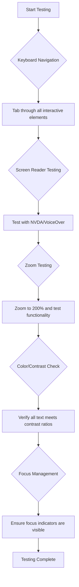
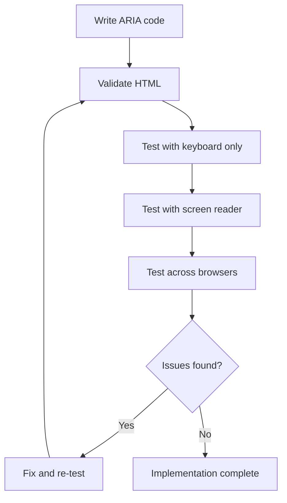

<!--
CO_OP_TRANSLATOR_METADATA:
{
  "original_hash": "90b19cde5b79b29e91babd3138cd8035",
  "translation_date": "2025-10-22T14:42:10+00:00",
  "source_file": "1-getting-started-lessons/3-accessibility/README.md",
  "language_code": "ur"
}
-->
# قابل رسائی ویب صفحات بنانا


> اسکیچ نوٹ از [Tomomi Imura](https://twitter.com/girlie_mac)

## لیکچر سے پہلے کا کوئز
[لیکچر سے پہلے کا کوئز](https://ff-quizzes.netlify.app/web/)

> ویب کی طاقت اس کی عالمگیریت میں ہے۔ معذوری سے قطع نظر ہر کسی کے لیے رسائی ایک لازمی پہلو ہے۔
>
> \- سر ٹموتھی برنرز لی، W3C کے ڈائریکٹر اور ورلڈ وائڈ ویب کے موجد

یہ بات آپ کو حیران کر سکتی ہے: جب آپ قابل رسائی ویب سائٹس بناتے ہیں، تو آپ صرف معذور افراد کی مدد نہیں کر رہے ہوتے—بلکہ آپ ویب کو سب کے لیے بہتر بنا رہے ہوتے ہیں!

کبھی گلی کے کونوں پر وہ چھوٹے ریمپ دیکھے ہیں؟ وہ اصل میں وہیل چیئرز کے لیے بنائے گئے تھے، لیکن اب وہ بچوں کی گاڑیوں، سامان لے جانے والے کارکنوں، سفر کرنے والوں کے سامان کے ساتھ، اور سائیکل سواروں کے لیے بھی مددگار ہیں۔ یہی طریقہ قابل رسائی ویب ڈیزائن کا ہے—ایسے حل جو ایک گروپ کی مدد کرتے ہیں، اکثر سب کے لیے فائدہ مند ثابت ہوتے ہیں۔ کافی دلچسپ، ہے نا؟

اس سبق میں، ہم یہ دریافت کریں گے کہ ایسی ویب سائٹس کیسے بنائی جائیں جو واقعی سب کے لیے کام کریں، چاہے وہ ویب کو کیسے بھی براؤز کریں۔ آپ عملی تکنیکیں دریافت کریں گے جو پہلے ہی ویب کے معیارات میں شامل ہیں، ٹیسٹنگ ٹولز کے ساتھ کام کریں گے، اور دیکھیں گے کہ قابل رسائی ویب سائٹس کیسے سب کے لیے زیادہ قابل استعمال بناتی ہیں۔

اس سبق کے اختتام تک، آپ کو یہ اعتماد ہوگا کہ قابل رسائی کو اپنے ترقیاتی ورک فلو کا قدرتی حصہ بنا سکیں۔ تیار ہیں یہ دریافت کرنے کے لیے کہ سوچ سمجھ کر کیے گئے ڈیزائن کے انتخاب کیسے اربوں صارفین کے لیے ویب کو کھول سکتے ہیں؟ آئیے شروع کریں!

> آپ یہ سبق [Microsoft Learn](https://docs.microsoft.com/learn/modules/web-development-101/accessibility/?WT.mc_id=academic-77807-sagibbon) پر لے سکتے ہیں!

## معاون ٹیکنالوجیز کو سمجھنا

کوڈنگ شروع کرنے سے پہلے، آئیے ایک لمحہ نکال کر یہ سمجھیں کہ مختلف صلاحیتوں والے لوگ ویب کو حقیقت میں کیسے تجربہ کرتے ہیں۔ یہ صرف نظریہ نہیں ہے—ان حقیقی دنیا کے نیویگیشن پیٹرنز کو سمجھنا آپ کو ایک بہتر ڈویلپر بنائے گا!

معاون ٹیکنالوجیز حیرت انگیز ٹولز ہیں جو معذور افراد کو ویب سائٹس کے ساتھ ایسے طریقوں سے تعامل کرنے میں مدد دیتی ہیں جو آپ کو حیران کر سکتے ہیں۔ ایک بار جب آپ ان ٹیکنالوجیز کے کام کرنے کا طریقہ سمجھ لیں، تو قابل رسائی ویب تجربات بنانا بہت زیادہ آسان ہو جاتا ہے۔ یہ بالکل ایسے ہے جیسے آپ اپنے کوڈ کو کسی اور کی نظر سے دیکھنا سیکھ رہے ہوں۔

### اسکرین ریڈرز

[اسکرین ریڈرز](https://en.wikipedia.org/wiki/Screen_reader) کافی پیچیدہ ٹیکنالوجی ہیں جو ڈیجیٹل متن کو تقریر یا بریل آؤٹ پٹ میں تبدیل کرتی ہیں۔ اگرچہ وہ بنیادی طور پر بصری معذوری والے افراد کے لیے استعمال ہوتے ہیں، وہ سیکھنے کی معذوری جیسے ڈسلیکسیا والے صارفین کے لیے بھی بہت مددگار ہیں۔

میں اسکرین ریڈر کو ایک بہت ہی ذہین راوی کے طور پر سوچتا ہوں جو آپ کو کتاب پڑھ کر سناتا ہے۔ یہ مواد کو منطقی ترتیب میں بلند آواز سے پڑھتا ہے، انٹرایکٹو عناصر جیسے "بٹن" یا "لنک" کا اعلان کرتا ہے، اور صفحہ کے ارد گرد چھلانگ لگانے کے لیے کی بورڈ شارٹ کٹس فراہم کرتا ہے۔ لیکن بات یہ ہے—اسکرین ریڈرز صرف اس وقت اپنا جادو دکھا سکتے ہیں جب ہم ویب سائٹس کو مناسب ساخت اور بامعنی مواد کے ساتھ بنائیں۔ یہی وہ جگہ ہے جہاں آپ بطور ڈویلپر آتے ہیں!

**پلیٹ فارمز پر مشہور اسکرین ریڈرز:**
- **ونڈوز**: [NVDA](https://www.nvaccess.org/about-nvda/) (مفت اور سب سے زیادہ مقبول)، [JAWS](https://webaim.org/articles/jaws/)، [Narrator](https://support.microsoft.com/windows/complete-guide-to-narrator-e4397a0d-ef4f-b386-d8ae-c172f109bdb1/?WT.mc_id=academic-77807-sagibbon) (بلٹ ان)
- **macOS/iOS**: [VoiceOver](https://support.apple.com/guide/voiceover/welcome/10) (بلٹ ان اور بہت قابل)
- **Android**: [TalkBack](https://support.google.com/accessibility/android/answer/6283677) (بلٹ ان)
- **Linux**: [Orca](https://wiki.gnome.org/Projects/Orca) (مفت اور اوپن سورس)

**اسکرین ریڈرز ویب مواد کو کیسے نیویگیٹ کرتے ہیں:**

اسکرین ریڈرز متعدد نیویگیشن طریقے فراہم کرتے ہیں جو تجربہ کار صارفین کے لیے براؤزنگ کو مؤثر بناتے ہیں:
- **تسلسل سے پڑھنا**: مواد کو اوپر سے نیچے تک پڑھتا ہے، جیسے کتاب کی پیروی کرنا
- **لینڈ مارک نیویگیشن**: صفحہ کے سیکشنز کے درمیان چھلانگ لگائیں (ہیڈر، نیویگیشن، مین، فوٹر)
- **ہیڈنگ نیویگیشن**: ہیڈنگز کے درمیان چھلانگ لگائیں تاکہ صفحہ کی ساخت کو سمجھ سکیں
- **لنک لسٹس**: تمام لنکس کی فہرست تیار کریں تاکہ جلدی رسائی حاصل ہو
- **فارم کنٹرولز**: ان پٹ فیلڈز اور بٹنوں کے درمیان براہ راست نیویگیٹ کریں

> 💡 **یہاں ایک چیز جو مجھے حیران کر گئی**: 68% اسکرین ریڈر صارفین بنیادی طور پر ہیڈنگز کے ذریعے نیویگیٹ کرتے ہیں ([WebAIM سروے](https://webaim.org/projects/screenreadersurvey9/#finding))۔ اس کا مطلب ہے کہ آپ کی ہیڈنگ کی ساخت صارفین کے لیے ایک روڈ میپ کی طرح ہے—جب آپ اسے درست کرتے ہیں، تو آپ واقعی لوگوں کو اپنے مواد کے ارد گرد تیزی سے راستہ تلاش کرنے میں مدد کر رہے ہوتے ہیں!

### اپنی ٹیسٹنگ ورک فلو بنانا

یہ اچھی خبر ہے—مؤثر قابل رسائی ٹیسٹنگ کو زبردست ہونے کی ضرورت نہیں ہے! آپ خودکار ٹولز کو شامل کرنا چاہیں گے (یہ واضح مسائل کو پکڑنے میں شاندار ہیں) اور کچھ ہاتھ سے ٹیسٹنگ کریں۔ یہاں ایک منظم طریقہ ہے جو میں نے پایا ہے کہ زیادہ تر مسائل کو پکڑتا ہے بغیر آپ کا پورا دن کھائے:

**ضروری دستی ٹیسٹنگ ورک فلو:**



**مرحلہ وار ٹیسٹنگ چیک لسٹ:**
1. **کی بورڈ نیویگیشن**: صرف Tab، Shift+Tab، Enter، Space، اور Arrow keys استعمال کریں
2. **اسکرین ریڈر ٹیسٹنگ**: NVDA، VoiceOver، یا Narrator کو فعال کریں اور بند آنکھوں کے ساتھ نیویگیٹ کریں
3. **زوم ٹیسٹنگ**: 200% اور 400% زوم لیولز پر ٹیسٹ کریں
4. **رنگ کے تضاد کی تصدیق**: تمام متن اور UI اجزاء چیک کریں
5. **فوکس انڈیکیٹر ٹیسٹنگ**: یقینی بنائیں کہ تمام انٹرایکٹو عناصر کے پاس نظر آنے والے فوکس اسٹیٹس ہیں

✅ **لائٹ ہاؤس سے شروع کریں**: اپنے براؤزر کے DevTools کھولیں، لائٹ ہاؤس قابل رسائی آڈٹ چلائیں، پھر نتائج کو اپنی دستی ٹیسٹنگ کے فوکس ایریاز کی رہنمائی کے لیے استعمال کریں۔

### زوم اور میگنیفیکیشن ٹولز

آپ جانتے ہیں کہ آپ کبھی کبھار اپنے فون پر متن کو بڑا کرنے کے لیے زوم کرتے ہیں، یا روشن دھوپ میں اپنے لیپ ٹاپ اسکرین پر جھکتے ہیں؟ بہت سے صارفین روزانہ مواد کو پڑھنے کے قابل بنانے کے لیے میگنیفیکیشن ٹولز پر انحصار کرتے ہیں۔ اس میں کم بصارت والے افراد، عمر رسیدہ افراد، اور کوئی بھی شامل ہے جو کبھی باہر ویب سائٹ پڑھنے کی کوشش کرتا ہے۔

جدید زوم ٹیکنالوجیز صرف چیزوں کو بڑا کرنے سے آگے بڑھ چکی ہیں۔ یہ سمجھنا کہ یہ ٹولز کیسے کام کرتے ہیں آپ کو ایسے ذمہ دار ڈیزائن بنانے میں مدد دے گا جو کسی بھی میگنیفیکیشن لیول پر فعال اور دلکش رہیں۔

**جدید براؤزر زوم کی صلاحیتیں:**
- **صفحہ زوم**: تمام مواد کو تناسب سے بڑھاتا ہے (متن، تصاویر، لے آؤٹ) - یہ ترجیحی طریقہ ہے
- **صرف متن زوم**: فونٹ سائز کو بڑھاتا ہے جبکہ اصل لے آؤٹ کو برقرار رکھتا ہے
- **پنچ ٹو زوم**: موبائل اشارے کی حمایت عارضی میگنیفیکیشن کے لیے
- **براؤزر سپورٹ**: تمام جدید براؤزرز 500% تک زوم کی حمایت کرتے ہیں بغیر فعالیت کو توڑے

**خصوصی میگنیفیکیشن سافٹ ویئر:**
- **ونڈوز**: [Magnifier](https://support.microsoft.com/windows/use-magnifier-to-make-things-on-the-screen-easier-to-see-414948ba-8b1c-d3bd-8615-0e5e32204198) (بلٹ ان)، [ZoomText](https://www.freedomscientific.com/training/zoomtext/getting-started/)
- **macOS/iOS**: [Zoom](https://www.apple.com/accessibility/mac/vision/) (بلٹ ان جدید خصوصیات کے ساتھ)

> ⚠️ **ڈیزائن پر غور کریں**: WCAG کا تقاضا ہے کہ مواد 200% زوم پر فعال رہے۔ اس سطح پر، افقی اسکرولنگ کم سے کم ہونی چاہیے، اور تمام انٹرایکٹو عناصر قابل رسائی رہنے چاہئیں۔

✅ **اپنے ذمہ دار ڈیزائن کا ٹیسٹ کریں**: اپنے براؤزر کو 200% اور 400% زوم کریں۔ کیا آپ کا لے آؤٹ خوبصورتی سے ڈھلتا ہے؟ کیا آپ اب بھی بغیر زیادہ اسکرولنگ کے تمام فعالیت تک رسائی حاصل کر سکتے ہیں؟

## جدید قابل رسائی ٹیسٹنگ ٹولز

اب جب کہ آپ سمجھ گئے ہیں کہ لوگ معاون ٹیکنالوجیز کے ساتھ ویب کو کیسے نیویگیٹ کرتے ہیں، آئیے ان ٹولز کو دریافت کریں جو آپ کو قابل رسائی ویب سائٹس بنانے اور ٹیسٹ کرنے میں مدد دیتے ہیں۔

اسے اس طرح سوچیں: خودکار ٹولز واضح مسائل (جیسے گمشدہ alt متن) کو پکڑنے میں زبردست ہیں، جبکہ ہاتھ سے ٹیسٹنگ آپ کو یہ یقینی بنانے میں مدد دیتی ہے کہ آپ کی سائٹ حقیقی دنیا میں استعمال کرنے کے لیے اچھی محسوس ہوتی ہے۔ دونوں مل کر آپ کو یہ اعتماد دیتے ہیں کہ آپ کی سائٹس سب کے لیے کام کرتی ہیں۔

### رنگ کے تضاد کی جانچ

یہ اچھی خبر ہے: رنگ کے تضاد سب سے عام قابل رسائی مسائل میں سے ایک ہے، لیکن یہ ٹھیک کرنے میں بھی سب سے آسان ہے۔ اچھا تضاد سب کے لیے فائدہ مند ہے—بصری معذوری والے صارفین سے لے کر ساحل پر اپنے فون پڑھنے کی کوشش کرنے والے افراد تک۔

**WCAG تضاد کے تقاضے:**

| متن کی قسم | WCAG AA (کم از کم) | WCAG AAA (بہتر) |
|-----------|-------------------|---------------------|
| **عام متن** (18pt سے کم) | 4.5:1 تضاد تناسب | 7:1 تضاد تناسب |
| **بڑا متن** (18pt+ یا 14pt+ بولڈ) | 3:1 تضاد تناسب | 4.5:1 تضاد تناسب |
| **UI اجزاء** (بٹن، فارم بارڈرز) | 3:1 تضاد تناسب | 3:1 تضاد تناسب |

**ضروری ٹیسٹنگ ٹولز:**
- [Colour Contrast Analyser](https://www.tpgi.com/color-contrast-checker/) - کلر پکر کے ساتھ ڈیسک ٹاپ ایپ
- [WebAIM Contrast Checker](https://webaim.org/resources/contrastchecker/) - فوری فیڈبیک کے ساتھ ویب پر مبنی
- [Stark](https://www.getstark.co/) - Figma، Sketch، Adobe XD کے لیے ڈیزائن ٹول پلگ ان
- [Accessible Colors](https://accessible-colors.com/) - قابل رسائی رنگ پیلیٹس تلاش کریں

✅ **بہتر رنگ پیلیٹس بنائیں**: اپنے برانڈ کے رنگوں سے شروع کریں اور قابل رسائی تغیرات بنانے کے لیے تضاد چیکرز کا استعمال کریں۔ انہیں اپنے ڈیزائن سسٹم کے قابل رسائی رنگ ٹوکن کے طور پر دستاویز کریں۔

### جامع قابل رسائی آڈٹ

سب سے مؤثر قابل رسائی ٹیسٹنگ متعدد طریقوں کو یکجا کرتی ہے۔ کوئی ایک ٹول سب کچھ نہیں پکڑتا، لہذا مختلف طریقوں کے ساتھ ٹیسٹنگ روٹین بنانا مکمل کوریج کو یقینی بناتا ہے۔

**براؤزر پر مبنی ٹیسٹنگ (DevTools میں بلٹ ان):**
- **Chrome/Edge**: لائٹ ہاؤس قابل رسائی آڈٹ + قابل رسائی پینل
- **Firefox**: تفصیلی درخت منظر کے ساتھ قابل رسائی انسپکٹر
- **Safari**: Web Inspector میں آڈٹ ٹیب VoiceOver سیمولیشن کے ساتھ

**پروفیشنل ٹیسٹنگ ایکسٹینشنز:**
- [axe DevTools](https://www.deque.com/axe/devtools/) - صنعت کا معیاری خودکار ٹیسٹنگ
- [WAVE](https://wave.webaim.org/extension/) - غلطی کو نمایاں کرنے کے ساتھ بصری فیڈبیک
- [Accessibility Insights](https://accessibilityinsights.io/) - مائیکروسافٹ کا جامع ٹیسٹنگ سوٹ

**کمانڈ لائن اور CI/CD انٹیگریشن:**
- [axe-core](https://github.com/dequelabs/axe-core) - خودکار ٹیسٹنگ کے لیے جاوا اسکرپٹ لائبریری
- [Pa11y](https://pa11y.org/) - کمانڈ لائن قابل رسائی ٹیسٹنگ ٹول
- [Lighthouse CI](https://github.com/GoogleChrome/lighthouse-ci) - خودکار قابل رسائی اسکورنگ

> 🎯 **ٹیسٹنگ کا مقصد**: لائٹ ہاؤس قابل رسائی اسکور کو 95+ کے طور پر اپنا بنیادی معیار بنائیں۔ یاد رکھیں، خودکار ٹولز صرف 30-40% قابل رسائی مسائل کو پکڑتے ہیں—دستی ٹیسٹنگ اب بھی ضروری ہے!

## بنیاد سے قابل رسائی بنانا

قابل رسائی کامیابی کی کلید یہ ہے کہ اسے پہلے دن سے اپنی بنیاد میں شامل کریں۔ مجھے معلوم ہے کہ یہ سوچنا پرکشش ہے "میں بعد میں قابل رسائی شامل کروں گا"، لیکن یہ بالکل ایسے ہے جیسے پہلے سے بنے ہوئے گھر میں ریمپ شامل کرنے کی کوشش کرنا۔ ممکن؟ ہاں۔ آسان؟ بالکل نہیں۔

قابل رسائی کو گھر کی منصوبہ بندی کی طرح سوچیں—ابتدائی معمارانہ منصوبوں میں وہیل چیئر کی رسائی شامل کرنا بہت آسان ہے بجائے اس کے کہ بعد میں سب کچھ دوبارہ بنایا جائے۔

### POUR اصول: آپ کی قابل رسائی بنیاد

ویب مواد کی قابل رسائی رہنما اصول (WCAG) چار بنیادی اصولوں کے ارد گرد بنائے گئے ہیں جو POUR کے طور پر بیان کرتے ہیں۔ پریشان نہ ہوں—یہ خشک علمی تصورات نہیں ہیں! یہ دراصل عملی رہنما ہیں جو ایسا مواد بنانے کے لیے ہیں جو سب کے لیے کام کرے۔

ایک بار جب آپ POUR کو سمجھ لیں، تو قابل رسائی فیصلے لینا بہت زیادہ آسان ہو جاتا ہے۔ یہ بالکل ایسے ہے جیسے آپ کے ڈیزائن کے انتخاب کی رہنمائی کے لیے ایک ذہنی چیک لسٹ ہو۔ آئیے اسے توڑتے ہیں:

**🔍 قابل محسوس**: معلومات کو ایسے طریقوں سے پیش کیا جانا چاہیے جو صارفین اپنے دستیاب حواس کے ذریعے محسوس کر سکیں

- غیر متن مواد (تصاویر، ویڈیوز، آڈیو) کے لیے متن کے متبادل فراہم کریں
- تمام متن اور UI اجزاء کے لیے کافی رنگ کے تضاد کو یقینی بنائیں
- ملٹی میڈیا مواد کے لیے کیپشنز اور ٹرانسکرپٹس پیش کریں
- ایسا مواد ڈیزائن کریں جو 200% تک دوبارہ سائز کیے جانے پر فعال رہے
- معلومات کو پہنچانے کے لیے متعدد حسی خصوصیات (صرف رنگ نہیں) استعمال کریں

**🎮 قابل عمل**: تمام انٹرفیس اجزاء دستیاب ان پٹ طریقوں کے ذریعے قابل عمل ہونے چاہئیں

- تمام فعالیت کو کی بورڈ نیویگیشن کے ذریعے قابل رسائی بنائیں
- صارفین کو مواد پڑھنے اور اس کے ساتھ تعامل کرنے کے لیے کافی وقت فراہم کریں
- ایسا مواد سے بچیں جو دورے یا ویسٹیبلر عوارض کا سبب بنے
- صارفین کو واضح ساخت اور لینڈ مارکس کے ساتھ مؤثر طریقے سے نیویگیٹ کرنے میں مدد کریں
- انٹرایکٹو عناصر کے لیے مناسب ہدف کے سائز کو یقینی بنائیں (کم از کم 44px)

**📖 قابل فہم**: معلومات اور UI آپریشن واضح اور قابل فہم ہونا چاہیے

- اپنے سامعین کے لیے مناسب واضح، سادہ زبان استعمال کریں
- مواد کو پیش گوئی کے قابل، مستقل طریقوں سے ظاہر اور چلائیں
- صارف ان پٹ کے لیے واضح ہدایات اور غلطی کے پیغامات فراہم کریں
- صارفین کو فارم میں غلطیوں کو سمجھ
رنگ مواصلات کے لیے ایک طاقتور ذریعہ ہے، لیکن یہ کبھی بھی اہم معلومات پہنچانے کا واحد طریقہ نہیں ہونا چاہیے۔ رنگ سے آگے ڈیزائن کرنا زیادہ مضبوط اور جامع تجربات تخلیق کرتا ہے جو مختلف حالات میں کام کرتے ہیں۔

**رنگ کی بصری فرق کے لیے ڈیزائن کریں:**

تقریباً 8% مرد اور 0.5% خواتین کو رنگ کی بصری فرق کا سامنا ہوتا ہے (جسے اکثر "رنگ کی نابینا پن" کہا جاتا ہے)۔ سب سے عام اقسام یہ ہیں:
- **Deuteranopia**: سرخ اور سبز کو الگ کرنے میں دشواری
- **Protanopia**: سرخ زیادہ مدھم نظر آتا ہے
- **Tritanopia**: نیلے اور پیلے کے ساتھ دشواری (نایاب)

**جامع رنگ کی حکمت عملی:**

```css
/* ❌ Bad: Using only color to indicate status */
.error { color: red; }
.success { color: green; }

/* ✅ Good: Color plus icons and context */
.error {
  color: #d32f2f;
  border-left: 4px solid #d32f2f;
}
.error::before {
  content: "⚠️";
  margin-right: 8px;
}

.success {
  color: #2e7d32;
  border-left: 4px solid #2e7d32;
}
.success::before {
  content: "✅";
  margin-right: 8px;
}
```

**بنیادی تضاد کی ضروریات سے آگے:**
- اپنے رنگ کے انتخاب کو رنگ کی نابینا پن کے سمیلیٹرز کے ساتھ آزمائیں
- رنگ کوڈنگ کے ساتھ ساتھ پیٹرنز، ٹیکسچرز، یا شکلیں استعمال کریں
- یقینی بنائیں کہ انٹرایکٹو حالتیں بغیر رنگ کے بھی قابل شناخت رہیں
- غور کریں کہ آپ کا ڈیزائن ہائی کنٹراسٹ موڈ میں کیسا نظر آتا ہے

✅ **اپنی رنگ کی رسائی کو آزمائیں**: [Coblis](https://www.color-blindness.com/coblis-color-blindness-simulator/) جیسے ٹولز استعمال کریں تاکہ دیکھ سکیں کہ آپ کی سائٹ مختلف قسم کی رنگ کی بصری فرق رکھنے والے صارفین کے لیے کیسی نظر آتی ہے۔

### فوکس انڈیکیٹرز اور انٹرایکشن ڈیزائن

فوکس انڈیکیٹرز ڈیجیٹل کرسر کے برابر ہیں—یہ کی بورڈ صارفین کو دکھاتے ہیں کہ وہ صفحے پر کہاں ہیں۔ اچھی طرح سے ڈیزائن کردہ فوکس انڈیکیٹرز ہر کسی کے تجربے کو بہتر بناتے ہیں، انٹرایکشنز کو واضح اور پیش گوئی کے قابل بناتے ہیں۔

**جدید فوکس انڈیکیٹرز کے بہترین طریقے:**

```css
/* Enhanced focus styles that work across browsers */
button:focus-visible {
  outline: 2px solid #0066cc;
  outline-offset: 2px;
  box-shadow: 0 0 0 4px rgba(0, 102, 204, 0.25);
}

/* Remove focus outline for mouse users, preserve for keyboard users */
button:focus:not(:focus-visible) {
  outline: none;
}

/* Focus-within for complex components */
.card:focus-within {
  box-shadow: 0 0 0 3px rgba(74, 144, 164, 0.5);
  border-color: #4A90A4;
}

/* Ensure focus indicators meet contrast requirements */
.custom-focus:focus-visible {
  outline: 3px solid #ffffff;
  outline-offset: 2px;
  box-shadow: 0 0 0 6px #000000;
}
```

**فوکس انڈیکیٹرز کی ضروریات:**
- **نظر آنے والا**: ارد گرد کے عناصر کے ساتھ کم از کم 3:1 کنٹراسٹ تناسب ہونا چاہیے
- **چوڑائی**: پورے عنصر کے ارد گرد کم از کم 2px موٹائی
- **استقامت**: جب تک فوکس کہیں اور منتقل نہ ہو، نظر آنا چاہیے
- **امتیاز**: دیگر UI حالتوں سے بصری طور پر مختلف ہونا چاہیے

> 💡 **ڈیزائن ٹپ**: بہترین فوکس انڈیکیٹرز اکثر آؤٹ لائن، باکس شیڈو، اور رنگ کی تبدیلیوں کا امتزاج استعمال کرتے ہیں تاکہ مختلف پس منظر اور سیاق و سباق میں نظر آنے کو یقینی بنایا جا سکے۔

✅ **فوکس انڈیکیٹرز کا آڈٹ کریں**: اپنی ویب سائٹ پر ٹیب کریں اور نوٹ کریں کہ کون سے عناصر کے واضح فوکس انڈیکیٹرز ہیں۔ کیا کوئی دیکھنے میں مشکل یا مکمل طور پر غائب ہیں؟

### سیمینٹک HTML: رسائی کی بنیاد

سیمینٹک HTML آپ کی ویب سائٹ کے لیے معاون ٹیکنالوجیز کو GPS سسٹم دینے جیسا ہے۔ جب آپ صحیح HTML عناصر کو ان کے مطلوبہ مقصد کے لیے استعمال کرتے ہیں، تو آپ بنیادی طور پر اسکرین ریڈرز، کی بورڈز، اور دیگر ٹولز کو ایک تفصیلی روڈ میپ فراہم کرتے ہیں تاکہ صارفین کو مؤثر طریقے سے نیویگیٹ کرنے میں مدد ملے۔

یہاں ایک مثال ہے جو واقعی میرے لیے واضح ہوئی: سیمینٹک HTML ایک اچھی طرح سے منظم لائبریری کے درمیان فرق ہے جس میں واضح زمرے اور مددگار نشانات ہیں بمقابلہ ایک گودام جہاں کتابیں بے ترتیب بکھری ہوئی ہیں۔ دونوں جگہوں پر ایک ہی کتابیں ہیں، لیکن آپ کس جگہ پر کچھ تلاش کرنے کی کوشش کرنا پسند کریں گے؟ بالکل!

**رسائی کے قابل صفحہ ڈھانچے کے بنیادی اجزاء:**

```html
<!-- Landmark elements provide page navigation structure -->
<header>
  <h1>Your Site Name</h1>
  <nav aria-label="Main navigation">
    <ul>
      <li><a href="/home">Home</a></li>
      <li><a href="/about">About</a></li>
      <li><a href="/services">Services</a></li>
    </ul>
  </nav>
</header>

<main>
  <article>
    <header>
      <h1>Article Title</h1>
      <p>Published on <time datetime="2024-10-14">October 14, 2024</time></p>
    </header>
    
    <section>
      <h2>First Section</h2>
      <p>Content that relates to this section...</p>
    </section>
    
    <section>
      <h2>Second Section</h2>
      <p>More related content...</p>
    </section>
  </article>
  
  <aside>
    <h2>Related Links</h2>
    <nav aria-label="Related articles">
      <ul>
        <li><a href="/related-1">First related article</a></li>
        <li><a href="/related-2">Second related article</a></li>
      </ul>
    </nav>
  </aside>
</main>

<footer>
  <p>&copy; 2024 Your Site Name. All rights reserved.</p>
  <nav aria-label="Footer links">
    <ul>
      <li><a href="/privacy">Privacy Policy</a></li>
      <li><a href="/contact">Contact Us</a></li>
    </ul>
  </nav>
</footer>
```

**کیوں سیمینٹک HTML رسائی کو تبدیل کرتا ہے:**

| سیمینٹک عنصر | مقصد | اسکرین ریڈر کا فائدہ |
|------------------|---------|----------------------|
| `<header>` | صفحہ یا سیکشن ہیڈر | "بینر لینڈ مارک" - اوپر جلدی نیویگیشن |
| `<nav>` | نیویگیشن لنکس | "نیویگیشن لینڈ مارک" - نیویگیشن سیکشنز کی فہرست |
| `<main>` | بنیادی صفحہ مواد | "مین لینڈ مارک" - مواد پر براہ راست جائیں |
| `<article>` | خود مختار مواد | آرٹیکل کی حدود کا اعلان کرتا ہے |
| `<section>` | تھیمڈ مواد کے گروپس | مواد کی ساخت فراہم کرتا ہے |
| `<aside>` | متعلقہ سائیڈبار مواد | "تکمیلی لینڈ مارک" |
| `<footer>` | صفحہ یا سیکشن فوٹر | "مواد کی معلومات لینڈ مارک" |

**سیمینٹک HTML کے ساتھ اسکرین ریڈر کی سپر پاورز:**
- **لینڈ مارک نیویگیشن**: بڑے صفحہ سیکشنز کے درمیان فوری طور پر چھلانگ لگائیں
- **ہیڈنگ آؤٹ لائنز**: آپ کی ہیڈنگ ساخت سے مواد کی فہرست تیار کریں
- **عنصر کی فہرستیں**: تمام لنکس، بٹن، یا فارم کنٹرولز کی فہرست بنائیں
- **سیاق و سباق کی آگاہی**: مواد کے سیکشنز کے درمیان تعلقات کو سمجھیں

> 🎯 **فوری ٹیسٹ**: لینڈ مارک شارٹ کٹس (NVDA/JAWS میں D لینڈ مارک کے لیے، H ہیڈنگ کے لیے، K لنک کے لیے) استعمال کرتے ہوئے اپنی سائٹ کو اسکرین ریڈر کے ساتھ نیویگیٹ کرنے کی کوشش کریں۔ کیا نیویگیشن معنی خیز ہے؟

✅ **اپنی سیمینٹک ساخت کا آڈٹ کریں**: اپنے براؤزر کے ڈویلپر ٹولز میں رسائی پینل استعمال کریں تاکہ رسائی کے درخت کو دیکھیں اور یقینی بنائیں کہ آپ کا مارک اپ منطقی ساخت تخلیق کرتا ہے۔

### ہیڈنگ کی درجہ بندی: منطقی مواد کا خاکہ بنانا

ہیڈنگز رسائی کے قابل مواد کے لیے بالکل ضروری ہیں—یہ ریڑھ کی ہڈی کی طرح ہیں جو سب کچھ ایک ساتھ رکھتی ہیں۔ اسکرین ریڈر صارفین ہیڈنگز پر بہت زیادہ انحصار کرتے ہیں تاکہ آپ کے مواد کو سمجھ سکیں اور نیویگیٹ کر سکیں۔ اسے اپنے صفحے کے لیے مواد کی فہرست فراہم کرنے کے طور پر سوچیں۔

**ہیڈنگز کے لیے سنہری اصول یہ ہے:**
کبھی بھی سطحیں نہ چھوڑیں۔ ہمیشہ منطقی طور پر `<h1>` سے `<h2>` سے `<h3>` تک ترقی کریں، اور اسی طرح۔ اسکول میں خاکے بنانا یاد ہے؟ یہ بالکل وہی اصول ہے—آپ "I. مین پوائنٹ" سے سیدھے "C. سب-سب پوائنٹ" پر بغیر "A. سب پوائنٹ" کے درمیان میں نہیں جائیں گے، ٹھیک؟

**کامل ہیڈنگ ساخت کی مثال:**

```html
<!-- ✅ Excellent: Logical, hierarchical progression -->
<main>
  <h1>Complete Guide to Web Accessibility</h1>
  
  <section>
    <h2>Understanding Screen Readers</h2>
    <p>Introduction to screen reader technology...</p>
    
    <h3>Popular Screen Reader Software</h3>
    <p>NVDA, JAWS, and VoiceOver comparison...</p>
    
    <h3>Testing with Screen Readers</h3>
    <p>Step-by-step testing instructions...</p>
  </section>
  
  <section>
    <h2>Color and Contrast Guidelines</h2>
    <p>Designing with sufficient contrast...</p>
    
    <h3>WCAG Contrast Requirements</h3>
    <p>Understanding the different contrast levels...</p>
    
    <h3>Testing Tools and Techniques</h3>
    <p>Tools for verifying contrast ratios...</p>
  </section>
</main>
```

```html
<!-- ❌ Problematic: Skipping levels, inconsistent structure -->
<h1>Page Title</h1>
<h3>Subsection</h3> <!-- Skipped h2 -->
<h2>This should come before h3</h2>
<h1>Another main heading?</h1> <!-- Multiple h1s -->
```

**ہیڈنگز کے بہترین طریقے:**
- **ایک صفحے پر ایک `<h1>`**: عام طور پر آپ کا مرکزی صفحہ عنوان یا بنیادی مواد کی ہیڈنگ
- **منطقی ترقی**: کبھی بھی سطحیں نہ چھوڑیں (h1 → h2 → h3، نہ کہ h1 → h3)
- **وضاحتی مواد**: ہیڈنگز کو سیاق و سباق سے باہر پڑھنے پر معنی خیز بنائیں
- **CSS کے ساتھ بصری اسٹائلنگ**: ظاہری شکل کے لیے CSS استعمال کریں، ساخت کے لیے HTML سطحیں

**اسکرین ریڈر نیویگیشن کے اعداد و شمار:**
- 68% اسکرین ریڈر صارفین ہیڈنگز کے ذریعے نیویگیٹ کرتے ہیں ([WebAIM سروے](https://webaim.org/projects/screenreadersurvey9/#finding))
- صارفین منطقی ہیڈنگ آؤٹ لائن کی توقع کرتے ہیں
- ہیڈنگز صفحہ کی ساخت کو سمجھنے کا تیز ترین طریقہ فراہم کرتی ہیں

> 💡 **پرو ٹپ**: "HeadingsMap" جیسے براؤزر ایکسٹینشنز استعمال کریں تاکہ اپنی ہیڈنگ ساخت کو بصری طور پر دیکھ سکیں۔ یہ ایک اچھی طرح سے منظم مواد کی فہرست کی طرح پڑھنی چاہیے۔

✅ **اپنی ہیڈنگ ساخت کا ٹیسٹ کریں**: اسکرین ریڈر کی ہیڈنگ نیویگیشن (NVDA میں H کلید) استعمال کریں تاکہ اپنی ہیڈنگز کے ذریعے چھلانگ لگائیں۔ کیا ترقی آپ کے مواد کی کہانی کو منطقی طور پر بیان کرتی ہے؟

### بصری رسائی کی جدید تکنیکیں

تضاد اور رنگ کی بنیادی باتوں سے آگے، کچھ نفیس تکنیکیں ہیں جو واقعی جامع بصری تجربات تخلیق کرنے میں مدد کرتی ہیں۔ یہ طریقے یقینی بناتے ہیں کہ آپ کا مواد مختلف دیکھنے کے حالات اور معاون ٹیکنالوجیز کے ساتھ کام کرتا ہے۔

**ضروری بصری مواصلات کی حکمت عملی:**

- **ملٹی موڈل فیڈبیک**: بصری، متنی، اور کبھی کبھار آڈیو اشارے کو یکجا کریں
- **پروگریسو ڈسکلوژر**: معلومات کو ہضم کرنے کے قابل حصوں میں پیش کریں
- **مستقل انٹرایکشن پیٹرنز**: مانوس UI کنونشنز استعمال کریں
- **جوابی ٹائپوگرافی**: مختلف ڈیوائسز پر متن کو مناسب طور پر اسکیل کریں
- **لوڈنگ اور ایرر اسٹیٹس**: تمام صارف اعمال کے لیے واضح فیڈبیک فراہم کریں

**رسائی کو بہتر بنانے کے لیے CSS کی سہولیات:**

```css
/* Screen reader only text - visually hidden but accessible */
.sr-only {
  position: absolute;
  width: 1px;
  height: 1px;
  padding: 0;
  margin: -1px;
  overflow: hidden;
  clip: rect(0, 0, 0, 0);
  white-space: nowrap;
  border: 0;
}

/* Skip link for keyboard navigation */
.skip-link {
  position: absolute;
  top: -40px;
  left: 6px;
  background: #000000;
  color: #ffffff;
  padding: 8px 16px;
  text-decoration: none;
  border-radius: 4px;
  font-weight: bold;
  transition: top 0.3s ease;
  z-index: 1000;
}

.skip-link:focus {
  top: 6px;
}

/* Reduced motion respect */
@media (prefers-reduced-motion: reduce) {
  .skip-link {
    transition: none;
  }
  
  * {
    animation-duration: 0.01ms !important;
    animation-iteration-count: 1 !important;
    transition-duration: 0.01ms !important;
  }
}

/* High contrast mode support */
@media (prefers-contrast: high) {
  .button {
    border: 2px solid;
  }
}
```

> 🎯 **رسائی کا پیٹرن**: "اسکیپ لنک" کی بورڈ صارفین کے لیے ضروری ہے۔ یہ آپ کے صفحے پر پہلا فوکس ایبل عنصر ہونا چاہیے اور براہ راست مرکزی مواد کے علاقے پر چھلانگ لگانا چاہیے۔

✅ **اسکیپ نیویگیشن نافذ کریں**: اپنے صفحات میں اسکیپ لنکس شامل کریں اور انہیں ٹیسٹ کریں کہ جب صفحہ لوڈ ہو تو فوراً ٹیب دبائیں۔ انہیں ظاہر ہونا چاہیے اور آپ کو مرکزی مواد پر چھلانگ لگانے کی اجازت دینی چاہیے۔

## معنی خیز لنک ٹیکسٹ تیار کرنا

لنکس بنیادی طور پر ویب کے ہائی ویز ہیں، لیکن خراب لکھا ہوا لنک ٹیکسٹ ایسا ہے جیسے روڈ سائنز پر صرف "جگہ" لکھا ہو بجائے "ڈاؤن ٹاؤن شکاگو"۔ بہت مددگار نہیں، ٹھیک؟

یہاں ایک چیز ہے جو مجھے پہلی بار جان کر حیران کر گئی: اسکرین ریڈرز صفحے سے تمام لنکس نکال سکتے ہیں اور انہیں ایک بڑی فہرست کے طور پر دکھا سکتے ہیں۔ تصور کریں کہ کوئی آپ کو آپ کے صفحے پر موجود ہر لنک کی ڈائریکٹری دے۔ کیا ہر ایک اپنے طور پر معنی رکھتا ہے؟ یہ وہ ٹیسٹ ہے جسے آپ کے لنک ٹیکسٹ کو پاس کرنا چاہیے!

### لنک نیویگیشن کے پیٹرنز کو سمجھنا

اسکرین ریڈرز لنک نیویگیشن کی طاقتور خصوصیات پیش کرتے ہیں جو اچھی طرح سے لکھے گئے لنک ٹیکسٹ پر انحصار کرتے ہیں:

**لنک نیویگیشن کے طریقے:**
- **تسلسل کے ساتھ پڑھنا**: لنکس کو مواد کے بہاؤ کے حصے کے طور پر سیاق و سباق میں پڑھا جاتا ہے
- **لنک فہرست کی تخلیق**: تمام صفحہ لنکس کو ایک قابل تلاش ڈائریکٹری میں مرتب کیا جاتا ہے
- **فوری نیویگیشن**: کی بورڈ شارٹ کٹس (NVDA میں K) استعمال کرتے ہوئے لنکس کے درمیان چھلانگ لگائیں
- **تلاش کی فعالیت**: جزوی متن ٹائپ کرکے مخصوص لنکس تلاش کریں

**کیوں سیاق و سباق اہم ہے:**
جب اسکرین ریڈر صارفین لنک فہرست تیار کرتے ہیں، تو وہ کچھ اس طرح دیکھتے ہیں:
- "رپورٹ ڈاؤن لوڈ کریں"
- "مزید جانیں"
- "یہاں کلک کریں"
- "پرائیویسی پالیسی"
- "یہاں کلک کریں"

ان میں سے صرف دو لنکس سیاق و سباق سے باہر پڑھنے پر مفید معلومات فراہم کرتے ہیں!

> 📊 **صارف اثر**: اسکرین ریڈر صارفین لنک فہرستوں کو جلدی سے صفحہ مواد کو سمجھنے کے لیے اسکین کرتے ہیں۔ عمومی لنک ٹیکسٹ انہیں ہر لنک کے سیاق و سباق پر واپس نیویگیٹ کرنے پر مجبور کرتا ہے، ان کے براؤزنگ کے تجربے کو نمایاں طور پر سست کر دیتا ہے۔

### عام لنک ٹیکسٹ کی غلطیوں سے بچنا

سمجھنا کہ کیا کام نہیں کرتا آپ کو موجودہ مواد میں رسائی کے مسائل کو پہچاننے اور ٹھیک کرنے میں مدد دیتا ہے۔

**❌ عمومی لنک ٹیکسٹ جو کوئی سیاق و سباق فراہم نہیں کرتا:**

```html
<!-- Meaningless when read from a link list -->
<p>Our sustainability efforts are detailed in our recent report. 
   <a href="/sustainability-2024.pdf">Click here</a> to view it.</p>

<!-- Repeated generic text throughout the page -->
<div class="article-card">
  <h3>Web Accessibility Guide</h3>
  <p>Learn the fundamentals...</p>
  <a href="/accessibility-guide">Read more</a>
</div>
<div class="article-card">
  <h3>Color Contrast Tips</h3>
  <p>Improve your design...</p>
  <a href="/color-contrast">Read more</a>
</div>

<!-- URLs as link text (difficult for screen readers to announce) -->
<p>Visit https://www.w3.org/WAI/WCAG21/quickref/ for WCAG guidelines.</p>

<!-- Vague action words -->
<a href="/contact">Go</a> | <a href="/about">See</a> | <a href="/help">View</a>
```

**کیوں یہ پیٹرنز ناکام ہوتے ہیں:**
- **"یہاں کلک کریں"** صارفین کو منزل کے بارے میں کچھ نہیں بتاتا
- **"مزید پڑھیں"** بار بار استعمال ہونے سے الجھن پیدا ہوتی ہے
- **خام URLs** اسکرین ریڈرز کے لیے واضح طور پر تلفظ کرنا مشکل ہیں
- **ایک لفظی** جیسے "جائیں" یا "دیکھیں" وضاحتی سیاق و سباق سے محروم ہیں

### بہترین لنک ٹیکسٹ لکھنا

وضاحتی لنک ٹیکسٹ ہر کسی کے لیے فائدہ مند ہے—نظر رکھنے والے صارفین لنکس کو جلدی اسکین کر سکتے ہیں، اور اسکرین ریڈر صارفین فوری طور پر منزلوں کو سمجھ سکتے ہیں۔

**✅ واضح، وضاحتی لنک ٹیکسٹ کی مثالیں:**

```html
<!-- Descriptive text that explains the destination -->
<p>Our comprehensive <a href="/sustainability-2024.pdf">2024 sustainability report (PDF, 2.1MB)</a> details our environmental initiatives.</p>

<!-- Specific, unique link text for each card -->
<div class="article-card">
  <h3>Web Accessibility Guide</h3>
  <p>Learn the fundamentals of inclusive design...</p>
  <a href="/accessibility-guide">Read our complete web accessibility guide</a>
</div>
<div class="article-card">
  <h3>Color Contrast Tips</h3>
  <p>Improve your design with better color choices...</p>
  <a href="/color-contrast">Explore color contrast best practices</a>
</div>

<!-- Meaningful text instead of raw URLs -->
<p>The <a href="https://www.w3.org/WAI/WCAG21/quickref/">WCAG 2.1 Quick Reference guide</a> provides comprehensive accessibility guidelines.</p>

<!-- Descriptive action links -->
<a href="/contact">Contact our support team</a> | 
<a href="/about">About our company</a> | 
<a href="/help">Get help with your account</a>
```

**لنک ٹیکسٹ کے بہترین طریقے:**
- **مخصوص بنیں**: "چوتھائی مالیاتی رپورٹ ڈاؤن لوڈ کریں" بمقابلہ "ڈاؤن لوڈ کریں"
- **فائل کی قسم اور سائز شامل کریں**: "(PDF, 1.2MB)" ڈاؤن لوڈ کے قابل فائلوں کے لیے
- **ذکر کریں کہ لنکس بیرونی طور پر کھلتے ہیں**: "(نئی ونڈو میں کھلتا ہے)" جب مناسب ہو
- **فعال زبان استعمال کریں**: "ہم سے رابطہ کریں" بمقابلہ "رابطہ صفحہ"
- **مختصر رکھیں**: ممکن ہو تو 2-8 الفاظ کا مقصد رکھیں

### لنک رسائی کے جدید پیٹرنز

کبھی کبھی بصری ڈیزائن کی حدود یا تکنیکی ضروریات کو خاص حل کی ضرورت ہوتی ہے۔ یہاں عام چیلنجنگ منظرناموں کے لیے نفیس تکنیکیں ہیں:

**بہتر سیاق و سباق کے لیے ARIA کا استعمال:**

```html
<!-- When button text must be short but needs more context -->
<a href="/report.pdf" 
   aria-label="Download 2024 annual financial report, PDF format, 2.3MB">
  Download Report
</a>

<!-- When the full context comes from surrounding content -->
<h3 id="sustainability-heading">Sustainability Initiative</h3>
<p>Our efforts to reduce environmental impact...</p>
<a href="/sustainability-details" 
   aria-labelledby="sustainability-heading"
   aria-describedby="sustainability-summary">
  Learn more
</a>
<p id="sustainability-summary">Detailed breakdown of our 2024 environmental goals and achievements</p>
```

**فائل کی اقسام اور بیرونی منزلوں کی نشاندہی کرنا:**

```html
<!-- Method 1: Include information in visible link text -->
<a href="/annual-report.pdf">
  Download our 2024 annual report (PDF, 2.3MB)
</a>

<!-- Method 2: Use screen reader-only text for file details -->
<a href="/annual-report.pdf">
  Download our 2024 annual report
  <span class="sr-only">(PDF format, 2.3MB)</span>
</a>

<!-- Method 3: External link indication -->
<a href="https://example.com" 
   target="_blank" 
   aria-describedby="external-link-warning">
  Visit external resource
</a>
<span id="external-link-warning" class="sr-only">
  (opens in new window)
</span>

<!-- Method 4: Using CSS for visual indicators -->
<a href="https://example.com" class="external-link">
  External resource
</a>
```

```css
/* Visual indicator for external links */
.external-link::after {
  content: " ↗";
  font-size: 0.8em;
  color: #666;
}

/* Screen reader announcement for external links */
.external-link::before {
  content: "External link: ";
  position: absolute;
  left: -10000px;
  width: 1px;
  height: 1px;
  overflow: hidden;
}
```

> ⚠️ **اہم**: جب `target="_blank"` استعمال کریں، ہمیشہ صارفین کو مطلع کریں کہ لنک نئی ونڈو یا ٹیب میں کھلتا ہے۔ غیر متوقع نیویگیشن تبدیلیاں الجھن پیدا کر سکتی ہیں۔

✅ **اپنے لنک کے سیاق و سباق کا ٹیسٹ کریں**: اپنے براؤزر کے ڈویلپر ٹولز استعمال کریں تاکہ اپنے صفحے پر موجود تمام لنکس کی فہرست تیار کریں۔ کیا آپ ہر لنک کے مقصد کو کسی بھی ارد گرد کے سیاق و سباق کے بغیر سمجھ سکتے ہیں؟

## ARIA: HTML رسائی کو سپرچارج کرنا

[Accessible Rich Internet Applications (ARIA)](https://developer.mozilla.org/docs/Web/Accessibility/ARIA) آپ کے پیچیدہ ویب ایپلیکیشنز اور معاون ٹیکنالوجیز کے درمیان ایک عالمی مترجم رکھنے جیسا ہے۔ جب HTML اکیلا آپ کے انٹرایکٹو اجزاء کے تمام کاموں کو ظاہر نہیں کر سکتا، تو ARIA ان خلا کو پر کرنے کے لیے قدم اٹھاتا ہے۔

میں ARIA کو آپ کے HTML میں مددگار تشریحات شامل کرنے کے طور پر سوچتا ہوں—کسی پلے اسکرپٹ میں اسٹیج کی ہدایات کی طرح جو اداکاروں کو ان کے کرداروں اور تعلقات کو سمجھنے میں مدد دیتی ہیں۔

**ARIA کے بارے میں سب سے اہم اصول یہ ہے**: ہمیشہ پہلے سیمینٹک HTML استعمال کریں، پھر ARIA کو بہتر بنانے کے لیے شامل کریں۔ ARIA کو مصالحے کے طور پر سوچیں، نہ کہ مرکزی ڈش۔ یہ آپ کے HTML ڈھانچے کو واضح اور بہتر بنانا چاہیے، کبھی بھی اسے تبدیل نہیں کرنا چاہیے۔ پہلے وہ بنیاد درست کریں!

### ARIA کے نفاذ کی حکمت عملی

ARIA طاقتور ہے، لیکن طاقت کے ساتھ ذمہ داری آتی ہے۔ غلط ARIA رسائی کو بغیر ARIA کے مقابلے میں بدتر بنا سکتا ہے۔ یہاں کب اور کیسے اسے مؤثر طریقے سے استعمال کرنا ہے:

**✅ ARIA استعمال کریں جب:**
- حسب ضرورت انٹرایکٹو ویجٹس (اکارڈینز، ٹیبز، کیروسلز) بنانا
- متحرک مواد بنانا جو صفحہ دوبارہ لوڈ کیے بغیر تبدیل ہوتا ہے
- پیچیدہ UI تعلقات کے لیے اضافی سیاق و سباق فراہم کرنا
- لوڈنگ کی حالتوں یا لائیو مواد کی اپڈیٹس کی نشاندہی کرنا
- حسب ضرورت کنٹرولز کے ساتھ ایپ جیسی انٹرفیسز بنانا

**❌ ARIA سے
5. **سادہ شروع کریں**: پیچیدہ ARIA implementations میں غلطیوں کا امکان زیادہ ہوتا ہے

**🔍 ٹیسٹنگ ورک فلو:**



**🚫 عام ARIA غلطیاں جن سے بچنا چاہیے:**

- **متضاد معلومات**: HTML semantics کے ساتھ تضاد نہ کریں
- **زیادہ لیبلنگ**: بہت زیادہ ARIA معلومات صارفین کو الجھا دیتی ہیں
- **جامد ARIA**: مواد میں تبدیلی کے وقت ARIA states کو اپ ڈیٹ کرنا بھول جانا
- **غیر آزمودہ implementations**: ARIA جو نظریہ میں کام کرتی ہے لیکن عملی طور پر ناکام ہو جاتی ہے
- **کی بورڈ سپورٹ کی کمی**: ARIA roles بغیر متعلقہ کی بورڈ interactions کے

> 💡 **ٹیسٹنگ وسائل**: [accessibility-checker](https://www.npmjs.com/package/accessibility-checker) جیسے ٹولز کا استعمال کریں ARIA validation کے لیے، لیکن مکمل تجربے کے لیے حقیقی screen readers کے ساتھ ہمیشہ ٹیسٹ کریں۔

✅ **ماہرین سے سیکھیں**: [ARIA Authoring Practices Guide](https://w3c.github.io/aria-practices/) کا مطالعہ کریں پیچیدہ interactive widgets کے آزمودہ patterns اور implementations کے لیے۔

## تصاویر اور میڈیا کو قابل رسائی بنانا

بصری اور آڈیو مواد جدید ویب تجربات کا ایک اہم حصہ ہیں، لیکن اگر انہیں سوچ سمجھ کر نافذ نہ کیا جائے تو یہ رکاوٹیں پیدا کر سکتے ہیں۔ مقصد یہ ہے کہ آپ کے میڈیا کی معلومات اور جذباتی اثر ہر صارف تک پہنچے۔ ایک بار جب آپ اسے سمجھ لیں، تو یہ آپ کی عادت بن جائے گی۔

مختلف قسم کے میڈیا کو مختلف accessibility approaches کی ضرورت ہوتی ہے۔ یہ بالکل کھانے پکانے کی طرح ہے—آپ نازک مچھلی کو وہی طریقہ نہیں دیں گے جو آپ ایک مضبوط اسٹیک کو دیں گے۔ ان فرقوں کو سمجھنا آپ کو ہر صورتحال کے لیے صحیح حل منتخب کرنے میں مدد دیتا ہے۔

### تصاویر کی قابل رسائی حکمت عملی

آپ کی ویب سائٹ پر ہر تصویر کا ایک مقصد ہوتا ہے۔ اس مقصد کو سمجھنا آپ کو بہتر alternative text لکھنے اور زیادہ جامع تجربات تخلیق کرنے میں مدد دیتا ہے۔

**تصاویر کی چار اقسام اور ان کے alt text کی حکمت عملی:**

**معلوماتی تصاویر** - اہم معلومات فراہم کرتی ہیں:
```html

```

**سجاوٹی تصاویر** - صرف بصری ہیں اور کوئی معلوماتی قدر نہیں رکھتیں:
```html

```

**فعالی تصاویر** - بٹن یا کنٹرول کے طور پر کام کرتی ہیں:
```html
<button>
  
</button>
```

**پیچیدہ تصاویر** - چارٹس، ڈایاگرام، انفوگرافکس:
```html

<div id="chart-description">
  <p>Detailed description: Sales data shows a steady increase across all quarters...</p>
</div>
```

### ویڈیو اور آڈیو کی قابل رسائی

**ویڈیو کے تقاضے:**
- **کیپشنز**: بولے گئے مواد اور صوتی اثرات کا متن ورژن
- **آڈیو وضاحتیں**: بصری عناصر کی نابینا صارفین کے لیے وضاحت
- **ٹرانسکرپٹس**: تمام آڈیو اور بصری مواد کا مکمل متن ورژن

```html
<video controls>
  <source src="video.mp4" type="video/mp4">
  <track kind="captions" src="captions.vtt" srclang="en" label="English">
  <track kind="descriptions" src="descriptions.vtt" srclang="en" label="Audio descriptions">
</video>
```

**آڈیو کے تقاضے:**
- **ٹرانسکرپٹس**: تمام بولے گئے مواد کا متن ورژن
- **بصری اشارے**: صرف آڈیو مواد کے لیے، بصری cues فراہم کریں

### جدید تصویری تکنیکیں

**سجاوٹی تصاویر کے لیے CSS کا استعمال:**
```css
.hero-section {
  background-image: url('decorative-hero.jpg');
  /* Decorative images in CSS don't need alt text */
}
```

**قابل رسائی کے ساتھ responsive تصاویر:**
```html
<picture>
  <source media="(min-width: 800px)" srcset="large-chart.png">
  <source media="(min-width: 400px)" srcset="medium-chart.png">
  
</picture>
```

✅ **تصویری قابل رسائی کی جانچ کریں**: ایک screen reader کا استعمال کرتے ہوئے تصاویر کے ساتھ ایک صفحہ پر نیویگیٹ کریں۔ کیا آپ کو مواد کو سمجھنے کے لیے کافی معلومات مل رہی ہیں؟

## کی بورڈ نیویگیشن اور فوکس مینجمنٹ

بہت سے صارفین صرف اپنے کی بورڈ کے ساتھ ویب پر نیویگیٹ کرتے ہیں۔ اس میں وہ لوگ شامل ہیں جنہیں موٹر معذوری ہے، وہ پاور صارفین جو کی بورڈ کو ماؤس سے زیادہ تیز سمجھتے ہیں، اور وہ لوگ جن کا ماؤس کام کرنا بند کر چکا ہے۔ یہ یقینی بنانا کہ آپ کی سائٹ کی بورڈ ان پٹ کے ساتھ اچھی طرح کام کرتی ہے ضروری ہے اور اکثر ہر کسی کے لیے آپ کی سائٹ کو زیادہ موثر بناتی ہے۔

### ضروری کی بورڈ نیویگیشن پیٹرنز

**معیاری کی بورڈ interactions:**
- **Tab**: interactive عناصر کے ذریعے فوکس کو آگے بڑھائیں
- **Shift + Tab**: فوکس کو پیچھے لے جائیں
- **Enter**: بٹن اور لنکس کو فعال کریں
- **Space**: بٹن کو فعال کریں، چیک باکسز کو چیک کریں
- **Arrow keys**: component گروپس کے اندر نیویگیٹ کریں (radio buttons، menus)
- **Escape**: modals، dropdowns کو بند کریں یا آپریشنز منسوخ کریں

### فوکس مینجمنٹ کے بہترین طریقے

**مرئی فوکس indicators:**
```css
/* Ensure focus is always visible */
button:focus-visible {
  outline: 2px solid #4A90A4;
  outline-offset: 2px;
}

/* Custom focus styles for different components */
.card:focus-within {
  box-shadow: 0 0 0 3px rgba(74, 144, 164, 0.5);
}
```

**موثر نیویگیشن کے لیے skip links:**
```html
<a href="#main-content" class="skip-link">Skip to main content</a>
<a href="#navigation" class="skip-link">Skip to navigation</a>

<nav id="navigation">
  <!-- navigation content -->
</nav>
<main id="main-content">
  <!-- main content -->
</main>
```

**مناسب tab ترتیب:**
```html
<!-- Use semantic HTML for natural tab order -->
<form>
  <label for="name">Name:</label>
  <input type="text" id="name" tabindex="0">
  
  <label for="email">Email:</label>
  <input type="email" id="email" tabindex="0">
  
  <button type="submit" tabindex="0">Submit</button>
</form>
```

### Modals میں فوکس کو محدود کرنا

جب modal dialogs کھولیں، فوکس کو modal کے اندر محدود ہونا چاہیے:

```javascript
// Modern focus trap implementation
function trapFocus(element) {
  const focusableElements = element.querySelectorAll(
    'button, [href], input, select, textarea, [tabindex]:not([tabindex="-1"])'
  );
  
  const firstElement = focusableElements[0];
  const lastElement = focusableElements[focusableElements.length - 1];

  element.addEventListener('keydown', (e) => {
    if (e.key === 'Tab') {
      if (e.shiftKey && document.activeElement === firstElement) {
        e.preventDefault();
        lastElement.focus();
      } else if (!e.shiftKey && document.activeElement === lastElement) {
        e.preventDefault();
        firstElement.focus();
      }
    }
    
    if (e.key === 'Escape') {
      closeModal();
    }
  });
  
  // Focus first element when modal opens
  firstElement.focus();
}
```

✅ **کی بورڈ نیویگیشن کی جانچ کریں**: صرف Tab key کا استعمال کرتے ہوئے اپنی ویب سائٹ پر نیویگیٹ کرنے کی کوشش کریں۔ کیا آپ تمام interactive عناصر تک پہنچ سکتے ہیں؟ کیا فوکس ترتیب منطقی ہے؟ کیا فوکس indicators واضح طور پر نظر آ رہے ہیں؟

## فارم کی قابل رسائی

فارمز صارف کے تعامل کے لیے اہم ہیں اور انہیں قابل رسائی بنانے کے لیے خاص توجہ کی ضرورت ہوتی ہے۔

### لیبل اور فارم کنٹرول کا تعلق

**ہر فارم کنٹرول کو ایک لیبل کی ضرورت ہوتی ہے:**
```html
<!-- Explicit labeling (preferred) -->
<label for="username">Username:</label>
<input type="text" id="username" name="username" required>

<!-- Implicit labeling -->
<label>
  Password:
  <input type="password" name="password" required>
</label>

<!-- Using aria-label when visual label isn't desired -->
<input type="search" aria-label="Search products" placeholder="Search...">
```

### غلطی کی ہینڈلنگ اور validation

**قابل رسائی غلطی کے پیغامات:**
```html
<label for="email">Email Address:</label>
<input type="email" id="email" name="email" 
       aria-describedby="email-error" 
       aria-invalid="true" required>
<div id="email-error" role="alert">
  Please enter a valid email address
</div>
```

**فارم validation کے بہترین طریقے:**
- `aria-invalid` کا استعمال کریں غلط فیلڈز کی نشاندہی کے لیے
- واضح، مخصوص غلطی کے پیغامات فراہم کریں
- اہم غلطی کے اعلانات کے لیے `role="alert"` کا استعمال کریں
- غلطیاں فوری طور پر اور فارم جمع کرانے پر دکھائیں

### Fieldsets اور گروپنگ

**متعلقہ فارم کنٹرولز کو گروپ کریں:**
```html
<fieldset>
  <legend>Shipping Address</legend>
  <label for="street">Street Address:</label>
  <input type="text" id="street" name="street">
  
  <label for="city">City:</label>
  <input type="text" id="city" name="city">
</fieldset>

<fieldset>
  <legend>Preferred Contact Method</legend>
  <input type="radio" id="contact-email" name="contact" value="email">
  <label for="contact-email">Email</label>
  
  <input type="radio" id="contact-phone" name="contact" value="phone">
  <label for="contact-phone">Phone</label>
</fieldset>
```

## آپ کا Accessibility سفر: اہم نکات

مبارک ہو! آپ نے واقعی جامع ویب تجربات تخلیق کرنے کے لیے بنیادی معلومات حاصل کر لی ہیں۔ یہ بہت دلچسپ چیزیں ہیں! ویب accessibility صرف compliance کے باکسز کو چیک کرنے کے بارے میں نہیں ہے—یہ اس بات کو تسلیم کرنے کے بارے میں ہے کہ لوگ ڈیجیٹل مواد کے ساتھ مختلف طریقوں سے تعامل کرتے ہیں اور اس حیرت انگیز پیچیدگی کے لیے ڈیزائن کرتے ہیں۔

آپ اب ان developers کی بڑھتی ہوئی کمیونٹی کا حصہ ہیں جو سمجھتے ہیں کہ بہترین ڈیزائن ہر کسی کے لیے کام کرتا ہے۔ کلب میں خوش آمدید!

**🎯 آپ کے accessibility ٹول کٹ میں اب شامل ہیں:**

| بنیادی اصول | نفاذ | اثر |
|--------------|-------|------|
| **Semantic HTML بنیاد** | HTML عناصر کو ان کے مطلوبہ مقصد کے لیے استعمال کریں | Screen readers مؤثر طریقے سے نیویگیٹ کر سکتے ہیں، کی بورڈ خود بخود کام کرتے ہیں |
| **جامع بصری ڈیزائن** | مناسب contrast، معنی خیز رنگ کا استعمال، مرئی فوکس indicators | کسی بھی روشنی کی حالت میں ہر کسی کے لیے واضح |
| **وضاحتی مواد** | معنی خیز لنک متن، alt text، headings | صارفین بصری سیاق و سباق کے بغیر مواد کو سمجھتے ہیں |
| **کی بورڈ Accessibility** | Tab ترتیب، کی بورڈ شارٹ کٹس، فوکس مینجمنٹ | موٹر accessibility اور پاور صارف کی کارکردگی |
| **ARIA Enhancement** | semantic gaps کو پر کرنے کے لیے اسٹریٹجک استعمال | پیچیدہ applications assistive technologies کے ساتھ کام کرتے ہیں |
| **جامع ٹیسٹنگ** | Automated tools + manual verification + حقیقی صارفین کی جانچ | مسائل کو پکڑیں اس سے پہلے کہ وہ صارفین کو متاثر کریں |

**🚀 آپ کے اگلے اقدامات:**

1. **اپنے ورک فلو میں accessibility کو شامل کریں**: ٹیسٹنگ کو اپنے development process کا ایک قدرتی حصہ بنائیں
2. **حقیقی صارفین سے سیکھیں**: ان لوگوں سے feedback حاصل کریں جو assistive technologies استعمال کرتے ہیں
3. **اپ ڈیٹ رہیں**: Accessibility techniques نئی technologies اور standards کے ساتھ ترقی کرتی ہیں
4. **شمولیت کی وکالت کریں**: اپنے علم کو شیئر کریں اور accessibility کو ٹیم کی ترجیح بنائیں

> 💡 **یاد رکھیں**: Accessibility کی پابندیاں اکثر جدید، خوبصورت حل کی طرف لے جاتی ہیں جو ہر کسی کو فائدہ پہنچاتی ہیں۔ Curb cuts، captions، اور voice controls سب accessibility features کے طور پر شروع ہوئے اور mainstream improvements بن گئے۔

**کاروباری معاملہ بالکل واضح ہے**: قابل رسائی ویب سائٹس زیادہ صارفین تک پہنچتی ہیں، search engines میں بہتر درجہ بندی کرتی ہیں، maintenance کے کم اخراجات رکھتی ہیں، اور قانونی خطرات سے بچتی ہیں۔ لیکن ایمانداری سے؟ Accessibility کی پرواہ کرنے کی اصل وجہ بہت گہری ہے۔ قابل رسائی ویب سائٹس ویب کی بہترین اقدار کو مجسم کرتی ہیں—کھلاپن، شمولیت، اور یہ خیال کہ ہر کسی کو معلومات تک مساوی رسائی کا حق ہے۔

آپ اب مستقبل کے جامع ویب کو تخلیق کرنے کے لیے تیار ہیں۔ ہر قابل رسائی سائٹ جو آپ تخلیق کرتے ہیں انٹرنیٹ کو ہر کسی کے لیے زیادہ خوش آئند جگہ بناتی ہے۔ جب آپ اس کے بارے میں سوچتے ہیں تو یہ واقعی حیرت انگیز ہے!

## اضافی وسائل

اپنے accessibility سیکھنے کے سفر کو ان ضروری وسائل کے ساتھ جاری رکھیں:

**📚 سرکاری معیارات اور رہنما خطوط:**
- [WCAG 2.1 Guidelines](https://www.w3.org/WAI/WCAG21/quickref/) - سرکاری accessibility معیار کے ساتھ فوری حوالہ
- [ARIA Authoring Practices Guide](https://w3c.github.io/aria-practices/) - interactive widgets کے لیے جامع patterns
- [WebAIM Guidelines](https://webaim.org/) - عملی، ابتدائی دوستانہ accessibility رہنمائی

**🛠️ ٹولز اور ٹیسٹنگ وسائل:**
- [axe DevTools](https://www.deque.com/axe/devtools/) - صنعت کے معیاری accessibility ٹیسٹنگ
- [A11y Project Checklist](https://www.a11yproject.com/checklist/) - مرحلہ وار accessibility verification
- [Accessibility Insights](https://accessibilityinsights.io/) - Microsoft کا جامع ٹیسٹنگ suite
- [Color Oracle](https://colororacle.org/) - ڈیزائن ٹیسٹنگ کے لیے color blindness simulator

**🎓 سیکھنا اور کمیونٹی:**
- [WebAIM Screen Reader Survey](https://webaim.org/projects/screenreadersurvey9/) - حقیقی صارفین کی ترجیحات اور رویے
- [Inclusive Components](https://inclusive-components.design/) - جدید قابل رسائی component patterns
- [A11y Coffee](https://a11y.coffee/) - فوری accessibility tips اور insights
- [Web Accessibility Initiative (WAI)](https://www.w3.org/WAI/) - W3C کے جامع accessibility وسائل

**🎥 عملی سیکھنا:**
- [Accessibility Developer Guide](https://www.accessibility-developer-guide.com/) - عملی نفاذ کی رہنمائی
- [Deque University](https://dequeuniversity.com/) - پیشہ ورانہ accessibility training courses

## GitHub Copilot Agent Challenge 🚀

Agent mode کا استعمال کرتے ہوئے درج ذیل چیلنج مکمل کریں:

**تفصیل:** ایک قابل رسائی modal dialog component بنائیں جو مناسب فوکس مینجمنٹ، ARIA attributes، اور کی بورڈ نیویگیشن patterns کو ظاہر کرے۔

**Prompt:** HTML، CSS، اور JavaScript کے ساتھ ایک مکمل modal dialog component بنائیں جس میں شامل ہوں: مناسب فوکس محدود کرنا، ESC key سے بند کرنا، باہر کلک کرنے سے بند کرنا، screen readers کے لیے ARIA attributes، اور مرئی فوکس indicators۔ modal میں ایک فارم ہونا چاہیے جس میں مناسب لیبلز اور غلطی کی ہینڈلنگ ہو۔ یقینی بنائیں کہ component WCAG 2.1 AA standards پر پورا اترتا ہے۔

## 🚀 چیلنج

اس HTML کو لیں اور اسے جتنا ممکن ہو قابل رسائی بنائیں، ان حکمت عملیوں کو مدنظر رکھتے ہوئے جو آپ نے سیکھی ہیں۔

```html
<!DOCTYPE html>
<html lang="en">
  <head>
    <meta charset="UTF-8">
    <meta name="viewport" content="width=device-width, initial-scale=1.0">
    <title>Turtle Ipsum - The World's Premier Turtle Fan Club</title>
    <link href='../assets/style.css' rel='stylesheet' type='text/css'>
  </head>
  <body>
    <header class="site-header">
      <h1 class="site-title">Turtle Ipsum</h1>
      <p class="site-subtitle">The World's Premier Turtle Fan Club</p>
    </header>
    
    <nav class="main-nav" aria-label="Main navigation">
      <h2 class="nav-header">Resources</h2>
      <ul class="nav-list">
        <li><a href="https://www.youtube.com/watch?v=CMNry4PE93Y">"I like turtles" video</a></li>
        <li><a href="https://en.wikipedia.org/wiki/Turtle">Basic turtle information</a></li>
        <li><a href="https://en.wikipedia.org/wiki/Turtles_(chocolate)">Chocolate turtles candy</a></li>
      </ul>
    </nav>
    
    <main class="main-content">
      <article>
        <h1>Welcome to Turtle Ipsum</h1>
        <p class="intro">
          <a href="/about">Learn more about our turtle community</a> and discover fascinating facts about these amazing creatures.
        </p>
        <p class="article-text">
          Turtle ipsum dolor sit amet, consectetur adipiscing elit, sed do eiusmod tempor incididunt ut labore et dolore magna aliqua. Ut enim ad minim veniam, quis nostrud exercitation ullamco laboris nisi ut aliquip ex ea commodo consequat. Duis aute irure dolor in reprehenderit in voluptate velit esse cillum dolore eu fugiat nulla pariatur. Excepteur sint occaecat cupidatat non proident, sunt in culpa qui officia deserunt mollit anim id est laborum.
        </p>
      </article>
    </main>
    
    <footer class="footer">
      <section class="newsletter-signup">
        <h2>Stay Updated</h2>
        <button type="button" onclick="showNewsletterForm()">Sign up for turtle news</button>
      </section>
      
      <nav class="footer-nav" aria-label="Footer navigation">
        <h2>Site Pages</h2>
        <ul>
          <li><a href="../">Home</a></li>
          <li><a href="../semantic">Semantic HTML example</a></li>
        </ul>
      </nav>
      
      <p class="footer-copyright">&copy; 2024 Instrument. All rights reserved.</p>
    </footer>
  </body>
</html>
```

**کیے گئے اہم بہتریاں:**
- مناسب semantic HTML ساخت شامل کی
- heading hierarchy کو درست کیا (ایک h1، منطقی progression)
- "click here" کے بجائے معنی خیز لنک متن شامل کیا
- نیویگیشن کے لیے مناسب ARIA labels شامل کیے
- lang attribute اور مناسب meta tags شامل کیے
- interactive عناصر کے لیے button element کا استعمال کیا
- footer مواد کو مناسب landmarks کے ساتھ structured کیا

## لیکچر کے بعد کا کوئز
[لیکچر کے بعد کا کوئز](https://ff-quizzes.netlify.app/web/en/)

## جائزہ اور خود مطالعہ

بہت سے ممالک میں accessibility requirements کے حوالے سے قوانین موجود ہیں۔ اپنے ملک کے accessibility قوانین کے بارے میں پڑھیں۔ کیا شامل ہے، اور کیا نہیں؟ ایک مثال [یہ حکومتی ویب سائٹ](https://accessibility.blog.gov.uk/) ہے۔

## اسائنمنٹ

[ایک غیر قابل رسائی ویب سائٹ کا تجزیہ کریں](assignment.md)

کریڈٹس: [Turtle Ipsum](https://github.com/Instrument/semantic-html-sample) از Instrument

---

**ڈسکلیمر**:  
یہ دستاویز AI ترجمہ سروس [Co-op Translator](https://github.com/Azure/co-op-translator) کا استعمال کرتے ہوئے ترجمہ کی گئی ہے۔ ہم درستگی کے لیے کوشش کرتے ہیں، لیکن براہ کرم آگاہ رہیں کہ خودکار ترجمے میں غلطیاں یا غیر درستیاں ہو سکتی ہیں۔ اصل دستاویز کو اس کی اصل زبان میں مستند ذریعہ سمجھا جانا چاہیے۔ اہم معلومات کے لیے، پیشہ ور انسانی ترجمہ کی سفارش کی جاتی ہے۔ ہم اس ترجمے کے استعمال سے پیدا ہونے والی کسی بھی غلط فہمی یا غلط تشریح کے ذمہ دار نہیں ہیں۔