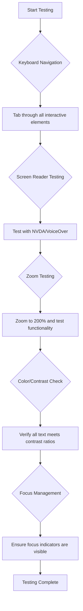

<!--
CO_OP_TRANSLATOR_METADATA:
{
  "original_hash": "300c1562e01f21065ae0b8e9d9181a86",
  "translation_date": "2025-10-20T20:47:16+00:00",
  "source_file": "1-getting-started-lessons/3-accessibility/README.md",
  "language_code": "ur"
}
-->
# قابل رسائی ویب صفحات بنانا


> اسکیچ نوٹ [Tomomi Imura](https://twitter.com/girlie_mac) کی طرف سے

## لیکچر سے پہلے کا کوئز
[لیکچر سے پہلے کا کوئز](https://ff-quizzes.netlify.app/web/)

> ویب کی طاقت اس کی عالمگیریت میں ہے۔ معذوری سے قطع نظر ہر کسی کے لیے رسائی ایک ضروری پہلو ہے۔
>
> \- سر ٹموتھی برنرز لی، W3C کے ڈائریکٹر اور ورلڈ وائڈ ویب کے موجد

ویب کی قابل رسائی ہونا صرف ایک اضافی خصوصیت نہیں بلکہ ایک بنیادی اصول ہے جو انٹرنیٹ کو واقعی عالمگیر بناتا ہے۔ جب آپ قابل رسائی ویب سائٹس بناتے ہیں، تو آپ نہ صرف معذور افراد کی مدد کرتے ہیں بلکہ سب کے لیے بہتر تجربات تخلیق کرتے ہیں۔ جیسے وہ راستے جو وہیل چیئرز کے لیے بنائے گئے ہیں، وہ بچوں کی گاڑیوں، سامان یا سائیکلوں کے لیے بھی مددگار ثابت ہوتے ہیں۔ قابل رسائی ویب ڈیزائن بھی اسی طرح کام کرتا ہے۔

اس سبق میں، آپ سیکھیں گے کہ ایسی ویب سائٹس کیسے بنائی جائیں جو ہر کسی کے لیے کام کریں، چاہے ان کی صلاحیتیں کچھ بھی ہوں یا وہ ویب کو براؤز کرنے کے لیے کون سی ٹیکنالوجیز استعمال کرتے ہوں۔ آپ جدید ویب معیارات میں شامل عملی تکنیکوں کو سیکھیں گے، طاقتور قابل رسائی ٹیسٹنگ ٹولز کا جائزہ لیں گے، اور سمجھیں گے کہ قابل رسائی ہونا تمام صارفین کے لیے استعمال کو کیسے بہتر بناتا ہے۔

اس سبق کے اختتام تک، آپ کے پاس وہ علم اور اوزار ہوں گے جو قابل رسائی کو پہلے دن سے ہی آپ کے ترقیاتی عمل کا قدرتی حصہ بنا دیں گے۔ آئیے دیکھتے ہیں کہ سوچ سمجھ کر کیے گئے ڈیزائن کے انتخاب دنیا بھر کے اربوں صارفین کے لیے ویب کو کیسے کھول سکتے ہیں۔

> آپ یہ سبق [Microsoft Learn](https://docs.microsoft.com/learn/modules/web-development-101/accessibility/?WT.mc_id=academic-77807-sagibbon) پر لے سکتے ہیں!

## معاون ٹیکنالوجیز کو سمجھنا

قابل رسائی ویب سائٹس بنانے سے پہلے، آئیے سمجھتے ہیں کہ مختلف صلاحیتوں والے لوگ ویب کو کیسے نیویگیٹ کرتے ہیں۔ یہ علم آپ کو اپنے ڈیزائن اور ترقیاتی انتخاب کے بارے میں باخبر فیصلے کرنے میں مدد دے گا۔

معاون ٹیکنالوجیز خصوصی ٹولز ہیں جو معذور افراد کو ڈیجیٹل مواد کے ساتھ تعامل کرنے میں مدد دیتے ہیں۔ یہ سمجھنا کہ یہ ٹولز کیسے کام کرتے ہیں، واقعی قابل رسائی ویب تجربات تخلیق کرنے کے لیے ضروری ہے۔

### اسکرین ریڈرز

[اسکرین ریڈرز](https://en.wikipedia.org/wiki/Screen_reader) حیرت انگیز معاون ٹیکنالوجیز ہیں جو ڈیجیٹل متن کو تقریر یا بریل آؤٹ پٹ میں تبدیل کرتی ہیں۔ یہ بنیادی طور پر بصری معذوری والے افراد استعمال کرتے ہیں، لیکن یہ ڈسلیکسیا جیسے سیکھنے کی معذوری والے صارفین کی بھی مدد کرتے ہیں۔

اسکرین ریڈر کو ویب کے لیے ایک آواز کے راوی کے طور پر سوچیں۔ یہ مواد کو منطقی ترتیب میں بلند آواز میں پڑھتا ہے، انٹرایکٹو عناصر جیسے بٹن اور لنکس کا اعلان کرتا ہے، اور مؤثر نیویگیشن کے لیے کی بورڈ شارٹ کٹس فراہم کرتا ہے۔ تاہم، اسکرین ریڈرز صرف اس وقت مؤثر طریقے سے کام کر سکتے ہیں جب ویب سائٹس مناسب ساخت اور بامعنی مواد کے ساتھ بنائی جائیں۔

**پلیٹ فارمز پر مشہور اسکرین ریڈرز:**
- **ونڈوز**: [NVDA](https://www.nvaccess.org/about-nvda/) (مفت اور سب سے زیادہ مقبول)، [JAWS](https://webaim.org/articles/jaws/)، [Narrator](https://support.microsoft.com/windows/complete-guide-to-narrator-e4397a0d-ef4f-b386-d8ae-c172f109bdb1/?WT.mc_id=academic-77807-sagibbon) (بلٹ ان)
- **macOS/iOS**: [VoiceOver](https://support.apple.com/guide/voiceover/welcome/10) (بلٹ ان اور بہت قابل)
- **Android**: [TalkBack](https://support.google.com/accessibility/android/answer/6283677) (بلٹ ان)
- **Linux**: [Orca](https://wiki.gnome.org/Projects/Orca) (مفت اور اوپن سورس)

**اسکرین ریڈرز ویب مواد کو کیسے نیویگیٹ کرتے ہیں:**

اسکرین ریڈرز متعدد نیویگیشن طریقے فراہم کرتے ہیں جو تجربہ کار صارفین کے لیے براؤزنگ کو مؤثر بناتے ہیں:
- **تسلسل کے ساتھ پڑھنا**: مواد کو اوپر سے نیچے تک پڑھتا ہے، جیسے کتاب کی پیروی کرنا
- **لینڈ مارک نیویگیشن**: صفحے کے حصوں کے درمیان چھلانگ لگانا (ہیڈر، نیویگیشن، مین، فوٹر)
- **ہیڈنگ نیویگیشن**: ہیڈنگز کے درمیان چھلانگ لگانا تاکہ صفحے کی ساخت کو سمجھا جا سکے
- **لنک لسٹس**: تمام لنکس کی فہرست تیار کرنا تاکہ جلدی رسائی حاصل ہو
- **فارم کنٹرولز**: ان پٹ فیلڈز اور بٹنوں کے درمیان براہ راست نیویگیشن

> 💡 **ڈویلپر بصیرت**: 68% اسکرین ریڈر صارفین بنیادی طور پر ہیڈنگز کے ذریعے نیویگیٹ کرتے ہیں ([WebAIM سروے](https://webaim.org/projects/screenreadersurvey9/#finding))۔ یہی وجہ ہے کہ مناسب ہیڈنگ ساخت بہت اہم ہے!

### اپنی ٹیسٹنگ ورک فلو بنانا

مؤثر قابل رسائی ٹیسٹنگ کے لیے خودکار ٹولز اور دستی تصدیق دونوں کی ضرورت ہوتی ہے۔ یہاں ایک منظم طریقہ کار ہے جو زیادہ تر مسائل کو پکڑتا ہے:

**ضروری دستی ٹیسٹنگ ورک فلو:**



**مرحلہ وار ٹیسٹنگ چیک لسٹ:**
1. **کی بورڈ نیویگیشن**: صرف Tab، Shift+Tab، Enter، Space، اور Arrow keys استعمال کریں
2. **اسکرین ریڈر ٹیسٹنگ**: NVDA، VoiceOver، یا Narrator کو فعال کریں اور بند آنکھوں کے ساتھ نیویگیٹ کریں
3. **زوم ٹیسٹنگ**: 200% اور 400% زوم لیولز پر ٹیسٹ کریں
4. **رنگ کے تضاد کی تصدیق**: تمام متن اور UI اجزاء کی جانچ کریں
5. **فوکس انڈیکیٹر ٹیسٹنگ**: یقینی بنائیں کہ تمام انٹرایکٹو عناصر کے پاس واضح فوکس اسٹیٹس ہیں

✅ **لائٹ ہاؤس سے شروع کریں**: اپنے براؤزر کے DevTools کھولیں، لائٹ ہاؤس قابل رسائی آڈٹ چلائیں، پھر نتائج کو اپنے دستی ٹیسٹنگ کے فوکس ایریاز کی رہنمائی کے لیے استعمال کریں۔

### زوم اور میگنیفیکیشن ٹولز

بہت سے صارفین مواد کو پڑھنے کے قابل بنانے کے لیے میگنیفیکیشن پر انحصار کرتے ہیں۔ اس میں کم بصارت والے افراد، عمر رسیدہ افراد، اور یہاں تک کہ روشن دھوپ میں یا عارضی بصری مسائل والے صارفین شامل ہیں۔ جدید زوم ٹیکنالوجیز سادہ تصویر کے اسکیلنگ سے کہیں زیادہ ترقی یافتہ ہو چکی ہیں۔

یہ سمجھنا کہ زوم کیسے کام کرتا ہے، آپ کو ایسے ذمہ دار ڈیزائن بنانے میں مدد دیتا ہے جو کسی بھی میگنیفیکیشن لیول پر فعال اور خوبصورت رہیں۔

**جدید براؤزر زوم کی صلاحیتیں:**
- **صفحہ زوم**: تمام مواد کو تناسب سے اسکیل کرتا ہے (متن، تصاویر، لے آؤٹ) - یہ ترجیحی طریقہ ہے
- **صرف متن زوم**: اصل لے آؤٹ کو برقرار رکھتے ہوئے فونٹ کا سائز بڑھاتا ہے
- **پنچ ٹو زوم**: عارضی میگنیفیکیشن کے لیے موبائل اشارے کی حمایت
- **براؤزر سپورٹ**: تمام جدید براؤزر 500% تک زوم کی حمایت کرتے ہیں بغیر فعالیت کو توڑے

**خصوصی میگنیفیکیشن سافٹ ویئر:**
- **ونڈوز**: [Magnifier](https://support.microsoft.com/windows/use-magnifier-to-make-things-on-the-screen-easier-to-see-414948ba-8b1c-d3bd-8615-0e5e32204198) (بلٹ ان)، [ZoomText](https://www.freedomscientific.com/training/zoomtext/getting-started/)
- **macOS/iOS**: [Zoom](https://www.apple.com/accessibility/mac/vision/) (بلٹ ان، جدید خصوصیات کے ساتھ)

> ⚠️ **ڈیزائن پر غور**: WCAG کا تقاضا ہے کہ مواد 200% زوم پر فعال رہے۔ اس سطح پر، افقی اسکرولنگ کم سے کم ہونی چاہیے، اور تمام انٹرایکٹو عناصر قابل رسائی رہنے چاہئیں۔

✅ **اپنے ذمہ دار ڈیزائن کا ٹیسٹ کریں**: اپنے براؤزر کو 200% اور 400% زوم کریں۔ کیا آپ کا لے آؤٹ خوبصورتی سے ڈھلتا ہے؟ کیا آپ بغیر زیادہ اسکرولنگ کے تمام فعالیت تک رسائی حاصل کر سکتے ہیں؟

## جدید قابل رسائی ٹیسٹنگ ٹولز

اب جب کہ آپ سمجھ گئے ہیں کہ معاون ٹیکنالوجیز کیسے کام کرتی ہیں، آئیے ان ٹولز کا جائزہ لیتے ہیں جو آپ کو قابل رسائی ویب سائٹس بنانے اور ٹیسٹ کرنے میں مدد دیتے ہیں۔ خودکار ٹیسٹنگ کو دستی تصدیق کے ساتھ ملا کر آپ کو یقین ہوتا ہے کہ آپ کی سائٹس ہر کسی کے لیے کام کرتی ہیں۔

جدید قابل رسائی ٹیسٹنگ ایک جامع نقطہ نظر کی پیروی کرتی ہے: خودکار ٹولز واضح مسائل کو پکڑتے ہیں، جبکہ دستی ٹیسٹنگ حقیقی دنیا کی استعمال کو یقینی بناتی ہے۔

### رنگ کے تضاد کی جانچ

رنگ کے تضاد کے مسائل سب سے عام قابل رسائی مسائل میں سے ایک ہیں، لیکن یہ ٹھیک کرنے میں بھی سب سے آسان ہیں۔ اچھا تضاد ہر کسی کے لیے فائدہ مند ہے—بصری معذوری والے صارفین سے لے کر روشن دھوپ میں اسکرین دیکھنے والے افراد تک۔

**WCAG تضاد کے تقاضے:**

| متن کی قسم | WCAG AA (کم از کم) | WCAG AAA (بہتر) |
|-----------|-------------------|---------------------|
| **عام متن** (18pt سے کم) | 4.5:1 تضاد تناسب | 7:1 تضاد تناسب |
| **بڑا متن** (18pt+ یا 14pt+ بولڈ) | 3:1 تضاد تناسب | 4.5:1 تضاد تناسب |
| **UI اجزاء** (بٹن، فارم بارڈرز) | 3:1 تضاد تناسب | 3:1 تضاد تناسب |

**ضروری ٹیسٹنگ ٹولز:**
- [Colour Contrast Analyser](https://www.tpgi.com/color-contrast-checker/) - کلر پکر کے ساتھ ڈیسک ٹاپ ایپ
- [WebAIM Contrast Checker](https://webaim.org/resources/contrastchecker/) - فوری فیڈبیک کے ساتھ ویب پر مبنی
- [Stark](https://www.getstark.co/) - Figma، Sketch، Adobe XD کے لیے ڈیزائن ٹول پلگ ان
- [Accessible Colors](https://accessible-colors.com/) - قابل رسائی رنگ پیلیٹس تلاش کریں

✅ **بہتر رنگ پیلیٹس بنائیں**: اپنے برانڈ کے رنگوں سے شروع کریں اور قابل رسائی تغیرات تخلیق کرنے کے لیے تضاد چیکرز استعمال کریں۔ انہیں اپنے ڈیزائن سسٹم کے قابل رسائی رنگ ٹوکن کے طور پر دستاویز کریں۔

### جامع قابل رسائی آڈٹ

سب سے مؤثر قابل رسائی ٹیسٹنگ متعدد طریقوں کو یکجا کرتی ہے۔ کوئی ایک ٹول سب کچھ نہیں پکڑتا، اس لیے مختلف طریقوں کے ساتھ ٹیسٹنگ روٹین بنانا مکمل کوریج کو یقینی بناتا ہے۔

**براؤزر پر مبنی ٹیسٹنگ (DevTools میں بلٹ ان):**
- **Chrome/Edge**: لائٹ ہاؤس قابل رسائی آڈٹ + قابل رسائی پینل
- **Firefox**: قابل رسائی انسپکٹر تفصیلی درخت منظر کے ساتھ
- **Safari**: ویب انسپکٹر میں آڈٹ ٹیب، VoiceOver سیمولیشن کے ساتھ

**پروفیشنل ٹیسٹنگ ایکسٹینشنز:**
- [axe DevTools](https://www.deque.com/axe/devtools/) - صنعت کا معیاری خودکار ٹیسٹنگ
- [WAVE](https://wave.webaim.org/extension/) - بصری فیڈبیک کے ساتھ غلطی کی نشاندہی
- [Accessibility Insights](https://accessibilityinsights.io/) - مائیکروسافٹ کا جامع ٹیسٹنگ سوٹ

**کمانڈ لائن اور CI/CD انٹیگریشن:**
- [axe-core](https://github.com/dequelabs/axe-core) - خودکار ٹیسٹنگ کے لیے جاوا اسکرپٹ لائبریری
- [Pa11y](https://pa11y.org/) - کمانڈ لائن قابل رسائی ٹیسٹنگ ٹول
- [Lighthouse CI](https://github.com/GoogleChrome/lighthouse-ci) - خودکار قابل رسائی اسکورنگ

> 🎯 **ٹیسٹنگ کا مقصد**: لائٹ ہاؤس قابل رسائی اسکور کو 95+ کے طور پر اپنا بنیادی معیار بنائیں۔ یاد رکھیں، خودکار ٹولز صرف 30-40% قابل رسائی مسائل پکڑتے ہیں—دستی ٹیسٹنگ اب بھی ضروری ہے!

## ابتدا سے قابل رسائی بنانا

ویب کی قابل رسائی کے لیے سب سے مؤثر نقطہ نظر یہ ہے کہ اسے پہلے دن سے ہی اپنی بنیاد میں شامل کریں۔ بعد میں قابل رسائی کو شامل کرنا نہ صرف زیادہ مہنگا اور وقت طلب ہوتا ہے بلکہ اکثر کمتر صارف تجربات کا باعث بنتا ہے۔

قابل رسائی کو گھر بنانے جیسا سوچیں: وہیل چیئر کی رسائی کو ابتدائی تعمیراتی منصوبوں میں شامل کرنا کہیں زیادہ آسان ہے بجائے اس کے کہ تعمیر کے بعد ریمپ اور چوڑے دروازے شامل کیے جائیں۔

### POUR اصول: آپ کی قابل رسائی بنیاد

ویب مواد کی قابل رسائی گائیڈ لائنز (WCAG) چار بنیادی اصولوں کے ارد گرد بنائی گئی ہیں جنہیں POUR کہا جاتا ہے۔ یہ اصول مختلف صلاحیتوں اور ٹیکنالوجیز والے صارفین کے لیے مواد کو قابل رسائی بنانے کے لیے ایک فریم ورک فراہم کرتے ہیں۔

POUR کو سمجھنا آپ کو قابل رسائی فیصلے کرنے میں مدد دیتا ہے جو ہر کسی کے لیے شامل تجربات تخلیق کرتے ہیں۔

**🔍 قابل ادراک**: معلومات کو ایسے طریقوں میں پیش کیا جانا چاہیے جو صارفین اپنی دستیاب حواس کے ذریعے محسوس کر سکیں

- غیر متن مواد (تصاویر، ویڈیوز، آڈیو) کے لیے متن کے متبادل فراہم کریں
- تمام متن اور UI اجزاء کے لیے کافی رنگ تضاد کو یقینی بنائیں
- ملٹی میڈیا مواد کے لیے کیپشنز اور ٹرانسکرپٹس پیش کریں
- مواد کو 200% تک دوبارہ سائز کرنے پر فعال رہنے کے لیے ڈیزائن کریں
- معلومات کو پہنچانے کے لیے متعدد حسی خصوصیات (صرف رنگ نہیں) استعمال کریں

**🎮 قابل عمل**: تمام انٹرفیس اجزاء دستیاب ان پٹ طریقوں کے ذریعے قابل عمل ہونے چاہئیں

- تمام فعالیت کو کی بورڈ نیویگیشن کے ذریعے قابل رسائی بنائیں
- صارفین کو مواد کو پڑھنے اور اس کے ساتھ تعامل کرنے کے لیے کافی وقت فراہم کریں
- ایسے مواد سے گریز کریں جو دورے یا ویسٹیبلر عوارض کا باعث بنے
- واضح ساخت اور لینڈ مارکس کے ساتھ صارفین کو مؤثر طریقے سے نیویگیٹ کرنے میں مدد کریں
- انٹرایکٹو عناصر کے لیے مناسب ہدف کے سائز (کم از کم 44px) کو یقینی بنائیں

**📖 قابل فہم**: معلومات اور UI آپریشن واضح اور قابل فہم ہونا چاہیے

- اپنے سامعین کے لیے مناسب واضح، سادہ زبان استعمال کریں
- مواد کو پیش گوئی کے قابل، مستقل طریقوں سے ظاہر اور کام کرنے کو یقینی بنائیں
- صارف ان پٹ کے لیے واضح ہدایات اور غلطی کے پیغامات فراہم کریں
- صارفین کو فارم میں غلطیوں کو سمجھنے اور درست کرنے میں مدد کریں
- منطقی پڑھنے کے ترتیب اور معلوماتی درجہ بندی کے ساتھ مواد کو منظم کریں

**💪 مضبوط**: مواد مختلف ٹیکنالوجیز اور معاون آلات کے ساتھ قابل اعتماد کام کرنا چاہیے

- اپنی بنیاد کے طور پر درست، سیمینٹک HTML استعمال کریں
- موجودہ اور مستقبل کی معاون ٹیکنالوجیز کے ساتھ مطابقت کو یقینی بنائیں
- مارک اپ کے لیے ویب معیارات اور بہترین طریقوں پر عمل کریں
- مختلف براؤزرز، آلات، اور معاون ٹولز کے ساتھ ٹیسٹ کریں
- مواد کو اس طرح سے ساخت کریں کہ جب جدید خصوصیات کی حمایت نہ ہو تو یہ خوبصورتی سے کم ہو جائے

## قابل رسائی بصری ڈیزائن بنانا

اچھا بصری ڈیزائن اور قابل رسائی ایک دوسرے کے ساتھ چلتے ہیں۔ جب آپ قابل رسائی کو ذہن میں رکھتے ہوئے ڈیزائن کرتے ہیں، تو آپ اکثر یہ دریافت کرتے ہیں کہ یہ پابندیاں صاف، زیادہ خوبصورت حل کی طرف لے جاتی ہیں جو تمام صارفین کے لیے فائدہ مند ہیں۔

آئیے دیکھتے ہیں کہ بصری طور پر دلکش ڈیزائن کیسے بنائے جائیں جو ہر کسی کے لیے کام کریں، چاہے ان کی بصری صلاحیتیں کچھ بھی ہوں یا وہ آپ کے مواد کو دیکھنے کے لیے کن حالات میں ہوں۔

###
### فوکس انڈیکیٹرز اور انٹریکشن ڈیزائن

فوکس انڈیکیٹرز ڈیجیٹل کرسر کے برابر ہیں—یہ کی بورڈ استعمال کرنے والوں کو بتاتے ہیں کہ وہ صفحے پر کہاں ہیں۔ اچھے ڈیزائن کے فوکس انڈیکیٹرز ہر کسی کے تجربے کو بہتر بناتے ہیں، کیونکہ یہ انٹریکشنز کو واضح اور پیش گوئی کے قابل بناتے ہیں۔

**جدید فوکس انڈیکیٹرز کے بہترین اصول:**

```css
/* Enhanced focus styles that work across browsers */
button:focus-visible {
  outline: 2px solid #0066cc;
  outline-offset: 2px;
  box-shadow: 0 0 0 4px rgba(0, 102, 204, 0.25);
}

/* Remove focus outline for mouse users, preserve for keyboard users */
button:focus:not(:focus-visible) {
  outline: none;
}

/* Focus-within for complex components */
.card:focus-within {
  box-shadow: 0 0 0 3px rgba(74, 144, 164, 0.5);
  border-color: #4A90A4;
}

/* Ensure focus indicators meet contrast requirements */
.custom-focus:focus-visible {
  outline: 3px solid #ffffff;
  outline-offset: 2px;
  box-shadow: 0 0 0 6px #000000;
}
```

**فوکس انڈیکیٹرز کی ضروریات:**
- **نظر آنا**: ارد گرد کے عناصر کے ساتھ کم از کم 3:1 کنٹراسٹ ریشو ہونا چاہیے
- **چوڑائی**: پورے عنصر کے ارد گرد کم از کم 2px موٹائی ہونی چاہیے
- **استقامت**: فوکس کہیں اور منتقل ہونے تک نظر آنا چاہیے
- **امتیاز**: دیگر UI اسٹیٹس سے بصری طور پر مختلف ہونا چاہیے

> 💡 **ڈیزائن ٹپ**: بہترین فوکس انڈیکیٹرز اکثر آؤٹ لائن، باکس شیڈو، اور رنگ کی تبدیلیوں کا امتزاج استعمال کرتے ہیں تاکہ مختلف پس منظر اور سیاق و سباق میں نظر آنے کو یقینی بنایا جا سکے۔

✅ **فوکس انڈیکیٹرز کا جائزہ لیں**: اپنی ویب سائٹ پر ٹیب کریں اور نوٹ کریں کہ کون سے عناصر کے واضح فوکس انڈیکیٹرز ہیں۔ کیا کوئی دیکھنے میں مشکل یا مکمل طور پر غائب ہیں؟

### سیمینٹک HTML: رسائی کی بنیاد

سیمینٹک HTML اسسٹیو ٹیکنالوجیز کے لیے ایک واضح نقشہ فراہم کرنے جیسا ہے۔ جب آپ HTML عناصر کو ان کے مطلوبہ مقصد کے لیے استعمال کرتے ہیں، تو آپ اسکرین ریڈرز، کی بورڈز، اور دیگر ٹولز کو وہ معلومات فراہم کرتے ہیں جو صارفین کو مؤثر طریقے سے نیویگیٹ کرنے میں مدد دیتی ہیں۔

سیمینٹک HTML کو ایک اچھی طرح سے منظم لائبریری کے ساتھ واضح زمرے اور نشانات کے مقابلے میں سوچیں، بمقابلہ ایک گودام جہاں کتابیں بے ترتیب بکھری ہوئی ہوں۔ دونوں میں ایک جیسی معلومات ہوتی ہیں، لیکن صرف ایک واقعی قابل استعمال ہے۔

**رسائی کے قابل صفحہ ڈھانچے کے بنیادی اجزاء:**

```html
<!-- Landmark elements provide page navigation structure -->
<header>
  <h1>Your Site Name</h1>
  <nav aria-label="Main navigation">
    <ul>
      <li><a href="/home">Home</a></li>
      <li><a href="/about">About</a></li>
      <li><a href="/services">Services</a></li>
    </ul>
  </nav>
</header>

<main>
  <article>
    <header>
      <h1>Article Title</h1>
      <p>Published on <time datetime="2024-10-14">October 14, 2024</time></p>
    </header>
    
    <section>
      <h2>First Section</h2>
      <p>Content that relates to this section...</p>
    </section>
    
    <section>
      <h2>Second Section</h2>
      <p>More related content...</p>
    </section>
  </article>
  
  <aside>
    <h2>Related Links</h2>
    <nav aria-label="Related articles">
      <ul>
        <li><a href="/related-1">First related article</a></li>
        <li><a href="/related-2">Second related article</a></li>
      </ul>
    </nav>
  </aside>
</main>

<footer>
  <p>&copy; 2024 Your Site Name. All rights reserved.</p>
  <nav aria-label="Footer links">
    <ul>
      <li><a href="/privacy">Privacy Policy</a></li>
      <li><a href="/contact">Contact Us</a></li>
    </ul>
  </nav>
</footer>
```

**سیمینٹک HTML رسائی کو کیسے تبدیل کرتا ہے:**

| سیمینٹک عنصر | مقصد | اسکرین ریڈر کا فائدہ |
|------------------|---------|----------------------|
| `<header>` | صفحہ یا سیکشن ہیڈر | "بینر لینڈ مارک" - اوپر جلدی نیویگیشن |
| `<nav>` | نیویگیشن لنکس | "نیویگیشن لینڈ مارک" - نیویگیشن سیکشنز کی فہرست |
| `<main>` | بنیادی صفحہ مواد | "مین لینڈ مارک" - مواد پر براہ راست جائیں |
| `<article>` | خود مختار مواد | آرٹیکل کی حدود کا اعلان کرتا ہے |
| `<section>` | تھیمڈ مواد کے گروپس | مواد کا ڈھانچہ فراہم کرتا ہے |
| `<aside>` | متعلقہ سائیڈبار مواد | "تکمیلی لینڈ مارک" |
| `<footer>` | صفحہ یا سیکشن فوٹر | "کنٹینٹ انفارمیشن لینڈ مارک" |

**سیمینٹک HTML کے ساتھ اسکرین ریڈر کی سپر پاورز:**
- **لینڈ مارک نیویگیشن**: اہم صفحہ سیکشنز کے درمیان فوری طور پر چھلانگ لگائیں
- **ہیڈنگ آؤٹ لائنز**: آپ کی ہیڈنگ ساخت سے مواد کی جدول تیار کریں
- **عنصر کی فہرستیں**: تمام لنکس، بٹن، یا فارم کنٹرولز کی فہرست بنائیں
- **سیاق و سباق کی آگاہی**: مواد کے سیکشنز کے درمیان تعلقات کو سمجھیں

> 🎯 **فوری ٹیسٹ**: NVDA/JAWS میں لینڈ مارک شارٹ کٹس (D لینڈ مارک کے لیے، H ہیڈنگ کے لیے، K لنک کے لیے) استعمال کرتے ہوئے اپنی سائٹ کو اسکرین ریڈر کے ساتھ نیویگیٹ کرنے کی کوشش کریں۔ کیا نیویگیشن سمجھ میں آتی ہے؟

✅ **اپنے سیمینٹک ڈھانچے کا جائزہ لیں**: اپنے براؤزر کے ڈویلپر ٹولز میں رسائی پینل کا استعمال کریں تاکہ رسائی کے درخت کو دیکھیں اور یہ یقینی بنائیں کہ آپ کا مارک اپ منطقی ڈھانچہ بناتا ہے۔

### ہیڈنگ ہائیرارکی: منطقی مواد کا خاکہ بنانا

ہیڈنگز قابل رسائی مواد کے ڈھانچے کی ریڑھ کی ہڈی ہیں۔ اسکرین ریڈر صارفین ہیڈنگز پر بہت زیادہ انحصار کرتے ہیں تاکہ آپ کے مواد کو سمجھ سکیں اور نیویگیٹ کر سکیں—یہ آپ کے صفحے کے لیے تفصیلی مواد کی جدول فراہم کرنے جیسا ہے۔

**ہیڈنگ ہائیرارکی کا اصول:**
کبھی بھی ہیڈنگ لیولز کو نہ چھوڑیں۔ ہمیشہ منطقی طور پر `<h1>` سے `<h2>` سے `<h3>` تک ترقی کریں، اور اسی طرح۔ ہیڈنگز کو دستاویز میں خاکہ ڈھانچے کی طرح سوچیں۔

**کامل ہیڈنگ ڈھانچے کی مثال:**

```html
<!-- ✅ Excellent: Logical, hierarchical progression -->
<main>
  <h1>Complete Guide to Web Accessibility</h1>
  
  <section>
    <h2>Understanding Screen Readers</h2>
    <p>Introduction to screen reader technology...</p>
    
    <h3>Popular Screen Reader Software</h3>
    <p>NVDA, JAWS, and VoiceOver comparison...</p>
    
    <h3>Testing with Screen Readers</h3>
    <p>Step-by-step testing instructions...</p>
  </section>
  
  <section>
    <h2>Color and Contrast Guidelines</h2>
    <p>Designing with sufficient contrast...</p>
    
    <h3>WCAG Contrast Requirements</h3>
    <p>Understanding the different contrast levels...</p>
    
    <h3>Testing Tools and Techniques</h3>
    <p>Tools for verifying contrast ratios...</p>
  </section>
</main>
```

```html
<!-- ❌ Problematic: Skipping levels, inconsistent structure -->
<h1>Page Title</h1>
<h3>Subsection</h3> <!-- Skipped h2 -->
<h2>This should come before h3</h2>
<h1>Another main heading?</h1> <!-- Multiple h1s -->
```

**ہیڈنگز کے بہترین اصول:**
- **ایک `<h1>` فی صفحہ**: عام طور پر آپ کا مرکزی صفحہ عنوان یا بنیادی مواد کی ہیڈنگ
- **منطقی ترقی**: کبھی بھی لیولز کو نہ چھوڑیں (h1 → h2 → h3، نہ کہ h1 → h3)
- **وضاحتی مواد**: ہیڈنگز کو سیاق و سباق سے باہر پڑھنے پر معنی خیز بنائیں
- **CSS کے ساتھ بصری اسٹائلنگ**: ظاہری شکل کے لیے CSS استعمال کریں، ڈھانچے کے لیے HTML لیولز

**اسکرین ریڈر نیویگیشن کے اعداد و شمار:**
- 68% اسکرین ریڈر صارفین ہیڈنگز کے ذریعے نیویگیٹ کرتے ہیں ([WebAIM سروے](https://webaim.org/projects/screenreadersurvey9/#finding))
- صارفین منطقی ہیڈنگ آؤٹ لائن کی توقع کرتے ہیں
- ہیڈنگز صفحہ ڈھانچے کو سمجھنے کا تیز ترین طریقہ فراہم کرتی ہیں

> 💡 **پرو ٹپ**: "HeadingsMap" جیسے براؤزر ایکسٹینشنز کا استعمال کریں تاکہ اپنی ہیڈنگ ساخت کو بصری طور پر دیکھ سکیں۔ یہ ایک اچھی طرح سے منظم مواد کی جدول کی طرح پڑھنی چاہیے۔

✅ **اپنی ہیڈنگ ساخت کا ٹیسٹ کریں**: اسکرین ریڈر کی ہیڈنگ نیویگیشن (NVDA میں H کلید) کا استعمال کرتے ہوئے اپنی ہیڈنگز کے ذریعے چھلانگ لگائیں۔ کیا ترقی آپ کے مواد کی کہانی کو منطقی طور پر بیان کرتی ہے؟

### بصری رسائی کی جدید تکنیکیں

کنٹراسٹ اور رنگ کے بنیادی اصولوں سے آگے، کچھ نفیس تکنیکیں ہیں جو واقعی جامع بصری تجربات تخلیق کرنے میں مدد کرتی ہیں۔ یہ طریقے یقینی بناتے ہیں کہ آپ کا مواد مختلف دیکھنے کے حالات اور اسسٹیو ٹیکنالوجیز کے ساتھ کام کرے۔

**بصری مواصلات کی ضروری حکمت عملی:**

- **ملٹی موڈل فیڈبیک**: بصری، متنی، اور کبھی کبھار آڈیو اشارے کو یکجا کریں
- **پروگریسو ڈسکلوزر**: معلومات کو ہضم کرنے کے قابل حصوں میں پیش کریں
- **مستقل انٹریکشن پیٹرنز**: مانوس UI کنونشنز کا استعمال کریں
- **ریسپانسیو ٹائپوگرافی**: مختلف ڈیوائسز پر متن کو مناسب طریقے سے اسکیل کریں
- **لوڈنگ اور ایرر اسٹیٹس**: تمام صارف اعمال کے لیے واضح فیڈبیک فراہم کریں

**رسائی کو بہتر بنانے کے لیے CSS یوٹیلیٹیز:**

```css
/* Screen reader only text - visually hidden but accessible */
.sr-only {
  position: absolute;
  width: 1px;
  height: 1px;
  padding: 0;
  margin: -1px;
  overflow: hidden;
  clip: rect(0, 0, 0, 0);
  white-space: nowrap;
  border: 0;
}

/* Skip link for keyboard navigation */
.skip-link {
  position: absolute;
  top: -40px;
  left: 6px;
  background: #000000;
  color: #ffffff;
  padding: 8px 16px;
  text-decoration: none;
  border-radius: 4px;
  font-weight: bold;
  transition: top 0.3s ease;
  z-index: 1000;
}

.skip-link:focus {
  top: 6px;
}

/* Reduced motion respect */
@media (prefers-reduced-motion: reduce) {
  .skip-link {
    transition: none;
  }
  
  * {
    animation-duration: 0.01ms !important;
    animation-iteration-count: 1 !important;
    transition-duration: 0.01ms !important;
  }
}

/* High contrast mode support */
@media (prefers-contrast: high) {
  .button {
    border: 2px solid;
  }
}
```

> 🎯 **رسائی کا پیٹرن**: "اسکپ لنک" کی بورڈ صارفین کے لیے ضروری ہے۔ یہ آپ کے صفحے پر پہلا فوکس ایبل عنصر ہونا چاہیے اور براہ راست مرکزی مواد کے علاقے پر چھلانگ لگانا چاہیے۔

✅ **اسکپ نیویگیشن نافذ کریں**: اپنے صفحات میں اسکپ لنکس شامل کریں اور صفحہ لوڈ ہوتے ہی ٹیب دبانے سے ان کا ٹیسٹ کریں۔ انہیں ظاہر ہونا چاہیے اور آپ کو مرکزی مواد پر چھلانگ لگانے کی اجازت دینی چاہیے۔

## معنی خیز لنک ٹیکسٹ تیار کرنا

لنکس ویب کے ہائی وے ہیں، لیکن خراب طریقے سے لکھا گیا لنک ٹیکسٹ معذور صارفین کے لیے رکاوٹیں پیدا کرتا ہے۔ بہترین لنک ٹیکسٹ آپ کے مواد کو ہر کسی کے لیے اسکین کرنے اور نیویگیٹ کرنے کے قابل بناتا ہے۔

اسکرین ریڈرز صفحے سے تمام لنکس نکال سکتے ہیں اور انہیں ایک فہرست کے طور پر پیش کر سکتے ہیں—تصور کریں کہ اگر آپ کے لنکس ایک ڈائریکٹری کے طور پر ظاہر ہوں۔ کیا ہر لنک بغیر کسی سیاق و سباق کے معنی رکھتا ہے؟

### لنک نیویگیشن پیٹرنز کو سمجھنا

اسکرین ریڈرز طاقتور لنک نیویگیشن فیچرز پیش کرتے ہیں جو اچھی طرح سے لکھے گئے لنک ٹیکسٹ پر انحصار کرتے ہیں:

**لنک نیویگیشن کے طریقے:**
- **تسلسل کے ساتھ پڑھنا**: لنکس کو مواد کے بہاؤ کے حصے کے طور پر سیاق و سباق میں پڑھا جاتا ہے
- **لنک لسٹ جنریشن**: تمام صفحہ لنکس کو ایک قابل تلاش ڈائریکٹری میں مرتب کیا جاتا ہے
- **فوری نیویگیشن**: کی بورڈ شارٹ کٹس (NVDA میں K) کا استعمال کرتے ہوئے لنکس کے درمیان چھلانگ لگائیں
- **تلاش کی فعالیت**: جزوی متن ٹائپ کرکے مخصوص لنکس تلاش کریں

**کیوں سیاق و سباق اہم ہے:**
جب اسکرین ریڈر صارفین لنک لسٹ تیار کرتے ہیں، تو وہ کچھ اس طرح دیکھتے ہیں:
- "رپورٹ ڈاؤن لوڈ کریں"
- "مزید جانیں"
- "یہاں کلک کریں"
- "پرائیویسی پالیسی"
- "یہاں کلک کریں"

ان میں سے صرف دو لنکس سیاق و سباق سے باہر پڑھنے پر مفید معلومات فراہم کرتے ہیں!

> 📊 **صارف اثر**: اسکرین ریڈر صارفین لنک لسٹس کو جلدی سے صفحہ مواد کو سمجھنے کے لیے اسکین کرتے ہیں۔ عمومی لنک ٹیکسٹ انہیں ہر لنک کے سیاق و سباق پر واپس نیویگیٹ کرنے پر مجبور کرتا ہے، جو ان کے براؤزنگ کے تجربے کو نمایاں طور پر سست کر دیتا ہے۔

### عام لنک ٹیکسٹ کی غلطیوں سے بچنا

یہ سمجھنا کہ کیا کام نہیں کرتا، آپ کو موجودہ مواد میں رسائی کے مسائل کو پہچاننے اور ٹھیک کرنے میں مدد دیتا ہے۔

**❌ عمومی لنک ٹیکسٹ جو کوئی سیاق و سباق فراہم نہیں کرتا:**

```html
<!-- Meaningless when read from a link list -->
<p>Our sustainability efforts are detailed in our recent report. 
   <a href="/sustainability-2024.pdf">Click here</a> to view it.</p>

<!-- Repeated generic text throughout the page -->
<div class="article-card">
  <h3>Web Accessibility Guide</h3>
  <p>Learn the fundamentals...</p>
  <a href="/accessibility-guide">Read more</a>
</div>
<div class="article-card">
  <h3>Color Contrast Tips</h3>
  <p>Improve your design...</p>
  <a href="/color-contrast">Read more</a>
</div>

<!-- URLs as link text (difficult for screen readers to announce) -->
<p>Visit https://www.w3.org/WAI/WCAG21/quickref/ for WCAG guidelines.</p>

<!-- Vague action words -->
<a href="/contact">Go</a> | <a href="/about">See</a> | <a href="/help">View</a>
```

**کیوں یہ پیٹرنز ناکام ہوتے ہیں:**
- **"یہاں کلک کریں"** صارفین کو منزل کے بارے میں کچھ نہیں بتاتا
- **"مزید پڑھیں"** بار بار استعمال ہونے سے الجھن پیدا ہوتی ہے
- **خام URLs** اسکرین ریڈرز کے لیے واضح طور پر تلفظ کرنا مشکل ہیں
- **ایک لفظ** جیسے "جائیں" یا "دیکھیں" وضاحتی سیاق و سباق سے محروم ہیں

### بہترین لنک ٹیکسٹ لکھنا

وضاحتی لنک ٹیکسٹ ہر کسی کے لیے فائدہ مند ہے—نظر رکھنے والے صارفین لنکس کو جلدی سے اسکین کر سکتے ہیں، اور اسکرین ریڈر صارفین فوری طور پر منزلوں کو سمجھ سکتے ہیں۔

**✅ واضح، وضاحتی لنک ٹیکسٹ کی مثالیں:**

```html
<!-- Descriptive text that explains the destination -->
<p>Our comprehensive <a href="/sustainability-2024.pdf">2024 sustainability report (PDF, 2.1MB)</a> details our environmental initiatives.</p>

<!-- Specific, unique link text for each card -->
<div class="article-card">
  <h3>Web Accessibility Guide</h3>
  <p>Learn the fundamentals of inclusive design...</p>
  <a href="/accessibility-guide">Read our complete web accessibility guide</a>
</div>
<div class="article-card">
  <h3>Color Contrast Tips</h3>
  <p>Improve your design with better color choices...</p>
  <a href="/color-contrast">Explore color contrast best practices</a>
</div>

<!-- Meaningful text instead of raw URLs -->
<p>The <a href="https://www.w3.org/WAI/WCAG21/quickref/">WCAG 2.1 Quick Reference guide</a> provides comprehensive accessibility guidelines.</p>

<!-- Descriptive action links -->
<a href="/contact">Contact our support team</a> | 
<a href="/about">About our company</a> | 
<a href="/help">Get help with your account</a>
```

**لنک ٹیکسٹ کے بہترین اصول:**
- **مخصوص بنیں**: "چوتھائی مالیاتی رپورٹ ڈاؤن لوڈ کریں" بمقابلہ "ڈاؤن لوڈ کریں"
- **فائل کی قسم اور سائز شامل کریں**: "(PDF، 1.2MB)" ڈاؤن لوڈ کے قابل فائلوں کے لیے
- **ذکر کریں کہ لنکس بیرونی طور پر کھلتے ہیں**: "(نئی ونڈو میں کھلتا ہے)" جب مناسب ہو
- **فعال زبان استعمال کریں**: "ہم سے رابطہ کریں" بمقابلہ "رابطہ صفحہ"
- **مختصر رکھیں**: ممکن ہو تو 2-8 الفاظ کا مقصد رکھیں

### لنک رسائی کے جدید پیٹرنز

کبھی کبھی بصری ڈیزائن کی حدود یا تکنیکی ضروریات کو خاص حل کی ضرورت ہوتی ہے۔ یہاں عام چیلنجنگ منظرناموں کے لیے نفیس تکنیکیں ہیں:

**بہتر سیاق و سباق کے لیے ARIA کا استعمال:**

```html
<!-- When button text must be short but needs more context -->
<a href="/report.pdf" 
   aria-label="Download 2024 annual financial report, PDF format, 2.3MB">
  Download Report
</a>

<!-- When the full context comes from surrounding content -->
<h3 id="sustainability-heading">Sustainability Initiative</h3>
<p>Our efforts to reduce environmental impact...</p>
<a href="/sustainability-details" 
   aria-labelledby="sustainability-heading"
   aria-describedby="sustainability-summary">
  Learn more
</a>
<p id="sustainability-summary">Detailed breakdown of our 2024 environmental goals and achievements</p>
```

**فائل کی اقسام اور بیرونی منزلوں کی نشاندہی کرنا:**

```html
<!-- Method 1: Include information in visible link text -->
<a href="/annual-report.pdf">
  Download our 2024 annual report (PDF, 2.3MB)
</a>

<!-- Method 2: Use screen reader-only text for file details -->
<a href="/annual-report.pdf">
  Download our 2024 annual report
  <span class="sr-only">(PDF format, 2.3MB)</span>
</a>

<!-- Method 3: External link indication -->
<a href="https://example.com" 
   target="_blank" 
   aria-describedby="external-link-warning">
  Visit external resource
</a>
<span id="external-link-warning" class="sr-only">
  (opens in new window)
</span>

<!-- Method 4: Using CSS for visual indicators -->
<a href="https://example.com" class="external-link">
  External resource
</a>
```

```css
/* Visual indicator for external links */
.external-link::after {
  content: " ↗";
  font-size: 0.8em;
  color: #666;
}

/* Screen reader announcement for external links */
.external-link::before {
  content: "External link: ";
  position: absolute;
  left: -10000px;
  width: 1px;
  height: 1px;
  overflow: hidden;
}
```

> ⚠️ **اہم**: جب `target="_blank"` استعمال کریں، ہمیشہ صارفین کو مطلع کریں کہ لنک نئی ونڈو یا ٹیب میں کھلتا ہے۔ غیر متوقع نیویگیشن تبدیلیاں الجھن پیدا کر سکتی ہیں۔

✅ **اپنے لنک کے سیاق و سباق کا ٹیسٹ کریں**: اپنے براؤزر کے ڈویلپر ٹولز کا استعمال کرتے ہوئے اپنے صفحے پر موجود تمام لنکس کی فہرست تیار کریں۔ کیا آپ ہر لنک کے مقصد کو کسی بھی ارد گرد کے سیاق و سباق کے بغیر سمجھ سکتے ہیں؟

## ARIA: HTML رسائی کو بہتر بنانا

[Accessible Rich Internet Applications (ARIA)](https://developer.mozilla.org/docs/Web/Accessibility/ARIA) آپ کے پیچیدہ ویب ایپلیکیشنز اور اسسٹیو ٹیکنالوجیز کے درمیان ایک عالمی مترجم کی طرح ہے۔ جب HTML اکیلا آپ کے انٹرایکٹو اجزاء کے مکمل معنی کا اظہار نہیں کر سکتا، ARIA خلا کو پُر کرتا ہے۔

ARIA کو اپنے HTML میں مددگار تشریحات شامل کرنے کے طور پر سوچیں—جیسے اسکرپٹ میں اسٹیج کی ہدایات جو اداکاروں کو ان کے کردار اور تعلقات کو سمجھنے میں مدد دیتی ہیں۔

**ARIA کا بنیادی اصول**: پہلے سیمینٹک HTML استعمال کریں، پھر ARIA۔ ARIA کو بہتر بنانا اور واضح کرنا چاہیے، کبھی بھی مناسب HTML ڈھانچے کی جگہ نہیں لینا چاہیے۔

### ARIA کے اسٹریٹجک نفاذ

ARIA طاقتور ہے، لیکن طاقت کے ساتھ ذمہ داری آتی ہے۔ غلط ARIA رسائی کو بغیر ARIA کے مقابلے میں بدتر بنا سکتا ہے۔ یہاں کب اور کیسے مؤثر طریقے سے استعمال کرنا ہے:

**✅ ARIA استعمال کریں جب:**
- حسب ضرورت انٹرایکٹو ویجٹس بنانا (اکارڈینز، ٹیبز، کیروسلز)
- متحرک مواد بنانا جو صفحہ دوبارہ لوڈ کیے بغیر تبدیل ہوتا ہے
- پیچیدہ UI تعلقات کے لیے اضافی سیاق و سباق فراہم کرنا
- لوڈنگ اسٹیٹس یا لائیو مواد کی اپڈیٹس کی نشاندہی کرنا
- حسب ضرورت کنٹرولز کے ساتھ ایپ جیسی انٹرفیسز بنانا

**❌ ARIA سے گریز کریں جب:**
- معیاری HTML عناصر پہلے ہی مطلوبہ سیمینٹکس فراہم کرتے ہیں
- آپ کو اس کے صحیح نفاذ کا یقین نہیں ہے
- یہ معلومات کو دہراتا ہے جو پہلے ہی سیمینٹک HTML کے ذریعے فراہم کی گئی ہے
- آپ نے حقیقی اسسٹیو ٹیکنالوجی کے ساتھ ٹیسٹ نہیں کیا ہے

> 🎯 **ARIA گولڈن رول**: "سیمینٹکس کو تبدیل نہ کریں جب تک کہ آپ کو بالکل ضرورت نہ ہو، ہمیشہ کی بورڈ رسائی کو یقینی بنائیں، اور حقیقی اسسٹیو ٹیکنالوجی کے ساتھ ٹیسٹ کریں۔"

**ARIA کی پانچ اقسام:**

1. **رولز**: یہ عنصر کیا ہے؟ (`button`, `tab`, `dialog`)
2. **پراپرٹیز**: اس کی خصوصیات کیا ہیں؟ (`aria-required`, `aria-haspopup`)
3. **اسٹیٹس**: اس کی موجودہ حالت کیا ہے؟ (`aria-expanded`, `aria-checked`)
4. **لینڈ مارکس**: یہ صفحہ ڈھانچے میں کہاں ہے؟ (`banner`, `navigation`, `main`)
5. **لائیو ریجنز**: تبدیلیوں کا اعلان کیسے کیا جانا چاہیے؟ (`aria-live`, `aria-atomic`)

### جدید ویب ایپس کے لیے ضروری ARIA پیٹرنز

یہ پیٹرنز انٹرایکٹو ویب ایپلیکیشنز میں سب سے عام رسائی کے چیلنجز کو حل کرتے ہیں:

**عنصر کو نام دینا اور بیان کرنا:**

```html
<!-- aria-label: Provides accessible name when visible text isn't sufficient -->
<button aria-label="Close newsletter subscription dialog">×</button>

<!-- aria-labelledby: References existing text as the accessible name -->
<section aria-labelledby="news-heading">
  <h2 id="news-heading">Latest News</h2>
  <!-- news content -->
</section>

<!-- aria-describedby: Links to additional descriptive text -->
<input type="password" 
       aria-describedby="pwd-requirements pwd-strength"
       required>
<div id="pwd-requirements">
  Password must contain at least 8 characters, including uppercase, lowercase, and numbers.
</div>
<div id="pwd-strength" aria-live="polite">
  <!-- Dynamic password strength indicator -->
</div>
```

**متحرک مواد کے لیے لائیو ریجنز:**

```html
<!-- Polite announcements (don't interrupt current speech) -->
<div aria-live="polite" id="status-updates">
  <!-- Status messages appear here -->
</div>

<!-- Assertive announcements (interrupt and announce immediately) -->
<div aria-live="assertive" id="urgent-alerts">
  <!-- Error messages and critical alerts -->
</div>

<!-- Loading states with live regions -->
<button id="submit-btn" aria-describedby="loading-status">
  Submit Application
</button>
<div id="loading-status" aria-live="polite" aria-atomic="true">
  <!-- "Processing your application..." appears here -->
</div>
```

**انٹرایکٹو ویجٹ کی مثال (اکارڈین):**

```html
<div class="accordion">
  <h3>
    <button aria-expanded="false" 
            aria-controls="panel-1" 
            id="accordion-trigger-1"
            class="accordion-trigger">
      Accessibility Guidelines
    </button>
  </h3>
  <div id="panel-1" 
       role="region"
       aria-labelledby="accordion-trigger-1" 
       hidden>
    <p>WCAG 2.1 provides comprehensive guidelines...</p>
  </div>
</div>
```

```javascript
// JavaScript to manage accordion state
function toggleAccordion(trigger) {
  const panel = document.getElementById(trigger.getAttribute('aria-controls'));
  const isExpanded = trigger.getAttribute('aria-expanded') === 'true';
  
  // Toggle states
  trigger.setAttribute('aria-expanded', !isExpanded);
  panel.hidden = isExpanded;
  
  // Announce change to screen readers
  const status = document.getElementById('status-updates');
  status.textContent = isExpanded ? 'Section collapsed' : 'Section expanded';
}
```

### ARIA کے نفاذ کے بہترین اصول

ARIA طاقتور ہے لیکن محتاط نفاذ کی ضرورت ہے۔ ان رہنما اصولوں پر عمل کرنے سے یہ یقینی بنانے میں مدد ملتی ہے کہ آپ کا ARIA رسائی کو بہتر بناتا ہے نہ کہ اسے نقصان پہنچاتا ہے:

**🛡️ بنیادی اصول:**

1. **پہلے سیمینٹک HTML**: ہمیشہ `<button>` کو `<div role="button">` پر ترجیح دیں
2. **سیمینٹکس کو نہ توڑیں**: موجودہ HTML معنی
**فنکشنل تصاویر** - بٹن یا کنٹرول کے طور پر کام کرتی ہیں:
```html
<button>
  
</button>
```

**پیچیدہ تصاویر** - چارٹس، ڈایاگرامز، انفوگرافکس:
```html

<div id="chart-description">
  <p>Detailed description: Sales data shows a steady increase across all quarters...</p>
</div>
```

### ویڈیو اور آڈیو کی رسائی

**ویڈیو کے تقاضے:**
- **کیپشنز**: بولے گئے مواد اور آواز کے اثرات کا متن ورژن
- **آڈیو وضاحتیں**: بصری عناصر کی نابینا صارفین کے لیے وضاحت
- **ٹرانسکرپٹس**: تمام آڈیو اور بصری مواد کا مکمل متن ورژن

```html
<video controls>
  <source src="video.mp4" type="video/mp4">
  <track kind="captions" src="captions.vtt" srclang="en" label="English">
  <track kind="descriptions" src="descriptions.vtt" srclang="en" label="Audio descriptions">
</video>
```

**آڈیو کے تقاضے:**
- **ٹرانسکرپٹس**: تمام بولے گئے مواد کا متن ورژن
- **بصری اشارے**: صرف آڈیو مواد کے لیے بصری اشارے فراہم کریں

### جدید تصویری تکنیکیں

**سجاوٹی تصاویر کے لیے CSS کا استعمال:**
```css
.hero-section {
  background-image: url('decorative-hero.jpg');
  /* Decorative images in CSS don't need alt text */
}
```

**رسائی کے ساتھ جوابدہ تصاویر:**
```html
<picture>
  <source media="(min-width: 800px)" srcset="large-chart.png">
  <source media="(min-width: 400px)" srcset="medium-chart.png">
  
</picture>
```

✅ **تصویری رسائی کی جانچ کریں**: اسکرین ریڈر کا استعمال کرتے ہوئے تصاویر کے ساتھ صفحہ پر نیویگیٹ کریں۔ کیا آپ کو مواد کو سمجھنے کے لیے کافی معلومات مل رہی ہیں؟

## کی بورڈ نیویگیشن اور فوکس مینجمنٹ

بہت سے صارفین صرف کی بورڈ نیویگیشن پر انحصار کرتے ہیں۔ یہ یقینی بنانا کہ آپ کی ویب سائٹ کی بورڈ ان پٹ کے ساتھ بالکل کام کرے، رسائی کے لیے ضروری ہے۔

### ضروری کی بورڈ نیویگیشن پیٹرنز

**معیاری کی بورڈ تعاملات:**
- **Tab**: انٹرایکٹو عناصر کے ذریعے فوکس کو آگے بڑھائیں
- **Shift + Tab**: فوکس کو پیچھے لے جائیں
- **Enter**: بٹن اور لنکس کو فعال کریں
- **Space**: بٹن کو فعال کریں، چیک باکسز کو چیک کریں
- **Arrow keys**: کمپوننٹ گروپس کے اندر نیویگیٹ کریں (ریڈیو بٹن، مینو)
- **Escape**: موڈلز، ڈراپ ڈاؤنز کو بند کریں یا آپریشنز منسوخ کریں

### فوکس مینجمنٹ کے بہترین طریقے

**مرئی فوکس اشارے:**
```css
/* Ensure focus is always visible */
button:focus-visible {
  outline: 2px solid #4A90A4;
  outline-offset: 2px;
}

/* Custom focus styles for different components */
.card:focus-within {
  box-shadow: 0 0 0 3px rgba(74, 144, 164, 0.5);
}
```

**موثر نیویگیشن کے لیے اسکیپ لنکس:**
```html
<a href="#main-content" class="skip-link">Skip to main content</a>
<a href="#navigation" class="skip-link">Skip to navigation</a>

<nav id="navigation">
  <!-- navigation content -->
</nav>
<main id="main-content">
  <!-- main content -->
</main>
```

**مناسب ٹیب آرڈر:**
```html
<!-- Use semantic HTML for natural tab order -->
<form>
  <label for="name">Name:</label>
  <input type="text" id="name" tabindex="0">
  
  <label for="email">Email:</label>
  <input type="email" id="email" tabindex="0">
  
  <button type="submit" tabindex="0">Submit</button>
</form>
```

### موڈلز میں فوکس کو محدود کرنا

جب موڈل ڈائیلاگ کھولیں، فوکس کو موڈل کے اندر محدود ہونا چاہیے:

```javascript
// Modern focus trap implementation
function trapFocus(element) {
  const focusableElements = element.querySelectorAll(
    'button, [href], input, select, textarea, [tabindex]:not([tabindex="-1"])'
  );
  
  const firstElement = focusableElements[0];
  const lastElement = focusableElements[focusableElements.length - 1];

  element.addEventListener('keydown', (e) => {
    if (e.key === 'Tab') {
      if (e.shiftKey && document.activeElement === firstElement) {
        e.preventDefault();
        lastElement.focus();
      } else if (!e.shiftKey && document.activeElement === lastElement) {
        e.preventDefault();
        firstElement.focus();
      }
    }
    
    if (e.key === 'Escape') {
      closeModal();
    }
  });
  
  // Focus first element when modal opens
  firstElement.focus();
}
```

✅ **کی بورڈ نیویگیشن کی جانچ کریں**: صرف Tab کی کو استعمال کرتے ہوئے اپنی ویب سائٹ پر نیویگیٹ کرنے کی کوشش کریں۔ کیا آپ تمام انٹرایکٹو عناصر تک پہنچ سکتے ہیں؟ کیا فوکس آرڈر منطقی ہے؟ کیا فوکس اشارے واضح طور پر نظر آ رہے ہیں؟

## فارم کی رسائی

فارمز صارف کے تعامل کے لیے اہم ہیں اور رسائی کے لیے خاص توجہ کی ضرورت ہوتی ہے۔

### لیبل اور فارم کنٹرول کا تعلق

**ہر فارم کنٹرول کے لیے ایک لیبل ضروری ہے:**
```html
<!-- Explicit labeling (preferred) -->
<label for="username">Username:</label>
<input type="text" id="username" name="username" required>

<!-- Implicit labeling -->
<label>
  Password:
  <input type="password" name="password" required>
</label>

<!-- Using aria-label when visual label isn't desired -->
<input type="search" aria-label="Search products" placeholder="Search...">
```

### غلطی کی ہینڈلنگ اور توثیق

**رسائی کے قابل غلطی کے پیغامات:**
```html
<label for="email">Email Address:</label>
<input type="email" id="email" name="email" 
       aria-describedby="email-error" 
       aria-invalid="true" required>
<div id="email-error" role="alert">
  Please enter a valid email address
</div>
```

**فارم کی توثیق کے بہترین طریقے:**
- `aria-invalid` کا استعمال کریں تاکہ غلط فیلڈز کی نشاندہی ہو
- واضح، مخصوص غلطی کے پیغامات فراہم کریں
- اہم غلطی کے اعلانات کے لیے `role="alert"` کا استعمال کریں
- غلطیاں فوری طور پر اور فارم جمع کرانے پر دکھائیں

### فیلڈ سیٹس اور گروپنگ

**متعلقہ فارم کنٹرولز کو گروپ کریں:**
```html
<fieldset>
  <legend>Shipping Address</legend>
  <label for="street">Street Address:</label>
  <input type="text" id="street" name="street">
  
  <label for="city">City:</label>
  <input type="text" id="city" name="city">
</fieldset>

<fieldset>
  <legend>Preferred Contact Method</legend>
  <input type="radio" id="contact-email" name="contact" value="email">
  <label for="contact-email">Email</label>
  
  <input type="radio" id="contact-phone" name="contact" value="phone">
  <label for="contact-phone">Phone</label>
</fieldset>
```

## آپ کا رسائی کا سفر: اہم نکات

مبارک ہو! آپ نے واقعی جامع ویب تجربات تخلیق کرنے کے لیے بنیادی معلومات حاصل کر لی ہیں۔ ویب رسائی صرف تعمیل کے بارے میں نہیں ہے—یہ لوگوں کے مختلف طریقوں کو سمجھنے اور ان کے لیے ڈیزائن کرنے کے بارے میں ہے جن سے وہ ڈیجیٹل مواد کے ساتھ تعامل کرتے ہیں۔

**🎯 آپ کے رسائی کے ٹول کٹ میں اب شامل ہیں:**

| بنیادی اصول | عمل درآمد | اثر |
|--------------|------------|------|
| **سیمینٹک HTML بنیاد** | HTML عناصر کو ان کے مطلوبہ مقصد کے لیے صحیح طریقے سے استعمال کریں | اسکرین ریڈرز مؤثر طریقے سے نیویگیٹ کر سکتے ہیں، کی بورڈز خود بخود کام کرتے ہیں |
| **جامع بصری ڈیزائن** | کافی تضاد، معنی خیز رنگ کا استعمال، مرئی فوکس اشارے | کسی بھی روشنی کی حالت میں سب کے لیے واضح |
| **وضاحتی مواد** | معنی خیز لنک متن، alt متن، ہیڈنگز | صارفین بصری سیاق کے بغیر مواد کو سمجھ سکتے ہیں |
| **کی بورڈ رسائی** | ٹیب آرڈر، کی بورڈ شارٹ کٹس، فوکس مینجمنٹ | موٹر رسائی اور پاور صارف کی کارکردگی |
| **ARIA اضافہ** | سیمینٹک خلا کو پر کرنے کے لیے اسٹریٹجک استعمال | پیچیدہ ایپلیکیشنز معاون ٹیکنالوجیز کے ساتھ کام کرتی ہیں |
| **جامع جانچ** | خودکار ٹولز + دستی تصدیق + حقیقی صارف کی جانچ | مسائل کو صارفین پر اثر انداز ہونے سے پہلے پکڑیں |

**🚀 آپ کے اگلے اقدامات:**

1. **اپنے ورک فلو میں رسائی کو شامل کریں**: جانچ کو اپنی ترقی کے عمل کا قدرتی حصہ بنائیں
2. **حقیقی صارفین سے سیکھیں**: معاون ٹیکنالوجیز استعمال کرنے والے لوگوں سے رائے حاصل کریں
3. **موجودہ رہیں**: رسائی کی تکنیکیں نئی ​​ٹیکنالوجیز اور معیارات کے ساتھ ترقی کرتی ہیں
4. **شمولیت کی وکالت کریں**: اپنے علم کو شیئر کریں اور رسائی کو ٹیم کی ترجیح بنائیں

> 💡 **یاد رکھیں**: رسائی کی پابندیاں اکثر اختراعی، خوبصورت حل کی طرف لے جاتی ہیں جو سب کے لیے فائدہ مند ہیں۔ کرب کٹس، کیپشنز، اور وائس کنٹرولز سب رسائی کی خصوصیات کے طور پر شروع ہوئے اور مرکزی دھارے میں بہتری بن گئے۔

**کاروباری معاملہ واضح ہے**: قابل رسائی ویب سائٹس زیادہ صارفین تک پہنچتی ہیں، سرچ انجنوں میں بہتر درجہ بندی کرتی ہیں، کم دیکھ بھال کے اخراجات رکھتی ہیں، اور قانونی خطرات سے بچتی ہیں۔ لیکن اس سے بھی اہم بات یہ ہے کہ قابل رسائی ویب سائٹس ویب کی بہترین اقدار کو مجسم کرتی ہیں—کھلا پن، شمولیت، اور معلومات تک مساوی رسائی۔

آپ اب مستقبل کے جامع ویب کو تخلیق کرنے کے لیے تیار ہیں۔ ہر قابل رسائی سائٹ جو آپ تخلیق کرتے ہیں، انٹرنیٹ کو سب کے لیے زیادہ خوش آئند جگہ بناتی ہے۔

## اضافی وسائل

اپنے رسائی کے سیکھنے کے سفر کو ان ضروری وسائل کے ساتھ جاری رکھیں:

**📚 سرکاری معیارات اور رہنما خطوط:**
- [WCAG 2.1 Guidelines](https://www.w3.org/WAI/WCAG21/quickref/) - سرکاری رسائی کا معیار فوری حوالہ کے ساتھ
- [ARIA Authoring Practices Guide](https://w3c.github.io/aria-practices/) - انٹرایکٹو ویجٹس کے لیے جامع پیٹرنز
- [WebAIM Guidelines](https://webaim.org/) - عملی، ابتدائی دوستانہ رسائی کی رہنمائی

**🛠️ ٹولز اور جانچ کے وسائل:**
- [axe DevTools](https://www.deque.com/axe/devtools/) - صنعت کا معیاری رسائی جانچ
- [A11y Project Checklist](https://www.a11yproject.com/checklist/) - مرحلہ وار رسائی کی تصدیق
- [Accessibility Insights](https://accessibilityinsights.io/) - مائیکروسافٹ کا جامع جانچ سوٹ
- [Color Oracle](https://colororacle.org/) - ڈیزائن کی جانچ کے لیے کلر بلائنڈنس سمیلیٹر

**🎓 سیکھنا اور کمیونٹی:**
- [WebAIM Screen Reader Survey](https://webaim.org/projects/screenreadersurvey9/) - حقیقی صارفین کی ترجیحات اور رویے
- [Inclusive Components](https://inclusive-components.design/) - جدید قابل رسائی کمپوننٹ پیٹرنز
- [A11y Coffee](https://a11y.coffee/) - فوری رسائی کے نکات اور بصیرت
- [Web Accessibility Initiative (WAI)](https://www.w3.org/WAI/) - W3C کے جامع رسائی کے وسائل

**🎥 عملی سیکھنا:**
- [Accessibility Developer Guide](https://www.accessibility-developer-guide.com/) - عملی عمل درآمد کی رہنمائی
- [Deque University](https://dequeuniversity.com/) - پیشہ ورانہ رسائی کی تربیتی کورسز

## GitHub Copilot Agent Challenge 🚀

Agent موڈ کا استعمال کرتے ہوئے درج ذیل چیلنج مکمل کریں:

**تفصیل:** ایک قابل رسائی موڈل ڈائیلاگ کمپوننٹ بنائیں جو مناسب فوکس مینجمنٹ، ARIA صفات، اور کی بورڈ نیویگیشن پیٹرنز کو ظاہر کرے۔

**پرومپٹ:** HTML، CSS، اور JavaScript کے ساتھ ایک مکمل موڈل ڈائیلاگ کمپوننٹ بنائیں جس میں شامل ہو: مناسب فوکس کو محدود کرنا، ESC کی کے ذریعے بند کرنا، باہر کلک کرنے پر بند کرنا، اسکرین ریڈرز کے لیے ARIA صفات، اور مرئی فوکس اشارے۔ موڈل میں ایک فارم شامل ہونا چاہیے جس میں مناسب لیبلز اور غلطی کی ہینڈلنگ ہو۔ یقینی بنائیں کہ کمپوننٹ WCAG 2.1 AA معیارات پر پورا اترتا ہے۔

## 🚀 چیلنج

اس HTML کو لے کر اسے جتنا ممکن ہو قابل رسائی بنائیں، دی گئی حکمت عملیوں کے مطابق۔

```html
<!DOCTYPE html>
<html lang="en">
  <head>
    <meta charset="UTF-8">
    <meta name="viewport" content="width=device-width, initial-scale=1.0">
    <title>Turtle Ipsum - The World's Premier Turtle Fan Club</title>
    <link href='../assets/style.css' rel='stylesheet' type='text/css'>
  </head>
  <body>
    <header class="site-header">
      <h1 class="site-title">Turtle Ipsum</h1>
      <p class="site-subtitle">The World's Premier Turtle Fan Club</p>
    </header>
    
    <nav class="main-nav" aria-label="Main navigation">
      <h2 class="nav-header">Resources</h2>
      <ul class="nav-list">
        <li><a href="https://www.youtube.com/watch?v=CMNry4PE93Y">"I like turtles" video</a></li>
        <li><a href="https://en.wikipedia.org/wiki/Turtle">Basic turtle information</a></li>
        <li><a href="https://en.wikipedia.org/wiki/Turtles_(chocolate)">Chocolate turtles candy</a></li>
      </ul>
    </nav>
    
    <main class="main-content">
      <article>
        <h1>Welcome to Turtle Ipsum</h1>
        <p class="intro">
          <a href="/about">Learn more about our turtle community</a> and discover fascinating facts about these amazing creatures.
        </p>
        <p class="article-text">
          Turtle ipsum dolor sit amet, consectetur adipiscing elit, sed do eiusmod tempor incididunt ut labore et dolore magna aliqua. Ut enim ad minim veniam, quis nostrud exercitation ullamco laboris nisi ut aliquip ex ea commodo consequat. Duis aute irure dolor in reprehenderit in voluptate velit esse cillum dolore eu fugiat nulla pariatur. Excepteur sint occaecat cupidatat non proident, sunt in culpa qui officia deserunt mollit anim id est laborum.
        </p>
      </article>
    </main>
    
    <footer class="footer">
      <section class="newsletter-signup">
        <h2>Stay Updated</h2>
        <button type="button" onclick="showNewsletterForm()">Sign up for turtle news</button>
      </section>
      
      <nav class="footer-nav" aria-label="Footer navigation">
        <h2>Site Pages</h2>
        <ul>
          <li><a href="../">Home</a></li>
          <li><a href="../semantic">Semantic HTML example</a></li>
        </ul>
      </nav>
      
      <p class="footer-copyright">&copy; 2024 Instrument. All rights reserved.</p>
    </footer>
  </body>
</html>
```

**کیے گئے اہم بہتریاں:**
- مناسب سیمینٹک HTML ساخت شامل کی گئی
- ہیڈنگ کی درجہ بندی کو درست کیا (ایک h1، منطقی ترقی)
- "یہاں کلک کریں" کے بجائے معنی خیز لنک متن شامل کیا
- نیویگیشن کے لیے مناسب ARIA لیبلز شامل کیے
- lang صفات اور مناسب میٹا ٹیگز شامل کیے
- انٹرایکٹو عناصر کے لیے بٹن عنصر کا استعمال کیا
- فوٹر مواد کو مناسب لینڈ مارکس کے ساتھ ترتیب دیا

## لیکچر کے بعد کا کوئز
[لیکچر کے بعد کا کوئز](https://ff-quizzes.netlify.app/web/en/)

## جائزہ اور خود مطالعہ

بہت سے ممالک میں رسائی کی ضروریات کے بارے میں قوانین موجود ہیں۔ اپنے ملک کے رسائی کے قوانین کے بارے میں پڑھیں۔ کیا شامل ہے، اور کیا نہیں؟ ایک مثال [یہ حکومتی ویب سائٹ](https://accessibility.blog.gov.uk/) ہے۔

## اسائنمنٹ

[ایک غیر قابل رسائی ویب سائٹ کا تجزیہ کریں](assignment.md)

کریڈٹس: [Turtle Ipsum](https://github.com/Instrument/semantic-html-sample) از Instrument

---

**اعلانِ لاتعلقی**:  
یہ دستاویز AI ترجمہ سروس [Co-op Translator](https://github.com/Azure/co-op-translator) کا استعمال کرتے ہوئے ترجمہ کی گئی ہے۔ ہم درستگی کی بھرپور کوشش کرتے ہیں، لیکن براہ کرم آگاہ رہیں کہ خودکار ترجمے میں غلطیاں یا عدم درستگی ہو سکتی ہے۔ اصل دستاویز کو اس کی اصل زبان میں مستند ذریعہ سمجھا جانا چاہیے۔ اہم معلومات کے لیے، پیشہ ور انسانی ترجمہ کی سفارش کی جاتی ہے۔ ہم اس ترجمے کے استعمال سے پیدا ہونے والی کسی بھی غلط فہمی یا غلط تشریح کے ذمہ دار نہیں ہیں۔