# قابل رسائی ویب صفحات بنانا

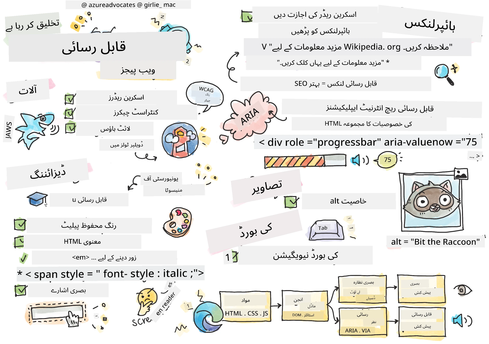
> اسکیچ نوٹ از [ٹومومی ایمورا](https://twitter.com/girlie_mac)

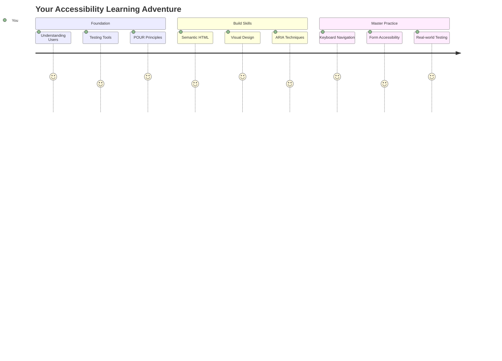

## لیکچر سے پہلے کا کوئز
[لیکچر سے پہلے کا کوئز](https://ff-quizzes.netlify.app/web/)

> ویب کی طاقت اس کی عالمگیریت میں ہے۔ معذوری سے قطع نظر ہر کسی کے لیے رسائی ایک ضروری پہلو ہے۔
>
> \- سر ٹموتھی برنرز لی، W3C کے ڈائریکٹر اور ورلڈ وائڈ ویب کے موجد

یہ بات آپ کو حیران کر سکتی ہے: جب آپ قابل رسائی ویب سائٹس بناتے ہیں، تو آپ صرف معذور افراد کی مدد نہیں کر رہے ہوتے—بلکہ آپ ویب کو سب کے لیے بہتر بنا رہے ہوتے ہیں!

کبھی گلی کے کونوں پر وہ چھوٹے ریمپ دیکھے ہیں؟ وہ اصل میں وہیل چیئرز کے لیے بنائے گئے تھے، لیکن اب وہ بچوں کی گاڑیوں، ڈلیوری ورکرز کے ڈولیز، سفر کرنے والوں کے رولنگ سامان، اور سائیکل سواروں کے لیے بھی مددگار ہیں۔ یہی طریقہ قابل رسائی ویب ڈیزائن کا ہے—ایسے حل جو ایک گروپ کی مدد کرتے ہیں، اکثر سب کے لیے فائدہ مند ثابت ہوتے ہیں۔ کافی دلچسپ، ہے نا؟

اس سبق میں، ہم یہ جانیں گے کہ ایسی ویب سائٹس کیسے بنائی جائیں جو واقعی سب کے لیے کام کریں، چاہے وہ ویب کو کیسے بھی براؤز کریں۔ آپ عملی تکنیکیں دریافت کریں گے جو پہلے ہی ویب کے معیارات میں شامل ہیں، ٹیسٹنگ ٹولز کے ساتھ کام کریں گے، اور دیکھیں گے کہ قابل رسائی ویب سائٹس کیسے سب کے لیے زیادہ قابل استعمال بناتی ہیں۔

اس سبق کے اختتام تک، آپ کو یہ اعتماد ہوگا کہ قابل رسائی کو اپنے ڈیولپمنٹ ورک فلو کا قدرتی حصہ بنا سکیں۔ تیار ہیں یہ جاننے کے لیے کہ سوچ سمجھ کر کیے گئے ڈیزائن کے انتخاب کیسے اربوں صارفین کے لیے ویب کو کھول سکتے ہیں؟ آئیے شروع کریں!

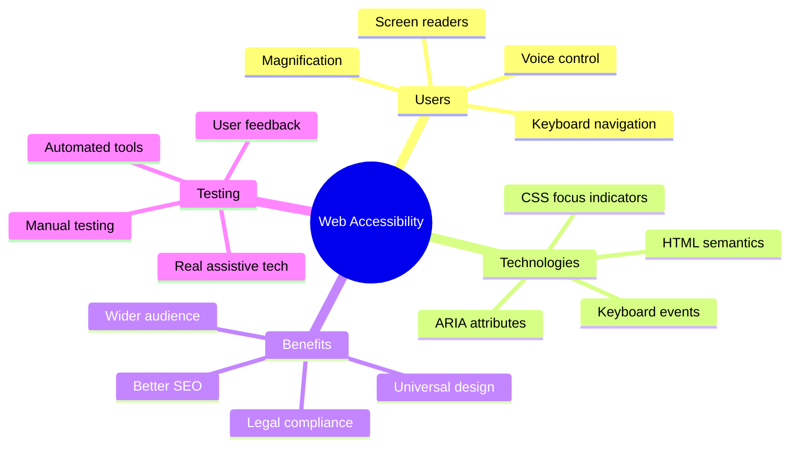

> آپ یہ سبق [Microsoft Learn](https://docs.microsoft.com/learn/modules/web-development-101/accessibility/?WT.mc_id=academic-77807-sagibbon) پر لے سکتے ہیں!

## معاون ٹیکنالوجیز کو سمجھنا

کوڈنگ شروع کرنے سے پہلے، آئیے ایک لمحہ نکال کر یہ سمجھیں کہ مختلف صلاحیتوں والے لوگ ویب کو حقیقت میں کیسے تجربہ کرتے ہیں۔ یہ صرف نظریہ نہیں ہے—ان حقیقی دنیا کے نیویگیشن پیٹرنز کو سمجھنا آپ کو ایک بہتر ڈیولپر بنائے گا!

معاون ٹیکنالوجیز حیرت انگیز ٹولز ہیں جو معذور افراد کو ویب سائٹس کے ساتھ ایسے طریقوں سے تعامل کرنے میں مدد دیتی ہیں جو آپ کو حیران کر سکتے ہیں۔ ایک بار جب آپ ان ٹیکنالوجیز کے کام کرنے کا طریقہ سمجھ لیں گے، تو قابل رسائی ویب تجربات بنانا بہت زیادہ آسان ہو جائے گا۔ یہ بالکل ایسے ہے جیسے آپ اپنے کوڈ کو کسی اور کی نظر سے دیکھنا سیکھ رہے ہوں۔

### اسکرین ریڈرز

[اسکرین ریڈرز](https://en.wikipedia.org/wiki/Screen_reader) بہت جدید ٹیکنالوجی ہیں جو ڈیجیٹل متن کو تقریر یا بریل آؤٹ پٹ میں تبدیل کرتی ہیں۔ اگرچہ یہ بنیادی طور پر بصری معذوری والے افراد استعمال کرتے ہیں، لیکن یہ ڈسلیکسیا جیسے سیکھنے کی معذوری والے صارفین کے لیے بھی بہت مددگار ہیں۔

میں اسکرین ریڈر کو ایک بہت ہوشیار راوی کے طور پر سوچتا ہوں جو آپ کو کتاب پڑھ کر سناتا ہے۔ یہ مواد کو منطقی ترتیب میں بلند آواز سے پڑھتا ہے، انٹرایکٹو عناصر جیسے "بٹن" یا "لنک" کا اعلان کرتا ہے، اور صفحے پر نیویگیٹ کرنے کے لیے کی بورڈ شارٹ کٹس فراہم کرتا ہے۔ لیکن بات یہ ہے—اسکرین ریڈرز صرف تب ہی اپنا جادو دکھا سکتے ہیں جب ہم ویب سائٹس کو مناسب ساخت اور معنی خیز مواد کے ساتھ بنائیں۔ یہی آپ کا کام ہے بطور ڈیولپر!

**پلیٹ فارمز پر مشہور اسکرین ریڈرز:**
- **ونڈوز**: [NVDA](https://www.nvaccess.org/about-nvda/) (مفت اور سب سے مشہور)، [JAWS](https://webaim.org/articles/jaws/)، [Narrator](https://support.microsoft.com/windows/complete-guide-to-narrator-e4397a0d-ef4f-b386-d8ae-c172f109bdb1/?WT.mc_id=academic-77807-sagibbon) (بلٹ ان)
- **macOS/iOS**: [VoiceOver](https://support.apple.com/guide/voiceover/welcome/10) (بلٹ ان اور بہت قابل)
- **Android**: [TalkBack](https://support.google.com/accessibility/android/answer/6283677) (بلٹ ان)
- **Linux**: [Orca](https://wiki.gnome.org/Projects/Orca) (مفت اور اوپن سورس)

**اسکرین ریڈرز ویب مواد کو کیسے نیویگیٹ کرتے ہیں:**

اسکرین ریڈرز متعدد نیویگیشن طریقے فراہم کرتے ہیں جو تجربہ کار صارفین کے لیے براؤزنگ کو مؤثر بناتے ہیں:
- **تسلسل سے پڑھنا**: مواد کو اوپر سے نیچے تک پڑھتا ہے، جیسے کتاب کی پیروی کرنا
- **لینڈ مارک نیویگیشن**: صفحے کے سیکشنز کے درمیان چھلانگ لگانا (ہیڈر، نیویگیشن، مین، فوٹر)
- **ہیڈنگ نیویگیشن**: ہیڈنگز کے درمیان چھلانگ لگانا تاکہ صفحے کی ساخت کو سمجھا جا سکے
- **لنک لسٹس**: تمام لنکس کی فہرست تیار کرنا تاکہ جلدی رسائی ہو سکے
- **فارم کنٹرولز**: ان پٹ فیلڈز اور بٹنوں کے درمیان براہ راست نیویگیشن

> 💡 **یہ بات حیران کن ہے**: 68% اسکرین ریڈر صارفین بنیادی طور پر ہیڈنگز کے ذریعے نیویگیٹ کرتے ہیں ([WebAIM سروے](https://webaim.org/projects/screenreadersurvey9/#finding))۔ اس کا مطلب ہے کہ آپ کی ہیڈنگ کی ساخت صارفین کے لیے ایک نقشہ کی طرح ہے—جب آپ اسے درست بناتے ہیں، تو آپ واقعی لوگوں کو اپنے مواد کے ارد گرد تیزی سے راستہ تلاش کرنے میں مدد کر رہے ہوتے ہیں!

### اپنی ٹیسٹنگ ورک فلو بنانا

یہ اچھی خبر ہے—مؤثر قابل رسائی ٹیسٹنگ کو پریشان کن ہونے کی ضرورت نہیں ہے! آپ کو خودکار ٹولز کو شامل کرنا ہوگا (یہ واضح مسائل کو پکڑنے میں شاندار ہیں) اور کچھ ہاتھ سے ٹیسٹنگ کرنی ہوگی۔ یہاں ایک منظم طریقہ ہے جو زیادہ تر مسائل کو پکڑتا ہے بغیر آپ کا پورا دن ضائع کیے:

**ضروری دستی ٹیسٹنگ ورک فلو:**

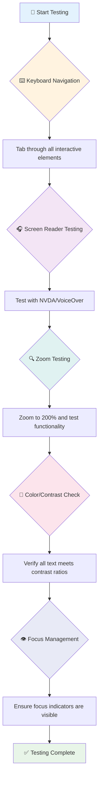

**مرحلہ وار ٹیسٹنگ چیک لسٹ:**
1. **کی بورڈ نیویگیشن**: صرف Tab، Shift+Tab، Enter، Space، اور Arrow keys استعمال کریں
2. **اسکرین ریڈر ٹیسٹنگ**: NVDA، VoiceOver، یا Narrator کو فعال کریں اور بند آنکھوں سے نیویگیٹ کریں
3. **زوم ٹیسٹنگ**: 200% اور 400% زوم لیولز پر ٹیسٹ کریں
4. **رنگ کے تضاد کی تصدیق**: تمام متن اور UI اجزاء چیک کریں
5. **فوکس انڈیکیٹر ٹیسٹنگ**: یقینی بنائیں کہ تمام انٹرایکٹو عناصر کے واضح فوکس اسٹیٹس ہوں

✅ **لائٹ ہاؤس سے شروع کریں**: اپنے براؤزر کے DevTools کھولیں، لائٹ ہاؤس قابل رسائی آڈٹ چلائیں، پھر نتائج کو اپنی دستی ٹیسٹنگ کے فوکس ایریاز کی رہنمائی کے لیے استعمال کریں۔

### زوم اور میگنیفیکیشن ٹولز

آپ جانتے ہیں کہ کبھی کبھار فون پر متن چھوٹا ہونے پر زوم کرتے ہیں، یا روشن دھوپ میں لیپ ٹاپ اسکرین پر نظر ڈالنے کی کوشش کرتے ہیں؟ بہت سے صارفین روزانہ مواد کو پڑھنے کے قابل بنانے کے لیے میگنیفیکیشن ٹولز پر انحصار کرتے ہیں۔ اس میں کم نظر والے افراد، بزرگ، اور وہ لوگ شامل ہیں جو کبھی باہر ویب سائٹ پڑھنے کی کوشش کرتے ہیں۔

جدید زوم ٹیکنالوجیز صرف چیزوں کو بڑا کرنے سے آگے بڑھ چکی ہیں۔ یہ سمجھنا کہ یہ ٹولز کیسے کام کرتے ہیں آپ کو ایسے ذمہ دار ڈیزائن بنانے میں مدد دے گا جو کسی بھی میگنیفیکیشن لیول پر فعال اور دلکش رہیں۔

**جدید براؤزر زوم کی صلاحیتیں:**
- **صفحہ زوم**: تمام مواد کو تناسب سے بڑھاتا ہے (متن، تصاویر، لے آؤٹ) - یہ ترجیحی طریقہ ہے
- **صرف متن زوم**: فونٹ سائز بڑھاتا ہے جبکہ اصل لے آؤٹ برقرار رکھتا ہے
- **پنچ ٹو زوم**: موبائل اشارے کی حمایت عارضی میگنیفیکیشن کے لیے
- **براؤزر سپورٹ**: تمام جدید براؤزرز 500% تک زوم کی حمایت کرتے ہیں بغیر فعالیت کو توڑے

**خصوصی میگنیفیکیشن سافٹ ویئر:**
- **ونڈوز**: [Magnifier](https://support.microsoft.com/windows/use-magnifier-to-make-things-on-the-screen-easier-to-see-414948ba-8b1c-d3bd-8615-0e5e32204198) (بلٹ ان)، [ZoomText](https://www.freedomscientific.com/training/zoomtext/getting-started/)
- **macOS/iOS**: [Zoom](https://www.apple.com/accessibility/mac/vision/) (بلٹ ان اور جدید خصوصیات کے ساتھ)

> ⚠️ **ڈیزائن پر غور کریں**: WCAG کا تقاضا ہے کہ مواد 200% زوم پر فعال رہے۔ اس سطح پر، افقی اسکرولنگ کم سے کم ہونی چاہیے، اور تمام انٹرایکٹو عناصر قابل رسائی رہنے چاہئیں۔

✅ **اپنے ذمہ دار ڈیزائن کا ٹیسٹ کریں**: اپنے براؤزر کو 200% اور 400% زوم کریں۔ کیا آپ کا لے آؤٹ خوبصورتی سے ڈھلتا ہے؟ کیا آپ بغیر زیادہ اسکرولنگ کے تمام فعالیت تک رسائی حاصل کر سکتے ہیں؟

## جدید قابل رسائی ٹیسٹنگ ٹولز

اب جب کہ آپ سمجھ گئے ہیں کہ لوگ معاون ٹیکنالوجیز کے ساتھ ویب کو کیسے نیویگیٹ کرتے ہیں، آئیے ان ٹولز کو دریافت کریں جو آپ کو قابل رسائی ویب سائٹس بنانے اور ٹیسٹ کرنے میں مدد دیتے ہیں۔

اسے یوں سمجھیں: خودکار ٹولز واضح مسائل (جیسے گمشدہ alt متن) کو پکڑنے میں شاندار ہیں، جبکہ ہاتھ سے ٹیسٹنگ آپ کو یہ یقینی بنانے میں مدد دیتی ہے کہ آپ کی سائٹ حقیقی دنیا میں استعمال کرنے کے لیے اچھی لگتی ہے۔ دونوں مل کر آپ کو یہ اعتماد دیتے ہیں کہ آپ کی سائٹس سب کے لیے کام کرتی ہیں۔

### رنگ کے تضاد کی جانچ

یہ اچھی خبر ہے: رنگ کے تضاد قابل رسائی کے سب سے عام مسائل میں سے ایک ہے، لیکن یہ ٹھیک کرنے میں سب سے آسان بھی ہے۔ اچھا تضاد سب کے لیے فائدہ مند ہے—بصری معذوری والے صارفین سے لے کر ساحل پر اپنے فون پڑھنے کی کوشش کرنے والے لوگوں تک۔

**WCAG تضاد کے تقاضے:**

| متن کی قسم | WCAG AA (کم از کم) | WCAG AAA (بہتر) |
|-----------|-------------------|---------------------|
| **عام متن** (18pt سے کم) | 4.5:1 تضاد تناسب | 7:1 تضاد تناسب |
| **بڑا متن** (18pt+ یا 14pt+ بولڈ) | 3:1 تضاد تناسب | 4.5:1 تضاد تناسب |
| **UI اجزاء** (بٹن، فارم بارڈرز) | 3:1 تضاد تناسب | 3:1 تضاد تناسب |

**ضروری ٹیسٹنگ ٹولز:**
- [Colour Contrast Analyser](https://www.tpgi.com/color-contrast-checker/) - کلر پککر کے ساتھ ڈیسک ٹاپ ایپ
- [WebAIM Contrast Checker](https://webaim.org/resources/contrastchecker/) - ویب پر مبنی فوری فیڈبیک کے ساتھ
- [Stark](https://www.getstark.co/) - فگما، اسکیچ، ایڈوب XD کے لیے ڈیزائن ٹول پلگ ان
- [Accessible Colors](https://accessible-colors.com/) - قابل رسائی رنگ پیلیٹس تلاش کریں

✅ **بہتر رنگ پیلیٹس بنائیں**: اپنے برانڈ کے رنگوں سے شروع کریں اور قابل رسائی تغیرات بنانے کے لیے تضاد چیکرز کا استعمال کریں۔ انہیں اپنے ڈیزائن سسٹم کے قابل رسائی رنگ ٹوکن کے طور پر دستاویز کریں۔

### جامع قابل رسائی آڈٹ

سب سے مؤثر قابل رسائی ٹیسٹنگ متعدد طریقوں کو یکجا کرتی ہے۔ کوئی ایک ٹول سب کچھ نہیں پکڑ سکتا، اس لیے مختلف طریقوں کے ساتھ ٹیسٹنگ روٹین بنانا مکمل کوریج کو یقینی بناتا ہے۔

**براؤزر پر مبنی ٹیسٹنگ (DevTools میں بلٹ ان):**
- **کروم/ایج**: لائٹ ہاؤس قابل رسائی آڈٹ + قابل رسائی پینل
- **فائر فاکس**: تفصیلی درخت منظر کے ساتھ قابل رسائی انسپکٹر
- **سفاری**: ویب انسپکٹر میں آڈٹ ٹیب کے ساتھ VoiceOver کی تخروپن

**پروفیشنل ٹیسٹنگ ایکسٹینشنز:**
- [axe DevTools](https://www.deque.com/axe/devtools/) - صنعت کے معیاری خودکار ٹیسٹنگ
- [WAVE](https://wave.webaim.org/extension/) - غلطی کو نمایاں کرنے کے ساتھ بصری فیڈبیک
- [Accessibility Insights](https://accessibilityinsights.io/) - مائیکروسافٹ کا جامع ٹیسٹنگ سوٹ

**کمانڈ لائن اور CI/CD انٹیگریشن:**
- [axe-core](https://github.com/dequelabs/axe-core) - خودکار ٹیسٹنگ کے لیے جاوا اسکرپٹ لائبریری
- [Pa11y](https://pa11y.org/) - کمانڈ لائن قابل رسائی ٹیسٹنگ ٹول
- [Lighthouse CI](https://github.com/GoogleChrome/lighthouse-ci) - خودکار قابل رسائی اسکورنگ

> 🎯 **ٹیسٹنگ کا مقصد**: لائٹ ہاؤس قابل رسائی اسکور کو 95+ کے طور پر اپنا بنیادی معیار بنائیں۔ یاد رکھیں، خودکار ٹولز صرف 30-40% قابل رسائی مسائل پکڑتے ہیں—دستی ٹیسٹنگ اب بھی ضروری ہے!

### 🧠 **ٹیسٹنگ مہارت چیک: مسائل تلاش کرنے کے لیے تیار؟**

**آئیے دیکھتے ہیں کہ آپ قابل رسائی ٹیسٹنگ کے بارے میں کیسا محسوس کر رہے ہیں:**
- آپ کے لیے ابھی کون سا ٹیسٹنگ طریقہ سب سے زیادہ قابل رسائی لگتا ہے؟
- کیا آپ پورے دن کے لیے صرف کی بورڈ نیویگیشن استعمال کرنے کا تصور کر سکتے ہیں؟
- آن لائن آپ نے ذاتی طور پر کون سی قابل رسائی رکاوٹ کا سامنا کیا ہے؟

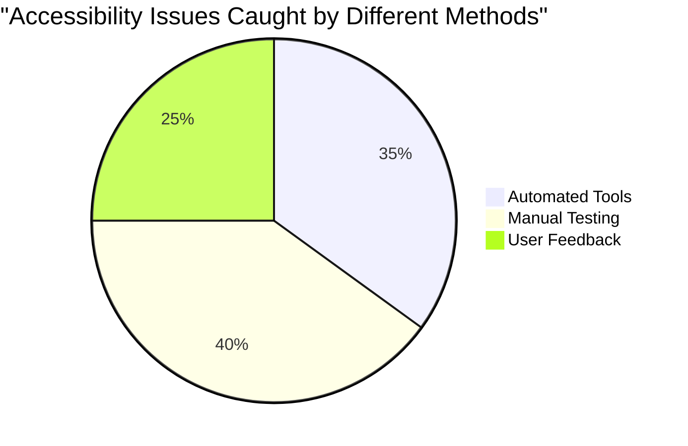

> **اعتماد بڑھانے والا**: پیشہ ورانہ قابل رسائی ٹیسٹرز بالکل یہی طریقے استعمال کرتے ہیں۔ آپ صنعت کے معیاری طریقے سیکھ رہے ہیں!

## ابتدا سے قابل رسائی بنانا

قابل رسائی کامیابی کی کلید یہ ہے کہ اسے پہلے دن سے اپنی بنیاد میں شامل کریں۔ میں جانتا ہوں کہ یہ سوچنا پرکشش ہے "میں بعد میں قابل رسائی شامل کروں گا"، لیکن یہ ایسے ہے جیسے پہلے سے بنے گھر میں ریمپ شامل کرنے کی کوشش کرنا۔ ممکن؟ ہاں۔ آسان؟ بالکل نہیں۔

قابل رسائی کو گھر کی منصوبہ بندی کی طرح سوچیں—اپنے ابتدائی تعمیراتی منصوبوں میں وہیل چیئر کی رسائی شامل کرنا بہت آسان ہے بجائے اس کے کہ بعد میں سب کچھ دوبارہ بنایا جائے۔

### POUR اصول: آپ کی قابل رسائی بنیاد

ویب مواد کی قابل رسائی گائیڈ لائنز (WCAG) چار بنیادی اصولوں کے گرد بنی ہیں جو POUR کے مخفف میں آتی ہیں۔ فکر نہ کریں—یہ صرف علمی تصورات نہیں ہیں! یہ دراصل عملی رہنما خطوط ہیں جو ایسا مواد بنانے کے لیے ہیں جو سب کے لیے کام کرے۔

ایک بار جب آپ POUR کو سمجھ لیں گے، تو قابل رسائی فیصلے کرنا بہت زیادہ آسان ہو جائے گا۔ یہ بالکل ایسے ہے جیسے آپ کے پاس ایک ذہنی چیک لسٹ ہو جو آپ کے ڈیزائن کے انتخاب کی رہنمائی کرے۔ آئیے اسے تفصیل سے دیکھتے ہیں:

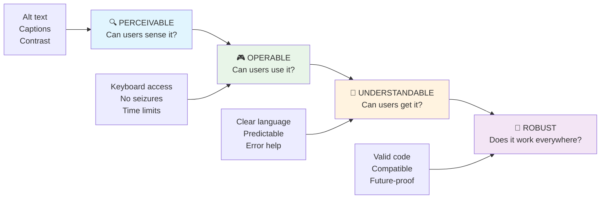

**🔍 قابل محسوس**: معلومات کو ایسے طریقوں سے پیش کرنا ضروری ہے جو صارفین اپنی دستیاب حواس کے ذریعے محسوس کر سکیں

- غیر متن مواد کے لیے متن کے متبادل فراہم کریں (تصاویر، ویڈیوز، آڈیو)
- تمام متن اور UI اجزاء کے لیے کافی رنگ کے تضاد کو یقینی بنائیں
- ملٹی میڈیا مواد کے لیے کیپشنز اور ٹرانسکرپٹس پیش کریں
- ایسا مواد ڈیزائن کریں جو 200% تک سائز میں بڑھنے پر بھی فعال رہے
- معلومات پہنچانے کے لیے متعدد حسی خصوصیات (صرف رنگ نہیں) استعمال کریں

**🎮 قابل عمل**: تمام انٹرفیس اجزاء دستیاب ان پٹ طریقوں کے ذریعے قابل عمل ہونے چاہئیں

- تمام فعالیت کو کی بورڈ نیویگیشن کے ذریعے قابل رسائی بنائیں

- **مختلف براؤزرز، ڈیوائسز، اور معاون ٹولز پر ٹیسٹ کریں**
- **مواد کو اس طرح ترتیب دیں کہ جب جدید فیچرز سپورٹ نہ ہوں تو یہ آسانی سے کام کرے**

### 🎯 **POUR اصولوں کی جانچ: بنیادوں کو مضبوط بنانا**

**بنیادوں پر ایک مختصر نظر:**
- کیا آپ کسی ویب سائٹ فیچر کے بارے میں سوچ سکتے ہیں جو ہر POUR اصول میں ناکام ہو؟
- بطور ڈیولپر آپ کو کون سا اصول سب سے زیادہ قدرتی لگتا ہے؟
- یہ اصول سب کے لیے، نہ صرف معذور صارفین کے لیے، ڈیزائن کو کیسے بہتر بنا سکتے ہیں؟

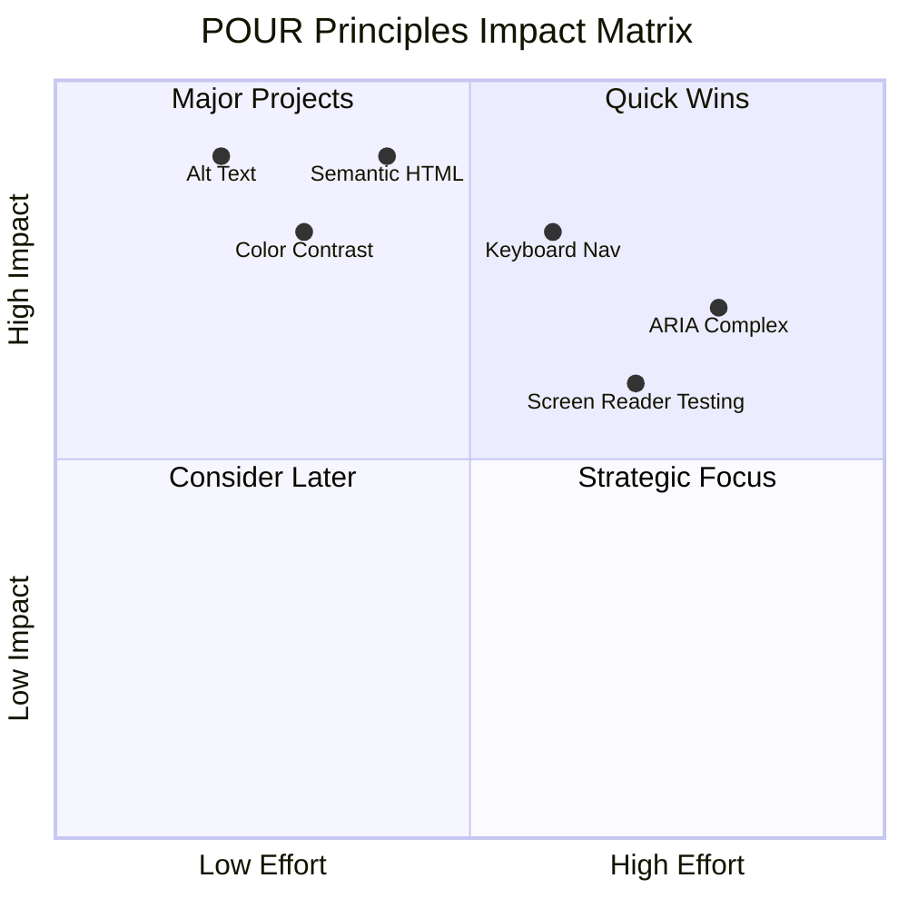

> **یاد رکھیں**: زیادہ اثر والے، کم محنت والے بہتریوں سے شروع کریں۔ سیمینٹک HTML اور alt ٹیکسٹ آپ کو کم محنت میں سب سے زیادہ رسائی فراہم کرتے ہیں!

## قابل رسائی بصری ڈیزائن بنانا

اچھا بصری ڈیزائن اور رسائی ایک دوسرے کے ساتھ چلتے ہیں۔ جب آپ رسائی کو مدنظر رکھتے ہوئے ڈیزائن کرتے ہیں، تو آپ اکثر یہ دریافت کرتے ہیں کہ یہ پابندیاں صاف، زیادہ خوبصورت حل پیدا کرتی ہیں جو تمام صارفین کے لیے فائدہ مند ہیں۔

آئیے دیکھتے ہیں کہ بصری طور پر دلکش ڈیزائن کیسے بنائیں جو ہر کسی کے لیے کام کرے، چاہے ان کی بصری صلاحیتیں کچھ بھی ہوں یا وہ آپ کے مواد کو کس حالت میں دیکھ رہے ہوں۔

### رنگ اور بصری رسائی کی حکمت عملی

رنگ مواصلات کے لیے طاقتور ہے، لیکن یہ کبھی بھی اہم معلومات پہنچانے کا واحد ذریعہ نہیں ہونا چاہیے۔ رنگ سے آگے ڈیزائن کرنا زیادہ مضبوط، جامع تجربات پیدا کرتا ہے جو زیادہ حالات میں کام کرتے ہیں۔

**رنگین وژن کے فرق کے لیے ڈیزائن کریں:**

تقریباً 8% مرد اور 0.5% خواتین کو رنگین وژن کا فرق ہوتا ہے (جسے اکثر "کلر بلائنڈنس" کہا جاتا ہے)۔ سب سے عام اقسام ہیں:
- **ڈیوٹرانوپیا**: سرخ اور سبز کو پہچاننے میں دشواری
- **پروٹانوپیا**: سرخ زیادہ مدھم نظر آتا ہے
- **ٹریٹانوپیا**: نیلے اور پیلے کے ساتھ دشواری (نایاب)

**جامع رنگین حکمت عملی:**

```css
/* ❌ Bad: Using only color to indicate status */
.error { color: red; }
.success { color: green; }

/* ✅ Good: Color plus icons and context */
.error {
  color: #d32f2f;
  border-left: 4px solid #d32f2f;
}
.error::before {
  content: "⚠️";
  margin-right: 8px;
}

.success {
  color: #2e7d32;
  border-left: 4px solid #2e7d32;
}
.success::before {
  content: "✅";
  margin-right: 8px;
}
```

**بنیادی کنٹراسٹ کی ضروریات سے آگے:**
- اپنے رنگوں کے انتخاب کو کلر بلائنڈ سمیلیٹرز کے ساتھ ٹیسٹ کریں
- رنگ کوڈنگ کے ساتھ پیٹرنز، ٹیکسچرز، یا شکلیں استعمال کریں
- یقینی بنائیں کہ انٹرایکٹو حالتیں رنگ کے بغیر بھی قابل شناخت رہیں
- غور کریں کہ آپ کا ڈیزائن ہائی کنٹراسٹ موڈ میں کیسا نظر آتا ہے

✅ **اپنی رنگین رسائی کی جانچ کریں**: [Coblis](https://www.color-blindness.com/coblis-color-blindness-simulator/) جیسے ٹولز استعمال کریں تاکہ دیکھ سکیں کہ آپ کی سائٹ مختلف قسم کے رنگین وژن والے صارفین کے لیے کیسی نظر آتی ہے۔

### فوکس انڈیکیٹرز اور انٹرایکشن ڈیزائن

فوکس انڈیکیٹرز ڈیجیٹل کرسر کے برابر ہیں—یہ کی بورڈ صارفین کو دکھاتے ہیں کہ وہ صفحے پر کہاں ہیں۔ اچھی طرح سے ڈیزائن کیے گئے فوکس انڈیکیٹرز ہر کسی کے تجربے کو بہتر بناتے ہیں، انٹرایکشنز کو واضح اور پیش گوئی کے قابل بناتے ہیں۔

**جدید فوکس انڈیکیٹرز کے بہترین طریقے:**

```css
/* Enhanced focus styles that work across browsers */
button:focus-visible {
  outline: 2px solid #0066cc;
  outline-offset: 2px;
  box-shadow: 0 0 0 4px rgba(0, 102, 204, 0.25);
}

/* Remove focus outline for mouse users, preserve for keyboard users */
button:focus:not(:focus-visible) {
  outline: none;
}

/* Focus-within for complex components */
.card:focus-within {
  box-shadow: 0 0 0 3px rgba(74, 144, 164, 0.5);
  border-color: #4A90A4;
}

/* Ensure focus indicators meet contrast requirements */
.custom-focus:focus-visible {
  outline: 3px solid #ffffff;
  outline-offset: 2px;
  box-shadow: 0 0 0 6px #000000;
}
```

**فوکس انڈیکیٹرز کی ضروریات:**
- **نظر آنے والا**: ارد گرد کے عناصر کے ساتھ کم از کم 3:1 کنٹراسٹ تناسب ہونا چاہیے
- **چوڑائی**: پورے عنصر کے ارد گرد کم از کم 2px موٹائی
- **استقامت**: جب تک فوکس کہیں اور منتقل نہ ہو، نظر آنا چاہیے
- **امتیاز**: دیگر UI حالتوں سے بصری طور پر مختلف ہونا چاہیے

> 💡 **ڈیزائن ٹپ**: بہترین فوکس انڈیکیٹرز اکثر آؤٹ لائن، باکس شیڈو، اور رنگ کی تبدیلیوں کا امتزاج استعمال کرتے ہیں تاکہ مختلف پس منظر اور سیاق و سباق میں نظر آنے کو یقینی بنایا جا سکے۔

✅ **اپنے فوکس انڈیکیٹرز کا آڈٹ کریں**: اپنی ویب سائٹ پر ٹیب کریں اور نوٹ کریں کہ کون سے عناصر کے واضح فوکس انڈیکیٹرز ہیں۔ کیا کوئی دیکھنے میں مشکل یا مکمل طور پر غائب ہیں؟

### سیمینٹک HTML: رسائی کی بنیاد

سیمینٹک HTML معاون ٹیکنالوجیز کے لیے آپ کی ویب سائٹ کا GPS سسٹم فراہم کرنے جیسا ہے۔ جب آپ HTML عناصر کو ان کے مطلوبہ مقصد کے لیے استعمال کرتے ہیں، تو آپ بنیادی طور پر اسکرین ریڈرز، کی بورڈز، اور دیگر ٹولز کو ایک تفصیلی نقشہ فراہم کرتے ہیں تاکہ صارفین کو مؤثر طریقے سے نیویگیٹ کرنے میں مدد ملے۔

یہاں ایک مثال ہے جو واقعی میرے لیے واضح ہوئی: سیمینٹک HTML ایک اچھی طرح سے منظم لائبریری کے درمیان فرق ہے جس میں واضح زمرے اور مددگار نشانات ہیں بمقابلہ ایک گودام جہاں کتابیں بے ترتیب بکھری ہوئی ہیں۔ دونوں جگہوں پر ایک ہی کتابیں ہیں، لیکن آپ کس جگہ پر کچھ تلاش کرنے کی کوشش کرنا پسند کریں گے؟ بالکل!

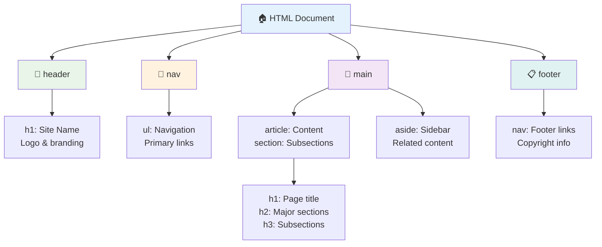

**قابل رسائی صفحہ ڈھانچے کے بنیادی اجزاء:**

```html
<!-- Landmark elements provide page navigation structure -->
<header>
  <h1>Your Site Name</h1>
  <nav aria-label="Main navigation">
    <ul>
      <li><a href="/home">Home</a></li>
      <li><a href="/about">About</a></li>
      <li><a href="/services">Services</a></li>
    </ul>
  </nav>
</header>

<main>
  <article>
    <header>
      <h1>Article Title</h1>
      <p>Published on <time datetime="2024-10-14">October 14, 2024</time></p>
    </header>
    
    <section>
      <h2>First Section</h2>
      <p>Content that relates to this section...</p>
    </section>
    
    <section>
      <h2>Second Section</h2>
      <p>More related content...</p>
    </section>
  </article>
  
  <aside>
    <h2>Related Links</h2>
    <nav aria-label="Related articles">
      <ul>
        <li><a href="/related-1">First related article</a></li>
        <li><a href="/related-2">Second related article</a></li>
      </ul>
    </nav>
  </aside>
</main>

<footer>
  <p>&copy; 2024 Your Site Name. All rights reserved.</p>
  <nav aria-label="Footer links">
    <ul>
      <li><a href="/privacy">Privacy Policy</a></li>
      <li><a href="/contact">Contact Us</a></li>
    </ul>
  </nav>
</footer>
```

**سیمینٹک HTML رسائی کو کیسے تبدیل کرتا ہے:**

| سیمینٹک عنصر | مقصد | اسکرین ریڈر کا فائدہ |
|------------------|---------|----------------------|
| `<header>` | صفحہ یا سیکشن ہیڈر | "بینر لینڈ مارک" - اوپر جلدی نیویگیشن |
| `<nav>` | نیویگیشن لنکس | "نیویگیشن لینڈ مارک" - نیویگیشن سیکشنز کی فہرست |
| `<main>` | بنیادی صفحہ مواد | "مین لینڈ مارک" - مواد پر براہ راست جائیں |
| `<article>` | خود مختار مواد | آرٹیکل کی حدود کا اعلان کرتا ہے |
| `<section>` | تھیمڈ مواد کے گروپس | مواد کی ساخت فراہم کرتا ہے |
| `<aside>` | متعلقہ سائیڈبار مواد | "تکمیلی لینڈ مارک" |
| `<footer>` | صفحہ یا سیکشن فوٹر | "مواد کی معلومات لینڈ مارک" |

**سیمینٹک HTML کے ساتھ اسکرین ریڈر کی سپر پاورز:**
- **لینڈ مارک نیویگیشن**: بڑے صفحہ سیکشنز کے درمیان فوری طور پر چھلانگ لگائیں
- **ہیڈنگ آؤٹ لائنز**: آپ کی ہیڈنگ ساخت سے مواد کی فہرست بنائیں
- **عنصر کی فہرستیں**: تمام لنکس، بٹن، یا فارم کنٹرولز کی فہرست بنائیں
- **سیاق و سباق کی آگاہی**: مواد کے سیکشنز کے درمیان تعلقات کو سمجھیں

> 🎯 **فوری ٹیسٹ**: اپنے سائٹ کو اسکرین ریڈر کے ساتھ نیویگیٹ کرنے کی کوشش کریں، لینڈ مارک شارٹ کٹس (NVDA/JAWS میں D لینڈ مارک کے لیے، H ہیڈنگ کے لیے، K لنک کے لیے) استعمال کریں۔ کیا نیویگیشن سمجھ میں آتی ہے؟

### 🏗️ **سیمینٹک HTML مہارت کی جانچ: مضبوط بنیادیں بنانا**

**آئیے آپ کی سیمینٹک سمجھ کا جائزہ لیتے ہیں:**
- کیا آپ HTML کو دیکھ کر ویب صفحہ کے لینڈ مارکس کی شناخت کر سکتے ہیں؟
- آپ اپنے دوست کو `<section>` اور `<div>` کے فرق کو کیسے سمجھائیں گے؟
- اگر اسکرین ریڈر صارف نیویگیشن کے مسائل کی اطلاع دے تو آپ سب سے پہلے کیا چیک کریں گے؟

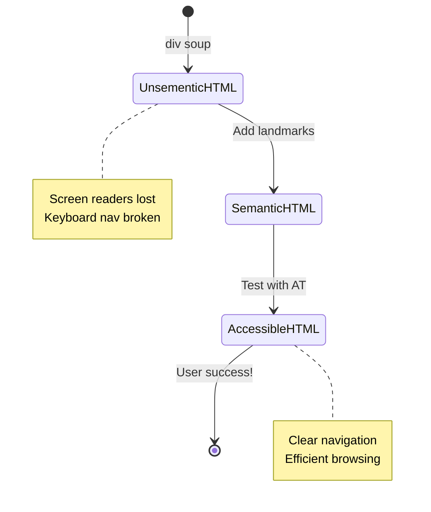

> **ماہرانہ بصیرت**: اچھا سیمینٹک HTML خود بخود تقریباً 70% رسائی کے مسائل حل کرتا ہے۔ اس بنیاد کو ماسٹر کریں اور آپ صحیح راستے پر ہیں!

✅ **اپنے سیمینٹک ڈھانچے کا آڈٹ کریں**: اپنے براؤزر کے ڈویلپر ٹولز میں رسائی پینل استعمال کریں تاکہ رسائی کے درخت کو دیکھیں اور یقینی بنائیں کہ آپ کا مارک اپ منطقی ڈھانچہ بناتا ہے۔

### ہیڈنگ ہائیرارکی: منطقی مواد کا خاکہ بنانا

ہیڈنگز قابل رسائی مواد کے لیے بالکل ضروری ہیں—یہ وہ ریڑھ کی ہڈی ہیں جو سب کچھ ایک ساتھ رکھتی ہیں۔ اسکرین ریڈر صارفین ہیڈنگز پر بہت زیادہ انحصار کرتے ہیں تاکہ آپ کے مواد کو سمجھ سکیں اور نیویگیٹ کر سکیں۔ اسے اپنے صفحے کے لیے مواد کی فہرست فراہم کرنے کے طور پر سوچیں۔

**ہیڈنگز کے لیے سنہری اصول یہ ہے:**
کبھی بھی سطحیں نہ چھوڑیں۔ ہمیشہ منطقی طور پر `<h1>` سے `<h2>` سے `<h3>` تک ترقی کریں، اور اسی طرح۔ اسکول میں خاکے بناتے وقت یاد ہے؟ یہ بالکل وہی اصول ہے—آپ "I. مین پوائنٹ" سے سیدھے "C. سب-سب پوائنٹ" پر بغیر "A. سب پوائنٹ" کے درمیان نہیں جائیں گے، ٹھیک ہے؟

**کامل ہیڈنگ ساخت کی مثال:**

```html
<!-- ✅ Excellent: Logical, hierarchical progression -->
<main>
  <h1>Complete Guide to Web Accessibility</h1>
  
  <section>
    <h2>Understanding Screen Readers</h2>
    <p>Introduction to screen reader technology...</p>
    
    <h3>Popular Screen Reader Software</h3>
    <p>NVDA, JAWS, and VoiceOver comparison...</p>
    
    <h3>Testing with Screen Readers</h3>
    <p>Step-by-step testing instructions...</p>
  </section>
  
  <section>
    <h2>Color and Contrast Guidelines</h2>
    <p>Designing with sufficient contrast...</p>
    
    <h3>WCAG Contrast Requirements</h3>
    <p>Understanding the different contrast levels...</p>
    
    <h3>Testing Tools and Techniques</h3>
    <p>Tools for verifying contrast ratios...</p>
  </section>
</main>
```

```html
<!-- ❌ Problematic: Skipping levels, inconsistent structure -->
<h1>Page Title</h1>
<h3>Subsection</h3> <!-- Skipped h2 -->
<h2>This should come before h3</h2>
<h1>Another main heading?</h1> <!-- Multiple h1s -->
```

**ہیڈنگ بہترین طریقے:**
- **ایک `<h1>` فی صفحہ**: عام طور پر آپ کا مرکزی صفحہ عنوان یا بنیادی مواد ہیڈنگ
- **منطقی ترقی**: کبھی بھی سطحیں نہ چھوڑیں (h1 → h2 → h3، نہ کہ h1 → h3)
- **وضاحتی مواد**: ہیڈنگز کو معنی خیز بنائیں جب سیاق و سباق سے باہر پڑھی جائیں
- **CSS کے ساتھ بصری اسٹائلنگ**: ظاہری شکل کے لیے CSS استعمال کریں، ساخت کے لیے HTML سطحیں

**اسکرین ریڈر نیویگیشن کے اعدادوشمار:**
- 68% اسکرین ریڈر صارفین ہیڈنگز کے ذریعے نیویگیٹ کرتے ہیں ([WebAIM سروے](https://webaim.org/projects/screenreadersurvey9/#finding))
- صارفین منطقی ہیڈنگ خاکہ تلاش کرنے کی توقع کرتے ہیں
- ہیڈنگز صفحہ کی ساخت کو سمجھنے کا سب سے تیز طریقہ فراہم کرتی ہیں

> 💡 **ماہرانہ ٹپ**: "HeadingsMap" جیسے براؤزر ایکسٹینشنز استعمال کریں تاکہ اپنی ہیڈنگ ساخت کو بصری طور پر دیکھ سکیں۔ یہ ایک اچھی طرح سے منظم مواد کی فہرست کی طرح پڑھنی چاہیے۔

✅ **اپنی ہیڈنگ ساخت کی جانچ کریں**: اسکرین ریڈر کی ہیڈنگ نیویگیشن (NVDA میں H کلید) استعمال کریں تاکہ اپنی ہیڈنگز کے ذریعے چھلانگ لگائیں۔ کیا ترقی آپ کے مواد کی کہانی منطقی طور پر بتاتی ہے؟

### جدید بصری رسائی کی تکنیکیں

کنٹراسٹ اور رنگ کے بنیادی اصولوں سے آگے، ایسے نفیس طریقے ہیں جو واقعی جامع بصری تجربات بنانے میں مدد کرتے ہیں۔ یہ طریقے مختلف دیکھنے کے حالات اور معاون ٹیکنالوجیز کے ذریعے آپ کے مواد کو کام کرنے کو یقینی بناتے ہیں۔

**ضروری بصری مواصلات کی حکمت عملی:**

- **ملٹی موڈل فیڈبیک**: بصری، متنی، اور کبھی کبھار آڈیو اشارے کو یکجا کریں
- **پروگریسو ڈسکلوزر**: معلومات کو ہضم کرنے کے قابل حصوں میں پیش کریں
- **مستقل انٹرایکشن پیٹرنز**: مانوس UI کنونشنز استعمال کریں
- **جوابی ٹائپوگرافی**: مختلف ڈیوائسز پر متن کو مناسب طور پر اسکیل کریں
- **لوڈنگ اور ایرر اسٹیٹس**: تمام صارف اعمال کے لیے واضح فیڈبیک فراہم کریں

**بہتر رسائی کے لیے CSS یوٹیلیٹیز:**

```css
/* Screen reader only text - visually hidden but accessible */
.sr-only {
  position: absolute;
  width: 1px;
  height: 1px;
  padding: 0;
  margin: -1px;
  overflow: hidden;
  clip: rect(0, 0, 0, 0);
  white-space: nowrap;
  border: 0;
}

/* Skip link for keyboard navigation */
.skip-link {
  position: absolute;
  top: -40px;
  left: 6px;
  background: #000000;
  color: #ffffff;
  padding: 8px 16px;
  text-decoration: none;
  border-radius: 4px;
  font-weight: bold;
  transition: top 0.3s ease;
  z-index: 1000;
}

.skip-link:focus {
  top: 6px;
}

/* Reduced motion respect */
@media (prefers-reduced-motion: reduce) {
  .skip-link {
    transition: none;
  }
  
  * {
    animation-duration: 0.01ms !important;
    animation-iteration-count: 1 !important;
    transition-duration: 0.01ms !important;
  }
}

/* High contrast mode support */
@media (prefers-contrast: high) {
  .button {
    border: 2px solid;
  }
}
```

> 🎯 **رسائی کا پیٹرن**: "اسکیپ لنک" کی بورڈ صارفین کے لیے ضروری ہے۔ یہ آپ کے صفحے پر پہلا فوکس ایبل عنصر ہونا چاہیے اور براہ راست مرکزی مواد کے علاقے پر چھلانگ لگانا چاہیے۔

✅ **اسکیپ نیویگیشن نافذ کریں**: اپنے صفحات میں اسکیپ لنکس شامل کریں اور انہیں ٹیسٹ کریں، جیسے ہی صفحہ لوڈ ہو، ٹیب دبائیں۔ انہیں ظاہر ہونا چاہیے اور آپ کو مرکزی مواد پر چھلانگ لگانے کی اجازت دینی چاہیے۔

## معنی خیز لنک ٹیکسٹ تیار کرنا

لنکس بنیادی طور پر ویب کے ہائی ویز ہیں، لیکن خراب لکھا ہوا لنک ٹیکسٹ ایسا ہے جیسے روڈ سائنز پر صرف "جگہ" لکھا ہو بجائے "ڈاؤن ٹاؤن شکاگو"۔ زیادہ مددگار نہیں، ٹھیک ہے؟

یہاں ایک چیز ہے جو مجھے پہلی بار سیکھنے پر حیران کر گئی: اسکرین ریڈرز صفحے سے تمام لنکس نکال سکتے ہیں اور انہیں ایک بڑی فہرست کے طور پر دکھا سکتے ہیں۔ تصور کریں کہ اگر کوئی آپ کو آپ کے صفحے پر موجود ہر لنک کی ڈائریکٹری دے۔ کیا ہر ایک اپنے طور پر معنی رکھتا ہے؟ یہی وہ ٹیسٹ ہے جسے آپ کے لنک ٹیکسٹ کو پاس کرنا چاہیے!

### لنک نیویگیشن پیٹرنز کو سمجھنا

اسکرین ریڈرز طاقتور لنک نیویگیشن فیچرز پیش کرتے ہیں جو اچھی طرح سے لکھے گئے لنک ٹیکسٹ پر انحصار کرتے ہیں:

**لنک نیویگیشن کے طریقے:**
- **تسلسل کے ساتھ پڑھنا**: لنکس کو مواد کے بہاؤ کے حصے کے طور پر سیاق و سباق میں پڑھا جاتا ہے
- **لنک فہرست کی تخلیق**: تمام صفحہ لنکس کو ایک قابل تلاش ڈائریکٹری میں مرتب کیا جاتا ہے
- **فوری نیویگیشن**: کی بورڈ شارٹ کٹس (NVDA میں K) استعمال کرتے ہوئے لنکس کے درمیان چھلانگ لگائیں
- **تلاش کی فعالیت**: جزوی متن ٹائپ کرکے مخصوص لنکس تلاش کریں

**کیوں سیاق و سباق اہم ہے:**
جب اسکرین ریڈر صارفین لنک فہرست بناتے ہیں، تو وہ کچھ اس طرح دیکھتے ہیں:
- "رپورٹ ڈاؤن لوڈ کریں"
- "مزید جانیں"
- "یہاں کلک کریں"
- "پرائیویسی پالیسی"
- "یہاں کلک کریں"

ان میں سے صرف دو لنکس سیاق و سباق سے باہر پڑھے جانے پر مفید معلومات فراہم کرتے ہیں!

> 📊 **صارف اثر**: اسکرین ریڈر صارفین لنک فہرستوں کو جلدی سے صفحہ مواد کو سمجھنے کے لیے اسکین کرتے ہیں۔ عمومی لنک ٹیکسٹ انہیں ہر لنک کے سیاق و سباق پر واپس نیویگیٹ کرنے پر مجبور کرتا ہے، ان کے براؤزنگ کے تجربے کو نمایاں طور پر سست کر دیتا ہے۔

### عام لنک ٹیکسٹ کی غلطیوں سے بچنا

سمجھنا کہ کیا کام نہیں کرتا آپ کو موجودہ مواد میں رسائی کے مسائل کو پہچاننے اور ٹھیک کرنے میں مدد کرتا ہے۔

**❌ عمومی لنک ٹیکسٹ جو کوئی سیاق و سباق فراہم نہیں کرتا:**

```html
<!-- Meaningless when read from a link list -->
<p>Our sustainability efforts are detailed in our recent report. 
   <a href="/sustainability-2024.pdf">Click here</a> to view it.</p>

<!-- Repeated generic text throughout the page -->
<div class="article-card">
  <h3>Web Accessibility Guide</h3>
  <p>Learn the fundamentals...</p>
  <a href="/accessibility-guide">Read more</a>
</div>
<div class="article-card">
  <h3>Color Contrast Tips</h3>
  <p>Improve your design...</p>
  <a href="/color-contrast">Read more</a>
</div>

<!-- URLs as link text (difficult for screen readers to announce) -->
<p>Visit https://www.w3.org/WAI/WCAG21/quickref/ for WCAG guidelines.</p>

<!-- Vague action words -->
<a href="/contact">Go</a> | <a href="/about">See</a> | <a href="/help">View</a>
```

**کیوں یہ پیٹرنز ناکام ہوتے ہیں:**
- **"یہاں کلک کریں"** صارفین کو منزل کے بارے میں کچھ نہیں بتاتا
- **"مزید پڑھیں"** متعدد بار دہرایا گیا الجھن پیدا کرتا ہے
- **خام URLs** اسکرین ریڈرز کے لیے واضح طور پر تلفظ کرنا مشکل ہیں
- **واحد الفاظ** جیسے "جائیں" یا "دیکھیں" وضاحتی سیاق و سباق سے محروم ہیں

### بہترین لنک ٹیکسٹ لکھنا

وضاحتی لنک ٹیکسٹ سب کے لیے فائدہ مند ہے—نظر رکھنے والے صارفین لنکس کو جلدی سے اسکین کر سکتے ہیں، اور اسکرین ریڈر صارفین فوری طور پر منزلوں کو سمجھ سکتے ہیں۔

**✅ واضح، وضاحتی لنک ٹیکسٹ کی مثالیں:**

```html
<!-- Descriptive text that explains the destination -->
<p>Our comprehensive <a href="/sustainability-2024.pdf">2024 sustainability report (PDF, 2.1MB)</a> details our environmental initiatives.</p>

<!-- Specific, unique link text for each card -->
<div class="article-card">
  <h3>Web Accessibility Guide</h3>
  <p>Learn the fundamentals of inclusive design...</p>
  <a href="/accessibility-guide">Read our complete web accessibility guide</a>
</div>
<div class="article-card">
  <h3>Color Contrast Tips</h3>
  <p>Improve your design with better color choices...</p>
  <a href="/color-contrast">Explore color contrast best practices</a>
</div>

<!-- Meaningful text instead of raw URLs -->
<p>The <a href="https://www.w3.org/WAI/WCAG21/quickref/">WCAG 2.1 Quick Reference guide</a> provides comprehensive accessibility guidelines.</p>

<!-- Descriptive action links -->
<a href="/contact">Contact our support team</a> | 
<a href="/about">About our company</a> | 
<a href="/help">Get help with your account</a>
```

**لنک ٹیکسٹ کے بہترین طریقے:**
- **مخصوص بنیں**: "چوتھائی مالیاتی رپورٹ ڈاؤن لوڈ کریں" بمقابلہ "ڈاؤن لوڈ کریں"
- **فائل کی قسم اور سائز شامل کریں**: "(PDF، 1.2MB)" ڈاؤن لوڈ کے قابل فائلوں کے لیے
- **ذکر کریں کہ لنکس بیرونی طور پر کھلتے ہیں**: "(نئی ونڈو میں کھلتا ہے)" جب مناسب ہو
- **فعال زبان استعمال کریں**: "ہم سے رابطہ کریں" بمقابلہ "رابطہ صفحہ"
- **مختصر رکھیں**: ممکن ہو تو 2-8 الفاظ کا مقصد رکھیں

### جدید لنک رسائی کے پیٹرنز

کبھی کبھی بصری ڈیزائن کی پابندیاں یا تکنیکی ضروریات خاص حل کی ضرورت ہوتی ہیں۔ یہاں عام چیلنجنگ منظرناموں کے لیے نفیس تکنیکیں ہیں:

**بہتر سیاق و سباق کے لیے ARIA کا استعمال:**

```html
<!-- When button text must be short but needs more context -->
<a href="/report.pdf" 
   aria-label="Download 2024 annual financial report, PDF format, 2.3MB">
  Download Report
</a>

<!-- When the full context comes from surrounding content -->
<h3 id="sustainability-heading">Sustainability Initiative</h3>
<p>Our efforts to reduce environmental impact...</p>
<a href="/sustainability-details" 
   aria-labelledby="sustainability-heading"
   aria-describedby="sustainability-summary">
  Learn more
</a>
<p id="sustainability-summary">Detailed breakdown of our 2024 environmental goals and achievements</p>
```

**فائل کی اقسام اور بیرونی منزلوں کی نشاندہی کرنا:**

```html
<!-- Method 1: Include information in visible link text -->
<a href="/annual-report.pdf">
  Download our 2024 annual report (PDF, 2.3MB)
</a>

<!-- Method 2: Use screen reader-only text for file details -->
<a href="/annual-report.pdf">
  Download our 2024 annual report
  <span class="sr-only">(PDF format, 2.3MB)</span>
</a>

<!-- Method 3: External link indication -->
<a href="https://example.com" 
   target="_blank" 
   aria-describedby="external-link-warning">
  Visit external resource
</a>
<span id="external-link-warning" class="sr-only">
  (opens in new window)
</span>

<!-- Method 4: Using CSS for visual indicators -->
<a href="https://example.com" class="external-link">
  External resource
</a>
```

```css
/* Visual indicator for external links */
.external-link::after {
  content: " ↗";
  font-size: 0.8em;
  color: #666;
}

/* Screen reader announcement for external links */
.external-link::before {
  content: "External link: ";
  position: absolute;
  left: -10000px;
  width: 1px;
  height: 1px;
  overflow: hidden;
}
```

> ⚠️ **اہم**: جب `target="_blank"` استعمال کریں، ہمیشہ صارفین کو
**ARIA کی پانچ اقسام:**

1. **رولز**: یہ عنصر کیا ہے؟ (`button`, `tab`, `dialog`)
2. **پراپرٹیز**: اس کی خصوصیات کیا ہیں؟ (`aria-required`, `aria-haspopup`)
3. **اسٹیٹس**: اس کی موجودہ حالت کیا ہے؟ (`aria-expanded`, `aria-checked`)
4. **لینڈمارکس**: صفحے کی ساخت میں یہ کہاں ہے؟ (`banner`, `navigation`, `main`)
5. **لائیو ریجنز**: تبدیلیوں کو کیسے اعلان کیا جائے؟ (`aria-live`, `aria-atomic`)

### جدید ویب ایپس کے لیے ضروری ARIA پیٹرنز

یہ پیٹرنز انٹرایکٹو ویب ایپلیکیشنز میں عام طور پر پیش آنے والے ایکسیسبلٹی چیلنجز کو حل کرتے ہیں:

**عنصر کو نام دینا اور بیان کرنا:**

```html
<!-- aria-label: Provides accessible name when visible text isn't sufficient -->
<button aria-label="Close newsletter subscription dialog">×</button>

<!-- aria-labelledby: References existing text as the accessible name -->
<section aria-labelledby="news-heading">
  <h2 id="news-heading">Latest News</h2>
  <!-- news content -->
</section>

<!-- aria-describedby: Links to additional descriptive text -->
<input type="password" 
       aria-describedby="pwd-requirements pwd-strength"
       required>
<div id="pwd-requirements">
  Password must contain at least 8 characters, including uppercase, lowercase, and numbers.
</div>
<div id="pwd-strength" aria-live="polite">
  <!-- Dynamic password strength indicator -->
</div>
```

**ڈائنامک مواد کے لیے لائیو ریجنز:**

```html
<!-- Polite announcements (don't interrupt current speech) -->
<div aria-live="polite" id="status-updates">
  <!-- Status messages appear here -->
</div>

<!-- Assertive announcements (interrupt and announce immediately) -->
<div aria-live="assertive" id="urgent-alerts">
  <!-- Error messages and critical alerts -->
</div>

<!-- Loading states with live regions -->
<button id="submit-btn" aria-describedby="loading-status">
  Submit Application
</button>
<div id="loading-status" aria-live="polite" aria-atomic="true">
  <!-- "Processing your application..." appears here -->
</div>
```

**انٹرایکٹو ویجیٹ کی مثال (اکارڈین):**

```html
<div class="accordion">
  <h3>
    <button aria-expanded="false" 
            aria-controls="panel-1" 
            id="accordion-trigger-1"
            class="accordion-trigger">
      Accessibility Guidelines
    </button>
  </h3>
  <div id="panel-1" 
       role="region"
       aria-labelledby="accordion-trigger-1" 
       hidden>
    <p>WCAG 2.1 provides comprehensive guidelines...</p>
  </div>
</div>
```

```javascript
// JavaScript to manage accordion state
function toggleAccordion(trigger) {
  const panel = document.getElementById(trigger.getAttribute('aria-controls'));
  const isExpanded = trigger.getAttribute('aria-expanded') === 'true';
  
  // Toggle states
  trigger.setAttribute('aria-expanded', !isExpanded);
  panel.hidden = isExpanded;
  
  // Announce change to screen readers
  const status = document.getElementById('status-updates');
  status.textContent = isExpanded ? 'Section collapsed' : 'Section expanded';
}
```

### ARIA کے نفاذ کے بہترین طریقے

ARIA طاقتور ہے لیکن اس کے نفاذ میں احتیاط کی ضرورت ہے۔ ان ہدایات پر عمل کرنے سے یہ یقینی بنایا جا سکتا ہے کہ آپ کا ARIA ایکسیسبلٹی کو بہتر بنائے نہ کہ اسے نقصان پہنچائے:

**🛡️ بنیادی اصول:**

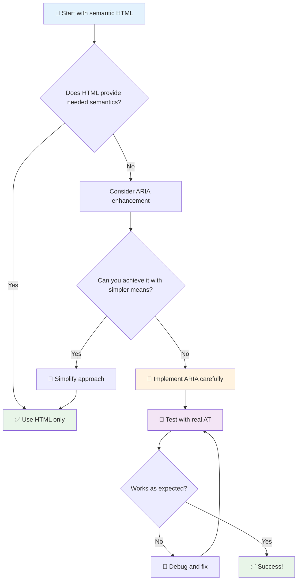

1. **سب سے پہلے سیمینٹک HTML**: ہمیشہ `<button>` کو `<div role="button">` پر ترجیح دیں
2. **سیمینٹکس کو خراب نہ کریں**: موجودہ HTML معنی کو کبھی اووررائیڈ نہ کریں (جیسے `<h1 role="button">` سے گریز کریں)
3. **کی بورڈ ایکسیسبلٹی برقرار رکھیں**: تمام انٹرایکٹو ARIA عناصر کو مکمل طور پر کی بورڈ ایکسیسبل ہونا چاہیے
4. **حقیقی صارفین کے ساتھ ٹیسٹ کریں**: مختلف اسسٹیو ٹیکنالوجیز میں ARIA سپورٹ کافی مختلف ہوتی ہے
5. **سادہ شروع کریں**: پیچیدہ ARIA نفاذ میں غلطیوں کا امکان زیادہ ہوتا ہے

**🔍 ٹیسٹنگ ورک فلو:**

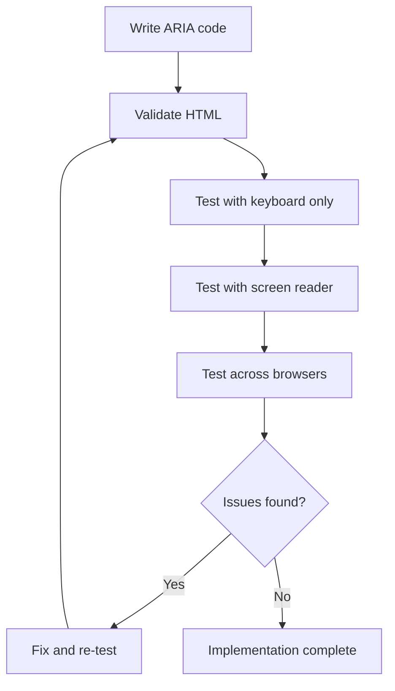

**🚫 عام ARIA غلطیوں سے بچیں:**

- **متضاد معلومات**: HTML سیمینٹکس سے تضاد نہ کریں
- **زیادہ لیبلنگ**: بہت زیادہ ARIA معلومات صارفین کو مغلوب کر دیتی ہیں
- **جامد ARIA**: مواد میں تبدیلی کے وقت ARIA اسٹیٹس کو اپ ڈیٹ کرنا بھول جانا
- **غیر آزمودہ نفاذ**: ARIA جو نظریہ میں کام کرتا ہے لیکن عملی طور پر ناکام ہوتا ہے
- **کی بورڈ سپورٹ کی کمی**: ARIA رولز بغیر متعلقہ کی بورڈ انٹریکشن کے

> 💡 **ٹیسٹنگ وسائل**: [accessibility-checker](https://www.npmjs.com/package/accessibility-checker) جیسے ٹولز کا استعمال کریں ARIA کی خودکار توثیق کے لیے، لیکن مکمل تجربے کے لیے ہمیشہ حقیقی اسکرین ریڈرز کے ساتھ ٹیسٹ کریں۔

### 🎭 **ARIA مہارت چیک: پیچیدہ انٹریکشنز کے لیے تیار ہیں؟**

**اپنے ARIA اعتماد کا اندازہ لگائیں:**
- آپ کب ARIA کو سیمینٹک HTML پر ترجیح دیں گے؟ (اشارہ: تقریباً کبھی نہیں!)
- کیا آپ وضاحت کر سکتے ہیں کہ `<div role="button">` عام طور پر `<button>` سے کیوں خراب ہے؟
- ARIA ٹیسٹنگ کے بارے میں سب سے اہم بات کیا یاد رکھنی ہے؟

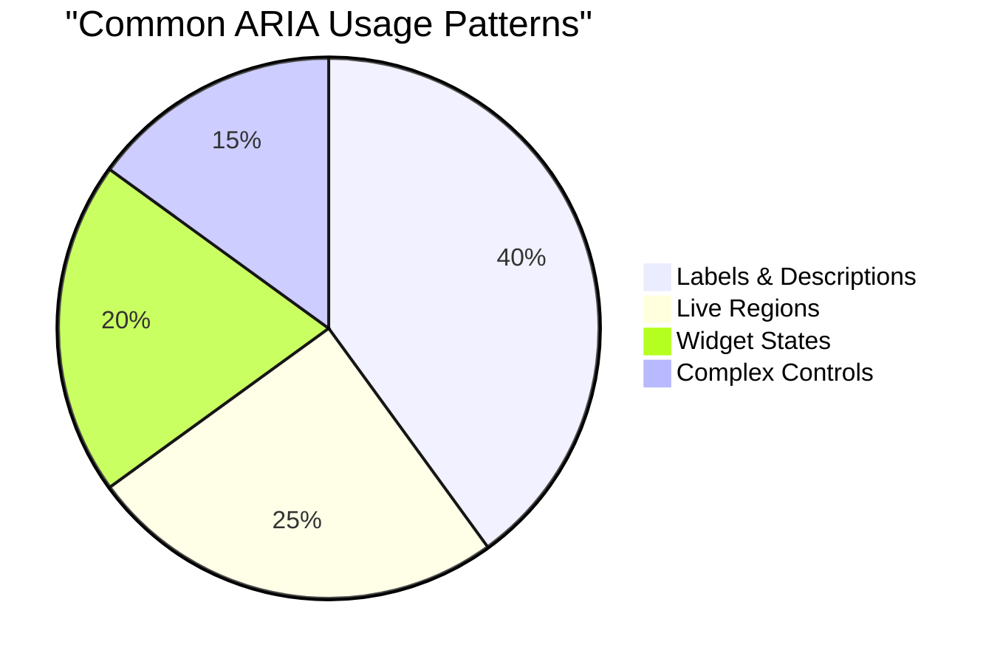

> **اہم بصیرت**: زیادہ تر ARIA استعمال عناصر کو لیبل کرنے اور بیان کرنے کے لیے ہوتا ہے۔ پیچیدہ ویجیٹ پیٹرنز اتنے عام نہیں ہیں جتنا آپ سوچ سکتے ہیں!

✅ **ماہرین سے سیکھیں**: [ARIA Authoring Practices Guide](https://w3c.github.io/aria-practices/) کا مطالعہ کریں پیچیدہ انٹرایکٹو ویجیٹس کے آزمودہ پیٹرنز اور نفاذ کے لیے۔

## تصاویر اور میڈیا کو ایکسیسبل بنانا

بصری اور آڈیو مواد جدید ویب تجربات کا لازمی حصہ ہیں، لیکن اگر ان کا نفاذ سوچ سمجھ کر نہ کیا جائے تو یہ رکاوٹیں پیدا کر سکتے ہیں۔ مقصد یہ ہے کہ آپ کے میڈیا کی معلومات اور جذباتی اثر ہر صارف تک پہنچے۔ ایک بار جب آپ اسے سمجھ لیں، تو یہ آپ کی عادت بن جاتا ہے۔

مختلف قسم کے میڈیا کو مختلف ایکسیسبلٹی طریقوں کی ضرورت ہوتی ہے۔ یہ بالکل ایسے ہی ہے جیسے کھانا پکانا—آپ نازک مچھلی کو مضبوط اسٹیک کی طرح نہیں پکائیں گے۔ ان فرقوں کو سمجھنا آپ کو ہر صورتحال کے لیے صحیح حل منتخب کرنے میں مدد دیتا ہے۔

### اسٹریٹجک تصویر کی ایکسیسبلٹی

آپ کی ویب سائٹ پر ہر تصویر کا ایک مقصد ہوتا ہے۔ اس مقصد کو سمجھنا آپ کو بہتر متبادل متن لکھنے اور زیادہ شامل تجربات تخلیق کرنے میں مدد دیتا ہے۔

**تصاویر کی چار اقسام اور ان کے alt متن کی حکمت عملی:**

**معلوماتی تصاویر** - اہم معلومات فراہم کرتی ہیں:
```html

```

**سجاوٹی تصاویر** - صرف بصری ہیں اور کوئی معلوماتی قدر نہیں رکھتی:
```html

```

**فنکشنل تصاویر** - بٹن یا کنٹرول کے طور پر کام کرتی ہیں:
```html
<button>
  
</button>
```

**پیچیدہ تصاویر** - چارٹس، ڈایاگرام، انفوگرافکس:
```html

<div id="chart-description">
  <p>Detailed description: Sales data shows a steady increase across all quarters...</p>
</div>
```

### ویڈیو اور آڈیو کی ایکسیسبلٹی

**ویڈیو کے تقاضے:**
- **کیپشنز**: بولے گئے مواد اور صوتی اثرات کا متن ورژن
- **آڈیو وضاحتیں**: بصری عناصر کی نابینا صارفین کے لیے وضاحت
- **ٹرانسکرپٹس**: تمام آڈیو اور بصری مواد کا مکمل متن ورژن

```html
<video controls>
  <source src="video.mp4" type="video/mp4">
  <track kind="captions" src="captions.vtt" srclang="en" label="English">
  <track kind="descriptions" src="descriptions.vtt" srclang="en" label="Audio descriptions">
</video>
```

**آڈیو کے تقاضے:**
- **ٹرانسکرپٹس**: تمام بولے گئے مواد کا متن ورژن
- **بصری اشارے**: صرف آڈیو مواد کے لیے بصری اشارے فراہم کریں

### جدید تصویر کی تکنیکیں

**سجاوٹی تصاویر کے لیے CSS کا استعمال:**
```css
.hero-section {
  background-image: url('decorative-hero.jpg');
  /* Decorative images in CSS don't need alt text */
}
```

**ایکسیسبلٹی کے ساتھ ریسپانسیو تصاویر:**
```html
<picture>
  <source media="(min-width: 800px)" srcset="large-chart.png">
  <source media="(min-width: 400px)" srcset="medium-chart.png">
  
</picture>
```

✅ **تصویر کی ایکسیسبلٹی کا ٹیسٹ کریں**: اسکرین ریڈر کا استعمال کرتے ہوئے تصاویر کے ساتھ صفحہ پر نیویگیٹ کریں۔ کیا آپ کو مواد کو سمجھنے کے لیے کافی معلومات مل رہی ہیں؟

## کی بورڈ نیویگیشن اور فوکس مینجمنٹ

بہت سے صارفین ویب کو مکمل طور پر اپنے کی بورڈز کے ساتھ نیویگیٹ کرتے ہیں۔ اس میں وہ لوگ شامل ہیں جنہیں موٹر معذوری ہے، پاور صارفین جو کی بورڈز کو ماؤس سے زیادہ تیز سمجھتے ہیں، اور وہ لوگ جن کا ماؤس کام کرنا بند کر چکا ہے۔ یہ یقینی بنانا کہ آپ کی سائٹ کی بورڈ ان پٹ کے ساتھ اچھی طرح کام کرتی ہے ضروری ہے اور اکثر ہر کسی کے لیے آپ کی سائٹ کو زیادہ موثر بناتی ہے۔

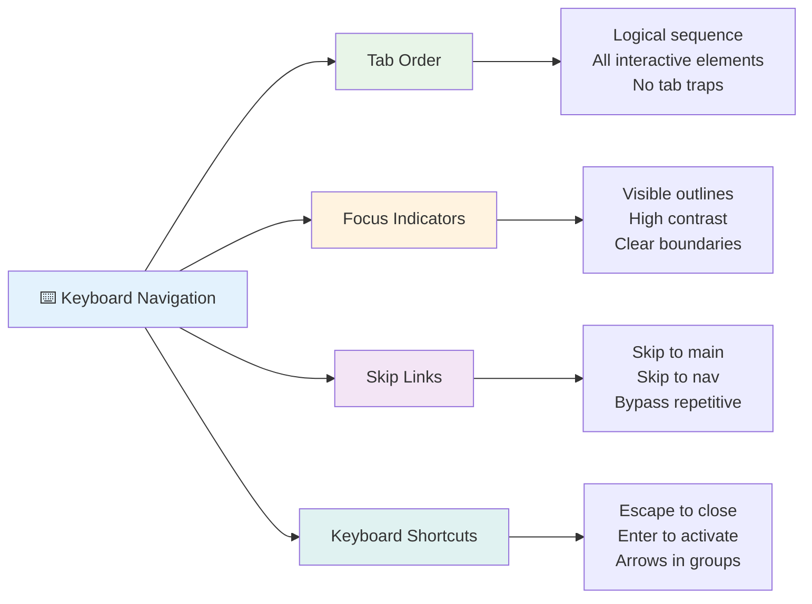

### ضروری کی بورڈ نیویگیشن پیٹرنز

**معیاری کی بورڈ انٹریکشنز:**
- **Tab**: انٹرایکٹو عناصر کے ذریعے فوکس کو آگے بڑھائیں
- **Shift + Tab**: فوکس کو پیچھے لے جائیں
- **Enter**: بٹن اور لنکس کو فعال کریں
- **Space**: بٹن کو فعال کریں، چیک باکسز کو چیک کریں
- **Arrow keys**: کمپوننٹ گروپس کے اندر نیویگیٹ کریں (ریڈیو بٹن، مینو)
- **Escape**: موڈلز، ڈراپ ڈاؤنز کو بند کریں یا آپریشنز منسوخ کریں

### فوکس مینجمنٹ کے بہترین طریقے

**مرئی فوکس اشارے:**
```css
/* Ensure focus is always visible */
button:focus-visible {
  outline: 2px solid #4A90A4;
  outline-offset: 2px;
}

/* Custom focus styles for different components */
.card:focus-within {
  box-shadow: 0 0 0 3px rgba(74, 144, 164, 0.5);
}
```

**موثر نیویگیشن کے لیے اسکیپ لنکس:**
```html
<a href="#main-content" class="skip-link">Skip to main content</a>
<a href="#navigation" class="skip-link">Skip to navigation</a>

<nav id="navigation">
  <!-- navigation content -->
</nav>
<main id="main-content">
  <!-- main content -->
</main>
```

**مناسب ٹیب آرڈر:**
```html
<!-- Use semantic HTML for natural tab order -->
<form>
  <label for="name">Name:</label>
  <input type="text" id="name" tabindex="0">
  
  <label for="email">Email:</label>
  <input type="email" id="email" tabindex="0">
  
  <button type="submit" tabindex="0">Submit</button>
</form>
```

### موڈلز میں فوکس کو محدود کرنا

جب موڈل ڈائیلاگ کھولیں، فوکس کو موڈل کے اندر محدود ہونا چاہیے:

```javascript
// Modern focus trap implementation
function trapFocus(element) {
  const focusableElements = element.querySelectorAll(
    'button, [href], input, select, textarea, [tabindex]:not([tabindex="-1"])'
  );
  
  const firstElement = focusableElements[0];
  const lastElement = focusableElements[focusableElements.length - 1];

  element.addEventListener('keydown', (e) => {
    if (e.key === 'Tab') {
      if (e.shiftKey && document.activeElement === firstElement) {
        e.preventDefault();
        lastElement.focus();
      } else if (!e.shiftKey && document.activeElement === lastElement) {
        e.preventDefault();
        firstElement.focus();
      }
    }
    
    if (e.key === 'Escape') {
      closeModal();
    }
  });
  
  // Focus first element when modal opens
  firstElement.focus();
}
```

✅ **کی بورڈ نیویگیشن کا ٹیسٹ کریں**: صرف Tab کلید کا استعمال کرتے ہوئے اپنی ویب سائٹ پر نیویگیٹ کرنے کی کوشش کریں۔ کیا آپ تمام انٹرایکٹو عناصر تک پہنچ سکتے ہیں؟ کیا فوکس آرڈر منطقی ہے؟ کیا فوکس اشارے واضح طور پر نظر آ رہے ہیں؟

## فارم کی ایکسیسبلٹی

فارمز صارف کے تعامل کے لیے اہم ہیں اور انہیں ایکسیسبلٹی پر خصوصی توجہ کی ضرورت ہوتی ہے۔

### لیبل اور فارم کنٹرول ایسوسی ایشن

**ہر فارم کنٹرول کو ایک لیبل کی ضرورت ہوتی ہے:**
```html
<!-- Explicit labeling (preferred) -->
<label for="username">Username:</label>
<input type="text" id="username" name="username" required>

<!-- Implicit labeling -->
<label>
  Password:
  <input type="password" name="password" required>
</label>

<!-- Using aria-label when visual label isn't desired -->
<input type="search" aria-label="Search products" placeholder="Search...">
```

### ایرر ہینڈلنگ اور توثیق

**ایکسیسبل ایرر میسجز:**
```html
<label for="email">Email Address:</label>
<input type="email" id="email" name="email" 
       aria-describedby="email-error" 
       aria-invalid="true" required>
<div id="email-error" role="alert">
  Please enter a valid email address
</div>
```

**فارم توثیق کے بہترین طریقے:**
- `aria-invalid` کا استعمال کریں تاکہ غلط فیلڈز کی نشاندہی ہو سکے
- واضح، مخصوص ایرر میسجز فراہم کریں
- اہم ایرر اعلانات کے لیے `role="alert"` کا استعمال کریں
- ایرر کو فوراً اور فارم جمع کرانے پر دکھائیں

### فیلڈ سیٹس اور گروپنگ

**متعلقہ فارم کنٹرولز کو گروپ کریں:**
```html
<fieldset>
  <legend>Shipping Address</legend>
  <label for="street">Street Address:</label>
  <input type="text" id="street" name="street">
  
  <label for="city">City:</label>
  <input type="text" id="city" name="city">
</fieldset>

<fieldset>
  <legend>Preferred Contact Method</legend>
  <input type="radio" id="contact-email" name="contact" value="email">
  <label for="contact-email">Email</label>
  
  <input type="radio" id="contact-phone" name="contact" value="phone">
  <label for="contact-phone">Phone</label>
</fieldset>
```

## آپ کا ایکسیسبلٹی سفر: اہم نکات

مبارک ہو! آپ نے واقعی شامل ویب تجربات تخلیق کرنے کے لیے بنیادی معلومات حاصل کر لی ہیں۔ یہ کافی دلچسپ چیز ہے! ویب ایکسیسبلٹی صرف تعمیل کے خانوں کو چیک کرنے کے بارے میں نہیں ہے—یہ لوگوں کے ڈیجیٹل مواد کے ساتھ تعامل کے مختلف طریقوں کو پہچاننے اور اس حیرت انگیز پیچیدگی کے لیے ڈیزائن کرنے کے بارے میں ہے۔

اب آپ ان ڈویلپرز کی بڑھتی ہوئی کمیونٹی کا حصہ ہیں جو سمجھتے ہیں کہ بہترین ڈیزائن ہر کسی کے لیے کام کرتا ہے۔ کلب میں خوش آمدید!

**🎯 آپ کے ایکسیسبلٹی ٹول کٹ میں اب شامل ہیں:**

| بنیادی اصول | نفاذ | اثر |
|--------------|-------|------|
| **سیمینٹک HTML بنیاد** | HTML عناصر کو ان کے مطلوبہ مقصد کے لیے استعمال کریں | اسکرین ریڈرز مؤثر طریقے سے نیویگیٹ کر سکتے ہیں، کی بورڈز خود بخود کام کرتے ہیں |
| **شامل بصری ڈیزائن** | کافی کنٹراسٹ، معنی خیز رنگ کا استعمال، مرئی فوکس اشارے | کسی بھی روشنی کی حالت میں ہر کسی کے لیے واضح |
| **وضاحتی مواد** | معنی خیز لنک متن، alt متن، ہیڈنگز | صارفین بصری سیاق و سباق کے بغیر مواد کو سمجھتے ہیں |
| **کی بورڈ ایکسیسبلٹی** | ٹیب آرڈر، کی بورڈ شارٹ کٹس، فوکس مینجمنٹ | موٹر ایکسیسبلٹی اور پاور صارف کی کارکردگی |
| **ARIA اضافہ** | سیمینٹک خلا کو پر کرنے کے لیے اسٹریٹجک استعمال | پیچیدہ ایپلیکیشنز اسسٹیو ٹیکنالوجیز کے ساتھ کام کرتی ہیں |
| **جامع ٹیسٹنگ** | خودکار ٹولز + دستی تصدیق + حقیقی صارفین کے ساتھ ٹیسٹنگ | مسائل کو صارفین پر اثر انداز ہونے سے پہلے پکڑیں |

**🚀 آپ کے اگلے اقدامات:**

1. **اپنے ورک فلو میں ایکسیسبلٹی کو شامل کریں**: ٹیسٹنگ کو اپنے ترقیاتی عمل کا قدرتی حصہ بنائیں
2. **حقیقی صارفین سے سیکھیں**: اسسٹیو ٹیکنالوجیز استعمال کرنے والے لوگوں سے فیڈبیک حاصل کریں
3. **اپ ڈیٹ رہیں**: ایکسیسبلٹی تکنیکیں نئی ٹیکنالوجیز اور معیارات کے ساتھ ترقی کرتی ہیں
4. **شمولیت کی وکالت کریں**: اپنے علم کو شیئر کریں اور ایکسیسبلٹی کو ٹیم کی ترجیح بنائیں

> 💡 **یاد رکھیں**: ایکسیسبلٹی کی حدود اکثر اختراعی، خوبصورت حل کی طرف لے جاتی ہیں جو ہر کسی کو فائدہ پہنچاتی ہیں۔ کرب کٹس، کیپشنز، اور وائس کنٹرولز سب ایکسیسبلٹی فیچرز کے طور پر شروع ہوئے اور مین اسٹریم بہتری بن گئے۔

**کاروباری معاملہ بالکل واضح ہے**: ایکسیسبل ویب سائٹس زیادہ صارفین تک پہنچتی ہیں، سرچ انجنز میں بہتر رینک کرتی ہیں، کم دیکھ بھال کے اخراجات رکھتی ہیں، اور قانونی خطرات سے بچتی ہیں۔ لیکن ایمانداری سے؟ ایکسیسبلٹی کی پرواہ کرنے کی اصل وجہ اس سے کہیں زیادہ گہری ہے۔ ایکسیسبل ویب سائٹس ویب کی بہترین اقدار—کھلے پن، شمولیت، اور یہ خیال کہ ہر کسی کو معلومات تک مساوی رسائی کا حق ہے—کی عکاسی کرتی ہیں۔

اب آپ مستقبل کے شامل ویب کی تعمیر کے لیے تیار ہیں۔ ہر ایکسیسبل سائٹ جو آپ تخلیق کرتے ہیں انٹرنیٹ کو ہر کسی کے لیے زیادہ خوش آمدید جگہ بناتی ہے۔ جب آپ اس کے بارے میں سوچتے ہیں تو یہ کافی حیرت انگیز ہے!

## اضافی وسائل

اپنے ایکسیسبلٹی سیکھنے کے سفر کو ان ضروری وسائل کے ساتھ جاری رکھیں:

**📚 آفیشل معیارات اور رہنما خطوط:**
- [WCAG 2.1 Guidelines](https://www.w3.org/WAI/WCAG21/quickref/) - آفیشل ایکسیسبلٹی معیار کے ساتھ فوری حوالہ
- [ARIA Authoring Practices Guide](https://w3c.github.io/aria-practices/) - انٹرایکٹو ویجیٹس کے لیے جامع پیٹرنز
- [WebAIM Guidelines](https://webaim.org/) - عملی، ابتدائی دوستانہ ایکسیسبلٹی رہنمائی

**🛠️ ٹولز اور ٹیسٹنگ وسائل:**
- [axe DevTools](https://www.deque.com/axe/devtools/) - انڈسٹری اسٹینڈرڈ ایکسیسبلٹی ٹیسٹنگ
- [A11y Project Checklist](https://www.a11yproject.com/checklist/) - قدم بہ قدم ایکسیسبلٹی تصدیق
- [Accessibility Insights](https://accessibilityinsights.io/) - مائیکروسافٹ کا جامع ٹیسٹنگ سوٹ
- [Color Oracle](https://colororacle.org/) - ڈیزائن ٹیسٹنگ کے لیے کلر بلائنڈنس سمیلیٹر

**🎓 سیکھنے اور کمیونٹی:**
- [WebAIM Screen Reader Survey](https://webaim.org/projects/screenreadersurvey9/) - حقیقی صارفین کی ترجیحات اور رویے
- [Inclusive Components](https://inclusive-components.design/) - جدید ایکسیسبل کمپوننٹ پیٹرنز
- [A11y Coffee](https://a11y.coffee/) - فوری ایکسیسبلٹی تجاویز اور بصیرت
- [Web Accessibility Initiative (WAI)](https://www.w3.org/WAI/) - W3C کے جامع ایکسیسبلٹی وسائل

**🎥 عملی سیکھنے:**
- [Accessibility Developer Guide](https://www.accessibility-developer-guide.com/) - عملی نفاذ کی رہنمائی
- [Deque University](https://dequeuniversity.com/) - پیشہ ورانہ ایکسیسبلٹی تربیتی کورسز

## GitHub Copilot Agent Challenge 🚀

Agent mode کا استعمال کرتے ہوئے درج ذیل چیلنج مکمل کریں:

**تفصیل:** ایک ایکسیسبل موڈل ڈائیلاگ کمپوننٹ بنائیں جو مناسب فوکس مینجمنٹ، ARIA ایٹریبیوٹس، اور کی بورڈ نیویگیشن پیٹرنز کو ظاہر کرے۔

**پرومپٹ:** HTML, CSS, اور JavaScript کے ساتھ ایک مکمل موڈل ڈائیلاگ کمپوننٹ بنائیں جس میں شامل ہوں: مناسب فوکس کو محدود کرنا، ESC کلید سے بند کرنا، باہر کلک کرنے سے بند کرنا، اسکرین ریڈرز کے لیے ARIA ایٹریبیوٹس، اور مرئی فوکس اشارے۔ موڈل میں ایک فارم شامل ہونا چاہیے جس میں مناسب لیبلز اور ایرر ہینڈلنگ ہو۔ یقینی بنائیں کہ کمپوننٹ WCAG 2.1 AA معیارات پر پورا اترتا ہے۔

## 🚀 چیلنج

اس HTML کو لیں اور اسے جتنا ممکن ہو ایکسیسبل بنائیں، دی گئی حکمت عملیوں کے مطابق جو آپ نے سیکھی ہیں۔

```html
<!DOCTYPE html>
<html lang="en">
  <head>
    <meta charset="UTF-8">
    <meta name="viewport" content="width=device-width, initial-scale=1.0">
    <title>Turtle Ipsum - The World's Premier Turtle Fan Club</title>
    <link href='../assets/style.css' rel='stylesheet' type='text/css'>
  </head>
  <body>
    <header class="site-header">
      <h1 class="site-title">Turtle Ipsum</h1>
      <p class="site-subtitle">The World's Premier Turtle Fan Club</p>
    </header>
    
    <nav class="main-nav" aria-label="Main navigation">
      <h2 class="nav-header">Resources</h2>
      <ul class="nav-list">
        <li><a href="https://www.youtube.com/watch?v=CMNry4PE93Y">"I like turtles" video</a></li>
        <li><a href="https://en.wikipedia.org/wiki/Turtle">Basic turtle information</a></li>
        <li><a href="https://en.wikipedia.org/wiki/Turtles_(chocolate)">Chocolate turtles candy</a></li>
      </ul>
    </nav>
    
    <main class="main-content">
      <article>
        <h1>Welcome to Turtle Ipsum</h1>
        <p class="intro">
          <a href="/about">Learn more about our turtle community</a> and discover fascinating facts about these amazing creatures.
        </p>
        <p class="article-text">
          Turtle ipsum dolor sit amet, consectetur adipiscing elit, sed do eiusmod tempor incididunt ut labore et dolore magna aliqua. Ut enim ad minim veniam, quis nostrud exercitation ullamco laboris nisi ut aliquip ex ea commodo consequat. Duis aute irure dolor in reprehenderit in voluptate velit esse cillum dolore eu fugiat nulla pariatur. Excepteur sint occaecat cupidatat non proident, sunt in culpa qui officia deserunt mollit anim id est laborum.
        </p>
      </article>
    </main>
    
    <footer class="footer">
      <section class="newsletter-signup">
        <h2>Stay Updated</h2>
        <button type="button" onclick="showNewsletterForm()">Sign up for turtle news</button>
      </section>
      
      <nav class="footer-nav" aria-label="Footer navigation">
        <h2>Site Pages</h2>
        <ul>
          <li><a href="../">Home</a></li>
          <li><a href="../semantic">Semantic HTML example</a></li>
        </ul>
      </nav>
      
      <p class="footer-copyright">&copy; 2024 Instrument. All rights reserved.</p>
    </footer>
  </body>
</html>
```

**کیے گئے اہم بہتریاں:**
- مناسب سیمینٹک HTML ساخت شامل کی گئی
- ہیڈنگ ہائیرارکی کو درست کیا (واحد h1، منطقی ترقی)
- "click here" کے بجائے معنی خیز لنک متن شامل کیا
- نیویگیشن کے لیے مناسب ARIA لیبلز شامل کیے
- lang ایٹریبیوٹ اور مناسب میٹا ٹیگز شامل کیے
- انٹرایکٹو عناصر کے لیے بٹن عنصر کا استعمال کیا
- فوٹر مواد کو مناسب لینڈمارکس کے ساتھ ساخت کیا

## پوسٹ لیکچر کوئز
[پوسٹ لیکچر کوئز](https://ff-quizzes.netlify.app/web/en/)

## جائزہ اور خود مطالعہ

بہت سے حکومتوں کے پاس ایکسیسبلٹی ضروریات کے بارے میں قوانین ہیں۔ اپنے ملک کے ایکسیسبلٹی قوانین کے بارے میں پڑھیں۔ کیا شامل ہے، اور کیا نہیں؟ ایک مثال [یہ حکومتی ویب سائٹ](https://accessibility.blog.gov.uk/) ہے۔

## اسائنمنٹ

[ایک
- [ ] پانچ مختلف پیچیدہ ویب سائٹس پر کی بورڈ نیویگیشن کی مشق کریں  
- [ ] ایک سادہ فارم بنائیں جس میں مناسب لیبلز، غلطی کی ہینڈلنگ، اور ARIA شامل ہو  
- [ ] کسی رسائی کمیونٹی میں شامل ہوں (A11y Slack، WebAIM فورم)  
- [ ] معذوری کے شکار حقیقی صارفین کو ویب سائٹس پر نیویگیٹ کرتے ہوئے دیکھیں (YouTube پر بہترین مثالیں موجود ہیں)  

### 🌟 **آپ کی مہینے بھر کی تبدیلی**  
- [ ] اپنی ڈیولپمنٹ ورک فلو میں رسائی کی جانچ کو شامل کریں  
- [ ] کسی اوپن سورس پروجیکٹ میں رسائی کے مسائل حل کرکے تعاون کریں  
- [ ] کسی ایسے شخص کے ساتھ قابل استعمالیت کی جانچ کریں جو معاون ٹیکنالوجی استعمال کرتا ہو  
- [ ] اپنی ٹیم کے لیے ایک قابل رسائی کمپوننٹ لائبریری بنائیں  
- [ ] اپنے کام کی جگہ یا کمیونٹی میں رسائی کے لیے آواز اٹھائیں  
- [ ] کسی نئے شخص کو رسائی کے تصورات سکھانے میں رہنمائی کریں  

### 🏆 **آخری رسائی چیمپئن چیک ان**  

**اپنے رسائی کے سفر کا جشن منائیں:**  
- ویب استعمال کرنے کے طریقے کے بارے میں آپ نے سب سے حیرت انگیز چیز کیا سیکھی؟  
- کون سا رسائی اصول آپ کے ڈیولپمنٹ اسٹائل کے ساتھ سب سے زیادہ ہم آہنگ ہے؟  
- رسائی کے بارے میں سیکھنے سے آپ کے ڈیزائن کے نظریے میں کیا تبدیلی آئی؟  
- کسی حقیقی پروجیکٹ پر آپ سب سے پہلا رسائی کا بہتری لانا چاہتے ہیں؟  

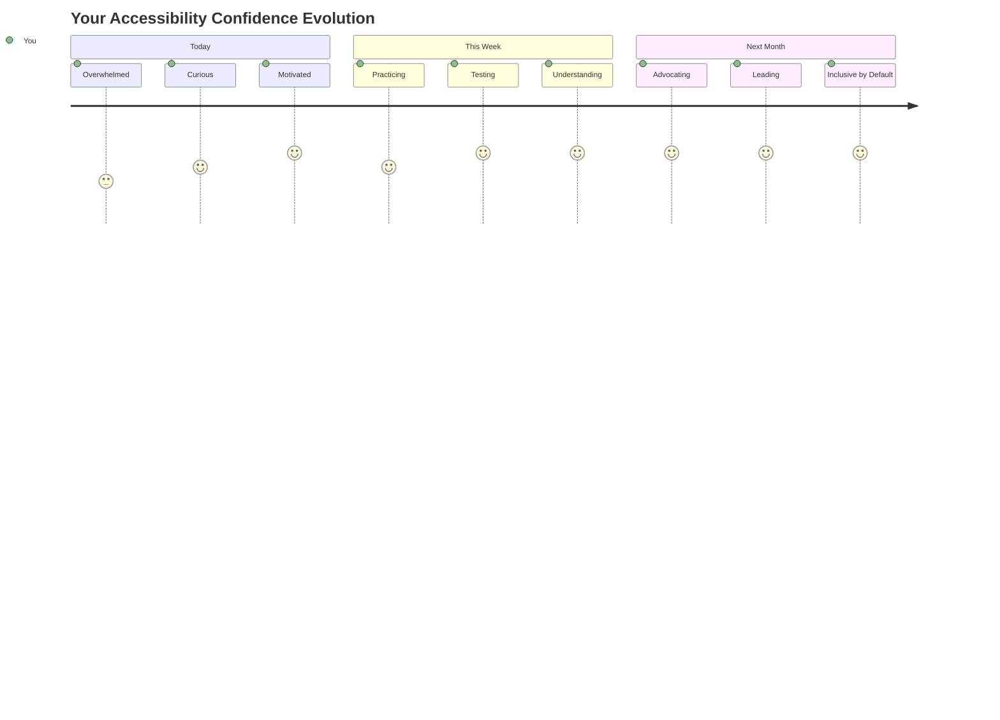
  
> 🌍 **آپ اب ایک رسائی چیمپئن ہیں!** آپ سمجھتے ہیں کہ بہترین ویب تجربات ہر کسی کے لیے کام کرتے ہیں، چاہے وہ ویب تک کیسے رسائی حاصل کریں۔ ہر قابل رسائی فیچر جو آپ بناتے ہیں، انٹرنیٹ کو مزید جامع بناتا ہے۔ ویب کو آپ جیسے ڈیولپرز کی ضرورت ہے جو رسائی کو ایک رکاوٹ کے بجائے ایک موقع کے طور پر دیکھتے ہیں تاکہ تمام صارفین کے لیے بہتر تجربات تخلیق کیے جا سکیں۔ تحریک میں خوش آمدید! 🎉  

---

**ڈسکلیمر**:  
یہ دستاویز AI ترجمہ سروس [Co-op Translator](https://github.com/Azure/co-op-translator) کا استعمال کرتے ہوئے ترجمہ کی گئی ہے۔ ہم درستگی کے لیے کوشش کرتے ہیں، لیکن براہ کرم آگاہ رہیں کہ خودکار ترجمے میں غلطیاں یا غیر درستیاں ہو سکتی ہیں۔ اصل دستاویز کو اس کی اصل زبان میں مستند ذریعہ سمجھا جانا چاہیے۔ اہم معلومات کے لیے، پیشہ ور انسانی ترجمہ کی سفارش کی جاتی ہے۔ ہم اس ترجمے کے استعمال سے پیدا ہونے والی کسی بھی غلط فہمی یا غلط تشریح کے ذمہ دار نہیں ہیں۔