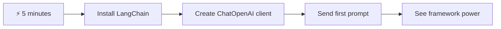
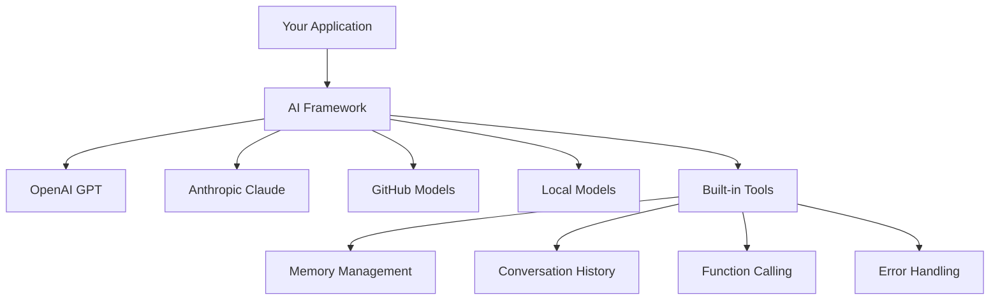
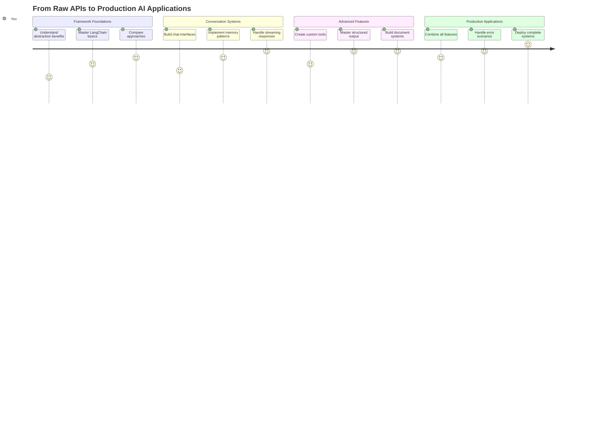
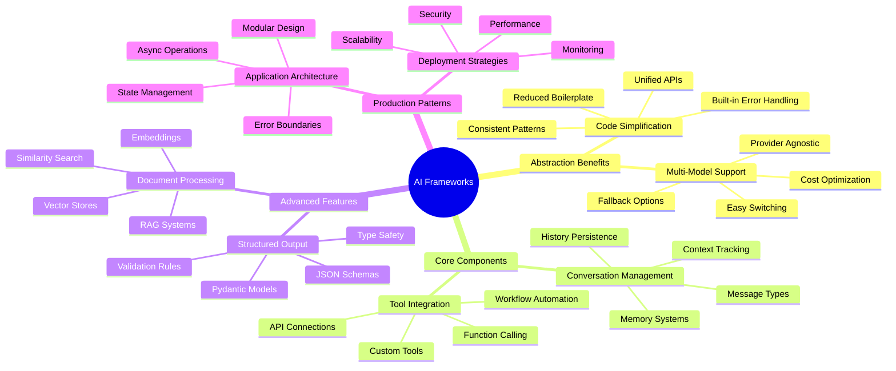
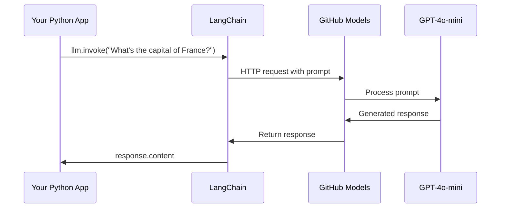
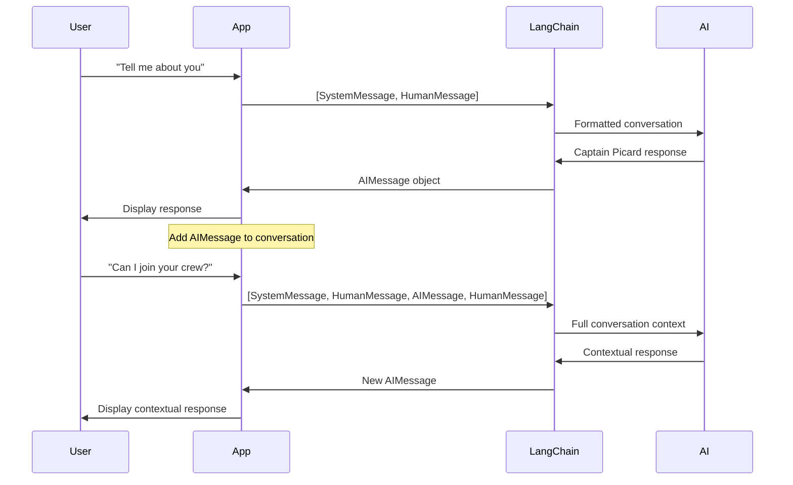
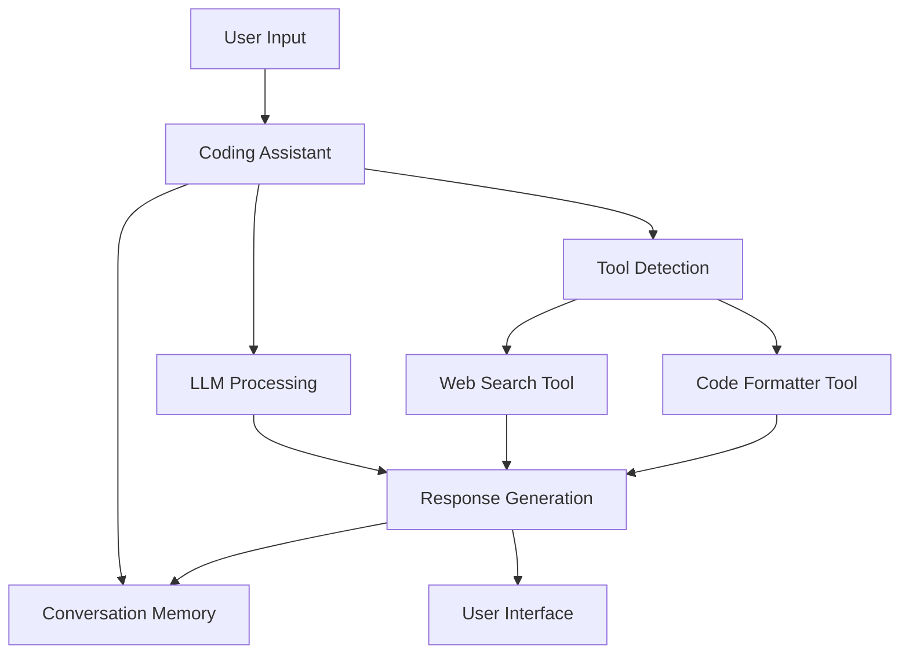
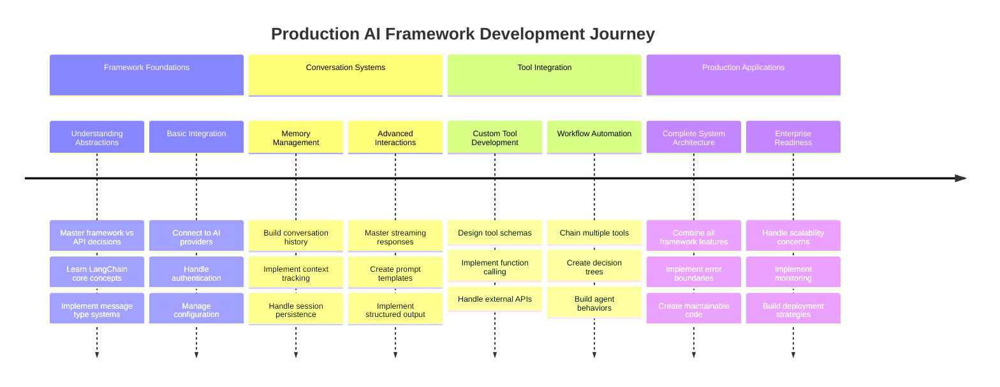
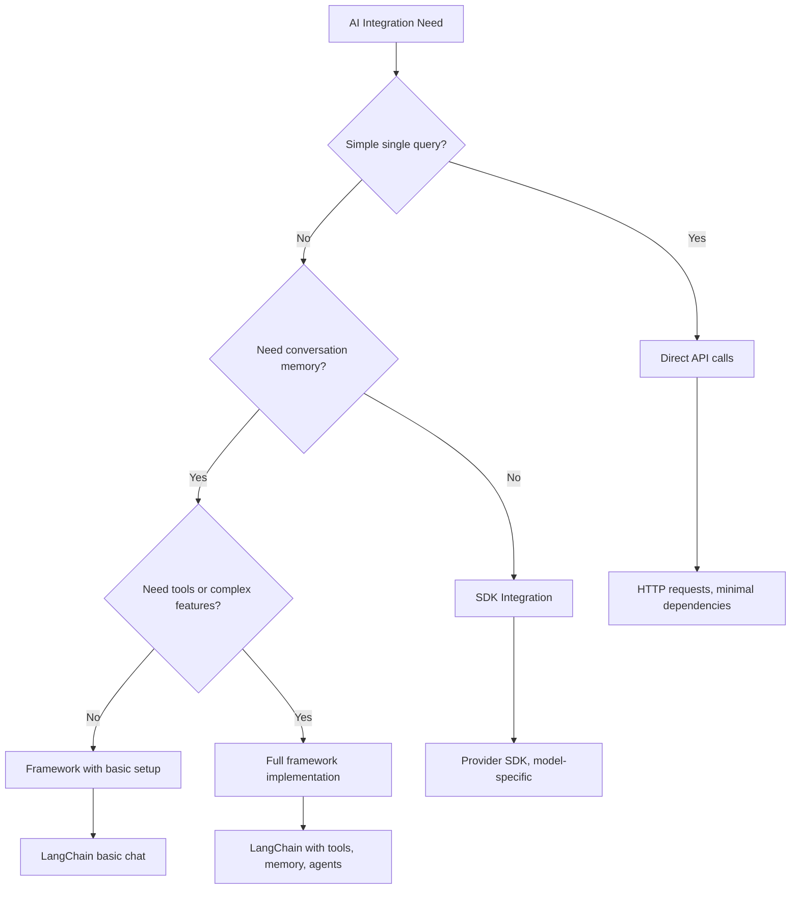

# اے آئی فریم ورک

کبھی ایسا محسوس ہوا کہ اے آئی ایپلیکیشنز کو شروع سے بنانے کی کوشش کرتے ہوئے آپ پریشان ہو گئے ہیں؟ آپ اکیلے نہیں ہیں! اے آئی فریم ورک ایک سوئس آرمی نائف کی طرح ہیں جو اے آئی ڈیولپمنٹ کے لیے طاقتور ٹولز فراہم کرتے ہیں، جو آپ کو ذہین ایپلیکیشنز بنانے میں وقت اور پریشانی سے بچاتے ہیں۔ اے آئی فریم ورک کو ایک منظم لائبریری کی طرح سمجھیں: یہ پہلے سے تیار شدہ اجزاء، معیاری APIs، اور ذہین خلاصے فراہم کرتا ہے تاکہ آپ مسائل حل کرنے پر توجہ مرکوز کر سکیں بجائے اس کے کہ آپ عمل درآمد کی تفصیلات سے لڑیں۔

اس سبق میں، ہم دیکھیں گے کہ کس طرح LangChain جیسے فریم ورک پیچیدہ اے آئی انٹیگریشن کے کاموں کو صاف، قابلِ پڑھ کوڈ میں تبدیل کر سکتے ہیں۔ آپ یہ سیکھیں گے کہ حقیقی دنیا کے چیلنجز جیسے گفتگو کا ریکارڈ رکھنا، ٹول کالنگ کو نافذ کرنا، اور مختلف اے آئی ماڈلز کو ایک متحد انٹرفیس کے ذریعے سنبھالنا کیسے ممکن ہے۔

جب ہم ختم کریں گے، تو آپ جان جائیں گے کہ کب فریم ورک استعمال کرنا ہے بجائے خام API کالز کے، ان کے خلاصے کو مؤثر طریقے سے کیسے استعمال کرنا ہے، اور حقیقی دنیا کے استعمال کے لیے تیار اے آئی ایپلیکیشنز کیسے بنانی ہیں۔ آئیے دیکھتے ہیں کہ اے آئی فریم ورک آپ کے پروجیکٹس کے لیے کیا کر سکتے ہیں۔

## ⚡ اگلے 5 منٹ میں آپ کیا کر سکتے ہیں

**مصروف ڈیولپرز کے لیے فوری آغاز کا راستہ**



- **پہلا منٹ**: LangChain انسٹال کریں: `pip install langchain langchain-openai`
- **دوسرا منٹ**: اپنا GitHub ٹوکن سیٹ کریں اور ChatOpenAI کلائنٹ درآمد کریں
- **تیسرا منٹ**: سسٹم اور انسانی پیغامات کے ساتھ ایک سادہ گفتگو بنائیں
- **چوتھا منٹ**: ایک بنیادی ٹول (جیسے ایک جمع کرنے کا فنکشن) شامل کریں اور اے آئی ٹول کالنگ دیکھیں
- **پانچواں منٹ**: خام API کالز اور فریم ورک خلاصے کے درمیان فرق کا تجربہ کریں

**فوری ٹیسٹ کوڈ**:
```python
from langchain_openai import ChatOpenAI
from langchain_core.messages import SystemMessage, HumanMessage

llm = ChatOpenAI(
    api_key=os.environ["GITHUB_TOKEN"],
    base_url="https://models.github.ai/inference",
    model="openai/gpt-4o-mini"
)

response = llm.invoke([
    SystemMessage(content="You are a helpful coding assistant"),
    HumanMessage(content="Explain Python functions briefly")
])
print(response.content)
```

**یہ کیوں اہم ہے**: 5 منٹ میں، آپ تجربہ کریں گے کہ اے آئی فریم ورک پیچیدہ اے آئی انٹیگریشن کو سادہ میتھڈ کالز میں کیسے تبدیل کرتے ہیں۔ یہ وہ بنیاد ہے جو پروڈکشن اے آئی ایپلیکیشنز کو طاقت دیتی ہے۔

## فریم ورک کیوں منتخب کریں؟

تو آپ اے آئی ایپ بنانے کے لیے تیار ہیں - زبردست! لیکن بات یہ ہے: آپ کے پاس کئی مختلف راستے ہیں جنہیں آپ لے سکتے ہیں، اور ہر ایک کے اپنے فوائد اور نقصانات ہیں۔ یہ کچھ ایسا ہی ہے جیسے کہیں پہنچنے کے لیے پیدل چلنا، سائیکل چلانا، یا گاڑی چلانا منتخب کرنا - یہ سب آپ کو وہاں پہنچا دیں گے، لیکن تجربہ (اور کوشش) بالکل مختلف ہوگی۔

آئیے تین اہم طریقوں کو توڑتے ہیں جن سے آپ اپنے پروجیکٹس میں اے آئی کو شامل کر سکتے ہیں:

| طریقہ | فوائد | بہترین استعمال | غور و فکر |
|-------|-------|----------------|----------|
| **براہ راست HTTP درخواستیں** | مکمل کنٹرول، کوئی انحصار نہیں | سادہ سوالات، بنیادی اصول سیکھنا | زیادہ تفصیلی کوڈ، دستی خرابی ہینڈلنگ |
| **SDK انٹیگریشن** | کم بوائلر پلیٹ، ماڈل مخصوص اصلاح | سنگل ماڈل ایپلیکیشنز | مخصوص فراہم کنندگان تک محدود |
| **اے آئی فریم ورک** | متحد API، بلٹ ان خلاصے | ملٹی ماڈل ایپس، پیچیدہ ورک فلو | سیکھنے کا منحنی خط، ممکنہ زیادہ خلاصہ |

### عملی طور پر فریم ورک کے فوائد



**فریم ورک کیوں اہم ہیں:**
- **متحد کرتا ہے** متعدد اے آئی فراہم کنندگان کو ایک انٹرفیس کے تحت
- **خودکار طور پر** گفتگو کی یادداشت کو سنبھالتا ہے
- **فراہم کرتا ہے** عام کاموں جیسے ایمبیڈنگز اور فنکشن کالنگ کے لیے تیار شدہ ٹولز
- **خرابی ہینڈلنگ** اور ریٹری لاجک کو منظم کرتا ہے
- **پیچیدہ ورک فلو کو** قابلِ پڑھ میتھڈ کالز میں تبدیل کرتا ہے

> 💡 **پرو ٹپ**: فریم ورک استعمال کریں جب مختلف اے آئی ماڈلز کے درمیان سوئچ کرنا ہو یا ایجنٹس، میموری، یا ٹول کالنگ جیسے پیچیدہ فیچرز بنانا ہو۔ بنیادی اصول سیکھنے یا سادہ، مرکوز ایپلیکیشنز بنانے کے لیے براہ راست APIs کے ساتھ رہیں۔

**خلاصہ**: جیسے کسی کاریگر کے مخصوص ٹولز اور مکمل ورکشاپ کے درمیان انتخاب کرنا، یہ کام کے مطابق ٹول کو ملانے کے بارے میں ہے۔ فریم ورک پیچیدہ، فیچر سے بھرپور ایپلیکیشنز کے لیے بہترین ہیں، جبکہ براہ راست APIs سادہ استعمال کے معاملات کے لیے اچھے ہیں۔

## 🗺️ اے آئی فریم ورک مہارت کے ذریعے آپ کا سیکھنے کا سفر



**آپ کا سفر کا مقصد**: اس سبق کے آخر تک، آپ اے آئی فریم ورک ڈیولپمنٹ میں مہارت حاصل کر چکے ہوں گے اور پیچیدہ، پروڈکشن کے لیے تیار اے آئی ایپلیکیشنز بنا سکیں گے جو کمرشل اے آئی اسسٹنٹس کا مقابلہ کریں۔

## تعارف

اس سبق میں، ہم سیکھیں گے:

- ایک عام اے آئی فریم ورک کا استعمال۔
- عام مسائل جیسے چیٹ گفتگو، ٹول کا استعمال، میموری اور سیاق و سباق کو حل کرنا۔
- اس کا فائدہ اٹھا کر اے آئی ایپس بنانا۔

## 🧠 اے آئی فریم ورک ڈیولپمنٹ ایکو سسٹم



**بنیادی اصول**: اے آئی فریم ورک پیچیدگی کو خلاصہ کرتے ہیں جبکہ گفتگو کے انتظام، ٹول انٹیگریشن، اور دستاویز پروسیسنگ کے لیے طاقتور خلاصے فراہم کرتے ہیں، ڈیولپرز کو صاف، قابلِ دیکھ بھال کوڈ کے ساتھ پیچیدہ اے آئی ایپلیکیشنز بنانے کے قابل بناتے ہیں۔

## آپ کا پہلا اے آئی پرامپٹ

آئیے بنیادی اصولوں سے شروع کرتے ہیں اور اپنا پہلا اے آئی ایپلیکیشن بناتے ہیں جو ایک سوال بھیجتا ہے اور جواب واپس حاصل کرتا ہے۔ جیسے ارشمیدس نے اپنے غسل میں ڈسپلیسمنٹ کے اصول کو دریافت کیا، کبھی کبھی سب سے سادہ مشاہدات سب سے طاقتور بصیرتوں کی طرف لے جاتے ہیں - اور فریم ورک ان بصیرتوں کو قابلِ رسائی بناتے ہیں۔

### GitHub ماڈلز کے ساتھ LangChain سیٹ اپ کرنا

ہم LangChain استعمال کریں گے تاکہ GitHub ماڈلز سے جڑ سکیں، جو بہت زبردست ہے کیونکہ یہ آپ کو مختلف اے آئی ماڈلز تک مفت رسائی دیتا ہے۔ سب سے اچھی بات؟ شروع کرنے کے لیے آپ کو صرف چند سادہ کنفیگریشن پیرامیٹرز کی ضرورت ہے:

```python
from langchain_openai import ChatOpenAI
import os

llm = ChatOpenAI(
    api_key=os.environ["GITHUB_TOKEN"],
    base_url="https://models.github.ai/inference",
    model="openai/gpt-4o-mini",
)

# Send a simple prompt
response = llm.invoke("What's the capital of France?")
print(response.content)
```

**یہاں کیا ہو رہا ہے:**
- **ایک LangChain کلائنٹ بناتا ہے** `ChatOpenAI` کلاس کا استعمال کرتے ہوئے - یہ آپ کا اے آئی تک گیٹ وے ہے!
- **GitHub ماڈلز کے ساتھ کنکشن کو ترتیب دیتا ہے** آپ کے تصدیقی ٹوکن کے ساتھ
- **وضاحت کرتا ہے** کہ کون سا اے آئی ماڈل استعمال کرنا ہے (`gpt-4o-mini`) - اسے اپنا اے آئی اسسٹنٹ منتخب کرنے کے طور پر سمجھیں
- **آپ کا سوال بھیجتا ہے** `invoke()` میتھڈ کا استعمال کرتے ہوئے - یہاں جادو ہوتا ہے
- **جواب نکالتا ہے اور دکھاتا ہے** - اور voilà، آپ اے آئی کے ساتھ بات چیت کر رہے ہیں!

> 🔧 **سیٹ اپ نوٹ**: اگر آپ GitHub Codespaces استعمال کر رہے ہیں، تو آپ خوش قسمت ہیں - `GITHUB_TOKEN` پہلے ہی سیٹ اپ ہے! مقامی طور پر کام کر رہے ہیں؟ کوئی مسئلہ نہیں، آپ کو صرف صحیح اجازتوں کے ساتھ ایک پرسنل ایکسیس ٹوکن بنانا ہوگا۔

**متوقع آؤٹ پٹ**:
```text
The capital of France is Paris.
```



## گفتگو پر مبنی اے آئی بنانا

پہلا مثال بنیادی اصولوں کو ظاہر کرتا ہے، لیکن یہ صرف ایک واحد تبادلہ ہے - آپ ایک سوال پوچھتے ہیں، جواب حاصل کرتے ہیں، اور بس۔ حقیقی ایپلیکیشنز میں، آپ چاہتے ہیں کہ آپ کا اے آئی وہ یاد رکھے جو آپ نے بات چیت کی ہے، جیسے واٹسن اور ہومز نے اپنے تحقیقی گفتگو کو وقت کے ساتھ بنایا۔

یہ وہ جگہ ہے جہاں LangChain خاص طور پر مفید ہوتا ہے۔ یہ مختلف پیغام کی اقسام فراہم کرتا ہے جو گفتگو کو ساخت دیتے ہیں اور آپ کو اپنے اے آئی کو ایک شخصیت دینے دیتے ہیں۔ آپ چیٹ کے تجربات بنائیں گے جو سیاق و سباق اور کردار کو برقرار رکھتے ہیں۔

### پیغام کی اقسام کو سمجھنا

ان پیغام کی اقسام کو گفتگو میں شرکاء کے مختلف "ٹوپیاں" سمجھیں۔ LangChain مختلف پیغام کلاسز استعمال کرتا ہے تاکہ یہ معلوم ہو سکے کہ کون کیا کہہ رہا ہے:

| پیغام کی قسم | مقصد | مثال استعمال کیس |
|--------------|-------|------------------|
| `SystemMessage` | اے آئی کی شخصیت اور رویے کی وضاحت کرتا ہے | "آپ ایک مددگار کوڈنگ اسسٹنٹ ہیں" |
| `HumanMessage` | صارف کی انپٹ کی نمائندگی کرتا ہے | "فنکشنز کیسے کام کرتے ہیں وضاحت کریں" |
| `AIMessage` | اے آئی کے جوابات کو محفوظ کرتا ہے | گفتگو میں پچھلے اے آئی جوابات |

### اپنی پہلی گفتگو بنانا

آئیے ایک گفتگو بناتے ہیں جہاں ہمارا اے آئی ایک مخصوص کردار اختیار کرے۔ ہم اسے کیپٹن پیکارڈ کا کردار دیں گے - ایک کردار جو اپنی سفارتی حکمت اور قیادت کے لیے جانا جاتا ہے:

```python
messages = [
    SystemMessage(content="You are Captain Picard of the Starship Enterprise"),
    HumanMessage(content="Tell me about you"),
]
```

**اس گفتگو کے سیٹ اپ کو توڑنا:**
- **اے آئی کے کردار اور شخصیت کو قائم کرتا ہے** `SystemMessage` کے ذریعے
- **ابتدائی صارف کی درخواست فراہم کرتا ہے** `HumanMessage` کے ذریعے
- **کثیر موڑ گفتگو کے لیے بنیاد بناتا ہے**

اس مثال کے لیے مکمل کوڈ کچھ اس طرح نظر آتا ہے:

```python
from langchain_core.messages import HumanMessage, SystemMessage
from langchain_openai import ChatOpenAI
import os

llm = ChatOpenAI(
    api_key=os.environ["GITHUB_TOKEN"],
    base_url="https://models.github.ai/inference",
    model="openai/gpt-4o-mini",
)

messages = [
    SystemMessage(content="You are Captain Picard of the Starship Enterprise"),
    HumanMessage(content="Tell me about you"),
]


# works
response  = llm.invoke(messages)
print(response.content)
```

آپ کو ایک نتیجہ دیکھنا چاہیے جو اس طرح ہو:

```text
I am Captain Jean-Luc Picard, the commanding officer of the USS Enterprise (NCC-1701-D), a starship in the United Federation of Planets. My primary mission is to explore new worlds, seek out new life and new civilizations, and boldly go where no one has gone before. 

I believe in the importance of diplomacy, reason, and the pursuit of knowledge. My crew is diverse and skilled, and we often face challenges that test our resolve, ethics, and ingenuity. Throughout my career, I have encountered numerous species, grappled with complex moral dilemmas, and have consistently sought peaceful solutions to conflicts.

I hold the ideals of the Federation close to my heart, believing in the importance of cooperation, understanding, and respect for all sentient beings. My experiences have shaped my leadership style, and I strive to be a thoughtful and just captain. How may I assist you further?
```

گفتگو کی تسلسل کو برقرار رکھنے کے لیے (ہر بار سیاق و سباق کو ری سیٹ کرنے کے بجائے)، آپ کو اپنے پیغام کی فہرست میں جوابات شامل کرتے رہنا ہوگا۔ جیسے زبانی روایات نے نسلوں کے دوران کہانیاں محفوظ کیں، یہ طریقہ پائیدار یادداشت بناتا ہے:

```python
from langchain_core.messages import HumanMessage, SystemMessage
from langchain_openai import ChatOpenAI
import os

llm = ChatOpenAI(
    api_key=os.environ["GITHUB_TOKEN"],
    base_url="https://models.github.ai/inference",
    model="openai/gpt-4o-mini",
)

messages = [
    SystemMessage(content="You are Captain Picard of the Starship Enterprise"),
    HumanMessage(content="Tell me about you"),
]


# works
response  = llm.invoke(messages)

print(response.content)

print("---- Next ----")

messages.append(response)
messages.append(HumanMessage(content="Now that I know about you, I'm Chris, can I be in your crew?"))

response  = llm.invoke(messages)

print(response.content)

```

کافی دلچسپ، ہے نا؟ یہاں جو ہو رہا ہے وہ یہ ہے کہ ہم LLM کو دو بار کال کر رہے ہیں - پہلے صرف ہمارے ابتدائی دو پیغامات کے ساتھ، لیکن پھر مکمل گفتگو کی تاریخ کے ساتھ۔ یہ ایسا ہے جیسے اے آئی واقعی ہماری چیٹ کو فالو کر رہا ہو!

جب آپ یہ کوڈ چلائیں گے، تو آپ کو دوسرا جواب ملے گا جو کچھ اس طرح لگتا ہے:

```text
Welcome aboard, Chris! It's always a pleasure to meet those who share a passion for exploration and discovery. While I cannot formally offer you a position on the Enterprise right now, I encourage you to pursue your aspirations. We are always in need of talented individuals with diverse skills and backgrounds. 

If you are interested in space exploration, consider education and training in the sciences, engineering, or diplomacy. The values of curiosity, resilience, and teamwork are crucial in Starfleet. Should you ever find yourself on a starship, remember to uphold the principles of the Federation: peace, understanding, and respect for all beings. Your journey can lead you to remarkable adventures, whether in the stars or on the ground. Engage!
```



میں اسے شاید کے طور پر لوں گا ;)

## اسٹریمنگ جوابات

کبھی نوٹ کیا کہ ChatGPT اپنے جوابات کو حقیقی وقت میں "ٹائپ" کرتا ہوا لگتا ہے؟ یہ اسٹریمنگ کی کارروائی ہے۔ جیسے کسی ماہر خطاط کو کام کرتے دیکھنا - کرداروں کو اسٹروک بہ اسٹروک ظاہر ہوتے دیکھنا بجائے فوری طور پر ظاہر ہونے کے - اسٹریمنگ تعامل کو زیادہ قدرتی محسوس کرتی ہے اور فوری فیڈبیک فراہم کرتی ہے۔

### LangChain کے ساتھ اسٹریمنگ کو نافذ کرنا

```python
from langchain_openai import ChatOpenAI
import os

llm = ChatOpenAI(
    api_key=os.environ["GITHUB_TOKEN"],
    base_url="https://models.github.ai/inference",
    model="openai/gpt-4o-mini",
    streaming=True
)

# Stream the response
for chunk in llm.stream("Write a short story about a robot learning to code"):
    print(chunk.content, end="", flush=True)
```

**اسٹریمنگ کیوں زبردست ہے:**
- **مواد دکھاتا ہے** جیسے یہ تخلیق ہو رہا ہے - مزید عجیب انتظار نہیں!
- **صارفین کو محسوس کراتا ہے** کہ کچھ واقعی ہو رہا ہے
- **تیز محسوس ہوتا ہے**، حالانکہ یہ تکنیکی طور پر نہیں ہے
- **صارفین کو پڑھنے دیتا ہے** جبکہ اے آئی ابھی "سوچ رہا ہے"

> 💡 **صارف کے تجربے کا ٹپ**: اسٹریمنگ واقعی چمکتی ہے جب آپ لمبے جوابات جیسے کوڈ وضاحتیں، تخلیقی تحریر، یا تفصیلی ٹیوٹوریلز سے نمٹ رہے ہوں۔ آپ کے صارفین پیش رفت دیکھنے کو پسند کریں گے بجائے خالی اسکرین کو گھورنے کے!

### 🎯 تعلیمی چیک ان: فریم ورک خلاصے کے فوائد

**رکیں اور غور کریں**: آپ نے ابھی اے آئی فریم ورک خلاصے کی طاقت کا تجربہ کیا۔ اس سبق کو پچھلے اسباق کی خام API کالز سے موازنہ کریں۔

**فوری خود تشخیص**:
- کیا آپ وضاحت کر سکتے ہیں کہ LangChain گفتگو کے انتظام کو دستی پیغام کی ٹریکنگ کے مقابلے میں کیسے آسان بناتا ہے؟
- `invoke()` اور `stream()` میتھڈز کے درمیان کیا فرق ہے، اور آپ انہیں کب استعمال کریں گے؟
- فریم ورک کے پیغام کی قسم کے نظام کوڈ کی تنظیم کو کیسے بہتر بناتا ہے؟

**حقیقی دنیا کا تعلق**: وہ خلاصے کے نمونے جو آپ نے سیکھے ہیں (پیغام کی اقسام، اسٹریمنگ انٹرفیس، گفتگو کی یادداشت) ہر بڑے اے آئی ایپلیکیشن میں استعمال ہوتے ہیں - ChatGPT کے انٹرفیس سے لے کر GitHub Copilot کے کوڈ اسسٹنس تک۔ آپ وہی آرکیٹیکچرل نمونے سیکھ رہے ہیں جو پیشہ ور اے آئی ڈیولپمنٹ ٹیمیں استعمال کرتی ہیں۔

**چیلنج سوال**: آپ مختلف اے آئی ماڈل فراہم کنندگان (OpenAI, Anthropic, Google) کو ایک انٹرفیس کے ساتھ سنبھالنے کے لیے فریم ورک خلاصہ کیسے ڈیزائن کریں گے؟ فوائد اور نقصانات پر غور کریں۔

## پرامپٹ ٹیمپلیٹس

پرامپٹ ٹیمپلیٹس کلاسیکل خطابت میں استعمال ہونے والے بیانیہ ڈھانچے کی طرح کام کرتے ہیں - سوچیں کہ کس طرح Cicero اپنے تقریری انداز کو مختلف سامعین کے لیے ڈھالتا تھا جبکہ ایک ہی قائل کرنے والے فریم ورک کو برقرار رکھتا تھا۔ یہ آپ کو قابلِ استعمال پرامپٹس بنانے دیتے ہیں جہاں آپ مختلف معلومات کے ٹکڑوں کو تبدیل کر سکتے ہیں بغیر سب کچھ دوبارہ لکھے۔

### قابلِ استعمال پرامپٹس بنانا

```python
from langchain_core.prompts import ChatPromptTemplate

# Define a template for code explanations
template = ChatPromptTemplate.from_messages([
    ("system", "You are an expert programming instructor. Explain concepts clearly with examples."),
    ("human", "Explain {concept} in {language} with a practical example for {skill_level} developers")
])

# Use the template with different values
questions = [
    {"concept": "functions", "language": "JavaScript", "skill_level": "beginner"},
    {"concept": "classes", "language": "Python", "skill_level": "intermediate"},
    {"concept": "async/await", "language": "JavaScript", "skill_level": "advanced"}
]

for question in questions:
    prompt = template.format_messages(**question)
    response = llm.invoke(prompt)
    print(f"Topic: {question['concept']}\n{response.content}\n---\n")
```

**آپ ٹیمپلیٹس استعمال کرنے سے کیوں محبت کریں گے**:
- **آپ کے پرامپٹس کو** آپ کی پوری ایپ میں مستقل رکھتا ہے
- **مزید گندے اسٹرنگ کنکیٹینیشن نہیں** - صرف صاف، سادہ متغیرات
- **آپ کا اے آئی** پیش گوئی کے قابل ہوتا ہے کیونکہ ڈھانچہ وہی رہتا ہے
- **اپ ڈیٹس** آسان ہیں - ٹیمپلیٹ کو ایک بار تبدیل کریں، اور یہ ہر جگہ ٹھیک ہو جاتا ہے

## منظم آؤٹپٹ

کبھی اے آئی جوابات کو غیر منظم متن کے طور پر واپس حاصل کرنے کی کوشش کرتے ہوئے مایوس ہوئے؟ منظم آؤٹپٹ ایسا ہے جیسے آپ کے اے آئی کو سکھایا جائے کہ Linnaeus نے حیاتیاتی درجہ بندی کے لیے جو منظم طریقہ استعمال کیا - منظم، پیش گوئی کے قابل، اور کام کرنے میں آسان۔ آپ JSON، مخصوص ڈیٹا ڈھانچے، یا جو بھی فارمیٹ آپ کو چاہیے، درخواست کر سکتے ہیں۔

### آؤٹپٹ اسکیمز کی وضاحت

```python
from langchain_core.prompts import ChatPromptTemplate
from langchain_core.output_parsers import JsonOutputParser
from pydantic import BaseModel, Field

class CodeReview(BaseModel):
    score: int = Field(description="Code quality score from 1-10")
    strengths: list[str] = Field(description="List of code strengths")
    improvements: list[str] = Field(description="List of suggested improvements")
    overall_feedback: str = Field(description="Summary feedback")

# Set up the parser
parser = JsonOutputParser(pydantic_object=CodeReview)

# Create prompt with format instructions
prompt = ChatPromptTemplate.from_messages([
    ("system", "You are a code reviewer. {format_instructions}"),
    ("human", "Review this code: {code}")
])

# Format the prompt with instructions
chain = prompt | llm | parser

# Get structured response
code_sample = """
def calculate_average(numbers):
    return sum(numbers) / len(numbers)
"""

result = chain.invoke({
    "code": code_sample,
    "format_instructions": parser.get_format_instructions()
})

print(f"Score: {result['score']}")
print(f"Strengths: {', '.join(result['strengths'])}")
```

**منظم آؤٹپٹ کیوں گیم چینجر ہے**:
- **مزید اندازہ نہیں** کہ آپ کو کون سا فارمیٹ واپس ملے گا - یہ ہر بار مستقل ہے
- **براہ راست آپ کے ڈیٹا بیس اور APIs میں پلگ کرتا ہے** بغیر اضافی کام کے
- **عجیب اے آئی جوابات کو پکڑتا ہے** اس سے پہلے کہ وہ آپ کی ایپ کو خراب کریں
- **آپ کے کوڈ کو صاف کرتا ہے** کیونکہ آپ بالکل جانتے ہیں کہ آپ کس کے ساتھ کام کر رہے ہیں

## ٹول کالنگ

اب ہم سب سے طاقتور خصوصیات میں سے ایک تک پہنچتے ہیں: ٹولز۔ یہ وہ طریقہ ہے جس سے آپ اپنے اے آئی کو گفتگو سے آگے عملی صلاحیتیں دیتے ہیں۔ جیسے کہ قرون وسطیٰ کے گلڈز نے مخصوص دستکاری کے لیے خصوصی ٹولز تیار کیے، آپ اپنے اے آئی کو مرکوز آلات سے لیس کر سکتے ہیں۔ آپ بیان کرتے ہیں کہ کون سے ٹولز دستیاب ہیں، اور جب کوئی ایسی چیز کی درخواست کرتا ہے جو مماثل ہو، تو آپ کا اے آئی کارروائی کر سکتا ہے۔

### Python کا استعمال

آئیے کچھ ٹولز شامل کرتے ہیں جیسے:

```python
from typing_extensions import Annotated, TypedDict

class add(TypedDict):
    """Add two integers."""

    # Annotations must have the type and can optionally include a default value and description (in that order).
    a: Annotated[int, ..., "First integer"]
    b: Annotated[int, ..., "Second integer"]

tools = [add]

functions = {
    "add": lambda a, b: a + b
}
```

تو یہاں کیا ہو رہا ہے؟ ہم نے ایک ٹول کے لیے بلیو پرنٹ بنایا جسے `add` کہا جاتا ہے۔ `TypedDict` سے وراثت لے کر اور `Annotated` اقسام کو `a` اور `b` کے لیے استعمال کرتے ہوئے، ہم LLM کو واضح تصویر دے رہے ہیں کہ یہ ٹول کیا کرتا ہے اور اسے کیا چاہیے۔ `functions` ڈکشنری ہماری ٹول باکس کی طرح ہے - یہ ہمارے کوڈ کو بالکل بتاتا ہے کہ جب اے آئی کسی مخصوص ٹول کو استعمال کرنے کا فیصلہ کرے تو کیا کرنا ہے۔

آئیے دیکھتے ہیں کہ ہم اگلے مرحلے میں اس ٹول کے ساتھ LLM کو کیسے کال کرتے ہیں:

@@CODE
اعداد کو جمع کرنا تصور کو ظاہر کرتا ہے، لیکن حقیقی ٹولز عام طور پر زیادہ پیچیدہ آپریشنز انجام دیتے ہیں، جیسے ویب APIs کو کال کرنا۔ آئیے اپنے مثال کو وسعت دیتے ہیں تاکہ AI انٹرنیٹ سے مواد حاصل کرے - بالکل اسی طرح جیسے ٹیلی گراف آپریٹرز نے کبھی دور دراز مقامات کو جوڑا تھا:

```python
class joke(TypedDict):
    """Tell a joke."""

    # Annotations must have the type and can optionally include a default value and description (in that order).
    category: Annotated[str, ..., "The joke category"]

def get_joke(category: str) -> str:
    response = requests.get(f"https://api.chucknorris.io/jokes/random?category={category}", headers={"Accept": "application/json"})
    if response.status_code == 200:
        return response.json().get("value", f"Here's a {category} joke!")
    return f"Here's a {category} joke!"

functions = {
    "add": lambda a, b: a + b,
    "joke": lambda category: get_joke(category)
}

query = "Tell me a joke about animals"

# the rest of the code is the same
```

اب اگر آپ یہ کوڈ چلائیں گے تو آپ کو کچھ اس طرح کا جواب ملے گا:

```text
TOOL CALL:  Chuck Norris once rode a nine foot grizzly bear through an automatic car wash, instead of taking a shower.
CONTENT:  
```

```mermaid
flowchart TD
    A[User Query: "Tell me a joke about animals"] --> B[LangChain Analysis]
    B --> C{Tool Available?}
    C -->|Yes| D[Select joke tool]
    C -->|No| E[Generate direct response]
    
    D --> F[Extract Parameters]
    F --> G[Call joke(category="animals")]
    G --> H[API Request to chucknorris.io]
    H --> I[Return joke content]
    I --> J[Display to user]
    
    E --> K[AI-generated response]
    K --> J
    
    subgraph "Tool Definition Layer"
        L[TypedDict Schema]
        M[Function Implementation]
        N[Parameter Validation]
    end
    
    D --> L
    F --> N
    G --> M
```

یہ ہے مکمل کوڈ:

```python
from langchain_openai import ChatOpenAI
import requests
import os
from typing_extensions import Annotated, TypedDict

class add(TypedDict):
    """Add two integers."""

    # Annotations must have the type and can optionally include a default value and description (in that order).
    a: Annotated[int, ..., "First integer"]
    b: Annotated[int, ..., "Second integer"]

class joke(TypedDict):
    """Tell a joke."""

    # Annotations must have the type and can optionally include a default value and description (in that order).
    category: Annotated[str, ..., "The joke category"]

tools = [add, joke]

def get_joke(category: str) -> str:
    response = requests.get(f"https://api.chucknorris.io/jokes/random?category={category}", headers={"Accept": "application/json"})
    if response.status_code == 200:
        return response.json().get("value", f"Here's a {category} joke!")
    return f"Here's a {category} joke!"

functions = {
    "add": lambda a, b: a + b,
    "joke": lambda category: get_joke(category)
}

llm = ChatOpenAI(
    api_key=os.environ["GITHUB_TOKEN"],
    base_url="https://models.github.ai/inference",
    model="openai/gpt-4o-mini",
)

llm_with_tools = llm.bind_tools(tools)

query = "Tell me a joke about animals"

res = llm_with_tools.invoke(query)
if(res.tool_calls):
    for tool in res.tool_calls:
        # print("TOOL CALL: ", tool)
        print("TOOL CALL: ", functions[tool["name"]](../../../10-ai-framework-project/**tool["args"]))
print("CONTENT: ",res.content)
```

## ایمبیڈنگز اور دستاویز پروسیسنگ

ایمبیڈنگز جدید AI میں سب سے خوبصورت حلوں میں سے ایک ہیں۔ تصور کریں کہ اگر آپ کسی بھی متن کو لے کر اسے عددی کوآرڈینیٹس میں تبدیل کر سکیں جو اس کے معنی کو ظاہر کریں۔ یہی کام ایمبیڈنگز کرتی ہیں - وہ متن کو کثیر جہتی جگہ میں پوائنٹس میں تبدیل کرتی ہیں جہاں ملتے جلتے تصورات ایک ساتھ جمع ہوتے ہیں۔ یہ بالکل ایسے ہی ہے جیسے مینڈیلیف نے ایٹمی خصوصیات کے ذریعے پیریوڈک ٹیبل کو منظم کیا۔

### ایمبیڈنگز بنانا اور استعمال کرنا

```python
from langchain_openai import OpenAIEmbeddings
from langchain_community.vectorstores import FAISS
from langchain_community.document_loaders import TextLoader
from langchain.text_splitter import CharacterTextSplitter

# Initialize embeddings
embeddings = OpenAIEmbeddings(
    api_key=os.environ["GITHUB_TOKEN"],
    base_url="https://models.github.ai/inference",
    model="text-embedding-3-small"
)

# Load and split documents
loader = TextLoader("documentation.txt")
documents = loader.load()

text_splitter = CharacterTextSplitter(chunk_size=1000, chunk_overlap=0)
texts = text_splitter.split_documents(documents)

# Create vector store
vectorstore = FAISS.from_documents(texts, embeddings)

# Perform similarity search
query = "How do I handle user authentication?"
similar_docs = vectorstore.similarity_search(query, k=3)

for doc in similar_docs:
    print(f"Relevant content: {doc.page_content[:200]}...")
```

### مختلف فارمیٹس کے لیے دستاویز لوڈرز

```python
from langchain_community.document_loaders import (
    PyPDFLoader,
    CSVLoader,
    JSONLoader,
    WebBaseLoader
)

# Load different document types
pdf_loader = PyPDFLoader("manual.pdf")
csv_loader = CSVLoader("data.csv")
json_loader = JSONLoader("config.json")
web_loader = WebBaseLoader("https://example.com/docs")

# Process all documents
all_documents = []
for loader in [pdf_loader, csv_loader, json_loader, web_loader]:
    docs = loader.load()
    all_documents.extend(docs)
```

**ایمبیڈنگز کے ساتھ آپ کیا کر سکتے ہیں:**
- **تلاش کریں** جو واقعی آپ کے مطلب کو سمجھتی ہو، صرف کی ورڈ میچنگ نہیں
- **AI بنائیں** جو آپ کے دستاویزات کے بارے میں سوالات کے جواب دے سکے
- **تجویز کریں** ایسے سسٹمز جو واقعی متعلقہ مواد تجویز کریں
- **خودکار طور پر** آپ کے مواد کو منظم اور درجہ بندی کریں

```mermaid
flowchart LR
    A[Documents] --> B[Text Splitter]
    B --> C[Create Embeddings]
    C --> D[Vector Store]
    
    E[User Query] --> F[Query Embedding]
    F --> G[Similarity Search]
    G --> D
    D --> H[Relevant Documents]
    H --> I[AI Response]
    
    subgraph "Vector Space"
        J[Document A: [0.1, 0.8, 0.3...]]
        K[Document B: [0.2, 0.7, 0.4...]]
        L[Query: [0.15, 0.75, 0.35...]]
    end
    
    C --> J
    C --> K
    F --> L
    G --> J
    G --> K
```

## مکمل AI ایپلیکیشن بنانا

اب ہم سب کچھ جو آپ نے سیکھا ہے ایک جامع ایپلیکیشن میں ضم کریں گے - ایک کوڈنگ اسسٹنٹ جو سوالات کے جواب دے سکتا ہے، ٹولز استعمال کر سکتا ہے، اور گفتگو کی یادداشت کو برقرار رکھ سکتا ہے۔ جیسے پرنٹنگ پریس نے موجودہ ٹیکنالوجیز (مووایبل ٹائپ، انک، پیپر، اور پریشر) کو کچھ تبدیلی کے لیے یکجا کیا، ہم اپنے AI اجزاء کو کچھ عملی اور مفید بنانے کے لیے یکجا کریں گے۔

### مکمل ایپلیکیشن کی مثال

```python
from langchain_openai import ChatOpenAI, OpenAIEmbeddings
from langchain_core.prompts import ChatPromptTemplate
from langchain_core.messages import HumanMessage, SystemMessage, AIMessage
from langchain_community.vectorstores import FAISS
from typing_extensions import Annotated, TypedDict
import os
import requests

class CodingAssistant:
    def __init__(self):
        self.llm = ChatOpenAI(
            api_key=os.environ["GITHUB_TOKEN"],
            base_url="https://models.github.ai/inference",
            model="openai/gpt-4o-mini"
        )
        
        self.conversation_history = [
            SystemMessage(content="""You are an expert coding assistant. 
            Help users learn programming concepts, debug code, and write better software.
            Use tools when needed and maintain a helpful, encouraging tone.""")
        ]
        
        # Define tools
        self.setup_tools()
    
    def setup_tools(self):
        class web_search(TypedDict):
            """Search for programming documentation or examples."""
            query: Annotated[str, "Search query for programming help"]
        
        class code_formatter(TypedDict):
            """Format and validate code snippets."""
            code: Annotated[str, "Code to format"]
            language: Annotated[str, "Programming language"]
        
        self.tools = [web_search, code_formatter]
        self.llm_with_tools = self.llm.bind_tools(self.tools)
    
    def chat(self, user_input: str):
        # Add user message to conversation
        self.conversation_history.append(HumanMessage(content=user_input))
        
        # Get AI response
        response = self.llm_with_tools.invoke(self.conversation_history)
        
        # Handle tool calls if any
        if response.tool_calls:
            for tool_call in response.tool_calls:
                tool_result = self.execute_tool(tool_call)
                print(f"🔧 Tool used: {tool_call['name']}")
                print(f"📊 Result: {tool_result}")
        
        # Add AI response to conversation
        self.conversation_history.append(response)
        
        return response.content
    
    def execute_tool(self, tool_call):
        tool_name = tool_call['name']
        args = tool_call['args']
        
        if tool_name == 'web_search':
            return f"Found documentation for: {args['query']}"
        elif tool_name == 'code_formatter':
            return f"Formatted {args['language']} code: {args['code'][:50]}..."
        
        return "Tool execution completed"

# Usage example
assistant = CodingAssistant()

print("🤖 Coding Assistant Ready! Type 'quit' to exit.\n")

while True:
    user_input = input("You: ")
    if user_input.lower() == 'quit':
        break
    
    response = assistant.chat(user_input)
    print(f"🤖 Assistant: {response}\n")
```

**ایپلیکیشن آرکیٹیکچر:**



**اہم خصوصیات جو ہم نے نافذ کی ہیں:**
- **آپ کی پوری گفتگو کو یاد رکھتا ہے** تاکہ سیاق و سباق برقرار رہے
- **ٹولز کے ذریعے عمل انجام دیتا ہے**، صرف گفتگو نہیں
- **پیش گوئی کے قابل تعامل کے نمونے پر عمل کرتا ہے**
- **خودکار طور پر** ایرر ہینڈلنگ اور پیچیدہ ورک فلو کو منظم کرتا ہے

### 🎯 تعلیمی جائزہ: پروڈکشن AI آرکیٹیکچر

**آرکیٹیکچر کی سمجھ**: آپ نے ایک مکمل AI ایپلیکیشن بنائی ہے جو گفتگو کے انتظام، ٹول کالنگ، اور منظم ورک فلو کو یکجا کرتی ہے۔ یہ پروڈکشن لیول AI ایپلیکیشن ڈیولپمنٹ کی نمائندگی کرتا ہے۔

**اہم تصورات میں مہارت حاصل کی گئی**:
- **کلاس پر مبنی آرکیٹیکچر**: منظم، قابل دیکھ بھال AI ایپلیکیشن کی ساخت
- **ٹول انٹیگریشن**: گفتگو سے آگے کی حسب ضرورت فعالیت
- **یادداشت کا انتظام**: مستقل گفتگو کا سیاق و سباق
- **ایرر ہینڈلنگ**: مضبوط ایپلیکیشن کا رویہ

**صنعتی تعلق**: آپ نے جو آرکیٹیکچر پیٹرنز نافذ کیے ہیں (گفتگو کلاسز، ٹول سسٹمز، یادداشت کا انتظام) وہی پیٹرنز ہیں جو انٹرپرائز AI ایپلیکیشنز جیسے Slack کے AI اسسٹنٹ، GitHub Copilot، اور Microsoft Copilot میں استعمال ہوتے ہیں۔ آپ پیشہ ورانہ گریڈ آرکیٹیکچرل سوچ کے ساتھ تعمیر کر رہے ہیں۔

**عکاسی کا سوال**: آپ اس ایپلیکیشن کو متعدد صارفین، مستقل اسٹوریج، یا بیرونی ڈیٹا بیس کے ساتھ انٹیگریشن کو کیسے سنبھالیں گے؟ اسکیل ایبلٹی اور اسٹیٹ مینجمنٹ کے چیلنجز پر غور کریں۔

## اسائنمنٹ: اپنا AI پاورڈ اسٹڈی اسسٹنٹ بنائیں

**مقصد**: ایک AI ایپلیکیشن بنائیں جو طلباء کو پروگرامنگ تصورات سیکھنے میں مدد دے، وضاحتیں، کوڈ کی مثالیں، اور انٹرایکٹو کوئزز فراہم کرے۔

### ضروریات

**بنیادی خصوصیات (ضروری):**
1. **گفتگو کا انٹرفیس**: ایک چیٹ سسٹم نافذ کریں جو متعدد سوالات کے دوران سیاق و سباق کو برقرار رکھے
2. **تعلیمی ٹولز**: کم از کم دو ٹولز بنائیں جو سیکھنے میں مدد کریں:
   - کوڈ وضاحت کا ٹول
   - تصور کوئز جنریٹر
3. **ذاتی سیکھنے**: مختلف مہارت کی سطحوں کے لیے جوابات کو اپنانے کے لیے سسٹم میسجز استعمال کریں
4. **جواب کی فارمیٹنگ**: کوئز سوالات کے لیے منظم آؤٹ پٹ نافذ کریں

### نفاذ کے مراحل

**مرحلہ 1: اپنا ماحول ترتیب دیں**
```bash
pip install langchain langchain-openai
```

**مرحلہ 2: بنیادی چیٹ فعالیت**
- `StudyAssistant` کلاس بنائیں
- گفتگو کی یادداشت نافذ کریں
- تعلیمی مدد کے لیے شخصیت کی ترتیب شامل کریں

**مرحلہ 3: تعلیمی ٹولز شامل کریں**
- **کوڈ وضاحت کنندہ**: کوڈ کو سمجھنے کے قابل حصوں میں تقسیم کرتا ہے
- **کوئز جنریٹر**: پروگرامنگ تصورات کے بارے میں سوالات بناتا ہے
- **پروگریس ٹریکر**: کور کیے گئے موضوعات کا ٹریک رکھتا ہے

**مرحلہ 4: بہتر خصوصیات (اختیاری)**
- بہتر صارف تجربے کے لیے اسٹریمنگ جوابات نافذ کریں
- کورس مواد کو شامل کرنے کے لیے دستاویز لوڈنگ شامل کریں
- مواد کی بازیافت کے لیے مماثلت پر مبنی ایمبیڈنگز بنائیں

### تشخیصی معیار

| خصوصیت | بہترین (4) | اچھا (3) | تسلی بخش (2) | مزید کام کی ضرورت ہے (1) |
|---------|---------------|----------|------------------|----------------|
| **گفتگو کا بہاؤ** | قدرتی، سیاق و سباق سے آگاہ جوابات | اچھا سیاق و سباق برقرار رکھتا ہے | بنیادی گفتگو | تبادلے کے درمیان کوئی یادداشت نہیں |
| **ٹول انٹیگریشن** | متعدد مفید ٹولز جو بغیر کسی رکاوٹ کے کام کرتے ہیں | 2+ ٹولز درست طریقے سے نافذ کیے گئے | 1-2 بنیادی ٹولز | ٹولز کام نہیں کر رہے |
| **کوڈ کا معیار** | صاف، اچھی طرح سے دستاویزی، ایرر ہینڈلنگ | اچھی ساخت، کچھ دستاویزات | بنیادی فعالیت کام کرتی ہے | خراب ساخت، کوئی ایرر ہینڈلنگ نہیں |
| **تعلیمی قدر** | سیکھنے کے لیے واقعی مددگار، موافق | اچھا سیکھنے کا تعاون | بنیادی وضاحتیں | محدود تعلیمی فائدہ |

### نمونہ کوڈ کی ساخت

```python
class StudyAssistant:
    def __init__(self, skill_level="beginner"):
        # Initialize LLM, tools, and conversation memory
        pass
    
    def explain_code(self, code, language):
        # Tool: Explain how code works
        pass
    
    def generate_quiz(self, topic, difficulty):
        # Tool: Create practice questions
        pass
    
    def chat(self, user_input):
        # Main conversation interface
        pass

# Example usage
assistant = StudyAssistant(skill_level="intermediate")
response = assistant.chat("Explain how Python functions work")
```

**اضافی چیلنجز:**
- وائس ان پٹ/آؤٹ پٹ کی صلاحیتیں شامل کریں
- Streamlit یا Flask کا استعمال کرتے ہوئے ویب انٹرفیس نافذ کریں
- ایمبیڈنگز کا استعمال کرتے ہوئے کورس مواد سے نالج بیس بنائیں
- پروگریس ٹریکنگ اور ذاتی سیکھنے کے راستے شامل کریں

## 📈 آپ کی AI فریم ورک ڈیولپمنٹ مہارت کا ٹائم لائن



**🎓 گریجویشن سنگ میل**: آپ نے کامیابی کے ساتھ AI فریم ورک ڈیولپمنٹ میں مہارت حاصل کی ہے، وہی ٹولز اور پیٹرنز استعمال کرتے ہوئے جو جدید AI ایپلیکیشنز کو طاقت دیتے ہیں۔ یہ مہارتیں AI ایپلیکیشن ڈیولپمنٹ کے جدید ترین کنارے کی نمائندگی کرتی ہیں اور آپ کو انٹرپرائز گریڈ ذہین سسٹمز بنانے کے لیے تیار کرتی ہیں۔

**🔄 اگلے درجے کی صلاحیتیں**:
- جدید AI آرکیٹیکچرز (ایجنٹس، ملٹی ایجنٹ سسٹمز) کو دریافت کرنے کے لیے تیار
- RAG سسٹمز کو ویکٹر ڈیٹا بیس کے ساتھ بنانے کے لیے تیار
- ملٹی موڈل AI ایپلیکیشنز بنانے کے لیے لیس
- AI ایپلیکیشن اسکیلنگ اور آپٹیمائزیشن کے لیے بنیاد تیار

## خلاصہ

🎉 آپ نے اب AI فریم ورک ڈیولپمنٹ کے بنیادی اصولوں میں مہارت حاصل کر لی ہے اور LangChain کا استعمال کرتے ہوئے نفیس AI ایپلیکیشنز بنانے کا طریقہ سیکھ لیا ہے۔ جیسے ایک جامع اپرنٹس شپ مکمل کرنا، آپ نے مہارتوں کا ایک اہم ٹول کٹ حاصل کر لیا ہے۔ آئیے جائزہ لیں کہ آپ نے کیا حاصل کیا ہے۔

### آپ نے کیا سیکھا

**بنیادی فریم ورک تصورات:**
- **فریم ورک کے فوائد**: براہ راست API کالز کے مقابلے میں فریم ورک کا انتخاب کب کرنا ہے
- **LangChain کی بنیادی باتیں**: AI ماڈل کنکشنز کو ترتیب دینا اور تشکیل دینا
- **پیغام کی اقسام**: منظم گفتگو کے لیے `SystemMessage`، `HumanMessage`، اور `AIMessage` کا استعمال

**جدید خصوصیات:**
- **ٹول کالنگ**: AI کی صلاحیتوں کو بڑھانے کے لیے حسب ضرورت ٹولز بنانا اور انٹیگریٹ کرنا
- **گفتگو کی یادداشت**: متعدد گفتگو کے دوران سیاق و سباق برقرار رکھنا
- **اسٹریمنگ جوابات**: حقیقی وقت میں جواب کی ترسیل کو نافذ کرنا
- **پرامپٹ ٹیمپلیٹس**: دوبارہ استعمال کے قابل، متحرک پرامپٹس بنانا
- **منظم آؤٹ پٹ**: مستقل، قابل تجزیہ AI جوابات کو یقینی بنانا
- **ایمبیڈنگز**: سیمینٹک سرچ اور دستاویز پروسیسنگ کی صلاحیتیں بنانا

**عملی ایپلیکیشنز:**
- **مکمل ایپس بنانا**: متعدد خصوصیات کو پروڈکشن ریڈی ایپلیکیشنز میں یکجا کرنا
- **ایرر ہینڈلنگ**: مضبوط ایرر مینجمنٹ اور توثیق کو نافذ کرنا
- **ٹول انٹیگریشن**: AI کی صلاحیتوں کو بڑھانے کے لیے حسب ضرورت ٹولز بنانا

### اہم نکات

> 🎯 **یاد رکھیں**: LangChain جیسے AI فریم ورک بنیادی طور پر آپ کے پیچیدگی کو چھپانے والے، خصوصیات سے بھرے بہترین دوست ہیں۔ وہ کامل ہیں جب آپ کو گفتگو کی یادداشت، ٹول کالنگ، یا متعدد AI ماڈلز کے ساتھ کام کرنے کی ضرورت ہو بغیر اپنی عقل کھونے کے۔

**AI انٹیگریشن کے لیے فیصلہ فریم ورک:**



### اب آپ کہاں جائیں گے؟

**ابھی بنانا شروع کریں:**
- ان تصورات کو لے کر کچھ ایسا بنائیں جو آپ کو پرجوش کرے!
- LangChain کے ذریعے مختلف AI ماڈلز کے ساتھ کھیلیں - یہ AI ماڈلز کا ایک کھیل کا میدان ہے
- ایسے ٹولز بنائیں جو آپ کے کام یا پروجیکٹس میں آپ کو درپیش حقیقی مسائل کو حل کریں

**اگلے درجے کے لیے تیار؟**
- **AI ایجنٹس**: AI سسٹمز بنائیں جو خود پیچیدہ کاموں کی منصوبہ بندی اور انجام دے سکیں
- **RAG (ریٹریول-اگمینٹڈ جنریشن)**: AI کو اپنے نالج بیس کے ساتھ یکجا کریں تاکہ سپر پاورڈ ایپلیکیشنز بن سکیں
- **ملٹی موڈل AI**: متن، تصاویر، اور آڈیو کے ساتھ کام کریں - امکانات لامحدود ہیں!
- **پروڈکشن ڈیپلائمنٹ**: اپنی AI ایپس کو اسکیل کرنے اور حقیقی دنیا میں ان کی نگرانی کرنے کا طریقہ سیکھیں

**کمیونٹی میں شامل ہوں:**
- LangChain کمیونٹی بہترین ہے تازہ ترین رہنے اور بہترین طریقے سیکھنے کے لیے
- GitHub Models آپ کو جدید AI صلاحیتوں تک رسائی فراہم کرتا ہے - تجربہ کرنے کے لیے بہترین
- مختلف استعمال کے معاملات کے ساتھ مشق کرتے رہیں - ہر پروجیکٹ آپ کو کچھ نیا سکھائے گا

اب آپ کے پاس ذہین، گفتگو کرنے والی ایپلیکیشنز بنانے کا علم ہے جو لوگوں کو حقیقی مسائل حل کرنے میں مدد دے سکتی ہیں۔ جیسے نشاۃ ثانیہ کے کاریگر جنہوں نے فنی وژن کو تکنیکی مہارت کے ساتھ یکجا کیا، آپ اب AI کی صلاحیتوں کو عملی ایپلیکیشن کے ساتھ یکجا کر سکتے ہیں۔ سوال یہ ہے: آپ کیا بنائیں گے؟ 🚀

## GitHub Copilot Agent Challenge 🚀

ایجنٹ موڈ کا استعمال کرتے ہوئے درج ذیل چیلنج مکمل کریں:

**تفصیل:** ایک جدید AI پاورڈ کوڈ ریویو اسسٹنٹ بنائیں جو متعدد LangChain خصوصیات کو یکجا کرے، بشمول ٹول کالنگ، منظم آؤٹ پٹ، اور گفتگو کی یادداشت، تاکہ کوڈ جمع کرانے پر جامع تاثرات فراہم کیے جا سکیں۔

**پرامپٹ:** ایک CodeReviewAssistant کلاس بنائیں جو نافذ کرے:
1. کوڈ کی پیچیدگی کا تجزیہ کرنے اور بہتری کی تجاویز دینے کے لیے ایک ٹول
2. بہترین طریقوں کے خلاف کوڈ کی جانچ کرنے کے لیے ایک ٹول
3. Pydantic ماڈلز کا استعمال کرتے ہوئے منظم آؤٹ پٹ کے لیے مستقل ریویو فارمیٹ
4. ریویو سیشنز کو ٹریک کرنے کے لیے گفتگو کی یادداشت
5. ایک مرکزی چیٹ انٹرفیس جو کوڈ جمع کرانے کو سنبھال سکے اور تفصیلی، قابل عمل تاثرات فراہم کرے

اسسٹنٹ کو متعدد پروگرامنگ زبانوں میں کوڈ کا جائزہ لینے، ایک سیشن میں متعدد کوڈ جمع کرانے کے دوران سیاق و سباق برقرار رکھنے، اور خلاصہ اسکورز اور تفصیلی بہتری کی تجاویز فراہم کرنے کے قابل ہونا چاہیے۔

[ایجنٹ موڈ کے بارے میں مزید جانیں](https://code.visualstudio.com/blogs/2025/02/24/introducing-copilot-agent-mode)۔

---

**اعلانِ لاتعلقی**:  
یہ دستاویز AI ترجمہ سروس [Co-op Translator](https://github.com/Azure/co-op-translator) کا استعمال کرتے ہوئے ترجمہ کی گئی ہے۔ ہم درستگی کی بھرپور کوشش کرتے ہیں، لیکن براہ کرم آگاہ رہیں کہ خودکار ترجمے میں غلطیاں یا غیر درستیاں ہو سکتی ہیں۔ اصل دستاویز کو اس کی اصل زبان میں مستند ذریعہ سمجھا جانا چاہیے۔ اہم معلومات کے لیے، پیشہ ور انسانی ترجمہ کی سفارش کی جاتی ہے۔ اس ترجمے کے استعمال سے پیدا ہونے والی کسی بھی غلط فہمی یا غلط تشریح کے لیے ہم ذمہ دار نہیں ہیں۔