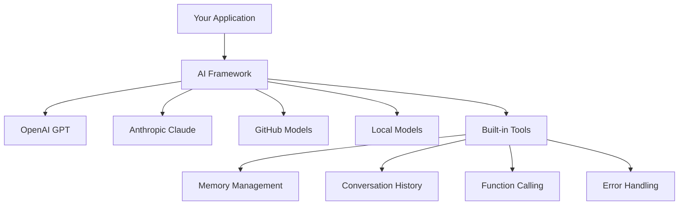
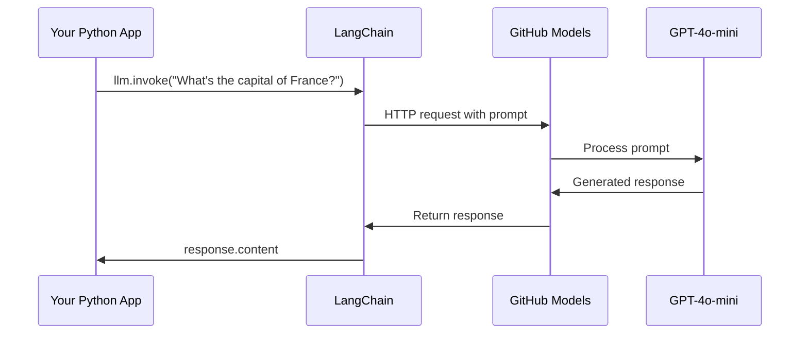
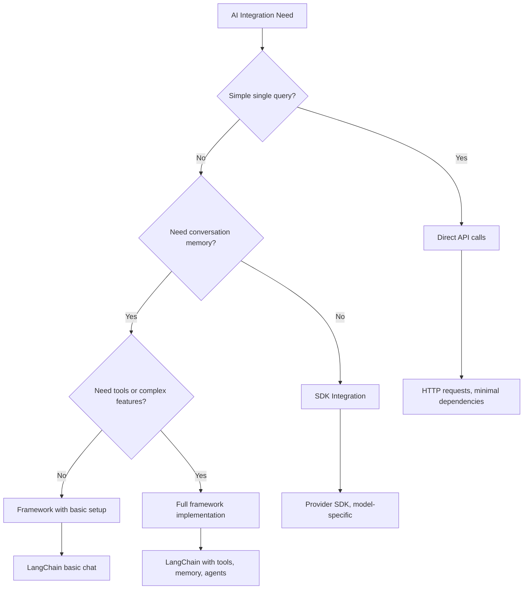

<!--
CO_OP_TRANSLATOR_METADATA:
{
  "original_hash": "e2c4ae5688e34b4b8b09d52aec56c79e",
  "translation_date": "2025-10-22T14:45:59+00:00",
  "source_file": "10-ai-framework-project/README.md",
  "language_code": "ur"
}
-->
# اے آئی فریم ورک

کبھی ایسا محسوس ہوا کہ اے آئی ایپلیکیشنز کو شروع سے بنانے کی کوشش کرتے ہوئے آپ پریشان ہو گئے ہیں؟ آپ اکیلے نہیں ہیں! اے آئی فریم ورکز ایسے ہیں جیسے اے آئی ڈیولپمنٹ کے لیے سوئس آرمی نائف - یہ طاقتور ٹولز ہیں جو ذہین ایپلیکیشنز بناتے وقت آپ کا وقت اور پریشانی بچا سکتے ہیں۔ اے آئی فریم ورک کو ایک منظم لائبریری کے طور پر سوچیں: یہ پہلے سے تیار شدہ اجزاء، معیاری APIs، اور ذہین خلاصے فراہم کرتا ہے تاکہ آپ مسائل حل کرنے پر توجہ مرکوز کر سکیں بجائے اس کے کہ آپ عمل درآمد کی تفصیلات سے لڑیں۔

اس سبق میں، ہم دیکھیں گے کہ کس طرح LangChain جیسے فریم ورک پیچیدہ اے آئی انٹیگریشن کے کاموں کو صاف، قابلِ پڑھ کوڈ میں تبدیل کر سکتے ہیں۔ آپ یہ سیکھیں گے کہ حقیقی دنیا کے چیلنجز جیسے گفتگو کا ریکارڈ رکھنا، ٹول کالنگ کو نافذ کرنا، اور مختلف اے آئی ماڈلز کو ایک متحد انٹرفیس کے ذریعے سنبھالنا کیسے ممکن ہے۔

جب ہم ختم کریں گے، تو آپ جان جائیں گے کہ کب فریم ورکز کا استعمال کرنا ہے بجائے خام API کالز کے، ان کے خلاصے کو مؤثر طریقے سے کیسے استعمال کرنا ہے، اور حقیقی دنیا کے استعمال کے لیے تیار اے آئی ایپلیکیشنز کیسے بنانی ہیں۔ آئیے دیکھتے ہیں کہ اے آئی فریم ورکز آپ کے پروجیکٹس کے لیے کیا کر سکتے ہیں۔

## فریم ورک کیوں منتخب کریں؟

تو آپ اے آئی ایپ بنانے کے لیے تیار ہیں - زبردست! لیکن بات یہ ہے: آپ کے پاس کئی مختلف راستے ہیں جنہیں آپ اختیار کر سکتے ہیں، اور ہر ایک کے اپنے فوائد اور نقصانات ہیں۔ یہ کچھ ایسا ہی ہے جیسے کہیں پہنچنے کے لیے پیدل چلنا، سائیکل چلانا، یا گاڑی چلانا منتخب کرنا - یہ سب آپ کو وہاں پہنچا دیں گے، لیکن تجربہ (اور کوشش) بالکل مختلف ہوگی۔

آئیے تین اہم طریقے دیکھتے ہیں جن سے آپ اپنے پروجیکٹس میں اے آئی کو شامل کر سکتے ہیں:

| طریقہ | فوائد | بہترین استعمال | غور طلب نکات |
|-------|--------|----------------|---------------|
| **براہ راست HTTP درخواستیں** | مکمل کنٹرول، کوئی انحصار نہیں | سادہ سوالات، بنیادی اصول سیکھنا | زیادہ تفصیلی کوڈ، دستی خرابی ہینڈلنگ |
| **SDK انٹیگریشن** | کم بوائلر پلیٹ، ماڈل مخصوص اصلاح | سنگل ماڈل ایپلیکیشنز | مخصوص فراہم کنندگان تک محدود |
| **اے آئی فریم ورکز** | متحد API، بلٹ ان خلاصے | ملٹی ماڈل ایپس، پیچیدہ ورک فلو | سیکھنے کا منحنی خط، ممکنہ زیادہ خلاصہ |

### عملی طور پر فریم ورک کے فوائد



**فریم ورکز کیوں اہم ہیں:**
- **متحد کرتا ہے** متعدد اے آئی فراہم کنندگان کو ایک انٹرفیس کے تحت
- **خودکار طور پر سنبھالتا ہے** گفتگو کی یادداشت
- **فراہم کرتا ہے** عام کاموں جیسے ایمبیڈنگز اور فنکشن کالنگ کے لیے تیار ٹولز
- **خرابی ہینڈلنگ اور ریٹری لاجک** کو منظم کرتا ہے
- **پیچیدہ ورک فلو کو** قابلِ پڑھ طریقہ کار میں تبدیل کرتا ہے

> 💡 **پرو ٹپ**: جب مختلف اے آئی ماڈلز کے درمیان سوئچ کرنا ہو یا ایجنٹس، میموری، یا ٹول کالنگ جیسے پیچیدہ فیچرز بنانا ہو تو فریم ورکز کا استعمال کریں۔ بنیادی اصول سیکھنے یا سادہ، مرکوز ایپلیکیشنز بنانے کے لیے براہ راست APIs پر قائم رہیں۔

**خلاصہ**: جیسے کسی ماہر کاریگر کے مخصوص ٹولز اور مکمل ورکشاپ کے درمیان انتخاب کرنا، یہ کام کے مطابق ٹول کو منتخب کرنے کی بات ہے۔ فریم ورکز پیچیدہ، فیچر سے بھرپور ایپلیکیشنز کے لیے بہترین ہیں، جبکہ براہ راست APIs سادہ استعمال کے معاملات کے لیے اچھے ہیں۔

## تعارف

اس سبق میں، ہم سیکھیں گے:

- ایک عام اے آئی فریم ورک کا استعمال۔
- عام مسائل جیسے چیٹ گفتگو، ٹول کا استعمال، میموری اور سیاق و سباق کو حل کرنا۔
- اس کا فائدہ اٹھا کر اے آئی ایپلیکیشنز بنانا۔

## آپ کا پہلا اے آئی پرامپٹ

آئیے بنیادی اصولوں سے شروع کرتے ہیں اور اپنی پہلی اے آئی ایپلیکیشن بناتے ہیں جو ایک سوال بھیجتی ہے اور جواب حاصل کرتی ہے۔ جیسے ارشمیدس نے اپنے غسل میں بے گھر ہونے کے اصول کو دریافت کیا، کبھی کبھی سب سے سادہ مشاہدات سب سے طاقتور بصیرت کی طرف لے جاتے ہیں - اور فریم ورکز ان بصیرتوں کو قابل رسائی بناتے ہیں۔

### GitHub ماڈلز کے ساتھ LangChain سیٹ اپ کرنا

ہم LangChain کا استعمال کریں گے تاکہ GitHub ماڈلز سے جڑ سکیں، جو کافی زبردست ہے کیونکہ یہ آپ کو مختلف اے آئی ماڈلز تک مفت رسائی فراہم کرتا ہے۔ سب سے اچھی بات؟ شروع کرنے کے لیے آپ کو صرف چند سادہ کنفیگریشن پیرامیٹرز کی ضرورت ہے:

```python
from langchain_openai import ChatOpenAI
import os

llm = ChatOpenAI(
    api_key=os.environ["GITHUB_TOKEN"],
    base_url="https://models.github.ai/inference",
    model="openai/gpt-4o-mini",
)

# Send a simple prompt
response = llm.invoke("What's the capital of France?")
print(response.content)
```

**یہاں کیا ہو رہا ہے:**
- **LangChain کلائنٹ بناتا ہے** `ChatOpenAI` کلاس کا استعمال کرتے ہوئے - یہ آپ کا اے آئی کا گیٹ وے ہے!
- **GitHub ماڈلز کے ساتھ کنکشن کو ترتیب دیتا ہے** آپ کے تصدیقی ٹوکن کے ساتھ
- **یہ بتاتا ہے** کہ کون سا اے آئی ماڈل استعمال کرنا ہے (`gpt-4o-mini`) - اسے اپنا اے آئی اسسٹنٹ منتخب کرنے کے طور پر سوچیں
- **آپ کا سوال بھیجتا ہے** `invoke()` طریقہ استعمال کرتے ہوئے - یہاں جادو ہوتا ہے
- **جواب نکالتا ہے اور دکھاتا ہے** - اور voilà، آپ اے آئی کے ساتھ چیٹ کر رہے ہیں!

> 🔧 **سیٹ اپ نوٹ**: اگر آپ GitHub Codespaces استعمال کر رہے ہیں، تو آپ خوش قسمت ہیں - `GITHUB_TOKEN` پہلے ہی سیٹ اپ ہے! مقامی طور پر کام کر رہے ہیں؟ کوئی مسئلہ نہیں، آپ کو صرف صحیح اجازتوں کے ساتھ ایک ذاتی رسائی ٹوکن بنانا ہوگا۔

**متوقع آؤٹ پٹ:**
```text
The capital of France is Paris.
```



## گفتگو پر مبنی اے آئی بنانا

پہلی مثال بنیادی اصولوں کو ظاہر کرتی ہے، لیکن یہ صرف ایک واحد تبادلہ ہے - آپ سوال پوچھتے ہیں، جواب حاصل کرتے ہیں، اور بس۔ حقیقی ایپلیکیشنز میں، آپ چاہتے ہیں کہ آپ کا اے آئی یاد رکھے کہ آپ کیا بات کر رہے ہیں، جیسے Watson اور Holmes نے وقت کے ساتھ اپنی تحقیقی گفتگو بنائی۔

یہ وہ جگہ ہے جہاں LangChain خاص طور پر مفید ہو جاتا ہے۔ یہ مختلف پیغام کی اقسام فراہم کرتا ہے جو گفتگو کو منظم کرنے میں مدد کرتے ہیں اور آپ کو اپنے اے آئی کو ایک شخصیت دینے دیتے ہیں۔ آپ چیٹ کے تجربات بنائیں گے جو سیاق و سباق اور کردار کو برقرار رکھتے ہیں۔

### پیغام کی اقسام کو سمجھنا

ان پیغام کی اقسام کو ان مختلف "ٹوپیوں" کے طور پر سوچیں جو گفتگو میں شرکاء پہنتے ہیں۔ LangChain مختلف پیغام کی کلاسز استعمال کرتا ہے تاکہ یہ معلوم ہو سکے کہ کون کیا کہہ رہا ہے:

| پیغام کی قسم | مقصد | مثال استعمال کیس |
|--------------|-------|------------------|
| `SystemMessage` | اے آئی کی شخصیت اور رویے کی وضاحت کرتا ہے | "آپ ایک مددگار کوڈنگ اسسٹنٹ ہیں" |
| `HumanMessage` | صارف کی ان پٹ کی نمائندگی کرتا ہے | "فنکشنز کیسے کام کرتے ہیں وضاحت کریں" |
| `AIMessage` | اے آئی کے جوابات کو محفوظ کرتا ہے | گفتگو میں پچھلے اے آئی جوابات |

### اپنی پہلی گفتگو بنانا

آئیے ایک گفتگو بناتے ہیں جہاں ہمارا اے آئی ایک مخصوص کردار اختیار کرے۔ ہم اسے کیپٹن پیکارڈ کا کردار دیں گے - ایک کردار جو اپنی سفارتی حکمت اور قیادت کے لیے جانا جاتا ہے:

```python
messages = [
    SystemMessage(content="You are Captain Picard of the Starship Enterprise"),
    HumanMessage(content="Tell me about you"),
]
```

**اس گفتگو کے سیٹ اپ کو توڑنا:**
- **اے آئی کے کردار اور شخصیت کو قائم کرتا ہے** `SystemMessage` کے ذریعے
- **ابتدائی صارف کی درخواست فراہم کرتا ہے** `HumanMessage` کے ذریعے
- **ملٹی ٹرن گفتگو کے لیے بنیاد بناتا ہے**

اس مثال کے لیے مکمل کوڈ کچھ اس طرح نظر آتا ہے:

```python
from langchain_core.messages import HumanMessage, SystemMessage
from langchain_openai import ChatOpenAI
import os

llm = ChatOpenAI(
    api_key=os.environ["GITHUB_TOKEN"],
    base_url="https://models.github.ai/inference",
    model="openai/gpt-4o-mini",
)

messages = [
    SystemMessage(content="You are Captain Picard of the Starship Enterprise"),
    HumanMessage(content="Tell me about you"),
]


# works
response  = llm.invoke(messages)
print(response.content)
```

آپ کو ایک نتیجہ دیکھنا چاہیے جو اس طرح کا ہو:

```text
I am Captain Jean-Luc Picard, the commanding officer of the USS Enterprise (NCC-1701-D), a starship in the United Federation of Planets. My primary mission is to explore new worlds, seek out new life and new civilizations, and boldly go where no one has gone before. 

I believe in the importance of diplomacy, reason, and the pursuit of knowledge. My crew is diverse and skilled, and we often face challenges that test our resolve, ethics, and ingenuity. Throughout my career, I have encountered numerous species, grappled with complex moral dilemmas, and have consistently sought peaceful solutions to conflicts.

I hold the ideals of the Federation close to my heart, believing in the importance of cooperation, understanding, and respect for all sentient beings. My experiences have shaped my leadership style, and I strive to be a thoughtful and just captain. How may I assist you further?
```

گفتگو کی تسلسل کو برقرار رکھنے کے لیے (ہر بار سیاق و سباق کو دوبارہ ترتیب دینے کے بجائے)، آپ کو اپنے پیغام کی فہرست میں جوابات شامل کرتے رہنا ہوگا۔ جیسے زبانی روایات نے نسلوں کے دوران کہانیاں محفوظ کیں، یہ طریقہ کار پائیدار یادداشت بناتا ہے:

```python
from langchain_core.messages import HumanMessage, SystemMessage
from langchain_openai import ChatOpenAI
import os

llm = ChatOpenAI(
    api_key=os.environ["GITHUB_TOKEN"],
    base_url="https://models.github.ai/inference",
    model="openai/gpt-4o-mini",
)

messages = [
    SystemMessage(content="You are Captain Picard of the Starship Enterprise"),
    HumanMessage(content="Tell me about you"),
]


# works
response  = llm.invoke(messages)

print(response.content)

print("---- Next ----")

messages.append(response)
messages.append(HumanMessage(content="Now that I know about you, I'm Chris, can I be in your crew?"))

response  = llm.invoke(messages)

print(response.content)

```

کافی دلچسپ، ہے نا؟ یہاں جو ہو رہا ہے وہ یہ ہے کہ ہم LLM کو دو بار کال کر رہے ہیں - پہلے صرف ہمارے ابتدائی دو پیغامات کے ساتھ، لیکن پھر دوبارہ مکمل گفتگو کی تاریخ کے ساتھ۔ یہ ایسا ہے جیسے اے آئی واقعی ہماری چیٹ کے ساتھ چل رہا ہو!

جب آپ یہ کوڈ چلائیں گے، تو آپ کو دوسرا جواب ملے گا جو کچھ اس طرح کا لگتا ہے:

```text
Welcome aboard, Chris! It's always a pleasure to meet those who share a passion for exploration and discovery. While I cannot formally offer you a position on the Enterprise right now, I encourage you to pursue your aspirations. We are always in need of talented individuals with diverse skills and backgrounds. 

If you are interested in space exploration, consider education and training in the sciences, engineering, or diplomacy. The values of curiosity, resilience, and teamwork are crucial in Starfleet. Should you ever find yourself on a starship, remember to uphold the principles of the Federation: peace, understanding, and respect for all beings. Your journey can lead you to remarkable adventures, whether in the stars or on the ground. Engage!
```

میں اسے شاید کے طور پر لوں گا ;)

## اسٹریمنگ جوابات

کبھی نوٹ کیا کہ ChatGPT اپنے جوابات کو حقیقی وقت میں "ٹائپ" کرتا ہوا لگتا ہے؟ یہ اسٹریمنگ کی کارروائی ہے۔ جیسے کسی ماہر خطاط کو کام کرتے دیکھنا - کرداروں کو اسٹروک بہ اسٹروک ظاہر ہوتے دیکھنا بجائے اس کے کہ وہ فوراً ظاہر ہو جائیں - اسٹریمنگ تعامل کو زیادہ قدرتی محسوس کرتی ہے اور فوری فیڈبیک فراہم کرتی ہے۔

### LangChain کے ساتھ اسٹریمنگ کو نافذ کرنا

```python
from langchain_openai import ChatOpenAI
import os

llm = ChatOpenAI(
    api_key=os.environ["GITHUB_TOKEN"],
    base_url="https://models.github.ai/inference",
    model="openai/gpt-4o-mini",
    streaming=True
)

# Stream the response
for chunk in llm.stream("Write a short story about a robot learning to code"):
    print(chunk.content, end="", flush=True)
```

**اسٹریمنگ کیوں زبردست ہے:**
- **مواد دکھاتا ہے** جیسے یہ تخلیق ہو رہا ہے - مزید عجیب انتظار نہیں!
- **صارفین کو محسوس کراتا ہے** کہ کچھ واقعی ہو رہا ہے
- **تیز محسوس ہوتا ہے**، حالانکہ یہ تکنیکی طور پر نہیں ہے
- **صارفین کو پڑھنے دیتا ہے** جبکہ اے آئی ابھی "سوچ رہا ہے"

> 💡 **صارف کے تجربے کا ٹپ**: اسٹریمنگ واقعی چمکتی ہے جب آپ لمبے جوابات جیسے کوڈ وضاحتیں، تخلیقی تحریر، یا تفصیلی ٹیوٹوریلز سے نمٹ رہے ہوں۔ آپ کے صارفین پیش رفت دیکھنے کو پسند کریں گے بجائے خالی اسکرین کو گھورنے کے!

## پرامپٹ ٹیمپلیٹس

پرامپٹ ٹیمپلیٹس کلاسیکل خطابت میں استعمال ہونے والے بیانیہ ڈھانچے کی طرح کام کرتے ہیں - سوچیں کہ کس طرح Cicero اپنے تقریری انداز کو مختلف سامعین کے لیے اپناتا تھا جبکہ ایک ہی قائل کرنے والے فریم ورک کو برقرار رکھتا تھا۔ یہ آپ کو دوبارہ استعمال کے قابل پرامپٹس بنانے دیتے ہیں جہاں آپ مختلف معلومات کے ٹکڑوں کو دوبارہ لکھے بغیر تبدیل کر سکتے ہیں۔ ایک بار جب آپ ٹیمپلیٹ سیٹ اپ کر لیتے ہیں، تو آپ صرف متغیرات کو مطلوبہ اقدار کے ساتھ بھر دیتے ہیں۔

### دوبارہ استعمال کے قابل پرامپٹس بنانا

```python
from langchain_core.prompts import ChatPromptTemplate

# Define a template for code explanations
template = ChatPromptTemplate.from_messages([
    ("system", "You are an expert programming instructor. Explain concepts clearly with examples."),
    ("human", "Explain {concept} in {language} with a practical example for {skill_level} developers")
])

# Use the template with different values
questions = [
    {"concept": "functions", "language": "JavaScript", "skill_level": "beginner"},
    {"concept": "classes", "language": "Python", "skill_level": "intermediate"},
    {"concept": "async/await", "language": "JavaScript", "skill_level": "advanced"}
]

for question in questions:
    prompt = template.format_messages(**question)
    response = llm.invoke(prompt)
    print(f"Topic: {question['concept']}\n{response.content}\n---\n")
```

**آپ ٹیمپلیٹس استعمال کرنے سے کیوں محبت کریں گے:**
- **آپ کے پرامپٹس کو** آپ کی پوری ایپ میں مستقل رکھتا ہے
- **گندے اسٹرنگ کنکیٹینیشن کی ضرورت نہیں** - صرف صاف، سادہ متغیرات
- **آپ کا اے آئی** پیش گوئی کے قابل برتاؤ کرتا ہے کیونکہ ڈھانچہ وہی رہتا ہے
- **اپ ڈیٹس** آسان ہیں - ٹیمپلیٹ کو ایک بار تبدیل کریں، اور یہ ہر جگہ ٹھیک ہو گیا

## منظم آؤٹپٹ

کبھی اے آئی کے جوابات کو غیر منظم متن کے طور پر واپس کرنے کی کوشش کرتے ہوئے مایوس ہوئے؟ منظم آؤٹپٹ ایسا ہے جیسے آپ کے اے آئی کو سکھایا جائے کہ Linnaeus نے حیاتیاتی درجہ بندی کے لیے منظم طریقہ اختیار کیا - منظم، پیش گوئی کے قابل، اور کام کرنے میں آسان۔ آپ JSON، مخصوص ڈیٹا ڈھانچے، یا کسی بھی فارمیٹ کی درخواست کر سکتے ہیں جس کی آپ کو ضرورت ہو۔

### آؤٹپٹ اسکیمز کی وضاحت

```python
from langchain_core.prompts import ChatPromptTemplate
from langchain_core.output_parsers import JsonOutputParser
from pydantic import BaseModel, Field

class CodeReview(BaseModel):
    score: int = Field(description="Code quality score from 1-10")
    strengths: list[str] = Field(description="List of code strengths")
    improvements: list[str] = Field(description="List of suggested improvements")
    overall_feedback: str = Field(description="Summary feedback")

# Set up the parser
parser = JsonOutputParser(pydantic_object=CodeReview)

# Create prompt with format instructions
prompt = ChatPromptTemplate.from_messages([
    ("system", "You are a code reviewer. {format_instructions}"),
    ("human", "Review this code: {code}")
])

# Format the prompt with instructions
chain = prompt | llm | parser

# Get structured response
code_sample = """
def calculate_average(numbers):
    return sum(numbers) / len(numbers)
"""

result = chain.invoke({
    "code": code_sample,
    "format_instructions": parser.get_format_instructions()
})

print(f"Score: {result['score']}")
print(f"Strengths: {', '.join(result['strengths'])}")
```

**منظم آؤٹپٹ کیوں گیم چینجر ہے:**
- **اب مزید اندازہ لگانے کی ضرورت نہیں** کہ آپ کو کون سا فارمیٹ واپس ملے گا - یہ ہر بار مستقل ہے
- **آپ کے ڈیٹا بیس اور APIs میں** بغیر اضافی کام کے براہ راست پلگ کرتا ہے
- **عجیب اے آئی جوابات کو پکڑتا ہے** اس سے پہلے کہ وہ آپ کی ایپ کو نقصان پہنچائیں
- **آپ کے کوڈ کو صاف کرتا ہے** کیونکہ آپ بالکل جانتے ہیں کہ آپ کس کے ساتھ کام کر رہے ہیں

## ٹول کالنگ

اب ہم ایک سب سے طاقتور فیچر پر پہنچتے ہیں: ٹولز۔ یہ وہ طریقہ ہے جس سے آپ اپنے اے آئی کو گفتگو سے آگے عملی صلاحیتیں دیتے ہیں۔ جیسے قرون وسطیٰ کے گلڈز نے مخصوص دستکاری کے لیے خصوصی ٹولز تیار کیے، آپ اپنے اے آئی کو مرکوز آلات سے لیس کر سکتے ہیں۔ آپ بیان کرتے ہیں کہ کون سے ٹولز دستیاب ہیں، اور جب کوئی ایسی چیز کی درخواست کرتا ہے جو میل کھاتی ہے، تو آپ کا اے آئی کارروائی کر سکتا ہے۔

### Python کا استعمال

آئیے کچھ ٹولز شامل کرتے ہیں جیسے:

```python
from typing_extensions import Annotated, TypedDict

class add(TypedDict):
    """Add two integers."""

    # Annotations must have the type and can optionally include a default value and description (in that order).
    a: Annotated[int, ..., "First integer"]
    b: Annotated[int, ..., "Second integer"]

tools = [add]

functions = {
    "add": lambda a, b: a + b
}
```

تو یہاں کیا ہو رہا ہے؟ ہم نے `add` نامی ایک ٹول کے لیے بلیو پرنٹ بنایا۔ `TypedDict` سے وراثت لے کر اور ان فینسی `Annotated` اقسام کو `a` اور `b` کے لیے استعمال کرتے ہوئے، ہم LLM کو واضح تصویر دے رہے ہیں کہ یہ ٹول کیا کرتا ہے اور اسے کیا ضرورت ہے۔ `functions` ڈکشنری ہماری ٹول باکس کی طرح ہے - یہ ہمارے کوڈ کو بالکل بتاتا ہے کہ جب اے آئی کسی مخصوص ٹول کو استعمال کرنے کا فیصلہ کرے تو کیا کرنا ہے۔

آئیے دیکھتے ہیں کہ ہم اگلے مرحلے میں اس ٹول کے ساتھ LLM کو کیسے کال کرتے ہیں:

```python
llm = ChatOpenAI(
    api_key=os.environ["GITHUB_TOKEN"],
    base_url="https://models.github.ai/inference",
    model="openai/gpt-4o-mini",
)

llm_with_tools = llm.bind_tools(tools)
```

یہاں ہم `bind_tools` کو اپنے `tools` array کے ساتھ کال کرتے ہیں اور اس طرح LLM `llm_with_tools` اب اس ٹول کے بارے میں جانتا ہے۔

اس نئے LLM کو استعمال کرنے کے لیے، ہم درج ذیل کوڈ ٹائپ کر سکتے ہیں:

```python
query = "What is 3 + 12?"

res = llm_with_tools.invoke(query)
if(res.tool_calls):
    for tool in res.tool_calls:
        print("TOOL CALL: ", functions[tool["name"]](../../../10-ai-framework-project/**tool["args"]))
print("CONTENT: ",res.content)
```

اب جب ہم اس نئے llm پر `invoke` کال کرتے ہیں، جس کے پاس ٹولز ہیں، تو شاید پراپرٹی `tool_calls` پاپولیٹ ہو جائے۔ اگر ایسا ہے، تو کوئی بھی شناخت شدہ ٹولز کے پاس `name` اور `args` پراپرٹی ہوتی ہے جو شناخت کرتی ہے کہ کون سا ٹول استعمال کیا جانا چاہیے اور کس دلائل کے ساتھ۔ مکمل کوڈ کچھ اس طرح نظر آتا ہے:

```python
from langchain_core.messages import HumanMessage, SystemMessage
from langchain_openai import ChatOpenAI
import os
from typing_extensions import Annotated, TypedDict

class add(TypedDict):
    """Add two integers."""

    # Annotations must have the type and can optionally include a default value and description (in that order).
    a: Annotated[int, ..., "First integer"]
    b: Annotated[int, ..., "Second integer"]

tools = [add]

functions = {
    "add": lambda a, b: a + b
}

llm = ChatOpenAI(
    api_key=os.environ["GITHUB_TOKEN"],
    base_url="https://models.github.ai/inference",
    model="openai/gpt-4o-mini",
)

llm_with_tools = llm.bind_tools(tools)

query = "What is 3 + 12?"

res = llm_with_tools.invoke(query)
if(res.tool_calls):
    for tool in res.tool_calls:
        print("TOOL CALL: ", functions[tool["name"]](../../../10-ai-framework-project/**tool["args"]))
print("CONTENT: ",res.content)
```

اس کوڈ کو چلانے پر، آپ کو آؤٹپٹ کچھ اس طرح نظر آنا چاہیے:

```text
TOOL CALL:  15
CONTENT: 
```

اے آئی نے "What is 3 + 12" کا جائزہ لیا اور اسے `add` ٹول کے لیے ایک کام کے طور پر پہچانا۔ جیسے ایک ماہر لائبریرین جانتا ہے کہ کس قسم کے سوال کے مطابق کون سا حوالہ مشورہ کرنا ہے، اس نے یہ تعین ٹول کے نام، وضاحت، اور فیلڈ کی وضاحتوں سے کیا۔ 15 کا نتیجہ ہمارے `functions` ڈکشنری سے ٹول کو انجام دینے سے آیا:

```python
print("TOOL CALL: ", functions[tool["name"]](../../../10-ai-framework-project/**tool["args"]))
```

### ایک زیادہ دلچسپ ٹول جو ویب API کو کال کرتا ہے

نمبرز کو شامل کرنا تصور کو ظاہر کرتا ہے، لیکن حقیقی ٹولز عام طور پر زیادہ پیچیدہ آپریشنز انجام دیتے ہیں، جیسے ویب APIs کو کال کرنا۔ آئیے اپنے مثال کو بڑھاتے ہیں تاکہ اے آئی انٹرنیٹ سے مواد حاصل کرے - جیسے ٹیلی گراف آپریٹرز نے کبھی دور دراز مقامات کو جوڑا:

```python
class joke(TypedDict):
    """Tell a joke."""

    # Annotations must have the type and can optionally include a default value and description (in that order).
    category: Annotated[str, ..., "The joke category"]

def get_joke(category: str) -> str:
    response = requests.get(f"https://api.chucknorris.io/jokes/random?category={category}", headers={"Accept": "application/json"})
    if response.status_code == 200:
        return response.json().get("value", f"Here's a {category} joke!")
    return f"Here's a {category} joke!"

functions = {
    "add": lambda a, b: a + b,
    "joke": lambda category: get_joke(category)
}

query = "Tell me a joke about animals"

# the rest of the code is the same
```

اب اگر آپ یہ کوڈ چلائیں تو آپ کو ایک جواب ملے گا جو کچھ اس طرح کہتا ہے:

```text
TOOL CALL:  Chuck Norris once rode a nine foot grizzly bear through an automatic car wash, instead of taking a shower.
CONTENT:  
```

یہاں مکمل کوڈ ہے:

```python
from langchain_openai import ChatOpenAI
import requests
import os
from typing_extensions import Annotated, TypedDict

class add(TypedDict):
    """Add two integers."""

    # Annotations must have the type and can optionally include a default value and description (in that order).
    a: Annotated[int, ..., "First integer"]
    b: Annotated[int, ..., "Second integer"]

class joke(TypedDict):
    """Tell a joke."""

    # Annotations must have the type and can optionally include a default value and description (in that order).
    category: Annotated[str, ..., "The joke category"]

tools = [add, joke]

def get_joke(category: str) -> str:
    response = requests.get(f"https://api.chucknorris.io/jokes/random?category={category}", headers={"Accept": "application/json"})
    if response.status_code == 200:
        return response.json().get("value", f"Here's a {category} joke!")
    return f"Here's a {category} joke!"

functions = {
    "add": lambda a, b: a + b,
    "joke": lambda category: get_joke(category)
}

llm = ChatOpenAI(
    api_key=os.environ["GITHUB_TOKEN"],
    base_url="https://models.github.ai/inference",
    model="openai/gpt-4o-mini",
)

llm_with_tools = llm.bind_tools(tools)

query = "Tell me a joke about animals"

res = llm_with_tools.invoke(query)
if(res.tool_calls):
    for tool in res.tool_calls:
        # print("TOOL CALL: ", tool)
        print("TOOL CALL: ", functions[tool["name"]](../../../10-ai-framework-project/**tool["args"]))
print("CONTENT: ",res.content)
```

## ایمبیڈنگز اور دستاویز پروسیسنگ

ایمبیڈنگز جدید اے آئی میں سب سے زیادہ خوبصورت حلوں میں سے ایک کی نمائندگی کرتی ہیں۔ تصور کریں کہ آپ کسی بھی متن کو لے سکتے ہیں اور اسے عددی نقاط میں تبدیل کر سکتے ہیں جو اس کے معنی کو ظاہر کرتے ہیں۔ یہی ایمبیڈنگز کرتی ہیں - وہ متن کو کثیر جہتی جگہ میں پوائنٹس میں تبدیل کرتی ہیں جہاں ملتے جلتے تصورات ایک ساتھ جمع ہوتے ہیں۔ یہ خیالات کے لیے ایک کوآرڈینیٹ سسٹم رکھنے جیسا ہے، جیسے Mendeleev نے ایٹمی خصوصیات کے ذریعے پیریوڈک ٹیبل کو منظم کیا۔

### ایمبیڈنگز بنانا اور استعمال کرنا

```python
from langchain_openai import OpenAIEmbeddings
from langchain_community.vectorstores import FAISS
from langchain_community.document_loaders import TextLoader
from langchain.text_splitter import CharacterTextSplitter

# Initialize embeddings
embeddings = OpenAIEmbeddings(
    api_key=os.environ["GITHUB_TOKEN"],
    base_url="https://models.github.ai/inference",
    model="text-embedding-3-small"
)

# Load and split documents
loader = TextLoader("documentation.txt")
documents = loader.load()

text_splitter = CharacterTextSplitter(chunk_size=1000, chunk_overlap=0)
texts = text_splitter.split_documents(documents)

# Create vector store
vectorstore = FAISS.from_documents(texts, embeddings)

# Perform similarity search
query = "How do I handle user authentication?"
similar_docs = vectorstore.similarity_search(query, k=3)

for doc in similar_docs:
    print(f"Relevant content: {doc.page_content[:200]}...")
```

### مختلف فارمیٹس کے لیے دستاویز لوڈرز

```python
from langchain_community.document_loaders import (
    PyPDFLoader,
    CSVLoader,
    JSONLoader,
    WebBaseLoader
)

# Load different document types
pdf_loader = PyPDFLoader("manual.pdf")
csv_loader = CSVLoader("data.csv")
json_loader = JSONLoader("config.json")
web_loader = WebBaseLoader("https://example.com/docs")

# Process all documents
all_documents = []
for loader in [pdf_loader, csv_loader, json_loader, web_loader]:
    docs = loader.load()
    all_documents.extend(docs)
```

**ایمبیڈنگز کے ساتھ آپ کیا کر سکتے ہیں:**
- **ایسا سرچ بنائیں** جو واقعی آپ کا مطلب سمجھتا ہو، صرف کی ورڈ میچنگ نہیں
- **ایسا اے آئی بنائیں** جو آپ کے دستاویزات کے بارے میں سوالات کا جواب دے سکے
- **ایسی سفارشاتی نظام بنائیں** جو واقعی متعلقہ مواد تجویز
3. **ذاتی تعلیم**: مختلف مہارت کی سطحوں کے مطابق جوابات کو ڈھالنے کے لیے سسٹم پیغامات کا استعمال کریں  
4. **جواب کی ترتیب**: کوئز سوالات کے لیے منظم آؤٹ پٹ نافذ کریں  

### عمل درآمد کے مراحل  

**مرحلہ 1: اپنے ماحول کو ترتیب دیں**  
```bash
pip install langchain langchain-openai
```
  
**مرحلہ 2: بنیادی چیٹ کی فعالیت**  
- `StudyAssistant` کلاس بنائیں  
- گفتگو کی یادداشت کو نافذ کریں  
- تعلیمی مدد کے لیے شخصیت کی ترتیب شامل کریں  

**مرحلہ 3: تعلیمی ٹولز شامل کریں**  
- **کوڈ وضاحت کنندہ**: کوڈ کو قابل فہم حصوں میں تقسیم کرتا ہے  
- **کوئز جنریٹر**: پروگرامنگ تصورات کے بارے میں سوالات تیار کرتا ہے  
- **پیش رفت ٹریکر**: کور کیے گئے موضوعات کا ریکارڈ رکھتا ہے  

**مرحلہ 4: بہتر خصوصیات (اختیاری)**  
- بہتر صارف تجربے کے لیے اسٹریمنگ جوابات نافذ کریں  
- کورس مواد کو شامل کرنے کے لیے دستاویز لوڈنگ شامل کریں  
- مواد کی بازیافت کے لیے مماثلت پر مبنی ایمبیڈنگز بنائیں  

### تشخیصی معیار  

| خصوصیت | بہترین (4) | اچھا (3) | تسلی بخش (2) | مزید کام کی ضرورت (1) |  
|---------|---------------|----------|------------------|----------------|  
| **گفتگو کا بہاؤ** | قدرتی، سیاق و سباق سے آگاہ جوابات | اچھا سیاق و سباق برقرار رکھنا | بنیادی گفتگو | تبادلے کے درمیان کوئی یادداشت نہیں |  
| **ٹول انضمام** | متعدد مفید ٹولز بغیر کسی رکاوٹ کے کام کر رہے ہیں | 2+ ٹولز درست طریقے سے نافذ کیے گئے | 1-2 بنیادی ٹولز | ٹولز کام نہیں کر رہے |  
| **کوڈ کا معیار** | صاف، اچھی طرح سے دستاویزی، غلطی کا انتظام | اچھی ساخت، کچھ دستاویزات | بنیادی فعالیت کام کرتی ہے | خراب ساخت، کوئی غلطی کا انتظام نہیں |  
| **تعلیمی قدر** | سیکھنے کے لیے واقعی مددگار، موافقت پذیر | اچھا تعلیمی تعاون | بنیادی وضاحتیں | محدود تعلیمی فائدہ |  

### نمونہ کوڈ کی ساخت  

```python
class StudyAssistant:
    def __init__(self, skill_level="beginner"):
        # Initialize LLM, tools, and conversation memory
        pass
    
    def explain_code(self, code, language):
        # Tool: Explain how code works
        pass
    
    def generate_quiz(self, topic, difficulty):
        # Tool: Create practice questions
        pass
    
    def chat(self, user_input):
        # Main conversation interface
        pass

# Example usage
assistant = StudyAssistant(skill_level="intermediate")
response = assistant.chat("Explain how Python functions work")
```
  
**اضافی چیلنجز:**  
- آواز کی ان پٹ/آؤٹ پٹ صلاحیتیں شامل کریں  
- Streamlit یا Flask کا استعمال کرتے ہوئے ویب انٹرفیس نافذ کریں  
- ایمبیڈنگز کا استعمال کرتے ہوئے کورس مواد سے علم کا ذخیرہ بنائیں  
- پیش رفت کی ٹریکنگ اور ذاتی تعلیم کے راستے شامل کریں  

## خلاصہ  

🎉 آپ نے اب AI فریم ورک کی ترقی کے بنیادی اصولوں میں مہارت حاصل کر لی ہے اور LangChain کا استعمال کرتے ہوئے جدید AI ایپلیکیشنز بنانے کا طریقہ سیکھ لیا ہے۔ جیسے ایک جامع تربیت مکمل کرنا، آپ نے مہارتوں کا ایک اہم ٹول کٹ حاصل کر لیا ہے۔ آئیے جائزہ لیتے ہیں کہ آپ نے کیا حاصل کیا ہے۔  

### آپ نے کیا سیکھا  

**بنیادی فریم ورک تصورات:**  
- **فریم ورک کے فوائد**: براہ راست API کالز کے مقابلے میں فریم ورک کا انتخاب کب کرنا ہے  
- **LangChain کی بنیادی باتیں**: AI ماڈل کنکشنز کو ترتیب دینا اور تشکیل دینا  
- **پیغام کی اقسام**: `SystemMessage`, `HumanMessage`, اور `AIMessage` کا استعمال منظم گفتگو کے لیے  

**جدید خصوصیات:**  
- **ٹول کالنگ**: AI صلاحیتوں کو بڑھانے کے لیے حسب ضرورت ٹولز بنانا اور انضمام کرنا  
- **گفتگو کی یادداشت**: متعدد گفتگو کے دوران سیاق و سباق کو برقرار رکھنا  
- **اسٹریمنگ جوابات**: حقیقی وقت میں جواب کی ترسیل کو نافذ کرنا  
- **پرامپٹ ٹیمپلیٹس**: دوبارہ قابل استعمال، متحرک پرامپٹس بنانا  
- **منظم آؤٹ پٹ**: مستقل، قابل تجزیہ AI جوابات کو یقینی بنانا  
- **ایمبیڈنگز**: سیمینٹک سرچ اور دستاویز پروسیسنگ کی صلاحیتیں بنانا  

**عملی اطلاقات:**  
- **مکمل ایپس بنانا**: متعدد خصوصیات کو پروڈکشن کے لیے تیار ایپلیکیشنز میں یکجا کرنا  
- **غلطی کا انتظام**: مضبوط غلطی کے انتظام اور توثیق کو نافذ کرنا  
- **ٹول انضمام**: حسب ضرورت ٹولز بنانا جو AI صلاحیتوں کو بڑھاتے ہیں  

### اہم نکات  

> 🎯 **یاد رکھیں**: LangChain جیسے AI فریم ورک بنیادی طور پر آپ کے پیچیدگی کو چھپانے والے، خصوصیات سے بھرے بہترین دوست ہیں۔ یہ کامل ہیں جب آپ کو گفتگو کی یادداشت، ٹول کالنگ، یا متعدد AI ماڈلز کے ساتھ کام کرنے کی ضرورت ہو بغیر اپنی ذہنی سکون کھونے کے۔  

**AI انضمام کے لیے فیصلہ سازی کا فریم ورک:**  


  
### آگے کیا کریں؟  

**ابھی بنانا شروع کریں:**  
- ان تصورات کو لے کر کچھ ایسا بنائیں جو آپ کو پرجوش کرے!  
- LangChain کے ذریعے مختلف AI ماڈلز کے ساتھ کھیلیں - یہ AI ماڈلز کا ایک کھیل کا میدان ہے  
- ایسے ٹولز بنائیں جو آپ کے کام یا منصوبوں میں آپ کو درپیش حقیقی مسائل کو حل کریں  

**اگلے درجے کے لیے تیار ہیں؟**  
- **AI ایجنٹس**: AI سسٹمز بنائیں جو خود پیچیدہ کاموں کی منصوبہ بندی اور انجام دے سکیں  
- **RAG (Retrieval-Augmented Generation)**: AI کو اپنے علم کے ذخیرے کے ساتھ جوڑیں تاکہ سپر پاورڈ ایپلیکیشنز بن سکیں  
- **ملٹی موڈل AI**: متن، تصاویر، اور آڈیو کے ساتھ ایک ساتھ کام کریں - امکانات لامحدود ہیں!  
- **پروڈکشن ڈیپلائمنٹ**: اپنی AI ایپس کو پیمانے اور حقیقی دنیا میں ان کی نگرانی کرنا سیکھیں  

**کمیونٹی میں شامل ہوں:**  
- LangChain کمیونٹی بہترین ہے تازہ ترین رہنے اور بہترین طریقے سیکھنے کے لیے  
- GitHub Models آپ کو جدید AI صلاحیتوں تک رسائی فراہم کرتا ہے - تجربہ کرنے کے لیے بہترین  
- مختلف استعمال کے معاملات کے ساتھ مشق کرتے رہیں - ہر منصوبہ آپ کو کچھ نیا سکھائے گا  

اب آپ کے پاس ذہین، گفتگو کرنے والی ایپلیکیشنز بنانے کا علم ہے جو لوگوں کو حقیقی مسائل حل کرنے میں مدد دے سکتی ہیں۔ جیسے نشاۃ ثانیہ کے کاریگر جو فنکارانہ وژن کو تکنیکی مہارت کے ساتھ جوڑتے تھے، آپ اب AI صلاحیتوں کو عملی اطلاق کے ساتھ جوڑ سکتے ہیں۔ سوال یہ ہے: آپ کیا بنائیں گے؟ 🚀  

## GitHub Copilot Agent Challenge 🚀  

Agent mode کا استعمال کرتے ہوئے درج ذیل چیلنج مکمل کریں:  

**تفصیل:** ایک جدید AI سے چلنے والا کوڈ ریویو اسسٹنٹ بنائیں جو متعدد LangChain خصوصیات کو یکجا کرے، بشمول ٹول کالنگ، منظم آؤٹ پٹ، اور گفتگو کی یادداشت، تاکہ کوڈ جمع کرانے پر جامع تاثرات فراہم کیے جا سکیں۔  

**پرامپٹ:** ایک CodeReviewAssistant کلاس بنائیں جو نافذ کرے:  
1. کوڈ کی پیچیدگی کا تجزیہ کرنے اور بہتری کی تجاویز دینے کے لیے ایک ٹول  
2. بہترین طریقوں کے خلاف کوڈ کی جانچ کرنے کے لیے ایک ٹول  
3. منظم آؤٹ پٹ کے لیے Pydantic ماڈلز کا استعمال جو مستقل ریویو فارمیٹ فراہم کرے  
4. ریویو سیشنز کو ٹریک کرنے کے لیے گفتگو کی یادداشت  
5. ایک مرکزی چیٹ انٹرفیس جو کوڈ جمع کرانے کو سنبھال سکے اور تفصیلی، قابل عمل تاثرات فراہم کرے  

اسسٹنٹ کو متعدد پروگرامنگ زبانوں میں کوڈ کا جائزہ لینے کے قابل ہونا چاہیے، ایک سیشن میں متعدد کوڈ جمع کرانے کے دوران سیاق و سباق کو برقرار رکھنا چاہیے، اور خلاصہ اسکورز اور تفصیلی بہتری کی تجاویز دونوں فراہم کرنا چاہیے۔  

مزید جانیں [agent mode](https://code.visualstudio.com/blogs/2025/02/24/introducing-copilot-agent-mode) یہاں۔  

---

**اعلانِ لاتعلقی**:  
یہ دستاویز AI ترجمہ سروس [Co-op Translator](https://github.com/Azure/co-op-translator) کا استعمال کرتے ہوئے ترجمہ کی گئی ہے۔ ہم درستگی کی بھرپور کوشش کرتے ہیں، لیکن براہ کرم آگاہ رہیں کہ خودکار ترجمے میں غلطیاں یا غیر درستیاں ہو سکتی ہیں۔ اصل دستاویز کو اس کی اصل زبان میں مستند ذریعہ سمجھا جانا چاہیے۔ اہم معلومات کے لیے، پیشہ ور انسانی ترجمہ کی سفارش کی جاتی ہے۔ اس ترجمے کے استعمال سے پیدا ہونے والی کسی بھی غلط فہمی یا غلط تشریح کے لیے ہم ذمہ دار نہیں ہیں۔