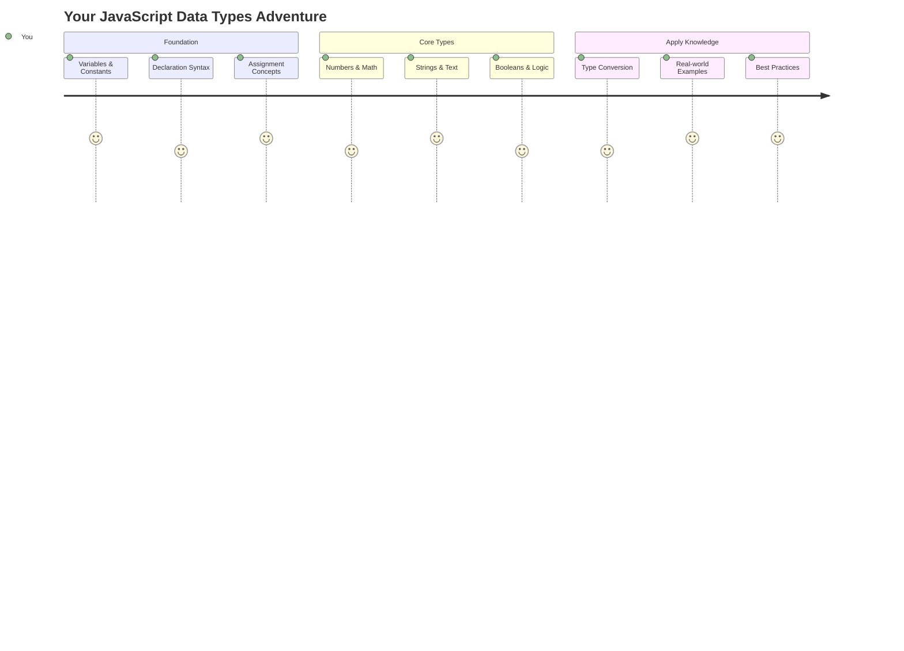
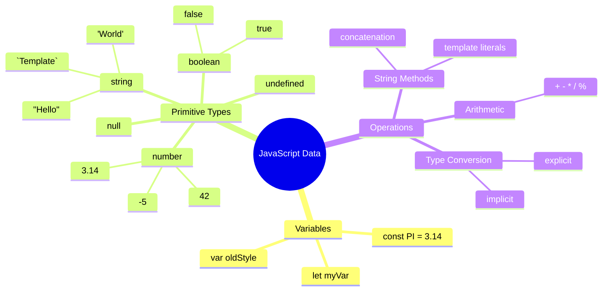
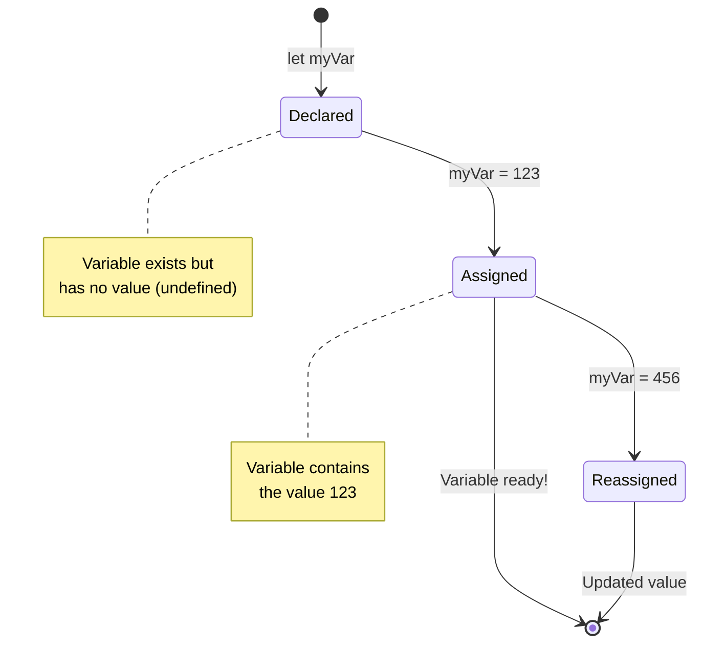
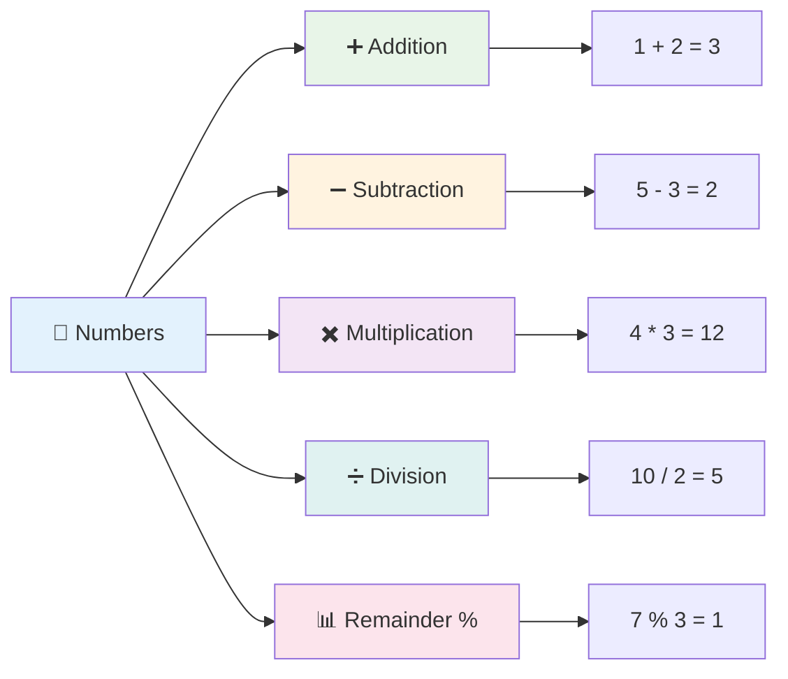
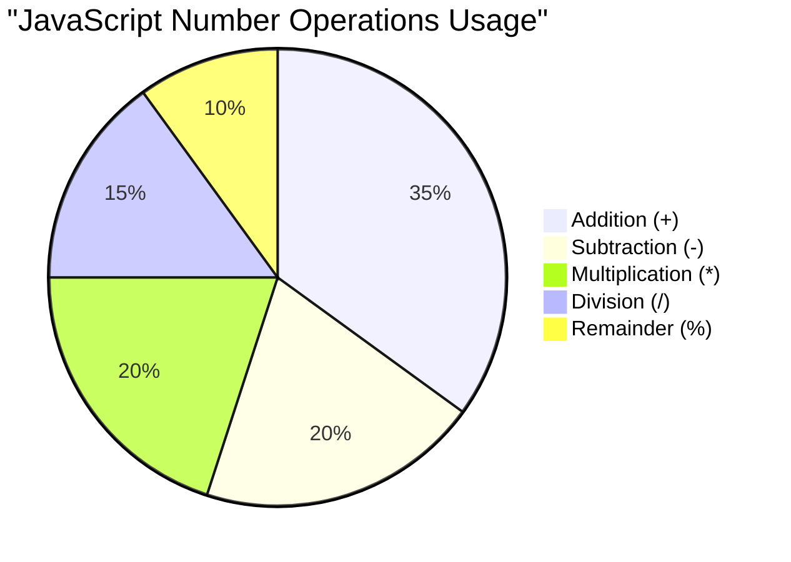
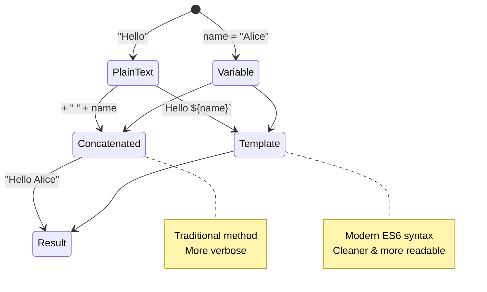
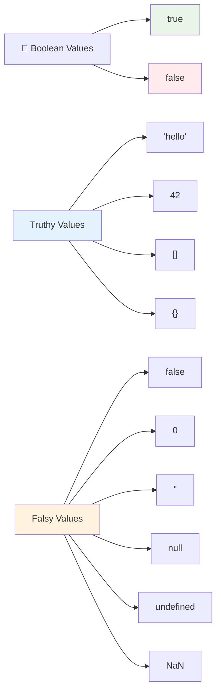
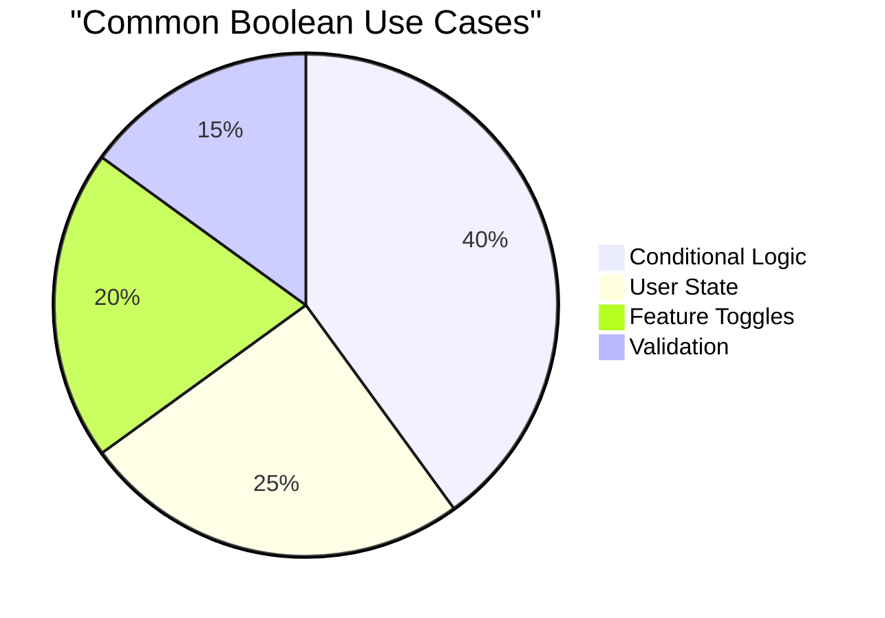
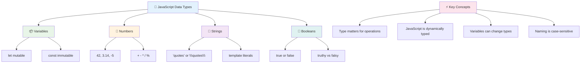
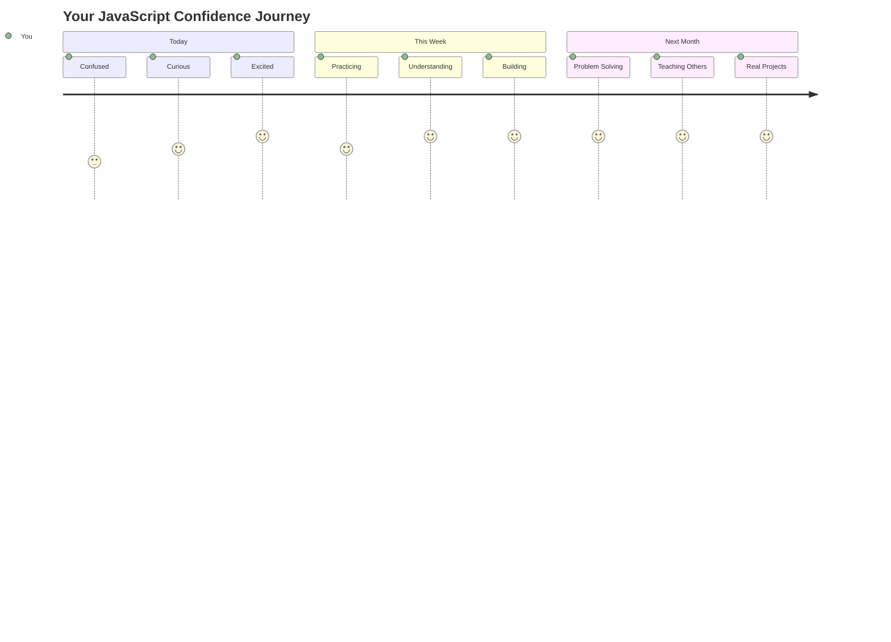

# جاوا اسکرپٹ کی بنیادی باتیں: ڈیٹا کی اقسام


> اسکیچ نوٹ [Tomomi Imura](https://twitter.com/girlie_mac) کی طرف سے



ڈیٹا کی اقسام جاوا اسکرپٹ کے بنیادی تصورات میں سے ایک ہیں جن کا سامنا آپ کو ہر پروگرام میں ہوگا جو آپ لکھتے ہیں۔ ڈیٹا کی اقسام کو قدیم لائبریریوں کے فائلنگ سسٹم کی طرح سمجھیں – ان کے پاس شاعری، ریاضی، اور تاریخی ریکارڈز کے لیے مخصوص جگہیں تھیں۔ جاوا اسکرپٹ معلومات کو اسی طرح مختلف اقسام میں منظم کرتا ہے۔

اس سبق میں، ہم جاوا اسکرپٹ کو چلانے والی بنیادی ڈیٹا کی اقسام کا جائزہ لیں گے۔ آپ سیکھیں گے کہ نمبروں، متن، سچ/جھوٹ کی اقدار کو کیسے سنبھالنا ہے، اور یہ سمجھیں گے کہ آپ کے پروگراموں کے لیے صحیح قسم کا انتخاب کیوں ضروری ہے۔ یہ تصورات شروع میں تجریدی لگ سکتے ہیں، لیکن مشق کے ساتھ، یہ آپ کے لیے آسان ہو جائیں گے۔

ڈیٹا کی اقسام کو سمجھنا جاوا اسکرپٹ میں باقی سب کچھ بہت واضح کر دے گا۔ جیسے معماروں کو گرجا گھر بنانے سے پہلے مختلف تعمیراتی مواد کو سمجھنا ضروری ہوتا ہے، یہ بنیادی باتیں آپ کے آگے بڑھنے والے ہر کام کی حمایت کریں گی۔

## لیکچر سے پہلے کا کوئز
[لیکچر سے پہلے کا کوئز](https://ff-quizzes.netlify.app/web/)

یہ سبق جاوا اسکرپٹ کی بنیادی باتوں کا احاطہ کرتا ہے، وہ زبان جو ویب پر انٹرایکٹیویٹی فراہم کرتی ہے۔

> آپ یہ سبق [Microsoft Learn](https://docs.microsoft.com/learn/modules/web-development-101-variables/?WT.mc_id=academic-77807-sagibbon) پر لے سکتے ہیں!

[](https://youtube.com/watch?v=JNIXfGiDWM8 "جاوا اسکرپٹ میں متغیرات")

[](https://youtube.com/watch?v=AWfA95eLdq8 "جاوا اسکرپٹ میں ڈیٹا کی اقسام")

> 🎥 اوپر دی گئی تصاویر پر کلک کریں تاکہ متغیرات اور ڈیٹا کی اقسام کے بارے میں ویڈیوز دیکھ سکیں

چلیں متغیرات اور ان میں موجود ڈیٹا کی اقسام سے شروع کرتے ہیں!



## متغیرات

متغیرات پروگرامنگ میں بنیادی تعمیراتی بلاکس ہیں۔ جیسے قرون وسطیٰ کے کیمیا دان مختلف مادوں کو ذخیرہ کرنے کے لیے لیبل والے جار استعمال کرتے تھے، متغیرات آپ کو معلومات ذخیرہ کرنے اور اسے ایک وضاحتی نام دینے دیتے ہیں تاکہ آپ بعد میں اس کا حوالہ دے سکیں۔ کسی کی عمر یاد رکھنی ہے؟ اسے `age` نامی متغیر میں ذخیرہ کریں۔ کسی صارف کا نام ٹریک کرنا چاہتے ہیں؟ اسے `userName` نامی متغیر میں رکھیں۔

ہم جاوا اسکرپٹ میں متغیرات بنانے کے جدید طریقے پر توجہ مرکوز کریں گے۔ آپ یہاں جو تکنیک سیکھیں گے وہ زبان کے ارتقاء کے سالوں اور پروگرامنگ کمیونٹی کے ذریعہ تیار کردہ بہترین طریقوں کی نمائندگی کرتی ہیں۔

متغیر بنانے اور **اعلان کرنے** کا درج ذیل نحو ہے **[keyword] [name]**۔ یہ دو حصوں پر مشتمل ہے:

- **کلیدی لفظ**۔ ایسے متغیرات کے لیے `let` استعمال کریں جو تبدیل ہو سکتے ہیں، یا ایسی اقدار کے لیے `const` جو ہمیشہ ایک جیسی رہتی ہیں۔
- **متغیر کا نام**، یہ ایک وضاحتی نام ہے جو آپ خود منتخب کرتے ہیں۔

✅ کلیدی لفظ `let` ES6 میں متعارف کرایا گیا تھا اور آپ کے متغیر کو ایک _بلاک اسکوپ_ دیتا ہے۔ یہ تجویز کیا جاتا ہے کہ آپ `let` یا `const` استعمال کریں بجائے پرانے `var` کلیدی لفظ کے۔ ہم مستقبل کے حصوں میں بلاک اسکوپ کو مزید گہرائی سے کور کریں گے۔

### کام - متغیرات کے ساتھ کام کرنا

1. **متغیر کا اعلان کریں**۔ آئیے اپنا پہلا متغیر بناتے ہیں:

    ```javascript
    let myVariable;
    ```

   **یہ کیا حاصل کرتا ہے:**
   - یہ جاوا اسکرپٹ کو `myVariable` نامی اسٹوریج لوکیشن بنانے کے لیے کہتا ہے
   - جاوا اسکرپٹ اس متغیر کے لیے میموری میں جگہ مختص کرتا ہے
   - متغیر کے پاس فی الحال کوئی قدر نہیں ہے (غیر متعین)

2. **اسے ایک قدر دیں**۔ اب آئیے اپنے متغیر میں کچھ ڈالیں:

    ```javascript
    myVariable = 123;
    ```

   **تفویض کیسے کام کرتی ہے:**
   - `=` آپریٹر ہمارے متغیر کو 123 کی قدر تفویض کرتا ہے
   - متغیر اب اس قدر کو رکھتا ہے بجائے غیر متعین ہونے کے
   - آپ اپنے کوڈ میں اس قدر کا حوالہ دے سکتے ہیں `myVariable` استعمال کرتے ہوئے

   > نوٹ: اس سبق میں `=` کا استعمال ایک "تفویض آپریٹر" کے طور پر کیا جاتا ہے، جو متغیر کو ایک قدر تفویض کرنے کے لیے استعمال ہوتا ہے۔ یہ مساوات کو ظاہر نہیں کرتا۔

3. **سمارٹ طریقہ اختیار کریں**۔ دراصل، آئیے ان دونوں مراحل کو یکجا کریں:

    ```javascript
    let myVariable = 123;
    ```

    **یہ طریقہ زیادہ موثر ہے:**
    - آپ ایک بیان میں متغیر کا اعلان اور قدر تفویض کر رہے ہیں
    - یہ ڈویلپرز کے درمیان معیاری عمل ہے
    - یہ کوڈ کی لمبائی کو کم کرتا ہے جبکہ وضاحت کو برقرار رکھتا ہے

4. **اپنا ارادہ بدلیں**۔ اگر ہم کوئی مختلف نمبر ذخیرہ کرنا چاہتے ہیں تو کیا ہوگا؟

   ```javascript
   myVariable = 321;
   ```

   **دوبارہ تفویض کو سمجھنا:**
   - متغیر اب 321 رکھتا ہے بجائے 123 کے
   - پچھلی قدر کو تبدیل کر دیا گیا ہے – متغیرات ایک وقت میں صرف ایک قدر ذخیرہ کرتے ہیں
   - یہ تبدیلی متغیرات کے ساتھ `let` کے ذریعے اعلان کردہ کلیدی خصوصیت ہے

   ✅ اسے آزمائیں! آپ اپنے براؤزر میں جاوا اسکرپٹ لکھ سکتے ہیں۔ ایک براؤزر ونڈو کھولیں اور ڈیولپر ٹولز پر جائیں۔ کنسول میں، آپ کو ایک پرامپٹ ملے گا؛ `let myVariable = 123` ٹائپ کریں، ریٹرن دبائیں، پھر `myVariable` ٹائپ کریں۔ کیا ہوتا ہے؟ نوٹ کریں، آپ ان تصورات کے بارے میں مزید اگلے اسباق میں سیکھیں گے۔

### 🧠 **متغیرات کی مہارت چیک: آرام دہ ہونا**

**آئیے دیکھتے ہیں کہ آپ متغیرات کے بارے میں کیسا محسوس کر رہے ہیں:**
- کیا آپ متغیر کے اعلان اور تفویض کے درمیان فرق کی وضاحت کر سکتے ہیں؟
- اگر آپ کسی متغیر کو اعلان کرنے سے پہلے استعمال کرنے کی کوشش کریں تو کیا ہوتا ہے؟
- آپ `let` کو `const` پر کب ترجیح دیں گے؟



> **جلدی سے مشورہ**: متغیرات کو لیبل والے اسٹوریج باکسز کے طور پر سوچیں۔ آپ باکس بناتے ہیں (`let`)، اس میں کچھ ڈالتے ہیں (`=`)، اور بعد میں اگر ضرورت ہو تو مواد کو تبدیل کر سکتے ہیں!

## مستقلات

کبھی کبھی آپ کو ایسی معلومات ذخیرہ کرنے کی ضرورت ہوتی ہے جو پروگرام کے دوران کبھی تبدیل نہ ہو۔ مستقلات کو ان ریاضیاتی اصولوں کی طرح سمجھیں جو یورپ میں قدیم یونان میں قائم کیے گئے تھے – ایک بار ثابت اور دستاویزی، وہ تمام مستقبل کے حوالہ کے لیے مستقل رہے۔

مستقلات متغیرات کی طرح کام کرتے ہیں، لیکن ایک اہم پابندی کے ساتھ: ایک بار جب آپ ان کی قدر تفویض کرتے ہیں، تو اسے تبدیل نہیں کیا جا سکتا۔ یہ غیر متغیر خصوصیت آپ کے پروگرام میں اہم اقدار کو حادثاتی ترمیم سے بچانے میں مدد کرتی ہے۔

مستقل کے اعلان اور ابتدائیہ وہی تصورات پر عمل کرتے ہیں جیسے متغیر، سوائے `const` کلیدی لفظ کے۔ مستقلات عام طور پر تمام بڑے حروف کے ساتھ اعلان کیے جاتے ہیں۔

```javascript
const MY_VARIABLE = 123;
```

**یہ کوڈ کیا کرتا ہے:**
- **ایک مستقل** `MY_VARIABLE` نامی 123 کی قدر کے ساتھ بناتا ہے
- **بڑے حروف کے نام دینے کے کنونشن** کا استعمال کرتا ہے مستقلات کے لیے
- **کسی بھی مستقبل کی تبدیلیوں کو روکتا ہے** اس قدر میں

مستقلات کے دو اہم اصول ہیں:

- **آپ کو انہیں فوراً ایک قدر دینی ہوگی** – خالی مستقلات کی اجازت نہیں ہے!
- **آپ اس قدر کو کبھی تبدیل نہیں کر سکتے** – جاوا اسکرپٹ آپ کو ایسا کرنے کی کوشش پر ایک غلطی دے گا۔ آئیے دیکھتے ہیں کہ میرا مطلب کیا ہے:

   **سادہ قدر** - درج ذیل کی اجازت نہیں ہے:
   
      ```javascript
      const PI = 3;
      PI = 4; // اجازت نہیں ہے
      ```

   **آپ کو کیا یاد رکھنا ہے:**
   - **مستقل کو دوبارہ تفویض کرنے کی کوششیں** ایک غلطی کا سبب بنیں گی
   - **اہم اقدار کو حادثاتی تبدیلیوں سے بچاتا ہے**
   - **یقینی بناتا ہے** کہ قدر آپ کے پروگرام کے دوران مستقل رہے

   **آبجیکٹ حوالہ محفوظ ہے** - درج ذیل کی اجازت نہیں ہے:
   
      ```javascript
      const obj = { a: 3 };
      obj = { b: 5 } // اجازت نہیں ہے
      ```

   **ان تصورات کو سمجھنا:**
   - **پورے آبجیکٹ کو ایک نئے سے تبدیل کرنے سے روکتا ہے**
   - **اصل آبجیکٹ کے حوالہ کو محفوظ رکھتا ہے**
   - **میموری میں آبجیکٹ کی شناخت کو برقرار رکھتا ہے**

    **آبجیکٹ کی قدر محفوظ نہیں ہے** - درج ذیل کی اجازت ہے:
    
      ```javascript
      const obj = { a: 3 };
      obj.a = 5;  // اجازت ہے
      ```

      **یہاں کیا ہوتا ہے:**
      - **آبجیکٹ کے اندر پراپرٹی کی قدر کو تبدیل کرتا ہے**
      - **وہی آبجیکٹ حوالہ رکھتا ہے**
      - **دکھاتا ہے کہ آبجیکٹ کے مواد تبدیل ہو سکتے ہیں جبکہ حوالہ مستقل رہتا ہے**

   > نوٹ کریں، `const` کا مطلب ہے کہ حوالہ دوبارہ تفویض سے محفوظ ہے۔ قدر _غیر متغیر_ نہیں ہے اور تبدیل ہو سکتی ہے، خاص طور پر اگر یہ ایک پیچیدہ ساخت جیسے آبجیکٹ ہو۔

## ڈیٹا کی اقسام

جاوا اسکرپٹ معلومات کو مختلف اقسام میں منظم کرتا ہے جنہیں ڈیٹا کی اقسام کہا جاتا ہے۔ یہ تصور اس طرح ہے جیسے قدیم علماء نے علم کو مختلف اقسام میں تقسیم کیا – ارسطو نے مختلف قسم کی دلیلوں کے درمیان فرق کیا، یہ جانتے ہوئے کہ منطقی اصول شاعری، ریاضی، اور قدرتی فلسفہ پر یکساں طور پر لاگو نہیں ہو سکتے۔

ڈیٹا کی اقسام اہم ہیں کیونکہ مختلف آپریشنز مختلف قسم کی معلومات کے ساتھ کام کرتے ہیں۔ جیسے آپ کسی شخص کے نام پر ریاضی نہیں کر سکتے یا کسی ریاضیاتی مساوات کو حروف تہجی کے مطابق ترتیب نہیں دے سکتے، جاوا اسکرپٹ ہر آپریشن کے لیے مناسب ڈیٹا کی قسم کی ضرورت ہوتی ہے۔ اسے سمجھنا غلطیوں کو روکتا ہے اور آپ کے کوڈ کو زیادہ قابل اعتماد بناتا ہے۔

متغیرات مختلف قسم کی اقدار ذخیرہ کر سکتے ہیں، جیسے نمبر اور متن۔ ان مختلف قسم کی اقدار کو **ڈیٹا کی قسم** کہا جاتا ہے۔ ڈیٹا کی اقسام سافٹ ویئر ڈویلپمنٹ کا ایک اہم حصہ ہیں کیونکہ یہ ڈویلپرز کو یہ فیصلہ کرنے میں مدد دیتی ہیں کہ کوڈ کیسے لکھا جانا چاہیے اور سافٹ ویئر کیسے چلنا چاہیے۔ مزید برآں، کچھ ڈیٹا کی اقسام میں منفرد خصوصیات ہوتی ہیں جو کسی قدر میں اضافی معلومات کو تبدیل کرنے یا نکالنے میں مدد کرتی ہیں۔

✅ ڈیٹا کی اقسام کو جاوا اسکرپٹ ڈیٹا پرائمٹیوز بھی کہا جاتا ہے، کیونکہ یہ زبان کے ذریعہ فراہم کردہ سب سے کم سطح کی ڈیٹا کی اقسام ہیں۔ 7 پرائمٹیو ڈیٹا کی اقسام ہیں: string, number, bigint, boolean, undefined, null اور symbol۔ ایک لمحہ نکال کر تصور کریں کہ ان میں سے ہر ایک پرائمٹیو کیا ظاہر کر سکتا ہے۔ `zebra` کیا ہے؟ `0` کے بارے میں کیا خیال ہے؟ `true`؟

### نمبر

نمبر جاوا اسکرپٹ میں سب سے سیدھی ڈیٹا کی قسم ہیں۔ چاہے آپ پورے نمبر جیسے 42، اعشاریہ جیسے 3.14، یا منفی نمبر جیسے -5 کے ساتھ کام کر رہے ہوں، جاوا اسکرپٹ انہیں یکساں طور پر سنبھالتا ہے۔

ہمارے پہلے متغیر کو یاد رکھیں؟ وہ 123 جو ہم نے ذخیرہ کیا تھا دراصل ایک نمبر ڈیٹا کی قسم تھی:

```javascript
let myVariable = 123;
```

**اہم خصوصیات:**
- جاوا اسکرپٹ خود بخود عددی اقدار کو پہچانتا ہے
- آپ ان متغیرات کے ساتھ ریاضی کے آپریشنز انجام دے سکتے ہیں
- کسی واضح قسم کے اعلان کی ضرورت نہیں ہے

متغیرات تمام قسم کے نمبر ذخیرہ کر سکتے ہیں، بشمول اعشاریہ یا منفی نمبر۔ نمبر ریاضیاتی آپریٹرز کے ساتھ بھی استعمال کیے جا سکتے ہیں، جو [اگلے حصے](../../../../2-js-basics/1-data-types) میں شامل ہیں۔



### ریاضیاتی آپریٹرز

ریاضیاتی آپریٹرز آپ کو جاوا اسکرپٹ میں ریاضیاتی حسابات انجام دینے کی اجازت دیتے ہیں۔ یہ آپریٹرز وہی اصول استعمال کرتے ہیں جو صدیوں سے ریاضی دان استعمال کرتے آئے ہیں – وہی علامتیں جو علماء جیسے الخوارزمی کے کاموں میں ظاہر ہوئیں، جنہوں نے الجبری علامتیں تیار کیں۔

یہ آپریٹرز وہی کام کرتے ہیں جو آپ روایتی ریاضی سے توقع کرتے ہیں: جمع کے لیے پلس، تفریق کے لیے مائنس، وغیرہ۔

ریاضیاتی افعال انجام دیتے وقت استعمال کرنے کے لیے کئی قسم کے آپریٹرز ہیں، اور ان میں سے کچھ یہاں درج ہیں:

| علامت | وضاحت                                                                  | مثال                              |
| ------ | ------------------------------------------------------------------------ | -------------------------------- |
| `+`    | **جمع**: دو نمبروں کا مجموعہ نکالتا ہے                                  | `1 + 2 //متوقع جواب 3 ہے`       |
| `-`    | **تفریق**: دو نمبروں کا فرق نکالتا ہے                                   | `1 - 2 //متوقع جواب -1 ہے`      |
| `*`    | **ضرب**: دو نمبروں کی پیداوار نکالتا ہے                                  | `1 * 2 //متوقع جواب 2 ہے`       |
| `/`    | **تقسیم**: دو نمبروں کا حاصل ضرب نکالتا ہے                              | `1 / 2 //متوقع جواب 0.5 ہے`     |
| `%`    | **باقی**: دو نمبروں کی تقسیم سے باقی نکالتا ہے                          | `1 % 2 //متوقع جواب 1 ہے`       |

✅ اسے آزمائیں! اپنے براؤزر کے کنسول میں ایک ریاضیاتی آپریشن آزمائیں۔ کیا نتائج نے آپ کو حیران کیا؟

### 🧮 **ریاضی کی مہارت چیک: اعتماد کے ساتھ حساب لگانا**

**اپنی ریاضی کی سمجھ کو جانچیں:**
- `/` (تقسیم) اور `%` (باقی) کے درمیان کیا فرق ہے؟
- کیا آپ پیش گوئی کر سکتے ہیں کہ `10 % 3` کیا ہوگا؟ (اشارہ: یہ 3.33 نہیں ہے...)
- پروگرامنگ میں باقی آپریٹر کیوں مفید ہو سکتا ہے؟



> **حقیقی دنیا کی بصیرت**: باقی آپریٹر (%) نمبروں کو جفت/طاق چیک کرنے، پیٹرن بنانے، یا آرے کے ذریعے سائیکل کرنے کے لیے بہت مفید ہے!

### سٹرنگز

جاوا اسکرپٹ میں، متنی ڈیٹا کو سٹرنگز کے طور پر ظاہر کیا جاتا ہے۔ "سٹرنگ" کی اصطلاح کرداروں کو ترتیب میں جوڑنے کے تصور سے آتی ہے، بالکل اسی طرح جیسے قرون وسطیٰ کے خانقاہوں میں کاتب حروف کو جوڑ کر اپنے مخطوطات میں الفاظ اور جملے بناتے تھے۔

سٹرنگز ویب ڈویلپمنٹ کے لیے بنیادی ہیں۔ ویب سائٹ پر دکھایا گیا ہر متن – صارف کے نام، بٹن کے لیبل، غلطی کے پیغامات، مواد – کو سٹرنگ ڈیٹا کے طور پر سنبھالا جاتا ہے۔ فعال یوزر انٹرفیس بنانے کے لیے سٹرنگز کو سمجھنا ضروری ہے۔

سٹرنگز وہ کرداروں کے سیٹ ہیں جو سنگل یا ڈبل کوٹس کے درمیان ہوتے ہیں۔

```javascript
'This is a string'
"This is also a string"
let myString = 'This is a string value stored in a variable';
```

**ان تصورات کو سمجھنا:**
- **سنگل کوٹس `'` یا ڈبل کوٹس `"` کا استعمال کرتا ہے** سٹرنگز کو بیان کرنے کے لیے
- **متن کا ڈیٹا ذخیرہ کرتا ہے** جس میں حروف، نمبر، اور علامتیں شامل ہو سکتی ہیں
- **متغیرات کو سٹرنگ کی اقدار تفویض کرتا ہے** تاکہ بعد میں استعمال کیا جا سکے
- **
دو یا زیادہ strings کو **جوڑنے** یا اکٹھا کرنے کے لیے، `+` آپریٹر استعمال کریں۔

```javascript
let myString1 = "Hello";
let myString2 = "World";

myString1 + myString2 + "!"; //HelloWorld!
myString1 + " " + myString2 + "!"; //Hello World!
myString1 + ", " + myString2 + "!"; //Hello, World!
```

**مرحلہ وار، یہاں کیا ہو رہا ہے:**
- **مختلف strings کو** `+` آپریٹر کے ذریعے جوڑنا
- **strings کو** پہلے مثال میں بغیر اسپیس کے براہ راست جوڑنا
- **پڑھنے میں آسانی کے لیے** strings کے درمیان اسپیس کردار `" "` شامل کرنا
- **صحیح فارمیٹنگ کے لیے** کاما جیسے علامات شامل کرنا

✅ کیوں `1 + 1 = 2` جاوا اسکرپٹ میں ہوتا ہے، لیکن `'1' + '1' = 11؟` اس بارے میں سوچیں۔ اور `'1' + 1` کے بارے میں کیا خیال ہے؟

**ٹیمپلیٹ لیٹرلز** strings کو فارمیٹ کرنے کا ایک اور طریقہ ہیں، لیکن یہاں quotes کے بجائے backtick استعمال ہوتا ہے۔ جو کچھ بھی plain text نہیں ہے اسے placeholders `${ }` کے اندر رکھا جاتا ہے۔ اس میں وہ تمام متغیرات شامل ہیں جو strings ہو سکتے ہیں۔

```javascript
let myString1 = "Hello";
let myString2 = "World";

`${myString1} ${myString2}!` //Hello World!
`${myString1}, ${myString2}!` //Hello, World!
```

**آئیے ہر حصہ سمجھتے ہیں:**
- **بیک ٹکس** `` ` `` استعمال کرتا ہے عام quotes کے بجائے ٹیمپلیٹ لیٹرلز بنانے کے لیے
- **متغیرات کو** براہ راست `${}` placeholder syntax کے ذریعے شامل کرتا ہے
- **اسپیس اور فارمیٹنگ کو** بالکل ویسا ہی محفوظ رکھتا ہے جیسا لکھا گیا ہے
- **ایک صاف طریقہ فراہم کرتا ہے** پیچیدہ strings کو متغیرات کے ساتھ بنانے کے لیے

آپ اپنی فارمیٹنگ کے اہداف دونوں طریقوں سے حاصل کر سکتے ہیں، لیکن ٹیمپلیٹ لیٹرلز اسپیس اور لائن بریکس کا احترام کریں گے۔

✅ آپ ٹیمپلیٹ لیٹرل کب استعمال کریں گے اور plain string کب؟

### 🔤 **String مہارت چیک: متن میں تبدیلی کا اعتماد**

**اپنی string مہارت کا جائزہ لیں:**
- کیا آپ وضاحت کر سکتے ہیں کہ `'1' + '1'` کیوں `'11'` کے برابر ہے نہ کہ `2`؟
- آپ کو کون سا string طریقہ زیادہ پڑھنے کے قابل لگتا ہے: concatenation یا template literals؟
- اگر آپ string کے ارد گرد quotes بھول جائیں تو کیا ہوتا ہے؟



> **پرو ٹپ**: ٹیمپلیٹ لیٹرلز عام طور پر پیچیدہ string بنانے کے لیے ترجیح دی جاتی ہیں کیونکہ وہ زیادہ پڑھنے کے قابل ہیں اور multi-line strings کو خوبصورتی سے ہینڈل کرتے ہیں!

### Booleans

Booleans ڈیٹا کی سب سے سادہ شکل کی نمائندگی کرتے ہیں: یہ صرف دو قدریں رکھ سکتے ہیں – `true` یا `false`۔ یہ binary logic system 19ویں صدی کے ریاضی دان George Boole کے کام سے جڑا ہوا ہے، جنہوں نے Boolean algebra تیار کی۔

ان کی سادگی کے باوجود، booleans پروگرام کی منطق کے لیے ضروری ہیں۔ یہ آپ کے کوڈ کو حالات کی بنیاد پر فیصلے کرنے کے قابل بناتے ہیں – چاہے صارف لاگ ان ہو، کوئی بٹن کلک کیا گیا ہو، یا کچھ شرائط پوری ہوں۔

Booleans صرف دو قدریں رکھ سکتے ہیں: `true` یا `false`۔ Booleans ان حالات میں فیصلے کرنے میں مدد کرتے ہیں کہ کون سی کوڈ لائنز چلنی چاہئیں۔ بہت سے معاملات میں، [operators](../../../../2-js-basics/1-data-types) Boolean کی قدر کو سیٹ کرنے میں مدد کرتے ہیں اور آپ اکثر متغیرات کو ابتدائی یا ان کی قدریں آپریٹر کے ساتھ اپ ڈیٹ کرتے ہوئے دیکھیں گے۔

```javascript
let myTrueBool = true;
let myFalseBool = false;
```

**اوپر، ہم نے:**
- **ایک متغیر بنایا** جو Boolean قدر `true` کو محفوظ کرتا ہے
- **دکھایا** کہ Boolean قدر `false` کو کیسے محفوظ کریں
- **بالکل وہی keywords استعمال کیے** `true` اور `false` (کوئی quotes کی ضرورت نہیں)
- **ان متغیرات کو تیار کیا** conditional statements میں استعمال کے لیے

✅ ایک متغیر 'truthy' سمجھا جا سکتا ہے اگر وہ Boolean `true` میں تبدیل ہو۔ دلچسپ بات یہ ہے کہ جاوا اسکرپٹ میں، [تمام قدریں truthy ہیں جب تک کہ وہ falsy کے طور پر بیان نہ کی جائیں](https://developer.mozilla.org/docs/Glossary/Truthy)۔



### 🎯 **Boolean منطق چیک: فیصلہ سازی کی مہارت**

**اپنی boolean سمجھ کو آزمائیں:**
- آپ کیوں سوچتے ہیں کہ جاوا اسکرپٹ میں `true` اور `false` کے علاوہ "truthy" اور "falsy" قدریں ہیں؟
- کیا آپ پیش گوئی کر سکتے ہیں کہ ان میں سے کون سی falsy ہے: `0`, `"0"`, `[]`, `"false"`؟
- booleans پروگرام کے flow کو کنٹرول کرنے میں کیسے مفید ہو سکتے ہیں؟



> **یاد رکھیں**: جاوا اسکرپٹ میں صرف 6 قدریں falsy ہیں: `false`, `0`, `""`, `null`, `undefined`, اور `NaN`۔ باقی سب truthy ہیں!

---

## 📊 **آپ کا ڈیٹا ٹائپس ٹول کٹ خلاصہ**



## GitHub Copilot Agent Challenge 🚀

Agent mode استعمال کریں اور درج ذیل چیلنج مکمل کریں:

**تفصیل:** ایک personal information manager بنائیں جو اس سبق میں سیکھے گئے تمام جاوا اسکرپٹ ڈیٹا ٹائپس کو حقیقی دنیا کے ڈیٹا منظرناموں کو ہینڈل کرتے ہوئے ظاہر کرے۔

**Prompt:** ایک جاوا اسکرپٹ پروگرام بنائیں جو ایک user profile object بنائے جس میں شامل ہو: ایک شخص کا نام (string)، عمر (number)، طالب علم ہونے کی حیثیت (boolean)، پسندیدہ رنگوں کی ایک array، اور ایک address object جس میں street، city، اور zip code کی خصوصیات ہوں۔ پروفائل معلومات دکھانے اور انفرادی fields کو اپ ڈیٹ کرنے کے لیے functions شامل کریں۔ string concatenation، template literals، عمر کے ساتھ arithmetic operations، اور طالب علم کی حیثیت کے لیے boolean logic کو ظاہر کریں۔

Agent mode کے بارے میں مزید جانیں [یہاں](https://code.visualstudio.com/blogs/2025/02/24/introducing-copilot-agent-mode)۔

## 🚀 چیلنج

جاوا اسکرپٹ کے کچھ رویے ہیں جو ڈویلپرز کو حیران کر سکتے ہیں۔ یہاں ایک کلاسک مثال ہے: اپنے براؤزر کنسول میں یہ ٹائپ کریں: `let age = 1; let Age = 2; age == Age` اور نتیجہ دیکھیں۔ یہ `false` واپس کرتا ہے – کیا آپ اس کی وجہ معلوم کر سکتے ہیں؟

یہ جاوا اسکرپٹ کے بہت سے رویوں میں سے ایک ہے جسے سمجھنا ضروری ہے۔ ان عجیب و غریب پہلوؤں سے واقفیت آپ کو زیادہ قابل اعتماد کوڈ لکھنے اور مسائل کو مؤثر طریقے سے ڈیبگ کرنے میں مدد دے گی۔

## Post-Lecture Quiz
[Post-lecture quiz](https://ff-quizzes.netlify.app)

## جائزہ اور خود مطالعہ

[جاوا اسکرپٹ مشقوں کی اس فہرست](https://css-tricks.com/snippets/javascript/) کو دیکھیں اور ایک آزمائیں۔ آپ نے کیا سیکھا؟

## Assignment

[ڈیٹا ٹائپس پریکٹس](assignment.md)

## 🚀 آپ کا جاوا اسکرپٹ ڈیٹا ٹائپس مہارت کا ٹائم لائن

### ⚡ **آپ اگلے 5 منٹ میں کیا کر سکتے ہیں**
- [ ] اپنے براؤزر کنسول کو کھولیں اور مختلف ڈیٹا ٹائپس کے ساتھ 3 متغیرات بنائیں
- [ ] چیلنج آزمائیں: `let age = 1; let Age = 2; age == Age` اور معلوم کریں کہ یہ false کیوں ہے
- [ ] اپنے نام اور پسندیدہ نمبر کے ساتھ string concatenation کی مشق کریں
- [ ] آزمائیں کہ جب آپ string میں نمبر شامل کرتے ہیں تو کیا ہوتا ہے

### 🎯 **آپ اس گھنٹے میں کیا حاصل کر سکتے ہیں**
- [ ] سبق کے بعد کا کوئز مکمل کریں اور کسی بھی الجھن والے تصورات کا جائزہ لیں
- [ ] ایک منی کیلکولیٹر بنائیں جو دو نمبروں کو جمع، تفریق، ضرب، اور تقسیم کرے
- [ ] ٹیمپلیٹ لیٹرلز استعمال کرتے ہوئے ایک سادہ نام فارمیٹر بنائیں
- [ ] `==` اور `===` موازنہ آپریٹرز کے فرق کو دریافت کریں
- [ ] مختلف ڈیٹا ٹائپس کے درمیان تبدیل کرنے کی مشق کریں

### 📅 **آپ کی ہفتہ بھر کی جاوا اسکرپٹ بنیاد**
- [ ] اعتماد اور تخلیقی صلاحیت کے ساتھ اسائنمنٹ مکمل کریں
- [ ] تمام سیکھے گئے ڈیٹا ٹائپس کا استعمال کرتے ہوئے ایک personal profile object بنائیں
- [ ] [CSS-Tricks سے جاوا اسکرپٹ مشقوں](https://css-tricks.com/snippets/javascript/) کے ساتھ مشق کریں
- [ ] Boolean logic استعمال کرتے ہوئے ایک سادہ فارم validator بنائیں
- [ ] array اور object ڈیٹا ٹائپس کے ساتھ تجربہ کریں (آنے والے اسباق کا پیش نظارہ)
- [ ] جاوا اسکرپٹ کمیونٹی میں شامل ہوں اور ڈیٹا ٹائپس کے بارے میں سوالات پوچھیں

### 🌟 **آپ کی مہینہ بھر کی تبدیلی**
- [ ] ڈیٹا ٹائپس کے علم کو بڑے پروگرامنگ پروجیکٹس میں شامل کریں
- [ ] حقیقی ایپلیکیشنز میں ہر ڈیٹا ٹائپ کو استعمال کرنے کا وقت اور وجہ سمجھیں
- [ ] دوسرے ابتدائی افراد کو جاوا اسکرپٹ کے بنیادی اصول سمجھنے میں مدد کریں
- [ ] ایک چھوٹا ایپلیکیشن بنائیں جو مختلف قسم کے صارف ڈیٹا کو منظم کرے
- [ ] advanced ڈیٹا ٹائپ تصورات جیسے type coercion اور strict equality کو دریافت کریں
- [ ] اوپن سورس جاوا اسکرپٹ پروجیکٹس میں دستاویزات کی بہتری کے ساتھ تعاون کریں

### 🧠 **آخری ڈیٹا ٹائپس مہارت چیک ان**

**اپنی جاوا اسکرپٹ بنیاد کا جشن منائیں:**
- کون سا ڈیٹا ٹائپ آپ کو سب سے زیادہ حیران کر گیا اس کے رویے کے لحاظ سے؟
- آپ متغیرات اور constants کو دوست کو سمجھانے میں کتنا آرام دہ محسوس کرتے ہیں؟
- جاوا اسکرپٹ کے ٹائپ سسٹم کے بارے میں آپ نے سب سے دلچسپ چیز کیا دریافت کی؟
- آپ ان بنیادی اصولوں کے ساتھ کون سی حقیقی دنیا کی ایپلیکیشن بنانے کا تصور کر سکتے ہیں؟



> 💡 **آپ نے بنیاد بنا لی ہے!** ڈیٹا ٹائپس کو سمجھنا کہانی لکھنے سے پہلے حروف تہجی سیکھنے جیسا ہے۔ ہر جاوا اسکرپٹ پروگرام جو آپ کبھی لکھیں گے ان بنیادی تصورات کو استعمال کرے گا۔ آپ کے پاس اب انٹرایکٹو ویب سائٹس، متحرک ایپلیکیشنز، اور کوڈ کے ذریعے حقیقی دنیا کے مسائل حل کرنے کے لیے عمارت کے بلاکس ہیں۔ جاوا اسکرپٹ کی شاندار دنیا میں خوش آمدید! 🎉

---

**اعلانِ لاتعلقی**:  
یہ دستاویز AI ترجمہ سروس [Co-op Translator](https://github.com/Azure/co-op-translator) کا استعمال کرتے ہوئے ترجمہ کی گئی ہے۔ ہم درستگی کی بھرپور کوشش کرتے ہیں، لیکن براہ کرم آگاہ رہیں کہ خودکار ترجمے میں غلطیاں یا غیر درستیاں ہو سکتی ہیں۔ اصل دستاویز کو اس کی اصل زبان میں مستند ذریعہ سمجھا جانا چاہیے۔ اہم معلومات کے لیے، پیشہ ور انسانی ترجمہ کی سفارش کی جاتی ہے۔ اس ترجمے کے استعمال سے پیدا ہونے والی کسی بھی غلط فہمی یا غلط تشریح کے لیے ہم ذمہ دار نہیں ہیں۔