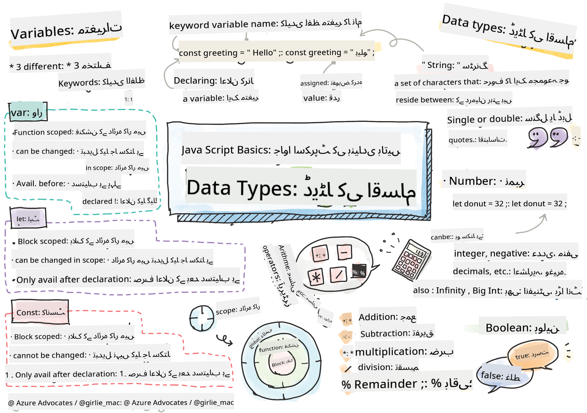

<!--
CO_OP_TRANSLATOR_METADATA:
{
  "original_hash": "fc6aef8ecfdd5b0ad2afa6e6ba52bfde",
  "translation_date": "2025-08-25T21:52:08+00:00",
  "source_file": "2-js-basics/1-data-types/README.md",
  "language_code": "ur"
}
-->
# جاوا اسکرپٹ کی بنیادی باتیں: ڈیٹا ٹائپس

  
> اسکیچ نوٹ از [Tomomi Imura](https://twitter.com/girlie_mac)

## لیکچر سے پہلے کا کوئز  
[لیکچر سے پہلے کا کوئز](https://ashy-river-0debb7803.1.azurestaticapps.net/quiz/7)

یہ سبق جاوا اسکرپٹ کی بنیادی باتوں کا احاطہ کرتا ہے، جو ویب پر انٹرایکٹیویٹی فراہم کرتا ہے۔

> آپ یہ سبق [Microsoft Learn](https://docs.microsoft.com/learn/modules/web-development-101-variables/?WT.mc_id=academic-77807-sagibbon) پر لے سکتے ہیں!

[](https://youtube.com/watch?v=JNIXfGiDWM8 "جاوا اسکرپٹ میں ویری ایبلز")  

[](https://youtube.com/watch?v=AWfA95eLdq8 "جاوا اسکرپٹ میں ڈیٹا ٹائپس")  

> 🎥 اوپر دی گئی تصاویر پر کلک کریں ویری ایبلز اور ڈیٹا ٹائپس کے بارے میں ویڈیوز دیکھنے کے لیے  

چلیں ویری ایبلز اور ان کے اندر موجود ڈیٹا ٹائپس سے شروعات کرتے ہیں!

## ویری ایبلز

ویری ایبلز وہ قدریں محفوظ کرتے ہیں جنہیں آپ اپنے کوڈ میں استعمال اور تبدیل کر سکتے ہیں۔

ویری ایبل کو **ڈکلیئر** کرنے کا درج ذیل نحو ہے: **[keyword] [name]**۔ یہ دو حصوں پر مشتمل ہوتا ہے:

- **کی ورڈ**۔ کی ورڈز `let` یا `var` ہو سکتے ہیں۔  

✅ کی ورڈ `let` کو ES6 میں متعارف کرایا گیا تھا اور یہ آپ کے ویری ایبل کو _بلاک اسکوپ_ فراہم کرتا ہے۔ `let` کو `var` پر ترجیح دینے کی سفارش کی جاتی ہے۔ ہم بلاک اسکوپس کو آئندہ حصوں میں مزید تفصیل سے کور کریں گے۔  
- **ویری ایبل کا نام**، یہ وہ نام ہے جو آپ خود منتخب کرتے ہیں۔

### کام - ویری ایبلز کے ساتھ کام کرنا

1. **ویری ایبل ڈکلیئر کریں**۔ `let` کی ورڈ کا استعمال کرتے ہوئے ایک ویری ایبل ڈکلیئر کریں:

    ```javascript
    let myVariable;
    ```

   `myVariable` کو اب `let` کی ورڈ کا استعمال کرتے ہوئے ڈکلیئر کیا گیا ہے۔ اس وقت اس کی کوئی ویلیو نہیں ہے۔

1. **ویلیو تفویض کریں**۔ ویری ایبل میں ویلیو محفوظ کرنے کے لیے `=` آپریٹر کا استعمال کریں، اس کے بعد متوقع ویلیو لکھیں۔

    ```javascript
    myVariable = 123;
    ```

   > نوٹ: اس سبق میں `=` کا مطلب "اسائنمنٹ آپریٹر" ہے، جو ویری ایبل کو ویلیو تفویض کرنے کے لیے استعمال ہوتا ہے۔ یہ برابری کو ظاہر نہیں کرتا۔

   `myVariable` کو اب ویلیو 123 کے ساتھ *انیشیالائز* کیا گیا ہے۔

1. **ریفیکٹر کریں**۔ اپنے کوڈ کو درج ذیل بیان سے تبدیل کریں۔

    ```javascript
    let myVariable = 123;
    ```

    جب ویری ایبل کو ڈکلیئر کیا جاتا ہے اور اسی وقت ویلیو تفویض کی جاتی ہے تو اسے _ایکسپلیسِٹ انیشیالائزیشن_ کہا جاتا ہے۔

1. **ویری ایبل کی ویلیو تبدیل کریں**۔ ویری ایبل کی ویلیو کو درج ذیل طریقے سے تبدیل کریں:

   ```javascript
   myVariable = 321;
   ```

   ایک بار ویری ایبل ڈکلیئر ہو جائے تو آپ کوڈ میں کسی بھی وقت `=` آپریٹر اور نئی ویلیو کے ساتھ اس کی ویلیو تبدیل کر سکتے ہیں۔

   ✅ آزمائیں! آپ اپنے براؤزر میں براہ راست جاوا اسکرپٹ لکھ سکتے ہیں۔ ایک براؤزر ونڈو کھولیں اور ڈیولپر ٹولز پر جائیں۔ کنسول میں ایک پرامپٹ ہوگا؛ `let myVariable = 123` ٹائپ کریں، انٹر دبائیں، پھر `myVariable` ٹائپ کریں۔ کیا ہوتا ہے؟ نوٹ کریں، آپ ان تصورات کے بارے میں مزید آئندہ اسباق میں سیکھیں گے۔

## کانسٹینٹس

کانسٹینٹ کو ڈکلیئر اور انیشیالائز کرنے کے اصول ویری ایبلز جیسے ہی ہیں، سوائے اس کے کہ `const` کی ورڈ استعمال کی جاتی ہے۔ کانسٹینٹس کو عام طور پر تمام حروف بڑے (uppercase) میں ڈکلیئر کیا جاتا ہے۔

```javascript
const MY_VARIABLE = 123;
```

کانسٹینٹس ویری ایبلز کی طرح ہیں، لیکن دو استثناؤں کے ساتھ:

- **ویلیو ہونی چاہیے**۔ کانسٹینٹس کو انیشیالائز کرنا ضروری ہے، ورنہ کوڈ چلانے پر ایک ایرر ہوگا۔
- **حوالہ تبدیل نہیں ہو سکتا**۔ ایک بار انیشیالائز ہونے کے بعد کانسٹینٹ کا حوالہ تبدیل نہیں ہو سکتا، ورنہ کوڈ چلانے پر ایک ایرر ہوگا۔ آئیے دو مثالیں دیکھتے ہیں:
   - **سادہ ویلیو**۔ درج ذیل کی اجازت نہیں ہے:
   
      ```javascript
      const PI = 3;
      PI = 4; // not allowed
      ```
 
   - **آبجیکٹ کا حوالہ محفوظ ہے**۔ درج ذیل کی اجازت نہیں ہے:
   
      ```javascript
      const obj = { a: 3 };
      obj = { b: 5 } // not allowed
      ```

    - **آبجیکٹ کی ویلیو محفوظ نہیں ہے**۔ درج ذیل کی اجازت ہے:
    
      ```javascript
      const obj = { a: 3 };
      obj.a = 5;  // allowed
      ```

      اوپر آپ آبجیکٹ کی ویلیو کو تبدیل کر رہے ہیں، لیکن خود حوالہ کو نہیں، جو کہ اجازت یافتہ ہے۔

   > نوٹ کریں، `const` کا مطلب ہے کہ حوالہ دوبارہ اسائنمنٹ سے محفوظ ہے۔ تاہم، ویلیو _ناقابلِ تبدیل_ (immutable) نہیں ہے اور تبدیل ہو سکتی ہے، خاص طور پر اگر یہ ایک پیچیدہ ساخت جیسے آبجیکٹ ہو۔

## ڈیٹا ٹائپس

ویری ایبلز مختلف قسم کی قدریں محفوظ کر سکتے ہیں، جیسے نمبر اور متن۔ ان مختلف قسم کی قدروں کو **ڈیٹا ٹائپ** کہا جاتا ہے۔ ڈیٹا ٹائپس سافٹ ویئر ڈویلپمنٹ کا ایک اہم حصہ ہیں کیونکہ یہ ڈویلپرز کو یہ فیصلہ کرنے میں مدد دیتی ہیں کہ کوڈ کیسے لکھا جانا چاہیے اور سافٹ ویئر کیسے چلنا چاہیے۔ مزید برآں، کچھ ڈیٹا ٹائپس میں منفرد خصوصیات ہوتی ہیں جو کسی ویلیو میں اضافی معلومات کو تبدیل یا نکالنے میں مدد دیتی ہیں۔

✅ ڈیٹا ٹائپس کو جاوا اسکرپٹ ڈیٹا پرِمیٹِوز بھی کہا جاتا ہے، کیونکہ یہ زبان کے فراہم کردہ سب سے نچلے درجے کے ڈیٹا ٹائپس ہیں۔ جاوا اسکرپٹ میں 7 پرِمیٹِو ڈیٹا ٹائپس ہیں: string، number، bigint، boolean، undefined، null، اور symbol۔ ایک لمحہ نکال کر تصور کریں کہ ان میں سے ہر پرِمیٹِو کیا ظاہر کر سکتا ہے۔ `zebra` کیا ہے؟ `0` کیا ہے؟ `true` کیا ہے؟

### نمبر

پچھلے حصے میں، `myVariable` کی ویلیو ایک نمبر ڈیٹا ٹائپ تھی۔

`let myVariable = 123;`

ویری ایبلز تمام قسم کے نمبرز محفوظ کر سکتے ہیں، بشمول اعشاریہ یا منفی نمبرز۔ نمبرز کو ریاضیاتی آپریٹرز کے ساتھ بھی استعمال کیا جا سکتا ہے، جنہیں [اگلے حصے](../../../../2-js-basics/1-data-types) میں کور کیا گیا ہے۔

### ریاضیاتی آپریٹرز

ریاضیاتی افعال انجام دینے کے لیے کئی قسم کے آپریٹرز استعمال کیے جا سکتے ہیں، جن میں سے کچھ یہاں درج ہیں:

| علامت | وضاحت                                                                   | مثال                              |
| ------ | ------------------------------------------------------------------------ | --------------------------------- |
| `+`    | **جمع**: دو نمبرز کا مجموعہ نکالتا ہے                                   | `1 + 2 //متوقع جواب 3 ہے`         |
| `-`    | **تفریق**: دو نمبرز کا فرق نکالتا ہے                                    | `1 - 2 //متوقع جواب -1 ہے`        |
| `*`    | **ضرب**: دو نمبرز کی پیداوار نکالتا ہے                                   | `1 * 2 //متوقع جواب 2 ہے`         |
| `/`    | **تقسیم**: دو نمبرز کا حاصل تقسیم نکالتا ہے                             | `1 / 2 //متوقع جواب 0.5 ہے`       |
| `%`    | **باقی**: دو نمبرز کی تقسیم سے باقی نکالتا ہے                           | `1 % 2 //متوقع جواب 1 ہے`         |

✅ آزمائیں! اپنے براؤزر کے کنسول میں ایک ریاضیاتی عمل آزمائیں۔ کیا نتائج نے آپ کو حیران کیا؟

### سٹرنگز

سٹرنگز وہ حروف ہیں جو سنگل یا ڈبل کوٹس کے درمیان ہوتے ہیں۔

- `'یہ ایک سٹرنگ ہے'`
- `"یہ بھی ایک سٹرنگ ہے"`
- `let myString = 'یہ ایک سٹرنگ ویلیو ہے جو ویری ایبل میں محفوظ ہے';`

یاد رکھیں کہ سٹرنگ لکھتے وقت کوٹس کا استعمال کریں، ورنہ جاوا اسکرپٹ اسے ویری ایبل کا نام سمجھے گا۔

### سٹرنگز کی فارمیٹنگ

سٹرنگز متنی ہوتی ہیں اور وقتاً فوقتاً فارمیٹنگ کی ضرورت ہوتی ہے۔

دو یا زیادہ سٹرنگز کو **کنکیٹینیٹ** کرنے یا جوڑنے کے لیے `+` آپریٹر کا استعمال کریں۔

```javascript
let myString1 = "Hello";
let myString2 = "World";

myString1 + myString2 + "!"; //HelloWorld!
myString1 + " " + myString2 + "!"; //Hello World!
myString1 + ", " + myString2 + "!"; //Hello, World!

```

✅ جاوا اسکرپٹ میں `1 + 1 = 2` کیوں ہے، لیکن `'1' + '1' = 11` کیوں؟ اس پر غور کریں۔ `'1' + 1` کے بارے میں کیا خیال ہے؟

**ٹیمپلیٹ لیٹرلز** سٹرنگز کو فارمیٹ کرنے کا ایک اور طریقہ ہیں، سوائے اس کے کہ کوٹس کی بجائے بیک ٹک استعمال کیا جاتا ہے۔ جو کچھ بھی سادہ متن نہیں ہے اسے پلیس ہولڈرز `${ }` کے اندر رکھا جانا چاہیے۔ اس میں وہ ویری ایبلز بھی شامل ہیں جو سٹرنگز ہو سکتی ہیں۔

```javascript
let myString1 = "Hello";
let myString2 = "World";

`${myString1} ${myString2}!` //Hello World!
`${myString1}, ${myString2}!` //Hello, World!
```

آپ اپنی فارمیٹنگ کے مقاصد دونوں طریقوں سے حاصل کر سکتے ہیں، لیکن ٹیمپلیٹ لیٹرلز کسی بھی اسپیس اور لائن بریکس کا احترام کریں گے۔

✅ آپ ٹیمپلیٹ لیٹرل کب استعمال کریں گے اور سادہ سٹرنگ کب؟

### بولینز

بولینز صرف دو قدریں ہو سکتی ہیں: `true` یا `false`۔ بولینز اس بات کا فیصلہ کرنے میں مدد کر سکتے ہیں کہ کوڈ کی کون سی لائنز چلنی چاہئیں جب کچھ شرائط پوری ہوں۔ اکثر اوقات، [آپریٹرز](../../../../2-js-basics/1-data-types) بولین کی ویلیو سیٹ کرنے میں مدد کرتے ہیں اور آپ اکثر ویری ایبلز کو انیشیالائز کرتے یا ان کی قدریں آپریٹر کے ساتھ اپ ڈیٹ کرتے دیکھیں گے۔

- `let myTrueBool = true`
- `let myFalseBool = false`

✅ ایک ویری ایبل کو 'truthy' سمجھا جا سکتا ہے اگر یہ بولین `true` پر ایویلیوایٹ ہو۔ دلچسپ بات یہ ہے کہ جاوا اسکرپٹ میں [تمام قدریں truthy ہوتی ہیں جب تک کہ انہیں falsy کے طور پر ڈیفائن نہ کیا جائے](https://developer.mozilla.org/docs/Glossary/Truthy)۔

---

## 🚀 چیلنج

جاوا اسکرپٹ بعض اوقات ڈیٹا ٹائپس کو ہینڈل کرنے کے اپنے حیرت انگیز طریقوں کے لیے بدنام ہے۔ ان 'گچوں' پر تھوڑی تحقیق کریں۔ مثال کے طور پر: کیس سینسیٹیویٹی آپ کو پریشان کر سکتی ہے! اپنے کنسول میں یہ آزمائیں: `let age = 1; let Age = 2; age == Age` (یہ `false` پر حل ہوتا ہے -- کیوں؟)۔ آپ اور کون سے گچے تلاش کر سکتے ہیں؟

## لیکچر کے بعد کا کوئز  
[لیکچر کے بعد کا کوئز](https://ashy-river-0debb7803.1.azurestaticapps.net/quiz/8)

## جائزہ اور خود مطالعہ

[جاوا اسکرپٹ کی مشقوں کی اس فہرست](https://css-tricks.com/snippets/javascript/) پر ایک نظر ڈالیں اور ایک آزمائیں۔ آپ نے کیا سیکھا؟

## اسائنمنٹ

[ڈیٹا ٹائپس کی مشق](assignment.md)

**ڈسکلیمر**:  
یہ دستاویز AI ترجمہ سروس [Co-op Translator](https://github.com/Azure/co-op-translator) کا استعمال کرتے ہوئے ترجمہ کی گئی ہے۔ ہم درستگی کے لیے کوشش کرتے ہیں، لیکن براہ کرم آگاہ رہیں کہ خودکار ترجمے میں غلطیاں یا غیر درستیاں ہو سکتی ہیں۔ اصل دستاویز کو اس کی اصل زبان میں مستند ذریعہ سمجھا جانا چاہیے۔ اہم معلومات کے لیے، پیشہ ور انسانی ترجمہ کی سفارش کی جاتی ہے۔ ہم اس ترجمے کے استعمال سے پیدا ہونے والی کسی بھی غلط فہمی یا غلط تشریح کے ذمہ دار نہیں ہیں۔