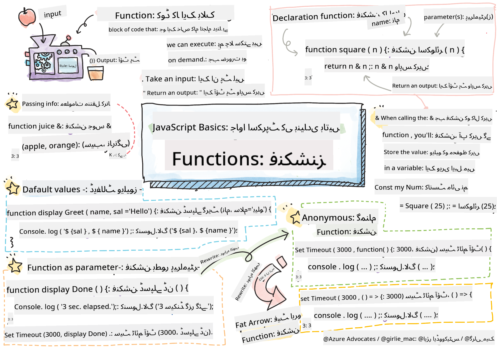

<!--
CO_OP_TRANSLATOR_METADATA:
{
  "original_hash": "ec43b53e8e015cdabfd3ad877b3c28e5",
  "translation_date": "2025-10-22T14:32:24+00:00",
  "source_file": "2-js-basics/2-functions-methods/README.md",
  "language_code": "ur"
}
-->
# جاوا اسکرپٹ کی بنیادی باتیں: طریقے اور فنکشنز


> اسکیچ نوٹ [Tomomi Imura](https://twitter.com/girlie_mac) کی طرف سے

## لیکچر سے پہلے کا کوئز
[لیکچر سے پہلے کا کوئز](https://ff-quizzes.netlify.app)

بار بار ایک ہی کوڈ لکھنا پروگرامنگ کے سب سے عام مسائل میں سے ایک ہے۔ فنکشنز اس مسئلے کو حل کرتے ہیں کیونکہ یہ کوڈ کو دوبارہ استعمال کے قابل بلاکس میں پیک کرنے کی اجازت دیتے ہیں۔ فنکشنز کو ہنری فورڈ کی اسمبلی لائن کے معیاری حصوں کی طرح سمجھیں – ایک بار جب آپ ایک قابل اعتماد جزو بنا لیتے ہیں، تو آپ اسے جہاں ضرورت ہو استعمال کر سکتے ہیں بغیر دوبارہ شروع سے بنانے کے۔

فنکشنز آپ کو کوڈ کے ٹکڑوں کو پیک کرنے کی اجازت دیتے ہیں تاکہ آپ انہیں اپنے پروگرام میں دوبارہ استعمال کر سکیں۔ ایک ہی منطق کو ہر جگہ کاپی اور پیسٹ کرنے کے بجائے، آپ ایک بار فنکشن بنا سکتے ہیں اور جب بھی ضرورت ہو اسے کال کر سکتے ہیں۔ یہ طریقہ آپ کے کوڈ کو منظم رکھتا ہے اور اپ ڈیٹس کو بہت آسان بناتا ہے۔

اس سبق میں، آپ سیکھیں گے کہ اپنے فنکشنز کیسے بنائیں، ان میں معلومات کیسے پاس کریں، اور ان سے مفید نتائج کیسے حاصل کریں۔ آپ فنکشنز اور طریقوں کے درمیان فرق دریافت کریں گے، جدید نحو کے طریقے سیکھیں گے، اور دیکھیں گے کہ فنکشنز دوسرے فنکشنز کے ساتھ کیسے کام کر سکتے ہیں۔ ہم ان تصورات کو مرحلہ وار بنائیں گے۔

[](https://youtube.com/watch?v=XgKsD6Zwvlc "طریقے اور فنکشنز")

> 🎥 اوپر دی گئی تصویر پر کلک کریں تاکہ طریقے اور فنکشنز کے بارے میں ویڈیو دیکھ سکیں۔

> آپ یہ سبق [Microsoft Learn](https://docs.microsoft.com/learn/modules/web-development-101-functions/?WT.mc_id=academic-77807-sagibbon) پر لے سکتے ہیں!

## فنکشنز

فنکشن ایک خود مختار کوڈ بلاک ہے جو ایک مخصوص کام انجام دیتا ہے۔ یہ منطق کو انکیپسولیٹ کرتا ہے جسے آپ جب بھی ضرورت ہو چلا سکتے ہیں۔

اپنے پروگرام میں ایک ہی کوڈ کو کئی بار لکھنے کے بجائے، آپ اسے ایک فنکشن میں پیک کر سکتے ہیں اور جب بھی ضرورت ہو اسے کال کر سکتے ہیں۔ یہ طریقہ آپ کے کوڈ کو صاف رکھتا ہے اور اپ ڈیٹس کو بہت آسان بناتا ہے۔ تصور کریں کہ اگر آپ کو اپنے کوڈ بیس کے 20 مختلف مقامات پر بکھری ہوئی منطق کو تبدیل کرنے کی ضرورت ہو تو دیکھ بھال کا چیلنج کیا ہوگا۔

اپنے فنکشنز کو وضاحتی نام دینا ضروری ہے۔ ایک اچھا نام دیا گیا فنکشن اس کے مقصد کو واضح طور پر بتاتا ہے – جب آپ `cancelTimer()` دیکھتے ہیں، تو آپ فوراً سمجھ جاتے ہیں کہ یہ کیا کرتا ہے، بالکل اسی طرح جیسے ایک واضح طور پر لیبل لگا ہوا بٹن آپ کو بتاتا ہے کہ جب آپ اسے کلک کریں گے تو کیا ہوگا۔

## فنکشن بنانا اور کال کرنا

آئیے دیکھتے ہیں کہ فنکشن کیسے بنایا جاتا ہے۔ نحو ایک مستقل نمونہ کی پیروی کرتا ہے:

```javascript
function nameOfFunction() { // function definition
 // function definition/body
}
```

آئیے اسے توڑتے ہیں:
- `function` کلیدی لفظ جاوا اسکرپٹ کو بتاتا ہے "ارے، میں ایک فنکشن بنا رہا ہوں!"
- `nameOfFunction` وہ جگہ ہے جہاں آپ اپنے فنکشن کو ایک وضاحتی نام دیتے ہیں
- قوسین `()` وہ جگہ ہیں جہاں آپ پیرامیٹرز شامل کر سکتے ہیں (ہم جلد ہی اس پر پہنچیں گے)
- کرلی بریکٹس `{}` میں اصل کوڈ ہوتا ہے جو آپ کے فنکشن کو کال کرنے پر چلتا ہے

آئیے ایک سادہ گریٹنگ فنکشن بناتے ہیں تاکہ اسے عملی طور پر دیکھ سکیں:

```javascript
function displayGreeting() {
  console.log('Hello, world!');
}
```

یہ فنکشن "Hello, world!" کو کنسول پر پرنٹ کرتا ہے۔ ایک بار جب آپ نے اسے ڈیفائن کر لیا، تو آپ اسے جتنی بار چاہیں استعمال کر سکتے ہیں۔

اپنے فنکشن کو چلانے (یا "کال کرنے") کے لیے، اس کا نام لکھیں اور اس کے بعد قوسین لگائیں۔ جاوا اسکرپٹ آپ کو اپنے فنکشن کو کال کرنے سے پہلے یا بعد میں ڈیفائن کرنے کی اجازت دیتا ہے – جاوا اسکرپٹ انجن عمل درآمد کے ترتیب کو سنبھال لے گا۔

```javascript
// calling our function
displayGreeting();
```

جب آپ یہ لائن چلاتے ہیں، تو یہ آپ کے `displayGreeting` فنکشن کے اندر موجود تمام کوڈ کو چلاتا ہے، اور آپ کے براؤزر کے کنسول میں "Hello, world!" دکھاتا ہے۔ آپ اس فنکشن کو بار بار کال کر سکتے ہیں۔

> **نوٹ:** آپ نے ان اسباق کے دوران **طریقے** استعمال کیے ہیں۔ `console.log()` ایک طریقہ ہے – بنیادی طور پر ایک فنکشن جو `console` آبجیکٹ سے تعلق رکھتا ہے۔ اہم فرق یہ ہے کہ طریقے آبجیکٹس سے منسلک ہوتے ہیں، جبکہ فنکشنز آزادانہ طور پر کھڑے ہوتے ہیں۔ بہت سے ڈویلپرز ان اصطلاحات کو غیر رسمی گفتگو میں ایک دوسرے کے ساتھ استعمال کرتے ہیں۔

### فنکشنز کے بہترین طریقے

یہاں کچھ تجاویز ہیں جو آپ کو بہترین فنکشنز لکھنے میں مدد کریں گی:

- اپنے فنکشنز کو واضح، وضاحتی نام دیں – آپ کا مستقبل کا خود آپ کا شکر گزار ہوگا!
- **camelCasing** کا استعمال کریں جب نام میں کئی الفاظ ہوں (جیسے `calculateTotal` بجائے `calculate_total`)
- ہر فنکشن کو ایک کام کو اچھی طرح انجام دینے پر مرکوز رکھیں

## فنکشن کو معلومات دینا

ہمارا `displayGreeting` فنکشن محدود ہے – یہ صرف "Hello, world!" سب کے لیے دکھا سکتا ہے۔ پیرامیٹرز ہمیں فنکشنز کو زیادہ لچکدار اور مفید بنانے کی اجازت دیتے ہیں۔

**پیرامیٹرز** ایسے پلیس ہولڈرز کی طرح کام کرتے ہیں جہاں آپ ہر بار فنکشن استعمال کرتے وقت مختلف اقدار ڈال سکتے ہیں۔ اس طرح، ایک ہی فنکشن ہر کال پر مختلف معلومات کے ساتھ کام کر سکتا ہے۔

جب آپ اپنے فنکشن کو ڈیفائن کرتے ہیں تو آپ پیرامیٹرز کو قوسین کے اندر درج کرتے ہیں، اور متعدد پیرامیٹرز کو کاما کے ساتھ الگ کرتے ہیں:

```javascript
function name(param, param2, param3) {

}
```

ہر پیرامیٹر ایک پلیس ہولڈر کی طرح کام کرتا ہے – جب کوئی آپ کے فنکشن کو کال کرتا ہے، تو وہ اصل اقدار فراہم کرے گا جو ان جگہوں پر ڈال دی جائیں گی۔

آئیے اپنے گریٹنگ فنکشن کو اپ ڈیٹ کریں تاکہ کسی کا نام قبول کر سکے:

```javascript
function displayGreeting(name) {
  const message = `Hello, ${name}!`;
  console.log(message);
}
```

نوٹ کریں کہ ہم بیک ٹکس (`` ` ``) اور `${}` کا استعمال کر رہے ہیں تاکہ نام کو براہ راست اپنے پیغام میں ڈال سکیں – اسے ٹیمپلیٹ لیٹرل کہا جاتا ہے، اور یہ متغیرات کے ساتھ ملے ہوئے اسٹرنگز بنانے کا ایک واقعی مفید طریقہ ہے۔

اب جب ہم اپنے فنکشن کو کال کرتے ہیں، تو ہم کوئی بھی نام پاس کر سکتے ہیں:

```javascript
displayGreeting('Christopher');
// displays "Hello, Christopher!" when run
```

جاوا اسکرپٹ اسٹرنگ `'Christopher'` لیتا ہے، اسے `name` پیرامیٹر کو تفویض کرتا ہے، اور ذاتی پیغام "Hello, Christopher!" بناتا ہے۔

## ڈیفالٹ اقدار

اگر ہم کچھ پیرامیٹرز کو اختیاری بنانا چاہتے ہیں تو کیا ہوگا؟ یہی وہ جگہ ہے جہاں ڈیفالٹ اقدار کام آتی ہیں!

فرض کریں کہ ہم چاہتے ہیں کہ لوگ گریٹنگ کے لفظ کو اپنی مرضی کے مطابق بنا سکیں، لیکن اگر وہ کوئی خاص لفظ نہ بتائیں، تو ہم صرف "Hello" کو بیک اپ کے طور پر استعمال کریں گے۔ آپ ڈیفالٹ اقدار کو برابر کے نشان کا استعمال کرتے ہوئے سیٹ کر سکتے ہیں، بالکل ویری ایبل سیٹ کرنے کی طرح:

```javascript
function displayGreeting(name, salutation='Hello') {
  console.log(`${salutation}, ${name}`);
}
```

یہاں، `name` اب بھی ضروری ہے، لیکن `salutation` کے پاس بیک اپ ویلیو `'Hello'` ہے اگر کوئی مختلف گریٹنگ فراہم نہ کرے۔

اب ہم اس فنکشن کو دو مختلف طریقوں سے کال کر سکتے ہیں:

```javascript
displayGreeting('Christopher');
// displays "Hello, Christopher"

displayGreeting('Christopher', 'Hi');
// displays "Hi, Christopher"
```

پہلی کال میں، جاوا اسکرپٹ ڈیفالٹ "Hello" استعمال کرتا ہے کیونکہ ہم نے کوئی گریٹنگ نہیں بتائی۔ دوسری کال میں، یہ ہماری مرضی کے مطابق "Hi" استعمال کرتا ہے۔ یہ لچک فنکشنز کو مختلف حالات کے مطابق ڈھالنے کے قابل بناتی ہے۔

## واپسی کی اقدار

ہمارے فنکشنز اب تک صرف کنسول میں پیغامات پرنٹ کر رہے ہیں، لیکن اگر آپ چاہتے ہیں کہ فنکشن کچھ حساب کرے اور آپ کو نتیجہ واپس دے؟

یہی وہ جگہ ہے جہاں **واپسی کی اقدار** کام آتی ہیں۔ کچھ دکھانے کے بجائے، فنکشن آپ کو ایک ویلیو واپس دے سکتا ہے جسے آپ ویری ایبل میں اسٹور کر سکتے ہیں یا اپنے کوڈ کے دوسرے حصوں میں استعمال کر سکتے ہیں۔

ویلیو واپس بھیجنے کے لیے، آپ `return` کلیدی لفظ کا استعمال کرتے ہیں اور اس کے بعد جو بھی آپ واپس بھیجنا چاہتے ہیں:

```javascript
return myVariable;
```

یہاں ایک اہم بات ہے: جب فنکشن `return` اسٹیٹمنٹ پر پہنچتا ہے، تو یہ فوراً چلنا بند کر دیتا ہے اور وہ ویلیو واپس بھیج دیتا ہے جس نے اسے کال کیا تھا۔

آئیے اپنے گریٹنگ فنکشن کو تبدیل کریں تاکہ پیغام کو پرنٹ کرنے کے بجائے واپس کرے:

```javascript
function createGreetingMessage(name) {
  const message = `Hello, ${name}`;
  return message;
}
```

اب یہ فنکشن گریٹنگ کو پرنٹ کرنے کے بجائے پیغام بناتا ہے اور ہمیں واپس دیتا ہے۔

واپس کی گئی ویلیو کو استعمال کرنے کے لیے، ہم اسے کسی ویری ایبل میں اسٹور کر سکتے ہیں بالکل کسی اور ویلیو کی طرح:

```javascript
const greetingMessage = createGreetingMessage('Christopher');
```

اب `greetingMessage` میں "Hello, Christopher" موجود ہے اور ہم اسے اپنے کوڈ میں کہیں بھی استعمال کر سکتے ہیں – ویب پیج پر دکھانے کے لیے، ای میل میں شامل کرنے کے لیے، یا کسی دوسرے فنکشن کو پاس کرنے کے لیے۔

## فنکشنز کو فنکشنز کے پیرامیٹرز کے طور پر استعمال کرنا

فنکشنز کو دوسرے فنکشنز کے پیرامیٹرز کے طور پر پاس کیا جا سکتا ہے۔ اگرچہ یہ تصور شروع میں پیچیدہ لگ سکتا ہے، یہ ایک طاقتور خصوصیت ہے جو لچکدار پروگرامنگ پیٹرنز کو فعال کرتی ہے۔

یہ پیٹرن بہت عام ہے جب آپ کہنا چاہتے ہیں "جب کچھ ہوتا ہے، تو یہ دوسرا کام کرو۔" مثال کے طور پر، "جب ٹائمر ختم ہو، تو یہ کوڈ چلائیں" یا "جب صارف بٹن پر کلک کرے، تو اس فنکشن کو کال کریں۔"

آئیے `setTimeout` دیکھتے ہیں، جو ایک بلٹ ان فنکشن ہے جو کچھ وقت انتظار کرتا ہے اور پھر کچھ کوڈ چلاتا ہے۔ ہمیں اسے بتانا ہوگا کہ کون سا کوڈ چلانا ہے – فنکشن پاس کرنے کے لیے بہترین کیس!

یہ کوڈ آزمائیں – 3 سیکنڈ کے بعد، آپ کو ایک پیغام نظر آئے گا:

```javascript
function displayDone() {
  console.log('3 seconds has elapsed');
}
// timer value is in milliseconds
setTimeout(displayDone, 3000);
```

نوٹ کریں کہ ہم `displayDone` (بغیر قوسین کے) کو `setTimeout` میں پاس کرتے ہیں۔ ہم خود فنکشن کو کال نہیں کر رہے – ہم اسے `setTimeout` کے حوالے کر رہے ہیں اور کہہ رہے ہیں "اسے 3 سیکنڈ میں کال کریں۔"

### گمنام فنکشنز

کبھی کبھی آپ کو صرف ایک چیز کے لیے فنکشن کی ضرورت ہوتی ہے اور آپ اسے نام دینا نہیں چاہتے۔ اس کے بارے میں سوچیں – اگر آپ صرف ایک بار فنکشن استعمال کر رہے ہیں، تو کیوں اپنے کوڈ کو ایک اضافی نام کے ساتھ بھر دیں؟

جاوا اسکرپٹ آپ کو **گمنام فنکشنز** بنانے کی اجازت دیتا ہے – بغیر نام کے فنکشنز جو آپ جہاں ضرورت ہو وہیں ڈیفائن کر سکتے ہیں۔

یہاں ہم اپنے ٹائمر کی مثال کو گمنام فنکشن کا استعمال کرتے ہوئے دوبارہ لکھ سکتے ہیں:

```javascript
setTimeout(function() {
  console.log('3 seconds has elapsed');
}, 3000);
```

یہ وہی نتیجہ حاصل کرتا ہے، لیکن فنکشن کو براہ راست `setTimeout` کال کے اندر ڈیفائن کیا گیا ہے، جس سے الگ فنکشن ڈیفائن کرنے کی ضرورت ختم ہو جاتی ہے۔

### فیٹ ایرو فنکشنز

جدید جاوا اسکرپٹ میں فنکشنز لکھنے کا ایک اور مختصر طریقہ ہے جسے **ایرو فنکشنز** کہا جاتا ہے۔ یہ `=>` کا استعمال کرتے ہیں (جو ایک تیر کی طرح لگتا ہے – سمجھ گئے؟) اور ڈویلپرز میں بہت مقبول ہیں۔

ایرو فنکشنز آپ کو `function` کلیدی لفظ چھوڑنے اور زیادہ مختصر کوڈ لکھنے دیتی ہیں۔

یہاں ہمارا ٹائمر کی مثال ایرو فنکشن کا استعمال کرتے ہوئے ہے:

```javascript
setTimeout(() => {
  console.log('3 seconds has elapsed');
}, 3000);
```

`()` وہ جگہ ہے جہاں پیرامیٹرز جائیں گے (اس کیس میں خالی)، پھر تیر `=>` آتا ہے، اور آخر میں فنکشن باڈی کرلی بریکٹس میں۔ یہ زیادہ مختصر نحو کے ساتھ وہی فعالیت فراہم کرتا ہے۔

### ہر حکمت عملی کا استعمال کب کریں

آپ کو ہر طریقہ کب استعمال کرنا چاہیے؟ ایک عملی رہنما: اگر آپ فنکشن کو کئی بار استعمال کریں گے، تو اسے ایک نام دیں اور الگ سے ڈیفائن کریں۔ اگر یہ ایک مخصوص استعمال کے لیے ہے، تو گمنام فنکشن پر غور کریں۔ ایرو فنکشنز اور روایتی نحو دونوں درست انتخاب ہیں، حالانکہ ایرو فنکشنز جدید جاوا اسکرپٹ کوڈ بیسز میں عام ہیں۔

---


## 🚀 چیلنج

کیا آپ ایک جملے میں فنکشنز اور طریقوں کے درمیان فرق بیان کر سکتے ہیں؟ کوشش کریں!

## GitHub Copilot Agent چیلنج 🚀

Agent mode کا استعمال کرتے ہوئے درج ذیل چیلنج مکمل کریں:

**تفصیل:** ایک یوٹیلیٹی لائبریری بنائیں جو مختلف ریاضیاتی فنکشنز کو ظاہر کرے جو اس سبق میں شامل مختلف فنکشن تصورات کو ظاہر کرے، بشمول پیرامیٹرز، ڈیفالٹ اقدار، واپسی کی اقدار، اور ایرو فنکشنز۔

**پرومپٹ:** ایک جاوا اسکرپٹ فائل بنائیں جس کا نام `mathUtils.js` ہو جس میں درج ذیل فنکشنز شامل ہوں:
1. ایک فنکشن `add` جو دو پیرامیٹرز لیتا ہے اور ان کا مجموعہ واپس کرتا ہے
2. ایک فنکشن `multiply` جس کے ڈیفالٹ پیرامیٹر ویلیوز ہوں (دوسرا پیرامیٹر ڈیفالٹ 1 ہو)
3. ایک ایرو فنکشن `square` جو ایک نمبر لیتا ہے اور اس کا مربع واپس کرتا ہے
4. ایک فنکشن `calculate` جو ایک اور فنکشن کو پیرامیٹر کے طور پر قبول کرتا ہے اور دو نمبر، پھر ان نمبروں پر فنکشن لاگو کرتا ہے
5. ہر فنکشن کو مناسب ٹیسٹ کیسز کے ساتھ کال کرنے کا مظاہرہ کریں

Agent mode کے بارے میں مزید جانیں [یہاں](https://code.visualstudio.com/blogs/2025/02/24/introducing-copilot-agent-mode)۔

## لیکچر کے بعد کا کوئز
[لیکچر کے بعد کا کوئز](https://ff-quizzes.netlify.app)

## جائزہ اور خود مطالعہ

یہ [ایرو فنکشنز کے بارے میں تھوڑا مزید پڑھنے](https://developer.mozilla.org/docs/Web/JavaScript/Reference/Functions/Arrow_functions) کے قابل ہے، کیونکہ وہ کوڈ بیسز میں بڑھتے ہوئے استعمال ہو رہے ہیں۔ ایک فنکشن لکھنے کی مشق کریں، اور پھر اسے اس نحو کے ساتھ دوبارہ لکھیں۔

## اسائنمنٹ

[فنکشنز کے ساتھ مزہ](assignment.md)

---

**ڈسکلیمر**:  
یہ دستاویز AI ترجمہ سروس [Co-op Translator](https://github.com/Azure/co-op-translator) کا استعمال کرتے ہوئے ترجمہ کی گئی ہے۔ ہم درستگی کے لیے کوشش کرتے ہیں، لیکن براہ کرم آگاہ رہیں کہ خودکار ترجمے میں غلطیاں یا غیر درستیاں ہو سکتی ہیں۔ اصل دستاویز کو اس کی اصل زبان میں مستند ذریعہ سمجھا جانا چاہیے۔ اہم معلومات کے لیے، پیشہ ور انسانی ترجمہ کی سفارش کی جاتی ہے۔ ہم اس ترجمے کے استعمال سے پیدا ہونے والی کسی بھی غلط فہمی یا غلط تشریح کے ذمہ دار نہیں ہیں۔