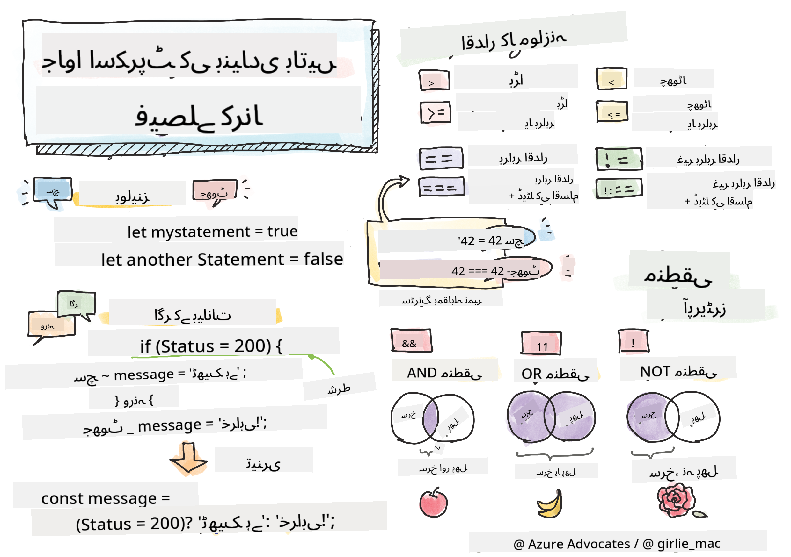

<!--
CO_OP_TRANSLATOR_METADATA:
{
  "original_hash": "beea52254102e11a70f4a3e7f66af5e3",
  "translation_date": "2025-10-20T20:43:23+00:00",
  "source_file": "2-js-basics/3-making-decisions/README.md",
  "language_code": "ur"
}
-->
# جاوا اسکرپٹ کی بنیادی باتیں: فیصلے کرنا



> اسکیچ نوٹ [Tomomi Imura](https://twitter.com/girlie_mac) کی جانب سے

## لیکچر سے پہلے کا کوئز

[لیکچر سے پہلے کا کوئز](https://ff-quizzes.netlify.app/web/quiz/11)

فیصلے کرنا اور اپنے کوڈ کے چلنے کے ترتیب کو کنٹرول کرنا آپ کے کوڈ کو دوبارہ استعمال کے قابل اور مضبوط بناتا ہے۔ اس سیکشن میں جاوا اسکرپٹ میں ڈیٹا کے بہاؤ کو کنٹرول کرنے کے لیے استعمال ہونے والے نحو اور اس کی اہمیت کو بیان کیا گیا ہے، خاص طور پر جب اسے Boolean ڈیٹا ٹائپس کے ساتھ استعمال کیا جائے۔

[](https://youtube.com/watch?v=SxTp8j-fMMY "فیصلے کرنا")

> 🎥 اوپر دی گئی تصویر پر کلک کریں فیصلے کرنے کے بارے میں ویڈیو دیکھنے کے لیے۔

> آپ یہ سبق [Microsoft Learn](https://docs.microsoft.com/learn/modules/web-development-101-if-else/?WT.mc_id=academic-77807-sagibbon) پر لے سکتے ہیں!

## Boolean پر مختصر نظر

Boolean صرف دو قدریں رکھ سکتے ہیں: `true` یا `false`۔ Boolean اس بات کا فیصلہ کرنے میں مدد کرتے ہیں کہ کون سی لائنز کوڈ چلنی چاہیے جب مخصوص شرائط پوری ہوں۔

اپنے Boolean کو true یا false پر سیٹ کریں اس طرح:

`let myTrueBool = true`
`let myFalseBool = false`

✅ Boolean کا نام انگریزی ریاضی دان، فلسفی اور منطقی George Boole (1815–1864) کے نام پر رکھا گیا ہے۔

## موازنہ آپریٹرز اور Boolean

آپریٹرز کا استعمال شرائط کا جائزہ لینے کے لیے کیا جاتا ہے، جو موازنہ کرتے ہیں اور ایک Boolean قدر پیدا کرتے ہیں۔ نیچے دی گئی فہرست میں اکثر استعمال ہونے والے آپریٹرز شامل ہیں۔

| علامت | وضاحت                                                                                                                                                   | مثال              |
| ------ | ------------------------------------------------------------------------------------------------------------------------------------------------------------- | ------------------ |
| `<`    | **کم سے کم**: دو قدروں کا موازنہ کرتا ہے اور اگر بائیں طرف کی قدر دائیں طرف سے کم ہو تو `true` Boolean ڈیٹا ٹائپ واپس کرتا ہے                              | `5 < 6 // true`    |
| `<=`   | **کم یا برابر**: دو قدروں کا موازنہ کرتا ہے اور اگر بائیں طرف کی قدر دائیں طرف سے کم یا برابر ہو تو `true` Boolean ڈیٹا ٹائپ واپس کرتا ہے      | `5 <= 6 // true`   |
| `>`    | **زیادہ**: دو قدروں کا موازنہ کرتا ہے اور اگر بائیں طرف کی قدر دائیں طرف سے زیادہ ہو تو `true` Boolean ڈیٹا ٹائپ واپس کرتا ہے                         | `5 > 6 // false`   |
| `>=`   | **زیادہ یا برابر**: دو قدروں کا موازنہ کرتا ہے اور اگر بائیں طرف کی قدر دائیں طرف سے زیادہ یا برابر ہو تو `true` Boolean ڈیٹا ٹائپ واپس کرتا ہے | `5 >= 6 // false`  |
| `===`  | **سخت برابری**: دو قدروں کا موازنہ کرتا ہے اور اگر بائیں اور دائیں طرف کی قدریں برابر ہوں اور ایک ہی ڈیٹا ٹائپ ہوں تو `true` Boolean ڈیٹا ٹائپ واپس کرتا ہے       | `5 === 6 // false` |
| `!==`  | **عدم برابری**: دو قدروں کا موازنہ کرتا ہے اور جو سخت برابری آپریٹر واپس کرے گا اس کے برعکس Boolean قدر واپس کرتا ہے                                    | `5 !== 6 // true`  |

✅ اپنے علم کو جانچنے کے لیے اپنے براؤزر کے کنسول میں کچھ موازنہ لکھیں۔ کیا کوئی واپس شدہ ڈیٹا آپ کو حیران کرتا ہے؟

## If بیان

If بیان اپنے بلاکس کے درمیان کوڈ کو چلائے گا اگر شرط true ہو۔

```javascript
if (condition) {
  //Condition is true. Code in this block will run.
}
```

منطقی آپریٹرز اکثر شرط بنانے کے لیے استعمال کیے جاتے ہیں۔

```javascript
let currentMoney;
let laptopPrice;

if (currentMoney >= laptopPrice) {
  //Condition is true. Code in this block will run.
  console.log("Getting a new laptop!");
}
```

## If..Else بیان

Else بیان اپنے بلاکس کے درمیان کوڈ کو چلائے گا جب شرط false ہو۔ یہ If بیان کے ساتھ اختیاری ہے۔

```javascript
let currentMoney;
let laptopPrice;

if (currentMoney >= laptopPrice) {
  //Condition is true. Code in this block will run.
  console.log("Getting a new laptop!");
} else {
  //Condition is false. Code in this block will run.
  console.log("Can't afford a new laptop, yet!");
}
```

✅ اس کوڈ اور نیچے دیے گئے کوڈ کو براؤزر کنسول میں چلا کر اپنی سمجھ کو جانچیں۔ currentMoney اور laptopPrice متغیرات کی قدریں تبدیل کریں تاکہ واپس شدہ `console.log()` کو تبدیل کیا جا سکے۔

## Switch بیان

Switch بیان مختلف شرائط کی بنیاد پر مختلف اعمال انجام دینے کے لیے استعمال کیا جاتا ہے۔ Switch بیان کا استعمال کریں تاکہ منتخب کریں کہ کون سا کوڈ بلاک چلایا جائے۔

```javascript
switch (expression) {
  case x:
    // code block
    break;
  case y:
    // code block
    break;
  default:
  // code block
}
```

```javascript
// program using switch statement
let a = 2;

switch (a) {
  case 1:
    a = "one";
    break;
  case 2:
    a = "two";
    break;
  default:
    a = "not found";
    break;
}
console.log(`The value is ${a}`);
```

✅ اس کوڈ اور نیچے دیے گئے کوڈ کو براؤزر کنسول میں چلا کر اپنی سمجھ کو جانچیں۔ متغیر a کی قدریں تبدیل کریں تاکہ واپس شدہ `console.log()` کو تبدیل کیا جا سکے۔

## منطقی آپریٹرز اور Boolean

فیصلے کرنے کے لیے ایک سے زیادہ موازنہ کی ضرورت ہو سکتی ہے، اور انہیں منطقی آپریٹرز کے ساتھ جوڑا جا سکتا ہے تاکہ ایک Boolean قدر پیدا کی جا سکے۔

| علامت | وضاحت                                                                                     | مثال                                                                 |
| ------ | ----------------------------------------------------------------------------------------------- | ----------------------------------------------------------------------- |
| `&&`   | **منطقی AND**: دو Boolean اظہار کا موازنہ کرتا ہے۔ true **صرف** تب واپس کرتا ہے جب دونوں طرف true ہوں | `(5 > 6) && (5 < 6 ) //ایک طرف false ہے، دوسری true ہے۔ false واپس کرتا ہے` |
| `\|\|` | **منطقی OR**: دو Boolean اظہار کا موازنہ کرتا ہے۔ true واپس کرتا ہے اگر کم از کم ایک طرف true ہو     | `(5 > 6) \|\| (5 < 6) //ایک طرف false ہے، دوسری true ہے۔ true واپس کرتا ہے` |
| `!`    | **منطقی NOT**: Boolean اظہار کی مخالف قدر واپس کرتا ہے                             | `!(5 > 6) // 5 6 سے زیادہ نہیں ہے، لیکن "!" true واپس کرے گا`         |

## منطقی آپریٹرز کے ساتھ شرائط اور فیصلے

منطقی آپریٹرز کو If..Else بیانات میں شرائط بنانے کے لیے استعمال کیا جا سکتا ہے۔

```javascript
let currentMoney;
let laptopPrice;
let laptopDiscountPrice = laptopPrice - laptopPrice * 0.2; //Laptop price at 20 percent off

if (currentMoney >= laptopPrice || currentMoney >= laptopDiscountPrice) {
  //Condition is true. Code in this block will run.
  console.log("Getting a new laptop!");
} else {
  //Condition is true. Code in this block will run.
  console.log("Can't afford a new laptop, yet!");
}
```

### نفی آپریٹر

آپ نے اب تک دیکھا کہ آپ `if...else` بیان کا استعمال کر کے مشروط منطق کیسے بنا سکتے ہیں۔ جو کچھ بھی `if` میں جاتا ہے اسے true/false میں تبدیل ہونا چاہیے۔ `!` آپریٹر کا استعمال کر کے آپ اظہار کو _نفی_ کر سکتے ہیں۔ یہ اس طرح نظر آئے گا:

```javascript
if (!condition) {
  // runs if condition is false
} else {
  // runs if condition is true
}
```

### تین گنا اظہار

`if...else` فیصلہ منطق کو ظاہر کرنے کا واحد طریقہ نہیں ہے۔ آپ کچھ ایسا بھی استعمال کر سکتے ہیں جسے تین گنا آپریٹر کہا جاتا ہے۔ اس کا نحو اس طرح نظر آتا ہے:

```javascript
let variable = condition ? <return this if true> : <return this if false>
```

نیچے ایک زیادہ ٹھوس مثال دی گئی ہے:

```javascript
let firstNumber = 20;
let secondNumber = 10;
let biggestNumber = firstNumber > secondNumber ? firstNumber : secondNumber;
```

✅ اس کوڈ کو چند بار پڑھنے کے لیے ایک منٹ نکالیں۔ کیا آپ سمجھتے ہیں کہ یہ آپریٹرز کیسے کام کر رہے ہیں؟

اوپر بیان کرتا ہے کہ

- اگر `firstNumber` `secondNumber` سے بڑا ہے
- تو `firstNumber` کو `biggestNumber` میں تفویض کریں
- ورنہ `secondNumber` کو تفویض کریں۔

تین گنا اظہار کوڈ کو نیچے لکھنے کا صرف ایک مختصر طریقہ ہے:

```javascript
let biggestNumber;
if (firstNumber > secondNumber) {
  biggestNumber = firstNumber;
} else {
  biggestNumber = secondNumber;
}
```

---


## 🚀 چیلنج

ایک پروگرام بنائیں جو پہلے منطقی آپریٹرز کے ساتھ لکھا گیا ہو، اور پھر اسے تین گنا اظہار کے ساتھ دوبارہ لکھیں۔ آپ کو کون سا نحو پسند ہے؟

---

## GitHub Copilot Agent چیلنج 🚀

Agent موڈ کا استعمال کرتے ہوئے درج ذیل چیلنج مکمل کریں:

**تفصیل:** ایک جامع گریڈ کیلکولیٹر بنائیں جو اس سبق سے متعدد فیصلہ سازی کے تصورات کو ظاہر کرے، بشمول if-else بیانات، switch بیانات، منطقی آپریٹرز، اور تین گنا اظہار۔

**پرومپٹ:** ایک جاوا اسکرپٹ پروگرام لکھیں جو طالب علم کے عددی اسکور (0-100) کو لے اور ان کے لیٹر گریڈ کا تعین کرے درج ذیل معیار کے مطابق:
- A: 90-100
- B: 80-89  
- C: 70-79
- D: 60-69
- F: 60 سے کم

ضروریات:
1. لیٹر گریڈ کا تعین کرنے کے لیے if-else بیان کا استعمال کریں
2. چیک کرنے کے لیے منطقی آپریٹرز کا استعمال کریں کہ آیا طالب علم پاس کرتا ہے (گریڈ >= 60) اور اعزاز حاصل کرتا ہے (گریڈ >= 90)
3. ہر لیٹر گریڈ کے لیے مخصوص تاثرات فراہم کرنے کے لیے switch بیان کا استعمال کریں
4. اگلے کورس کے لیے طالب علم کی اہلیت کا تعین کرنے کے لیے تین گنا آپریٹر کا استعمال کریں (گریڈ >= 70)
5. اسکور کو 0 اور 100 کے درمیان یقینی بنانے کے لیے ان پٹ کی توثیق شامل کریں

اپنے پروگرام کو مختلف اسکورز کے ساتھ جانچیں، بشمول کنارے کے کیسز جیسے 59، 60، 89، 90، اور غلط ان پٹ۔

## لیکچر کے بعد کا کوئز

[لیکچر کے بعد کا کوئز](https://ff-quizzes.netlify.app/web/quiz/12)

## جائزہ اور خود مطالعہ

صارف کے لیے دستیاب متعدد آپریٹرز کے بارے میں مزید پڑھیں [MDN پر](https://developer.mozilla.org/docs/Web/JavaScript/Reference/Operators)۔

Josh Comeau کا شاندار [آپریٹر لوک اپ](https://joshwcomeau.com/operator-lookup/) دیکھیں!

## اسائنمنٹ

[آپریٹرز](assignment.md)

---

**اعلانِ لاتعلقی**:  
یہ دستاویز AI ترجمہ سروس [Co-op Translator](https://github.com/Azure/co-op-translator) کا استعمال کرتے ہوئے ترجمہ کی گئی ہے۔ ہم درستگی کے لیے کوشش کرتے ہیں، لیکن براہ کرم آگاہ رہیں کہ خودکار ترجمے میں غلطیاں یا غیر درستیاں ہو سکتی ہیں۔ اصل دستاویز کو اس کی اصل زبان میں مستند ذریعہ سمجھا جانا چاہیے۔ اہم معلومات کے لیے، پیشہ ور انسانی ترجمہ کی سفارش کی جاتی ہے۔ اس ترجمے کے استعمال سے پیدا ہونے والی کسی بھی غلط فہمی یا غلط تشریح کے لیے ہم ذمہ دار نہیں ہیں۔