<!--
CO_OP_TRANSLATOR_METADATA:
{
  "original_hash": "c688385d15dd3645e924ea0ffee8967f",
  "translation_date": "2025-11-03T12:55:10+00:00",
  "source_file": "2-js-basics/3-making-decisions/README.md",
  "language_code": "ur"
}
-->
# جاوا اسکرپٹ کی بنیادی باتیں: فیصلے کرنا


> اسکیچ نوٹ از [Tomomi Imura](https://twitter.com/girlie_mac)


کیا آپ نے کبھی سوچا ہے کہ ایپلیکیشنز کیسے سمجھدار فیصلے کرتی ہیں؟ جیسے کہ نیویگیشن سسٹم کیسے تیز ترین راستہ منتخب کرتا ہے، یا تھرمو اسٹیٹ کیسے فیصلہ کرتا ہے کہ گرمی کب آن کرنی ہے؟ یہ پروگرامنگ میں فیصلے کرنے کا بنیادی تصور ہے۔

جیسے کہ چارلس بیبج کے اینالیٹیکل انجن کو مختلف حالات کے مطابق مختلف آپریشنز کے سلسلے پر عمل کرنے کے لیے ڈیزائن کیا گیا تھا، جدید جاوا اسکرپٹ پروگرامز کو مختلف حالات کے مطابق انتخاب کرنے کی ضرورت ہوتی ہے۔ یہ صلاحیت کہ کوڈ مختلف راستوں پر جا سکے اور فیصلے کر سکے، جامد کوڈ کو جوابدہ اور ذہین ایپلیکیشنز میں تبدیل کرتی ہے۔

اس سبق میں، آپ اپنے پروگرامز میں مشروط منطق کو نافذ کرنے کا طریقہ سیکھیں گے۔ ہم مشروط بیانات، موازنہ آپریٹرز، اور منطقی اظہاروں کو دریافت کریں گے جو آپ کے کوڈ کو حالات کا جائزہ لینے اور مناسب ردعمل دینے کی اجازت دیتے ہیں۔

## لیکچر سے پہلے کا کوئز

[لیکچر سے پہلے کا کوئز](https://ff-quizzes.netlify.app/web/quiz/11)

فیصلے کرنے اور پروگرام کے بہاؤ کو کنٹرول کرنے کی صلاحیت پروگرامنگ کا ایک بنیادی پہلو ہے۔ یہ سیکشن آپ کے جاوا اسکرپٹ پروگرامز کے عمل کے راستے کو کنٹرول کرنے کا احاطہ کرتا ہے، بوولین ویلیوز اور مشروط منطق کا استعمال کرتے ہوئے۔

[](https://youtube.com/watch?v=SxTp8j-fMMY "فیصلے کرنا")

> 🎥 اوپر دی گئی تصویر پر کلک کریں تاکہ فیصلے کرنے کے بارے میں ویڈیو دیکھ سکیں۔

> آپ یہ سبق [Microsoft Learn](https://docs.microsoft.com/learn/modules/web-development-101-if-else/?WT.mc_id=academic-77807-sagibbon) پر لے سکتے ہیں!

```mermaid
mindmap
  root((Decision Making))
    Boolean Logic
      true/false
      Comparison results
      Logical expressions
    Conditional Statements
      if statements
        Single condition
        Code execution
      if-else
        Two paths
        Alternative actions
      switch
        Multiple options
        Clean structure
    Operators
      Comparison
        === !== < > <= >=
        Value relationships
      Logical
        && || !
        Combine conditions
    Advanced Patterns
      Ternary
        ? : syntax
        Inline decisions
      Complex Logic
        Nested conditions
        Multiple criteria
```



## بوولینز پر مختصر نظر

فیصلے کرنے کو دریافت کرنے سے پہلے، آئیے اپنے پچھلے سبق سے بوولین ویلیوز پر دوبارہ نظر ڈالیں۔ ریاضی دان جارج بول کے نام پر رکھی گئی، یہ ویلیوز بائنری حالتوں کی نمائندگی کرتی ہیں – یا تو `true` یا `false`۔ اس میں کوئی ابہام نہیں، کوئی درمیانی راستہ نہیں۔

یہ بائنری ویلیوز تمام کمپیوٹیشنل منطق کی بنیاد بناتی ہیں۔ آپ کا پروگرام جو بھی فیصلہ کرتا ہے وہ بالآخر بوولین جائزے میں تبدیل ہو جاتا ہے۔

بوولین ویریبلز بنانا آسان ہے:

```javascript
let myTrueBool = true;
let myFalseBool = false;
```

یہ دو ویریبلز کو واضح بوولین ویلیوز کے ساتھ بناتا ہے۔

✅ بوولینز کا نام انگریزی ریاضی دان، فلسفی اور منطقی جارج بول (1815–1864) کے نام پر رکھا گیا ہے۔

## موازنہ آپریٹرز اور بوولینز

عملی طور پر، آپ شاذ و نادر ہی بوولین ویلیوز کو دستی طور پر سیٹ کریں گے۔ اس کے بجائے، آپ حالات کا جائزہ لے کر انہیں پیدا کریں گے: "کیا یہ نمبر اس سے بڑا ہے؟" یا "کیا یہ ویلیوز برابر ہیں؟"

موازنہ آپریٹرز ان جائزوں کو ممکن بناتے ہیں۔ وہ ویلیوز کا موازنہ کرتے ہیں اور آپریٹرز کے درمیان تعلق کی بنیاد پر بوولین نتائج واپس کرتے ہیں۔

| علامت | وضاحت                                                                                                                                                   | مثال            |
| ------ | ------------------------------------------------------------------------------------------------------------------------------------------------------------- | ------------------ |
| `<`    | **کم از کم**: دو ویلیوز کا موازنہ کرتا ہے اور `true` بوولین ڈیٹا ٹائپ واپس کرتا ہے اگر بائیں طرف کی ویلیو دائیں طرف سے کم ہو                              | `5 < 6 // true`    |
| `<=`   | **کم یا برابر**: دو ویلیوز کا موازنہ کرتا ہے اور `true` بوولین ڈیٹا ٹائپ واپس کرتا ہے اگر بائیں طرف کی ویلیو دائیں طرف سے کم یا برابر ہو      | `5 <= 6 // true`   |
| `>`    | **زیادہ**: دو ویلیوز کا موازنہ کرتا ہے اور `true` بوولین ڈیٹا ٹائپ واپس کرتا ہے اگر بائیں طرف کی ویلیو دائیں طرف سے زیادہ ہو                         | `5 > 6 // false`   |
| `>=`   | **زیادہ یا برابر**: دو ویلیوز کا موازنہ کرتا ہے اور `true` بوولین ڈیٹا ٹائپ واپس کرتا ہے اگر بائیں طرف کی ویلیو دائیں طرف سے زیادہ یا برابر ہو | `5 >= 6 // false`  |
| `===`  | **سخت برابری**: دو ویلیوز کا موازنہ کرتا ہے اور `true` بوولین ڈیٹا ٹائپ واپس کرتا ہے اگر دائیں اور بائیں طرف کی ویلیوز برابر ہوں اور ایک ہی ڈیٹا ٹائپ ہوں۔       | `5 === 6 // false` |
| `!==`  | **عدم برابری**: دو ویلیوز کا موازنہ کرتا ہے اور وہ بوولین ویلیو واپس کرتا ہے جو سخت برابری آپریٹر واپس کرے                                    | `5 !== 6 // true`  |

✅ اپنے علم کو جانچنے کے لیے اپنے براؤزر کے کنسول میں کچھ موازنہ لکھیں۔ کیا کوئی واپس شدہ ڈیٹا آپ کو حیران کرتا ہے؟


### 🧠 **موازنہ کی مہارت کی جانچ: بوولین منطق کو سمجھنا**

**اپنے موازنہ کی سمجھ کو جانچیں:**
- آپ کیوں سوچتے ہیں کہ `===` (سخت برابری) عام طور پر `==` (ڈھیلی برابری) پر ترجیح دی جاتی ہے؟
- کیا آپ پیش گوئی کر سکتے ہیں کہ `5 === '5'` کیا واپس کرے گا؟ اور `5 == '5'`؟
- `!==` اور `!=` میں کیا فرق ہے؟


> **پرو ٹپ**: برابری چیک کے لیے ہمیشہ `===` اور `!==` استعمال کریں جب تک کہ آپ کو خاص طور پر ٹائپ کنورژن کی ضرورت نہ ہو۔ یہ غیر متوقع رویے کو روکتا ہے!

## If بیان

`if` بیان آپ کے کوڈ میں سوال پوچھنے جیسا ہے۔ "اگر یہ حالت درست ہے، تو یہ کام کرو۔" یہ شاید جاوا اسکرپٹ میں فیصلے کرنے کے لیے آپ کا سب سے اہم ٹول ہوگا۔

یہاں یہ کیسے کام کرتا ہے:

```javascript
if (condition) {
  // Condition is true. Code in this block will run.
}
```

حالت قوسین کے اندر جاتی ہے، اور اگر یہ `true` ہے، تو جاوا اسکرپٹ کوڈ کو گھنگریالے بریکٹس کے اندر چلاتا ہے۔ اگر یہ `false` ہے، تو جاوا اسکرپٹ پورے بلاک کو چھوڑ دیتا ہے۔

آپ اکثر ان حالات کو بنانے کے لیے موازنہ آپریٹرز استعمال کریں گے۔ آئیے ایک عملی مثال دیکھتے ہیں:

```javascript
let currentMoney = 1000;
let laptopPrice = 800;

if (currentMoney >= laptopPrice) {
  // Condition is true. Code in this block will run.
  console.log("Getting a new laptop!");
}
```

چونکہ `1000 >= 800` `true` کے طور پر جائزہ لیتا ہے، بلاک کے اندر کوڈ چلتا ہے، اور کنسول میں "Getting a new laptop!" دکھاتا ہے۔


## If..Else بیان

لیکن اگر آپ چاہتے ہیں کہ آپ کا پروگرام حالت کے غلط ہونے پر کچھ مختلف کرے؟ یہی وہ جگہ ہے جہاں `else` آتا ہے – یہ آپ کو "اگر یہ حالت درست نہیں ہے، تو اس کے بجائے یہ دوسرا کام کرو" کہنے کا طریقہ دیتا ہے۔

`else` بیان آپ کو ایک بیک اپ پلان فراہم کرتا ہے۔

```javascript
let currentMoney = 500;
let laptopPrice = 800;

if (currentMoney >= laptopPrice) {
  // Condition is true. Code in this block will run.
  console.log("Getting a new laptop!");
} else {
  // Condition is false. Code in this block will run.
  console.log("Can't afford a new laptop, yet!");
}
```

اب چونکہ `500 >= 800` `false` ہے، جاوا اسکرپٹ پہلے بلاک کو چھوڑ دیتا ہے اور اس کے بجائے `else` بلاک چلاتا ہے۔ آپ کنسول میں "Can't afford a new laptop, yet!" دیکھیں گے۔

✅ اس کوڈ اور درج ذیل کوڈ کو براؤزر کنسول میں چلا کر اپنی سمجھ کو جانچیں۔ `currentMoney` اور `laptopPrice` ویریبلز کی ویلیوز کو تبدیل کریں تاکہ واپس شدہ `console.log()` کو تبدیل کیا جا سکے۔

### 🎯 **If-Else منطق کی جانچ: شاخوں کے راستے**

**اپنی مشروط منطق کی سمجھ کو جانچیں:**
- کیا ہوتا ہے اگر `currentMoney` بالکل `laptopPrice` کے برابر ہو؟
- کیا آپ کسی حقیقی دنیا کے منظر نامے کے بارے میں سوچ سکتے ہیں جہاں if-else منطق مفید ہو؟
- آپ اسے متعدد قیمتوں کی حدوں کو سنبھالنے کے لیے کیسے بڑھا سکتے ہیں؟


> **اہم بصیرت**: If-Else یقینی بناتا ہے کہ بالکل ایک راستہ لیا جائے۔ یہ ضمانت دیتا ہے کہ آپ کا پروگرام کسی بھی حالت کے لیے ہمیشہ جواب دے گا!

## Switch بیان

کبھی کبھی آپ کو ایک ویلیو کو متعدد اختیارات کے خلاف موازنہ کرنے کی ضرورت ہوتی ہے۔ حالانکہ آپ کئی `if..else` بیانات کو جوڑ سکتے ہیں، یہ طریقہ غیر عملی ہو جاتا ہے۔ `switch` بیان متعدد مخصوص ویلیوز کو سنبھالنے کے لیے ایک صاف ستھری ساخت فراہم کرتا ہے۔

یہ تصور ابتدائی ٹیلیفون ایکسچینجز میں استعمال ہونے والے میکینیکل سوئچنگ سسٹمز سے مشابہت رکھتا ہے – ایک ان پٹ ویلیو فیصلہ کرتی ہے کہ عمل کس مخصوص راستے پر جائے گا۔

```javascript
switch (expression) {
  case x:
    // code block
    break;
  case y:
    // code block
    break;
  default:
    // code block
}
```

یہاں یہ کیسے ترتیب دیا گیا ہے:
- جاوا اسکرپٹ ایکسپریشن کا ایک بار جائزہ لیتا ہے
- یہ ہر `case` کو دیکھتا ہے تاکہ ایک میچ تلاش کرے
- جب اسے میچ ملتا ہے، تو وہ کوڈ بلاک چلاتا ہے
- `break` جاوا اسکرپٹ کو بتاتا ہے کہ رک جائے اور سوئچ سے باہر نکل جائے
- اگر کوئی کیسز میچ نہیں کرتے، تو یہ `default` بلاک چلاتا ہے (اگر آپ کے پاس ہو)

```javascript
// Program using switch statement for day of week
let dayNumber = 2;
let dayName;

switch (dayNumber) {
  case 1:
    dayName = "Monday";
    break;
  case 2:
    dayName = "Tuesday";
    break;
  case 3:
    dayName = "Wednesday";
    break;
  default:
    dayName = "Unknown day";
    break;
}
console.log(`Today is ${dayName}`);
```

اس مثال میں، جاوا اسکرپٹ دیکھتا ہے کہ `dayNumber` `2` ہے، مماثل `case 2` تلاش کرتا ہے، `dayName` کو "Tuesday" پر سیٹ کرتا ہے، اور پھر سوئچ سے باہر نکل جاتا ہے۔ نتیجہ؟ "Today is Tuesday" کنسول میں لاگ ہوتا ہے۔


✅ اس کوڈ اور درج ذیل کوڈ کو براؤزر کنسول میں چلا کر اپنی سمجھ کو جانچیں۔ ویریبل `a` کی ویلیوز کو تبدیل کریں تاکہ واپس شدہ `console.log()` کو تبدیل کیا جا سکے۔

### 🔄 **Switch بیان کی مہارت: متعدد اختیارات**

**اپنی سوئچ کی سمجھ کو جانچیں:**
- کیا ہوتا ہے اگر آپ `break` بیان بھول جائیں؟
- آپ کب `switch` کو متعدد `if-else` بیانات کے بجائے استعمال کریں گے؟
- `default` کیس کیوں مفید ہے حالانکہ آپ سوچتے ہیں کہ آپ نے تمام امکانات کا احاطہ کر لیا ہے؟


> **بہترین عمل**: جب ایک ویریبل کو متعدد مخصوص ویلیوز کے خلاف موازنہ کریں تو `switch` استعمال کریں۔ رینج چیک یا پیچیدہ حالات کے لیے `if-else` استعمال کریں!

## منطقی آپریٹرز اور بوولینز

پیچیدہ فیصلے اکثر ایک ساتھ متعدد حالات کا جائزہ لینے کی ضرورت ہوتی ہے۔ جیسے کہ بوولین الجبرا ریاضی دانوں کو منطقی اظہاروں کو جوڑنے کی اجازت دیتا ہے، پروگرامنگ منطقی آپریٹرز فراہم کرتی ہے تاکہ متعدد بوولین حالات کو جوڑا جا سکے۔

یہ آپریٹرز سادہ true/false جائزوں کو جوڑ کر پیچیدہ مشروط منطق کو ممکن بناتے ہیں۔

| علامت | وضاحت                                                                                     | مثال                                                                 |
| ------ | ----------------------------------------------------------------------------------------------- | ----------------------------------------------------------------------- |
| `&&`   | **منطقی AND**: دو بوولین اظہاروں کا موازنہ کرتا ہے۔ true **صرف** تب واپس کرتا ہے جب دونوں طرف true ہوں | `(5 > 3) && (5 < 10) // دونوں طرف true ہیں۔ true واپس کرتا ہے` |
| `\|\|` | **منطقی OR**: دو بوولین اظہاروں کا موازنہ کرتا ہے۔ true واپس کرتا ہے اگر کم از کم ایک طرف true ہو     | `(5 > 10) \|\| (5 < 10) // ایک طرف false ہے، دوسری true ہے۔ true واپس کرتا ہے` |
| `!`    | **منطقی NOT**: بوولین اظہار کی مخالف ویلیو واپس کرتا ہے                             | `!(5 > 10) // 5 10 سے بڑا نہیں ہے، تو "!" اسے true بناتا ہے`         |

یہ آپریٹرز آپ کو حالات کو مفید طریقوں سے جوڑنے کی اجازت دیتے ہیں:
- AND (`&&`) کا مطلب ہے کہ دونوں حالات true ہونے چاہئیں
- OR (`||`) کا مطلب ہے کہ کم از کم ایک حالت true ہونی چاہیے  
- NOT (`!`) true کو false میں تبدیل کرتا ہے (اور اس کے برعکس)


## منطقی آپریٹرز کے ساتھ حالات اور فیصلے

آئیے ان منطقی آپریٹرز کو ایک زیادہ حقیقت پسندانہ مثال کے ساتھ دیکھتے ہیں:

```javascript
let currentMoney = 600;
let laptopPrice = 800;
let laptopDiscountPrice = laptopPrice - (laptopPrice * 0.2); // Laptop price at 20 percent off

if (currentMoney >= laptopPrice || currentMoney >= laptopDiscountPrice) {
  // Condition is true. Code in this block will run.
  console.log("Getting a new laptop!");
} else {
  // Condition is false. Code in this block will run.
  console.log("Can't afford a new laptop, yet!");
}
```

اس مثال میں: ہم 20% ڈسکاؤنٹ قیمت (640) کا حساب لگاتے ہیں، پھر جائزہ لیتے ہیں کہ آیا ہمارے دستیاب فنڈز مکمل قیمت یا ڈسکاؤنٹ قیمت کو پورا کرتے ہیں۔ چونکہ 600 ڈسکاؤنٹ قیمت کی حد 640 کو پورا کرتا ہے، حالت true کے طور پر جائزہ لیتی ہے۔

### 🧮 **منطقی آپریٹرز کی جانچ: حالات کو جوڑنا**

**اپنی منطقی آپریٹرز کی سمجھ کو جانچیں:**
- اظہار `A && B` میں، کیا ہوتا ہے اگر A false ہو؟ کیا B کا جائزہ لیا جاتا ہے؟
- کیا آپ ایسی صورتحال کے بارے میں سوچ سکتے ہیں جہاں آپ کو تینوں آپریٹرز (&&, ||, !) کی ضرورت ہو؟
- `!user.isActive` اور `user.isActive !== true` میں کیا فرق ہے؟


> **کارکردگی کا ٹپ**: جاوا اسکرپٹ "شارٹ سرکٹ جائزہ" استعمال کرتا ہے - `A && B` میں، اگر A false ہو، تو B کا جائزہ بھی نہیں لیا جاتا۔ اس کا فائدہ اٹھائیں!

### نفی کا آپریٹر

کبھی کبھی یہ سوچنا آسان ہوتا ہے کہ جب کچھ درست نہیں ہوتا۔ جیسے کہ "کیا صارف لاگ ان ہے؟" پوچھنے کے بجائے، آپ "کیا صارف لاگ ان نہیں ہے؟" پوچھنا چاہتے ہیں۔ تعجب نشان (`!`) آپ کے لیے منطق کو پلٹ دیتا ہے۔

```javascript
if (!condition) {
  // runs if condition is false
} else {
  // runs if condition is true
}
```

`!` آپریٹر ایسا ہے جیسے کہ "اس کے برعکس..." – اگر کچھ `true` ہے، `!` اسے `false` بناتا ہے، اور اس کے برعکس۔

### تین گنا اظہار

سادہ مشروط تفویضات کے لیے، جاوا اسکرپٹ **تین گنا آپریٹر** فراہم کرتا ہے۔ یہ مختصر نحو آپ کو ایک مشروط اظہار کو ایک لائن میں لکھنے کی اجازت دیتا ہے، جب آپ کو کسی حالت کی بنیاد پر دو ویلیوز میں سے ایک تفویض کرنے کی ضرورت ہو تو مفید ہے۔

```javascript
let variable = condition ? returnThisIfTrue : returnThisIfFalse;
```

یہ سوال کی طرح پڑھتا ہے: "کیا یہ حالت درست ہے؟ اگر ہاں، تو یہ ویلیو استعمال کریں۔ اگر نہیں، تو وہ ویلیو استعمال کریں۔"

نیچے ایک زیادہ قابل فہم مثال ہے:

```javascript
let firstNumber = 20;
let secondNumber = 10;
let biggestNumber = firstNumber > secondNumber ? firstNumber : secondNumber;
```

✅ اس کوڈ کو چند بار پڑھنے کے لیے ایک منٹ نکالیں۔ کیا آپ سمجھتے ہیں کہ یہ آپریٹرز کیسے کام کر رہے ہیں؟

یہ لائن یہ کہہ رہی ہے: "کیا `firstNumber` `secondNumber` سے بڑا ہے؟ اگر ہاں، تو `firstNumber` کو `biggestNumber` میں ڈالیں۔ اگر نہیں، تو `secondNumber` کو `biggestNumber` میں ڈالیں۔"

تین گنا آپریٹر یہ روایتی `if..else` بیان لکھنے کا صرف ایک مختصر طریقہ ہے:

```javascript
let biggestNumber;
if (firstNumber > secondNumber) {
  biggestNumber = firstNumber;
} else {
  biggestNumber = secondNumber;
}
```

دونوں طریقے ایک جیسے نتائج پیدا کرتے ہیں۔ تین گنا آپریٹر اختصار فراہم کرتا ہے، جبکہ روایتی if-else ساخت پیچیدہ حالات کے لیے زیادہ قابل مطالعہ ہو سکتی ہے۔


---

## 🚀 چیلنج

ایک پروگرام بنائیں جو پہلے منطقی آپریٹرز کے ساتھ لکھا گیا ہو، اور پھر اسے تین گنا اظہار کا استعمال کرتے ہوئے دوبارہ لکھیں۔ آپ کو کون سا نحو زیادہ پسند ہے؟

---

## GitHub Copilot Agent چیلنج 🚀

Agent موڈ کا استعمال کرتے ہوئے درج ذیل چیلنج مکمل کریں:

**تفصیل:** ایک جامع گریڈ کیلکولیٹر بنائیں جو اس سبق سے متعدد فیصلے کرنے کے تصورات کو ظاہر کرے، بشمول if-else بیانات، switch بیانات، منطقی آپریٹرز، اور تین گنا اظہار۔

**پرومپٹ:** ایک جاوا اسکرپٹ پروگرام لکھیں جو ایک طالب علم کے عددی اسکور (0-100) کو لے اور ان کے لیٹر گریڈ کا تعین کرے درج ذیل معیار کے مطابق:
- A: 90-100
- B: 80-89  
- C: 70-79
- D: 60-69
- F: 60 سے کم

ضروریات:
1. لیٹر گریڈ کا تعین کرنے کے لیے if-else بیان کا استعمال کریں
2. منطقی آپریٹرز کا استعمال کریں تاکہ یہ چیک کیا جا سکے کہ طالب علم پاس کرتا ہے (گریڈ >= 60) اور اعزاز حاصل کرتا ہے (گریڈ >= 90)۔
3. ایک سوئچ اسٹیٹمنٹ کا استعمال کریں تاکہ ہر لیٹر گریڈ کے لیے مخصوص فیڈبیک فراہم کیا جا سکے۔
4. ایک ٹرنری آپریٹر کا استعمال کریں تاکہ یہ طے کیا جا سکے کہ طالب علم اگلے کورس کے لیے اہل ہے یا نہیں (گریڈ >= 70)۔
5. ان پٹ کی تصدیق شامل کریں تاکہ اسکور 0 اور 100 کے درمیان ہو۔

اپنے پروگرام کو مختلف اسکورز کے ساتھ ٹیسٹ کریں، جن میں کنارے کے کیسز جیسے 59، 60، 89، 90، اور غیر درست ان پٹ شامل ہوں۔

[ایجنٹ موڈ](https://code.visualstudio.com/blogs/2025/02/24/introducing-copilot-agent-mode) کے بارے میں مزید جانیں۔

## لیکچر کے بعد کا کوئز

[لیکچر کے بعد کا کوئز](https://ff-quizzes.netlify.app/web/quiz/12)

## جائزہ اور خود مطالعہ

صارف کے لیے دستیاب مختلف آپریٹرز کے بارے میں مزید پڑھیں [ایم ڈی این پر](https://developer.mozilla.org/docs/Web/JavaScript/Reference/Operators)۔

جوش کومو کے شاندار [آپریٹر لوک اپ](https://joshwcomeau.com/operator-lookup/) کو دیکھیں!

## اسائنمنٹ

[آپریٹرز](assignment.md)

---

## 🧠 **آپ کے فیصلہ سازی کے ٹول کٹ کا خلاصہ**


---

## 🚀 آپ کے جاوا اسکرپٹ فیصلہ سازی کے ماہر بننے کا ٹائم لائن

### ⚡ **اگلے 5 منٹ میں آپ کیا کر سکتے ہیں**
- [ ] اپنے براؤزر کنسول میں موازنہ آپریٹرز کی مشق کریں۔
- [ ] ایک سادہ if-else اسٹیٹمنٹ لکھیں جو آپ کی عمر چیک کرے۔
- [ ] چیلنج آزمائیں: ایک if-else کو ٹرنری آپریٹر کے ذریعے دوبارہ لکھیں۔
- [ ] مختلف "truthy" اور "falsy" ویلیوز کے ساتھ کیا ہوتا ہے، ٹیسٹ کریں۔

### 🎯 **اس گھنٹے میں آپ کیا حاصل کر سکتے ہیں**
- [ ] لیکچر کے بعد کا کوئز مکمل کریں اور کسی بھی الجھن والے تصورات کا جائزہ لیں۔
- [ ] گٹ ہب کوپائلٹ چیلنج سے جامع گریڈ کیلکولیٹر بنائیں۔
- [ ] ایک حقیقی دنیا کے منظرنامے کے لیے ایک سادہ فیصلہ درخت بنائیں (جیسے کیا پہننا ہے منتخب کرنا)۔
- [ ] منطقی آپریٹرز کے ساتھ متعدد شرائط کو یکجا کرنے کی مشق کریں۔
- [ ] مختلف استعمال کے کیسز کے لیے سوئچ اسٹیٹمنٹ کے ساتھ تجربہ کریں۔

### 📅 **آپ کی ہفتہ بھر کی منطق کی مہارت**
- [ ] تخلیقی مثالوں کے ساتھ آپریٹرز اسائنمنٹ مکمل کریں۔
- [ ] مختلف مشروط ڈھانچوں کا استعمال کرتے ہوئے ایک منی کوئز ایپلیکیشن بنائیں۔
- [ ] ایک فارم ویلیڈیٹر بنائیں جو متعدد ان پٹ شرائط کو چیک کرے۔
- [ ] جوش کومو کے [آپریٹر لوک اپ](https://joshwcomeau.com/operator-lookup/) مشقوں کی مشق کریں۔
- [ ] موجودہ کوڈ کو زیادہ مناسب مشروط ڈھانچوں کے استعمال کے لیے دوبارہ ترتیب دیں۔
- [ ] شارٹ سرکٹ ایویلیوایشن اور کارکردگی کے اثرات کا مطالعہ کریں۔

### 🌟 **آپ کی مہینے بھر کی تبدیلی**
- [ ] پیچیدہ نیسٹڈ شرائط میں مہارت حاصل کریں اور کوڈ کی پڑھنے کی صلاحیت کو برقرار رکھیں۔
- [ ] پیچیدہ فیصلہ سازی کی منطق کے ساتھ ایک ایپلیکیشن بنائیں۔
- [ ] موجودہ پروجیکٹس میں مشروط منطق کو بہتر بنا کر اوپن سورس میں تعاون کریں۔
- [ ] کسی اور کو مختلف مشروط ڈھانچوں کے بارے میں سکھائیں اور کب کس کا استعمال کرنا ہے۔
- [ ] مشروط منطق کے لیے فنکشنل پروگرامنگ کے طریقوں کو دریافت کریں۔
- [ ] مشروط بہترین طریقوں کے لیے ذاتی حوالہ گائیڈ بنائیں۔

### 🏆 **فیصلہ سازی کے چیمپئن کے لیے آخری چیک ان**

**اپنی منطقی سوچ کی مہارت کا جشن منائیں:**
- آپ نے سب سے پیچیدہ فیصلہ سازی کی منطق کون سی کامیابی سے نافذ کی؟
- آپ کو کون سا مشروط ڈھانچہ سب سے زیادہ قدرتی لگتا ہے اور کیوں؟
- منطقی آپریٹرز کے بارے میں جاننے سے آپ کے مسئلے کو حل کرنے کے طریقے میں کیا تبدیلی آئی؟
- کون سی حقیقی دنیا کی ایپلیکیشن پیچیدہ فیصلہ سازی کی منطق سے فائدہ اٹھا سکتی ہے؟


> 🧠 **آپ نے ڈیجیٹل فیصلہ سازی کی مہارت حاصل کر لی ہے!** ہر انٹرایکٹو ایپلیکیشن صارف کی کارروائیوں اور بدلتے حالات کا ذہانت سے جواب دینے کے لیے مشروط منطق پر انحصار کرتی ہے۔ آپ اب سمجھتے ہیں کہ اپنے پروگراموں کو سوچنے، جانچنے، اور مناسب ردعمل کا انتخاب کرنے کا طریقہ کیسے سکھایا جائے۔ یہ منطقی بنیاد ہر متحرک ایپلیکیشن کو طاقت دے گی جو آپ بنائیں گے! 🎉

---

**ڈسکلیمر**:  
یہ دستاویز AI ترجمہ سروس [Co-op Translator](https://github.com/Azure/co-op-translator) کا استعمال کرتے ہوئے ترجمہ کی گئی ہے۔ ہم درستگی کے لیے کوشش کرتے ہیں، لیکن براہ کرم آگاہ رہیں کہ خودکار ترجمے میں غلطیاں یا غیر درستیاں ہو سکتی ہیں۔ اصل دستاویز کو اس کی اصل زبان میں مستند ذریعہ سمجھا جانا چاہیے۔ اہم معلومات کے لیے، پیشہ ور انسانی ترجمہ کی سفارش کی جاتی ہے۔ ہم اس ترجمے کے استعمال سے پیدا ہونے والی کسی بھی غلط فہمی یا غلط تشریح کے ذمہ دار نہیں ہیں۔