<!--
CO_OP_TRANSLATOR_METADATA:
{
  "original_hash": "1710a50a519a6e4a1b40a5638783018d",
  "translation_date": "2025-11-03T12:54:29+00:00",
  "source_file": "2-js-basics/4-arrays-loops/README.md",
  "language_code": "ur"
}
-->
# جاوا اسکرپٹ کی بنیادی باتیں: Arrays اور Loops

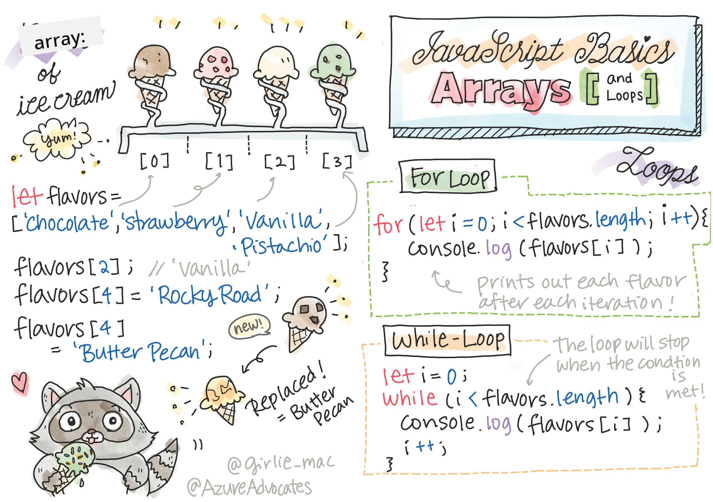
> اسکیچ نوٹ [Tomomi Imura](https://twitter.com/girlie_mac) کی طرف سے

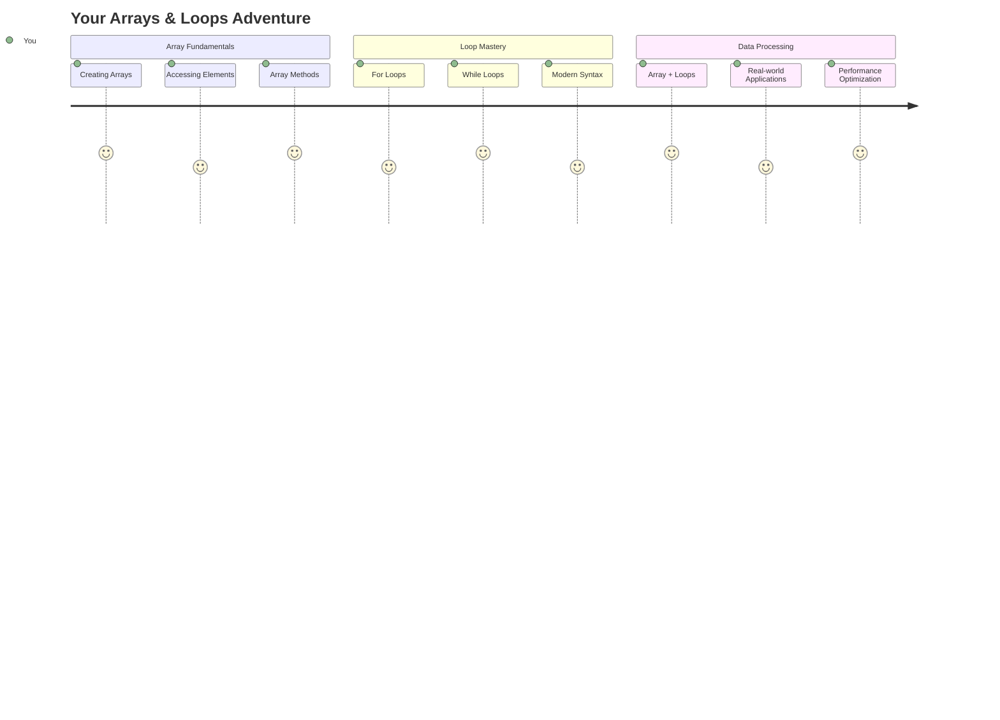

## لیکچر سے پہلے کا کوئز
[لیکچر سے پہلے کا کوئز](https://ff-quizzes.netlify.app/web/quiz/13)

کبھی سوچا ہے کہ ویب سائٹس شاپنگ کارٹ آئٹمز کو کیسے ٹریک کرتی ہیں یا آپ کی فرینڈ لسٹ کیسے دکھاتی ہیں؟ یہی وہ جگہ ہے جہاں arrays اور loops کام آتے ہیں۔ Arrays ڈیجیٹل کنٹینرز کی طرح ہیں جو کئی معلومات کو ایک ساتھ رکھتے ہیں، جبکہ loops آپ کو اس ڈیٹا کے ساتھ مؤثر طریقے سے کام کرنے دیتے ہیں بغیر بار بار کوڈ لکھے۔

یہ دونوں تصورات مل کر آپ کے پروگرامز میں معلومات کو سنبھالنے کی بنیاد بناتے ہیں۔ آپ سیکھیں گے کہ ہر قدم کو دستی طور پر لکھنے سے لے کر اسمارٹ، مؤثر کوڈ بنانے تک کیسے جائیں جو سیکڑوں یا ہزاروں آئٹمز کو جلدی سے پروسیس کر سکے۔

اس سبق کے اختتام تک، آپ سمجھ جائیں گے کہ صرف چند لائنوں کے کوڈ کے ساتھ پیچیدہ ڈیٹا کے کام کیسے انجام دیے جا سکتے ہیں۔ آئیے ان ضروری پروگرامنگ تصورات کو دریافت کریں۔

[](https://youtube.com/watch?v=1U4qTyq02Xw "Arrays")

[](https://www.youtube.com/watch?v=Eeh7pxtTZ3k "Loops")

> 🎥 اوپر دی گئی تصاویر پر کلک کریں arrays اور loops کے بارے میں ویڈیوز دیکھنے کے لیے۔

> آپ یہ سبق [Microsoft Learn](https://docs.microsoft.com/learn/modules/web-development-101-arrays/?WT.mc_id=academic-77807-sagibbon) پر لے سکتے ہیں!

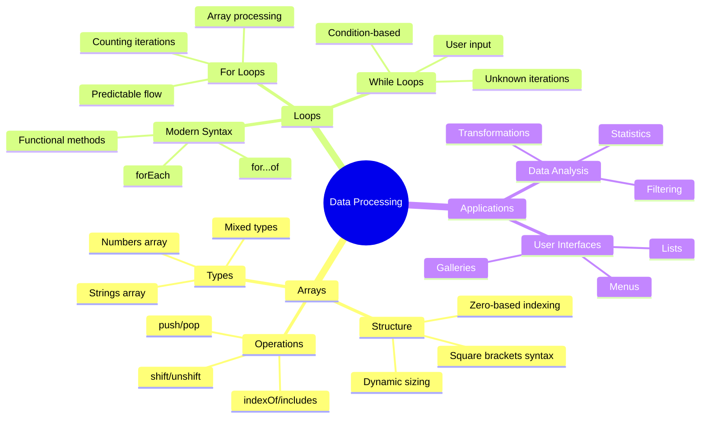

## Arrays

Arrays کو ایک ڈیجیٹل فائلنگ کیبنٹ کے طور پر سوچیں - ایک دراز میں ایک دستاویز رکھنے کے بجائے، آپ ایک ہی منظم کنٹینر میں کئی متعلقہ آئٹمز کو ترتیب دے سکتے ہیں۔ پروگرامنگ کی زبان میں، arrays آپ کو ایک منظم پیکج میں کئی معلومات ذخیرہ کرنے دیتے ہیں۔

چاہے آپ فوٹو گیلری بنا رہے ہوں، ٹو ڈو لسٹ کا انتظام کر رہے ہوں، یا کسی گیم میں ہائی اسکورز کو ٹریک کر رہے ہوں، arrays ڈیٹا آرگنائزیشن کی بنیاد فراہم کرتے ہیں۔ آئیے دیکھتے ہیں کہ یہ کیسے کام کرتے ہیں۔

✅ Arrays ہر جگہ موجود ہیں! کیا آپ arrays کی کسی حقیقی زندگی کی مثال دے سکتے ہیں، جیسے سولر پینل array؟

### Arrays بنانا

Arrays بنانا بہت آسان ہے - بس مربع بریکٹس استعمال کریں!

```javascript
// Empty array - like an empty shopping cart waiting for items
const myArray = [];
```

**یہاں کیا ہو رہا ہے؟**
آپ نے ابھی ان مربع بریکٹس `[]` کا استعمال کرتے ہوئے ایک خالی کنٹینر بنایا ہے۔ اسے ایک خالی لائبریری شیلف کی طرح سوچیں - یہ تیار ہے کہ آپ جو کتابیں وہاں رکھنا چاہتے ہیں انہیں ترتیب دے۔

آپ اپنے array کو شروع سے ہی ابتدائی اقدار کے ساتھ بھر سکتے ہیں:

```javascript
// Your ice cream shop's flavor menu
const iceCreamFlavors = ["Chocolate", "Strawberry", "Vanilla", "Pistachio", "Rocky Road"];

// A user's profile info (mixing different types of data)
const userData = ["John", 25, true, "developer"];

// Test scores for your favorite class
const scores = [95, 87, 92, 78, 85];
```

**نوٹ کرنے کے لیے دلچسپ باتیں:**
- آپ ایک ہی array میں متن، نمبر، یا یہاں تک کہ true/false اقدار کو ذخیرہ کر سکتے ہیں
- ہر آئٹم کو کاما سے الگ کریں - آسان!
- Arrays متعلقہ معلومات کو ایک ساتھ رکھنے کے لیے بہترین ہیں

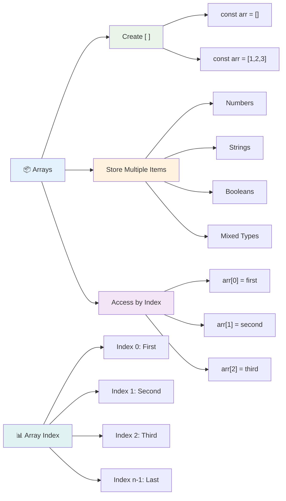

### Array Indexing

یہاں ایک چیز ہے جو شروع میں غیر معمولی لگ سکتی ہے: arrays اپنے آئٹمز کو 0 سے شروع کرتے ہوئے نمبر دیتے ہیں، 1 سے نہیں۔ یہ زیرو بیسڈ انڈیکسنگ کمپیوٹر میموری کے کام کرنے کے طریقے کی جڑوں میں ہے - یہ کمپیوٹنگ زبانوں جیسے C کے ابتدائی دنوں سے ایک پروگرامنگ روایت رہی ہے۔ array میں ہر جگہ کو ایک اپنا ایڈریس نمبر ملتا ہے جسے **index** کہا جاتا ہے۔

| انڈیکس | ویلیو | وضاحت |
|-------|-------|-------------|
| 0 | "Chocolate" | پہلا عنصر |
| 1 | "Strawberry" | دوسرا عنصر |
| 2 | "Vanilla" | تیسرا عنصر |
| 3 | "Pistachio" | چوتھا عنصر |
| 4 | "Rocky Road" | پانچواں عنصر |

✅ کیا آپ کو حیرت ہوتی ہے کہ arrays زیرو انڈیکس سے شروع ہوتے ہیں؟ کچھ پروگرامنگ زبانوں میں انڈیکس 1 سے شروع ہوتے ہیں۔ اس کے بارے میں دلچسپ تاریخ [Wikipedia](https://en.wikipedia.org/wiki/Zero-based_numbering) پر پڑھ سکتے ہیں۔

**Array عناصر تک رسائی حاصل کرنا:**

```javascript
const iceCreamFlavors = ["Chocolate", "Strawberry", "Vanilla", "Pistachio", "Rocky Road"];

// Access individual elements using bracket notation
console.log(iceCreamFlavors[0]); // "Chocolate" - first element
console.log(iceCreamFlavors[2]); // "Vanilla" - third element
console.log(iceCreamFlavors[4]); // "Rocky Road" - last element
```

**یہاں کیا ہو رہا ہے:**
- **استعمال کرتا ہے** مربع بریکٹ نوٹیشن کے ساتھ انڈیکس نمبر عناصر تک رسائی حاصل کرنے کے لیے
- **واپس کرتا ہے** array میں اس مخصوص پوزیشن پر ذخیرہ شدہ ویلیو
- **شروع کرتا ہے** 0 سے گنتی، پہلا عنصر انڈیکس 0 بناتا ہے

**Array عناصر میں ترمیم کرنا:**

```javascript
// Change an existing value
iceCreamFlavors[4] = "Butter Pecan";
console.log(iceCreamFlavors[4]); // "Butter Pecan"

// Add a new element at the end
iceCreamFlavors[5] = "Cookie Dough";
console.log(iceCreamFlavors[5]); // "Cookie Dough"
```

**اوپر، ہم نے:**
- **ترمیم کی** انڈیکس 4 پر عنصر "Rocky Road" سے "Butter Pecan" میں
- **ایک نیا عنصر شامل کیا** "Cookie Dough" انڈیکس 5 پر
- **خودکار طور پر** array کی لمبائی بڑھائی جب موجودہ حد سے آگے شامل کیا

### Array کی لمبائی اور عام طریقے

Arrays میں بلٹ ان پراپرٹیز اور طریقے ہوتے ہیں جو ڈیٹا کے ساتھ کام کرنا بہت آسان بناتے ہیں۔

**Array کی لمبائی معلوم کرنا:**

```javascript
const iceCreamFlavors = ["Chocolate", "Strawberry", "Vanilla", "Pistachio", "Rocky Road"];
console.log(iceCreamFlavors.length); // 5

// Length updates automatically as array changes
iceCreamFlavors.push("Mint Chip");
console.log(iceCreamFlavors.length); // 6
```

**یاد رکھنے کے اہم نکات:**
- **واپس کرتا ہے** array میں عناصر کی کل تعداد
- **خودکار طور پر اپ ڈیٹ ہوتا ہے** جب عناصر شامل یا ہٹائے جاتے ہیں
- **فراہم کرتا ہے** ایک متحرک گنتی جو loops اور validation کے لیے مفید ہے

**ضروری Array طریقے:**

```javascript
const fruits = ["apple", "banana", "orange"];

// Add elements
fruits.push("grape");           // Adds to end: ["apple", "banana", "orange", "grape"]
fruits.unshift("strawberry");   // Adds to beginning: ["strawberry", "apple", "banana", "orange", "grape"]

// Remove elements
const lastFruit = fruits.pop();        // Removes and returns "grape"
const firstFruit = fruits.shift();     // Removes and returns "strawberry"

// Find elements
const index = fruits.indexOf("banana"); // Returns 1 (position of "banana")
const hasApple = fruits.includes("apple"); // Returns true
```

**ان طریقوں کو سمجھنا:**
- **شامل کرتا ہے** عناصر `push()` (آخر میں) اور `unshift()` (شروع میں) کے ساتھ
- **ہٹاتا ہے** عناصر `pop()` (آخر میں) اور `shift()` (شروع میں) کے ساتھ
- **مقام کا پتہ لگاتا ہے** `indexOf()` کے ساتھ اور موجودگی کو چیک کرتا ہے `includes()` کے ساتھ
- **واپس کرتا ہے** مفید ویلیوز جیسے ہٹائے گئے عناصر یا پوزیشن انڈیکس

✅ خود آزمائیں! اپنے براؤزر کے کنسول میں ایک array بنائیں اور اس میں ترمیم کریں۔

### 🧠 **Array کی بنیادی باتوں کی جانچ: اپنے ڈیٹا کو منظم کرنا**

**اپنی array کی سمجھ کو جانچیں:**
- آپ کے خیال میں arrays 0 سے گنتی کیوں شروع کرتے ہیں نہ کہ 1 سے؟
- اگر آپ کسی انڈیکس تک رسائی حاصل کرنے کی کوشش کریں جو موجود نہیں ہے (جیسے `arr[100]` 5 عنصر والے array میں)، تو کیا ہوگا؟
- کیا آپ تین حقیقی دنیا کے منظرنامے سوچ سکتے ہیں جہاں arrays مفید ہوں؟

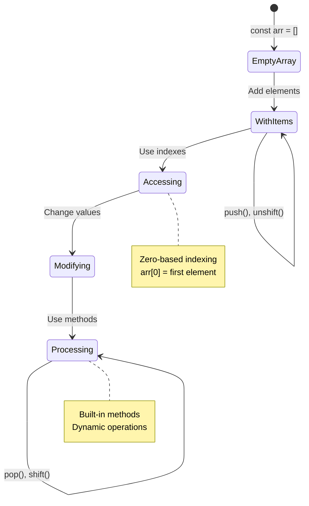

> **حقیقی دنیا کی بصیرت**: Arrays پروگرامنگ میں ہر جگہ موجود ہیں! سوشل میڈیا فیڈز، شاپنگ کارٹس، فوٹو گیلریاں، پلے لسٹ گانے - یہ سب پردے کے پیچھے arrays ہیں!

## Loops

چارلس ڈکنز کے ناولوں میں مشہور سزا کے بارے میں سوچیں جہاں طلباء کو بار بار تختی پر لائنیں لکھنی پڑتی تھیں۔ تصور کریں کہ اگر آپ کسی کو صرف یہ ہدایت دے سکیں کہ "یہ جملہ 100 بار لکھو" اور یہ خود بخود ہو جائے۔ یہی کام loops آپ کے کوڈ کے لیے کرتے ہیں۔

Loops ایک تھکے بغیر کام کرنے والے معاون کی طرح ہیں جو کاموں کو بغیر کسی غلطی کے دہراتے ہیں۔ چاہے آپ کو شاپنگ کارٹ میں ہر آئٹم کو چیک کرنا ہو یا البم میں تمام تصاویر دکھانی ہوں، loops مؤثر طریقے سے تکرار کو سنبھالتے ہیں۔

جاوا اسکرپٹ کئی قسم کے loops فراہم کرتا ہے جن میں سے انتخاب کیا جا سکتا ہے۔ آئیے ہر ایک کو دیکھتے ہیں اور سمجھتے ہیں کہ کب ان کا استعمال کرنا ہے۔

```mermaid
flowchart TD
    A["🔄 Loop Types"] --> B["For Loop"]
    A --> C["While Loop"]
    A --> D["For...of Loop"]
    A --> E["forEach Method"]
    
    B --> B1["Known iterations"]
    B --> B2["Counter-based"]
    B --> B3["for(init; condition; increment)"]
    
    C --> C1["Unknown iterations"]
    C --> C2["Condition-based"]
    C --> C3["while(condition)"]
    
    D --> D1["Modern ES6+"]
    D --> D2["Array iteration"]
    D --> D3["for(item of array)"]
    
    E --> E1["Functional style"]
    E --> E2["Array method"]
    E --> E3["array.forEach(callback)"]
    
    F["⏰ When to Use"] --> F1["For: Counting, indexes"]
    F --> F2["While: User input, searching"]
    F --> F3["For...of: Simple iteration"]
    F --> F4["forEach: Functional programming"]
    
    style A fill:#e3f2fd
    style B fill:#e8f5e8
    style C fill:#fff3e0
    style D fill:#f3e5f5
    style E fill:#e0f2f1
    style F fill:#fce4ec
```

### For Loop

`for` loop ایک ٹائمر سیٹ کرنے کی طرح ہے - آپ کو بالکل معلوم ہوتا ہے کہ آپ کچھ کتنی بار کرنا چاہتے ہیں۔ یہ بہت منظم اور پیش گوئی کے قابل ہے، جو اسے arrays کے ساتھ کام کرنے یا چیزوں کو گننے کے لیے بہترین بناتا ہے۔

**For Loop کی ساخت:**

| جزو | مقصد | مثال |
|-----------|---------|----------|
| **Initialization** | شروع کرنے کا نقطہ سیٹ کرتا ہے | `let i = 0` |
| **Condition** | کب جاری رکھنا ہے | `i < 10` |
| **Increment** | کیسے اپ ڈیٹ کرنا ہے | `i++` |

```javascript
// Counting from 0 to 9
for (let i = 0; i < 10; i++) {
  console.log(`Count: ${i}`);
}

// More practical example: processing scores
const testScores = [85, 92, 78, 96, 88];
for (let i = 0; i < testScores.length; i++) {
  console.log(`Student ${i + 1}: ${testScores[i]}%`);
}
```

**مرحلہ وار، یہاں کیا ہو رہا ہے:**
- **ابتدائیہ** کاؤنٹر ویریبل `i` کو 0 پر سیٹ کرتا ہے شروع میں
- **چیک کرتا ہے** شرط `i < 10` ہر iteration سے پہلے
- **عمل کرتا ہے** کوڈ بلاک جب شرط درست ہو
- **اضافہ کرتا ہے** `i` کو 1 سے ہر iteration کے بعد `i++` کے ساتھ
- **روکتا ہے** جب شرط غلط ہو جائے (جب `i` 10 تک پہنچ جائے)

✅ اس کوڈ کو براؤزر کنسول میں چلائیں۔ کیا ہوتا ہے جب آپ کاؤنٹر، شرط، یا iteration expression میں چھوٹے تبدیلیاں کرتے ہیں؟ کیا آپ اسے الٹا چلا سکتے ہیں، ایک countdown بناتے ہوئے؟

### 🗓️ **For Loop کی مہارت کی جانچ: کنٹرول شدہ تکرار**

**اپنی for loop کی سمجھ کو جانچیں:**
- for loop کے تین حصے کیا ہیں، اور ہر ایک کیا کرتا ہے؟
- آپ array کو الٹا کیسے loop کریں گے؟
- اگر آپ increment حصہ (`i++`) بھول جائیں تو کیا ہوگا؟

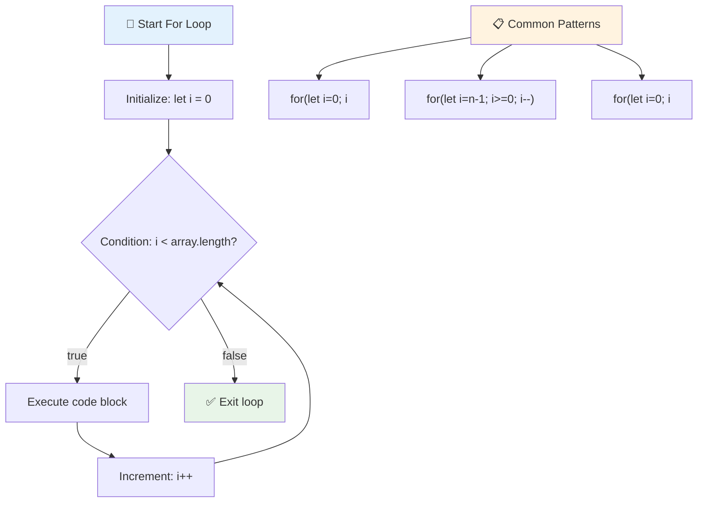

> **Loop کی دانشمندی**: For loops بہترین ہیں جب آپ کو بالکل معلوم ہو کہ آپ کو کچھ کتنی بار دہرانا ہے۔ یہ array پروسیسنگ کے لیے سب سے عام انتخاب ہیں!

### While Loop

`while` loop ایسا ہے جیسے "یہ کرتے رہو جب تک..." - آپ کو معلوم نہیں ہو سکتا کہ یہ کتنی بار چلے گا، لیکن آپ جانتے ہیں کہ کب رکنا ہے۔ یہ چیزوں کے لیے بہترین ہے جیسے صارف سے ان پٹ مانگنا جب تک وہ آپ کو مطلوبہ چیز نہ دے، یا ڈیٹا میں تلاش کرنا جب تک آپ کو مطلوبہ چیز نہ ملے۔

**While Loop کی خصوصیات:**
- **جاری رکھتا ہے** جب تک شرط درست ہو
- **ضرورت ہوتی ہے** کسی بھی کاؤنٹر ویریبل کا دستی انتظام
- **چیک کرتا ہے** شرط ہر iteration سے پہلے
- **خطرہ ہوتا ہے** لامتناہی loops کا اگر شرط کبھی غلط نہ ہو

```javascript
// Basic counting example
let i = 0;
while (i < 10) {
  console.log(`While count: ${i}`);
  i++; // Don't forget to increment!
}

// More practical example: processing user input
let userInput = "";
let attempts = 0;
const maxAttempts = 3;

while (userInput !== "quit" && attempts < maxAttempts) {
  userInput = prompt(`Enter 'quit' to exit (attempt ${attempts + 1}):`);
  attempts++;
}

if (attempts >= maxAttempts) {
  console.log("Maximum attempts reached!");
}
```

**ان مثالوں کو سمجھنا:**
- **منظم کرتا ہے** کاؤنٹر ویریبل `i` کو دستی طور پر loop کے اندر
- **اضافہ کرتا ہے** کاؤنٹر کو لامتناہی loops سے بچانے کے لیے
- **عملی استعمال کا مظاہرہ کرتا ہے** صارف انپٹ اور کوششوں کی حد بندی کے ساتھ
- **شامل کرتا ہے** حفاظتی میکانزم لامتناہی عمل کو روکنے کے لیے

### ♾️ **While Loop کی دانشمندی کی جانچ: شرط پر مبنی تکرار**

**اپنی while loop کی سمجھ کو جانچیں:**
- while loops استعمال کرتے وقت سب سے بڑا خطرہ کیا ہے؟
- آپ while loop کو for loop پر کب ترجیح دیں گے؟
- آپ لامتناہی loops کو کیسے روک سکتے ہیں؟

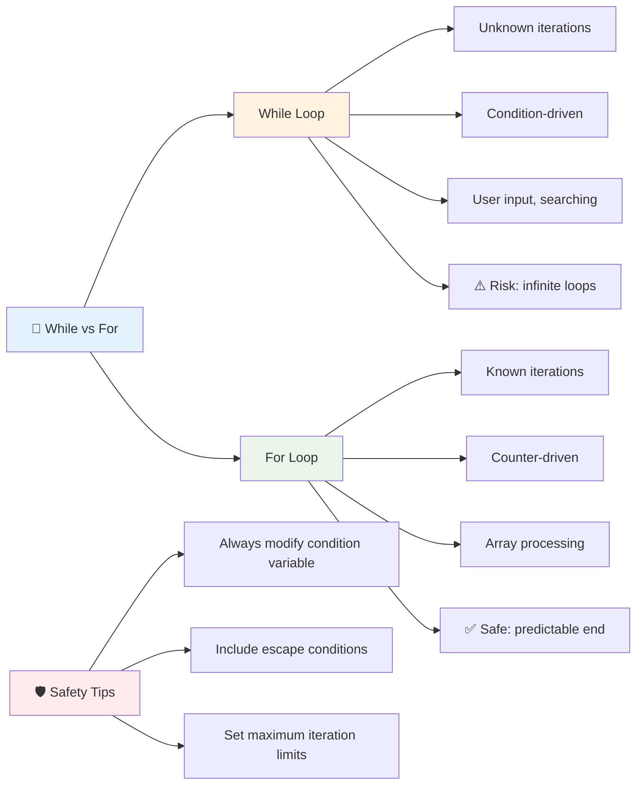

> **حفاظتی پہلو**: While loops طاقتور ہیں لیکن شرط کے انتظام میں احتیاط کی ضرورت ہوتی ہے۔ ہمیشہ یقینی بنائیں کہ آپ کی loop شرط آخر کار غلط ہو جائے گی!

### جدید Loop کے متبادل

جاوا اسکرپٹ جدید loop syntax پیش کرتا ہے جو آپ کے کوڈ کو زیادہ پڑھنے کے قابل اور کم غلطی کا شکار بناتا ہے۔

**For...of Loop (ES6+):**

```javascript
const colors = ["red", "green", "blue", "yellow"];

// Modern approach - cleaner and safer
for (const color of colors) {
  console.log(`Color: ${color}`);
}

// Compare with traditional for loop
for (let i = 0; i < colors.length; i++) {
  console.log(`Color: ${colors[i]}`);
}
```

**For...of کے اہم فوائد:**
- **ختم کرتا ہے** انڈیکس کے انتظام اور ممکنہ off-by-one غلطیوں کو
- **فراہم کرتا ہے** array عناصر تک براہ راست رسائی
- **بہتر بناتا ہے** کوڈ readability اور syntax کی پیچیدگی کو کم کرتا ہے

**forEach طریقہ:**

```javascript
const prices = [9.99, 15.50, 22.75, 8.25];

// Using forEach for functional programming style
prices.forEach((price, index) => {
  console.log(`Item ${index + 1}: $${price.toFixed(2)}`);
});

// forEach with arrow functions for simple operations
prices.forEach(price => console.log(`Price: $${price}`));
```

**forEach کے بارے میں جاننے کی باتیں:**
- **عمل کرتا ہے** ہر array عنصر کے لیے ایک فنکشن
- **فراہم کرتا ہے** عنصر کی ویلیو اور انڈیکس دونوں کو پیرامیٹرز کے طور پر
- **روکا نہیں جا سکتا** جلدی (روایتی loops کے برعکس)
- **واپس کرتا ہے** undefined (نیا array نہیں بناتا)

✅ آپ for loop کے مقابلے میں while loop کیوں منتخب کریں گے؟ 17K ناظرین نے StackOverflow پر یہی سوال کیا، اور کچھ آراء [آپ کے لیے دلچسپ ہو سکتی ہیں](https://stackoverflow.com/questions/39969145/while-loops-vs-for-loops-in-javascript)۔

### 🎨 **جدید Loop Syntax کی جانچ: ES6+ کو اپنانا**

**اپنی جدید جاوا اسکرپٹ کی سمجھ کو جانچیں:**
- روایتی for loops کے مقابلے میں `for...of` کے فوائد کیا ہیں؟
- آپ روایتی for loops کو کب ترجیح دیں گے؟
- `forEach` اور `map` میں کیا فرق ہے؟

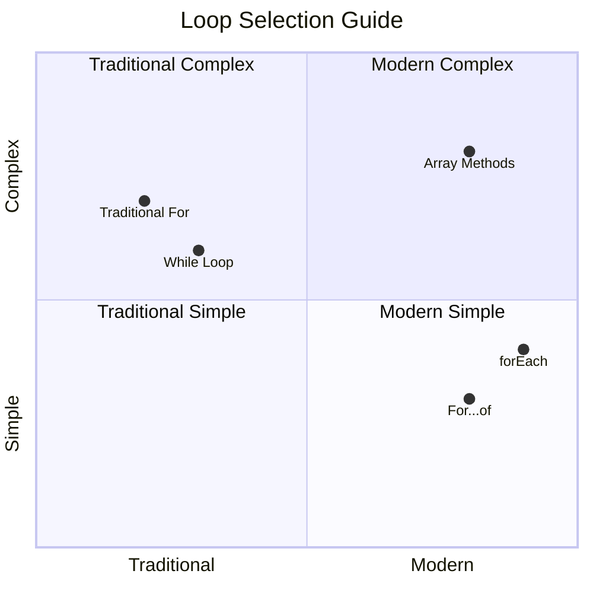

> **جدید رجحان**: ES6+ syntax جیسے `for...of` اور `forEach` array iteration کے لیے ترجیحی طریقہ بن رہے ہیں کیونکہ یہ صاف اور کم غلطی کا شکار ہیں!

## Loops اور Arrays

Arrays کو loops کے ساتھ جوڑنا طاقتور ڈیٹا پروسیسنگ کی صلاحیتیں پیدا کرتا ہے۔ یہ جوڑی بہت سے پروگرامنگ کاموں کے لیے بنیادی ہے، جیسے فہرستیں دکھانا یا شماریات کا حساب لگانا۔

**روایتی Array پروسیسنگ:**

```javascript
const iceCreamFlavors = ["Chocolate", "Strawberry", "Vanilla", "Pistachio", "Rocky Road"];

// Classic for loop approach
for (let i = 0; i < iceCreamFlavors.length; i++) {
  console.log(`Flavor ${i + 1}: ${iceCreamFlavors[i]}`);
}

// Modern for...of approach
for (const flavor of iceCreamFlavors) {
  console.log(`Available flavor: ${flavor}`);
}
```

**آئیے ہر طریقہ کو سمجھتے ہیں:**
- **استعمال کرتا ہے** array کی لمبائی پراپرٹی loop کی حد کا تعین کرنے کے لیے
- **رسائی حاصل کرتا ہے** عناصر کو انڈیکس کے ذریعے روایتی for loops میں
- **فراہم کرتا ہے** براہ راست عنصر تک رسائی for...of loops میں
- **پروسیس کرتا ہے** ہر array عنصر کو بالکل ایک بار

**عملی ڈیٹا پروسیسنگ کی مثال:**

```javascript
const studentGrades = [85, 92, 78, 96, 88, 73, 89];
let total = 0;
let highestGrade = studentGrades[0];
let lowestGrade = studentGrades[0];

// Process all grades with a single loop
for (let i = 0; i < studentGrades.length; i++) {
  const grade = studentGrades[i];
  total += grade;
  
  if (grade > highestGrade) {
    highestGrade = grade;
  }
  
  if (grade < lowestGrade) {
    lowestGrade = grade;
  }
}

const average = total / studentGrades.length;
console.log(`Average: ${average.toFixed(1)}`);
console.log(`Highest: ${highestGrade}`);
console.log(`Lowest: ${lowestGrade}`);
```

**یہ کوڈ کیسے کام کرتا ہے:**
- **ابتدائیہ کرتا ہے** ٹریکنگ ویریبلز کو مجموعی اور انتہائی اقدار کے لیے
- **پروسیس کرتا ہے** ہر گریڈ کو ایک مؤثر loop کے ساتھ
- **جمع کرتا ہے** کل کو اوسط حساب کے لیے
- **ٹریک کرتا ہے** سب سے زیادہ اور سب سے کم ویلیوز iteration کے دوران
- **حساب کرتا ہے** حتمی شماریات loop کے اختتام کے بعد

✅ اپنے براؤزر کے کنسول میں اپنے بنائے ہوئے array پر loop کرنے کا تجربہ کریں۔

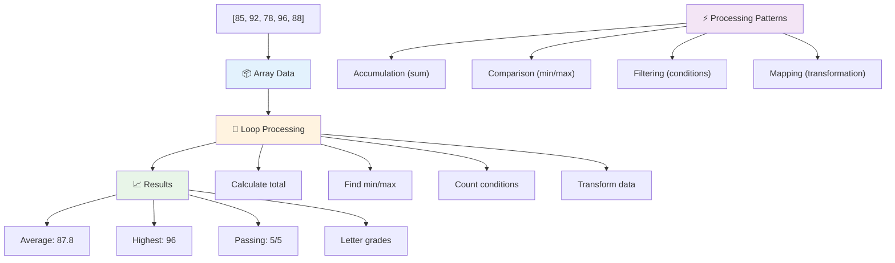

---

## GitHub Copilot Agent Challenge 🚀

Agent mode استعمال کریں درج ذیل چیلنج مکمل کرنے کے لیے:

**تفصیل:** ایک جامع ڈیٹا پروسیسنگ فنکشن بنائیں جو arrays اور loops کو ملا کر ایک dataset کا تجزیہ کرے اور معنی خیز بصیرت پیدا کرے۔

**Prompt:** ایک فنکشن بنائیں جس کا نام `analyzeGrades` ہو جو ایک array لے جس میں طالب علموں کے گریڈ objects ہوں (ہر ایک میں name اور score پراپرٹیز ہوں) اور ایک object واپس کرے جس میں شماریات شامل ہوں جیسے سب سے زیادہ سکور، سب سے کم سکور، اوسط سکور، پاس ہونے والے طالب علموں کی تعداد (score >= 70)، اور ایک array طالب علموں کے ناموں کا جو اوسط سے زیادہ سکور حاصل کریں۔ اپنے حل میں کم از کم دو مختلف loop اقسام استعمال کریں۔

Agent mode کے بارے میں مزید جانیں [یہاں](https://code.visualstudio.com/blogs/2025/02/24/introducing-copilot-agent-mode)۔

## 🚀 چیلنج
جاوا اسکرپٹ کئی جدید array کے طریقے پیش کرتا ہے جو مخصوص کاموں کے لیے روایتی loops کی جگہ لے سکتے ہیں۔ [forEach](https://developer.mozilla.org/docs/Web/JavaScript/Reference/Global_Objects/Array/forEach)، [for-of](https://developer.mozilla.org/docs/Web/JavaScript/Reference/Statements/for...of)، [map](https://developer.mozilla.org/docs/Web/JavaScript/Reference/Global_Objects/Array/map)، [filter](https://developer.mozilla.org/docs/Web/JavaScript/Reference/Global_Objects/Array/filter)، اور [reduce](https://developer.mozilla.org/docs/Web/JavaScript/Reference/Global_Objects/Array/reduce) کو دریافت کریں۔

**آپ کا چیلنج:** طالب علموں کے گریڈز کی مثال کو کم از کم تین مختلف array کے طریقوں کا استعمال کرتے ہوئے دوبارہ لکھیں۔ دیکھیں کہ جدید جاوا اسکرپٹ سینٹیکس کے ساتھ کوڈ کتنا صاف اور پڑھنے کے قابل ہو جاتا ہے۔

## لیکچر کے بعد کا کوئز
[لیکچر کے بعد کا کوئز](https://ff-quizzes.netlify.app/web/quiz/14)

## جائزہ اور خود مطالعہ

جاوا اسکرپٹ میں arrays کے ساتھ کئی طریقے منسلک ہوتے ہیں جو ڈیٹا کو منظم کرنے میں انتہائی مفید ہیں۔ [ان طریقوں کے بارے میں پڑھیں](https://developer.mozilla.org/docs/Web/JavaScript/Reference/Global_Objects/Array) اور ان میں سے کچھ کو اپنی تخلیق کردہ array پر آزمائیں (جیسے push، pop، slice اور splice)۔

## اسائنمنٹ

[ایک Array کو لوپ کریں](assignment.md)

---

## 📊 **آپ کے Arrays اور Loops کے ٹول کٹ کا خلاصہ**

```mermaid
graph TD
    A["🎯 Arrays & Loops Mastery"] --> B["📦 Array Fundamentals"]
    A --> C["🔄 Loop Types"]
    A --> D["🔗 Data Processing"]
    A --> E["🎨 Modern Techniques"]
    
    B --> B1["Creation: [ ]"]
    B --> B2["Indexing: arr[0]"]
    B --> B3["Methods: push, pop"]
    B --> B4["Properties: length"]
    
    C --> C1["For: Known iterations"]
    C --> C2["While: Condition-based"]
    C --> C3["For...of: Direct access"]
    C --> C4["forEach: Functional"]
    
    D --> D1["Statistics calculation"]
    D --> D2["Data transformation"]
    D --> D3["Filtering & searching"]
    D --> D4["Real-time processing"]
    
    E --> E1["Arrow functions"]
    E --> E2["Method chaining"]
    E --> E3["Destructuring"]
    E --> E4["Template literals"]
    
    F["💡 Key Benefits"] --> F1["Efficient data handling"]
    F --> F2["Reduced code repetition"]
    F --> F3["Scalable solutions"]
    F --> F4["Cleaner syntax"]
    
    style A fill:#e3f2fd
    style B fill:#e8f5e8
    style C fill:#fff3e0
    style D fill:#f3e5f5
    style E fill:#e0f2f1
    style F fill:#fce4ec
```

---

## 🚀 آپ کے Arrays اور Loops کی مہارت کا ٹائم لائن

### ⚡ **اگلے 5 منٹ میں آپ کیا کر سکتے ہیں**
- [ ] اپنی پسندیدہ فلموں کی ایک array بنائیں اور مخصوص عناصر تک رسائی حاصل کریں
- [ ] ایک for loop لکھیں جو 1 سے 10 تک گنتی کرے
- [ ] سبق سے جدید array کے طریقوں کا چیلنج آزمائیں
- [ ] اپنے براؤزر کنسول میں array indexing کی مشق کریں

### 🎯 **اس گھنٹے میں آپ کیا حاصل کر سکتے ہیں**
- [ ] لیکچر کے بعد کا کوئز مکمل کریں اور کسی بھی مشکل تصورات کا جائزہ لیں
- [ ] GitHub Copilot چیلنج سے جامع گریڈ تجزیہ کار بنائیں
- [ ] ایک سادہ shopping cart بنائیں جو اشیاء کو شامل اور ہٹائے
- [ ] مختلف loop کی اقسام میں تبدیل کرنے کی مشق کریں
- [ ] array کے طریقوں جیسے `push`، `pop`، `slice`، اور `splice` کے ساتھ تجربہ کریں

### 📅 **آپ کا ہفتہ بھر کا ڈیٹا پروسیسنگ سفر**
- [ ] "ایک Array کو لوپ کریں" اسائنمنٹ کو تخلیقی اضافوں کے ساتھ مکمل کریں
- [ ] arrays اور loops کا استعمال کرتے ہوئے ایک to-do list ایپلیکیشن بنائیں
- [ ] عددی ڈیٹا کے لیے ایک سادہ شماریاتی کیلکولیٹر بنائیں
- [ ] [MDN array کے طریقوں](https://developer.mozilla.org/docs/Web/JavaScript/Reference/Global_Objects/Array) کے ساتھ مشق کریں
- [ ] ایک فوٹو گیلری یا موسیقی کی پلے لسٹ انٹرفیس بنائیں
- [ ] `map`، `filter`، اور `reduce` کے ساتھ functional programming کو دریافت کریں

### 🌟 **آپ کی مہینے بھر کی تبدیلی**
- [ ] جدید array آپریشنز اور کارکردگی کی اصلاح میں مہارت حاصل کریں
- [ ] ایک مکمل ڈیٹا visualization ڈیش بورڈ بنائیں
- [ ] ڈیٹا پروسیسنگ سے متعلق اوپن سورس پروجیکٹس میں حصہ لیں
- [ ] عملی مثالوں کے ساتھ کسی اور کو arrays اور loops کے بارے میں سکھائیں
- [ ] دوبارہ استعمال کے قابل ڈیٹا پروسیسنگ فنکشنز کی ذاتی لائبریری بنائیں
- [ ] arrays پر مبنی الگورتھمز اور ڈیٹا اسٹرکچرز کو دریافت کریں

### 🏆 **ڈیٹا پروسیسنگ چیمپئن کے آخری چیک ان**

**اپنی array اور loop کی مہارت کا جشن منائیں:**
- آپ نے حقیقی دنیا کی ایپلیکیشنز کے لیے سب سے زیادہ مفید array آپریشن کون سا سیکھا؟
- آپ کو کون سا loop کی قسم سب سے زیادہ قدرتی لگتی ہے اور کیوں؟
- arrays اور loops کو سمجھنے سے آپ کے ڈیٹا کو منظم کرنے کے طریقے میں کیا تبدیلی آئی؟
- آپ اگلا کون سا پیچیدہ ڈیٹا پروسیسنگ کام کرنا چاہیں گے؟

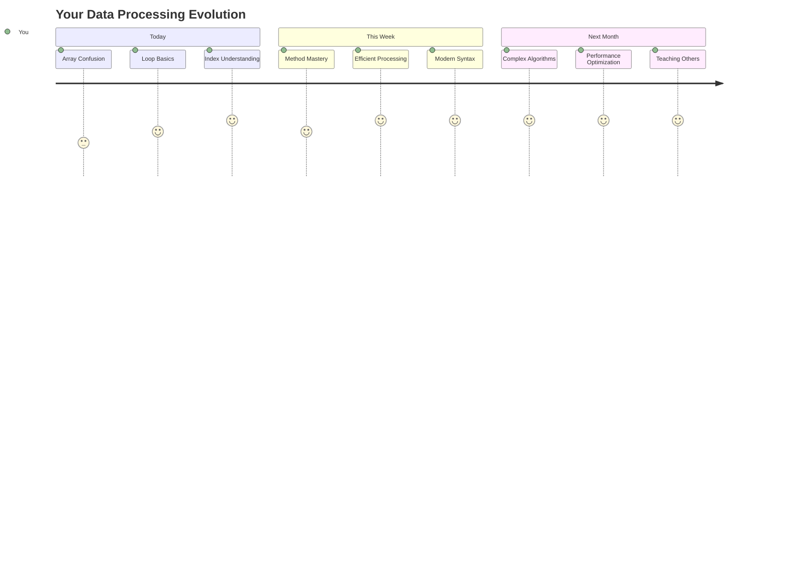

> 📦 **آپ نے ڈیٹا کو منظم کرنے اور پروسیسنگ کی طاقت کو کھول دیا ہے!** Arrays اور loops تقریباً ہر ایپلیکیشن کی بنیاد ہیں جو آپ کبھی بنائیں گے۔ سادہ فہرستوں سے لے کر پیچیدہ ڈیٹا تجزیہ تک، آپ کے پاس اب معلومات کو مؤثر اور خوبصورتی سے سنبھالنے کے اوزار موجود ہیں۔ ہر متحرک ویب سائٹ، موبائل ایپ، اور ڈیٹا پر مبنی ایپلیکیشن ان بنیادی تصورات پر انحصار کرتی ہے۔ قابل پیمائش ڈیٹا پروسیسنگ کی دنیا میں خوش آمدید! 🎉

---

**اعلانِ لاتعلقی**:  
یہ دستاویز AI ترجمہ سروس [Co-op Translator](https://github.com/Azure/co-op-translator) کا استعمال کرتے ہوئے ترجمہ کی گئی ہے۔ ہم درستگی کے لیے کوشش کرتے ہیں، لیکن براہ کرم آگاہ رہیں کہ خودکار ترجمے میں غلطیاں یا غیر درستیاں ہو سکتی ہیں۔ اصل دستاویز کو اس کی اصل زبان میں مستند ذریعہ سمجھا جانا چاہیے۔ اہم معلومات کے لیے، پیشہ ور انسانی ترجمہ کی سفارش کی جاتی ہے۔ اس ترجمے کے استعمال سے پیدا ہونے والی کسی بھی غلط فہمی یا غلط تشریح کے لیے ہم ذمہ دار نہیں ہیں۔