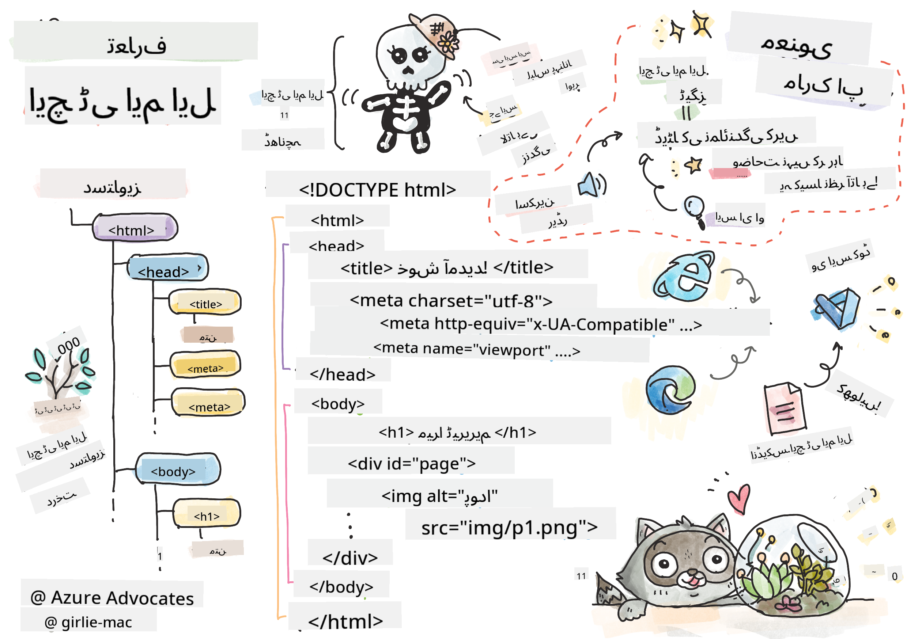
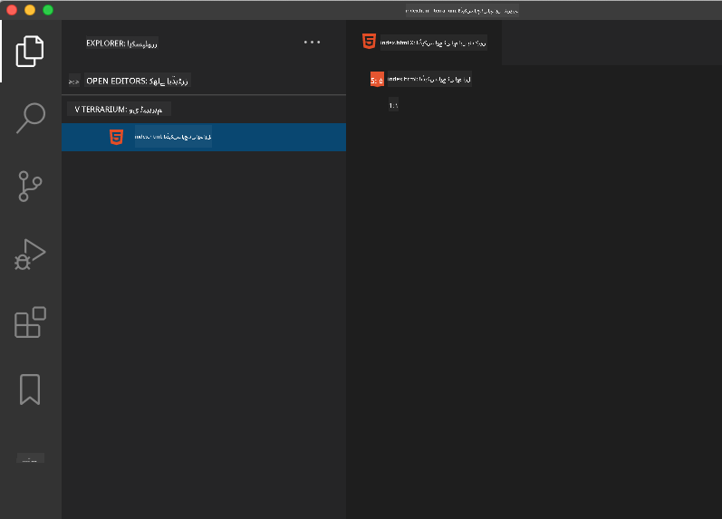

<!--
CO_OP_TRANSLATOR_METADATA:
{
  "original_hash": "f6235d42b9e6862267e92c53f1be2655",
  "translation_date": "2025-10-20T20:53:06+00:00",
  "source_file": "3-terrarium/1-intro-to-html/README.md",
  "language_code": "ur"
}
-->
# ٹیریریم پروجیکٹ حصہ 1: HTML کا تعارف


> اسکیچ نوٹ از [ٹومومی ایمورا](https://twitter.com/girlie_mac)

## لیکچر سے پہلے کا کوئز

[لیکچر سے پہلے کا کوئز](https://ff-quizzes.netlify.app/web/quiz/15)

> ویڈیو دیکھیں

> 
> [](https://www.youtube.com/watch?v=1TvxJKBzhyQ)

### تعارف

HTML، یا HyperText Markup Language، ویب کا 'ڈھانچہ' ہے۔ اگر CSS آپ کے HTML کو 'سجاتا' ہے اور JavaScript اسے زندگی بخشتا ہے، تو HTML آپ کی ویب ایپلیکیشن کا جسم ہے۔ HTML کی syntax بھی اس خیال کی عکاسی کرتی ہے، کیونکہ اس میں "head"، "body"، اور "footer" ٹیگز شامل ہیں۔

اس سبق میں، ہم HTML کا استعمال کرتے ہوئے اپنے ورچوئل ٹیریریم کے انٹرفیس کا 'ڈھانچہ' بنائیں گے۔ اس میں ایک عنوان اور تین کالم ہوں گے: ایک دائیں اور ایک بائیں کالم جہاں ڈریگ ایبل پودے ہوں گے، اور ایک مرکزی علاقہ جو اصل شیشے کی طرح کا ٹیریریم ہوگا۔ اس سبق کے اختتام تک، آپ کالمز میں پودے دیکھ سکیں گے، لیکن انٹرفیس تھوڑا عجیب لگے گا؛ فکر نہ کریں، اگلے حصے میں آپ انٹرفیس کو بہتر بنانے کے لیے CSS اسٹائلز شامل کریں گے۔

### کام

اپنے کمپیوٹر پر 'terrarium' نامی ایک فولڈر بنائیں اور اس کے اندر 'index.html' نامی ایک فائل بنائیں۔ آپ یہ Visual Studio Code میں کر سکتے ہیں، جب آپ اپنا terrarium فولڈر بنائیں گے تو ایک نیا VS Code ونڈو کھولیں، 'open folder' پر کلک کریں، اور اپنے نئے فولڈر پر جائیں۔ Explorer پین میں چھوٹے 'file' بٹن پر کلک کریں اور نئی فائل بنائیں:



یا

اپنے git bash پر یہ کمانڈز استعمال کریں:
* `mkdir terrarium`
* `cd terrarium`
* `touch index.html`
* `code index.html` یا `nano index.html`

> index.html فائلز براؤزر کو بتاتی ہیں کہ یہ فولڈر میں ڈیفالٹ فائل ہے؛ URLs جیسے `https://anysite.com/test` ممکنہ طور پر ایک فولڈر اسٹرکچر استعمال کرتے ہوئے بنائے گئے ہیں جس میں ایک فولڈر 'test' شامل ہے جس کے اندر `index.html` ہے؛ `index.html` کو URL میں ظاہر ہونے کی ضرورت نہیں۔

---

## DocType اور html ٹیگز

HTML فائل کی پہلی لائن اس کا doctype ہے۔ یہ تھوڑا حیران کن ہے کہ آپ کو یہ لائن فائل کے بالکل اوپر رکھنی ہوتی ہے، لیکن یہ پرانے براؤزرز کو بتاتی ہے کہ براؤزر کو صفحہ کو ایک معیاری موڈ میں رینڈر کرنا ہے، موجودہ html وضاحت کے مطابق۔

> ٹپ: VS Code میں، آپ کسی ٹیگ پر ہوور کر سکتے ہیں اور MDN Reference گائیڈز سے اس کے استعمال کے بارے میں معلومات حاصل کر سکتے ہیں۔

دوسری لائن `<html>` ٹیگ کی اوپننگ ٹیگ ہونی چاہیے، ابھی اس کے بعد اس کی کلوزنگ ٹیگ `</html>` ہونی چاہیے۔ یہ ٹیگز آپ کے انٹرفیس کے روٹ عناصر ہیں۔

### کام

اپنی `index.html` فائل کے اوپر یہ لائنز شامل کریں:

```HTML
<!DOCTYPE html>
<html></html>
```

✅ DocType کو ایک کوئری اسٹرنگ کے ساتھ سیٹ کر کے مختلف موڈز کا تعین کیا جا سکتا ہے: [Quirks Mode اور Standards Mode](https://developer.mozilla.org/docs/Web/HTML/Quirks_Mode_and_Standards_Mode)۔ یہ موڈز واقعی پرانے براؤزرز کو سپورٹ کرنے کے لیے استعمال ہوتے تھے جو آج کل عام طور پر استعمال نہیں ہوتے (Netscape Navigator 4 اور Internet Explorer 5)۔ آپ معیاری doctype اعلان پر قائم رہ سکتے ہیں۔

---

## دستاویز کا 'head'

HTML دستاویز کا 'head' علاقہ آپ کے ویب صفحے کے بارے میں اہم معلومات شامل کرتا ہے، جسے [metadata](https://developer.mozilla.org/docs/Web/HTML/Element/meta) بھی کہا جاتا ہے۔ ہمارے معاملے میں، ہم ویب سرور کو بتاتے ہیں جس پر یہ صفحہ رینڈر کرنے کے لیے بھیجا جائے گا، یہ چار چیزیں:

- صفحے کا عنوان
- صفحے کی metadata بشمول:
    - 'character set'، جو بتاتا ہے کہ صفحے میں کون سا character encoding استعمال ہو رہا ہے
    - براؤزر کی معلومات، بشمول `x-ua-compatible` جو ظاہر کرتا ہے کہ IE=edge براؤزر سپورٹڈ ہے
    - معلومات کہ viewport کو لوڈ ہونے پر کیسے برتاؤ کرنا چاہیے۔ viewport کو ابتدائی scale 1 پر سیٹ کرنا کنٹرول کرتا ہے کہ صفحہ پہلی بار لوڈ ہونے پر زوم لیول کیا ہوگا۔

### کام

اپنی دستاویز میں `<html>` ٹیگز کے اوپننگ اور کلوزنگ ٹیگز کے درمیان ایک 'head' بلاک شامل کریں۔

```html
<head>
	<title>Welcome to my Virtual Terrarium</title>
	<meta charset="utf-8" />
	<meta http-equiv="X-UA-Compatible" content="IE=edge" />
	<meta name="viewport" content="width=device-width, initial-scale=1" />
</head>
```

✅ اگر آپ viewport meta ٹیگ کو اس طرح سیٹ کریں: `<meta name="viewport" content="width=600">` تو کیا ہوگا؟ [viewport](https://developer.mozilla.org/docs/Web/HTML/Viewport_meta_tag) کے بارے میں مزید پڑھیں۔

---

## دستاویز کا `body`

### HTML ٹیگز

HTML میں، آپ اپنی .html فائل میں ٹیگز شامل کرتے ہیں تاکہ ویب صفحے کے عناصر بنائیں۔ ہر ٹیگ عام طور پر ایک اوپننگ اور کلوزنگ ٹیگ رکھتا ہے، جیسے: `<p>hello</p>` پیراگراف ظاہر کرنے کے لیے۔ اپنے انٹرفیس کا body بنائیں اور `<body>` ٹیگز کا ایک سیٹ `<html>` ٹیگ کے جوڑے کے اندر شامل کریں؛ آپ کا markup اب اس طرح نظر آئے گا:

### کام

```html
<!DOCTYPE html>
<html>
	<head>
		<title>Welcome to my Virtual Terrarium</title>
		<meta charset="utf-8" />
		<meta http-equiv="X-UA-Compatible" content="IE=edge" />
		<meta name="viewport" content="width=device-width, initial-scale=1" />
	</head>
	<body></body>
</html>
```

اب، آپ اپنے صفحے کو بنانا شروع کر سکتے ہیں۔ عام طور پر، آپ `<div>` ٹیگز استعمال کرتے ہیں تاکہ صفحے میں الگ الگ عناصر بنائیں۔ ہم ایک سیریز کے `<div>` عناصر بنائیں گے جو تصاویر پر مشتمل ہوں گے۔

### تصاویر

ایک HTML ٹیگ جو کلوزنگ ٹیگ کی ضرورت نہیں رکھتا وہ `` ٹیگ ہے، کیونکہ اس میں ایک `src` عنصر ہوتا ہے جو صفحے کو آئٹم کو رینڈر کرنے کے لیے تمام معلومات فراہم کرتا ہے۔

اپنی ایپ میں ایک فولڈر بنائیں جس کا نام `images` ہو اور اس میں [source code folder](../../../../3-terrarium/solution/images) کی تمام تصاویر شامل کریں؛ (پودوں کی 14 تصاویر ہیں)۔

### کام

ان پودوں کی تصاویر کو `<body></body>` ٹیگز کے درمیان دو کالمز میں شامل کریں:

```html
<div id="page">
	<div id="left-container" class="container">
		<div class="plant-holder">
			
		</div>
		<div class="plant-holder">
			
		</div>
		<div class="plant-holder">
			
		</div>
		<div class="plant-holder">
			
		</div>
		<div class="plant-holder">
			
		</div>
		<div class="plant-holder">
			
		</div>
		<div class="plant-holder">
			
		</div>
	</div>
	<div id="right-container" class="container">
		<div class="plant-holder">
			
		</div>
		<div class="plant-holder">
			
		</div>
		<div class="plant-holder">
			
		</div>
		<div class="plant-holder">
			
		</div>
		<div class="plant-holder">
			
		</div>
		<div class="plant-holder">
			
		</div>
		<div class="plant-holder">
			
		</div>
	</div>
</div>
```

> نوٹ: Spans بمقابلہ Divs۔ Divs کو 'block' عناصر سمجھا جاتا ہے، اور Spans کو 'inline'۔ اگر آپ ان divs کو spans میں تبدیل کریں تو کیا ہوگا؟

اس markup کے ساتھ، پودے اب اسکرین پر ظاہر ہوتے ہیں۔ یہ کافی خراب لگتا ہے، کیونکہ انہیں ابھی تک CSS کے ذریعے اسٹائل نہیں کیا گیا ہے، اور ہم یہ اگلے سبق میں کریں گے۔

ہر تصویر میں alt text ہوتا ہے جو اس وقت ظاہر ہوتا ہے جب آپ تصویر کو دیکھ یا رینڈر نہیں کر سکتے۔ یہ ایک اہم attribute ہے جو accessibility کے لیے شامل کرنا ضروری ہے۔ مستقبل کے اسباق میں accessibility کے بارے میں مزید سیکھیں؛ ابھی کے لیے، یاد رکھیں کہ alt attribute تصویر کے لیے متبادل معلومات فراہم کرتا ہے اگر کسی وجہ سے صارف تصویر کو نہیں دیکھ سکتا (کمزور کنکشن، src attribute میں خرابی، یا اگر صارف اسکرین ریڈر استعمال کرتا ہے)۔

✅ کیا آپ نے نوٹ کیا کہ ہر تصویر میں ایک ہی alt tag ہے؟ کیا یہ اچھی مشق ہے؟ کیوں یا کیوں نہیں؟ کیا آپ اس کوڈ کو بہتر بنا سکتے ہیں؟

---

## سیمینٹک مارک اپ

عام طور پر، HTML لکھتے وقت معنی خیز 'semantics' کا استعمال کرنا بہتر ہے۔ اس کا کیا مطلب ہے؟ اس کا مطلب ہے کہ آپ HTML ٹیگز استعمال کریں تاکہ وہ ڈیٹا یا تعامل کی قسم ظاہر کریں جس کے لیے وہ ڈیزائن کیے گئے ہیں۔ مثال کے طور پر، صفحے کے مرکزی عنوان کے متن کو `<h1>` ٹیگ کا استعمال کرنا چاہیے۔

اپنے اوپننگ `<body>` ٹیگ کے بالکل نیچے درج ذیل لائن شامل کریں:

```html
<h1>My Terrarium</h1>
```

سیمینٹک مارک اپ کا استعمال، جیسے کہ ہیڈرز کو `<h1>` اور غیر ترتیب شدہ فہرستوں کو `<ul>` کے طور پر رینڈر کرنا، اسکرین ریڈرز کو صفحے کے ذریعے نیویگیٹ کرنے میں مدد دیتا ہے۔ عام طور پر، بٹنوں کو `<button>` کے طور پر لکھا جانا چاہیے اور فہرستوں کو `<li>` کے طور پر۔ جبکہ یہ _ممکن_ ہے کہ خاص طور پر اسٹائل شدہ `<span>` عناصر کے ساتھ کلک ہینڈلرز استعمال کر کے بٹنوں کی نقل کی جائے، یہ معذور صارفین کے لیے بہتر ہے کہ وہ ٹیکنالوجیز استعمال کریں تاکہ صفحے پر بٹن کہاں واقع ہے معلوم کریں، اور اس کے ساتھ تعامل کریں، اگر عنصر بٹن کے طور پر ظاہر ہوتا ہے۔ اس وجہ سے، جتنا ممکن ہو سیمینٹک مارک اپ استعمال کرنے کی کوشش کریں۔

✅ ایک اسکرین ریڈر پر نظر ڈالیں اور [یہ کیسے ویب صفحے کے ساتھ تعامل کرتا ہے](https://www.youtube.com/watch?v=OUDV1gqs9GA)۔ کیا آپ دیکھ سکتے ہیں کہ غیر سیمینٹک مارک اپ صارف کو کیوں پریشان کر سکتا ہے؟

## ٹیریریم

اس انٹرفیس کا آخری حصہ مارک اپ بنانے میں شامل ہے جو اسٹائل کیا جائے گا تاکہ ایک ٹیریریم بنایا جا سکے۔

### کام:

یہ مارک اپ آخری `</div>` ٹیگ کے اوپر شامل کریں:

```html
<div id="terrarium">
	<div class="jar-top"></div>
	<div class="jar-walls">
		<div class="jar-glossy-long"></div>
		<div class="jar-glossy-short"></div>
	</div>
	<div class="dirt"></div>
	<div class="jar-bottom"></div>
</div>
```

✅ حالانکہ آپ نے یہ مارک اپ اسکرین پر شامل کیا، آپ کو بالکل کچھ بھی رینڈر ہوتا ہوا نظر نہیں آتا۔ کیوں؟

---

## GitHub Copilot Agent چیلنج 🚀

Agent mode کا استعمال کرتے ہوئے درج ذیل چیلنج مکمل کریں:

**تفصیل:** ٹیریریم پروجیکٹ میں شامل کرنے کے لیے پودوں کی دیکھ بھال کے گائیڈ سیکشن کے لیے ایک سیمینٹک HTML اسٹرکچر بنائیں۔

**پرومپٹ:** ایک سیمینٹک HTML سیکشن بنائیں جس میں ایک مرکزی عنوان "پودوں کی دیکھ بھال کی گائیڈ"، تین ذیلی سیکشنز جن کے عنوانات "پانی دینا"، "روشنی کی ضروریات"، اور "مٹی کی دیکھ بھال" ہوں، ہر ایک میں پودوں کی دیکھ بھال کی معلومات کا پیراگراف شامل ہو۔ مواد کو مناسب سیمینٹک HTML ٹیگز جیسے `<section>`, `<h2>`, `<h3>`, اور `<p>` کا استعمال کرتے ہوئے مناسب طریقے سے ترتیب دیں۔

## 🚀چیلنج

HTML میں کچھ پرانے 'tags' ہیں جو اب بھی کھیلنے کے لیے مزے دار ہیں، حالانکہ آپ کو [یہ ٹیگز](https://developer.mozilla.org/docs/Web/HTML/Element#Obsolete_and_deprecated_elements) جیسے پرانے ٹیگز اپنے مارک اپ میں استعمال نہیں کرنے چاہئیں۔ پھر بھی، کیا آپ پرانے `<marquee>` ٹیگ کا استعمال کر کے h1 عنوان کو افقی طور پر اسکرول کر سکتے ہیں؟ (اگر آپ ایسا کریں، تو بعد میں اسے ہٹانا نہ بھولیں)

## لیکچر کے بعد کا کوئز

[لیکچر کے بعد کا کوئز](https://ff-quizzes.netlify.app/web/quiz/16)

## جائزہ اور خود مطالعہ

HTML وہ 'آزمودہ اور سچا' بلڈنگ بلاک سسٹم ہے جس نے ویب کو آج کی شکل دی ہے۔ اس کی تاریخ کے بارے میں کچھ پرانے اور نئے ٹیگز کا مطالعہ کر کے سیکھیں۔ کیا آپ یہ معلوم کر سکتے ہیں کہ کچھ ٹیگز کو کیوں ختم کیا گیا اور کچھ کو شامل کیا گیا؟ مستقبل میں کون سے ٹیگز متعارف کرائے جا سکتے ہیں؟

ویب اور موبائل ڈیوائسز کے لیے سائٹس بنانے کے بارے میں مزید جانیں [Microsoft Learn](https://docs.microsoft.com/learn/modules/build-simple-website/?WT.mc_id=academic-77807-sagibbon) پر۔

## اسائنمنٹ

[اپنے HTML کی مشق کریں: بلاگ ماک اپ بنائیں](assignment.md)

---

**ڈسکلیمر**:  
یہ دستاویز AI ترجمہ سروس [Co-op Translator](https://github.com/Azure/co-op-translator) کا استعمال کرتے ہوئے ترجمہ کی گئی ہے۔ ہم درستگی کے لیے کوشش کرتے ہیں، لیکن براہ کرم آگاہ رہیں کہ خودکار ترجمے میں غلطیاں یا غیر درستیاں ہو سکتی ہیں۔ اصل دستاویز کو اس کی اصل زبان میں مستند ذریعہ سمجھا جانا چاہیے۔ اہم معلومات کے لیے، پیشہ ور انسانی ترجمہ کی سفارش کی جاتی ہے۔ ہم اس ترجمے کے استعمال سے پیدا ہونے والی کسی بھی غلط فہمی یا غلط تشریح کے ذمہ دار نہیں ہیں۔