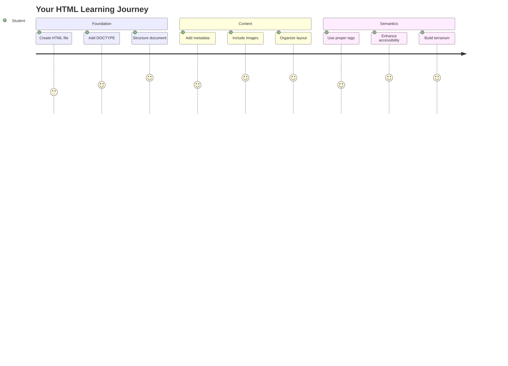
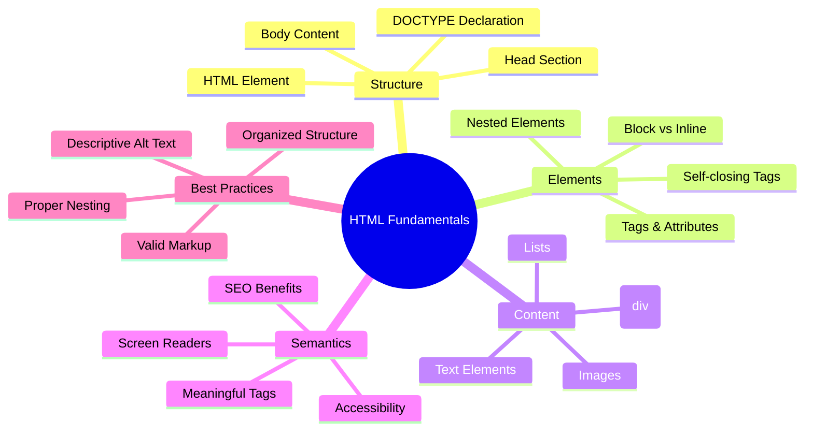
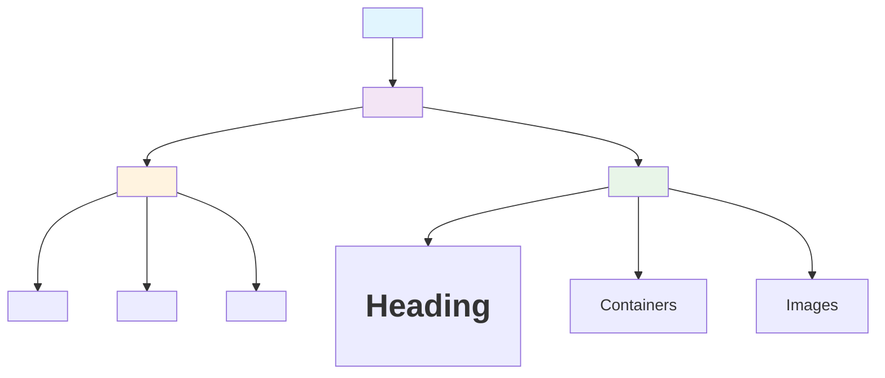
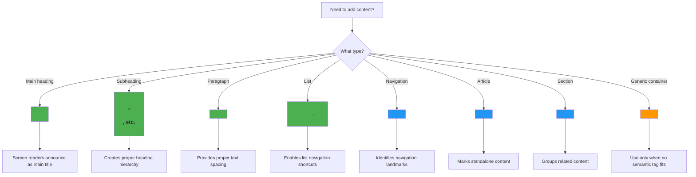
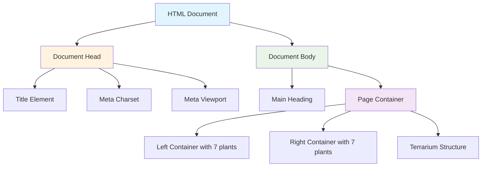
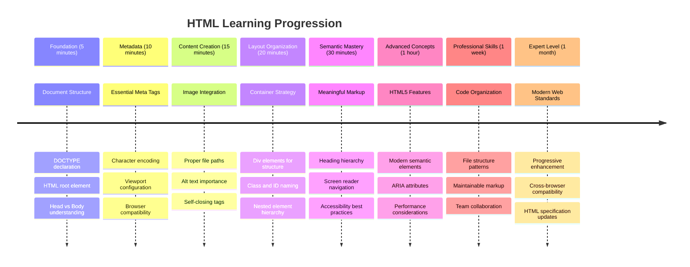

<!--
CO_OP_TRANSLATOR_METADATA:
{
  "original_hash": "3fcfa99c4897e051b558b5eaf1e8cc74",
  "translation_date": "2025-11-03T13:16:50+00:00",
  "source_file": "3-terrarium/1-intro-to-html/README.md",
  "language_code": "ur"
}
-->
# ٹیریریم پروجیکٹ حصہ 1: HTML کا تعارف




> اسکیچ نوٹ [Tomomi Imura](https://twitter.com/girlie_mac) کی طرف سے

HTML، یا HyperText Markup Language، ہر ویب سائٹ کی بنیاد ہے جو آپ نے کبھی دیکھی ہے۔ HTML کو ویب صفحات کا ڈھانچہ سمجھیں – یہ بتاتا ہے کہ مواد کہاں جائے گا، کیسے منظم ہوگا، اور ہر حصہ کیا ظاہر کرتا ہے۔ جبکہ CSS بعد میں آپ کے HTML کو رنگوں اور لے آؤٹ کے ساتھ "سجائے گا"، اور JavaScript اسے انٹرایکٹیویٹی کے ساتھ زندہ کرے گا، HTML وہ بنیادی ڈھانچہ فراہم کرتا ہے جو باقی سب کچھ ممکن بناتا ہے۔

اس سبق میں، آپ ایک ورچوئل ٹیریریم انٹرفیس کے لیے HTML ڈھانچہ بنائیں گے۔ یہ عملی پروجیکٹ آپ کو بنیادی HTML تصورات سکھائے گا جبکہ کچھ بصری طور پر دلچسپ چیز بناتے ہوئے۔ آپ سیکھیں گے کہ مواد کو سیمینٹک عناصر کے ذریعے کیسے منظم کریں، تصاویر کے ساتھ کام کریں، اور ایک انٹرایکٹو ویب ایپلیکیشن کے لیے بنیاد بنائیں۔

سبق کے اختتام تک، آپ کے پاس ایک کام کرنے والا HTML صفحہ ہوگا جو پودوں کی تصاویر کو منظم کالموں میں دکھائے گا، اگلے سبق میں اسٹائلنگ کے لیے تیار۔ اگر یہ شروع میں بنیادی لگے تو پریشان نہ ہوں – یہی HTML کا کام ہے، CSS کے اضافے سے پہلے۔



## پری لیکچر کوئز

[پری لیکچر کوئز](https://ff-quizzes.netlify.app/web/quiz/15)

> 📺 **دیکھیں اور سیکھیں**: اس مددگار ویڈیو کا جائزہ دیکھیں
> 
> [](https://www.youtube.com/watch?v=1TvxJKBzhyQ)

## اپنے پروجیکٹ کو ترتیب دینا

HTML کوڈ میں جانے سے پہلے، آئیے آپ کے ٹیریریم پروجیکٹ کے لیے ایک مناسب ورک اسپیس ترتیب دیں۔ شروع سے ایک منظم فائل ڈھانچہ بنانا ایک اہم عادت ہے جو آپ کے ویب ڈیولپمنٹ کے سفر میں آپ کے لیے فائدہ مند ہوگی۔

### کام: اپنے پروجیکٹ کا ڈھانچہ بنائیں

آپ اپنے ٹیریریم پروجیکٹ کے لیے ایک مخصوص فولڈر بنائیں گے اور اپنی پہلی HTML فائل شامل کریں گے۔ یہاں دو طریقے ہیں جنہیں آپ استعمال کر سکتے ہیں:

**آپشن 1: Visual Studio Code کا استعمال**
1. Visual Studio Code کھولیں
2. "File" → "Open Folder" پر کلک کریں یا `Ctrl+K, Ctrl+O` (Windows/Linux) یا `Cmd+K, Cmd+O` (Mac) استعمال کریں
3. ایک نیا فولڈر بنائیں جس کا نام `terrarium` ہو اور اسے منتخب کریں
4. Explorer پین میں، "New File" آئیکن پر کلک کریں
5. اپنی فائل کا نام `index.html` رکھیں


**آپشن 2: ٹرمینل کمانڈز کا استعمال**
```bash
mkdir terrarium
cd terrarium
touch index.html
code index.html
```

**یہ کمانڈز کیا کرتی ہیں:**
- **ایک نیا ڈائریکٹری بناتی ہیں** جس کا نام `terrarium` ہے آپ کے پروجیکٹ کے لیے
- **ٹریریم ڈائریکٹری میں جاتی ہیں**
- **ایک خالی `index.html` فائل بناتی ہیں**
- **فائل کو Visual Studio Code میں ایڈیٹنگ کے لیے کھولتی ہیں**

> 💡 **پرو ٹپ**: فائل کا نام `index.html` ویب ڈیولپمنٹ میں خاص اہمیت رکھتا ہے۔ جب کوئی ویب سائٹ وزٹ کرتا ہے، تو براؤزرز خود بخود `index.html` کو بطور ڈیفالٹ صفحہ دکھانے کے لیے تلاش کرتے ہیں۔ اس کا مطلب ہے کہ ایک URL جیسے `https://mysite.com/projects/` خود بخود `projects` فولڈر سے `index.html` فائل کو پیش کرے گا بغیر URL میں فائل کا نام بتائے۔

## HTML دستاویز کا ڈھانچہ سمجھنا

ہر HTML دستاویز ایک مخصوص ڈھانچے کی پیروی کرتی ہے جسے براؤزرز کو صحیح طریقے سے سمجھنے اور دکھانے کی ضرورت ہوتی ہے۔ اس ڈھانچے کو ایک رسمی خط کی طرح سمجھیں – اس میں مطلوبہ عناصر ایک خاص ترتیب میں ہوتے ہیں جو وصول کنندہ (اس صورت میں، براؤزر) کو مواد کو صحیح طریقے سے پروسیس کرنے میں مدد دیتے ہیں۔



آئیے وہ ضروری بنیاد شامل کریں جو ہر HTML دستاویز کو چاہیے۔

### DOCTYPE اعلان اور روٹ عنصر

کسی بھی HTML فائل کی پہلی دو لائنیں براؤزر کے لیے دستاویز کا "تعارف" ہوتی ہیں:

```html
<!DOCTYPE html>
<html></html>
```

**یہ کوڈ کیا کرتا ہے:**
- **دستاویز کی قسم HTML5 کے طور پر اعلان کرتا ہے** `<!DOCTYPE html>` استعمال کرتے ہوئے
- **روٹ `<html>` عنصر بناتا ہے** جو تمام صفحہ مواد کو رکھے گا
- **جدید ویب معیارات قائم کرتا ہے** مناسب براؤزر رینڈرنگ کے لیے
- **مختلف براؤزرز اور ڈیوائسز پر مستقل ڈسپلے کو یقینی بناتا ہے**

> 💡 **VS Code ٹپ**: VS Code میں کسی بھی HTML ٹیگ پر ہوور کریں تاکہ MDN Web Docs سے مددگار معلومات دیکھ سکیں، بشمول استعمال کی مثالیں اور براؤزر مطابقت کی تفصیلات۔

> 📚 **مزید سیکھیں**: DOCTYPE اعلان براؤزرز کو "quirks mode" میں داخل ہونے سے روکتا ہے، جو بہت پرانی ویب سائٹس کو سپورٹ کرنے کے لیے استعمال ہوتا تھا۔ جدید ویب ڈیولپمنٹ سادہ `<!DOCTYPE html>` اعلان استعمال کرتی ہے تاکہ [معیارات کے مطابق رینڈرنگ](https://developer.mozilla.org/docs/Web/HTML/Quirks_Mode_and_Standards_Mode) کو یقینی بنایا جا سکے۔

### 🔄 **تعلیمی جائزہ**
**رکیں اور غور کریں**: جاری رکھنے سے پہلے، یقینی بنائیں کہ آپ سمجھتے ہیں:
- ✅ کیوں ہر HTML دستاویز کو DOCTYPE اعلان کی ضرورت ہوتی ہے
- ✅ `<html>` روٹ عنصر کیا رکھتا ہے
- ✅ یہ ڈھانچہ براؤزرز کو صفحات کو صحیح طریقے سے رینڈر کرنے میں کیسے مدد کرتا ہے

**خود کو جلدی آزمائیں**: کیا آپ اپنے الفاظ میں وضاحت کر سکتے ہیں کہ "معیارات کے مطابق رینڈرنگ" کا کیا مطلب ہے؟

## ضروری دستاویز میٹا ڈیٹا شامل کرنا

HTML دستاویز کا `<head>` سیکشن اہم معلومات رکھتا ہے جو براؤزرز اور سرچ انجنز کو چاہیے، لیکن جو وزیٹرز کو صفحے پر براہ راست نظر نہیں آتی۔ اسے "پردے کے پیچھے" معلومات سمجھیں جو آپ کے ویب صفحے کو صحیح طریقے سے کام کرنے اور مختلف ڈیوائسز اور پلیٹ فارمز پر صحیح طور پر ظاہر ہونے میں مدد دیتی ہے۔

یہ میٹا ڈیٹا براؤزرز کو بتاتا ہے کہ آپ کا صفحہ کیسے دکھایا جائے، کون سا کریکٹر انکوڈنگ استعمال کیا جائے، اور مختلف اسکرین سائزز کو کیسے ہینڈل کیا جائے – پیشہ ورانہ، قابل رسائی ویب صفحات بنانے کے لیے سب ضروری ہیں۔

### کام: دستاویز کا ہیڈ شامل کریں

اپنے `<html>` ٹیگز کے درمیان یہ `<head>` سیکشن شامل کریں:

```html
<head>
	<title>Welcome to my Virtual Terrarium</title>
	<meta charset="utf-8" />
	<meta http-equiv="X-UA-Compatible" content="IE=edge" />
	<meta name="viewport" content="width=device-width, initial-scale=1" />
</head>
```

**ہر عنصر کیا کرتا ہے:**
- **صفحے کا عنوان سیٹ کرتا ہے** جو براؤزر ٹیبز اور سرچ نتائج میں ظاہر ہوتا ہے
- **UTF-8 کریکٹر انکوڈنگ کی وضاحت کرتا ہے** تاکہ دنیا بھر میں صحیح ٹیکسٹ ڈسپلے ہو
- **جدید Internet Explorer ورژنز کے ساتھ مطابقت کو یقینی بناتا ہے**
- **ریسپانسیو ڈیزائن کو ترتیب دیتا ہے** ڈیوائس کی چوڑائی سے میچ کرنے کے لیے ویوپورٹ سیٹ کرکے
- **ابتدائی زوم لیول کنٹرول کرتا ہے** تاکہ مواد کو قدرتی سائز پر دکھایا جا سکے

> 🤔 **اس بارے میں سوچیں**: اگر آپ نے ویوپورٹ میٹا ٹیگ کو اس طرح سیٹ کیا: `<meta name="viewport" content="width=600">` تو کیا ہوگا؟ یہ صفحے کو ہمیشہ 600 پکسل چوڑا کرنے پر مجبور کرے گا، ریسپانسیو ڈیزائن کو خراب کر دے گا! [ویوپورٹ کی صحیح ترتیب](https://developer.mozilla.org/docs/Web/HTML/Viewport_meta_tag) کے بارے میں مزید جانیں۔

## دستاویز کا باڈی بنانا

HTML دستاویز کا `<body>` عنصر آپ کے ویب صفحے کے تمام نظر آنے والے مواد کو رکھتا ہے – وہ سب کچھ جو صارفین دیکھیں گے اور اس کے ساتھ تعامل کریں گے۔ جبکہ `<head>` سیکشن نے براؤزر کو ہدایات فراہم کیں، `<body>` سیکشن اصل مواد رکھتا ہے: ٹیکسٹ، تصاویر، بٹن، اور دیگر عناصر جو آپ کا یوزر انٹرفیس بناتے ہیں۔

آئیے باڈی ڈھانچہ شامل کریں اور سمجھیں کہ HTML ٹیگز ایک ساتھ کیسے کام کرتے ہیں تاکہ معنی خیز مواد بنائیں۔

### HTML ٹیگ ڈھانچہ سمجھنا

HTML جوڑے ٹیگز استعمال کرتا ہے تاکہ عناصر کی وضاحت کی جا سکے۔ زیادہ تر ٹیگز کے پاس ایک اوپننگ ٹیگ ہوتا ہے جیسے `<p>` اور ایک کلوزنگ ٹیگ جیسے `</p>`, جس کے درمیان مواد ہوتا ہے: `<p>Hello, world!</p>`. یہ ایک پیراگراف عنصر بناتا ہے جس میں "Hello, world!" ٹیکسٹ ہوتا ہے۔

### کام: باڈی عنصر شامل کریں

اپنی HTML فائل کو اپ ڈیٹ کریں تاکہ اس میں `<body>` عنصر شامل ہو:

```html
<!DOCTYPE html>
<html>
	<head>
		<title>Welcome to my Virtual Terrarium</title>
		<meta charset="utf-8" />
		<meta http-equiv="X-UA-Compatible" content="IE=edge" />
		<meta name="viewport" content="width=device-width, initial-scale=1" />
	</head>
	<body></body>
</html>
```

**یہ مکمل ڈھانچہ کیا فراہم کرتا ہے:**
- **HTML5 دستاویز کا بنیادی فریم ورک قائم کرتا ہے**
- **صحیح براؤزر رینڈرنگ کے لیے ضروری میٹا ڈیٹا شامل کرتا ہے**
- **ایک خالی باڈی بناتا ہے** جو آپ کے نظر آنے والے مواد کے لیے تیار ہے
- **جدید ویب ڈیولپمنٹ کے بہترین طریقوں کی پیروی کرتا ہے**

اب آپ اپنے ٹیریریم کے نظر آنے والے عناصر شامل کرنے کے لیے تیار ہیں۔ ہم `<div>` عناصر کو کنٹینرز کے طور پر استعمال کریں گے تاکہ مواد کے مختلف حصوں کو منظم کریں، اور `` عناصر کو پودوں کی تصاویر دکھانے کے لیے استعمال کریں۔

### تصاویر اور لے آؤٹ کنٹینرز کے ساتھ کام کرنا

HTML میں تصاویر خاص ہوتی ہیں کیونکہ وہ "سیلف کلوزنگ" ٹیگز استعمال کرتی ہیں۔ عناصر جیسے `<p></p>` کے برعکس جو مواد کے ارد گرد لپیٹتے ہیں، `` ٹیگ اپنی تمام معلومات ٹیگ کے اندر ہی رکھتا ہے، جیسے `src` تصویر فائل کے راستے کے لیے اور `alt` رسائی کے لیے۔

تصاویر کو اپنے HTML میں شامل کرنے سے پہلے، آپ کو اپنے پروجیکٹ فائلز کو صحیح طریقے سے منظم کرنے کی ضرورت ہوگی، ایک تصاویر فولڈر بنا کر اور پودوں کے گرافکس شامل کر کے۔

**پہلے، اپنی تصاویر ترتیب دیں:**
1. اپنے ٹیریریم پروجیکٹ فولڈر کے اندر ایک فولڈر بنائیں جس کا نام `images` ہو
2. پودوں کی تصاویر [حل فولڈر](../../../../3-terrarium/solution/images) سے ڈاؤن لوڈ کریں (کل 14 پودوں کی تصاویر)
3. تمام پودوں کی تصاویر اپنے نئے `images` فولڈر میں کاپی کریں

### کام: پودوں کی ڈسپلے لے آؤٹ بنائیں

اب اپنے `<body></body>` ٹیگز کے درمیان پودوں کی تصاویر کو دو کالموں میں منظم کریں:

```html
<div id="page">
	<div id="left-container" class="container">
		<div class="plant-holder">
			
		</div>
		<div class="plant-holder">
			
		</div>
		<div class="plant-holder">
			
		</div>
		<div class="plant-holder">
			
		</div>
		<div class="plant-holder">
			
		</div>
		<div class="plant-holder">
			
		</div>
		<div class="plant-holder">
			
		</div>
	</div>
	<div id="right-container" class="container">
		<div class="plant-holder">
			
		</div>
		<div class="plant-holder">
			
		</div>
		<div class="plant-holder">
			
		</div>
		<div class="plant-holder">
			
		</div>
		<div class="plant-holder">
			
		</div>
		<div class="plant-holder">
			
		</div>
		<div class="plant-holder">
			
		</div>
	</div>
</div>
```

**مرحلہ وار، اس کوڈ میں کیا ہو رہا ہے:**
- **ایک مرکزی صفحہ کنٹینر بناتا ہے** `id="page"` کے ساتھ تمام مواد رکھنے کے لیے
- **دو کالم کنٹینرز قائم کرتا ہے**: `left-container` اور `right-container`
- **7 پودوں کو بائیں کالم میں اور 7 پودوں کو دائیں کالم میں منظم کرتا ہے**
- **ہر پودے کی تصویر کو ایک `plant-holder` div میں لپیٹتا ہے** انفرادی پوزیشننگ کے لیے
- **CSS اسٹائلنگ کے لیے مستقل کلاس ناموں کا اطلاق کرتا ہے** اگلے سبق میں
- **ہر پودے کی تصویر کو منفرد IDs تفویض کرتا ہے** بعد میں JavaScript انٹریکشن کے لیے
- **تصاویر فولڈر کی طرف اشارہ کرنے والے صحیح فائل راستے شامل کرتا ہے**

> 🤔 **اس پر غور کریں**: نوٹ کریں کہ تمام تصاویر کے پاس فی الحال ایک ہی alt ٹیکسٹ "plant" ہے۔ یہ رسائی کے لیے مثالی نہیں ہے۔ اسکرین ریڈر صارفین "plant" کو 14 بار سنیں گے بغیر یہ جانے کہ ہر تصویر کون سا مخصوص پودا دکھاتی ہے۔ کیا آپ ہر تصویر کے لیے بہتر، زیادہ وضاحتی alt ٹیکسٹ کے بارے میں سوچ سکتے ہیں؟

> 📝 **HTML عنصر کی اقسام**: `<div>` عناصر "بلاک لیول" ہوتے ہیں اور مکمل چوڑائی لیتے ہیں، جبکہ `<span>` عناصر "ان لائن" ہوتے ہیں اور صرف ضروری چوڑائی لیتے ہیں۔ آپ کے خیال میں کیا ہوگا اگر آپ ان تمام `<div>` ٹیگز کو `<span>` ٹیگز میں تبدیل کر دیں؟

### 🔄 **تعلیمی جائزہ**
**ڈھانچہ سمجھنا**: اپنے HTML ڈھانچے کا جائزہ لینے کے لیے ایک لمحہ نکالیں:
- ✅ کیا آپ اپنے لے آؤٹ میں مرکزی کنٹینرز کی شناخت کر سکتے ہیں؟
- ✅ کیا آپ سمجھتے ہیں کہ ہر تصویر کے پاس منفرد ID کیوں ہے؟
- ✅ آپ `plant-holder` divs کے مقصد کو کیسے بیان کریں گے؟

**بصری معائنہ**: اپنے HTML فائل کو براؤزر میں کھولیں۔ آپ کو دیکھنا چاہیے:
- پودوں کی تصاویر کی ایک بنیادی فہرست
- تصاویر دو کالموں میں منظم
- سادہ، بغیر اسٹائل کا لے آؤٹ

**یاد رکھیں**: یہ سادہ ظاہری شکل بالکل وہی ہے جو HTML کو CSS اسٹائلنگ سے پہلے نظر آنا چاہیے!

اس مارک اپ کے اضافے کے ساتھ، پودے اسکرین پر ظاہر ہوں گے، حالانکہ وہ ابھی تک پالش نہیں لگیں گے – یہی کام CSS کا ہے اگلے سبق میں! فی الحال، آپ کے پاس ایک مضبوط HTML بنیاد ہے جو آپ کے مواد کو صحیح طریقے سے منظم کرتی ہے اور رسائی کے بہترین طریقوں کی پیروی کرتی ہے۔

## رسائی کے لیے سیمینٹک HTML کا استعمال

سیمینٹک HTML کا مطلب ہے HTML عناصر کو ان کے معنی اور مقصد کی بنیاد پر منتخب کرنا، نہ کہ صرف ان کی ظاہری شکل پر۔ جب آپ سیمینٹک مارک اپ استعمال کرتے ہیں، تو آپ اپنے مواد کی ساخت اور معنی کو براؤزرز، سرچ انجنز، اور اسسٹیو ٹیکنالوجیز جیسے اسکرین ریڈرز کے ساتھ بات چیت کرتے ہیں۔



یہ طریقہ آپ کی ویب سائٹس کو معذوری والے صارفین کے لیے زیادہ قابل رسائی بناتا ہے اور سرچ انجنز کو آپ کے مواد کو بہتر سمجھنے میں مدد دیتا ہے۔ یہ جدید ویب ڈیولپمنٹ کا ایک بنیادی اصول ہے جو سب کے لیے بہتر تجربات پیدا کرتا ہے۔

### سیمینٹک صفحہ عنوان شامل کرنا

آئیے آپ کے ٹیریریم صفحے کے لیے ایک مناسب ہیڈنگ شامل کریں۔ اپنے اوپننگ `<body>` ٹیگ کے فوراً بعد یہ لائن شامل کریں:

```html
<h1>My Terrarium</h1>
```

**کیوں سیمینٹک مارک اپ اہم ہے:**
- **اسکرین ریڈرز کو صفحے کی ساخت کو نیویگیٹ کرنے اور سمجھنے میں مدد دیتا ہے**
- **سرچ انجن آپٹیمائزیشن (SEO) کو بہتر بناتا ہے** مواد کی درجہ بندی کو واضح کر کے
- **بصری معذوری یا علمی فرق والے صارفین کے لیے رسائی کو بڑھاتا ہے**
- **تمام ڈیوائسز اور پلیٹ فارمز پر بہتر یوزر تجربات پیدا کرتا ہے**
- **پیشہ ورانہ ترقی کے لیے ویب معیارات اور بہترین طریقوں کی پیروی کرتا ہے**

**سیمینٹک بمقابلہ غیر سیمینٹک انتخاب کی مثالیں:**

| مقصد | ✅ سیمینٹک انتخاب | ❌ غیر سیمینٹک انتخاب |
|---------|-------------------|------------------------|
| مرکزی ہیڈنگ | `<h1>عنوان</h1>` | `<div class="big-text">عنوان</div>` |
| نیویگیشن | `<nav><ul><li></li></ul></nav>` | `<div class="menu"><div></div></div>` |
| بٹن | `<button>کلک کریں</button>` | `<span onclick="...">کلک کریں</span>` |
| مضمون کا مواد | `<article><p></p></article>` | `<div class="content"><div></div></div>` |

> 🎥 **عمل میں دیکھیں**: [اسکرین ریڈرز ویب صفحات کے ساتھ کیسے تعامل کرتے ہیں](https://www.youtube.com/watch?v=OUDV1gqs9GA) دیکھیں تاکہ سمجھ سکیں کہ سیمینٹک مارک اپ رسائی کے لیے کیوں ضروری ہے۔ نوٹ کریں کہ صحیح HTML ڈھانچہ صارفین کو مؤثر طریقے سے نیویگیٹ کرنے میں کیسے مدد دیتا ہے۔

## ٹیریریم کنٹینر بنانا

اب آئیے ٹیریریم کے لیے HTML ڈھانچہ شامل کریں – شیشے کا کنٹینر جہاں پودے بالآخر رکھے جائیں گے۔ یہ سیکشن ایک اہم تصور کو ظاہر کرتا ہے: HTML ڈھانچہ فراہم کرتا ہے، لیکن CSS اسٹائلنگ کے بغیر، یہ عناصر ابھی تک نظر نہیں آئیں گے۔

ٹریریم مارک اپ وضاحتی کلاس ناموں کا استعمال کرتا ہے جو اگلے سبق میں CSS اسٹائلنگ
- **الگ الگ عناصر** ہر بصری جزو کے لیے (اوپر، دیواریں، مٹی، نیچے) کی وضاحت کرتا ہے  
- **شامل کرتا ہے** شیشے کے انعکاس اثرات کے لیے اندرونی عناصر (چمکدار عناصر)  
- **استعمال کرتا ہے** وضاحتی کلاس نام جو ہر عنصر کے مقصد کو واضح طور پر ظاہر کرتے ہیں  
- **تیار کرتا ہے** ساخت کو CSS اسٹائلنگ کے لیے جو شیشے کے ٹیریریم کی شکل پیدا کرے گا  

> 🤔 **کچھ محسوس کیا؟**: حالانکہ آپ نے یہ مارک اپ شامل کیا ہے، آپ صفحے پر کچھ نیا نہیں دیکھ رہے ہیں! یہ بالکل واضح کرتا ہے کہ HTML ساخت فراہم کرتا ہے جبکہ CSS ظاہری شکل فراہم کرتا ہے۔ یہ `<div>` عناصر موجود ہیں لیکن ابھی تک ان کے پاس کوئی بصری اسٹائلنگ نہیں ہے – یہ اگلے سبق میں آئے گا!  


  
### 🔄 **تعلیمی جائزہ**  
**HTML ساخت کی مہارت**: آگے بڑھنے سے پہلے، یقینی بنائیں کہ آپ:  
- ✅ HTML ساخت اور بصری ظاہری شکل کے فرق کو بیان کر سکتے ہیں  
- ✅ معنوی اور غیر معنوی HTML عناصر کی شناخت کر سکتے ہیں  
- ✅ وضاحت کر سکتے ہیں کہ مناسب مارک اپ رسائی کو کیسے فائدہ پہنچاتا ہے  
- ✅ مکمل دستاویز درخت کی ساخت کو پہچان سکتے ہیں  

**اپنی سمجھ کی جانچ کریں**: اپنے HTML فائل کو براؤزر میں جاوا اسکرپٹ غیر فعال اور CSS ہٹانے کے ساتھ کھولنے کی کوشش کریں۔ یہ آپ کو وہ خالص معنوی ساخت دکھاتا ہے جو آپ نے تخلیق کی ہے!  

---

## GitHub Copilot Agent Challenge  

Agent موڈ استعمال کریں اور درج ذیل چیلنج مکمل کریں:  

**تفصیل:** ٹیریریم پروجیکٹ میں شامل کرنے کے لیے پودوں کی دیکھ بھال کے گائیڈ سیکشن کے لیے ایک معنوی HTML ساخت بنائیں۔  

**پرومپٹ:** ایک معنوی HTML سیکشن بنائیں جس میں ایک مرکزی سرخی "پودوں کی دیکھ بھال کی گائیڈ"، تین ذیلی سیکشنز کے ساتھ سرخیاں "پانی دینا"، "روشنی کی ضروریات"، اور "مٹی کی دیکھ بھال"، ہر ایک میں پودوں کی دیکھ بھال کی معلومات کا ایک پیراگراف شامل ہو۔ مناسب معنوی HTML ٹیگز جیسے `<section>`, `<h2>`, `<h3>`, اور `<p>` استعمال کریں تاکہ مواد کو مناسب طریقے سے ترتیب دیا جا سکے۔  

مزید جانیں [agent mode](https://code.visualstudio.com/blogs/2025/02/24/introducing-copilot-agent-mode) کے بارے میں یہاں۔  

## HTML تاریخ چیلنج  

**ویب ارتقاء کے بارے میں سیکھنا**  

HTML نے 1990 میں CERN میں ٹم برنرز لی کے پہلے ویب براؤزر بنانے کے بعد سے نمایاں ترقی کی ہے۔ کچھ پرانے ٹیگز جیسے `<marquee>` اب ختم ہو چکے ہیں کیونکہ وہ جدید رسائی کے معیار اور جوابدہ ڈیزائن اصولوں کے ساتھ اچھی طرح کام نہیں کرتے۔  

**یہ تجربہ آزمائیں:**  
1. عارضی طور پر اپنی `<h1>` سرخی کو `<marquee>` ٹیگ میں لپیٹیں: `<marquee><h1>میرا ٹیریریم</h1></marquee>`  
2. اپنے صفحے کو براؤزر میں کھولیں اور اسکرولنگ اثر کا مشاہدہ کریں  
3. غور کریں کہ یہ ٹیگ کیوں ختم ہو گیا (اشارہ: صارف کے تجربے اور رسائی کے بارے میں سوچیں)  
4. `<marquee>` ٹیگ کو ہٹا دیں اور معنوی مارک اپ پر واپس جائیں  

**عکاسی کے سوالات:**  
- اسکرولنگ سرخی بصری معذوری یا حرکت کی حساسیت والے صارفین کو کیسے متاثر کر سکتی ہے؟  
- کون سی جدید CSS تکنیکیں اسی طرح کے بصری اثرات کو زیادہ قابل رسائی طریقے سے حاصل کر سکتی ہیں؟  
- موجودہ ویب معیارات کو ختم شدہ عناصر کے بجائے استعمال کرنا کیوں ضروری ہے؟  

مزید دریافت کریں [obsolete and deprecated HTML elements](https://developer.mozilla.org/docs/Web/HTML/Element#Obsolete_and_deprecated_elements) کے بارے میں تاکہ سمجھ سکیں کہ ویب معیارات صارف کے تجربے کو بہتر بنانے کے لیے کیسے ترقی کرتے ہیں۔  

## لیکچر کے بعد کا کوئز  

[لیکچر کے بعد کا کوئز](https://ff-quizzes.netlify.app/web/quiz/16)  

## جائزہ اور خود مطالعہ  

**اپنے HTML علم کو گہرا کریں**  

HTML ویب کی بنیاد 30 سال سے زیادہ عرصے سے ہے، ایک سادہ دستاویز مارک اپ زبان سے انٹرایکٹو ایپلیکیشنز بنانے کے لیے ایک جدید پلیٹ فارم تک ترقی کر چکا ہے۔ اس ارتقاء کو سمجھنا آپ کو جدید ویب معیارات کی قدر کرنے اور بہتر ترقیاتی فیصلے کرنے میں مدد دیتا ہے۔  

**تجویز کردہ سیکھنے کے راستے:**  

1. **HTML تاریخ اور ارتقاء**  
   - HTML 1.0 سے HTML5 تک کے ٹائم لائن کی تحقیق کریں  
   - معلوم کریں کہ کچھ ٹیگز کیوں ختم ہو گئے (رسائی، موبائل دوستانہ، دیکھ بھال)  
   - ابھرتی ہوئی HTML خصوصیات اور تجاویز کی تحقیق کریں  

2. **معنوی HTML کی گہرائی میں مطالعہ**  
   - [HTML5 معنوی عناصر](https://developer.mozilla.org/docs/Web/HTML/Element) کی مکمل فہرست کا مطالعہ کریں  
   - یہ پہچاننے کی مشق کریں کہ کب `<article>`, `<section>`, `<aside>`, اور `<main>` استعمال کرنا ہے  
   - بہتر رسائی کے لیے ARIA صفات کے بارے میں سیکھیں  

3. **جدید ویب ترقی**  
   - [جوابدہ ویب سائٹس بنانا](https://docs.microsoft.com/learn/modules/build-simple-website/?WT.mc_id=academic-77807-sagibbon) Microsoft Learn پر دریافت کریں  
   - سمجھیں کہ HTML CSS اور جاوا اسکرپٹ کے ساتھ کیسے مربوط ہوتا ہے  
   - ویب کارکردگی اور SEO بہترین طریقوں کے بارے میں سیکھیں  

**عکاسی کے سوالات:**  
- آپ نے کون سے ختم شدہ HTML ٹیگز دریافت کیے، اور وہ کیوں ہٹائے گئے؟  
- HTML کے مستقبل کے ورژنز کے لیے کون سی نئی خصوصیات تجویز کی جا رہی ہیں؟  
- معنوی HTML ویب رسائی اور SEO میں کیسے مدد دیتا ہے؟  

### ⚡ **اگلے 5 منٹ میں آپ کیا کر سکتے ہیں**  
- [ ] DevTools (F12) کھولیں اور اپنی پسندیدہ ویب سائٹ کے HTML ساخت کا معائنہ کریں  
- [ ] بنیادی ٹیگز کے ساتھ ایک سادہ HTML فائل بنائیں: `<h1>`, `<p>`, اور ``  
- [ ] W3C HTML Validator آن لائن کے ذریعے اپنے HTML کی توثیق کریں  
- [ ] اپنے HTML میں ایک تبصرہ شامل کرنے کی کوشش کریں `<!-- تبصرہ -->`  

### 🎯 **اس گھنٹے میں آپ کیا حاصل کر سکتے ہیں**  
- [ ] لیکچر کے بعد کا کوئز مکمل کریں اور معنوی HTML تصورات کا جائزہ لیں  
- [ ] مناسب HTML ساخت کے ساتھ اپنے بارے میں ایک سادہ ویب صفحہ بنائیں  
- [ ] مختلف سرخی کی سطحوں اور متن فارمیٹنگ ٹیگز کے ساتھ تجربہ کریں  
- [ ] ملٹی میڈیا انضمام کی مشق کے لیے تصاویر اور لنکس شامل کریں  
- [ ] HTML5 خصوصیات پر تحقیق کریں جو آپ نے ابھی تک آزمائی نہیں ہیں  

### 📅 **آپ کا ہفتہ بھر کا HTML سفر**  
- [ ] معنوی مارک اپ کے ساتھ ٹیریریم پروجیکٹ اسائنمنٹ مکمل کریں  
- [ ] ARIA لیبلز اور رولز کا استعمال کرتے ہوئے ایک قابل رسائی ویب صفحہ بنائیں  
- [ ] مختلف ان پٹ اقسام کے ساتھ فارم تخلیق کی مشق کریں  
- [ ] HTML5 APIs جیسے localStorage یا geolocation کو دریافت کریں  
- [ ] جوابدہ HTML پیٹرنز اور موبائل فرسٹ ڈیزائن کا مطالعہ کریں  
- [ ] دوسرے ڈویلپرز کے HTML کوڈ کا جائزہ لیں بہترین طریقوں کے لیے  

### 🌟 **آپ کا مہینہ بھر کا ویب بنیاد**  
- [ ] اپنی HTML مہارت کو ظاہر کرنے کے لیے ایک پورٹ فولیو ویب سائٹ بنائیں  
- [ ] Handlebars جیسے فریم ورک کے ساتھ HTML ٹیمپلیٹنگ سیکھیں  
- [ ] اوپن سورس پروجیکٹس میں حصہ لیں HTML دستاویزات کو بہتر بنا کر  
- [ ] جدید HTML تصورات جیسے کسٹم عناصر میں مہارت حاصل کریں  
- [ ] HTML کو CSS فریم ورک اور جاوا اسکرپٹ لائبریریوں کے ساتھ مربوط کریں  
- [ ] HTML بنیادی اصول سیکھنے والوں کی رہنمائی کریں  

## 🎯 آپ کا HTML مہارت کا ٹائم لائن  


  
### 🛠️ آپ کا HTML ٹول کٹ خلاصہ  

اس سبق کو مکمل کرنے کے بعد، آپ کے پاس:  
- **دستاویز کی ساخت**: مکمل HTML5 بنیاد مناسب DOCTYPE کے ساتھ  
- **معنوی مارک اپ**: معنی خیز ٹیگز جو رسائی اور SEO کو بہتر بناتے ہیں  
- **تصویری انضمام**: مناسب فائل تنظیم اور alt متن کے طریقے  
- **لے آؤٹ کنٹینرز**: وضاحتی کلاس ناموں کے ساتھ divs کا اسٹریٹجک استعمال  
- **رسائی کی آگاہی**: اسکرین ریڈر نیویگیشن کی سمجھ  
- **جدید معیارات**: موجودہ HTML5 طریقے اور ختم شدہ ٹیگ کا علم  
- **پروجیکٹ کی بنیاد**: CSS اسٹائلنگ اور جاوا اسکرپٹ انٹرایکٹیویٹی کے لیے مضبوط بنیاد  

**اگلے مراحل**: آپ کی HTML ساخت CSS اسٹائلنگ کے لیے تیار ہے! آپ نے جو معنوی بنیاد بنائی ہے وہ اگلے سبق کو سمجھنے میں بہت آسان بنا دے گی۔  

## اسائنمنٹ  

[اپنے HTML کی مشق کریں: بلاگ ماک اپ بنائیں](assignment.md)  

---

**ڈسکلیمر**:  
یہ دستاویز AI ترجمہ سروس [Co-op Translator](https://github.com/Azure/co-op-translator) کا استعمال کرتے ہوئے ترجمہ کی گئی ہے۔ ہم درستگی کے لیے کوشش کرتے ہیں، لیکن براہ کرم آگاہ رہیں کہ خودکار ترجمے میں غلطیاں یا غیر درستیاں ہو سکتی ہیں۔ اصل دستاویز کو اس کی اصل زبان میں مستند ذریعہ سمجھا جانا چاہیے۔ اہم معلومات کے لیے، پیشہ ور انسانی ترجمہ کی سفارش کی جاتی ہے۔ ہم اس ترجمے کے استعمال سے پیدا ہونے والی کسی بھی غلط فہمی یا غلط تشریح کے ذمہ دار نہیں ہیں۔