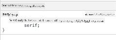
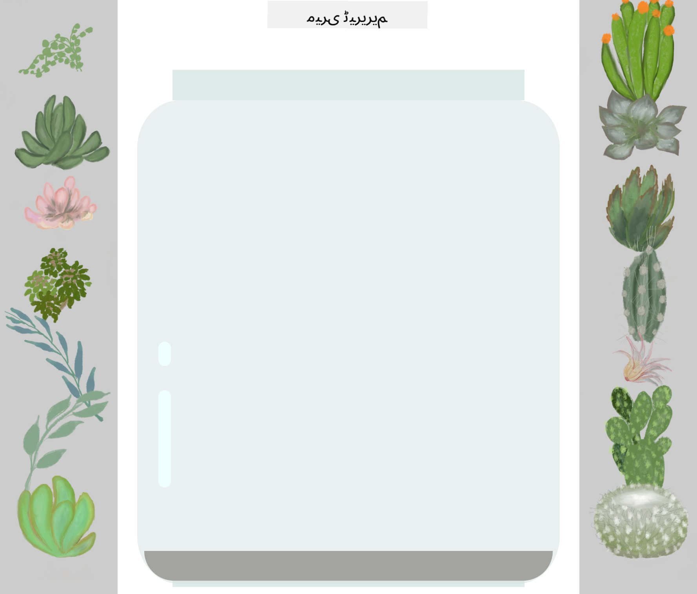

<!--
CO_OP_TRANSLATOR_METADATA:
{
  "original_hash": "e375c2aeb94e2407f2667633d39580bd",
  "translation_date": "2025-08-25T21:23:56+00:00",
  "source_file": "3-terrarium/2-intro-to-css/README.md",
  "language_code": "ur"
}
-->
# ٹیریریم پروجیکٹ حصہ 2: CSS کا تعارف


> اسکیچ نوٹ از [Tomomi Imura](https://twitter.com/girlie_mac)

## لیکچر سے پہلے کا کوئز

[لیکچر سے پہلے کا کوئز](https://ashy-river-0debb7803.1.azurestaticapps.net/quiz/17)

### تعارف

CSS، یا Cascading Style Sheets، ویب ڈویلپمنٹ کے ایک اہم مسئلے کو حل کرتی ہے: اپنی ویب سائٹ کو خوبصورت کیسے بنایا جائے۔ ایپس کو اسٹائل کرنا انہیں زیادہ قابل استعمال اور خوبصورت بناتا ہے؛ آپ CSS کا استعمال Responsive Web Design (RWD) بنانے کے لیے بھی کر سکتے ہیں - تاکہ آپ کی ایپس ہر اسکرین سائز پر اچھی لگیں جس پر وہ دکھائی دیں۔ CSS صرف آپ کی ایپ کو خوبصورت بنانے کے بارے میں نہیں ہے؛ اس کے اسپیک میں اینیمیشنز اور ٹرانسفارمز شامل ہیں جو آپ کی ایپس کے لیے پیچیدہ تعاملات کو ممکن بنا سکتے ہیں۔ CSS ورکنگ گروپ موجودہ CSS وضاحتوں کو برقرار رکھنے میں مدد کرتا ہے؛ آپ ان کے کام کو [World Wide Web Consortium کی سائٹ](https://www.w3.org/Style/CSS/members) پر فالو کر سکتے ہیں۔

> نوٹ کریں، CSS ایک زبان ہے جو ترقی کرتی ہے، جیسے ویب پر سب کچھ، اور تمام براؤزرز وضاحت کے نئے حصوں کی حمایت نہیں کرتے۔ ہمیشہ اپنی امپلیمنٹیشنز کو چیک کریں [CanIUse.com](https://caniuse.com) سے مشورہ کرکے۔

اس سبق میں، ہم اپنی آن لائن ٹیریریم میں اسٹائلز شامل کریں گے اور CSS کے کئی تصورات کے بارے میں مزید سیکھیں گے: کیسکیڈ، وراثت، اور سلیکٹرز، پوزیشننگ، اور CSS کا استعمال کرکے لے آؤٹ بنانے کا استعمال۔ اس عمل میں ہم ٹیریریم کو لے آؤٹ کریں گے اور خود ٹیریریم بنائیں گے۔

### پیشگی شرط

آپ کے ٹیریریم کے لیے HTML تیار ہونا چاہیے اور اسٹائل کے لیے تیار ہونا چاہیے۔

> ویڈیو دیکھیں

> 
> [](https://www.youtube.com/watch?v=6yIdOIV9p1I)

### کام

اپنے ٹیریریم فولڈر میں، ایک نیا فائل بنائیں جس کا نام `style.css` ہو۔ اس فائل کو `<head>` سیکشن میں امپورٹ کریں:

```html
<link rel="stylesheet" href="./style.css" />
```

---

## کیسکیڈ

Cascading Style Sheets اس خیال کو شامل کرتی ہیں کہ اسٹائلز 'کیسکیڈ' کرتے ہیں تاکہ اسٹائل کے اطلاق کو اس کی ترجیح کے ذریعے رہنمائی دی جائے۔ ویب سائٹ کے مصنف کے ذریعہ مقرر کردہ اسٹائلز براؤزر کے ذریعہ مقرر کردہ اسٹائلز پر ترجیح رکھتے ہیں۔ 'ان لائن' مقرر کردہ اسٹائلز بیرونی اسٹائل شیٹ میں مقرر کردہ اسٹائلز پر ترجیح رکھتے ہیں۔

### کام

اپنے `<h1>` ٹیگ میں ان لائن اسٹائل "color: red" شامل کریں:

```HTML
<h1 style="color: red">My Terrarium</h1>
```

پھر، اپنے `style.css` فائل میں درج ذیل کوڈ شامل کریں:

```CSS
h1 {
 color: blue;
}
```

✅ آپ کی ویب ایپ میں کون سا رنگ دکھائی دیتا ہے؟ کیوں؟ کیا آپ اسٹائلز کو اوور رائیڈ کرنے کا کوئی طریقہ تلاش کر سکتے ہیں؟ آپ ایسا کب کرنا چاہیں گے، یا کیوں نہیں؟

---

## وراثت

اسٹائلز ایک آباؤ اجداد کے اسٹائل سے ایک اولاد تک وراثت میں ملتے ہیں، تاکہ گھونسلا کیے گئے عناصر اپنے والدین کے اسٹائلز کو وراثت میں حاصل کریں۔

### کام

باڈی کے فونٹ کو ایک مخصوص فونٹ پر سیٹ کریں، اور چیک کریں کہ گھونسلا کیے گئے عنصر کا فونٹ کیا ہے:

```CSS
body {
	font-family: helvetica, arial, sans-serif;
}
```

اپنے براؤزر کے کنسول کو 'Elements' ٹیب پر کھولیں اور H1 کے فونٹ کا مشاہدہ کریں۔ یہ اپنے فونٹ کو باڈی سے وراثت میں حاصل کرتا ہے، جیسا کہ براؤزر کے اندر بیان کیا گیا ہے:



✅ کیا آپ ایک گھونسلا کیے گئے اسٹائل کو مختلف پراپرٹی وراثت میں دے سکتے ہیں؟

---

## CSS سلیکٹرز

### ٹیگز

اب تک، آپ کی `style.css` فائل میں صرف چند ٹیگز اسٹائل کیے گئے ہیں، اور ایپ کافی عجیب لگ رہی ہے:

```CSS
body {
	font-family: helvetica, arial, sans-serif;
}

h1 {
	color: #3a241d;
	text-align: center;
}
```

اس طریقے سے ٹیگ کو اسٹائل کرنا آپ کو منفرد عناصر پر کنٹرول دیتا ہے، لیکن آپ کو اپنے ٹیریریم میں بہت سے پودوں کے اسٹائلز کو کنٹرول کرنے کی ضرورت ہے۔ ایسا کرنے کے لیے، آپ کو CSS سلیکٹرز کا فائدہ اٹھانا ہوگا۔

### IDs

بائیں اور دائیں کنٹینرز کو لے آؤٹ کرنے کے لیے کچھ اسٹائل شامل کریں۔ چونکہ مارک اپ میں صرف ایک بائیں کنٹینر اور صرف ایک دائیں کنٹینر ہے، انہیں IDs دیے گئے ہیں۔ انہیں اسٹائل کرنے کے لیے، `#` استعمال کریں:

```CSS
#left-container {
	background-color: #eee;
	width: 15%;
	left: 0px;
	top: 0px;
	position: absolute;
	height: 100%;
	padding: 10px;
}

#right-container {
	background-color: #eee;
	width: 15%;
	right: 0px;
	top: 0px;
	position: absolute;
	height: 100%;
	padding: 10px;
}
```

یہاں، آپ نے ان کنٹینرز کو اسکرین کے بالکل بائیں اور دائیں طرف مطلق پوزیشننگ کے ساتھ رکھا ہے، اور ان کی چوڑائی کے لیے فیصد استعمال کیے ہیں تاکہ وہ چھوٹے موبائل اسکرینز کے لیے اسکیل کر سکیں۔

✅ یہ کوڈ کافی دہرایا گیا ہے، اس لیے "DRY" (Don't Repeat Yourself) نہیں ہے؛ کیا آپ ان IDs کو اسٹائل کرنے کا کوئی بہتر طریقہ تلاش کر سکتے ہیں، شاید ایک ID اور کلاس کے ساتھ؟ آپ کو مارک اپ کو تبدیل کرنے اور CSS کو ریفیکٹر کرنے کی ضرورت ہوگی:

```html
<div id="left-container" class="container"></div>
```

### کلاسز

اوپر دیے گئے مثال میں، آپ نے اسکرین پر دو منفرد عناصر کو اسٹائل کیا۔ اگر آپ چاہتے ہیں کہ اسٹائلز اسکرین پر کئی عناصر پر لاگو ہوں، تو آپ CSS کلاسز استعمال کر سکتے ہیں۔ ایسا کریں تاکہ بائیں اور دائیں کنٹینرز میں پودوں کو لے آؤٹ کریں۔

نوٹ کریں کہ HTML مارک اپ میں ہر پودے کے پاس IDs اور کلاسز کا ایک مجموعہ ہے۔ یہاں IDs کا استعمال جاوا اسکرپٹ کے ذریعے کیا جائے گا جو آپ بعد میں شامل کریں گے تاکہ ٹیریریم پودے کی جگہ کو جوڑ سکیں۔ تاہم، کلاسز تمام پودوں کو ایک مخصوص اسٹائل دیتی ہیں۔

```html
<div class="plant-holder">
	
</div>
```

اپنے `style.css` فائل میں درج ذیل شامل کریں:

```CSS
.plant-holder {
	position: relative;
	height: 13%;
	left: -10px;
}

.plant {
	position: absolute;
	max-width: 150%;
	max-height: 150%;
	z-index: 2;
}
```

اس اسنیپٹ میں قابل ذکر ہے رشتہ دار اور مطلق پوزیشننگ کا امتزاج، جسے ہم اگلے سیکشن میں کور کریں گے۔ اونچائیوں کو فیصد کے ذریعے ہینڈل کرنے کے طریقے پر ایک نظر ڈالیں:

آپ نے پودے کے ہولڈر کی اونچائی کو 13% پر سیٹ کیا، ایک اچھا نمبر تاکہ تمام پودے ہر عمودی کنٹینر میں دکھائے جائیں بغیر اسکرولنگ کی ضرورت کے۔

آپ نے پودے کے ہولڈر کو بائیں طرف منتقل کیا تاکہ پودے اپنے کنٹینر کے اندر زیادہ مرکز میں ہوں۔ تصاویر میں شفاف پس منظر کی بڑی مقدار ہوتی ہے تاکہ انہیں زیادہ ڈریگ ایبل بنایا جا سکے، اس لیے انہیں اسکرین پر بہتر فٹ ہونے کے لیے بائیں طرف دھکیلنے کی ضرورت ہوتی ہے۔

پھر، خود پودے کو 150% کی زیادہ سے زیادہ چوڑائی دی گئی ہے۔ یہ براؤزر کے اسکیل ڈاؤن ہونے پر اسکیل ڈاؤن ہونے کی اجازت دیتا ہے۔ اپنے براؤزر کا سائز تبدیل کرنے کی کوشش کریں؛ پودے اپنے کنٹینرز میں رہتے ہیں لیکن فٹ ہونے کے لیے اسکیل ڈاؤن ہو جاتے ہیں۔

یہ بھی قابل ذکر ہے z-index کا استعمال، جو کسی عنصر کی نسبتی بلندی کو کنٹرول کرتا ہے (تاکہ پودے کنٹینر کے اوپر بیٹھیں اور ٹیریریم کے اندر بیٹھتے ہوئے دکھائی دیں)۔

✅ آپ کو پودے کے ہولڈر اور پودے کے CSS سلیکٹر دونوں کی ضرورت کیوں ہے؟

## CSS پوزیشننگ

پوزیشن پراپرٹیز کو مکس کرنا (اس میں static، relative، fixed، absolute، اور sticky پوزیشنز شامل ہیں) تھوڑا مشکل ہو سکتا ہے، لیکن جب صحیح طریقے سے کیا جائے تو یہ آپ کے صفحات پر عناصر پر اچھا کنٹرول دیتا ہے۔

مطلق پوزیشن والے عناصر اپنے قریب ترین پوزیشن والے آباؤ اجداد کے مطابق پوزیشن کیے جاتے ہیں، اور اگر کوئی نہیں ہے، تو یہ دستاویز کے باڈی کے مطابق پوزیشن کیے جاتے ہیں۔

رشتہ دار پوزیشن والے عناصر CSS کی ہدایات کے مطابق اپنی ابتدائی پوزیشن سے دور اپنی جگہ کو ایڈجسٹ کرنے کی بنیاد پر پوزیشن کیے جاتے ہیں۔

ہمارے نمونے میں، `plant-holder` ایک رشتہ دار پوزیشن والا عنصر ہے جو ایک مطلق پوزیشن والے کنٹینر کے اندر پوزیشن کیا گیا ہے۔ نتیجہ یہ ہے کہ سائیڈ بار کنٹینرز بائیں اور دائیں پن کیے گئے ہیں، اور پودے کا ہولڈر گھونسلا کیا گیا ہے، سائیڈ بارز کے اندر ایڈجسٹ ہو رہا ہے، پودوں کو عمودی قطار میں رکھنے کے لیے جگہ دے رہا ہے۔

> خود `plant` بھی مطلق پوزیشننگ رکھتا ہے، جو اسے ڈریگ ایبل بنانے کے لیے ضروری ہے، جیسا کہ آپ اگلے سبق میں دریافت کریں گے۔

✅ سائیڈ کنٹینرز اور پودے کے ہولڈر کی پوزیشننگ کی اقسام کو تبدیل کرنے کے ساتھ تجربہ کریں۔ کیا ہوتا ہے؟

## CSS لے آؤٹس

اب آپ جو کچھ سیکھا ہے اسے استعمال کریں گے تاکہ خود ٹیریریم بنائیں، سب کچھ CSS کا استعمال کرتے ہوئے!

پہلے، `.terrarium` div بچوں کو CSS کا استعمال کرتے ہوئے ایک گول مستطیل کے طور پر اسٹائل کریں:

```CSS
.jar-walls {
	height: 80%;
	width: 60%;
	background: #d1e1df;
	border-radius: 1rem;
	position: absolute;
	bottom: 0.5%;
	left: 20%;
	opacity: 0.5;
	z-index: 1;
}

.jar-top {
	width: 50%;
	height: 5%;
	background: #d1e1df;
	position: absolute;
	bottom: 80.5%;
	left: 25%;
	opacity: 0.7;
	z-index: 1;
}

.jar-bottom {
	width: 50%;
	height: 1%;
	background: #d1e1df;
	position: absolute;
	bottom: 0%;
	left: 25%;
	opacity: 0.7;
}

.dirt {
	width: 60%;
	height: 5%;
	background: #3a241d;
	position: absolute;
	border-radius: 0 0 1rem 1rem;
	bottom: 1%;
	left: 20%;
	opacity: 0.7;
	z-index: -1;
}
```

یہاں فیصد کے استعمال پر نوٹ کریں۔ اگر آپ اپنے براؤزر کو اسکیل ڈاؤن کرتے ہیں، تو آپ دیکھ سکتے ہیں کہ جار بھی اسکیل کرتا ہے۔ چوڑائیوں اور اونچائی کے فیصد پر بھی غور کریں جو جار عناصر کے لیے ہیں اور ہر عنصر کو بالکل مرکز میں، ویو پورٹ کے نیچے پن کیا گیا ہے۔

ہم `rem` کا استعمال بھی کر رہے ہیں بارڈر-ریڈیئس کے لیے، ایک فونٹ-ریلیٹو لمبائی۔ اس قسم کی نسبتی پیمائش کے بارے میں مزید پڑھیں [CSS اسپیک](https://www.w3.org/TR/css-values-3/#font-relative-lengths) میں۔

✅ جار کے رنگ اور شفافیت کو مٹی کے مقابلے میں تبدیل کرنے کی کوشش کریں۔ کیا ہوتا ہے؟ کیوں؟

---

## 🚀چیلنج

جار کے بائیں نیچے کے علاقے میں 'بلبل' چمک شامل کریں تاکہ یہ زیادہ شیشے جیسا نظر آئے۔ آپ `.jar-glossy-long` اور `.jar-glossy-short` کو اسٹائل کریں گے تاکہ یہ ایک منعکس چمک کی طرح نظر آئے۔ یہ اس طرح نظر آئے گا:



لیکچر کے بعد کا کوئز مکمل کرنے کے لیے، اس لرن ماڈیول سے گزریں: [اپنی HTML ایپ کو CSS کے ساتھ اسٹائل کریں](https://docs.microsoft.com/learn/modules/build-simple-website/4-css-basics/?WT.mc_id=academic-77807-sagibbon)

## لیکچر کے بعد کا کوئز

[لیکچر کے بعد کا کوئز](https://ashy-river-0debb7803.1.azurestaticapps.net/quiz/18)

## جائزہ اور خود مطالعہ

CSS بظاہر سیدھا لگتا ہے، لیکن تمام براؤزرز اور تمام اسکرین سائزز کے لیے ایپ کو مکمل طور پر اسٹائل کرنے کی کوشش کرتے وقت بہت سے چیلنجز ہوتے ہیں۔ CSS-Grid اور Flexbox ایسے ٹولز ہیں جو کام کو تھوڑا زیادہ منظم اور قابل اعتماد بنانے کے لیے تیار کیے گئے ہیں۔ ان ٹولز کے بارے میں سیکھیں [Flexbox Froggy](https://flexboxfroggy.com/) اور [Grid Garden](https://codepip.com/games/grid-garden/) کھیل کر۔

## اسائنمنٹ

[CSS ریفیکٹرنگ](assignment.md)

**ڈسکلیمر**:  
یہ دستاویز AI ترجمہ سروس [Co-op Translator](https://github.com/Azure/co-op-translator) کا استعمال کرتے ہوئے ترجمہ کی گئی ہے۔ ہم درستگی کے لیے کوشش کرتے ہیں، لیکن براہ کرم آگاہ رہیں کہ خودکار ترجمے میں غلطیاں یا غیر درستیاں ہو سکتی ہیں۔ اصل دستاویز کو اس کی اصل زبان میں مستند ذریعہ سمجھا جانا چاہیے۔ اہم معلومات کے لیے، پیشہ ور انسانی ترجمہ کی سفارش کی جاتی ہے۔ ہم اس ترجمے کے استعمال سے پیدا ہونے والی کسی بھی غلط فہمی یا غلط تشریح کے ذمہ دار نہیں ہیں۔