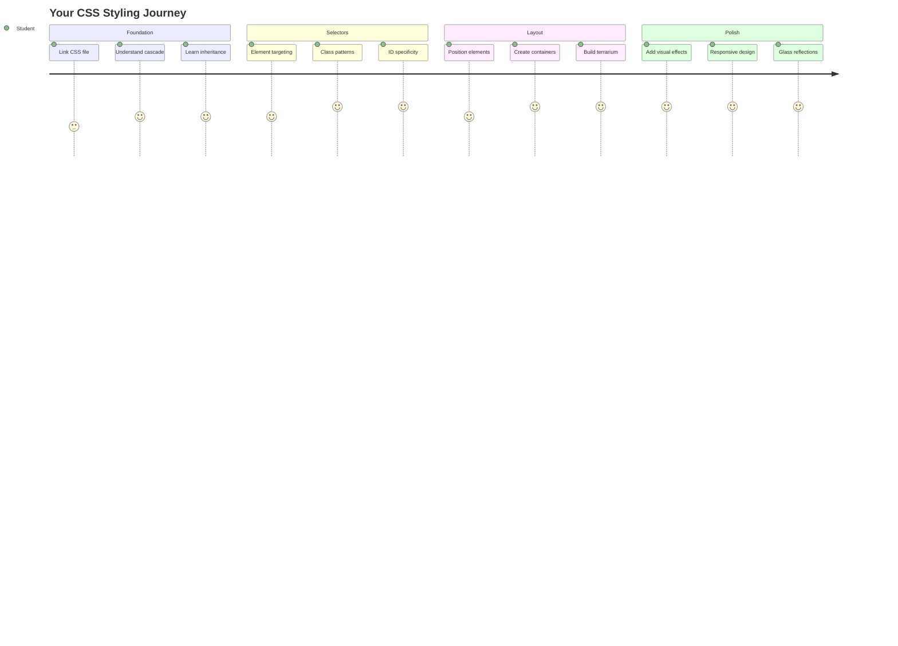
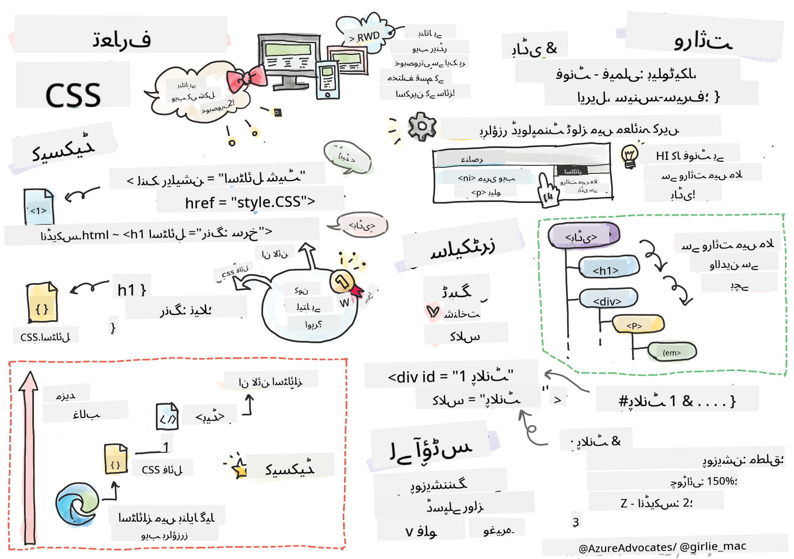
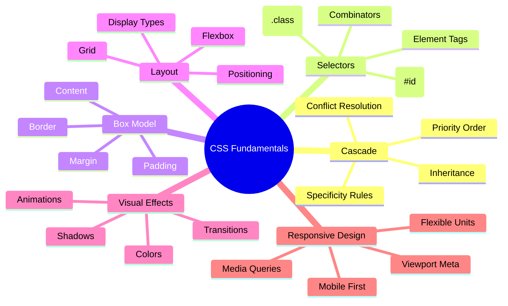
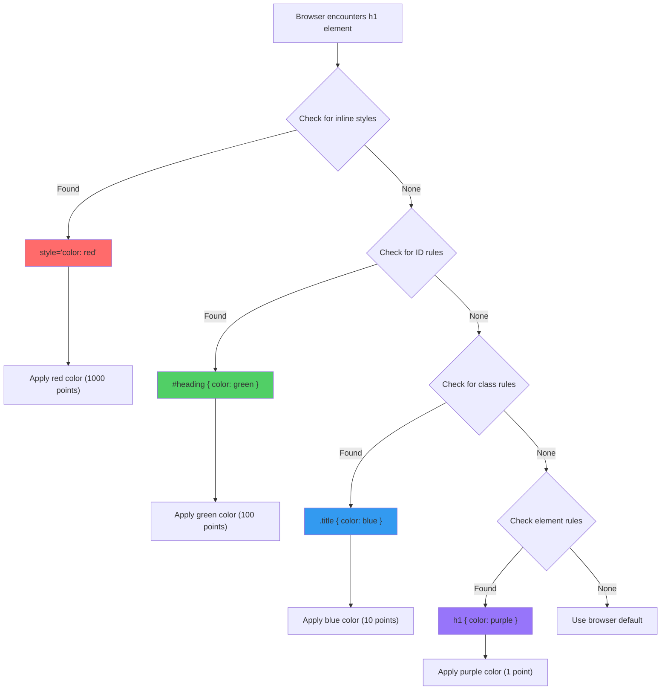
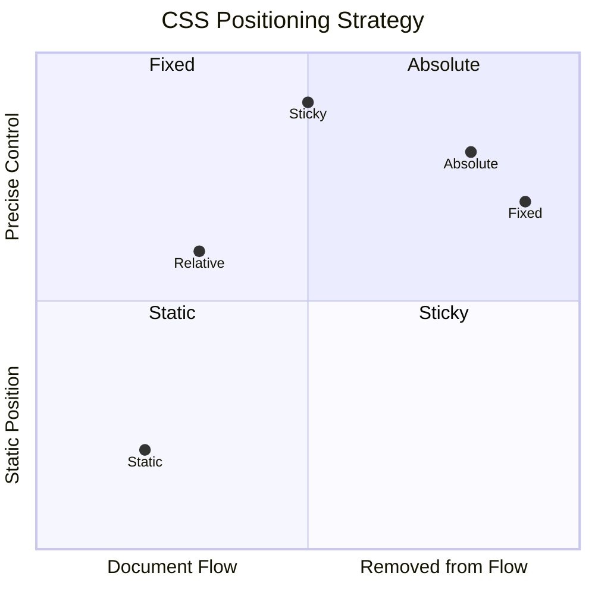
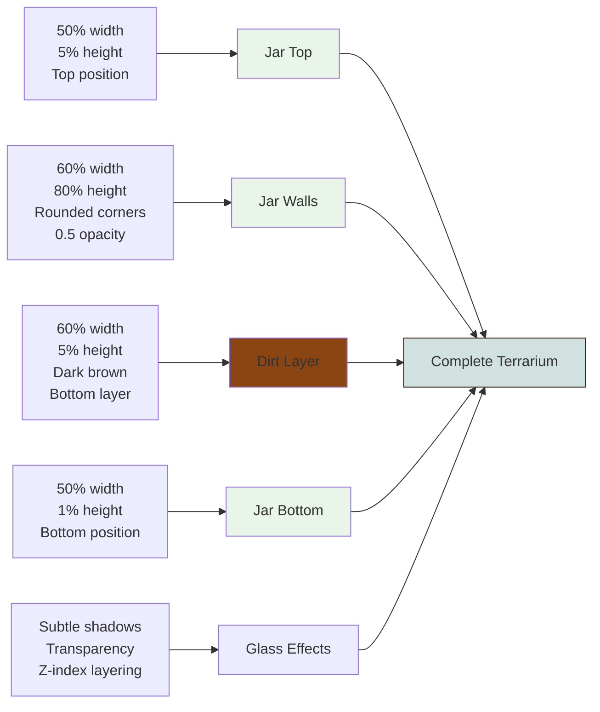
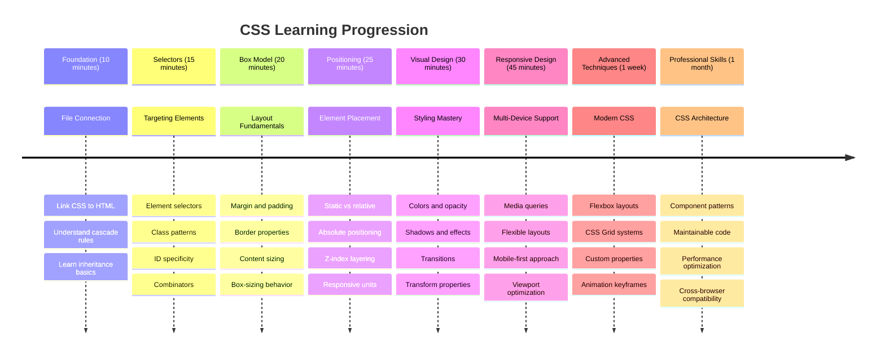

<!--
CO_OP_TRANSLATOR_METADATA:
{
  "original_hash": "e39f3a4e3bcccf94639e3af1248f8a4d",
  "translation_date": "2025-11-03T13:15:52+00:00",
  "source_file": "3-terrarium/2-intro-to-css/README.md",
  "language_code": "ur"
}
-->
# ٹیریریم پروجیکٹ حصہ 2: CSS کا تعارف




> اسکیچ نوٹ [Tomomi Imura](https://twitter.com/girlie_mac) کی طرف سے

یاد ہے آپ کا HTML ٹیریریم کتنا سادہ نظر آ رہا تھا؟ CSS وہ جگہ ہے جہاں ہم اس سادہ ڈھانچے کو بصری طور پر دلکش چیز میں تبدیل کرتے ہیں۔

اگر HTML کو گھر کا فریم بنانے جیسا سمجھا جائے، تو CSS وہ سب کچھ ہے جو اسے گھر جیسا محسوس کراتا ہے - رنگ، فرنیچر کی ترتیب، روشنی، اور کمرے کیسے ایک دوسرے سے جڑے ہوئے ہیں۔ سوچیں کہ کیسے ورسائی کا محل ایک سادہ شکار کے لاج سے شروع ہوا، لیکن سجاوٹ اور ترتیب پر توجہ نے اسے دنیا کی سب سے شاندار عمارتوں میں تبدیل کر دیا۔

آج، ہم آپ کے ٹیریریم کو فعال سے خوبصورت میں تبدیل کریں گے۔ آپ سیکھیں گے کہ عناصر کو بالکل صحیح جگہ پر کیسے رکھیں، مختلف اسکرین سائزز کے مطابق لے آؤٹ کو کیسے جوابدہ بنائیں، اور وہ بصری کشش پیدا کریں جو ویب سائٹس کو دلچسپ بناتی ہے۔

اس سبق کے اختتام تک، آپ دیکھیں گے کہ کس طرح اسٹریٹجک CSS اسٹائلنگ آپ کے پروجیکٹ کو ڈرامائی طور پر بہتر بنا سکتی ہے۔ آئیے آپ کے ٹیریریم میں کچھ اسٹائل شامل کریں۔



## پری لیکچر کوئز

[پری لیکچر کوئز](https://ff-quizzes.netlify.app/web/quiz/17)

## CSS کے ساتھ شروعات

CSS کو اکثر "چیزوں کو خوبصورت بنانے" کے طور پر سمجھا جاتا ہے، لیکن یہ اس سے کہیں زیادہ وسیع مقصد رکھتا ہے۔ CSS فلم کے ڈائریکٹر ہونے جیسا ہے - آپ نہ صرف یہ کنٹرول کرتے ہیں کہ سب کچھ کیسا نظر آتا ہے، بلکہ یہ کیسے حرکت کرتا ہے، تعامل پر کیسے جواب دیتا ہے، اور مختلف حالات میں کیسے ڈھلتا ہے۔

جدید CSS حیرت انگیز طور پر قابل ہے۔ آپ ایسا کوڈ لکھ سکتے ہیں جو خود بخود فونز، ٹیبلٹس، اور ڈیسک ٹاپ کمپیوٹرز کے لے آؤٹ کو ایڈجسٹ کرتا ہے۔ آپ ہموار اینیمیشنز بنا سکتے ہیں جو صارفین کی توجہ کو ضرورت کے مطابق گائیڈ کرتی ہیں۔ جب سب کچھ ایک ساتھ کام کرتا ہے تو نتائج کافی متاثر کن ہو سکتے ہیں۔

> 💡 **پرو ٹپ**: CSS مسلسل نئے فیچرز اور صلاحیتوں کے ساتھ ترقی کر رہا ہے۔ پروڈکشن پروجیکٹس میں استعمال کرنے سے پہلے جدید CSS فیچرز کے لیے براؤزر سپورٹ کی تصدیق کرنے کے لیے ہمیشہ [CanIUse.com](https://caniuse.com) چیک کریں۔

**اس سبق میں ہم یہ حاصل کریں گے:**
- **بنائیں گے** جدید CSS تکنیکوں کا استعمال کرتے ہوئے آپ کے ٹیریریم کے لیے مکمل بصری ڈیزائن
- **دریافت کریں گے** بنیادی تصورات جیسے کہ کیسکیڈ، وراثت، اور CSS سلیکٹرز
- **نافذ کریں گے** جوابدہ پوزیشننگ اور لے آؤٹ کی حکمت عملی
- **بنائیں گے** CSS شیپس اور اسٹائلنگ کا استعمال کرتے ہوئے ٹیریریم کنٹینر

### پیشگی شرط

آپ کو اپنے ٹیریریم کے لیے HTML ڈھانچہ مکمل کر لینا چاہیے جو پچھلے سبق میں تھا اور اسے اسٹائل کے لیے تیار رکھنا چاہیے۔

> 📺 **ویڈیو وسائل**: اس مددگار ویڈیو واک تھرو کو دیکھیں
>
> [](https://www.youtube.com/watch?v=6yIdOIV9p1I)

### اپنے CSS فائل کو سیٹ اپ کرنا

اسٹائلنگ شروع کرنے سے پہلے، ہمیں CSS کو اپنے HTML سے جوڑنا ہوگا۔ یہ کنکشن براؤزر کو بتاتا ہے کہ ہمارے ٹیریریم کے لیے اسٹائلنگ ہدایات کہاں سے حاصل کرنی ہیں۔

اپنے ٹیریریم فولڈر میں، ایک نئی فائل بنائیں جس کا نام `style.css` ہو، پھر اسے اپنے HTML دستاویز کے `<head>` سیکشن میں لنک کریں:

```html
<link rel="stylesheet" href="./style.css" />
```

**یہ کوڈ کیا کرتا ہے:**
- **بناتا ہے** آپ کے HTML اور CSS فائلز کے درمیان کنکشن
- **بتاتا ہے** براؤزر کو کہ `style.css` سے اسٹائلز لوڈ اور اپلائی کریں
- **استعمال کرتا ہے** `rel="stylesheet"` ایٹریبیوٹ یہ بتانے کے لیے کہ یہ CSS فائل ہے
- **حوالہ دیتا ہے** فائل کے راستے کو `href="./style.css"` کے ساتھ

## CSS کی کیسکیڈ کو سمجھنا

کبھی سوچا کہ CSS کو "Cascading" اسٹائل شیٹس کیوں کہا جاتا ہے؟ اسٹائلز ایک آبشار کی طرح نیچے گرتے ہیں، اور کبھی کبھی وہ ایک دوسرے سے ٹکراتے ہیں۔

سوچیں کہ فوجی کمانڈ ڈھانچے کیسے کام کرتے ہیں - ایک جنرل آرڈر کہہ سکتا ہے "تمام فوجی سبز پہنیں"، لیکن آپ کی یونٹ کے لیے ایک خاص آرڈر کہہ سکتا ہے "تقریب کے لیے نیلے لباس پہنیں"۔ زیادہ مخصوص ہدایت کو ترجیح دی جاتی ہے۔ CSS اسی منطق کی پیروی کرتا ہے، اور اس درجہ بندی کو سمجھنا ڈیبگنگ کو بہت زیادہ قابل انتظام بناتا ہے۔

### کیسکیڈ ترجیح کے ساتھ تجربہ کرنا

آئیے کیسکیڈ کو ایک اسٹائل تنازعہ بنا کر عمل میں دیکھتے ہیں۔ پہلے، اپنے `<h1>` ٹیگ میں ایک ان لائن اسٹائل شامل کریں:

```html
<h1 style="color: red">My Terrarium</h1>
```

**یہ کوڈ کیا کرتا ہے:**
- **لاگو کرتا ہے** ایک سرخ رنگ کو براہ راست `<h1>` عنصر پر ان لائن اسٹائلنگ کا استعمال کرتے ہوئے
- **استعمال کرتا ہے** `style` ایٹریبیوٹ کو CSS کو براہ راست HTML میں شامل کرنے کے لیے
- **بناتا ہے** اس مخصوص عنصر کے لیے سب سے زیادہ ترجیحی اسٹائل رول

پھر، اپنے `style.css` فائل میں یہ رول شامل کریں:

```css
h1 {
  color: blue;
}
```

**اوپر میں ہم نے:**
- **تعریف کی** ایک CSS رول جو تمام `<h1>` عناصر کو ہدف بناتا ہے
- **سیٹ کیا** ٹیکسٹ کا رنگ نیلا ایک بیرونی اسٹائل شیٹ کا استعمال کرتے ہوئے
- **بنایا** ایک کم ترجیحی رول ان لائن اسٹائلز کے مقابلے میں

✅ **علمی جانچ**: آپ کے ویب ایپ میں کون سا رنگ ظاہر ہوتا ہے؟ وہ رنگ کیوں جیتتا ہے؟ کیا آپ ایسے منظرنامے سوچ سکتے ہیں جہاں آپ اسٹائلز کو اوور رائیڈ کرنا چاہیں؟



> 💡 **CSS ترجیحی ترتیب (سب سے زیادہ سے کم):**
> 1. **ان لائن اسٹائلز** (style ایٹریبیوٹ)
> 2. **IDs** (#myId)
> 3. **کلاسز** (.myClass) اور ایٹریبیٹس
> 4. **عنصر سلیکٹرز** (h1, div, p)
> 5. **براؤزر ڈیفالٹس**

## CSS وراثت کا عمل

CSS وراثت جینیات کی طرح کام کرتی ہے - عناصر اپنے پیرنٹ عناصر سے کچھ پراپرٹیز وراثت میں لیتے ہیں۔ اگر آپ نے باڈی عنصر پر فونٹ فیملی سیٹ کیا ہے، تو اندر کا تمام ٹیکسٹ خود بخود وہی فونٹ استعمال کرتا ہے۔ یہ بالکل ویسے ہی ہے جیسے ہابسبرگ خاندان کی منفرد جبڑے کی ساخت نسلوں میں ظاہر ہوئی بغیر ہر فرد کے لیے مخصوص کیے۔

تاہم، سب کچھ وراثت میں نہیں ملتا۔ ٹیکسٹ اسٹائلز جیسے فونٹس اور رنگ وراثت میں ملتے ہیں، لیکن لے آؤٹ پراپرٹیز جیسے مارجنز اور بارڈرز نہیں ملتے۔ جیسے بچے جسمانی خصوصیات وراثت میں لے سکتے ہیں لیکن اپنے والدین کے فیشن انتخاب نہیں۔

### فونٹ وراثت کا مشاہدہ

آئیے وراثت کو عمل میں دیکھتے ہیں باڈی عنصر پر فونٹ فیملی سیٹ کر کے:

```css
body {
  font-family: 'Segoe UI', Tahoma, Geneva, Verdana, sans-serif;
}
```

**یہاں کیا ہوتا ہے:**
- **سیٹ کرتا ہے** فونٹ فیملی پورے صفحے کے لیے باڈی عنصر کو ہدف بنا کر
- **استعمال کرتا ہے** ایک فونٹ اسٹیک فال بیک آپشنز کے ساتھ بہتر براؤزر مطابقت کے لیے
- **لاگو کرتا ہے** جدید سسٹم فونٹس جو مختلف آپریٹنگ سسٹمز پر بہترین نظر آتے ہیں
- **یقینی بناتا ہے** کہ تمام چائلڈ عناصر یہ فونٹ وراثت میں لیتے ہیں جب تک کہ خاص طور پر اوور رائیڈ نہ کیا جائے

اپنے براؤزر کے ڈیولپر ٹولز (F12) کھولیں، ایلیمنٹس ٹیب پر جائیں، اور اپنے `<h1>` عنصر کا معائنہ کریں۔ آپ دیکھیں گے کہ یہ باڈی سے فونٹ فیملی وراثت میں لیتا ہے:


✅ **تجربہ کا وقت**: باڈی پر دیگر وراثت میں ملنے والی پراپرٹیز جیسے `color`, `line-height`, یا `text-align` سیٹ کرنے کی کوشش کریں۔ آپ کے ہیڈنگ اور دیگر عناصر کے ساتھ کیا ہوتا ہے؟

> 📝 **وراثت میں ملنے والی پراپرٹیز شامل ہیں**: `color`, `font-family`, `font-size`, `line-height`, `text-align`, `visibility`
>
> **غیر وراثت میں ملنے والی پراپرٹیز شامل ہیں**: `margin`, `padding`, `border`, `width`, `height`, `position`

### 🔄 **تعلیمی جائزہ**
**CSS بنیادوں کی سمجھ**: سلیکٹرز پر جانے سے پہلے، یقینی بنائیں کہ آپ:
- ✅ کیسکیڈ اور وراثت کے فرق کو بیان کر سکتے ہیں
- ✅ پیش گوئی کر سکتے ہیں کہ کون سا اسٹائل مخصوصیت تنازعہ میں جیتے گا
- ✅ شناخت کر سکتے ہیں کہ کون سی پراپرٹیز پیرنٹ عناصر سے وراثت میں ملتی ہیں
- ✅ CSS فائلز کو HTML کے ساتھ صحیح طریقے سے جوڑ سکتے ہیں

**فوری ٹیسٹ**: اگر آپ کے پاس یہ اسٹائلز ہیں، تو `<div class="special">` کے اندر ایک `<h1>` کا رنگ کیا ہوگا؟
```css
div { color: blue; }
.special { color: green; }
h1 { color: red; }
```
*جواب: سرخ (عنصر سلیکٹر براہ راست h1 کو ہدف بناتا ہے)*

## CSS سلیکٹرز میں مہارت حاصل کرنا

CSS سلیکٹرز آپ کے لیے مخصوص عناصر کو اسٹائل کرنے کا طریقہ ہیں۔ یہ بالکل درست ہدایات دینے جیسا کام کرتے ہیں - "گھر" کہنے کے بجائے، آپ کہہ سکتے ہیں "نیلے گھر جس کے دروازے پر سرخ رنگ ہے، میپل اسٹریٹ پر۔"

CSS مختلف طریقے فراہم کرتا ہے مخصوص ہونے کے لیے، اور صحیح سلیکٹر کا انتخاب کرنا کام کے لیے مناسب ٹول کا انتخاب کرنے جیسا ہے۔ کبھی آپ کو پورے محلے کے دروازے اسٹائل کرنے کی ضرورت ہوتی ہے، اور کبھی صرف ایک مخصوص دروازہ۔

### عنصر سلیکٹرز (ٹیگز)

عنصر سلیکٹرز HTML عناصر کو ان کے ٹیگ نام سے ہدف بناتے ہیں۔ یہ بنیادی اسٹائلز سیٹ کرنے کے لیے بہترین ہیں جو آپ کے صفحے پر وسیع پیمانے پر لاگو ہوتے ہیں:

```css
body {
  font-family: 'Segoe UI', Tahoma, Geneva, Verdana, sans-serif;
  margin: 0;
  padding: 0;
}

h1 {
  color: #3a241d;
  text-align: center;
  font-size: 2.5rem;
  margin-bottom: 1rem;
}
```

**ان اسٹائلز کو سمجھنا:**
- **سیٹ کرتا ہے** پورے صفحے پر مستقل ٹائپوگرافی `body` سلیکٹر کے ساتھ
- **ہٹاتا ہے** ڈیفالٹ براؤزر مارجنز اور پیڈنگ بہتر کنٹرول کے لیے
- **اسٹائل کرتا ہے** تمام ہیڈنگ عناصر کو رنگ، الائنمنٹ، اور اسپیسنگ کے ساتھ
- **استعمال کرتا ہے** `rem` یونٹس قابل پیمائش، قابل رسائی فونٹ سائز کے لیے

جبکہ عنصر سلیکٹرز عمومی اسٹائلنگ کے لیے اچھے کام کرتے ہیں، آپ کو زیادہ مخصوص سلیکٹرز کی ضرورت ہوگی انفرادی اجزاء کو اسٹائل کرنے کے لیے جیسے کہ آپ کے ٹیریریم میں پودے۔

### منفرد عناصر کے لیے ID سلیکٹرز

ID سلیکٹرز `#` علامت کا استعمال کرتے ہیں اور عناصر کو مخصوص `id` ایٹریبیٹس کے ساتھ ہدف بناتے ہیں۔ چونکہ IDs صفحے پر منفرد ہونے چاہیئے، یہ انفرادی، خاص عناصر کو اسٹائل کرنے کے لیے بہترین ہیں جیسے ہمارے بائیں اور دائیں پودے کے کنٹینرز۔

آئیے اپنے ٹیریریم کے سائیڈ کنٹینرز کے لیے اسٹائلنگ بنائیں جہاں پودے رہیں گے:

```css
#left-container {
  background-color: #f5f5f5;
  width: 15%;
  left: 0;
  top: 0;
  position: absolute;
  height: 100vh;
  padding: 1rem;
  box-sizing: border-box;
}

#right-container {
  background-color: #f5f5f5;
  width: 15%;
  right: 0;
  top: 0;
  position: absolute;
  height: 100vh;
  padding: 1rem;
  box-sizing: border-box;
}
```

**یہ کوڈ کیا حاصل کرتا ہے:**
- **پوزیشن کرتا ہے** کنٹینرز کو اسکرین کے کناروں پر `absolute` پوزیشننگ کا استعمال کرتے ہوئے
- **استعمال کرتا ہے** `vh` (ویوپورٹ ہائٹ) یونٹس جوابدہ اونچائی کے لیے جو اسکرین سائز کے مطابق ڈھلتی ہے
- **لاگو کرتا ہے** `box-sizing: border-box` تاکہ پیڈنگ کل چوڑائی میں شامل ہو
- **ہٹاتا ہے** غیر ضروری `px` یونٹس صفر ویلیوز سے صاف کوڈ کے لیے
- **سیٹ کرتا ہے** ایک ہلکا پس منظر رنگ جو آنکھوں پر سخت گرے کے مقابلے میں آسان ہے

✅ **کوڈ کوالٹی چیلنج**: نوٹ کریں کہ یہ CSS DRY (Don't Repeat Yourself) اصول کی خلاف ورزی کرتا ہے۔ کیا آپ اسے ID اور کلاس دونوں کا استعمال کرتے ہوئے ریفیکٹر کر سکتے ہیں؟

**بہتر طریقہ:**
```html
<div id="left-container" class="container"></div>
<div id="right-container" class="container"></div>
```

```css
.container {
  background-color: #f5f5f5;
  width: 15%;
  top: 0;
  position: absolute;
  height: 100vh;
  padding: 1rem;
  box-sizing: border-box;
}

#left-container {
  left: 0;
}

#right-container {
  right: 0;
}
```

### کلاس سلیکٹرز دوبارہ استعمال کے قابل اسٹائلز کے لیے

کلاس سلیکٹرز `.` علامت کا استعمال کرتے ہیں اور بہترین ہیں جب آپ ایک ہی اسٹائلز کو متعدد عناصر پر لاگو کرنا چاہتے ہیں۔ IDs کے برعکس، کلاسز آپ کے HTML میں دوبارہ استعمال کی جا سکتی ہیں، جو انہیں مستقل اسٹائلنگ پیٹرنز کے لیے مثالی بناتی ہیں۔

ہمارے ٹیریریم میں، ہر پودے کو اسی طرح کی اسٹائلنگ کی ضرورت ہے لیکن انفرادی پوزیشننگ بھی چاہیے۔ ہم مشترکہ اسٹائلز کے لیے کلاسز اور منفرد پوزیشننگ کے لیے IDs کا مجموعہ استعمال کریں گے۔

**ہر پودے کے لیے HTML ڈھانچہ یہ ہے:**
```html
<div class="plant-holder">
  
</div>
```

**اہم عناصر کی وضاحت:**
- **استعمال کرتا ہے** `class="plant-holder"` مستقل کنٹینر اسٹائلنگ کے لیے تمام پودوں میں
- **لاگو کرتا ہے** `class="plant"` مشترکہ تصویر اسٹائلنگ اور رویے کے لیے
- **شامل کرتا ہے** منفرد `id="plant1"` انفرادی پوزیشننگ اور جاوا اسکرپٹ تعامل کے لیے
- **فراہم کرتا ہے** وضاحتی alt ٹیکسٹ اسکرین ریڈر کی رسائی کے لیے

اب یہ اسٹائلز اپنی `style.css` فائل میں شامل کریں:

```css
.plant-holder {
  position: relative;
  height: 13%;
  left: -0.6rem;
}

.plant {
  position: absolute;
  max-width: 150%;
  max-height: 150%;
  z-index: 2;
  transition: transform 0.3s ease;
}

.plant:hover {
  transform: scale(1.05);
}
```

**ان اسٹائلز کو سمجھنا:**
- **بناتا ہے** کنٹینر کے لیے رشتہ دار پوزیشننگ تاکہ پوزیشننگ کا سیاق و سباق قائم ہو
- **سیٹ کرتا ہے** ہر پودے کے کنٹینر کو 13% اونچائی پر، یہ یقینی بناتے ہوئے کہ تمام پودے عمودی طور پر فٹ ہوں بغیر اسکرولنگ کے
- **تھوڑا سا بائیں طرف منتقل کرتا ہے** کنٹینرز کو تاکہ پودے اپنے کنٹینرز میں بہتر طور پر مرکز ہوں
- **اجازت دیتا ہے** پودوں کو جوابدہ طور پر اسکیل کرنے کی `max-width` اور `max-height` پراپرٹیز کے ساتھ
- **استعمال کرتا ہے** `z-index` پودوں کو ٹیریریم میں دیگر عناصر کے اوپر تہہ کرنے کے لیے
- **شامل کرتا ہے** ایک ہلکا ہور اثر CSS ٹرانزیشنز کے ساتھ بہتر صارف تعامل کے لیے

✅ **تنقیدی سوچ**: ہمیں `.plant-holder` اور `.plant` سلیکٹرز دونوں کی ضرورت کیوں ہے؟ کیا ہوگا اگر ہم صرف ایک استعمال کرنے کی کوشش کریں؟

> 💡 **ڈیزائن پیٹرن**: کنٹینر (`.plant-holder`) لے آؤٹ اور پوزیشننگ کو کنٹرول کرتا ہے، جبکہ مواد (`.plant`) ظاہری شکل اور اسکیلنگ کو کنٹرول کرتا ہے۔ یہ علیحدگی کوڈ کو زیادہ قابل انتظام اور لچکدار بناتی ہے۔

## CSS پوزیشننگ کو سمجھنا

CSS پوزیشننگ اسٹیج ڈائریکٹر ہونے جیسا ہے - آپ ہدایت دیتے ہیں کہ ہر اداکار کہاں کھڑا ہو اور اسٹیج پر کیسے حرکت کرے۔ کچھ اداکار معیاری ترتیب کی پیروی کرتے ہیں، جبکہ دوسروں کو ڈرامائی اثر کے لیے مخصوص پوزیشننگ کی ضرورت ہوتی ہے۔

ایک بار جب آپ پوزیشننگ کو سمجھ لیتے ہیں، بہت سے لے آؤٹ چیلنجز قابل انتظام ہو جاتے ہیں۔ کیا آپ کو ایک نیویگیشن بار کی ضرورت ہے جو صارفین کے اسکرول کرتے وقت اوپر رہے؟ پوزیشننگ اس کا انتظام کرتی ہے۔ کیا آپ کو ایک ٹول ٹپ چاہیے جو کسی مخصوص مقام پر ظاہر ہو؟ یہ بھی پوزیشننگ ہے۔

### پانچ پوزیشن ویلیوز



| پوزیشن ویلیو | رویہ | استعمال کا کیس |
|----------------|----------|----------|
| `static` | ڈیفالٹ فلو، اوپر/بائیں/دائیں/نیچے کو نظر انداز کرتا ہے | نارمل دستاویز لے آؤٹ |
| `relative` | اپنی نارمل پوزیشن کے نسبت پوزیشنڈ | چھوٹی ایڈجسٹمنٹس، پوزیشننگ سیاق و سب
- اگر `.plant-holder` `absolute` کی بجائے `relative` استعمال کرے تو لے آؤٹ کیسے تبدیل ہوگا؟
- جب آپ `.plant` کو `relative` پوزیشننگ میں تبدیل کرتے ہیں تو کیا ہوتا ہے؟

### 🔄 **تعلیمی جائزہ**
**CSS پوزیشننگ کی مہارت**: اپنی سمجھ کو جانچنے کے لیے توقف کریں:
- ✅ کیا آپ وضاحت کر سکتے ہیں کہ ڈریگ اینڈ ڈراپ کے لیے پودوں کو `absolute` پوزیشننگ کی ضرورت کیوں ہے؟
- ✅ کیا آپ سمجھتے ہیں کہ `relative` کنٹینرز پوزیشننگ کا سیاق و سباق کیسے بناتے ہیں؟
- ✅ سائیڈ کنٹینرز `absolute` پوزیشننگ کیوں استعمال کرتے ہیں؟
- ✅ اگر آپ پوزیشن کے اعلانات کو مکمل طور پر ہٹا دیں تو کیا ہوگا؟

**حقیقی دنیا کا تعلق**: سوچیں کہ CSS پوزیشننگ حقیقی دنیا کے لے آؤٹ کی عکاسی کیسے کرتی ہے:
- **Static**: شیلف پر کتابیں (قدرتی ترتیب)
- **Relative**: کتاب کو تھوڑا سا حرکت دینا لیکن اس کی جگہ برقرار رکھنا
- **Absolute**: کسی صفحے نمبر پر بک مارک رکھنا
- **Fixed**: ایک اسٹکی نوٹ جو صفحات پلٹنے پر بھی نظر آتا ہے

## CSS کے ساتھ ٹیریریم بنانا

اب ہم صرف CSS کا استعمال کرتے ہوئے ایک شیشے کا جار بنائیں گے - کوئی تصاویر یا گرافکس سافٹ ویئر استعمال نہیں ہوگا۔

پوزیشننگ اور شفافیت کے ذریعے حقیقت پسندانہ شیشے، سائے، اور گہرائی کے اثرات بنانا CSS کی بصری صلاحیتوں کو ظاہر کرتا ہے۔ یہ تکنیک اس طرح کی ہے جیسے Bauhaus تحریک کے معماروں نے سادہ جیومیٹرک شکلوں کا استعمال کرتے ہوئے پیچیدہ، خوبصورت ڈھانچے بنائے۔ ایک بار جب آپ ان اصولوں کو سمجھ لیں گے، تو آپ بہت سے ویب ڈیزائنز کے پیچھے CSS تکنیک کو پہچان سکیں گے۔



### شیشے کے جار کے اجزاء بنانا

آئیے ٹیریریم جار کو ٹکڑوں میں بنائیں۔ ہر حصہ `absolute` پوزیشننگ اور فیصد پر مبنی سائزنگ کا استعمال کرتا ہے تاکہ ریسپانسیو ڈیزائن بنایا جا سکے:

```css
.jar-walls {
  height: 80%;
  width: 60%;
  background: #d1e1df;
  border-radius: 1rem;
  position: absolute;
  bottom: 0.5%;
  left: 20%;
  opacity: 0.5;
  z-index: 1;
  box-shadow: inset 0 0 2rem rgba(0, 0, 0, 0.1);
}

.jar-top {
  width: 50%;
  height: 5%;
  background: #d1e1df;
  position: absolute;
  bottom: 80.5%;
  left: 25%;
  opacity: 0.7;
  z-index: 1;
  border-radius: 0.5rem 0.5rem 0 0;
}

.jar-bottom {
  width: 50%;
  height: 1%;
  background: #d1e1df;
  position: absolute;
  bottom: 0;
  left: 25%;
  opacity: 0.7;
  border-radius: 0 0 0.5rem 0.5rem;
}

.dirt {
  width: 60%;
  height: 5%;
  background: #3a241d;
  position: absolute;
  border-radius: 0 0 1rem 1rem;
  bottom: 1%;
  left: 20%;
  opacity: 0.7;
  z-index: -1;
}
```

**ٹریریریم کی تعمیر کو سمجھنا:**
- **استعمال کرتا ہے** فیصد پر مبنی طول و عرض تاکہ تمام اسکرین سائزز پر ریسپانسیو اسکیلنگ ہو سکے
- **پوزیشن کرتا ہے** عناصر کو بالکل اسٹیک اور سیدھ میں لانے کے لیے
- **لگاتا ہے** مختلف شفافیت کی قدریں تاکہ شیشے کی شفافیت کا اثر پیدا ہو
- **نافذ کرتا ہے** `z-index` لیئرنگ تاکہ پودے جار کے اندر نظر آئیں
- **شامل کرتا ہے** ہلکا سا باکس شیڈو اور بہتر بارڈر ریڈیئس تاکہ زیادہ حقیقت پسندانہ ظاہری شکل ہو

### فیصد کے ساتھ ریسپانسیو ڈیزائن

نوٹ کریں کہ تمام طول و عرض فکسڈ پکسل ویلیوز کی بجائے فیصد استعمال کرتے ہیں:

**یہ کیوں اہم ہے:**
- **یقینی بناتا ہے** کہ ٹیریریم کسی بھی اسکرین سائز پر تناسب سے اسکیل کرے
- **برقرار رکھتا ہے** جار کے اجزاء کے درمیان بصری تعلقات
- **فراہم کرتا ہے** موبائل فونز سے لے کر بڑے ڈیسک ٹاپ مانیٹرز تک ایک مستقل تجربہ
- **ڈیزائن کو** بغیر بصری لے آؤٹ کو توڑے ڈھالنے دیتا ہے

### CSS یونٹس کا استعمال

ہم `rem` یونٹس کو بارڈر ریڈیئس کے لیے استعمال کر رہے ہیں، جو روٹ فونٹ سائز کے مطابق اسکیل کرتے ہیں۔ یہ زیادہ قابل رسائی ڈیزائنز بناتا ہے جو صارف کے فونٹ کی ترجیحات کا احترام کرتے ہیں۔ [CSS relative units](https://www.w3.org/TR/css-values-3/#font-relative-lengths) کے بارے میں مزید جانیں۔

✅ **بصری تجربہ**: ان اقدار کو تبدیل کرنے کی کوشش کریں اور اثرات کا مشاہدہ کریں:
- جار کی شفافیت کو 0.5 سے 0.8 میں تبدیل کریں – شیشے کی ظاہری شکل پر اس کا کیا اثر پڑتا ہے؟
- مٹی کے رنگ کو `#3a241d` سے `#8B4513` میں ایڈجسٹ کریں – اس کا بصری اثر کیا ہوتا ہے؟
- مٹی کے `z-index` کو 2 میں تبدیل کریں – لیئرنگ پر کیا اثر پڑتا ہے؟

### 🔄 **تعلیمی جائزہ**
**CSS بصری ڈیزائن کی سمجھ**: بصری CSS کو سمجھنے کی تصدیق کریں:
- ✅ فیصد پر مبنی طول و عرض ریسپانسیو ڈیزائن کیسے بناتے ہیں؟
- ✅ شفافیت شیشے کی شفافیت کا اثر کیسے پیدا کرتی ہے؟
- ✅ `z-index` عناصر کی لیئرنگ میں کیا کردار ادا کرتا ہے؟
- ✅ بارڈر ریڈیئس کی قدریں جار کی شکل کیسے بناتی ہیں؟

**ڈیزائن اصول**: نوٹ کریں کہ ہم سادہ شکلوں سے پیچیدہ بصری بنا رہے ہیں:
1. **مستطیلیں** → **گول مستطیلیں** → **جار کے اجزاء**
2. **فلیٹ رنگ** → **شفافیت** → **شیشے کا اثر**
3. **انفرادی عناصر** → **لیئرڈ کمپوزیشن** → **3D ظاہری شکل**

---

## GitHub Copilot Agent Challenge 🚀

Agent mode کا استعمال کرتے ہوئے درج ذیل چیلنج مکمل کریں:

**تفصیل:** ایک CSS اینیمیشن بنائیں جو ٹیریریم کے پودوں کو آہستہ آہستہ جھولنے کا اثر دے، قدرتی ہوا کی نقل کرتے ہوئے۔ یہ آپ کو CSS اینیمیشنز، ٹرانسفارمز، اور کی فریمز کی مشق کرنے میں مدد دے گا جبکہ آپ کے ٹیریریم کی بصری کشش کو بڑھائے گا۔

**پرومپٹ:** CSS کی فریم اینیمیشنز شامل کریں تاکہ ٹیریریم کے پودے آہستہ آہستہ ایک طرف سے دوسری طرف جھولیں۔ ایک جھولنے والی اینیمیشن بنائیں جو ہر پودے کو تھوڑا سا (2-3 ڈگری) بائیں اور دائیں گھمائے، جس کی مدت 3-4 سیکنڈ ہو، اور اسے `.plant` کلاس پر لاگو کریں۔ یقینی بنائیں کہ اینیمیشن لامتناہی لوپ کرے اور قدرتی حرکت کے لیے ایک ایزنگ فنکشن ہو۔

[agent mode](https://code.visualstudio.com/blogs/2025/02/24/introducing-copilot-agent-mode) کے بارے میں مزید جانیں۔

## 🚀 چیلنج: شیشے کی عکاسی شامل کرنا

کیا آپ اپنے ٹیریریم میں حقیقت پسندانہ شیشے کی عکاسی شامل کرنے کے لیے تیار ہیں؟ یہ تکنیک ڈیزائن میں گہرائی اور حقیقت پسندی کا اضافہ کرے گی۔

آپ ہلکے سفید یا ہلکے رنگ کے بیضوی شکلیں بنائیں گے جو شیشے کی عکاسی کی نقل کرتے ہیں۔ یہ طریقہ اس طرح ہے جیسے Renaissance کے مصور جیسے Jan van Eyck نے روشنی اور عکاسی کا استعمال کرتے ہوئے پینٹ شدہ شیشے کو تین جہتی ظاہر کیا۔ آپ کا مقصد یہ ہے:


**آپ کا چیلنج:**
- **بنائیں** ہلکے سفید یا روشنی والے بیضوی شکلیں شیشے کی عکاسی کے لیے
- **انہیں** جار کے بائیں جانب اسٹریٹجک طور پر پوزیشن کریں
- **مناسب** شفافیت اور بلر اثرات لگائیں تاکہ روشنی کی حقیقت پسندانہ عکاسی ہو
- **استعمال کریں** `border-radius` تاکہ قدرتی، بلبلے جیسی شکلیں بن سکیں
- **گریڈینٹس یا باکس شیڈوز کے ساتھ تجربہ کریں** تاکہ حقیقت پسندی کو بڑھایا جا سکے

## لیکچر کے بعد کا کوئز

[لیکچر کے بعد کا کوئز](https://ff-quizzes.netlify.app/web/quiz/18)

## اپنے CSS علم کو بڑھائیں

CSS شروع میں پیچیدہ محسوس ہو سکتا ہے، لیکن ان بنیادی تصورات کو سمجھنا آپ کو مزید جدید تکنیکوں کے لیے ایک مضبوط بنیاد فراہم کرتا ہے۔

**آپ کے اگلے CSS سیکھنے کے علاقے:**
- **Flexbox** - عناصر کی سیدھ اور تقسیم کو آسان بناتا ہے
- **CSS Grid** - پیچیدہ لے آؤٹ بنانے کے لیے طاقتور ٹولز فراہم کرتا ہے
- **CSS Variables** - تکرار کو کم کرتا ہے اور برقرار رکھنے کی صلاحیت کو بہتر بناتا ہے
- **Responsive design** - یقینی بناتا ہے کہ سائٹس مختلف اسکرین سائزز پر اچھی طرح کام کریں

### انٹرایکٹو سیکھنے کے وسائل

ان تصورات کو ان دلچسپ، عملی گیمز کے ساتھ مشق کریں:
- 🐸 [Flexbox Froggy](https://flexboxfroggy.com/) - تفریحی چیلنجز کے ذریعے Flexbox میں مہارت حاصل کریں
- 🌱 [Grid Garden](https://codepip.com/games/grid-garden/) - CSS Grid سیکھیں اور ورچوئل گاجریں اگائیں
- 🎯 [CSS Battle](https://cssbattle.dev/) - کوڈنگ چیلنجز کے ساتھ اپنی CSS مہارت کو آزمائیں

### اضافی سیکھنا

CSS کے بنیادی اصولوں کے لیے یہ Microsoft Learn ماڈیول مکمل کریں: [اپنے HTML ایپ کو CSS کے ساتھ اسٹائل کریں](https://docs.microsoft.com/learn/modules/build-simple-website/4-css-basics/?WT.mc_id=academic-77807-sagibbon)

### ⚡ **آپ اگلے 5 منٹ میں کیا کر سکتے ہیں**
- [ ] DevTools کھولیں اور کسی بھی ویب سائٹ پر CSS اسٹائلز کو Elements پینل کے ذریعے دیکھیں
- [ ] ایک سادہ CSS فائل بنائیں اور اسے HTML صفحے سے لنک کریں
- [ ] مختلف طریقوں سے رنگ تبدیل کرنے کی کوشش کریں: hex، RGB، اور نامزد رنگ
- [ ] باکس ماڈل کی مشق کریں اور padding اور margin کو div میں شامل کریں

### 🎯 **آپ اس گھنٹے میں کیا حاصل کر سکتے ہیں**
- [ ] لیکچر کے بعد کا کوئز مکمل کریں اور CSS کے بنیادی اصولوں کا جائزہ لیں
- [ ] اپنے HTML صفحے کو فونٹس، رنگوں، اور اسپیسنگ کے ساتھ اسٹائل کریں
- [ ] Flexbox یا Grid کا استعمال کرتے ہوئے ایک سادہ لے آؤٹ بنائیں
- [ ] CSS ٹرانزیشنز کے ساتھ ہموار اثرات کی مشق کریں
- [ ] میڈیا کوئریز کے ساتھ ریسپانسیو ڈیزائن کی مشق کریں

### 📅 **آپ کی ہفتہ بھر کی CSS مہم**
- [ ] تخلیقی انداز کے ساتھ ٹیریریم اسٹائلنگ اسائنمنٹ مکمل کریں
- [ ] CSS Grid میں مہارت حاصل کریں اور فوٹو گیلری لے آؤٹ بنائیں
- [ ] CSS اینیمیشنز سیکھیں اور اپنے ڈیزائنز کو زندگی بخشیں
- [ ] Sass یا Less جیسے CSS پری پروسیسرز کو دریافت کریں
- [ ] ڈیزائن کے اصولوں کا مطالعہ کریں اور انہیں اپنے CSS میں لاگو کریں
- [ ] دلچسپ ڈیزائنز کا تجزیہ کریں اور انہیں آن لائن دوبارہ بنائیں

### 🌟 **آپ کا ماہانہ ڈیزائن ماسٹری**
- [ ] ایک مکمل ریسپانسیو ویب سائٹ ڈیزائن سسٹم بنائیں
- [ ] CSS-in-JS یا Tailwind جیسے یوٹیلیٹی فرسٹ فریم ورک سیکھیں
- [ ] CSS میں بہتری کے ساتھ اوپن سورس پروجیکٹس میں تعاون کریں
- [ ] جدید CSS تصورات جیسے CSS کسٹم پراپرٹیز اور کنٹینمنٹ میں مہارت حاصل کریں
- [ ] ماڈیولر CSS کے ساتھ دوبارہ قابل استعمال کمپوننٹ لائبریریاں بنائیں
- [ ] CSS سیکھنے والے دوسروں کی رہنمائی کریں اور ڈیزائن کا علم شیئر کریں

## 🎯 آپ کا CSS ماسٹری ٹائم لائن



### 🛠️ آپ کا CSS ٹول کٹ خلاصہ

اس سبق کو مکمل کرنے کے بعد، آپ کے پاس ہے:
- **Cascade Understanding**: اسٹائلز کیسے وراثت میں ملتے ہیں اور ایک دوسرے کو اووررائیڈ کرتے ہیں
- **Selector Mastery**: عناصر، کلاسز، اور IDs کے ساتھ درست ہدف بنانا
- **Positioning Skills**: عناصر کی اسٹریٹجک جگہ اور لیئرنگ
- **Visual Design**: شیشے کے اثرات، سائے، اور شفافیت بنانا
- **Responsive Techniques**: فیصد پر مبنی لے آؤٹ جو کسی بھی اسکرین پر ڈھلتے ہیں
- **Code Organization**: صاف، برقرار رکھنے کے قابل CSS ڈھانچہ
- **Modern Practices**: رشتہ دار یونٹس اور قابل رسائی ڈیزائن پیٹرنز کا استعمال

**اگلے اقدامات**: آپ کے ٹیریریم میں اب ساخت (HTML) اور اسٹائل (CSS) دونوں ہیں۔ آخری سبق جاوا اسکرپٹ کے ساتھ انٹرایکٹوٹی شامل کرے گا!

## اسائنمنٹ

[CSS Refactoring](assignment.md)

---

**ڈسکلیمر**:  
یہ دستاویز AI ترجمہ سروس [Co-op Translator](https://github.com/Azure/co-op-translator) کا استعمال کرتے ہوئے ترجمہ کی گئی ہے۔ ہم درستگی کے لیے کوشش کرتے ہیں، لیکن براہ کرم آگاہ رہیں کہ خودکار ترجمے میں غلطیاں یا غیر درستیاں ہو سکتی ہیں۔ اصل دستاویز کو اس کی اصل زبان میں مستند ذریعہ سمجھا جانا چاہیے۔ اہم معلومات کے لیے، پیشہ ور انسانی ترجمہ کی سفارش کی جاتی ہے۔ ہم اس ترجمے کے استعمال سے پیدا ہونے والی کسی بھی غلط فہمی یا غلط تشریح کے ذمہ دار نہیں ہیں۔