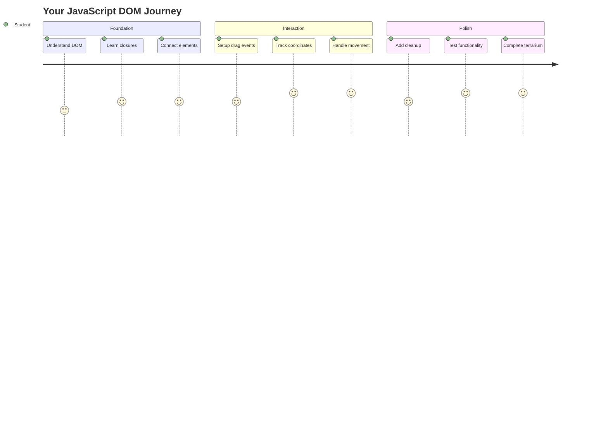
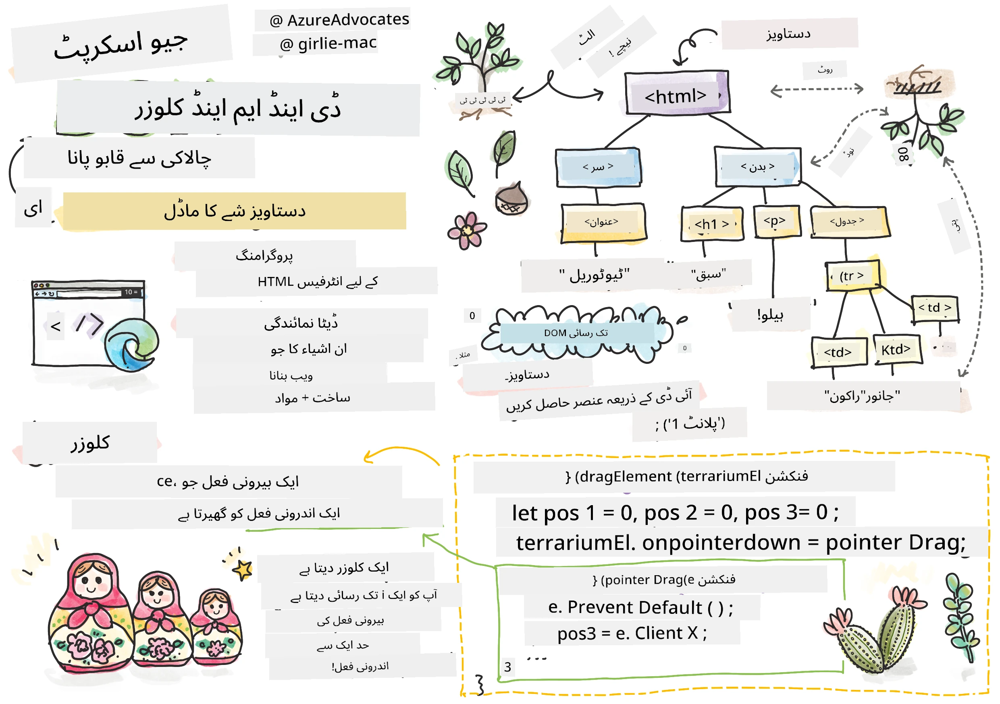
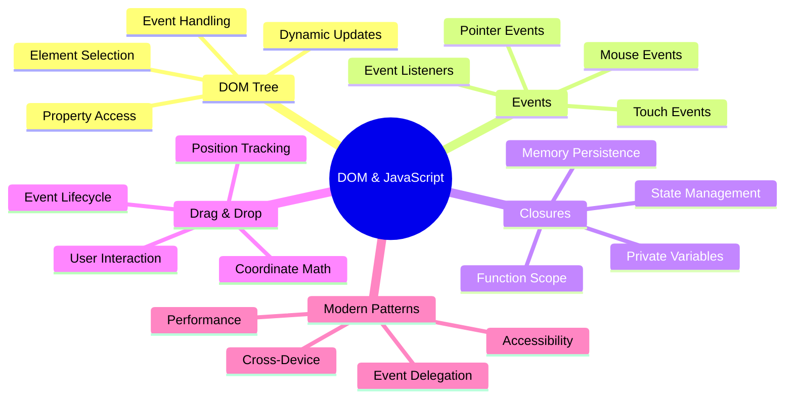
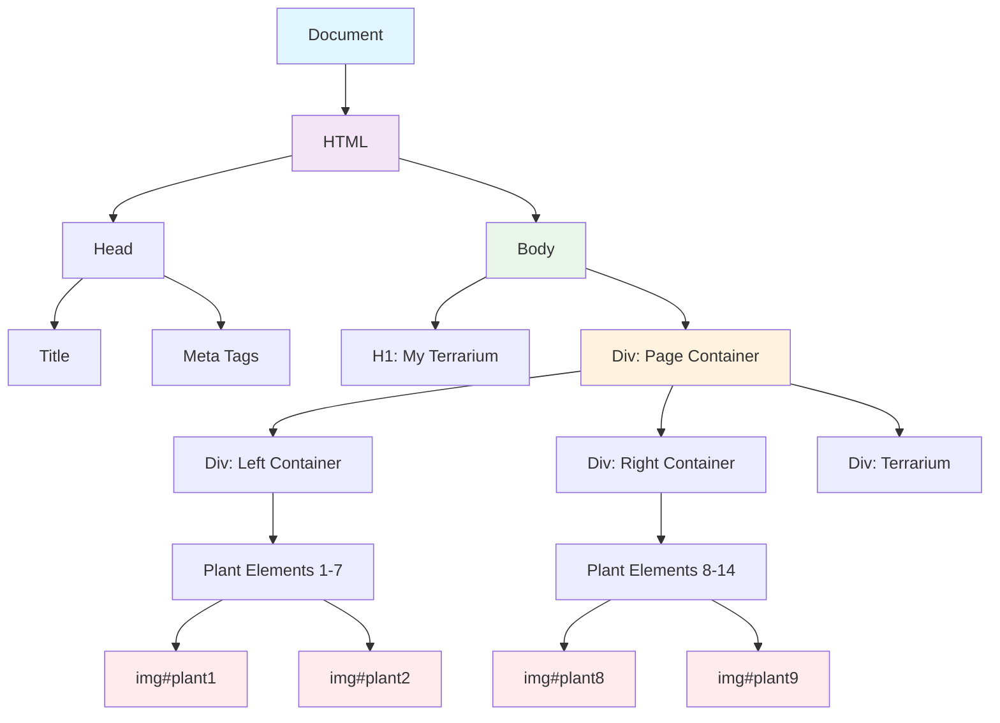
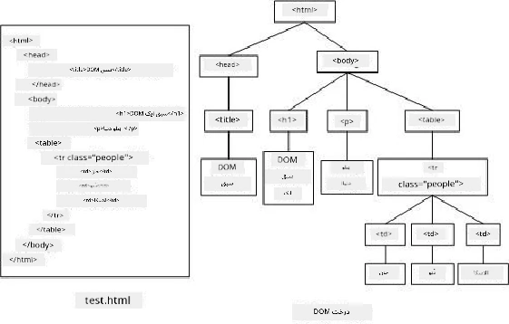
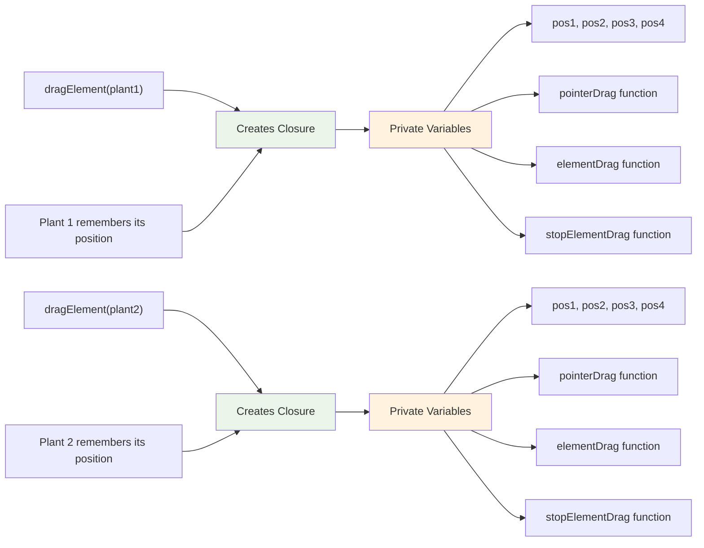
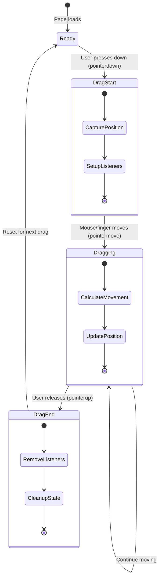
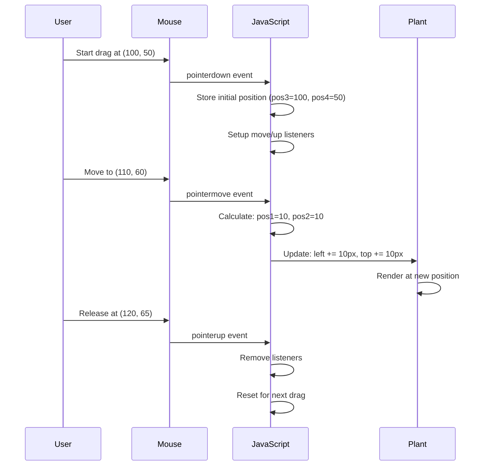
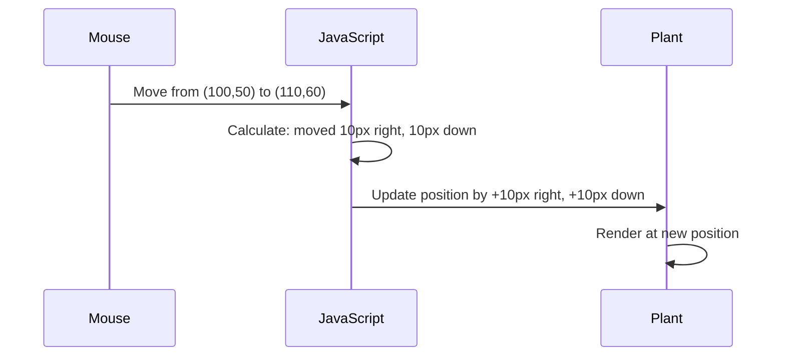
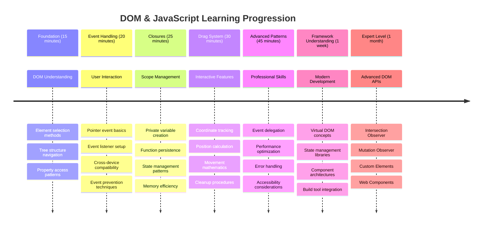

# ٹیریریم پروجیکٹ حصہ 3: DOM مینپولیشن اور جاوا اسکرپٹ کلوزرز




> اسکیچ نوٹ [Tomomi Imura](https://twitter.com/girlie_mac) کی طرف سے

ویب ڈیولپمنٹ کے سب سے دلچسپ پہلو میں خوش آمدید - چیزوں کو انٹرایکٹو بنانا! دستاویز آبجیکٹ ماڈل (DOM) آپ کے HTML اور جاوا اسکرپٹ کے درمیان ایک پل کی طرح ہے، اور آج ہم اسے آپ کے ٹیریریم کو زندہ کرنے کے لیے استعمال کریں گے۔ جب ٹم برنرز لی نے پہلا ویب براؤزر بنایا، تو انہوں نے ایک ایسی ویب کا تصور کیا جہاں دستاویزات متحرک اور انٹرایکٹو ہو سکیں - DOM اس تصور کو ممکن بناتا ہے۔

ہم جاوا اسکرپٹ کلوزرز کو بھی دریافت کریں گے، جو شروع میں خوفناک لگ سکتے ہیں۔ کلوزرز کو "یادداشت کے جیب" بنانے کے طور پر سوچیں جہاں آپ کے فنکشنز اہم معلومات کو یاد رکھ سکتے ہیں۔ یہ بالکل ایسے ہی ہے جیسے آپ کے ٹیریریم میں ہر پودے کے پاس اپنی پوزیشن کو ٹریک کرنے کے لیے اپنا ڈیٹا ریکارڈ ہو۔ اس سبق کے اختتام تک، آپ سمجھ جائیں گے کہ یہ کتنے قدرتی اور مفید ہیں۔

یہ ہے جو ہم بنا رہے ہیں: ایک ٹیریریم جہاں صارفین پودوں کو کہیں بھی گھسیٹ کر چھوڑ سکتے ہیں۔ آپ DOM مینپولیشن تکنیک سیکھیں گے جو ڈریگ اینڈ ڈراپ فائل اپلوڈز سے لے کر انٹرایکٹو گیمز تک سب کچھ طاقتور بناتی ہیں۔ آئیے آپ کے ٹیریریم کو زندہ کریں۔



## پری لیکچر کوئز

[پری لیکچر کوئز](https://ff-quizzes.netlify.app/web/quiz/19)

## DOM کو سمجھنا: انٹرایکٹو ویب صفحات کے لیے آپ کا گیٹ وے

دستاویز آبجیکٹ ماڈل (DOM) وہ طریقہ ہے جس سے جاوا اسکرپٹ آپ کے HTML عناصر کے ساتھ بات چیت کرتا ہے۔ جب آپ کا براؤزر ایک HTML صفحہ لوڈ کرتا ہے، تو یہ اس صفحے کی ایک منظم نمائندگی کو میموری میں بناتا ہے - یہی DOM ہے۔ اسے ایک خاندانی درخت کے طور پر سوچیں جہاں ہر HTML عنصر ایک خاندانی رکن ہے جسے جاوا اسکرپٹ رسائی، ترمیم یا ترتیب دے سکتا ہے۔

DOM مینپولیشن جامد صفحات کو انٹرایکٹو ویب سائٹس میں تبدیل کرتا ہے۔ جب بھی آپ دیکھتے ہیں کہ ایک بٹن ہوور پر رنگ بدلتا ہے، مواد صفحہ ریفریش کے بغیر اپ ڈیٹ ہوتا ہے، یا عناصر جنہیں آپ گھسیٹ سکتے ہیں، تو یہ سب DOM مینپولیشن کا کام ہے۔





> DOM اور HTML مارک اپ کی نمائندگی جو اس کا حوالہ دیتا ہے۔ [Olfa Nasraoui](https://www.researchgate.net/publication/221417012_Profile-Based_Focused_Crawler_for_Social_Media-Sharing_Websites) کی طرف سے

**یہ ہے جو DOM کو طاقتور بناتا ہے:**
- **فراہم کرتا ہے** آپ کے صفحے پر کسی بھی عنصر تک رسائی کا ایک منظم طریقہ
- **قابل بناتا ہے** صفحہ ریفریش کے بغیر متحرک مواد کی اپ ڈیٹس
- **اجازت دیتا ہے** صارف کے تعاملات جیسے کلکس اور ڈریگز کا حقیقی وقت میں جواب
- **بنیاد بناتا ہے** جدید انٹرایکٹو ویب ایپلیکیشنز کے لیے

## جاوا اسکرپٹ کلوزرز: منظم، طاقتور کوڈ بنانا

ایک [جاوا اسکرپٹ کلوزر](https://developer.mozilla.org/docs/Web/JavaScript/Closures) ایک فنکشن کو اس کی اپنی نجی ورک اسپیس دینے جیسا ہے جس میں مستقل یادداشت ہو۔ غور کریں کہ گالاپاگوس جزائر کے ڈارون کے فنچز نے اپنے مخصوص ماحول کی بنیاد پر خصوصی چونچیں کیسے تیار کیں - کلوزرز اسی طرح کام کرتے ہیں، مخصوص فنکشنز بناتے ہیں جو اپنے مخصوص سیاق و سباق کو "یاد رکھتے ہیں" یہاں تک کہ ان کے پیرنٹ فنکشن ختم ہو جائے۔

ہمارے ٹیریریم میں، کلوزرز ہر پودے کو اپنی پوزیشن کو آزادانہ طور پر یاد رکھنے میں مدد کرتے ہیں۔ یہ پیٹرن پیشہ ورانہ جاوا اسکرپٹ ڈیولپمنٹ میں ہر جگہ ظاہر ہوتا ہے، جس سے یہ سمجھنے کے لیے ایک قیمتی تصور بن جاتا ہے۔



> 💡 **کلوزرز کو سمجھنا**: کلوزرز جاوا اسکرپٹ میں ایک اہم موضوع ہیں، اور بہت سے ڈیولپرز انہیں سالوں تک استعمال کرتے ہیں اس سے پہلے کہ وہ تمام نظریاتی پہلوؤں کو مکمل طور پر سمجھ سکیں۔ آج، ہم عملی اطلاق پر توجہ مرکوز کر رہے ہیں - آپ دیکھیں گے کہ کلوزرز قدرتی طور پر ابھرتے ہیں جب ہم اپنی انٹرایکٹو خصوصیات بناتے ہیں۔ سمجھنا اس وقت ترقی کرے گا جب آپ دیکھیں گے کہ وہ حقیقی مسائل کو کیسے حل کرتے ہیں۔


> DOM اور HTML مارک اپ کی نمائندگی جو اس کا حوالہ دیتا ہے۔ [Olfa Nasraoui](https://www.researchgate.net/publication/221417012_Profile-Based_Focused_Crawler_for_Social_Media-Sharing_Websites) کی طرف سے

اس سبق میں، ہم اپنے انٹرایکٹو ٹیریریم پروجیکٹ کو مکمل کریں گے جاوا اسکرپٹ بنا کر جو صارف کو صفحے پر پودوں کو جوڑنے کی اجازت دے گا۔

## شروع کرنے سے پہلے: کامیابی کے لیے سیٹ اپ کرنا

آپ کو اپنے HTML اور CSS فائلز کی ضرورت ہوگی جو پچھلے ٹیریریم اسباق سے ہیں - ہم اس جامد ڈیزائن کو انٹرایکٹو بنانے والے ہیں۔ اگر آپ پہلی بار شامل ہو رہے ہیں، تو ان اسباق کو مکمل کرنا اہم سیاق و سباق فراہم کرے گا۔

یہ ہے جو ہم بنائیں گے:
- **ہموار ڈریگ اینڈ ڈراپ** تمام ٹیریریم پودوں کے لیے
- **کوآرڈینیٹ ٹریکنگ** تاکہ پودے اپنی پوزیشنز یاد رکھ سکیں
- **ایک مکمل انٹرایکٹو انٹرفیس** وینیلا جاوا اسکرپٹ کا استعمال کرتے ہوئے
- **صاف، منظم کوڈ** کلوزر پیٹرنز کا استعمال کرتے ہوئے

## اپنے جاوا اسکرپٹ فائل کو سیٹ اپ کرنا

آئیے جاوا اسکرپٹ فائل بنائیں جو آپ کے ٹیریریم کو انٹرایکٹو بنائے گی۔

**مرحلہ 1: اپنی اسکرپٹ فائل بنائیں**

اپنے ٹیریریم فولڈر میں، ایک نئی فائل بنائیں جس کا نام `script.js` ہو۔

**مرحلہ 2: جاوا اسکرپٹ کو اپنے HTML سے لنک کریں**

اپنے `index.html` فائل کے `<head>` سیکشن میں یہ اسکرپٹ ٹیگ شامل کریں:

```html
<script src="./script.js" defer></script>
```

**کیوں `defer` ایٹریبیوٹ اہم ہے:**
- **یقینی بناتا ہے** کہ آپ کا جاوا اسکرپٹ تمام HTML لوڈ ہونے تک انتظار کرے
- **روکتا ہے** وہ غلطیاں جہاں جاوا اسکرپٹ ایسے عناصر کو تلاش کرنے کی کوشش کرتا ہے جو ابھی تیار نہیں ہیں
- **یقین دہانی کرتا ہے** کہ آپ کے تمام پودے کے عناصر تعامل کے لیے دستیاب ہیں
- **بہتر کارکردگی فراہم کرتا ہے** صفحے کے نیچے اسکرپٹس رکھنے کے مقابلے میں

> ⚠️ **اہم نوٹ**: `defer` ایٹریبیوٹ عام وقت کے مسائل کو روکتا ہے۔ اس کے بغیر، جاوا اسکرپٹ HTML عناصر تک رسائی کرنے کی کوشش کر سکتا ہے اس سے پہلے کہ وہ لوڈ ہوں، جس سے غلطیاں پیدا ہو سکتی ہیں۔

---

## جاوا اسکرپٹ کو آپ کے HTML عناصر سے جوڑنا

اس سے پہلے کہ ہم عناصر کو ڈریگ ایبل بنائیں، جاوا اسکرپٹ کو DOM میں انہیں تلاش کرنے کی ضرورت ہے۔ اسے ایک لائبریری کی کیٹلاگنگ سسٹم کی طرح سوچیں - ایک بار جب آپ کے پاس کیٹلاگ نمبر ہو، تو آپ بالکل وہی کتاب تلاش کر سکتے ہیں جس کی آپ کو ضرورت ہے اور اس کے تمام مواد تک رسائی حاصل کر سکتے ہیں۔

ہم `document.getElementById()` طریقہ استعمال کریں گے تاکہ یہ کنکشنز بنائے جا سکیں۔ یہ بالکل ایک درست فائلنگ سسٹم رکھنے جیسا ہے - آپ ایک ID فراہم کرتے ہیں، اور یہ بالکل وہی عنصر تلاش کرتا ہے جس کی آپ کو اپنے HTML میں ضرورت ہے۔

### تمام پودوں کے لیے ڈریگ فنکشنلٹی کو فعال کرنا

اپنے `script.js` فائل میں یہ کوڈ شامل کریں:

```javascript
// Enable drag functionality for all 14 plants
dragElement(document.getElementById('plant1'));
dragElement(document.getElementById('plant2'));
dragElement(document.getElementById('plant3'));
dragElement(document.getElementById('plant4'));
dragElement(document.getElementById('plant5'));
dragElement(document.getElementById('plant6'));
dragElement(document.getElementById('plant7'));
dragElement(document.getElementById('plant8'));
dragElement(document.getElementById('plant9'));
dragElement(document.getElementById('plant10'));
dragElement(document.getElementById('plant11'));
dragElement(document.getElementById('plant12'));
dragElement(document.getElementById('plant13'));
dragElement(document.getElementById('plant14'));
```

**یہ کوڈ کیا حاصل کرتا ہے:**
- **ہر پودے کے عنصر کو DOM میں تلاش کرتا ہے** اس کے منفرد ID کا استعمال کرتے ہوئے
- **ہر HTML عنصر کے لیے جاوا اسکرپٹ ریفرنس حاصل کرتا ہے**
- **ہر عنصر کو `dragElement` فنکشن میں پاس کرتا ہے** (جسے ہم اگلے مرحلے میں بنائیں گے)
- **ہر پودے کو ڈریگ اینڈ ڈراپ تعامل کے لیے تیار کرتا ہے**
- **آپ کے HTML ڈھانچے کو جاوا اسکرپٹ فنکشنلٹی سے جوڑتا ہے**

> 🎯 **کیوں IDs کو کلاسز کے بجائے استعمال کریں؟** IDs مخصوص عناصر کے لیے منفرد شناخت فراہم کرتے ہیں، جبکہ CSS کلاسز گروپ کے عناصر کو اسٹائل کرنے کے لیے بنائی گئی ہیں۔ جب جاوا اسکرپٹ کو انفرادی عناصر کو مینپولیٹ کرنے کی ضرورت ہوتی ہے، تو IDs وہ درستگی اور کارکردگی فراہم کرتے ہیں جس کی ہمیں ضرورت ہے۔

> 💡 **پرو ٹپ**: نوٹ کریں کہ ہم ہر پودے کے لیے انفرادی طور پر `dragElement()` کو کال کر رہے ہیں۔ یہ طریقہ یقینی بناتا ہے کہ ہر پودے کو اپنی آزادانہ ڈریگنگ کی خصوصیت ملے، جو ہموار صارف تعامل کے لیے ضروری ہے۔

### 🔄 **تعلیمی جائزہ**
**DOM کنکشن کو سمجھنا**: ڈریگ فنکشنلٹی کی طرف بڑھنے سے پہلے، تصدیق کریں کہ آپ:
- ✅ وضاحت کر سکتے ہیں کہ `document.getElementById()` HTML عناصر کو کیسے تلاش کرتا ہے
- ✅ سمجھتے ہیں کہ ہم ہر پودے کے لیے منفرد IDs کیوں استعمال کرتے ہیں
- ✅ اسکرپٹ ٹیگز میں `defer` ایٹریبیوٹ کے مقصد کو بیان کر سکتے ہیں
- ✅ پہچان سکتے ہیں کہ جاوا اسکرپٹ اور HTML DOM کے ذریعے کیسے جڑتے ہیں

**خود کا فوری ٹیسٹ**: اگر دو عناصر کے پاس ایک ہی ID ہو تو کیا ہوگا؟ کیوں `getElementById()` صرف ایک عنصر واپس کرتا ہے؟
*جواب: IDs منفرد ہونے چاہئیں؛ اگر دہرائے جائیں، تو صرف پہلا عنصر واپس کیا جاتا ہے*

---

## ڈریگ عنصر کلوزر بنانا

اب ہم اپنی ڈریگنگ فنکشنلٹی کے دل کو بنائیں گے: ایک کلوزر جو ہر پودے کے لیے ڈریگنگ کے رویے کو منظم کرتا ہے۔ یہ کلوزر متعدد اندرونی فنکشنز پر مشتمل ہوگا جو ماؤس کی حرکت کو ٹریک کرنے اور عنصر کی پوزیشنز کو اپ ڈیٹ کرنے کے لیے مل کر کام کریں گے۔

کلوزرز اس کام کے لیے بہترین ہیں کیونکہ وہ ہمیں "نجی" متغیرات بنانے کی اجازت دیتے ہیں جو فنکشن کالز کے درمیان برقرار رہتے ہیں، ہر پودے کو اس کا اپنا آزاد کوآرڈینیٹ ٹریکنگ سسٹم دیتے ہیں۔

### ایک سادہ مثال کے ساتھ کلوزرز کو سمجھنا

آئیے کلوزرز کو ایک سادہ مثال کے ساتھ سمجھاتے ہیں جو اس تصور کو واضح کرتی ہے:

```javascript
function createCounter() {
    let count = 0; // This is like a private variable
    
    function increment() {
        count++; // The inner function remembers the outer variable
        return count;
    }
    
    return increment; // We're giving back the inner function
}

const myCounter = createCounter();
console.log(myCounter()); // 1
console.log(myCounter()); // 2
```

**یہاں کلوزر پیٹرن میں کیا ہو رہا ہے:**
- **ایک نجی `count` متغیر بناتا ہے** جو صرف اس کلوزر کے اندر موجود ہے
- **اندرونی فنکشن** اس بیرونی متغیر تک رسائی حاصل کر سکتا ہے اور اسے تبدیل کر سکتا ہے (کلوزر میکانزم)
- **جب ہم واپس کرتے ہیں** اندرونی فنکشن، یہ اس نجی ڈیٹا سے اپنا کنکشن برقرار رکھتا ہے
- **یہاں تک کہ** `createCounter()` ختم ہونے کے بعد بھی، `count` برقرار رہتا ہے اور اپنی قدر کو یاد رکھتا ہے

### کیوں کلوزرز ڈریگ فنکشنلٹی کے لیے بہترین ہیں

ہمارے ٹیریریم کے لیے، ہر پودے کو اپنی موجودہ پوزیشن کوآرڈینیٹس یاد رکھنے کی ضرورت ہے۔ کلوزرز بہترین حل فراہم کرتے ہیں:

**ہمارے پروجیکٹ کے لیے کلیدی فوائد:**
- **ہر پودے کے لیے نجی پوزیشن متغیرات برقرار رکھتا ہے**
- **ڈریگ ایونٹس کے درمیان کوآرڈینیٹ ڈیٹا محفوظ رکھتا ہے**
- **مختلف ڈریگ ایبل عناصر کے درمیان متغیر تنازعات کو روکتا ہے**
- **صاف، منظم کوڈ ڈھانچہ بناتا ہے**

> 🎯 **سیکھنے کا مقصد**: آپ کو ابھی کلوزرز کے ہر پہلو میں مہارت حاصل کرنے کی ضرورت نہیں ہے۔ اس بات پر توجہ مرکوز کریں کہ وہ ہمارے کوڈ کو منظم کرنے اور ہماری ڈریگنگ فنکشنلٹی کے لیے اسٹیٹ کو برقرار رکھنے میں کیسے مدد کرتے ہیں۔



### `dragElement` فنکشن بنانا

اب ہم وہ مرکزی فنکشن بنائیں گے جو تمام ڈریگنگ منطق کو سنبھالے گا۔ اپنے پودے کے عنصر کے اعلانات کے نیچے یہ فنکشن شامل کریں:

```javascript
function dragElement(terrariumElement) {
    // Initialize position tracking variables
    let pos1 = 0,  // Previous mouse X position
        pos2 = 0,  // Previous mouse Y position  
        pos3 = 0,  // Current mouse X position
        pos4 = 0;  // Current mouse Y position
    
    // Set up the initial drag event listener
    terrariumElement.onpointerdown = pointerDrag;
}
```

**پوزیشن ٹریکنگ سسٹم کو سمجھنا:**
- **`pos1` اور `pos2`**: پرانے اور نئے ماؤس پوزیشنز کے درمیان فرق کو اسٹور کرتے ہیں
- **`pos3` اور `pos4`**: موجودہ ماؤس کوآرڈینیٹس کو ٹریک کرتے ہیں
- **`terrariumElement`**: مخصوص پودے کا عنصر جسے ہم ڈریگ ایبل بنا رہے ہیں
- **`onpointerdown`**: وہ ایونٹ جو اس وقت ٹرگر ہوتا ہے جب صارف ڈریگنگ شروع کرتا ہے

**یہاں کلوزر پیٹرن کیسے کام کرتا ہے:**
- **ہر پودے کے عنصر کے لیے نجی پوزیشن متغیرات بناتا ہے**
- **یہ متغیرات ڈریگنگ کے لائف سائیکل کے دوران برقرار رکھتا ہے**
- **یقینی بناتا ہے** کہ ہر پودا اپنی کوآرڈینیٹس کو آزادانہ طور پر ٹریک کرتا ہے
- **ایک صاف انٹرفیس فراہم کرتا ہے** `dragElement` فنکشن کے ذریعے

### کیوں پوائنٹر ایونٹس استعمال کریں؟

آپ سوچ سکتے ہیں کہ ہم `onpointerdown` کے بجائے زیادہ مانوس `onclick` کیوں استعمال کرتے ہیں۔ یہاں وجہ ہے:

| ایونٹ کی قسم | بہترین استعمال | مسئلہ |
|------------|----------|-------------|
| `onclick` | سادہ بٹن کلکس | ڈریگنگ کو ہینڈل نہیں کر سکتا (صرف کلکس اور ریلیز) |
| `onpointerdown` | ماؤس اور ٹچ دونوں | نیا ہے، لیکن آج کل اچھی طرح سے سپورٹڈ ہے |
| `onmousedown` | صرف ڈیسک ٹاپ ماؤس | موبائل صارفین کو نظر انداز کرتا ہے |

**کیوں پوائنٹر ایونٹس ہمارے بنائے ہوئے کے لیے بہترین ہیں:**
- **زبردست کام کرتا ہے** چاہے کوئی ماؤس، انگلی، یا اسٹائلس استعمال کر رہا ہو
- **ایک جیسا محسوس ہوتا ہے** لیپ ٹاپ، ٹیبلٹ، یا فون پر
- **اصل ڈریگنگ موشن کو ہینڈل کرتا ہے** (صرف کلک اینڈ ڈن نہیں)
- **ایک ہموار تجربہ تخلیق کرتا ہے** جو صارفین جدید ویب ایپس سے توقع کرتے ہیں

> 💡 **مستقبل کی تیاری**: پوائنٹر ایونٹس صارف کے تعاملات کو ہینڈل کرنے کا جدید طریقہ ہیں۔ ماؤس اور ٹچ کے لیے الگ کوڈ لکھنے کے بجائے، آپ دونوں کو مفت میں حاصل کرتے ہیں۔ کافی زبردست، ہے نا؟

### 🔄 **تعلیمی جائزہ**
**ایونٹ ہینڈلنگ کو سمجھنا**: ایونٹس کی سمجھ کی تصدیق کے لیے توقف کریں:
- ✅ ہم ماؤس ایونٹس کے بجائے پوائنٹر ایونٹس کیوں استعمال کرتے ہیں؟
- ✅ کلوزر متغیرات فنکشن کالز کے درمیان کیسے برقرار رہتے ہیں؟
- ✅ `preventDefault()` ہموار ڈریگنگ میں کیا کردار ادا کرتا ہے؟
- ✅ ہم انفرادی عناصر کے بجائے دستاویز پر سننے والے کیوں منسلک کرتے ہیں؟

**حقیقی دنیا کا کنکشن**: ان ڈریگ اینڈ ڈراپ انٹرفیسز کے بارے میں سوچیں جو آپ روزانہ استعمال کرتے ہیں:
- **فائل اپلوڈز**: فائلز کو براؤزر ونڈو میں گھسیٹنا
- **کانبان بورڈز**: کاموں کو کالمز کے درمیان منتقل کرنا
- **امیج گیلریز**: فوٹو آرڈر کو دوبارہ ترتیب دینا
- **موبائل انٹرفیسز**: ٹچ اسکرینز پر سوائپ اور ڈریگ کرنا

---

## پوائنٹر ڈریگ فنکشن: ڈریگ کے آغاز کو کیپچر کرنا

جب کوئی صارف کسی پودے پر دباؤ ڈالتا ہے (
**ان کوآرڈینیٹس کو سمجھنا:**
- **فراہم کرتا ہے** پکسل-پرفیکٹ پوزیشننگ کی معلومات
- **ریئل ٹائم میں اپڈیٹ ہوتا ہے** جب صارف اپنا پوائنٹر حرکت دیتا ہے
- **مستقل رہتا ہے** مختلف اسکرین سائز اور زوم لیولز پر
- **ممکن بناتا ہے** ہموار، ردعمل دینے والے ڈریگ انٹریکشنز

### دستاویز سطح کے ایونٹ لسٹنرز سیٹ اپ کرنا

دیکھیں کہ ہم نے موو اور اسٹاپ ایونٹس کو پورے `document` پر منسلک کیا ہے، نہ کہ صرف پلانٹ عنصر پر:

```javascript
document.onpointermove = elementDrag;
document.onpointerup = stopElementDrag;
```

**دستاویز سے منسلک کرنے کی وجہ:**
- **ٹریکنگ جاری رکھتا ہے** یہاں تک کہ جب ماؤس پلانٹ عنصر کو چھوڑ دیتا ہے
- **ڈریگ میں خلل کو روکتا ہے** اگر صارف تیزی سے حرکت کرے
- **پورے اسکرین پر ہموار ڈریگنگ فراہم کرتا ہے**
- **ایج کیسز کو ہینڈل کرتا ہے** جہاں کرسر براؤزر ونڈو کے باہر چلا جاتا ہے

> ⚡ **پرفارمنس نوٹ**: ہم ڈریگنگ کے رکنے پر ان دستاویز سطح کے لسٹنرز کو صاف کریں گے تاکہ میموری لیکس اور پرفارمنس مسائل سے بچا جا سکے۔

## ڈریگ سسٹم مکمل کرنا: حرکت اور صفائی

اب ہم دو باقی رہنے والے فنکشنز شامل کریں گے جو اصل ڈریگنگ حرکت اور ڈریگنگ کے رکنے پر صفائی کو ہینڈل کرتے ہیں۔ یہ فنکشنز مل کر آپ کے ٹیریریم میں ہموار، ردعمل دینے والی پلانٹ حرکت پیدا کرتے ہیں۔

### elementDrag فنکشن: حرکت کو ٹریک کرنا

`pointerDrag` کے بند ہونے والے کرلی بریکٹ کے بعد `elementDrag` فنکشن شامل کریں:

```javascript
function elementDrag(e) {
    // Calculate the distance moved since the last event
    pos1 = pos3 - e.clientX;  // Horizontal distance moved
    pos2 = pos4 - e.clientY;  // Vertical distance moved
    
    // Update the current position tracking
    pos3 = e.clientX;  // New current X position
    pos4 = e.clientY;  // New current Y position
    
    // Apply the movement to the element's position
    terrariumElement.style.top = (terrariumElement.offsetTop - pos2) + 'px';
    terrariumElement.style.left = (terrariumElement.offsetLeft - pos1) + 'px';
}
```

**کوآرڈینیٹ ریاضی کو سمجھنا:**
- **`pos1` اور `pos2`**: حساب لگاتے ہیں کہ ماؤس آخری اپڈیٹ کے بعد کتنی دور چلا گیا ہے
- **`pos3` اور `pos4`**: اگلے حساب کے لیے موجودہ ماؤس پوزیشن کو اسٹور کرتے ہیں
- **`offsetTop` اور `offsetLeft`**: صفحے پر عنصر کی موجودہ پوزیشن حاصل کرتے ہیں
- **سبٹریکشن منطق**: عنصر کو اتنی ہی مقدار میں حرکت دیتا ہے جتنی ماؤس نے حرکت کی



**یہاں حرکت کے حساب کا خلاصہ ہے:**
1. **پرانے اور نئے ماؤس پوزیشنز کے درمیان فرق کی پیمائش کرتا ہے**
2. **عنصر کو ماؤس کی حرکت کی بنیاد پر حرکت دینے کی مقدار کا حساب لگاتا ہے**
3. **عنصر کی CSS پوزیشن پراپرٹیز کو ریئل ٹائم میں اپڈیٹ کرتا ہے**
4. **نئی پوزیشن کو اگلے حرکت کے حساب کے لیے بیس لائن کے طور پر اسٹور کرتا ہے**

### ریاضی کی بصری نمائندگی



### stopElementDrag فنکشن: صفائی کرنا

`elementDrag` کے بند ہونے والے کرلی بریکٹ کے بعد صفائی کا فنکشن شامل کریں:

```javascript
function stopElementDrag() {
    // Remove the document-level event listeners
    document.onpointerup = null;
    document.onpointermove = null;
}
```

**صفائی کیوں ضروری ہے:**
- **میموری لیکس کو روکتا ہے** جو باقی رہنے والے ایونٹ لسٹنرز کی وجہ سے ہو سکتے ہیں
- **ڈریگنگ کے رویے کو روکتا ہے** جب صارف پلانٹ کو چھوڑ دیتا ہے
- **دوسرے عناصر کو آزادانہ طور پر ڈریگ کرنے کی اجازت دیتا ہے**
- **اگلے ڈریگ آپریشن کے لیے سسٹم کو ری سیٹ کرتا ہے**

**صفائی کے بغیر کیا ہوتا ہے:**
- ایونٹ لسٹنرز ڈریگنگ کے رکنے کے بعد بھی چلتے رہتے ہیں
- پرفارمنس خراب ہو جاتی ہے کیونکہ غیر استعمال شدہ لسٹنرز جمع ہو جاتے ہیں
- دوسرے عناصر کے ساتھ انٹریکشن میں غیر متوقع رویہ
- براؤزر کے وسائل غیر ضروری ایونٹ ہینڈلنگ پر ضائع ہوتے ہیں

### CSS پوزیشن پراپرٹیز کو سمجھنا

ہمارا ڈریگنگ سسٹم دو اہم CSS پراپرٹیز کو تبدیل کرتا ہے:

| پراپرٹی | کنٹرول کرتی ہے | ہم اسے کیسے استعمال کرتے ہیں |
|----------|------------------|---------------|
| `top` | اوپر کے کنارے سے فاصلہ | ڈریگ کے دوران عمودی پوزیشننگ |
| `left` | بائیں کنارے سے فاصلہ | ڈریگ کے دوران افقی پوزیشننگ |

**آفسیٹ پراپرٹیز کے بارے میں اہم بصیرت:**
- **`offsetTop`**: پوزیشنڈ پیرنٹ عنصر سے اوپر کا موجودہ فاصلہ
- **`offsetLeft`**: پوزیشنڈ پیرنٹ عنصر سے بائیں کا موجودہ فاصلہ
- **پوزیشننگ کا سیاق و سباق**: یہ قدریں قریب ترین پوزیشنڈ اجداد کے نسبت ہوتی ہیں
- **ریئل ٹائم اپڈیٹس**: CSS پراپرٹیز کو تبدیل کرنے پر فوری تبدیلیاں

> 🎯 **ڈیزائن فلسفہ**: یہ ڈریگ سسٹم جان بوجھ کر لچکدار ہے – کوئی "ڈراپ زونز" یا پابندیاں نہیں ہیں۔ صارفین پلانٹس کو کہیں بھی رکھ سکتے ہیں، انہیں اپنے ٹیریریم ڈیزائن پر مکمل تخلیقی کنٹرول دیتے ہیں۔

## سب کچھ ایک ساتھ لانا: آپ کا مکمل ڈریگ سسٹم

مبارک ہو! آپ نے وینیلا جاوا اسکرپٹ کا استعمال کرتے ہوئے ایک نفیس ڈریگ اینڈ ڈراپ سسٹم بنایا ہے۔ آپ کا مکمل `dragElement` فنکشن اب ایک طاقتور کلوزر پر مشتمل ہے جو مندرجہ ذیل کو منظم کرتا ہے:

**آپ کا کلوزر کیا حاصل کرتا ہے:**
- **ہر پلانٹ کے لیے نجی پوزیشن متغیرات کو برقرار رکھتا ہے**
- **ڈریگ کے مکمل لائف سائیکل کو شروع سے آخر تک ہینڈل کرتا ہے**
- **پورے اسکرین پر ہموار، ردعمل دینے والی حرکت فراہم کرتا ہے**
- **وسائل کو صحیح طریقے سے صاف کرتا ہے تاکہ میموری لیکس سے بچا جا سکے**
- **ٹریریم ڈیزائن کے لیے ایک بدیہی، تخلیقی انٹرفیس بناتا ہے**

### اپنے انٹرایکٹو ٹیریریم کی جانچ کریں

اب اپنے انٹرایکٹو ٹیریریم کو جانچیں! اپنے `index.html` فائل کو ویب براؤزر میں کھولیں اور فعالیت کو آزمائیں:

1. **کسی بھی پلانٹ پر کلک کریں اور پکڑیں** تاکہ ڈریگنگ شروع ہو
2. **اپنا ماؤس یا انگلی حرکت دیں** اور دیکھیں کہ پلانٹ ہموار طریقے سے پیچھے چلتا ہے
3. **چھوڑیں** تاکہ پلانٹ کو اس کی نئی پوزیشن میں چھوڑ دیں
4. **مختلف ترتیبوں کے ساتھ تجربہ کریں** تاکہ انٹرفیس کو دریافت کریں

🥇 **کامیابی**: آپ نے ایک مکمل انٹرایکٹو ویب ایپلیکیشن بنائی ہے جو پیشہ ورانہ ڈویلپرز روزانہ استعمال کرتے ہیں۔ یہ ڈریگ اینڈ ڈراپ فعالیت وہی اصول استعمال کرتی ہے جو فائل اپلوڈز، کانبان بورڈز، اور بہت سے دوسرے انٹرایکٹو انٹرفیس کے پیچھے ہیں۔

### 🔄 **تعلیمی جائزہ**
**مکمل سسٹم کی سمجھ**: اپنے مکمل ڈریگ سسٹم کی مہارت کی تصدیق کریں:
- ✅ کلوزرز ہر پلانٹ کے لیے آزادانہ حالت کو کیسے برقرار رکھتے ہیں؟
- ✅ ہموار حرکت کے لیے کوآرڈینیٹ حساب کی ریاضی کیوں ضروری ہے؟
- ✅ اگر ہم ایونٹ لسٹنرز کو صاف کرنا بھول جائیں تو کیا ہوگا؟
- ✅ یہ پیٹرن زیادہ پیچیدہ انٹریکشنز کے لیے کیسے اسکیل کرتا ہے؟

**کوڈ کوالٹی کا جائزہ**: اپنے مکمل حل کا جائزہ لیں:
- **ماڈیولر ڈیزائن**: ہر پلانٹ کو اپنا کلوزر انسٹینس ملتا ہے
- **ایونٹ کی کارکردگی**: لسٹنرز کی مناسب سیٹ اپ اور صفائی
- **کراس ڈیوائس سپورٹ**: ڈیسک ٹاپ اور موبائل پر کام کرتا ہے
- **پرفارمنس کا خیال**: کوئی میموری لیکس یا غیر ضروری حسابات نہیں


---

## GitHub Copilot Agent Challenge 🚀

ایجنٹ موڈ کا استعمال کرتے ہوئے درج ذیل چیلنج مکمل کریں:

**تفصیل:** ٹیریریم پروجیکٹ میں ایک ری سیٹ فعالیت شامل کریں جو تمام پلانٹس کو ان کی اصل پوزیشنز پر ہموار اینیمیشنز کے ساتھ واپس لے جائے۔

**پرومپٹ:** ایک ری سیٹ بٹن بنائیں جو کلک کرنے پر تمام پلانٹس کو ان کی اصل سائیڈبار پوزیشنز پر CSS ٹرانزیشنز کا استعمال کرتے ہوئے 1 سیکنڈ میں واپس لے جائے۔ فنکشن کو صفحہ لوڈ ہونے پر اصل پوزیشنز اسٹور کرنی چاہیے اور ری سیٹ بٹن دبانے پر پلانٹس کو ان پوزیشنز پر ہموار طریقے سے منتقل کرنا چاہیے۔

[ایجنٹ موڈ کے بارے میں مزید جانیں](https://code.visualstudio.com/blogs/2025/02/24/introducing-copilot-agent-mode) یہاں۔

## 🚀 اضافی چیلنج: اپنی مہارت کو بڑھائیں

اپنے ٹیریریم کو اگلے درجے پر لے جانے کے لیے تیار ہیں؟ ان اضافوں کو نافذ کرنے کی کوشش کریں:

**تخلیقی توسیعات:**
- **ڈبل کلک** کریں کسی پلانٹ پر تاکہ اسے سامنے لایا جا سکے (z-index میں تبدیلی)
- **بصری فیڈبیک شامل کریں** جیسے پلانٹس پر ہور کرنے پر ہلکی روشنی
- **حدود نافذ کریں** تاکہ پلانٹس کو ٹیریریم کے باہر ڈریگ کرنے سے روکا جا سکے
- **ایک سیو فنکشن بنائیں** جو پلانٹ پوزیشنز کو localStorage میں یاد رکھے
- **آواز کے اثرات شامل کریں** پلانٹس کو اٹھانے اور رکھنے کے لیے

> 💡 **سیکھنے کا موقع**: ان میں سے ہر چیلنج آپ کو DOM مینپولیشن، ایونٹ ہینڈلنگ، اور یوزر ایکسپیرینس ڈیزائن کے نئے پہلو سکھائے گا۔

## پوسٹ لیکچر کوئز

[پوسٹ لیکچر کوئز](https://ff-quizzes.netlify.app/web/quiz/20)

## جائزہ اور خود مطالعہ: اپنی سمجھ کو گہرا کریں

آپ نے DOM مینپولیشن اور کلوزرز کے بنیادی اصولوں میں مہارت حاصل کر لی ہے، لیکن ہمیشہ مزید دریافت کرنے کے لیے کچھ ہوتا ہے! یہاں کچھ راستے ہیں اپنی معلومات اور مہارت کو بڑھانے کے لیے۔

### متبادل ڈریگ اینڈ ڈراپ طریقے

ہم نے زیادہ سے زیادہ لچک کے لیے پوائنٹر ایونٹس استعمال کیے، لیکن ویب ڈویلپمنٹ متعدد طریقے پیش کرتا ہے:

| طریقہ | بہترین استعمال | سیکھنے کی قدر |
|----------|----------|----------------|
| [HTML Drag and Drop API](https://developer.mozilla.org/docs/Web/API/HTML_Drag_and_Drop_API) | فائل اپلوڈز، رسمی ڈریگ زونز | براؤزر کی نیٹو صلاحیتوں کو سمجھنا |
| [Touch Events](https://developer.mozilla.org/docs/Web/API/Touch_events) | موبائل مخصوص انٹریکشنز | موبائل فرسٹ ڈویلپمنٹ پیٹرنز |
| CSS `transform` پراپرٹیز | ہموار اینیمیشنز | پرفارمنس آپٹیمائزیشن تکنیکس |

### ایڈوانسڈ DOM مینپولیشن موضوعات

**آپ کے سیکھنے کے سفر میں اگلے مراحل:**
- **ایونٹ ڈیلیگیشن**: متعدد عناصر کے لیے ایونٹس کو مؤثر طریقے سے ہینڈل کرنا
- **Intersection Observer**: عناصر کے ویوپورٹ میں داخل ہونے/چھوڑنے کا پتہ لگانا
- **Mutation Observer**: DOM اسٹرکچر میں تبدیلیوں کو دیکھنا
- **Web Components**: دوبارہ استعمال کے قابل، انکیپسولیٹڈ UI عناصر بنانا
- **Virtual DOM تصورات**: یہ سمجھنا کہ فریم ورک DOM اپڈیٹس کو کیسے بہتر بناتے ہیں

### مسلسل سیکھنے کے لیے ضروری وسائل

**تکنیکی دستاویزات:**
- [MDN Pointer Events Guide](https://developer.mozilla.org/docs/Web/API/Pointer_events) - جامع پوائنٹر ایونٹ ریفرنس
- [W3C Pointer Events Specification](https://www.w3.org/TR/pointerevents1/) - آفیشل اسٹینڈرڈز دستاویزات
- [JavaScript Closures Deep Dive](https://developer.mozilla.org/docs/Web/JavaScript/Closures) - ایڈوانسڈ کلوزر پیٹرنز

**براؤزر مطابقت:**
- [CanIUse.com](https://caniuse.com/) - فیچر سپورٹ کو براؤزرز میں چیک کریں
- [MDN Browser Compatibility Data](https://github.com/mdn/browser-compat-data) - تفصیلی مطابقت کی معلومات

**پریکٹس کے مواقع:**
- **بنائیں** ایک پزل گیم جو اسی ڈریگ میکینکس کا استعمال کرتا ہے
- **کریٹ کریں** ایک کانبان بورڈ ڈریگ اینڈ ڈراپ ٹاسک مینجمنٹ کے ساتھ
- **ڈیزائن کریں** ایک امیج گیلری ڈریگ ایبل فوٹو ارینجمنٹ کے ساتھ
- **ایکسپیریمنٹ کریں** موبائل انٹرفیس کے لیے ٹچ جیسچرز کے ساتھ

> 🎯 **سیکھنے کی حکمت عملی**: ان تصورات کو مضبوط کرنے کا بہترین طریقہ پریکٹس ہے۔ ڈریگ ایبل انٹرفیس کی مختلف اقسام بنانے کی کوشش کریں – ہر پروجیکٹ آپ کو یوزر انٹریکشن اور DOM مینپولیشن کے بارے میں کچھ نیا سکھائے گا۔

### ⚡ **آپ اگلے 5 منٹ میں کیا کر سکتے ہیں**
- [ ] براؤزر DevTools کھولیں اور کنسول میں `document.querySelector('body')` ٹائپ کریں
- [ ] کسی ویب پیج کے متن کو `innerHTML` یا `textContent` کا استعمال کرتے ہوئے تبدیل کرنے کی کوشش کریں
- [ ] کسی بھی بٹن یا لنک پر کلک ایونٹ لسٹنر شامل کریں
- [ ] Elements پینل کا استعمال کرتے ہوئے DOM ٹری اسٹرکچر کا معائنہ کریں

### 🎯 **آپ اس گھنٹے میں کیا حاصل کر سکتے ہیں**
- [ ] پوسٹ لیکچر کوئز مکمل کریں اور DOM مینپولیشن تصورات کا جائزہ لیں
- [ ] ایک انٹرایکٹو ویب پیج بنائیں جو یوزر کلکس کا جواب دیتا ہو
- [ ] مختلف ایونٹ ٹائپس (کلک، ماؤس اوور، کی پریس) کے ساتھ ایونٹ ہینڈلنگ کی مشق کریں
- [ ] ایک سادہ ٹو-ڈو لسٹ یا کاؤنٹر DOM مینپولیشن کا استعمال کرتے ہوئے بنائیں
- [ ] HTML عناصر اور جاوا اسکرپٹ آبجیکٹس کے درمیان تعلق کو دریافت کریں

### 📅 **آپ کا ہفتہ بھر کا جاوا اسکرپٹ سفر**
- [ ] انٹرایکٹو ٹیریریم پروجیکٹ مکمل کریں ڈریگ اینڈ ڈراپ فعالیت کے ساتھ
- [ ] ایونٹ ڈیلیگیشن میں مہارت حاصل کریں مؤثر ایونٹ ہینڈلنگ کے لیے
- [ ] ایونٹ لوپ اور اسینکرونس جاوا اسکرپٹ کے بارے میں سیکھیں
- [ ] کلوزرز کی مشق کریں نجی حالت کے ساتھ ماڈیولز بنا کر
- [ ] جدید DOM APIs جیسے Intersection Observer کو دریافت کریں
- [ ] فریم ورک کے بغیر انٹرایکٹو کمپوننٹس بنائیں

### 🌟 **آپ کی ماہ بھر کی جاوا اسکرپٹ مہارت**
- [ ] وینیلا جاوا اسکرپٹ کا استعمال کرتے ہوئے ایک پیچیدہ سنگل پیج ایپلیکیشن بنائیں
- [ ] ایک جدید فریم ورک (React، Vue، یا Angular) سیکھیں اور اسے وینیلا DOM کے ساتھ موازنہ کریں
- [ ] اوپن سورس جاوا اسکرپٹ پروجیکٹس میں تعاون کریں
- [ ] ایڈوانسڈ تصورات جیسے ویب کمپوننٹس اور کسٹم ایلیمنٹس میں مہارت حاصل کریں
- [ ] بہترین DOM پیٹرنز کے ساتھ پرفارمنٹ ویب ایپلیکیشنز بنائیں
- [ ] DOM مینپولیشن اور جاوا اسکرپٹ بنیادی اصولوں کے بارے میں دوسروں کو سکھائیں

## 🎯 آپ کا جاوا اسکرپٹ DOM مہارت کا ٹائم لائن



### 🛠️ آپ کا جاوا اسکرپٹ ٹول کٹ کا خلاصہ

اس سبق کو مکمل کرنے کے بعد، آپ کے پاس:
- **DOM مہارت**: عنصر کا انتخاب، پراپرٹی مینپولیشن، اور ٹری نیویگیشن
- **ایونٹ مہارت**: پوائنٹر ایونٹس کے ساتھ کراس ڈیوائس انٹریکشن ہینڈلنگ
- **کلوزر کی سمجھ**: نجی حالت کا انتظام اور فنکشن کی مستقل مزاجی
- **انٹرایکٹو سسٹمز**: شروع سے مکمل ڈریگ اینڈ ڈراپ عمل درآمد
- **پرفارمنس آگاہی**: ایونٹ کی صفائی اور میموری مینجمنٹ
- **جدید پیٹرنز**: پیشہ ورانہ ترقی میں استعمال ہونے والے کوڈ آرگنائزیشن تکنیکس
- **یوزر ایکسپیرینس**: بدیہی، ردعمل دینے والے ان

---

**ڈسکلیمر**:  
یہ دستاویز AI ترجمہ سروس [Co-op Translator](https://github.com/Azure/co-op-translator) کا استعمال کرتے ہوئے ترجمہ کی گئی ہے۔ ہم درستگی کے لیے کوشش کرتے ہیں، لیکن براہ کرم آگاہ رہیں کہ خودکار ترجمے میں غلطیاں یا غیر درستیاں ہو سکتی ہیں۔ اصل دستاویز کو اس کی اصل زبان میں مستند ذریعہ سمجھا جانا چاہیے۔ اہم معلومات کے لیے، پیشہ ور انسانی ترجمہ کی سفارش کی جاتی ہے۔ ہم اس ترجمے کے استعمال سے پیدا ہونے والی کسی بھی غلط فہمی یا غلط تشریح کے ذمہ دار نہیں ہیں۔