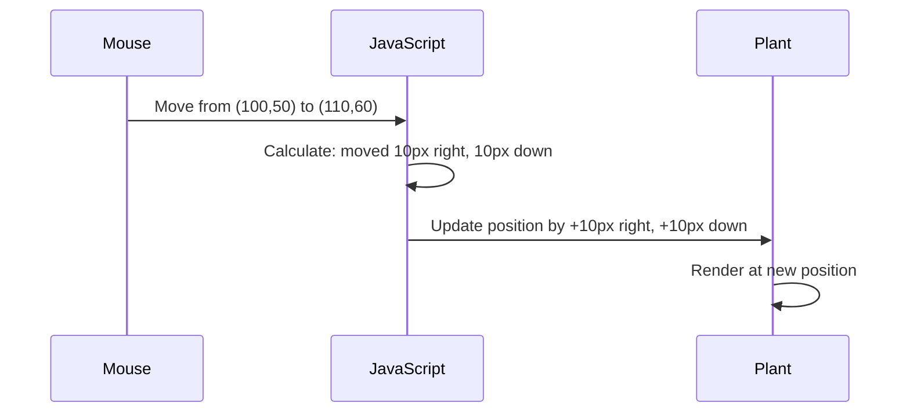

<!--
CO_OP_TRANSLATOR_METADATA:
{
  "original_hash": "bc93f6285423033ebf5b8abeb5282888",
  "translation_date": "2025-10-22T14:52:21+00:00",
  "source_file": "3-terrarium/3-intro-to-DOM-and-closures/README.md",
  "language_code": "ur"
}
-->
# ٹیریریم پروجیکٹ حصہ 3: DOM مینپولیشن اور جاوا اسکرپٹ کلوزرز


> اسکیچ نوٹ [Tomomi Imura](https://twitter.com/girlie_mac) کی طرف سے

ویب ڈیولپمنٹ کے سب سے دلچسپ پہلوؤں میں خوش آمدید - چیزوں کو انٹرایکٹو بنانا! دستاویز آبجیکٹ ماڈل (DOM) آپ کے HTML اور جاوا اسکرپٹ کے درمیان ایک پل کی طرح ہے، اور آج ہم اس کا استعمال کریں گے تاکہ آپ کے ٹیریریم کو زندہ کر سکیں۔ جب ٹم برنرز لی نے پہلا ویب براؤزر بنایا، تو انہوں نے ایک ایسی ویب کا تصور کیا جہاں دستاویزات متحرک اور انٹرایکٹو ہو سکتی ہیں - DOM اس تصور کو ممکن بناتا ہے۔

ہم جاوا اسکرپٹ کلوزرز کو بھی دریافت کریں گے، جو شروع میں خوفناک لگ سکتے ہیں۔ کلوزرز کو "یادداشت کے جیب" بنانے کے طور پر سوچیں جہاں آپ کے فنکشنز اہم معلومات کو یاد رکھ سکتے ہیں۔ یہ بالکل ایسے ہی ہے جیسے آپ کے ٹیریریم میں ہر پودے کے پاس اپنی پوزیشن کو ٹریک کرنے کے لیے اپنا ڈیٹا ریکارڈ ہو۔ اس سبق کے اختتام تک، آپ سمجھ جائیں گے کہ یہ کتنے قدرتی اور مفید ہیں۔

یہ ہے جو ہم بنا رہے ہیں: ایک ٹیریریم جہاں صارفین پودوں کو کہیں بھی گھسیٹ کر چھوڑ سکتے ہیں۔ آپ DOM مینپولیشن تکنیک سیکھیں گے جو ڈریگ اینڈ ڈراپ فائل اپلوڈز سے لے کر انٹرایکٹو گیمز تک سب کچھ طاقتور بناتی ہیں۔ آئیے آپ کے ٹیریریم کو زندہ کریں۔

## لیکچر سے پہلے کا کوئز

[لیکچر سے پہلے کا کوئز](https://ff-quizzes.netlify.app/web/quiz/19)

## DOM کو سمجھنا: انٹرایکٹو ویب صفحات کے لیے آپ کا گیٹ وے

دستاویز آبجیکٹ ماڈل (DOM) وہ طریقہ ہے جس سے جاوا اسکرپٹ آپ کے HTML عناصر کے ساتھ بات چیت کرتا ہے۔ جب آپ کا براؤزر ایک HTML صفحہ لوڈ کرتا ہے، تو یہ میموری میں اس صفحے کی ایک منظم نمائندگی بناتا ہے - یہی DOM ہے۔ اسے ایک خاندانی درخت کے طور پر سوچیں جہاں ہر HTML عنصر ایک خاندانی رکن ہے جس تک جاوا اسکرپٹ رسائی حاصل کر سکتا ہے، اسے تبدیل کر سکتا ہے، یا دوبارہ ترتیب دے سکتا ہے۔

DOM مینپولیشن جامد صفحات کو انٹرایکٹو ویب سائٹس میں تبدیل کرتا ہے۔ جب بھی آپ دیکھتے ہیں کہ ایک بٹن ہوور پر رنگ بدلتا ہے، مواد صفحہ ریفریش کے بغیر اپ ڈیٹ ہوتا ہے، یا عناصر جنہیں آپ گھسیٹ سکتے ہیں، یہ سب DOM مینپولیشن کا کام ہے۔


> DOM اور HTML مارک اپ کی نمائندگی جو اس کا حوالہ دیتا ہے۔ [Olfa Nasraoui](https://www.researchgate.net/publication/221417012_Profile-Based_Focused_Crawler_for_Social_Media-Sharing_Websites) سے

**یہ ہے جو DOM کو طاقتور بناتا ہے:**
- **فراہم کرتا ہے** آپ کے صفحے پر کسی بھی عنصر تک رسائی کا ایک منظم طریقہ
- **قابل بناتا ہے** مواد کو صفحہ ریفریش کے بغیر اپ ڈیٹ کرنا
- **اجازت دیتا ہے** صارف کے تعاملات جیسے کلکس اور ڈریگز کا حقیقی وقت میں جواب دینا
- **بنیاد بناتا ہے** جدید انٹرایکٹو ویب ایپلیکیشنز کے لیے

## جاوا اسکرپٹ کلوزرز: منظم، طاقتور کوڈ بنانا

ایک [جاوا اسکرپٹ کلوزر](https://developer.mozilla.org/docs/Web/JavaScript/Closures) ایسا ہے جیسے کسی فنکشن کو اپنی ذاتی ورک اسپیس دینا جس میں مستقل یادداشت ہو۔ غور کریں کہ گالاپاگوس جزائر کے ڈارون کے فنچز نے اپنے مخصوص ماحول کی بنیاد پر خصوصی چونچیں کیسے تیار کیں - کلوزرز اسی طرح کام کرتے ہیں، مخصوص فنکشنز بناتے ہیں جو اپنے مخصوص سیاق و سباق کو "یاد" رکھتے ہیں یہاں تک کہ ان کے پیرنٹ فنکشن ختم ہو چکے ہوں۔

ہمارے ٹیریریم میں، کلوزرز ہر پودے کو اپنی پوزیشن کو آزادانہ طور پر یاد رکھنے میں مدد دیتے ہیں۔ یہ پیٹرن پیشہ ورانہ جاوا اسکرپٹ ڈیولپمنٹ میں ہر جگہ ظاہر ہوتا ہے، جس سے یہ سمجھنے کے لیے ایک قیمتی تصور بن جاتا ہے۔

> 💡 **کلوزرز کو سمجھنا**: جاوا اسکرپٹ میں کلوزرز ایک اہم موضوع ہیں، اور بہت سے ڈیولپرز انہیں مکمل طور پر سمجھنے سے پہلے کئی سالوں تک استعمال کرتے ہیں۔ آج، ہم عملی اطلاق پر توجہ مرکوز کر رہے ہیں - آپ دیکھیں گے کہ کلوزرز قدرتی طور پر ابھرتے ہیں جب ہم اپنی انٹرایکٹو خصوصیات بناتے ہیں۔ سمجھ بوجھ اس وقت پیدا ہوگی جب آپ دیکھیں گے کہ وہ حقیقی مسائل کو کیسے حل کرتے ہیں۔


> DOM اور HTML مارک اپ کی نمائندگی جو اس کا حوالہ دیتا ہے۔ [Olfa Nasraoui](https://www.researchgate.net/publication/221417012_Profile-Based_Focused_Crawler_for_Social_Media-Sharing_Websites) سے

اس سبق میں، ہم اپنے انٹرایکٹو ٹیریریم پروجیکٹ کو مکمل کریں گے، جاوا اسکرپٹ بنا کر جو صارف کو صفحے پر پودوں کو جوڑنے کی اجازت دے گا۔

## شروع کرنے سے پہلے: کامیابی کے لیے سیٹ اپ کرنا

آپ کو اپنے HTML اور CSS فائلز کی ضرورت ہوگی جو پچھلے ٹیریریم اسباق سے ہیں - ہم اس جامد ڈیزائن کو انٹرایکٹو بنانے والے ہیں۔ اگر آپ پہلی بار شامل ہو رہے ہیں، تو ان اسباق کو مکمل کرنا اہم سیاق و سباق فراہم کرے گا۔

یہ ہے جو ہم بنائیں گے:
- **ہموار ڈریگ اینڈ ڈراپ** تمام ٹیریریم پودوں کے لیے
- **کوآرڈینیٹ ٹریکنگ** تاکہ پودے اپنی پوزیشنز یاد رکھ سکیں
- **ایک مکمل انٹرایکٹو انٹرفیس** وینیلا جاوا اسکرپٹ استعمال کرتے ہوئے
- **صاف، منظم کوڈ** کلوزر پیٹرنز استعمال کرتے ہوئے

## اپنے جاوا اسکرپٹ فائل کا سیٹ اپ کرنا

آئیے جاوا اسکرپٹ فائل بنائیں جو آپ کے ٹیریریم کو انٹرایکٹو بنائے گی۔

**مرحلہ 1: اپنی اسکرپٹ فائل بنائیں**

اپنے ٹیریریم فولڈر میں، ایک نئی فائل بنائیں جس کا نام `script.js` ہو۔

**مرحلہ 2: جاوا اسکرپٹ کو اپنے HTML سے جوڑیں**

اپنے `index.html` فائل کے `<head>` سیکشن میں یہ اسکرپٹ ٹیگ شامل کریں:

```html
<script src="./script.js" defer></script>
```

**کیوں `defer` ایٹریبیوٹ اہم ہے:**
- **یقینی بناتا ہے** کہ آپ کا جاوا اسکرپٹ اس وقت تک انتظار کرے جب تک کہ تمام HTML لوڈ نہ ہو جائے
- **روکتا ہے** وہ غلطیاں جہاں جاوا اسکرپٹ ایسے عناصر کو تلاش کرنے کی کوشش کرتا ہے جو ابھی تیار نہیں ہیں
- **یقین دہانی کرتا ہے** کہ آپ کے تمام پودے عناصر تعامل کے لیے دستیاب ہیں
- **بہتر کارکردگی فراہم کرتا ہے** صفحے کے نیچے اسکرپٹس رکھنے کے مقابلے میں

> ⚠️ **اہم نوٹ**: `defer` ایٹریبیوٹ عام وقت کے مسائل کو روکتا ہے۔ اس کے بغیر، جاوا اسکرپٹ HTML عناصر تک رسائی حاصل کرنے کی کوشش کر سکتا ہے اس سے پہلے کہ وہ لوڈ ہوں، جس سے غلطیاں پیدا ہو سکتی ہیں۔

---

## اپنے HTML عناصر کو جاوا اسکرپٹ سے جوڑنا

اس سے پہلے کہ ہم عناصر کو ڈریگ ایبل بنا سکیں، جاوا اسکرپٹ کو انہیں DOM میں تلاش کرنے کی ضرورت ہے۔ اسے ایک لائبریری کی کیٹلاگنگ سسٹم کی طرح سوچیں - ایک بار جب آپ کے پاس کیٹلاگ نمبر ہو، تو آپ بالکل وہی کتاب تلاش کر سکتے ہیں جس کی آپ کو ضرورت ہے اور اس کے تمام مواد تک رسائی حاصل کر سکتے ہیں۔

ہم `document.getElementById()` طریقہ استعمال کریں گے تاکہ ان کنکشنز کو بنایا جا سکے۔ یہ بالکل ایک درست فائلنگ سسٹم رکھنے کی طرح ہے - آپ ایک ID فراہم کرتے ہیں، اور یہ بالکل وہی عنصر تلاش کرتا ہے جس کی آپ کو اپنے HTML میں ضرورت ہے۔

### تمام پودوں کے لیے ڈریگ فنکشنلٹی کو فعال کرنا

اپنی `script.js` فائل میں یہ کوڈ شامل کریں:

```javascript
// Enable drag functionality for all 14 plants
dragElement(document.getElementById('plant1'));
dragElement(document.getElementById('plant2'));
dragElement(document.getElementById('plant3'));
dragElement(document.getElementById('plant4'));
dragElement(document.getElementById('plant5'));
dragElement(document.getElementById('plant6'));
dragElement(document.getElementById('plant7'));
dragElement(document.getElementById('plant8'));
dragElement(document.getElementById('plant9'));
dragElement(document.getElementById('plant10'));
dragElement(document.getElementById('plant11'));
dragElement(document.getElementById('plant12'));
dragElement(document.getElementById('plant13'));
dragElement(document.getElementById('plant14'));
```

**یہ کوڈ کیا حاصل کرتا ہے:**
- **ہر پودے کے عنصر کو DOM میں تلاش کرتا ہے** اس کے منفرد ID کا استعمال کرتے ہوئے
- **جاوا اسکرپٹ ریفرنس حاصل کرتا ہے** ہر HTML عنصر کا
- **ہر عنصر کو پاس کرتا ہے** ایک `dragElement` فنکشن میں (جسے ہم اگلے مرحلے میں بنائیں گے)
- **ہر پودے کو تیار کرتا ہے** ڈریگ اینڈ ڈراپ تعامل کے لیے
- **آپ کے HTML ڈھانچے کو جاوا اسکرپٹ فنکشنلٹی سے جوڑتا ہے

> 🎯 **کیوں IDs استعمال کریں بجائے کلاسز کے؟** IDs مخصوص عناصر کے لیے منفرد شناخت فراہم کرتے ہیں، جبکہ CSS کلاسز گروپ کے عناصر کو اسٹائل کرنے کے لیے بنائی گئی ہیں۔ جب جاوا اسکرپٹ کو انفرادی عناصر کو مینپولیٹ کرنے کی ضرورت ہوتی ہے، تو IDs وہ درستگی اور کارکردگی فراہم کرتے ہیں جس کی ہمیں ضرورت ہے۔

> 💡 **پرو ٹپ**: نوٹ کریں کہ ہم ہر پودے کے لیے انفرادی طور پر `dragElement()` کو کال کر رہے ہیں۔ یہ طریقہ یقینی بناتا ہے کہ ہر پودے کو اپنی آزادانہ ڈریگنگ بیہیویر ملے، جو ہموار صارف تعامل کے لیے ضروری ہے۔

---

## ڈریگ عنصر کلوزر بنانا

اب ہم اپنی ڈریگنگ فنکشنلٹی کے دل کو بنائیں گے: ایک کلوزر جو ہر پودے کے لیے ڈریگنگ بیہیویر کو منظم کرتا ہے۔ یہ کلوزر متعدد اندرونی فنکشنز پر مشتمل ہوگا جو ماؤس کی حرکت کو ٹریک کرنے اور عنصر کی پوزیشنز کو اپ ڈیٹ کرنے کے لیے مل کر کام کریں گے۔

کلوزرز اس کام کے لیے بہترین ہیں کیونکہ وہ ہمیں "پرائیویٹ" ویریبلز بنانے کی اجازت دیتے ہیں جو فنکشن کالز کے درمیان برقرار رہتے ہیں، ہر پودے کے لیے اس کا اپنا آزادانہ کوآرڈینیٹ ٹریکنگ سسٹم فراہم کرتے ہیں۔

### کلوزرز کو ایک سادہ مثال کے ساتھ سمجھنا

آئیے کلوزرز کو ایک سادہ مثال کے ساتھ سمجھاتے ہیں جو اس تصور کو واضح کرتی ہے:

```javascript
function createCounter() {
    let count = 0; // This is like a private variable
    
    function increment() {
        count++; // The inner function remembers the outer variable
        return count;
    }
    
    return increment; // We're giving back the inner function
}

const myCounter = createCounter();
console.log(myCounter()); // 1
console.log(myCounter()); // 2
```

**یہاں کیا ہو رہا ہے اس کلوزر پیٹرن میں:**
- **ایک پرائیویٹ `count` ویریبل بناتا ہے** جو صرف اس کلوزر کے اندر موجود ہے
- **اندرونی فنکشن** اس بیرونی ویریبل تک رسائی حاصل کر سکتا ہے اور اسے تبدیل کر سکتا ہے (کلوزر میکانزم)
- **جب ہم واپس کرتے ہیں** اندرونی فنکشن، یہ اس پرائیویٹ ڈیٹا کے ساتھ اپنا کنکشن برقرار رکھتا ہے
- **یہاں تک کہ جب** `createCounter()` اپنی عملدرآمد ختم کر لیتا ہے، `count` اپنی ویلیو کو برقرار رکھتا ہے

### کیوں کلوزرز ڈریگ فنکشنلٹی کے لیے بہترین ہیں

ہمارے ٹیریریم کے لیے، ہر پودے کو اپنی موجودہ پوزیشن کوآرڈینیٹس یاد رکھنے کی ضرورت ہے۔ کلوزرز بہترین حل فراہم کرتے ہیں:

**ہمارے پروجیکٹ کے لیے کلیدی فوائد:**
- **ہر پودے کے لیے پرائیویٹ پوزیشن ویریبلز برقرار رکھتا ہے**
- **ڈریگ ایونٹس کے درمیان کوآرڈینیٹ ڈیٹا محفوظ رکھتا ہے**
- **مختلف ڈریگ ایبل عناصر کے درمیان ویریبل تنازعات کو روکتا ہے**
- **صاف، منظم کوڈ ڈھانچہ بناتا ہے**

> 🎯 **سیکھنے کا مقصد**: آپ کو ابھی کلوزرز کے ہر پہلو میں مہارت حاصل کرنے کی ضرورت نہیں ہے۔ اس بات پر توجہ مرکوز کریں کہ وہ ہمارے کوڈ کو منظم کرنے اور ڈریگنگ فنکشنلٹی کے لیے اسٹیٹ کو برقرار رکھنے میں کیسے مدد کرتے ہیں۔

### ڈریگ عنصر فنکشن بنانا

اب آئیے وہ مرکزی فنکشن بنائیں جو تمام ڈریگنگ منطق کو سنبھالے گا۔ اپنے پودے عنصر کے اعلانات کے نیچے یہ فنکشن شامل کریں:

```javascript
function dragElement(terrariumElement) {
    // Initialize position tracking variables
    let pos1 = 0,  // Previous mouse X position
        pos2 = 0,  // Previous mouse Y position  
        pos3 = 0,  // Current mouse X position
        pos4 = 0;  // Current mouse Y position
    
    // Set up the initial drag event listener
    terrariumElement.onpointerdown = pointerDrag;
}
```

**پوزیشن ٹریکنگ سسٹم کو سمجھنا:**
- **`pos1` اور `pos2`**: پرانے اور نئے ماؤس پوزیشنز کے درمیان فرق کو اسٹور کرتے ہیں
- **`pos3` اور `pos4`**: موجودہ ماؤس کوآرڈینیٹس کو ٹریک کرتے ہیں
- **`terrariumElement`**: مخصوص پودے عنصر جسے ہم ڈریگ ایبل بنا رہے ہیں
- **`onpointerdown`**: وہ ایونٹ جو اس وقت ٹرگر ہوتا ہے جب صارف ڈریگنگ شروع کرتا ہے

**یہاں کلوزر پیٹرن کیسے کام کرتا ہے:**
- **ہر پودے عنصر کے لیے پرائیویٹ پوزیشن ویریبلز بناتا ہے**
- **ڈریگنگ لائف سائیکل کے دوران ان ویریبلز کو برقرار رکھتا ہے**
- **یقینی بناتا ہے** کہ ہر پودے اپنی کوآرڈینیٹس کو آزادانہ طور پر ٹریک کرے
- **ایک صاف انٹرفیس فراہم کرتا ہے** `dragElement` فنکشن کے ذریعے

### کیوں پوائنٹر ایونٹس استعمال کریں؟

آپ سوچ سکتے ہیں کہ ہم `onpointerdown` کیوں استعمال کرتے ہیں بجائے زیادہ مانوس `onclick` کے۔ یہاں وجہ ہے:

| ایونٹ کی قسم | بہترین استعمال | مسئلہ |
|------------|----------|-------------|
| `onclick` | سادہ بٹن کلکس | ڈریگنگ کو ہینڈل نہیں کر سکتا (صرف کلکس اور ریلیزز) |
| `onpointerdown` | ماؤس اور ٹچ دونوں کے لیے | نیا ہے، لیکن آج کل اچھی طرح سے سپورٹ کیا جاتا ہے |
| `onmousedown` | صرف ڈیسک ٹاپ ماؤس کے لیے | موبائل صارفین کو نظر انداز کرتا ہے |

**کیوں پوائنٹر ایونٹس ہمارے بنائے ہوئے کام کے لیے بہترین ہیں:**
- **بہترین کام کرتا ہے** چاہے کوئی ماؤس، انگلی، یا اسٹائلس استعمال کر رہا ہو
- **ایک جیسا محسوس ہوتا ہے** لیپ ٹاپ، ٹیبلٹ، یا فون پر
- **اصل ڈریگنگ موشن کو ہینڈل کرتا ہے** (صرف کلک اینڈ ڈن نہیں)
- **ایک ہموار تجربہ بناتا ہے** جو صارفین جدید ویب ایپس سے توقع کرتے ہیں

> 💡 **مستقبل کی تیاری**: پوائنٹر ایونٹس صارف تعاملات کو ہینڈل کرنے کا جدید طریقہ ہیں۔ ماؤس اور ٹچ کے لیے الگ کوڈ لکھنے کے بجائے، آپ دونوں کو مفت میں حاصل کرتے ہیں۔ کافی زبردست، ہے نا؟

---

## پوائنٹر ڈریگ فنکشن: ڈریگ کے آغاز کو کیپچر کرنا

جب کوئی صارف کسی پودے پر دباؤ ڈالتا ہے (چاہے ماؤس کلک یا انگلی کے ٹچ کے ساتھ)، `pointerDrag` فنکشن حرکت میں آتا ہے۔ یہ فنکشن ابتدائی کوآرڈینیٹس کو کیپچر کرتا ہے اور ڈریگنگ سسٹم کو سیٹ اپ کرتا ہے۔

اپنے `dragElement` کلوزر کے اندر یہ فنکشن شامل کریں، بالکل اس لائن کے بعد `terrariumElement.onpointerdown = pointerDrag;`:

```javascript
function pointerDrag(e) {
    // Prevent default browser behavior (like text selection)
    e.preventDefault();
    
    // Capture the initial mouse/touch position
    pos3 = e.clientX;  // X coordinate where drag started
    pos4 = e.clientY;  // Y coordinate where drag started
    
    // Set up event listeners for the dragging process
    document.onpointermove = elementDrag;
    document.onpointerup = stopElementDrag;
}
```

**مرحلہ وار، یہاں کیا ہو رہا ہے:**
- **روکتا ہے** ڈیفالٹ براؤزر بیہیویرز جو ڈریگنگ میں مداخلت کر سکتے ہیں
- **ریکارڈ کرتا ہے** بالکل وہ کوآرڈینیٹس جہاں صارف نے ڈریگ اشارہ شروع کیا
- **ایونٹ لسٹنرز قائم کرتا ہے** جاری ڈریگ موومنٹ کے لیے
- **سسٹم کو تیار کرتا ہے** ماؤس/انگلی کی حرکت کو پورے دستاویز میں ٹریک کرنے کے لیے

### ایونٹ پریوینشن کو سمجھنا

لائن `e.preventDefault()` ہموار ڈریگنگ کے لیے بہت اہم ہے:

**پریوینشن کے بغیر، براؤزرز ممکنہ طور پر:**
- **ٹیکسٹ کو منتخب کریں** جب صفحے پر ڈریگ کرتے ہیں
- **کنٹیکسٹ مینو کو ٹرگر کریں** رائٹ کلک ڈریگ پر
- **ہمارے کسٹم ڈریگنگ بیہیویر میں مداخلت کریں**
- **ڈریگ آپریشن کے دوران بصری آرٹیفیکٹس بنائیں**

> 🔍 **تجربہ کریں**: اس سبق کو مکمل کرنے کے بعد، `e.preventDefault()` کو ہٹا کر دیکھیں کہ یہ ڈریگنگ کے تجربے کو کیسے متاثر کرتا ہے۔ آپ جلدی سمجھ جائیں گے کہ یہ لائن کیوں ضروری ہے!

### کوآرڈینیٹ ٹریکنگ سسٹم

پراپرٹیز `e.clientX` اور `e.clientY` ہمیں بالکل درست ماؤس/ٹچ کوآ
- **`pos3` اور `pos4`**: اگلے حساب کے لیے موجودہ ماؤس کی پوزیشن کو محفوظ کریں  
- **`offsetTop` اور `offsetLeft`**: صفحے پر عنصر کی موجودہ پوزیشن حاصل کریں  
- **تفریق کی منطق**: عنصر کو اتنا ہی حرکت دیں جتنا ماؤس حرکت کرتا ہے  

**یہاں حرکت کے حساب کتاب کی تفصیل ہے:**  
1. **پیمائش کریں** پرانے اور نئے ماؤس کی پوزیشن کے درمیان فرق  
2. **حساب لگائیں** کہ ماؤس کی حرکت کی بنیاد پر عنصر کو کتنا حرکت دینا ہے  
3. **اپ ڈیٹ کریں** عنصر کی CSS پوزیشن کی خصوصیات کو حقیقی وقت میں  
4. **محفوظ کریں** نئی پوزیشن کو اگلی حرکت کے حساب کے لیے بنیاد کے طور پر  

### ریاضی کی بصری نمائندگی  


  
### stopElementDrag فنکشن: صفائی کرنا  

`elementDrag` کے بند کرنے والے کرلی بریکٹ کے بعد صفائی کا فنکشن شامل کریں:  

```javascript
function stopElementDrag() {
    // Remove the document-level event listeners
    document.onpointerup = null;
    document.onpointermove = null;
}
```
  
**صفائی کیوں ضروری ہے:**  
- **روکتا ہے** میموری لیک کو جو باقی رہنے والے ایونٹ لسٹنرز کی وجہ سے ہو سکتے ہیں  
- **روکتا ہے** ڈریگنگ کا عمل جب صارف پلانٹ کو چھوڑتا ہے  
- **اجازت دیتا ہے** دوسرے عناصر کو آزادانہ طور پر ڈریگ کرنے کی  
- **سسٹم کو ری سیٹ کرتا ہے** اگلے ڈریگ آپریشن کے لیے  

**صفائی کے بغیر کیا ہوتا ہے:**  
- ایونٹ لسٹنرز ڈریگنگ کے رکنے کے بعد بھی چلتے رہتے ہیں  
- کارکردگی خراب ہو جاتی ہے کیونکہ غیر استعمال شدہ لسٹنرز جمع ہو جاتے ہیں  
- دوسرے عناصر کے ساتھ تعامل کرتے وقت غیر متوقع رویہ  
- براؤزر کے وسائل غیر ضروری ایونٹ ہینڈلنگ پر ضائع ہوتے ہیں  

### CSS پوزیشن کی خصوصیات کو سمجھنا  

ہمارا ڈریگنگ سسٹم دو اہم CSS خصوصیات کو تبدیل کرتا ہے:  

| خصوصیت | یہ کیا کنٹرول کرتی ہے | ہم اسے کیسے استعمال کرتے ہیں |  
|----------|------------------|---------------|  
| `top` | اوپر کے کنارے سے فاصلہ | ڈریگ کے دوران عمودی پوزیشننگ |  
| `left` | بائیں کنارے سے فاصلہ | ڈریگ کے دوران افقی پوزیشننگ |  

**آفسیٹ خصوصیات کے بارے میں اہم معلومات:**  
- **`offsetTop`**: پوزیشنڈ پیرنٹ عنصر سے موجودہ فاصلہ اوپر کی طرف  
- **`offsetLeft`**: پوزیشنڈ پیرنٹ عنصر سے موجودہ فاصلہ بائیں طرف  
- **پوزیشننگ کا سیاق و سباق**: یہ اقدار قریب ترین پوزیشنڈ اجداد کے نسبت ہوتی ہیں  
- **حقیقی وقت کی اپ ڈیٹس**: جب ہم CSS خصوصیات کو تبدیل کرتے ہیں تو فوری طور پر تبدیلیاں ہوتی ہیں  

> 🎯 **ڈیزائن فلسفہ**: یہ ڈریگ سسٹم جان بوجھ کر لچکدار بنایا گیا ہے – کوئی "ڈراپ زون" یا پابندیاں نہیں ہیں۔ صارفین پلانٹس کو کہیں بھی رکھ سکتے ہیں، انہیں اپنے ٹیریریم ڈیزائن پر مکمل تخلیقی کنٹرول دیتے ہیں۔  

## سب کچھ ایک ساتھ لانا: آپ کا مکمل ڈریگ سسٹم  

مبارک ہو! آپ نے وینیلا جاوا اسکرپٹ کا استعمال کرتے ہوئے ایک نفیس ڈریگ اینڈ ڈراپ سسٹم بنایا ہے۔ آپ کا مکمل `dragElement` فنکشن اب ایک طاقتور کلوزر پر مشتمل ہے جو مندرجہ ذیل کو منظم کرتا ہے:  

**آپ کا کلوزر کیا حاصل کرتا ہے:**  
- **نجی پوزیشن متغیرات کو برقرار رکھتا ہے** ہر پلانٹ کے لیے آزادانہ طور پر  
- **مکمل ڈریگ لائف سائیکل کو ہینڈل کرتا ہے** شروع سے آخر تک  
- **پورے اسکرین پر ہموار، جوابدہ حرکت فراہم کرتا ہے**  
- **وسائل کو صحیح طریقے سے صاف کرتا ہے** میموری لیک کو روکنے کے لیے  
- **ٹریریم ڈیزائن کے لیے ایک بدیہی، تخلیقی انٹرفیس بناتا ہے**  

### اپنے انٹرایکٹو ٹیریریم کی جانچ کرنا  

اب اپنے انٹرایکٹو ٹیریریم کی جانچ کریں! اپنے `index.html` فائل کو ویب براؤزر میں کھولیں اور فعالیت کو آزمائیں:  

1. **کسی بھی پلانٹ پر کلک کریں اور پکڑیں** ڈریگنگ شروع کرنے کے لیے  
2. **اپنا ماؤس یا انگلی حرکت دیں** اور دیکھیں کہ پلانٹ ہمواری سے پیروی کرتا ہے  
3. **چھوڑیں** پلانٹ کو اس کی نئی پوزیشن میں چھوڑنے کے لیے  
4. **مختلف انتظامات کے ساتھ تجربہ کریں** انٹرفیس کو دریافت کرنے کے لیے  

🥇 **کامیابی**: آپ نے ایک مکمل انٹرایکٹو ویب ایپلیکیشن بنائی ہے جو بنیادی تصورات کا استعمال کرتی ہے جو پیشہ ورانہ ڈویلپرز روزانہ استعمال کرتے ہیں۔ یہ ڈریگ اینڈ ڈراپ فعالیت وہی اصول استعمال کرتی ہے جو فائل اپلوڈز، کانبان بورڈز، اور بہت سے دوسرے انٹرایکٹو انٹرفیس کے پیچھے ہیں۔  

  

---

## GitHub Copilot Agent Challenge 🚀  

ایجنٹ موڈ کا استعمال کرتے ہوئے درج ذیل چیلنج مکمل کریں:  

**تفصیل:** ٹیریریم پروجیکٹ میں ایک ری سیٹ فعالیت شامل کریں جو تمام پلانٹس کو ان کی اصل پوزیشنز پر ہموار اینیمیشنز کے ساتھ واپس لے جائے۔  

**پرومپٹ:** ایک ری سیٹ بٹن بنائیں جو کلک کرنے پر تمام پلانٹس کو ان کی اصل سائیڈبار پوزیشنز پر CSS ٹرانزیشنز کا استعمال کرتے ہوئے 1 سیکنڈ کے اندر ہمواری سے واپس لے جائے۔ فنکشن کو صفحہ لوڈ ہونے پر اصل پوزیشنز کو محفوظ کرنا چاہیے اور ری سیٹ بٹن دبانے پر پلانٹس کو ان پوزیشنز پر منتقل کرنا چاہیے۔  

مزید جانیں [ایجنٹ موڈ](https://code.visualstudio.com/blogs/2025/02/24/introducing-copilot-agent-mode) کے بارے میں یہاں۔  

## 🚀 اضافی چیلنج: اپنی مہارت کو بڑھائیں  

اپنے ٹیریریم کو اگلے درجے پر لے جانے کے لیے تیار ہیں؟ ان اضافوں کو نافذ کرنے کی کوشش کریں:  

**تخلیقی توسیعات:**  
- **ڈبل کلک کریں** کسی پلانٹ پر اسے سامنے لانے کے لیے (z-index میں تبدیلی)  
- **بصری تاثرات شامل کریں** جیسے پلانٹس پر ہور کرنے پر ہلکی روشنی  
- **حدود نافذ کریں** تاکہ پلانٹس کو ٹیریریم کے باہر ڈریگ کرنے سے روکا جا سکے  
- **ایک سیو فنکشن بنائیں** جو پلانٹ کی پوزیشنز کو لوکل اسٹوریج میں یاد رکھے  
- **آواز کے اثرات شامل کریں** پلانٹس کو اٹھانے اور رکھنے کے لیے  

> 💡 **سیکھنے کا موقع**: ان میں سے ہر چیلنج آپ کو DOM مینپولیشن، ایونٹ ہینڈلنگ، اور صارف کے تجربے کے ڈیزائن کے نئے پہلو سکھائے گا۔  

## لیکچر کے بعد کا کوئز  

[لیکچر کے بعد کا کوئز](https://ff-quizzes.netlify.app/web/quiz/20)  

## جائزہ اور خود مطالعہ: اپنی سمجھ کو گہرا کرنا  

آپ نے DOM مینپولیشن اور کلوزرز کے بنیادی اصولوں میں مہارت حاصل کر لی ہے، لیکن ہمیشہ مزید دریافت کرنے کے لیے موجود ہے! یہاں کچھ راستے ہیں اپنی معلومات اور مہارت کو بڑھانے کے لیے۔  

### متبادل ڈریگ اینڈ ڈراپ طریقے  

ہم نے زیادہ سے زیادہ لچک کے لیے پوائنٹر ایونٹس کا استعمال کیا، لیکن ویب ڈویلپمنٹ متعدد طریقے پیش کرتا ہے:  

| طریقہ | بہترین استعمال | سیکھنے کی قدر |  
|----------|----------|----------------|  
| [HTML Drag and Drop API](https://developer.mozilla.org/docs/Web/API/HTML_Drag_and_Drop_API) | فائل اپلوڈز، رسمی ڈریگ زونز | براؤزر کی مقامی صلاحیتوں کو سمجھنا |  
| [Touch Events](https://developer.mozilla.org/docs/Web/API/Touch_events) | موبائل مخصوص تعاملات | موبائل فرسٹ ڈویلپمنٹ پیٹرنز |  
| CSS `transform` خصوصیات | ہموار اینیمیشنز | کارکردگی کی اصلاح کی تکنیکیں |  

### ایڈوانسڈ DOM مینپولیشن موضوعات  

**آپ کے سیکھنے کے سفر میں اگلے مراحل:**  
- **ایونٹ ڈیلیگیشن**: متعدد عناصر کے لیے ایونٹس کو مؤثر طریقے سے ہینڈل کرنا  
- **انٹرسیکشن آبزرور**: جب عناصر ویوپورٹ میں داخل/نکلتے ہیں تو پتہ لگانا  
- **میوٹیشن آبزرور**: DOM ساخت میں تبدیلیوں کو دیکھنا  
- **ویب کمپوننٹس**: دوبارہ استعمال کے قابل، انکیپسولیٹڈ UI عناصر بنانا  
- **ورچوئل DOM تصورات**: یہ سمجھنا کہ فریم ورک کیسے DOM اپ ڈیٹس کو بہتر بناتے ہیں  

### مسلسل سیکھنے کے لیے ضروری وسائل  

**تکنیکی دستاویزات:**  
- [MDN پوائنٹر ایونٹس گائیڈ](https://developer.mozilla.org/docs/Web/API/Pointer_events) - جامع پوائنٹر ایونٹ حوالہ  
- [W3C پوائنٹر ایونٹس وضاحت](https://www.w3.org/TR/pointerevents1/) - آفیشل معیارات کی دستاویزات  
- [جاوا اسکرپٹ کلوزرز ڈیپ ڈائیو](https://developer.mozilla.org/docs/Web/JavaScript/Closures) - ایڈوانسڈ کلوزر پیٹرنز  

**براؤزر مطابقت:**  
- [CanIUse.com](https://caniuse.com/) - مختلف براؤزرز میں فیچر سپورٹ چیک کریں  
- [MDN براؤزر مطابقت ڈیٹا](https://github.com/mdn/browser-compat-data) - تفصیلی مطابقت کی معلومات  

**عملی مواقع:**  
- **ایک پہیلی گیم بنائیں** اسی ڈریگ میکینکس کا استعمال کرتے ہوئے  
- **ایک کانبان بورڈ بنائیں** ڈریگ اینڈ ڈراپ ٹاسک مینجمنٹ کے ساتھ  
- **ایک امیج گیلری ڈیزائن کریں** ڈریگ ایبل فوٹو انتظامات کے ساتھ  
- **موبائل انٹرفیس کے لیے ٹچ اشاروں کے ساتھ تجربہ کریں**  

> 🎯 **سیکھنے کی حکمت عملی**: ان تصورات کو مضبوط کرنے کا بہترین طریقہ عملی ہے۔ ڈریگ ایبل انٹرفیس کی مختلف اقسام بنانے کی کوشش کریں – ہر پروجیکٹ آپ کو صارف کے تعامل اور DOM مینپولیشن کے بارے میں کچھ نیا سکھائے گا۔  

## اسائنمنٹ  

[DOM کے ساتھ تھوڑا اور کام کریں](assignment.md)  

---

**اعلانِ لاتعلقی**:  
یہ دستاویز AI ترجمہ سروس [Co-op Translator](https://github.com/Azure/co-op-translator) کا استعمال کرتے ہوئے ترجمہ کی گئی ہے۔ ہم درستگی کی بھرپور کوشش کرتے ہیں، لیکن براہ کرم آگاہ رہیں کہ خودکار ترجمے میں غلطیاں یا غیر درستیاں ہو سکتی ہیں۔ اصل دستاویز کو اس کی اصل زبان میں مستند ذریعہ سمجھا جانا چاہیے۔ اہم معلومات کے لیے، پیشہ ور انسانی ترجمہ کی سفارش کی جاتی ہے۔ اس ترجمے کے استعمال سے پیدا ہونے والی کسی بھی غلط فہمی یا غلط تشریح کے لیے ہم ذمہ دار نہیں ہیں۔