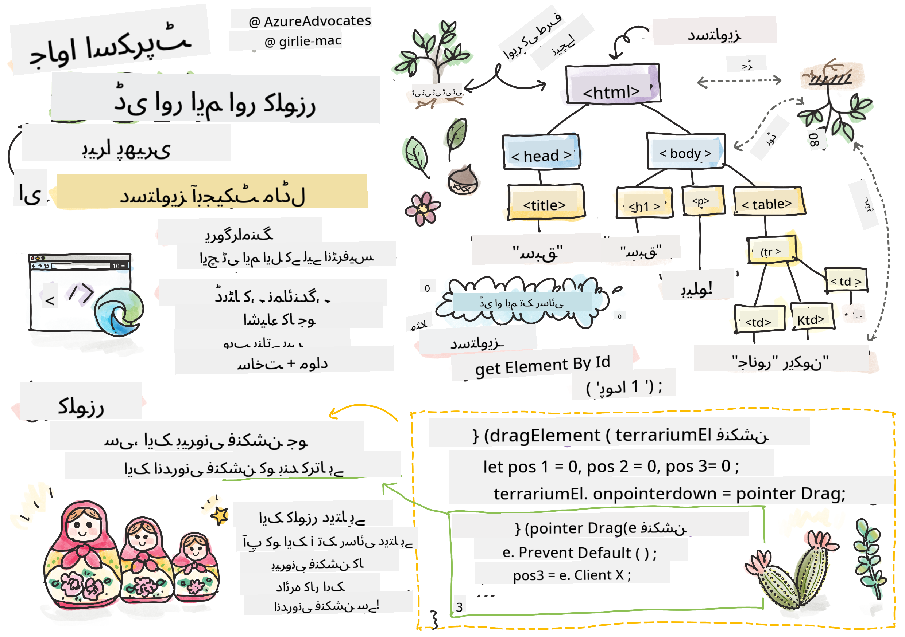
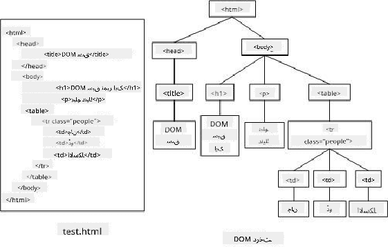

<!--
CO_OP_TRANSLATOR_METADATA:
{
  "original_hash": "c1e84148719fdfcf5039ab4401dca7a3",
  "translation_date": "2025-10-20T20:52:13+00:00",
  "source_file": "3-terrarium/3-intro-to-DOM-and-closures/README.md",
  "language_code": "ur"
}
-->
# ٹیریریم پروجیکٹ حصہ 3: DOM کی تبدیلی اور ایک کلوزر


> اسکیچ نوٹ [Tomomi Imura](https://twitter.com/girlie_mac) کی طرف سے

## لیکچر سے پہلے کا کوئز

[لیکچر سے پہلے کا کوئز](https://ff-quizzes.netlify.app/web/quiz/19)

### تعارف

DOM، یا "ڈاکیومنٹ آبجیکٹ ماڈل"، کو تبدیل کرنا ویب ڈیولپمنٹ کا ایک اہم پہلو ہے۔ [MDN](https://developer.mozilla.org/docs/Web/API/Document_Object_Model/Introduction) کے مطابق، "ڈاکیومنٹ آبجیکٹ ماڈل (DOM) ویب پر موجود ڈاکیومنٹ کی ساخت اور مواد پر مشتمل اشیاء کی ڈیٹا نمائندگی ہے۔" ویب پر DOM کی تبدیلی کے چیلنجز اکثر جاوا اسکرپٹ فریم ورک استعمال کرنے کی وجہ بنتے ہیں بجائے کہ وینیلا جاوا اسکرپٹ کے ذریعے DOM کو منظم کیا جائے، لیکن ہم خود ہی اس کو منظم کریں گے!

اس کے علاوہ، یہ سبق [جاوا اسکرپٹ کلوزر](https://developer.mozilla.org/docs/Web/JavaScript/Closures) کے تصور کو متعارف کرائے گا، جسے آپ ایک فنکشن کے طور پر سوچ سکتے ہیں جو دوسرے فنکشن کے اندر بند ہوتا ہے تاکہ اندرونی فنکشن کو بیرونی فنکشن کے اسکوپ تک رسائی حاصل ہو۔

> جاوا اسکرپٹ کلوزرز ایک وسیع اور پیچیدہ موضوع ہیں۔ یہ سبق اس بنیادی خیال کو چھوتا ہے کہ اس ٹیریریم کے کوڈ میں آپ کو ایک کلوزر ملے گا: ایک اندرونی فنکشن اور ایک بیرونی فنکشن جو اس طرح تعمیر کیا گیا ہے کہ اندرونی فنکشن کو بیرونی فنکشن کے اسکوپ تک رسائی حاصل ہو۔ اس کے کام کرنے کے بارے میں مزید معلومات کے لیے، براہ کرم [تفصیلی دستاویزات](https://developer.mozilla.org/docs/Web/JavaScript/Closures) ملاحظہ کریں۔

ہم DOM کو تبدیل کرنے کے لیے کلوزر کا استعمال کریں گے۔

DOM کو ایک درخت کے طور پر سوچیں، جو ویب صفحہ کے ڈاکیومنٹ کو تبدیل کرنے کے تمام طریقے پیش کرتا ہے۔ مختلف APIs (ایپلیکیشن پروگرام انٹرفیسز) لکھے گئے ہیں تاکہ پروگرامرز اپنی پسند کے پروگرامنگ زبان کا استعمال کرتے ہوئے DOM تک رسائی حاصل کر سکیں اور اسے ایڈٹ، تبدیل، ترتیب دیں، اور دیگر طریقوں سے منظم کر سکیں۔



> DOM اور HTML مارک اپ کی نمائندگی جو اس کا حوالہ دیتا ہے۔ [Olfa Nasraoui](https://www.researchgate.net/publication/221417012_Profile-Based_Focused_Crawler_for_Social_Media-Sharing_Websites) سے

اس سبق میں، ہم اپنے انٹرایکٹو ٹیریریم پروجیکٹ کو مکمل کریں گے اور جاوا اسکرپٹ بنائیں گے جو صارف کو صفحہ پر موجود پودوں کو تبدیل کرنے کی اجازت دے گا۔

### پیشگی شرط

آپ کے پاس اپنے ٹیریریم کے لیے HTML اور CSS تیار ہونا چاہیے۔ اس سبق کے اختتام تک آپ پودوں کو ٹیریریم میں منتقل کرنے اور باہر نکالنے کے قابل ہوں گے۔

### کام

اپنے ٹیریریم فولڈر میں ایک نیا فائل بنائیں جس کا نام `script.js` ہو۔ اس فائل کو `<head>` سیکشن میں امپورٹ کریں:

```html
	<script src="./script.js" defer></script>
```

> نوٹ: جب HTML فائل میں بیرونی جاوا اسکرپٹ فائل امپورٹ کریں تو `defer` استعمال کریں تاکہ جاوا اسکرپٹ HTML فائل کے مکمل لوڈ ہونے کے بعد ہی عمل کرے۔ آپ `async` ایٹریبیوٹ بھی استعمال کر سکتے ہیں، جو اسکرپٹ کو HTML فائل کے پارسنگ کے دوران عمل کرنے کی اجازت دیتا ہے، لیکن ہمارے کیس میں، یہ ضروری ہے کہ HTML عناصر مکمل طور پر دستیاب ہوں تاکہ ڈریگ اسکرپٹ کو عمل کرنے سے پہلے ڈریگنگ کے لیے تیار کیا جا سکے۔
---

## DOM عناصر

سب سے پہلے آپ کو ان عناصر کے حوالہ جات بنانے کی ضرورت ہے جنہیں آپ DOM میں تبدیل کرنا چاہتے ہیں۔ ہمارے کیس میں، یہ 14 پودے ہیں جو اس وقت سائیڈ بارز میں موجود ہیں۔

### کام

```html
dragElement(document.getElementById('plant1'));
dragElement(document.getElementById('plant2'));
dragElement(document.getElementById('plant3'));
dragElement(document.getElementById('plant4'));
dragElement(document.getElementById('plant5'));
dragElement(document.getElementById('plant6'));
dragElement(document.getElementById('plant7'));
dragElement(document.getElementById('plant8'));
dragElement(document.getElementById('plant9'));
dragElement(document.getElementById('plant10'));
dragElement(document.getElementById('plant11'));
dragElement(document.getElementById('plant12'));
dragElement(document.getElementById('plant13'));
dragElement(document.getElementById('plant14'));
```

یہاں کیا ہو رہا ہے؟ آپ ڈاکیومنٹ کا حوالہ دے رہے ہیں اور اس کے DOM میں ایک خاص Id والے عنصر کو تلاش کر رہے ہیں۔ یاد رکھیں کہ HTML کے پہلے سبق میں آپ نے ہر پودے کی تصویر کو انفرادی Id دی تھی (`id="plant1"`)؟ اب آپ اس کوشش کا استعمال کریں گے۔ ہر عنصر کی شناخت کے بعد، آپ اس آئٹم کو ایک فنکشن `dragElement` میں پاس کرتے ہیں جسے آپ ابھی بنائیں گے۔ اس طرح، HTML میں موجود عنصر اب ڈریگ کے قابل ہو گیا ہے، یا جلد ہی ہو جائے گا۔

✅ ہم عناصر کو Id کے ذریعے کیوں حوالہ دیتے ہیں؟ CSS کلاس کے ذریعے کیوں نہیں؟ آپ اس سوال کا جواب دینے کے لیے CSS کے پچھلے سبق کا حوالہ دے سکتے ہیں۔

---

## کلوزر

اب آپ `dragElement` کلوزر بنانے کے لیے تیار ہیں، جو ایک بیرونی فنکشن ہے جو ایک یا زیادہ اندرونی فنکشنز کو بند کرتا ہے (ہمارے کیس میں، تین ہوں گے)۔

کلوزرز اس وقت مفید ہوتے ہیں جب ایک یا زیادہ فنکشنز کو بیرونی فنکشن کے اسکوپ تک رسائی کی ضرورت ہو۔ یہاں ایک مثال ہے:

```javascript
function displayCandy(){
	let candy = ['jellybeans'];
	function addCandy(candyType) {
		candy.push(candyType)
	}
	addCandy('gumdrops');
}
displayCandy();
console.log(candy)
```

اس مثال میں، `displayCandy` فنکشن ایک فنکشن کو گھیرتا ہے جو ایک نئے کینڈی ٹائپ کو ایک ایسے آرے میں دھکیلتا ہے جو پہلے سے ہی فنکشن میں موجود ہے۔ اگر آپ اس کوڈ کو چلائیں، تو `candy` آرے غیر متعین ہوگا، کیونکہ یہ ایک لوکل ویریبل ہے (کلوزر کے لوکل تک محدود)۔

✅ آپ `candy` آرے کو کیسے قابل رسائی بنا سکتے ہیں؟ اسے کلوزر کے باہر منتقل کرنے کی کوشش کریں۔ اس طرح، آرے گلوبل ہو جائے گا، بجائے اس کے کہ وہ صرف کلوزر کے لوکل اسکوپ تک محدود رہے۔

### کام

`script.js` میں عنصر کے اعلانات کے نیچے ایک فنکشن بنائیں:

```javascript
function dragElement(terrariumElement) {
	//set 4 positions for positioning on the screen
	let pos1 = 0,
		pos2 = 0,
		pos3 = 0,
		pos4 = 0;
	terrariumElement.onpointerdown = pointerDrag;
}
```

`dragElement` اپنے `terrariumElement` آبجیکٹ کو اسکرپٹ کے اوپر دیے گئے اعلانات سے حاصل کرتا ہے۔ پھر، آپ اس فنکشن میں پاس کیے گئے آبجیکٹ کے لیے کچھ لوکل پوزیشنز کو `0` پر سیٹ کرتے ہیں۔ یہ وہ لوکل ویریبلز ہیں جو ہر عنصر کے لیے تبدیل کیے جائیں گے جب آپ ڈریگ اور ڈراپ کی فعالیت کو کلوزر کے اندر ہر عنصر میں شامل کریں گے۔ ٹیریریم ان ڈریگ کیے گئے عناصر سے بھرا جائے گا، اس لیے ایپلیکیشن کو ان کے رکھے جانے کی جگہ کا حساب رکھنا ہوگا۔

اس کے علاوہ، `terrariumElement` جو اس فنکشن میں پاس کیا گیا ہے، ایک `pointerdown` ایونٹ کو تفویض کیا گیا ہے، جو [ویب APIs](https://developer.mozilla.org/docs/Web/API) کا حصہ ہے جو DOM مینجمنٹ میں مدد کے لیے ڈیزائن کیا گیا ہے۔ `onpointerdown` اس وقت فائر ہوتا ہے جب کوئی بٹن دبایا جاتا ہے، یا ہمارے کیس میں، ایک ڈریگ ایبل عنصر کو چھوا جاتا ہے۔ یہ ایونٹ ہینڈلر [ویب اور موبائل براؤزرز](https://caniuse.com/?search=onpointerdown) پر کام کرتا ہے، چند استثنائی صورتوں کے ساتھ۔

✅ [ایونٹ ہینڈلر `onclick`](https://developer.mozilla.org/docs/Web/API/GlobalEventHandlers/onclick) کو کراس براؤزر زیادہ سپورٹ حاصل ہے؛ آپ اسے یہاں کیوں استعمال نہیں کریں گے؟ اسکرین کے بالکل اس قسم کے انٹریکشن کے بارے میں سوچیں جو آپ یہاں بنانا چاہتے ہیں۔

---

## پوائنٹر ڈریگ فنکشن

`terrariumElement` کو ارد گرد ڈریگ کرنے کے لیے تیار ہے؛ جب `onpointerdown` ایونٹ فائر ہوتا ہے، تو فنکشن `pointerDrag` کو کال کیا جاتا ہے۔ اس لائن کے نیچے یہ فنکشن شامل کریں: `terrariumElement.onpointerdown = pointerDrag;`:

### کام 

```javascript
function pointerDrag(e) {
	e.preventDefault();
	console.log(e);
	pos3 = e.clientX;
	pos4 = e.clientY;
}
```

کئی چیزیں ہوتی ہیں۔ پہلے، آپ `e.preventDefault();` استعمال کرتے ہوئے پوائنٹر ڈاؤن پر عام طور پر ہونے والے ڈیفالٹ ایونٹس کو روک دیتے ہیں۔ اس طرح آپ انٹرفیس کے رویے پر زیادہ کنٹرول حاصل کرتے ہیں۔

> جب آپ اسکرپٹ فائل کو مکمل طور پر بنا لیں تو اس لائن پر واپس آئیں اور اسے `e.preventDefault()` کے بغیر آزمائیں - کیا ہوتا ہے؟

دوسرا، `index.html` کو براؤزر ونڈو میں کھولیں، اور انٹرفیس کا معائنہ کریں۔ جب آپ کسی پودے پر کلک کرتے ہیں، تو آپ دیکھ سکتے ہیں کہ 'e' ایونٹ کیسے کیپچر ہوتا ہے۔ ایونٹ میں گہرائی سے جائیں تاکہ دیکھ سکیں کہ ایک پوائنٹر ڈاؤن ایونٹ کے ذریعے کتنی معلومات جمع کی جاتی ہیں!

پھر، نوٹ کریں کہ لوکل ویریبلز `pos3` اور `pos4` کو e.clientX پر سیٹ کیا گیا ہے۔ آپ انسپیکشن پین میں `e` ویلیوز تلاش کر سکتے ہیں۔ یہ ویلیوز پودے کے x اور y کوآرڈینیٹس کو کیپچر کرتی ہیں جب آپ اس پر کلک کرتے ہیں یا اسے چھوتے ہیں۔ آپ کو پودوں کے رویے پر باریک بینی سے کنٹرول کی ضرورت ہوگی جب آپ انہیں کلک اور ڈریگ کرتے ہیں، اس لیے آپ ان کے کوآرڈینیٹس کا حساب رکھتے ہیں۔

✅ کیا یہ زیادہ واضح ہو رہا ہے کہ یہ پورا ایپ ایک بڑے کلوزر کے ساتھ کیوں بنایا گیا ہے؟ اگر ایسا نہ ہوتا، تو آپ 14 ڈریگ ایبل پودوں کے لیے اسکوپ کو کیسے برقرار رکھتے؟

ابتدائی فنکشن کو مکمل کرنے کے لیے، `pos4 = e.clientY` کے نیچے دو مزید پوائنٹر ایونٹ تبدیلیاں شامل کریں:

```html
document.onpointermove = elementDrag;
document.onpointerup = stopElementDrag;
```

اب آپ یہ ظاہر کر رہے ہیں کہ آپ چاہتے ہیں کہ پودا پوائنٹر کے ساتھ حرکت کرے جب آپ اسے منتقل کریں، اور ڈریگنگ اشارہ اس وقت رک جائے جب آپ پودے کو ڈی سلیکٹ کریں۔ `onpointermove` اور `onpointerup` اسی API کا حصہ ہیں جیسے `onpointerdown`۔ انٹرفیس اب غلطیاں پھینکے گا کیونکہ آپ نے ابھی تک `elementDrag` اور `stopElementDrag` فنکشنز کو ڈیفائن نہیں کیا ہے، اس لیے اگلے مرحلے میں انہیں بنائیں۔

## `elementDrag` اور `stopElementDrag` فنکشنز

آپ اپنے کلوزر کو مکمل کریں گے دو مزید اندرونی فنکشنز شامل کرکے جو یہ سنبھالیں گے کہ جب آپ پودے کو ڈریگ کریں اور ڈریگ کرنا بند کریں تو کیا ہوتا ہے۔ آپ جو رویہ چاہتے ہیں وہ یہ ہے کہ آپ کسی بھی وقت کسی بھی پودے کو ڈریگ کر سکیں اور اسے اسکرین پر کہیں بھی رکھ سکیں۔ یہ انٹرفیس کافی غیر محدود ہے (مثال کے طور پر کوئی ڈراپ زون نہیں ہے) تاکہ آپ اپنے ٹیریریم کو بالکل اپنی مرضی کے مطابق ڈیزائن کر سکیں، پودے شامل کرکے، ہٹا کر، اور دوبارہ پوزیشن دے کر۔

### کام

`elementDrag` فنکشن کو `pointerDrag` کے بند ہونے والے کرلی بریکٹ کے فوراً بعد شامل کریں:

```javascript
function elementDrag(e) {
	pos1 = pos3 - e.clientX;
	pos2 = pos4 - e.clientY;
	pos3 = e.clientX;
	pos4 = e.clientY;
	console.log(pos1, pos2, pos3, pos4);
	terrariumElement.style.top = terrariumElement.offsetTop - pos2 + 'px';
	terrariumElement.style.left = terrariumElement.offsetLeft - pos1 + 'px';
}
```

اس فنکشن میں، آپ ابتدائی پوزیشنز 1-4 کو بہت زیادہ ایڈٹ کرتے ہیں جو آپ نے بیرونی فنکشن میں لوکل ویریبلز کے طور پر سیٹ کیے تھے۔ یہاں کیا ہو رہا ہے؟

جب آپ ڈریگ کرتے ہیں، تو آپ `pos1` کو دوبارہ تفویض کرتے ہیں، اسے `pos3` کے برابر بنا کر (جسے آپ نے پہلے `e.clientX` کے طور پر سیٹ کیا تھا) موجودہ `e.clientX` ویلیو سے مائنس کر کے۔ آپ `pos2` کے ساتھ اسی طرح کا آپریشن کرتے ہیں۔ پھر، آپ `pos3` اور `pos4` کو عنصر کے نئے x اور y کوآرڈینیٹس پر ری سیٹ کرتے ہیں۔ آپ ان تبدیلیوں کو کنسول میں دیکھ سکتے ہیں جب آپ ڈریگ کرتے ہیں۔ پھر، آپ پودے کے css اسٹائل کو اس کی نئی پوزیشن کو سیٹ کرنے کے لیے تبدیل کرتے ہیں، جو `pos1` اور `pos2` کی نئی پوزیشنز کے حساب سے اس کے آفسیٹ کے ساتھ موازنہ کرکے پودے کے اوپر اور بائیں x اور y کوآرڈینیٹس کو سیٹ کرتا ہے۔

> `offsetTop` اور `offsetLeft` CSS پراپرٹیز ہیں جو کسی عنصر کی پوزیشن کو اس کے پیرنٹ کے حساب سے سیٹ کرتی ہیں؛ اس کا پیرنٹ کوئی بھی عنصر ہو سکتا ہے جو `static` کے طور پر پوزیشنڈ نہ ہو۔

پوزیشننگ کی اس تمام دوبارہ گنتی سے آپ کو ٹیریریم اور اس کے پودوں کے رویے کو باریک بینی سے ایڈجسٹ کرنے کی اجازت ملتی ہے۔

### کام 

انٹرفیس کو مکمل کرنے کا آخری کام یہ ہے کہ `stopElementDrag` فنکشن کو `elementDrag` کے بند ہونے والے کرلی بریکٹ کے بعد شامل کریں:

```javascript
function stopElementDrag() {
	document.onpointerup = null;
	document.onpointermove = null;
}
```

یہ چھوٹا فنکشن `onpointerup` اور `onpointermove` ایونٹس کو ری سیٹ کرتا ہے تاکہ آپ اپنے پودے کی حرکت کو دوبارہ شروع کر سکیں یا کسی نئے پودے کو ڈریگ کرنا شروع کر سکیں۔

✅ اگر آپ ان ایونٹس کو null پر سیٹ نہ کریں تو کیا ہوتا ہے؟

اب آپ نے اپنا پروجیکٹ مکمل کر لیا ہے!

🥇مبارک ہو! آپ نے اپنا خوبصورت ٹیریریم مکمل کر لیا ہے۔ 

---

## GitHub Copilot ایجنٹ چیلنج 🚀

ایجنٹ موڈ کا استعمال کرتے ہوئے درج ذیل چیلنج مکمل کریں:

**تفصیل:** ٹیریریم پروجیکٹ کو ایک ری سیٹ فنکشنلٹی شامل کرکے بہتر بنائیں جو تمام پودوں کو ان کی اصل پوزیشنز پر ہموار اینیمیشنز کے ساتھ واپس لے جائے۔

**پرومپٹ:** ایک ری سیٹ بٹن بنائیں جو کلک کرنے پر تمام پودوں کو ان کی اصل سائیڈبار پوزیشنز پر CSS ٹرانزیشنز کے ذریعے 1 سیکنڈ کے اندر ہموار طریقے سے واپس لے جائے۔ فنکشن کو اصل پوزیشنز کو صفحہ لوڈ ہونے پر اسٹور کرنا چاہیے اور ری سیٹ بٹن دبانے پر ان پوزیشنز پر ہموار ٹرانزیشن کرنا چاہیے۔

## 🚀چیلنج

اپنے کلوزر میں ایک نیا ایونٹ ہینڈلر شامل کریں تاکہ پودوں کے ساتھ کچھ اور کیا جا سکے؛ مثال کے طور پر، کسی پودے پر ڈبل کلک کریں تاکہ اسے سامنے لایا جا سکے۔ تخلیقی بنیں!

## لیکچر کے بعد کا کوئز

[لیکچر کے بعد کا کوئز](https://ff-quizzes.netlify.app/web/quiz/20)

## جائزہ اور خود مطالعہ

اسکرین پر عناصر کو ڈریگ کرنا معمولی لگتا ہے، لیکن ایسا کرنے کے کئی طریقے ہیں اور کئی مشکلات ہیں، اس پر منحصر ہے کہ آپ کس قسم کا اثر چاہتے ہیں۔ درحقیقت، ایک مکمل [ڈریگ اور ڈراپ API](https://developer.mozilla.org/docs/Web/API/HTML_Drag_and_Drop_API) موجود ہے جسے آپ آزما سکتے ہیں۔ ہم نے اس ماڈیول میں اسے استعمال نہیں کیا کیونکہ ہم جو اثر چاہتے تھے وہ کچھ مختلف تھا، لیکن اس API کو اپنے پروجیکٹ پر آزمائیں اور دیکھیں کہ آپ کیا حاصل کر سکتے ہیں۔

پوائنٹر ایونٹس پر مزید معلومات [W3C دستاویزات](https://www.w3.org/TR/pointerevents1/) اور [MDN ویب دستاویزات](https://developer.mozilla.org/docs/Web/API/Pointer_events) پر تلاش کریں۔

ہمیشہ براؤزر کی صلاحیتوں کو [CanIUse.com](https://caniuse.com/) پر چیک کریں۔

## اسائنمنٹ

[DOM کے ساتھ تھوڑا اور کام کریں](assignment.md)

---

**ڈسکلیمر**:  
یہ دستاویز AI ترجمہ سروس [Co-op Translator](https://github.com/Azure/co-op-translator) کا استعمال کرتے ہوئے ترجمہ کی گئی ہے۔ ہم درستگی کے لیے کوشش کرتے ہیں، لیکن براہ کرم آگاہ رہیں کہ خودکار ترجمے میں غلطیاں یا غیر درستیاں ہو سکتی ہیں۔ اصل دستاویز کو اس کی اصل زبان میں مستند ذریعہ سمجھا جانا چاہیے۔ اہم معلومات کے لیے، پیشہ ور انسانی ترجمہ کی سفارش کی جاتی ہے۔ ہم اس ترجمے کے استعمال سے پیدا ہونے والی کسی بھی غلط فہمی یا غلط تشریح کے ذمہ دار نہیں ہیں۔