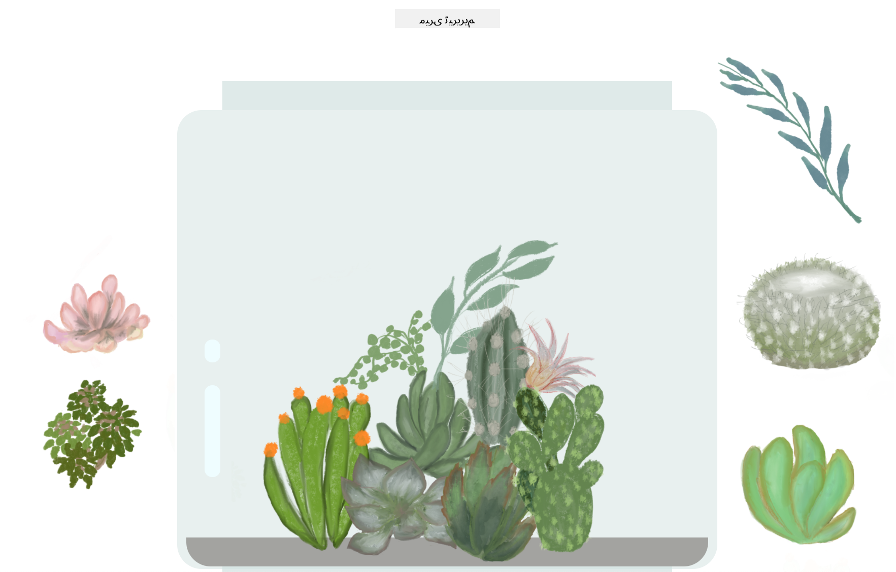

<!--
CO_OP_TRANSLATOR_METADATA:
{
  "original_hash": "7965cd2bc5dc92ad888dc4c6ab2ab70a",
  "translation_date": "2025-08-25T21:04:01+00:00",
  "source_file": "3-terrarium/README.md",
  "language_code": "ur"
}
-->
# میرا ٹیریریم: HTML، CSS، اور جاوا اسکرپٹ کے ذریعے DOM مینپولیشن سیکھنے کا ایک پروجیکٹ 🌵🌱

ایک چھوٹا سا ڈریگ اینڈ ڈراپ کوڈ میڈیٹیشن۔ تھوڑے سے HTML، JS اور CSS کے ساتھ، آپ ایک ویب انٹرفیس بنا سکتے ہیں، اسے اسٹائل دے سکتے ہیں، اور اپنی پسند کے مطابق مختلف تعاملات شامل کر سکتے ہیں۔

# اسباق

1. [HTML کا تعارف](./1-intro-to-html/README.md)  
2. [CSS کا تعارف](./2-intro-to-css/README.md)  
3. [DOM اور JS کلوزرز کا تعارف](./3-intro-to-DOM-and-closures/README.md)  

## کریڈٹس

یہ ♥️ کے ساتھ [Jen Looper](https://www.twitter.com/jenlooper) نے لکھا ہے۔

CSS کے ذریعے بنایا گیا ٹیریریم Jakub Mandra کے گلاس جار [کوڈپین](https://codepen.io/Rotarepmi/pen/rjpNZY) سے متاثر ہے۔

آرٹ ورک [Jen Looper](http://jenlooper.com) نے Procreate کی مدد سے ہاتھ سے بنایا ہے۔

## اپنا ٹیریریم شائع کریں

آپ Azure Static Web Apps کا استعمال کرتے ہوئے اپنے ٹیریریم کو ویب پر شائع کر سکتے ہیں۔

1. اس ریپو کو فورک کریں

2. یہ بٹن دبائیں

3. وزرڈ کے ذریعے اپنی ایپ بنائیں۔ یقینی بنائیں کہ آپ ایپ روٹ کو `/solution` یا اپنے کوڈ بیس کی روٹ پر سیٹ کریں۔ اس ایپ میں کوئی API نہیں ہے، اس لیے اس کی فکر نہ کریں۔ ایک گٹ ہب فولڈر آپ کی فورک کی گئی ریپوزٹری میں بنایا جائے گا جو Azure Static Web Apps کی بلڈ سروسز کو آپ کی ایپ کو ایک نئے URL پر بنانے اور شائع کرنے میں مدد دے گا۔

**ڈسکلیمر**:  
یہ دستاویز AI ترجمہ سروس [Co-op Translator](https://github.com/Azure/co-op-translator) کا استعمال کرتے ہوئے ترجمہ کی گئی ہے۔ ہم درستگی کے لیے کوشش کرتے ہیں، لیکن براہ کرم آگاہ رہیں کہ خودکار ترجمے میں غلطیاں یا غیر درستیاں ہو سکتی ہیں۔ اصل دستاویز کو اس کی اصل زبان میں مستند ذریعہ سمجھا جانا چاہیے۔ اہم معلومات کے لیے، پیشہ ور انسانی ترجمہ کی سفارش کی جاتی ہے۔ ہم اس ترجمے کے استعمال سے پیدا ہونے والی کسی بھی غلط فہمی یا غلط تشریح کے ذمہ دار نہیں ہیں۔