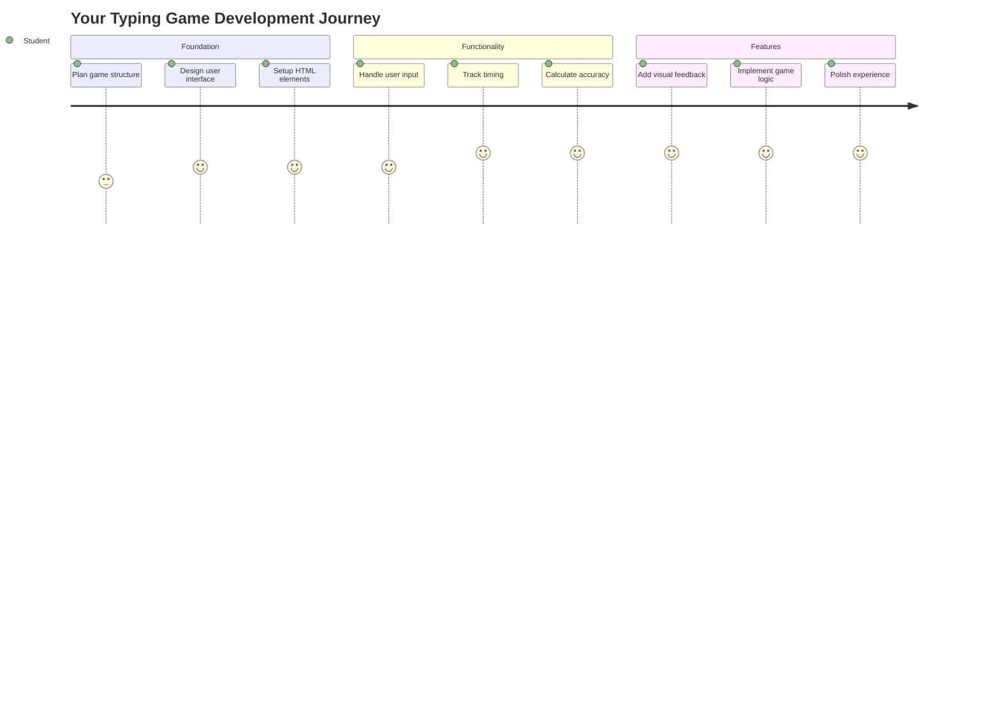
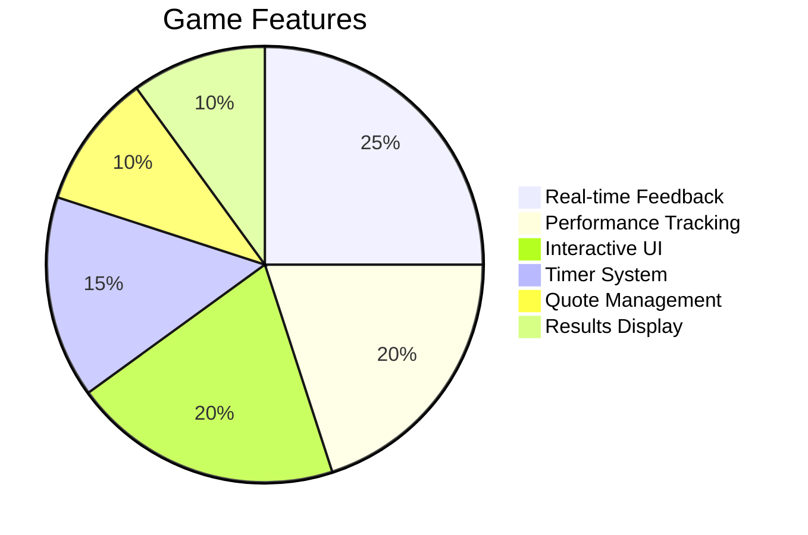
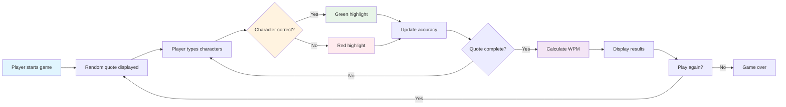
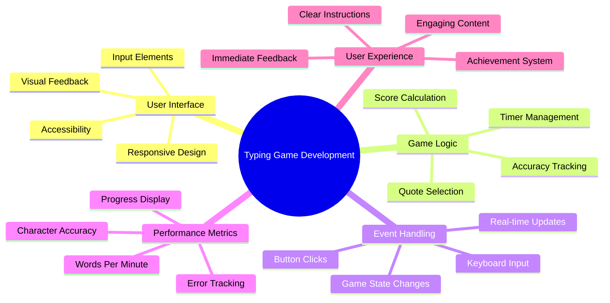
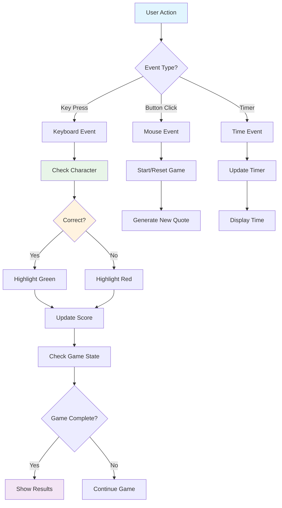
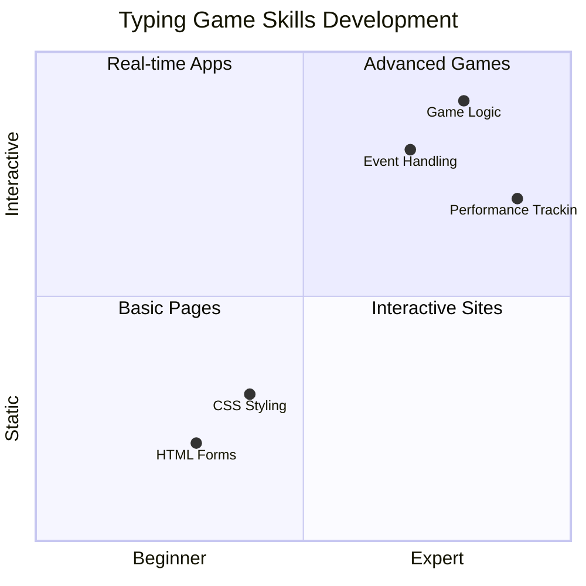
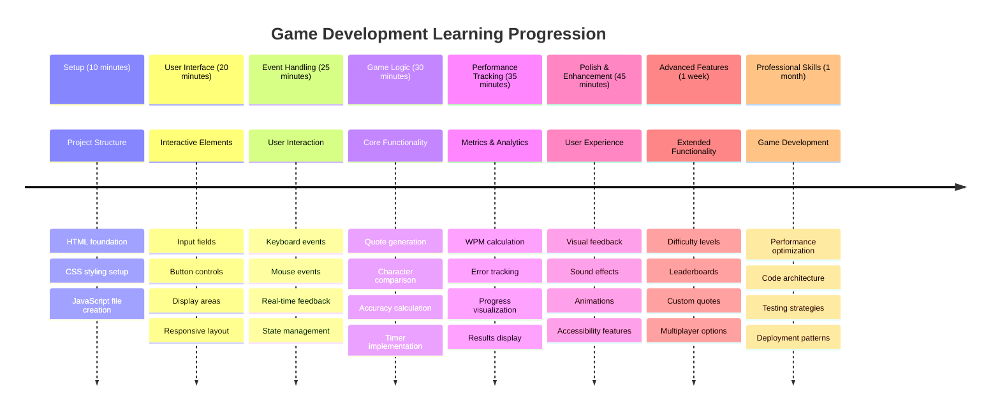

<!--
CO_OP_TRANSLATOR_METADATA:
{
  "original_hash": "efa2ab875b8bb5a7883816506da6b6d2",
  "translation_date": "2025-11-03T13:27:08+00:00",
  "source_file": "4-typing-game/README.md",
  "language_code": "ur"
}
-->
# ایونٹ ڈرائیون پروگرامنگ - ایک ٹائپنگ گیم بنائیں

## تعارف

یہ ایک حقیقت ہے جو ہر ڈویلپر جانتا ہے لیکن کم ہی اس پر بات کرتا ہے: تیز ٹائپنگ ایک سپر پاور ہے! 🚀 سوچیں - جتنا جلدی آپ اپنے خیالات کو اپنے دماغ سے کوڈ ایڈیٹر تک پہنچا سکتے ہیں، اتنا ہی زیادہ آپ کی تخلیقی صلاحیتیں بہہ سکتی ہیں۔ یہ بالکل ایسے ہے جیسے آپ کے خیالات اور اسکرین کے درمیان ایک سیدھا راستہ ہو۔

کیا آپ جاننا چاہتے ہیں کہ اس مہارت کو بہتر بنانے کا بہترین طریقہ کیا ہے؟ آپ نے صحیح اندازہ لگایا - ہم ایک گیم بنانے جا رہے ہیں!

> آئیے مل کر ایک زبردست ٹائپنگ گیم بناتے ہیں!

تیار ہیں کہ آپ نے جو جاوا اسکرپٹ، ایچ ٹی ایم ایل، اور سی ایس ایس کی مہارتیں سیکھی ہیں انہیں استعمال کریں؟ ہم ایک ٹائپنگ گیم بنائیں گے جو آپ کو لیجنڈری ڈیٹیکٹیو [شرلاک ہومز](https://en.wikipedia.org/wiki/Sherlock_Holmes) کے بے ترتیب اقتباسات کے ساتھ چیلنج کرے گا۔ یہ گیم آپ کی ٹائپنگ کی رفتار اور درستگی کو ٹریک کرے گا - اور یقین کریں، یہ آپ کے خیال سے زیادہ دلچسپ ہے!

## آپ کو کیا جاننا ہوگا

شروع کرنے سے پہلے، یقینی بنائیں کہ آپ ان تصورات سے واقف ہیں (اگر آپ کو تھوڑا سا ریفریشر کی ضرورت ہو تو فکر نہ کریں - ہم سب وہاں سے گزرے ہیں!):

- ٹیکسٹ ان پٹ اور بٹن کنٹرولز بنانا
- سی ایس ایس اور کلاسز کے ذریعے اسٹائل سیٹ کرنا  
- جاوا اسکرپٹ کی بنیادی باتیں
  - ایک ارے بنانا
  - ایک بے ترتیب نمبر بنانا
  - موجودہ وقت حاصل کرنا

اگر ان میں سے کوئی چیز تھوڑی سی کمزور لگتی ہے، تو یہ بالکل ٹھیک ہے! کبھی کبھی اپنے علم کو مضبوط کرنے کا بہترین طریقہ یہ ہے کہ کسی پروجیکٹ میں کودیں اور چیزوں کو راستے میں سیکھیں۔

### 🔄 **تعلیمی جائزہ**
**بنیادی تشخیص**: ترقی شروع کرنے سے پہلے، یقینی بنائیں کہ آپ سمجھتے ہیں:
- ✅ ایچ ٹی ایم ایل فارم اور ان پٹ عناصر کیسے کام کرتے ہیں
- ✅ سی ایس ایس کلاسز اور ڈائنامک اسٹائلنگ
- ✅ جاوا اسکرپٹ ایونٹ لسٹنرز اور ہینڈلرز
- ✅ ارے کی ہیرا پھیری اور بے ترتیب انتخاب
- ✅ وقت کی پیمائش اور حسابات

**خود کا فوری ٹیسٹ**: کیا آپ وضاحت کر سکتے ہیں کہ یہ تصورات ایک انٹرایکٹو گیم میں کیسے کام کرتے ہیں؟
- **ایونٹس** اس وقت ٹرگر ہوتے ہیں جب صارف عناصر کے ساتھ تعامل کرتے ہیں
- **ہینڈلرز** ان ایونٹس کو پروسیس کرتے ہیں اور گیم کی حالت کو اپ ڈیٹ کرتے ہیں
- **سی ایس ایس** صارف کے اعمال کے لیے بصری فیڈبیک فراہم کرتا ہے
- **ٹائمنگ** کارکردگی کی پیمائش اور گیم کی ترقی کو فعال کرتی ہے

## آئیے اس چیز کو بنائیں!

[ایونٹ ڈرائیون پروگرامنگ کے ذریعے ٹائپنگ گیم بنانا](./typing-game/README.md)

### ⚡ **اگلے 5 منٹ میں آپ کیا کر سکتے ہیں**
- [ ] اپنے براؤزر کنسول کو کھولیں اور `addEventListener` کے ساتھ کی بورڈ ایونٹس سننے کی کوشش کریں
- [ ] ایک سادہ ایچ ٹی ایم ایل صفحہ بنائیں جس میں ایک ان پٹ فیلڈ ہو اور ٹائپنگ ڈیٹیکشن کی جانچ کریں
- [ ] اسٹرنگ مینپولیشن کی مشق کریں تاکہ ٹائپ کردہ متن کو ہدف متن کے ساتھ موازنہ کریں
- [ ] `setTimeout` کے ساتھ تجربہ کریں تاکہ ٹائمنگ فنکشنز کو سمجھ سکیں

### 🎯 **اس گھنٹے میں آپ کیا حاصل کر سکتے ہیں**
- [ ] سبق کے بعد کا کوئز مکمل کریں اور ایونٹ ڈرائیون پروگرامنگ کو سمجھیں
- [ ] ٹائپنگ گیم کا ایک بنیادی ورژن بنائیں جس میں لفظ کی تصدیق ہو
- [ ] درست اور غلط ٹائپنگ کے لیے بصری فیڈبیک شامل کریں
- [ ] رفتار اور درستگی کی بنیاد پر ایک سادہ اسکورنگ سسٹم نافذ کریں
- [ ] اپنے گیم کو سی ایس ایس کے ساتھ اسٹائل کریں تاکہ یہ بصری طور پر دلکش ہو

### 📅 **آپ کی ہفتہ بھر کی گیم ڈیولپمنٹ**
- [ ] مکمل ٹائپنگ گیم تمام خصوصیات اور پالش کے ساتھ مکمل کریں
- [ ] مختلف لفظی پیچیدگی کے ساتھ مشکل کی سطحیں شامل کریں
- [ ] صارف کے اعدادوشمار کو ٹریک کریں (WPM، وقت کے ساتھ درستگی)
- [ ] بہتر صارف تجربے کے لیے ساؤنڈ ایفیکٹس اور اینیمیشنز بنائیں
- [ ] اپنے گیم کو موبائل کے لیے ریسپانسیو بنائیں تاکہ ٹچ ڈیوائسز پر کام کرے
- [ ] اپنا گیم آن لائن شیئر کریں اور صارفین سے فیڈبیک حاصل کریں

### 🌟 **آپ کی مہینے بھر کی انٹرایکٹو ڈیولپمنٹ**
- [ ] مختلف انٹرایکشن پیٹرنز کو دریافت کرتے ہوئے متعدد گیمز بنائیں
- [ ] گیم لوپس، اسٹیٹ مینجمنٹ، اور کارکردگی کی اصلاح کے بارے میں سیکھیں
- [ ] اوپن سورس گیم ڈیولپمنٹ پروجیکٹس میں حصہ لیں
- [ ] جدید ٹائمنگ تصورات اور ہموار اینیمیشنز میں مہارت حاصل کریں
- [ ] مختلف انٹرایکٹو ایپلیکیشنز کو دکھانے والا پورٹ فولیو بنائیں
- [ ] گیم ڈیولپمنٹ اور صارف کے تعامل میں دلچسپی رکھنے والوں کی رہنمائی کریں

## 🎯 آپ کی ٹائپنگ گیم مہارت کا ٹائم لائن

### 🛠️ آپ کے گیم ڈیولپمنٹ ٹول کٹ کا خلاصہ

اس پروجیکٹ کو مکمل کرنے کے بعد، آپ مہارت حاصل کر چکے ہوں گے:
- **ایونٹ ڈرائیون پروگرامنگ**: صارف کے انٹرفیس جو ان پٹ پر ردعمل دیتے ہیں
- **ریئل ٹائم فیڈبیک**: فوری بصری اور کارکردگی کی اپ ڈیٹس
- **کارکردگی کی پیمائش**: درست ٹائمنگ اور اسکورنگ سسٹمز
- **گیم اسٹیٹ مینجمنٹ**: ایپلیکیشن کے بہاؤ اور صارف کے تجربے کو کنٹرول کرنا
- **انٹرایکٹو ڈیزائن**: دلکش، دلچسپ صارف کے تجربات بنانا
- **جدید ویب APIs**: براؤزر کی صلاحیتوں کو بھرپور انٹرایکشنز کے لیے استعمال کرنا
- **ایکسس ایبلٹی پیٹرنز**: تمام صارفین کے لیے شامل ڈیزائن

**حقیقی دنیا کی ایپلیکیشنز**: یہ مہارتیں براہ راست ان پر لاگو ہوتی ہیں:
- **ویب ایپلیکیشنز**: کوئی بھی انٹرایکٹو انٹرفیس یا ڈیش بورڈ
- **تعلیمی سافٹ ویئر**: لرننگ پلیٹ فارمز اور مہارت کی تشخیص کے ٹولز
- **پروڈکٹیویٹی ٹولز**: ٹیکسٹ ایڈیٹرز، IDEs، اور تعاون کے سافٹ ویئر
- **گیمنگ انڈسٹری**: براؤزر گیمز اور انٹرایکٹو انٹرٹینمنٹ
- **موبائل ڈیولپمنٹ**: ٹچ بیسڈ انٹرفیس اور اشاروں کی ہینڈلنگ

**اگلا مرحلہ**: آپ ایڈوانسڈ گیم فریم ورک، ریئل ٹائم ملٹی پلیئر سسٹمز، یا پیچیدہ انٹرایکٹو ایپلیکیشنز کو دریافت کرنے کے لیے تیار ہیں!

## کریڈٹس

محبت کے ساتھ لکھا گیا [کرسٹوفر ہیریسن](http://www.twitter.com/geektrainer) کے ذریعے

---

**ڈسکلیمر**:  
یہ دستاویز AI ترجمہ سروس [Co-op Translator](https://github.com/Azure/co-op-translator) کا استعمال کرتے ہوئے ترجمہ کی گئی ہے۔ ہم درستگی کے لیے کوشش کرتے ہیں، لیکن براہ کرم آگاہ رہیں کہ خودکار ترجمے میں غلطیاں یا غیر درستیاں ہو سکتی ہیں۔ اصل دستاویز کو اس کی اصل زبان میں مستند ذریعہ سمجھا جانا چاہیے۔ اہم معلومات کے لیے، پیشہ ور انسانی ترجمہ کی سفارش کی جاتی ہے۔ ہم اس ترجمے کے استعمال سے پیدا ہونے والی کسی بھی غلط فہمی یا غلط تشریح کے ذمہ دار نہیں ہیں۔