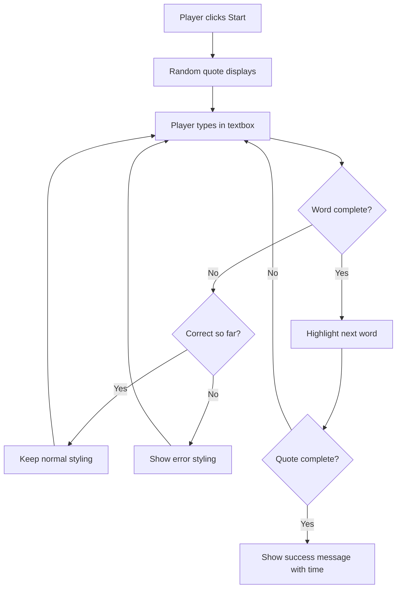
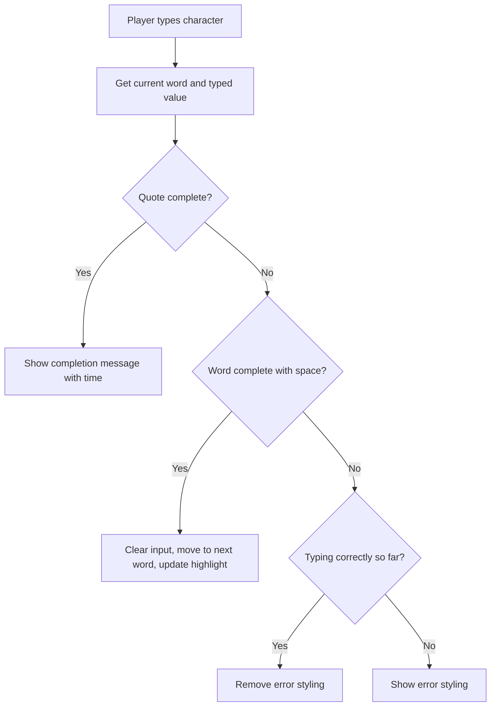

<!--
CO_OP_TRANSLATOR_METADATA:
{
  "original_hash": "e6b75e5b8caae906473a8a09d77b7121",
  "translation_date": "2025-10-22T15:06:03+00:00",
  "source_file": "4-typing-game/typing-game/README.md",
  "language_code": "ur"
}
-->
# کھیل بنانا ایونٹس کے ذریعے

کیا آپ نے کبھی سوچا ہے کہ ویب سائٹس کو کیسے پتہ چلتا ہے جب آپ بٹن پر کلک کرتے ہیں یا ٹیکسٹ باکس میں کچھ ٹائپ کرتے ہیں؟ یہ ایونٹ ڈرائیون پروگرامنگ کا جادو ہے! اس اہم مہارت کو سیکھنے کا بہترین طریقہ یہ ہے کہ کچھ مفید بنائیں - ایک ٹائپنگ اسپیڈ گیم جو آپ کے ہر کی اسٹروک پر ردعمل ظاہر کرے۔

آپ خود دیکھیں گے کہ ویب براؤزرز آپ کے جاوا اسکرپٹ کوڈ سے "بات" کیسے کرتے ہیں۔ جب بھی آپ کلک کرتے ہیں، ٹائپ کرتے ہیں، یا ماؤس کو حرکت دیتے ہیں، براؤزر آپ کے کوڈ کو چھوٹے پیغامات (جنہیں ہم ایونٹس کہتے ہیں) بھیج رہا ہوتا ہے، اور آپ فیصلہ کرتے ہیں کہ ان پر کیسے ردعمل دینا ہے!

جب ہم یہاں ختم کریں گے، تو آپ نے ایک حقیقی ٹائپنگ گیم بنائی ہوگی جو آپ کی رفتار اور درستگی کو ٹریک کرے گی۔ سب سے اہم بات، آپ ان بنیادی تصورات کو سمجھیں گے جو ہر انٹرایکٹو ویب سائٹ کو طاقت دیتے ہیں جو آپ نے کبھی استعمال کی ہے۔ آئیے شروع کریں!

## لیکچر سے پہلے کا کوئز

[لیکچر سے پہلے کا کوئز](https://ff-quizzes.netlify.app/web/quiz/21)

## ایونٹ ڈرائیون پروگرامنگ

اپنی پسندیدہ ایپ یا ویب سائٹ کے بارے میں سوچیں - اسے زندہ اور جوابدہ کیا بناتا ہے؟ یہ سب اس بات پر منحصر ہے کہ یہ آپ کے اعمال پر کیسے ردعمل ظاہر کرتی ہے! ہر ٹیپ، کلک، سوائپ، یا کی اسٹروک ایک "ایونٹ" پیدا کرتا ہے، اور یہی وہ جگہ ہے جہاں ویب ڈیولپمنٹ کا حقیقی جادو ہوتا ہے۔

ویب کے لیے پروگرامنگ کو دلچسپ بنانے والی بات یہ ہے: ہمیں کبھی نہیں معلوم کہ کوئی کب اس بٹن پر کلک کرے گا یا ٹیکسٹ باکس میں ٹائپ کرنا شروع کرے گا۔ وہ فوراً کلک کر سکتے ہیں، پانچ منٹ انتظار کر سکتے ہیں، یا شاید کبھی کلک نہ کریں! اس غیر یقینی صورتحال کا مطلب ہے کہ ہمیں اپنے کوڈ لکھنے کے بارے میں مختلف انداز میں سوچنا ہوگا۔

ایک نسخے کی طرح اوپر سے نیچے تک چلنے والے کوڈ لکھنے کے بجائے، ہم ایسا کوڈ لکھتے ہیں جو صبر سے کسی چیز کے ہونے کا انتظار کرتا ہے۔ یہ بالکل ویسا ہی ہے جیسے 1800 کی دہائی میں ٹیلی گراف آپریٹرز اپنی مشینوں کے پاس بیٹھ کر تار کے ذریعے پیغام آنے کا انتظار کرتے تھے۔

تو بالکل "ایونٹ" کیا ہے؟ سیدھے الفاظ میں، یہ کچھ ایسا ہے جو ہوتا ہے! جب آپ بٹن پر کلک کرتے ہیں - یہ ایک ایونٹ ہے۔ جب آپ ایک حرف ٹائپ کرتے ہیں - یہ ایک ایونٹ ہے۔ جب آپ ماؤس کو حرکت دیتے ہیں - یہ ایک اور ایونٹ ہے۔

ایونٹ ڈرائیون پروگرامنگ ہمیں اپنے کوڈ کو سننے اور جواب دینے کے لیے ترتیب دینے دیتی ہے۔ ہم خاص فنکشنز بناتے ہیں جنہیں **ایونٹ لسٹنرز** کہا جاتا ہے جو مخصوص چیزوں کے ہونے کا صبر سے انتظار کرتے ہیں، پھر جب وہ ہوتے ہیں تو فوراً حرکت میں آ جاتے ہیں۔

ایونٹ لسٹنرز کو اپنے کوڈ کے لیے ڈور بیل رکھنے جیسا سمجھیں۔ آپ ڈور بیل ترتیب دیتے ہیں (`addEventListener()`)، اسے بتاتے ہیں کہ کس آواز کو سننا ہے (جیسے 'کلک' یا 'کی پریس')، اور پھر یہ بتاتے ہیں کہ جب کوئی اسے بجائے تو کیا ہونا چاہیے (آپ کا کسٹم فنکشن)۔

**ایونٹ لسٹنرز کیسے کام کرتے ہیں:**
- **سنتے ہیں** مخصوص صارف کے اعمال جیسے کلکس، کی اسٹروکس، یا ماؤس کی حرکت
- **عمل کرتے ہیں** آپ کے کسٹم کوڈ پر جب مخصوص ایونٹ ہوتا ہے
- **فوری ردعمل دیتے ہیں** صارف کے تعاملات پر، ایک ہموار تجربہ تخلیق کرتے ہیں
- **متعدد ایونٹس کو ہینڈل کرتے ہیں** ایک ہی عنصر پر مختلف لسٹنرز کے ذریعے

> **نوٹ:** یہ بات قابل ذکر ہے کہ ایونٹ لسٹنرز بنانے کے کئی طریقے ہیں۔ آپ گمنام فنکشنز استعمال کر سکتے ہیں، یا نامزد فنکشنز بنا سکتے ہیں۔ آپ مختلف شارٹ کٹس استعمال کر سکتے ہیں، جیسے `click` پراپرٹی سیٹ کرنا، یا `addEventListener()` استعمال کرنا۔ ہماری مشق میں ہم `addEventListener()` اور گمنام فنکشنز پر توجہ مرکوز کریں گے، کیونکہ یہ ویب ڈیولپرز کے استعمال کا سب سے عام طریقہ ہے۔ یہ سب سے زیادہ لچکدار بھی ہے، کیونکہ `addEventListener()` تمام ایونٹس کے لیے کام کرتا ہے، اور ایونٹ کا نام پیرامیٹر کے طور پر فراہم کیا جا سکتا ہے۔

### عام ایونٹس

جبکہ ویب براؤزرز درجنوں مختلف ایونٹس پیش کرتے ہیں جنہیں آپ سن سکتے ہیں، زیادہ تر انٹرایکٹو ایپلیکیشنز صرف چند ضروری ایونٹس پر انحصار کرتی ہیں۔ ان بنیادی ایونٹس کو سمجھنا آپ کو پیچیدہ صارف تعاملات بنانے کی بنیاد فراہم کرے گا۔

ایپلیکیشن بناتے وقت آپ کے سننے کے لیے [درجنوں ایونٹس](https://developer.mozilla.org/docs/Web/Events) دستیاب ہیں۔ بنیادی طور پر صارف کے صفحے پر کچھ بھی کرنے سے ایک ایونٹ پیدا ہوتا ہے، جو آپ کو بہت زیادہ طاقت دیتا ہے تاکہ وہ تجربہ فراہم کریں جو آپ چاہتے ہیں۔ خوش قسمتی سے، آپ کو عام طور پر صرف چند ایونٹس کی ضرورت ہوتی ہے۔ یہاں کچھ عام ایونٹس ہیں (جن میں سے دو ہم اپنے گیم بنانے میں استعمال کریں گے):

| ایونٹ | وضاحت | عام استعمال کے کیسز |
|-------|-------------|------------------|
| `click` | صارف نے کسی چیز پر کلک کیا | بٹن، لنکس، انٹرایکٹو عناصر |
| `contextmenu` | صارف نے دائیں ماؤس بٹن پر کلک کیا | کسٹم رائٹ کلک مینو |
| `select` | صارف نے کچھ ٹیکسٹ کو ہائی لائٹ کیا | ٹیکسٹ ایڈیٹنگ، کاپی آپریشنز |
| `input` | صارف نے کچھ ٹیکسٹ ان پٹ کیا | فارم ویلیڈیشن، ریئل ٹائم سرچ |

**ان ایونٹ کی اقسام کو سمجھنا:**
- **ٹریگرز** جب صارفین آپ کے صفحے پر مخصوص عناصر کے ساتھ تعامل کرتے ہیں
- **تفصیلی معلومات فراہم کرتے ہیں** صارف کے عمل کے بارے میں ایونٹ آبجیکٹس کے ذریعے
- **آپ کو قابل بناتے ہیں** کہ آپ جوابدہ، انٹرایکٹو ویب ایپلیکیشنز بنائیں
- **مختلف براؤزرز اور ڈیوائسز پر مستقل کام کرتے ہیں**

## گیم بنانا

اب جب کہ آپ ایونٹس کو سمجھ گئے ہیں، آئیے اس علم کو عملی جامہ پہنائیں اور کچھ مفید بنائیں۔ ہم ایک ٹائپنگ اسپیڈ گیم بنائیں گے جو ایونٹ ہینڈلنگ کو ظاہر کرے گا اور آپ کو ایک اہم ڈیولپر مہارت سیکھنے میں مدد دے گا۔

ہم ایک گیم بنانے جا رہے ہیں تاکہ جاوا اسکرپٹ میں ایونٹس کے کام کرنے کے طریقے کو دریافت کیا جا سکے۔ ہمارا گیم کھلاڑی کی ٹائپنگ کی مہارت کو جانچے گا، جو کہ تمام ڈیولپرز کے لیے ایک انتہائی اہم مہارت ہے۔ دلچسپ حقیقت: آج ہم جو QWERTY کی بورڈ لے آؤٹ استعمال کرتے ہیں وہ اصل میں 1870 کی دہائی میں ٹائپ رائٹرز کے لیے ڈیزائن کیا گیا تھا - اور اچھی ٹائپنگ کی مہارت آج بھی پروگرامرز کے لیے اتنی ہی قیمتی ہے! گیم کا عمومی بہاؤ کچھ اس طرح نظر آئے گا:



**ہمارا گیم کیسے کام کرے گا:**
- **شروع ہوتا ہے** جب کھلاڑی اسٹارٹ بٹن پر کلک کرتا ہے اور ایک رینڈم کوٹ دکھاتا ہے
- **کھلاڑی کی ٹائپنگ کی پیش رفت کو حقیقی وقت میں لفظ بہ لفظ ٹریک کرتا ہے**
- **موجودہ لفظ کو نمایاں کرتا ہے تاکہ کھلاڑی کی توجہ مرکوز رہے**
- **ٹائپنگ کی غلطیوں کے لیے فوری بصری فیڈبیک فراہم کرتا ہے**
- **کل وقت کا حساب لگاتا ہے اور کوٹ مکمل ہونے پر دکھاتا ہے**

آئیے اپنا گیم بنائیں اور ایونٹس کے بارے میں سیکھیں!

### فائل اسٹرکچر

کوڈنگ شروع کرنے سے پہلے، آئیے منظم ہو جائیں! شروع سے صاف فائل اسٹرکچر رکھنے سے آپ کو بعد میں پریشانیوں سے بچنے میں مدد ملے گی اور آپ کے پروجیکٹ کو زیادہ پیشہ ورانہ بنائے گا۔ 😊

ہم صرف تین فائلوں کے ساتھ چیزوں کو آسان رکھیں گے: `index.html` ہمارے صفحے کے اسٹرکچر کے لیے، `script.js` ہمارے تمام گیم لاجک کے لیے، اور `style.css` سب کچھ اچھا دکھانے کے لیے۔ یہ وہ کلاسک تریو ہے جو زیادہ تر ویب کو طاقت دیتا ہے!

**کنسول یا ٹرمینل ونڈو کھول کر اپنے کام کے لیے ایک نیا فولڈر بنائیں اور درج ذیل کمانڈ جاری کریں:**

```bash
# Linux or macOS
mkdir typing-game && cd typing-game

# Windows
md typing-game && cd typing-game
```

**یہ کمانڈز کیا کرتی ہیں:**
- **ایک نیا ڈائریکٹری بناتی ہیں** جس کا نام `typing-game` ہے آپ کے پروجیکٹ فائلز کے لیے
- **خود بخود نئے بنائے گئے ڈائریکٹری میں جاتی ہیں**
- **آپ کے گیم ڈیولپمنٹ کے لیے ایک صاف ورک اسپیس ترتیب دیتی ہیں**

**ویژول اسٹوڈیو کوڈ کھولیں:**

```bash
code .
```

**یہ کمانڈ:**
- **ویژول اسٹوڈیو کوڈ کو موجودہ ڈائریکٹری میں لانچ کرتی ہے**
- **آپ کے پروجیکٹ فولڈر کو ایڈیٹر میں کھولتی ہے**
- **آپ کو تمام ڈیولپمنٹ ٹولز تک رسائی فراہم کرتی ہے**

**ویژول اسٹوڈیو کوڈ میں فولڈر میں تین فائلیں شامل کریں جن کے نام درج ذیل ہیں:**
- `index.html` - آپ کے گیم کی اسٹرکچر اور مواد پر مشتمل ہے
- `script.js` - تمام گیم لاجک اور ایونٹ لسٹنرز کو ہینڈل کرتا ہے
- `style.css` - بصری ظاہری شکل اور اسٹائلنگ کی وضاحت کرتا ہے

## یوزر انٹرفیس بنائیں

اب آئیے وہ اسٹیج بنائیں جہاں ہمارا گیم ایکشن ہوگا! اس کو ایک اسپیس شپ کے کنٹرول پینل کو ڈیزائن کرنے جیسا سمجھیں - ہمیں یہ یقینی بنانا ہوگا کہ ہمارے کھلاڑیوں کو جو کچھ بھی چاہیے وہ وہیں موجود ہو جہاں وہ توقع کرتے ہیں۔

آئیے معلوم کریں کہ ہمارے گیم کو اصل میں کیا ضرورت ہے۔ اگر آپ ٹائپنگ گیم کھیل رہے ہوتے، تو آپ اسکرین پر کیا دیکھنا چاہتے؟ یہاں وہ چیزیں ہیں جن کی ہمیں ضرورت ہوگی:

| UI عنصر | مقصد | HTML عنصر |
|------------|---------|-------------|
| کوٹ ڈسپلے | ٹائپ کرنے کے لیے ٹیکسٹ دکھاتا ہے | `<p>` جس کا `id="quote"` ہو |
| میسج ایریا | اسٹیٹس اور کامیابی کے پیغامات دکھاتا ہے | `<p>` جس کا `id="message"` ہو |
| ٹیکسٹ انپٹ | جہاں کھلاڑی کوٹ ٹائپ کرتے ہیں | `<input>` جس کا `id="typed-value"` ہو |
| اسٹارٹ بٹن | گیم شروع کرتا ہے | `<button>` جس کا `id="start"` ہو |

**UI اسٹرکچر کو سمجھنا:**
- **مواد کو منطقی طور پر اوپر سے نیچے تک منظم کرتا ہے**
- **عنصر کو منفرد IDs تفویض کرتا ہے تاکہ جاوا اسکرپٹ کے ذریعے ٹارگٹ کیا جا سکے**
- **بہتر صارف تجربے کے لیے واضح بصری درجہ بندی فراہم کرتا ہے**
- **رسائی کے لیے سیمینٹک HTML عناصر شامل کرتا ہے**

ان میں سے ہر ایک کو IDs کی ضرورت ہوگی تاکہ ہم انہیں اپنے جاوا اسکرپٹ میں استعمال کر سکیں۔ ہم ان CSS اور جاوا اسکرپٹ فائلز کے حوالہ جات بھی شامل کریں گے جنہیں ہم بنانے جا رہے ہیں۔

ایک نئی فائل بنائیں جس کا نام `index.html` ہو۔ درج ذیل HTML شامل کریں:

```html
<!-- inside index.html -->
<html>
<head>
  <title>Typing game</title>
  <link rel="stylesheet" href="style.css">
</head>
<body>
  <h1>Typing game!</h1>
  <p>Practice your typing skills with a quote from Sherlock Holmes. Click **start** to begin!</p>
  <p id="quote"></p> <!-- This will display our quote -->
  <p id="message"></p> <!-- This will display any status messages -->
  <div>
    <input type="text" aria-label="current word" id="typed-value" /> <!-- The textbox for typing -->
    <button type="button" id="start">Start</button> <!-- To start the game -->
  </div>
  <script src="script.js"></script>
</body>
</html>
```

**یہ HTML اسٹرکچر کیا حاصل کرتا ہے:**
- **CSS اسٹائل شیٹ کو `<head>` میں لنک کرتا ہے اسٹائلنگ کے لیے**
- **صارفین کے لیے واضح ہیڈنگ اور ہدایات تخلیق کرتا ہے**
- **مخصوص IDs کے ساتھ ڈائنامک مواد کے لیے پلیس ہولڈر پیراگراف قائم کرتا ہے**
- **ایک انپٹ فیلڈ شامل کرتا ہے رسائی کے صفات کے ساتھ**
- **گیم کو ٹرگر کرنے کے لیے اسٹارٹ بٹن فراہم کرتا ہے**
- **جاوا اسکرپٹ فائل کو آخر میں لوڈ کرتا ہے بہتر کارکردگی کے لیے**

### ایپلیکیشن لانچ کریں

ڈیولپمنٹ کے دوران اپنی ایپلیکیشن کو بار بار ٹیسٹ کرنا آپ کو جلدی مسائل پکڑنے اور حقیقی وقت میں اپنی پیش رفت دیکھنے میں مدد دیتا ہے۔ لائیو سرور ایک انمول ٹول ہے جو آپ کی فائلز کو محفوظ کرنے پر خود بخود آپ کے براؤزر کو ریفریش کرتا ہے، ڈیولپمنٹ کو بہت زیادہ موثر بناتا ہے۔

ہمیشہ بہتر ہوتا ہے کہ ترقیاتی کام کو مرحلہ وار کریں تاکہ دیکھ سکیں کہ چیزیں کیسی لگ رہی ہیں۔ آئیے اپنی ایپلیکیشن لانچ کریں۔ ویژول اسٹوڈیو کوڈ کے لیے ایک شاندار ایکسٹینشن ہے جسے [لائیو سرور](https://marketplace.visualstudio.com/items?itemName=ritwickdey.LiveServer&WT.mc_id=academic-77807-sagibbon) کہا جاتا ہے جو آپ کی ایپلیکیشن کو مقامی طور پر ہوسٹ کرے گا اور ہر بار جب آپ فائلز محفوظ کریں گے براؤزر کو ریفریش کرے گا۔

**[لائیو سرور](https://marketplace.visualstudio.com/items?itemName=ritwickdey.LiveServer&WT.mc_id=academic-77807-sagibbon) انسٹال کریں لنک پر کلک کرکے اور انسٹال پر کلک کریں:**

**انسٹالیشن کے دوران کیا ہوتا ہے:**
- **آپ کے براؤزر کو ویژول اسٹوڈیو کوڈ کھولنے کے لیے پرامپٹ کرتا ہے**
- **آپ کو ایکسٹینشن انسٹالیشن کے عمل کے ذریعے گائیڈ کرتا ہے**
- **ویژول اسٹوڈیو کوڈ کو دوبارہ شروع کرنے کی ضرورت ہو سکتی ہے سیٹ اپ مکمل کرنے کے لیے**

**انسٹال ہونے کے بعد، ویژول اسٹوڈیو کوڈ میں، Ctrl-Shift-P (یا Cmd-Shift-P) دبائیں کمانڈ پیلیٹ کھولنے کے لیے:**

**کمانڈ پیلیٹ کو سمجھنا:**
- **ویژول اسٹوڈیو کوڈ کے تمام کمانڈز تک فوری رسائی فراہم کرتا ہے**
- **ٹائپ کرتے وقت کمانڈز تلاش کرتا ہے**
- **تیز ڈیولپمنٹ کے لیے کی بورڈ شارٹ کٹس پیش کرتا ہے**

**"Live Server: Open with Live Server" ٹائپ کریں:**

**لائیو سرور کیا کرتا ہے:**
- **آپ کے پروجیکٹ کے لیے مقامی ڈیولپمنٹ سرور شروع کرتا ہے**
- **فائلز محفوظ کرنے پر خود بخود براؤزر کو ریفریش کرتا ہے**
- **آپ کی فائلز کو مقامی URL سے فراہم کرتا ہے (عام طور پر `localhost:5500`)**

**براؤزر کھولیں اور `https://localhost:5500` پر جائیں:**

اب آپ کو وہ صفحہ نظر آنا چاہیے جو آپ نے بنایا ہے! آئیے کچھ فعالیت شامل کریں۔

## CSS شامل کریں

اب چیزوں کو اچھا بنائیں! بصری فیڈبیک کمپیوٹنگ کے ابتدائی دنوں سے صارف انٹرفیس کے لیے اہم رہا ہے۔ 1980 کی دہائی میں، محققین نے دریافت کیا کہ فوری بصری فیڈبیک صارف کی کارکردگی کو ڈرامائی طور پر بہتر بناتا ہے اور غلطیوں کو کم کرتا ہے۔ یہی وہ چیز ہے جو ہم تخلیق کرنے جا رہے ہیں۔

ہمارے گیم کو یہ واضح کرنا ہوگا کہ کیا ہو رہا ہے۔ کھلاڑیوں کو فوراً معلوم ہونا چاہیے کہ کون سا لفظ انہیں ٹائپ کرنا ہے، اور اگر وہ غلطی کرتے ہیں، تو انہیں فوراً نظر آنا چاہیے۔ آئیے کچھ سادہ لیکن مؤثر اسٹائلنگ بنائیں:

ایک نئی فائل بنائیں جس کا نام `style.css` ہو اور درج ذیل سینٹیکس شامل کریں۔

```css
/* inside style.css */
.highlight {
  background-color: yellow;
}

.error {
  background-color: lightcoral;
  border: red;
}
```

**ان CSS کلاسز کو سمجھنا:**
- **موجودہ لفظ کو نمایاں کرتا ہے** ایک پیلے رنگ کے پس منظر کے ساتھ واضح بصری رہنمائی کے لیے
- **ٹائپنگ کی غلطیوں کا اشارہ دیتا ہے** ہلکے کورل پس منظر کے رنگ کے ساتھ
- **فوری فیڈبیک فراہم کرتا ہے** بغیر صارف کے ٹائپنگ کے بہاؤ کو متاثر کیے
- **رسائی اور واضح بصری مواصلات کے لیے متضاد رنگ استعمال کرتا ہے**

✅ جب بات CSS کی ہو تو آپ اپنے صفحے کو اپنی مرضی کے مطابق ترتیب دے سکتے ہیں۔ تھوڑا وقت نکالیں اور صفحے کو مزید دلکش بنائیں:

- مختلف فونٹ منتخب کریں
- ہیڈرز کو رنگین کریں
- آئٹمز کا سائز تبدیل کریں

## جاوا اسکرپٹ

یہاں چیزیں دلچسپ ہو جاتی ہیں! 🎉 ہمارے پاس HTML اسٹرکچر اور CSS اسٹائلنگ ہے، لیکن ابھی ہمارا گیم ایک خوبصورت کار کی طرح ہے جس کے پاس انجن نہیں ہے۔ جاوا
| اقتباسات کی فہرست | کھیل کے لیے تمام ممکنہ اقتباسات محفوظ کریں | `['Quote 1', 'Quote 2', ...]` |
| الفاظ کی فہرست | موجودہ اقتباس کو انفرادی الفاظ میں تقسیم کریں | `['When', 'you', 'have', ...]` |
| الفاظ کا انڈیکس | اس لفظ کو ٹریک کریں جو کھلاڑی ٹائپ کر رہا ہے | `0, 1, 2, 3...` |
| شروع کا وقت | اسکورنگ کے لیے گزرا ہوا وقت حساب کریں | `Date.now()` |

**ہمیں اپنے UI عناصر کے حوالہ جات بھی درکار ہوں گے:**
| عنصر | ID | مقصد |
|---------|----|---------|
| ٹیکسٹ ان پٹ | `typed-value` | جہاں کھلاڑی ٹائپ کرتے ہیں |
| اقتباس کی نمائش | `quote` | ٹائپ کرنے کے لیے اقتباس دکھاتا ہے |
| پیغام کا علاقہ | `message` | اسٹیٹس اپڈیٹس دکھاتا ہے |

```javascript
// inside script.js
// all of our quotes
const quotes = [
    'When you have eliminated the impossible, whatever remains, however improbable, must be the truth.',
    'There is nothing more deceptive than an obvious fact.',
    'I ought to know by this time that when a fact appears to be opposed to a long train of deductions it invariably proves to be capable of bearing some other interpretation.',
    'I never make exceptions. An exception disproves the rule.',
    'What one man can invent another can discover.',
    'Nothing clears up a case so much as stating it to another person.',
    'Education never ends, Watson. It is a series of lessons, with the greatest for the last.',
];
// store the list of words and the index of the word the player is currently typing
let words = [];
let wordIndex = 0;
// the starting time
let startTime = Date.now();
// page elements
const quoteElement = document.getElementById('quote');
const messageElement = document.getElementById('message');
const typedValueElement = document.getElementById('typed-value');
```

**اس سیٹ اپ کوڈ کے مقاصد کو سمجھنا:**
- **محفوظ کرتا ہے** Sherlock Holmes کے اقتباسات کی فہرست کو `const` کے ذریعے کیونکہ اقتباسات تبدیل نہیں ہوں گے
- **ابتدا کرتا ہے** ٹریکنگ متغیرات کو `let` کے ذریعے کیونکہ یہ اقدار کھیل کے دوران اپ ڈیٹ ہوں گی
- **حاصل کرتا ہے** DOM عناصر کے حوالہ جات کو `document.getElementById()` کے ذریعے مؤثر رسائی کے لیے
- **بنیاد رکھتا ہے** کھیل کی تمام فعالیت کے لیے واضح اور وضاحتی متغیر ناموں کے ساتھ
- **منظم کرتا ہے** متعلقہ ڈیٹا اور عناصر کو منطقی طور پر تاکہ کوڈ کی دیکھ بھال آسان ہو

✅ اپنے کھیل میں مزید اقتباسات شامل کریں

> 💡 **پرو ٹپ**: ہم کوڈ میں جب چاہیں عناصر کو `document.getElementById()` کے ذریعے حاصل کر سکتے ہیں۔ چونکہ ہم ان عناصر کا بار بار حوالہ دیں گے، ہم اسٹرنگ لٹریلز کے ذریعے ٹائپوز سے بچیں گے۔ [Vue.js](https://vuejs.org/) یا [React](https://reactjs.org/) جیسے فریم ورک آپ کو اپنے کوڈ کو مرکزی بنانے میں بہتر مدد فراہم کر سکتے ہیں۔
>
**یہ طریقہ کیوں اتنا مؤثر ہے:**
- **روکتا ہے** عناصر کے حوالہ دیتے وقت ہجے کی غلطیاں
- **بہتر بناتا ہے** کوڈ کی پڑھائی کو وضاحتی مستقل ناموں کے ساتھ
- **فعال کرتا ہے** بہتر IDE سپورٹ آٹو کمپلیٹ اور ایرر چیکنگ کے ساتھ
- **آسان بناتا ہے** ریفیکٹرنگ اگر عناصر کے IDs بعد میں تبدیل ہوں

`const`, `let` اور `var` کے استعمال پر ویڈیو دیکھنے کے لیے ایک منٹ نکالیں

[](https://youtube.com/watch?v=JNIXfGiDWM8 "متغیرات کی اقسام")

> 🎥 اوپر دی گئی تصویر پر کلک کریں متغیرات کے بارے میں ویڈیو دیکھنے کے لیے۔

### شروع کرنے کی منطق شامل کریں

یہ وہ جگہ ہے جہاں سب کچھ جڑتا ہے! 🚀 آپ اپنا پہلا حقیقی ایونٹ لسٹنر لکھنے والے ہیں، اور یہ دیکھنا کافی خوشگوار ہے کہ آپ کا کوڈ بٹن کلک پر جواب دیتا ہے۔

سوچیں: کہیں نہ کہیں، ایک کھلاڑی "شروع کریں" بٹن پر کلک کرنے والا ہے، اور آپ کا کوڈ ان کے لیے تیار ہونا چاہیے۔ ہمیں نہیں معلوم کہ وہ کب کلک کریں گے - فوراً، یا کافی لینے کے بعد - لیکن جب وہ کریں گے، آپ کا کھیل زندگی میں آ جائے گا۔

جب صارف `start` پر کلک کرتا ہے، ہمیں ایک اقتباس منتخب کرنا ہوگا، صارف انٹرفیس سیٹ اپ کرنا ہوگا، اور موجودہ لفظ اور وقت کے لیے ٹریکنگ سیٹ اپ کرنا ہوگا۔ نیچے وہ جاوا اسکرپٹ ہے جو آپ کو شامل کرنا ہوگا؛ ہم اسکرپٹ بلاک کے بعد اس پر بات کرتے ہیں۔

```javascript
// at the end of script.js
document.getElementById('start').addEventListener('click', () => {
  // get a quote
  const quoteIndex = Math.floor(Math.random() * quotes.length);
  const quote = quotes[quoteIndex];
  // Put the quote into an array of words
  words = quote.split(' ');
  // reset the word index for tracking
  wordIndex = 0;

  // UI updates
  // Create an array of span elements so we can set a class
  const spanWords = words.map(function(word) { return `<span>${word} </span>`});
  // Convert into string and set as innerHTML on quote display
  quoteElement.innerHTML = spanWords.join('');
  // Highlight the first word
  quoteElement.childNodes[0].className = 'highlight';
  // Clear any prior messages
  messageElement.innerText = '';

  // Setup the textbox
  // Clear the textbox
  typedValueElement.value = '';
  // set focus
  typedValueElement.focus();
  // set the event handler

  // Start the timer
  startTime = new Date().getTime();
});
```

**کوڈ کو منطقی حصوں میں تقسیم کرنا:**

**📊 الفاظ کی ٹریکنگ سیٹ اپ:**
- **منتخب کرتا ہے** ایک بے ترتیب اقتباس `Math.floor()` اور `Math.random()` کے ذریعے مختلفیت کے لیے
- **تبدیل کرتا ہے** اقتباس کو انفرادی الفاظ کی فہرست میں `split(' ')` کے ذریعے
- **ری سیٹ کرتا ہے** `wordIndex` کو 0 پر کیونکہ کھلاڑی پہلے لفظ سے شروع کرتے ہیں
- **تیار کرتا ہے** کھیل کی حالت ایک نئے راؤنڈ کے لیے

**🎨 UI سیٹ اپ اور نمائش:**
- **بناتا ہے** `<span>` عناصر کی فہرست، ہر لفظ کو انفرادی اسٹائلنگ کے لیے لپیٹتا ہے
- **جوڑتا ہے** span عناصر کو ایک واحد اسٹرنگ میں مؤثر DOM اپ ڈیٹنگ کے لیے
- **نمایاں کرتا ہے** پہلے لفظ کو `highlight` CSS کلاس شامل کر کے
- **صاف کرتا ہے** کسی بھی پچھلے کھیل کے پیغامات کو ایک صاف سلیٹ فراہم کرنے کے لیے

**⌨️ ٹیکسٹ باکس کی تیاری:**
- **صاف کرتا ہے** ان پٹ فیلڈ میں موجود کسی بھی موجودہ متن کو
- **فوکس سیٹ کرتا ہے** ٹیکسٹ باکس پر تاکہ کھلاڑی فوراً ٹائپ کرنا شروع کر سکیں
- **تیار کرتا ہے** ان پٹ ایریا کو نئے کھیل کے سیشن کے لیے

**⏱️ ٹائمر کی ابتدا:**
- **حاصل کرتا ہے** موجودہ ٹائم اسٹیمپ `new Date().getTime()` کے ذریعے
- **فعال کرتا ہے** ٹائپنگ کی رفتار اور مکمل ہونے کے وقت کی درست حساب
- **شروع کرتا ہے** کھیل کے سیشن کے لیے پرفارمنس ٹریکنگ

### ٹائپنگ کی منطق شامل کریں

یہاں ہم اپنے کھیل کے دل کو حل کرتے ہیں! اگر یہ شروع میں زیادہ لگے تو پریشان نہ ہوں - ہم ہر حصے کو تفصیل سے دیکھیں گے، اور آخر میں آپ دیکھیں گے کہ یہ سب کتنا منطقی ہے۔

جو ہم یہاں بنا رہے ہیں وہ کافی پیچیدہ ہے: ہر بار جب کوئی حرف ٹائپ کرتا ہے، ہمارا کوڈ چیک کرے گا کہ انہوں نے کیا ٹائپ کیا، انہیں فیڈبیک دے گا، اور فیصلہ کرے گا کہ آگے کیا ہونا چاہیے۔ یہ بالکل ویسا ہی ہے جیسے ابتدائی ورڈ پروسیسرز جیسے WordStar 1970 کی دہائی میں ٹائپسٹ کو ریئل ٹائم فیڈبیک فراہم کرتے تھے۔

```javascript
// at the end of script.js
typedValueElement.addEventListener('input', () => {
  // Get the current word
  const currentWord = words[wordIndex];
  // get the current value
  const typedValue = typedValueElement.value;

  if (typedValue === currentWord && wordIndex === words.length - 1) {
    // end of sentence
    // Display success
    const elapsedTime = new Date().getTime() - startTime;
    const message = `CONGRATULATIONS! You finished in ${elapsedTime / 1000} seconds.`;
    messageElement.innerText = message;
  } else if (typedValue.endsWith(' ') && typedValue.trim() === currentWord) {
    // end of word
    // clear the typedValueElement for the new word
    typedValueElement.value = '';
    // move to the next word
    wordIndex++;
    // reset the class name for all elements in quote
    for (const wordElement of quoteElement.childNodes) {
      wordElement.className = '';
    }
    // highlight the new word
    quoteElement.childNodes[wordIndex].className = 'highlight';
  } else if (currentWord.startsWith(typedValue)) {
    // currently correct
    // highlight the next word
    typedValueElement.className = '';
  } else {
    // error state
    typedValueElement.className = 'error';
  }
});
```

**ٹائپنگ منطق کے بہاؤ کو سمجھنا:**

یہ فنکشن ایک واٹر فال اپروچ استعمال کرتا ہے، سب سے مخصوص سے سب سے عمومی حالات کو چیک کرتے ہوئے۔ آئیے ہر منظر نامے کو تفصیل سے دیکھتے ہیں:



**🏁 اقتباس مکمل (منظر نامہ 1):**
- **چیک کرتا ہے** کہ ٹائپ کردہ ویلیو موجودہ لفظ سے میل کھاتی ہے اور ہم آخری لفظ پر ہیں
- **حساب کرتا ہے** گزرا ہوا وقت، شروع کے وقت کو موجودہ وقت سے منفی کر کے
- **تبدیل کرتا ہے** ملی سیکنڈز کو سیکنڈز میں 1,000 سے تقسیم کر کے
- **نمائش کرتا ہے** مبارکبادی پیغام مکمل ہونے کے وقت کے ساتھ

**✅ لفظ مکمل (منظر نامہ 2):**
- **پہچانتا ہے** لفظ کی تکمیل جب انپٹ اسپیس کے ساتھ ختم ہوتا ہے
- **تصدیق کرتا ہے** کہ ٹرِم کردہ انپٹ موجودہ لفظ سے بالکل میل کھاتا ہے
- **صاف کرتا ہے** انپٹ فیلڈ کو اگلے لفظ کے لیے
- **آگے بڑھتا ہے** اگلے لفظ پر `wordIndex` کو بڑھا کر
- **اپ ڈیٹ کرتا ہے** بصری نمایاں کو تمام کلاسز ہٹا کر اور نئے لفظ کو نمایاں کر کے

**📝 ٹائپنگ جاری (منظر نامہ 3):**
- **تصدیق کرتا ہے** کہ موجودہ لفظ اس سے شروع ہوتا ہے جو ابھی تک ٹائپ کیا گیا ہے
- **ہٹاتا ہے** کسی بھی ایرر اسٹائلنگ کو دکھانے کے لیے کہ انپٹ درست ہے
- **اجازت دیتا ہے** جاری ٹائپنگ بغیر کسی مداخلت کے

**❌ ایرر اسٹیٹ (منظر نامہ 4):**
- **ٹرگر کرتا ہے** جب ٹائپ کردہ متن متوقع لفظ کے آغاز سے میل نہیں کھاتا
- **لگاتا ہے** ایرر CSS کلاس فوری بصری فیڈبیک فراہم کرنے کے لیے
- **مدد کرتا ہے** کھلاڑیوں کو جلدی سے غلطیوں کی شناخت اور درست کرنے میں

## اپنی ایپلیکیشن کو ٹیسٹ کریں

دیکھیں آپ نے کیا حاصل کیا! 🎉 آپ نے ایونٹ ڈرائیون پروگرامنگ کا استعمال کرتے ہوئے شروع سے ایک حقیقی، کام کرنے والا ٹائپنگ کھیل بنایا۔ ایک لمحہ نکالیں اور اس کی قدر کریں - یہ کوئی چھوٹی کامیابی نہیں ہے!

اب ٹیسٹنگ کا مرحلہ آتا ہے! کیا یہ توقع کے مطابق کام کرے گا؟ کیا ہم نے کچھ چھوڑ دیا؟ بات یہ ہے کہ: اگر کچھ فوراً بالکل کام نہ کرے، تو یہ بالکل معمول کی بات ہے۔ تجربہ کار ڈویلپرز بھی اپنے کوڈ میں باقاعدگی سے بگز تلاش کرتے ہیں۔ یہ ترقی کے عمل کا حصہ ہے!

`start` پر کلک کریں، اور ٹائپ کرنا شروع کریں! یہ کچھ ایسا ہی نظر آنا چاہیے جیسا کہ ہم نے پہلے اینیمیشن میں دیکھا تھا۔


**اپنی ایپلیکیشن میں کیا ٹیسٹ کریں:**
- **تصدیق کرتا ہے** کہ شروع پر کلک کرنے سے ایک بے ترتیب اقتباس ظاہر ہوتا ہے
- **یقین دہانی کرتا ہے** کہ ٹائپنگ موجودہ لفظ کو صحیح طریقے سے نمایاں کرتی ہے
- **چیک کرتا ہے** کہ غلط ٹائپنگ کے لیے ایرر اسٹائلنگ ظاہر ہوتی ہے
- **یقین دہانی کرتا ہے** کہ الفاظ مکمل ہونے پر نمایاں صحیح طریقے سے آگے بڑھتا ہے
- **ٹیسٹ کرتا ہے** کہ اقتباس مکمل ہونے پر وقت کے ساتھ مکمل ہونے کا پیغام ظاہر ہوتا ہے

**عام ڈیبگنگ کے نکات:**
- **چیک کریں** براؤزر کنسول (F12) میں جاوا اسکرپٹ ایررز
- **تصدیق کریں** کہ تمام فائل نام بالکل میل کھاتے ہیں (کیس سینسیٹو)
- **یقین دہانی کریں** کہ لائیو سرور صحیح طریقے سے چل رہا ہے اور ریفریش ہو رہا ہے
- **مختلف اقتباسات ٹیسٹ کریں** بے ترتیب انتخاب کی تصدیق کے لیے

---

## GitHub Copilot Agent چیلنج 🎮

ایجنٹ موڈ کا استعمال کرتے ہوئے درج ذیل چیلنج مکمل کریں:

**تفصیل:** ٹائپنگ کھیل کو بڑھا کر ایک مشکل نظام نافذ کریں جو کھلاڑی کی کارکردگی کی بنیاد پر کھیل کو ایڈجسٹ کرے۔ یہ چیلنج آپ کو ایونٹ ہینڈلنگ، ڈیٹا تجزیہ، اور متحرک UI اپ ڈیٹس کی مشق کرنے میں مدد کرے گا۔

**پرومپٹ:** ٹائپنگ کھیل کے لیے ایک مشکل ایڈجسٹمنٹ سسٹم بنائیں جو:
1. کھلاڑی کی ٹائپنگ کی رفتار (الفاظ فی منٹ) اور درستگی فیصد کو ٹریک کرے
2. خود بخود تین مشکل سطحوں پر ایڈجسٹ کرے: آسان (سادہ اقتباسات)، درمیانہ (موجودہ اقتباسات)، مشکل (پیچیدہ اقتباسات، نشانات کے ساتھ)
3. موجودہ مشکل سطح اور کھلاڑی کے اعداد و شمار کو UI پر ظاہر کرے
4. ایک اسٹریک کاؤنٹر نافذ کرے جو 3 مسلسل اچھی کارکردگی کے بعد مشکل بڑھاتا ہے
5. بصری فیڈبیک (رنگ، اینیمیشنز) شامل کرے تاکہ مشکل کی تبدیلیوں کو ظاہر کرے

ضروری HTML عناصر، CSS اسٹائلز، اور جاوا اسکرپٹ فنکشنز شامل کریں تاکہ اس فیچر کو نافذ کیا جا سکے۔ مناسب ایرر ہینڈلنگ شامل کریں اور یقینی بنائیں کہ کھیل مناسب ARIA لیبلز کے ساتھ قابل رسائی رہے۔

[ایجنٹ موڈ کے بارے میں مزید جانیں](https://code.visualstudio.com/blogs/2025/02/24/introducing-copilot-agent-mode) یہاں۔

## 🚀 چیلنج

اپنے ٹائپنگ کھیل کو اگلے درجے پر لے جانے کے لیے تیار ہیں؟ ان جدید خصوصیات کو نافذ کرنے کی کوشش کریں تاکہ ایونٹ ہینڈلنگ اور DOM مینپولیشن کی اپنی سمجھ کو گہرا کریں:

**مزید فعالیت شامل کریں:**

| فیچر | تفصیل | آپ جو مہارتیں مشق کریں گے |
|---------|-------------|------------------------|
| **انپٹ کنٹرول** | اقتباس مکمل ہونے پر `input` ایونٹ لسٹنر کو غیر فعال کریں، اور بٹن پر کلک کرنے پر دوبارہ فعال کریں | ایونٹ مینجمنٹ اور اسٹیٹ کنٹرول |
| **UI اسٹیٹ مینجمنٹ** | اقتباس مکمل ہونے پر ٹیکسٹ باکس کو غیر فعال کریں | DOM پراپرٹی مینپولیشن |
| **موڈل ڈائیلاگ** | کامیابی کے پیغام کے ساتھ ایک موڈل ڈائیلاگ باکس دکھائیں | جدید UI پیٹرنز اور قابل رسائی |
| **ہائی اسکور سسٹم** | `localStorage` کا استعمال کرتے ہوئے ہائی اسکورز محفوظ کریں | براؤزر اسٹوریج APIs اور ڈیٹا پرسیسٹنس |

**نفاذ کے نکات:**
- **ریسرچ کریں** `localStorage.setItem()` اور `localStorage.getItem()` مستقل اسٹوریج کے لیے
- **پریکٹس کریں** ایونٹ لسٹنرز کو متحرک طور پر شامل اور ہٹانے میں
- **ایکسپلور کریں** HTML ڈائیلاگ عناصر یا CSS موڈل پیٹرنز
- **غور کریں** قابل رسائی پر جب فارم کنٹرولز کو غیر فعال اور فعال کریں

## پوسٹ لیکچر کوئز

[پوسٹ لیکچر کوئز](https://ff-quizzes.netlify.app/web/quiz/22)

## جائزہ اور خود مطالعہ

[تمام دستیاب ایونٹس](https://developer.mozilla.org/docs/Web/Events) کے بارے میں پڑھیں جو ویب براؤزر کے ذریعے ڈویلپر کو دستیاب ہیں، اور ان منظرناموں پر غور کریں جن میں آپ ہر ایک کا استعمال کریں گے۔

## اسائنمنٹ

[ایک نیا کی بورڈ کھیل بنائیں](assignment.md)

---

**اعلانِ لاتعلقی**:  
یہ دستاویز AI ترجمہ سروس [Co-op Translator](https://github.com/Azure/co-op-translator) کا استعمال کرتے ہوئے ترجمہ کی گئی ہے۔ ہم درستگی کی بھرپور کوشش کرتے ہیں، لیکن براہ کرم آگاہ رہیں کہ خودکار ترجمے میں غلطیاں یا عدم درستگی ہو سکتی ہے۔ اصل دستاویز کو اس کی اصل زبان میں مستند ذریعہ سمجھا جانا چاہیے۔ اہم معلومات کے لیے، پیشہ ور انسانی ترجمہ کی سفارش کی جاتی ہے۔ اس ترجمے کے استعمال سے پیدا ہونے والی کسی بھی غلط فہمی یا غلط تشریح کے لیے ہم ذمہ دار نہیں ہیں۔