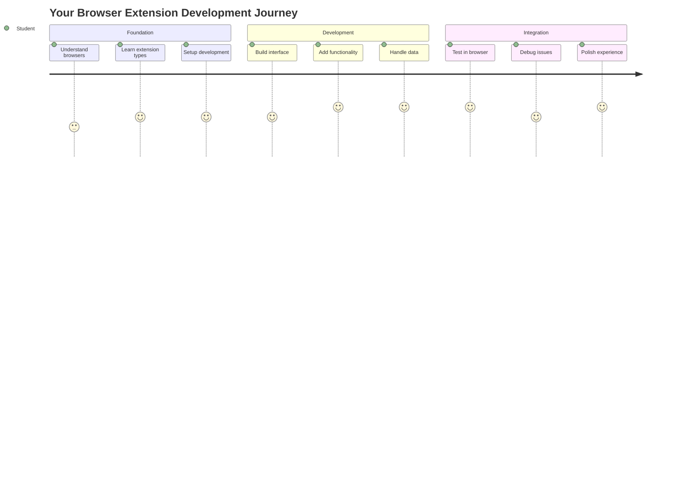
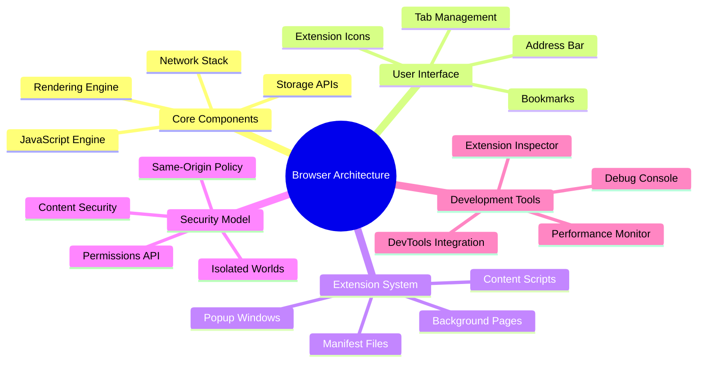
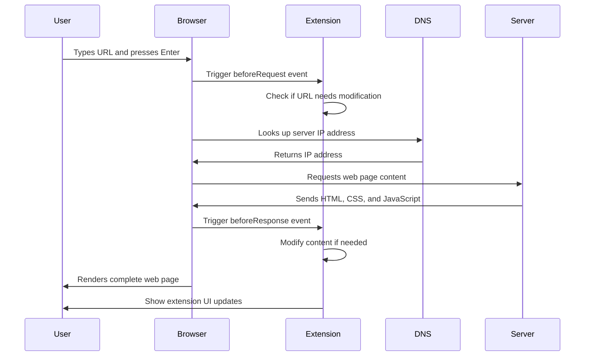
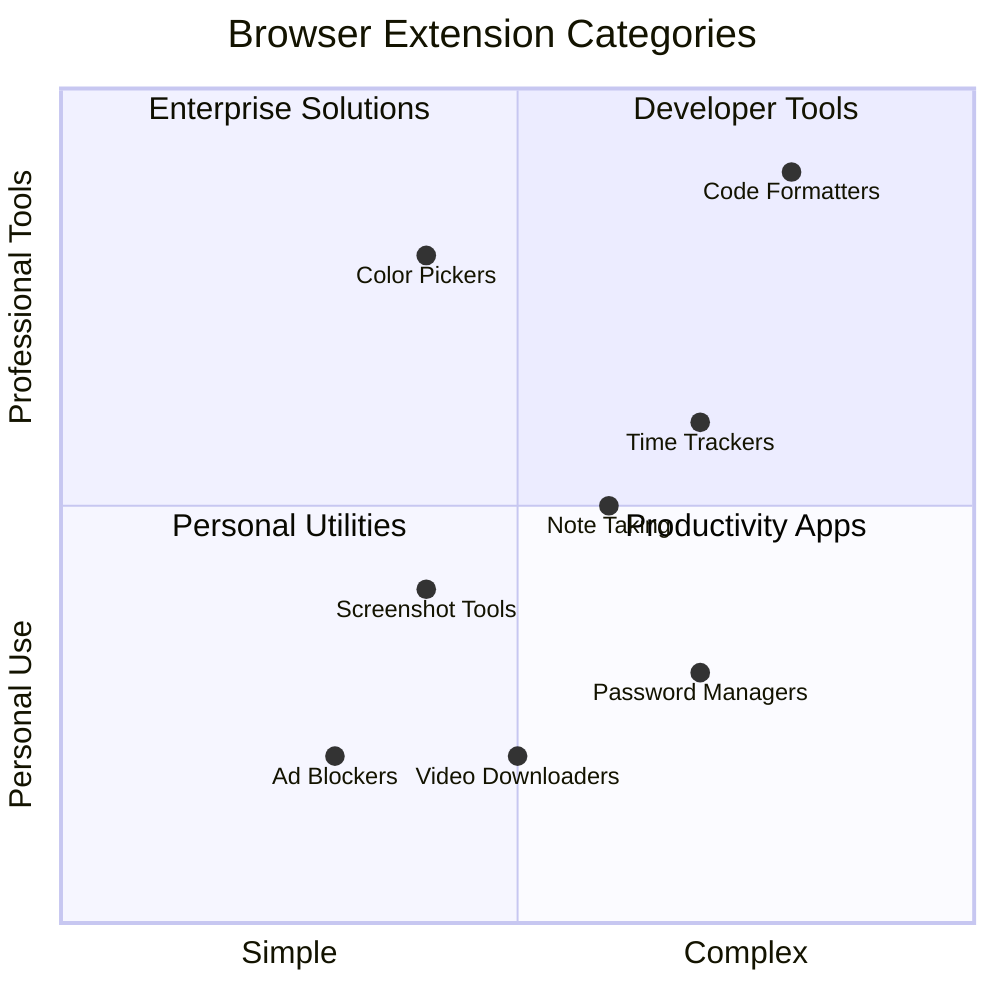
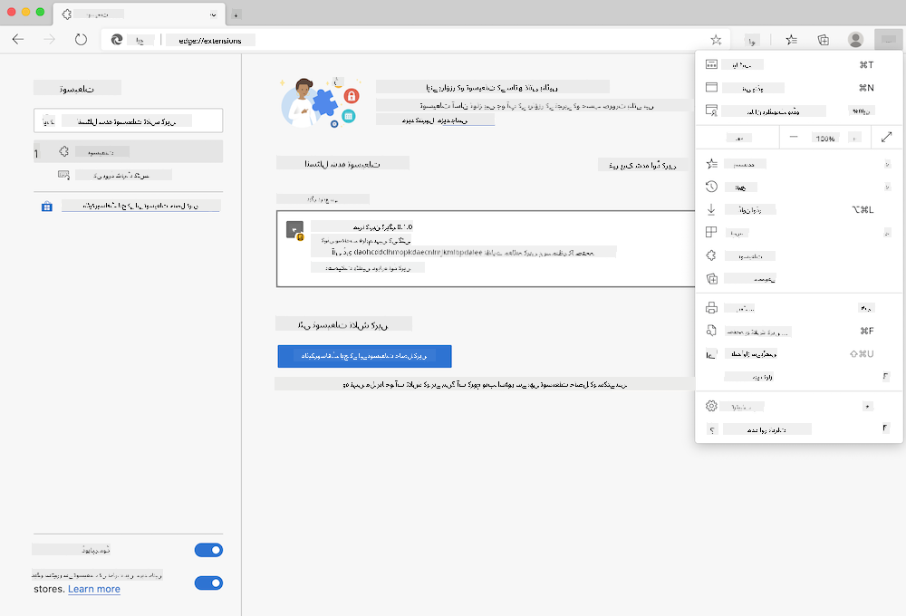
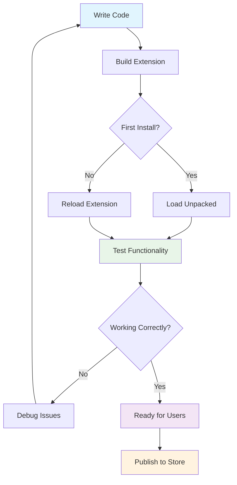
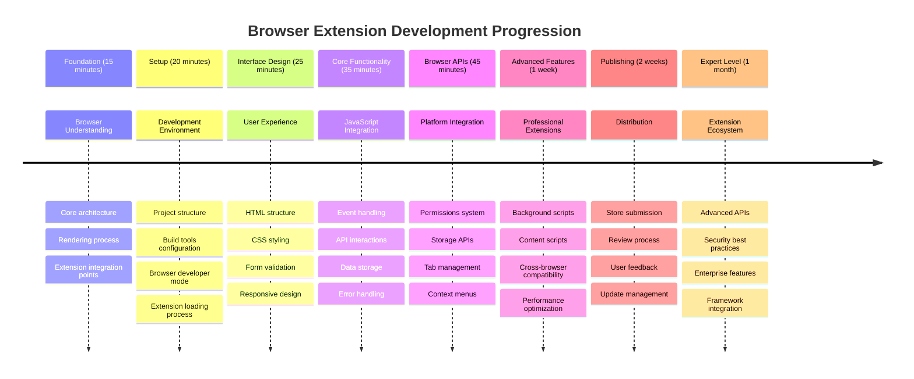

<!--
CO_OP_TRANSLATOR_METADATA:
{
  "original_hash": "00aa85715e1efd4930c17a23e3012e69",
  "translation_date": "2025-11-03T13:42:16+00:00",
  "source_file": "5-browser-extension/1-about-browsers/README.md",
  "language_code": "ur"
}
-->
# براؤزر ایکسٹینشن پروجیکٹ حصہ 1: براؤزرز کے بارے میں سب کچھ




> اسکیچ نوٹ از [وسیم چگم](https://dev.to/wassimchegham/ever-wondered-what-happens-when-you-type-in-a-url-in-an-address-bar-in-a-browser-3dob)

## لیکچر سے پہلے کا کوئز

[لیکچر سے پہلے کا کوئز](https://ff-quizzes.netlify.app/web/quiz/23)

### تعارف

براؤزر ایکسٹینشنز چھوٹے ایپلیکیشنز ہیں جو آپ کے ویب براؤزنگ تجربے کو بہتر بناتے ہیں۔ جیسے کہ ٹم برنرز لی نے انٹرایکٹو ویب کا تصور پیش کیا تھا، ایکسٹینشنز براؤزر کی صلاحیتوں کو سادہ دستاویز دیکھنے سے آگے بڑھاتے ہیں۔ پاس ورڈ مینیجرز سے لے کر جو آپ کے اکاؤنٹس کو محفوظ رکھتے ہیں، اور کلر پکرز تک جو ڈیزائنرز کو بہترین رنگ منتخب کرنے میں مدد دیتے ہیں، ایکسٹینشنز روزمرہ کے براؤزنگ مسائل حل کرتے ہیں۔

آپ کا پہلا ایکسٹینشن بنانے سے پہلے، آئیے سمجھتے ہیں کہ براؤزر کیسے کام کرتے ہیں۔ جیسے الیگزینڈر گراہم بیل کو ٹیلیفون ایجاد کرنے سے پہلے آواز کی ترسیل کو سمجھنا ضروری تھا، براؤزر کی بنیادی باتوں کو جاننا آپ کو ایسے ایکسٹینشنز بنانے میں مدد دے گا جو موجودہ براؤزر سسٹمز کے ساتھ آسانی سے ہم آہنگ ہوں۔

اس سبق کے اختتام تک، آپ براؤزر کی ساخت کو سمجھ جائیں گے اور اپنا پہلا ایکسٹینشن بنانا شروع کر چکے ہوں گے۔



## ویب براؤزرز کو سمجھنا

ویب براؤزر بنیادی طور پر ایک پیچیدہ دستاویز انٹرپریٹر ہے۔ جب آپ ایڈریس بار میں "google.com" ٹائپ کرتے ہیں، تو براؤزر ایک پیچیدہ سلسلہ وار عمل انجام دیتا ہے - دنیا بھر کے سرورز سے مواد کی درخواست کرتا ہے، پھر اس کوڈ کو انٹرایکٹو ویب صفحات میں تبدیل کرتا ہے جو آپ دیکھتے ہیں۔

یہ عمل اس طرح ہے جیسے پہلا ویب براؤزر، ورلڈ وائڈ ویب، 1990 میں ٹم برنرز لی نے ڈیزائن کیا تھا تاکہ ہائپر لنکڈ دستاویزات کو سب کے لیے قابل رسائی بنایا جا سکے۔

✅ **تھوڑا سا تاریخ کے بارے میں**: پہلا براؤزر 'ورلڈ وائڈ ویب' کہلاتا تھا اور اسے سر ٹموتھی برنرز لی نے 1990 میں بنایا تھا۔


> کچھ ابتدائی براؤزرز، از [کیرن میکگرین](https://www.slideshare.net/KMcGrane/week-4-ixd-history-personal-computing)

### براؤزرز ویب مواد کو کیسے پروسیس کرتے ہیں

ایک URL درج کرنے اور ویب صفحہ دیکھنے کے درمیان عمل میں کئی مربوط مراحل شامل ہوتے ہیں جو چند سیکنڈز میں مکمل ہو جاتے ہیں:



**یہ عمل کیا حاصل کرتا ہے:**
- **ترجمہ کرتا ہے** انسانی قابل پڑھائی URL کو DNS لوک اپ کے ذریعے سرور کے IP ایڈریس میں
- **قائم کرتا ہے** ویب سرور کے ساتھ محفوظ کنکشن HTTP یا HTTPS پروٹوکولز کا استعمال کرتے ہوئے
- **درخواست کرتا ہے** مخصوص ویب صفحہ کا مواد سرور سے
- **وصول کرتا ہے** HTML مارک اپ، CSS اسٹائلنگ، اور جاوا اسکرپٹ کوڈ سرور سے
- **رینڈر کرتا ہے** تمام مواد کو انٹرایکٹو ویب صفحہ میں جو آپ دیکھتے ہیں

### براؤزر کے بنیادی خصوصیات

جدید براؤزرز کئی خصوصیات فراہم کرتے ہیں جنہیں ایکسٹینشن ڈیولپرز استعمال کر سکتے ہیں:

| خصوصیت | مقصد | ایکسٹینشن کے مواقع |
|---------|---------|------------------------|
| **رینڈرنگ انجن** | HTML، CSS، اور جاوا اسکرپٹ دکھاتا ہے | مواد میں تبدیلی، اسٹائلنگ انجیکشن |
| **جاوا اسکرپٹ انجن** | جاوا اسکرپٹ کوڈ کو چلاتا ہے | کسٹم اسکرپٹس، API انٹریکشنز |
| **لوکل اسٹوریج** | ڈیٹا کو مقامی طور پر محفوظ کرتا ہے | صارف کی ترجیحات، کیشڈ ڈیٹا |
| **نیٹ ورک اسٹیک** | ویب درخواستوں کو ہینڈل کرتا ہے | درخواست کی نگرانی، ڈیٹا تجزیہ |
| **سیکیورٹی ماڈل** | صارفین کو نقصان دہ مواد سے محفوظ رکھتا ہے | مواد فلٹرنگ، سیکیورٹی میں بہتری |

**ان خصوصیات کو سمجھنے سے آپ کو مدد ملتی ہے:**
- **شناخت کریں** کہ آپ کا ایکسٹینشن سب سے زیادہ قدر کہاں شامل کر سکتا ہے
- **منتخب کریں** صحیح براؤزر APIs اپنے ایکسٹینشن کی فعالیت کے لیے
- **ڈیزائن کریں** ایکسٹینشنز جو براؤزر سسٹمز کے ساتھ مؤثر طریقے سے کام کرتے ہیں
- **یقینی بنائیں** کہ آپ کا ایکسٹینشن براؤزر سیکیورٹی کے بہترین اصولوں پر عمل کرتا ہے

### کراس-براؤزر ڈیولپمنٹ کے غور و فکر

مختلف براؤزرز معیارات کو تھوڑے مختلف طریقے سے نافذ کرتے ہیں، جیسے کہ مختلف پروگرامنگ زبانیں ایک ہی الگورتھم کو مختلف طریقے سے ہینڈل کر سکتی ہیں۔ کروم، فائر فاکس، اور سفاری کے اپنے منفرد خصوصیات ہیں جنہیں ایکسٹینشن ڈیولپمنٹ کے دوران مدنظر رکھنا ضروری ہے۔

> 💡 **پرو ٹپ**: [caniuse.com](https://www.caniuse.com) استعمال کریں یہ چیک کرنے کے لیے کہ کون سی ویب ٹیکنالوجیز مختلف براؤزرز میں سپورٹ کی جاتی ہیں۔ یہ آپ کے ایکسٹینشن کی خصوصیات کی منصوبہ بندی کے دوران بہت قیمتی ہے!

**ایکسٹینشن ڈیولپمنٹ کے لیے اہم غور و فکر:**
- **ٹیسٹ کریں** اپنے ایکسٹینشن کو کروم، فائر فاکس، اور ایج براؤزرز میں
- **ڈھالیں** مختلف براؤزر ایکسٹینشن APIs اور مینفسٹ فارمیٹس کے لیے
- **ہینڈل کریں** مختلف کارکردگی کی خصوصیات اور حدود
- **فراہم کریں** بیک اپس براؤزر مخصوص خصوصیات کے لیے جو دستیاب نہیں ہو سکتی ہیں

✅ **تجزیاتی بصیرت**: آپ یہ معلوم کر سکتے ہیں کہ آپ کے صارفین کون سے براؤزرز کو ترجیح دیتے ہیں، اپنے ویب ڈیولپمنٹ پروجیکٹس میں تجزیاتی پیکجز انسٹال کر کے۔ یہ ڈیٹا آپ کو یہ ترجیح دینے میں مدد دیتا ہے کہ کون سے براؤزرز کو پہلے سپورٹ کرنا ہے۔

## براؤزر ایکسٹینشنز کو سمجھنا

براؤزر ایکسٹینشنز عام ویب براؤزنگ کے مسائل کو حل کرتے ہیں، براؤزر انٹرفیس میں براہ راست فعالیت شامل کر کے۔ علیحدہ ایپلیکیشنز یا پیچیدہ ورک فلو کی ضرورت کے بجائے، ایکسٹینشنز فوری طور پر ٹولز اور خصوصیات تک رسائی فراہم کرتے ہیں۔

یہ تصور اس طرح ہے جیسے ابتدائی کمپیوٹر کے پیشرو جیسے ڈگلس اینگلبرٹ نے ٹیکنالوجی کے ذریعے انسانی صلاحیتوں کو بڑھانے کا تصور کیا تھا - ایکسٹینشنز آپ کے براؤزر کی بنیادی فعالیت کو بڑھاتے ہیں۔



**مقبول ایکسٹینشن کیٹیگریز اور ان کے فوائد:**
- **پروڈکٹیویٹی ٹولز**: ٹاسک مینیجرز، نوٹ لینے والے ایپس، اور وقت کے ٹریکرز جو آپ کو منظم رہنے میں مدد دیتے ہیں
- **سیکیورٹی میں بہتری**: پاس ورڈ مینیجرز، ایڈ بلاکرز، اور پرائیویسی ٹولز جو آپ کے ڈیٹا کی حفاظت کرتے ہیں
- **ڈیولپر ٹولز**: کوڈ فارمیٹرز، کلر پکرز، اور ڈی بگنگ یوٹیلیٹیز جو ڈیولپمنٹ کو آسان بناتے ہیں
- **مواد میں بہتری**: ریڈنگ موڈز، ویڈیو ڈاؤنلوڈرز، اور اسکرین شاٹ ٹولز جو آپ کے ویب تجربے کو بہتر بناتے ہیں

✅ **عکاسی کا سوال**: آپ کے پسندیدہ براؤزر ایکسٹینشنز کون سے ہیں؟ وہ کون سے مخصوص کام انجام دیتے ہیں، اور وہ آپ کے براؤزنگ تجربے کو کیسے بہتر بناتے ہیں؟

### 🔄 **تعلیمی چیک ان**
**براؤزر کی ساخت کو سمجھنا**: ایکسٹینشن ڈیولپمنٹ کی طرف بڑھنے سے پہلے، یقینی بنائیں کہ آپ:
- ✅ وضاحت کر سکتے ہیں کہ براؤزرز ویب درخواستوں کو کیسے پروسیس کرتے ہیں اور مواد کو کیسے رینڈر کرتے ہیں
- ✅ براؤزر کی ساخت کے اہم اجزاء کی شناخت کر سکتے ہیں
- ✅ سمجھ سکتے ہیں کہ ایکسٹینشنز براؤزر کی فعالیت کے ساتھ کیسے انضمام کرتے ہیں
- ✅ وہ سیکیورٹی ماڈل پہچان سکتے ہیں جو صارفین کی حفاظت کرتا ہے

**فوری خود ٹیسٹ**: کیا آپ URL ٹائپ کرنے سے لے کر ویب صفحہ دیکھنے تک کا راستہ بیان کر سکتے ہیں؟
1. **DNS لوک اپ** URL کو IP ایڈریس میں تبدیل کرتا ہے
2. **HTTP درخواست** سرور سے مواد حاصل کرتی ہے
3. **پارسنگ** HTML، CSS، اور جاوا اسکرپٹ کو پروسیس کرتی ہے
4. **رینڈرنگ** حتمی ویب صفحہ دکھاتی ہے
5. **ایکسٹینشنز** مواد کو کئی مراحل پر تبدیل کر سکتے ہیں

## ایکسٹینشنز انسٹال کرنا اور مینج کرنا

ایکسٹینشن انسٹالیشن کے عمل کو سمجھنا آپ کو صارف کے تجربے کی پیش گوئی کرنے میں مدد دیتا ہے جب لوگ آپ کا ایکسٹینشن انسٹال کرتے ہیں۔ انسٹالیشن کا عمل جدید براؤزرز میں معیاری ہے، انٹرفیس ڈیزائن میں معمولی فرق کے ساتھ۔



> **اہم**: جب آپ اپنے ایکسٹینشنز کی جانچ کر رہے ہوں تو ڈویلپر موڈ کو آن کریں اور دوسرے اسٹورز سے ایکسٹینشنز کی اجازت دیں۔

### ڈیولپمنٹ ایکسٹینشن انسٹالیشن کا عمل

جب آپ اپنے ایکسٹینشنز کو ڈیولپ اور ٹیسٹ کر رہے ہوں، تو اس ورک فلو کو فالو کریں:



```bash
# Step 1: Build your extension
npm run build
```

**یہ کمانڈ کیا حاصل کرتی ہے:**
- **آپ کے سورس کوڈ کو** براؤزر کے لیے تیار فائلز میں کمپائل کرتی ہے
- **جاوا اسکرپٹ ماڈیولز کو** بہتر پیکجز میں بنڈل کرتی ہے
- **حتمی ایکسٹینشن فائلز کو** `/dist` فولڈر میں جنریٹ کرتی ہے
- **آپ کے ایکسٹینشن کو** انسٹالیشن اور ٹیسٹنگ کے لیے تیار کرتی ہے

**مرحلہ 2: براؤزر ایکسٹینشنز پر جائیں**
1. **اپنے براؤزر کے** ایکسٹینشنز مینجمنٹ صفحہ کو کھولیں
2. **"سیٹنگز اور مزید" بٹن** (اوپر دائیں طرف `...` آئیکن) پر کلک کریں
3. **ڈراپ ڈاؤن مینو سے** "ایکسٹینشنز" منتخب کریں

**مرحلہ 3: اپنا ایکسٹینشن لوڈ کریں**
- **نئی انسٹالیشنز کے لیے**: `load unpacked` منتخب کریں اور اپنے `/dist` فولڈر کو منتخب کریں
- **اپ ڈیٹس کے لیے**: اپنے پہلے سے انسٹال شدہ ایکسٹینشن کے ساتھ `reload` پر کلک کریں
- **ٹیسٹنگ کے لیے**: "ڈویلپر موڈ" کو فعال کریں تاکہ اضافی ڈی بگنگ خصوصیات تک رسائی حاصل ہو

### پروڈکشن ایکسٹینشن انسٹالیشن

> ✅ **نوٹ**: یہ ڈیولپمنٹ ہدایات خاص طور پر ان ایکسٹینشنز کے لیے ہیں جو آپ خود بناتے ہیں۔ شائع شدہ ایکسٹینشنز انسٹال کرنے کے لیے، آفیشل براؤزر ایکسٹینشن اسٹورز جیسے [مائیکروسافٹ ایج ایڈ-آنز اسٹور](https://microsoftedge.microsoft.com/addons/Microsoft-Edge-Extensions-Home) پر جائیں۔

**فرق کو سمجھنا:**
- **ڈیولپمنٹ انسٹالیشنز** آپ کو ڈیولپمنٹ کے دوران غیر شائع شدہ ایکسٹینشنز کی جانچ کرنے دیتی ہیں
- **اسٹور انسٹالیشنز** تصدیق شدہ، شائع شدہ ایکسٹینشنز فراہم کرتی ہیں جن کے خودکار اپ ڈیٹس ہوتے ہیں
- **سائیڈ لوڈنگ** آپ کو آفیشل اسٹورز کے باہر سے ایکسٹینشنز انسٹال کرنے کی اجازت دیتی ہے (ڈویلپر موڈ کی ضرورت ہوتی ہے)

## اپنا کاربن فوٹ پرنٹ ایکسٹینشن بنانا

ہم ایک براؤزر ایکسٹینشن بنائیں گے جو آپ کے علاقے کی توانائی کے استعمال کے کاربن فوٹ پرنٹ کو دکھاتا ہے۔ یہ پروجیکٹ ضروری ایکسٹینشن ڈیولپمنٹ کے تصورات کو عملی ٹول کے ساتھ ماحولیاتی آگاہی کے لیے ظاہر کرتا ہے۔

یہ طریقہ "عمل کے ذریعے سیکھنے" کے اصول پر عمل کرتا ہے جو جان ڈیوی کے تعلیمی نظریات کے بعد سے مؤثر ثابت ہوا ہے - تکنیکی مہارتوں کو حقیقی دنیا کے معنی خیز ایپلیکیشنز کے ساتھ جوڑنا۔

### پروجیکٹ کی ضروریات

ڈیولپمنٹ شروع کرنے سے پہلے، آئیے مطلوبہ وسائل اور ڈیپینڈنسیز جمع کرتے ہیں:

**ضروری API رسائی:**
- **[CO2 سگنل API کلید](https://www.co2signal.com/)**: اپنا ای میل ایڈریس درج کریں تاکہ آپ کو مفت API کلید ملے
- **[علاقے کا کوڈ](http://api.electricitymap.org/v3/zones)**: اپنا علاقے کا کوڈ [الیکٹریسٹی میپ](https://www.electricitymap.org/map) کے ذریعے تلاش کریں (مثال کے طور پر، بوسٹن 'US-NEISO' استعمال کرتا ہے)

**ڈیولپمنٹ ٹولز:**
- **[Node.js اور NPM](https://www.npmjs.com)**: پروجیکٹ ڈیپینڈنسیز انسٹال کرنے کے لیے پیکج مینجمنٹ ٹول
- **[اسٹارٹر کوڈ](../../../../5-browser-extension/start)**: ڈیولپمنٹ شروع کرنے کے لیے `start` فولڈر ڈاؤنلوڈ کریں

✅ **مزید سیکھیں**: اپنے پیکج مینجمنٹ کی مہارت کو اس [جامع لرن ماڈیول](https://docs.microsoft.com/learn/modules/create-nodejs-project-dependencies/?WT.mc_id=academic-77807-sagibbon) کے ساتھ بہتر بنائیں

### پروجیکٹ کی ساخت کو سمجھنا

پروجیکٹ کی ساخت کو سمجھنا ڈیولپمنٹ کے کام کو مؤثر طریقے سے منظم کرنے میں مدد دیتا ہے۔ جیسے کہ اسکندریہ کی لائبریری کو آسان علم کی بازیافت کے لیے منظم کیا گیا تھا، ایک اچھی طرح سے منظم کوڈ بیس ڈیولپمنٹ کو زیادہ مؤثر بناتا ہے:

```
project-root/
├── dist/                    # Built extension files
│   ├── manifest.json        # Extension configuration
│   ├── index.html           # User interface markup
│   ├── background.js        # Background script functionality
│   └── main.js              # Compiled JavaScript bundle
├── src/                     # Source development files
│   └── index.js             # Your main JavaScript code
├── package.json             # Project dependencies and scripts
└── webpack.config.js        # Build configuration
```

**ہر فائل کیا حاصل کرتی ہے:**
- **`manifest.json`**: **تعریف کرتا ہے** ایکسٹینشن میٹا ڈیٹا، اجازتیں، اور انٹری پوائنٹس
- **`index.html`**: **بناتا ہے** صارف انٹرفیس جو صارفین آپ کے ایکسٹینشن پر کلک کرتے وقت دیکھتے ہیں
- **`background.js`**: **ہینڈل کرتا ہے** بیک گراؤنڈ ٹاسکس اور براؤزر ایونٹ لسٹنرز
- **`main.js`**: **شامل کرتا ہے** حتمی بنڈل جاوا اسکرپٹ بلڈ پروسیس کے بعد
- **`src/index.js`**: **رکھتا ہے** آپ کا بنیادی ڈیولپمنٹ کوڈ جو `main.js` میں کمپائل ہوتا ہے

> 💡 **تنظیمی ٹپ**: اپنے API کلید اور علاقے کے کوڈ کو محفوظ نوٹ میں اسٹور کریں تاکہ ڈیولپمنٹ کے دوران آسان حوالہ کے لیے۔ آپ کو ان اقدار کی ضرورت ہوگی تاکہ اپنے ایکسٹینشن کی فعالیت کو ٹیسٹ کریں۔

✅ **سیکیورٹی نوٹ**: کبھی بھی API کلید یا حساس اسناد کو اپنے کوڈ ریپوزیٹری میں کمیٹ نہ کریں۔ ہم آپ کو اگلے مراحل میں دکھائیں گے کہ انہیں محفوظ طریقے سے کیسے ہینڈل کریں۔

## ایکسٹینشن انٹرفیس بنانا

اب ہم صارف انٹرفیس کے اجزاء بنائیں گے۔ ایکسٹینشن دو اسکرین اپروچ استعمال کرتا ہے: ابتدائی سیٹ اپ کے لیے کنفیگریشن اسکرین اور ڈیٹا ڈسپلے کے لیے نتائج کی اسکرین۔

یہ انٹرفیس ڈیزائن میں استعمال ہونے والے ترقی پسند انکشاف کے اصول پر عمل کرتا ہے، کمپیوٹنگ کے ابتدائی دنوں سے - معلومات اور اختیارات کو منطقی ترتیب میں ظاہر کرنا تاکہ صارفین کو مغلوب نہ کیا جائے۔

### ایکسٹینشن ویوز کا جائزہ

**سیٹ اپ ویو** - پہلی بار صارف کنفیگریشن:
![مکمل ایکسٹین
1. **چلائیں** بلڈ کمانڈ تاکہ آپ کا کوڈ کمپائل ہو سکے  
2. **لوڈ کریں** ایکسٹینشن کو اپنے براؤزر میں ڈیولپر موڈ استعمال کرتے ہوئے  
3. **تصدیق کریں** کہ فارم صحیح طریقے سے دکھائی دے رہا ہے اور پیشہ ورانہ لگ رہا ہے  
4. **چیک کریں** کہ تمام فارم عناصر صحیح طریقے سے ترتیب دیے گئے ہیں اور کام کر رہے ہیں  

**آپ نے کیا حاصل کیا:**  
- **بنیادی HTML ڈھانچہ بنایا** اپنے ایکسٹینشن کے لیے  
- **تشکیل اور نتائج کے انٹرفیس تیار کیے** مناسب سیمینٹک مارک اپ کے ساتھ  
- **جدید ڈیولپمنٹ ورک فلو سیٹ اپ کیا** انڈسٹری کے معیاری ٹولز استعمال کرتے ہوئے  
- **بنیاد تیار کی** انٹرایکٹو جاوا اسکرپٹ فنکشنلٹی شامل کرنے کے لیے  

### 🔄 **تعلیمی جائزہ**  
**ایکسٹینشن ڈیولپمنٹ کی پیش رفت**: آگے بڑھنے سے پہلے اپنی سمجھ کی تصدیق کریں:  
- ✅ کیا آپ پروجیکٹ اسٹرکچر میں ہر فائل کے مقصد کو بیان کر سکتے ہیں؟  
- ✅ کیا آپ سمجھتے ہیں کہ بلڈ پروسیس آپ کے سورس کوڈ کو کیسے تبدیل کرتا ہے؟  
- ✅ ہم کیوں تشکیل اور نتائج کو مختلف UI سیکشنز میں تقسیم کرتے ہیں؟  
- ✅ فارم کا ڈھانچہ استعمال اور رسائی کو کیسے سپورٹ کرتا ہے؟  

**ڈیولپمنٹ ورک فلو کی سمجھ**: اب آپ کو یہ کرنے کے قابل ہونا چاہیے:  
1. **ترمیم کریں** HTML اور CSS اپنے ایکسٹینشن انٹرفیس کے لیے  
2. **چلائیں** بلڈ کمانڈ تاکہ آپ کی تبدیلیاں کمپائل ہو سکیں  
3. **دوبارہ لوڈ کریں** ایکسٹینشن کو اپنے براؤزر میں اپڈیٹس ٹیسٹ کرنے کے لیے  
4. **ڈی بگ کریں** مسائل کو براؤزر ڈیولپر ٹولز استعمال کرتے ہوئے  

آپ نے براؤزر ایکسٹینشن ڈیولپمنٹ کے پہلے مرحلے کو مکمل کر لیا ہے۔ جیسے رائٹ برادرز کو پرواز حاصل کرنے سے پہلے ایروڈائنامکس کو سمجھنا ضروری تھا، ان بنیادی تصورات کو سمجھنا آپ کو اگلے سبق میں مزید پیچیدہ انٹرایکٹو فیچرز بنانے کے لیے تیار کرتا ہے۔  

## GitHub Copilot Agent Challenge 🚀  

ایجنٹ موڈ استعمال کریں اور درج ذیل چیلنج مکمل کریں:  

**تفصیل:** براؤزر ایکسٹینشن کو بہتر بنائیں اور فارم ویلیڈیشن اور یوزر فیڈبیک فیچرز شامل کریں تاکہ API کیز اور ریجن کوڈز داخل کرتے وقت یوزر کے تجربے کو بہتر بنایا جا سکے۔  

**پرومپٹ:** جاوا اسکرپٹ ویلیڈیشن فنکشنز بنائیں جو چیک کریں کہ آیا API کیز فیلڈ میں کم از کم 20 کریکٹرز ہیں اور ریجن کوڈ صحیح فارمیٹ (جیسے 'US-NEISO') کے مطابق ہے۔ ویژول فیڈبیک شامل کریں تاکہ درست ان پٹ کے لیے بارڈر کا رنگ سبز ہو اور غلط ان پٹ کے لیے سرخ ہو۔ سیکیورٹی کے لیے API کیز کو شو/ہائڈ کرنے کا فیچر بھی شامل کریں۔  

[ایجنٹ موڈ کے بارے میں مزید جانیں](https://code.visualstudio.com/blogs/2025/02/24/introducing-copilot-agent-mode) یہاں۔  

## 🚀 چیلنج  

براؤزر ایکسٹینشن اسٹور پر جائیں اور ایک ایکسٹینشن انسٹال کریں۔ آپ اس کی فائلز کو دلچسپ طریقوں سے جانچ سکتے ہیں۔ آپ کیا دریافت کرتے ہیں؟  

## لیکچر کے بعد کا کوئز  

[لیکچر کے بعد کا کوئز](https://ff-quizzes.netlify.app/web/quiz/24)  

## جائزہ اور خود مطالعہ  

اس سبق میں آپ نے ویب براؤزر کی تاریخ کے بارے میں تھوڑا سا سیکھا؛ اس موقع کو استعمال کریں اور ورلڈ وائڈ ویب کے موجدوں نے اس کے استعمال کے بارے میں کیا تصور کیا تھا، اس کی تاریخ کے بارے میں مزید پڑھیں۔ کچھ مفید سائٹس شامل ہیں:  

[ویب براؤزرز کی تاریخ](https://www.mozilla.org/firefox/browsers/browser-history/)  

[ویب کی تاریخ](https://webfoundation.org/about/vision/history-of-the-web/)  

[ٹم برنرز لی کے ساتھ ایک انٹرویو](https://www.theguardian.com/technology/2019/mar/12/tim-berners-lee-on-30-years-of-the-web-if-we-dream-a-little-we-can-get-the-web-we-want)  

### ⚡ **اگلے 5 منٹ میں آپ کیا کر سکتے ہیں**  
- [ ] کروم/ایج ایکسٹینشنز پیج کھولیں (chrome://extensions) اور دیکھیں کہ آپ نے کیا انسٹال کیا ہے  
- [ ] اپنے براؤزر کے ڈیولپر ٹولز نیٹ ورک ٹیب کو دیکھیں جب کوئی ویب پیج لوڈ ہو رہا ہو  
- [ ] پیج سورس دیکھنے کی کوشش کریں (Ctrl+U) تاکہ HTML ڈھانچہ دیکھ سکیں  
- [ ] کسی بھی ویب پیج عنصر کا معائنہ کریں اور اس کے CSS کو ڈیولپر ٹولز میں تبدیل کریں  

### 🎯 **آپ اس گھنٹے میں کیا حاصل کر سکتے ہیں**  
- [ ] لیکچر کے بعد کا کوئز مکمل کریں اور براؤزر کے بنیادی اصولوں کو سمجھیں  
- [ ] براؤزر ایکسٹینشن کے لیے ایک بنیادی manifest.json فائل بنائیں  
- [ ] ایک سادہ "ہیلو ورلڈ" ایکسٹینشن بنائیں جو ایک پاپ اپ دکھائے  
- [ ] اپنے ایکسٹینشن کو ڈیولپر موڈ میں لوڈ کرنے کا ٹیسٹ کریں  
- [ ] اپنے ہدف براؤزر کے لیے ایکسٹینشن دستاویزات کو دریافت کریں  

### 📅 **آپ کا ہفتہ بھر کا ایکسٹینشن سفر**  
- [ ] ایک مکمل فنکشنل براؤزر ایکسٹینشن بنائیں جو حقیقی افادیت فراہم کرے  
- [ ] مواد اسکرپٹس، بیک گراؤنڈ اسکرپٹس، اور پاپ اپ انٹریکشنز کے بارے میں سیکھیں  
- [ ] براؤزر APIs جیسے اسٹوریج، ٹیبز، اور میسجنگ کو ماسٹر کریں  
- [ ] اپنے ایکسٹینشن کے لیے یوزر فرینڈلی انٹرفیس ڈیزائن کریں  
- [ ] مختلف ویب سائٹس اور منظرناموں میں اپنے ایکسٹینشن کا ٹیسٹ کریں  
- [ ] اپنے ایکسٹینشن کو براؤزر کے ایکسٹینشن اسٹور میں شائع کریں  

### 🌟 **آپ کا مہینہ بھر کا براؤزر ڈیولپمنٹ**  
- [ ] مختلف یوزر مسائل حل کرنے والے متعدد ایکسٹینشنز بنائیں  
- [ ] ایڈوانس براؤزر APIs اور سیکیورٹی بہترین طریقوں کے بارے میں سیکھیں  
- [ ] اوپن سورس براؤزر ایکسٹینشن پروجیکٹس میں تعاون کریں  
- [ ] کراس براؤزر کمپٹیبلٹی اور پروگریسو انہانسمنٹ کو ماسٹر کریں  
- [ ] دوسرے ڈیولپرز کے لیے ایکسٹینشن ڈیولپمنٹ ٹولز اور ٹیمپلیٹس بنائیں  
- [ ] براؤزر ایکسٹینشن کے ماہر بنیں جو دوسرے ڈیولپرز کی مدد کرے  

## 🎯 آپ کا براؤزر ایکسٹینشن مہارت کا ٹائم لائن  


  
### 🛠️ آپ کے ایکسٹینشن ڈیولپمنٹ ٹول کٹ کا خلاصہ  

اس سبق کو مکمل کرنے کے بعد، آپ کے پاس اب ہے:  
- **براؤزر آرکیٹیکچر کا علم**: رینڈرنگ انجنز، سیکیورٹی ماڈلز، اور ایکسٹینشن انٹیگریشن کی سمجھ  
- **ڈیولپمنٹ ماحول**: جدید ٹول چین Webpack، NPM، اور ڈی بگنگ صلاحیتوں کے ساتھ  
- **UI/UX بنیاد**: سیمینٹک HTML ڈھانچہ پروگریسو ڈسکلوزر پیٹرنز کے ساتھ  
- **سیکیورٹی آگاہی**: براؤزر پرمیشنز اور محفوظ ڈیولپمنٹ طریقوں کی سمجھ  
- **کراس براؤزر تصورات**: کمپٹیبلٹی کے پہلوؤں اور ٹیسٹنگ کے طریقوں کا علم  
- **API انٹیگریشن**: بیرونی ڈیٹا سورسز کے ساتھ کام کرنے کی بنیاد  
- **پیشہ ورانہ ورک فلو**: انڈسٹری کے معیاری ڈیولپمنٹ اور ٹیسٹنگ طریقے  

**حقیقی دنیا کی ایپلیکیشنز**: یہ مہارتیں براہ راست لاگو ہوتی ہیں:  
- **ویب ڈیولپمنٹ**: سنگل پیج ایپلیکیشنز اور پروگریسو ویب ایپس  
- **ڈیسک ٹاپ ایپلیکیشنز**: الیکٹران اور ویب بیسڈ ڈیسک ٹاپ سافٹ ویئر  
- **موبائل ڈیولپمنٹ**: ہائبرڈ ایپس اور ویب بیسڈ موبائل سلوشنز  
- **انٹرپرائز ٹولز**: اندرونی پروڈکٹیویٹی ایپلیکیشنز اور ورک فلو آٹومیشن  
- **اوپن سورس**: براؤزر ایکسٹینشن پروجیکٹس اور ویب اسٹینڈرڈز میں تعاون  

**اگلا مرحلہ**: آپ انٹرایکٹو فنکشنلٹی شامل کرنے، براؤزر APIs کے ساتھ کام کرنے، اور ایسے ایکسٹینشنز بنانے کے لیے تیار ہیں جو حقیقی یوزر مسائل حل کریں!  

## اسائنمنٹ  

[اپنے ایکسٹینشن کو دوبارہ ڈیزائن کریں](assignment.md)  

---

**ڈسکلیمر**:  
یہ دستاویز AI ترجمہ سروس [Co-op Translator](https://github.com/Azure/co-op-translator) کا استعمال کرتے ہوئے ترجمہ کی گئی ہے۔ ہم درستگی کے لیے کوشش کرتے ہیں، لیکن براہ کرم آگاہ رہیں کہ خودکار ترجمے میں غلطیاں یا غیر درستیاں ہو سکتی ہیں۔ اصل دستاویز کو اس کی اصل زبان میں مستند ذریعہ سمجھا جانا چاہیے۔ اہم معلومات کے لیے، پیشہ ور انسانی ترجمہ کی سفارش کی جاتی ہے۔ ہم اس ترجمے کے استعمال سے پیدا ہونے والی کسی بھی غلط فہمی یا غلط تشریح کے ذمہ دار نہیں ہیں۔