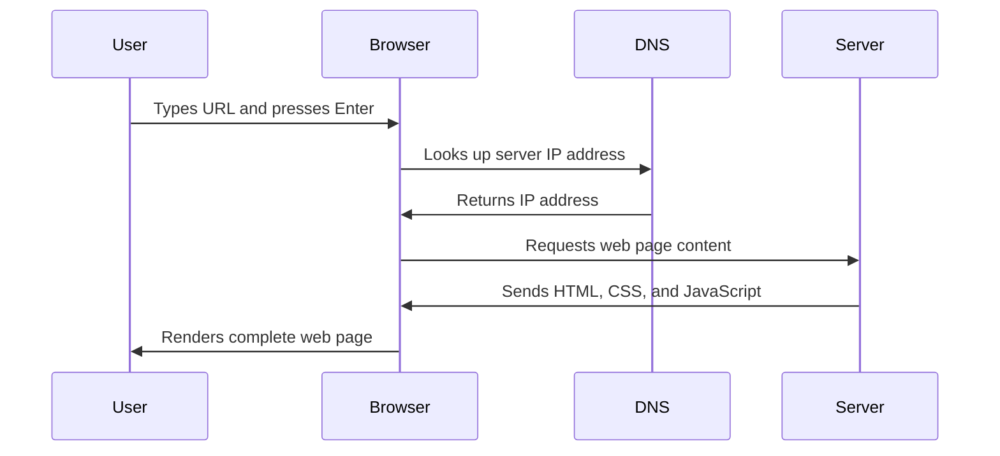

<!--
CO_OP_TRANSLATOR_METADATA:
{
  "original_hash": "33a875c522f237a2026e4653240dfc07",
  "translation_date": "2025-10-22T15:15:33+00:00",
  "source_file": "5-browser-extension/1-about-browsers/README.md",
  "language_code": "ur"
}
-->
# براؤزر ایکسٹینشن پروجیکٹ حصہ 1: براؤزرز کے بارے میں سب کچھ


> اسکیچ نوٹ از [وسیم چگم](https://dev.to/wassimchegham/ever-wondered-what-happens-when-you-type-in-a-url-in-an-address-bar-in-a-browser-3dob)

## لیکچر سے پہلے کا کوئز

[لیکچر سے پہلے کا کوئز](https://ff-quizzes.netlify.app/web/quiz/23)

### تعارف

براؤزر ایکسٹینشنز چھوٹے ایپلیکیشنز ہیں جو آپ کے ویب براؤزنگ تجربے کو بہتر بناتی ہیں۔ جیسے کہ ٹم برنرز لی نے انٹرایکٹو ویب کا تصور پیش کیا تھا، ایکسٹینشنز براؤزر کی صلاحیتوں کو سادہ دستاویز دیکھنے سے آگے بڑھاتی ہیں۔ پاس ورڈ مینیجرز سے لے کر جو آپ کے اکاؤنٹس کو محفوظ رکھتے ہیں، اور کلر پکرز تک جو ڈیزائنرز کو بہترین رنگ حاصل کرنے میں مدد دیتے ہیں، ایکسٹینشنز روزمرہ کے براؤزنگ مسائل حل کرتی ہیں۔

پہلا ایکسٹینشن بنانے سے پہلے، آئیے سمجھتے ہیں کہ براؤزرز کیسے کام کرتے ہیں۔ جیسے الیگزینڈر گراہم بیل کو ٹیلیفون ایجاد کرنے سے پہلے آواز کی ترسیل کو سمجھنا ضروری تھا، براؤزر کی بنیادی باتوں کو جاننا آپ کو ایسے ایکسٹینشنز بنانے میں مدد دے گا جو موجودہ براؤزر سسٹمز کے ساتھ آسانی سے ہم آہنگ ہوں۔

اس سبق کے اختتام تک، آپ براؤزر کی ساخت کو سمجھ جائیں گے اور اپنا پہلا ایکسٹینشن بنانا شروع کر دیں گے۔

## ویب براؤزرز کو سمجھنا

ویب براؤزر بنیادی طور پر ایک پیچیدہ دستاویز انٹرپریٹر ہے۔ جب آپ ایڈریس بار میں "google.com" ٹائپ کرتے ہیں، تو براؤزر ایک پیچیدہ سلسلہ وار عمل انجام دیتا ہے - دنیا بھر کے سرورز سے مواد کی درخواست کرتا ہے، پھر اس کوڈ کو انٹرایکٹو ویب صفحات میں تبدیل کرتا ہے جو آپ دیکھتے ہیں۔

یہ عمل اس طرح ہے جیسے پہلا ویب براؤزر، ورلڈ وائڈ ویب، 1990 میں ٹم برنرز لی نے بنایا تھا تاکہ ہائپر لنکڈ دستاویزات کو سب کے لیے قابل رسائی بنایا جا سکے۔

✅ **تھوڑا سا تاریخ کا علم**: پہلا براؤزر 'ورلڈ وائڈ ویب' کہلاتا تھا اور اسے سر ٹموتھی برنرز لی نے 1990 میں بنایا تھا۔


> کچھ ابتدائی براؤزرز، از [کیرن میکگرین](https://www.slideshare.net/KMcGrane/week-4-ixd-history-personal-computing)

### براؤزرز ویب مواد کو کیسے پروسیس کرتے ہیں

ایک URL درج کرنے اور ویب صفحہ دیکھنے کے درمیان عمل میں کئی مربوط مراحل شامل ہوتے ہیں جو سیکنڈوں میں مکمل ہو جاتے ہیں:



**یہ عمل کیا حاصل کرتا ہے:**
- **ترجمہ کرتا ہے** انسانی قابل پڑھائی URL کو DNS لوک اپ کے ذریعے سرور IP ایڈریس میں
- **قائم کرتا ہے** ویب سرور کے ساتھ ایک محفوظ کنکشن HTTP یا HTTPS پروٹوکولز کا استعمال کرتے ہوئے
- **درخواست کرتا ہے** مخصوص ویب صفحہ مواد سرور سے
- **وصول کرتا ہے** HTML مارک اپ، CSS اسٹائلنگ، اور جاوا اسکرپٹ کوڈ سرور سے
- **رینڈر کرتا ہے** تمام مواد کو انٹرایکٹو ویب صفحہ میں جو آپ دیکھتے ہیں

### براؤزر کی بنیادی خصوصیات

جدید براؤزرز کئی خصوصیات فراہم کرتے ہیں جنہیں ایکسٹینشن ڈیولپرز استعمال کر سکتے ہیں:

| خصوصیت | مقصد | ایکسٹینشن کے مواقع |
|---------|---------|------------------------|
| **رینڈرنگ انجن** | HTML، CSS، اور جاوا اسکرپٹ کو دکھاتا ہے | مواد میں ترمیم، اسٹائلنگ انجیکشن |
| **جاوا اسکرپٹ انجن** | جاوا اسکرپٹ کوڈ کو چلاتا ہے | کسٹم اسکرپٹس، API انٹریکشن |
| **لوکل اسٹوریج** | ڈیٹا کو مقامی طور پر محفوظ کرتا ہے | صارف کی ترجیحات، کیشڈ ڈیٹا |
| **نیٹ ورک اسٹیک** | ویب درخواستوں کو ہینڈل کرتا ہے | درخواست کی نگرانی، ڈیٹا تجزیہ |
| **سیکیورٹی ماڈل** | صارفین کو نقصان دہ مواد سے محفوظ رکھتا ہے | مواد فلٹرنگ، سیکیورٹی میں بہتری |

**ان خصوصیات کو سمجھنے سے آپ کو مدد ملتی ہے:**
- **شناخت کریں** کہ آپ کا ایکسٹینشن سب سے زیادہ قدر کہاں شامل کر سکتا ہے
- **منتخب کریں** صحیح براؤزر APIs اپنے ایکسٹینشن کی فعالیت کے لیے
- **ڈیزائن کریں** ایکسٹینشنز جو براؤزر سسٹمز کے ساتھ مؤثر طریقے سے کام کریں
- **یقینی بنائیں** کہ آپ کا ایکسٹینشن براؤزر سیکیورٹی کے بہترین طریقوں پر عمل کرتا ہے

### کراس-براؤزر ڈیولپمنٹ کے غور و فکر

مختلف براؤزرز معیارات کو تھوڑے مختلف طریقے سے نافذ کرتے ہیں، جیسے مختلف پروگرامنگ زبانیں ایک ہی الگورتھم کو مختلف طریقے سے ہینڈل کر سکتی ہیں۔ کروم، فائر فاکس، اور سفاری کے اپنے منفرد خصوصیات ہیں جنہیں ایکسٹینشن ڈیولپمنٹ کے دوران مدنظر رکھنا ضروری ہے۔

> 💡 **پرو ٹپ**: [caniuse.com](https://www.caniuse.com) استعمال کریں تاکہ معلوم ہو سکے کہ کون سی ویب ٹیکنالوجیز مختلف براؤزرز میں سپورٹ کی جاتی ہیں۔ یہ آپ کے ایکسٹینشن کی خصوصیات کی منصوبہ بندی کے دوران بہت قیمتی ہے!

**ایکسٹینشن ڈیولپمنٹ کے لیے اہم غور و فکر:**
- **ٹیسٹ کریں** اپنے ایکسٹینشن کو کروم، فائر فاکس، اور ایج براؤزرز میں
- **مطابقت کریں** مختلف براؤزر ایکسٹینشن APIs اور مینفسٹ فارمیٹس کے ساتھ
- **ہینڈل کریں** مختلف براؤزرز کی کارکردگی کی خصوصیات اور حدود
- **فراہم کریں** براؤزر مخصوص خصوصیات کے لیے متبادل جو دستیاب نہیں ہو سکتی ہیں

✅ **تجزیاتی بصیرت**: آپ اپنے ویب ڈیولپمنٹ پروجیکٹس میں تجزیاتی پیکجز انسٹال کر کے یہ معلوم کر سکتے ہیں کہ آپ کے صارفین کون سے براؤزرز کو ترجیح دیتے ہیں۔ یہ ڈیٹا آپ کو یہ ترجیح دینے میں مدد دیتا ہے کہ پہلے کون سے براؤزرز کو سپورٹ کرنا ہے۔

## براؤزر ایکسٹینشنز کو سمجھنا

براؤزر ایکسٹینشنز عام ویب براؤزنگ کے مسائل کو حل کرتے ہیں اور براہ راست براؤزر انٹرفیس میں فعالیت شامل کرتے ہیں۔ الگ ایپلیکیشنز یا پیچیدہ ورک فلو کی ضرورت کے بجائے، ایکسٹینشنز فوری طور پر ٹولز اور خصوصیات تک رسائی فراہم کرتے ہیں۔

یہ تصور اس طرح ہے جیسے ابتدائی کمپیوٹر کے پیشرو جیسے ڈگلس اینگلبرٹ نے انسانی صلاحیتوں کو ٹیکنالوجی کے ساتھ بڑھانے کا تصور کیا تھا - ایکسٹینشنز آپ کے براؤزر کی بنیادی فعالیت کو بڑھاتے ہیں۔

**مقبول ایکسٹینشن کیٹیگریز اور ان کے فوائد:**
- **پروڈکٹیویٹی ٹولز**: ٹاسک مینیجرز، نوٹ لینے والے ایپس، اور وقت کے ٹریکرز جو آپ کو منظم رہنے میں مدد دیتے ہیں
- **سیکیورٹی میں بہتری**: پاس ورڈ مینیجرز، ایڈ بلاکرز، اور پرائیویسی ٹولز جو آپ کے ڈیٹا کی حفاظت کرتے ہیں
- **ڈیولپر ٹولز**: کوڈ فارمیٹرز، کلر پکرز، اور ڈی بگنگ یوٹیلیٹیز جو ڈیولپمنٹ کو آسان بناتے ہیں
- **مواد میں بہتری**: ریڈنگ موڈز، ویڈیو ڈاؤنلوڈرز، اور اسکرین شاٹ ٹولز جو آپ کے ویب تجربے کو بہتر بناتے ہیں

✅ **عکاسی کا سوال**: آپ کے پسندیدہ براؤزر ایکسٹینشنز کون سے ہیں؟ وہ کون سے مخصوص کام انجام دیتے ہیں، اور وہ آپ کے براؤزنگ تجربے کو کیسے بہتر بناتے ہیں؟

## ایکسٹینشنز انسٹال کرنا اور مینج کرنا

ایکسٹینشن انسٹالیشن کے عمل کو سمجھنا آپ کو صارف کے تجربے کی پیش گوئی کرنے میں مدد دیتا ہے جب لوگ آپ کا ایکسٹینشن انسٹال کرتے ہیں۔ انسٹالیشن کا عمل جدید براؤزرز میں معیاری ہے، انٹرفیس ڈیزائن میں معمولی فرق کے ساتھ۔


> **اہم**: جب آپ اپنے ایکسٹینشنز کی جانچ کر رہے ہوں تو ڈویلپر موڈ کو آن کریں اور دوسرے اسٹورز سے ایکسٹینشنز کی اجازت دیں۔

### ڈیولپمنٹ ایکسٹینشن انسٹالیشن کا عمل

جب آپ اپنے ایکسٹینشنز کو ڈیولپ اور ٹیسٹ کر رہے ہوں، تو اس ورک فلو پر عمل کریں:

```bash
# Step 1: Build your extension
npm run build
```

**یہ کمانڈ کیا حاصل کرتی ہے:**
- **کمپائل کرتی ہے** آپ کے سورس کوڈ کو براؤزر کے لیے تیار فائلز میں
- **بنڈل کرتی ہے** جاوا اسکرپٹ ماڈیولز کو بہتر پیکجز میں
- **جنریٹ کرتی ہے** حتمی ایکسٹینشن فائلز `/dist` فولڈر میں
- **تیار کرتی ہے** آپ کے ایکسٹینشن کو انسٹالیشن اور ٹیسٹنگ کے لیے

**مرحلہ 2: براؤزر ایکسٹینشنز پر جائیں**
1. **کھولیں** اپنے براؤزر کا ایکسٹینشنز مینجمنٹ صفحہ
2. **کلک کریں** "سیٹنگز اور مزید" بٹن (اوپر دائیں جانب `...` آئیکن)
3. **منتخب کریں** "ایکسٹینشنز" ڈراپ ڈاؤن مینو سے

**مرحلہ 3: اپنا ایکسٹینشن لوڈ کریں**
- **نئی انسٹالیشنز کے لیے**: `load unpacked` منتخب کریں اور اپنے `/dist` فولڈر کو منتخب کریں
- **اپ ڈیٹس کے لیے**: اپنے پہلے سے انسٹال شدہ ایکسٹینشن کے ساتھ `reload` پر کلک کریں
- **ٹیسٹنگ کے لیے**: "ڈویلپر موڈ" کو فعال کریں تاکہ اضافی ڈی بگنگ خصوصیات تک رسائی حاصل ہو

### پروڈکشن ایکسٹینشن انسٹالیشن

> ✅ **نوٹ**: یہ ڈیولپمنٹ ہدایات خاص طور پر ان ایکسٹینشنز کے لیے ہیں جو آپ خود بناتے ہیں۔ شائع شدہ ایکسٹینشنز انسٹال کرنے کے لیے، آفیشل براؤزر ایکسٹینشن اسٹورز پر جائیں جیسے [مائیکروسافٹ ایج ایڈ-آنز اسٹور](https://microsoftedge.microsoft.com/addons/Microsoft-Edge-Extensions-Home)۔

**فرق کو سمجھنا:**
- **ڈیولپمنٹ انسٹالیشنز** آپ کو غیر شائع شدہ ایکسٹینشنز کو ڈیولپمنٹ کے دوران ٹیسٹ کرنے دیتی ہیں
- **اسٹور انسٹالیشنز** تصدیق شدہ، شائع شدہ ایکسٹینشنز فراہم کرتی ہیں جن کے خودکار اپ ڈیٹس ہوتے ہیں
- **سائیڈ لوڈنگ** آپ کو آفیشل اسٹورز کے باہر سے ایکسٹینشنز انسٹال کرنے کی اجازت دیتی ہے (ڈویلپر موڈ کی ضرورت ہوتی ہے)

## اپنا کاربن فوٹ پرنٹ ایکسٹینشن بنانا

ہم ایک براؤزر ایکسٹینشن بنائیں گے جو آپ کے علاقے کے توانائی کے استعمال کے کاربن فوٹ پرنٹ کو ظاہر کرے گا۔ یہ پروجیکٹ ضروری ایکسٹینشن ڈیولپمنٹ کے تصورات کو ظاہر کرتا ہے جبکہ ماحولیاتی آگاہی کے لیے ایک عملی ٹول بناتا ہے۔

یہ طریقہ "عمل کے ذریعے سیکھنے" کے اصول کی پیروی کرتا ہے جو جان ڈیوی کے تعلیمی نظریات کے بعد سے مؤثر ثابت ہوا ہے - تکنیکی مہارتوں کو بامعنی حقیقی دنیا کی ایپلیکیشنز کے ساتھ جوڑنا۔

### پروجیکٹ کی ضروریات

ڈیولپمنٹ شروع کرنے سے پہلے، آئیے مطلوبہ وسائل اور ڈیپینڈنسیز جمع کریں:

**ضروری API رسائی:**
- **[CO2 سگنل API کلید](https://www.co2signal.com/)**: اپنا ای میل ایڈریس درج کریں تاکہ آپ کو مفت API کلید ملے
- **[علاقے کا کوڈ](http://api.electricitymap.org/v3/zones)**: اپنا علاقے کا کوڈ [الیکٹریسٹی میپ](https://www.electricitymap.org/map) کے ذریعے تلاش کریں (مثال کے طور پر، بوسٹن 'US-NEISO' استعمال کرتا ہے)

**ڈیولپمنٹ ٹولز:**
- **[Node.js اور NPM](https://www.npmjs.com)**: پیکج مینجمنٹ ٹول پروجیکٹ ڈیپینڈنسیز انسٹال کرنے کے لیے
- **[اسٹارٹر کوڈ](../../../../5-browser-extension/start)**: `start` فولڈر ڈاؤنلوڈ کریں تاکہ ڈیولپمنٹ شروع کی جا سکے

✅ **مزید جانیں**: اپنے پیکج مینجمنٹ کی مہارت کو اس [جامع لرن ماڈیول](https://docs.microsoft.com/learn/modules/create-nodejs-project-dependencies/?WT.mc_id=academic-77807-sagibbon) کے ساتھ بہتر بنائیں

### پروجیکٹ کی ساخت کو سمجھنا

پروجیکٹ کی ساخت کو سمجھنا ڈیولپمنٹ کے کام کو مؤثر طریقے سے منظم کرنے میں مدد دیتا ہے۔ جیسے کہ اسکندریہ کی لائبریری آسان علم کی بازیابی کے لیے منظم کی گئی تھی، ایک اچھی طرح سے منظم کوڈ بیس ڈیولپمنٹ کو زیادہ مؤثر بناتا ہے:

```
project-root/
├── dist/                    # Built extension files
│   ├── manifest.json        # Extension configuration
│   ├── index.html           # User interface markup
│   ├── background.js        # Background script functionality
│   └── main.js              # Compiled JavaScript bundle
└── src/                     # Source development files
    └── index.js             # Your main JavaScript code
```

**ہر فائل کیا حاصل کرتی ہے:**
- **`manifest.json`**: **تعریف کرتا ہے** ایکسٹینشن میٹا ڈیٹا، اجازتیں، اور انٹری پوائنٹس
- **`index.html`**: **بناتا ہے** صارف انٹرفیس جو صارفین آپ کے ایکسٹینشن پر کلک کرتے وقت دیکھتے ہیں
- **`background.js`**: **ہینڈل کرتا ہے** پس منظر کے کام اور براؤزر ایونٹ لسٹنرز
- **`main.js`**: **رکھتا ہے** حتمی بنڈل شدہ جاوا اسکرپٹ بلڈ پروسیس کے بعد
- **`src/index.js`**: **رکھتا ہے** آپ کا بنیادی ڈیولپمنٹ کوڈ جو `main.js` میں کمپائل ہوتا ہے

> 💡 **تنظیمی ٹپ**: اپنے API کلید اور علاقے کے کوڈ کو محفوظ نوٹ میں محفوظ کریں تاکہ ڈیولپمنٹ کے دوران آسان حوالہ کے لیے۔ آپ کو ان اقدار کی ضرورت ہوگی تاکہ اپنے ایکسٹینشن کی فعالیت کو ٹیسٹ کر سکیں۔

✅ **سیکیورٹی نوٹ**: کبھی بھی API کلید یا حساس اسناد کو اپنے کوڈ ریپوزیٹری میں شامل نہ کریں۔ ہم آپ کو اگلے مراحل میں دکھائیں گے کہ انہیں محفوظ طریقے سے کیسے ہینڈل کریں۔

## ایکسٹینشن انٹرفیس بنانا

اب ہم صارف انٹرفیس کے اجزاء بنائیں گے۔ ایکسٹینشن دو اسکرین اپروچ استعمال کرتا ہے: ابتدائی سیٹ اپ کے لیے کنفیگریشن اسکرین اور ڈیٹا ڈسپلے کے لیے نتائج کی اسکرین۔

یہ کمپیوٹنگ کے ابتدائی دنوں سے انٹرفیس ڈیزائن میں استعمال ہونے والے ترقی پسند انکشاف کے اصول کی پیروی کرتا ہے - صارفین کو مغلوب کرنے سے بچانے کے لیے معلومات اور اختیارات کو منطقی ترتیب میں ظاہر کرنا۔

### ایکسٹینشن ویوز کا جائزہ

**سیٹ اپ ویو** - پہلی بار صارف کنفیگریشن:


**نتائج ویو** - کاربن فوٹ پرنٹ ڈیٹا ڈسپلے:


### کنفیگریشن فارم بنانا

سیٹ اپ فارم ابتدائی استعمال کے دوران صارف کنفیگریشن ڈیٹا جمع کرتا ہے۔ ایک بار کنفیگریشن ہو جانے کے بعد، یہ معلومات براؤزر اسٹوریج میں مستقبل کے سیشنز کے لیے برقرار رہتی ہے۔

`/dist/index.html` فائل میں، یہ فارم اسٹرکچر شامل کریں:

```html
<form class="form-data" autocomplete="on">
    <div>
        <h2>New? Add your Information</h2>
    </div>
    <div>
        <label for="region">Region Name</label>
        <input type="text" id="region" required class="region-name" />
    </div>
    <div>
        <label for="api">Your API Key from tmrow</label>
        <input type="text" id="api" required class="api-key" />
    </div>
    <button class="search-btn">Submit</button>
</form>
```

**یہ فارم کیا حاصل کرتا ہے:**
- **بناتا ہے** ایک سیمینٹک فارم اسٹرکچر مناسب لیبلز اور ان پٹ ایسوسی ایشنز کے ساتھ
- **فعال کرتا ہے** براؤزر آٹو کمپلیٹ فعالیت بہتر صارف تجربے کے لیے
- **ضروری بناتا ہے** دونوں فیلڈز کو جمع کرانے سے پہلے بھرنا `required` ایٹریبیوٹ کا استعمال کرتے ہوئے
- **منظم کرتا ہے** ان پٹس کو وضاحتی کلاس ناموں کے ساتھ آسان اسٹائل
**تفصیل:** براؤزر ایکسٹینشن کو بہتر بنائیں اور فارم کی تصدیق اور صارف کی رائے کے فیچرز شامل کریں تاکہ API کیز اور ریجن کوڈز داخل کرتے وقت صارف کے تجربے کو بہتر بنایا جا سکے۔

**ہدایت:** جاوا اسکرپٹ کی تصدیقی فنکشنز بنائیں جو چیک کریں کہ آیا API کیز کا فیلڈ کم از کم 20 حروف پر مشتمل ہے اور ریجن کوڈ صحیح فارمیٹ (جیسے 'US-NEISO') کے مطابق ہے۔ بصری رائے شامل کریں، جیسے کہ درست ان پٹ کے لیے بارڈر کا رنگ سبز اور غلط ان پٹ کے لیے سرخ کر دیں۔ ساتھ ہی ایک ٹوگل فیچر شامل کریں تاکہ سیکیورٹی کے لیے API کیز کو دکھایا یا چھپایا جا سکے۔

[ایجنٹ موڈ](https://code.visualstudio.com/blogs/2025/02/24/introducing-copilot-agent-mode) کے بارے میں مزید جانیں۔

## 🚀 چیلنج

براؤزر ایکسٹینشن اسٹور پر جائیں اور ایک ایکسٹینشن اپنے براؤزر میں انسٹال کریں۔ آپ اس کے فائلز کو دلچسپ طریقوں سے جانچ سکتے ہیں۔ آپ کیا دریافت کرتے ہیں؟

## لیکچر کے بعد کا کوئز

[لیکچر کے بعد کا کوئز](https://ff-quizzes.netlify.app/web/quiz/24)

## جائزہ اور خود مطالعہ

اس سبق میں آپ نے ویب براؤزر کی تاریخ کے بارے میں تھوڑا سا سیکھا؛ اس موقع کو استعمال کریں اور ورلڈ وائڈ ویب کے موجدین نے اس کے استعمال کے بارے میں کیا تصور کیا تھا، اس کی تاریخ کے بارے میں مزید پڑھیں۔ کچھ مفید سائٹس شامل ہیں:

[ویب براؤزرز کی تاریخ](https://www.mozilla.org/firefox/browsers/browser-history/)

[ویب کی تاریخ](https://webfoundation.org/about/vision/history-of-the-web/)

[ٹم برنرز-لی کے ساتھ ایک انٹرویو](https://www.theguardian.com/technology/2019/mar/12/tim-berners-lee-on-30-years-of-the-web-if-we-dream-a-little-we-can-get-the-web-we-want)

## اسائنمنٹ 

[اپنے ایکسٹینشن کو دوبارہ اسٹائل کریں](assignment.md)

---

**ڈسکلیمر**:  
یہ دستاویز AI ترجمہ سروس [Co-op Translator](https://github.com/Azure/co-op-translator) کا استعمال کرتے ہوئے ترجمہ کی گئی ہے۔ ہم درستگی کے لیے کوشش کرتے ہیں، لیکن براہ کرم آگاہ رہیں کہ خودکار ترجمے میں غلطیاں یا غیر درستیاں ہو سکتی ہیں۔ اصل دستاویز کو اس کی اصل زبان میں مستند ذریعہ سمجھا جانا چاہیے۔ اہم معلومات کے لیے، پیشہ ور انسانی ترجمہ کی سفارش کی جاتی ہے۔ ہم اس ترجمے کے استعمال سے پیدا ہونے والی کسی بھی غلط فہمی یا غلط تشریح کے ذمہ دار نہیں ہیں۔