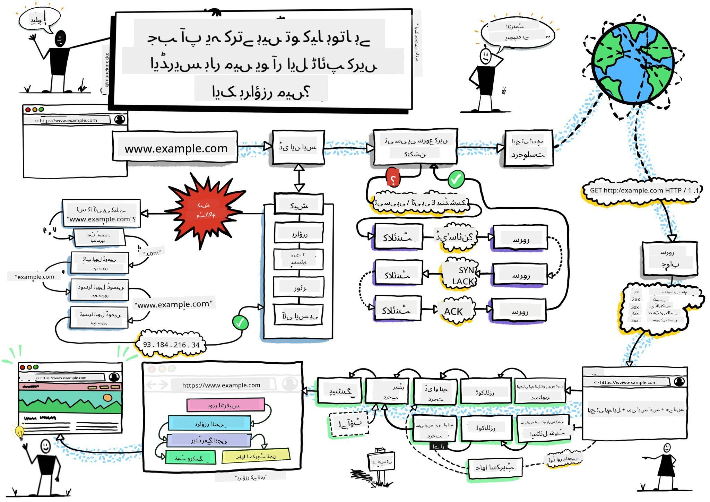
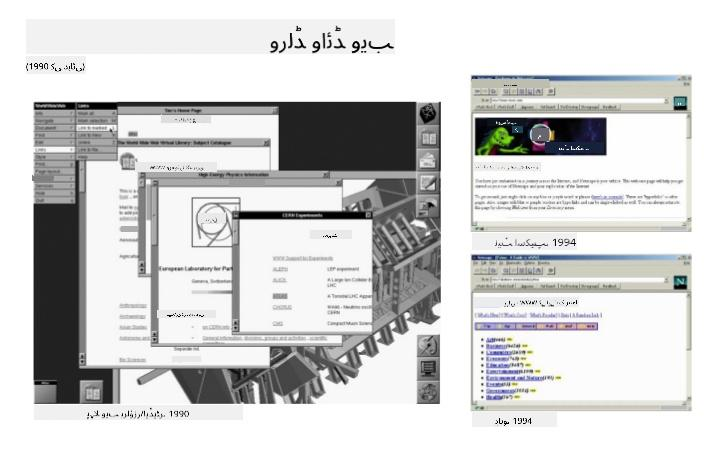
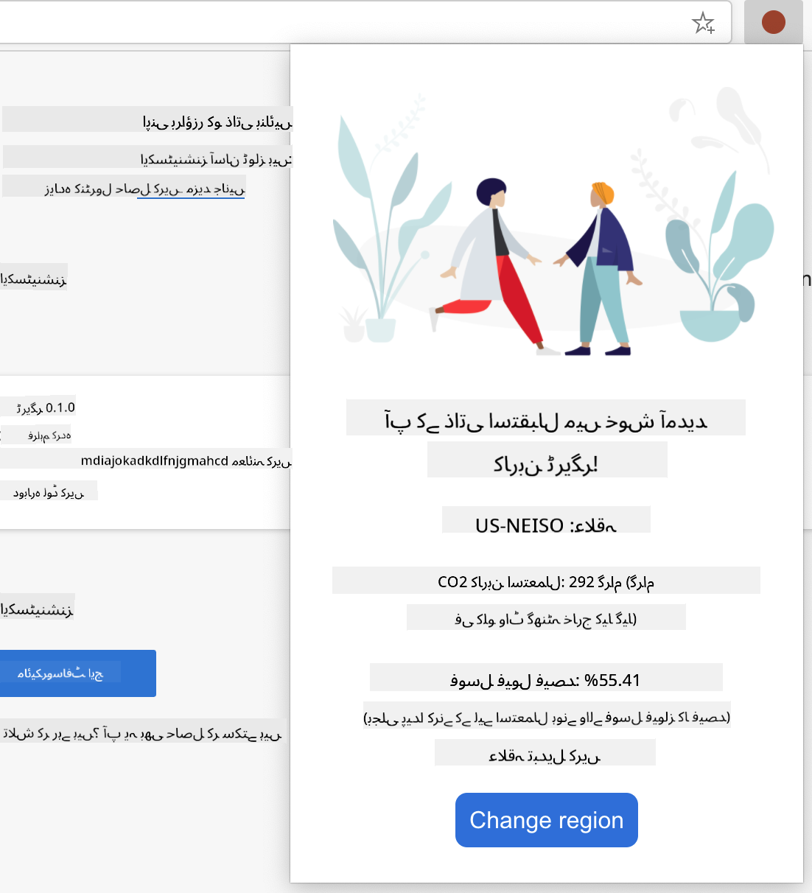

<!--
CO_OP_TRANSLATOR_METADATA:
{
  "original_hash": "3f97452b78978031a401791449feaa06",
  "translation_date": "2025-10-20T20:59:34+00:00",
  "source_file": "5-browser-extension/1-about-browsers/README.md",
  "language_code": "ur"
}
-->
# براؤزر ایکسٹینشن پروجیکٹ حصہ 1: براؤزرز کے بارے میں سب کچھ


> اسکیچ نوٹ از [وسیم چگم](https://dev.to/wassimchegham/ever-wondered-what-happens-when-you-type-in-a-url-in-an-address-bar-in-a-browser-3dob)

## لیکچر سے پہلے کا کوئز

[لیکچر سے پہلے کا کوئز](https://ff-quizzes.netlify.app/web/quiz/23)

### تعارف

براؤزر ایکسٹینشنز براؤزر میں اضافی خصوصیات شامل کرتی ہیں۔ لیکن ایک بنانے سے پہلے، آپ کو تھوڑا سا سیکھنا چاہیے کہ براؤزرز اپنا کام کیسے کرتے ہیں۔

### براؤزر کے بارے میں

ان اسباق کی سیریز میں، آپ سیکھیں گے کہ ایک براؤزر ایکسٹینشن کیسے بنائی جائے جو کروم، فائر فاکس اور ایج براؤزرز پر کام کرے۔ اس حصے میں، آپ دریافت کریں گے کہ براؤزرز کیسے کام کرتے ہیں اور براؤزر ایکسٹینشن کے عناصر کو ترتیب دیں گے۔

لیکن براؤزر اصل میں کیا ہے؟ یہ ایک سافٹ ویئر ایپلیکیشن ہے جو صارف کو سرور سے مواد حاصل کرنے اور ویب صفحات پر دکھانے کی اجازت دیتی ہے۔

✅ تھوڑی سی تاریخ: پہلا براؤزر 'WorldWideWeb' کہلاتا تھا اور اسے سر ٹموتھی برنرز لی نے 1990 میں بنایا تھا۔


> کچھ ابتدائی براؤزرز، بذریعہ [کیرن میکگرین](https://www.slideshare.net/KMcGrane/week-4-ixd-history-personal-computing)

جب کوئی صارف URL (یونیفارم ریسورس لوکیٹر) ایڈریس استعمال کرتے ہوئے انٹرنیٹ سے جڑتا ہے، عام طور پر Hypertext Transfer Protocol کے ذریعے `http` یا `https` ایڈریس استعمال کرتے ہوئے، براؤزر ویب سرور سے رابطہ کرتا ہے اور ویب صفحہ حاصل کرتا ہے۔

اس وقت، براؤزر کا رینڈرنگ انجن اسے صارف کے ڈیوائس پر دکھاتا ہے، جو موبائل فون، ڈیسک ٹاپ، یا لیپ ٹاپ ہو سکتا ہے۔

براؤزرز میں مواد کو کیش کرنے کی صلاحیت بھی ہوتی ہے تاکہ اسے ہر بار سرور سے حاصل نہ کرنا پڑے۔ وہ صارف کی براؤزنگ سرگرمی کی تاریخ کو ریکارڈ کر سکتے ہیں، 'کوکیز' اسٹور کر سکتے ہیں، جو چھوٹے ڈیٹا کے ٹکڑے ہوتے ہیں جو صارف کی سرگرمی کو اسٹور کرنے کے لیے معلومات پر مشتمل ہوتے ہیں، اور مزید۔

براؤزرز کے بارے میں ایک بہت اہم بات یاد رکھنے کی ہے کہ وہ سب ایک جیسے نہیں ہیں! ہر براؤزر کی اپنی طاقتیں اور کمزوریاں ہوتی ہیں، اور ایک پیشہ ور ویب ڈویلپر کو یہ سمجھنا ضروری ہے کہ ویب صفحات کو کراس-براؤزر پر اچھی کارکردگی کیسے دی جائے۔ اس میں موبائل فون جیسے چھوٹے ویوپورٹس کو سنبھالنا شامل ہے، اور ایک صارف جو آف لائن ہے۔

ایک بہت مفید ویب سائٹ جسے آپ شاید اپنے پسندیدہ براؤزر میں بک مارک کرنا چاہیں گے وہ ہے [caniuse.com](https://www.caniuse.com)۔ جب آپ ویب صفحات بنا رہے ہوں، تو caniuse کی سپورٹڈ ٹیکنالوجیز کی فہرستیں استعمال کرنا بہت مددگار ہوتا ہے تاکہ آپ اپنے صارفین کو بہترین سپورٹ فراہم کر سکیں۔

✅ آپ کیسے جان سکتے ہیں کہ آپ کی ویب سائٹ کے صارفین کے لیے کون سے براؤزر سب سے زیادہ مقبول ہیں؟ اپنی اینالیٹکس چیک کریں - آپ اپنے ویب ڈویلپمنٹ پروسیس کے حصے کے طور پر مختلف اینالیٹکس پیکجز انسٹال کر سکتے ہیں، اور وہ آپ کو بتائیں گے کہ مختلف مشہور براؤزرز کے ذریعے کون سے براؤزر سب سے زیادہ استعمال ہوتے ہیں۔

## براؤزر ایکسٹینشنز

آپ براؤزر ایکسٹینشن کیوں بنانا چاہیں گے؟ یہ ایک آسان چیز ہے جو آپ کے براؤزر سے منسلک ہوتی ہے جب آپ کو ان کاموں تک جلدی رسائی کی ضرورت ہوتی ہے جو آپ بار بار کرتے ہیں۔ مثال کے طور پر، اگر آپ کو مختلف ویب صفحات پر رنگ چیک کرنے کی ضرورت ہوتی ہے جن کے ساتھ آپ تعامل کرتے ہیں، تو آپ ایک کلر-پکر براؤزر ایکسٹینشن انسٹال کر سکتے ہیں۔ اگر آپ کو پاس ورڈ یاد رکھنے میں مشکل ہوتی ہے، تو آپ پاس ورڈ-مینجمنٹ براؤزر ایکسٹینشن استعمال کر سکتے ہیں۔

براؤزر ایکسٹینشنز بنانا بھی مزے کا کام ہے۔ وہ محدود تعداد میں کاموں کو سنبھالتے ہیں جنہیں وہ اچھی طرح انجام دیتے ہیں۔

✅ آپ کے پسندیدہ براؤزر ایکسٹینشنز کون سے ہیں؟ وہ کون سے کام انجام دیتے ہیں؟

### ایکسٹینشنز انسٹال کرنا

بنانا شروع کرنے سے پہلے، براؤزر ایکسٹینشن بنانے اور تعینات کرنے کے عمل پر ایک نظر ڈالیں۔ اگرچہ ہر براؤزر اس کام کو سنبھالنے میں تھوڑا مختلف ہوتا ہے، لیکن کروم اور فائر فاکس پر یہ عمل ایج کے اس مثال سے ملتا جلتا ہے:


> نوٹ: یقینی بنائیں کہ ڈویلپر موڈ کو آن کریں اور دوسرے اسٹورز سے ایکسٹینشن کی اجازت دیں۔

بنیادی طور پر، عمل یہ ہوگا:

- اپنی ایکسٹینشن کو `npm run build` استعمال کرتے ہوئے بنائیں
- براؤزر میں "سیٹنگز اور مزید" بٹن (اوپر دائیں جانب `...` آئیکن) کا استعمال کرتے ہوئے ایکسٹینشنز پین پر جائیں
- اگر یہ ایک نئی انسٹالیشن ہے، تو `load unpacked` منتخب کریں تاکہ اس کے بلڈ فولڈر (ہمارے کیس میں یہ `/dist` ہے) سے ایک نئی ایکسٹینشن اپلوڈ کریں
- یا، اگر آپ پہلے سے انسٹال شدہ ایکسٹینشن کو دوبارہ لوڈ کر رہے ہیں تو `reload` پر کلک کریں

✅ یہ ہدایات ان ایکسٹینشنز کے لیے ہیں جو آپ خود بناتے ہیں؛ ان ایکسٹینشنز کو انسٹال کرنے کے لیے جو ہر براؤزر سے منسلک براؤزر ایکسٹینشن اسٹور پر جاری کی گئی ہیں، آپ کو ان [اسٹورز](https://microsoftedge.microsoft.com/addons/Microsoft-Edge-Extensions-Home) پر جانا چاہیے اور اپنی پسند کی ایکسٹینشن انسٹال کرنی چاہیے۔

### شروع کریں

آپ ایک براؤزر ایکسٹینشن بنانے جا رہے ہیں جو آپ کے علاقے کے کاربن فوٹ پرنٹ کو ظاہر کرے گا، آپ کے علاقے کی توانائی کے استعمال اور توانائی کے ذرائع کو دکھائے گا۔ ایکسٹینشن میں ایک فارم ہوگا جو API کلید جمع کرے گا تاکہ آپ CO2 Signal کی API تک رسائی حاصل کر سکیں۔

**آپ کو ضرورت ہے:**

- [ایک API کلید](https://www.co2signal.com/); اس صفحے پر اپنے ای میل کو باکس میں درج کریں اور آپ کو ایک کلید بھیجی جائے گی
- [آپ کے علاقے کا کوڈ](http://api.electricitymap.org/v3/zones) جو [Electricity Map](https://www.electricitymap.org/map) سے مطابقت رکھتا ہو (مثال کے طور پر، بوسٹن میں، میں 'US-NEISO' استعمال کرتا ہوں)۔
- [اسٹارٹر کوڈ](../../../../5-browser-extension/start)۔ `start` فولڈر ڈاؤن لوڈ کریں؛ آپ اس فولڈر میں کوڈ مکمل کریں گے۔
- [NPM](https://www.npmjs.com) - NPM ایک پیکج مینجمنٹ ٹول ہے؛ اسے مقامی طور پر انسٹال کریں اور آپ کے `package.json` فائل میں درج پیکجز آپ کے ویب اثاثے کے لیے انسٹال ہو جائیں گے۔

✅ پیکج مینجمنٹ کے بارے میں مزید جانیں اس [شاندار لرن ماڈیول](https://docs.microsoft.com/learn/modules/create-nodejs-project-dependencies/?WT.mc_id=academic-77807-sagibbon) میں۔

کوڈ بیس کو دیکھنے کے لیے ایک منٹ نکالیں:

dist
    -|manifest.json (ڈیفالٹس یہاں سیٹ کیے گئے ہیں)
    -|index.html (فرنٹ اینڈ HTML مارک اپ یہاں)
    -|background.js (بیک گراؤنڈ JS یہاں)
    -|main.js (بلٹ JS)
src
    -|index.js (آپ کا JS کوڈ یہاں جائے گا)

✅ ایک بار جب آپ کے پاس اپنی API کلید اور ریجن کوڈ دستیاب ہو، تو انہیں مستقبل میں استعمال کے لیے کسی نوٹ میں محفوظ کریں۔

### ایکسٹینشن کے لیے HTML بنائیں

اس ایکسٹینشن کے دو ویوز ہیں۔ ایک API کلید اور ریجن کوڈ جمع کرنے کے لیے:


اور دوسرا ریجن کے کاربن استعمال کو ظاہر کرنے کے لیے:



آئیے فارم کے لیے HTML بنانا شروع کریں اور اسے CSS کے ساتھ اسٹائل کریں۔

`/dist` فولڈر میں، آپ ایک فارم اور ایک نتیجہ کا علاقہ بنائیں گے۔ `index.html` فائل میں، فارم کے علاقے کو پُر کریں:

```HTML
<form class="form-data" autocomplete="on">
	<div>
		<h2>New? Add your Information</h2>
	</div>
	<div>
		<label for="region">Region Name</label>
		<input type="text" id="region" required class="region-name" />
	</div>
	<div>
		<label for="api">Your API Key from tmrow</label>
		<input type="text" id="api" required class="api-key" />
	</div>
	<button class="search-btn">Submit</button>
</form>	
```
یہ وہ فارم ہے جہاں آپ کی محفوظ کردہ معلومات کو ان پٹ کیا جائے گا اور مقامی اسٹوریج میں محفوظ کیا جائے گا۔

اگلا، نتائج کا علاقہ بنائیں؛ آخری فارم ٹیگ کے نیچے کچھ divs شامل کریں:

```HTML
<div class="result">
	<div class="loading">loading...</div>
	<div class="errors"></div>
	<div class="data"></div>
	<div class="result-container">
		<p><strong>Region: </strong><span class="my-region"></span></p>
		<p><strong>Carbon Usage: </strong><span class="carbon-usage"></span></p>
		<p><strong>Fossil Fuel Percentage: </strong><span class="fossil-fuel"></span></p>
	</div>
	<button class="clear-btn">Change region</button>
</div>
```
اس وقت، آپ ایک بلڈ آزما سکتے ہیں۔ اس ایکسٹینشن کے پیکج ڈیپینڈنسیز کو انسٹال کرنا یقینی بنائیں:

```
npm install
```

یہ کمانڈ npm، نود پیکج مینیجر، کو آپ کی ایکسٹینشن کے بلڈ پروسیس کے لیے ویب پیک انسٹال کرنے کے لیے استعمال کرے گی۔ آپ اس عمل کے آؤٹ پٹ کو `/dist/main.js` میں دیکھ سکتے ہیں - آپ دیکھیں گے کہ کوڈ بنڈل ہو چکا ہے۔

فی الحال، ایکسٹینشن کو بلڈ ہونا چاہیے اور، اگر آپ اسے ایج میں ایکسٹینشن کے طور پر تعینات کریں، تو آپ ایک فارم کو صاف طور پر دکھتا ہوا دیکھیں گے۔

مبارک ہو، آپ نے براؤزر ایکسٹینشن بنانے کے لیے پہلا قدم اٹھا لیا ہے۔ اگلے اسباق میں، آپ اسے مزید فعال اور مفید بنائیں گے۔

## GitHub Copilot ایجنٹ چیلنج 🚀

ایجنٹ موڈ استعمال کریں تاکہ درج ذیل چیلنج مکمل کریں:

**تفصیل:** براؤزر ایکسٹینشن کو بہتر بنائیں تاکہ فارم کی توثیق اور صارف کی رائے کی خصوصیات شامل کی جا سکیں تاکہ API کلید اور ریجن کوڈز داخل کرتے وقت صارف کے تجربے کو بہتر بنایا جا سکے۔

**پرومپٹ:** جاوا اسکرپٹ توثیق کے فنکشنز بنائیں جو چیک کریں کہ آیا API کلید فیلڈ میں کم از کم 20 حروف ہیں اور آیا ریجن کوڈ صحیح فارمیٹ پر عمل کرتا ہے (جیسے 'US-NEISO')۔ بصری رائے شامل کریں، درست ان پٹس کے لیے بارڈر کے رنگ کو سبز میں تبدیل کریں اور غلط ان پٹس کے لیے سرخ میں۔ سیکیورٹی کے مقصد کے لیے API کلید کو دکھانے/چھپانے کی خصوصیت بھی شامل کریں۔

---

## 🚀 چیلنج

براؤزر ایکسٹینشن اسٹور پر ایک نظر ڈالیں اور ایک کو اپنے براؤزر میں انسٹال کریں۔ آپ اس کی فائلوں کو دلچسپ طریقوں سے جانچ سکتے ہیں۔ آپ کیا دریافت کرتے ہیں؟

## لیکچر کے بعد کا کوئز

[لیکچر کے بعد کا کوئز](https://ff-quizzes.netlify.app/web/quiz/24)

## جائزہ اور خود مطالعہ

اس سبق میں آپ نے ویب براؤزر کی تاریخ کے بارے میں تھوڑا سا سیکھا؛ اس موقع کا فائدہ اٹھائیں اور ورلڈ وائڈ ویب کے موجدوں نے اس کے استعمال کے بارے میں کیا تصور کیا تھا، اس کی تاریخ کے بارے میں مزید پڑھیں۔ کچھ مفید سائٹس شامل ہیں:

[ویب براؤزرز کی تاریخ](https://www.mozilla.org/firefox/browsers/browser-history/)

[ویب کی تاریخ](https://webfoundation.org/about/vision/history-of-the-web/)

[ٹم برنرز لی کے ساتھ ایک انٹرویو](https://www.theguardian.com/technology/2019/mar/12/tim-berners-lee-on-30-years-of-the-web-if-we-dream-a-little-we-can-get-the-web-we-want)

## اسائنمنٹ 

[اپنی ایکسٹینشن کو دوبارہ اسٹائل کریں](assignment.md)

---

**ڈسکلیمر**:  
یہ دستاویز AI ترجمہ سروس [Co-op Translator](https://github.com/Azure/co-op-translator) کا استعمال کرتے ہوئے ترجمہ کی گئی ہے۔ ہم درستگی کے لیے کوشش کرتے ہیں، لیکن براہ کرم آگاہ رہیں کہ خودکار ترجمے میں غلطیاں یا غیر درستیاں ہو سکتی ہیں۔ اصل دستاویز کو اس کی اصل زبان میں مستند ذریعہ سمجھا جانا چاہیے۔ اہم معلومات کے لیے، پیشہ ور انسانی ترجمہ کی سفارش کی جاتی ہے۔ ہم اس ترجمے کے استعمال سے پیدا ہونے والی کسی بھی غلط فہمی یا غلط تشریح کے ذمہ دار نہیں ہیں۔