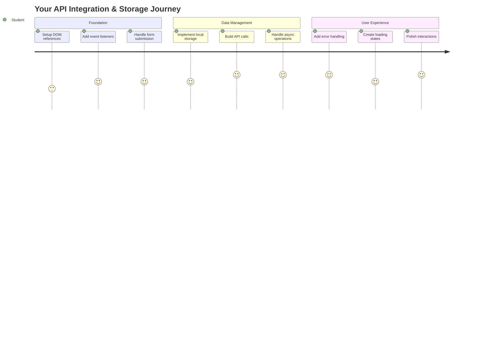
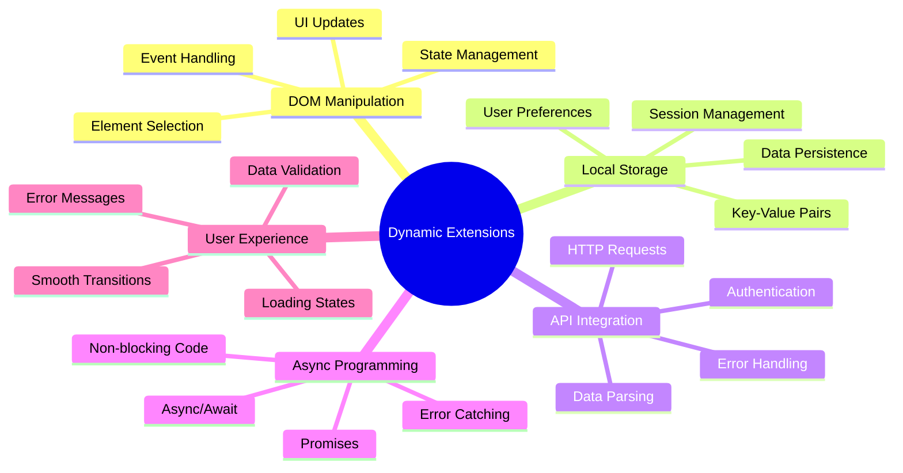
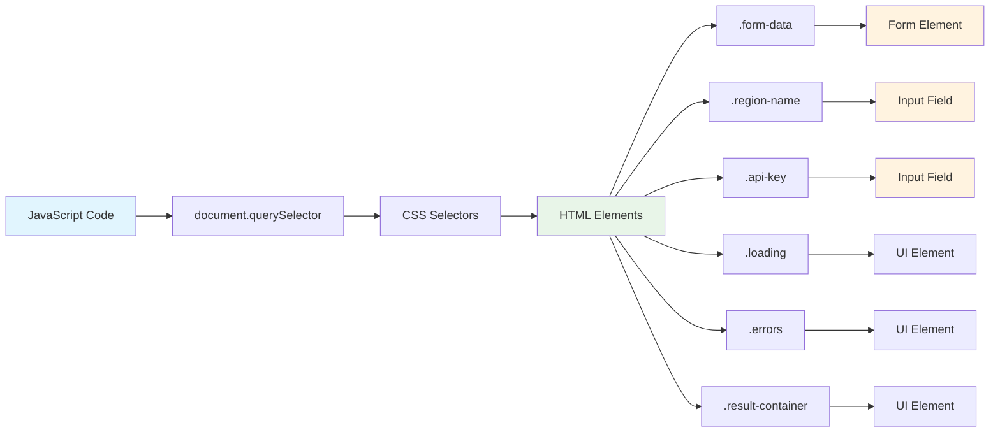
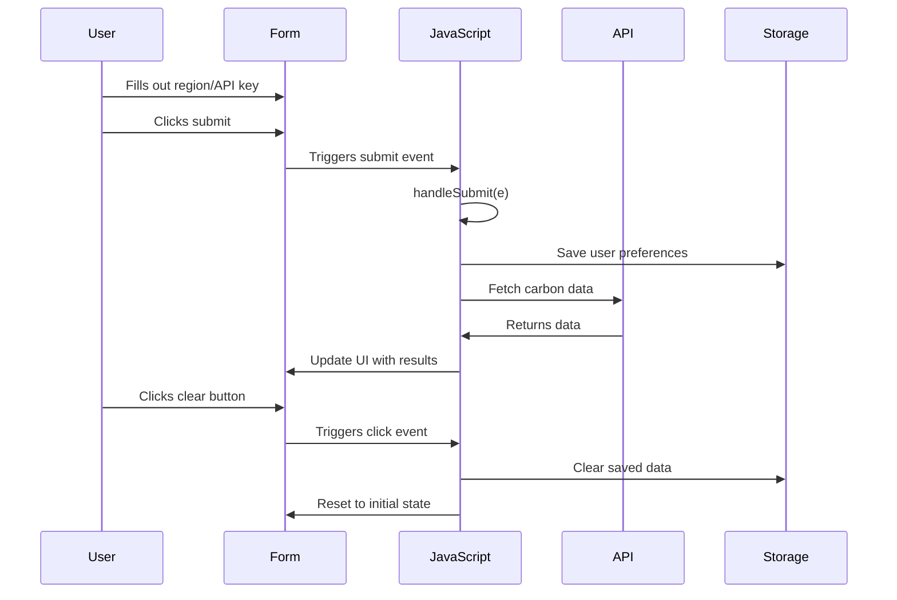
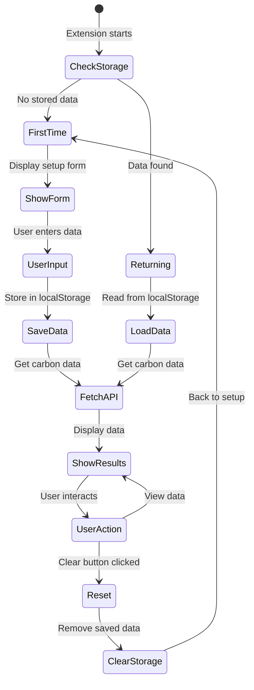
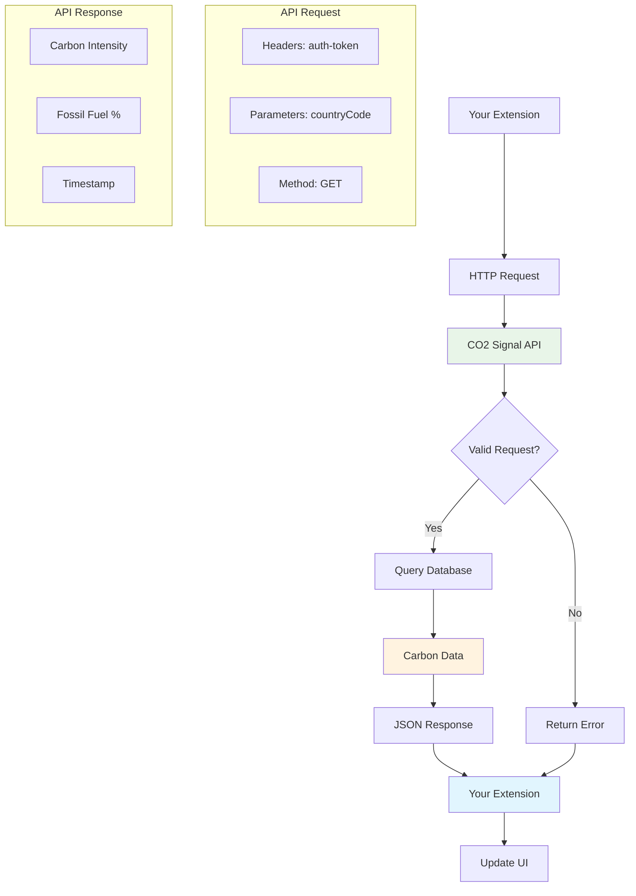
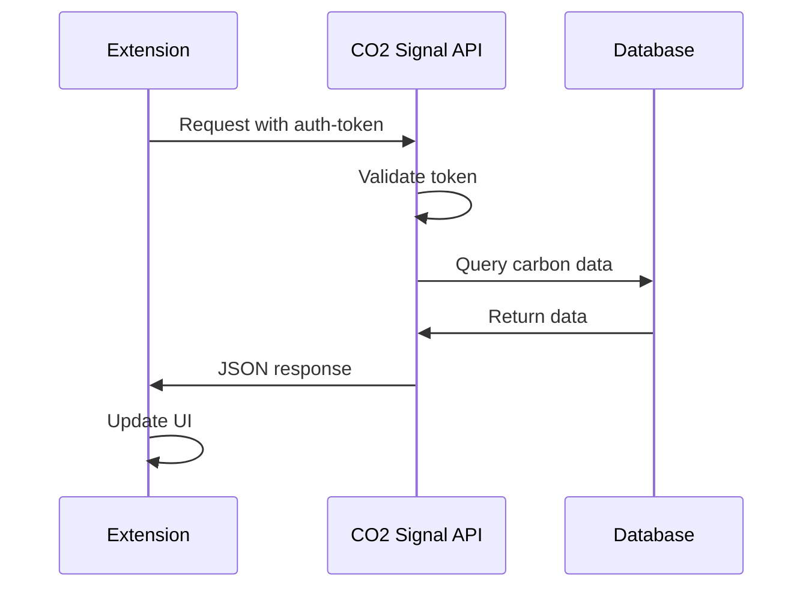
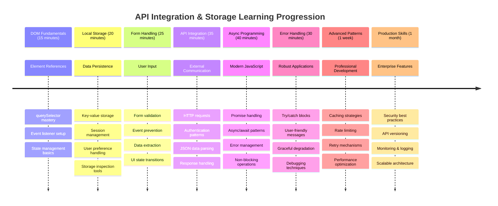

<!--
CO_OP_TRANSLATOR_METADATA:
{
  "original_hash": "2b6203a48c48d8234e0948353b47d84e",
  "translation_date": "2025-11-03T13:40:35+00:00",
  "source_file": "5-browser-extension/2-forms-browsers-local-storage/README.md",
  "language_code": "ur"
}
-->
# براؤزر ایکسٹینشن پروجیکٹ حصہ 2: API کال کریں، لوکل اسٹوریج استعمال کریں



## لیکچر سے پہلے کا کوئز

[لیکچر سے پہلے کا کوئز](https://ff-quizzes.netlify.app/web/quiz/25)

## تعارف

یاد ہے وہ براؤزر ایکسٹینشن جو آپ نے بنانا شروع کیا تھا؟ ابھی آپ کے پاس ایک خوبصورت فارم ہے، لیکن یہ بنیادی طور پر جامد ہے۔ آج ہم اسے حقیقی ڈیٹا سے جوڑ کر اور اسے یادداشت دے کر زندہ کریں گے۔

اپولو مشن کنٹرول کمپیوٹرز کے بارے میں سوچیں - وہ صرف مقررہ معلومات ظاہر نہیں کرتے تھے۔ وہ مسلسل خلائی جہاز کے ساتھ بات چیت کرتے تھے، ٹیلی میٹری ڈیٹا کے ساتھ اپ ڈیٹ ہوتے تھے، اور اہم مشن پیرامیٹرز کو یاد رکھتے تھے۔ آج ہم اسی قسم کا متحرک رویہ بنا رہے ہیں۔ آپ کا ایکسٹینشن انٹرنیٹ تک پہنچے گا، حقیقی ماحولیاتی ڈیٹا حاصل کرے گا، اور اگلی بار کے لیے آپ کی سیٹنگز کو یاد رکھے گا۔

API انٹیگریشن پیچیدہ لگ سکتی ہے، لیکن یہ واقعی آپ کے کوڈ کو دوسرے سروسز کے ساتھ بات چیت کرنا سکھانے کے بارے میں ہے۔ چاہے آپ موسم کا ڈیٹا حاصل کر رہے ہوں، سوشل میڈیا فیڈز، یا کاربن فوٹ پرنٹ کی معلومات جیسا کہ ہم آج کریں گے، یہ سب ڈیجیٹل کنکشن قائم کرنے کے بارے میں ہے۔ ہم یہ بھی دیکھیں گے کہ براؤزرز معلومات کو کیسے برقرار رکھ سکتے ہیں - جیسے کہ لائبریریوں نے کارڈ کیٹلاگ استعمال کیے ہیں تاکہ کتابوں کی جگہ کو یاد رکھا جا سکے۔

اس سبق کے اختتام تک، آپ کے پاس ایک براؤزر ایکسٹینشن ہوگا جو حقیقی ڈیٹا حاصل کرے گا، صارف کی ترجیحات کو محفوظ کرے گا، اور ایک ہموار تجربہ فراہم کرے گا۔ آئیے شروع کریں!



✅ مناسب فائلوں میں نمبر شدہ حصوں کی پیروی کریں تاکہ معلوم ہو کہ آپ کا کوڈ کہاں رکھنا ہے

## ایکسٹینشن میں عناصر کو ترتیب دیں

آپ کا جاوا اسکرپٹ انٹرفیس کو جوڑنے سے پہلے، اسے مخصوص HTML عناصر کے حوالہ جات کی ضرورت ہوتی ہے۔ اسے ایسے سمجھیں جیسے دوربین کو مخصوص ستاروں کی طرف اشارہ کرنے کی ضرورت ہو - گلیلیو کو مشتری کے چاندوں کا مطالعہ کرنے سے پہلے، اسے مشتری کو تلاش کرنا اور اس پر توجہ مرکوز کرنا پڑی۔

آپ کی `index.js` فائل میں، ہم `const` متغیرات بنائیں گے جو ہر اہم فارم عنصر کے حوالہ جات کو پکڑیں گے۔ یہ اس طرح ہے جیسے سائنسدان اپنے آلات کو لیبل کرتے ہیں - ہر بار پورے لیبارٹری میں تلاش کرنے کے بجائے، وہ براہ راست اس تک رسائی حاصل کر سکتے ہیں جس کی انہیں ضرورت ہے۔



```javascript
// form fields
const form = document.querySelector('.form-data');
const region = document.querySelector('.region-name');
const apiKey = document.querySelector('.api-key');

// results
const errors = document.querySelector('.errors');
const loading = document.querySelector('.loading');
const results = document.querySelector('.result-container');
const usage = document.querySelector('.carbon-usage');
const fossilfuel = document.querySelector('.fossil-fuel');
const myregion = document.querySelector('.my-region');
const clearBtn = document.querySelector('.clear-btn');
```

**یہ کوڈ کیا کرتا ہے:**
- **پکڑتا ہے** فارم عناصر کو `document.querySelector()` کے ذریعے CSS کلاس سلیکٹرز کے ساتھ
- **بناتا ہے** ان پٹ فیلڈز کے حوالہ جات علاقے کے نام اور API کلید کے لیے
- **قائم کرتا ہے** کاربن استعمال کے ڈیٹا کے نتائج دکھانے والے عناصر کے ساتھ کنکشن
- **ترتیب دیتا ہے** UI عناصر تک رسائی جیسے لوڈنگ انڈیکیٹرز اور ایرر میسیجز
- **محفوظ کرتا ہے** ہر عنصر کا حوالہ `const` متغیر میں تاکہ آپ کے کوڈ میں آسانی سے دوبارہ استعمال ہو سکے

## ایونٹ لسٹنرز شامل کریں

اب ہم آپ کے ایکسٹینشن کو صارف کے اعمال کا جواب دینے کے قابل بنائیں گے۔ ایونٹ لسٹنرز آپ کے کوڈ کا صارف کے تعاملات کی نگرانی کرنے کا طریقہ ہیں۔ انہیں ابتدائی ٹیلیفون ایکسچینجز کے آپریٹرز کی طرح سمجھیں - وہ آنے والی کالز کے لیے سنتے تھے اور جب کوئی کنکشن بنانا چاہتا تھا تو صحیح سرکٹس کو جوڑتے تھے۔



```javascript
form.addEventListener('submit', (e) => handleSubmit(e));
clearBtn.addEventListener('click', (e) => reset(e));
init();
```

**ان تصورات کو سمجھنا:**
- **جوڑتا ہے** ایک سبمٹ لسٹنر کو فارم کے ساتھ جو اس وقت متحرک ہوتا ہے جب صارفین انٹر دبائیں یا سبمٹ پر کلک کریں
- **جوڑتا ہے** ایک کلک لسٹنر کو کلیر بٹن کے ساتھ فارم کو ری سیٹ کرنے کے لیے
- **پاس کرتا ہے** ایونٹ آبجیکٹ `(e)` کو ہینڈلر فنکشنز کے لیے اضافی کنٹرول کے لیے
- **کال کرتا ہے** `init()` فنکشن کو فوری طور پر تاکہ آپ کے ایکسٹینشن کی ابتدائی حالت ترتیب دی جا سکے

✅ یہاں استعمال ہونے والے شارٹ ہینڈ ایرو فنکشن سینٹیکس پر غور کریں۔ یہ جدید جاوا اسکرپٹ طریقہ روایتی فنکشن ایکسپریشنز سے زیادہ صاف ہے، لیکن دونوں یکساں طور پر کام کرتے ہیں!

### 🔄 **تعلیمی جائزہ**
**ایونٹ ہینڈلنگ کی سمجھ**: ابتدائیہ کی طرف جانے سے پہلے، یقینی بنائیں کہ آپ:
- ✅ وضاحت کر سکتے ہیں کہ `addEventListener` صارف کے اعمال کو جاوا اسکرپٹ فنکشنز سے کیسے جوڑتا ہے
- ✅ سمجھتے ہیں کہ ہم ایونٹ آبجیکٹ `(e)` کو ہینڈلر فنکشنز کو کیوں پاس کرتے ہیں
- ✅ `submit` اور `click` ایونٹس کے درمیان فرق کو پہچانتے ہیں
- ✅ بیان کر سکتے ہیں کہ `init()` فنکشن کب چلتا ہے اور کیوں

**خود کا فوری ٹیسٹ**: اگر آپ فارم سبمیشن میں `e.preventDefault()` کو بھول جائیں تو کیا ہوگا؟
*جواب: صفحہ دوبارہ لوڈ ہو جائے گا، تمام جاوا اسکرپٹ اسٹیٹ کھو جائے گی اور صارف کے تجربے میں خلل پڑے گا*

## ابتدائیہ اور ری سیٹ فنکشنز بنائیں

آئیے آپ کے ایکسٹینشن کے لیے ابتدائی منطق بنائیں۔ `init()` فنکشن ایک جہاز کے نیویگیشن سسٹم کی طرح ہے جو اپنے آلات کو چیک کرتا ہے - یہ موجودہ حالت کا تعین کرتا ہے اور انٹرفیس کو اسی کے مطابق ایڈجسٹ کرتا ہے۔ یہ چیک کرتا ہے کہ آیا کسی نے پہلے آپ کے ایکسٹینشن کا استعمال کیا ہے اور ان کی پچھلی سیٹنگز کو لوڈ کرتا ہے۔

`reset()` فنکشن صارفین کو ایک نئی شروعات فراہم کرتا ہے - جیسے کہ سائنسدان اپنے آلات کو تجربات کے درمیان ری سیٹ کرتے ہیں تاکہ صاف ڈیٹا کو یقینی بنایا جا سکے۔

```javascript
function init() {
	// Check if user has previously saved API credentials
	const storedApiKey = localStorage.getItem('apiKey');
	const storedRegion = localStorage.getItem('regionName');

	// Set extension icon to generic green (placeholder for future lesson)
	// TODO: Implement icon update in next lesson

	if (storedApiKey === null || storedRegion === null) {
		// First-time user: show the setup form
		form.style.display = 'block';
		results.style.display = 'none';
		loading.style.display = 'none';
		clearBtn.style.display = 'none';
		errors.textContent = '';
	} else {
		// Returning user: load their saved data automatically
		displayCarbonUsage(storedApiKey, storedRegion);
		results.style.display = 'none';
		form.style.display = 'none';
		clearBtn.style.display = 'block';
	}
}

function reset(e) {
	e.preventDefault();
	// Clear stored region to allow user to choose a new location
	localStorage.removeItem('regionName');
	// Restart the initialization process
	init();
}
```

**یہاں کیا ہوتا ہے:**
- **حاصل کرتا ہے** محفوظ شدہ API کلید اور علاقے کو براؤزر کے لوکل اسٹوریج سے
- **چیک کرتا ہے** کہ آیا یہ پہلی بار استعمال کرنے والا ہے (کوئی محفوظ شدہ اسناد نہیں) یا واپس آنے والا صارف
- **دکھاتا ہے** سیٹ اپ فارم نئے صارفین کے لیے اور دیگر انٹرفیس عناصر کو چھپاتا ہے
- **خودکار طور پر لوڈ کرتا ہے** محفوظ شدہ ڈیٹا واپس آنے والے صارفین کے لیے اور ری سیٹ آپشن دکھاتا ہے
- **منظم کرتا ہے** انٹرفیس کی حالت دستیاب ڈیٹا کی بنیاد پر

**لوکل اسٹوریج کے بارے میں اہم تصورات:**
- **برقرار رکھتا ہے** ڈیٹا براؤزر سیشنز کے درمیان (سیشن اسٹوریج کے برعکس)
- **محفوظ کرتا ہے** ڈیٹا کو کلیدی-قدر کے جوڑوں کے طور پر `getItem()` اور `setItem()` استعمال کرتے ہوئے
- **واپس کرتا ہے** `null` جب کسی دی گئی کلید کے لیے کوئی ڈیٹا موجود نہ ہو
- **فراہم کرتا ہے** صارف کی ترجیحات اور سیٹنگز کو یاد رکھنے کا ایک آسان طریقہ

> 💡 **براؤزر اسٹوریج کو سمجھنا**: [LocalStorage](https://developer.mozilla.org/docs/Web/API/Window/localStorage) آپ کے ایکسٹینشن کو مستقل یادداشت دینے جیسا ہے۔ غور کریں کہ قدیم لائبریری آف اسکندریہ نے طوماروں کو کیسے محفوظ کیا - معلومات دستیاب رہتی تھیں یہاں تک کہ جب اسکالرز جاتے اور واپس آتے۔
>
> **اہم خصوصیات:**
> - **برقرار رکھتا ہے** ڈیٹا یہاں تک کہ آپ اپنا براؤزر بند کر دیں
> - **بچاتا ہے** کمپیوٹر ری اسٹارٹس اور براؤزر کریشز کے دوران
> - **فراہم کرتا ہے** صارف کی ترجیحات کے لیے کافی اسٹوریج اسپیس
> - **فوری رسائی دیتا ہے** بغیر نیٹ ورک کی تاخیر کے

> **اہم نوٹ**: آپ کے براؤزر ایکسٹینشن کا اپنا الگ لوکل اسٹوریج ہے جو عام ویب صفحات سے الگ ہے۔ یہ سیکیورٹی فراہم کرتا ہے اور دیگر ویب سائٹس کے ساتھ تنازعات کو روکتا ہے۔

آپ اپنے محفوظ شدہ ڈیٹا کو براؤزر ڈیولپر ٹولز (F12) کھول کر، **ایپلیکیشن** ٹیب پر جا کر، اور **لوکل اسٹوریج** سیکشن کو بڑھا کر دیکھ سکتے ہیں۔




> ⚠️ **سیکیورٹی غور و فکر**: پروڈکشن ایپلیکیشنز میں، لوکل اسٹوریج میں API کلیدوں کو محفوظ کرنا سیکیورٹی خطرات پیدا کرتا ہے کیونکہ جاوا اسکرپٹ اس ڈیٹا تک رسائی حاصل کر سکتا ہے۔ سیکھنے کے مقاصد کے لیے، یہ طریقہ ٹھیک کام کرتا ہے، لیکن حقیقی ایپلیکیشنز کو حساس اسناد کے لیے محفوظ سرور سائیڈ اسٹوریج استعمال کرنا چاہیے۔

## فارم سبمیشن کو ہینڈل کریں

اب ہم اس بات کو ہینڈل کریں گے کہ جب کوئی آپ کا فارم سبمٹ کرے تو کیا ہوتا ہے۔ ڈیفالٹ کے طور پر، براؤزرز فارم سبمٹ ہونے پر صفحہ کو دوبارہ لوڈ کرتے ہیں، لیکن ہم اس رویے کو روکیں گے تاکہ ایک ہموار تجربہ بنایا جا سکے۔

یہ طریقہ اس طرح ہے جیسے مشن کنٹرول خلائی جہاز کے مواصلات کو ہینڈل کرتا ہے - ہر ٹرانسمیشن کے لیے پورے سسٹم کو ری سیٹ کرنے کے بجائے، وہ مسلسل آپریشن کو برقرار رکھتے ہیں جبکہ نئی معلومات کو پروسیس کرتے ہیں۔

ایک فنکشن بنائیں جو فارم سبمیشن ایونٹ کو پکڑتا ہے اور صارف کے ان پٹ کو نکالتا ہے:

```javascript
function handleSubmit(e) {
	e.preventDefault();
	setUpUser(apiKey.value, region.value);
}
```

**اوپر، ہم نے:**
- **روکتا ہے** ڈیفالٹ فارم سبمیشن رویے جو صفحہ کو ریفریش کرے گا
- **نکالتا ہے** صارف کے انپٹ ویلیوز API کلید اور علاقے کے فیلڈز سے
- **پاس کرتا ہے** فارم ڈیٹا کو `setUpUser()` فنکشن کے لیے پروسیسنگ کے لیے
- **برقرار رکھتا ہے** سنگل پیج ایپلیکیشن رویہ صفحہ ری لوڈز سے بچ کر

✅ یاد رکھیں کہ آپ کے HTML فارم فیلڈز میں `required` ایٹریبیوٹ شامل ہے، لہذا براؤزر خود بخود اس بات کی تصدیق کرتا ہے کہ صارفین اس فنکشن کے چلنے سے پہلے API کلید اور علاقے دونوں فراہم کریں۔

## صارف کی ترجیحات ترتیب دیں

`setUpUser` فنکشن صارف کی اسناد کو محفوظ کرنے اور پہلی API کال شروع کرنے کا ذمہ دار ہے۔ یہ سیٹ اپ سے نتائج دکھانے تک ایک ہموار منتقلی پیدا کرتا ہے۔

```javascript
function setUpUser(apiKey, regionName) {
	// Save user credentials for future sessions
	localStorage.setItem('apiKey', apiKey);
	localStorage.setItem('regionName', regionName);
	
	// Update UI to show loading state
	loading.style.display = 'block';
	errors.textContent = '';
	clearBtn.style.display = 'block';
	
	// Fetch carbon usage data with user's credentials
	displayCarbonUsage(apiKey, regionName);
}
```

**مرحلہ وار، یہاں کیا ہو رہا ہے:**
- **محفوظ کرتا ہے** API کلید اور علاقے کا نام لوکل اسٹوریج میں مستقبل کے استعمال کے لیے
- **دکھاتا ہے** ایک لوڈنگ انڈیکیٹر تاکہ صارفین کو مطلع کیا جا سکے کہ ڈیٹا حاصل کیا جا رہا ہے
- **صاف کرتا ہے** کسی بھی پچھلے ایرر میسیجز کو ڈسپلے سے
- **ظاہر کرتا ہے** کلیر بٹن صارفین کے لیے تاکہ وہ بعد میں اپنی سیٹنگز ری سیٹ کر سکیں
- **شروع کرتا ہے** API کال حقیقی کاربن استعمال کے ڈیٹا کو حاصل کرنے کے لیے

یہ فنکشن ایک ہموار صارف تجربہ پیدا کرتا ہے جو ڈیٹا کی مستقل مزاجی اور صارف انٹرفیس اپ ڈیٹس دونوں کو ایک مربوط عمل میں منظم کرتا ہے۔

## کاربن استعمال کے ڈیٹا کو دکھائیں

اب ہم آپ کے ایکسٹینشن کو APIs کے ذریعے بیرونی ڈیٹا سورسز سے جوڑیں گے۔ یہ آپ کے ایکسٹینشن کو ایک اسٹینڈ الون ٹول سے کچھ ایسا بناتا ہے جو انٹرنیٹ سے حقیقی وقت کی معلومات تک رسائی حاصل کر سکتا ہے۔

**APIs کو سمجھنا**

[APIs](https://www.webopedia.com/TERM/A/API.html) مختلف ایپلیکیشنز کو ایک دوسرے کے ساتھ بات چیت کرنے کا طریقہ ہیں۔ انہیں 19ویں صدی میں دور دراز شہروں کو جوڑنے والے ٹیلی گراف سسٹم کی طرح سمجھیں - آپریٹرز دور دراز اسٹیشنز کو درخواستیں بھیجتے تھے اور مطلوبہ معلومات کے ساتھ جوابات وصول کرتے تھے۔ جب بھی آپ سوشل میڈیا چیک کرتے ہیں، وائس اسسٹنٹ سے سوال پوچھتے ہیں، یا ڈیلیوری ایپ استعمال کرتے ہیں، APIs ان ڈیٹا ایکسچینجز کو سہولت فراہم کر رہے ہیں۔



**REST APIs کے بارے میں اہم تصورات:**
- **REST** کا مطلب ہے 'ریپریزنٹیشنل اسٹیٹ ٹرانسفر'
- **استعمال کرتا ہے** معیاری HTTP طریقے (GET, POST, PUT, DELETE) ڈیٹا کے ساتھ تعامل کے لیے
- **واپس کرتا ہے** ڈیٹا کو متوقع فارمیٹس میں، عام طور پر JSON
- **فراہم کرتا ہے** مختلف قسم کی درخواستوں کے لیے مستقل، URL پر مبنی اینڈ پوائنٹس

✅ [CO2 Signal API](https://www.co2signal.com/) جو ہم استعمال کریں گے، دنیا بھر کے الیکٹریکل گرڈز سے حقیقی وقت کے کاربن شدت کے ڈیٹا فراہم کرتا ہے۔ یہ صارفین کو ان کی بجلی کے استعمال کے ماحولیاتی اثرات کو سمجھنے میں مدد دیتا ہے!

> 💡 **غیر متزامن جاوا اسکرپٹ کو سمجھنا**: [`async` کلیدی لفظ](https://developer.mozilla.org/docs/Web/JavaScript/Reference/Statements/async_function) آپ کے کوڈ کو بیک وقت متعدد آپریشنز کو ہینڈل کرنے کے قابل بناتا ہے۔ جب آپ سرور سے ڈیٹا کی درخواست کرتے ہیں، تو آپ نہیں چاہتے کہ آپ کا پورا ایکسٹینشن منجمد ہو جائے - یہ ایسا ہوگا جیسے ہوائی ٹریفک کنٹرول ایک ہوائی جہاز کے جواب کا انتظار کرتے ہوئے تمام آپریشنز کو روک دے۔
>
> **اہم فوائد:**
> - **برقرار رکھتا ہے** ایکسٹینشن کی جواب دہی جبکہ ڈیٹا لوڈ ہو رہا ہو
> - **اجازت دیتا ہے** دوسرے کوڈ کو نیٹ ورک کی درخواستوں کے دوران چلتے رہنے کی
> - **بہتر بناتا ہے** کوڈ کی پڑھنے کی صلاحیت روایتی کال بیک پیٹرنز کے مقابلے میں
> - **فراہم کرتا ہے** نیٹ ورک کے مسائل کے لیے شائستہ ایرر ہینڈلنگ

یہاں `async` کے بارے میں ایک مختصر ویڈیو ہے:

[](https://youtube.com/watch?v=YwmlRkrxvkk "Async اور Await وعدوں کو منظم کرنے کے لیے")

> 🎥 اوپر دی گئی تصویر پر کلک کریں `async/await` کے بارے میں ویڈیو کے لیے۔

### 🔄 **تعلیمی جائزہ**
**غیر متزامن پروگرامنگ کی سمجھ**: API فنکشن میں جانے سے پہلے، تصدیق کریں کہ آپ سمجھتے ہیں:
- ✅ ہم `async/await` کا استعمال کیوں کرتے ہیں بجائے پورے ایکسٹینشن کو منجمد کرنے کے
- ✅ `try/catch` بلاکس نیٹ ورک ایررز کو شائستگی سے کیسے ہینڈل کرتے ہیں
- ✅ متزامن اور غیر متزامن آپریشنز کے درمیان فرق
- ✅ API کالز کیوں ناکام ہو سکتی ہیں اور ان ناکامیوں کو کیسے ہینڈل کیا جائے

**حقیقی دنیا کا تعلق**: ان روزمرہ کے غیر متزامن مثالوں پر غور کریں:
- **کھانے کا آرڈر دینا**: آپ باورچی خانے کے پاس انتظار نہیں کرتے - آپ رسید حاصل کرتے ہیں اور دیگر سرگرمیاں جاری رکھتے ہیں
- **ای میل بھیجنا**: آپ کا ای میل ایپ بھیجتے وقت منجمد نہیں ہوتا - آپ مزید ای میلز لکھ سکتے ہیں
- **ویب صفحات لوڈ کرنا**: تصاویر بتدریج لوڈ ہوتی ہیں جبکہ آپ پہلے ہی متن پڑھ سکتے ہیں

**API تصدیقی بہاؤ**:


کاربن استعمال کے ڈیٹا کو حاصل کرنے اور دکھانے کے لیے فنکشن بنائیں:

```javascript
// Modern fetch API approach (no external dependencies needed)
async function displayCarbonUsage(apiKey, region) {
	try {
		// Fetch carbon intensity data from CO2 Signal API
		const response = await fetch('https://api.co2signal.com/v1/latest', {
			method: 'GET',
			headers: {
				'auth-token': apiKey,
				'Content-Type': 'application/json'
			},
			// Add query parameters for the specific region
			...new URLSearchParams({ countryCode: region }) && {
				url: `https://api.co2signal.com/v1/latest?countryCode=${region}`
			}
		});

		// Check if the API request was successful
		if (!response.ok) {
			throw new Error(`API request failed: ${response.status}`);
		}

		const data = await response.json();
		const carbonData = data.data;

		// Calculate rounded carbon intensity value
		const carbonIntensity = Math.round(carbonData.carbonIntensity);

		// Update the user interface with fetched data
		loading.style.display = 'none';
		form.style.display = 'none';
		myregion.textContent = region.toUpperCase();
		usage.textContent = `${carbonIntensity} grams (grams CO₂ emitted per kilowatt hour)`;
		fossilfuel.textContent = `${carbonData.fossilFuelPercentage.toFixed(2)}% (percentage of fossil fuels used to generate electricity)`;
		results.style.display = 'block';

		// TODO: calculateColor(carbonIntensity) - implement in next lesson

	} catch (error) {
		console.error('Error fetching carbon data:', error);
		
		// Show user-friendly error message
		loading.style.display = 'none';
		results.style.display = 'none';
		errors.textContent = 'Sorry, we couldn\'t fetch data for that region. Please check your API key and region code.';
	}
}
```

**یہاں کیا ہوتا ہے:**
- **استعمال کرتا ہے** جدید `fetch()` API بیرونی لائبریریوں جیسے Axios کے بجائے صاف، ڈیپینڈنسی فری کوڈ کے لیے
- **نافذ کرتا ہے** مناسب ایرر چیکنگ `response.ok` کے ساتھ تاکہ API کی ناکامیوں کو جلدی پکڑا جا سکے
- **ہینڈل کرتا ہے** غیر متزامن آپریشنز `async/await` کے ساتھ زیادہ پڑھنے کے قابل کوڈ فلو کے لیے
- **تصدیق کرتا ہے** CO2 Signal API کے ساتھ `auth-token` ہیڈر کا استعمال کرتے ہوئے
- **پ
**تفصیل:** براؤزر ایکسٹینشن کو بہتر بنائیں اور اس میں ایرر ہینڈلنگ اور صارف کے تجربے کی خصوصیات شامل کریں۔ یہ چیلنج آپ کو APIs، لوکل اسٹوریج، اور DOM مینپولیشن کے ساتھ جدید جاوا اسکرپٹ پیٹرنز پر کام کرنے کی مشق فراہم کرے گا۔

**پرومپٹ:** displayCarbonUsage فنکشن کا ایک بہتر ورژن بنائیں جس میں شامل ہو: 1) API کالز کے ناکام ہونے پر دوبارہ کوشش کرنے کا میکانزم، جس میں ایکسپونینشل بیک آف شامل ہو، 2) API کال سے پہلے ریجن کوڈ کی ان پٹ ویلیڈیشن، 3) لوڈنگ اینیمیشن کے ساتھ پروگریس انڈیکیٹرز، 4) API کے جوابات کو لوکل اسٹوریج میں 30 منٹ کے لیے کیش کرنا، اور 5) پچھلی API کالز سے تاریخی ڈیٹا دکھانے کی خصوصیت۔ تمام فنکشن پیرامیٹرز اور ریٹرن ٹائپس کو دستاویز کرنے کے لیے مناسب TypeScript-style JSDoc کمنٹس بھی شامل کریں۔

[ایجنٹ موڈ](https://code.visualstudio.com/blogs/2025/02/24/introducing-copilot-agent-mode) کے بارے میں مزید جانیں۔

## 🚀 چیلنج

APIs کو بہتر طور پر سمجھنے کے لیے براؤزر پر مبنی APIs کی دولت کو دریافت کریں جو ویب ڈیولپمنٹ کے لیے دستیاب ہیں۔ ان براؤزر APIs میں سے ایک کو منتخب کریں اور ایک چھوٹا مظاہرہ بنائیں:

- [Geolocation API](https://developer.mozilla.org/docs/Web/API/Geolocation_API) - صارف کا موجودہ مقام حاصل کریں
- [Notification API](https://developer.mozilla.org/docs/Web/API/Notifications_API) - ڈیسک ٹاپ نوٹیفیکیشن بھیجیں
- [HTML Drag and Drop API](https://developer.mozilla.org/docs/Web/API/HTML_Drag_and_Drop_API) - انٹرایکٹو ڈریگ انٹرفیس بنائیں
- [Web Storage API](https://developer.mozilla.org/docs/Web/API/Web_Storage_API) - لوکل اسٹوریج کی جدید تکنیکیں
- [Fetch API](https://developer.mozilla.org/docs/Web/API/Fetch_API) - XMLHttpRequest کا جدید متبادل

**تحقیقی سوالات پر غور کریں:**
- یہ API حقیقی دنیا کے مسائل کو کیسے حل کرتی ہے؟
- یہ API ایررز اور ایج کیسز کو کیسے ہینڈل کرتی ہے؟
- اس API کو استعمال کرتے وقت کون سے سیکیورٹی پہلو موجود ہیں؟
- مختلف براؤزرز میں اس API کی سپورٹ کتنی وسیع ہے؟

اپنی تحقیق کے بعد، ان خصوصیات کی نشاندہی کریں جو ایک API کو ڈیولپر کے لیے دوستانہ اور قابل اعتماد بناتی ہیں۔

## لیکچر کے بعد کا کوئز

[لیکچر کے بعد کا کوئز](https://ff-quizzes.netlify.app/web/quiz/26)

## جائزہ اور خود مطالعہ

آپ نے اس سبق میں LocalStorage اور APIs کے بارے میں سیکھا، جو پیشہ ور ویب ڈیولپر کے لیے بہت مفید ہیں۔ کیا آپ سوچ سکتے ہیں کہ یہ دونوں چیزیں ایک ساتھ کیسے کام کرتی ہیں؟ تصور کریں کہ آپ ایک ویب سائٹ کو کیسے ڈیزائن کریں گے جو API کے ذریعے استعمال ہونے والی اشیاء کو اسٹور کرے۔

### ⚡ **اگلے 5 منٹ میں آپ کیا کر سکتے ہیں**
- [ ] DevTools کے Application ٹیب کو کھولیں اور کسی بھی ویب سائٹ پر لوکل اسٹوریج کو دریافت کریں
- [ ] ایک سادہ HTML فارم بنائیں اور براؤزر میں فارم ویلیڈیشن کی جانچ کریں
- [ ] براؤزر کنسول میں لوکل اسٹوریج کا استعمال کرتے ہوئے ڈیٹا اسٹور اور ریٹریو کریں
- [ ] نیٹ ورک ٹیب کا استعمال کرتے ہوئے فارم ڈیٹا کو جمع کرانے کا معائنہ کریں

### 🎯 **اس گھنٹے میں آپ کیا حاصل کر سکتے ہیں**
- [ ] لیکچر کے بعد کا کوئز مکمل کریں اور فارم ہینڈلنگ کے تصورات کو سمجھیں
- [ ] ایک براؤزر ایکسٹینشن فارم بنائیں جو صارف کی ترجیحات کو محفوظ کرے
- [ ] کلائنٹ سائیڈ فارم ویلیڈیشن کو مفید ایرر میسجز کے ساتھ نافذ کریں
- [ ] ایکسٹینشن ڈیٹا کی مستقل مزاجی کے لیے chrome.storage API کا استعمال کریں
- [ ] ایک صارف انٹرفیس بنائیں جو محفوظ کردہ صارف کی سیٹنگز پر ردعمل ظاہر کرے

### 📅 **آپ کی ہفتہ بھر کی ایکسٹینشن بلڈنگ**
- [ ] فارم کی فعالیت کے ساتھ مکمل فیچرڈ براؤزر ایکسٹینشن مکمل کریں
- [ ] مختلف اسٹوریج آپشنز میں مہارت حاصل کریں: لوکل، سنک، اور سیشن اسٹوریج
- [ ] فارم کی جدید خصوصیات جیسے آٹو کمپلیٹ اور ویلیڈیشن کو نافذ کریں
- [ ] صارف کے ڈیٹا کے لیے امپورٹ/ایکسپورٹ کی فعالیت شامل کریں
- [ ] مختلف براؤزرز میں اپنی ایکسٹینشن کو اچھی طرح سے جانچیں
- [ ] اپنی ایکسٹینشن کے صارف کے تجربے اور ایرر ہینڈلنگ کو بہتر بنائیں

### 🌟 **آپ کی مہینہ بھر کی ویب API مہارت**
- [ ] مختلف براؤزر اسٹوریج APIs کا استعمال کرتے ہوئے پیچیدہ ایپلیکیشنز بنائیں
- [ ] آف لائن فرسٹ ڈیولپمنٹ پیٹرنز کے بارے میں سیکھیں
- [ ] ڈیٹا کی مستقل مزاجی سے متعلق اوپن سورس پروجیکٹس میں تعاون کریں
- [ ] پرائیویسی پر مبنی ڈیولپمنٹ اور GDPR کمپلائنس میں مہارت حاصل کریں
- [ ] فارم ہینڈلنگ اور ڈیٹا مینجمنٹ کے لیے دوبارہ استعمال کے قابل لائبریریاں بنائیں
- [ ] ویب APIs اور ایکسٹینشن ڈیولپمنٹ کے بارے میں علم شیئر کریں

## 🎯 آپ کی ایکسٹینشن ڈیولپمنٹ مہارت کا ٹائم لائن



### 🛠️ آپ کے فل اسٹیک ڈیولپمنٹ ٹول کٹ کا خلاصہ

اس سبق کو مکمل کرنے کے بعد، آپ کے پاس یہ مہارتیں ہیں:
- **DOM مہارت**: عناصر کو درست طریقے سے ہدف بنانا اور ان میں تبدیلی کرنا
- **اسٹوریج کی مہارت**: لوکل اسٹوریج کے ساتھ مستقل ڈیٹا مینجمنٹ
- **API انٹیگریشن**: ریئل ٹائم ڈیٹا فیچنگ اور تصدیق
- **ایسنک پروگرامنگ**: جدید جاوا اسکرپٹ کے ساتھ نان بلاکنگ آپریشنز
- **ایرر ہینڈلنگ**: مضبوط ایپلیکیشنز جو ناکامیوں کو خوش اسلوبی سے ہینڈل کرتی ہیں
- **صارف کا تجربہ**: لوڈنگ اسٹیٹس، ویلیڈیشن، اور ہموار انٹریکشنز
- **جدید پیٹرنز**: fetch API، async/await، اور ES6+ خصوصیات

**پیشہ ورانہ مہارتیں حاصل کیں:** آپ نے ان پیٹرنز کو نافذ کیا جو استعمال ہوتے ہیں:
- **ویب ایپلیکیشنز**: سنگل پیج ایپس جو بیرونی ڈیٹا سورسز کے ساتھ کام کرتی ہیں
- **موبائل ڈیولپمنٹ**: API پر مبنی ایپس جو آف لائن صلاحیتوں کے ساتھ ہیں
- **ڈیسک ٹاپ سافٹ ویئر**: الیکٹران ایپس جو مستقل اسٹوریج کے ساتھ ہیں
- **انٹرپرائز سسٹمز**: تصدیق، کیشنگ، اور ایرر ہینڈلنگ
- **جدید فریم ورک**: React/Vue/Angular ڈیٹا مینجمنٹ پیٹرنز

**اگلا مرحلہ:** آپ پیچیدہ موضوعات جیسے کیشنگ اسٹریٹیجیز، ریئل ٹائم WebSocket کنکشنز، یا پیچیدہ اسٹیٹ مینجمنٹ کو دریافت کرنے کے لیے تیار ہیں!

## اسائنمنٹ

[ایک API اپنائیں](assignment.md)

---

**ڈسکلیمر**:  
یہ دستاویز AI ترجمہ سروس [Co-op Translator](https://github.com/Azure/co-op-translator) کا استعمال کرتے ہوئے ترجمہ کی گئی ہے۔ ہم درستگی کے لیے کوشش کرتے ہیں، لیکن براہ کرم آگاہ رہیں کہ خودکار ترجمے میں غلطیاں یا غیر درستیاں ہو سکتی ہیں۔ اصل دستاویز کو اس کی اصل زبان میں مستند ذریعہ سمجھا جانا چاہیے۔ اہم معلومات کے لیے، پیشہ ور انسانی ترجمہ کی سفارش کی جاتی ہے۔ ہم اس ترجمے کے استعمال سے پیدا ہونے والی کسی بھی غلط فہمی یا غلط تشریح کے ذمہ دار نہیں ہیں۔