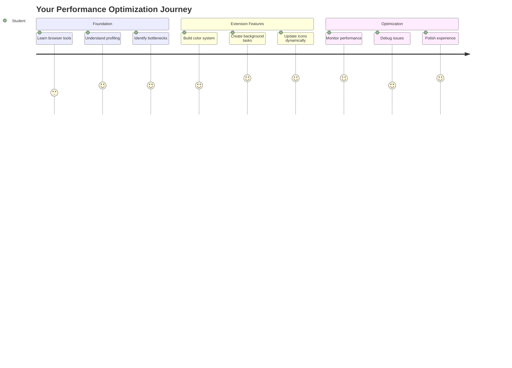
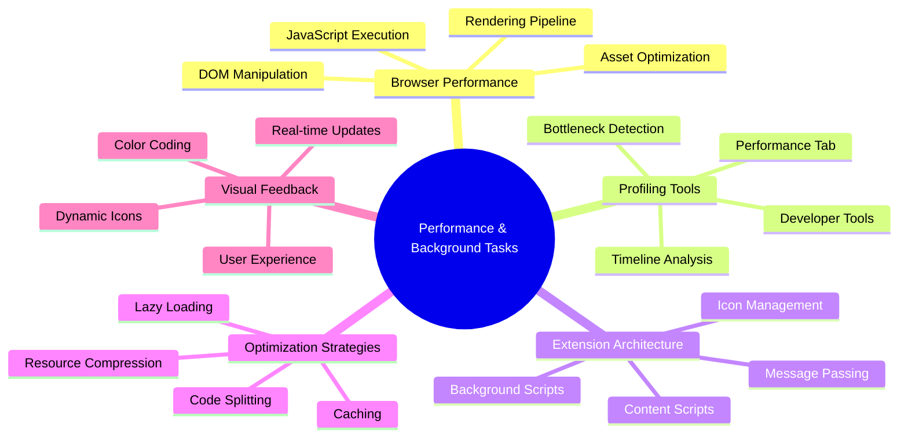
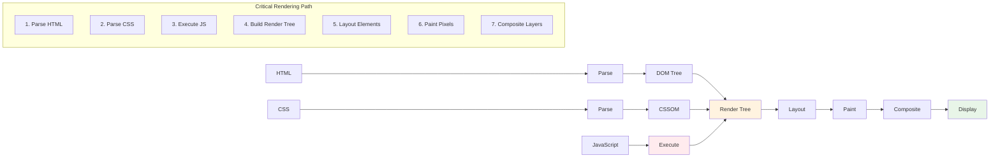
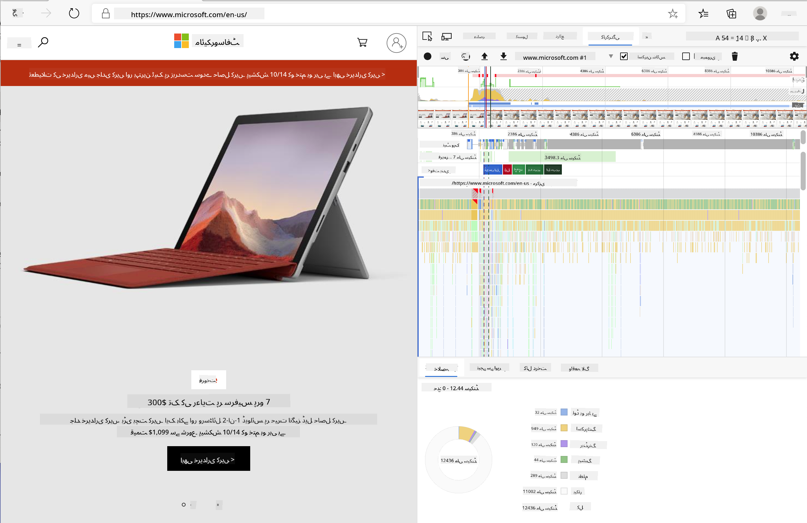
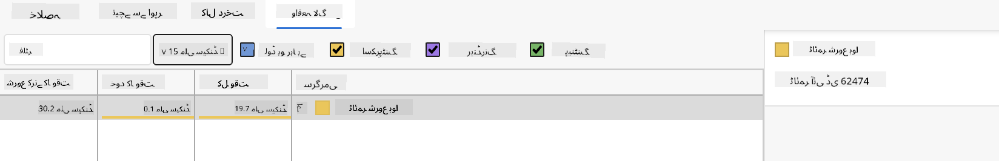
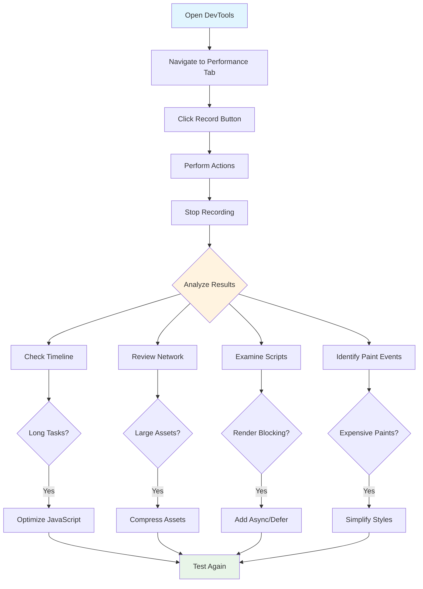
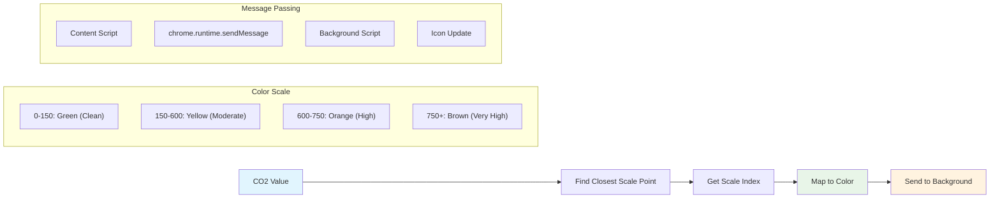
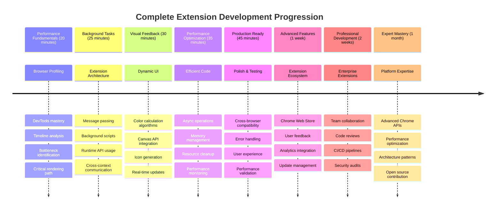

```mermaid
architecture-beta
    group browser(logos:chrome)[Browser]
    
    service popup(logos:html5)[Popup UI] in browser
    service content(logos:javascript)[Content Script] in browser
    service background(database)[Background Script] in browser
    service api(logos:api)[External API] in browser
    
    popup:R -- L:content
    content:R -- L:background
    background:T -- B:api
    content:T -- B:api
    
    junction junctionCenter in browser
    popup:R -- L:junctionCenter
    junctionCenter:R -- L:background
```

<!--
CO_OP_TRANSLATOR_METADATA:
{
  "original_hash": "b275fed2c6fc90d2b9b6661a3225faa2",
  "translation_date": "2025-11-03T13:38:52+00:00",
  "source_file": "5-browser-extension/3-background-tasks-and-performance/README.md",
  "language_code": "ur"
}
-->
# براؤزر ایکسٹینشن پروجیکٹ حصہ 3: بیک گراؤنڈ ٹاسکس اور کارکردگی کے بارے میں جانیں



کبھی سوچا ہے کہ کچھ براؤزر ایکسٹینشنز کیوں تیز اور جوابدہ محسوس ہوتی ہیں جبکہ کچھ سست لگتی ہیں؟ راز ان کے پس پردہ ہونے والے عمل میں چھپا ہے۔ جب صارفین آپ کے ایکسٹینشن کے انٹرفیس پر کلک کرتے ہیں، تو بیک گراؤنڈ میں ڈیٹا فچنگ، آئیکن اپڈیٹس، اور سسٹم ریسورسز کا انتظام خاموشی سے ہو رہا ہوتا ہے۔

یہ براؤزر ایکسٹینشن سیریز کا آخری سبق ہے، اور ہم آپ کے کاربن فوٹ پرنٹ ٹریکر کو ہموار طریقے سے کام کرنے کے قابل بنائیں گے۔ آپ متحرک آئیکن اپڈیٹس شامل کریں گے اور کارکردگی کے مسائل کو ان کے مسئلہ بننے سے پہلے پہچاننا سیکھیں گے۔ یہ بالکل ریس کار کو ٹیون کرنے جیسا ہے - چھوٹی چھوٹی اصلاحات سب کچھ بہتر طریقے سے چلانے میں بڑا فرق ڈال سکتی ہیں۔

جب ہم ختم کریں گے، تو آپ کے پاس ایک پالش شدہ ایکسٹینشن ہوگی اور آپ ان کارکردگی کے اصولوں کو سمجھیں گے جو اچھے ویب ایپس کو بہترین بناتے ہیں۔ آئیے براؤزر کی اصلاح کی دنیا میں غوطہ لگائیں۔

## پری لیکچر کوئز

[پری لیکچر کوئز](https://ff-quizzes.netlify.app/web/quiz/27)

### تعارف

پچھلے اسباق میں، آپ نے ایک فارم بنایا، اسے API سے جوڑا، اور غیر متزامن ڈیٹا فچنگ کا سامنا کیا۔ آپ کا ایکسٹینشن اچھی شکل اختیار کر رہا ہے۔

اب ہمیں آخری ٹچز شامل کرنے کی ضرورت ہے - جیسے کہ آئیکن کو کاربن ڈیٹا کی بنیاد پر رنگ تبدیل کرنے کے قابل بنانا۔ یہ مجھے یاد دلاتا ہے کہ ناسا کو اپولو اسپیس کرافٹ کے ہر سسٹم کو بہتر بنانا پڑا تھا۔ وہ کسی بھی ضائع شدہ سائیکل یا میموری کے متحمل نہیں ہو سکتے تھے کیونکہ کارکردگی پر زندگیاں منحصر تھیں۔ اگرچہ ہمارا براؤزر ایکسٹینشن اتنا اہم نہیں ہے، وہی اصول لاگو ہوتے ہیں - موثر کوڈ بہتر صارف تجربات تخلیق کرتا ہے۔



## ویب کارکردگی کی بنیادی باتیں

جب آپ کا کوڈ مؤثر طریقے سے چلتا ہے، تو لوگ واقعی فرق محسوس کر سکتے ہیں۔ آپ جانتے ہیں وہ لمحہ جب کوئی صفحہ فوراً لوڈ ہوتا ہے یا کوئی اینیمیشن ہموار طریقے سے چلتی ہے؟ یہ اچھی کارکردگی کا نتیجہ ہے۔

کارکردگی صرف رفتار کے بارے میں نہیں ہے - یہ ویب تجربات کو قدرتی بنانے کے بارے میں ہے، نہ کہ بھاری اور مایوس کن۔ کمپیوٹنگ کے ابتدائی دنوں میں، گریس ہوپر نے اپنے ڈیسک پر ایک نینو سیکنڈ (تقریباً ایک فٹ لمبے تار کا ٹکڑا) رکھا تھا تاکہ یہ دکھایا جا سکے کہ روشنی ایک اربویں سیکنڈ میں کتنی دور سفر کرتی ہے۔ یہ ان کا طریقہ تھا یہ سمجھانے کا کہ کمپیوٹنگ میں ہر مائیکرو سیکنڈ کیوں اہمیت رکھتا ہے۔ آئیے ان ڈیٹیکٹو ٹولز کو دریافت کریں جو آپ کو یہ معلوم کرنے میں مدد دیتے ہیں کہ کیا چیز چیزوں کو سست کر رہی ہے۔

> "ویب سائٹ کی کارکردگی دو چیزوں کے بارے میں ہے: صفحہ کتنی جلدی لوڈ ہوتا ہے، اور اس پر کوڈ کتنی جلدی چلتا ہے۔" -- [زیک گروسبرٹ](https://www.smashingmagazine.com/2012/06/javascript-profiling-chrome-developer-tools/)

اپنی ویب سائٹس کو ہر قسم کے آلات، ہر قسم کے صارفین، اور ہر قسم کے حالات میں انتہائی تیز بنانے کے بارے میں موضوع حیرت انگیز طور پر وسیع ہے۔ یہاں کچھ نکات ہیں جنہیں آپ کو ایک معیاری ویب پروجیکٹ یا براؤزر ایکسٹینشن بناتے وقت ذہن میں رکھنا چاہیے۔

اپنی سائٹ کو بہتر بنانے کا پہلا قدم یہ سمجھنا ہے کہ حقیقت میں پردے کے پیچھے کیا ہو رہا ہے۔ خوش قسمتی سے، آپ کے براؤزر میں طاقتور ڈیٹیکٹو ٹولز پہلے سے موجود ہیں۔



ایج میں ڈیولپر ٹولز کھولنے کے لیے، اوپر دائیں کونے میں تین نقطوں پر کلک کریں، پھر مزید ٹولز > ڈیولپر ٹولز پر جائیں۔ یا کی بورڈ شارٹ کٹ استعمال کریں: ونڈوز پر `Ctrl` + `Shift` + `I` یا میک پر `Option` + `Command` + `I`۔ ایک بار جب آپ وہاں ہوں، پرفارمنس ٹیب پر کلک کریں - یہ وہ جگہ ہے جہاں آپ اپنی تحقیقات کریں گے۔

**یہاں آپ کا کارکردگی ڈیٹیکٹو ٹول کٹ ہے:**
- **ڈیولپر ٹولز کھولیں** (آپ انہیں بطور ڈیولپر مسلسل استعمال کریں گے!)
- **پرفارمنس ٹیب پر جائیں** - اسے اپنے ویب ایپ کے فٹنس ٹریکر کے طور پر سوچیں
- **ریکارڈ بٹن دبائیں** اور اپنے صفحے کو ایکشن میں دیکھیں
- **نتائج کا مطالعہ کریں** تاکہ معلوم ہو سکے کہ کیا چیز چیزوں کو سست کر رہی ہے

آئیے اسے آزمائیں۔ ایک ویب سائٹ کھولیں (Microsoft.com اس کے لیے اچھی ہے) اور 'ریکارڈ' بٹن پر کلک کریں۔ اب صفحہ کو ریفریش کریں اور پروفائلر کو ہر وہ چیز کیپچر کرتے ہوئے دیکھیں جو ہو رہی ہے۔ جب آپ ریکارڈنگ بند کریں گے، تو آپ کو ایک تفصیلی تجزیہ نظر آئے گا کہ براؤزر سائٹ کو 'اسکرپٹ'، 'رینڈر'، اور 'پینٹ' کیسے کرتا ہے۔ یہ بالکل مشن کنٹرول کی طرح ہے جو راکٹ لانچ کے دوران ہر سسٹم کی نگرانی کرتا ہے - آپ کو بالکل معلوم ہوتا ہے کہ کیا ہو رہا ہے اور کب۔



✅ [Microsoft Documentation](https://docs.microsoft.com/microsoft-edge/devtools-guide/performance/?WT.mc_id=academic-77807-sagibbon) میں مزید تفصیلات موجود ہیں اگر آپ مزید گہرائی میں جانا چاہتے ہیں۔

> پرو ٹپ: ٹیسٹنگ سے پہلے اپنے براؤزر کی کیشے کو صاف کریں تاکہ یہ دیکھ سکیں کہ آپ کی سائٹ پہلی بار وزیٹرز کے لیے کیسی کارکردگی دکھاتی ہے - یہ عام طور پر بار بار وزٹ سے کافی مختلف ہوتی ہے!

پروفائل ٹائم لائن کے عناصر کو منتخب کریں تاکہ ان واقعات پر زوم کریں جو آپ کے صفحے کے لوڈ ہونے کے دوران ہوتے ہیں۔

پروفائل ٹائم لائن کے ایک حصے کو منتخب کرکے اور خلاصہ پین کو دیکھ کر اپنے صفحے کی کارکردگی کا اسنیپ شاٹ حاصل کریں:


ایونٹ لاگ پین کو چیک کریں تاکہ دیکھ سکیں کہ آیا کوئی ایونٹ 15 ملی سیکنڈ سے زیادہ وقت لے رہا ہے:



✅ اپنے پروفائلر کو جانیں! اس سائٹ پر ڈیولپر ٹولز کھولیں اور دیکھیں کہ کیا کوئی رکاوٹیں ہیں۔ سب سے سست لوڈ ہونے والا اثاثہ کون سا ہے؟ سب سے تیز؟



## پروفائلنگ کرتے وقت کیا دیکھنا ہے

پروفائلر چلانا صرف شروعات ہے - اصل مہارت یہ جاننا ہے کہ وہ رنگین چارٹس آپ کو کیا بتا رہے ہیں۔ فکر نہ کریں، آپ انہیں پڑھنے کی عادت ڈال لیں گے۔ تجربہ کار ڈیولپرز نے انتباہی علامات کو مکمل مسائل بننے سے پہلے پہچاننا سیکھ لیا ہے۔

آئیے عام مشتبہ افراد کے بارے میں بات کرتے ہیں - وہ کارکردگی کے مسائل جو اکثر ویب پروجیکٹس میں چھپ جاتے ہیں۔ جیسے میری کیوری کو اپنے لیب میں تابکاری کی سطح کی احتیاط سے نگرانی کرنی پڑتی تھی، ہمیں ان مخصوص نمونوں کو دیکھنا ہوگا جو پریشانی کی نشاندہی کرتے ہیں۔ انہیں جلدی پکڑنا آپ کو (اور آپ کے صارفین کو) بہت زیادہ مایوسی سے بچائے گا۔

**اثاثہ کے سائز**: ویب سائٹس سالوں کے دوران "بھاری" ہوتی جا رہی ہیں، اور اس اضافی وزن کا زیادہ تر حصہ تصاویر سے آتا ہے۔ یہ بالکل ایسا ہے جیسے ہم اپنے ڈیجیٹل سوٹ کیسز میں زیادہ سے زیادہ چیزیں بھر رہے ہیں۔

✅ [Internet Archive](https://httparchive.org/reports/page-weight) کو چیک کریں تاکہ دیکھ سکیں کہ صفحہ کے سائز وقت کے ساتھ کیسے بڑھے ہیں - یہ کافی انکشاف ہے۔

**اپنے اثاثوں کو بہتر رکھنے کے طریقے:**
- **تصاویر کو کمپریس کریں**! جدید فارمیٹس جیسے WebP فائل کے سائز کو نمایاں طور پر کم کر سکتے ہیں
- **ہر ڈیوائس کے لیے صحیح تصویر کا سائز فراہم کریں** - فونز کو بڑی ڈیسک ٹاپ تصاویر بھیجنے کی ضرورت نہیں
- **اپنے CSS اور جاوا اسکرپٹ کو منیفائی کریں** - ہر بائٹ اہم ہے
- **لیزی لوڈنگ کا استعمال کریں** تاکہ تصاویر صرف اس وقت ڈاؤن لوڈ ہوں جب صارفین واقعی ان تک اسکرول کریں

**DOM ٹریورسلز**: براؤزر کو آپ کے لکھے ہوئے کوڈ کی بنیاد پر اپنا دستاویز آبجیکٹ ماڈل بنانا ہوتا ہے، اس لیے اچھے صفحے کی کارکردگی کے لیے اپنے ٹیگز کو کم سے کم رکھنا ضروری ہے، صرف وہی استعمال کرنا اور اسٹائل کرنا جو صفحے کو ضرورت ہو۔ اس نقطہ پر، صفحے سے وابستہ اضافی CSS کو بہتر بنایا جا سکتا ہے؛ وہ اسٹائلز جو صرف ایک صفحے پر استعمال ہونے کی ضرورت ہے انہیں مین اسٹائل شیٹ میں شامل کرنے کی ضرورت نہیں ہے، مثال کے طور پر۔

**DOM کو بہتر بنانے کے لیے کلیدی حکمت عملی:**
- **HTML عناصر اور نیسٹنگ لیولز کی تعداد کو کم کریں**
- **غیر استعمال شدہ CSS قواعد کو ہٹائیں اور اسٹائل شیٹس کو مؤثر طریقے سے یکجا کریں**
- **CSS کو منظم کریں تاکہ ہر صفحے کے لیے صرف ضروری چیزیں لوڈ ہوں**
- **HTML کو بہتر براؤزر پارسنگ کے لیے سیمینٹک طور پر ترتیب دیں**

**جاوا اسکرپٹ**: ہر جاوا اسکرپٹ ڈیولپر کو 'رینڈر بلاکنگ' اسکرپٹس کے لیے دیکھنا چاہیے جو DOM کو ٹریورس اور براؤزر میں پینٹ کرنے سے پہلے لوڈ ہونا ضروری ہیں۔ اپنے ان لائن اسکرپٹس کے ساتھ `defer` استعمال کرنے پر غور کریں (جیسا کہ ٹیریریم ماڈیول میں کیا گیا ہے)۔

**جدید جاوا اسکرپٹ کو بہتر بنانے کی تکنیکیں:**
- **اسکرپٹس کو DOM پارسنگ کے بعد لوڈ کرنے کے لیے `defer` ایٹریبیوٹ کا استعمال کریں**
- **کوڈ اسپلٹنگ کو نافذ کریں تاکہ صرف ضروری جاوا اسکرپٹ لوڈ ہو**
- **غیر اہم فعالیت کے لیے لیزی لوڈنگ کا اطلاق کریں**
- **بھاری لائبریریوں اور فریم ورک کے استعمال کو ممکنہ حد تک کم کریں**

✅ کچھ سائٹس کو [سائٹ اسپیڈ ٹیسٹ ویب سائٹ](https://www.webpagetest.org/) پر آزمائیں تاکہ ان عام چیکس کے بارے میں مزید جان سکیں جو سائٹ کی کارکردگی کا تعین کرنے کے لیے کیے جاتے ہیں۔

### 🔄 **تعلیمی جائزہ**
**کارکردگی کی سمجھ**: ایکسٹینشن فیچرز بنانے سے پہلے، یقینی بنائیں کہ آپ:
- ✅ HTML سے پکسلز تک اہم رینڈرنگ پاتھ کی وضاحت کر سکتے ہیں
- ✅ ویب ایپلیکیشنز میں عام کارکردگی کی رکاوٹوں کی شناخت کر سکتے ہیں
- ✅ صفحے کی کارکردگی کو پروفائل کرنے کے لیے براؤزر ڈیولپر ٹولز استعمال کر سکتے ہیں
- ✅ اثاثہ کے سائز اور DOM کی پیچیدگی کے اثرات کو رفتار پر سمجھ سکتے ہیں

**فوری خود ٹیسٹ**: جب آپ کے پاس رینڈر بلاکنگ جاوا اسکرپٹ ہو تو کیا ہوتا ہے؟
*جواب: براؤزر کو اسکرپٹ کو ڈاؤن لوڈ اور چلانا ضروری ہے اس سے پہلے کہ وہ HTML کو پارس کرنا اور صفحہ کو رینڈر کرنا جاری رکھ سکے*

**حقیقی دنیا کی کارکردگی کا اثر**:
- **100ms تاخیر**: صارفین سست روی کو محسوس کرتے ہیں
- **1 سیکنڈ تاخیر**: صارفین توجہ کھونا شروع کر دیتے ہیں
- **3+ سیکنڈ**: 40% صارفین صفحہ چھوڑ دیتے ہیں
- **موبائل نیٹ ورکس**: کارکردگی اور بھی زیادہ اہمیت رکھتی ہے

اب جب کہ آپ کو اندازہ ہو گیا ہے کہ براؤزر آپ کے بھیجے گئے اثاثوں کو کیسے رینڈر کرتا ہے، آئیے آخری چند چیزوں پر نظر ڈالیں جو آپ کو اپنے ایکسٹینشن کو مکمل کرنے کے لیے کرنے کی ضرورت ہے:

### رنگ کا حساب لگانے کے لیے ایک فنکشن بنائیں

اب ہم ایک فنکشن بنائیں گے جو عددی ڈیٹا کو معنی خیز رنگوں میں تبدیل کرے۔ اسے ٹریفک لائٹ سسٹم کی طرح سوچیں - صاف توانائی کے لیے سبز، زیادہ کاربن شدت کے لیے سرخ۔

یہ فنکشن ہمارے API سے CO2 ڈیٹا لے گا اور یہ طے کرے گا کہ ماحولیاتی اثرات کی بہترین نمائندگی کرنے کے لیے کون سا رنگ مناسب ہے۔ یہ بالکل ویسا ہی ہے جیسے سائنسدان ہیٹ میپس میں پیچیدہ ڈیٹا پیٹرنز کو بصری طور پر ظاہر کرنے کے لیے رنگ کوڈنگ کا استعمال کرتے ہیں - سمندر کے درجہ حرارت سے لے کر ستاروں کی تشکیل تک۔ آئیے اسے `/src/index.js` میں شامل کریں، ان `const` متغیرات کے فوراً بعد جو ہم نے پہلے سیٹ کیے تھے:



```javascript
function calculateColor(value) {
	// Define CO2 intensity scale (grams per kWh)
	const co2Scale = [0, 150, 600, 750, 800];
	// Corresponding colors from green (clean) to dark brown (high carbon)
	const colors = ['#2AA364', '#F5EB4D', '#9E4229', '#381D02', '#381D02'];

	// Find the closest scale value to our input
	const closestNum = co2Scale.sort((a, b) => {
		return Math.abs(a - value) - Math.abs(b - value);
	})[0];
	
	console.log(`${value} is closest to ${closestNum}`);
	
	// Find the index for color mapping
	const num = (element) => element > closestNum;
	const scaleIndex = co2Scale.findIndex(num);

	const closestColor = colors[scaleIndex];
	console.log(scaleIndex, closestColor);

	// Send color update message to background script
	chrome.runtime.sendMessage({ action: 'updateIcon', value: { color: closestColor } });
}
```

**آئیے اس چالاک چھوٹے فنکشن کو توڑ کر دیکھتے ہیں:**
- **دو ارے ترتیب دیتا ہے** - ایک CO2 لیولز کے لیے، دوسرا رنگوں کے لیے (سبز = صاف، بھورا = گندا!)
- **ہمارے اصل CO2 ویلیو کے قریب ترین میچ تلاش کرتا ہے** کچھ زبردست ارے سورتنگ کا استعمال کرتے ہوئے
- **مطلوبہ رنگ کو findIndex() طریقہ کے ذریعے پکڑتا ہے**
- **ہمارے منتخب کردہ رنگ کے ساتھ کروم کے بیک گراؤنڈ اسکرپٹ کو پیغام بھیجتا ہے**
- **صاف ستھری اسٹرنگ فارمیٹنگ کے لیے ٹیمپلیٹ لیٹرلز (وہ بیک ٹکس) استعمال کرتا ہے**
- **ہر چیز کو منظم رکھتا ہے** const ڈیکلریشنز کے ساتھ

`chrome.runtime` [API](https://developer.chrome.com/extensions/runtime) آپ کے ایکسٹینشن کا اعصابی نظام کی طرح ہے - یہ تمام پردے کے پیچھے کی بات چیت اور کاموں کو سنبھالتا ہے:

> "chrome.runtime API کا استعمال کریں تاکہ بیک گراؤنڈ صفحہ حاصل کیا جا سکے، مینیفیسٹ کے بارے میں تفصیلات واپس کریں، اور ایپ یا ایکسٹینشن لائف سائیکل میں ایونٹس کے لیے سنیں اور جواب دیں۔ آپ اس API کا استعمال URLs کے رشتہ دار راستے کو مکمل طور پر اہل URLs میں تبدیل کرنے کے لیے بھی کر سکتے ہیں۔"

**کروم رن ٹائم API کیوں مفید ہے:**
- **آپ کے ایکسٹینشن کے مختلف حصوں کو ایک دوسرے سے بات کرنے دیتا ہے**
- **بیک گراؤنڈ کاموں کو سنبھالتا ہے بغیر صارف انٹرفیس کو منجمد کیے**
- **آپ کے ایکسٹینشن کے لائف سائیکل ایونٹس کا انتظام کرتا ہے**
- **اسکرپٹس کے درمیان پیغام رسانی کو بہت آسان بناتا ہے**

✅ اگر آپ یہ براؤزر ایکسٹینشن ایج کے لیے تیار کر رہے ہیں، تو یہ جان کر حیرت ہو سکتی ہے کہ آپ کروم API استعمال کر رہے ہیں۔ ایج براؤزر کے نئے ورژن کرومیم براؤزر انجن پر چلتے ہیں، اس لیے آپ ان ٹولز کا فائدہ اٹھا سکتے ہیں۔



> **پرو ٹپ**: اگر آپ کسی براؤزر ایکسٹینشن کو پروفائل کرنا چاہتے ہیں، تو ایکسٹینشن کے اندر سے ڈیولپر ٹولز لانچ کریں، کیونکہ یہ اپنا الگ براؤزر انسٹینس ہے۔ یہ آپ کو ایکسٹینشن سے متعلق کارکردگی کے میٹرکس تک رسائی فراہم کرتا ہے۔

### ایک ڈیفالٹ آئیکن رنگ سیٹ کریں

حقیقی ڈیٹا فچنگ شروع کرنے سے پہلے، آئیے اپنے ایکسٹینشن کو ایک ابتدائی نقطہ دیں۔ کوئی بھی خالی یا خراب نظر آنے والے آئیکن کو دیکھنا پسند نہیں کرتا۔ ہم سبز رنگ سے شروع کریں گے تاکہ صارفین کو معلوم ہو کہ ایکسٹینشن انسٹال ہونے کے لمحے سے کام کر رہا ہے۔

اپنے `init()` فنکشن میں، آئیے اس ڈیفالٹ سبز آئیکن کو سیٹ کریں:

```javascript
chrome.runtime.sendMessage({
	action: 'updateIcon',
	value: {
		color: 'green',
	},
});
```

**یہ ابتدائی سیٹ اپ کیا حاصل کرتا ہے:**
- **ایک غیر جانبدار سبز رنگ کو ڈیفالٹ حالت کے طور پر سیٹ کرتا ہے**
- **ایکسٹینشن لوڈ ہونے پر فوری بصری فیڈبیک فراہم کرتا ہے**
- **بیک گراؤنڈ اسکرپٹ کے ساتھ مواصلاتی پیٹرن قائم کرتا ہے**
- **یقینی بناتا ہے کہ صارف
- ✅ کروم رن ٹائم API ایکسٹینشن آرکیٹیکچر میں کیا کردار ادا کرتا ہے؟
- ✅ رنگ کے حساب کتاب کا الگورتھم ڈیٹا کو بصری تاثرات سے کیسے جوڑتا ہے؟

**کارکردگی کے پہلو**: آپ کی ایکسٹینشن اب ظاہر کرتی ہے:
- **موثر پیغام رسانی**: اسکرپٹ کانٹیکسٹس کے درمیان صاف مواصلت
- **بہتر رینڈرنگ**: OffscreenCanvas UI کو بلاک ہونے سے روکتا ہے
- **حقیقی وقت کی اپڈیٹس**: لائیو ڈیٹا کی بنیاد پر آئیکن میں متحرک تبدیلیاں
- **میموری مینجمنٹ**: مناسب صفائی اور وسائل کا انتظام

**اپنی ایکسٹینشن کو ٹیسٹ کرنے کا وقت:**
- **سب کچھ بنائیں** `npm run build` کے ساتھ
- **اپنی ایکسٹینشن کو براؤزر میں ری لوڈ کریں** (یہ قدم بھولنا نہیں)
- **اپنی ایکسٹینشن کھولیں** اور دیکھیں کہ آئیکن کے رنگ کیسے بدلتے ہیں
- **چیک کریں** کہ یہ دنیا بھر کے حقیقی کاربن ڈیٹا پر کیسے ردعمل دیتا ہے

اب آپ ایک نظر میں جان سکیں گے کہ کپڑے دھونے کا وقت اچھا ہے یا صاف توانائی کے لیے انتظار کرنا بہتر ہوگا۔ آپ نے کچھ واقعی مفید بنایا اور براؤزر کی کارکردگی کے بارے میں سیکھا۔

## GitHub Copilot Agent Challenge 🚀

Agent mode استعمال کریں اور درج ذیل چیلنج مکمل کریں:

**تفصیل:** براؤزر ایکسٹینشن کی کارکردگی کی نگرانی کی صلاحیتوں کو بہتر بنائیں اور ایک فیچر شامل کریں جو ایکسٹینشن کے مختلف اجزاء کے لوڈ ٹائمز کو ٹریک اور ظاہر کرے۔

**پرومپٹ:** براؤزر ایکسٹینشن کے لیے ایک کارکردگی کی نگرانی کا نظام بنائیں جو API سے CO2 ڈیٹا حاصل کرنے، رنگوں کا حساب لگانے، اور آئیکن کو اپڈیٹ کرنے میں لگنے والے وقت کو ماپے اور لاگ کرے۔ ایک فنکشن `performanceTracker` بنائیں جو Performance API استعمال کرے اور ان آپریشنز کے نتائج کو براؤزر کنسول میں ٹائم اسٹیمپس اور دورانیے کے میٹرکس کے ساتھ ظاہر کرے۔

Agent mode کے بارے میں مزید جانیں [یہاں](https://code.visualstudio.com/blogs/2025/02/24/introducing-copilot-agent-mode)۔

## 🚀 چیلنج

یہاں ایک دلچسپ جاسوسی مشن ہے: کچھ اوپن سورس ویب سائٹس کا انتخاب کریں جو کئی سالوں سے موجود ہیں (جیسے Wikipedia، GitHub، یا Stack Overflow) اور ان کی کمیٹ ہسٹری میں جھانکیں۔ کیا آپ دیکھ سکتے ہیں کہ انہوں نے کارکردگی میں بہتری کہاں کی؟ کون سے مسائل بار بار سامنے آتے رہے؟

**آپ کی تحقیق کا طریقہ:**
- **تلاش کریں** کمیٹ میسیجز میں الفاظ جیسے "optimize"، "performance"، یا "faster"
- **دیکھیں** پیٹرنز - کیا وہ بار بار ایک ہی قسم کے مسائل کو ٹھیک کرتے ہیں؟
- **شناخت کریں** عام وجوہات جو ویب سائٹس کو سست کرتی ہیں
- **شیئر کریں** جو آپ دریافت کرتے ہیں - دوسرے ڈویلپرز حقیقی دنیا کی مثالوں سے سیکھتے ہیں

## لیکچر کے بعد کا کوئز

[لیکچر کے بعد کا کوئز](https://ff-quizzes.netlify.app/web/quiz/28)

## جائزہ اور خود مطالعہ

ایک [کارکردگی نیوز لیٹر](https://perf.email/) کے لیے سائن اپ کرنے پر غور کریں۔

براؤزرز کے ویب کارکردگی کو جانچنے کے طریقوں کی تحقیق کریں اور ان کے ویب ٹولز کے کارکردگی ٹیبز کو دیکھیں۔ کیا آپ کو کوئی بڑی فرق نظر آتی ہے؟

### ⚡ **اگلے 5 منٹ میں آپ کیا کر سکتے ہیں**
- [ ] براؤزر ٹاسک مینیجر کھولیں (Chrome میں Shift+Esc) اور ایکسٹینشن کے وسائل کے استعمال کو دیکھیں
- [ ] DevTools Performance ٹیب استعمال کریں اور ویب پیج کی کارکردگی کو ریکارڈ اور تجزیہ کریں
- [ ] براؤزر کے ایکسٹینشنز پیج پر جائیں اور دیکھیں کہ کون سی ایکسٹینشنز اسٹارٹ اپ ٹائم پر اثر ڈالتی ہیں
- [ ] ایکسٹینشنز کو عارضی طور پر غیر فعال کریں اور کارکردگی کے فرق کو دیکھیں

### 🎯 **اس گھنٹے میں آپ کیا حاصل کر سکتے ہیں**
- [ ] لیکچر کے بعد کا کوئز مکمل کریں اور کارکردگی کے تصورات کو سمجھیں
- [ ] اپنی براؤزر ایکسٹینشن کے لیے ایک بیک گراؤنڈ اسکرپٹ نافذ کریں
- [ ] براؤزر.alarms استعمال کرنا سیکھیں تاکہ بیک گراؤنڈ ٹاسکس کو مؤثر بنایا جا سکے
- [ ] کانٹینٹ اسکرپٹس اور بیک گراؤنڈ اسکرپٹس کے درمیان پیغام رسانی کی مشق کریں
- [ ] اپنی ایکسٹینشن کے وسائل کے استعمال کو ماپیں اور بہتر بنائیں

### 📅 **آپ کا ہفتہ بھر کا کارکردگی سفر**
- [ ] بیک گراؤنڈ فنکشنلٹی کے ساتھ ایک اعلی کارکردگی براؤزر ایکسٹینشن مکمل کریں
- [ ] سروس ورکرز اور جدید ایکسٹینشن آرکیٹیکچر میں مہارت حاصل کریں
- [ ] مؤثر ڈیٹا سنکرونائزیشن اور کیشنگ حکمت عملی نافذ کریں
- [ ] ایکسٹینشن کی کارکردگی کے لیے جدید ڈیبگنگ تکنیک سیکھیں
- [ ] اپنی ایکسٹینشن کو فعالیت اور وسائل کی کارکردگی دونوں کے لیے بہتر بنائیں
- [ ] ایکسٹینشن کی کارکردگی کے منظرناموں کے لیے جامع ٹیسٹس بنائیں

### 🌟 **آپ کا مہینہ بھر کا آپٹیمائزیشن ماسٹری**
- [ ] اعلی کارکردگی والے براؤزر ایکسٹینشنز بنائیں جو انٹرپرائز گریڈ ہوں
- [ ] Web Workers، Service Workers، اور جدید ویب کارکردگی کے بارے میں سیکھیں
- [ ] کارکردگی کی اصلاح پر مرکوز اوپن سورس پروجیکٹس میں تعاون کریں
- [ ] براؤزر کے اندرونی کام اور جدید ڈیبگنگ تکنیک میں مہارت حاصل کریں
- [ ] کارکردگی کی نگرانی کے ٹولز اور بہترین عمل کے گائیڈز بنائیں
- [ ] ایک کارکردگی کے ماہر بنیں جو ویب ایپلیکیشنز کو بہتر بنانے میں مدد کرتا ہے

## 🎯 آپ کی براؤزر ایکسٹینشن ماسٹری ٹائم لائن



### 🛠️ آپ کا مکمل ایکسٹینشن ڈیولپمنٹ ٹول کٹ

اس ٹرائیلوجی کو مکمل کرنے کے بعد، آپ نے مہارت حاصل کر لی ہے:
- **براؤزر آرکیٹیکچر**: براؤزر سسٹمز کے ساتھ ایکسٹینشنز کے انضمام کی گہری سمجھ
- **کارکردگی پروفائلنگ**: ڈویلپر ٹولز استعمال کرتے ہوئے مسائل کی شناخت اور حل کرنے کی صلاحیت
- **ایسنک پروگرامنگ**: جدید جاوا اسکرپٹ پیٹرنز برائے جوابدہ، نان بلاکنگ آپریشنز
- **API انٹیگریشن**: بیرونی ڈیٹا حاصل کرنا، تصدیق اور غلطی کا انتظام
- **بصری ڈیزائن**: متحرک UI اپڈیٹس اور Canvas پر مبنی گرافکس جنریشن
- **پیغام رسانی**: ایکسٹینشن آرکیٹیکچرز میں اسکرپٹس کے درمیان مواصلت
- **صارف کا تجربہ**: لوڈنگ اسٹیٹس، غلطی کا انتظام، اور بدیہی تعاملات
- **پروڈکشن مہارتیں**: حقیقی دنیا میں تعیناتی کے لیے ٹیسٹنگ، ڈیبگنگ، اور آپٹیمائزیشن

**حقیقی دنیا کی ایپلیکیشنز**: آپ کی ایکسٹینشن ڈیولپمنٹ کی مہارتیں براہ راست لاگو ہوتی ہیں:
- **پروگریسو ویب ایپس**: اسی طرح کی آرکیٹیکچر اور کارکردگی کے پیٹرنز
- **الیکٹران ڈیسک ٹاپ ایپس**: ویب ٹیکنالوجیز استعمال کرتے ہوئے کراس پلیٹ فارم ایپلیکیشنز
- **موبائل ہائبرڈ ایپس**: Cordova/PhoneGap ڈیولپمنٹ ویب APIs استعمال کرتے ہوئے
- **انٹرپرائز ویب ایپلیکیشنز**: پیچیدہ ڈیش بورڈ اور پروڈکٹیویٹی ٹولز
- **Chrome DevTools ایکسٹینشنز**: جدید ڈویلپر ٹولنگ اور ڈیبگنگ
- **ویب API انٹیگریشن**: کوئی بھی ایپلیکیشن جو بیرونی سروسز کے ساتھ مواصلت کرتی ہے

**پیشہ ورانہ اثر**: آپ اب کر سکتے ہیں:
- **بنائیں** پروڈکشن ریڈی براؤزر ایکسٹینشنز تصور سے تعیناتی تک
- **آپٹیمائز کریں** ویب ایپلیکیشن کی کارکردگی انڈسٹری اسٹینڈرڈ پروفائلنگ ٹولز استعمال کرتے ہوئے
- **آرکیٹیکٹ** قابل پیمائش سسٹمز مناسب علیحدگی کے ساتھ
- **ڈیبگ کریں** پیچیدہ ایسنک آپریشنز اور کراس کانٹیکسٹ مواصلت
- **تعاون کریں** اوپن سورس ایکسٹینشن پروجیکٹس اور براؤزر اسٹینڈرڈز میں

**اگلے درجے کے مواقع**:
- **Chrome Web Store ڈیولپر**: لاکھوں صارفین کے لیے ایکسٹینشنز شائع کریں
- **ویب کارکردگی انجینئر**: آپٹیمائزیشن اور صارف کے تجربے میں مہارت حاصل کریں
- **براؤزر پلیٹ فارم ڈیولپر**: براؤزر انجن ڈیولپمنٹ میں تعاون کریں
- **ایکسٹینشن فریم ورک کریٹر**: ایسے ٹولز بنائیں جو دوسرے ڈویلپرز کی مدد کریں
- **ڈیولپر ریلیشنز**: تعلیم اور مواد کی تخلیق کے ذریعے علم بانٹیں

🌟 **کامیابی حاصل کی**: آپ نے ایک مکمل، فعال براؤزر ایکسٹینشن بنایا جو پیشہ ورانہ ڈیولپمنٹ کے طریقوں اور جدید ویب اسٹینڈرڈز کو ظاہر کرتا ہے!

## اسائنمنٹ

[سائٹ کی کارکردگی کا تجزیہ کریں](assignment.md)

---

**اعلانِ لاتعلقی**:  
یہ دستاویز AI ترجمہ سروس [Co-op Translator](https://github.com/Azure/co-op-translator) کا استعمال کرتے ہوئے ترجمہ کی گئی ہے۔ ہم درستگی کے لیے کوشش کرتے ہیں، لیکن براہ کرم آگاہ رہیں کہ خودکار ترجمے میں غلطیاں یا غیر درستیاں ہو سکتی ہیں۔ اصل دستاویز کو اس کی اصل زبان میں مستند ذریعہ سمجھا جانا چاہیے۔ اہم معلومات کے لیے، پیشہ ور انسانی ترجمہ کی سفارش کی جاتی ہے۔ اس ترجمے کے استعمال سے پیدا ہونے والی کسی بھی غلط فہمی یا غلط تشریح کے لیے ہم ذمہ دار نہیں ہیں۔