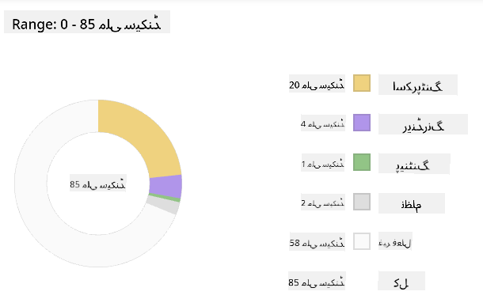

<!--
CO_OP_TRANSLATOR_METADATA:
{
  "original_hash": "eb358f3f4c2c082f9f3a4f98efa1d337",
  "translation_date": "2025-10-22T15:12:28+00:00",
  "source_file": "5-browser-extension/3-background-tasks-and-performance/README.md",
  "language_code": "ur"
}
-->
# براؤزر ایکسٹینشن پروجیکٹ حصہ 3: بیک گراؤنڈ ٹاسکس اور کارکردگی کے بارے میں سیکھیں

کبھی سوچا ہے کہ کچھ براؤزر ایکسٹینشنز کیوں تیز اور جوابدہ محسوس ہوتی ہیں جبکہ دیگر سست لگتی ہیں؟ راز پردے کے پیچھے چھپا ہوا ہے۔ جب صارفین آپ کے ایکسٹینشن کے انٹرفیس پر کلک کرتے ہیں، تو بیک گراؤنڈ میں ڈیٹا فچنگ، آئیکن اپڈیٹس، اور سسٹم ریسورسز کا انتظام کرنے والے عمل خاموشی سے کام کر رہے ہوتے ہیں۔

یہ براؤزر ایکسٹینشن سیریز کا آخری سبق ہے، اور ہم آپ کے کاربن فوٹ پرنٹ ٹریکر کو ہموار طریقے سے کام کرنے کے قابل بنائیں گے۔ آپ متحرک آئیکن اپڈیٹس شامل کریں گے اور کارکردگی کے مسائل کو ان کے مسائل بننے سے پہلے پہچاننا سیکھیں گے۔ یہ بالکل ریس کار کو ٹیون کرنے جیسا ہے - چھوٹی چھوٹی اصلاحات سب کچھ بہتر طریقے سے چلانے میں بڑا فرق ڈال سکتی ہیں۔

جب ہم ختم کریں گے، تو آپ کے پاس ایک پالش شدہ ایکسٹینشن ہوگی اور آپ ان کارکردگی کے اصولوں کو سمجھیں گے جو اچھے ویب ایپس کو بہترین بناتے ہیں۔ آئیے براؤزر کی اصلاح کی دنیا میں غوطہ لگائیں۔

## پری لیکچر کوئز

[پری لیکچر کوئز](https://ff-quizzes.netlify.app/web/quiz/27)

### تعارف

پچھلے اسباق میں، آپ نے ایک فارم بنایا، اسے API سے جوڑا، اور غیر متزامن ڈیٹا فچنگ کا سامنا کیا۔ آپ کا ایکسٹینشن اچھی شکل اختیار کر رہا ہے۔

اب ہمیں آخری ٹچز شامل کرنے کی ضرورت ہے - جیسے کہ اس ایکسٹینشن آئیکن کو کاربن ڈیٹا کی بنیاد پر رنگ تبدیل کرنے کے قابل بنانا۔ یہ مجھے یاد دلاتا ہے کہ ناسا کو اپولو اسپیس کرافٹ کے ہر سسٹم کو بہتر بنانا پڑا تھا۔ وہ کسی بھی ضائع شدہ سائیکل یا میموری کے متحمل نہیں ہو سکتے تھے کیونکہ کارکردگی پر زندگیاں منحصر تھیں۔ اگرچہ ہمارا براؤزر ایکسٹینشن اتنا اہم نہیں ہے، وہی اصول لاگو ہوتے ہیں - مؤثر کوڈ بہتر صارف تجربات تخلیق کرتا ہے۔

## ویب کارکردگی کی بنیادی باتیں

جب آپ کا کوڈ مؤثر طریقے سے چلتا ہے، تو لوگ واقعی فرق محسوس کر سکتے ہیں۔ آپ جانتے ہیں وہ لمحہ جب کوئی صفحہ فوراً لوڈ ہوتا ہے یا کوئی اینیمیشن ہموار طریقے سے چلتی ہے؟ یہ اچھی کارکردگی کا نتیجہ ہے۔

کارکردگی صرف رفتار کے بارے میں نہیں ہے - یہ ویب تجربات کو قدرتی بنانے کے بارے میں ہے، نہ کہ بھاری اور مایوس کن۔ کمپیوٹنگ کے ابتدائی دنوں میں، گریس ہوپر نے اپنے ڈیسک پر ایک نینو سیکنڈ (تقریباً ایک فٹ لمبے تار کا ٹکڑا) رکھا تھا تاکہ یہ دکھایا جا سکے کہ روشنی ایک اربویں سیکنڈ میں کتنی دور سفر کرتی ہے۔ یہ ان کا طریقہ تھا یہ سمجھانے کا کہ کمپیوٹنگ میں ہر مائیکرو سیکنڈ کیوں اہمیت رکھتا ہے۔ آئیے ان جاسوسی ٹولز کو دریافت کریں جو آپ کو یہ معلوم کرنے میں مدد دیتے ہیں کہ کیا چیز چیزوں کو سست کر رہی ہے۔

> "ویب سائٹ کی کارکردگی دو چیزوں کے بارے میں ہے: صفحہ کتنی جلدی لوڈ ہوتا ہے، اور اس پر کوڈ کتنی جلدی چلتا ہے۔" -- [زیک گروسبرٹ](https://www.smashingmagazine.com/2012/06/javascript-profiling-chrome-developer-tools/)

اپنی ویب سائٹس کو ہر قسم کے آلات، ہر قسم کے صارفین، اور ہر قسم کے حالات میں انتہائی تیز بنانے کے بارے میں موضوع حیرت انگیز طور پر وسیع ہے۔ یہاں کچھ نکات ہیں جنہیں آپ کو ایک معیاری ویب پروجیکٹ یا براؤزر ایکسٹینشن بناتے وقت ذہن میں رکھنا چاہیے۔

اپنی سائٹ کو بہتر بنانے کا پہلا قدم یہ سمجھنا ہے کہ پردے کے پیچھے اصل میں کیا ہو رہا ہے۔ خوش قسمتی سے، آپ کے براؤزر میں طاقتور جاسوسی ٹولز پہلے سے موجود ہیں۔

ایج میں ڈیولپر ٹولز کھولنے کے لیے، اوپر دائیں کونے میں تین نقطوں پر کلک کریں، پھر مزید ٹولز > ڈیولپر ٹولز پر جائیں۔ یا کی بورڈ شارٹ کٹ استعمال کریں: ونڈوز پر `Ctrl` + `Shift` + `I` یا میک پر `Option` + `Command` + `I`۔ ایک بار جب آپ وہاں پہنچ جائیں، تو پرفارمنس ٹیب پر کلک کریں - یہ وہ جگہ ہے جہاں آپ اپنی تحقیقات کریں گے۔

**یہاں آپ کا کارکردگی جاسوسی ٹول کٹ ہے:**
- **ڈیولپر ٹولز کھولیں** (آپ انہیں بطور ڈیولپر مسلسل استعمال کریں گے!)
- **پرفارمنس ٹیب پر جائیں** - اسے اپنے ویب ایپ کے فٹنس ٹریکر کے طور پر سوچیں
- **ریکارڈ بٹن دبائیں** اور اپنی صفحہ کی کارروائی دیکھیں
- **نتائج کا مطالعہ کریں** تاکہ معلوم ہو سکے کہ کیا چیز چیزوں کو سست کر رہی ہے

آئیے اسے آزمائیں۔ ایک ویب سائٹ کھولیں (Microsoft.com اس کے لیے اچھی ہے) اور 'ریکارڈ' بٹن پر کلک کریں۔ اب صفحہ کو ریفریش کریں اور پروفائلر کو ہر وہ چیز کی گرفت کرتے ہوئے دیکھیں جو ہو رہی ہے۔ جب آپ ریکارڈنگ بند کریں گے، تو آپ کو ایک تفصیلی تجزیہ نظر آئے گا کہ براؤزر سائٹ کو 'اسکرپٹ'، 'رینڈر'، اور 'پینٹ' کیسے کرتا ہے۔ یہ بالکل مشن کنٹرول کی طرح ہے جو راکٹ لانچ کے دوران ہر سسٹم کی نگرانی کرتا ہے - آپ کو بالکل حقیقی وقت میں ڈیٹا ملتا ہے کہ کیا ہو رہا ہے اور کب۔

✅ [Microsoft Documentation](https://docs.microsoft.com/microsoft-edge/devtools-guide/performance/?WT.mc_id=academic-77807-sagibbon) میں مزید تفصیلات موجود ہیں اگر آپ مزید گہرائی میں جانا چاہتے ہیں۔

> پرو ٹپ: ٹیسٹنگ سے پہلے اپنے براؤزر کی کیشے صاف کریں تاکہ یہ دیکھ سکیں کہ آپ کی سائٹ پہلی بار آنے والے زائرین کے لیے کیسی کارکردگی دکھاتی ہے - یہ عام طور پر بار بار آنے والے دوروں سے کافی مختلف ہوتی ہے!

پروفائل ٹائم لائن کے عناصر کو منتخب کریں تاکہ ان واقعات کو زوم کریں جو آپ کے صفحہ کے لوڈ ہونے کے دوران ہوتے ہیں۔

پروفائل ٹائم لائن کے ایک حصے کو منتخب کرکے اور خلاصہ پین کو دیکھ کر اپنے صفحہ کی کارکردگی کا اسنیپ شاٹ حاصل کریں:



ایونٹ لاگ پین کو چیک کریں تاکہ دیکھ سکیں کہ آیا کوئی ایونٹ 15 ملی سیکنڈ سے زیادہ وقت لے رہا ہے:


✅ اپنے پروفائلر کو جانیں! اس سائٹ پر ڈیولپر ٹولز کھولیں اور دیکھیں کہ کیا کوئی رکاوٹیں ہیں۔ سب سے سست لوڈ ہونے والا اثاثہ کون سا ہے؟ سب سے تیز؟

## پروفائلنگ کرتے وقت کیا دیکھنا ہے

پروفائلر چلانا صرف شروعات ہے - اصل مہارت یہ جاننا ہے کہ وہ رنگین چارٹس آپ کو کیا بتا رہے ہیں۔ فکر نہ کریں، آپ انہیں پڑھنے کی عادت ڈال لیں گے۔ تجربہ کار ڈیولپرز نے مکمل مسائل بننے سے پہلے انتباہی علامات کو پہچاننا سیکھا ہے۔

آئیے عام مشتبہ افراد کے بارے میں بات کرتے ہیں - کارکردگی کے مسائل پیدا کرنے والے جو اکثر ویب پروجیکٹس میں چھپ جاتے ہیں۔ جیسے میری کیوری کو اپنی لیب میں تابکاری کی سطح کی احتیاط سے نگرانی کرنی پڑتی تھی، ہمیں ان مخصوص نمونوں پر نظر رکھنی ہوگی جو مسائل کی نشاندہی کرتے ہیں۔ انہیں جلدی پکڑنا آپ کو (اور آپ کے صارفین کو) بہت زیادہ پریشانی سے بچائے گا۔

**اثاثوں کے سائز**: ویب سائٹس سالوں کے دوران "بھاری" ہوتی جا رہی ہیں، اور اس اضافی وزن کا زیادہ تر حصہ تصاویر سے آتا ہے۔ یہ بالکل ایسا ہے جیسے ہم اپنے ڈیجیٹل سوٹ کیسز میں زیادہ سے زیادہ چیزیں بھر رہے ہوں۔

✅ [Internet Archive](https://httparchive.org/reports/page-weight) کو چیک کریں تاکہ دیکھ سکیں کہ صفحہ کے سائز وقت کے ساتھ کیسے بڑھے ہیں - یہ کافی حیران کن ہے۔

**اپنے اثاثوں کو بہتر رکھنے کے طریقے:**
- **تصاویر کو کمپریس کریں!** جدید فارمیٹس جیسے WebP فائل کے سائز کو نمایاں طور پر کم کر سکتے ہیں
- **ہر ڈیوائس کے لیے صحیح تصویر کا سائز فراہم کریں** - فونز کو بڑی ڈیسک ٹاپ تصاویر بھیجنے کی ضرورت نہیں ہے
- **اپنے CSS اور جاوا اسکرپٹ کو منیفائی کریں** - ہر بائٹ اہم ہے
- **لیزی لوڈنگ استعمال کریں** تاکہ تصاویر صرف اس وقت ڈاؤنلوڈ ہوں جب صارفین واقعی ان تک اسکرول کریں

**DOM ٹریورسلز**: براؤزر کو آپ کے لکھے ہوئے کوڈ کی بنیاد پر اپنا دستاویز آبجیکٹ ماڈل بنانا ہوتا ہے، اس لیے اچھی صفحہ کارکردگی کے لیے اپنے ٹیگز کو کم سے کم رکھنا ضروری ہے، صرف وہی استعمال کریں اور اسٹائل کریں جو صفحہ کو ضرورت ہو۔ اس نقطہ نظر سے، صفحہ سے وابستہ اضافی CSS کو بہتر بنایا جا سکتا ہے؛ وہ اسٹائلز جو صرف ایک صفحہ پر استعمال ہونے کی ضرورت ہے انہیں مین اسٹائل شیٹ میں شامل کرنے کی ضرورت نہیں ہے، مثال کے طور پر۔

**DOM کی اصلاح کے لیے کلیدی حکمت عملی:**
- **HTML عناصر اور نیسٹنگ لیولز کی تعداد کو کم کریں**
- **غیر استعمال شدہ CSS قواعد کو ہٹائیں اور اسٹائل شیٹس کو مؤثر طریقے سے یکجا کریں**
- **CSS کو منظم کریں تاکہ ہر صفحہ کے لیے صرف ضروری چیزیں لوڈ ہوں**
- **HTML کو بہتر براؤزر پارسنگ کے لیے سیمینٹک طور پر ترتیب دیں**

**جاوا اسکرپٹ**: ہر جاوا اسکرپٹ ڈیولپر کو 'رینڈر بلاکنگ' اسکرپٹس کے لیے دیکھنا چاہیے جو DOM کو ٹریورس اور براؤزر پر پینٹ کرنے سے پہلے لوڈ ہونا ضروری ہیں۔ اپنے ان لائن اسکرپٹس کے ساتھ `defer` استعمال کرنے پر غور کریں (جیسا کہ ٹیریریم ماڈیول میں کیا گیا ہے)۔

**جدید جاوا اسکرپٹ کی اصلاح کی تکنیکیں:**
- **اسکرپٹس کو DOM پارسنگ کے بعد لوڈ کرنے کے لیے `defer` ایٹریبیوٹ استعمال کریں**
- **کوڈ اسپلٹنگ نافذ کریں تاکہ صرف ضروری جاوا اسکرپٹ لوڈ ہو**
- **غیر اہم فعالیت کے لیے لیزی لوڈنگ کا اطلاق کریں**
- **بھاری لائبریریوں اور فریم ورک کے استعمال کو کم سے کم کریں جہاں ممکن ہو**

✅ کچھ سائٹس کو [سائٹ اسپیڈ ٹیسٹ ویب سائٹ](https://www.webpagetest.org/) پر آزمائیں تاکہ ان عام چیکز کے بارے میں مزید جان سکیں جو سائٹ کی کارکردگی کا تعین کرنے کے لیے کیے جاتے ہیں۔

اب جب کہ آپ کو اندازہ ہو گیا ہے کہ براؤزر آپ کے بھیجے گئے اثاثوں کو کیسے رینڈر کرتا ہے، آئیے آخری چند چیزوں پر نظر ڈالیں جو آپ کو اپنے ایکسٹینشن کو مکمل کرنے کے لیے کرنے کی ضرورت ہے:

### رنگ کا حساب لگانے کے لیے ایک فنکشن بنائیں

اب ہم ایک فنکشن بنائیں گے جو عددی ڈیٹا کو معنی خیز رنگوں میں تبدیل کرے۔ اسے ٹریفک لائٹ سسٹم کی طرح سوچیں - صاف توانائی کے لیے سبز، زیادہ کاربن شدت کے لیے سرخ۔

یہ فنکشن ہمارے API سے CO2 ڈیٹا لے گا اور یہ طے کرے گا کہ ماحولیاتی اثرات کی بہترین نمائندگی کرنے والا رنگ کون سا ہے۔ یہ بالکل ویسا ہی ہے جیسے سائنسدان پیچیدہ ڈیٹا پیٹرنز کو بصری طور پر ظاہر کرنے کے لیے ہیٹ میپس میں رنگ کوڈنگ کا استعمال کرتے ہیں - سمندر کے درجہ حرارت سے لے کر ستاروں کی تشکیل تک۔ آئیے اسے `/src/index.js` میں شامل کریں، ان `const` ویریبلز کے فوراً بعد جو ہم نے پہلے سیٹ کیے تھے:

```javascript
function calculateColor(value) {
	// Define CO2 intensity scale (grams per kWh)
	const co2Scale = [0, 150, 600, 750, 800];
	// Corresponding colors from green (clean) to dark brown (high carbon)
	const colors = ['#2AA364', '#F5EB4D', '#9E4229', '#381D02', '#381D02'];

	// Find the closest scale value to our input
	const closestNum = co2Scale.sort((a, b) => {
		return Math.abs(a - value) - Math.abs(b - value);
	})[0];
	
	console.log(`${value} is closest to ${closestNum}`);
	
	// Find the index for color mapping
	const num = (element) => element > closestNum;
	const scaleIndex = co2Scale.findIndex(num);

	const closestColor = colors[scaleIndex];
	console.log(scaleIndex, closestColor);

	// Send color update message to background script
	chrome.runtime.sendMessage({ action: 'updateIcon', value: { color: closestColor } });
}
```

**آئیے اس ہوشیار چھوٹے فنکشن کو توڑتے ہیں:**
- **دو arrays سیٹ کرتا ہے** - ایک CO2 لیولز کے لیے، دوسرا رنگوں کے لیے (سبز = صاف، بھورا = گندا!)
- **ہمارے اصل CO2 ویلیو کے قریب ترین میچ تلاش کرتا ہے** کچھ زبردست array sorting کا استعمال کرتے ہوئے
- **findIndex() طریقہ استعمال کرتے ہوئے مماثل رنگ پکڑتا ہے**
- **ہمارے منتخب کردہ رنگ کے ساتھ کروم کے بیک گراؤنڈ اسکرپٹ کو پیغام بھیجتا ہے**
- **صاف string formatting کے لیے template literals (وہ backticks) استعمال کرتا ہے**
- **const declarations کے ساتھ سب کچھ منظم رکھتا ہے**

`chrome.runtime` [API](https://developer.chrome.com/extensions/runtime) آپ کے ایکسٹینشن کا اعصابی نظام کی طرح ہے - یہ پردے کے پیچھے تمام مواصلات اور کاموں کو سنبھالتا ہے:

> "chrome.runtime API کا استعمال کریں تاکہ بیک گراؤنڈ صفحہ حاصل کیا جا سکے، مینیفیسٹ کے بارے میں تفصیلات واپس کریں، اور ایپ یا ایکسٹینشن لائف سائیکل میں ہونے والے ایونٹس کے لیے سنیں اور جواب دیں۔ آپ اس API کا استعمال URLs کے رشتہ دار راستے کو مکمل طور پر اہل URLs میں تبدیل کرنے کے لیے بھی کر سکتے ہیں۔"

**کروم رن ٹائم API کیوں مفید ہے:**
- **آپ کے ایکسٹینشن کے مختلف حصوں کو ایک دوسرے سے بات کرنے دیتا ہے**
- **بیک گراؤنڈ کاموں کو سنبھالتا ہے بغیر صارف انٹرفیس کو منجمد کیے**
- **آپ کے ایکسٹینشن کے لائف سائیکل ایونٹس کو منظم کرتا ہے**
- **اسکرپٹس کے درمیان پیغام رسانی کو بہت آسان بناتا ہے**

✅ اگر آپ یہ براؤزر ایکسٹینشن ایج کے لیے تیار کر رہے ہیں، تو یہ جان کر حیرت ہو سکتی ہے کہ آپ کروم API استعمال کر رہے ہیں۔ ایج براؤزر کے نئے ورژن کرومیم براؤزر انجن پر چلتے ہیں، اس لیے آپ ان ٹولز کا فائدہ اٹھا سکتے ہیں۔

> **پرو ٹپ**: اگر آپ کسی براؤزر ایکسٹینشن کو پروفائل کرنا چاہتے ہیں، تو ایکسٹینشن کے اندر سے ڈیولپر ٹولز لانچ کریں، کیونکہ یہ اپنا الگ براؤزر انسٹینس ہے۔ یہ آپ کو ایکسٹینشن سے متعلق کارکردگی کے میٹرکس تک رسائی فراہم کرتا ہے۔

### ایک ڈیفالٹ آئیکن رنگ سیٹ کریں

حقیقی ڈیٹا فچنگ شروع کرنے سے پہلے، آئیے اپنے ایکسٹینشن کو ایک ابتدائی نقطہ دیں۔ کوئی بھی خالی یا خراب نظر آنے والے آئیکن کو دیکھنا پسند نہیں کرتا۔ ہم سبز رنگ سے شروع کریں گے تاکہ صارفین کو معلوم ہو کہ ایکسٹینشن انسٹال کرنے کے لمحے سے کام کر رہا ہے۔

اپنے `init()` فنکشن میں، آئیے وہ ڈیفالٹ سبز آئیکن سیٹ کریں:

```javascript
chrome.runtime.sendMessage({
	action: 'updateIcon',
	value: {
		color: 'green',
	},
});
```

**یہ initialization کیا حاصل کرتا ہے:**
- **ایک غیر جانبدار سبز رنگ کو ڈیفالٹ حالت کے طور پر سیٹ کرتا ہے**
- **ایکسٹینشن لوڈ ہونے پر فوری بصری فیڈبیک فراہم کرتا ہے**
- **بیک گراؤنڈ اسکرپٹ کے ساتھ مواصلاتی پیٹرن قائم کرتا ہے**
- **یقینی بناتا ہے کہ صارفین ڈیٹا لوڈ ہونے سے پہلے ایک فعال ایکسٹینشن دیکھیں**

### فنکشن کو کال کریں، کال کو نافذ کریں

اب آئیے سب کچھ ایک ساتھ جوڑیں تاکہ جب تازہ CO2 ڈیٹا آئے، آپ کا آئیکن خود بخود صحیح رنگ کے ساتھ اپڈیٹ ہو جائے۔ یہ بالکل الیکٹرانک ڈیوائس میں آخری سرکٹ کو جوڑنے جیسا ہے - اچانک تمام انفرادی اجزاء ایک نظام کے طور پر کام کرتے ہیں۔

یہ لائن API سے CO2 ڈیٹا حاصل کرنے کے فوراً بعد شامل کریں:

```javascript
// After retrieving CO2 data from the API
// let CO2 = data.data[0].intensity.actual;
calculateColor(CO2);
```

**یہ انضمام کیا حاصل کرتا ہے:**
- **API ڈیٹا فلو کو بصری اشارے کے نظام کے ساتھ جوڑتا ہے**
- **نئے ڈیٹا کے آنے پر آئیکن اپڈیٹس کو خود بخود متحرک کرتا ہے**
- **موجودہ کاربن شدت کی بنیاد پر حقیقی وقت میں بصری فیڈبیک فراہم کرتا ہے**
- **ڈیٹا فچنگ اور ڈسپلے لاجک کے درمیان خدشات کی علیحدگی کو برقرار رکھتا ہے**

اور آخر میں، `/dist/background.js` میں، ان بیک گراؤنڈ ایکشن کالز کے لیے listener شامل کریں:

```javascript
// Listen for messages from the content script
chrome.runtime.onMessage.addListener(function (msg, sender, sendResponse) {
	if (msg.action === 'updateIcon') {
		chrome.action.setIcon({ imageData: drawIcon(msg.value) });
	}
});

// Draw dynamic icon using Canvas API
// Borrowed from energy lollipop extension - nice feature!
function drawIcon(value) {
	// Create an offscreen canvas for better performance
	const canvas = new OffscreenCanvas(200, 200);
	const context = canvas.getContext('2d');

	// Draw a colored circle representing carbon intensity
	context.beginPath();
	context.fillStyle = value.color;
	context.arc(100, 100, 50, 0, 2 * Math.PI);
	context.fill();

	// Return the image data for the browser icon
	return context.getImageData(50, 50, 100, 100);
}
```

**یہ بیک گراؤنڈ اسکرپٹ کیا کرتا ہے:**
- **آپ کے مین اسکرپٹ سے پیغامات سنتا ہے (جیسے ایک ریسیپشنسٹ کالز لیتا ہے)**
- **ان 'updateIcon' درخواستوں کو پروسیس کرتا ہے تاکہ آپ کے ٹول بار آئیکن کو تبدیل کیا جا سکے**
- **Canvas API کا استعمال کرتے ہوئے نئے آئیکنز فوری طور پر تخلیق کرتا ہے**
- **ایک سادہ رنگین دائرہ کھینچتا ہے جو موجودہ کاربن شدت
یہاں ایک دلچسپ جاسوسی مشن ہے: کچھ ایسے اوپن سورس ویب سائٹس کا انتخاب کریں جو کئی سالوں سے موجود ہیں (جیسے ویکیپیڈیا، گٹ ہب، یا اسٹیک اوور فلو) اور ان کے کمیٹ ہسٹری میں جھانکیں۔ کیا آپ دیکھ سکتے ہیں کہ انہوں نے کہاں کارکردگی میں بہتری کی؟ کون سے مسائل بار بار سامنے آتے رہے؟

**آپ کی تحقیق کا طریقہ:**
- **کمیٹ میسیجز** میں ایسے الفاظ تلاش کریں جیسے "بہتر بنانا"، "کارکردگی"، یا "تیز"
- **پیٹرنز** دیکھیں - کیا وہ بار بار ایک ہی قسم کے مسائل حل کر رہے ہیں؟
- **عام وجوہات** کی نشاندہی کریں جو ویب سائٹس کو سست کرتی ہیں
- **اپنی دریافتیں شیئر کریں** - دوسرے ڈیولپرز حقیقی دنیا کی مثالوں سے سیکھ سکتے ہیں

## لیکچر کے بعد کا کوئز

[لیکچر کے بعد کا کوئز](https://ff-quizzes.netlify.app/web/quiz/28)

## جائزہ اور خود مطالعہ

ایک [کارکردگی نیوز لیٹر](https://perf.email/) کے لیے سائن اپ کرنے پر غور کریں۔

براؤزرز ویب کارکردگی کو جانچنے کے کچھ طریقوں کی تحقیق کریں، ان کے ویب ٹولز کے پرفارمنس ٹیبز کو دیکھ کر۔ کیا آپ کو کوئی بڑی فرق نظر آتی ہے؟

## اسائنمنٹ

[کسی سائٹ کا تجزیہ کریں](assignment.md)

---

**ڈسکلیمر**:  
یہ دستاویز AI ترجمہ سروس [Co-op Translator](https://github.com/Azure/co-op-translator) کا استعمال کرتے ہوئے ترجمہ کی گئی ہے۔ ہم درستگی کے لیے کوشش کرتے ہیں، لیکن براہ کرم آگاہ رہیں کہ خودکار ترجمے میں غلطیاں یا غیر درستیاں ہو سکتی ہیں۔ اصل دستاویز کو اس کی اصل زبان میں مستند ذریعہ سمجھا جانا چاہیے۔ اہم معلومات کے لیے، پیشہ ور انسانی ترجمہ کی سفارش کی جاتی ہے۔ ہم اس ترجمے کے استعمال سے پیدا ہونے والی کسی بھی غلط فہمی یا غلط تشریح کے ذمہ دار نہیں ہیں۔