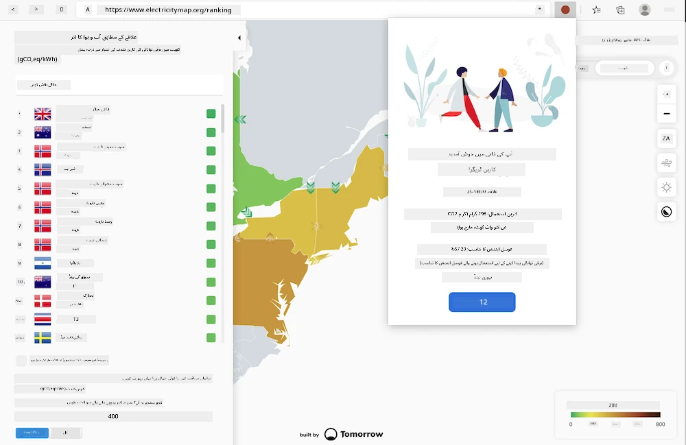
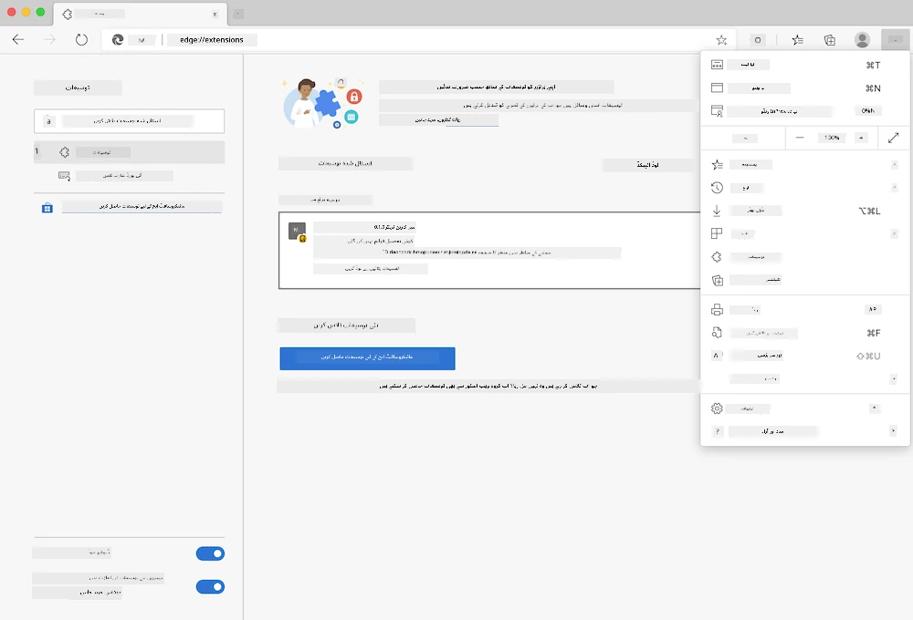

# کاربن ٹریگر براؤزر ایکسٹینشن: مکمل کوڈ

tmrow کے C02 Signal API کا استعمال کرتے ہوئے بجلی کے استعمال کو ٹریک کریں اور ایک براؤزر ایکسٹینشن بنائیں تاکہ آپ کے براؤزر میں یاد دہانی ہو کہ آپ کے علاقے میں بجلی کا استعمال کتنا زیادہ ہے۔ اس ایکسٹینشن کو استعمال کرنے سے آپ کو اپنی سرگرمیوں کے بارے میں بہتر فیصلے کرنے میں مدد ملے گی۔



## شروعات کرنا

آپ کو [npm](https://npmjs.com) انسٹال کرنا ہوگا۔ اس کوڈ کی ایک کاپی اپنے کمپیوٹر کے کسی فولڈر میں ڈاؤنلوڈ کریں۔

ضروری پیکجز انسٹال کریں:

```
npm install
```

ویب پیک سے ایکسٹینشن بنائیں:

```
npm run build
```

Edge پر انسٹال کرنے کے لیے، براؤزر کے اوپر دائیں کونے میں موجود 'تین نقطے' والے مینو کا استعمال کریں تاکہ ایکسٹینشنز پینل تک پہنچ سکیں۔ وہاں سے 'Load Unpacked' کو منتخب کریں تاکہ ایک نیا ایکسٹینشن لوڈ کیا جا سکے۔ جب پرامپٹ آئے تو 'dist' فولڈر کھولیں اور ایکسٹینشن لوڈ ہو جائے گا۔ اسے استعمال کرنے کے لیے آپ کو CO2 Signal کے API کے لیے ایک API key کی ضرورت ہوگی ([یہاں ای میل کے ذریعے حاصل کریں](https://www.co2signal.com/) - اس صفحے پر اپنا ای میل درج کریں) اور اپنے علاقے کے لیے [Electricity Map](https://www.electricitymap.org/map) کے مطابق [کوڈ](http://api.electricitymap.org/v3/zones) کی ضرورت ہوگی (مثال کے طور پر، بوسٹن میں، میں 'US-NEISO' استعمال کرتا ہوں)۔



جب API key اور علاقائی کوڈ ایکسٹینشن انٹرفیس میں درج کر دیے جائیں، تو براؤزر ایکسٹینشن بار میں موجود رنگین نقطہ آپ کے علاقے کے توانائی کے استعمال کو ظاہر کرے گا اور آپ کو یہ مشورہ دے گا کہ کون سی توانائی سے متعلق سرگرمیاں آپ کے لیے مناسب ہوں گی۔ اس 'نقطہ' سسٹم کا تصور مجھے [Energy Lollipop ایکسٹینشن](https://energylollipop.com/) سے ملا تھا جو کیلیفورنیا کے اخراجات کے لیے بنایا گیا ہے۔

**ڈسکلیمر**:  
یہ دستاویز AI ترجمہ سروس [Co-op Translator](https://github.com/Azure/co-op-translator) کا استعمال کرتے ہوئے ترجمہ کی گئی ہے۔ ہم درستگی کے لیے کوشش کرتے ہیں، لیکن براہ کرم آگاہ رہیں کہ خودکار ترجمے میں غلطیاں یا غیر درستیاں ہو سکتی ہیں۔ اصل دستاویز کو اس کی اصل زبان میں مستند ذریعہ سمجھا جانا چاہیے۔ اہم معلومات کے لیے، پیشہ ور انسانی ترجمہ کی سفارش کی جاتی ہے۔ ہم اس ترجمے کے استعمال سے پیدا ہونے والی کسی بھی غلط فہمی یا غلط تشریح کے ذمہ دار نہیں ہیں۔