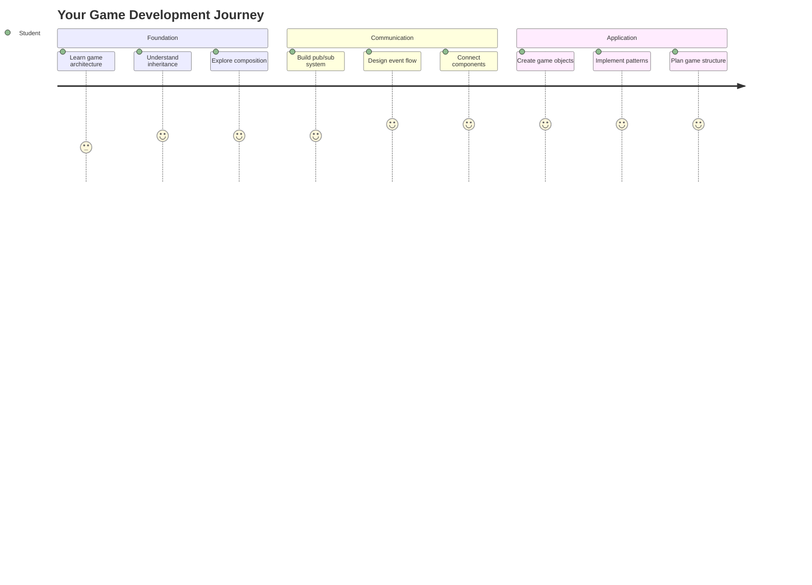
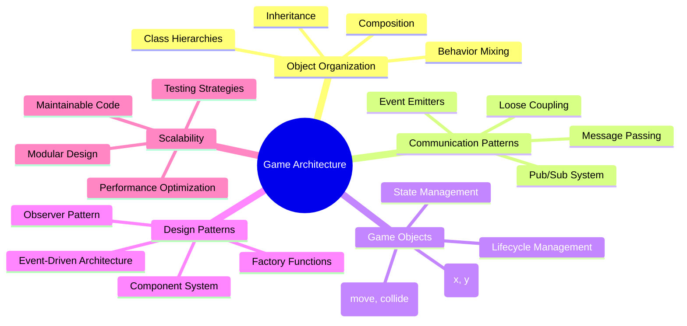
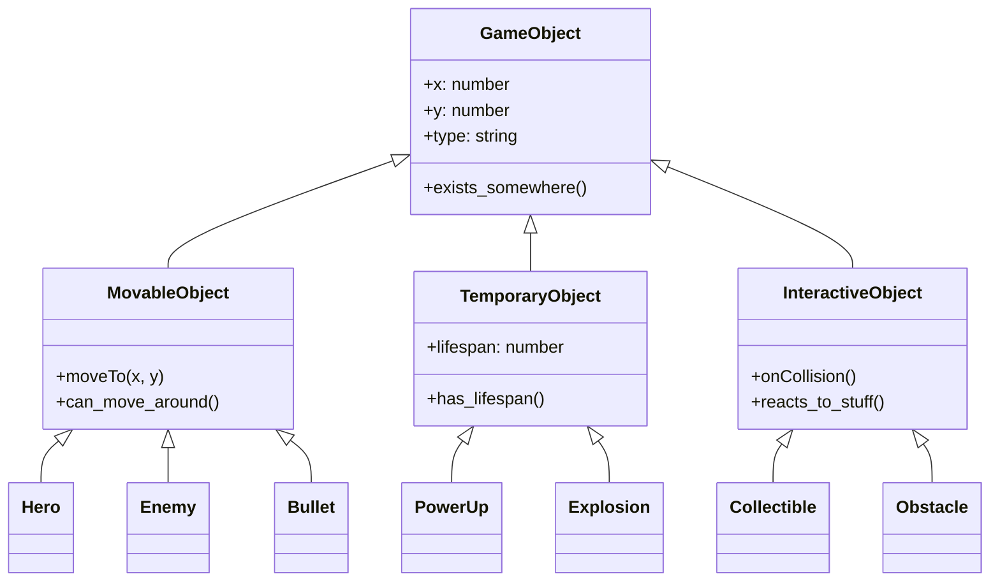
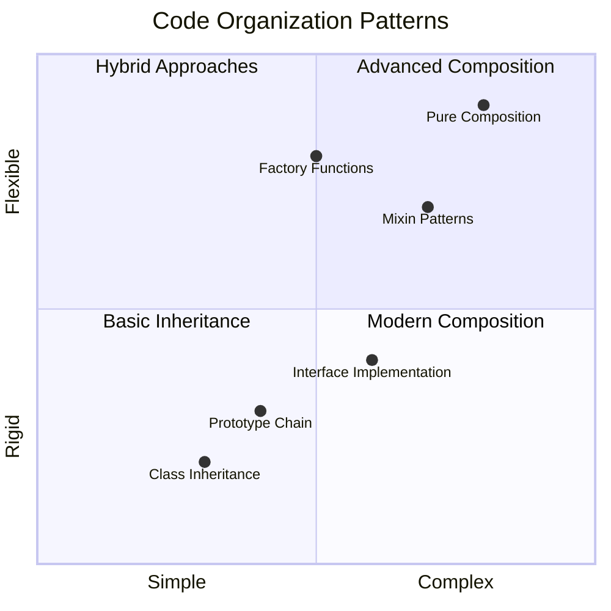
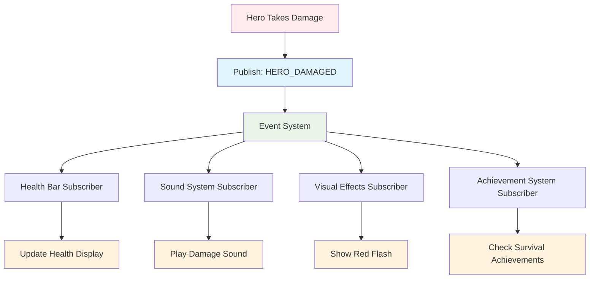
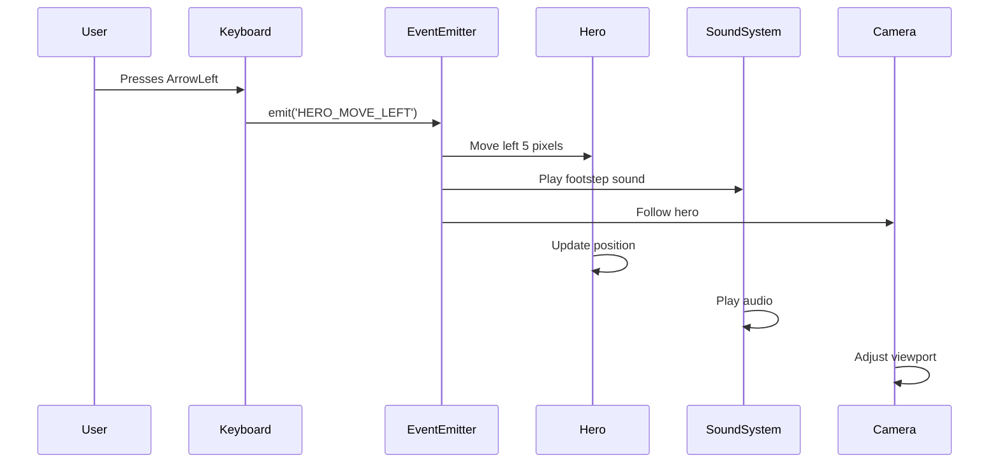
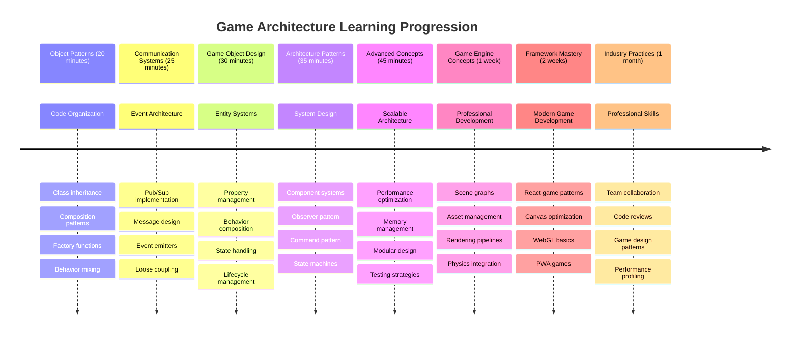

<!--
CO_OP_TRANSLATOR_METADATA:
{
  "original_hash": "a6332a7bb4d0be3bfd24199c83993777",
  "translation_date": "2025-11-03T13:36:40+00:00",
  "source_file": "6-space-game/1-introduction/README.md",
  "language_code": "ur"
}
-->
# خلائی کھیل بنائیں حصہ 1: تعارف




جیسے ناسا کا مشن کنٹرول خلائی لانچ کے دوران مختلف نظاموں کو مربوط کرتا ہے، ہم ایک خلائی کھیل بنائیں گے جو یہ ظاہر کرے گا کہ کس طرح ایک پروگرام کے مختلف حصے بغیر کسی رکاوٹ کے ایک ساتھ کام کر سکتے ہیں۔ کچھ ایسا تخلیق کرتے ہوئے جسے آپ واقعی کھیل سکیں، آپ بنیادی پروگرامنگ تصورات سیکھیں گے جو کسی بھی سافٹ ویئر پروجیکٹ پر لاگو ہوتے ہیں۔

ہم کوڈ کو منظم کرنے کے دو بنیادی طریقوں کا جائزہ لیں گے: وراثت اور ترکیب۔ یہ صرف تعلیمی تصورات نہیں ہیں – یہ وہی نمونے ہیں جو ویڈیو گیمز سے لے کر بینکنگ سسٹمز تک سب کچھ طاقت دیتے ہیں۔ ہم ایک مواصلاتی نظام بھی نافذ کریں گے جسے pub/sub کہا جاتا ہے جو خلائی جہاز میں استعمال ہونے والے مواصلاتی نیٹ ورکس کی طرح کام کرتا ہے، جس سے مختلف اجزاء کو معلومات کا اشتراک کرنے کی اجازت ملتی ہے بغیر انحصار پیدا کیے۔

اس سیریز کے اختتام تک، آپ یہ سمجھ جائیں گے کہ ایسی ایپلیکیشنز کیسے بنائی جائیں جو پیمانے پر بڑھ سکیں اور ترقی کر سکیں – چاہے آپ گیمز، ویب ایپلیکیشنز، یا کوئی اور سافٹ ویئر سسٹم تیار کر رہے ہوں۔



## لیکچر سے پہلے کا کوئز

[لیکچر سے پہلے کا کوئز](https://ff-quizzes.netlify.app/web/quiz/29)

## گیم ڈیولپمنٹ میں وراثت اور ترکیب

جیسے جیسے پروجیکٹس پیچیدگی میں بڑھتے ہیں، کوڈ کی تنظیم اہم ہو جاتی ہے۔ جو ایک سادہ اسکرپٹ کے طور پر شروع ہوتا ہے وہ مناسب ڈھانچے کے بغیر برقرار رکھنا مشکل ہو سکتا ہے – بالکل اسی طرح جیسے اپولو مشنز کو ہزاروں اجزاء کے درمیان محتاط ہم آہنگی کی ضرورت تھی۔

ہم کوڈ کو منظم کرنے کے دو بنیادی طریقوں کا جائزہ لیں گے: وراثت اور ترکیب۔ ہر ایک کے الگ الگ فوائد ہیں، اور دونوں کو سمجھنا مختلف حالات کے لیے صحیح طریقہ منتخب کرنے میں مدد کرتا ہے۔ ہم ان تصورات کو اپنے خلائی کھیل کے ذریعے ظاہر کریں گے، جہاں ہیروز، دشمن، پاور اپس، اور دیگر اشیاء کو مؤثر طریقے سے بات چیت کرنی ہوگی۔

✅ سب سے مشہور پروگرامنگ کتابوں میں سے ایک [ڈیزائن پیٹرنز](https://en.wikipedia.org/wiki/Design_Patterns) کے بارے میں ہے۔

کسی بھی کھیل میں، آپ کے پاس `گیم آبجیکٹس` ہوتے ہیں – انٹرایکٹو عناصر جو آپ کی گیم کی دنیا کو آباد کرتے ہیں۔ ہیروز، دشمن، پاور اپس، اور بصری اثرات سب گیم آبجیکٹس ہیں۔ ہر ایک مخصوص اسکرین کوآرڈینیٹس پر موجود ہوتا ہے جو `x` اور `y` اقدار کا استعمال کرتے ہوئے پوائنٹس کو کوآرڈینیٹ طیارے پر پلاٹ کرنے کے مترادف ہے۔

ان کے بصری اختلافات کے باوجود، یہ اشیاء اکثر بنیادی رویے کا اشتراک کرتی ہیں:

- **وہ کہیں موجود ہیں** – ہر آبجیکٹ کے پاس x اور y کوآرڈینیٹس ہوتے ہیں تاکہ گیم کو معلوم ہو کہ اسے کہاں ڈرائنگ کرنا ہے
- **بہت سے ارد گرد حرکت کر سکتے ہیں** – ہیروز دوڑتے ہیں، دشمن پیچھا کرتے ہیں، گولیاں اسکرین پر اڑتی ہیں
- **ان کی زندگی کی مدت ہوتی ہے** – کچھ ہمیشہ کے لیے رہتے ہیں، دوسرے (جیسے دھماکے) مختصر وقت کے لیے ظاہر ہوتے ہیں اور غائب ہو جاتے ہیں
- **وہ چیزوں پر ردعمل ظاہر کرتے ہیں** – جب چیزیں ٹکراتی ہیں، پاور اپس جمع کیے جاتے ہیں، صحت کی بارز اپ ڈیٹ ہوتی ہیں

✅ Pac-Man جیسے کھیل کے بارے میں سوچیں۔ کیا آپ اس کھیل میں درج بالا چار آبجیکٹ اقسام کی شناخت کر سکتے ہیں؟



### کوڈ کے ذریعے رویے کا اظہار

اب جب کہ آپ سمجھ گئے ہیں کہ گیم آبجیکٹس کے مشترکہ رویے کیا ہیں، آئیے ان رویوں کو جاوا اسکرپٹ میں نافذ کرنے کے طریقے کا جائزہ لیتے ہیں۔ آپ کلاسز یا انفرادی آبجیکٹس سے منسلک طریقوں کے ذریعے آبجیکٹ کے رویے کا اظہار کر سکتے ہیں، اور منتخب کرنے کے لیے کئی طریقے ہیں۔

**کلاس پر مبنی طریقہ**

کلاسز اور وراثت گیم آبجیکٹس کو منظم کرنے کے لیے ایک منظم طریقہ فراہم کرتے ہیں۔ کارل لینیئس کے تیار کردہ ٹیکسونومک درجہ بندی کے نظام کی طرح، آپ عام خصوصیات پر مشتمل ایک بنیادی کلاس کے ساتھ شروع کرتے ہیں، پھر خصوصی کلاسز بناتے ہیں جو ان بنیادی اصولوں کو وراثت میں حاصل کرتے ہیں جبکہ مخصوص صلاحیتوں کو شامل کرتے ہیں۔

✅ وراثت کو سمجھنا ایک اہم تصور ہے۔ [وراثت کے بارے میں MDN کے مضمون](https://developer.mozilla.org/docs/Web/JavaScript/Inheritance_and_the_prototype_chain) پر مزید جانیں۔

یہاں یہ ہے کہ آپ کلاسز اور وراثت کا استعمال کرتے ہوئے گیم آبجیکٹس کو کیسے نافذ کر سکتے ہیں:

```javascript
// Step 1: Create the base GameObject class
class GameObject {
  constructor(x, y, type) {
    this.x = x;
    this.y = y;
    this.type = type;
  }
}
```

**آئیے اسے قدم بہ قدم توڑتے ہیں:**
- ہم ایک بنیادی ٹیمپلیٹ بنا رہے ہیں جسے ہر گیم آبجیکٹ استعمال کر سکتا ہے
- کنسٹرکٹر محفوظ کرتا ہے کہ آبجیکٹ کہاں ہے (`x`, `y`) اور یہ کس قسم کی چیز ہے
- یہ وہ بنیاد بن جاتا ہے جس پر آپ کے تمام گیم آبجیکٹس تعمیر ہوں گے

```javascript
// Step 2: Add movement capability through inheritance
class Movable extends GameObject {
  constructor(x, y, type) {
    super(x, y, type); // Call parent constructor
  }

  // Add the ability to move to a new position
  moveTo(x, y) {
    this.x = x;
    this.y = y;
  }
}
```

**اوپر میں، ہم نے:**
- **GameObject کلاس کو بڑھایا** تاکہ حرکت کی فعالیت شامل کی جا سکے
- **پیرنٹ کنسٹرکٹر کو `super()` کا استعمال کرتے ہوئے کال کیا** تاکہ وراثت میں حاصل کردہ خصوصیات کو شروع کیا جا سکے
- **ایک `moveTo()` طریقہ شامل کیا** جو آبجیکٹ کی پوزیشن کو اپ ڈیٹ کرتا ہے

```javascript
// Step 3: Create specific game object types
class Hero extends Movable {
  constructor(x, y) {
    super(x, y, 'Hero'); // Set type automatically
  }
}

class Tree extends GameObject {
  constructor(x, y) {
    super(x, y, 'Tree'); // Trees don't need movement
  }
}

// Step 4: Use your game objects
const hero = new Hero(0, 0);
hero.moveTo(5, 5); // Hero can move!

const tree = new Tree(10, 15);
// tree.moveTo() would cause an error - trees can't move
```

**ان تصورات کو سمجھنا:**
- **مخصوص آبجیکٹ اقسام تخلیق کرتا ہے** جو مناسب رویے وراثت میں حاصل کرتے ہیں
- **دکھاتا ہے** کہ وراثت منتخب خصوصیت کو شامل کرنے کی اجازت دیتا ہے
- **ظاہر کرتا ہے** کہ ہیروز حرکت کر سکتے ہیں جبکہ درخت ساکن رہتے ہیں
- **وضاحت کرتا ہے** کہ کلاس کی درجہ بندی نامناسب اعمال کو روکتی ہے

✅ چند منٹ نکالیں اور Pac-Man کے ہیرو (مثال کے طور پر Inky، Pinky یا Blinky) کو دوبارہ تصور کریں اور یہ جاوا اسکرپٹ میں کیسے لکھا جائے گا۔

**ترکیب کا طریقہ**

ترکیب ایک ماڈیولر ڈیزائن فلسفہ کی پیروی کرتی ہے، بالکل اسی طرح جیسے انجینئرز خلائی جہاز کو قابل تبادلہ اجزاء کے ساتھ ڈیزائن کرتے ہیں۔ پیرنٹ کلاس سے وراثت حاصل کرنے کے بجائے، آپ مخصوص رویوں کو یکجا کرتے ہیں تاکہ آبجیکٹس کو بالکل وہی فعالیت فراہم کی جا سکے جس کی انہیں ضرورت ہے۔ یہ طریقہ سخت درجہ بندی کی حدود کے بغیر لچک پیش کرتا ہے۔

```javascript
// Step 1: Create base behavior objects
const gameObject = {
  x: 0,
  y: 0,
  type: ''
};

const movable = {
  moveTo(x, y) {
    this.x = x;
    this.y = y;
  }
};
```

**یہ کوڈ کیا کرتا ہے:**
- **ایک بنیادی `gameObject` کی وضاحت کرتا ہے** جس میں پوزیشن اور قسم کی خصوصیات ہیں
- **ایک الگ `movable` رویے کا آبجیکٹ تخلیق کرتا ہے** جس میں حرکت کی فعالیت ہے
- **تشویشات کو الگ کرتا ہے** پوزیشن ڈیٹا اور حرکت کی منطق کو آزاد رکھ کر

```javascript
// Step 2: Compose objects by combining behaviors
const movableObject = { ...gameObject, ...movable };

// Step 3: Create factory functions for different object types
function createHero(x, y) {
  return {
    ...movableObject,
    x,
    y,
    type: 'Hero'
  };
}

function createStatic(x, y, type) {
  return {
    ...gameObject,
    x,
    y,
    type
  };
}
```

**اوپر میں، ہم نے:**
- **بیس آبجیکٹ کی خصوصیات کو حرکت کے رویے کے ساتھ یکجا کیا** اسپریڈ نحو کا استعمال کرتے ہوئے
- **فیکٹری فنکشنز تخلیق کیے** جو حسب ضرورت آبجیکٹس واپس کرتے ہیں
- **لچکدار آبجیکٹ تخلیق کو فعال کیا** بغیر سخت کلاس کی درجہ بندی کے
- **آبجیکٹس کو بالکل وہی رویے فراہم کیے** جس کی انہیں ضرورت ہے

```javascript
// Step 4: Create and use your composed objects
const hero = createHero(10, 10);
hero.moveTo(5, 5); // Works perfectly!

const tree = createStatic(0, 0, 'Tree');
// tree.moveTo() is undefined - no movement behavior was composed
```

**یاد رکھنے کے اہم نکات:**
- **آبجیکٹس کو ترکیب کرتا ہے** رویے کو ملانے کے ذریعے بجائے وراثت حاصل کرنے کے
- **سخت وراثت کی درجہ بندی کے مقابلے میں زیادہ لچک فراہم کرتا ہے**
- **آبجیکٹس کو بالکل وہی خصوصیات فراہم کرتا ہے** جس کی انہیں ضرورت ہے
- **صاف آبجیکٹ امتزاج کے لیے جدید جاوا اسکرپٹ اسپریڈ نحو کا استعمال کرتا ہے**
```

**Which Pattern Should You Choose?**

**Which Pattern Should You Choose?**



> 💡 **پرو ٹپ**: دونوں نمونے جدید جاوا اسکرپٹ ڈیولپمنٹ میں اپنی جگہ رکھتے ہیں۔ کلاسز واضح طور پر بیان کردہ درجہ بندی کے لیے اچھی طرح کام کرتی ہیں، جبکہ ترکیب زیادہ سے زیادہ لچک کی ضرورت کے وقت چمکتی ہے۔
> 
**یہاں کب ہر طریقہ استعمال کرنا ہے:**
- **وراثت کا انتخاب کریں** جب آپ کے پاس واضح "is-a" تعلقات ہوں (ایک ہیرو *is-a* Movable آبجیکٹ)
- **ترکیب کا انتخاب کریں** جب آپ کو "has-a" تعلقات کی ضرورت ہو (ایک ہیرو *has* حرکت کی صلاحیتیں)
- **اپنی ٹیم کی ترجیحات اور پروجیکٹ کی ضروریات پر غور کریں**
- **یاد رکھیں** کہ آپ ایک ہی ایپلیکیشن میں دونوں طریقوں کو ملا سکتے ہیں

### 🔄 **تعلیمی جائزہ**
**آبجیکٹ تنظیم کی سمجھ**: مواصلاتی نمونوں کی طرف بڑھنے سے پہلے، یقینی بنائیں کہ آپ:
- ✅ وراثت اور ترکیب کے فرق کی وضاحت کر سکتے ہیں
- ✅ کلاسز بمقابلہ فیکٹری فنکشنز کے استعمال کے وقت کی شناخت کر سکتے ہیں
- ✅ سمجھ سکتے ہیں کہ وراثت میں `super()` کلیدی لفظ کیسے کام کرتا ہے
- ✅ گیم ڈیولپمنٹ کے لیے ہر طریقہ کے فوائد کو پہچان سکتے ہیں

**خود کا فوری ٹیسٹ**: آپ ایک ایسا اڑنے والا دشمن کیسے بنائیں گے جو حرکت کر سکتا ہے اور اڑ سکتا ہے؟
- **وراثت کا طریقہ**: `class FlyingEnemy extends Movable`
- **ترکیب کا طریقہ**: `{ ...movable, ...flyable, ...gameObject }`

**حقیقی دنیا کا تعلق**: یہ نمونے ہر جگہ ظاہر ہوتے ہیں:
- **React Components**: Props (ترکیب) بمقابلہ کلاس وراثت
- **گیم انجنز**: Entity-component systems ترکیب کا استعمال کرتے ہیں
- **موبائل ایپس**: UI فریم ورک اکثر وراثت کی درجہ بندی کا استعمال کرتے ہیں

## مواصلاتی نمونے: Pub/Sub نظام

جیسے جیسے ایپلیکیشنز پیچیدہ ہوتی ہیں، اجزاء کے درمیان مواصلات کا انتظام کرنا چیلنجنگ ہو جاتا ہے۔ پبلش-سبسکرائب نمونہ (pub/sub) اس مسئلے کو ریڈیو براڈکاسٹنگ کے اصولوں کا استعمال کرتے ہوئے حل کرتا ہے – ایک ٹرانسمیٹر متعدد ریسیورز تک پہنچ سکتا ہے بغیر یہ جانے کہ کون سن رہا ہے۔

سوچیں کہ جب ایک ہیرو کو نقصان پہنچتا ہے تو کیا ہوتا ہے: صحت کی بار اپ ڈیٹ ہوتی ہے، صوتی اثرات چلتے ہیں، بصری تاثرات ظاہر ہوتے ہیں۔ ہیرو آبجیکٹ کو براہ راست ان سسٹمز سے جوڑنے کے بجائے، pub/sub ہیرو کو "نقصان پہنچا" پیغام نشر کرنے کی اجازت دیتا ہے۔ کوئی بھی سسٹم جسے جواب دینے کی ضرورت ہو وہ اس پیغام کی قسم کو سبسکرائب کر سکتا ہے اور اس کے مطابق ردعمل دے سکتا ہے۔

✅ **Pub/Sub** کا مطلب ہے 'پبلش-سبسکرائب'



### Pub/Sub آرکیٹیکچر کو سمجھنا

Pub/Sub نمونہ آپ کی ایپلیکیشن کے مختلف حصوں کو ڈھیلے سے جوڑ کر رکھتا ہے، یعنی وہ ایک دوسرے پر براہ راست انحصار کیے بغیر ایک ساتھ کام کر سکتے ہیں۔ یہ علیحدگی آپ کے کوڈ کو زیادہ قابل انتظام، قابل آزمائش، اور تبدیلیوں کے لیے لچکدار بناتی ہے۔

**Pub/Sub کے کلیدی کردار:**
- **پیغامات** – سادہ ٹیکسٹ لیبلز جیسے `'PLAYER_SCORED'` جو بتاتے ہیں کہ کیا ہوا (پلس کوئی اضافی معلومات)
- **پبلشرز** – وہ آبجیکٹس جو "کچھ ہوا!" کسی کو بھی جو سن رہا ہو، بتاتے ہیں
- **سبسکرائبرز** – وہ آبجیکٹس جو کہتے ہیں "مجھے اس ایونٹ کی پرواہ ہے" اور جب یہ ہوتا ہے تو ردعمل دیتے ہیں
- **ایونٹ سسٹم** – درمیانی شخص جو یقینی بناتا ہے کہ پیغامات صحیح سننے والوں تک پہنچیں

### ایونٹ سسٹم بنانا

آئیے ایک سادہ لیکن طاقتور ایونٹ سسٹم بنائیں جو ان تصورات کو ظاہر کرتا ہے:

```javascript
// Step 1: Create the EventEmitter class
class EventEmitter {
  constructor() {
    this.listeners = {}; // Store all event listeners
  }
  
  // Register a listener for a specific message type
  on(message, listener) {
    if (!this.listeners[message]) {
      this.listeners[message] = [];
    }
    this.listeners[message].push(listener);
  }
  
  // Send a message to all registered listeners
  emit(message, payload = null) {
    if (this.listeners[message]) {
      this.listeners[message].forEach(listener => {
        listener(message, payload);
      });
    }
  }
}
```

**یہاں کیا ہوتا ہے:**
- **ایک مرکزی ایونٹ مینجمنٹ سسٹم تخلیق کرتا ہے** ایک سادہ کلاس کا استعمال کرتے ہوئے
- **پیغام کی قسم کے لحاظ سے منظم کردہ ایک آبجیکٹ میں سننے والوں کو ذخیرہ کرتا ہے**
- **نئے سننے والوں کو `on()` طریقہ استعمال کرتے ہوئے رجسٹر کرتا ہے**
- **پیغامات کو تمام دلچسپی رکھنے والے سننے والوں تک نشر کرتا ہے** `emit()` کا استعمال کرتے ہوئے
- **اختیاری ڈیٹا پے لوڈز کی حمایت کرتا ہے** متعلقہ معلومات منتقل کرنے کے لیے

### سب کچھ ایک ساتھ رکھنا: ایک عملی مثال

ٹھیک ہے، آئیے اسے عمل میں دیکھتے ہیں! ہم ایک سادہ حرکت کا نظام بنائیں گے جو دکھائے گا کہ pub/sub کتنا صاف اور لچکدار ہو سکتا ہے:

```javascript
// Step 1: Define your message types
const Messages = {
  HERO_MOVE_LEFT: 'HERO_MOVE_LEFT',
  HERO_MOVE_RIGHT: 'HERO_MOVE_RIGHT',
  ENEMY_SPOTTED: 'ENEMY_SPOTTED'
};

// Step 2: Create your event system and game objects
const eventEmitter = new EventEmitter();
const hero = createHero(0, 0);
```

**یہ کوڈ کیا کرتا ہے:**
- **ایک کانسٹنٹس آبجیکٹ کی وضاحت کرتا ہے** پیغام کے ناموں میں ٹائپوز کو روکنے کے لیے
- **ایک ایونٹ ایمیٹر انسٹینس تخلیق کرتا ہے** تمام مواصلات کو ہینڈل کرنے کے لیے
- **ایک ہیرو آبجیکٹ کو ابتدائی پوزیشن پر شروع کرتا ہے**

```javascript
// Step 3: Set up event listeners (subscribers)
eventEmitter.on(Messages.HERO_MOVE_LEFT, () => {
  hero.moveTo(hero.x - 5, hero.y);
  console.log(`Hero moved to position: ${hero.x}, ${hero.y}`);
});

eventEmitter.on(Messages.HERO_MOVE_RIGHT, () => {
  hero.moveTo(hero.x + 5, hero.y);
  console.log(`Hero moved to position: ${hero.x}, ${hero.y}`);
});
```

**اوپر میں، ہم نے:**
- **ایونٹ سننے والوں کو رجسٹر کیا** جو حرکت کے پیغامات پر ردعمل دیتے ہیں
- **ہیرو کی پوزیشن کو حرکت کی سمت کے مطابق اپ ڈیٹ کیا**
- **ہیرو کی پوزیشن میں تبدیلیوں کو ٹریک کرنے کے لیے کنسول لاگنگ شامل کی**
- **حرکت کی منطق کو ان پٹ ہینڈلنگ سے الگ کیا**

```javascript
// Step 4: Connect keyboard input to events (publishers)
window.addEventListener('keydown', (event) => {
  switch(event.key) {
    case 'ArrowLeft':
      eventEmitter.emit(Messages.HERO_MOVE_LEFT);
      break;
    case 'ArrowRight':
      eventEmitter.emit(Messages.HERO_MOVE_RIGHT);
      break;
  }
});
```

**ان تصورات کو سمجھنا:**
- **کی بورڈ ان پٹ کو گیم ایونٹس سے جوڑتا ہے** بغیر سخت جوڑ کے
- **ان پٹ سسٹم کو گیم آبجیکٹس کے ساتھ بالواسطہ بات چیت کرنے کے قابل بناتا ہے**
- **متعدد سسٹمز کو ایک ہی کی بورڈ ایونٹس پر ردعمل دینے کی اجازت دیتا ہے**
- **کی بائنڈنگ کو تبدیل کرنا یا نئے ان پٹ طریقے شامل کرنا آسان بناتا ہے**



> 💡 **پرو ٹپ**: اس نمونے کی خوبصورتی لچک میں ہے! آپ آسانی سے صوتی اثرات، اسکرین شیک، یا پارٹیکل اثرات شامل کر سکتے ہیں صرف مزید ایونٹ سننے والوں کو شامل کر کے – موجودہ کی بورڈ یا حرکت کے کوڈ میں ترمیم کرنے کی ضرورت نہیں۔
> 
**یہاں کیوں آپ کو یہ طریقہ پسند آئے گا:**
- نئی خصوصیات شامل کرنا بہت آسان ہو جاتا ہے – بس ان ایونٹس کو سنیں جن کی آپ کو پرواہ ہے
- متعدد چیزیں ایک ہی ایونٹ پر ردعمل دے سکتی ہیں بغیر ایک دوسرے پر اثر ڈالے
- ٹیسٹنگ بہت آسان ہو جاتی ہے کیونکہ ہر حصہ آزادانہ طور پر کام کرتا ہے
- جب کچھ خراب ہوتا ہے، آپ کو بالکل معلوم ہوتا ہے کہ کہاں دیکھنا ہے

### Pub/Sub مؤثر طریقے سے پیمانے پر کیوں کام کرتا ہے

Pub/Sub نمونہ ایپلیکیشنز کے پیچیدہ ہونے کے ساتھ سادگی کو برقرار رکھتا ہے۔ چاہے درجنوں دشمنوں کا انتظام کرنا ہو، متحرک UI اپ ڈیٹس، یا صوتی سسٹمز، نمونہ بغیر کسی آرکیٹیکچرل تبدیلی کے بڑھتے ہوئے پیمانے کو سنبھالتا ہے۔ نئی خصوصیات موجودہ ایونٹ سسٹم میں ضم ہو جاتی ہیں بغیر قائم شدہ فعالیت کو متاثر کیے۔

> ⚠️ **عام غلطی**: ابتدائی طور پر بہت زیادہ مخصوص پیغام کی اقسام نہ بنائیں۔ وسیع زمرے سے شروع کریں اور جیسے جیسے آپ کے کھیل کی ضروریات واضح ہوں انہیں بہتر بنائیں۔
> 
**عمل کرنے کے بہترین طریقے:**
- **متعلقہ پیغامات کو منطقی زمرے میں گروپ کرتا ہے**
- **وضاحتی نام استعمال کرتا ہے** جو واضح طور پر بتاتے ہیں کہ کیا ہوا
- **پیغام کے پے لوڈز کو سادہ اور مرکوز رکھتا ہے**
- **اپنی پیغام کی اقسام کو دستاویز کرتا ہے** ٹیم کے تعاون کے لیے

### 🔄 **تعلیمی جائزہ**
**ایونٹ پر مبنی آرکیٹیکچر کی سمجھ**: مکمل سسٹم کی اپنی گرفت کی تصدیق کریں:
- ✅ Pub/Sub نمونہ اجزاء کے درمیان سخت جوڑ کو کیسے روکتا ہے؟
- ✅ ای
سوچیں کہ پب-سب پیٹرن گیم آرکیٹیکچر کو کیسے بہتر بنا سکتا ہے۔ ان اجزاء کی نشاندہی کریں جو ایونٹس جاری کریں اور نظام کو جواب دینے کا طریقہ طے کریں۔ ایک گیم کا تصور ڈیزائن کریں اور اس کے اجزاء کے درمیان مواصلاتی پیٹرنز کا نقشہ بنائیں۔

## لیکچر کے بعد کا کوئز

[لیکچر کے بعد کا کوئز](https://ff-quizzes.netlify.app/web/quiz/30)

## جائزہ اور خود مطالعہ

پب/سب کے بارے میں مزید جاننے کے لیے [یہ پڑھیں](https://docs.microsoft.com/azure/architecture/patterns/publisher-subscriber/?WT.mc_id=academic-77807-sagibbon)۔

### ⚡ **اگلے 5 منٹ میں آپ کیا کر سکتے ہیں**
- [ ] کسی بھی HTML5 گیم کو آن لائن کھولیں اور اس کے کوڈ کو DevTools کے ذریعے دیکھیں
- [ ] ایک سادہ HTML5 کینوس عنصر بنائیں اور ایک بنیادی شکل بنائیں
- [ ] `setInterval` استعمال کرکے ایک سادہ اینیمیشن لوپ بنانے کی کوشش کریں
- [ ] کینوس API دستاویزات کو دیکھیں اور ایک ڈرائنگ میتھڈ آزمائیں

### 🎯 **اس گھنٹے میں آپ کیا حاصل کر سکتے ہیں**
- [ ] لیکچر کے بعد کا کوئز مکمل کریں اور گیم ڈیولپمنٹ کے تصورات کو سمجھیں
- [ ] اپنے گیم پروجیکٹ کا ڈھانچہ HTML، CSS، اور JavaScript فائلز کے ساتھ ترتیب دیں
- [ ] ایک بنیادی گیم لوپ بنائیں جو مسلسل اپڈیٹ اور رینڈر کرے
- [ ] کینوس پر اپنے پہلے گیم اسپریٹس ڈرائنگ کریں
- [ ] تصاویر اور آوازوں کے لیے بنیادی اثاثہ لوڈنگ نافذ کریں

### 📅 **آپ کی ہفتہ بھر کی گیم تخلیق**
- [ ] تمام منصوبہ بند خصوصیات کے ساتھ مکمل اسپیس گیم بنائیں
- [ ] گرافکس، ساؤنڈ ایفیکٹس، اور ہموار اینیمیشنز کو بہتر بنائیں
- [ ] گیم اسٹیٹس نافذ کریں (اسٹارٹ اسکرین، گیم پلے، گیم اوور)
- [ ] اسکورنگ سسٹم اور پلیئر کی پیشرفت کو ٹریک کریں
- [ ] اپنی گیم کو مختلف ڈیوائسز پر ریسپانسیو اور ایکسیسبل بنائیں
- [ ] اپنی گیم کو آن لائن شیئر کریں اور پلیئرز سے فیڈبیک حاصل کریں

### 🌟 **آپ کی مہینہ بھر کی گیم ڈیولپمنٹ**
- [ ] مختلف انواع اور میکینکس کو دریافت کرتے ہوئے متعدد گیمز بنائیں
- [ ] Phaser یا Three.js جیسے گیم ڈیولپمنٹ فریم ورک سیکھیں
- [ ] اوپن سورس گیم ڈیولپمنٹ پروجیکٹس میں تعاون کریں
- [ ] جدید گیم پروگرامنگ پیٹرنز اور آپٹیمائزیشن میں مہارت حاصل کریں
- [ ] اپنی گیم ڈیولپمنٹ مہارتوں کو ظاہر کرنے کے لیے ایک پورٹ فولیو بنائیں
- [ ] گیم ڈیولپمنٹ اور انٹرایکٹو میڈیا میں دلچسپی رکھنے والوں کی رہنمائی کریں

## 🎯 آپ کی گیم ڈیولپمنٹ مہارت کا ٹائم لائن



### 🛠️ آپ کی گیم آرکیٹیکچر ٹول کٹ کا خلاصہ

اس سبق کو مکمل کرنے کے بعد، آپ کے پاس ہے:
- **ڈیزائن پیٹرن مہارت**: وراثت بمقابلہ کمپوزیشن کے فوائد اور نقصانات کی سمجھ
- **ایونٹ ڈرائیون آرکیٹیکچر**: پب/سب کے نفاذ کے ذریعے قابل توسیع مواصلات
- **آبجیکٹ اورینٹڈ ڈیزائن**: کلاس ہائیرارکیز اور رویے کی کمپوزیشن
- **جدید جاوا اسکرپٹ**: فیکٹری فنکشنز، اسپریڈ سینٹیکس، اور ES6+ پیٹرنز
- **قابل توسیع آرکیٹیکچر**: ڈھیلا جوڑ اور ماڈیولر ڈیزائن اصول
- **گیم ڈیولپمنٹ کی بنیاد**: اینٹیٹی سسٹمز اور کمپوننٹ پیٹرنز
- **پروفیشنل پیٹرنز**: کوڈ آرگنائزیشن کے لیے انڈسٹری اسٹینڈرڈ طریقے

**حقیقی دنیا میں اطلاق**: یہ پیٹرنز براہ راست لاگو ہوتے ہیں:
- **فرنٹ اینڈ فریم ورک**: React/Vue کمپوننٹ آرکیٹیکچر اور اسٹیٹ مینجمنٹ
- **بیک اینڈ سروسز**: مائیکرو سروس مواصلات اور ایونٹ ڈرائیون سسٹمز
- **موبائل ڈیولپمنٹ**: iOS/Android ایپ آرکیٹیکچر اور نوٹیفکیشن سسٹمز
- **گیم انجنز**: Unity، Unreal، اور ویب پر مبنی گیم ڈیولپمنٹ
- **انٹرپرائز سافٹ ویئر**: ایونٹ سورسنگ اور ڈسٹریبیوٹڈ سسٹم ڈیزائن
- **API ڈیزائن**: RESTful سروسز اور ریئل ٹائم مواصلات

**حاصل کردہ پروفیشنل مہارتیں**: آپ اب کر سکتے ہیں:
- **ڈیزائن** قابل توسیع سافٹ ویئر آرکیٹیکچرز کو ثابت شدہ پیٹرنز کے ساتھ
- **نفاذ** ایونٹ ڈرائیون سسٹمز جو پیچیدہ تعاملات کو سنبھال سکیں
- **انتخاب** مختلف منظرناموں کے لیے مناسب کوڈ آرگنائزیشن حکمت عملی
- **ڈیبگ** اور ڈھیلے جوڑ والے سسٹمز کو مؤثر طریقے سے برقرار رکھیں
- **مواصلات** تکنیکی فیصلے انڈسٹری اسٹینڈرڈ اصطلاحات کے ساتھ

**اگلا مرحلہ**: آپ ان پیٹرنز کو حقیقی گیم میں نافذ کرنے، گیم ڈیولپمنٹ کے جدید موضوعات کو دریافت کرنے، یا ان آرکیٹیکچرل تصورات کو ویب ایپلیکیشنز پر لاگو کرنے کے لیے تیار ہیں!

🌟 **کامیابی حاصل کی**: آپ نے بنیادی سافٹ ویئر آرکیٹیکچر پیٹرنز میں مہارت حاصل کر لی ہے جو سادہ گیمز سے لے کر پیچیدہ انٹرپرائز سسٹمز تک سب کچھ طاقتور بناتے ہیں!

## اسائنمنٹ

[گیم کا خاکہ بنائیں](assignment.md)

---

**اعلانِ لاتعلقی**:  
یہ دستاویز AI ترجمہ سروس [Co-op Translator](https://github.com/Azure/co-op-translator) کا استعمال کرتے ہوئے ترجمہ کی گئی ہے۔ ہم درستگی کی بھرپور کوشش کرتے ہیں، لیکن براہ کرم آگاہ رہیں کہ خودکار ترجمے میں غلطیاں یا غیر درستیاں ہو سکتی ہیں۔ اصل دستاویز کو اس کی اصل زبان میں مستند ذریعہ سمجھا جانا چاہیے۔ اہم معلومات کے لیے، پیشہ ور انسانی ترجمہ کی سفارش کی جاتی ہے۔ اس ترجمے کے استعمال سے پیدا ہونے والی کسی بھی غلط فہمی یا غلط تشریح کے لیے ہم ذمہ دار نہیں ہیں۔