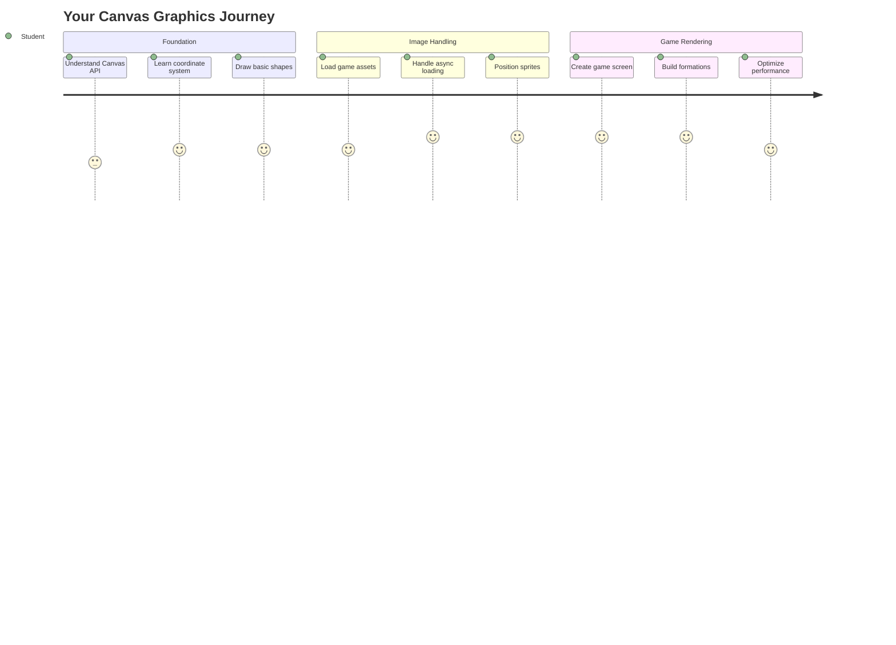
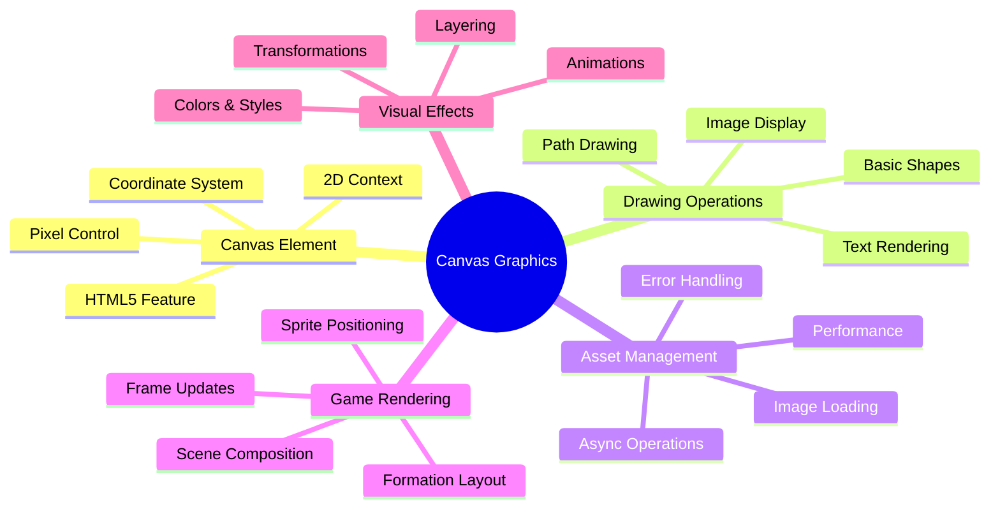
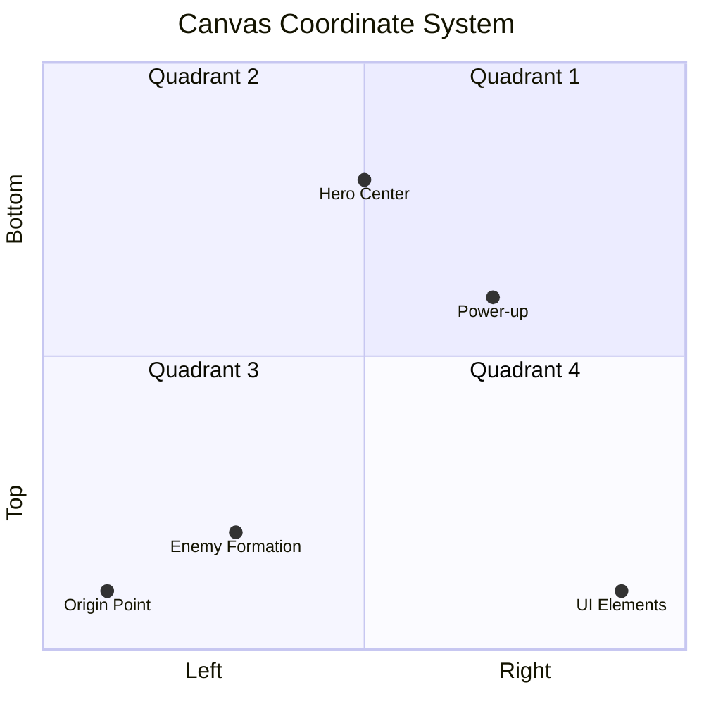
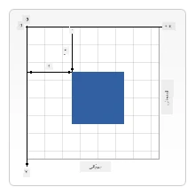
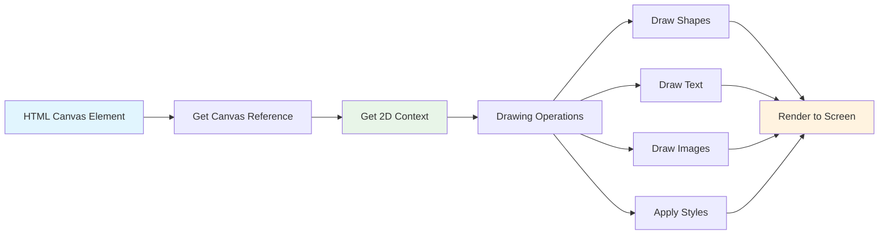
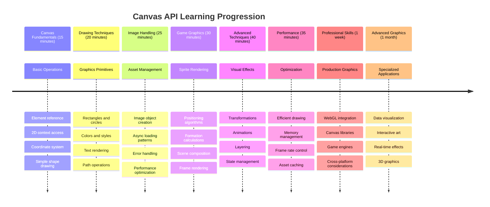

# خلائی کھیل بنائیں حصہ 2: ہیرو اور مونسٹرز کو کینوس پر ڈرائنگ کریں



کینوس API ویب ڈیولپمنٹ کی سب سے طاقتور خصوصیات میں سے ایک ہے جو آپ کے براؤزر میں متحرک، انٹرایکٹو گرافکس بنانے کے لیے استعمال ہوتی ہے۔ اس سبق میں، ہم اس خالی HTML `<canvas>` عنصر کو ایک کھیل کی دنیا میں تبدیل کریں گے جو ہیروز اور مونسٹرز سے بھری ہوئی ہوگی۔ کینوس کو اپنے ڈیجیٹل آرٹ بورڈ کے طور پر سوچیں جہاں کوڈ بصری شکل اختیار کرتا ہے۔

ہم پچھلے سبق میں سیکھے گئے مواد پر کام کر رہے ہیں، اور اب ہم بصری پہلوؤں میں گہرائی سے جائیں گے۔ آپ سیکھیں گے کہ کھیل کے اسپریٹس کو کیسے لوڈ اور دکھایا جائے، عناصر کو بالکل درست پوزیشن میں کیسے رکھا جائے، اور اپنے خلائی کھیل کے لیے بصری بنیاد کیسے بنائی جائے۔ یہ جامد ویب صفحات اور متحرک، انٹرایکٹو تجربات کے درمیان خلا کو پُر کرتا ہے۔

اس سبق کے اختتام تک، آپ کے پاس ایک مکمل کھیل کا منظر ہوگا جس میں آپ کا ہیرو شپ صحیح جگہ پر ہوگا اور دشمنوں کی تشکیل جنگ کے لیے تیار ہوگی۔ آپ سمجھ جائیں گے کہ جدید کھیل براؤزرز میں گرافکس کیسے رینڈر کرتے ہیں اور اپنے انٹرایکٹو بصری تجربات بنانے کی مہارت حاصل کریں گے۔ آئیے کینوس گرافکس کو دریافت کریں اور اپنے خلائی کھیل کو زندگی بخشیں!



## پری لیکچر کوئز

[پری لیکچر کوئز](https://ff-quizzes.netlify.app/web/quiz/31)

## کینوس

تو یہ `<canvas>` عنصر اصل میں کیا ہے؟ یہ HTML5 کا حل ہے جو ویب براؤزرز میں متحرک گرافکس اور اینیمیشنز بنانے کے لیے استعمال ہوتا ہے۔ عام تصاویر یا ویڈیوز کے برعکس جو جامد ہوتی ہیں، کینوس آپ کو اسکرین پر ظاہر ہونے والی ہر چیز پر پکسل لیول کنٹرول دیتا ہے۔ یہ کھیلوں، ڈیٹا ویژولائزیشنز، اور انٹرایکٹو آرٹ کے لیے بہترین ہے۔ اسے ایک پروگرام ایبل ڈرائنگ سطح کے طور پر سوچیں جہاں جاوا اسکرپٹ آپ کا پینٹ برش بن جاتا ہے۔

ڈیفالٹ کے طور پر، کینوس عنصر آپ کے صفحے پر ایک خالی، شفاف مستطیل کی طرح نظر آتا ہے۔ لیکن یہی اس کی صلاحیت ہے! اس کی اصل طاقت اس وقت ظاہر ہوتی ہے جب آپ جاوا اسکرپٹ کا استعمال کرتے ہوئے شکلیں بناتے ہیں، تصاویر لوڈ کرتے ہیں، اینیمیشنز تخلیق کرتے ہیں، اور چیزوں کو صارف کی تعاملات کے مطابق بناتے ہیں۔ یہ اسی طرح ہے جیسے 1960 کی دہائی میں بیل لیبز کے ابتدائی کمپیوٹر گرافکس کے ماہرین کو پہلے ڈیجیٹل اینیمیشنز بنانے کے لیے ہر پکسل کو پروگرام کرنا پڑتا تھا۔

✅ [کینوس API کے بارے میں مزید پڑھیں](https://developer.mozilla.org/docs/Web/API/Canvas_API) MDN پر۔

یہ عام طور پر صفحے کے باڈی کے حصے کے طور پر اعلان کیا جاتا ہے:

```html
<canvas id="myCanvas" width="200" height="100"></canvas>
```

**یہ کوڈ کیا کرتا ہے:**
- **سیٹ کرتا ہے** `id` ایٹریبیوٹ تاکہ آپ جاوا اسکرپٹ میں اس مخصوص کینوس عنصر کا حوالہ دے سکیں
- **ڈیفائن کرتا ہے** پکسلز میں چوڑائی تاکہ کینوس کے افقی سائز کو کنٹرول کیا جا سکے
- **قائم کرتا ہے** پکسلز میں اونچائی تاکہ کینوس کے عمودی طول و عرض کا تعین کیا جا سکے

## سادہ جیومیٹری ڈرائنگ

اب جب کہ آپ جانتے ہیں کہ کینوس عنصر کیا ہے، آئیے اس پر واقعی ڈرائنگ کرنے کا جائزہ لیتے ہیں! کینوس ایک کوآرڈینیٹ سسٹم استعمال کرتا ہے جو شاید آپ کو ریاضی کی کلاس سے واقف لگے، لیکن کمپیوٹر گرافکس کے لیے ایک اہم موڑ ہے۔

کینوس کارٹیسین کوآرڈینیٹس استعمال کرتا ہے جس میں ایک x-axis (افقی) اور y-axis (عمودی) ہوتا ہے تاکہ آپ جو کچھ بھی ڈرائنگ کرتے ہیں اسے پوزیشن میں رکھا جا سکے۔ لیکن یہاں ایک اہم فرق ہے: ریاضی کی کلاس کے کوآرڈینیٹ سسٹم کے برعکس، اصل نقطہ `(0,0)` اوپر بائیں کونے سے شروع ہوتا ہے، جہاں x-ویلیوز دائیں طرف بڑھتی ہیں اور y-ویلیوز نیچے کی طرف بڑھتی ہیں۔ یہ نقطہ نظر ابتدائی کمپیوٹر ڈسپلے سے شروع ہوتا ہے جہاں الیکٹران بیم اوپر سے نیچے تک اسکین کرتے تھے، جس سے اوپر بائیں قدرتی نقطہ آغاز بن جاتا تھا۔




> تصویر [MDN](https://developer.mozilla.org/docs/Web/API/Canvas_API/Tutorial/Drawing_shapes) سے

کینوس عنصر پر ڈرائنگ کرنے کے لیے، آپ وہی تین قدمی عمل اپنائیں گے جو تمام کینوس گرافکس کی بنیاد بناتا ہے۔ ایک بار جب آپ یہ چند بار کریں گے، تو یہ آپ کے لیے آسان ہو جائے گا:



1. **اپنے کینوس عنصر کا حوالہ حاصل کریں** DOM سے (بالکل کسی دوسرے HTML عنصر کی طرح)
2. **2D رینڈرنگ کانٹیکسٹ حاصل کریں** – یہ تمام ڈرائنگ طریقے فراہم کرتا ہے
3. **ڈرائنگ شروع کریں!** کانٹیکسٹ کے بلٹ ان طریقوں کا استعمال کرتے ہوئے اپنے گرافکس بنائیں

یہ کوڈ میں کیسے نظر آتا ہے:

```javascript
// Step 1: Get the canvas element
const canvas = document.getElementById("myCanvas");

// Step 2: Get the 2D rendering context
const ctx = canvas.getContext("2d");

// Step 3: Set fill color and draw a rectangle
ctx.fillStyle = 'red';
ctx.fillRect(0, 0, 200, 200); // x, y, width, height
```

**آئیے اسے قدم بہ قدم توڑتے ہیں:**
- ہم **اپنے کینوس عنصر کو پکڑتے ہیں** اس کے ID کا استعمال کرتے ہوئے اور اسے ایک ویریبل میں محفوظ کرتے ہیں
- ہم **2D رینڈرنگ کانٹیکسٹ حاصل کرتے ہیں** – یہ ہمارا ٹول کٹ ہے جو ڈرائنگ کے طریقوں سے بھرا ہوا ہے
- ہم **کینوس کو بتاتے ہیں** کہ ہم چیزوں کو سرخ رنگ سے بھرنا چاہتے ہیں `fillStyle` پراپرٹی کا استعمال کرتے ہوئے
- ہم **ایک مستطیل ڈرائنگ کرتے ہیں** جو اوپر بائیں کونے (0,0) سے شروع ہوتی ہے اور 200 پکسلز چوڑی اور اونچی ہے

✅ کینوس API زیادہ تر 2D شکلوں پر مرکوز ہے، لیکن آپ ویب سائٹ پر 3D عناصر بھی ڈرائنگ کر سکتے ہیں؛ اس کے لیے آپ [WebGL API](https://developer.mozilla.org/docs/Web/API/WebGL_API) استعمال کر سکتے ہیں۔

آپ کینوس API کے ساتھ بہت سی چیزیں ڈرائنگ کر سکتے ہیں جیسے:

- **جیومیٹریکل شکلیں**، ہم نے پہلے ہی دکھایا کہ مستطیل کیسے ڈرائنگ کی جاتی ہے، لیکن آپ بہت کچھ ڈرائنگ کر سکتے ہیں۔
- **متن**، آپ کسی بھی فونٹ اور رنگ کے ساتھ متن ڈرائنگ کر سکتے ہیں۔
- **تصاویر**، آپ کسی تصویر کے اثاثے جیسے .jpg یا .png کی بنیاد پر تصویر ڈرائنگ کر سکتے ہیں۔

✅ اسے آزمائیں! آپ جانتے ہیں کہ مستطیل کیسے ڈرائنگ کی جاتی ہے، کیا آپ صفحے پر دائرہ ڈرائنگ کر سکتے ہیں؟ کچھ دلچسپ کینوس ڈرائنگز کو CodePen پر دیکھیں۔ یہاں ایک [خاص طور پر متاثر کن مثال](https://codepen.io/dissimulate/pen/KrAwx) ہے۔

### 🔄 **تعلیمی جائزہ**
**کینوس کے بنیادی اصولوں کی سمجھ**: تصویر لوڈ کرنے کی طرف جانے سے پہلے، یقینی بنائیں کہ آپ:
- ✅ وضاحت کر سکتے ہیں کہ کینوس کوآرڈینیٹ سسٹم ریاضی کے کوآرڈینیٹس سے کیسے مختلف ہے
- ✅ کین
- **کوآرڈینیٹ سسٹمز**: ریاضی کو اسکرین پوزیشنز میں تبدیل کرنا  
- **اسپرائٹ مینجمنٹ**: گیم گرافکس کو لوڈ اور ڈسپلے کرنا  
- **فارمیشن الگورتھمز**: منظم لے آؤٹس کے لیے ریاضیاتی پیٹرنز  
- **ایسنک آپریشنز**: جدید جاوا اسکرپٹ کے ذریعے ہموار یوزر تجربہ  

## نتیجہ  

حتمی نتیجہ کچھ اس طرح نظر آنا چاہیے:  

  

## حل  

پہلے خود کوشش کریں حل کرنے کی، لیکن اگر آپ پھنس جائیں تو [حل](../../../../6-space-game/2-drawing-to-canvas/solution/app.js) دیکھیں۔  

---

## GitHub Copilot Agent Challenge 🚀  

ایجنٹ موڈ استعمال کریں اور درج ذیل چیلنج مکمل کریں:  

**تفصیل:** اپنے اسپیس گیم کینوس کو بہتر بنائیں اور کینوس API تکنیکوں کے ذریعے بصری اثرات اور انٹرایکٹو عناصر شامل کریں۔  

**پرومپٹ:** ایک نئی فائل بنائیں جس کا نام `enhanced-canvas.html` ہو، جس میں ایک کینوس ہو جو پس منظر میں متحرک ستارے دکھائے، ہیرو شپ کے لیے ایک پلسنگ ہیلتھ بار ہو، اور دشمن شپ جو آہستہ آہستہ نیچے کی طرف حرکت کریں۔ جاوا اسکرپٹ کوڈ شامل کریں جو رینڈم پوزیشنز اور اوپیسٹی کے ذریعے چمکتے ستارے بنائے، ہیلتھ بار کو ہیلتھ لیول کے مطابق رنگ تبدیل کرنے کے قابل بنائے (سبز > پیلا > سرخ)، اور دشمن شپ کو مختلف رفتار سے اسکرین کے نیچے حرکت دینے کے لیے اینیمیٹ کرے۔  

ایجنٹ موڈ کے بارے میں مزید جانیں [یہاں](https://code.visualstudio.com/blogs/2025/02/24/introducing-copilot-agent-mode)۔  

## 🚀 چیلنج  

آپ نے 2D فوکسڈ کینوس API کے ذریعے ڈرائنگ کے بارے میں سیکھا ہے؛ [WebGL API](https://developer.mozilla.org/docs/Web/API/WebGL_API) پر ایک نظر ڈالیں اور 3D آبجیکٹ ڈرائنگ کی کوشش کریں۔  

## لیکچر کے بعد کا کوئز  

[لیکچر کے بعد کا کوئز](https://ff-quizzes.netlify.app/web/quiz/32)  

## جائزہ اور خود مطالعہ  

کینوس API کے بارے میں مزید جانیں [یہ پڑھ کر](https://developer.mozilla.org/docs/Web/API/Canvas_API)۔  

### ⚡ **اگلے 5 منٹ میں آپ کیا کر سکتے ہیں**  
- [ ] براؤزر کنسول کھولیں اور `document.createElement('canvas')` کے ذریعے ایک کینوس عنصر بنائیں  
- [ ] کینوس کانٹیکسٹ پر `fillRect()` استعمال کرتے ہوئے ایک مستطیل بنائیں  
- [ ] مختلف رنگوں کے ساتھ تجربہ کریں `fillStyle` پراپرٹی استعمال کرتے ہوئے  
- [ ] `arc()` میتھڈ استعمال کرتے ہوئے ایک سادہ دائرہ بنائیں  

### 🎯 **اس گھنٹے میں آپ کیا حاصل کر سکتے ہیں**  
- [ ] لیکچر کے بعد کا کوئز مکمل کریں اور کینوس کے بنیادی اصول سمجھیں  
- [ ] ایک کینوس ڈرائنگ ایپلیکیشن بنائیں جس میں مختلف شکلیں اور رنگ ہوں  
- [ ] اپنے گیم کے لیے امیج لوڈنگ اور اسپرائٹ رینڈرنگ نافذ کریں  
- [ ] ایک سادہ اینیمیشن بنائیں جو کینوس پر اشیاء کو حرکت دے  
- [ ] کینوس ٹرانسفارمیشنز جیسے اسکیلنگ، روٹیشن، اور ٹرانسلیشن کی مشق کریں  

### 📅 **آپ کا ہفتہ بھر کا کینوس سفر**  
- [ ] اسپیس گیم مکمل کریں جس میں بہتر گرافکس اور اسپرائٹ اینیمیشنز ہوں  
- [ ] کینوس کی جدید تکنیکیں جیسے گریڈینٹس، پیٹرنز، اور کمپوزٹنگ سیکھیں  
- [ ] کینوس کا استعمال کرتے ہوئے انٹرایکٹو ویژولائزیشنز بنائیں  
- [ ] ہموار کارکردگی کے لیے کینوس آپٹیمائزیشن تکنیکیں سیکھیں  
- [ ] مختلف ٹولز کے ساتھ ایک ڈرائنگ یا پینٹنگ ایپلیکیشن بنائیں  
- [ ] کینوس کے ساتھ تخلیقی کوڈنگ پیٹرنز اور جنریٹو آرٹ دریافت کریں  

### 🌟 **آپ کا مہینہ بھر کا گرافکس ماسٹری سفر**  
- [ ] کینوس 2D اور WebGL استعمال کرتے ہوئے پیچیدہ بصری ایپلیکیشنز بنائیں  
- [ ] گرافکس پروگرامنگ کے تصورات اور شیڈر کے بنیادی اصول سیکھیں  
- [ ] اوپن سورس گرافکس لائبریریز اور ویژولائزیشن ٹولز میں تعاون کریں  
- [ ] گرافکس کے لیے کارکردگی کی آپٹیمائزیشن میں مہارت حاصل کریں  
- [ ] کینوس پروگرامنگ اور کمپیوٹر گرافکس کے بارے میں تعلیمی مواد بنائیں  
- [ ] ایک گرافکس پروگرامنگ ماہر بنیں جو دوسروں کو بصری تجربات تخلیق کرنے میں مدد دے  

## 🎯 آپ کا کینوس گرافکس ماسٹری ٹائم لائن  


  
### 🛠️ آپ کا کینوس گرافکس ٹول کٹ خلاصہ  

اس سبق کو مکمل کرنے کے بعد، آپ کے پاس ہے:  
- **کینوس API ماسٹری**: 2D گرافکس پروگرامنگ کی مکمل سمجھ  
- **کوآرڈینیٹ ریاضی**: درست پوزیشننگ اور لے آؤٹ الگورتھمز  
- **اثاثہ مینجمنٹ**: پروفیشنل امیج لوڈنگ اور ایرر ہینڈلنگ  
- **رینڈرنگ پائپ لائن**: منظر کی تشکیل کے لیے منظم طریقہ  
- **گیم گرافکس**: اسپرائٹ پوزیشننگ اور فارمیشن کیلکولیشنز  
- **ایسنک پروگرامنگ**: ہموار کارکردگی کے لیے جدید جاوا اسکرپٹ پیٹرنز  
- **ویژول پروگرامنگ**: ریاضیاتی تصورات کو اسکرین گرافکس میں تبدیل کرنا  

**حقیقی دنیا کی ایپلیکیشنز**: آپ کی کینوس مہارتیں براہ راست لاگو ہوتی ہیں:  
- **ڈیٹا ویژولائزیشن**: چارٹس، گرافز، اور انٹرایکٹو ڈیش بورڈز  
- **گیم ڈیولپمنٹ**: 2D گیمز، سیمولیشنز، اور انٹرایکٹو تجربات  
- **ڈیجیٹل آرٹ**: تخلیقی کوڈنگ اور جنریٹو آرٹ پروجیکٹس  
- **UI/UX ڈیزائن**: کسٹم گرافکس اور انٹرایکٹو عناصر  
- **تعلیمی سافٹ ویئر**: بصری سیکھنے کے ٹولز اور سیمولیشنز  
- **ویب ایپلیکیشنز**: ڈائنامک گرافکس اور ریئل ٹائم ویژولائزیشنز  

**حاصل کردہ پروفیشنل مہارتیں**: آپ اب کر سکتے ہیں:  
- **بنائیں** کسٹم گرافکس حل بغیر بیرونی لائبریریز کے  
- **آپٹیمائز کریں** رینڈرنگ کی کارکردگی ہموار یوزر تجربات کے لیے  
- **ڈی بگ کریں** پیچیدہ بصری مسائل براؤزر ڈیولپر ٹولز استعمال کرتے ہوئے  
- **ڈیزائن کریں** ریاضیاتی اصولوں کا استعمال کرتے ہوئے اسکیل ایبل گرافکس سسٹمز  
- **انٹیگریٹ کریں** کینوس گرافکس کو جدید ویب ایپلیکیشن فریم ورک کے ساتھ  

**کینوس API میتھڈز جنہیں آپ نے ماسٹر کیا ہے**:  
- **عنصر مینجمنٹ**: getElementById، getContext  
- **ڈرائنگ آپریشنز**: fillRect، drawImage، fillStyle  
- **اثاثہ لوڈنگ**: امیج آبجیکٹس، Promise پیٹرنز  
- **ریاضیاتی پوزیشننگ**: کوآرڈینیٹ کیلکولیشنز، فارمیشن الگورتھمز  

**اگلا مرحلہ**: آپ اینیمیشن، یوزر انٹرایکشن، کولیشن ڈیٹیکشن شامل کرنے یا WebGL کے ذریعے 3D گرافکس دریافت کرنے کے لیے تیار ہیں!  

🌟 **کامیابی حاصل کی**: آپ نے بنیادی کینوس API تکنیکوں کا استعمال کرتے ہوئے مکمل گیم رینڈرنگ سسٹم بنایا ہے!  

## اسائنمنٹ  

[کینوس API کے ساتھ کھیلیں](assignment.md)  

---

**اعلانِ لاتعلقی**:  
یہ دستاویز AI ترجمہ سروس [Co-op Translator](https://github.com/Azure/co-op-translator) کا استعمال کرتے ہوئے ترجمہ کی گئی ہے۔ ہم درستگی کے لیے کوشش کرتے ہیں، لیکن براہ کرم آگاہ رہیں کہ خودکار ترجمے میں غلطیاں یا غیر درستیاں ہو سکتی ہیں۔ اصل دستاویز کو اس کی اصل زبان میں مستند ذریعہ سمجھا جانا چاہیے۔ اہم معلومات کے لیے، پیشہ ور انسانی ترجمہ کی سفارش کی جاتی ہے۔ اس ترجمے کے استعمال سے پیدا ہونے والی کسی بھی غلط فہمی یا غلط تشریح کے لیے ہم ذمہ دار نہیں ہیں۔