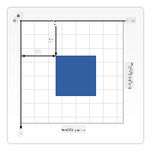

<!--
CO_OP_TRANSLATOR_METADATA:
{
  "original_hash": "056641280211e52fd0adb81b6058ec55",
  "translation_date": "2025-08-28T15:24:36+00:00",
  "source_file": "6-space-game/2-drawing-to-canvas/README.md",
  "language_code": "ur"
}
-->
# اسپیس گیم بنائیں حصہ 2: ہیرو اور مونسٹرز کو کینوس پر ڈرائنگ کریں

## لیکچر سے پہلے کا کوئز

[لیکچر سے پہلے کا کوئز](https://ff-quizzes.netlify.app/web/quiz/31)

## کینوس

کینوس ایک HTML عنصر ہے جو ڈیفالٹ میں خالی ہوتا ہے؛ یہ ایک خالی تختہ ہے۔ آپ کو اس پر ڈرائنگ کرکے مواد شامل کرنا ہوگا۔

✅ [کینوس API کے بارے میں مزید پڑھیں](https://developer.mozilla.org/docs/Web/API/Canvas_API) MDN پر۔

یہ عام طور پر صفحے کے باڈی کے حصے کے طور پر اس طرح اعلان کیا جاتا ہے:

```html
<canvas id="myCanvas" width="200" height="100"></canvas>
```

اوپر ہم نے `id`, `width` اور `height` سیٹ کیے ہیں۔

- `id`: اسے سیٹ کریں تاکہ آپ اسے ریفرنس کے طور پر حاصل کر سکیں جب آپ کو اس کے ساتھ تعامل کرنا ہو۔
- `width`: یہ عنصر کی چوڑائی ہے۔
- `height`: یہ عنصر کی اونچائی ہے۔

## سادہ جیومیٹری ڈرائنگ

کینوس کارٹیسین کوآرڈینیٹ سسٹم استعمال کرتا ہے چیزوں کو ڈرائنگ کرنے کے لیے۔ اس لیے یہ x-axis اور y-axis استعمال کرتا ہے تاکہ کسی چیز کی جگہ کو ظاہر کیا جا سکے۔ مقام `0,0` سب سے اوپر بائیں پوزیشن ہے اور نیچے دائیں وہ ہے جو آپ نے کینوس کی چوڑائی اور اونچائی کے طور پر سیٹ کی ہے۔

  
> تصویر [MDN](https://developer.mozilla.org/docs/Web/API/Canvas_API/Tutorial/Drawing_shapes) سے

کینوس عنصر پر ڈرائنگ کرنے کے لیے آپ کو درج ذیل مراحل سے گزرنا ہوگا:

1. **ریفرنس حاصل کریں** کینوس عنصر پر۔
1. **ریفرنس حاصل کریں** کینوس عنصر پر موجود کانٹیکسٹ عنصر پر۔
1. **ڈرائنگ آپریشن کریں** کانٹیکسٹ عنصر کا استعمال کرتے ہوئے۔

اوپر کے مراحل کے لیے کوڈ عام طور پر اس طرح نظر آتا ہے:

```javascript
// draws a red rectangle
//1. get the canvas reference
canvas = document.getElementById("myCanvas");

//2. set the context to 2D to draw basic shapes
ctx = canvas.getContext("2d");

//3. fill it with the color red
ctx.fillStyle = 'red';

//4. and draw a rectangle with these parameters, setting location and size
ctx.fillRect(0,0, 200, 200) // x,y,width, height
```

✅ کینوس API زیادہ تر 2D شکلوں پر مرکوز ہے، لیکن آپ ویب سائٹ پر 3D عناصر بھی ڈرائنگ کر سکتے ہیں؛ اس کے لیے آپ [WebGL API](https://developer.mozilla.org/docs/Web/API/WebGL_API) استعمال کر سکتے ہیں۔

آپ کینوس API کے ساتھ مختلف چیزیں ڈرائنگ کر سکتے ہیں جیسے:

- **جیومیٹریکل شکلیں**، ہم نے پہلے ہی دکھایا ہے کہ ایک مستطیل کیسے ڈرائنگ کی جاتی ہے، لیکن آپ اور بھی بہت کچھ ڈرائنگ کر سکتے ہیں۔
- **ٹیکسٹ**، آپ کسی بھی فونٹ اور رنگ کے ساتھ ٹیکسٹ ڈرائنگ کر سکتے ہیں۔
- **امیجز**، آپ کسی امیج اثاثے جیسے .jpg یا .png کی بنیاد پر امیج ڈرائنگ کر سکتے ہیں۔

✅ آزمائیں! آپ جانتے ہیں کہ مستطیل کیسے ڈرائنگ کی جاتی ہے، کیا آپ صفحے پر ایک دائرہ ڈرائنگ کر سکتے ہیں؟ کچھ دلچسپ کینوس ڈرائنگز کو CodePen پر دیکھیں۔ یہاں ایک [خاص طور پر متاثر کن مثال](https://codepen.io/dissimulate/pen/KrAwx) ہے۔

## امیج اثاثہ لوڈ کریں اور ڈرائنگ کریں

آپ ایک امیج اثاثہ کو `Image` آبجیکٹ بنا کر اور اس کی `src` پراپرٹی سیٹ کرکے لوڈ کرتے ہیں۔ پھر آپ `load` ایونٹ کو سنتے ہیں تاکہ معلوم ہو سکے کہ یہ استعمال کے لیے تیار ہے۔ کوڈ اس طرح نظر آتا ہے:

### اثاثہ لوڈ کریں

```javascript
const img = new Image();
img.src = 'path/to/my/image.png';
img.onload = () => {
  // image loaded and ready to be used
}
```

### اثاثہ لوڈ کرنے کا پیٹرن

اوپر کو اس طرح کے کنسٹرکٹ میں لپیٹنا تجویز کیا جاتا ہے تاکہ اسے استعمال کرنا آسان ہو اور آپ صرف اس وقت اسے تبدیل کرنے کی کوشش کریں جب یہ مکمل طور پر لوڈ ہو جائے:

```javascript
function loadAsset(path) {
  return new Promise((resolve) => {
    const img = new Image();
    img.src = path;
    img.onload = () => {
      // image loaded and ready to be used
      resolve(img);
    }
  })
}

// use like so

async function run() {
  const heroImg = await loadAsset('hero.png')
  const monsterImg = await loadAsset('monster.png')
}

```

گیم اثاثے کو اسکرین پر ڈرائنگ کرنے کے لیے، آپ کا کوڈ اس طرح نظر آئے گا:

```javascript
async function run() {
  const heroImg = await loadAsset('hero.png')
  const monsterImg = await loadAsset('monster.png')

  canvas = document.getElementById("myCanvas");
  ctx = canvas.getContext("2d");
  ctx.drawImage(heroImg, canvas.width/2,canvas.height/2);
  ctx.drawImage(monsterImg, 0,0);
}
```

## اب وقت ہے کہ آپ اپنا گیم بنانا شروع کریں

### کیا بنانا ہے

آپ ایک ویب صفحہ بنائیں گے جس میں کینوس عنصر ہوگا۔ یہ ایک سیاہ اسکرین `1024*768` رینڈر کرے گا۔ ہم نے آپ کو دو تصاویر فراہم کی ہیں:

- ہیرو شپ

   

- 5*5 مونسٹر

   

### ترقی شروع کرنے کے لیے تجویز کردہ مراحل

ان فائلوں کو تلاش کریں جو آپ کے لیے `your-work` سب فولڈر میں بنائی گئی ہیں۔ اس میں درج ذیل شامل ہونا چاہیے:

```bash
-| assets
  -| enemyShip.png
  -| player.png
-| index.html
-| app.js
-| package.json
```

اس فولڈر کی ایک کاپی Visual Studio Code میں کھولیں۔ آپ کو ایک مقامی ترقیاتی ماحول سیٹ اپ کرنا ہوگا، ترجیحاً Visual Studio Code کے ساتھ NPM اور Node انسٹال کیا ہوا ہو۔ اگر آپ کے کمپیوٹر پر `npm` سیٹ اپ نہیں ہے، [یہاں دیکھیں کہ اسے کیسے کریں](https://www.npmjs.com/get-npm)۔

اپنا پروجیکٹ شروع کریں `your_work` فولڈر پر نیویگیٹ کرکے:

```bash
cd your-work
npm start
```

اوپر HTTP سرور ایڈریس `http://localhost:5000` پر شروع کرے گا۔ ایک براؤزر کھولیں اور اس ایڈریس کو ان پٹ کریں۔ یہ ابھی ایک خالی صفحہ ہے، لیکن یہ جلد ہی تبدیل ہوگا۔

> نوٹ: اپنی اسکرین پر تبدیلیاں دیکھنے کے لیے، اپنے براؤزر کو ریفریش کریں۔

### کوڈ شامل کریں

`your-work/app.js` میں ضروری کوڈ شامل کریں تاکہ نیچے دیے گئے مسائل کو حل کریں:

1. **کینوس ڈرائنگ کریں** سیاہ پس منظر کے ساتھ  
   > ٹپ: `/app.js` میں مناسب TODO کے تحت دو لائنیں شامل کریں، `ctx` عنصر کو سیاہ سیٹ کریں اور اوپر/بائیں کوآرڈینیٹس کو 0,0 پر سیٹ کریں اور کینوس کی اونچائی اور چوڑائی کے برابر سیٹ کریں۔
2. **ٹیکسچرز لوڈ کریں**  
   > ٹپ: پلیئر اور دشمن کی تصاویر کو `await loadTexture` استعمال کرتے ہوئے اور امیج پاتھ پاس کرتے ہوئے شامل کریں۔ آپ انہیں ابھی اسکرین پر نہیں دیکھیں گے!
3. **ہیرو کو اسکرین کے نیچے کے نصف حصے کے مرکز میں ڈرائنگ کریں**  
   > ٹپ: `drawImage` API استعمال کریں تاکہ heroImg کو اسکرین پر ڈرائنگ کریں، `canvas.width / 2 - 45` اور `canvas.height - canvas.height / 4)` سیٹ کریں۔
4. **5*5 مونسٹرز ڈرائنگ کریں**  
   > ٹپ: اب آپ اسکرین پر دشمنوں کو ڈرائنگ کرنے کے کوڈ کو ان کومنٹ کر سکتے ہیں۔ پھر `createEnemies` فنکشن پر جائیں اور اسے مکمل کریں۔

   پہلے، کچھ کانسٹینٹس سیٹ کریں:

    ```javascript
    const MONSTER_TOTAL = 5;
    const MONSTER_WIDTH = MONSTER_TOTAL * 98;
    const START_X = (canvas.width - MONSTER_WIDTH) / 2;
    const STOP_X = START_X + MONSTER_WIDTH;
    ```

    پھر، ایک لوپ بنائیں تاکہ مونسٹرز کی array کو اسکرین پر ڈرائنگ کریں:

    ```javascript
    for (let x = START_X; x < STOP_X; x += 98) {
        for (let y = 0; y < 50 * 5; y += 50) {
          ctx.drawImage(enemyImg, x, y);
        }
      }
    ```

## نتیجہ

مکمل نتیجہ اس طرح نظر آنا چاہیے:


## حل

براہ کرم پہلے خود اسے حل کرنے کی کوشش کریں لیکن اگر آپ پھنس جائیں تو [حل](../../../../6-space-game/2-drawing-to-canvas/solution/app.js) دیکھیں۔

---

## 🚀 چیلنج

آپ نے 2D پر مرکوز کینوس API کے ساتھ ڈرائنگ کے بارے میں سیکھا؛ [WebGL API](https://developer.mozilla.org/docs/Web/API/WebGL_API) پر ایک نظر ڈالیں، اور 3D آبجیکٹ ڈرائنگ کرنے کی کوشش کریں۔

## لیکچر کے بعد کا کوئز

[لیکچر کے بعد کا کوئز](https://ff-quizzes.netlify.app/web/quiz/32)

## جائزہ اور خود مطالعہ

کینوس API کے بارے میں مزید جاننے کے لیے [اسے پڑھیں](https://developer.mozilla.org/docs/Web/API/Canvas_API)۔

## اسائنمنٹ

[کینوس API کے ساتھ کھیلیں](assignment.md)

---

**ڈسکلیمر**:  
یہ دستاویز AI ترجمہ سروس [Co-op Translator](https://github.com/Azure/co-op-translator) کا استعمال کرتے ہوئے ترجمہ کی گئی ہے۔ ہم درستگی کے لیے کوشش کرتے ہیں، لیکن براہ کرم آگاہ رہیں کہ خودکار ترجمے میں غلطیاں یا غیر درستیاں ہو سکتی ہیں۔ اصل دستاویز کو اس کی اصل زبان میں مستند ذریعہ سمجھا جانا چاہیے۔ اہم معلومات کے لیے، پیشہ ور انسانی ترجمہ کی سفارش کی جاتی ہے۔ ہم اس ترجمے کے استعمال سے پیدا ہونے والی کسی بھی غلط فہمی یا غلط تشریح کے ذمہ دار نہیں ہیں۔