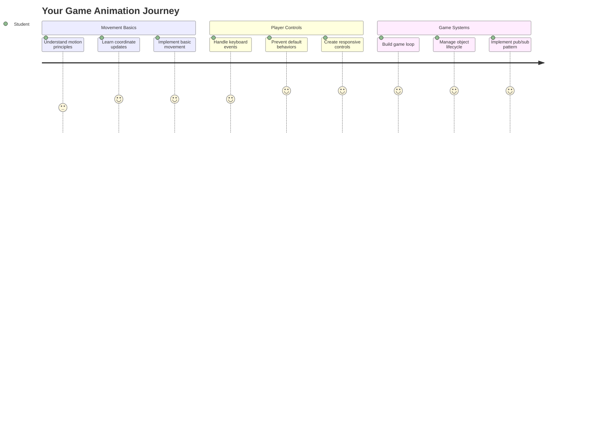
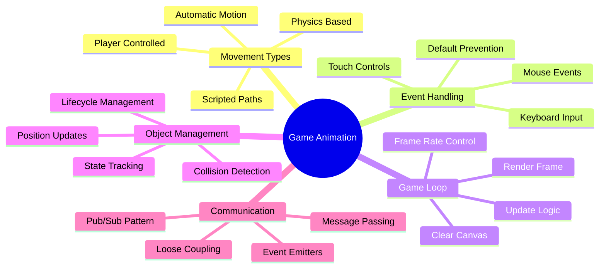
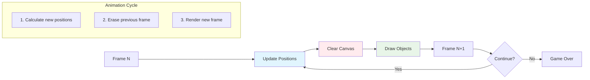
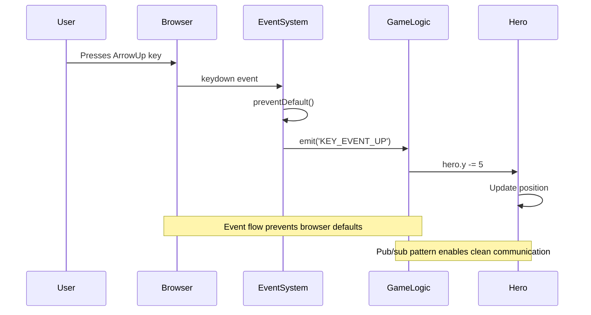
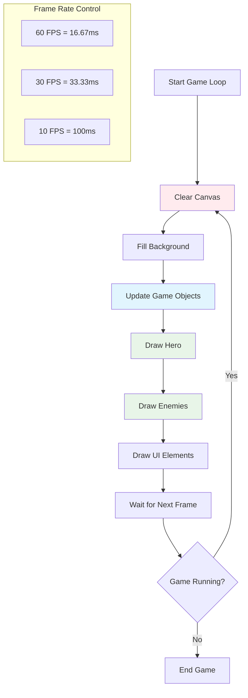
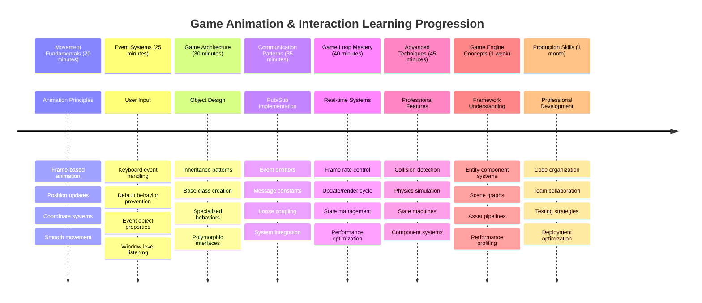

<!--
CO_OP_TRANSLATOR_METADATA:
{
  "original_hash": "8c55a2bd4bc0ebe4c88198fd563a9e09",
  "translation_date": "2025-11-03T13:30:35+00:00",
  "source_file": "6-space-game/3-moving-elements-around/README.md",
  "language_code": "ur"
}
-->
# خلائی کھیل بنائیں حصہ 3: حرکت شامل کرنا



اپنے پسندیدہ کھیلوں کے بارے میں سوچیں – جو چیز انہیں دلچسپ بناتی ہے وہ صرف خوبصورت گرافکس نہیں بلکہ یہ ہے کہ سب کچھ کیسے حرکت کرتا ہے اور آپ کے اعمال پر ردعمل ظاہر کرتا ہے۔ اس وقت، آپ کا خلائی کھیل ایک خوبصورت تصویر کی طرح ہے، لیکن ہم اس میں حرکت شامل کرنے والے ہیں جو اسے زندگی بخشے گی۔

جب ناسا کے انجینئرز نے اپولو مشنز کے لیے گائیڈنس کمپیوٹر پروگرام کیا، تو انہیں ایک جیسا چیلنج درپیش تھا: آپ خلائی جہاز کو پائلٹ کے ان پٹ پر کیسے ردعمل دیتے ہیں جبکہ خودکار طور پر کورس کی اصلاحات کو برقرار رکھتے ہیں؟ آج ہم جو اصول سیکھیں گے وہ انہی تصورات کی بازگشت ہیں – کھلاڑی کے کنٹرول شدہ حرکت کو خودکار نظام کے رویوں کے ساتھ منظم کرنا۔

اس سبق میں، آپ سیکھیں گے کہ خلائی جہاز کو اسکرین پر کیسے چلایا جائے، کھلاڑی کے احکامات کا جواب کیسے دیا جائے، اور ہموار حرکت کے نمونے کیسے بنائے جائیں۔ ہم سب کچھ قابل انتظام تصورات میں تقسیم کریں گے جو قدرتی طور پر ایک دوسرے پر تعمیر ہوتے ہیں۔

آخر میں، آپ کے کھلاڑی اپنے ہیرو شپ کو اسکرین کے ارد گرد اڑائیں گے جبکہ دشمن کے جہاز اوپر گشت کریں گے۔ اس سے بھی اہم بات یہ ہے کہ آپ ان بنیادی اصولوں کو سمجھیں گے جو کھیل کی حرکت کے نظام کو طاقت دیتے ہیں۔



## پری لیکچر کوئز

[پری لیکچر کوئز](https://ff-quizzes.netlify.app/web/quiz/33)

## کھیل کی حرکت کو سمجھنا

کھیل اس وقت زندہ ہوتے ہیں جب چیزیں حرکت کرنا شروع کرتی ہیں، اور بنیادی طور پر یہ دو طریقوں سے ہوتا ہے:

- **کھلاڑی کے کنٹرول کی حرکت**: جب آپ کوئی کلید دبائیں یا ماؤس پر کلک کریں، تو کچھ حرکت کرتا ہے۔ یہ آپ اور آپ کی گیم کی دنیا کے درمیان براہ راست تعلق ہے۔
- **خودکار حرکت**: جب کھیل خود چیزوں کو حرکت دینے کا فیصلہ کرتا ہے – جیسے وہ دشمن کے جہاز جو اسکرین پر گشت کرتے ہیں چاہے آپ کچھ بھی نہ کریں۔

کمپیوٹر اسکرین پر اشیاء کو حرکت دینا آپ کے خیال سے زیادہ آسان ہے۔ یاد ہے وہ x اور y کوآرڈینیٹس جو آپ نے ریاضی کی کلاس میں سیکھے تھے؟ یہی وہ چیز ہے جس کے ساتھ ہم یہاں کام کر رہے ہیں۔ جب گلیلیو نے 1610 میں مشتری کے چاندوں کا سراغ لگایا، تو وہ بنیادی طور پر یہی کر رہا تھا – وقت کے ساتھ پوزیشنوں کو پلاٹ کر کے حرکت کے نمونوں کو سمجھنا۔

اسکرین پر چیزوں کو حرکت دینا فلیپ بک اینیمیشن بنانے جیسا ہے – آپ کو یہ تین آسان مراحل پر عمل کرنا ہوگا:



1. **پوزیشن کو اپ ڈیٹ کریں** – اپنی چیز کو کہاں ہونا چاہیے اسے تبدیل کریں (شاید اسے 5 پکسلز دائیں طرف منتقل کریں)
2. **پرانا فریم مٹائیں** – اسکرین کو صاف کریں تاکہ آپ کو ہر جگہ بھوت نما نشان نظر نہ آئیں
3. **نیا فریم بنائیں** – اپنی چیز کو اس کی نئی جگہ پر رکھیں

یہ کافی تیزی سے کریں، اور بوم! آپ کے پاس ہموار حرکت ہے جو کھلاڑیوں کو قدرتی محسوس ہوتی ہے۔

یہ کوڈ میں کچھ اس طرح نظر آ سکتا ہے:

```javascript
// Set the hero's location
hero.x += 5;
// Clear the rectangle that hosts the hero
ctx.clearRect(0, 0, canvas.width, canvas.height);
// Redraw the game background and hero
ctx.fillRect(0, 0, canvas.width, canvas.height);
ctx.fillStyle = "black";
ctx.drawImage(heroImg, hero.x, hero.y);
```

**یہ کوڈ کیا کرتا ہے:**
- **ہیرو کے x کوآرڈینیٹ کو 5 پکسلز سے اپ ڈیٹ کرتا ہے** تاکہ اسے افقی طور پر منتقل کیا جا سکے
- **پورے کینوس ایریا کو صاف کرتا ہے** تاکہ پچھلا فریم ہٹایا جا سکے
- **کینوس کو سیاہ پس منظر کے رنگ سے بھر دیتا ہے**
- **ہیرو کی تصویر کو اس کی نئی پوزیشن پر دوبارہ بناتا ہے**

✅ کیا آپ اس وجہ کے بارے میں سوچ سکتے ہیں کہ کیوں ہیرو کو کئی فریمز فی سیکنڈ دوبارہ بنانا کارکردگی کے اخراجات کو بڑھا سکتا ہے؟ [اس پیٹرن کے متبادل](https://developer.mozilla.org/en-US/docs/Web/API/Canvas_API/Tutorial/Optimizing_canvas) کے بارے میں پڑھیں۔

## کی بورڈ ایونٹس کو ہینڈل کریں

یہ وہ جگہ ہے جہاں ہم کھلاڑی کے ان پٹ کو گیم ایکشن سے جوڑتے ہیں۔ جب کوئی اسپیس بار کو دبائے تاکہ لیزر فائر کرے یا تیر والے بٹن کو دبائے تاکہ ایسٹروئیڈ سے بچ سکے، آپ کے کھیل کو اس ان پٹ کا پتہ لگانا اور اس کا جواب دینا ہوگا۔

کی بورڈ ایونٹس ونڈو لیول پر ہوتے ہیں، یعنی آپ کی پوری براؤزر ونڈو ان کی پریسز کو سن رہی ہوتی ہے۔ دوسری طرف، ماؤس کلکس مخصوص عناصر سے منسلک ہو سکتے ہیں (جیسے بٹن پر کلک کرنا)۔ ہمارے خلائی کھیل کے لیے، ہم کی بورڈ کنٹرولز پر توجہ مرکوز کریں گے کیونکہ یہی کھلاڑیوں کو کلاسک آرکیڈ کا احساس دیتا ہے۔

یہ مجھے یاد دلاتا ہے کہ 1800 کی دہائی میں ٹیلی گراف آپریٹرز کو مورز کوڈ ان پٹ کو معنی خیز پیغامات میں ترجمہ کرنا پڑتا تھا – ہم کچھ ایسا ہی کر رہے ہیں، کی پریسز کو گیم کمانڈز میں ترجمہ کر رہے ہیں۔

کسی ایونٹ کو ہینڈل کرنے کے لیے آپ کو ونڈو کے `addEventListener()` طریقہ استعمال کرنے کی ضرورت ہے اور اسے دو ان پٹ پیرامیٹرز فراہم کرنے کی ضرورت ہے۔ پہلا پیرامیٹر ایونٹ کا نام ہے، مثال کے طور پر `keyup`۔ دوسرا پیرامیٹر وہ فنکشن ہے جسے ایونٹ ہونے کے نتیجے میں بلایا جانا چاہیے۔

یہاں ایک مثال ہے:

```javascript
window.addEventListener('keyup', (evt) => {
  // evt.key = string representation of the key
  if (evt.key === 'ArrowUp') {
    // do something
  }
});
```

**یہاں کیا ہوتا ہے:**
- **کی بورڈ ایونٹس کو پوری ونڈو پر سنتا ہے**
- **ایونٹ آبجیکٹ کو کیپچر کرتا ہے** جس میں یہ معلومات ہوتی ہیں کہ کون سی کلید دبائی گئی تھی
- **چیک کرتا ہے** کہ دبائی گئی کلید کسی مخصوص کلید سے میل کھاتی ہے (اس صورت میں، اوپر کا تیر)
- **کوڈ کو چلاتا ہے** جب شرط پوری ہو

کی ایونٹس کے لیے ایونٹ پر دو پراپرٹیز ہیں جنہیں آپ دیکھ سکتے ہیں کہ کون سی کلید دبائی گئی تھی:

- `key` - یہ دبائی گئی کلید کی سٹرنگ نمائندگی ہے، مثال کے طور پر `'ArrowUp'`
- `keyCode` - یہ نمبر کی نمائندگی ہے، مثال کے طور پر `37`، جو `ArrowLeft` کے مطابق ہے

✅ کی ایونٹ میں تبدیلی گیم ڈیولپمنٹ کے علاوہ بھی مفید ہے۔ اس تکنیک کے لیے آپ اور کیا استعمال سوچ سکتے ہیں؟



### خاص کلیدیں: ایک انتباہ!

کچھ کلیدوں میں بلٹ ان براؤزر رویے ہوتے ہیں جو آپ کے کھیل میں مداخلت کر سکتے ہیں۔ تیر والے بٹن صفحہ کو اسکرول کرتے ہیں اور اسپیس بار نیچے چھلانگ لگاتا ہے – وہ رویے جو آپ نہیں چاہتے جب کوئی اپنا خلائی جہاز چلا رہا ہو۔

ہم ان ڈیفالٹ رویوں کو روک سکتے ہیں اور اپنے کھیل کو ان پٹ کو سنبھالنے دے سکتے ہیں۔ یہ اس طرح ہے جیسے ابتدائی کمپیوٹر پروگرامرز کو کسٹم رویے بنانے کے لیے سسٹم انٹرپٹس کو اووررائیڈ کرنا پڑتا تھا – ہم صرف براؤزر لیول پر ایسا کر رہے ہیں۔ یہ کیسے کریں:

```javascript
const onKeyDown = function (e) {
  console.log(e.keyCode);
  switch (e.keyCode) {
    case 37:
    case 39:
    case 38:
    case 40: // Arrow keys
    case 32:
      e.preventDefault();
      break; // Space
    default:
      break; // do not block other keys
  }
};

window.addEventListener('keydown', onKeyDown);
```

**اس روک تھام کے کوڈ کو سمجھنا:**
- **مخصوص کی کوڈز کے لیے چیک کرتا ہے** جو ناپسندیدہ براؤزر رویے کا سبب بن سکتے ہیں
- **تیر والے بٹن اور اسپیس بار کے لیے ڈیفالٹ براؤزر ایکشن کو روکتا ہے**
- **دوسری کلیدوں کو عام طور پر کام کرنے دیتا ہے**
- **براؤزر کے بلٹ ان رویے کو روکنے کے لیے `e.preventDefault()` استعمال کرتا ہے**

### 🔄 **تعلیمی چیک ان**
**ایونٹ ہینڈلنگ کی سمجھ**: خودکار حرکت کی طرف بڑھنے سے پہلے، یقینی بنائیں کہ آپ:
- ✅ `keydown` اور `keyup` ایونٹس کے فرق کو بیان کر سکتے ہیں
- ✅ سمجھتے ہیں کہ ہم ڈیفالٹ براؤزر رویے کیوں روکتے ہیں
- ✅ بیان کر سکتے ہیں کہ ایونٹ لسٹنرز صارف کے ان پٹ کو گیم لاجک سے کیسے جوڑتے ہیں
- ✅ ان کلیدوں کی شناخت کر سکتے ہیں جو گیم کنٹرولز میں مداخلت کر سکتی ہیں

**فوری خود ٹیسٹ**: اگر آپ تیر والے بٹنوں کے لیے ڈیفالٹ رویے کو نہ روکتے تو کیا ہوتا؟
*جواب: براؤزر صفحہ کو اسکرول کرے گا، گیم کی حرکت میں مداخلت کرے گا*

**ایونٹ سسٹم آرکیٹیکچر**: آپ اب سمجھتے ہیں:
- **ونڈو لیول سننا**: براؤزر لیول پر ایونٹس کو کیپچر کرنا
- **ایونٹ آبجیکٹ پراپرٹیز**: `key` سٹرنگز بمقابلہ `keyCode` نمبر
- **ڈیفالٹ روک تھام**: ناپسندیدہ براؤزر رویے کو روکنا
- **مشروط منطق**: مخصوص کلیدوں کے امتزاج پر ردعمل دینا

## کھیل کی طرف سے پیدا کردہ حرکت

اب بات کرتے ہیں ان اشیاء کی جو کھلاڑی کے انپٹ کے بغیر حرکت کرتی ہیں۔ دشمن کے جہازوں کے اسکرین پر چلنے، سیدھی لائنوں میں گولیاں چلانے، یا پس منظر میں بادلوں کے بہنے کے بارے میں سوچیں۔ یہ خود مختار حرکت آپ کے کھیل کی دنیا کو زندہ محسوس کرتی ہے چاہے کوئی کنٹرولز کو نہ چھو رہا ہو۔

ہم جاوا اسکرپٹ کے بلٹ ان ٹائمرز کا استعمال کرتے ہیں تاکہ پوزیشنز کو باقاعدہ وقفوں پر اپ ڈیٹ کیا جا سکے۔ یہ تصور اس طرح ہے جیسے پینڈولم گھڑیاں کام کرتی ہیں – ایک باقاعدہ میکانزم جو مستقل، وقت شدہ اعمال کو متحرک کرتا ہے۔ یہ کتنا آسان ہو سکتا ہے:

```javascript
const id = setInterval(() => {
  // Move the enemy on the y axis
  enemy.y += 10;
}, 100);
```

**یہ حرکت کا کوڈ کیا کرتا ہے:**
- **ایک ٹائمر بناتا ہے** جو ہر 100 ملی سیکنڈز میں چلتا ہے
- **دشمن کے y کوآرڈینیٹ کو ہر بار 10 پکسلز سے اپ ڈیٹ کرتا ہے**
- **وقفہ ID کو محفوظ کرتا ہے** تاکہ ہم اسے بعد میں روک سکیں اگر ضرورت ہو
- **دشمن کو خود بخود اسکرین پر نیچے کی طرف منتقل کرتا ہے**

## گیم لوپ

یہ وہ تصور ہے جو سب کچھ ایک ساتھ جوڑتا ہے – گیم لوپ۔ اگر آپ کا کھیل ایک فلم ہوتا، تو گیم لوپ فلم پروجیکٹر ہوتا، فریم کے بعد فریم دکھاتا تاکہ سب کچھ ہموار حرکت میں نظر آئے۔

ہر کھیل کے پیچھے ایک لوپ چل رہا ہوتا ہے۔ یہ ایک فنکشن ہے جو تمام گیم آبجیکٹس کو اپ ڈیٹ کرتا ہے، اسکرین کو دوبارہ بناتا ہے، اور اس عمل کو مسلسل دہراتا ہے۔ یہ آپ کے ہیرو، تمام دشمنوں، کسی بھی لیزرز کو ٹریک کرتا ہے – پورے گیم اسٹیٹ کو۔

یہ تصور مجھے یاد دلاتا ہے کہ ابتدائی فلم کے اینیمیٹرز جیسے والٹ ڈزنی کو کرداروں کو فریم بہ فریم دوبارہ بنانا پڑتا تھا تاکہ حرکت کا وہم پیدا ہو۔ ہم بھی یہی کر رہے ہیں، بس کوڈ کے ساتھ پنسل کے بجائے۔

یہاں ایک گیم لوپ عام طور پر کوڈ میں کیسا نظر آ سکتا ہے:



```javascript
const gameLoopId = setInterval(() => {
  function gameLoop() {
    ctx.clearRect(0, 0, canvas.width, canvas.height);
    ctx.fillStyle = "black";
    ctx.fillRect(0, 0, canvas.width, canvas.height);
    drawHero();
    drawEnemies();
    drawStaticObjects();
  }
  gameLoop();
}, 200);
```

**گیم لوپ کی ساخت کو سمجھنا:**
- **پورے کینوس کو صاف کرتا ہے** تاکہ پچھلا فریم ہٹایا جا سکے
- **پس منظر کو ٹھوس رنگ سے بھرتا ہے**
- **تمام گیم آبجیکٹس کو ان کی موجودہ پوزیشنز پر دوبارہ بناتا ہے**
- **اس عمل کو ہر 200 ملی سیکنڈز میں دہراتا ہے** تاکہ ہموار اینیمیشن بن سکے
- **فریم ریٹ کو منظم کرتا ہے** وقفہ کے وقت کو کنٹرول کر کے

## خلائی کھیل کو جاری رکھنا

اب ہم اس جامد منظر میں حرکت شامل کریں گے جو آپ نے پہلے بنایا تھا۔ ہم اسے اسکرین شاٹ سے ایک انٹرایکٹو تجربے میں تبدیل کرنے جا رہے ہیں۔ ہم اس پر قدم بہ قدم کام کریں گے تاکہ ہر حصہ آخری پر تعمیر ہو۔

پچھلے سبق میں جہاں ہم نے چھوڑا تھا وہاں سے کوڈ حاصل کریں (یا اگر آپ کو نئی شروعات کی ضرورت ہو تو [Part II- starter](../../../../6-space-game/3-moving-elements-around/your-work) فولڈر میں کوڈ سے شروع کریں)۔

**آج ہم کیا بنا رہے ہیں:**
- **ہیرو کنٹرولز**: تیر والے بٹن آپ کے خلائی جہاز کو اسکرین کے ارد گرد چلائیں گے
- **دشمن کی حرکت**: وہ اجنبی جہاز اپنی پیش قدمی شروع کریں گے

آئیے ان خصوصیات کو نافذ کرنا شروع کریں۔

## تجویز کردہ اقدامات

ان فائلوں کو تلاش کریں جو آپ کے لیے `your-work` سب فولڈر میں بنائی گئی ہیں۔ اس میں درج ذیل شامل ہونا چاہیے:

```bash
-| assets
  -| enemyShip.png
  -| player.png
-| index.html
-| app.js
-| package.json
```

آپ اپنے پروجیکٹ کو `your-work` فولڈر میں شروع کرتے ہیں:

```bash
cd your-work
npm start
```

**یہ کمانڈ کیا کرتی ہے:**
- **آپ کے پروجیکٹ ڈائریکٹری میں نیویگیٹ کرتی ہے**
- **ایچ ٹی ٹی پی سرور کو ایڈریس `http://localhost:5000` پر شروع کرتی ہے**
- **آپ کے گیم فائلز کو براؤزر میں ٹیسٹ کرنے کے لیے پیش کرتی ہے**

اوپر دی گئی کمانڈ ایڈریس `http://localhost:5000` پر ایچ ٹی ٹی پی سرور شروع کرے گی۔ براؤزر کھولیں اور اس ایڈریس کو درج کریں، اس وقت یہ ہیرو اور تمام دشمنوں کو رینڈر کرے گا؛ ابھی کچھ حرکت نہیں ہو رہی - ابھی!

### کوڈ شامل کریں

1. **ہیرو، دشمن اور گیم آبجیکٹ کے لیے مخصوص آبجیکٹس شامل کریں**، ان میں `x` اور `y` پراپرٹیز ہونی چاہئیں۔ (یاد رکھیں [Inheritance or composition](../README.md) کے حصے کو)۔

   *اشارہ* `گیم آبجیکٹ` وہ ہونا چاہیے جس میں `x` اور `y` ہوں اور کینوس پر خود کو ڈرا کرنے کی صلاحیت ہو۔

   > **ٹپ**: ایک نیا `GameObject` کلاس شامل کریں جس کا کنسٹرکٹر نیچے دیے گئے طریقے سے بیان کیا گیا ہو، اور پھر اسے کینوس پر ڈرا کریں:

    ```javascript
    class GameObject {
      constructor(x, y) {
        this.x = x;
        this.y = y;
        this.dead = false;
        this.type = "";
        this.width = 0;
        this.height = 0;
        this.img = undefined;
      }
    
      draw(ctx) {
        ctx.drawImage(this.img, this.x, this.y, this.width, this.height);
      }
    }
    ```

    **اس بنیادی کلاس کو سمجھنا:**
    - **عام پراپرٹیز کی وضاحت کرتا ہے** جو تمام گیم آبجیکٹس شیئر کرتے ہیں (پوزیشن، سائز، تصویر)
    - **ایک `dead` فلیگ شامل کرتا ہے** تاکہ ٹریک کیا جا سکے کہ آیا آبجیکٹ کو ہٹایا جانا چاہیے
    - **ایک `draw()` طریقہ فراہم کرتا ہے** جو کینوس پر آبجیکٹ کو رینڈر کرتا ہے
    - **تمام پراپرٹیز کے لیے ڈیفالٹ ویلیوز سیٹ کرتا ہے** جنہیں چائلڈ کلاسز اووررائیڈ کر سکتی ہیں

    ```mermaid
    classDiagram
        class GameObject {
            +x: number
            +y: number
            +dead: boolean
            +type: string
            +width: number
            +height: number
            +img: Image
            +draw(ctx)
        }
        
        class Hero {
            +speed: number
            +type: "Hero"
            +width: 98
            +height: 75
        }
        
        class Enemy {
            +type: "Enemy"
            +width: 98
            +height: 50
            +setInterval()
        }
        
        GameObject <|-- Hero
        GameObject <|-- Enemy
        
        class EventEmitter {
            +listeners: object
            +on(message, listener)
            +emit(message, payload)
        }
    ```

    اب اس `GameObject` کو بڑھا کر `Hero` اور `Enemy` بنائیں:
    
    ```javascript
    class Hero extends GameObject {
      constructor(x, y) {
        super(x, y);
        this.width = 98;
        this.height = 75;
        this.type = "Hero";
        this.speed = 5;
      }
    }
    ```

    ```javascript
    class Enemy extends GameObject {
      constructor(x, y) {
        super(x, y);
        this.width = 98;
        this.height = 50;
        this.type = "Enemy";
        const id = setInterval(() => {
          if (this.y < canvas.height - this.height) {
            this.y += 5;
          } else {
            console.log('Stopped at', this.y);
            clearInterval(id);
          }
        }, 300);
      }
    }
    ```

    **ان کلاسز میں کلیدی تصورات:**
    - **`GameObject` سے وراثت حاصل کرتا ہے** `extends` کی ورڈ کا استعمال کرتے ہوئے
    - **پیرنٹ کنسٹرکٹر کو `super(x, y)` کے ساتھ کال کرتا ہے**
    - **ہر آبجیکٹ کی قسم کے لیے مخصوص طول و عرض اور پراپرٹیز سیٹ کرتا ہے**
    - **دشمنوں کے لیے خودکار حرکت کو نافذ کرتا ہے** `setInterval()` کا استعمال کرتے ہوئے

2. **کی ایونٹ ہینڈلرز شامل کریں** تاکہ ہیرو کو اوپر/نیچے، بائیں/دائیں منتقل کیا جا سکے

   *یاد رکھیں* یہ ایک کارٹیزین سسٹم ہے، اوپر بائیں `0,0` ہے۔ نیز یاد رکھیں کہ ڈیفالٹ رویے کو روکنے کے لیے کوڈ شامل کریں۔

   > **ٹپ**: اپنا `onKeyDown` فنکشن بنائیں اور اسے ونڈو سے منسلک کریں:

   ```javascript
   const onKeyDown = function (e) {
     console.log(e.keyCode);
     // Add the code from the lesson above to stop default behavior
     switch (e.keyCode) {
       case 37:
       case 39:
       case 38:
       case 40: // Arrow keys
       case 32:
         e.preventDefault();
         break; // Space
       default:
         break; // do not block other keys
     }
   };

   window.addEventListener("keydown", onKeyDown);
   ```
    
   **یہ ایونٹ ہینڈلر کیا کرتا ہے:**
   - **پوری ونڈو پر کی ڈاؤن ایونٹس سنتا ہے**
   - **دبائی گئی کلید کو لاگ کرتا ہے** تاکہ آپ یہ دیکھ سکیں کہ کون سی کلیدیں دبائی جا رہی ہیں
   - **تیر والے بٹنوں اور اسپیس بار کے لیے ڈیفالٹ براؤزر رویے کو روکتا ہے**
   - **دوسری کلیدوں کو عام طور پر کام کرنے دیتا ہے**
   
   اس وقت اپنے براؤزر کنسول کو چیک کریں، اور دیکھیں کہ کی اسٹروکس لاگ ہو رہے ہیں۔

3. **[پب سب پیٹرن](../README.md) نافذ کریں**، یہ آپ کے کوڈ کو صاف رکھے گا جیسے آپ باقی حصے پر عمل کریں۔

   پبلش-سبسکرائب پیٹرن آپ کے کوڈ کو منظم کرنے میں مدد کرتا ہے
   - **تمام گیم آبجیکٹس کو رکھنے کے لیے** ایک آرے کو انیشیالائز کریں

   4. **گیم کو انیشیالائز کریں**

       ```javascript
       function initGame() {
         gameObjects = [];
         createEnemies();
         createHero();
       
         eventEmitter.on(Messages.KEY_EVENT_UP, () => {
           hero.y -= 5;
         });
       
         eventEmitter.on(Messages.KEY_EVENT_DOWN, () => {
           hero.y += 5;
         });
       
         eventEmitter.on(Messages.KEY_EVENT_LEFT, () => {
           hero.x -= 5;
         });
       
4. **گیم لوپ سیٹ اپ کریں**

   `window.onload` فنکشن کو ریفیکٹر کریں تاکہ گیم کو انیشیالائز کیا جا سکے اور ایک اچھے وقفے پر گیم لوپ سیٹ اپ کیا جا سکے۔ آپ ایک لیزر بیم بھی شامل کریں گے:

    ```javascript
    window.onload = async () => {
      canvas = document.getElementById("canvas");
      ctx = canvas.getContext("2d");
      heroImg = await loadTexture("assets/player.png");
      enemyImg = await loadTexture("assets/enemyShip.png");
      laserImg = await loadTexture("assets/laserRed.png");
    
      initGame();
      const gameLoopId = setInterval(() => {
        ctx.clearRect(0, 0, canvas.width, canvas.height);
        ctx.fillStyle = "black";
        ctx.fillRect(0, 0, canvas.width, canvas.height);
        drawGameObjects(ctx);
      }, 100);
    };
    ```

   **گیم سیٹ اپ کو سمجھنا:**
   - **انتظار کرتا ہے** کہ صفحہ مکمل طور پر لوڈ ہو جائے
   - **کینوس عنصر اور اس کے 2D رینڈرنگ کانٹیکسٹ کو حاصل کرتا ہے**
   - **تمام امیج اثاثے غیر متزامن طور پر لوڈ کرتا ہے** `await` کا استعمال کرتے ہوئے
   - **گیم لوپ کو 100ms وقفے (10 FPS) پر چلانا شروع کرتا ہے**
   - **ہر فریم پر پوری اسکرین کو صاف کرتا ہے اور دوبارہ ڈرا کرتا ہے**

5. **کوڈ شامل کریں** تاکہ دشمنوں کو ایک خاص وقفے پر حرکت دی جا سکے

    `createEnemies()` فنکشن کو ریفیکٹر کریں تاکہ دشمنوں کو تخلیق کیا جا سکے اور انہیں نئے gameObjects کلاس میں دھکیلا جا سکے:

    ```javascript
    function createEnemies() {
      const MONSTER_TOTAL = 5;
      const MONSTER_WIDTH = MONSTER_TOTAL * 98;
      const START_X = (canvas.width - MONSTER_WIDTH) / 2;
      const STOP_X = START_X + MONSTER_WIDTH;
    
      for (let x = START_X; x < STOP_X; x += 98) {
        for (let y = 0; y < 50 * 5; y += 50) {
          const enemy = new Enemy(x, y);
          enemy.img = enemyImg;
          gameObjects.push(enemy);
        }
      }
    }
    ```

    **دشمن تخلیق کیا کرتا ہے:**
    - **پوزیشنز کا حساب لگاتا ہے** تاکہ دشمنوں کو اسکرین کے مرکز میں رکھا جا سکے
    - **دشمنوں کا ایک گرڈ تخلیق کرتا ہے** نیسٹڈ لوپس کا استعمال کرتے ہوئے
    - **ہر دشمن آبجیکٹ کو دشمن امیج تفویض کرتا ہے**
    - **ہر دشمن کو گلوبل گیم آبجیکٹس آرے میں شامل کرتا ہے**
    
    اور ایک `createHero()` فنکشن شامل کریں تاکہ ہیرو کے لیے بھی اسی طرح کا عمل کیا جا سکے۔
    
    ```javascript
    function createHero() {
      hero = new Hero(
        canvas.width / 2 - 45,
        canvas.height - canvas.height / 4
      );
      hero.img = heroImg;
      gameObjects.push(hero);
    }
    ```

    **ہیرو تخلیق کیا کرتا ہے:**
    - **ہیرو کو اسکرین کے نیچے مرکز میں پوزیشن دیتا ہے**
    - **ہیرو آبجیکٹ کو ہیرو امیج تفویض کرتا ہے**
    - **ہیرو کو رینڈرنگ کے لیے گیم آبجیکٹس آرے میں شامل کرتا ہے**

    اور آخر میں، ایک `drawGameObjects()` فنکشن شامل کریں تاکہ ڈرائنگ شروع کی جا سکے:

    ```javascript
    function drawGameObjects(ctx) {
      gameObjects.forEach(go => go.draw(ctx));
    }
    ```

    **ڈرائنگ فنکشن کو سمجھنا:**
    - **تمام گیم آبجیکٹس آرے میں سے گزرتا ہے**
    - **ہر آبجیکٹ پر `draw()` میتھڈ کو کال کرتا ہے**
    - **کینوس کانٹیکسٹ پاس کرتا ہے تاکہ آبجیکٹس خود کو رینڈر کر سکیں**

    ### 🔄 **تعلیمی جائزہ**
    **مکمل گیم سسٹم کی سمجھ**: اپنی پوری آرکیٹیکچر کی مہارت کی تصدیق کریں:
    - ✅ وراثت کیسے ہیرو اور دشمن کو مشترکہ GameObject خصوصیات فراہم کرتی ہے؟
    - ✅ پب/سب پیٹرن آپ کے کوڈ کو زیادہ قابلِ برقرار کیوں بناتا ہے؟
    - ✅ گیم لوپ ہموار اینیمیشن بنانے میں کیا کردار ادا کرتا ہے؟
    - ✅ ایونٹ لسٹنرز صارف کی ان پٹ کو گیم آبجیکٹ کے رویے سے کیسے جوڑتے ہیں؟

    **سسٹم انٹیگریشن**: آپ کا گیم اب ظاہر کرتا ہے:
    - **آبجیکٹ اورینٹڈ ڈیزائن**: بنیادی کلاسز کے ساتھ خصوصی وراثت
    - **ایونٹ ڈرائیون آرکیٹیکچر**: پب/سب پیٹرن کے لیے لوز کپلنگ
    - **اینیمیشن فریم ورک**: گیم لوپ کے ساتھ مستقل فریم اپڈیٹس
    - **انپٹ ہینڈلنگ**: کی بورڈ ایونٹس کے ساتھ ڈیفالٹ پریوینشن
    - **اثاثہ مینجمنٹ**: امیج لوڈنگ اور اسپرائٹ رینڈرنگ

    **پروفیشنل پیٹرنز**: آپ نے نافذ کیا:
    - **تشویشات کی علیحدگی**: انپٹ، منطق، اور رینڈرنگ الگ الگ
    - **پولی مورفزم**: تمام گیم آبجیکٹس مشترکہ ڈرائنگ انٹرفیس شیئر کرتے ہیں
    - **میسج پاسنگ**: اجزاء کے درمیان صاف مواصلات
    - **وسائل کا انتظام**: مؤثر اسپرائٹ اور اینیمیشن ہینڈلنگ

    آپ کے دشمن آپ کے ہیرو اسپیس شپ پر حملہ کرنا شروع کر دیں گے!
      }
    }
    ```
    
    and add a `createHero()` function to do a similar process for the hero.
    
    ```javascript
    function createHero() {
      hero = new Hero(
        canvas.width / 2 - 45,
        canvas.height - canvas.height / 4
      );
      hero.img = heroImg;
      gameObjects.push(hero);
    }
    ```

    اور آخر میں، ایک `drawGameObjects()` فنکشن شامل کریں تاکہ ڈرائنگ شروع کی جا سکے:

    ```javascript
    function drawGameObjects(ctx) {
      gameObjects.forEach(go => go.draw(ctx));
    }
    ```

    آپ کے دشمن آپ کے ہیرو اسپیس شپ پر حملہ کرنا شروع کر دیں گے!

---

## GitHub Copilot Agent Challenge 🚀

یہاں ایک چیلنج ہے جو آپ کے گیم کی خوبصورتی کو بہتر بنائے گا: حدود اور ہموار کنٹرولز شامل کرنا۔ فی الحال، آپ کا ہیرو اسکرین سے باہر جا سکتا ہے، اور حرکت تھوڑی جھٹک دار محسوس ہو سکتی ہے۔

**آپ کا مشن:** اپنے اسپیس شپ کو زیادہ حقیقت پسندانہ بنائیں اسکرین حدود اور ہموار حرکت کو نافذ کر کے۔ یہ بالکل ویسا ہی ہے جیسے NASA کے فلائٹ کنٹرول سسٹمز خلائی جہاز کو محفوظ آپریشنل پیرامیٹرز سے تجاوز کرنے سے روکتے ہیں۔

**یہ بنائیں:** ایک ایسا سسٹم بنائیں جو آپ کے ہیرو اسپیس شپ کو اسکرین پر رکھے، اور کنٹرولز کو ہموار بنائے۔ جب کھلاڑی ایک تیر والے بٹن کو دبائے رکھیں، تو جہاز کو مسلسل گلائیڈ کرنا چاہیے بجائے کہ الگ الگ قدموں میں حرکت کرے۔ اسکرین حدود تک پہنچنے پر بصری تاثرات شامل کرنے پر غور کریں – شاید کھیل کے علاقے کے کنارے کی نشاندہی کرنے کے لیے ایک ہلکا اثر۔

مزید جانیں [ایجنٹ موڈ](https://code.visualstudio.com/blogs/2025/02/24/introducing-copilot-agent-mode) کے بارے میں یہاں۔

## 🚀 چیلنج

جیسے جیسے پروجیکٹس بڑھتے ہیں، کوڈ کی تنظیم زیادہ اہم ہو جاتی ہے۔ آپ نے شاید محسوس کیا ہو کہ آپ کی فائل فنکشنز، ویریبلز، اور کلاسز کے ساتھ بھری ہوئی ہے۔ یہ مجھے یاد دلاتا ہے کہ اپولو مشن کوڈ کو منظم کرنے والے انجینئرز کو واضح، قابلِ برقرار سسٹمز بنانے پڑے جن پر متعدد ٹیمیں ایک ساتھ کام کر سکیں۔

**آپ کا مشن:**
ایک سافٹ ویئر آرکیٹیکٹ کی طرح سوچیں۔ آپ اپنے کوڈ کو کیسے منظم کریں گے تاکہ چھ مہینے بعد، آپ (یا کوئی ساتھی) سمجھ سکے کہ کیا ہو رہا ہے؟ اگر سب کچھ ابھی ایک فائل میں رہتا ہے، تو بھی آپ بہتر تنظیم بنا سکتے ہیں:

- **متعلقہ فنکشنز کو گروپ کرنا** واضح تبصرہ ہیڈرز کے ساتھ
- **تشویشات کو الگ کرنا** - گیم منطق کو رینڈرنگ سے الگ رکھیں
- **ویریبلز اور فنکشنز کے لیے مستقل نام دینے کے اصول استعمال کرنا**
- **ماڈیولز یا نام اسپیسز بنانا** تاکہ گیم کے مختلف پہلوؤں کو منظم کیا جا سکے
- **دستاویزات شامل کرنا** جو ہر بڑے سیکشن کے مقصد کی وضاحت کرے

**عکاسی کے سوالات:**
- آپ کے کوڈ کے کون سے حصے سب سے زیادہ مشکل ہیں جب آپ ان پر واپس آتے ہیں؟
- آپ اپنے کوڈ کو کیسے منظم کر سکتے ہیں تاکہ کسی اور کے لیے تعاون کرنا آسان ہو؟
- اگر آپ پاور اپس یا مختلف دشمن اقسام جیسی نئی خصوصیات شامل کرنا چاہتے ہیں تو کیا ہوگا؟

## لیکچر کے بعد کوئز

[لیکچر کے بعد کوئز](https://ff-quizzes.netlify.app/web/quiz/34)

## جائزہ اور خود مطالعہ

ہم نے سب کچھ شروع سے بنایا ہے، جو سیکھنے کے لیے شاندار ہے، لیکن یہاں ایک چھوٹا راز ہے – کچھ حیرت انگیز جاوا اسکرپٹ فریم ورک موجود ہیں جو آپ کے لیے بہت سا کام سنبھال سکتے ہیں۔ ایک بار جب آپ ان بنیادی اصولوں کے ساتھ آرام دہ محسوس کریں جو ہم نے کور کیے ہیں، تو یہ [دستیاب چیزوں کو دریافت کرنے](https://github.com/collections/javascript-game-engines) کے قابل ہے۔

فریم ورک کو ایسے سمجھیں جیسے آپ کے پاس ایک اچھی طرح سے اسٹاک شدہ ٹول باکس ہو بجائے کہ ہر ٹول کو ہاتھ سے بنائیں۔ وہ ان کوڈ تنظیم کے چیلنجز کو حل کر سکتے ہیں جن کے بارے میں ہم نے بات کی، اور وہ خصوصیات پیش کرتے ہیں جنہیں بنانے میں ہفتے لگ سکتے ہیں۔

**دریافت کرنے کے قابل چیزیں:**
- گیم انجن کوڈ کو کیسے منظم کرتے ہیں – آپ ان کے استعمال کردہ ہوشیار پیٹرنز پر حیران ہوں گے
- کینوس گیمز کو بٹر-سموٹھ چلانے کے لیے پرفارمنس ٹرکس  
- جدید جاوا اسکرپٹ خصوصیات جو آپ کے کوڈ کو صاف اور زیادہ قابلِ برقرار بنا سکتی ہیں
- گیم آبجیکٹس اور ان کے تعلقات کو منظم کرنے کے مختلف طریقے

## 🎯 آپ کی گیم اینیمیشن مہارت کا ٹائم لائن



### 🛠️ آپ کی گیم ڈیولپمنٹ ٹول کٹ کا خلاصہ

اس سبق کو مکمل کرنے کے بعد، آپ نے مہارت حاصل کی:
- **اینیمیشن اصول**: فریم پر مبنی حرکت اور ہموار ٹرانزیشنز
- **ایونٹ ڈرائیون پروگرامنگ**: کی بورڈ انپٹ ہینڈلنگ کے ساتھ مناسب ایونٹ مینجمنٹ
- **آبجیکٹ اورینٹڈ ڈیزائن**: وراثت کی درجہ بندی اور پولی مورفک انٹرفیسز
- **مواصلاتی پیٹرنز**: پب/سب آرکیٹیکچر کے لیے قابلِ برقرار کوڈ
- **گیم لوپ آرکیٹیکچر**: حقیقی وقت کی اپڈیٹ اور رینڈرنگ سائیکلز
- **انپٹ سسٹمز**: صارف کنٹرول میپنگ کے ساتھ ڈیفالٹ رویے کی روک تھام
- **اثاثہ مینجمنٹ**: اسپرائٹ لوڈنگ اور مؤثر رینڈرنگ تکنیک

### ⚡ **آپ اگلے 5 منٹ میں کیا کر سکتے ہیں**
- [ ] براؤزر کنسول کھولیں اور `addEventListener('keydown', console.log)` آزمائیں تاکہ کی بورڈ ایونٹس دیکھ سکیں
- [ ] ایک سادہ div عنصر بنائیں اور اسے تیر والے بٹنوں کے ذریعے حرکت دیں
- [ ] `setInterval` کے ساتھ مسلسل حرکت پیدا کرنے کا تجربہ کریں
- [ ] `event.preventDefault()` کے ساتھ ڈیفالٹ رویے کو روکنے کی کوشش کریں

### 🎯 **آپ اس گھنٹے میں کیا حاصل کر سکتے ہیں**
- [ ] لیکچر کے بعد کوئز مکمل کریں اور ایونٹ ڈرائیون پروگرامنگ کو سمجھیں
- [ ] مکمل کی بورڈ کنٹرولز کے ساتھ حرکت کرنے والا ہیرو اسپیس شپ بنائیں
- [ ] دشمنوں کی ہموار حرکت کے پیٹرنز نافذ کریں
- [ ] حدود شامل کریں تاکہ گیم آبجیکٹس اسکرین سے باہر نہ جائیں
- [ ] گیم آبجیکٹس کے درمیان بنیادی تصادم کا پتہ لگائیں

### 📅 **آپ کا ہفتہ بھر کا اینیمیشن سفر**
- [ ] مکمل اسپیس گیم بنائیں ہموار حرکت اور تعاملات کے ساتھ
- [ ] جدید حرکت کے پیٹرنز شامل کریں جیسے کہ منحنی خطوط، تیز رفتاری، اور فزکس
- [ ] ہموار ٹرانزیشنز اور ایزنگ فنکشنز نافذ کریں
- [ ] پارٹیکل ایفیکٹس اور بصری تاثرات کے سسٹمز بنائیں
- [ ] گیم پرفارمنس کو 60fps گیم پلے کے لیے بہتر بنائیں
- [ ] موبائل ٹچ کنٹرولز اور ریسپانسیو ڈیزائن شامل کریں

### 🌟 **آپ کا مہینہ بھر کا انٹرایکٹو ڈیولپمنٹ**
- [ ] پیچیدہ انٹرایکٹو ایپلیکیشنز بنائیں جدید اینیمیشن سسٹمز کے ساتھ
- [ ] اینیمیشن لائبریریاں جیسے GSAP سیکھیں یا اپنا اینیمیشن انجن بنائیں
- [ ] اوپن سورس گیم ڈیولپمنٹ اور اینیمیشن پروجیکٹس میں تعاون کریں
- [ ] گرافکس-انٹینسیو ایپلیکیشنز کے لیے پرفارمنس آپٹیمائزیشن میں مہارت حاصل کریں
- [ ] گیم ڈیولپمنٹ اور اینیمیشن کے بارے میں تعلیمی مواد بنائیں
- [ ] جدید انٹرایکٹو پروگرامنگ مہارتوں کو ظاہر کرنے والا پورٹ فولیو بنائیں

**حقیقی دنیا کی ایپلیکیشنز**: آپ کی گیم اینیمیشن مہارت براہ راست لاگو ہوتی ہے:
- **انٹرایکٹو ویب ایپلیکیشنز**: متحرک ڈیش بورڈز اور حقیقی وقت کے انٹرفیسز
- **ڈیٹا ویژولائزیشن**: متحرک چارٹس اور انٹرایکٹو گرافکس
- **تعلیمی سافٹ ویئر**: انٹرایکٹو سیمولیشنز اور سیکھنے کے ٹولز
- **موبائل ڈیولپمنٹ**: ٹچ پر مبنی گیمز اور اشارہ ہینڈلنگ
- **ڈیسک ٹاپ ایپلیکیشنز**: الیکٹران ایپس ہموار اینیمیشنز کے ساتھ
- **ویب اینیمیشنز**: CSS اور جاوا اسکرپٹ اینیمیشن لائبریریاں

**حاصل کردہ پیشہ ورانہ مہارتیں**: آپ اب کر سکتے ہیں:
- **آرکیٹیکٹ** ایونٹ ڈرائیون سسٹمز جو پیچیدگی کے ساتھ بڑھتے ہیں
- **نافذ کریں** ہموار اینیمیشنز ریاضیاتی اصولوں کا استعمال کرتے ہوئے
- **ڈی بگ کریں** پیچیدہ انٹرایکشن سسٹمز براؤزر ڈیولپر ٹولز کا استعمال کرتے ہوئے
- **آپٹیمائز کریں** گیم پرفارمنس مختلف ڈیوائسز اور براؤزرز کے لیے
- **ڈیزائن کریں** قابلِ برقرار کوڈ اسٹرکچرز ثابت شدہ پیٹرنز کا استعمال کرتے ہوئے

**گیم ڈیولپمنٹ کے تصورات میں مہارت حاصل کی**:
- **فریم ریٹ مینجمنٹ**: FPS اور ٹائمنگ کنٹرولز کو سمجھنا
- **انپٹ ہینڈلنگ**: کراس پلیٹ فارم کی بورڈ اور ایونٹ سسٹمز
- **آبجیکٹ لائف سائیکل**: تخلیق، اپڈیٹ، اور تباہی کے پیٹرنز
- **اسٹیٹ سنکرونائزیشن**: گیم اسٹیٹ کو فریمز کے درمیان مستقل رکھنا
- **ایونٹ آرکیٹیکچر**: گیم سسٹمز کے درمیان غیر مربوط مواصلات

**اگلا مرحلہ**: آپ تصادم کا پتہ لگانے، اسکورنگ سسٹمز، ساؤنڈ ایفیکٹس شامل کرنے، یا جدید گیم فریم ورک جیسے Phaser یا Three.js کو دریافت کرنے کے لیے تیار ہیں!

🌟 **کامیابی حاصل کی**: آپ نے ایک مکمل انٹرایکٹو گیم سسٹم پیشہ ورانہ آرکیٹیکچر پیٹرنز کے ساتھ بنایا ہے!

## اسائنمنٹ

[اپنے کوڈ پر تبصرہ کریں](assignment.md)

---

**ڈسکلیمر**:  
یہ دستاویز AI ترجمہ سروس [Co-op Translator](https://github.com/Azure/co-op-translator) کا استعمال کرتے ہوئے ترجمہ کی گئی ہے۔ ہم درستگی کے لیے کوشش کرتے ہیں، لیکن براہ کرم آگاہ رہیں کہ خودکار ترجمے میں غلطیاں یا غیر درستیاں ہو سکتی ہیں۔ اصل دستاویز کو اس کی اصل زبان میں مستند ذریعہ سمجھا جانا چاہیے۔ اہم معلومات کے لیے، پیشہ ور انسانی ترجمہ کی سفارش کی جاتی ہے۔ ہم اس ترجمے کے استعمال سے پیدا ہونے والی کسی بھی غلط فہمی یا غلط تشریح کے ذمہ دار نہیں ہیں۔