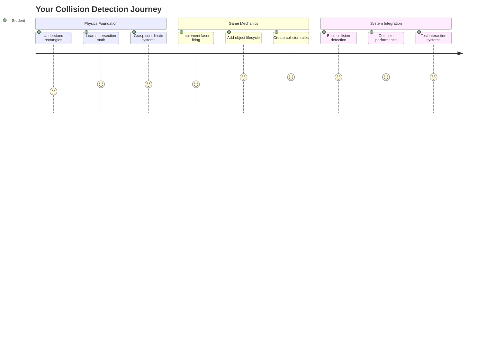
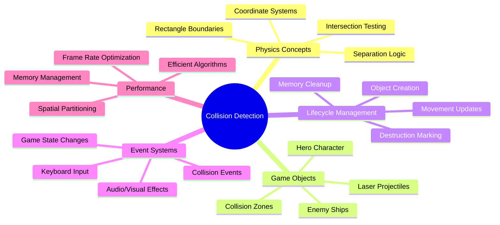
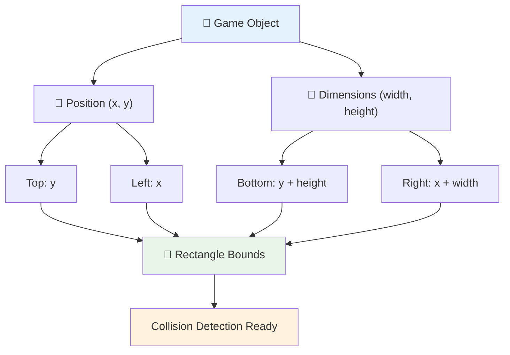
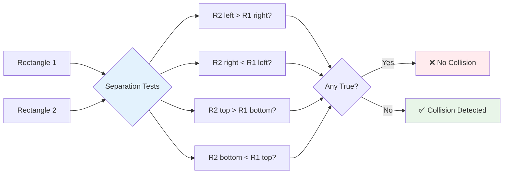
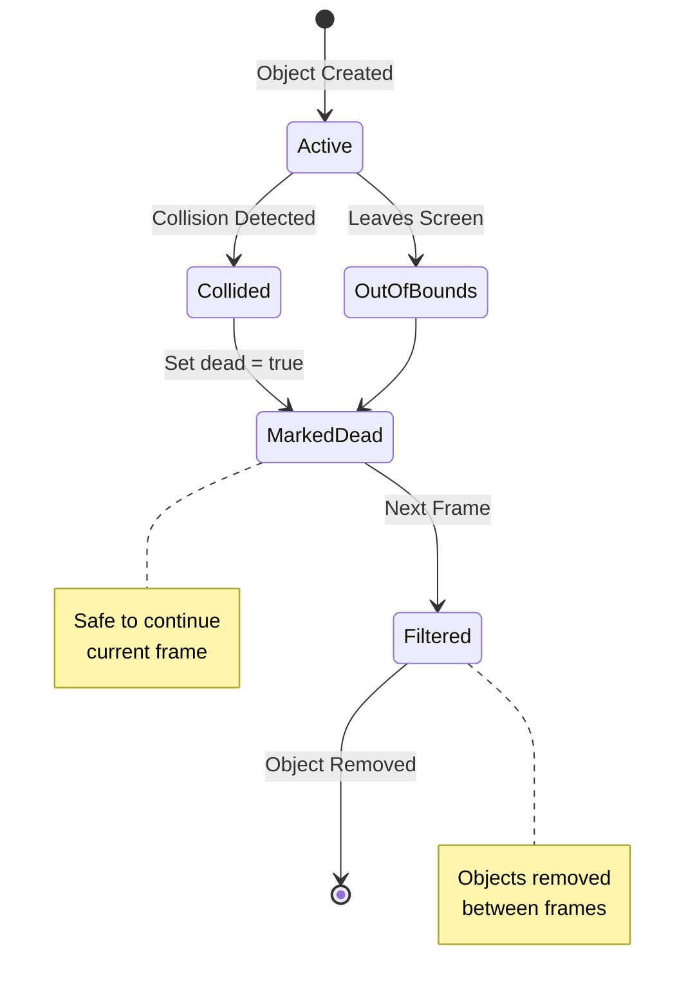
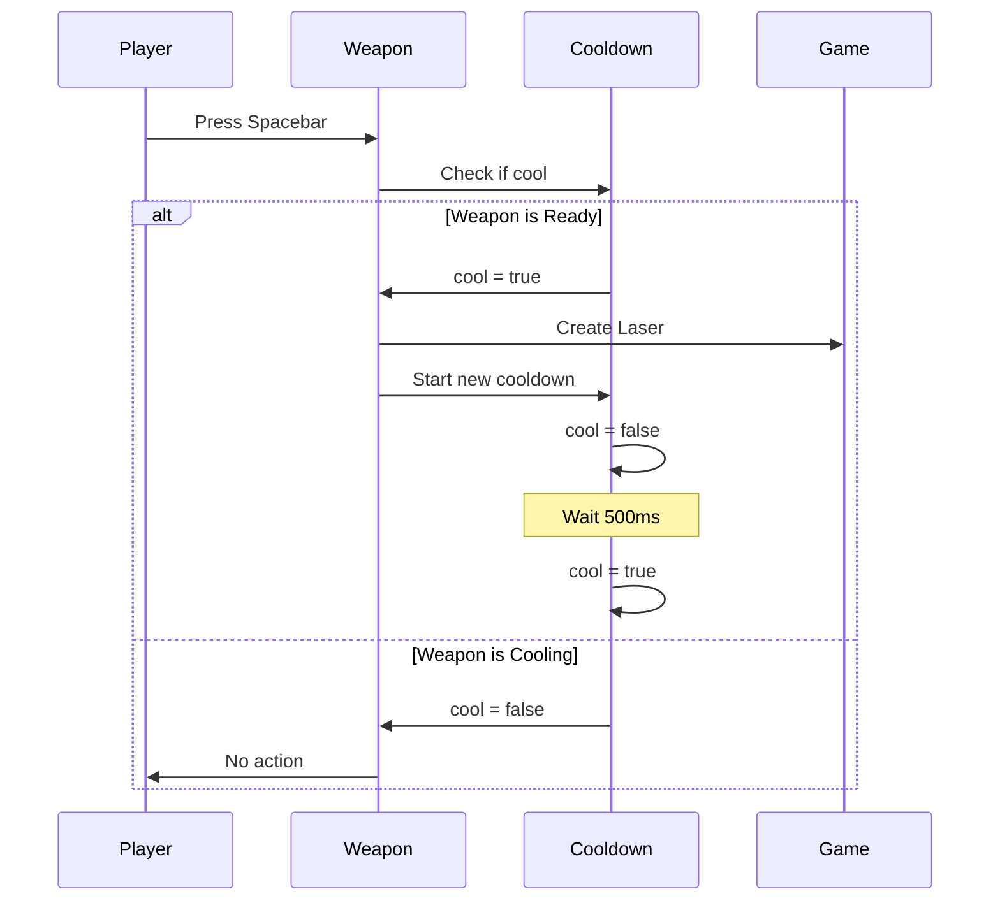
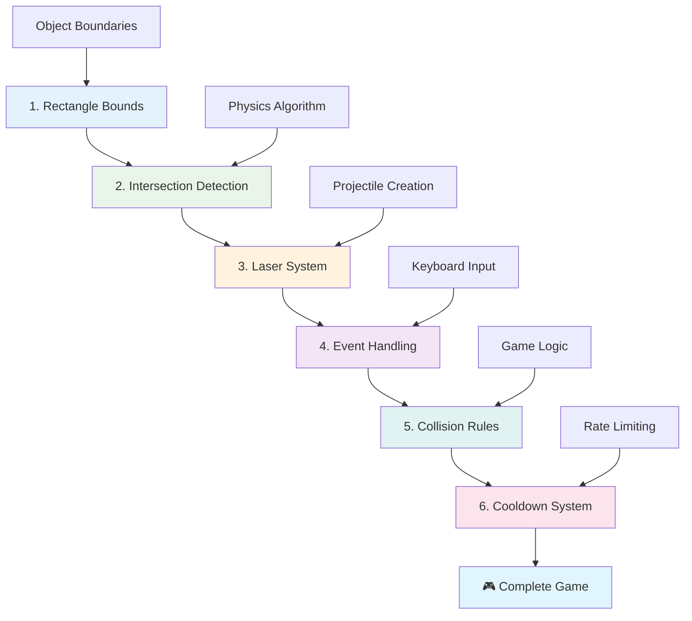
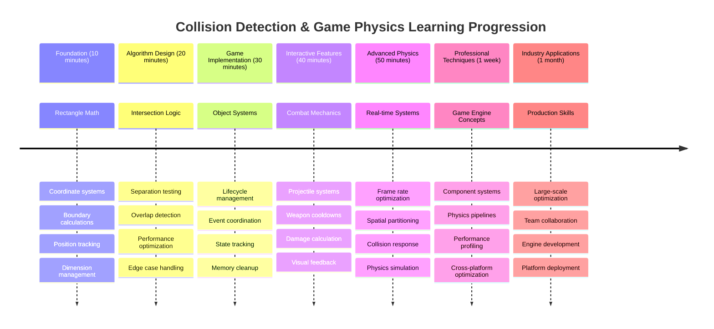

# خلائی کھیل بنائیں حصہ 4: لیزر شامل کریں اور تصادم کا پتہ لگائیں



## لیکچر سے پہلے کا کوئز

[لیکچر سے پہلے کا کوئز](https://ff-quizzes.netlify.app/web/quiz/35)

اس لمحے کے بارے میں سوچیں جب اسٹار وارز میں لوک کے پروٹون ٹورپیڈوز نے ڈیتھ اسٹار کے ایگزاسٹ پورٹ کو نشانہ بنایا۔ وہ درست تصادم کا پتہ لگانا کہکشاں کی تقدیر کو بدل دیا! گیمز میں، تصادم کا پتہ لگانا اسی طرح کام کرتا ہے - یہ طے کرتا ہے کہ کب اشیاء ایک دوسرے کے ساتھ تعامل کرتی ہیں اور اس کے بعد کیا ہوتا ہے۔

اس سبق میں، آپ اپنے خلائی کھیل میں لیزر ہتھیار شامل کریں گے اور تصادم کا پتہ لگانے کا نظام نافذ کریں گے۔ جیسے ناسا کے مشن پلانرز خلائی جہاز کے راستے کا حساب لگاتے ہیں تاکہ ملبے سے بچا جا سکے، آپ سیکھیں گے کہ گیم اشیاء کے ایک دوسرے سے ٹکرانے کا پتہ کیسے لگایا جائے۔ ہم اسے قابل انتظام مراحل میں تقسیم کریں گے جو ایک دوسرے پر تعمیر ہوتے ہیں۔

آخر میں، آپ کے پاس ایک کام کرنے والا جنگی نظام ہوگا جہاں لیزر دشمنوں کو تباہ کرتے ہیں اور تصادم گیم کے واقعات کو متحرک کرتے ہیں۔ یہی تصادم کے اصول ہر چیز میں استعمال ہوتے ہیں، چاہے وہ فزکس کی سیمولیشن ہو یا انٹرایکٹو ویب انٹرفیس۔



✅ دنیا کے سب سے پہلے کمپیوٹر گیم کے بارے میں تھوڑی تحقیق کریں۔ اس کی خصوصیات کیا تھیں؟

## تصادم کا پتہ لگانا

تصادم کا پتہ لگانا اپولو چاند کی ماڈیول کے قربت سینسرز کی طرح کام کرتا ہے - یہ مسلسل فاصلے چیک کرتا ہے اور جب اشیاء بہت قریب آتی ہیں تو الرٹ دیتا ہے۔ گیمز میں، یہ نظام طے کرتا ہے کہ کب اشیاء ایک دوسرے کے ساتھ تعامل کرتی ہیں اور اس کے بعد کیا ہونا چاہیے۔

جو طریقہ ہم استعمال کریں گے وہ ہر گیم آبجیکٹ کو ایک مستطیل کے طور پر دیکھتا ہے، جیسے کہ ایئر ٹریفک کنٹرول سسٹمز ہوائی جہاز کو ٹریک کرنے کے لیے سادہ جیومیٹرک شکلیں استعمال کرتے ہیں۔ یہ مستطیل طریقہ شاید بنیادی لگے، لیکن یہ کمپیوٹیشنل طور پر مؤثر ہے اور زیادہ تر گیم کے منظرناموں کے لیے اچھا کام کرتا ہے۔

### مستطیل کی نمائندگی

ہر گیم آبجیکٹ کو کوآرڈینیٹ حدود کی ضرورت ہوتی ہے، جیسے کہ مریخ پاتھ فائنڈر روور نے مریخ کی سطح پر اپنی جگہ کا نقشہ بنایا۔ یہاں ہم ان حدود کو کیسے بیان کرتے ہیں:



```javascript
rectFromGameObject() {
  return {
    top: this.y,
    left: this.x,
    bottom: this.y + this.height,
    right: this.x + this.width
  }
}
```

**آئیے اسے توڑتے ہیں:**
- **اوپر کا کنارہ**: یہ وہ جگہ ہے جہاں آپ کا آبجیکٹ عمودی طور پر شروع ہوتا ہے (اس کا y پوزیشن)
- **بائیں کنارہ**: جہاں یہ افقی طور پر شروع ہوتا ہے (اس کا x پوزیشن)
- **نیچے کا کنارہ**: y پوزیشن میں اونچائی شامل کریں - اب آپ کو معلوم ہے کہ یہ کہاں ختم ہوتا ہے!
- **دائیں کنارہ**: x پوزیشن میں چوڑائی شامل کریں - اور آپ کے پاس مکمل حد ہے

### انٹرسیکشن الگورتھم

مستطیل کے انٹرسیکشن کا پتہ لگانے کے لیے منطق استعمال کی جاتی ہے جیسے ہبل اسپیس ٹیلیسکوپ یہ طے کرتا ہے کہ آیا آسمانی اشیاء اس کے میدان نظر میں ایک دوسرے کے ساتھ اوورلیپ کر رہی ہیں۔ الگورتھم علیحدگی کی جانچ کرتا ہے:



```javascript
function intersectRect(r1, r2) {
  return !(r2.left > r1.right ||
    r2.right < r1.left ||
    r2.top > r1.bottom ||
    r2.bottom < r1.top);
}
```

**علیحدگی کا ٹیسٹ ریڈار سسٹمز کی طرح کام کرتا ہے:**
- کیا مستطیل 2 مکمل طور پر مستطیل 1 کے دائیں طرف ہے؟
- کیا مستطیل 2 مکمل طور پر مستطیل 1 کے بائیں طرف ہے؟
- کیا مستطیل 2 مکمل طور پر مستطیل 1 کے نیچے ہے؟
- کیا مستطیل 2 مکمل طور پر مستطیل 1 کے اوپر ہے؟

اگر ان میں سے کوئی بھی شرط درست نہیں ہے، تو مستطیلیں لازمی طور پر اوورلیپ کر رہی ہیں۔ یہ طریقہ ریڈار آپریٹرز کے طے کرنے کے طریقے کی عکاسی کرتا ہے کہ آیا دو ہوائی جہاز محفوظ فاصلے پر ہیں۔

## آبجیکٹ لائف سائیکل کا انتظام

جب لیزر دشمن کو مارتا ہے، تو دونوں اشیاء کو گیم سے ہٹانے کی ضرورت ہوتی ہے۔ تاہم، لوپ کے درمیان اشیاء کو حذف کرنا کریش کا سبب بن سکتا ہے - ایک سبق جو اپولو گائیڈنس کمپیوٹر جیسے ابتدائی کمپیوٹر سسٹمز میں سختی سے سیکھا گیا۔ اس کے بجائے، ہم "حذف کرنے کے لیے نشان زد کریں" کا طریقہ استعمال کرتے ہیں جو فریموں کے درمیان اشیاء کو محفوظ طریقے سے ہٹاتا ہے۔



یہاں ہم کسی چیز کو ہٹانے کے لیے نشان زد کرتے ہیں:

```javascript
// Mark object for removal
enemy.dead = true;
```

**یہ طریقہ کیوں کام کرتا ہے:**
- ہم آبجیکٹ کو "مردہ" کے طور پر نشان زد کرتے ہیں لیکن اسے فوراً حذف نہیں کرتے
- یہ موجودہ گیم فریم کو محفوظ طریقے سے ختم کرنے دیتا ہے
- کریشز نہیں ہوتے کیونکہ کسی ایسی چیز کو استعمال کرنے کی کوشش نہیں کی جاتی جو پہلے ہی ختم ہو چکی ہو!

پھر اگلے رینڈر سائیکل سے پہلے نشان زد کردہ اشیاء کو فلٹر کریں:

```javascript
gameObjects = gameObjects.filter(go => !go.dead);
```

**یہ فلٹرنگ کیا کرتی ہے:**
- ایک تازہ فہرست بناتی ہے جس میں صرف "زندہ" اشیاء ہوتی ہیں
- کسی بھی چیز کو جو مردہ کے طور پر نشان زد ہو، باہر نکال دیتی ہے
- آپ کے گیم کو ہموار طریقے سے چلتا رکھتی ہے
- تباہ شدہ اشیاء کے جمع ہونے سے میموری کے بوجھ کو روکتی ہے

## لیزر میکینکس نافذ کرنا

گیمز میں لیزر پروجیکٹائلز اسٹار ٹریک کے فوٹون ٹورپیڈوز کے اصول پر کام کرتے ہیں - یہ الگ الگ اشیاء ہیں جو سیدھی لائنوں میں سفر کرتی ہیں جب تک کہ وہ کسی چیز سے ٹکرا نہ جائیں۔ ہر اسپیس بار پریس ایک نیا لیزر آبجیکٹ بناتا ہے جو اسکرین پر حرکت کرتا ہے۔

اسے کام کرنے کے لیے، ہمیں چند مختلف حصوں کو مربوط کرنے کی ضرورت ہے:

**عمل درآمد کے لیے کلیدی اجزاء:**
- **بنائیں** لیزر آبجیکٹس جو ہیرو کی پوزیشن سے پیدا ہوتے ہیں
- **ہینڈل کریں** کی بورڈ ان پٹ تاکہ لیزر تخلیق کو متحرک کیا جا سکے
- **منظم کریں** لیزر کی حرکت اور لائف سائیکل
- **نافذ کریں** لیزر پروجیکٹائلز کے لیے بصری نمائندگی

## فائرنگ کی شرح کنٹرول نافذ کرنا

لامحدود فائرنگ کی شرح گیم انجن کو مغلوب کر دے گی اور گیم پلے کو بہت آسان بنا دے گی۔ حقیقی ہتھیاروں کے نظام کو اسی طرح کی پابندیوں کا سامنا کرنا پڑتا ہے - یہاں تک کہ یو ایس ایس انٹرپرائز کے فیزرز کو شاٹس کے درمیان ریچارج کرنے کے لیے وقت کی ضرورت ہوتی تھی۔

ہم ایک کولڈاؤن سسٹم نافذ کریں گے جو اسپام فائرنگ کو روکتا ہے جبکہ کنٹرولز کو جوابدہ رکھتا ہے:



```javascript
class Cooldown {
  constructor(time) {
    this.cool = false;
    setTimeout(() => {
      this.cool = true;
    }, time);
  }
}

class Weapon {
  constructor() {
    this.cooldown = null;
  }
  
  fire() {
    if (!this.cooldown || this.cooldown.cool) {
      // Create laser projectile
      this.cooldown = new Cooldown(500);
    } else {
      // Weapon is still cooling down
    }
  }
}
```

**کولڈاؤن کیسے کام کرتا ہے:**
- جب بنایا جاتا ہے، ہتھیار "گرم" شروع ہوتا ہے (ابھی فائر نہیں کر سکتا)
- ٹائم آؤٹ مدت کے بعد، یہ "ٹھنڈا" ہو جاتا ہے (فائر کرنے کے لیے تیار)
- فائر کرنے سے پہلے، ہم چیک کرتے ہیں: "کیا ہتھیار ٹھنڈا ہے؟"
- یہ اسپام کلکنگ کو روکتا ہے جبکہ کنٹرولز کو جوابدہ رکھتا ہے

✅ خلائی کھیل سیریز کے سبق 1 کا حوالہ دیں تاکہ کولڈاؤنز کے بارے میں یاد دہانی حاصل کریں۔

## تصادم کا نظام بنانا

آپ اپنے موجودہ خلائی کھیل کے کوڈ کو بڑھا کر تصادم کا پتہ لگانے کا نظام بنائیں گے۔ جیسے انٹرنیشنل اسپیس اسٹیشن کا خودکار تصادم سے بچاؤ کا نظام، آپ کا کھیل مسلسل آبجیکٹ پوزیشنز کی نگرانی کرے گا اور انٹرسیکشنز پر ردعمل دے گا۔

پچھلے سبق کے کوڈ سے شروع کرتے ہوئے، آپ تصادم کا پتہ لگانے کے ساتھ مخصوص قواعد شامل کریں گے جو آبجیکٹ تعاملات کو کنٹرول کرتے ہیں۔

> 💡 **پرو ٹپ**: لیزر اسپریٹ پہلے ہی آپ کے اثاثوں کے فولڈر میں شامل ہے اور آپ کے کوڈ میں حوالہ دیا گیا ہے، عمل درآمد کے لیے تیار ہے۔

### نافذ کرنے کے لیے تصادم کے قواعد

**گیم میکینکس شامل کریں:**
1. **لیزر دشمن کو مارتا ہے**: دشمن آبجیکٹ لیزر پروجیکٹائل کے ذریعے مارے جانے پر تباہ ہو جاتا ہے
2. **لیزر اسکرین کی حد کو مارتا ہے**: لیزر اسکرین کے اوپر کنارے تک پہنچنے پر ہٹا دیا جاتا ہے
3. **دشمن اور ہیرو کا تصادم**: دونوں آبجیکٹس انٹرسیکشن پر تباہ ہو جاتے ہیں
4. **دشمن نیچے پہنچتا ہے**: گیم اوور کی حالت جب دشمن اسکرین کے نیچے پہنچتے ہیں

### 🔄 **تعلیمی چیک ان**
**تصادم کا پتہ لگانے کی بنیاد**: عمل درآمد سے پہلے، یقینی بنائیں کہ آپ سمجھتے ہیں:
- ✅ مستطیل حدود تصادم کے زونز کو کیسے بیان کرتی ہیں
- ✅ علیحدگی کی جانچ انٹرسیکشن کی حساب کتاب سے زیادہ مؤثر کیوں ہے
- ✅ گیم لوپس میں آبجیکٹ لائف سائیکل مینجمنٹ کی اہمیت
- ✅ ایونٹ ڈرائیون سسٹمز تصادم کے ردعمل کو کیسے مربوط کرتے ہیں

**خود کو جلدی آزمائیں**: اگر آپ اشیاء کو فوراً حذف کر دیتے تو کیا ہوتا؟
*جواب: لوپ کے درمیان حذف کرنے سے کریش ہو سکتا ہے یا اشیاء کو نظر انداز کر سکتا ہے*

**فزکس کی سمجھ**: آپ اب سمجھتے ہیں:
- **کوآرڈینیٹ سسٹمز**: پوزیشن اور ڈائمینشنز حدود کیسے بناتے ہیں
- **انٹرسیکشن منطق**: تصادم کا پتہ لگانے کے پیچھے ریاضی کے اصول
- **کارکردگی کی اصلاح**: حقیقی وقت کے سسٹمز میں مؤثر الگورتھمز کیوں اہم ہیں
- **میموری مینجمنٹ**: استحکام کے لیے محفوظ آبجیکٹ لائف سائیکل پیٹرنز

## اپنے ترقیاتی ماحول کو ترتیب دینا

اچھی خبر - ہم نے آپ کے لیے زیادہ تر بنیادی کام پہلے ہی ترتیب دے دیا ہے! آپ کے تمام گیم اثاثے اور بنیادی ڈھانچہ `your-work` سب فولڈر میں موجود ہیں، جو آپ کے لیے تصادم کی زبردست خصوصیات شامل کرنے کے لیے تیار ہیں۔

### پروجیکٹ کا ڈھانچہ

```bash
-| assets
  -| enemyShip.png
  -| player.png
  -| laserRed.png
-| index.html
-| app.js
-| package.json
```

**فائل ڈھانچے کو سمجھنا:**
- **شامل کرتا ہے** گیم آبجیکٹس کے لیے تمام اسپریٹ تصاویر
- **شامل کرتا ہے** مین HTML دستاویز اور جاوا اسکرپٹ ایپلیکیشن فائل
- **فراہم کرتا ہے** مقامی ترقیاتی سرور کے لیے پیکج کنفیگریشن

### ترقیاتی سرور شروع کرنا

اپنے پروجیکٹ فولڈر پر جائیں اور مقامی سرور شروع کریں:

```bash
cd your-work
npm start
```

**یہ کمانڈ ترتیب:**
- **ڈائریکٹری تبدیل کرتی ہے** آپ کے کام کرنے والے پروجیکٹ فولڈر میں
- **مقامی HTTP سرور شروع کرتی ہے** `http://localhost:5000` پر
- **آپ کے گیم فائلز پیش کرتی ہے** ٹیسٹنگ اور ترقی کے لیے
- **لائیو ترقی کو فعال کرتی ہے** خودکار ری لوڈنگ کے ساتھ

اپنے براؤزر کو کھولیں اور `http://localhost:5000` پر جائیں تاکہ اپنے موجودہ گیم کی حالت کو ہیرو اور دشمنوں کے ساتھ اسکرین پر دیکھ سکیں۔

### مرحلہ وار عمل درآمد

جیسے ناسا نے وویاجر اسپیس کرافٹ کو پروگرام کرنے کے لیے منظم طریقہ اختیار کیا، ہم تصادم کا پتہ لگانے کو مرحلہ وار طریقے سے نافذ کریں گے، ہر جزو کو قدم بہ قدم بناتے ہوئے۔



#### 1. مستطیل تصادم کی حدود شامل کریں

سب سے پہلے، آئیے اپنے گیم آبجیکٹس کو سکھائیں کہ وہ اپنی حدود کو کیسے بیان کریں۔ اپنے `GameObject` کلاس میں یہ طریقہ شامل کریں:

```javascript
rectFromGameObject() {
    return {
      top: this.y,
      left: this.x,
      bottom: this.y + this.height,
      right: this.x + this.width,
    };
  }
```

**یہ طریقہ انجام دیتا ہے:**
- **بناتا ہے** ایک مستطیل آبجیکٹ جس میں درست حد کے کوآرڈینیٹس ہوتے ہیں
- **حساب کرتا ہے** نیچے اور دائیں کنارے کو پوزیشن اور ڈائمینشنز کے ذریعے
- **واپس کرتا ہے** ایک آبجیکٹ جو تصادم کے پتہ لگانے والے الگورتھمز کے لیے تیار ہے
- **فراہم کرتا ہے** تمام گیم آبجیکٹس کے لیے ایک معیاری انٹرفیس

#### 2. انٹرسیکشن کا پتہ لگانے کا عمل درآمد کریں

اب آئیے اپنے تصادم کے جاسوس کو بنائیں - ایک فنکشن جو بتا سکتا ہے کہ آیا دو مستطیلیں اوورلیپ کر رہی ہیں:

```javascript
function intersectRect(r1, r2) {
  return !(
    r2.left > r1.right ||
    r2.right < r1.left ||
    r2.top > r1.bottom ||
    r2.bottom < r1.top
  );
}
```

**یہ الگورتھم کام کرتا ہے:**
- **چار علیحدگی کی شرائط** مستطیلوں کے درمیان جانچتا ہے
- **واپس کرتا ہے** `false` اگر کوئی علیحدگی کی شرط درست ہو
- **اشارہ دیتا ہے** تصادم جب کوئی علیحدگی موجود نہ ہو
- **منفی منطق** مؤثر انٹرسیکشن ٹیسٹنگ کے لیے استعمال کرتا ہے

#### 3. لیزر فائرنگ کا نظام نافذ کریں

یہاں چیزیں دلچسپ ہو جاتی ہیں! آئیے لیزر فائرنگ کا نظام ترتیب دیں۔

##### پیغام کے مستقلات

سب سے پہلے، آئیے کچھ پیغام کی اقسام کی وضاحت کریں تاکہ ہمارے گیم کے مختلف حصے ایک دوسرے سے بات کر سکیں:

```javascript
KEY_EVENT_SPACE: "KEY_EVENT_SPACE",
COLLISION_ENEMY_LASER: "COLLISION_ENEMY_LASER",
COLLISION_ENEMY_HERO: "COLLISION_ENEMY_HERO",
```

**یہ مستقلات فراہم کرتے ہیں:**
- **ایونٹ کے ناموں کو معیاری بناتا ہے** پورے ایپلیکیشن میں
- **مستقل مواصلات کو فعال کرتا ہے** گیم سسٹمز کے درمیان
- **ایونٹ ہینڈلر رجسٹریشن میں ٹائپوز کو روکتا ہے**

##### کی بورڈ ان پٹ ہینڈلنگ

اپنے کی ایونٹ لسٹنر میں اسپیس کی کی ڈیٹیکشن شامل کریں:

```javascript
} else if(evt.keyCode === 32) {
  eventEmitter.emit(Messages.KEY_EVENT_SPACE);
}
```

**یہ انپٹ ہینڈلر:**
- **اسپیس کی پریسز کا پتہ لگاتا ہے** keyCode 32 کا استعمال کرتے ہوئے
- **ایک معیاری ایونٹ پیغام بھیجتا ہے**
- **فائرنگ کی منطق کو الگ کرتا ہے**

##### ایونٹ لسٹنر سیٹ اپ

اپنے `initGame()` فنکشن میں فائرنگ کے رویے کو رجسٹر کریں:

```javascript
eventEmitter.on(Messages.KEY_EVENT_SPACE, () => {
 if (hero.canFire()) {
   hero.fire();
 }
});
```

**یہ ایونٹ لسٹنر:**
- **اسپیس کی ایونٹس کا جواب دیتا ہے**
- **فائرنگ کولڈاؤن کی حیثیت چیک کرتا ہے**
- **لیزر تخلیق کو متحرک کرتا ہے جب اجازت ہو**

لیزر-دشمن تعاملات کے لیے تصادم ہینڈلنگ شامل کریں:

```javascript
eventEmitter.on(Messages.COLLISION_ENEMY_LASER, (_, { first, second }) => {
  first.dead = true;
  second.dead = true;
});
```

**یہ تصادم ہینڈلر:**
- **تصادم ایونٹ ڈیٹا وصول کرتا ہے** دونوں اشیاء کے ساتھ
- **دونوں اشیاء کو ہٹانے کے لیے نشان زد کرتا ہے**
- **تصادم کے بعد مناسب صفائی کو یقینی بناتا ہے**

#### 4. لیزر کلاس بنائیں

ایک لیزر پروجیکٹائل نافذ کریں جو اوپر کی طرف حرکت کرتا ہے اور اپنے لائف سائیکل کا انتظام کرتا ہے:

```javascript
class Laser extends GameObject {
  constructor(x, y) {
    super(x, y);
    this.width = 9;
    this.height = 33;
    this.type = 'Laser';
    this.img = laserImg;
    
    let id = setInterval(() => {
      if (this.y > 0) {
        this.y -= 15;
      } else {
        this.dead = true;
        clearInterval(id);
      }
    }, 100);
  }
}
```

**یہ کلاس عمل درآمد:**
- **GameObject کو بڑھاتا ہے** بنیادی فعالیت کو وراثت میں لینے کے لیے
- **مناسب ڈائمینشنز سیٹ کرتا ہے** لیزر اسپریٹ کے لیے
- **خودکار اوپر کی طرف حرکت پیدا کرتا ہے** `setInterval()` کا استعمال کرتے ہوئے
- **اسکرین کے اوپر پہنچنے پر خود کو ختم کرتا ہے**
- **اپنی حرکت کی ٹائمنگ اور صفائی کا انتظام کرتا ہے**

#### 5. تصادم کا پتہ لگانے کا نظام نافذ کریں

ایک جامع تصادم کا پتہ لگانے کا فنکشن بنائیں:

```javascript
function updateGameObjects() {
  const enemies = gameObjects.filter(go => go.type === 'Enemy');
  const lasers = gameObjects.filter(go => go.type === "Laser");
  
  // Test laser-enemy collisions
  lasers.forEach((laser) => {
    enemies.forEach((enemy) => {
      if (intersectRect(laser.rectFromGameObject(), enemy.rectFromGameObject())) {
        eventEmitter.emit(Messages.COLLISION_ENEMY_LASER, {
          first: laser,
          second: enemy,
        });
      }
    });
  });

  // Remove destroyed objects
  gameObjects = gameObjects.filter(go => !go.dead);
}
```

**یہ تصادم کا نظام:**
- **گیم آبجیکٹس کو فلٹر کرتا ہے** قسم کے لحاظ سے مؤثر جانچ کے لیے
- **ہر لیزر کو ہر دشمن کے خلاف جانچتا ہے** انٹرسیکشنز کے لیے
- **تصادم ایونٹس بھیجتا ہے** جب انٹرسیکشنز کا پتہ لگایا جاتا ہے
- **تباہ شدہ اشیاء کو صاف کرتا ہے** تصادم کی پروسیسنگ کے بعد

> ⚠️ **اہم**: اپنے مین گیم لوپ میں `updateGameObjects()` شامل کریں `window.onload` میں تصادم کا پتہ لگانے کو فعال کرنے کے لیے
- [ ] `console.log` بیانات شامل کریں تاکہ تصادم کے واقعات کو حقیقی وقت میں ٹریک کیا جا سکے

### 🎯 **اس گھنٹے میں آپ کیا حاصل کر سکتے ہیں**
- [ ] سبق کے بعد کا کوئز مکمل کریں اور تصادم کی شناخت کے الگورتھم کو سمجھیں
- [ ] تصادم کے وقت دھماکوں جیسے بصری اثرات شامل کریں
- [ ] مختلف خصوصیات کے ساتھ مختلف قسم کے پروجیکٹائلز نافذ کریں
- [ ] پاور اپس بنائیں جو عارضی طور پر کھلاڑی کی صلاحیتوں کو بڑھائیں
- [ ] تصادم کو مزید دلچسپ بنانے کے لیے صوتی اثرات شامل کریں

### 📅 **آپ کا ہفتہ بھر کا فزکس پروگرامنگ**
- [ ] مکمل اسپیس گیم کو مکمل کریں جس میں تصادم کے نظام کو بہتر بنایا گیا ہو
- [ ] مستطیلوں سے آگے جدید تصادم کی شکلیں نافذ کریں (گول دائرے، کثیرالاضلاع)
- [ ] حقیقت پسندانہ دھماکے کے اثرات کے لیے پارٹیکل سسٹمز شامل کریں
- [ ] دشمن کے پیچیدہ رویے بنائیں جن میں تصادم سے بچاؤ شامل ہو
- [ ] بہتر کارکردگی کے لیے تصادم کی شناخت کو بہتر بنائیں جب بہت سے اشیاء ہوں
- [ ] فزکس کی نقل جیسے رفتار اور حقیقت پسندانہ حرکت شامل کریں

### 🌟 **آپ کا مہینے بھر کا گیم فزکس ماسٹری**
- [ ] جدید فزکس انجن اور حقیقت پسندانہ نقلیات کے ساتھ گیمز بنائیں
- [ ] 3D تصادم کی شناخت اور اسپیشل پارٹیشننگ الگورتھم سیکھیں
- [ ] اوپن سورس فزکس لائبریریوں اور گیم انجنز میں تعاون کریں
- [ ] گرافکس کے لحاظ سے شدید ایپلیکیشنز کے لیے کارکردگی کی اصلاح میں مہارت حاصل کریں
- [ ] گیم فزکس اور تصادم کی شناخت کے بارے میں تعلیمی مواد بنائیں
- [ ] جدید فزکس پروگرامنگ مہارتوں کو ظاہر کرنے والا پورٹ فولیو بنائیں

## 🎯 آپ کی تصادم کی شناخت کی مہارت کا ٹائم لائن



### 🛠️ آپ کا گیم فزکس ٹول کٹ کا خلاصہ

اس سبق کو مکمل کرنے کے بعد، آپ نے درج ذیل مہارتیں حاصل کر لی ہیں:
- **تصادم ریاضی**: مستطیل کے انٹرسیکشن الگورتھم اور کوآرڈینیٹ سسٹمز
- **کارکردگی کی اصلاح**: حقیقی وقت کی ایپلیکیشنز کے لیے مؤثر تصادم کی شناخت
- **آبجیکٹ لائف سائیکل مینجمنٹ**: محفوظ تخلیق، اپ ڈیٹ، اور تباہی کے نمونے
- **ایونٹ ڈرائیون آرکیٹیکچر**: تصادم کے ردعمل کے لیے الگ الگ نظام
- **گیم لوپ انٹیگریشن**: فریم پر مبنی فزکس اپ ڈیٹس اور رینڈرنگ کوآرڈینیشن
- **ان پٹ سسٹمز**: ریٹ محدود اور فیڈبیک کے ساتھ جوابدہ کنٹرولز
- **میموری مینجمنٹ**: مؤثر آبجیکٹ پولنگ اور صفائی کی حکمت عملی

**حقیقی دنیا کی ایپلیکیشنز**: آپ کی تصادم کی شناخت کی مہارت براہ راست لاگو ہوتی ہے:
- **انٹرایکٹو نقلیات**: سائنسی ماڈلنگ اور تعلیمی ٹولز
- **یوزر انٹرفیس ڈیزائن**: ڈریگ اینڈ ڈراپ انٹریکشنز اور ٹچ شناخت
- **ڈیٹا ویژولائزیشن**: انٹرایکٹو چارٹس اور کلک ایبل عناصر
- **موبائل ڈیولپمنٹ**: ٹچ اشارے کی شناخت اور تصادم کی ہینڈلنگ
- **روبوٹکس پروگرامنگ**: راستہ منصوبہ بندی اور رکاوٹ سے بچاؤ
- **کمپیوٹر گرافکس**: رے ٹریسنگ اور اسپیشل الگورتھم

**حاصل کردہ پیشہ ورانہ مہارتیں**: آپ اب کر سکتے ہیں:
- **ڈیزائن** حقیقی وقت کی تصادم کی شناخت کے لیے مؤثر الگورتھم
- **نافذ کریں** فزکس سسٹمز جو آبجیکٹ کی پیچیدگی کے ساتھ بڑھتے ہیں
- **ڈیبگ** پیچیدہ انٹریکشن سسٹمز ریاضی کے اصولوں کا استعمال کرتے ہوئے
- **کارکردگی کو بہتر بنائیں** مختلف ہارڈویئر اور براؤزر کی صلاحیتوں کے لیے
- **آرکیٹیکٹ** قابل دیکھ بھال گیم سسٹمز ثابت شدہ ڈیزائن پیٹرنز کا استعمال کرتے ہوئے

**گیم ڈیولپمنٹ کے تصورات میں مہارت حاصل کی**:
- **فزکس نقلیات**: حقیقی وقت کی تصادم کی شناخت اور ردعمل
- **کارکردگی انجینئرنگ**: انٹرایکٹو ایپلیکیشنز کے لیے بہتر الگورتھم
- **ایونٹ سسٹمز**: گیم کے اجزاء کے درمیان الگ الگ مواصلات
- **آبجیکٹ مینجمنٹ**: متحرک مواد کے لیے مؤثر لائف سائیکل کے نمونے
- **ان پٹ ہینڈلنگ**: مناسب فیڈبیک کے ساتھ جوابدہ کنٹرولز

**اگلا مرحلہ**: آپ جدید فزکس انجنز جیسے Matter.js کو دریافت کرنے، 3D تصادم کی شناخت کو نافذ کرنے، یا پیچیدہ پارٹیکل سسٹمز بنانے کے لیے تیار ہیں!

🌟 **کامیابی حاصل کی**: آپ نے پیشہ ورانہ معیار کی تصادم کی شناخت کے ساتھ مکمل فزکس پر مبنی انٹریکشن سسٹم بنایا ہے!

## GitHub Copilot ایجنٹ چیلنج 🚀

ایجنٹ موڈ کا استعمال کرتے ہوئے درج ذیل چیلنج مکمل کریں:

**تفصیل:** تصادم کی شناخت کے نظام کو بہتر بنائیں تاکہ پاور اپس کو نافذ کیا جا سکے جو تصادفی طور پر پیدا ہوں اور ہیرو شپ کے ذریعے جمع کیے جانے پر عارضی صلاحیتیں فراہم کریں۔

**پرومپٹ:** ایک PowerUp کلاس بنائیں جو GameObject کو بڑھائے اور ہیرو اور پاور اپس کے درمیان تصادم کی شناخت کو نافذ کرے۔ کم از کم دو قسم کے پاور اپس شامل کریں: ایک جو فائر ریٹ بڑھاتا ہے (کولڈاؤن کو کم کرتا ہے) اور دوسرا جو عارضی شیلڈ بناتا ہے۔ اسپون لاجک شامل کریں جو تصادفی وقفوں اور پوزیشنز پر پاور اپس بناتا ہے۔

---

## 🚀 چیلنج

ایک دھماکہ شامل کریں! [اسپیس آرٹ ریپو](../../../../6-space-game/solution/spaceArt/readme.txt) میں گیم کے اثاثوں پر نظر ڈالیں اور کوشش کریں کہ جب لیزر کسی ایلین کو ہٹ کرے تو دھماکہ شامل کریں۔

## سبق کے بعد کا کوئز

[سبق کے بعد کا کوئز](https://ff-quizzes.netlify.app/web/quiz/36)

## جائزہ اور خود مطالعہ

اپنے گیم میں وقفوں کے ساتھ تجربہ کریں جو آپ نے اب تک بنایا ہے۔ جب آپ انہیں تبدیل کرتے ہیں تو کیا ہوتا ہے؟ مزید پڑھیں [JavaScript ٹائمنگ ایونٹس](https://www.freecodecamp.org/news/javascript-timing-events-settimeout-and-setinterval/) کے بارے میں۔

## اسائنمنٹ

[تصادم کو دریافت کریں](assignment.md)

---

**اعلانِ لاتعلقی**:  
یہ دستاویز AI ترجمہ سروس [Co-op Translator](https://github.com/Azure/co-op-translator) کا استعمال کرتے ہوئے ترجمہ کی گئی ہے۔ ہم درستگی کی بھرپور کوشش کرتے ہیں، لیکن براہ کرم آگاہ رہیں کہ خودکار ترجمے میں غلطیاں یا عدم درستگی ہو سکتی ہے۔ اصل دستاویز کو اس کی اصل زبان میں مستند ذریعہ سمجھا جانا چاہیے۔ اہم معلومات کے لیے، پیشہ ور انسانی ترجمہ کی سفارش کی جاتی ہے۔ ہم اس ترجمے کے استعمال سے پیدا ہونے والی کسی بھی غلط فہمی یا غلط تشریح کے ذمہ دار نہیں ہیں۔