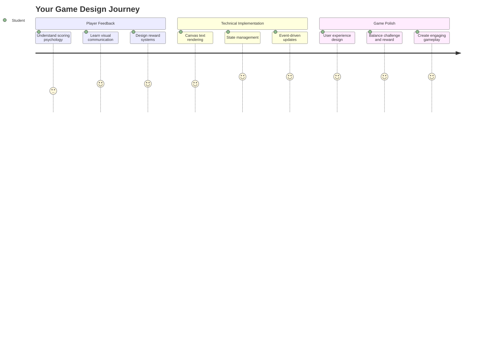
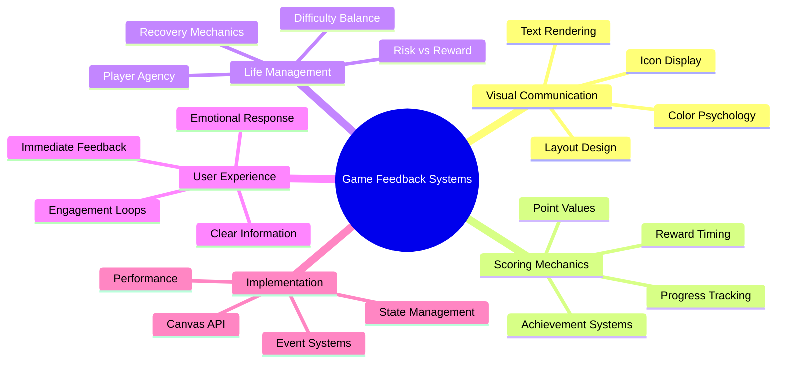
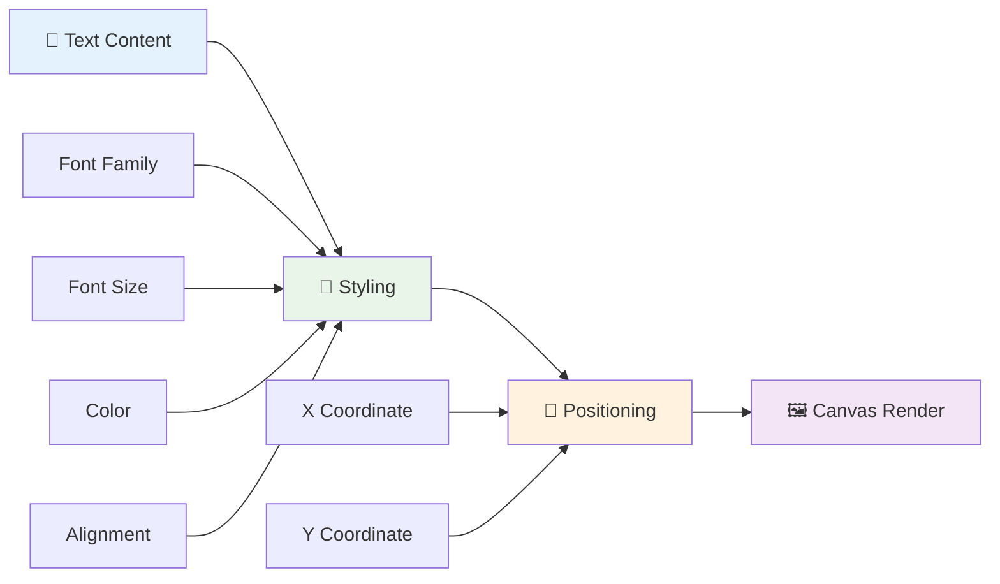
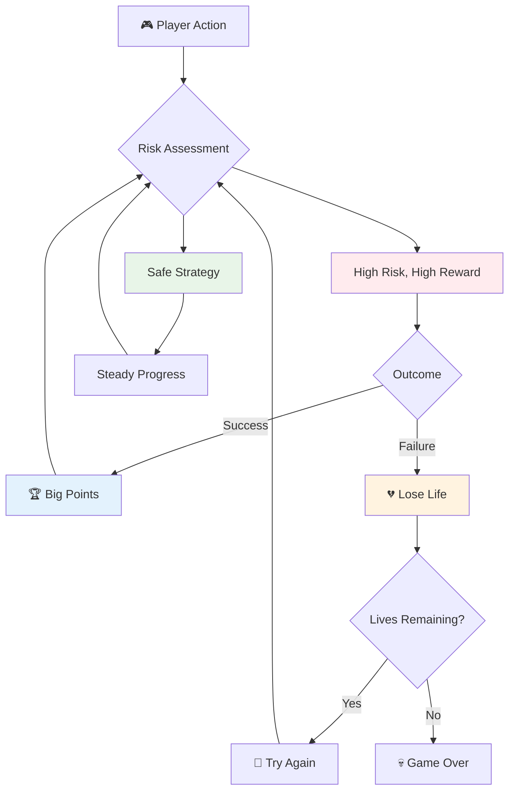
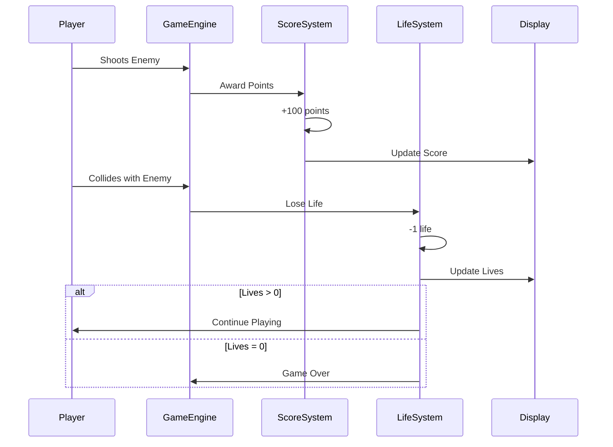
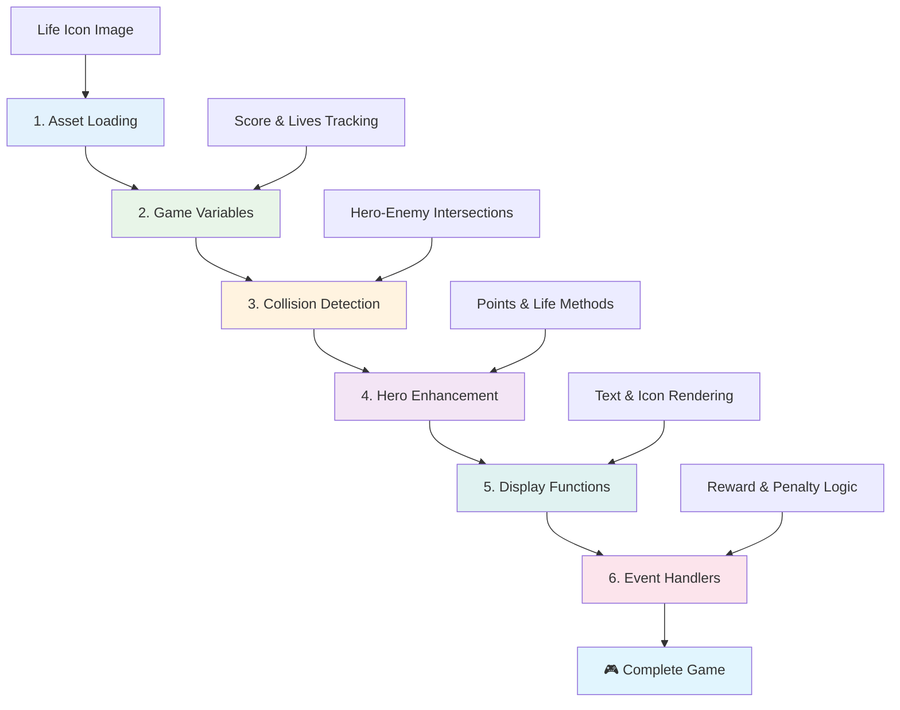
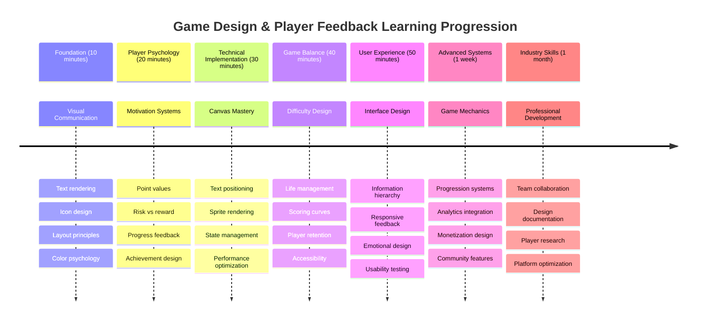

<!--
CO_OP_TRANSLATOR_METADATA:
{
  "original_hash": "2ed9145a16cf576faa2a973dff84d099",
  "translation_date": "2025-11-03T13:37:22+00:00",
  "source_file": "6-space-game/5-keeping-score/README.md",
  "language_code": "ur"
}
-->
# خلائی کھیل بنائیں حصہ 5: اسکورنگ اور زندگیاں



## لیکچر سے پہلے کا کوئز

[لیکچر سے پہلے کا کوئز](https://ff-quizzes.netlify.app/web/quiz/37)

کیا آپ اپنے خلائی کھیل کو ایک حقیقی کھیل کی طرح محسوس کروانے کے لیے تیار ہیں؟ آئیے اسکورنگ پوائنٹس اور زندگیوں کا انتظام شامل کریں - وہ بنیادی میکینکس جنہوں نے ابتدائی آرکیڈ گیمز جیسے اسپیس انویڈرز کو سادہ مظاہروں سے نشہ آور تفریح میں تبدیل کر دیا۔ یہ وہ جگہ ہے جہاں آپ کا کھیل واقعی کھیلنے کے قابل ہو جاتا ہے۔



## اسکرین پر متن دکھانا - آپ کے کھیل کی آواز

اپنا اسکور دکھانے کے لیے، ہمیں کینوس پر متن پیش کرنے کا طریقہ سیکھنا ہوگا۔ `fillText()` طریقہ آپ کا بنیادی ٹول ہے - یہ وہی تکنیک ہے جو کلاسک آرکیڈ گیمز میں اسکورز اور اسٹیٹس کی معلومات دکھانے کے لیے استعمال ہوتی ہے۔



آپ کے پاس متن کی ظاہری شکل پر مکمل کنٹرول ہے:

```javascript
ctx.font = "30px Arial";
ctx.fillStyle = "red";
ctx.textAlign = "right";
ctx.fillText("show this on the screen", 0, 0);
```

✅ [کینوس میں متن شامل کرنے](https://developer.mozilla.org/docs/Web/API/Canvas_API/Tutorial/Drawing_text) پر مزید گہرائی سے غور کریں - آپ حیران ہو سکتے ہیں کہ آپ فونٹس اور اسٹائلنگ کے ساتھ کتنے تخلیقی ہو سکتے ہیں!

## زندگیاں - صرف ایک نمبر سے زیادہ

گیم ڈیزائن میں، "زندگی" کھلاڑی کی غلطی کی گنجائش کی نمائندگی کرتی ہے۔ یہ تصور پن بال مشینوں سے شروع ہوا، جہاں آپ کو کھیلنے کے لیے متعدد گیندیں ملتی تھیں۔ ابتدائی ویڈیو گیمز جیسے ایسٹروئڈز میں، زندگیوں نے کھلاڑیوں کو خطرات مول لینے اور غلطیوں سے سیکھنے کی اجازت دی۔



بصری نمائندگی بہت اہمیت رکھتی ہے - صرف "زندگیاں: 3" کے بجائے جہاز کے آئیکنز دکھانا فوری بصری پہچان پیدا کرتا ہے، بالکل اسی طرح جیسے ابتدائی آرکیڈ کیبنٹس نے زبان کی رکاوٹوں کے پار بات چیت کرنے کے لیے آئیکنوگرافی کا استعمال کیا۔

## اپنے کھیل کے انعامی نظام کی تعمیر

اب ہم بنیادی فیڈبیک سسٹمز کو نافذ کریں گے جو کھلاڑیوں کو مشغول رکھتے ہیں:



- **اسکورنگ سسٹم**: ہر تباہ شدہ دشمن جہاز 100 پوائنٹس دیتا ہے (گول نمبر کھلاڑیوں کے لیے ذہنی طور پر حساب لگانا آسان بناتے ہیں)۔ اسکور نیچے بائیں کونے میں دکھایا جاتا ہے۔
- **زندگی کا کاؤنٹر**: آپ کا ہیرو تین زندگیوں کے ساتھ شروع ہوتا ہے - ابتدائی آرکیڈ گیمز کے ذریعہ چیلنج اور کھیلنے کی صلاحیت کو متوازن کرنے کے لیے قائم کردہ معیار۔ دشمن کے ساتھ ہر تصادم ایک زندگی کی قیمت پر ہوتا ہے۔ ہم نیچے دائیں کونے میں جہاز کے آئیکنز کے ذریعے باقی زندگیوں کو دکھائیں گے ۔

## آئیے تعمیر شروع کریں!

سب سے پہلے، اپنا ورک اسپیس سیٹ کریں۔ اپنے `your-work` سب فولڈر میں فائلوں پر جائیں۔ آپ کو یہ فائلیں نظر آنی چاہئیں:

```bash
-| assets
  -| enemyShip.png
  -| player.png
  -| laserRed.png
-| index.html
-| app.js
-| package.json
```

اپنے کھیل کو جانچنے کے لیے، `your_work` فولڈر سے ڈیولپمنٹ سرور شروع کریں:

```bash
cd your-work
npm start
```

یہ ایک مقامی سرور کو `http://localhost:5000` پر چلاتا ہے۔ اپنے براؤزر میں اس ایڈریس کو کھولیں تاکہ اپنا کھیل دیکھ سکیں۔ کنٹرولز کو تیر والے بٹنوں کے ساتھ آزمائیں اور دشمنوں کو شوٹ کرنے کی کوشش کریں تاکہ یہ تصدیق ہو سکے کہ سب کچھ ٹھیک کام کر رہا ہے۔



### کوڈ کرنے کا وقت!

1. **وہ بصری اثاثے حاصل کریں جن کی آپ کو ضرورت ہوگی**۔ `solution/assets/` فولڈر سے `life.png` اثاثہ کو اپنے `your-work` فولڈر میں کاپی کریں۔ پھر `lifeImg` کو اپنے window.onload فنکشن میں شامل کریں:

    ```javascript
    lifeImg = await loadTexture("assets/life.png");
    ```

1. `lifeImg` کو اپنے اثاثوں کی فہرست میں شامل کرنا نہ بھولیں:

    ```javascript
    let heroImg,
    ...
    lifeImg,
    ...
    eventEmitter = new EventEmitter();
    ```
  
2. **اپنے کھیل کے متغیرات سیٹ کریں**۔ اپنے کل اسکور (0 سے شروع) اور باقی زندگیوں (3 سے شروع) کو ٹریک کرنے کے لیے کچھ کوڈ شامل کریں۔ ہم انہیں اسکرین پر دکھائیں گے تاکہ کھلاڑی ہمیشہ جان سکیں کہ وہ کہاں کھڑے ہیں۔

3. **تصادم کا پتہ لگانا نافذ کریں**۔ اپنے `updateGameObjects()` فنکشن کو بڑھائیں تاکہ یہ پتہ لگ سکے کہ کب دشمن آپ کے ہیرو سے ٹکرا رہے ہیں:

    ```javascript
    enemies.forEach(enemy => {
        const heroRect = hero.rectFromGameObject();
        if (intersectRect(heroRect, enemy.rectFromGameObject())) {
          eventEmitter.emit(Messages.COLLISION_ENEMY_HERO, { enemy });
        }
      })
    ```

4. **اپنے ہیرو میں زندگی اور پوائنٹ ٹریکنگ شامل کریں**۔ 
   1. **کاؤنٹرز کو شروع کریں**۔ اپنے `Hero` کلاس میں `this.cooldown = 0` کے تحت، زندگی اور پوائنٹس سیٹ کریں:

        ```javascript
        this.life = 3;
        this.points = 0;
        ```

   1. **یہ اقدار کھلاڑی کو دکھائیں**۔ اسکرین پر ان اقدار کو دکھانے کے لیے فنکشنز بنائیں:

        ```javascript
        function drawLife() {
          // TODO, 35, 27
          const START_POS = canvas.width - 180;
          for(let i=0; i < hero.life; i++ ) {
            ctx.drawImage(
              lifeImg, 
              START_POS + (45 * (i+1) ), 
              canvas.height - 37);
          }
        }
        
        function drawPoints() {
          ctx.font = "30px Arial";
          ctx.fillStyle = "red";
          ctx.textAlign = "left";
          drawText("Points: " + hero.points, 10, canvas.height-20);
        }
        
        function drawText(message, x, y) {
          ctx.fillText(message, x, y);
        }

        ```

   1. **سب کچھ اپنے کھیل کے لوپ میں شامل کریں**۔ ان فنکشنز کو اپنے window.onload فنکشن میں `updateGameObjects()` کے فوراً بعد شامل کریں:

        ```javascript
        drawPoints();
        drawLife();
        ```

### 🔄 **تعلیمی چیک ان**
**گیم ڈیزائن کی سمجھ**: نتائج نافذ کرنے سے پہلے، یہ یقینی بنائیں کہ آپ سمجھتے ہیں:
- ✅ بصری فیڈبیک کھلاڑیوں کو کھیل کی حالت کیسے بتاتا ہے
- ✅ UI عناصر کی مستقل جگہ کا تعین کیوں استعمال میں بہتری لاتا ہے
- ✅ پوائنٹ ویلیوز اور زندگی کے انتظام کے پیچھے نفسیات
- ✅ کینوس ٹیکسٹ رینڈرنگ HTML ٹیکسٹ سے کیسے مختلف ہے

**فوری خود آزمائش**: آرکیڈ گیمز عام طور پر پوائنٹ ویلیوز کے لیے گول نمبر کیوں استعمال کرتے ہیں؟
*جواب: گول نمبر کھلاڑیوں کے لیے ذہنی طور پر حساب لگانا آسان بناتے ہیں اور نفسیاتی طور پر اطمینان بخش انعامات پیدا کرتے ہیں*

**صارف کے تجربے کے اصول**: آپ اب لاگو کر رہے ہیں:
- **بصری درجہ بندی**: اہم معلومات کو نمایاں طور پر رکھا گیا
- **فوری فیڈبیک**: کھلاڑی کے اعمال کے لیے حقیقی وقت کی اپ ڈیٹس
- **علمی بوجھ**: سادہ، واضح معلومات کی پیشکش
- **جذباتی ڈیزائن**: آئیکنز اور رنگ جو کھلاڑی کے ساتھ تعلق پیدا کرتے ہیں

1. **کھیل کے نتائج اور انعامات نافذ کریں**۔ اب ہم فیڈبیک سسٹمز شامل کریں گے جو کھلاڑی کے اعمال کو معنی دیتے ہیں:

   1. **تصادم زندگیوں کی قیمت پر ہوتا ہے**۔ ہر بار جب آپ کا ہیرو دشمن سے ٹکرا جائے، آپ کو ایک زندگی کھونا چاہیے۔
   
      یہ طریقہ اپنے `Hero` کلاس میں شامل کریں:

        ```javascript
        decrementLife() {
          this.life--;
          if (this.life === 0) {
            this.dead = true;
          }
        }
        ```

   2. **دشمنوں کو شوٹ کرنے سے پوائنٹس ملتے ہیں**۔ ہر کامیاب ہٹ 100 پوائنٹس دیتی ہے، جو درست شوٹنگ کے لیے فوری مثبت فیڈبیک فراہم کرتی ہے۔

      اپنے Hero کلاس میں یہ اضافہ کا طریقہ شامل کریں:
    
        ```javascript
          incrementPoints() {
            this.points += 100;
          }
        ```

        اب ان فنکشنز کو اپنے تصادم کے واقعات سے جوڑیں:

        ```javascript
        eventEmitter.on(Messages.COLLISION_ENEMY_LASER, (_, { first, second }) => {
           first.dead = true;
           second.dead = true;
           hero.incrementPoints();
        })

        eventEmitter.on(Messages.COLLISION_ENEMY_HERO, (_, { enemy }) => {
           enemy.dead = true;
           hero.decrementLife();
        });
        ```

✅ جاوا اسکرپٹ اور کینوس کے ساتھ بنائے گئے دیگر گیمز کے بارے میں جاننے کے لیے کچھ تحقیق کریں - آپ حیران ہوں گے کہ کیا ممکن ہے!

ان خصوصیات کو نافذ کرنے کے بعد، اپنے کھیل کو جانچیں تاکہ مکمل فیڈبیک سسٹم کو عمل میں دیکھ سکیں۔ آپ کو نیچے دائیں کونے میں زندگی کے آئیکنز، نیچے بائیں کونے میں اپنا اسکور، اور دیکھنا چاہیے کہ تصادم زندگیوں کو کم کرتے ہیں جبکہ کامیاب شاٹس آپ کے اسکور کو بڑھاتے ہیں۔

آپ کے کھیل میں اب وہ ضروری میکینکس موجود ہیں جنہوں نے ابتدائی آرکیڈ گیمز کو اتنا دلکش بنایا - واضح اہداف، فوری فیڈبیک، اور کھلاڑی کے اعمال کے لیے معنی خیز نتائج۔

### 🔄 **تعلیمی چیک ان**
**مکمل گیم ڈیزائن سسٹم**: کھلاڑی کے فیڈبیک سسٹمز کی مہارت کی تصدیق کریں:
- ✅ اسکورنگ میکینکس کھلاڑی کی حوصلہ افزائی اور مشغولیت کیسے پیدا کرتے ہیں؟
- ✅ صارف کے انٹرفیس ڈیزائن کے لیے بصری مستقل مزاجی کیوں اہم ہے؟
- ✅ زندگی کا نظام چیلنج کو کھلاڑی کی برقرار رکھنے کے ساتھ کیسے متوازن کرتا ہے؟
- ✅ فوری فیڈبیک اطمینان بخش گیم پلے بنانے میں کیا کردار ادا کرتا ہے؟

**سسٹم انٹیگریشن**: آپ کا فیڈبیک سسٹم ظاہر کرتا ہے:
- **صارف کے تجربے کا ڈیزائن**: واضح بصری مواصلات اور معلومات کی درجہ بندی
- **ایونٹ ڈرائیون آرکیٹیکچر**: کھلاڑی کے اعمال کے لیے جوابدہ اپ ڈیٹس
- **اسٹیٹ مینجمنٹ**: متحرک گیم ڈیٹا کو ٹریک کرنا اور دکھانا
- **کینوس مہارت**: ٹیکسٹ رینڈرنگ اور اسپریٹ پوزیشننگ
- **گیم نفسیات**: کھلاڑی کی حوصلہ افزائی اور مشغولیت کو سمجھنا

**پیشہ ورانہ پیٹرنز**: آپ نے نافذ کیا:
- **MVC آرکیٹیکچر**: گیم لاجک، ڈیٹا، اور پریزنٹیشن کی علیحدگی
- **آبزرور پیٹرن**: گیم اسٹیٹ تبدیلیوں کے لیے ایونٹ ڈرائیون اپ ڈیٹس
- **کمپوننٹ ڈیزائن**: رینڈرنگ اور لاجک کے لیے دوبارہ استعمال کے قابل فنکشنز
- **کارکردگی کی اصلاح**: گیم لوپس میں موثر رینڈرنگ

### ⚡ **اگلے 5 منٹ میں آپ کیا کر سکتے ہیں**
- [ ] اسکور ڈسپلے کے لیے مختلف فونٹ سائز اور رنگوں کے ساتھ تجربہ کریں
- [ ] پوائنٹ ویلیوز کو تبدیل کرنے کی کوشش کریں اور دیکھیں کہ یہ گیم پلے کے احساس کو کیسے متاثر کرتا ہے
- [ ] پوائنٹس اور زندگیوں میں تبدیلی کو ٹریک کرنے کے لیے console.log بیانات شامل کریں
- [ ] زندگیوں کے ختم ہونے یا زیادہ اسکور حاصل کرنے جیسے ایج کیسز کی جانچ کریں

### 🎯 **اس گھنٹے میں آپ کیا حاصل کر سکتے ہیں**
- [ ] پوسٹ-لیکچر کوئز مکمل کریں اور گیم ڈیزائن کی نفسیات کو سمجھیں
- [ ] اسکورنگ اور زندگیوں کے نقصان کے لیے صوتی اثرات شامل کریں
- [ ] لوکل اسٹوریج کا استعمال کرتے ہوئے ایک اعلی اسکور سسٹم نافذ کریں
- [ ] مختلف دشمن اقسام کے لیے مختلف پوائنٹ ویلیوز بنائیں
- [ ] زندگی کے نقصان پر اسکرین شیک جیسے بصری اثرات شامل کریں

### 📅 **آپ کا ہفتہ بھر کا گیم ڈیزائن سفر**
- [ ] مکمل خلائی کھیل کے ساتھ پالش شدہ فیڈبیک سسٹمز مکمل کریں
- [ ] ایڈوانس اسکورنگ میکینکس جیسے کومبو ملٹی پلائرز نافذ کریں
- [ ] کامیابیاں اور انلاک ایبل مواد شامل کریں
- [ ] مشکل کی ترقی اور توازن کے نظام بنائیں
- [ ] مینو اور گیم اوور اسکرینز کے لیے صارف کے انٹرفیس ڈیزائن کریں
- [ ] دیگر گیمز کا مطالعہ کریں تاکہ مشغولیت کے میکانزم کو سمجھ سکیں

### 🌟 **آپ کا مہینہ بھر کا گیم ڈیولپمنٹ ماسٹری**
- [ ] مکمل کھیل بنائیں جن میں ترقی کے پیچیدہ نظام ہوں
- [ ] گیم تجزیات اور کھلاڑی کے رویے کی پیمائش سیکھیں
- [ ] اوپن سورس گیم ڈیولپمنٹ پروجیکٹس میں تعاون کریں
- [ ] ایڈوانس گیم ڈیزائن پیٹرنز اور مونیٹائزیشن میں مہارت حاصل کریں
- [ ] گیم ڈیزائن اور صارف کے تجربے کے بارے میں تعلیمی مواد بنائیں
- [ ] گیم ڈیزائن اور ڈیولپمنٹ کی مہارتوں کو ظاہر کرنے والا پورٹ فولیو بنائیں

## 🎯 آپ کا گیم ڈیزائن ماسٹری ٹائم لائن



### 🛠️ آپ کے گیم ڈیزائن ٹول کٹ کا خلاصہ

اس سبق کو مکمل کرنے کے بعد، آپ نے مہارت حاصل کر لی ہے:
- **کھلاڑی کی نفسیات**: حوصلہ افزائی، خطرہ/انعام، اور مشغولیت کے لوپس کو سمجھنا
- **بصری مواصلات**: متن، آئیکنز، اور لے آؤٹ کا استعمال کرتے ہوئے مؤثر UI ڈیزائن
- **فیڈبیک سسٹمز**: کھلاڑی کے اعمال اور گیم ایونٹس کے لیے حقیقی وقت کا ردعمل
- **اسٹیٹ مینجمنٹ**: متحرک گیم ڈیٹا کو مؤثر طریقے سے ٹریک کرنا اور دکھانا
- **کینوس ٹیکسٹ رینڈرنگ**: اسٹائلنگ اور پوزیشننگ کے ساتھ پیشہ ورانہ متن کی نمائش
- **ایونٹ انٹیگریشن**: صارف کے اعمال کو معنی خیز گیم کے نتائج سے جوڑنا
- **گیم بیلنس**: مشکل کے منحنی خطوط اور کھلاڑی کے ترقیاتی نظام کو ڈیزائن کرنا

**حقیقی دنیا کی ایپلیکیشنز**: آپ کے گیم ڈیزائن کی مہارتیں براہ راست لاگو ہوتی ہیں:
- **صارف کے انٹرفیس ڈیزائن**: مشغول اور بدیہی انٹرفیس بنانا
- **پروڈکٹ ڈیولپمنٹ**: صارف کی حوصلہ افزائی اور فیڈبیک لوپس کو سمجھنا
- **تعلیمی ٹیکنالوجی**: گیمیفیکیشن اور سیکھنے کے مشغولیت کے نظام
- **ڈیٹا ویژولائزیشن**: پیچیدہ معلومات کو قابل رسائی اور مشغول بنانا
- **موبائل ایپ ڈیولپمنٹ**: برقرار رکھنے کے میکانزم اور صارف کے تجربے کا ڈیزائن
- **مارکیٹنگ ٹیکنالوجی**: صارف کے رویے کو سمجھنا اور کنورژن کی اصلاح

**حاصل کردہ پیشہ ورانہ مہارتیں**: آپ اب کر سکتے ہیں:
- **ڈیزائن** صارف کے تجربات جو صارفین کو متحرک اور مشغول کرتے ہیں
- **نافذ کریں** فیڈبیک سسٹمز جو صارف کے رویے کو مؤثر طریقے سے رہنمائی کرتے ہیں
- **توازن** چیلنج اور انٹرایکٹو سسٹمز میں رسائی
- **بنانا** بصری مواصلات جو مختلف صارف گروپس کے ساتھ کام کرتی ہیں
- **تجزیہ کریں** صارف کے رویے اور ڈیزائن میں بہتری لائیں

**گیم ڈیولپمنٹ کے تصورات میں مہارت حاصل کی**:
- **کھلاڑی کی حوصلہ افزائی**: مشغولیت اور برقرار رکھنے کو چلانے والے عوامل کو سمجھنا
- **بصری ڈیزائن**: واضح، دلکش، اور فعال انٹرفیس بنانا
- **سسٹم انٹیگریشن**: ایک مربوط تجربے کے لیے متعدد گیم سسٹمز کو جوڑنا
- **کارکردگی کی اصلاح**: مؤثر رینڈرنگ اور اسٹیٹ مینجمنٹ
- **رسائی**: مختلف مہارت کی سطحوں اور کھلاڑی کی ضروریات کے لیے ڈیزائن کرنا

**اگلا مرحلہ**: آپ ایڈوانس گیم ڈیزائن پیٹرنز کو دریافت کرنے، تجزیاتی نظام نافذ کرنے، یا گیم مونیٹائزیشن اور کھلاڑی کی برقرار رکھنے کی حکمت عملیوں کا مطالعہ کرنے کے لیے تیار ہیں!

🌟 **کامیابی حاصل کی**: آپ نے پیشہ ورانہ گیم ڈیزائن اصولوں کے ساتھ مکمل کھلاڑی فیڈبیک سسٹم بنایا ہے!

---

## GitHub Copilot ایجنٹ چیلنج 🚀

ایجنٹ موڈ کا استعمال کرتے ہوئے درج ذیل چیلنج مکمل کریں:

**تفصیل:** خلائی کھیل کے اسکورنگ سسٹم کو بہتر بنائیں اور ایک اعلی اسکور فیچر کو مستقل اسٹوریج اور بونس اسکورنگ میکانکس کے ساتھ نافذ کریں۔

**پرومپٹ:** ایک اعلی اسکور سسٹم بنائیں جو کھلاڑی کے بہترین اسکور کو localStorage میں محفوظ کرے۔ مسلسل دشمنوں کو مارنے کے لیے بونس پوائنٹس شامل کریں (کومبو سسٹم) اور مختلف دشمن اقسام کے لیے مختلف پوائنٹ ویلیوز نافذ کریں۔ جب کھلاڑی نیا اعلی اسکور حاصل کرے تو بصری اشارہ شامل کریں اور کھیل کی اسکرین پر موجودہ اعلی اسکور دکھائیں۔

## 🚀 چیلنج

اب آپ کے پاس اسکورنگ اور زندگیوں کے ساتھ ایک فعال کھیل ہے۔ غور کریں کہ کون سی اضافی خصوصیات کھلاڑی کے تجربے کو بہتر بنا سکتی ہیں۔

## لیکچر کے بعد کا کوئز

[لیکچر کے بعد کا کوئز](https://ff-quizzes.netlify.app/web/quiz/38)

## جائزہ اور خود مطالعہ

مزید دریافت

---

**ڈسکلیمر**:  
یہ دستاویز AI ترجمہ سروس [Co-op Translator](https://github.com/Azure/co-op-translator) کا استعمال کرتے ہوئے ترجمہ کی گئی ہے۔ ہم درستگی کے لیے کوشش کرتے ہیں، لیکن براہ کرم آگاہ رہیں کہ خودکار ترجمے میں غلطیاں یا غیر درستیاں ہو سکتی ہیں۔ اصل دستاویز کو اس کی اصل زبان میں مستند ذریعہ سمجھا جانا چاہیے۔ اہم معلومات کے لیے، پیشہ ور انسانی ترجمہ کی سفارش کی جاتی ہے۔ ہم اس ترجمے کے استعمال سے پیدا ہونے والی کسی بھی غلط فہمی یا غلط تشریح کے ذمہ دار نہیں ہیں۔