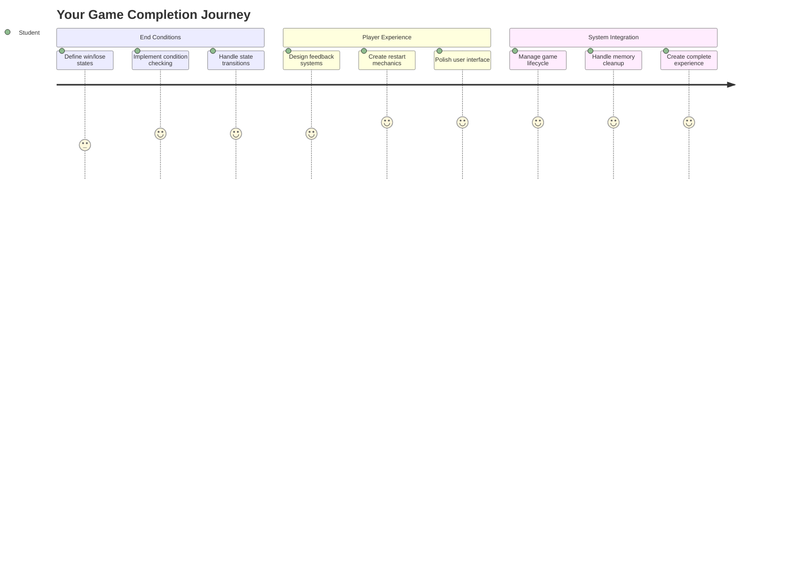
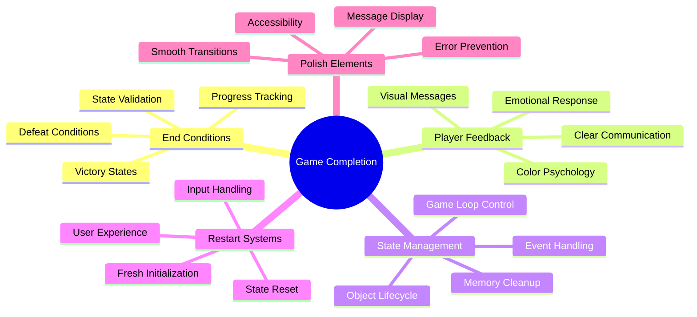
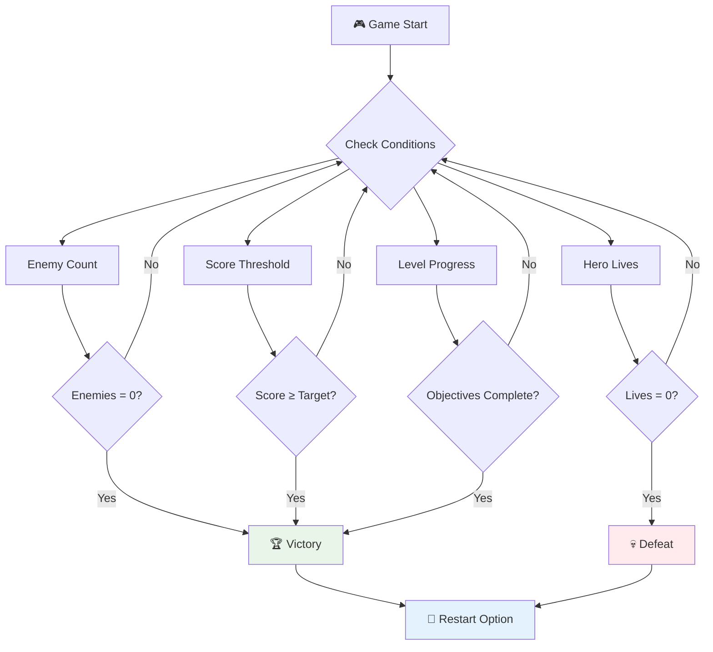
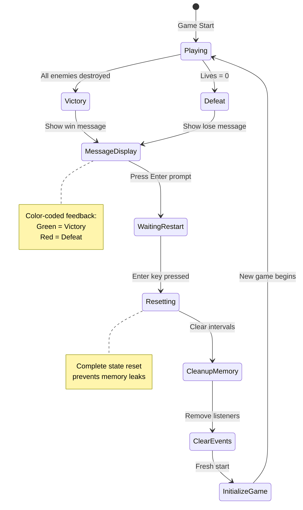
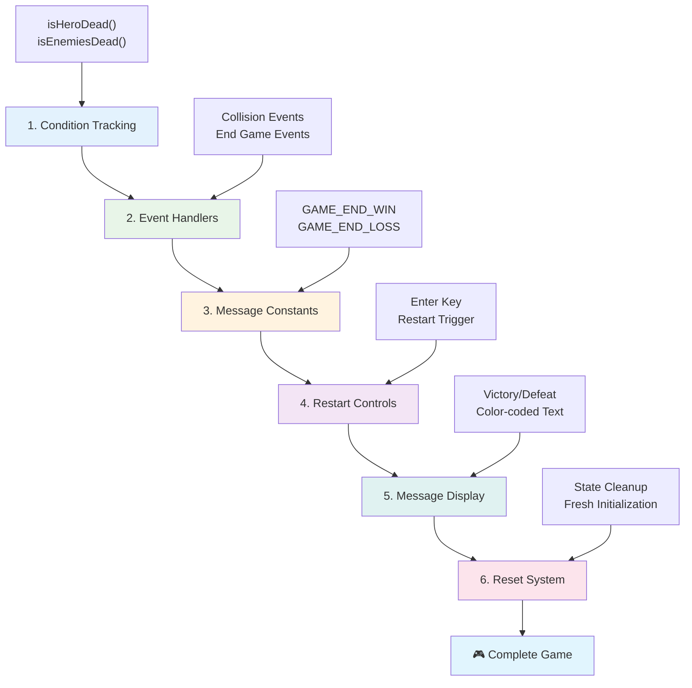
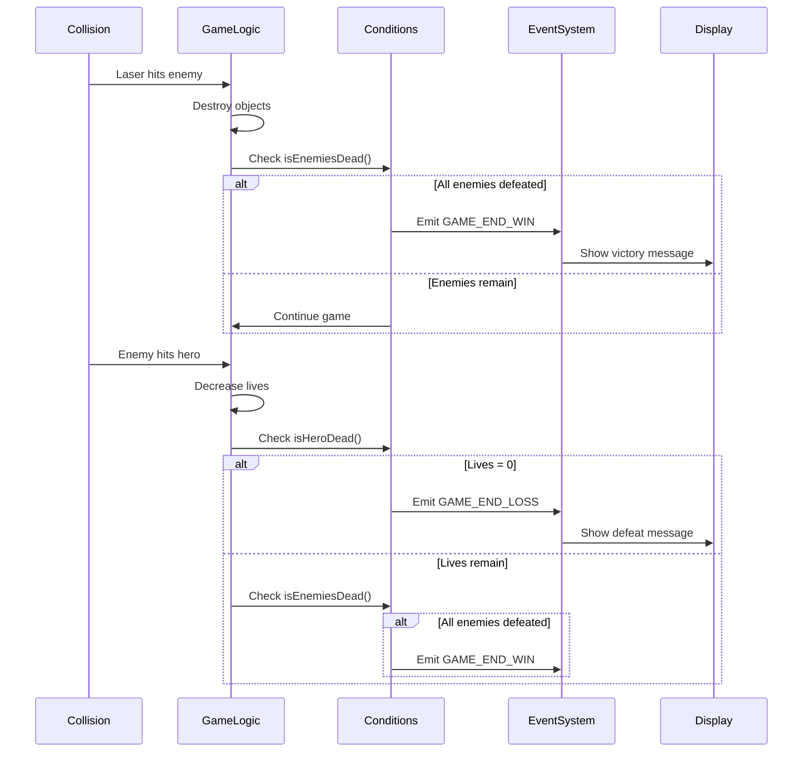
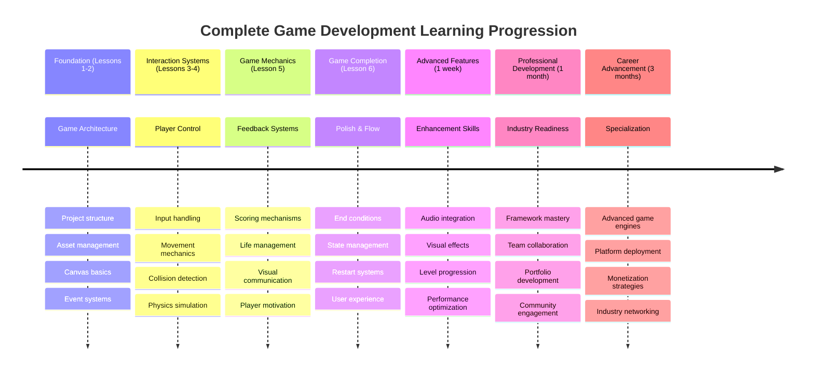

# اسپیس گیم بنائیں حصہ 6: اختتام اور دوبارہ شروع کریں



ہر زبردست گیم کو واضح اختتامی شرائط اور ایک ہموار دوبارہ شروع کرنے کا طریقہ کار کی ضرورت ہوتی ہے۔ آپ نے ایک متاثر کن اسپیس گیم بنایا ہے جس میں حرکت، لڑائی، اور اسکورنگ شامل ہے - اب وقت ہے کہ آخری ٹکڑوں کو شامل کریں جو اسے مکمل محسوس کرائیں۔

آپ کا گیم فی الحال غیر معینہ مدت تک چلتا ہے، جیسے ناسا کے 1977 میں لانچ کیے گئے ووئجر پروبز - جو دہائیوں بعد بھی خلا میں سفر کر رہے ہیں۔ جبکہ یہ خلائی تحقیق کے لیے ٹھیک ہے، گیمز کو واضح اختتامی پوائنٹس کی ضرورت ہوتی ہے تاکہ تسلی بخش تجربات پیدا کیے جا سکیں۔

آج، ہم مناسب جیت/ہار کی شرائط اور ایک دوبارہ شروع کرنے کا نظام نافذ کریں گے۔ اس سبق کے اختتام تک، آپ کے پاس ایک پالش گیم ہوگا جسے کھلاڑی مکمل اور دوبارہ کھیل سکتے ہیں، بالکل کلاسک آرکیڈ گیمز کی طرح جنہوں نے اس میڈیم کو متعین کیا۔



## پری لیکچر کوئز

[پری لیکچر کوئز](https://ff-quizzes.netlify.app/web/quiz/39)

## گیم کے اختتامی شرائط کو سمجھنا

آپ کا گیم کب ختم ہونا چاہیے؟ یہ بنیادی سوال گیم ڈیزائن کو ابتدائی آرکیڈ دور سے تشکیل دیتا رہا ہے۔ پیک مین اس وقت ختم ہوتا ہے جب آپ بھوتوں کے ہاتھوں پکڑے جاتے ہیں یا تمام نقطے صاف کر لیتے ہیں، جبکہ اسپیس انویڈرز اس وقت ختم ہوتا ہے جب خلائی مخلوق نیچے پہنچ جاتی ہے یا آپ انہیں سب ختم کر دیتے ہیں۔

بطور گیم تخلیق کار، آپ جیت اور شکست کی شرائط کو متعین کرتے ہیں۔ ہمارے اسپیس گیم کے لیے، یہاں آزمودہ طریقے ہیں جو دلچسپ گیم پلے تخلیق کرتے ہیں:



- **`N` دشمن جہاز تباہ ہو چکے ہیں**: یہ کافی عام ہے اگر آپ گیم کو مختلف لیولز میں تقسیم کرتے ہیں کہ آپ کو ایک لیول مکمل کرنے کے لیے `N` دشمن جہاز تباہ کرنے ہوں گے۔
- **آپ کا جہاز تباہ ہو چکا ہے**: یقینی طور پر ایسے گیمز ہیں جہاں آپ کا جہاز تباہ ہونے پر آپ گیم ہار جاتے ہیں۔ ایک اور عام طریقہ یہ ہے کہ آپ کے پاس زندگیوں کا تصور ہو۔ ہر بار جب آپ کا جہاز تباہ ہوتا ہے تو یہ ایک زندگی کم کر دیتا ہے۔ جب تمام زندگیاں ختم ہو جاتی ہیں تو آپ گیم ہار جاتے ہیں۔
- **آپ نے `N` پوائنٹس جمع کیے ہیں**: ایک اور عام اختتامی شرط یہ ہے کہ آپ پوائنٹس جمع کریں۔ آپ پوائنٹس کیسے حاصل کرتے ہیں یہ آپ پر منحصر ہے لیکن یہ کافی عام ہے کہ مختلف سرگرمیوں جیسے دشمن جہاز کو تباہ کرنے یا شاید ان اشیاء کو جمع کرنے پر پوائنٹس دیے جائیں جو تباہ ہونے پر گرتی ہیں۔
- **ایک لیول مکمل کریں**: اس میں کئی شرائط شامل ہو سکتی ہیں جیسے `X` دشمن جہاز تباہ کیے گئے، `Y` پوائنٹس جمع کیے گئے یا شاید ایک مخصوص آئٹم جمع کیا گیا۔

## گیم دوبارہ شروع کرنے کی فعالیت کو نافذ کرنا

اچھے گیمز ہموار دوبارہ شروع کرنے کے طریقہ کار کے ذریعے دوبارہ کھیلنے کی حوصلہ افزائی کرتے ہیں۔ جب کھلاڑی ایک گیم مکمل کرتے ہیں (یا شکست کا سامنا کرتے ہیں)، وہ اکثر فوراً دوبارہ کوشش کرنا چاہتے ہیں - چاہے اپنے اسکور کو شکست دینے کے لیے یا اپنی کارکردگی کو بہتر بنانے کے لیے۔



ٹیٹرس اس کی بہترین مثال ہے: جب آپ کے بلاکس اوپر تک پہنچ جاتے ہیں، تو آپ فوراً ایک نیا گیم شروع کر سکتے ہیں بغیر پیچیدہ مینو میں جائے۔ ہم ایک ایسا ہی دوبارہ شروع کرنے کا نظام بنائیں گے جو گیم کی حالت کو صاف طور پر ری سیٹ کرے اور کھلاڑیوں کو جلدی سے ایکشن میں واپس لے جائے۔

✅ **غور و فکر**: ان گیمز کے بارے میں سوچیں جو آپ نے کھیلے ہیں۔ وہ کن شرائط پر ختم ہوتے ہیں، اور آپ کو دوبارہ شروع کرنے کے لیے کیسے اکسایا جاتا ہے؟ کیا چیز ایک ہموار دوبارہ شروع کرنے کے تجربے کو پریشان کن کے مقابلے میں بہتر بناتی ہے؟

## آپ کیا بنائیں گے

آپ وہ آخری خصوصیات نافذ کریں گے جو آپ کے پروجیکٹ کو ایک مکمل گیم کے تجربے میں تبدیل کرتی ہیں۔ یہ عناصر پالش گیمز کو بنیادی پروٹوٹائپس سے ممتاز کرتے ہیں۔

**آج ہم کیا شامل کر رہے ہیں:**

1. **جیت کی شرط**: تمام دشمنوں کو ختم کریں اور ایک مناسب جشن منائیں (آپ نے یہ حاصل کیا ہے!)
2. **شکست کی شرط**: زندگی ختم ہو جائے اور شکست کے اسکرین کا سامنا کریں
3. **دوبارہ شروع کرنے کا طریقہ کار**: انٹر دبائیں اور فوراً دوبارہ شروع کریں - کیونکہ ایک گیم کبھی کافی نہیں ہوتا
4. **حالت کا انتظام**: ہر بار صاف ستھرا آغاز - پچھلے گیم سے کوئی بچا ہوا دشمن یا عجیب و غریب خرابی نہیں

## شروع کریں

آئیے آپ کے ڈیولپمنٹ ماحول کو تیار کریں۔ آپ کے پاس پچھلے اسباق سے اپنے اسپیس گیم کی تمام فائلیں تیار ہونی چاہئیں۔

**آپ کا پروجیکٹ کچھ اس طرح نظر آنا چاہیے:**

```bash
-| assets
  -| enemyShip.png
  -| player.png
  -| laserRed.png
  -| life.png
-| index.html
-| app.js
-| package.json
```

**اپنا ڈیولپمنٹ سرور شروع کریں:**

```bash
cd your-work
npm start
```

**یہ کمانڈ:**
- ایک مقامی سرور `http://localhost:5000` پر چلاتا ہے
- آپ کی فائلوں کو صحیح طریقے سے پیش کرتا ہے
- جب آپ تبدیلیاں کرتے ہیں تو خود بخود ریفریش ہوتا ہے

اپنے براؤزر میں `http://localhost:5000` کھولیں اور تصدیق کریں کہ آپ کا گیم چل رہا ہے۔ آپ کو حرکت کرنے، شوٹ کرنے، اور دشمنوں کے ساتھ تعامل کرنے کے قابل ہونا چاہیے۔ ایک بار تصدیق ہو جائے تو ہم نفاذ کے ساتھ آگے بڑھ سکتے ہیں۔

> 💡 **پرو ٹپ**: ویژول اسٹوڈیو کوڈ میں وارننگز سے بچنے کے لیے، `gameLoopId` کو اپنی فائل کے اوپر `let gameLoopId;` کے طور پر اعلان کریں بجائے اس کے کہ اسے `window.onload` فنکشن کے اندر اعلان کریں۔ یہ جدید جاوا اسکرپٹ ویریبل اعلان کے بہترین طریقوں کی پیروی کرتا ہے۔



## نفاذ کے مراحل

### مرحلہ 1: اختتامی شرط کو ٹریک کرنے والے فنکشنز بنائیں

ہمیں ایسے فنکشنز کی ضرورت ہے جو گیم کے ختم ہونے کا وقت مانیٹر کریں۔ جیسے انٹرنیشنل اسپیس اسٹیشن کے سینسرز جو مسلسل اہم نظاموں کی نگرانی کرتے ہیں، یہ فنکشنز گیم کی حالت کو مسلسل چیک کریں گے۔

```javascript
function isHeroDead() {
  return hero.life <= 0;
}

function isEnemiesDead() {
  const enemies = gameObjects.filter((go) => go.type === "Enemy" && !go.dead);
  return enemies.length === 0;
}
```

**یہاں پس منظر میں کیا ہو رہا ہے:**
- **چیک کرتا ہے** کہ آیا ہمارا ہیرو زندگیوں سے باہر ہے (افسوس!)
- **گنتی کرتا ہے** کہ کتنے دشمن ابھی بھی زندہ ہیں
- **سچ واپس کرتا ہے** جب میدان جنگ دشمنوں سے خالی ہو
- **سادہ سچ/جھوٹ منطق استعمال کرتا ہے** تاکہ چیزیں سیدھی رہیں
- **تمام گیم آبجیکٹس کو فلٹر کرتا ہے** تاکہ زندہ بچ جانے والوں کو تلاش کیا جا سکے

### مرحلہ 2: اختتامی شرائط کے لیے ایونٹ ہینڈلرز کو اپ ڈیٹ کریں

اب ہم ان شرطوں کو گیم کے ایونٹ سسٹم سے جوڑیں گے۔ جب بھی کوئی تصادم ہوتا ہے، گیم اس بات کا جائزہ لے گا کہ آیا یہ اختتامی شرط کو متحرک کرتا ہے۔ یہ اہم گیم ایونٹس کے لیے فوری فیڈبیک تخلیق کرتا ہے۔



```javascript
eventEmitter.on(Messages.COLLISION_ENEMY_LASER, (_, { first, second }) => {
    first.dead = true;
    second.dead = true;
    hero.incrementPoints();

    if (isEnemiesDead()) {
      eventEmitter.emit(Messages.GAME_END_WIN);
    }
});

eventEmitter.on(Messages.COLLISION_ENEMY_HERO, (_, { enemy }) => {
    enemy.dead = true;
    hero.decrementLife();
    if (isHeroDead())  {
      eventEmitter.emit(Messages.GAME_END_LOSS);
      return; // loss before victory
    }
    if (isEnemiesDead()) {
      eventEmitter.emit(Messages.GAME_END_WIN);
    }
});

eventEmitter.on(Messages.GAME_END_WIN, () => {
    endGame(true);
});
  
eventEmitter.on(Messages.GAME_END_LOSS, () => {
  endGame(false);
});
```

**یہاں کیا ہو رہا ہے:**
- **لیزر دشمن کو لگتا ہے**: دونوں غائب ہو جاتے ہیں، آپ کو پوائنٹس ملتے ہیں، اور ہم چیک کرتے ہیں کہ آیا آپ جیت گئے ہیں
- **دشمن آپ کو لگتا ہے**: آپ ایک زندگی کھو دیتے ہیں، اور ہم چیک کرتے ہیں کہ آیا آپ ابھی بھی زندہ ہیں
- **سمارٹ ترتیب**: ہم پہلے شکست کے لیے چیک کرتے ہیں (کوئی بھی جیتنا اور ہارنا ایک ہی وقت میں نہیں چاہتا!)
- **فوری ردعمل**: جیسے ہی کچھ اہم ہوتا ہے، گیم اس کے بارے میں جانتا ہے

### مرحلہ 3: نئے میسج کانسٹنٹس شامل کریں

آپ کو اپنے `Messages` کانسٹنٹ آبجیکٹ میں نئے میسج کی اقسام شامل کرنے کی ضرورت ہوگی۔ یہ کانسٹنٹس مستقل مزاجی کو برقرار رکھنے اور آپ کے ایونٹ سسٹم میں ٹائپوز کو روکنے میں مدد کرتے ہیں۔

```javascript
GAME_END_LOSS: "GAME_END_LOSS",
GAME_END_WIN: "GAME_END_WIN",
```

**اوپر، ہم نے:**
- **میسج کانسٹنٹس شامل کیے** گیم کے اختتامی ایونٹس کے لیے تاکہ مستقل مزاجی برقرار رہے
- **تفصیلی نام استعمال کیے** جو ایونٹ کے مقصد کو واضح طور پر ظاہر کرتے ہیں
- **موجودہ نام دینے کے کنونشن کی پیروی کی** میسج کی اقسام کے لیے

### مرحلہ 4: دوبارہ شروع کرنے کے کنٹرولز نافذ کریں

اب آپ کی بورڈ کنٹرولز شامل کریں گے جو کھلاڑیوں کو گیم دوبارہ شروع کرنے کی اجازت دیتے ہیں۔ انٹر کی کلید ایک قدرتی انتخاب ہے کیونکہ یہ عام طور پر ایکشنز کی تصدیق کرنے اور نئے گیمز شروع کرنے سے وابستہ ہے۔

**اپنے موجودہ کی ڈاؤن ایونٹ لسٹنر میں انٹر کی کلید کا پتہ لگانا شامل کریں:**

```javascript
else if(evt.key === "Enter") {
   eventEmitter.emit(Messages.KEY_EVENT_ENTER);
}
```

**نیا میسج کانسٹنٹ شامل کریں:**

```javascript
KEY_EVENT_ENTER: "KEY_EVENT_ENTER",
```

**آپ کو کیا جاننے کی ضرورت ہے:**
- **آپ کے موجودہ کی بورڈ ایونٹ ہینڈلنگ سسٹم کو بڑھاتا ہے**
- **انٹر کی کلید کو دوبارہ شروع کرنے کے ٹریگر کے طور پر استعمال کرتا ہے** بدیہی صارف کے تجربے کے لیے
- **ایک کسٹم ایونٹ جاری کرتا ہے** جسے آپ کے گیم کے دیگر حصے سن سکتے ہیں
- **آپ کے دیگر کی بورڈ کنٹرولز کے جیسے ہی پیٹرن کو برقرار رکھتا ہے**

### مرحلہ 5: میسج ڈسپلے سسٹم بنائیں

آپ کے گیم کو کھلاڑیوں کے ساتھ نتائج واضح طور پر بات چیت کرنے کی ضرورت ہے۔ ہم ایک میسج سسٹم بنائیں گے جو جیت اور شکست کی حالتوں کو رنگین متن کے ذریعے ظاہر کرے گا، ابتدائی کمپیوٹر سسٹمز کے ٹرمینل انٹرفیس کی طرح جہاں سبز کامیابی کی نشاندہی کرتا تھا اور سرخ غلطیوں کا اشارہ دیتا تھا۔

**`displayMessage()` فنکشن بنائیں:**

```javascript
function displayMessage(message, color = "red") {
  ctx.font = "30px Arial";
  ctx.fillStyle = color;
  ctx.textAlign = "center";
  ctx.fillText(message, canvas.width / 2, canvas.height / 2);
}
```

**مرحلہ وار، یہاں کیا ہو رہا ہے:**
- **فونٹ سائز اور فیملی سیٹ کرتا ہے** واضح، پڑھنے کے قابل متن کے لیے
- **ایک رنگ پیرامیٹر لاگو کرتا ہے** "سرخ" کو انتباہات کے لیے ڈیفالٹ کے طور پر
- **متن کو افقی اور عمودی طور پر کینوس پر مرکز کرتا ہے**
- **جدید جاوا اسکرپٹ ڈیفالٹ پیرامیٹرز استعمال کرتا ہے** لچکدار رنگ کے اختیارات کے لیے
- **کینوس 2D کانٹیکس کا فائدہ اٹھاتا ہے** براہ راست متن رینڈرنگ کے لیے

**`endGame()` فنکشن بنائیں:**

```javascript
function endGame(win) {
  clearInterval(gameLoopId);

  // Set a delay to ensure any pending renders complete
  setTimeout(() => {
    ctx.clearRect(0, 0, canvas.width, canvas.height);
    ctx.fillStyle = "black";
    ctx.fillRect(0, 0, canvas.width, canvas.height);
    if (win) {
      displayMessage(
        "Victory!!! Pew Pew... - Press [Enter] to start a new game Captain Pew Pew",
        "green"
      );
    } else {
      displayMessage(
        "You died !!! Press [Enter] to start a new game Captain Pew Pew"
      );
    }
  }, 200)  
}
```

**یہ فنکشن کیا کرتا ہے:**
- **سب کچھ جگہ پر منجمد کر دیتا ہے** - مزید حرکت کرنے والے جہاز یا لیزرز نہیں
- **ایک چھوٹا وقفہ لیتا ہے (200ms)** آخری فریم کو مکمل طور پر ڈرائنگ کرنے دیتا ہے
- **اسکرین کو صاف کرتا ہے اور ڈرامائی اثر کے لیے اسے سیاہ رنگ دیتا ہے**
- **جیتنے والوں اور ہارنے والوں کے لیے مختلف میسجز دکھاتا ہے**
- **خبریں رنگین کوڈ کرتا ہے** - اچھے کے لیے سبز، اور... ٹھیک ہے، اچھا نہیں کے لیے سرخ
- **کھلاڑیوں کو بتاتا ہے** کہ دوبارہ کیسے شروع کریں

### 🔄 **تعلیمی جائزہ**
**گیم اسٹیٹ مینجمنٹ**: ری سیٹ کی فعالیت کو نافذ کرنے سے پہلے، یقینی بنائیں کہ آپ سمجھتے ہیں:
- ✅ اختتامی شرائط واضح گیم پلے کے مقاصد کیسے تخلیق کرتی ہیں؟
- ✅ بصری فیڈبیک کھلاڑی کی سمجھ کو کیوں ضروری ہے؟
- ✅ میموری لیکس کو روکنے میں مناسب صفائی کی اہمیت؟
- ✅ ایونٹ ڈرائیون آرکیٹیکچر صاف حالت کی منتقلی کو کیسے فعال کرتا ہے؟

**فوری خود ٹیسٹ**: اگر آپ ری سیٹ کے دوران ایونٹ لسٹنرز کو صاف نہ کریں تو کیا ہوگا؟
*جواب: میموری لیکس اور ڈپلیکیٹ ایونٹ ہینڈلرز جو غیر متوقع رویے کا سبب بنتے ہیں*

**گیم ڈیزائن کے اصول**: آپ اب نافذ کر رہے ہیں:
- **واضح مقاصد**: کھلاڑی بالکل جانتے ہیں کہ کامیابی اور ناکامی کو کیا متعین کرتا ہے
- **فوری فیڈبیک**: گیم اسٹیٹ میں تبدیلیاں فوراً بات چیت کی جاتی ہیں
- **صارف کا کنٹرول**: کھلاڑی جب چاہیں دوبارہ شروع کر سکتے ہیں
- **سسٹم کی وشوسنییتا**: مناسب صفائی کیڑے اور کارکردگی کے مسائل کو روکتی ہے

### مرحلہ 6: گیم ری سیٹ کی فعالیت کو نافذ کریں

ری سیٹ سسٹم کو موجودہ گیم اسٹیٹ کو مکمل طور پر صاف کرنے اور ایک تازہ گیم سیشن کو شروع کرنے کی ضرورت ہے۔ یہ یقینی بناتا ہے کہ کھلاڑیوں کو پچھلے گیم سے کسی بھی بچی ہوئی ڈیٹا کے بغیر ایک صاف آغاز ملے۔

**`resetGame()` فنکشن بنائیں:**

```javascript
function resetGame() {
  if (gameLoopId) {
    clearInterval(gameLoopId);
    eventEmitter.clear();
    initGame();
    gameLoopId = setInterval(() => {
      ctx.clearRect(0, 0, canvas.width, canvas.height);
      ctx.fillStyle = "black";
      ctx.fillRect(0, 0, canvas.width, canvas.height);
      drawPoints();
      drawLife();
      updateGameObjects();
      drawGameObjects(ctx);
    }, 100);
  }
}
```

**آئیے ہر حصے کو سمجھتے ہیں:**
- **چیک کرتا ہے** کہ آیا گیم لوپ فی الحال چل رہا ہے اس سے پہلے کہ ری سیٹ کریں
- **موجودہ گیم لوپ کو صاف کرتا ہے** تمام موجودہ گیم سرگرمی کو روکنے کے لیے
- **تمام ایونٹ لسٹنرز کو ہٹاتا ہے** میموری لیکس کو روکنے کے لیے
- **گیم اسٹیٹ کو دوبارہ شروع کرتا ہے** تازہ آبجیکٹس اور ویریبلز کے ساتھ
- **ایک نیا گیم لوپ شروع کرتا ہے** تمام ضروری گیم فنکشنز کے ساتھ
- **ایک ہی 100ms وقفہ برقرار رکھتا ہے** مستقل گیم کارکردگی کے لیے

**اپنے `initGame()` فنکشن میں انٹر کی کلید ایونٹ ہینڈلر شامل کریں:**

```javascript
eventEmitter.on(Messages.KEY_EVENT_ENTER, () => {
  resetGame();
});
```

**اپنے ایونٹ ایمیٹر کلاس میں `clear()` میتھڈ شامل کریں:**

```javascript
clear() {
  this.listeners = {};
}
```

**یاد رکھنے کے اہم نکات:**
- **انٹر کی کلید پریس کو گیم ری سیٹ کی فعالیت سے جوڑتا ہے**
- **گیم کی شروعات کے دوران اس ایونٹ لسٹنر کو رجسٹر کرتا ہے**
- **تمام ایونٹ لسٹنرز کو ہٹانے کا ایک صاف طریقہ فراہم کرتا ہے** گیمز کے درمیان
- **میموری لیکس کو روکتا ہے** گیمز کے درمیان ایونٹ ہینڈلرز کو صاف کرکے
- **لسٹنرز آبجیکٹ کو ایک خالی حالت میں ری سیٹ کرتا ہے** تازہ شروعات کے لیے

## مبارک ہو! 🎉

👽 💥 🚀 آپ نے کامیابی سے زمین سے ایک مکمل گیم بنایا ہے۔ جیسے 1970 کی دہائی میں پہلے ویڈیو گیمز بنانے والے پروگرامرز نے، آپ نے کوڈ کی لائنوں کو ایک انٹرایکٹو تجربے میں تبدیل کیا ہے جس میں مناسب گیم میکینکس اور صارف فیڈبیک شامل ہیں۔ 🚀 💥 👽

**آپ نے حاصل کیا:**
- **مکمل جیت اور ہار کی شرائط نافذ کیں** صارف فیڈبیک کے ساتھ
- **ایک ہموار دوبارہ شروع کرنے کا نظام تخلیق کیا** مسلسل گیم پلے کے لیے
- **گیم اسٹیٹس کے لیے واضح بصری مواصلات ڈیزائن کیے**
- **پیچیدہ گیم اسٹیٹ کی منتقلی اور صفائی کا انتظام کیا**
- **تمام اجزاء کو ایک مربوط، کھیلنے کے قابل گیم میں جمع کیا**

### 🔄 **تعلیمی جائزہ**
**مکمل گیم ڈیولپمنٹ سسٹم**: اپنے مکمل گیم ڈیولپمنٹ سائیکل کی مہارت کا جشن منائیں:
- ✅ اختتامی شرائط تسلی بخش کھلاڑی کے تجربات کیسے تخلیق کرتی ہیں؟
- ✅ گیم کی استحکام کے لیے مناسب اسٹیٹ مینجمنٹ کیوں اہم ہے؟
- ✅ بصری فیڈبیک کھلاڑی کی سمجھ کو کیسے بڑھاتا ہے؟
- ✅ دوبارہ شروع کرنے کا نظام کھلاڑی کی دلچسپی کو کیسے برقرار رکھتا ہے؟

**سسٹم کی مہارت**: آپ کا مکمل گیم ظاہر کرتا ہے:
- **فل اسٹیک گیم ڈیولپمنٹ**: گرافکس سے ان پٹ تک اسٹیٹ مینجمنٹ تک
- **پروفیشنل آرکیٹیکچر**: ای
### 🌟 **آپ کا مہینہ بھر کا گیم ڈیولپمنٹ کیریئر**
- [ ] مختلف صنفوں اور میکینکس کو دریافت کرتے ہوئے مکمل گیمز بنائیں
- [ ] جدید گیم ڈیولپمنٹ فریم ورک جیسے Phaser یا Three.js سیکھیں
- [ ] اوپن سورس گیم ڈیولپمنٹ پروجیکٹس میں حصہ لیں
- [ ] گیم ڈیزائن کے اصول اور کھلاڑیوں کی نفسیات کا مطالعہ کریں
- [ ] اپنی گیم ڈیولپمنٹ مہارتوں کو ظاہر کرنے کے لیے ایک پورٹ فولیو بنائیں
- [ ] گیم ڈیولپمنٹ کمیونٹی سے جڑیں اور سیکھنا جاری رکھیں

## 🎯 آپ کا مکمل گیم ڈیولپمنٹ مہارت کا ٹائم لائن



### 🛠️ آپ کا مکمل گیم ڈیولپمنٹ ٹول کٹ کا خلاصہ

اس پورے اسپیس گیم سیریز کو مکمل کرنے کے بعد، آپ نے درج ذیل مہارتیں حاصل کر لی ہیں:
- **گیم آرکیٹیکچر**: ایونٹ ڈرائیون سسٹمز، گیم لوپس، اور اسٹیٹ مینجمنٹ
- **گرافکس پروگرامنگ**: کینوس API، اسپرائٹ رینڈرنگ، اور بصری اثرات
- **ان پٹ سسٹمز**: کی بورڈ ہینڈلنگ، تصادم کا پتہ لگانا، اور جوابدہ کنٹرولز
- **گیم ڈیزائن**: کھلاڑی کی رائے، ترقیاتی نظام، اور مشغولیت کے میکینکس
- **پرفارمنس آپٹیمائزیشن**: مؤثر رینڈرنگ، میموری مینجمنٹ، اور فریم ریٹ کنٹرول
- **یوزر ایکسپیرینس**: واضح مواصلات، بدیہی کنٹرولز، اور تفصیلات کی پالش
- **پروفیشنل پیٹرنز**: صاف کوڈ، ڈیبگنگ تکنیک، اور پروجیکٹ آرگنائزیشن

**حقیقی دنیا کی ایپلیکیشنز**: آپ کی گیم ڈیولپمنٹ مہارتیں براہ راست لاگو ہوتی ہیں:
- **انٹرایکٹو ویب ایپلیکیشنز**: متحرک انٹرفیس اور ریئل ٹائم سسٹمز
- **ڈیٹا ویژولائزیشن**: متحرک چارٹس اور انٹرایکٹو گرافکس
- **تعلیمی ٹیکنالوجی**: گیمیفیکیشن اور مشغول سیکھنے کے تجربات
- **موبائل ڈیولپمنٹ**: ٹچ بیسڈ انٹریکشنز اور پرفارمنس آپٹیمائزیشن
- **سمولیشن سافٹ ویئر**: فزکس انجنز اور ریئل ٹائم ماڈلنگ
- **کریئیٹو انڈسٹریز**: انٹرایکٹو آرٹ، تفریح، اور ڈیجیٹل تجربات

**حاصل کردہ پروفیشنل مہارتیں**: آپ اب کر سکتے ہیں:
- **آرکیٹیکٹ** پیچیدہ انٹرایکٹو سسٹمز کو شروع سے
- **ڈیبگ** ریئل ٹائم ایپلیکیشنز کو منظم طریقوں سے
- **آپٹیمائز** پرفارمنس کو ہموار یوزر تجربات کے لیے
- **ڈیزائن** مشغول یوزر انٹرفیس اور انٹریکشن پیٹرنز
- **کولیبریٹ** تکنیکی پروجیکٹس پر مؤثر طریقے سے مناسب کوڈ آرگنائزیشن کے ساتھ

**گیم ڈیولپمنٹ کے تصورات میں مہارت حاصل کی**:
- **ریئل ٹائم سسٹمز**: گیم لوپس، فریم ریٹ مینجمنٹ، اور پرفارمنس
- **ایونٹ ڈرائیون آرکیٹیکچر**: ڈی کپلڈ سسٹمز اور میسج پاسنگ
- **اسٹیٹ مینجمنٹ**: پیچیدہ ڈیٹا ہینڈلنگ اور لائف سائیکل مینجمنٹ
- **یوزر انٹرفیس پروگرامنگ**: کینوس گرافکس اور جوابدہ ڈیزائن
- **گیم ڈیزائن تھیوری**: کھلاڑیوں کی نفسیات اور مشغولیت کے میکینکس

**اگلا مرحلہ**: آپ جدید گیم فریم ورک، 3D گرافکس، ملٹی پلیئر سسٹمز، یا پروفیشنل گیم ڈیولپمنٹ رولز میں منتقلی کے لیے تیار ہیں!

🌟 **کامیابی حاصل کی**: آپ نے مکمل گیم ڈیولپمنٹ کا سفر مکمل کر لیا ہے اور شروع سے ایک پروفیشنل کوالٹی انٹرایکٹو تجربہ بنایا ہے!

**گیم ڈیولپمنٹ کمیونٹی میں خوش آمدید!** 🎮✨

## GitHub Copilot Agent Challenge 🚀

Agent mode استعمال کرتے ہوئے درج ذیل چیلنج مکمل کریں:

**تفصیل:** اسپیس گیم کو بہتر بنائیں اور لیول پروگریشن سسٹم شامل کریں جس میں بڑھتی ہوئی مشکل اور اضافی خصوصیات ہوں۔

**پرومپٹ:** ایک ملٹی لیول اسپیس گیم سسٹم بنائیں جہاں ہر لیول میں زیادہ دشمن جہاز ہوں جن کی رفتار اور صحت میں اضافہ ہو۔ ایک اسکورنگ ملٹی پلائر شامل کریں جو ہر لیول کے ساتھ بڑھتا ہے، اور پاور اپس (جیسے ریپڈ فائر یا شیلڈ) شامل کریں جو دشمنوں کے تباہ ہونے پر تصادفی طور پر ظاہر ہوں۔ لیول مکمل کرنے کا بونس شامل کریں اور موجودہ لیول کو اسکور اور زندگیوں کے ساتھ اسکرین پر دکھائیں۔

Agent mode کے بارے میں مزید جانیں [یہاں](https://code.visualstudio.com/blogs/2025/02/24/introducing-copilot-agent-mode)۔

## 🚀 اختیاری بہتری کا چیلنج

**اپنے گیم میں آڈیو شامل کریں**: اپنے گیم پلے کے تجربے کو بہتر بنائیں اور صوتی اثرات شامل کریں! درج ذیل آڈیو پر غور کریں:

- **لیزر شاٹس** جب کھلاڑی فائر کرے
- **دشمن کی تباہی** جب جہازوں کو نشانہ بنایا جائے
- **ہیرو کو نقصان** جب کھلاڑی کو ضرب لگے
- **فتح کی موسیقی** جب گیم جیتا جائے
- **شکست کی آواز** جب گیم ہارا جائے

**آڈیو امپلیمنٹیشن کی مثال:**

```javascript
// Create audio objects
const laserSound = new Audio('assets/laser.wav');
const explosionSound = new Audio('assets/explosion.wav');

// Play sounds during game events
function playLaserSound() {
  laserSound.currentTime = 0; // Reset to beginning
  laserSound.play();
}
```

**آپ کو کیا جاننے کی ضرورت ہے:**
- **آڈیو آبجیکٹس بنائیں** مختلف صوتی اثرات کے لیے
- **ری سیٹ کریں** `currentTime` تاکہ تیزی سے فائر ہونے والے صوتی اثرات ممکن ہوں
- **ہینڈل کریں** براؤزر آٹو پلے پالیسیز کو یوزر انٹریکشنز سے آوازیں ٹرگر کر کے
- **مینج کریں** آڈیو والیوم اور ٹائمنگ بہتر گیم تجربے کے لیے

> 💡 **سیکھنے کا ذریعہ**: اس [آڈیو سینڈ باکس](https://www.w3schools.com/jsref/tryit.asp?filename=tryjsref_audio_play) کو دریافت کریں تاکہ جاوا اسکرپٹ گیمز میں آڈیو شامل کرنے کے بارے میں مزید جان سکیں۔

## لیکچر کے بعد کا کوئز

[لیکچر کے بعد کا کوئز](https://ff-quizzes.netlify.app/web/quiz/40)

## جائزہ اور خود مطالعہ

آپ کا اسائنمنٹ ایک نیا نمونہ گیم بنانا ہے، لہذا کچھ دلچسپ گیمز کو دریافت کریں تاکہ دیکھ سکیں کہ آپ کس قسم کا گیم بنا سکتے ہیں۔

## اسائنمنٹ

[نمونہ گیم بنائیں](assignment.md)

---

**اعلانِ لاتعلقی**:  
یہ دستاویز AI ترجمہ سروس [Co-op Translator](https://github.com/Azure/co-op-translator) کا استعمال کرتے ہوئے ترجمہ کی گئی ہے۔ ہم درستگی کے لیے کوشش کرتے ہیں، لیکن براہ کرم آگاہ رہیں کہ خودکار ترجمے میں غلطیاں یا غیر درستیاں ہو سکتی ہیں۔ اصل دستاویز کو اس کی اصل زبان میں مستند ذریعہ سمجھا جانا چاہیے۔ اہم معلومات کے لیے، پیشہ ور انسانی ترجمہ کی سفارش کی جاتی ہے۔ اس ترجمے کے استعمال سے پیدا ہونے والی کسی بھی غلط فہمی یا غلط تشریح کے لیے ہم ذمہ دار نہیں ہیں۔