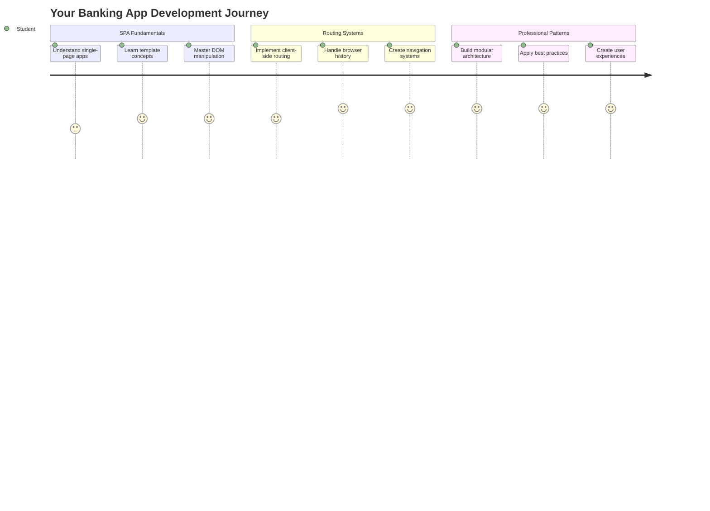
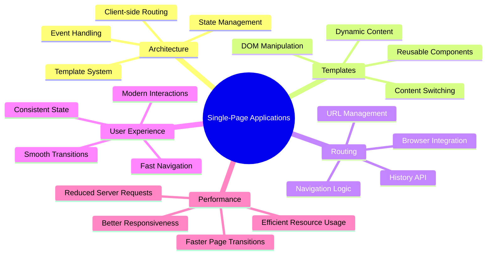
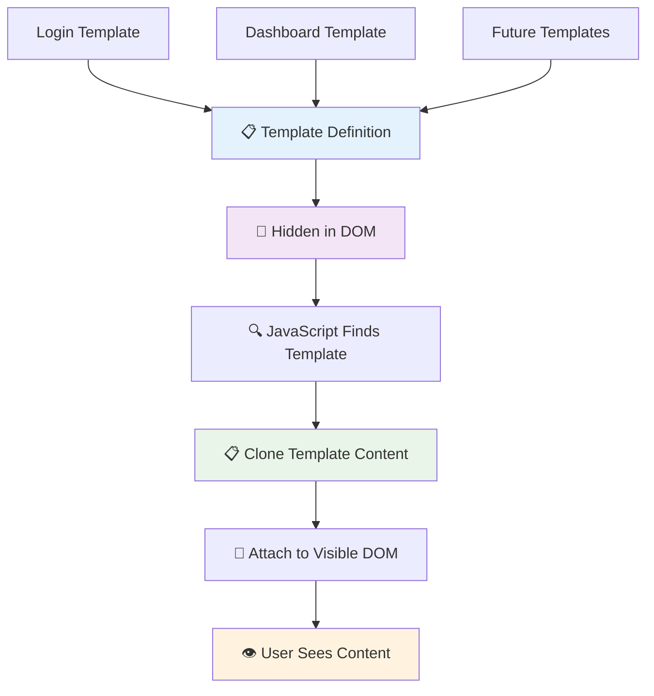
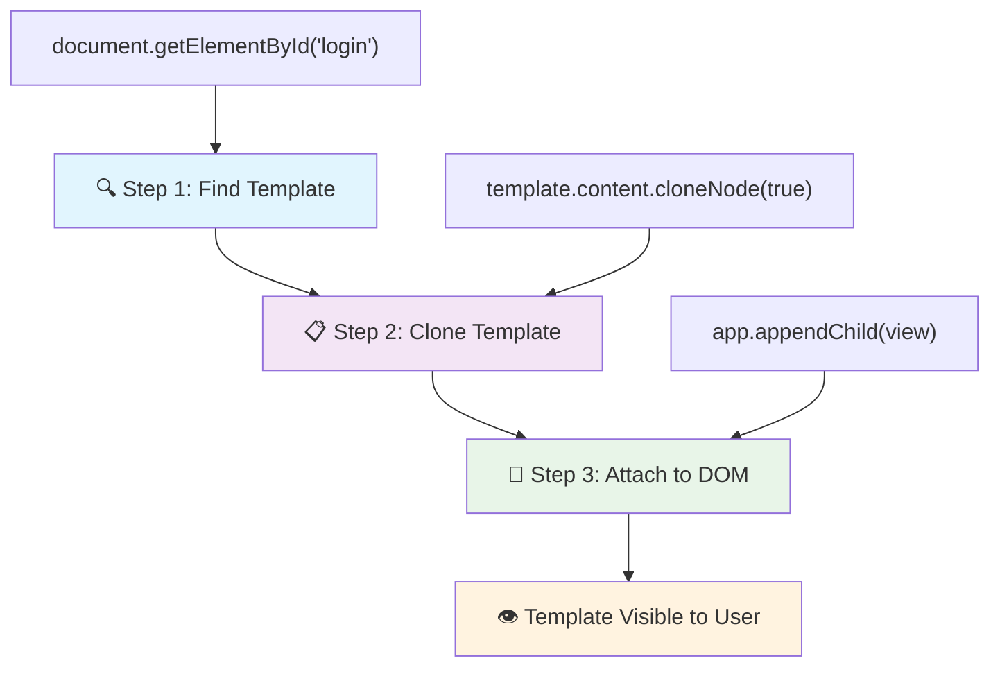
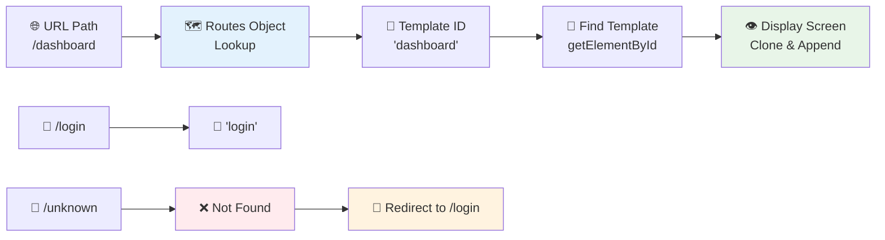
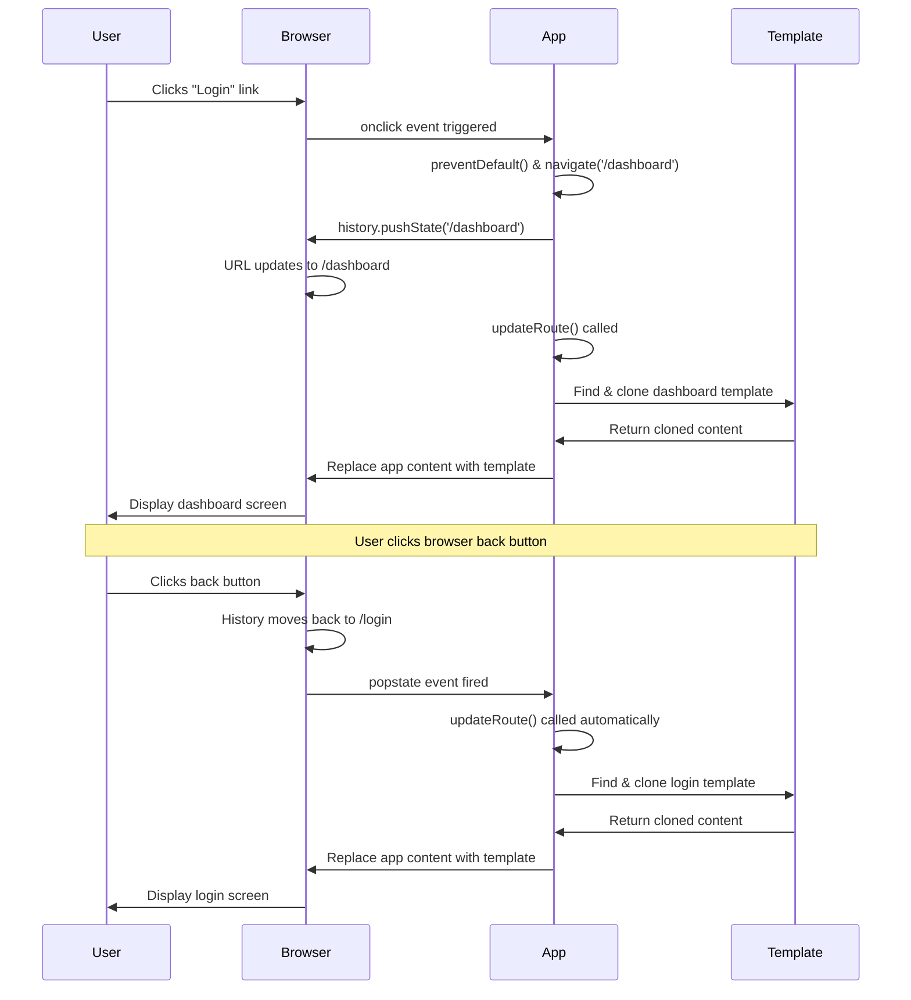
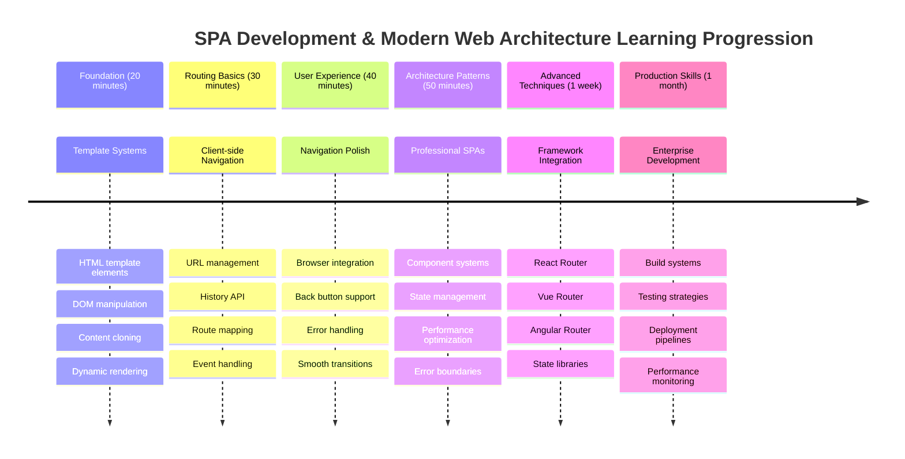

<!--
CO_OP_TRANSLATOR_METADATA:
{
  "original_hash": "351678bece18f07d9daa987a881fb062",
  "translation_date": "2025-11-03T13:23:42+00:00",
  "source_file": "7-bank-project/1-template-route/README.md",
  "language_code": "ur"
}
-->
# بینکنگ ایپ بنائیں حصہ 1: ویب ایپ میں HTML ٹیمپلیٹس اور روٹس



جب اپولو 11 کا گائیڈنس کمپیوٹر 1969 میں چاند پر پہنچا، تو اسے مختلف پروگرامز کے درمیان سوئچ کرنا پڑا بغیر پورے سسٹم کو دوبارہ شروع کیے۔ جدید ویب ایپلیکیشنز بھی اسی طرح کام کرتی ہیں – وہ آپ کو وہی دکھاتی ہیں جو آپ دیکھنا چاہتے ہیں بغیر سب کچھ دوبارہ لوڈ کیے۔ یہ وہ ہموار اور جوابدہ تجربہ پیدا کرتا ہے جس کی آج صارفین توقع کرتے ہیں۔

روایتی ویب سائٹس کے برعکس جو ہر تعامل کے لیے پورے صفحے کو دوبارہ لوڈ کرتی ہیں، جدید ویب ایپس صرف ان حصوں کو اپ ڈیٹ کرتی ہیں جنہیں تبدیل کرنے کی ضرورت ہوتی ہے۔ یہ طریقہ، بالکل اسی طرح جیسے مشن کنٹرول مختلف ڈسپلے کے درمیان سوئچ کرتا ہے جبکہ مستقل مواصلت برقرار رکھتا ہے، وہ ہموار تجربہ پیدا کرتا ہے جس کی ہم توقع کرتے ہیں۔

یہ فرق اتنا ڈرامائی کیوں ہے:

| روایتی ملٹی پیج ایپس | جدید سنگل پیج ایپس |
|----------------------------|-------------------------|
| **نیویگیشن** | ہر اسکرین کے لیے پورے صفحے کو دوبارہ لوڈ کریں | فوری مواد کی تبدیلی |
| **کارکردگی** | مکمل HTML ڈاؤن لوڈ کی وجہ سے سست | جزوی اپ ڈیٹس کے ساتھ تیز |
| **صارف کا تجربہ** | جھٹکے دار صفحے کی جھلکیاں | ہموار، ایپ جیسی منتقلی |
| **ڈیٹا شیئرنگ** | صفحات کے درمیان مشکل | آسان اسٹیٹ مینجمنٹ |
| **ترقی** | متعدد HTML فائلوں کو برقرار رکھنا | متحرک ٹیمپلیٹس کے ساتھ ایک HTML |

**ارتقاء کو سمجھنا:**
- **روایتی ایپس** ہر نیویگیشن ایکشن کے لیے سرور کی درخواستیں کرتی ہیں
- **جدید SPAs** ایک بار لوڈ ہوتی ہیں اور جاوا اسکرپٹ کا استعمال کرتے ہوئے مواد کو متحرک طور پر اپ ڈیٹ کرتی ہیں
- **صارف کی توقعات** اب فوری، ہموار تعاملات کو ترجیح دیتی ہیں
- **کارکردگی کے فوائد** میں کم بینڈوتھ اور تیز ردعمل شامل ہیں

اس سبق میں، ہم ایک بینکنگ ایپ بنائیں گے جس میں متعدد اسکرینز ہوں گی جو بغیر کسی رکاوٹ کے ایک ساتھ بہتی ہیں۔ جیسے سائنسدان مختلف تجربات کے لیے دوبارہ ترتیب دینے کے قابل ماڈیولر آلات استعمال کرتے ہیں، ہم HTML ٹیمپلیٹس کو دوبارہ قابل استعمال اجزاء کے طور پر استعمال کریں گے جنہیں ضرورت کے مطابق دکھایا جا سکتا ہے۔

آپ HTML ٹیمپلیٹس (مختلف اسکرینز کے لیے دوبارہ قابل استعمال بلیو پرنٹس)، جاوا اسکرپٹ روٹنگ (وہ نظام جو اسکرینز کے درمیان سوئچ کرتا ہے)، اور براؤزر کی ہسٹری API (جو بیک بٹن کو توقع کے مطابق کام کرتا ہے) کے ساتھ کام کریں گے۔ یہ وہی بنیادی تکنیکیں ہیں جو فریم ورک جیسے React، Vue، اور Angular استعمال کرتے ہیں۔

آخر میں، آپ کے پاس ایک کام کرنے والی بینکنگ ایپ ہوگی جو پیشہ ور سنگل پیج ایپلیکیشن اصولوں کو ظاہر کرتی ہے۔



## پری لیکچر کوئز

[پری لیکچر کوئز](https://ff-quizzes.netlify.app/web/quiz/41)

### آپ کو کیا چاہیے ہوگا

ہمیں اپنی بینکنگ ایپ کو ٹیسٹ کرنے کے لیے ایک مقامی ویب سرور کی ضرورت ہوگی – فکر نہ کریں، یہ اتنا مشکل نہیں جتنا لگتا ہے! اگر آپ کے پاس پہلے سے کوئی سیٹ اپ نہیں ہے، تو بس [Node.js](https://nodejs.org) انسٹال کریں اور اپنے پروجیکٹ فولڈر سے `npx lite-server` چلائیں۔ یہ آسان کمانڈ ایک مقامی سرور کو چلاتا ہے اور خود بخود آپ کی ایپ کو براؤزر میں کھولتا ہے۔

### تیاری

اپنے کمپیوٹر پر، `bank` نامی ایک فولڈر بنائیں جس میں `index.html` نامی ایک فائل ہو۔ ہم اس HTML [بوائلر پلیٹ](https://en.wikipedia.org/wiki/Boilerplate_code) سے شروع کریں گے:

```html
<!DOCTYPE html>
<html lang="en">
  <head>
    <meta charset="UTF-8">
    <meta name="viewport" content="width=device-width, initial-scale=1.0">
    <title>Bank App</title>
  </head>
  <body>
    <!-- This is where you'll work -->
  </body>
</html>
```

**یہ بوائلر پلیٹ فراہم کرتا ہے:**
- **HTML5 دستاویز کی ساخت** کو مناسب DOCTYPE اعلان کے ساتھ قائم کرتا ہے
- **کریکٹر انکوڈنگ** کو UTF-8 کے طور پر ترتیب دیتا ہے تاکہ بین الاقوامی متن کی حمایت کی جا سکے
- **ریسپانسیو ڈیزائن** کو موبائل مطابقت کے لیے ویوپورٹ میٹا ٹیگ کے ساتھ فعال کرتا ہے
- **ایک وضاحتی عنوان** ترتیب دیتا ہے جو براؤزر ٹیب میں ظاہر ہوتا ہے
- **ایک صاف باڈی سیکشن** بناتا ہے جہاں ہم اپنی ایپلیکیشن بنائیں گے

> 📁 **پروجیکٹ اسٹرکچر کا پیش نظارہ**
> 
> **اس سبق کے آخر میں، آپ کے پروجیکٹ میں شامل ہوگا:**
> ```
> bank/
> ├── index.html      <!-- Main HTML with templates -->
> ├── app.js          <!-- Routing and navigation logic -->
> └── style.css       <!-- (Optional for future lessons) -->
> ```
> 
> **فائل کی ذمہ داریاں:**
> - **index.html**: تمام ٹیمپلیٹس پر مشتمل ہے اور ایپ کی ساخت فراہم کرتا ہے
> - **app.js**: روٹنگ، نیویگیشن، اور ٹیمپلیٹ مینجمنٹ کو ہینڈل کرتا ہے
> - **ٹیمپلیٹس**: لاگ ان، ڈیش بورڈ، اور دیگر اسکرینز کے لیے UI کی وضاحت کرتا ہے

---

## HTML ٹیمپلیٹس

ٹیمپلیٹس ویب ڈویلپمنٹ میں ایک بنیادی مسئلہ حل کرتے ہیں۔ جب گٹنبرگ نے 1440 کی دہائی میں مووایبل ٹائپ پرنٹنگ ایجاد کی، تو انہوں نے محسوس کیا کہ پورے صفحات کو تراشنے کے بجائے، وہ دوبارہ قابل استعمال حرفی بلاکس بنا سکتے ہیں اور انہیں ضرورت کے مطابق ترتیب دے سکتے ہیں۔ HTML ٹیمپلیٹس اسی اصول پر کام کرتے ہیں – ہر اسکرین کے لیے الگ HTML فائلیں بنانے کے بجائے، آپ دوبارہ قابل استعمال ڈھانچے کی وضاحت کرتے ہیں جنہیں ضرورت کے وقت دکھایا جا سکتا ہے۔



ٹیمپلیٹس کو اپنی ایپ کے مختلف حصوں کے لیے بلیو پرنٹس کے طور پر سوچیں۔ بالکل اسی طرح جیسے ایک معمار ایک بلیو پرنٹ بناتا ہے اور اسے متعدد بار استعمال کرتا ہے بجائے اس کے کہ ایک جیسے کمروں کو دوبارہ ڈرائنگ کرے، ہم ٹیمپلیٹس کو ایک بار بناتے ہیں اور ضرورت کے مطابق ان کا استعمال کرتے ہیں۔ براؤزر ان ٹیمپلیٹس کو چھپائے رکھتا ہے جب تک کہ جاوا اسکرپٹ انہیں فعال نہ کرے۔

اگر آپ کسی ویب صفحے کے لیے متعدد اسکرینز بنانا چاہتے ہیں، تو ایک حل یہ ہوگا کہ آپ ہر اسکرین کے لیے ایک HTML فائل بنائیں جسے آپ دکھانا چاہتے ہیں۔ تاہم، یہ حل کچھ تکلیف کے ساتھ آتا ہے:

- اسکرین سوئچ کرتے وقت آپ کو پورے HTML کو دوبارہ لوڈ کرنا پڑتا ہے، جو سست ہو سکتا ہے۔
- مختلف اسکرینز کے درمیان ڈیٹا کا اشتراک کرنا مشکل ہے۔

ایک اور طریقہ یہ ہے کہ صرف ایک HTML فائل ہو، اور متعدد [HTML ٹیمپلیٹس](https://developer.mozilla.org/docs/Web/HTML/Element/template) کو `<template>` عنصر کا استعمال کرتے ہوئے بیان کریں۔ ایک ٹیمپلیٹ ایک دوبارہ قابل استعمال HTML بلاک ہے جو براؤزر کے ذریعے ظاہر نہیں کیا جاتا، اور اسے جاوا اسکرپٹ کا استعمال کرتے ہوئے رن ٹائم پر انسٹیٹیوٹ کرنا پڑتا ہے۔

### آئیے اسے بنائیں

ہم ایک بینک ایپ بنانے جا رہے ہیں جس میں دو اہم اسکرینز ہوں گی: ایک لاگ ان صفحہ اور ایک ڈیش بورڈ۔ پہلے، آئیے اپنے HTML باڈی میں ایک پلیس ہولڈر عنصر شامل کریں – یہ وہ جگہ ہے جہاں ہماری مختلف اسکرینز ظاہر ہوں گی:

```html
<div id="app">Loading...</div>
```

**اس پلیس ہولڈر کو سمجھنا:**
- **ایک کنٹینر بناتا ہے** جس کا ID "app" ہے جہاں تمام اسکرینز دکھائی جائیں گی
- **ایک لوڈنگ پیغام دکھاتا ہے** جب تک جاوا اسکرپٹ پہلی اسکرین کو شروع نہیں کرتا
- **ہمارے متحرک مواد کے لیے ایک واحد ماؤنٹنگ پوائنٹ فراہم کرتا ہے**
- **جاوا اسکرپٹ سے آسانی سے ہدف بناتا ہے** `document.getElementById()` کا استعمال کرتے ہوئے

> 💡 **پرو ٹپ**: چونکہ اس عنصر کا مواد تبدیل کیا جائے گا، ہم ایک لوڈنگ پیغام یا اشارے ڈال سکتے ہیں جو ایپ لوڈ ہونے کے دوران دکھایا جائے گا۔

اگلا، آئیے لاگ ان صفحہ کے لیے HTML ٹیمپلیٹ کو نیچے شامل کریں۔ فی الحال ہم وہاں صرف ایک عنوان اور ایک سیکشن ڈالیں گے جس میں ایک لنک ہوگا جسے ہم نیویگیشن انجام دینے کے لیے استعمال کریں گے۔

```html
<template id="login">
  <h1>Bank App</h1>
  <section>
    <a href="/dashboard">Login</a>
  </section>
</template>
```

**اس لاگ ان ٹیمپلیٹ کو توڑنا:**
- **ایک ٹیمپلیٹ کی وضاحت کرتا ہے** منفرد شناخت کنندہ "login" کے ساتھ جاوا اسکرپٹ کے ہدف کے لیے
- **ایک مرکزی عنوان شامل کرتا ہے** جو ایپ کی برانڈنگ قائم کرتا ہے
- **ایک سیمینٹک `<section>` عنصر پر مشتمل ہے** متعلقہ مواد کو گروپ کرنے کے لیے
- **ایک نیویگیشن لنک فراہم کرتا ہے** جو صارفین کو ڈیش بورڈ پر لے جائے گا

پھر ہم ڈیش بورڈ صفحہ کے لیے ایک اور HTML ٹیمپلیٹ شامل کریں گے۔ اس صفحے میں مختلف سیکشنز ہوں گے:

- ایک ہیڈر جس میں ایک عنوان اور ایک لاگ آؤٹ لنک ہوگا
- بینک اکاؤنٹ کا موجودہ بیلنس
- لین دین کی فہرست، جو ایک ٹیبل میں دکھائی جائے گی

```html
<template id="dashboard">
  <header>
    <h1>Bank App</h1>
    <a href="/login">Logout</a>
  </header>
  <section>
    Balance: 100$
  </section>
  <section>
    <h2>Transactions</h2>
    <table>
      <thead>
        <tr>
          <th>Date</th>
          <th>Object</th>
          <th>Amount</th>
        </tr>
      </thead>
      <tbody></tbody>
    </table>
  </section>
</template>
```

**ڈیش بورڈ کے ہر حصے کو سمجھیں:**
- **صفحة کو ایک سیمینٹک `<header>` عنصر کے ساتھ ترتیب دیتا ہے** جس میں نیویگیشن شامل ہے
- **ایپ کا عنوان مستقل طور پر اسکرینز کے پار دکھاتا ہے** برانڈنگ کے لیے
- **ایک لاگ آؤٹ لنک فراہم کرتا ہے** جو لاگ ان اسکرین پر واپس لے جاتا ہے
- **موجودہ اکاؤنٹ بیلنس کو ایک مخصوص سیکشن میں دکھاتا ہے**
- **لین دین کے ڈیٹا کو ایک مناسب طور پر ساختہ HTML ٹیبل کا استعمال کرتے ہوئے منظم کرتا ہے**
- **تاریخ، آبجیکٹ، اور رقم کے کالمز کے لیے ٹیبل ہیڈرز کی وضاحت کرتا ہے**
- **ٹیبل باڈی کو خالی چھوڑتا ہے** بعد میں متحرک مواد کے انجیکشن کے لیے

> 💡 **پرو ٹپ**: جب HTML ٹیمپلیٹس بناتے ہیں، اگر آپ دیکھنا چاہتے ہیں کہ یہ کیسا نظر آئے گا، تو آپ `<template>` اور `</template>` لائنوں کو `<!-- -->` کے ساتھ تبصرہ کر سکتے ہیں۔

### 🔄 **تعلیمی چیک ان**
**ٹیمپلیٹ سسٹم کو سمجھنا**: جاوا اسکرپٹ کو نافذ کرنے سے پہلے، یقینی بنائیں کہ آپ سمجھتے ہیں:
- ✅ ٹیمپلیٹس عام HTML عناصر سے کیسے مختلف ہیں
- ✅ ٹیمپلیٹس جاوا اسکرپٹ کے ذریعے فعال ہونے تک کیوں چھپے رہتے ہیں
- ✅ ٹیمپلیٹس میں سیمینٹک HTML ساخت کی اہمیت
- ✅ ٹیمپلیٹس دوبارہ قابل استعمال UI اجزاء کو کیسے فعال کرتے ہیں

**فوری خود ٹیسٹ**: اگر آپ اپنے HTML سے `<template>` ٹیگز ہٹا دیں تو کیا ہوگا؟
*جواب: مواد فوری طور پر نظر آتا ہے اور اپنی ٹیمپلیٹ فعالیت کھو دیتا ہے*

**آرکیٹیکچر کے فوائد**: ٹیمپلیٹس فراہم کرتے ہیں:
- **دوبارہ قابل استعمال**: ایک تعریف، متعدد مثالیں
- **کارکردگی**: کوئی غیر ضروری HTML پارسنگ نہیں
- **قابل دیکھ بھال**: مرکزی UI ساخت
- **لچک**: متحرک مواد کی تبدیلی

✅ آپ کے خیال میں ہم ٹیمپلیٹس پر `id` صفات کیوں استعمال کرتے ہیں؟ کیا ہم کچھ اور استعمال کر سکتے ہیں جیسے کلاسز؟

## جاوا اسکرپٹ کے ساتھ ٹیمپلیٹس کو زندگی دینا

اب ہمیں اپنے ٹیمپلیٹس کو فعال بنانا ہوگا۔ جیسے ایک 3D پرنٹر ایک ڈیجیٹل بلیو پرنٹ لیتا ہے اور ایک جسمانی آبجیکٹ بناتا ہے، جاوا اسکرپٹ ہمارے چھپے ہوئے ٹیمپلیٹس لیتا ہے اور نظر آنے والے، انٹرایکٹو عناصر بناتا ہے جنہیں صارفین دیکھ اور استعمال کر سکتے ہیں۔

یہ عمل تین مستقل مراحل پر عمل کرتا ہے جو جدید ویب ڈویلپمنٹ کی بنیاد بناتے ہیں۔ ایک بار جب آپ اس پیٹرن کو سمجھ لیں گے، تو آپ اسے بہت سے فریم ورک اور لائبریریوں میں پہچان لیں گے۔

اگر آپ اپنے موجودہ HTML فائل کو براؤزر میں آزمائیں، تو آپ دیکھیں گے کہ یہ `Loading...` دکھانے پر پھنس جاتا ہے۔ اس کی وجہ یہ ہے کہ ہمیں کچھ جاوا اسکرپٹ کوڈ شامل کرنے کی ضرورت ہے تاکہ HTML ٹیمپلیٹس کو انسٹیٹیوٹ اور ظاہر کیا جا سکے۔

ٹیمپلیٹ کو انسٹیٹیوٹ کرنا عام طور پر 3 مراحل میں کیا جاتا ہے:

1. DOM میں ٹیمپلیٹ عنصر کو حاصل کریں، مثال کے طور پر [`document.getElementById`](https://developer.mozilla.org/docs/Web/API/Document/getElementById) کا استعمال کرتے ہوئے۔
2. ٹیمپلیٹ عنصر کو کلون کریں، [`cloneNode`](https://developer.mozilla.org/docs/Web/API/Node/cloneNode) کا استعمال کرتے ہوئے۔
3. اسے DOM کے تحت ایک نظر آنے والے عنصر سے منسلک کریں، مثال کے طور پر [`appendChild`](https://developer.mozilla.org/docs/Web/API/Node/appendChild) کا استعمال کرتے ہوئے۔



**عمل کا بصری تجزیہ:**
- **مرحلہ 1** DOM ساخت میں چھپے ہوئے ٹیمپلیٹ کو تلاش کرتا ہے
- **مرحلہ 2** ایک کام کرنے والی کاپی بناتا ہے جسے محفوظ طریقے سے تبدیل کیا جا سکتا ہے
- **مرحلہ 3** کاپی کو نظر آنے والے صفحے کے علاقے میں داخل کرتا ہے
- **نتیجہ** ایک فعال اسکرین ہے جس کے ساتھ صارف تعامل کر سکتے ہیں

✅ ہمیں ٹیمپلیٹ کو DOM میں منسلک کرنے سے پہلے کلون کرنے کی ضرورت کیوں ہے؟ آپ کے خیال میں اگر ہم اس مرحلے کو چھوڑ دیں تو کیا ہوگا؟

### کام

اپنے پروجیکٹ فولڈر میں `app.js` نامی ایک نئی فائل بنائیں اور اپنے HTML کے `<head>` سیکشن میں اس فائل کو امپورٹ کریں:

```html
<script src="app.js" defer></script>
```

**اس اسکرپٹ امپورٹ کو سمجھنا:**
- **جاوا اسکرپٹ فائل کو ہمارے HTML دستاویز سے لنک کرتا ہے**
- **`defer` وصف کا استعمال کرتا ہے** تاکہ اسکرپٹ HTML پارسنگ مکمل ہونے کے بعد چل سکے
- **تمام DOM عناصر تک رسائی کو فعال کرتا ہے** کیونکہ وہ اسکرپٹ کے نفاذ سے پہلے مکمل طور پر لوڈ ہو چکے ہیں
- **اسکرپٹ لوڈنگ اور کارکردگی کے لیے جدید بہترین طریقوں کی پیروی کرتا ہے**

اب `app.js` میں، ہم ایک نیا فنکشن `updateRoute` بنائیں گے:

```js
function updateRoute(templateId) {
  const template = document.getElementById(templateId);
  const view = template.content.cloneNode(true);
  const app = document.getElementById('app');
  app.innerHTML = '';
  app.appendChild(view);
}
```

**مرحلہ وار، یہاں کیا ہو رہا ہے:**
- **ٹیمپلیٹ عنصر کو اس کے منفرد ID کا استعمال کرتے ہوئے تلاش کرتا ہے**
- **ٹیمپلیٹ کے مواد کی ایک گہری کاپی بناتا ہے** `cloneNode(true)` کا استعمال کرتے ہوئے
- **ایپ کنٹینر کو تلاش کرتا ہے** جہاں مواد دکھایا جائے گا
- **ایپ کنٹینر سے کسی بھی موجودہ مواد کو صاف کرتا ہے**
- **کلون شدہ ٹیمپلیٹ مواد کو نظر آنے والے DOM میں داخل کرتا ہے**

اب اس فنکشن کو ٹیمپلیٹ میں سے ایک کے ساتھ کال کریں اور نتیجہ دیکھیں۔

```js
updateRoute('login');
```

**یہ فنکشن کال کیا حاصل کرتا ہے:**
- **لاگ ان ٹیمپلیٹ کو فعال کرتا ہے** اس کا ID پیرامیٹر کے طور پر پاس کر کے
- **مختلف ایپ اسکرینز کے درمیان پروگرام کے ذریعے سوئچ کرنے کا مظاہرہ کرتا ہے**
- **"Loading..." پیغام کی جگہ لاگ ان اسکرین دکھاتا ہے**

✅ اس کوڈ کا مقصد کیا ہے `app.innerHTML = '';`؟ اس کے بغیر کیا ہوتا ہے؟

## روٹس بنانا

روٹنگ بنیادی طور پر URLs کو صحیح مواد سے جوڑنے کے بارے میں ہے۔ غور کریں کہ کس طرح ابتدائی ٹیلیفون آپریٹرز سوئچ بورڈز کا استعمال کرتے ہوئے کالز کو جوڑتے تھے – وہ ایک آنے والی درخواست لیتے تھے اور اسے صحیح منزل پر بھیجتے تھے۔ ویب روٹنگ اسی طرح کام کرتی ہے، ایک URL درخواست کو لے کر یہ طے کرتی ہے کہ کون سا مواد دکھایا جائے۔



روایتی طور پر، ویب سرورز مختلف URLs کے لیے مختلف HTML فائلیں فراہم کر کے اس کو ہینڈل کرتے تھے۔ چونکہ ہم ایک سنگل پیج ایپ بنا رہے ہیں، ہمیں جاوا اسکرپٹ کے ساتھ اس روٹنگ کو خود ہینڈل کرنے کی ضرورت ہے۔ یہ طریقہ ہمیں صارف کے تجربے اور کارکردگی پر زیادہ کنٹرول دیتا ہے۔


**روٹنگ کے بہاؤ کو سمجھنا:**
- **URL میں تبدیلیاں** ہمارے روٹس کنفیگریشن میں ایک تلاش کو متحرک کرتی ہیں
- **درست روٹس** مخصوص ٹیمپلیٹ IDs کے ساتھ رینڈرنگ کے لیے میپ کرتے ہیں

اب ہم `updateRoute` فنکشن میں تھوڑی تبدیلی کرتے ہیں۔ بجائے `templateId` کو براہ راست آرگومنٹ کے طور پر پاس کرنے کے، ہم پہلے موجودہ URL کو دیکھ کر اسے حاصل کرنا چاہتے ہیں، اور پھر اپنے نقشے کا استعمال کرتے ہوئے متعلقہ template ID ویلیو حاصل کریں گے۔ ہم [`window.location.pathname`](https://developer.mozilla.org/docs/Web/API/Location/pathname) استعمال کر سکتے ہیں تاکہ URL سے صرف path سیکشن حاصل کیا جا سکے۔

```js
function updateRoute() {
  const path = window.location.pathname;
  const route = routes[path];

  const template = document.getElementById(route.templateId);
  const view = template.content.cloneNode(true);
  const app = document.getElementById('app');
  app.innerHTML = '';
  app.appendChild(view);
}
```

**یہاں کیا ہو رہا ہے:**
- **نکالتا ہے** موجودہ path کو براؤزر کے URL سے `window.location.pathname` کے ذریعے
- **تلاش کرتا ہے** متعلقہ route کنفیگریشن کو ہمارے routes object میں
- **حاصل کرتا ہے** template ID کو route کنفیگریشن سے
- **پہلے کی طرح** template rendering کے عمل کو جاری رکھتا ہے
- **بناتا ہے** ایک dynamic نظام جو URL تبدیلیوں پر ردعمل دیتا ہے

یہاں ہم نے اپنے routes کو متعلقہ template کے ساتھ mapped کیا ہے۔ آپ اسے آزما سکتے ہیں کہ یہ صحیح کام کر رہا ہے یا نہیں، براؤزر میں URL کو دستی طور پر تبدیل کر کے۔

✅ اگر آپ URL میں کوئی نامعلوم path درج کریں تو کیا ہوتا ہے؟ ہم اس مسئلے کو کیسے حل کر سکتے ہیں؟

## نیویگیشن شامل کرنا

جب routing قائم ہو جائے، تو صارفین کو ایپ کے ذریعے نیویگیٹ کرنے کا ایک طریقہ چاہیے۔ روایتی ویب سائٹس لنکس پر کلک کرنے پر پورے صفحات کو دوبارہ لوڈ کرتی ہیں، لیکن ہم URL اور مواد کو بغیر صفحہ ریفریش کیے اپ ڈیٹ کرنا چاہتے ہیں۔ یہ ایک ہموار تجربہ پیدا کرتا ہے، جیسے کہ ڈیسک ٹاپ ایپلیکیشنز مختلف views کے درمیان سوئچ کرتی ہیں۔

ہمیں دو چیزوں کو ہم آہنگ کرنے کی ضرورت ہے: براؤزر کے URL کو اپ ڈیٹ کرنا تاکہ صارفین صفحات کو بک مارک کر سکیں اور لنکس شیئر کر سکیں، اور مناسب مواد کو ظاہر کرنا۔ جب صحیح طریقے سے نافذ کیا جائے، تو یہ وہ ہموار نیویگیشن پیدا کرتا ہے جس کی توقع صارفین جدید ایپلیکیشنز سے کرتے ہیں۔



### 🔄 **تعلیمی جائزہ**
**سنگل پیج ایپلیکیشن آرکیٹیکچر**: مکمل نظام کی سمجھ کی تصدیق کریں:
- ✅ کلائنٹ سائیڈ routing روایتی سرور سائیڈ routing سے کیسے مختلف ہے؟
- ✅ SPA نیویگیشن کے لیے History API کیوں ضروری ہے؟
- ✅ templates صفحہ ریفریش کے بغیر dynamic content کو کیسے فعال کرتے ہیں؟
- ✅ نیویگیشن کو روکنے میں event handling کا کیا کردار ہے؟

**نظام کا انضمام**: آپ کی SPA ظاہر کرتی ہے:
- **Template Management**: dynamic content کے ساتھ دوبارہ استعمال ہونے والے UI components
- **Client-side Routing**: URL مینجمنٹ بغیر سرور درخواستوں کے
- **Event-driven Architecture**: responsive نیویگیشن اور صارف کے تعاملات
- **Browser Integration**: صحیح history اور back/forward بٹن کی سپورٹ
- **Performance Optimization**: تیز transitions اور کم سرور لوڈ

**پیشہ ورانہ پیٹرنز**: آپ نے نافذ کیا:
- **Model-View Separation**: templates کو ایپلیکیشن لاجک سے الگ کرنا
- **State Management**: URL state کو ظاہر کردہ مواد کے ساتھ ہم آہنگ کرنا
- **Progressive Enhancement**: JavaScript کے ذریعے بنیادی HTML فعالیت کو بہتر بنانا
- **User Experience**: ہموار، ایپ جیسی نیویگیشن بغیر صفحہ ریفریش کے

> � **آرکیٹیکچر بصیرت**: نیویگیشن سسٹم کے اجزاء
>
> **آپ کیا بنا رہے ہیں:**
> - **🔄 URL Management**: براؤزر ایڈریس بار کو صفحہ ریفریش کے بغیر اپ ڈیٹ کرنا
> - **📋 Template System**: موجودہ route کی بنیاد پر مواد کو dynamic طور پر تبدیل کرنا  
> - **📚 History Integration**: براؤزر back/forward بٹن functionality کو برقرار رکھنا
> - **🛡️ Error Handling**: غلط یا غائب routes کے لیے graceful fallbacks
>
> **اجزاء کیسے ایک ساتھ کام کرتے ہیں:**
> - **سنتا ہے** نیویگیشن ایونٹس (کلکس، history تبدیلیاں)
> - **اپ ڈیٹ کرتا ہے** URL کو History API کے ذریعے
> - **ظاہر کرتا ہے** نئے route کے لیے مناسب template
> - **برقرار رکھتا ہے** ہموار صارف تجربہ پورے وقت

ہماری ایپ کے لیے اگلا قدم یہ ہے کہ صفحات کے درمیان نیویگیٹ کرنے کی صلاحیت شامل کی جائے بغیر URL کو دستی طور پر تبدیل کیے۔ اس کا مطلب دو چیزیں ہیں:

  1. موجودہ URL کو اپ ڈیٹ کرنا
  2. نئے URL کی بنیاد پر ظاہر کردہ template کو اپ ڈیٹ کرنا

ہم نے پہلے ہی `updateRoute` فنکشن کے ساتھ دوسرے حصے کا خیال رکھا ہے، لہذا ہمیں موجودہ URL کو اپ ڈیٹ کرنے کا طریقہ معلوم کرنا ہوگا۔

ہمیں JavaScript اور خاص طور پر [`history.pushState`](https://developer.mozilla.org/docs/Web/API/History/pushState) استعمال کرنا ہوگا جو URL کو اپ ڈیٹ کرنے اور براؤزنگ history میں ایک نیا entry بنانے کی اجازت دیتا ہے، بغیر HTML کو ریفریش کیے۔

> ⚠️ **اہم نوٹ**: حالانکہ HTML anchor element [`<a href>`](https://developer.mozilla.org/docs/Web/HTML/Element/a) کو خود ہی مختلف URLs کے لیے hyperlinks بنانے کے لیے استعمال کیا جا سکتا ہے، یہ براؤزر کو ڈیفالٹ کے طور پر HTML کو ریفریش کرنے پر مجبور کرے گا۔ اس رویے کو روکنا ضروری ہے جب custom JavaScript کے ساتھ routing کو ہینڈل کیا جا رہا ہو، `preventDefault()` فنکشن کو کلک ایونٹ پر استعمال کر کے۔

### کام

آئیے ایک نیا فنکشن بناتے ہیں جسے ہم اپنی ایپ میں نیویگیٹ کرنے کے لیے استعمال کر سکتے ہیں:

```js
function navigate(path) {
  window.history.pushState({}, path, path);
  updateRoute();
}
```

**اس نیویگیشن فنکشن کو سمجھنا:**
- **اپ ڈیٹ کرتا ہے** براؤزر کے URL کو نئے path کے ساتھ `history.pushState` کے ذریعے
- **شامل کرتا ہے** براؤزر کے history stack میں ایک نیا entry تاکہ back/forward بٹن صحیح کام کریں
- **چلاتا ہے** `updateRoute()` فنکشن تاکہ متعلقہ template ظاہر ہو
- **برقرار رکھتا ہے** سنگل پیج ایپلیکیشن کا تجربہ بغیر صفحہ ریفریش کے

یہ طریقہ پہلے موجودہ URL کو دیے گئے path کی بنیاد پر اپ ڈیٹ کرتا ہے، پھر template کو اپ ڈیٹ کرتا ہے۔ پراپرٹی `window.location.origin` URL root کو واپس کرتی ہے، جو ہمیں دیے گئے path سے مکمل URL دوبارہ بنانے کی اجازت دیتی ہے۔

اب جب کہ ہمارے پاس یہ فنکشن ہے، ہم اس مسئلے کا خیال رکھ سکتے ہیں جو ہمیں ہوتا ہے اگر کوئی path کسی بھی مقرر کردہ route سے میل نہیں کھاتا۔ ہم `updateRoute` فنکشن میں ترمیم کریں گے تاکہ اگر کوئی match نہ ملے تو موجودہ route کو fallback کے طور پر شامل کریں۔

```js
function updateRoute() {
  const path = window.location.pathname;
  const route = routes[path];

  if (!route) {
    return navigate('/login');
  }

  const template = document.getElementById(route.templateId);
  const view = template.content.cloneNode(true);
  const app = document.getElementById('app');
  app.innerHTML = '';
  app.appendChild(view);
}
```

**یاد رکھنے کے اہم نکات:**
- **چیک کرتا ہے** کہ موجودہ path کے لیے کوئی route موجود ہے یا نہیں
- **ری ڈائریکٹ کرتا ہے** login صفحے پر جب کوئی غلط route تک رسائی حاصل کی جائے
- **فراہم کرتا ہے** ایک fallback mechanism جو خراب نیویگیشن کو روکتا ہے
- **یقینی بناتا ہے** کہ صارفین ہمیشہ ایک درست اسکرین دیکھیں، یہاں تک کہ غلط URLs کے ساتھ

اگر کوئی route نہیں ملتا، تو ہم اب `login` صفحے پر ری ڈائریکٹ کریں گے۔

اب آئیے ایک فنکشن بناتے ہیں جو لنک پر کلک کرنے پر URL حاصل کرے، اور براؤزر کے ڈیفالٹ لنک رویے کو روکے:

```js
function onLinkClick(event) {
  event.preventDefault();
  navigate(event.target.href);
}
```

**اس کلک ہینڈلر کو سمجھنا:**
- **روکتا ہے** براؤزر کے ڈیفالٹ لنک رویے کو `preventDefault()` کے ذریعے
- **نکالتا ہے** منزل URL کو کلک کیے گئے لنک element سے
- **کال کرتا ہے** ہمارے custom navigate فنکشن کو صفحہ ریفریش کیے بغیر
- **برقرار رکھتا ہے** ہموار سنگل پیج ایپلیکیشن کا تجربہ

```html
<a href="/dashboard" onclick="onLinkClick(event)">Login</a>
...
<a href="/login" onclick="onLinkClick(event)">Logout</a>
```

**یہ onclick binding کیا حاصل کرتی ہے:**
- **جوڑتا ہے** ہر لنک کو ہمارے custom نیویگیشن سسٹم کے ساتھ
- **پاس کرتا ہے** کلک ایونٹ کو ہمارے `onLinkClick` فنکشن کے لیے پروسیسنگ کے لیے
- **فعال کرتا ہے** ہموار نیویگیشن بغیر صفحہ ریفریش کے
- **برقرار رکھتا ہے** صحیح URL اسٹرکچر جسے صارفین بک مارک یا شیئر کر سکتے ہیں

[`onclick`](https://developer.mozilla.org/docs/Web/API/GlobalEventHandlers/onclick) ایٹریبیوٹ کلک ایونٹ کو JavaScript کوڈ کے ساتھ bind کرتا ہے، یہاں `navigate()` فنکشن کو کال کرنے کے لیے۔

ان لنکس پر کلک کرنے کی کوشش کریں، آپ کو اب اپنی ایپ کے مختلف اسکرینز کے درمیان نیویگیٹ کرنے کے قابل ہونا چاہیے۔

✅ `history.pushState` طریقہ HTML5 اسٹینڈرڈ کا حصہ ہے اور [تمام جدید براؤزرز](https://caniuse.com/?search=pushState) میں نافذ کیا گیا ہے۔ اگر آپ پرانے براؤزرز کے لیے ویب ایپ بنا رہے ہیں، تو آپ اس API کے بجائے ایک چال استعمال کر سکتے ہیں: path سے پہلے [hash (`#`)](https://en.wikipedia.org/wiki/URI_fragment) کا استعمال کر کے آپ routing کو نافذ کر سکتے ہیں جو عام anchor نیویگیشن کے ساتھ کام کرتا ہے اور صفحہ کو ریفریش نہیں کرتا، کیونکہ اس کا مقصد صفحے کے اندرونی لنکس بنانا تھا۔

## Back اور Forward بٹن کو کام کرنے کے قابل بنانا

Back اور Forward بٹن ویب براؤزنگ کے لیے بنیادی ہیں، بالکل اسی طرح جیسے NASA مشن کنٹرولرز پچھلے نظام کی حالتوں کا جائزہ لے سکتے ہیں۔ صارفین توقع کرتے ہیں کہ یہ بٹن کام کریں، اور جب وہ نہیں کرتے، تو یہ متوقع براؤزنگ تجربے کو توڑ دیتا ہے۔

ہمارے سنگل پیج ایپ کو اس کی حمایت کے لیے اضافی کنفیگریشن کی ضرورت ہے۔ براؤزر ایک history stack کو برقرار رکھتا ہے (جس میں ہم `history.pushState` کے ساتھ اضافہ کر رہے ہیں)، لیکن جب صارفین اس history کے ذریعے نیویگیٹ کرتے ہیں، تو ہماری ایپ کو مناسب مواد کو اپ ڈیٹ کر کے جواب دینا ہوگا۔


**اہم تعامل کے نکات:**
- **صارف کے اعمال** کلکس یا براؤزر بٹن کے ذریعے نیویگیشن کو متحرک کرتے ہیں
- **ایپ روکتی ہے** لنک کلکس کو صفحہ ریفریش سے بچانے کے لیے
- **History API** URL تبدیلیوں اور براؤزر history stack کو منظم کرتا ہے
- **Templates** ہر اسکرین کے لیے مواد کا ڈھانچہ فراہم کرتے ہیں
- **Event listeners** یقینی بناتے ہیں کہ ایپ تمام نیویگیشن اقسام کا جواب دے

`history.pushState` براؤزر کے نیویگیشن history میں نئے entries بناتا ہے۔ آپ اسے چیک کر سکتے ہیں براؤزر کے *back button* کو دبائے رکھ کر، یہ کچھ اس طرح دکھائے گا:


اگر آپ back button پر چند بار کلک کرنے کی کوشش کریں، تو آپ دیکھیں گے کہ موجودہ URL تبدیل ہوتا ہے اور history اپ ڈیٹ ہوتی ہے، لیکن وہی template ظاہر ہوتا رہتا ہے۔

اس کی وجہ یہ ہے کہ ایپلیکیشن کو معلوم نہیں کہ ہمیں ہر بار history تبدیل ہونے پر `updateRoute()` کو کال کرنے کی ضرورت ہے۔ اگر آپ [`history.pushState` دستاویزات](https://developer.mozilla.org/docs/Web/API/History/pushState) کو دیکھیں، تو آپ دیکھ سکتے ہیں کہ اگر state تبدیل ہو جائے - یعنی ہم ایک مختلف URL پر چلے گئے - تو [`popstate`](https://developer.mozilla.org/docs/Web/API/Window/popstate_event) ایونٹ متحرک ہوتا ہے۔ ہم اس مسئلے کو حل کرنے کے لیے اس کا استعمال کریں گے۔

### کام

یقینی بنانے کے لیے کہ براؤزر history تبدیل ہونے پر ظاہر کردہ template اپ ڈیٹ ہو، ہم ایک نیا فنکشن منسلک کریں گے جو `updateRoute()` کو کال کرے۔ ہم یہ اپنے `app.js` فائل کے آخر میں کریں گے:

```js
window.onpopstate = () => updateRoute();
updateRoute();
```

**اس history انضمام کو سمجھنا:**
- **سنتا ہے** `popstate` ایونٹس جو صارفین براؤزر بٹن کے ساتھ نیویگیٹ کرتے وقت ہوتے ہیں
- **استعمال کرتا ہے** ایک arrow function کو مختصر ایونٹ ہینڈلر syntax کے لیے
- **کال کرتا ہے** `updateRoute()` کو خود بخود جب بھی history state تبدیل ہوتی ہے
- **ایپ کو شروع کرتا ہے** `updateRoute()` کو کال کر کے جب صفحہ پہلی بار لوڈ ہوتا ہے
- **یقینی بناتا ہے** کہ صحیح template ظاہر ہو، چاہے صارفین کیسے بھی نیویگیٹ کریں

> 💡 **پرو ٹپ**: ہم نے یہاں ایک [arrow function](https://developer.mozilla.org/docs/Web/JavaScript/Reference/Functions/Arrow_functions) استعمال کیا ہے تاکہ اپنے `popstate` ایونٹ ہینڈلر کو مختصر طور پر اعلان کریں، لیکن ایک عام فنکشن بھی اسی طرح کام کرے گا۔

یہاں arrow functions پر ایک refresher ویڈیو ہے:

[](https://youtube.com/watch?v=OP6eEbOj2sc "Arrow Functions")

> 🎥 اوپر دی گئی تصویر پر کلک کریں arrow functions کے بارے میں ویڈیو دیکھنے کے لیے۔

اب اپنے براؤزر کے back اور forward بٹن استعمال کرنے کی کوشش کریں، اور چیک کریں کہ اس بار ظاہر کردہ route صحیح طریقے سے اپ ڈیٹ ہو رہا ہے۔

### ⚡ **اگلے 5 منٹ میں آپ کیا کر سکتے ہیں**
- [ ] اپنے بینکنگ ایپ کی نیویگیشن کو براؤزر back/forward بٹن کے ذریعے ٹیسٹ کریں
- [ ] مختلف URLs کو ایڈریس بار میں دستی طور پر ٹائپ کر کے routing کو ٹیسٹ کریں
- [ ] براؤزر DevTools کھولیں اور دیکھیں کہ templates DOM میں کیسے کلون کیے جا رہے ہیں
- [ ] routing flow کو ٹریک کرنے کے لیے console.log statements شامل کرنے کے ساتھ تجربہ کریں

### 🎯 **اس گھنٹے میں آپ کیا حاصل کر سکتے ہیں**
- [ ] سبق کے بعد کا کوئز مکمل کریں اور SPA آرکیٹیکچر کے تصورات کو سمجھیں
- [ ] CSS styling شامل کریں تاکہ آپ کی بینکنگ ایپ templates پیشہ ورانہ نظر آئیں
- [ ] 404 error page چیلنج کو مناسب error handling کے ساتھ نافذ کریں
- [ ] credits page چیلنج کو اضافی routing functionality کے ساتھ بنائیں
- [ ] template switches کے درمیان loading states اور transitions شامل کریں

### 📅 **آپ کی ہفتہ بھر کی SPA ڈیولپمنٹ کی سفر**
- [ ] فارم، ڈیٹا مینجمنٹ، اور persistence کے ساتھ مکمل بینکنگ ایپ بنائیں
- [ ] route parameters اور nested routes جیسے advanced routing features شامل کریں
- [ ] نیویگیشن guards اور authentication-based routing نافذ کریں
- [ ] reusable template components اور ایک component library بنائیں
- [ ] ہموار صارف تجربے کے لیے animations اور transitions شامل کریں
- [ ] اپنی SPA کو hosting platform پر deploy کریں اور routing کو صحیح طریقے سے کنفیگر کریں

### 🌟 **آپ کی مہینے بھر کی فرنٹ اینڈ آرکیٹیکچر مہارت**
- [ ] React, Vue، یا Angular جیسے جدید frameworks کا استعمال کرتے ہوئے پیچیدہ SPAs بنائیں
- [ ] advanced state management patterns اور libraries سیکھیں
- [ ] SPA development کے لیے build tools اور development workflows میں مہارت حاصل کریں
- [ ] Progressive Web App features اور offline functionality نافذ کریں
- [ ] بڑے پیمانے پر SPAs کے لیے performance optimization techniques کا مطالعہ کریں
- [ ] open source SPA projects میں تعاون کریں اور اپنا علم شیئر کریں

## 🎯 آپ کی سنگل پیج ایپلیکیشن مہارت کا ٹائم لائن



### 🛠️ آپ کی SPA ڈیولپمنٹ ٹول کٹ کا خلاصہ

اس سبق کو مکمل کرنے کے بعد، آپ نے مہارت حاصل کر لی ہے:
- **Template Architecture**: dynamic content rendering کے ساتھ دوبارہ استعمال ہونے والے HTML components
- **Client-side Routing**: URL مینجمنٹ اور نیویگیشن بغیر صفحہ ریفریش کے
- **Browser Integration**: History API کا استعمال اور back/forward بٹن کی سپورٹ
- **Event-driven Systems**: نیویگیشن ہینڈلنگ اور صارف کے تعاملات کا انتظام
- **DOM Manipulation**: template cloning، content switching، اور element management
- **Error Handling**: غلط routes اور غائب مواد کے لیے graceful fallbacks
- **Performance Patterns**: مؤثر content loading اور rendering strategies

**حقیقی دنیا کی ایپلیکیشنز**: آپ کی SPA ڈیولپمنٹ کی مہارت براہ راست لاگو ہوتی ہے:
- **جدید ویب ایپلیکیشنز**: React، Vue، Angular، اور دیگر framework development
- **Progressive Web Apps**: آف لائن قابل ایپلیکیشنز کے ساتھ ایپ جیسا تجربہ
- **Enterprise Dashboards**: متعدد views کے ساتھ پیچیدہ کاروباری ایپلیکیشنز
- **E-commerce Platforms**: پروڈکٹ کیٹلاگ، shopping carts، اور checkout flows
- **Content Management**: dynamic content creation اور editing interfaces
- **Mobile Development**: ویب ٹیکنالوجیز کا استعمال کرتے ہوئے hybrid apps

**حاصل کردہ پیشہ ورانہ مہارتیں**: آپ اب
- **معمار** سنگل پیج ایپلیکیشنز کو مناسب تقسیم کے ساتھ بنائیں
- **عملدرآمد کریں** کلائنٹ سائیڈ روٹنگ سسٹمز جو ایپلیکیشن کی پیچیدگی کے ساتھ بڑھ سکیں
- **ڈیبگ کریں** پیچیدہ نیویگیشن فلو کو براؤزر ڈیولپر ٹولز کے ذریعے
- **بہتر بنائیں** ایپلیکیشن کی کارکردگی کو مؤثر ٹیمپلیٹ مینجمنٹ کے ذریعے
- **ڈیزائن کریں** صارف کے تجربات جو قدرتی اور جوابدہ محسوس ہوں

**فرنٹ اینڈ ڈیولپمنٹ کے تصورات میں مہارت حاصل کی**:
- **کمپوننٹ آرکیٹیکچر**: دوبارہ استعمال کے قابل UI پیٹرنز اور ٹیمپلیٹ سسٹمز
- **اسٹیٹ سنکرونائزیشن**: URL اسٹیٹ مینجمنٹ اور براؤزر ہسٹری
- **ایونٹ ڈرائیون پروگرامنگ**: صارف کے تعاملات کو ہینڈل کرنا اور نیویگیشن
- **کارکردگی کی بہتری**: مؤثر DOM مینپولیشن اور مواد کی لوڈنگ
- **صارف کے تجربے کا ڈیزائن**: ہموار ٹرانزیشنز اور آسان نیویگیشن

**اگلا مرحلہ**: آپ جدید فرنٹ اینڈ فریم ورک، ایڈوانسڈ اسٹیٹ مینجمنٹ، یا پیچیدہ انٹرپرائز ایپلیکیشنز بنانے کے لیے تیار ہیں!

🌟 **کامیابی حاصل کی**: آپ نے جدید ویب آرکیٹیکچر پیٹرنز کے ساتھ ایک پیشہ ور سنگل پیج ایپلیکیشن کی بنیاد بنا لی ہے!

---

## GitHub Copilot Agent چیلنج 🚀

ایجنٹ موڈ استعمال کریں اور درج ذیل چیلنج مکمل کریں:

**تفصیل:** بینکنگ ایپ کو بہتر بنائیں، غلط راستوں کے لیے ایرر ہینڈلنگ اور 404 پیج ٹیمپلیٹ شامل کریں، تاکہ صارف کے تجربے کو بہتر بنایا جا سکے جب وہ غیر موجود صفحات پر جائیں۔

**پرومپٹ:** ایک نیا HTML ٹیمپلیٹ بنائیں جس کا id "not-found" ہو، جو ایک صارف دوست 404 ایرر پیج دکھائے اور اسٹائلنگ کے ساتھ ہو۔ پھر جاوا اسکرپٹ روٹنگ لاجک میں ترمیم کریں تاکہ یہ ٹیمپلیٹ دکھائے جب صارفین غلط URLs پر جائیں، اور ایک "گو ہوم" بٹن شامل کریں جو لاگ ان پیج پر واپس لے جائے۔

[ایجنٹ موڈ کے بارے میں مزید جانیں](https://code.visualstudio.com/blogs/2025/02/24/introducing-copilot-agent-mode) یہاں۔

## 🚀 چیلنج

ایپ کے کریڈٹس دکھانے کے لیے ایک تیسرے صفحے کے لیے نیا ٹیمپلیٹ اور راستہ شامل کریں۔

**چیلنج کے اہداف:**
- **بنائیں** ایک نیا HTML ٹیمپلیٹ مناسب مواد کے ڈھانچے کے ساتھ
- **شامل کریں** نیا راستہ اپنے روٹس کنفیگریشن آبجیکٹ میں
- **شامل کریں** نیویگیشن لنکس کریڈٹس پیج کے لیے اور اس سے واپس
- **ٹیسٹ کریں** کہ تمام نیویگیشن براؤزر ہسٹری کے ساتھ صحیح کام کر رہی ہے

## لیکچر کے بعد کا کوئز

[لیکچر کے بعد کا کوئز](https://ff-quizzes.netlify.app/web/quiz/42)

## جائزہ اور خود مطالعہ

روٹنگ ویب ڈیولپمنٹ کے حیرت انگیز طور پر مشکل حصوں میں سے ایک ہے، خاص طور پر جب ویب صفحہ ریفریش کے رویے سے سنگل پیج ایپلیکیشن کے صفحہ ریفریشز کی طرف بڑھتی ہے۔ [Azure Static Web App سروس](https://docs.microsoft.com/azure/static-web-apps/routes/?WT.mc_id=academic-77807-sagibbon) روٹنگ کو کیسے ہینڈل کرتی ہے اس کے بارے میں تھوڑا پڑھیں۔ کیا آپ وضاحت کر سکتے ہیں کہ اس دستاویز میں بیان کردہ کچھ فیصلے کیوں ضروری ہیں؟

**اضافی سیکھنے کے وسائل:**
- **دریافت کریں** کہ مشہور فریم ورک جیسے React Router اور Vue Router کلائنٹ سائیڈ روٹنگ کو کیسے نافذ کرتے ہیں
- **تحقیق کریں** ہیش بیسڈ روٹنگ اور ہسٹری API روٹنگ کے درمیان فرق
- **سیکھیں** سرور سائیڈ رینڈرنگ (SSR) کے بارے میں اور یہ روٹنگ حکمت عملیوں کو کیسے متاثر کرتا ہے
- **تحقیق کریں** کہ پروگریسو ویب ایپس (PWAs) روٹنگ اور نیویگیشن کو کیسے ہینڈل کرتی ہیں

## اسائنمنٹ

[روٹنگ کو بہتر بنائیں](assignment.md)

---

**اعلانِ لاتعلقی**:  
یہ دستاویز AI ترجمہ سروس [Co-op Translator](https://github.com/Azure/co-op-translator) کا استعمال کرتے ہوئے ترجمہ کی گئی ہے۔ ہم درستگی کے لیے کوشش کرتے ہیں، لیکن براہ کرم آگاہ رہیں کہ خودکار ترجمے میں غلطیاں یا غیر درستیاں ہو سکتی ہیں۔ اصل دستاویز کو اس کی اصل زبان میں مستند ذریعہ سمجھا جانا چاہیے۔ اہم معلومات کے لیے، پیشہ ور انسانی ترجمہ کی سفارش کی جاتی ہے۔ اس ترجمے کے استعمال سے پیدا ہونے والی کسی بھی غلط فہمی یا غلط تشریح کے لیے ہم ذمہ دار نہیں ہیں۔