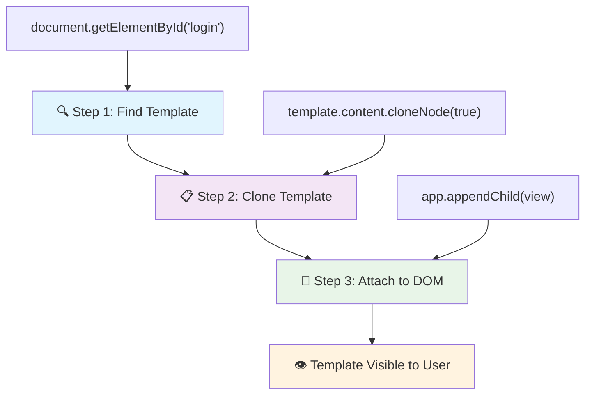
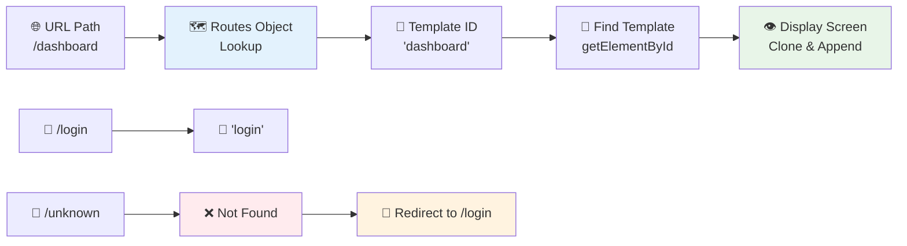
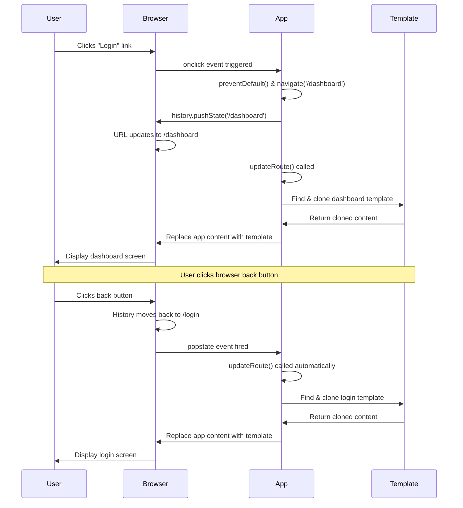
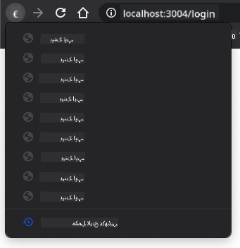

<!--
CO_OP_TRANSLATOR_METADATA:
{
  "original_hash": "5d259f6962464ad91e671083aa0398f4",
  "translation_date": "2025-10-22T15:02:13+00:00",
  "source_file": "7-bank-project/1-template-route/README.md",
  "language_code": "ur"
}
-->
# بینکنگ ایپ بنائیں حصہ 1: ویب ایپ میں HTML ٹیمپلیٹس اور روٹس

جب اپولو 11 کا گائیڈنس کمپیوٹر 1969 میں چاند کی طرف روانہ ہوا، تو اسے مختلف پروگرامز کے درمیان سوئچ کرنا پڑا بغیر پورے سسٹم کو دوبارہ شروع کیے۔ جدید ویب ایپلیکیشنز بھی اسی طرح کام کرتی ہیں – وہ آپ کو جو کچھ دکھاتی ہیں اسے تبدیل کرتی ہیں بغیر سب کچھ دوبارہ لوڈ کیے۔ یہ وہ ہموار اور جوابدہ تجربہ پیدا کرتا ہے جس کی صارفین آج توقع کرتے ہیں۔

روایتی ویب سائٹس کے برعکس جو ہر تعامل کے لیے پورے صفحات کو دوبارہ لوڈ کرتی ہیں، جدید ویب ایپس صرف ان حصوں کو اپ ڈیٹ کرتی ہیں جنہیں تبدیل کرنے کی ضرورت ہوتی ہے۔ یہ طریقہ، بالکل اسی طرح جیسے مشن کنٹرول مختلف ڈسپلے کے درمیان سوئچ کرتا ہے جبکہ مستقل مواصلات کو برقرار رکھتا ہے، وہ ہموار تجربہ پیدا کرتا ہے جس کی ہم توقع کرتے ہیں۔

یہ فرق اتنا ڈرامائی کیوں ہے:

| روایتی ملٹی پیج ایپس | جدید سنگل پیج ایپس |
|----------------------------|-------------------------|
| **نیویگیشن** | ہر اسکرین کے لیے پورے صفحے کو دوبارہ لوڈ کرنا | فوری مواد کی تبدیلی |
| **کارکردگی** | مکمل HTML ڈاؤن لوڈز کی وجہ سے سست | جزوی اپ ڈیٹس کے ساتھ تیز |
| **صارف کا تجربہ** | جھٹکے دار صفحے کی جھلکیاں | ہموار، ایپ جیسی منتقلی |
| **ڈیٹا شیئرنگ** | صفحات کے درمیان مشکل | آسان اسٹیٹ مینجمنٹ |
| **ترقی** | متعدد HTML فائلوں کو برقرار رکھنا | متحرک ٹیمپلیٹس کے ساتھ ایک HTML |

**ارتقاء کو سمجھنا:**
- **روایتی ایپس** ہر نیویگیشن ایکشن کے لیے سرور کی درخواستیں کرتی ہیں
- **جدید SPAs** ایک بار لوڈ ہوتی ہیں اور جاوا اسکرپٹ کا استعمال کرتے ہوئے مواد کو متحرک طور پر اپ ڈیٹ کرتی ہیں
- **صارف کی توقعات** اب فوری، ہموار تعاملات کو ترجیح دیتی ہیں
- **کارکردگی کے فوائد** میں کم بینڈوتھ اور تیز ردعمل شامل ہیں

اس سبق میں، ہم ایک بینکنگ ایپ بنائیں گے جس میں متعدد اسکرینز ہوں گی جو بغیر کسی رکاوٹ کے ایک ساتھ بہتی ہیں۔ جیسے سائنسدان مختلف تجربات کے لیے دوبارہ ترتیب دینے کے قابل ماڈیولر آلات استعمال کرتے ہیں، ہم HTML ٹیمپلیٹس کو دوبارہ قابل استعمال اجزاء کے طور پر استعمال کریں گے جنہیں ضرورت کے مطابق دکھایا جا سکتا ہے۔

آپ HTML ٹیمپلیٹس (مختلف اسکرینز کے لیے دوبارہ قابل استعمال بلیو پرنٹس)، جاوا اسکرپٹ روٹنگ (اسکرینز کے درمیان سوئچ کرنے کا نظام)، اور براؤزر کی ہسٹری API (جو بیک بٹن کو توقع کے مطابق کام کرتا ہے) کے ساتھ کام کریں گے۔ یہ وہی بنیادی تکنیکیں ہیں جو فریم ورک جیسے React، Vue، اور Angular استعمال کرتے ہیں۔

آخر میں، آپ کے پاس ایک کام کرنے والی بینکنگ ایپ ہوگی جو پیشہ ور سنگل پیج ایپلیکیشن اصولوں کو ظاہر کرتی ہے۔

## پری لیکچر کوئز

[پری لیکچر کوئز](https://ff-quizzes.netlify.app/web/quiz/41)

### آپ کو کیا چاہیے ہوگا

ہمیں اپنی بینکنگ ایپ کو ٹیسٹ کرنے کے لیے ایک مقامی ویب سرور کی ضرورت ہوگی – فکر نہ کریں، یہ اتنا مشکل نہیں ہے جتنا لگتا ہے! اگر آپ کے پاس پہلے سے کوئی سیٹ اپ نہیں ہے، تو بس [Node.js](https://nodejs.org) انسٹال کریں اور اپنے پروجیکٹ فولڈر سے `npx lite-server` چلائیں۔ یہ آسان کمانڈ ایک مقامی سرور کو چلاتا ہے اور خود بخود آپ کی ایپ کو براؤزر میں کھولتا ہے۔

### تیاری

اپنے کمپیوٹر پر، `bank` نامی ایک فولڈر بنائیں جس میں `index.html` نامی ایک فائل ہو۔ ہم اس HTML [بوائلر پلیٹ](https://en.wikipedia.org/wiki/Boilerplate_code) سے شروع کریں گے:

```html
<!DOCTYPE html>
<html lang="en">
  <head>
    <meta charset="UTF-8">
    <meta name="viewport" content="width=device-width, initial-scale=1.0">
    <title>Bank App</title>
  </head>
  <body>
    <!-- This is where you'll work -->
  </body>
</html>
```

**یہ بوائلر پلیٹ فراہم کرتا ہے:**
- **HTML5 دستاویز کی ساخت** کو مناسب DOCTYPE اعلان کے ساتھ قائم کرتا ہے
- **کریکٹر انکوڈنگ** کو UTF-8 کے طور پر ترتیب دیتا ہے تاکہ بین الاقوامی متن کی حمایت ہو
- **ریسپانسیو ڈیزائن** کو موبائل مطابقت کے لیے ویوپورٹ میٹا ٹیگ کے ساتھ فعال کرتا ہے
- **ایک وضاحتی عنوان** سیٹ کرتا ہے جو براؤزر ٹیب میں ظاہر ہوتا ہے
- **ایک صاف باڈی سیکشن** بناتا ہے جہاں ہم اپنی ایپلیکیشن بنائیں گے

> 📁 **پروجیکٹ کی ساخت کا پیش نظارہ**
> 
> **اس سبق کے آخر میں، آپ کے پروجیکٹ میں شامل ہوگا:**
> ```
> bank/
> ├── index.html      <!-- Main HTML with templates -->
> ├── app.js          <!-- Routing and navigation logic -->
> └── style.css       <!-- (Optional for future lessons) -->
> ```
> 
> **فائل کی ذمہ داریاں:**
> - **index.html**: تمام ٹیمپلیٹس پر مشتمل ہے اور ایپ کی ساخت فراہم کرتا ہے
> - **app.js**: روٹنگ، نیویگیشن، اور ٹیمپلیٹ مینجمنٹ کو ہینڈل کرتا ہے
> - **Templates**: لاگ ان، ڈیش بورڈ، اور دیگر اسکرینز کے لیے UI کی وضاحت کرتا ہے

---

## HTML ٹیمپلیٹس

ٹیمپلیٹس ویب ڈویلپمنٹ میں ایک بنیادی مسئلہ حل کرتے ہیں۔ جب گٹنبرگ نے 1440 کی دہائی میں مووایبل ٹائپ پرنٹنگ ایجاد کی، تو انہوں نے محسوس کیا کہ پورے صفحات کو تراشنے کے بجائے، وہ دوبارہ قابل استعمال حرفی بلاکس بنا سکتے ہیں اور انہیں ضرورت کے مطابق ترتیب دے سکتے ہیں۔ HTML ٹیمپلیٹس اسی اصول پر کام کرتے ہیں – ہر اسکرین کے لیے الگ HTML فائلیں بنانے کے بجائے، آپ دوبارہ قابل استعمال ڈھانچے کی وضاحت کرتے ہیں جنہیں ضرورت کے وقت دکھایا جا سکتا ہے۔

ٹیمپلیٹس کو اپنی ایپ کے مختلف حصوں کے لیے بلیو پرنٹس کے طور پر سوچیں۔ جیسے ایک آرکیٹیکٹ ایک بلیو پرنٹ بناتا ہے اور اسے متعدد بار استعمال کرتا ہے بجائے اس کے کہ ایک جیسے کمرے دوبارہ بنائے، ہم ٹیمپلیٹس ایک بار بناتے ہیں اور ضرورت کے مطابق انہیں استعمال کرتے ہیں۔ براؤزر ان ٹیمپلیٹس کو چھپائے رکھتا ہے جب تک کہ جاوا اسکرپٹ انہیں فعال نہ کرے۔

اگر آپ کسی ویب صفحے کے لیے متعدد اسکرینز بنانا چاہتے ہیں، تو ایک حل یہ ہوگا کہ آپ ہر اسکرین کے لیے ایک HTML فائل بنائیں جسے آپ دکھانا چاہتے ہیں۔ تاہم، یہ حل کچھ مشکلات کے ساتھ آتا ہے:

- اسکرین سوئچ کرتے وقت آپ کو پورے HTML کو دوبارہ لوڈ کرنا پڑتا ہے، جو سست ہو سکتا ہے۔
- مختلف اسکرینز کے درمیان ڈیٹا شیئر کرنا مشکل ہے۔

ایک اور طریقہ یہ ہے کہ صرف ایک HTML فائل ہو، اور متعدد [HTML ٹیمپلیٹس](https://developer.mozilla.org/docs/Web/HTML/Element/template) کو `<template>` عنصر کا استعمال کرتے ہوئے بیان کریں۔ ایک ٹیمپلیٹ ایک دوبارہ قابل استعمال HTML بلاک ہے جو براؤزر کے ذریعے ظاہر نہیں کیا جاتا، اور اسے جاوا اسکرپٹ کا استعمال کرتے ہوئے رن ٹائم پر انسٹیٹیوٹ کرنا پڑتا ہے۔

### آئیے اسے بنائیں

ہم ایک بینک ایپ بنانے جا رہے ہیں جس میں دو اہم اسکرینز ہوں گی: ایک لاگ ان صفحہ اور ایک ڈیش بورڈ۔ پہلے، آئیے اپنے HTML باڈی میں ایک پلیس ہولڈر عنصر شامل کریں – یہ وہ جگہ ہے جہاں ہماری مختلف اسکرینز ظاہر ہوں گی:

```html
<div id="app">Loading...</div>
```

**اس پلیس ہولڈر کو سمجھنا:**
- **ایک کنٹینر بناتا ہے** جس کا ID "app" ہے جہاں تمام اسکرینز دکھائی جائیں گی
- **ایک لوڈنگ پیغام دکھاتا ہے** جب تک جاوا اسکرپٹ پہلی اسکرین کو شروع نہیں کرتا
- **ہمارے متحرک مواد کے لیے ایک واحد ماؤنٹنگ پوائنٹ فراہم کرتا ہے**
- **جاوا اسکرپٹ کے ذریعے آسانی سے ہدف بناتا ہے** `document.getElementById()` کا استعمال کرتے ہوئے

> 💡 **پرو ٹپ**: چونکہ اس عنصر کا مواد تبدیل کیا جائے گا، ہم اس میں ایک لوڈنگ پیغام یا اشارہ ڈال سکتے ہیں جو ایپ کے لوڈ ہونے کے دوران دکھایا جائے گا۔

اگلا، آئیے لاگ ان صفحے کے لیے HTML ٹیمپلیٹ کو نیچے شامل کریں۔ فی الحال ہم وہاں صرف ایک عنوان اور ایک سیکشن ڈالیں گے جس میں ایک لنک ہوگا جسے ہم نیویگیشن انجام دینے کے لیے استعمال کریں گے۔

```html
<template id="login">
  <h1>Bank App</h1>
  <section>
    <a href="/dashboard">Login</a>
  </section>
</template>
```

**اس لاگ ان ٹیمپلیٹ کو توڑ کر سمجھنا:**
- **ایک ٹیمپلیٹ کی وضاحت کرتا ہے** جس کا منفرد شناخت کنندہ "login" ہے جاوا اسکرپٹ کے ہدف کے لیے
- **ایک مرکزی عنوان شامل کرتا ہے** جو ایپ کی برانڈنگ قائم کرتا ہے
- **ایک سیمینٹک `<section>` عنصر پر مشتمل ہے** جو متعلقہ مواد کو گروپ کرتا ہے
- **ایک نیویگیشن لنک فراہم کرتا ہے** جو صارفین کو ڈیش بورڈ پر لے جائے گا

پھر ہم ڈیش بورڈ صفحے کے لیے ایک اور HTML ٹیمپلیٹ شامل کریں گے۔ اس صفحے میں مختلف سیکشنز ہوں گے:

- ایک ہیڈر جس میں ایک عنوان اور ایک لاگ آؤٹ لنک ہوگا
- بینک اکاؤنٹ کا موجودہ بیلنس
- ایک ٹیبل میں دکھائی جانے والی ٹرانزیکشنز کی فہرست

```html
<template id="dashboard">
  <header>
    <h1>Bank App</h1>
    <a href="/login">Logout</a>
  </header>
  <section>
    Balance: 100$
  </section>
  <section>
    <h2>Transactions</h2>
    <table>
      <thead>
        <tr>
          <th>Date</th>
          <th>Object</th>
          <th>Amount</th>
        </tr>
      </thead>
      <tbody></tbody>
    </table>
  </section>
</template>
```

**آئیے ڈیش بورڈ کے ہر حصے کو سمجھیں:**
- **صفحے کو ایک سیمینٹک `<header>` عنصر کے ساتھ ترتیب دیتا ہے** جس میں نیویگیشن شامل ہے
- **ایپ کا عنوان مستقل طور پر اسکرینز کے پار دکھاتا ہے** برانڈنگ کے لیے
- **ایک لاگ آؤٹ لنک فراہم کرتا ہے** جو لاگ ان اسکرین پر واپس جاتا ہے
- **موجودہ اکاؤنٹ بیلنس کو ایک مخصوص سیکشن میں دکھاتا ہے**
- **ٹرانزیکشن ڈیٹا کو ایک مناسب طور پر ساختہ HTML ٹیبل کا استعمال کرتے ہوئے منظم کرتا ہے**
- **تاریخ، اشیاء، اور رقم کے کالمز کے لیے ٹیبل ہیڈرز کی وضاحت کرتا ہے**
- **ٹیبل باڈی کو خالی چھوڑتا ہے** تاکہ بعد میں متحرک مواد داخل کیا جا سکے

> 💡 **پرو ٹپ**: جب HTML ٹیمپلیٹس بناتے ہیں، اگر آپ دیکھنا چاہتے ہیں کہ یہ کیسا نظر آئے گا، تو آپ `<template>` اور `</template>` لائنز کو `<!-- -->` کے ساتھ تبصرہ کر سکتے ہیں۔

✅ آپ کے خیال میں ہم ٹیمپلیٹس پر `id` ایٹریبیوٹس کیوں استعمال کرتے ہیں؟ کیا ہم کچھ اور جیسے کلاسز استعمال کر سکتے ہیں؟

## جاوا اسکرپٹ کے ساتھ ٹیمپلیٹس کو زندہ کرنا

اب ہمیں اپنے ٹیمپلیٹس کو فعال بنانا ہوگا۔ جیسے ایک 3D پرنٹر ایک ڈیجیٹل بلیو پرنٹ لیتا ہے اور ایک جسمانی شے بناتا ہے، جاوا اسکرپٹ ہمارے چھپے ہوئے ٹیمپلیٹس لیتا ہے اور نظر آنے والے، انٹرایکٹو عناصر بناتا ہے جنہیں صارفین دیکھ اور استعمال کر سکتے ہیں۔

یہ عمل تین مستقل مراحل پر عمل کرتا ہے جو جدید ویب ڈویلپمنٹ کی بنیاد بناتے ہیں۔ ایک بار جب آپ اس پیٹرن کو سمجھ لیں، تو آپ اسے بہت سے فریم ورک اور لائبریریوں میں پہچان لیں گے۔

اگر آپ اپنے موجودہ HTML فائل کو براؤزر میں آزمائیں، تو آپ دیکھیں گے کہ یہ `Loading...` دکھانے پر پھنس جاتا ہے۔ اس کی وجہ یہ ہے کہ ہمیں کچھ جاوا اسکرپٹ کوڈ شامل کرنے کی ضرورت ہے تاکہ HTML ٹیمپلیٹس کو انسٹیٹیوٹ اور ظاہر کیا جا سکے۔

ٹیمپلیٹ کو انسٹیٹیوٹ کرنا عام طور پر 3 مراحل میں کیا جاتا ہے:

1. DOM میں ٹیمپلیٹ عنصر کو حاصل کریں، مثال کے طور پر [`document.getElementById`](https://developer.mozilla.org/docs/Web/API/Document/getElementById) کا استعمال کرتے ہوئے۔
2. ٹیمپلیٹ عنصر کو کلون کریں، [`cloneNode`](https://developer.mozilla.org/docs/Web/API/Node/cloneNode) کا استعمال کرتے ہوئے۔
3. اسے DOM کے تحت ایک نظر آنے والے عنصر سے منسلک کریں، مثال کے طور پر [`appendChild`](https://developer.mozilla.org/docs/Web/API/Node/appendChild) کا استعمال کرتے ہوئے۔



**عمل کا بصری تجزیہ:**
- **مرحلہ 1** DOM ساخت میں چھپے ہوئے ٹیمپلیٹ کو تلاش کرتا ہے
- **مرحلہ 2** ایک کام کرنے والی کاپی بناتا ہے جسے محفوظ طریقے سے تبدیل کیا جا سکتا ہے
- **مرحلہ 3** کاپی کو نظر آنے والے صفحے کے علاقے میں داخل کرتا ہے
- **نتیجہ** ایک فعال اسکرین ہے جس کے ساتھ صارف تعامل کر سکتے ہیں

✅ ہمیں ٹیمپلیٹ کو DOM میں منسلک کرنے سے پہلے کلون کرنے کی ضرورت کیوں ہے؟ آپ کے خیال میں اگر ہم اس مرحلے کو چھوڑ دیں تو کیا ہوگا؟

### کام

اپنے پروجیکٹ فولڈر میں `app.js` نامی ایک نئی فائل بنائیں اور اپنے HTML کے `<head>` سیکشن میں اس فائل کو امپورٹ کریں:

```html
<script src="app.js" defer></script>
```

**اس اسکرپٹ امپورٹ کو سمجھنا:**
- **جاوا اسکرپٹ فائل کو ہمارے HTML دستاویز سے لنک کرتا ہے**
- **`defer` ایٹریبیوٹ کا استعمال کرتا ہے** تاکہ اسکرپٹ HTML پارسنگ مکمل ہونے کے بعد چلے
- **تمام DOM عناصر تک رسائی کو فعال کرتا ہے** کیونکہ وہ اسکرپٹ کے عمل سے پہلے مکمل طور پر لوڈ ہو چکے ہیں
- **اسکرپٹ لوڈنگ اور کارکردگی کے لیے جدید بہترین طریقوں پر عمل کرتا ہے**

اب `app.js` میں، ہم ایک نیا فنکشن `updateRoute` بنائیں گے:

```js
function updateRoute(templateId) {
  const template = document.getElementById(templateId);
  const view = template.content.cloneNode(true);
  const app = document.getElementById('app');
  app.innerHTML = '';
  app.appendChild(view);
}
```

**مرحلہ وار، یہاں کیا ہو رہا ہے:**
- **ٹیمپلیٹ عنصر کو اس کے منفرد ID کا استعمال کرتے ہوئے تلاش کرتا ہے**
- **ٹیمپلیٹ کے مواد کی ایک گہری کاپی بناتا ہے** `cloneNode(true)` کا استعمال کرتے ہوئے
- **ایپ کنٹینر کو تلاش کرتا ہے** جہاں مواد دکھایا جائے گا
- **ایپ کنٹینر سے کسی بھی موجودہ مواد کو صاف کرتا ہے**
- **کلون شدہ ٹیمپلیٹ مواد کو نظر آنے والے DOM میں داخل کرتا ہے**

اب اس فنکشن کو ٹیمپلیٹ میں سے ایک کے ساتھ کال کریں اور نتیجہ دیکھیں۔

```js
updateRoute('login');
```

**یہ فنکشن کال کیا حاصل کرتا ہے:**
- **لاگ ان ٹیمپلیٹ کو فعال کرتا ہے** اس کے ID کو پیرامیٹر کے طور پر پاس کر کے
- **مختلف ایپ اسکرینز کے درمیان پروگرام کے ذریعے سوئچ کرنے کا مظاہرہ کرتا ہے**
- **"Loading..." پیغام کی جگہ لاگ ان اسکرین دکھاتا ہے**

✅ اس کوڈ کا مقصد کیا ہے `app.innerHTML = '';`؟ اس کے بغیر کیا ہوتا ہے؟

## روٹس بنانا

روٹنگ بنیادی طور پر URLs کو صحیح مواد سے جوڑنے کے بارے میں ہے۔ غور کریں کہ ابتدائی ٹیلیفون آپریٹرز کالز کو جوڑنے کے لیے سوئچ بورڈز کا استعمال کرتے تھے – وہ ایک آنے والی درخواست لیتے اور اسے صحیح منزل پر بھیجتے۔ ویب روٹنگ اسی طرح کام کرتی ہے، ایک URL درخواست لیتا ہے اور طے کرتا ہے کہ کون سا مواد دکھانا ہے۔

روایتی طور پر، ویب سرورز نے مختلف URLs کے لیے مختلف HTML فائلیں فراہم کر کے اس کو ہینڈل کیا۔ چونکہ ہم ایک سنگل پیج ایپ بنا رہے ہیں، ہمیں جاوا اسکرپٹ کے ساتھ اس روٹنگ کو خود ہینڈل کرنے کی ضرورت ہے۔ یہ طریقہ ہمیں صارف کے تجربے اور کارکردگی پر زیادہ کنٹرول دیتا ہے۔



**روٹنگ کے بہاؤ کو سمجھنا:**
- **URL میں تبدیلیاں** ہمارے روٹس کنفیگریشن میں ایک تلاش کو متحرک کرتی ہیں
- **درست روٹس** مخصوص ٹیمپلیٹ IDs کے لیے میپ کرتے ہیں تاکہ رینڈرنگ ہو سکے
- **غلط روٹس** فال بیک رویے کو متحرک کرتے ہیں تاکہ خراب حالتوں کو روکا جا سکے
- **ٹیمپلیٹ رینڈرنگ** وہی تین مرحلے کا عمل اپناتا ہے جو ہم نے پہلے سیکھا تھا

جب کسی ویب ایپ کی بات کرتے ہیں، تو ہم *روٹنگ* کو URLs کو مخصوص اسکرینز سے میپ کرنے کے ارادے کے طور پر کہتے ہیں جو دکھائی جانی چاہیے۔ ایک ویب سائٹ جس میں متعدد HTML فائلیں ہوں، یہ خود بخود کیا جاتا ہے کیونکہ فائل کے راستے URL پر ظاہر ہوتے ہیں۔ مثال کے طور پر، آپ کے پروجیکٹ فولڈر میں ان فائلوں کے ساتھ:

```
mywebsite/index.html
mywebsite/login.html
mywebsite/admin/index.html
```

اگر آپ `mywebsite` کو روٹ کے طور پر لے کر ایک ویب سرور بناتے ہیں، تو URL میپنگ ہوگی:

```
https://site.com            --> mywebsite/index.html
https://site.com/login.html --> mywebsite/login.html
https://site.com/admin/     --> mywebsite/admin/index.html
```

تاہم، ہماری ویب ایپ کے لیے ہم ایک واحد HTML فائل استعمال کر رہے ہیں جس میں تمام اسکرینز شامل ہیں، لہذا یہ ڈیفالٹ رویہ ہماری مدد نہیں کرے گا۔ ہمیں اس میپ کو دستی طور پر بنانا ہوگا اور جاوا اسکرپٹ کا استعمال کرتے ہوئے دکھائے گئے ٹیمپلیٹ کو اپ ڈیٹ کرنا ہوگا۔

### کام

ہم ایک
✅ اگر آپ URL میں کوئی نامعلوم راستہ درج کریں تو کیا ہوتا ہے؟ ہم اسے کیسے حل کر سکتے ہیں؟

## نیویگیشن شامل کرنا

جب روٹنگ قائم ہو جائے، تو صارفین کو ایپ کے اندر نیویگیٹ کرنے کا طریقہ چاہیے۔ روایتی ویب سائٹس لنکس پر کلک کرنے پر پورے صفحات کو دوبارہ لوڈ کرتی ہیں، لیکن ہم URL اور مواد کو بغیر صفحہ ریفریش کیے اپ ڈیٹ کرنا چاہتے ہیں۔ یہ ایک ہموار تجربہ فراہم کرتا ہے، جیسے ڈیسک ٹاپ ایپلیکیشنز مختلف ویوز کے درمیان سوئچ کرتی ہیں۔

ہمیں دو چیزوں کو ہم آہنگ کرنے کی ضرورت ہے: براؤزر کے URL کو اپ ڈیٹ کرنا تاکہ صارفین صفحات کو بک مارک کر سکیں اور لنکس شیئر کر سکیں، اور مناسب مواد کو ظاہر کرنا۔ جب صحیح طریقے سے نافذ کیا جائے، تو یہ وہ ہموار نیویگیشن فراہم کرتا ہے جس کی توقع صارفین جدید ایپلیکیشنز سے کرتے ہیں۔

> 🏗️ **آرکیٹیکچر بصیرت**: نیویگیشن سسٹم کے اجزاء
>
> **آپ کیا بنا رہے ہیں:**
> - **🔄 URL مینجمنٹ**: صفحہ دوبارہ لوڈ کیے بغیر براؤزر ایڈریس بار کو اپ ڈیٹ کرتا ہے
> - **📋 ٹیمپلیٹ سسٹم**: موجودہ روٹ کی بنیاد پر مواد کو متحرک طور پر تبدیل کرتا ہے  
> - **📚 ہسٹری انٹیگریشن**: براؤزر کے بیک/فارورڈ بٹن کی فعالیت کو برقرار رکھتا ہے
> - **🛡️ ایرر ہینڈلنگ**: غلط یا گمشدہ راستوں کے لیے شائستہ متبادل فراہم کرتا ہے
>
> **اجزاء کیسے مل کر کام کرتے ہیں:**
> - نیویگیشن ایونٹس (کلکس، ہسٹری تبدیلیاں) کو **سنتا ہے**
> - ہسٹری API کا استعمال کرتے ہوئے URL کو **اپ ڈیٹ کرتا ہے**
> - نئے روٹ کے لیے مناسب ٹیمپلیٹ کو **رینڈر کرتا ہے**
> - پورے تجربے کو ہموار **برقرار رکھتا ہے**

ہماری ایپ کے لیے اگلا قدم یہ ہے کہ صفحات کے درمیان نیویگیٹ کرنے کی صلاحیت شامل کی جائے بغیر URL کو دستی طور پر تبدیل کیے۔ اس کا مطلب دو چیزیں ہیں:

  1. موجودہ URL کو اپ ڈیٹ کرنا
  2. نئے URL کی بنیاد پر ظاہر کردہ ٹیمپلیٹ کو اپ ڈیٹ کرنا

ہم نے پہلے ہی `updateRoute` فنکشن کے ساتھ دوسرے حصے کا خیال رکھا ہے، لہذا ہمیں موجودہ URL کو اپ ڈیٹ کرنے کا طریقہ معلوم کرنا ہوگا۔

ہمیں جاوا اسکرپٹ اور خاص طور پر [`history.pushState`](https://developer.mozilla.org/docs/Web/API/History/pushState) کا استعمال کرنا ہوگا جو HTML کو دوبارہ لوڈ کیے بغیر URL کو اپ ڈیٹ کرنے اور براؤزنگ ہسٹری میں ایک نیا اندراج بنانے کی اجازت دیتا ہے۔

> ⚠️ **اہم نوٹ**: جبکہ HTML اینکر عنصر [`<a href>`](https://developer.mozilla.org/docs/Web/HTML/Element/a) کو مختلف URLs کے لیے ہائپر لنکس بنانے کے لیے خود ہی استعمال کیا جا سکتا ہے، یہ براؤزر کو ڈیفالٹ کے طور پر HTML کو دوبارہ لوڈ کرنے پر مجبور کرے گا۔ جب کسٹم جاوا اسکرپٹ کے ساتھ روٹنگ کو ہینڈل کرتے ہیں تو اس رویے کو روکنا ضروری ہے، کلک ایونٹ پر `preventDefault()` فنکشن کا استعمال کرتے ہوئے۔

### کام

آئیے ایک نیا فنکشن بناتے ہیں جسے ہم اپنی ایپ میں نیویگیٹ کرنے کے لیے استعمال کر سکتے ہیں:

```js
function navigate(path) {
  window.history.pushState({}, path, path);
  updateRoute();
}
```

**اس نیویگیشن فنکشن کو سمجھنا:**
- `history.pushState` کا استعمال کرتے ہوئے براؤزر کے URL کو نئے راستے پر **اپ ڈیٹ کرتا ہے**
- براؤزر کی ہسٹری اسٹیک میں مناسب بیک/فارورڈ بٹن سپورٹ کے لیے ایک نیا اندراج **شامل کرتا ہے**
- متعلقہ ٹیمپلیٹ کو ظاہر کرنے کے لیے `updateRoute()` فنکشن کو **ٹرگر کرتا ہے**
- صفحہ دوبارہ لوڈ کیے بغیر سنگل پیج ایپ کا تجربہ **برقرار رکھتا ہے**

یہ طریقہ پہلے دیے گئے راستے کی بنیاد پر موجودہ URL کو اپ ڈیٹ کرتا ہے، پھر ٹیمپلیٹ کو اپ ڈیٹ کرتا ہے۔ پراپرٹی `window.location.origin` URL روٹ کو واپس کرتی ہے، جو ہمیں دیے گئے راستے سے مکمل URL دوبارہ بنانے کی اجازت دیتی ہے۔

اب جب کہ ہمارے پاس یہ فنکشن ہے، ہم اس مسئلے کا خیال رکھ سکتے ہیں جو ہمارے پاس ہے اگر کوئی راستہ کسی بھی متعین روٹ سے میل نہیں کھاتا۔ ہم `updateRoute` فنکشن میں ترمیم کریں گے تاکہ اگر ہم کوئی میچ نہ پا سکیں تو موجودہ روٹ میں سے کسی ایک پر واپس جائیں۔

```js
function updateRoute() {
  const path = window.location.pathname;
  const route = routes[path];

  if (!route) {
    return navigate('/login');
  }

  const template = document.getElementById(route.templateId);
  const view = template.content.cloneNode(true);
  const app = document.getElementById('app');
  app.innerHTML = '';
  app.appendChild(view);
}
```

**یاد رکھنے کے اہم نکات:**
- موجودہ راستے کے لیے روٹ موجود ہے یا نہیں، اس کی **جانچ کرتا ہے**
- جب کسی غلط راستے تک رسائی حاصل کی جائے تو لاگ ان صفحے پر **ری ڈائریکٹ کرتا ہے**
- ایک متبادل میکانزم فراہم کرتا ہے جو خراب نیویگیشن کو روکتا ہے
- **یقینی بناتا ہے** کہ صارفین ہمیشہ ایک درست اسکرین دیکھیں، یہاں تک کہ غلط URLs کے ساتھ

اگر کوئی روٹ نہیں ملتا، تو ہم اب `login` صفحے پر ری ڈائریکٹ کریں گے۔

اب آئیے ایک فنکشن بناتے ہیں جو لنک پر کلک کرنے پر URL حاصل کرے، اور براؤزر کے ڈیفالٹ لنک رویے کو روکے:

```js
function onLinkClick(event) {
  event.preventDefault();
  navigate(event.target.href);
}
```

**اس کلک ہینڈلر کو توڑنا:**
- `preventDefault()` کا استعمال کرتے ہوئے براؤزر کے ڈیفالٹ لنک رویے کو **روکتا ہے**
- کلک کیے گئے لنک عنصر سے منزل URL کو **نکالتا ہے**
- صفحہ دوبارہ لوڈ کیے بغیر ہمارے کسٹم نیویگیٹ فنکشن کو **کال کرتا ہے**
- ہموار سنگل پیج ایپلیکیشن کا تجربہ **برقرار رکھتا ہے**

```html
<a href="/dashboard" onclick="onLinkClick(event)">Login</a>
...
<a href="/login" onclick="onLinkClick(event)">Logout</a>
```

**یہ onclick بائنڈنگ کیا حاصل کرتی ہے:**
- ہر لنک کو ہمارے کسٹم نیویگیشن سسٹم سے **جوڑتا ہے**
- کلک ایونٹ کو پروسیسنگ کے لیے ہمارے `onLinkClick` فنکشن کو **پاس کرتا ہے**
- صفحہ دوبارہ لوڈ کیے بغیر ہموار نیویگیشن کو **فعال کرتا ہے**
- مناسب URL ڈھانچے کو **برقرار رکھتا ہے** جسے صارفین بک مارک یا شیئر کر سکتے ہیں

[`onclick`](https://developer.mozilla.org/docs/Web/API/GlobalEventHandlers/onclick) ایٹریبیوٹ کلک ایونٹ کو جاوا اسکرپٹ کوڈ سے باندھتا ہے، یہاں `navigate()` فنکشن کو کال۔

ان لنکس پر کلک کرنے کی کوشش کریں، آپ کو اب اپنی ایپ کے مختلف اسکرینز کے درمیان نیویگیٹ کرنے کے قابل ہونا چاہیے۔

✅ `history.pushState` طریقہ HTML5 معیار کا حصہ ہے اور [تمام جدید براؤزرز](https://caniuse.com/?search=pushState) میں نافذ ہے۔ اگر آپ پرانے براؤزرز کے لیے ویب ایپ بنا رہے ہیں، تو آپ اس API کی جگہ ایک چال استعمال کر سکتے ہیں: راستے سے پہلے [ہیش (`#`)](https://en.wikipedia.org/wiki/URI_fragment) کا استعمال کرتے ہوئے آپ روٹنگ کو نافذ کر سکتے ہیں جو باقاعدہ اینکر نیویگیشن کے ساتھ کام کرتا ہے اور صفحہ کو دوبارہ لوڈ نہیں کرتا، کیونکہ اس کا مقصد صفحے کے اندرونی لنکس بنانا تھا۔

## بیک اور فارورڈ بٹن کام کرنا

بیک اور فارورڈ بٹن ویب براؤزنگ کے لیے بنیادی ہیں، جیسے NASA مشن کنٹرولرز خلائی مشن کے دوران پچھلے سسٹم اسٹیٹس کا جائزہ لے سکتے ہیں۔ صارفین توقع کرتے ہیں کہ یہ بٹن کام کریں، اور جب وہ نہیں کرتے، تو یہ متوقع براؤزنگ تجربے کو توڑ دیتا ہے۔

ہماری سنگل پیج ایپ کو اس کی حمایت کے لیے اضافی کنفیگریشن کی ضرورت ہے۔ براؤزر ایک ہسٹری اسٹیک کو برقرار رکھتا ہے (جس میں ہم `history.pushState` کے ساتھ شامل کر رہے ہیں)، لیکن جب صارفین اس ہسٹری کے ذریعے نیویگیٹ کرتے ہیں، تو ہماری ایپ کو ظاہر کردہ مواد کو اپ ڈیٹ کرکے جواب دینا ہوگا۔



**اہم تعامل کے نکات:**
- صارف کے اعمال کلکس یا براؤزر بٹن کے ذریعے نیویگیشن کو **ٹرگر کرتے ہیں**
- ایپ صفحہ دوبارہ لوڈ کو روکنے کے لیے لنک کلکس کو **روکتی ہے**
- ہسٹری API URL تبدیلیوں اور براؤزر ہسٹری اسٹیک کو **منظم کرتا ہے**
- ٹیمپلیٹس ہر اسکرین کے لیے مواد کا ڈھانچہ **فراہم کرتے ہیں**
- ایونٹ لسٹنرز یقینی بناتے ہیں کہ ایپ تمام نیویگیشن اقسام کا **جواب دیتی ہے**

`history.pushState` کا استعمال براؤزر کی نیویگیشن ہسٹری میں نئے اندراجات بناتا ہے۔ آپ یہ چیک کر سکتے ہیں کہ اپنے براؤزر کے *بیک بٹن* کو تھام کر، یہ کچھ اس طرح دکھائے گا:



اگر آپ بیک بٹن پر چند بار کلک کرنے کی کوشش کریں، تو آپ دیکھیں گے کہ موجودہ URL تبدیل ہوتا ہے اور ہسٹری اپ ڈیٹ ہوتی ہے، لیکن وہی ٹیمپلیٹ ظاہر ہوتا رہتا ہے۔

اس کی وجہ یہ ہے کہ ایپلیکیشن کو معلوم نہیں کہ ہمیں ہر بار ہسٹری تبدیل ہونے پر `updateRoute()` کو کال کرنے کی ضرورت ہے۔ اگر آپ [`history.pushState`](https://developer.mozilla.org/docs/Web/API/History/pushState) دستاویزات کو دیکھیں، تو آپ دیکھ سکتے ہیں کہ اگر اسٹیٹ تبدیل ہو جائے - یعنی ہم ایک مختلف URL پر چلے گئے - تو [`popstate`](https://developer.mozilla.org/docs/Web/API/Window/popstate_event) ایونٹ ٹرگر ہوتا ہے۔ ہم اس مسئلے کو حل کرنے کے لیے اس کا استعمال کریں گے۔

### کام

یہ یقینی بنانے کے لیے کہ براؤزر ہسٹری تبدیل ہونے پر ظاہر کردہ ٹیمپلیٹ اپ ڈیٹ ہو، ہم ایک نیا فنکشن منسلک کریں گے جو `updateRoute()` کو کال کرے۔ ہم یہ اپنے `app.js` فائل کے آخر میں کریں گے:

```js
window.onpopstate = () => updateRoute();
updateRoute();
```

**اس ہسٹری انٹیگریشن کو سمجھنا:**
- `popstate` ایونٹس کے لیے **سنتا ہے** جو صارفین براؤزر بٹن کے ساتھ نیویگیٹ کرتے وقت ہوتے ہیں
- ایونٹ ہینڈلر نحو کے لیے مختصر ایرو فنکشن کا **استعمال کرتا ہے**
- جب بھی ہسٹری اسٹیٹ تبدیل ہوتی ہے تو خود بخود `updateRoute()` کو **کال کرتا ہے**
- صفحہ پہلی بار لوڈ ہونے پر `updateRoute()` کو **شروع کرتا ہے**
- اس بات کو **یقینی بناتا ہے** کہ صارفین کیسے بھی نیویگیٹ کریں، صحیح ٹیمپلیٹ ظاہر ہو

> 💡 **پرو ٹپ**: ہم نے یہاں اپنے `popstate` ایونٹ ہینڈلر کو مختصر کرنے کے لیے ایک [ایرو فنکشن](https://developer.mozilla.org/docs/Web/JavaScript/Reference/Functions/Arrow_functions) استعمال کیا، لیکن ایک عام فنکشن بھی اسی طرح کام کرے گا۔

ایرو فنکشنز پر ایک تازہ کاری ویڈیو یہاں ہے:

[](https://youtube.com/watch?v=OP6eEbOj2sc "ایرو فنکشنز")

> 🎥 اوپر دی گئی تصویر پر کلک کریں ایرو فنکشنز کے بارے میں ویڈیو کے لیے۔

اب اپنے براؤزرز کے بیک اور فارورڈ بٹن استعمال کرنے کی کوشش کریں، اور چیک کریں کہ اس بار ظاہر کردہ روٹ صحیح طریقے سے اپ ڈیٹ ہو رہا ہے۔

---

## GitHub Copilot Agent چیلنج 🚀

ایجنٹ موڈ کا استعمال کرتے ہوئے درج ذیل چیلنج مکمل کریں:

**تفصیل:** بینکنگ ایپ کو بہتر بنائیں، غلط راستوں کے لیے ایرر ہینڈلنگ اور 404 صفحہ ٹیمپلیٹ نافذ کرکے، غیر موجود صفحات پر نیویگیٹ کرتے وقت صارف کے تجربے کو بہتر بنائیں۔

**پرومپٹ:** ایک نیا HTML ٹیمپلیٹ بنائیں جس کا id "not-found" ہو، جو ایک صارف دوست 404 ایرر صفحہ اسٹائلنگ کے ساتھ ظاہر کرے۔ پھر جاوا اسکرپٹ روٹنگ منطق میں ترمیم کریں تاکہ صارفین کو غلط URLs پر نیویگیٹ کرنے پر یہ ٹیمپلیٹ دکھایا جائے، اور ایک "گو ہوم" بٹن شامل کریں جو لاگ ان صفحے پر واپس نیویگیٹ کرے۔

[ایجنٹ موڈ](https://code.visualstudio.com/blogs/2025/02/24/introducing-copilot-agent-mode) کے بارے میں مزید جانیں۔

## 🚀 چیلنج

اس ایپ کے کریڈٹس دکھانے کے لیے ایک تیسرے صفحے کے لیے نیا ٹیمپلیٹ اور روٹ شامل کریں۔

**چیلنج کے اہداف:**
- مناسب مواد کے ڈھانچے کے ساتھ ایک نیا HTML ٹیمپلیٹ **بنائیں**
- اپنے روٹس کنفیگریشن آبجیکٹ میں نیا روٹ **شامل کریں**
- کریڈٹس صفحے کے لیے اور اس سے نیویگیشن لنکس **شامل کریں**
- تمام نیویگیشن کو براؤزر ہسٹری کے ساتھ صحیح طریقے سے کام کرنے کا **ٹیسٹ کریں**

## لیکچر کے بعد کوئز

[لیکچر کے بعد کوئز](https://ff-quizzes.netlify.app/web/quiz/42)

## جائزہ اور خود مطالعہ

روٹنگ ویب ڈویلپمنٹ کے حیرت انگیز طور پر مشکل حصوں میں سے ایک ہے، خاص طور پر جب ویب صفحہ ریفریش رویوں سے سنگل پیج ایپلیکیشن صفحہ ریفریشز کی طرف بڑھتا ہے۔ [Azure Static Web App سروس](https://docs.microsoft.com/azure/static-web-apps/routes/?WT.mc_id=academic-77807-sagibbon) روٹنگ کو کیسے ہینڈل کرتی ہے اس کے بارے میں تھوڑا پڑھیں۔ کیا آپ وضاحت کر سکتے ہیں کہ اس دستاویز میں بیان کردہ کچھ فیصلے کیوں ضروری ہیں؟

**اضافی سیکھنے کے وسائل:**
- **ایکسپلور کریں** کہ کس طرح مشہور فریم ورک جیسے React Router اور Vue Router کلائنٹ سائیڈ روٹنگ کو نافذ کرتے ہیں
- **ریسرچ کریں** ہیش پر مبنی روٹنگ اور ہسٹری API روٹنگ کے درمیان فرق
- **سیکھیں** سرور سائیڈ رینڈرنگ (SSR) کے بارے میں اور یہ روٹنگ حکمت عملیوں کو کیسے متاثر کرتا ہے
- **تحقیق کریں** کہ پروگریسو ویب ایپس (PWAs) روٹنگ اور نیویگیشن کو کیسے ہینڈل کرتے ہیں

## اسائنمنٹ

[روٹنگ کو بہتر بنائیں](assignment.md)

---

**ڈسکلیمر**:  
یہ دستاویز AI ترجمہ سروس [Co-op Translator](https://github.com/Azure/co-op-translator) کا استعمال کرتے ہوئے ترجمہ کی گئی ہے۔ ہم درستگی کے لیے کوشش کرتے ہیں، لیکن براہ کرم آگاہ رہیں کہ خودکار ترجمے میں غلطیاں یا غیر درستیاں ہو سکتی ہیں۔ اصل دستاویز کو اس کی اصل زبان میں مستند ذریعہ سمجھا جانا چاہیے۔ اہم معلومات کے لیے، پیشہ ور انسانی ترجمہ کی سفارش کی جاتی ہے۔ ہم اس ترجمے کے استعمال سے پیدا ہونے والی کسی بھی غلط فہمی یا غلط تشریح کے ذمہ دار نہیں ہیں۔